# QML 概述

在创建图形用户界面（GUI）时，你可以采取各种方法并做出设计决策。其中之一是使用**Qt 建模语言**（**QML**）实现来创建 GUI。本章将探讨 QML 的基础知识，揭示最常用的类型，并以一些使用 QML 构建应用程序的实践结束。

在本章中，我们将涵盖以下主题：

+   QML 简介

+   QML 的基本语法

+   语言和引擎

+   QML 样式

+   QML 动画

# 关于 QML

QML 是一种 UI 标记语言，是一种类似于 CSS 和 JSON 的多范式声明性语言。它用于设计具有 GUI 的应用程序。QML 很受欢迎，对于创建高质量的 GUI 非常重要。QML 是一种允许开发者用其视觉组件以及它们如何相互交互和关联来描述不同界面的语言。

QML 是一种高度可读的语言，允许组件动态地相互连接。在这种情况下，组件将在 UI 中重用和定制。QML 提供了一种可读的、类似 JSON 的声明性语法，并支持命令式 JavaScript 表达式，结合动态属性绑定。应用程序功能可以通过 JavaScript 进行脚本化。QML 使用 Qt，这使得 Qt 功能可以从 QML 应用程序中访问。在 Qt 框架中，QML 语言和引擎基础设施由`QtQml`模块提供。为了完全理解 QML，建议阅读官方 Qt 文档（[`doc.qt.io`](https://doc.qt.io)）。

本章将展示许多 QML 示例，这些示例将以 QML 文件中的脚本形式展示。常用的模块如`QtQML`和`QtQuick`（将在第三章“Qt Quick 库”中讨论）将展示如何使用 Qt 实现 QML。要运行 QML 脚本并显示结果，你可以使用 Qt Creator。为此，你需要执行以下步骤：

1.  在`App/`文件夹内创建一个名为`Qt/`的目录，例如，`App/Qt/`。

1.  打开 Qt Creator 并导航到文件 | 新文件或项目：

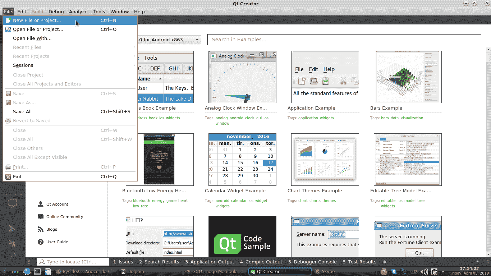

1.  导航到选择模板 | 应用程序 | 空 Qt Quick 应用程序并点击“选择...”：

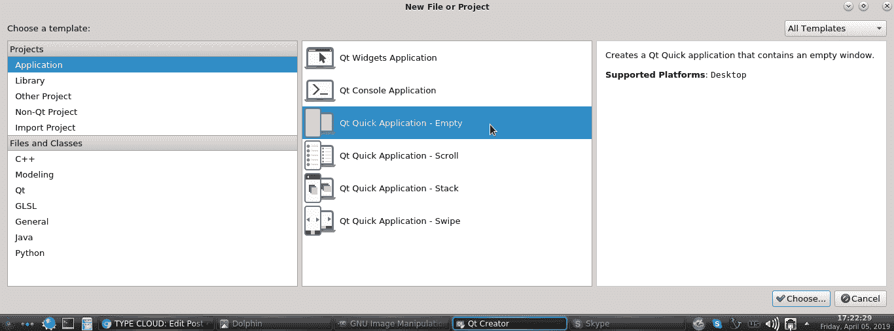

1.  将名称设置为`qml1`并在“创建在”字段中输入`Path/To/The/App/Qt/`：

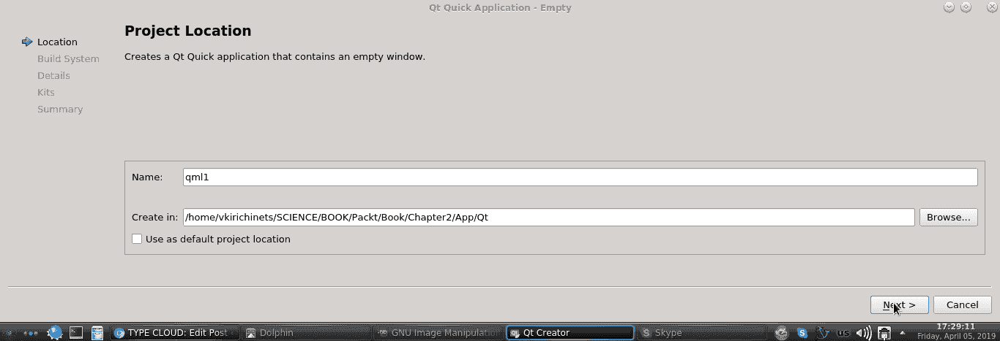

1.  点击后续窗口中的“下一步”，并在到达“工具包”窗口时选择所有工具包。然后，点击“下一步”和“完成”。

1.  将`Rectangle` QML 类型添加到`main.qml`文件中的`Window` QML 类型内。

1.  点击“构建项目”按钮。

1.  最后，点击“运行”按钮：

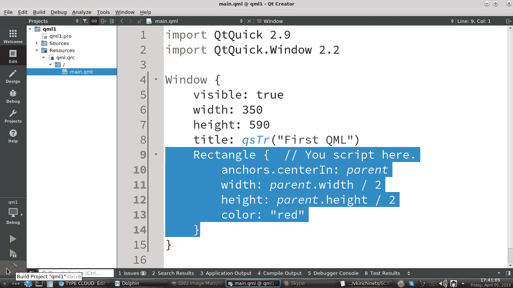

以下截图显示了前面代码的输出：

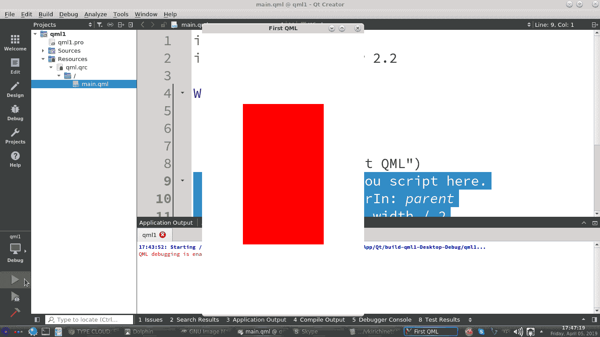

或者，您也可以使用 Python。要使用 Python 和 PyQt5 绑定（也可以使用 PySide2）运行这些示例，您需要在`App/`目录内创建一个文件，例如`u_qml.qml`，如第一章，“Python 和 Qt 介绍”中所述，然后在`u_app.py`和`u_tools.py`文件中进行一些更改。

`u_tools.py`文件中的更改如下：

```py
# -*- coding: utf-8 -*-
from PyQt5.QtCore import QUrl
from PyQt5.QtQml import QQmlApplicationEngine

class UTools(): 

    def __init__(self):
        self.us1 = "QML with Python."

    def u_qml(self):
        self.qwid = QQmlApplicationEngine()
        self.qwid.load(QUrl('u_qml.qml'))

if __name__ == "__main__":
    ut = UTools()
```

在这个类中创建的`u_qml()`函数将被用来显示 QML 应用程序。使用 QML 应用程序引擎将加载指定 URL 的 QML 文件。

`u_app.py`文件中的更改如下：

```py
# -*- coding: utf-8 -*-
from PyQt5 import QtWidgets
from u_tools import UTools

class UApp(QtWidgets.QWidget, UTools):

    def __init__(self, parent=None):
        QtWidgets.QWidget.__init__(self, parent)
        UTools.__init__(self)
        self.start_qml()

    def start_qml(self):
        self.u_qml()

if __name__ == "__main__":
    import sys
    app = QtWidgets.QApplication(sys.argv)
    uap = UApp()
    # uap.show()
    sys.exit(app.exec_())
```

`start_qml()`函数将启动`UTools`类的`u_qml()`函数，这将显示 QML 应用程序。然后，我们需要在`App/`文件夹中创建`u_qml.qml`文件，这将作为 QML 应用程序。

`u_qml.qml`文件看起来是这样的：

```py
import QtQuick.Window 2.2

Window {
    visible: true
    width: 350
    height: 590
    title: qsTr("First Qml")
}
```

您应该看到一个标题为“First Qml”的空白窗口。

# 语法基础

让我们逐步描述 QML 语法的要点。

# 导入语句

一个 QML 文档可以在文件开头有一个或多个导入。导入可以是以下任何一个：

+   已将类型注册到其中的命名空间：

```py
import QtQuick 2.7
```

`QtQuick`模块和其他与 QML 相关的模块的版本号可能因您安装的 Qt 版本而异。

+   一个包含类型定义的 QML 文档的目录：

```py
import QtQuick.LocalStorage 2.0 as Database
import "../privateComponents"
```

+   一个 JavaScript 文件：

```py
import "somefile.js" as Script
```

# 导入类型

QML 有三种不同类型的导入。每种导入类型都有略微不同的语法和语义。

# 模块命名空间导入

模块命名空间导入是导入到给定命名空间中的 QML 模块，这些模块将 QML 对象类型和 JavaScript 资源注册到该命名空间中。一个例子是`import <ModuleIdentifier> <Version.Number> [as <Qualifier>]`。以下是一个无限定符模块导入的例子：

```py
import QtQuick 2.7
```

这允许我们使用所有类型的`QtQuick 2.7`，而无需指定限定符。

`u_qml.qml`文件演示了在 QML 中使用导入：

```py
import QtQuick 2.7
import QtQuick.Window 2.2

Window {
    ...
}
```

这是一个合格的模块导入：

```py
import QtQuick.Window 2.2 as UQml

UQml.Window {
    visible: true
    width: 350
    height: 590
    title: qsTr("First Qml")
}
```

这段代码将`QtQuick.Window`导入为`UQml`并声明了一个具有属性的窗口。这防止了导入冲突的类型名称。

# 非模块命名空间导入

类型也可以使用如`qmlRegisterType()`之类的注册函数在 C++的命名空间中注册。如果我们像导入模块标识符一样导入一个命名空间，那么这些类型就可以被导入。类似于导入到限定本地命名空间，`import`语句可以使用`as`关键字来指示类型应该导入到特定的文档本地命名空间。如果定义了命名空间，则必须使用本地命名空间限定符来前缀通过导入可访问的类型引用。

在`u_qml.qml`文件中有一个示例：

```py
import QtQuick 2.7 as UQml
import QtQuick.Window 2.2 as UQml

UQml.Window {
    ...
    UQml.Rectangle {
        color: "#FF0000"
        width: 140
        height: 140
        border.color: "#FF0000"
        border.width: 1
        radius: width * 0.5
    } 
}
```

首先是`Rectangle` QML 类型的声明。然后，设置`Rectangle`的`color`的十六进制值，以及`width`和`height`。接着，设置边框颜色的十六进制值，包括`Rectangle`的`border.width`和`radius`。

# 目录导入

这些导入了一个包含 QML 文档的目录，这些文档提供了对 QML 类型进行分割的功能，以便在文件系统中形成可重用的组和目录。

这些导入的例子如下：

```py
import "Path/To/The/Directory/With/Qml/" as Qualifier
```

为了演示这一点，将`u_qml.qml`文件分为两部分。第一部分创建一个窗口，而第二部分创建一个圆形。在`App/`内部创建`qmls/`目录，并将`UCircle.qml`文件放入其中。

`UCircle.qml`文件的内容如下：

```py
import QtQuick 2.7

Rectangle {
    color: Qt.rgba(1, 0, 0, 1);
    border.color: Qt.rgba(0.9, 0, 0, 1);
    border.width: 1
    radius: width * 0.5
}
```

首先是`Rectangle` QML 类型的声明。然后，设置`Rectangle`的颜色 RGBA 值、`Rectangle`的`width`、`Rectangle`的`height`、`Rectangle`的`border.width`以及将矩形变为圆形的`radius`。

在`u_qml.qml`文件中，我们可以通过导入`App/qmls/`文件夹来添加这个圆形：

```py
import QtQuick.Window 2.2 as UQml
import "qmls" as Uqmls

UQml.Window {
    ...
    Uqmls.UCircle {
        width: UQml.Window.width
        height: UQml.Window.height
    }
}
```

我们使用了在单独的 QML 文件中创建的圆形。

# JavaScript 资源导入

这些导入可以直接将 JavaScript 资源导入到 QML 文档中。每个 JavaScript 资源都必须有一个标识符，可以通过以下方式访问：

```py
import "Path/To/Javascript/File" as Identifier
```

为了演示这一点，让我们在`App/`文件夹内创建一个名为`App/jscripts/`的目录，并将`u_js.js`文件放在那里：

```py
function hsize(height) {
    return height - 10;
}
```

在`u_qml.qml`文件中，我们可以添加对 JavaScript 的导入：

```py
...
import "qmls" as Uqmls
import "jscripts/u_js.js" as Ujs

UQml.Window {
    ...
```

以下代码展示了如何在`u_qml.qml`文件中将圆形和鼠标区域添加到`UQml.Window`：

```py
...
UQml.Window {
    ...
    Uqmls.UCircle {
        id: rcircle
        anchors.centerIn: parent
        ...
    }
    MouseArea {
        anchors.fill: parent
        onClicked: rcircle.height = Ujs.hsize(rcircle.height);
    }
}
```

在这个例子中，我们导入 JavaScript 来调整圆形的大小。`MouseArea` QML 类型实现了可点击的区域。

# QML 对象声明

QML 文档中的对象声明语法如下。

# 对象

对象通过类型指定，用一对花括号括起来。每个对象类型以大写字母开头。在大括号内，我们可以指定有关对象的信息，例如其属性。属性设置为`property: value`。每个对象可以声明一个嵌套的子对象作为子对象，并且可以包含任意数量的子对象，如前例所示。让我们看看一些新的例子：

1.  在`qmls/`目录下创建一个新的 QML 文件，命名为`URect.qml`——这将是一个矩形。添加以下行：

```py
import QtQuick 2.7

Rectangle {}
```

1.  在`u_qml.qml`文件中，添加创建的矩形：

```py
import QtQuick 2.7
import QtQuick.Window 2.2 as UQml
import "qmls" as Uqmls

UQml.Window {
    visible: true
    width: 350
    height: 590
    title: qsTr("First Qml")
    ...
}
```

我们正在重写之前创建的行，并添加`Window` QML 类型和新属性。

1.  现在，`rect1`将被添加到`UQml.Window`的底部：

```py
...
    ....
    Uqmls.URect {
        id: rect1
        color: "#000000"
        width: parent.width - (parent.width / 5)
        height: parent.height
        MouseArea {
            anchors.fill: parent
            onClicked: rect1.color = "#222222";
        }
    }
}
```

我们在`URect.qml`文件中添加了具有`id`、`width`、`height`和`color`属性的矩形。使用`MouseArea` QML 类型来点击矩形，从而改变其颜色。

1.  然后，在第一个矩形之后添加`rect2`：

```py
...
    ...
    Uqmls.URect {
        id: rect2
        color: "#00293b"
        x: rect1.width
        width: parent.width / 5 
        height: parent.height
        MouseArea {
            anchors.fill: parent
            onClicked: rect2.color = "#340147";
        }
    }
}
```

第二个矩形是窗口的嵌套对象。`id`属性必须是唯一的。`rect2`的位置依赖于`rect1`的位置。

# 注释

QML 注释可以是单行或多行的。单行注释以`//`开头，并在行尾结束。多行注释以`/*`开头，以`*/`结束。

# 对象属性

每个 QML 对象类型都有一组属性。对象类型的实例是用为该对象类型定义的属性集构建的。QML 对象属性类型如下：

+   `id`属性

+   `property`属性

+   `signal`属性

+   信号处理程序属性

+   方法属性

+   附加属性和附加信号处理程序属性

# id 属性

每个 QML 对象类型都有一个由语言本身提供的`id`属性，并且不能被任何对象类型重新定义或覆盖。可以为对象实例的`id`属性赋值，这可以标识对象并允许其他对象引用它。

`id`属性必须以小写字母或下划线开头，可以包含数字、字母和下划线等字符。可以在声明它的组件作用域内的任何地方通过`id`引用对象。`id`值始终唯一是很重要的。当创建对象时，其`id`属性的值不能更改。为了演示这一点，请执行以下步骤：

1.  在`qmls/`目录内创建一个名为`UText.qml`的文件，并添加以下行：

```py
import QtQuick 2.7

Text {
    color: "#FFFFFF"
}
```

这段代码创建将显示为白色的文本。

1.  在`u_qml.qml`文件的`rect1`底部添加`Uqmls.UText`：

```py
...
    ...
        ...
        Uqmls.UText {
            id: utext1
            x: 20
            y: 50
            font.family: "Open"
            font.pixelSize: 37
            width: rect1.width - (20 * 2)
            text: "text 1"
        }
        Uqmls.UText {
            id: utext2
            x: 20
            y: utext1.height + (50 * 2)
            font.family: "Verdana"
            font.pixelSize: 27
            width: rect1.width - (20 * 2) 
        }
        Uqmls.UText {
            id: utext3
            x: 20
            y: (utext1.height + utext2.height) + (50 * 3)
            font.family: "Open Sans"
            font.pointSize: 14
            width: rect1.width - (20 * 2)
        }
        ...
    ...
...
```

这演示了字体家族和字体大小等属性。

1.  将第二个矩形（将用作右侧面板）添加到`UQml.Window`：

```py
...
    ...
    Uqmls.URect {
        ...
        MouseArea {
            anchors.fill: parent
            onClicked: {
                rect2.color = "#340147";
                utext2.text = "text 2";
                utext3.text = "text 3";
            }
        }
    } 
}
```

这段代码将为点击`rect2`时使用的新功能添加新功能，例如更改颜色和设置`rect2`的文本。我们可以如下看到这个 QML 的结果：

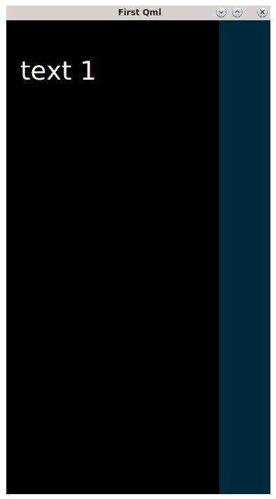

如果我们点击这个窗口的左侧区域，这个区域的颜色将会改变。如果点击右侧区域，将显示两段文本，并且右侧面板的颜色将改变。

# 属性属性

QML 中的属性是对象的属性，可以是静态值或绑定到动态表达式。您可以通过注册`Q_PROPERTY()`宏并在 QML 类型系统中注册它来在 C++中为类型定义属性。如前所述的示例中，可以在对象声明中使用以下语法定义自定义属性：`property propertyType propertyName`。声明的属性名称必须以小写字母开头，可以包含字母、数字和下划线。不允许使用保留的 JavaScript 单词作为属性名称。自定义属性隐式创建一个值更改信号。与此属性关联的信号处理程序将采用`onPropertyNameChanged`的形式，其中`PropertyName`是属性名称，首字母大写。QML 的一个主要特性是属性的绑定。绑定允许我们通过指定对象属性之间的关系，根据变化使用动态对象行为。让我们实现以下步骤：

1.  在`qmls/`目录中创建`UButton.qml`文件，并在其中包含一个简单的`Button`类型：

```py
import QtQuick.Controls 2.2

Button {
    flat: true
    highlighted: true
}
```

这将创建标准的 QML 按钮。

1.  查看`u_qml.qml`文件中的功能。更改一些行并添加标准的 QML 按钮。

向第一个矩形添加一个自定义属性，并更改`MouseArea`，使其类似于以下代码：

```py
...
    ...
    Uqmls.URect {
        id: rect1
        ...
        property int rzwidth: parent.width - (parent.width / 5)
        width: parent.width
        height: parent.height
        MouseArea {
            ...
            onClicked: {
                rect1.width = rect1.rzwidth;
                rect2.visible = true;
            }
        }
    }
    ...
...
```

`rzwidth`是在初始化时定义的自定义属性。

1.  更改第二个矩形并添加按钮：

```py
...
    ...
    Uqmls.URect {
        id: rect2
        visible: false
        ...
        Uqmls.UButton {
            text: "Hide"
            onClicked: {
                rect2.visible = false;
                rect1.width = UQml.Window.width;
            }
        }
    } 
}
```

将可见属性设置为`false`意味着`rect2`将不可见。当按钮被点击时，使用命令值赋值来调整`rect1`的大小。结果如下所示：

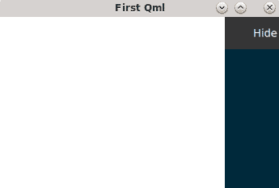

QML 允许使用自定义属性定义以下有效类型：

+   `int 1`

+   `string "String"`

+   `url "https://doc.qt.io"`

任何 QML 对象类型都可以用作属性类型，例如，`property Rectangle YouRectangle`。

对象实例的属性值可以在初始化时指定为值赋值或通过命令值赋值。在初始化时对属性赋值将采用以下形式：

```py
property int rzwidth: UQml.Window.width - (UQml.Window.width / 5)
```

命令值赋值是在使用命令 JavaScript 代码将属性值赋给属性时：

```py
onClicked: { rect2.visible = false; }
```

可以分配给属性的值可以是静态或绑定表达式形式。静态值是一个不依赖于其他属性的常量值，绑定表达式是一个描述属性与其他属性之间绑定关系的 JavaScript 表达式。属性值必须匹配属性类型。此外，还可以分配列表类型属性，其中列表由 QML 对象类型值作为状态组成，例如，`[State {name: "value1"}, State {name: "value2"}]`。属性可以像这样按`font`值对`Text`对象的属性进行分组：

```py
Text {
    font {pixelSize: 12; family: "Verdana"}
}
```

属性可以声明为别名属性，这意味着属性将别名属性作为对被别名属性的引用连接起来。属性别名声明类似于普通属性定义，只是添加了别名关键字和有效的别名引用。

# 信号属性

**信号**是从发射对象发出的通知，表明已发生事件。这可能包括文本的变化、按钮的按下、光标的移动等等。通过信号处理程序，某些对象可以被通知已发出信号。信号声明可以以下列形式存在：

```py
Item {
    signal clicked
    signal hovered()
    signal actionPerformed(string action, var actionResult)
}
```

使用这样的属性，可以通过在 QML 类型系统中注册一个`Q_SIGNAL`宏来为 C++中的类型定义一个信号。此外，也可以在 QML 文档中定义自定义信号。通常，QML 信号处理程序定义位于将发出信号的物体内部，如前面的`MouseArea`示例所示。此外，QML 还允许我们使用`Connections`类型独立于对象使用信号。

# 信号处理程序属性

为了展示信号处理程序的实现，让我们看看`u_qml.qml`文件：

```py
...
UQml.Window {
    ...
    color: "#000F1F"
```

这为应用程序窗口添加了背景颜色。现在，让我们执行以下步骤：

1.  为第一个矩形添加一个`Connections`类型和自定义处理程序：

```py
    Uqmls.URect {
        id: rect1
        signal colored(color uColor)
        ...
        property int rzwidth
        ...
        height: parent.height / 10
        onColored: rect1.color = uColor;
        MouseArea {
            id: marea1
            anchors.fill: parent
        }
        Connections {
            target: marea1
            onClicked: {
                rect1.width = rect1.rzwidth;
                rect2.visible = true;
            }
            onPressed: rect1.colored("#002737")
        }
    }
```

这添加了`onColored`信号处理程序并创建了矩形的鼠标区域连接。它还将`Connections`的目标设置为`rect1`的鼠标区域。

1.  为第二个矩形的按钮添加一些额外的属性：

```py
    Uqmls.URect {
        ...
        Uqmls.UButton {
            id: ubut1
            width: rect2.width
            height: rect2.height / 10
            text: "Hide"
            onClicked: {
                rect2.visible = false;
                rect1.width = UQml.Window.width;
            }
        }
    }
}
```

此代码为具有指定`id`的按钮添加了`width`和`height`属性。如果我们运行`u_app.py`文件，我们可以看到此结果：

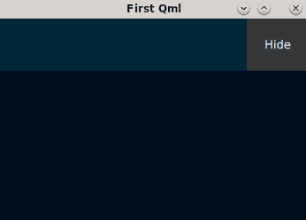

如我们所见，`colored()`信号在`rect1`对象中声明，然后通过`id`与`MouseArea`相关的`Connections`的`onPressed`信号处理程序一起发出。此信号被`rect1`的`onColored`信号处理程序接收。许多 QML 类型都定义了信号。例如，文本字段有`accepted()`、`editingFinished()`、`textEdited()`；按钮有`Button`、`RadioButton`和`CheckBox`，而`ComboBox`分别有`clicked()`、`accepted()`和`activated()`信号。信号将在第十五章中更详细地描述，*信号、槽和事件处理程序*，以及它们与 PyQt 和 PySide 的关系，但它们的逻辑是相似的。

# 方法属性

可以定义一些函数以实现特定的功能。方法可以通过`Q_INVOKABLE`宏或将其注册为`Q_SLOT`宏（例如，与信号一起）与 QML 类型系统注册。可以通过在对象声明中添加`function functionName(parameterName) {函数体}`来定义自定义方法。通常，方法提供与 JavaScript 代码的计算或使用相关的某些功能。让我们看看使用此函数与 QML 的示例。

让我们在`rect1`中添加一个方法：

```py
...
    ...
    Uqmls.URect {
        id: rect1
        ...
        function onUcolor(ucolor) {
            if (ucolor=="#000F1D") {
                return "#000F1F";
            } else {
                return "#000F1D";
            };
        } 
        onColored: rect1.color = onUcolor(rect1.color);
        ...
    ...
...
```

如果`rect1`不是白色，`onUcolor`函数将返回白色，如果颜色是白色，则返回*shuttle*颜色（看起来类似于深蓝色的颜色）。

# JavaScript 和 QML

QML 最强大的功能之一是提供 JavaScript 功能。这允许我们使用各种表达式和方法作为 JavaScript 函数。QML 具有深度的 JavaScript 集成，这使得它能够使用 JavaScript 形式的函数定义和信号处理器。我们在*导入语句*部分讨论了将 JavaScript 作为导入资源的使用。让我们看看 JavaScript 宿主环境和其使用的限制。

QML 引擎提供了一个 JavaScript 环境，并且这个环境与网络浏览器提供的环境略有不同。QML 文档可能包含以下形式的 JavaScript 代码：

+   在属性绑定中，代码描述了 QML 对象属性之间的关系。

+   在实现信号处理器后。

+   在自定义方法的定义中，函数在 QML 对象的主体内部定义，可能包括变量设置、数组、循环和条件运算符。

+   作为独立 JavaScript 文件的导入。

JavaScript 代码存在环境限制：

+   如果此代码位于`somefile.qml`内部，JavaScript 代码不能修改全局对象，但可以从`somefile.js`修改全局对象。

+   除了具有本地脚本变量的代码外，全局代码在缩减的作用域中运行。

+   `this`关键字仅在绑定属性中可用，在 QML 中未定义。

# 类型系统和 QML 文档

在 QML 中，类型可以在对象定义中使用 QML 语言本地化，通过 C++注册，或通过 QML 文档注册。这可以表示如下：

+   **基本类型**：

+   `bool`: `true`/`false`值。

+   `double`: 双精度小数。

+   `enumeration`: 命名值。

+   `int`: 整数。

+   `list`: QML 对象的列表。

+   `real`: 小数。

+   `string`: 文本字符串。

+   `url`: 通用资源定位符。

+   `var`: 通用属性。

+   **JavaScript 类型**：QML 引擎允许的任何 JavaScript 对象。

+   **QML 对象类型**：由 QML 提供的模块，例如`QtQuick`模块。

一个以 QML 文档的语法规则编写的字符串表示的 QML 文档，具有`.qml`文件扩展名，并包含一个经过验证的结构。文档的结构通常分为两部分。第一部分是`import`部分，而第二部分是对象声明部分，由一个空行分隔。由于 QML 对网络是透明的，这使得可以从本地和远程路径导入 QML 文档。

# QtQml 模块

与提供 UI 组件和功能的`QtQuick`模块相比，`QtQml`模块提供了一个使用 QML 开发应用程序的框架，并实现了语言和引擎基础设施。此模块提供了一个 API，用于通过自定义类型实现扩展 QML，并允许我们将 QML 与 JavaScript 和 C++集成。这里描述了一些通常与`QtQml`一起使用的类型。模块具有`import`语句：

```py
import QtQml 2.0
```

这可以解释为 C++预处理器：

```py
#include <QtQml>
```

让我们回顾一下`QtQml`包含的基础对象类型。

# 组件

QML 组件定义具有以下属性：

`progress`: 一个表示组件加载进度的`实数`值，范围从`0.0`到`1.0`。

`status`: 这是一个`枚举`，显示组件加载的状态。

`url`: 这是用于组件构造的**统一资源定位符**（**URL**）。

# QtObject

此类型包含`objectName`属性：

`objectName`: 这是特定字符串的对象名称。

# 绑定

此类型用于创建属性绑定。此类型具有以下属性：

`delayed`: 这可以是`true`或`false`。如果是`true`，则绑定将被延迟。

`property`: 这可以是任何字符串，并指定要更新的属性的名称。

`target`: 这是需要更新的对象。

`value`: 这可以是任何对象或属性，并为目标对象和属性设置值。

`when`: 这可以是`true`或`false`，并在绑定活动时设置。表达式应返回`true`或`false`。

# 连接

此类型提供对信号的连接。这些是可用的属性：

`enabled`: 这可以是`true`或`false`。对于项目，连接和事件被启用。

`ignoreUnknownSignals`: 这可以是`true`或`false`，并允许我们忽略未知信号，例如错误。

`target`: 这是一个对象，也是信号的发射者。

# 定时器

此 QML 类型提供了触发动作的定时器。它具有以下属性：

`interval`: 这是一个整数，用于设置毫秒间隔（默认为`1000`毫秒）。

`repeat`: 这可以是`true`或`false`，如果此属性为`true`，则重复此触发器。

`running`: 这可以是`true`或`false`。如果属性为`true`，则启动定时器。

`triggeredOnStart`: 这可以是`true`或`false`。如果属性为`true`，则在定时器开始时启动触发器。

此外，`QtQml` 包含一个子模块 `QtQml.Models`，它定义了 QML 中的数据模型。

# QML 中的样式

我们已经完成了对 QML 语法简介的简短介绍。让我们尝试实现一些对象的属性，以更好地可视化元素并改进它们的样式。

# Item

最常用的由几乎所有几何可视化对象类型继承的 QML 类型是 `Item`。这是 `QtQuick` 中所有可视项的基础类型。在 QML 中使用的 `import` 语句如下：

```py
import QtQuick 2.7
```

注意，`QtQuick` 的版本可能因你安装的 Qt 版本而异。

项类型的属性如下：

`enabled`：这可以是 `true` 或 `false`。项被启用以接收鼠标和键盘事件（默认为 `true`）。

`x`：这是一个设置此项在 *x* 轴上位置的 `real` 数值（默认为 `0.0`）。

`y`：这是一个设置此项在 *y* 轴上位置的 `real` 数值（默认为 `0.0`）。

`z`：这是一个设置兄弟项堆叠顺序的 `real` 数值。具有高于其他项的 `z` 值的项将覆盖其他项（默认为 `0.0`）。

`width`：这是一个设置此项宽度的 `real` 数值。

`height`：这是一个设置此项高度的 `real` 数值。

`implicitWidth`：这是一个设置此项自然宽度的 `real` 数值。

`implicitHeight`：这是一个设置此项自然高度的 `real` 数值。

`opacity`：这是一个设置此项不透明度的 `real` 数值。`0.0` 表示完全透明，`1.0` 表示完全不透明（默认为 `1.0`）。

`parent`：此（父项名称）设置此项的父项。

`resources`：这是此项的资源列表。

`clip`：这可以是 `true` 或 `false`，并允许此项剪切其自己的绘制。剪切将启用（默认为 `false`）。

`rotation`：这是一个 `real` 数值，将此项顺时针旋转一定角度（默认为 `0`）。

`scale`：这是一个 `real` 数值，是此项的缩放因子（默认为 `1.0`）。

`smooth`：这可以是 `true` 或 `false`。如果为 `true`，则将使用平滑采样。

`state`：此字符串设置此项当前状态的名称。

`states`：这是此项可能的州列表。

`transform`：这是应用于此项的变换列表。

`transformOrigin`：此 `enumeration` 设置缩放和旋转将转换此项的基点（默认为 `Item.Center`）。

`transitions`：这是此项的过渡列表。

`visible`：这可以是 `true` 或 `false`，并设置此项是否可见（默认为 `true`）。

`visibleChildren`：这是将可见的子项列表。

`antialiasing`**：**这可以是 `true` 或 `false`，并为此项提供抗锯齿。

`activeFocus`：这可以是 `true` 或 `false`，并设置此项是否具有活动焦点。

`activeFocusOnTab`: 这可以是 `true` 或 `false`，并设置项目是否将在标签焦点链中具有活动焦点（默认为 `false`）。

`focus`: 这可以是 `true` 或 `false`。如果为 `true`，当包含的 `FocusScope` 获得活动焦点时，它将获得活动焦点。

`anchors.top`: 这个 `AnchorLine` 是项目与此项目顶部位置之间的关系。

`anchors.bottom`: 这个 `AnchorLine` 是项目与此项目底部位置之间的关系。

`anchors.left`: 这个 `AnchorLine` 是项目与此项目左侧位置之间的关系。

`anchors.right`: 这个 `AnchorLine` 是项目与此项目右侧位置之间的关系。

`anchors.horizontalCenter`: 这个 `AnchorLine` 是项目与此项目水平中心位置之间的关系。

`anchors.verticalCenter`: 这个 `AnchorLine` 是项目与此项目垂直中心位置之间的关系。

`anchors.baseline`: 这个 `AnchorLine` 是此项目的文本假想线与另一个项目位置之间的关系。如果文本不存在，这将与 `anchors.top` 相同。

`anchors.fill`: 这个 `Item` 是设置一个项目的几何形状与另一个项目相同的锚点关系。

`anchors.centerIn`: 这个 `Item` 在设置此项目位置为指定 `Item` 中心位置的关系中。

`anchors.margins`: 这是一个设置相关项目锚点之间边距的 `real` 数值。

`anchors.topMargin`: 这是一个设置此项目与另一个项目之间顶部边距的 `real` 数值。

`anchors.bottomMargin`: 这是一个设置此项目与另一个项目之间底部边距的 `real` 数值。

`anchors.leftMargin`: 这是一个设置此项目与另一个项目之间左边距的 `real` 数值。

`anchors.rightMargin`: 这是一个设置此项目与另一个项目之间右边距的 `real` 数值。

`anchors.horizontalCenterOffset`: 这是一个设置相关项目水平中心位置偏移的 `real` 数值。

`anchors.verticalCenterOffset`: 这是一个设置相关项目垂直中心位置偏移的 `real` 数值。

`anchors.baselineOffset`: 这是一个设置文本假想线偏移的 `real` 数值。

`anchors.alignWhenCentered`: 这可以是 `true` 或 `false`，并将锚点居中以便对齐到整个像素（默认为 `true`）。

`baselineOffset`: 这个整数是项目基线在局部坐标中的位置。对于文本项，它是文本所在的假想线。对于非文本项，它是 `0`（默认为 `0`）。

`children`: 这是一个包含此项目子项的列表。

`childrenRect.x`: 这是一个 `real` 数值，是此项目子项的 *x* 轴坐标。

`childrenRect.y`: 这是一个 `real` 数值，是此项目子项的 *y* 轴坐标。

`childrenRect.width`: 这是一个`real`数字，是此项目子项的宽度。

`childrenRect.height`**:** 这是一个`real`数字，是此项目子项的高度。

`data`: 此列表允许我们在一个项目中混合视觉子项和资源。

`layer.effect`: 组件具有应用于层的效果（例如，`ShaderEffect`组件）。

`layer.enabled`: 这可以是`true`或`false`。如果为`true`，则允许此项目分层（默认为`false`）。

`layer.format`: 这个`枚举`定义了纹理的内部 OpenGL 格式。

`layer.mipmap`: 这可以是`true`或`false`。如果为`true`，则为纹理生成米普贴图。

`layer.samplerName`: 此字符串是效果的源纹理属性的名称。

`layer.smooth`: 这可以是`true`或`false`。如果为`true`，则平滑地转换层。

`layer.sourceRect`: 此`Rectangle`是应渲染到纹理中的此项目的矩形区域。

`layer.textureMirroring`: 此`枚举`设置 OpenGL 纹理的镜像方式（默认为`ShaderEffectSource.MirrorVertically`）。

`layer.textureSize`: 此`size`是层的纹理的像素大小。

`layer.wrapMode`: 此`枚举`是与纹理关联的 OpenGL 包装模式。

以下代码行部分解释了`Item`的功能。在`qmls/`目录下创建一个名为`UItem.qml`的文件，并添加以下代码：

1.  `main_item`是此`Item`内部所有项目的父项目：

```py
import QtQuick 2.7

Item {
    id: main_item
    anchors.fill: parent
    anchors.margins: 20
```

此项目的`id`是`main_item`。此项目将具有与`parent`相似的大小，并具有`20`像素的边距。

1.  将第一个项目添加到具有`id: main_item`的`Item`中：

```py
...
    ...
    Item {
        id: i1
        x: 50
        width: parent.width / 2
        height: parent.height / 4
        z: 1
        opacity: 0.5
        Rectangle {
            id: r1
            width: parent.width
            height: parent.height
            color: "#FF0000"
        }
    }
..
```

此`Item`描述了诸如`z`索引（此项目将覆盖索引较小的项目）、`opacity`（此项目将半透明）等属性。

1.  将第二个项目添加到具有`id: main_item`的`Item`中：

```py
...
    ...
    Item {
        id: i2
        parent: i1
        y: i1.height
        width: parent.width / 2
        height: parent.height / 4
        scale: 2
        z: 2
        opacity: 0.7
        Rectangle {
            id: r2
            width: parent.width
            height: parent.height
            color: "#00FF00"
        }
    }
...
```

第二个项目具有`parent`和`scale`属性。`parent`属性为此项目设置`parent`，而`scale`属性设置大小，将是父项目大小的两倍。

1.  将第三个项目添加到具有`id: main_item`的`Item`中：

```py
...
    ...
    Item {
        id: i3
        anchors.centerIn: parent
        y: i1.height + i2.height
        width: parent.width / 2
        height: parent.height / 4
        rotation: 90
        z: 0
        opacity: 0.9
        Rectangle {
            id: r3
            width: parent.width
            height: parent.height
            color: "#FFFF00"
        }
    }
...
```

第三项具有`anchors.centerIn`和`rotation`属性。`anchors.centerIn`属性将此项目设置为`parent`的中心，而`rotation`属性将此项目旋转`90`度。此项目几乎不透明。

1.  然后，将第四个项目添加到`main_item`：

```py
...
    ...
    Item {
        id: i4
        parent: r3
        width: parent.width
        height: parent.height
        z: 1
        rotation: 45
        scale: 0.7
        Rectangle {
            id: r4
            anchors.centerIn: parent
            width: parent.width
            height: parent.height
            antialiasing: true
            color: "#770077"
        }
    }
}
```

`rotation`属性将按顺时针方向旋转此项目`45`度，而`scale`因子将此项目的大小设置为父项目大小的 70%。已将`antialiasing`属性添加到此项目的矩形中，以获得最佳元素可视化性能。

1.  要运行此文件，您可以使用 Qt Creator 或将以下行添加到`u_qml.qml`文件中，在第一个矩形之后某处。将项目添加到 QML 应用程序中：

```py
...
    ...
    Uqmls.UItem {
        visible: true
        width: rect1.width
        height: parent.height - rect1.height
        y: rect1.height
    }
    ...
...
```

主要项将是可见的，其`width`和`height`与`rect1`相关。这是结果：

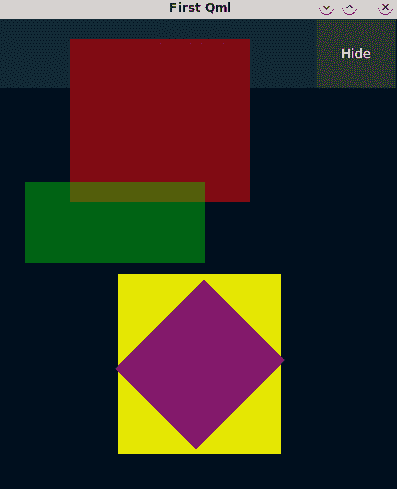

# Rectangle

`Rectangle`类型是在创建 QML 对象时常用的类型。`Rectangle`从`Item`类型继承。

使用`Rectangle` QML 类型的`import`语句如下：

```py
import QtQuick 2.7
```

`Rectangle`的属性如下：

`antialiasing`: 这可以是`true`或`false`。如果矩形应该使用抗锯齿，则提供此选项。

`border.width`: 这是一个`int`类型的数字，表示矩形的边框宽度。

`border.color`: 这是矩形边框的颜色。

`color`: 这是矩形的颜色。

`gradient`: 这是矩形的渐变颜色。

`radius`: 这是矩形项的半径。

# RectangularGlow

这用于创建一个具有发光效果的模糊和着色矩形。以下是导入语句：

```py
import QtGraphicalEffects 1.0
```

`RectangularGlow`的属性如下：

`color`: 这是用于发光的颜色。

`cornerRadius`: 这是一个用于绘制带圆角的发光的`real`类型的数字。

`glowRadius`: 这是一个`real`类型的数字，用于设置发光到达的像素半径。

`spread`: 这是一个`real`类型的数字，用于设置源边缘附近发光颜色的强度。

`cached`: 这可以是`true`或`false`。它允许效果的输出像素被缓存以提高性能。

为了演示这个效果，在`qmls/`目录中创建一个名为`URectGlow.qml`的文件，并执行以下步骤：

1.  将父矩形和矩形发光添加到`URectGlow.qml`文件中：

```py
import QtQuick 2.7
import QtGraphicalEffects 1.0

Rectangle {
    property color glowcolor
    property color txglow
    RectangularGlow {
        id: rglow
        anchors.fill: rectglow
        glowRadius: 10
        spread: 0.1
        color: glowcolor
          cornerRadius: rectglow.radius + glowRadius
    }
```

此代码导入图形效果并添加自定义属性`glowcolor`和`txglow`。`glowcolor`属性用于指定发光颜色，而`txglow`用于文本发光的颜色。

1.  然后，在`RectangularGlow`之后添加中心矩形：

```py
    Rectangle {
        id: rectglow
        color: parent.color
        anchors.centerIn: parent
        width: parent.width / 1.5
        height: parent.height / 1.5
        radius: 14
```

矩形将具有与父矩形颜色相似的发光效果。设置矩形角落的半径。

1.  将`Text`和`Glow`类型添加到中心矩形：

```py
        Text {
            id: txt1
            anchors.centerIn: parent
            text: "PUSH"
            font.family: "Helvetica"
            font.pixelSize: parent.width / 8
            font.weight: Font.Medium
            font.letterSpacing: 2
            color: parent.color
        }
        Glow {
            anchors.fill: txt1
            radius: 7
            samples: 17
            color: txglow
            source: txt1
        } 
    }
}
```

上述代码将`Text`和`Glow` QML 类型添加到中心矩形中。`Text`用于在矩形上显示文本，而`Glow`用于使矩形内的文本发光。

# 渐变

渐变用于更好地可视化对象。它们提供的颜色比使用简单的颜色属性更有效。

# 梯度

这个 QML 类型为元素提供渐变颜色。以下是`import`语句：

```py
import QtQuick 2.7
```

它有一个名为`stops`的属性，提供了渐变停止点的列表。你可以通过使用`GradientStop`来实现这一点。

# GradientStop

这个类型定义了在渐变中的位置的颜色。以下是`import`语句：

```py
import QtQuick 2.7
```

属性如下：

`color`: 这是指定渐变颜色的颜色。它允许使用命名、十六进制和 RGBA 颜色。

`position`: 这是渐变中颜色的位置，范围从`0.0`到`1.0`。

在`App/qmls/`目录内创建一个名为`gradients/`的目录，并在其中创建一个名为`UGradient1.qml`的文件。然后，使用`Gradient`和`GradientStop`类型添加渐变颜色：

```py
import QtQuick 2.7

Gradient {
    GradientStop {
        position: 0.0;
        color: "red";
    }
    GradientStop {
        position: 0.27;
        color: "#AAFF00";
    }
    GradientStop {
        position: 0.534;
        color: Qt.rgba(0.95,0,0,1);
    }
    GradientStop {
        position: 0.7147;
        color: "yellow";
    }
    GradientStop {
        position: 1.0;
        color: Qt.rgba(1,0,0,1);
    }
}
```

第一个渐变停止和最后一个渐变停止的`position`属性必须分别等于`0.0`和`1.0`。在这两个位置之间的所有渐变停止实现渐变颜色。可以使用命名、RGB 和 RGBA 颜色。

现在，你只需要通过向矩形添加渐变颜色来更改`UCircle.qml`文件：

```py
import QtQuick 2.7
import "gradients" as UG

Rectangle {
    radius: width * 0.5
    antialiasing: true
    gradient: UG.UGradient1 {}
}
```

创建的圆将具有渐变颜色而不是简单的颜色。

# LinearGradient

此渐变对象提供了一些扩展功能。使用`LinearGradient`，颜色从起点开始，到终点结束。以下是所需的`import`语句：

```py
import QtGraphicalEffects 1.0
```

这些是它所接受的属性：

`start`：颜色在位置`0.0`处渲染的像素起点（默认为`Qt.point(0, 0)`）。

`end`：颜色在位置`1.0`处渲染的像素终点（默认为`Qt.point(0, height)`）。

`gradient`：渐变类型，包含两种或更多颜色的渐变。

`source`：将要填充渐变的项（例如图像或 QML 类型）。

`cached`：这可以是`true`或`false`。它允许效果的输出像素被缓存以提高性能。

这里有一个例子。在`qmls/`目录下创建一个名为`URectLG.qml`的文件，并将以下代码添加到其中：

```py
import QtQuick 2.7
import QtGraphicalEffects 1.0
import "gradients" as UG

Rectangle {
    antialiasing: true
    radius: width * 0.5
    LinearGradient {
        anchors.fill: parent
        start: Qt.point(0, 0) 
        end: Qt.point(parent.height/2, parent.height/2)
        source: parent
        cached: true
        gradient: UG.UGradient1 {}
    }
}
```

在线性渐变中，使用起点和终点作为 Qt 点。渐变只能用视觉类型对象定义，例如矩形，可以无缝混合两种或多种颜色。

# RadialGradient

此类型提供径向渐变。以下`import`语句用于径向渐变：

```py
import QtGraphicalEffects 1.0
```

这些是属性：

`angle`：这是一个`real`数，是围绕中心点旋转的渐变角度（默认为`0.0`）。

`gradient`：这是一个渐变类型的渐变，包含两种或更多颜色。

`source`：这是一个将要填充渐变的项。

`horizontalRadius`：这是一个`real`数，即渐变的形状和大小。

`verticalRadius`：这是一个`real`数，即渐变的形状和大小。

`horizontalOffset`：这是一个`real`数，即从渐变中心点到项中心的像素偏移（默认为`0.0`）。

`verticalOffset`：这是一个`real`数，即从渐变中心点到项中心的像素偏移（默认为`0.0`）。

`cached`：这可以是`true`或`false`。它允许效果的输出像素被缓存以提高性能。

这里有一个径向渐变的例子。在`qmls/`目录内创建一个名为`URectRG.qml`的文件，并添加以下代码：

```py
import QtQuick 2.7
import QtGraphicalEffects 1.0
import "gradients" as UG

Rectangle {
    antialiasing: true
    radius: width * 0.5
    RadialGradient {
        anchors.fill: parent
        angle: 27
        horizontalRadius: parent.width / 2
        verticalRadius: parent.height / 2
        horizontalOffset: 3
        verticalOffset: 3
        source: parent
        cached: false
        gradient: UG.UGradient1 {}
    }
}
```

此径向渐变的源是一个父矩形。我们已经设置了围绕中心的`angle`旋转。

# ConicalGradient

此类型提供圆锥形梯度。此类型的`import`语句如下：

```py
import QtGraphicalEffects 1.0
```

此类型的属性如下：

`angle`：这是一个`实数`，用于设置中心点周围梯度的角度（默认值为`0.0`）。

`gradient`：`Gradient`类型的梯度，包含两种或更多颜色。

`source`：将要填充梯度的项目。

`horizontalOffset`：这是一个`实数`，即梯度中心点相对于项目中心的像素偏移量（默认值为`0.0`）。

`verticalOffset`：这是一个`实数`，即梯度中心点相对于项目中心的像素偏移量（默认值为`0.0`）。

`cached`：这可以是`true`或`false`。它允许缓存效果的输出像素以改善性能。

这里有一个示例。在`qmls/`目录内创建一个名为`URectCG.qml`的文件，并添加以下代码：

```py
import QtQuick 2.7
import QtGraphicalEffects 1.0
import "gradients" as UG

Rectangle {
    antialiasing: true
    radius: width * 0.5.
    ConicalGradient {
        anchors.fill: parent
        angle: 1
        horizontalOffset: 7
        verticalOffset: 5
        source: parent
        cached: false
        gradient: UG.UGradient1 {}
    }
}
```

颜色的梯度将是圆锥形。`source`也是父矩形。

# 完成示例

为了完成本节中的示例，让我们将它们组合成一个网格并查看结果。为此，在`u_qml.qml`文件中`rect1`之后添加网格：

1.  添加项目的网格定位机制：

```py
...
    ...
    Grid {
        visible: true
        id: grid1
        columns: 2
        spacing: 20
        padding: 20
        width: rect1.width
        height: parent.height - rect1.height
        y: rect1.height
        Uqmls.UCircle {
            id: circle1
            width: (parent.width / 2 - (parent.spacing * 2)) + 10
            height: width
        }
        ...
        Uqmls.URectGlow {
            id: rectg1
            width: (parent.width / 2 - (parent.spacing * 2)) + 10
            height: width
            color: Qt.rgba(0, 0.07, 0.14, 1);
            glowcolor: Qt.rgba(0.007, 1, 1, 1);
            txglow: Qt.rgba(0.007, 0.7, 0.7, 1);
       }
        ...
    }
...
```

我们已经使用`Grid`类型来排列项目。在这里，我们创建了四个具有梯度如`UCircle`、`URectLG`、`URectRG`和`URectCG`的圆，以及四个可以添加的`URectGlow`项目。

1.  在创建项目的*Item*部分，我们需要将`visible`属性更改为`false`：

```py
...
    ...
    Uqmls.UItem {
        visible: false
    ...
...
```

添加这些行后，梯度元素将可见，而之前创建的项目将不可见。带有一些背景色更改的完整文件可在[`github.com/PacktPublishing/Hands-On-QT-for-Python-developers`](https://github.com/PacktPublishing/Hands-On-QT-for-Python-developers)找到。

如果我们点击应用程序窗口的右上角，我们将看到以下结果：

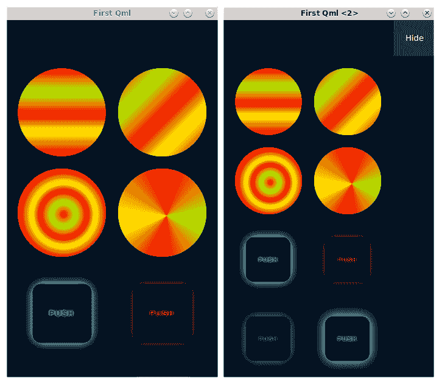

我们已经简要介绍了使用 QML 进行样式设置。在下一章中，我们将继续学习 Qt Quick，并学习重要的定位工具，例如布局。

# 使用 QML 创建动画

Qt Quick 是一个用于使用 QML 创建用户界面的标准库，它为您提供了实现动画的能力。这种动画可以通过多种方式实现，例如状态、转换和动画属性变化。动画也可以通过其他与动画相关的技术实现。

# 状态和转换对象

这种使用 QML 创建动画的方式使用`State`对象来声明对象的当前状态，以及使用`Transition`对象来声明动画过程中的状态变化属性。

这种方法可以用以下几行来描述：

```py
Item {
    states: [ State { name: "state1"} ]
    transitions: [ Transition {}]
}
```

`Item`具有`states`和`transitions`属性。`states`有一个`State`对象，而`transitions`有一个`Transition`对象的列表。

# State

作为`QtQuick`模块的一部分，QML 的`State`类型提供了一组与对象和属性配置相关的更改。它有以下`import`语句：

```py
import QtQuick 2.7
```

这些是其属性：

`name`：`string`（状态的名称）。

`changes`：列表（应用于状态的更改）。

`extend`：`string`（状态的名称）；状态扩展为状态。

`when`：这可以是`true`或`false`，并设置状态何时应用。此属性的值应为返回布尔值的对象。例如，如果`MouseArea.pressed`被按下，则返回`true`。

# PropertyChanges

`PropertyChanges`用于在状态中定义属性值。这允许我们定义目标对象的新属性。`import`语句如下：

```py
import QtQuick 2.7
```

它具有以下属性：

`target`：需要更改属性的对象。

`explicit`：可以是`true`或`false`。它提供属性的显式绑定（默认为`false`）。

`restoreEntryValues`：可以是`true`或`false`。如果是`true`，离开状态时应恢复之前的值。

以下是一个示例。打开`UItem.qml`文件，并将此`MouseArea`添加到具有`id: r1`的矩形中，如下所示：

1.  将`id: i1`的项状态添加到鼠标区域的`onClicked`信号处理程序：

```py
...
    ...
        ...
            ...
            MouseArea {
                anchors.fill: parent
                onClicked: {i1.state == 'state1' ?;
                    i1.state = '' : i1.state = 'state1';}
            }
        ...
    ...
...
```

当`MouseArea`被点击时，`Item`的状态将发生变化。

1.  将状态和转换属性添加到`Item`的底部，其中`id: i1`：

```py
...
    ...
        ...
        states: [
            State {
                name: "state1"
                PropertyChanges { target: i1; x: 140 } 
            }
        ]
        transitions: [
            Transition {
                NumberAnimation { properties: "x, y" }
            }
        ]
    ...
...
```

在`states`属性中，已添加具有`name`和`PropertyChanges`的`State`类型，它将被用于目标项的*x*轴。`transitions`属性实现动画。

# AnchorChanges

此类型用于需要更改对象`State`中项的锚点时。此类型的`import`语句如下：

```py
import QtQuick 2.7
```

以下属性可用：

`target`：要更改锚的项。

`anchors.left`：此`AnchorLine`将修改左锚。

`anchors.right`：此`AnchorLine`将修改右锚。

`anchors.horizontalCenter`：此`AnchorLine`将修改水平中心锚的位置关系。

`anchors.top`：此`AnchorLine`将修改顶部锚。

`anchors.bottom`：此`AnchorLine`将修改底部锚。

`anchors.verticalCenter`：此`AnchorLine`将修改垂直中心锚的位置关系。

`anchors.baseline`：此`AnchorLine`将修改基线锚。

# StateChangeScript

`StateChangeScript` QML 类型用于在状态中运行脚本。`import`语句如下：

```py
import QtQuick 2.7
```

它具有以下属性：

`name`：这是一个字符串，是脚本的名称。与`ScriptAction`一起使用以定位特定的脚本。

`script`：将要使用的脚本，例如函数。

# StateGroup

使用此类型，QML 为非项类型提供了支持。`import`语句与之前相同：

```py
import QtQuick 2.7
```

它具有以下属性：

`state`：这是一个`string`。它是此状态组的名称。

`states`：这是一个列表，定义了与状态组相关的状态列表。

`transitions`：这是一个列表。它提供了状态组的过渡对象列表。

`QtQml`模块还提供了`state`类型，它是声明性状态机框架的一部分。这是`import`语句：

```py
import QtQml.StateMachine 1.0
```

它具有以下属性：

`childMode`：这是一个枚举，指定了如何处理状态。它可以是指`QState.ExclusiveStates`（状态是互斥的）或`QState.ParallelStates`（状态是并行的）。

`errorState`：这是`QAbstractState`的错误状态。

`initialState`：这是`QAbstractState`的初始状态。

此类型与 QML 语言基础设施相关。

# 过渡

此 QML 类型用于实现状态变化的动画并定义动画过渡。`import`语句如下：

```py
import QtQuick 2.7
```

它具有以下属性：

`animations`：这是一个动画列表，以列表形式提供。

`enabled`：这可以是`true`或`false`（默认为`true`），表示过渡是否启用。

`running`：这可以是`true`或`false`，表示过渡是否正在运行。

`from`：这是一个`string`，表示过渡是从这些状态变化开始的。

`to`：这是一个`string`，表示过渡是到这些状态变化的。

`reversible`：这可以是`true`或`false`。如果是`true`，则在状态变化反转时自动应用过渡。

# 动画属性变化

实现动画的另一种方法是使用行为。

# 行为

此 QML 类型提供默认动画，如果属性值更改，则应用此动画。`import`语句如下：

```py
import QtQuick 2.7
```

它具有以下属性：

`animation`：这设置了当行为被触发时运行的动画。

`enabled`：这可以是`true`或`false`。这启用了类型以供使用（默认为`true`）。

语法如下：

```py
Behavior on width {
    Animation {}
}
```

在这里，构造使用的是`width`属性的`Behavior`。动画将根据宽度的行为运行。

打开`UItem.qml`文件，并将`MouseArea`和`Behavior`类型添加到具有`id: r2`的矩形中：

```py
...
    ...
        ...
            ...
            MouseArea {
                anchors.fill: parent
                onClicked: {parent.y == 140 ?
                        parent.y = 270 : parent.y = 140}
            }
            Behavior on y {
                NumberAnimation {
                    duration: 7000
                    easing.type: Easing.OutInElastic
                }
            }
        ...
    ...
...
```

如果点击`MouseArea`，绿色矩形将移动。我们已经在`y`轴上设置了`Behavior`，这将使用一个动画，绿色矩形在七秒内落下，并且缓动曲线设置为弹性（指数衰减的正弦波）。

# 动画类型

`QtQuick`提供了以下类型来实现动画。

# 动画

这是所有 QML 动画的基类型。它具有以下`import`语句：

```py
import QtQuick 2.7
```

它具有以下属性：

`alwaysRunToEnd`: 这可以是`true`或`false`。如果动画被停止，动画循环应该完成。

`loops`: 这是一个`int`，设置动画将播放多少次。

`paused`: 这是一个布尔值。如果为`true`，则动画将暂停。

`running`: 这是一个布尔值。如果为`true`，则动画正在运行。

以下信号可用：

`started()`: 当动画开始时发出此信号。

`stopped()`: 当动画停止时发出此信号。

以下方法可用：

`complete()`: 跳转到最终属性值。

`pause()`: 暂停动画。

`restart()`: 重新启动动画。

`resume()`: 开始暂停的动画。

`start()`: 开始动画。

`stop()`: 停止动画。

# AnimationController

这允许手动控制动画。这是必需的`import`语句：

```py
import QtQuick 2.7
```

它具有以下属性：

`animation`: 要控制`Animation`。

`progress`: 动画在`0.0`和`1.0`之间进行。

# PropertyAnimation

这是一个用于动画属性值变化的实用类型。`import`语句如下：

```py
import QtQuick 2.7
```

它具有以下属性：

`duration`: 这个`int`是动画的持续时间（以毫秒为单位）。

`target`: 这个对象设置了需要动画化的项目。

`targets`: 这个列表设置了需要动画化的项目。

`property`: 这个`string`设置了要动画化的属性。

`properties`: 这个`string`设置了要动画化的属性。

`from`: 这是动画的起始值。

`to`: 这是动画的结束值。

`exclude`: 这是一个不会进行动画的对象列表。

`easing.type`: 这是一个枚举，是用于动画的缓动曲线类型。

`easing.amplitude`: 这是缓动曲线的振幅。

`easing.overshoot`: 这是缓动曲线的超出量。

`easing.period`: 这是缓动曲线的周期。

`easing.bezierCurve`: 如果缓动类型是`Easing.Bezier`，则适用此列表。它是一个包含定义从（0,0）到（1,1）曲线的三点组的`real`数列表——[x1, y1, x2, y2, endx, endy]。最后一个点必须是（1,1）。

# NumberAnimation

这用于动画数值属性。使用以下`import`语句：

```py
import QtQuick 2.7
```

它具有以下属性：

`from`: 这是一个`real`数，是动画的起始值。

`to`: 这是一个`real`数，是动画的结束值。

# SequentialAnimation

此动画用于依次运行多个动画。这是`import`语句：

```py
import QtQuick 2.7
```

这里是一个语法示例：

```py
SequentialAnimation {
    Animation {}
    Animation {}
} 
// or:
SequentialAnimation on width { 
    Animation {}
    Animation {}
}
```

这实现了指定动画的顺序动画。

# ParallelAnimation

与`SequentialAnimation`类似，此类型用于同时运行多个动画，但它们将同时运行。使用以下`import`语句：

```py
import QtQuick 2.7
```

这里是一个语法示例：

```py
ParallelAnimation {
    Animation {}
    Animation {}
}
```

这实现了指定动画的并行动画。

# PauseAnimation

此类型用于在动画之间设置暂停。使用以下`import`语句：

```py
import QtQuick 2.7
```

它有一个属性：

`duration`: 这是一个设置动画之间暂停时间的`int`值，单位为毫秒。

# ColorAnimation

这是一个用于在颜色值更改时应用的专用属性动画。你需要以下`import`语句：

```py
import QtQuick 2.7
```

它具有以下属性：

`from`: 这是动画开始时的颜色。

`to`: 这是动画结束时颜色的颜色。

# CoordinateAnimation

这是一个在两个坐标之间实现的地理坐标属性动画。你需要使用以下`import`语句：

```py
import QtPositioning 5.2
```

它具有以下属性：

`direction`: 这是一个表示经度动画方向的`enumeration`。

`from`: 这是动画开始时的坐标。

`to`: 这是动画结束时的坐标。

# RotationAnimation

此类型用于在动画期间控制旋转方向。使用以下`import`语句：

```py
import QtQuick 2.7
```

它具有以下属性：

`direction`: 这是一个表示旋转方向的`enumeration`（默认为`RotationAnimation.Numerical`）。

`from`: 这个`real`数字是动画旋转的起始值。

`to`: 这是一个表示动画旋转结束值的`real`数字。

# AnchorAnimation

此类型用于动画锚点。你需要以下`import`语句：

```py
import QtQuick 2.7
```

它具有以下属性：

`targets`: 这是一个要重新锚定的项目列表。

`duration`: 这是一个表示动画持续时间的`int`值，单位为毫秒。

`easing.type`: 这个`enumeration`是用于动画的缓动曲线类型。

`easing.amplitude`: 这个`real`数字是缓动曲线的振幅。

`easing.overshoot`: 这个`real`类型的数字是缓动曲线的过冲量。

`easing.period`: 这个`real`数字是缓动曲线的周期。

这些类型不是`QtQuick`中可用的所有动画工具的完整列表。

# 动画示例

现在，我们需要练习使用我们查看过的动画类型：

1.  打开`UItem.qml`文件，并在具有`id: r3`的矩形底部添加以下行：

```py
...
    ...
        ...
            ...
            SequentialAnimation on x {
                id: sa1
                running: false
                loops: Animation.Infinite
                NumberAnimation {
                    from: 140
                    to: 270
                    duration: 7000
                    easing.type: Easing.OutInElastic
                }
                NumberAnimation {
                    from: 270
                    to: 140
                    duration: 7000
                    easing.type: Easing.OutInElastic
                }
                PauseAnimation { duration: 140 }
            }
            MouseArea {
                anchors.fill: parent
                onClicked: sa1.running = true
            }
        ...
    ...
...
```

顺序动画用于两个`NumberAnimation`实现。动画将改变矩形的某些位置，并使用`PauseAnimation`类型指定一些暂停。

1.  将以下动画添加到具有`id: r4`的矩形底部：

```py
...
    ...
        ...
            ...
            ParallelAnimation {
                id: sa2
                running: false
                loops: Animation.Infinite
                PropertyAnimation {
                    target: r4
                    property: "rotation"
                    from: 0
                    to: 360
                    duration: 7000
                    easing.type: Easing.OutInElastic
                }
                PropertyAnimation {
                    target: r1
                    property: "rotation"
                    from: 0
                    to: 360
                    duration: 7000
                    easing.type: Easing.InQuart
                }
            }
            MouseArea {
                anchors.fill: parent
                onClicked: sa2.running = true
            }
        ...
    ...
...
```

并行动画用于两个`PropertyAnimation`实现。这些动画将旋转矩形。要查看这些动画，我们需要在`u_qml.qml`文件中对项目的可见属性进行一些更改，并将`Grid`的可见属性设置为`false`。

1.  将动画项目的`visible`属性设置为`true`：

```py
...
    ...
    Uqmls.UItem {
        visible: true
    ...
...
```

项组将可见。

1.  将 `Grid` 的 `visible` 属性设置为 `false`：

```py
...
    ...
    Grid {
        visible: false
    ...
...
```

包含项目的网格将不可见。我们已经成功实现了多种不同方法的几个动画。结果如下：

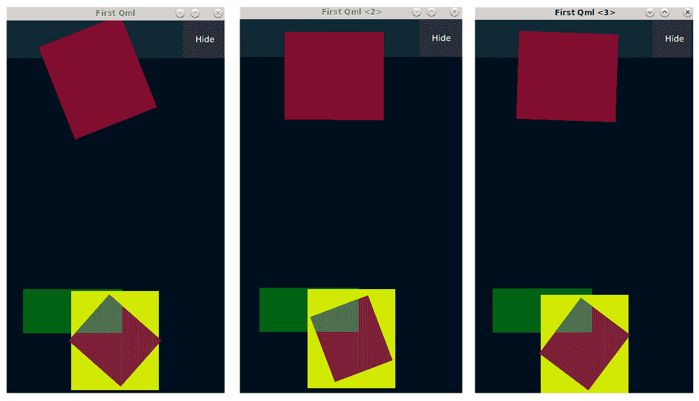

# 摘要

本章已涵盖 QML 及其基本语法。当创建 GUI 时，QML 非常有用。Qt 提供了制作 GUI 的工具，例如 `QtQml` 和 `QtQuick` 模块。`QtQml` 更多的是用于处理语言和 QML 引擎基础设施的工具，但 `QtQuick` 模块提供了帮助我们构建具有广泛功能和可视化工具的 GUI 的库。语言和 QML 引擎基础设施代表了库的核心功能，包括信号构建、属性绑定以及使用 Python 运行 QML 应用程序等元素。本章中的几乎所有示例都使用了 `QtQuick` 模块来实现 QML 应用的视觉组件和功能。

下一章将专注于 `QtQuick` 模块及其子模块，重点介绍控制元素、定位、布局和可视化。
