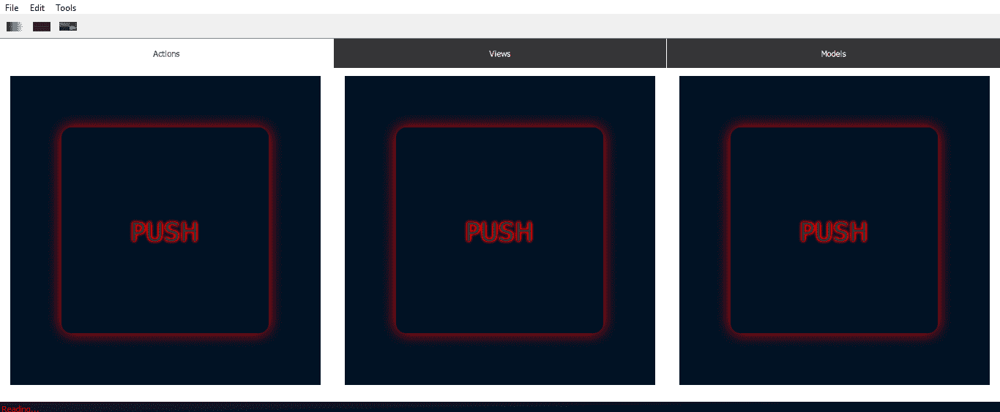
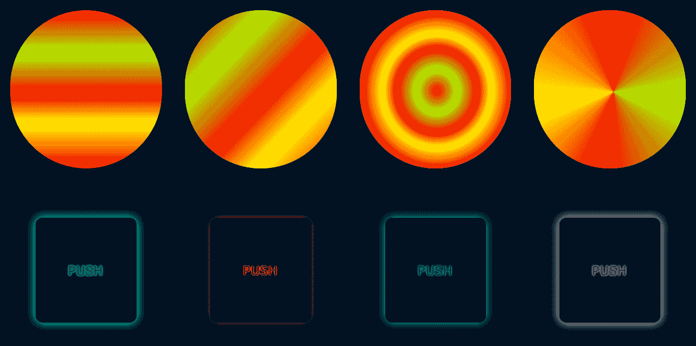
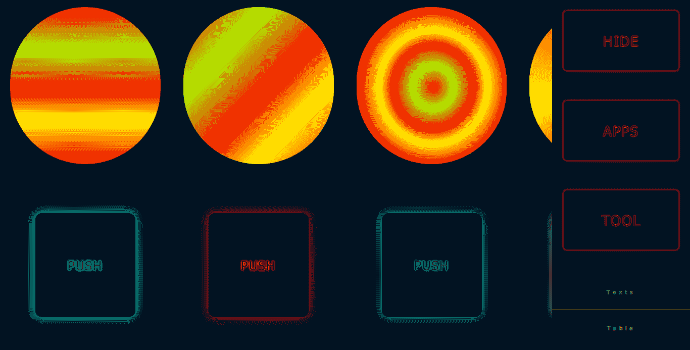
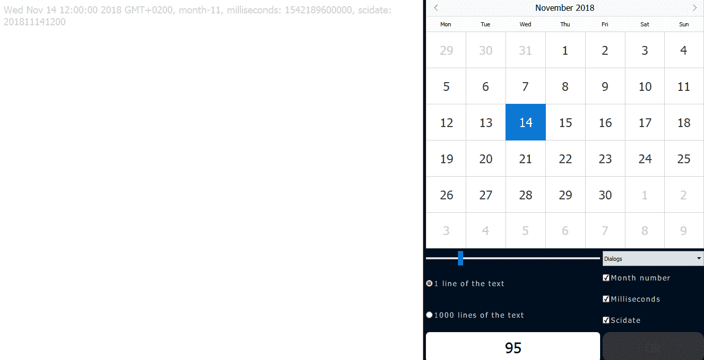
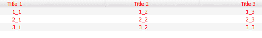

# Qt Quick 库

在本章中，我们将继续我们的 QML GUI 实现，并描述更详细的 Qt Quick 库——在 Qt 中处理 QML 的主要工具。通过使用 Qt Quick 模块，设计师和开发者可以轻松地在 QML 中构建流畅的动画 UI，并可以选择将这些 UI 连接到任何后端 C++库。Qt Quick 允许开发者创建高性能、流畅动画和视觉吸引力的应用程序。

在本章中，我们将介绍以下主题：

+   Qt Quick 模块简介

+   窗口子模块

+   控件

+   布局

# Qt Quick 模块简介

在 Qt 框架中，Qt Quick 模块允许我们使用用户创建的应用程序与 QML 一起工作和实现。Qt Quick 是 Qt 框架中用于处理 UI 和 QML 基础设施的主要模块。此模块扩展了 Qt 的功能并添加了一些功能。

# 基本类型

除了默认的 QML 类型外，Qt Quick 模块还提供了以下类型：

+   `date`: 日期值

+   `point`: 具有 x 和 y 属性的值

+   `rect`: 具有 x、y、width 和 height 属性的值

+   `size`: 具有 width 和 height 属性的值

+   `color`: ARGB 颜色值

+   `font`: 具有 QFont 属性的字体值

+   `matrix4x4`: 一个 4 行 4 列的矩阵

+   `quaternion`: 具有 x、y 和 z 属性的标量

+   `vector2d`: 具有 x 和 y 属性的 2D 向量

+   `vector3d`: 具有 x、y 和 z 属性的 3D 向量

+   `vector4d`: 具有 x、y、z 和 w 属性的 4D 向量

# Qt Quick 类型

在第二章“QML 概述”中，我们描述了创建 GUI 最流行的 Qt Quick 类型。这些类型的完整列表可在官方文档中找到：[`doc.qt.io/qt-5.9/qtquick-qmlmodule.html`](https://doc.qt.io/qt-5.9/qtquick-qmlmodule.html)。让我们看看一些我们尚未介绍的最有用的类型：

+   `Canvas`: 这提供了一个 2D 画布项，可以使用 JavaScript 进行绘图，以创建图形和其他视觉对象。

+   `Context2D`: 这为`Canvas`项上的形状提供 2D 上下文。

+   `AnimatedImage`: 这播放存储为一系列图像的动画，其中包含一系列帧。

+   `Drag`: 这指定了项目的拖放事件。

+   `DropArea`: 这指定了区域内的拖放处理。

+   `KeyEvent`: 这提供了关于按键事件的信息。

+   `MouseEvent`: 这允许你处理鼠标事件。

+   `WheelEvent`: 鼠标滚轮事件。

+   `Flickable`: 滑动表面。

+   `Flipable`: 翻转表面。

+   `FocusScope`: 明确创建一个焦点域。

+   `GridView`: 项目的模型网格视图。

+   `Image`: 显示图像。

+   `ListView`: 模型列表视图。

+   `Loader`: 从 URL 动态加载子树。

+   `MultiPointTouchArea`: 用于处理多个触摸点。

+   `Column`: 用于在列中定位项目。

+   `Flow`: 用于定位页面上的项目，如文字。

+   `Positioner`: 显示项目存在位置的附加属性。

+   `Row`: 用于以行形式定位项目。

+   `Repeater`: 用于创建基于项目的多个组件。

+   `ShaderEffect`: 用于向矩形添加着色器。

+   `GridMesh`: 一个顶点排列成网格的网格。

+   `TextEdit`: 一个多行文本字段。

+   `Matrix4x4`: 项目的 4 x 4 变换矩阵。

+   `Rotation`: 用于旋转一个项目。

+   `Scale`: 项目将进行缩放。

+   `Translate`: 用于移动一个项目，而不改变其`x`或`y`属性。

+   `FontLoader`: 用于通过名称或 URL 加载字体。

+   `FontMetrics`: 字体的度量信息。

# Qt Quick 子模块

Qt Quick 库包括包含类型的附加模块。其中一些将在本章中详细描述。以下是子模块列表：

+   `XmlListModel`: 提供从 XML 数据创建模型的数据类型。

+   `LocalStorage`: 一个用于 SQLite 数据库的 JavaScript 接口。

+   `Particles`: QML 应用程序的粒子系统。

+   `Window`: 用于创建顶级窗口和访问屏幕信息的数据类型。

+   `Dialogs`: 用于创建和交互系统对话框。

+   `Controls`: 可重用的 UI 组件（如按钮、复选框、标签等）。

+   `Layouts`: 用于排列项目。

+   `Tests`: 用于测试 QML 应用程序。

在本章中，我们将重点关注在 GUI 开发中使用的 重要类型和子模块。要获取完整信息，建议您访问 Qt Quick 文档（[`doc.qt.io/qt-5/qtquick-index.html`](https://doc.qt.io/qt-5/qtquick-index.html)）。在第二章“QML 概述”中，一些类型和模块通过示例实现，并进行了详细描述。让我们在这里做同样的事情。

# 窗口模块

此模块提供在创建顶级窗口、屏幕信息和窗口事件（例如窗口关闭时）时可以使用的类型。要使用此模块，请使用以下`import`语句：

```py
import QtQuick.Window 2.2
```

我们将在以下章节中介绍这些类型。

# 屏幕

此类型提供有关显示的屏幕、项目或窗口的信息。属性如下：

`desktopAvailableHeight`**:** 这个整数表示桌面分辨率的可用高度（以像素为单位）。

`desktopAvailableWidth`**:** 这个整数表示桌面分辨率的可用宽度（以像素为单位）。

`devicePixelRatio`**:** 这是一个`real`数，表示物理像素和设备无关像素的比率。在正常显示中值为`1.0`，在苹果的视网膜显示中为`2.0`。

`width`**:** 这个整数表示屏幕的宽度（以像素为单位）。

`height`**:** 这个整数表示屏幕的高度（以像素为单位）。

`name`**:** 这个字符串是屏幕的名称。

`orientation`**:** 这是屏幕的方向（使用加速度计）。

`orientationUpdateMask`**:** 这包含方向的更新掩码。

`primaryOrientation`**:** 屏幕的主要方向可以是`Qt.PortraitOrientation`或`Qt.LandscapeOrientation`，具体取决于屏幕的高度和宽度。

`pixelDensity`**:** 这个`real`数字是每毫米的物理像素数。

`virtualX`**:** 这个整数是屏幕与虚拟桌面相关的*x*坐标。

`virtualY`**:** 这个整数是屏幕与虚拟桌面相关的*y*坐标。

以下方法可用：

`angleBetween(a, b)`: 这返回`a`（第一个参数）和`b`（第二个参数）角度之间的旋转角度（以度为单位）。

让我们创建一个大小取决于设备屏幕分辨率的 QML 应用程序。为此，打开`u_qml.qml`文件，并使用以下行将`UQml.Window`的宽度和高度属性更改为屏幕类型值：

```py
...
UQml.Window {
    ... 
    width: UQml.Screen.desktopAvailableWidth
    height: UQml.Screen.desktopAvailableHeight
    ...
...
```

应用程序的窗口将具有`width`和`height`属性，这些属性适用于正在使用的设备。

# CloseEvent

此类型通知您，窗口即将由窗口系统关闭。它具有以下属性：

`accepted`: 这可以是`true`或`false`，并允许用户关闭窗口（默认为`true`）。

# Window

这为 GUI 应用程序创建了一个新的顶级窗口，该窗口可以包含元素和项目。此类型可用的属性如下：

`width`: 这个整数设置窗口的像素宽度。

`height`: 这个整数设置窗口的像素高度。

`maximumWidth`**:** 这个整数设置窗口将可用的最大宽度。

`maximumHeight`**:** 这个整数设置窗口将可用的最大高度。

`minimumWidth`**:** 这个整数设置窗口将可用的最小宽度。

`minimumHeight`**:** 这个整数设置窗口将可用的最小高度。

`x`**:** 这个整数是窗口在*x*轴上的位置。

`y`**:** 这个整数是窗口在*y*轴上的位置。

`opacity`**:** 这个`real`数字设置窗口的不透明度。值范围从`0.0`到`1.0`，其中`0.0`是完全透明的，`1.0`是完全不透明的。

`title`**:** 这个`string`设置窗口的标题。

`visible`**:** 这可以是`true`或`false`。如果是`true`，则窗口将是可见的；如果是`false`，则窗口将不可见（默认为`true`）。

`visibility`**: **这设置窗口的屏幕占用状态为`normal`、`minimized`、`maximized`或`fullscreen`。

`color`**:** 这设置窗口的背景颜色。

`modality`**:** 这会将窗口设置为模态（默认为`QtCore.Qt.NonModal`）。

`screen`**:** 这设置与此窗口关联的窗口。

`active`**:** 这可以是`true`或`false`，并设置窗口的状态。

`activeFocusItem`**:** 这是当前具有活动焦点的项目；如果没有项目具有活动焦点，则为 null。

`contentItem`**:** 这是场景的无形根`Item`。

`contentOrientation`**:** 这是对窗口管理器的额外内容的提示。

`data`**:** 这是一个列表，允许我们混合视觉对象、资源和其他窗口。

`flags`**:** 这些是此窗口可用的标志。

窗口类型提供了以下属性：

`Window.window`**:** `Window`类型 - 用于项目的窗口。

`Window.width`: 此整数是项目窗口的宽度。

`Window.height`**:** 此整数是项目窗口的高度。

`Window.visibility`**:** 此窗口将在窗口系统中显示，例如`normal`、`fullscreen`等。

`Window.active`: 这可以是`true`或`false`，表示窗口是否处于活动状态。

`Window.activeFocusItem`: 这显示当前哪个项目具有活动焦点。

`Window.contentItem`: 这是场景的无形根项目。

此类型有一个信号：

`closing(CloseEvent close)`: 当窗口尝试关闭时发出。

类型还具有以下方法：

`alert(int)`: 引发一个警告。

`close()`: 关闭窗口。

`hide()`: 隐藏窗口。

`lower()`: 降低窗口。

`raise()`: 提升窗口。

`requestActivate()`: 请求窗口被激活。

`show()`: 显示窗口。

`showFullScreen()`: 以全屏模式显示窗口。

`showMaximized()`: 以最大化模式显示窗口。

`showMinimized()`: 以最小化模式显示窗口。

`showNormal()`: 以正常模式显示窗口。

我们可以在`UQml.Window`部分的`u_qml.qml`文件中尝试更改/添加属性，并查看结果。

# Controls

`QtQuick.Controls`模块允许我们使用一组可重用的 UI 元素来构建应用程序的功能。您需要以下`import`语句才能使用此模块的类型：

```py
import QtQuick.Controls 1.4
```

在下一节中，我们将介绍此模块提供的类型。

# ApplicationWindow

此类型实现了一个具有以下属性的简单顶级应用程序窗口：

`contentItem`: 这是`ToolBar`和`StatusBar`之间的区域。

`menuBar`**:** 这设置应用程序窗口的菜单栏。

`toolBar`**:** 这设置应用程序的工具栏。

`statusBar`**:** 此项目设置状态栏。

`style`**:** 此组件用于设置应用程序的样式。

让我们看看以下示例：

1.  在`qmls/`目录中创建一个名为`UAppwin.qml`的文件，并添加以下行：

```py
import QtQuick 2.7
import QtQuick.Controls 1.4
import QtQuick.Controls.Styles 1.4
import QtQuick.Window 2.2 as SZ
import QtQuick.Layouts 1.3
import "bars" as Bars
import "." as Qmls
import "gradients" as SApp

ApplicationWindow {
    width: SZ.Screen.desktopAvailableWidth / 2
    height: SZ.Screen.desktopAvailableHeight / 2
    title: "QML Application"
    menuBar: Bars.MBar {}
    toolBar: Bars.TBar {}
...
```

应用程序窗口的宽度和高度将取决于设备的分辨率。此外，在`qmls/`文件夹内创建的`bars/`目录将用于导入此应用程序的菜单和状态栏。

1.  将条带到应用程序窗口的底部添加：

```py
...
    ...
    Bars.TaBar {
        id: tabar1
        width: parent.width
    }
...
```

标签栏的`id`和应用程序窗口的`width`被指定。

1.  然后，添加带有`UAppItems`的`StackLayout`类：

```py
...
    ...
    StackLayout {
        id: sl1
        width: tabar1.width
        height: tabar1.height
        currentIndex: tabar1.currentIndex
        Qmls.UAppItems {
            width: tabar1.width
            height: tabar1.height
        }
    }
```

这将添加用于堆叠布局表示的应用程序项目。

1.  在`UAppwin.qml`文件的底部添加应用程序窗口的状态栏：

```py
...
    ...
    statusBar: StatusBar {
        anchors.fill: parent
        Label { text: "Reading..."; color: "red" }
        style: StatusBarStyle {
            background: Rectangle {
                anchors.fill: parent
                SApp.UGradientWin {}
            }
        }
    }
}
```

`StatusBar`类使用`Label`进行文本和`style`进行渐变颜色。

现在，我们需要在`qmls/`目录内创建一个名为`bars/`的目录，该目录将用于应用程序窗口的元素，例如标签栏、菜单和状态栏。让我们执行以下步骤：

1.  在`bars/`文件夹中创建一个名为`MBar.qml`的文件，并包含以下行：

```py
import QtQuick.Controls 1.4

MenuBar {
    Menu {
        title: "File"
        MenuItem { text: "New" }
        MenuItem { text: "Open" }
        MenuItem { text: "Save" }
        MenuItem { text: "Save as" }
    }
    Menu {
        title: "Edit"
        MenuItem { text: "Cut" }
        MenuItem { text: "Copy" }
        MenuItem { text: "Paste" }
    }
    Menu {
        title: "Tools"
        MenuItem { text: "Tool # 1" }
        MenuItem { text: "Tool # 2" }
        MenuItem { text: "Tool # 3" }
    }
}
```

对于每个菜单部分，我们需要添加带有文本的`MenuItem`：

1.  在`bars/`目录内创建一个名为`TBar.qml`的文件，用于应用程序的工具栏：

```py
import QtQuick 2.7
import QtQuick.Controls 1.4
import QtQuick.Layouts 1.2

ToolBar {
    RowLayout {
        anchors.fill: parent
        ToolButton {
            iconSource: "Icons/python1.png"
        }
        ToolButton {
            iconSource: "Icons/python2.png"
        }
        ToolButton {
            iconSource: "Icons/Aiconda.png"
        }
        Item { Layout.fillWidth: true }
    }
}
```

对于每个工具栏项目，使用`Icons/`文件夹中可用的图标创建一个工具按钮，该文件夹位于`bars/`目录中。工具按钮以行布局排列。

1.  在`bars/`目录内的`TaBar.qml`文件中创建中心元素，或`TabBar`：

```py
import QtQuick 2.7
import QtQuick.Controls 2.2

TabBar {
    anchors.fill: parent
    Repeater {
        model: ["Actions", "Views", "Models"]
        TabButton {
            text: modelData
        }
    }
}
```

此`TabBar`将在应用程序中使用几个标签。这些标签添加在`model`属性中。每个标签使用带有模型数据文本的标签按钮。`Repeater`类型用于重复`TabButton`类型以重复模型中的每个元素。为了使用此标签栏与我们的应用程序，我们需要添加一些对象，例如项目、图像、视频和动画。

1.  在`qmls/`目录内创建一个名为`UAppItems.qml`的文件（类似于`UItems.qml`），以实现带有应用程序窗口的动画对象：

```py
import QtQuick 2.7
import QtQuick.Layouts 1.3
import "." as Qmls

GridLayout {
    anchors.centerIn: parent
    columns: 3
...
```

`GridLayout`定位项目。

1.  将第一个发光矩形添加到`GridLayout`的底部：

```py
...
    ...
    Qmls.URectGlow {
        id: rg1
        Layout.leftMargin: parent.width / 100
        Layout.rightMargin: parent.width / 100
        Layout.topMargin: parent.height / 4
        Layout.bottomMargin: parent.height / 12
        Layout.fillWidth: true
        Layout.fillHeight: true
        color: Qt.rgba(0, 0.07, 0.14, 1);
        glowcolor: Qt.rgba(0.95, 0, 0, 1);
        txglow: Qt.rgba(0.77, 0, 0, 1);
        txtext: "PUSH"
        txcolor: Qt.rgba(0.2, 0.2, 0.2, 1)
        signal acolored(color ucolor)
    ...
...
```

在此矩形中，指定了每侧边距的布局属性。这将用于元素之间的空间。

1.  将`function`添加到第一个矩形：

```py
...
    ...
        ...
        function onAcolor(ucolor) {
            if (ucolor==Qt.rgba(0.95, 0, 0, 1)) {
                return [Qt.rgba(0.2, 0.2, 0.2, 1), 0.5,
                        Qt.rgba(0, 0.07, 0.14, 1), 0.5,
                        Qt.rgba(0, 0.07, 0.14, 1)];
                } else {
                return [Qt.rgba(0.95, 0, 0, 1), 10,
                        Qt.rgba(0, 0.07, 0.14, 1), 0.1,
                        Qt.rgba(0.77, 0, 0, 1)];
            };
        }
    ...
...
```

此函数返回一个颜色列表，取决于作为参数传递的颜色。

1.  将处理程序和`MouseArea`添加到第一个网格布局的元素：

```py
...
    ...
        ...
        onAcolored: {
            var acol = onAcolor(rg1.glowcolor)
            rg1.glowcolor = acol[0];
            rg1.glowr = acol[1];
            rg1.color = acol[2];
            rg1.spr = acol[3];
            rg1.txglow = acol[4];
        }
        MouseArea {
            anchors.fill: parent
            onClicked: rg1.acolored(Qt.rgba(0.2, 0.2, 0.2, 1))
        }
    }
...
```

`onAcolored`处理程序调用`onAcolor`函数，并相应地更改第一个矩形的属性。

1.  将第二个发光矩形添加到`GridLayout`的底部：

```py
...
    ...
    Qmls.URectGlow {
        id: rg2
        Layout.leftMargin: parent.width / 100
        Layout.rightMargin: parent.width / 100
        Layout.topMargin: parent.height / 4
        Layout.bottomMargin: parent.height / 12
        Layout.fillWidth: true
        Layout.fillHeight: true
        color: Qt.rgba(0, 0.07, 0.14, 1);
        glowcolor: Qt.rgba(0.95, 0, 0, 1);
        txglow: Qt.rgba(0.77, 0, 0, 1);
        txtext: "PUSH"
        txcolor: Qt.rgba(0.2, 0.2, 0.2, 1)
    ...
...
```

第二个矩形使用与第一个类似的属性。

1.  然后，将连续动画添加到第二个矩形中：

```py
...
    ...
        ...
        SequentialAnimation {
            id: sa2; running: false
            loops: Animation.Infinite
            PropertyAnimation {
                target: rg2
                properties: "glowcolor,txglow"
                from: Qt.rgba(0.95, 0, 0, 1);
                to: Qt.rgba(0.007, 1, 1, 1);
                duration: 7000
                easing.type: Easing.OutInElastic
            }
            PropertyAnimation { 
                target: rg2
                properties: "glowcolor,txglow"
                from: Qt.rgba(0.007, 1, 1, 1);
                to: Qt.rgba(0.95, 0, 0, 1);
                duration: 7000
                easing.type: Easing.OutInElastic
            }
        }
        MouseArea {
            anchors.fill: parent; onClicked: sa2.running = true;
        }
    }
...
```

这些动画用于动画矩形发光和文本发光颜色的颜色变化。

1.  将第三个元素添加到应用程序窗口的标签中：

```py
...
    ...
    Qmls.URectGlow {
        id: rg3
        Layout.leftMargin: parent.width / 100
        Layout.rightMargin: parent.width / 100
        Layout.topMargin: parent.height / 4
        Layout.bottomMargin: parent.height / 12
        Layout.fillWidth: true
        Layout.fillHeight: true
        color: Qt.rgba(0, 0.07, 0.14, 1);
        glowcolor: Qt.rgba(0.95, 0, 0, 1);
        txglow: Qt.rgba(0.77, 0, 0, 1);
        txtext: "PUSH"
        txcolor: Qt.rgba(0.2, 0.2, 0.2, 1)
    ...
...
```

此标签元素与该标签中的其他元素类似。

1.  向标签的第三个元素（发光矩形）添加并行动画：

```py
...
    ...
        ...
        ParallelAnimation {
            id: pa3; running: false
            loops: Animation.Infinite
            PropertyAnimation {
                target: rg3
                properties: "glowcolor,txglow"
                to: Qt.rgba(0, 0.07, 0.14, 1);
                duration: 7000
                easing.type: Easing.OutInElastic
            }
            PropertyAnimation {
                target: rg3
                properties: "glowr,spr"
                to: 1
                duration: 7000
            }
        }
        MouseArea {
            anchors.fill: parent; onClicked: pa3.running = true
        }
    }
}
```

此类型使用`PropertyAnimation`类型来并行更改不同的属性。

现在我们需要在`URectGlow.qml`文件中进行一些更改：

1.  向`URectGlow.qml`文件添加新属性：

```py
...
Rectangle {
    property color glowcolor
    property color txglow
    property string txtext
    property color txcolor
    property real glowr: 10
    property real spr: 0.1
    property real whr: 1.5
    property real rdx: 14
...
```

在这里，我们已向发光矩形添加了自定义属性，可以在任何地方更改，这将重新实现此对象在应用程序中。

1.  现在我们需要更改`URectGlow.qml`的所有相关属性，以便它们成为自定义属性：

```py
...
    ...
    RectangularGlow {
        ...
        glowRadius: parent.glowr
        spread: parent.spr
        ...
    }
    Rectangle {
        ...
        width: parent.width / parent.whr
        height: parent.height / parent.whr
        ...
        radius: rdx
        Text {
            ...
            text: txtext
            ...
            color: txcolor
        }
        Glow {
            ...
            radius: parent.radius / 2
            ...
        }
    }
...
```

将属性更改为自定义属性的值，以在应用程序中重新实现它们。

1.  为了使应用程序正常工作，建议您将以下行添加到应用程序的每个矩形发光元素中：

```py
...
GridLayout {
    ...
    Uqmls.URectGlow {
        ... 
        txtext: "PUSH"
        txcolor: Qt.rgba(0.2, 0.2, 0.2, 1)
        ...
    ...
...
```

我们已将矩形的属性更改为新创建的自定义属性。

1.  要显示此结果，我们可以在`u_qml.qml`文件中添加以下行，在矩形之前某处，使用`id: rect1`：

```py
...
    ...
    Uqmls.UAppwin { id: appwin1; visible: true }
    ...
...
```

前一行将演示应用程序窗口添加到主窗口应用程序中。使用`u_app.py` Python 文件运行`u_qml.qml`文件。您将看到带有条形、菜单和动画项的应用程序窗口：



应用程序窗口有一个顶部面板、工具栏、中央小部件和状态栏。中央小部件的按钮提供动画效果。

# Button

在 GUI 中最受欢迎的类型是按钮。这是一个带有文本标签的推按钮。您需要以下`import`语句：

```py
import QtQuick.Controls 1.4
```

它具有以下属性：

`action`: 这是一个关联的按钮动作，例如文本或工具提示。

`checkable`**:** 这可以是`true`或`false`。如果是`true`，按钮将是可检查的，即当用户按下此按钮时它将保持按下状态（默认为`false`）。

`checked`**:** 这可以是`true`或`false`。如果是`true`，按钮将被选中（默认为`false`）。仅在`checkable`设置为`true`时可用。

`exclusiveGroup`**:** 这确定按钮是否属于一个组。

`hovered`**:** 这可以是`true`或`false`，并指示按钮是否正在悬停。

`iconName`**:** 这是一个`string`，是图像源的主题名称。

`iconSource`**:** 这是一个 URL。按钮将使用提供的 URL 中的图标图像。

`isDefault`**:** 这可以是`true`或`false`。此按钮将是默认按钮，或当按下*Enter*键时将被点击。

`menu`**:** 这为按钮提供了一个下拉菜单。

`pressed`**:** 这可以是`true`或`false`。如果是`true`，按钮已被按下。

`style`**:** 这个组件用于按钮的样式，例如`ButtonStyle`。

`text`**:** 这是一个`string`，将文本设置到按钮上。

`tooltip`: 这是一个`string`，为按钮设置工具提示。

它还具有以下信号：

`clicked()`: 当按钮被点击时发出。

# ButtonStyle

可以使用`ButtonStyle`类型来样式化按钮。您需要以下`import`语句：

```py
import QtQuick.Controls.Styles 1.4
```

它具有以下属性：

`background`**:** 这个组件用于按钮的背景样式。

`control`**:** 这是`Button` QML 类型的按钮，它将附加到该按钮上的样式。

`label`**:** 这个组件用于样式化此按钮的标签。

让我们看看以下示例：

1.  修改`UButton.qml`文件：

```py
import QtQuick 2.7
import QtQuick.Controls 1.4
import QtQuick.Controls.Styles 1.4
import "." as Qmls

Button {
    property color bcolor: Qt.rgba(0, 0.07, 0.14, 1);
    property color gcolor: Qt.rgba(0.95, 0, 0, 1);
    property color tgcolor: Qt.rgba(0.77, 0, 0, 1);
    property color tcolor: Qt.rgba(0.2, 0.2, 0.2, 1);
    property real glrd: 3
    property real sprd: 0.5
    property string btext
...
```

这是一个标准的推按钮，具有指定的自定义属性，如颜色、发光半径、扩散和文本。

1.  使用`ButtonStyle`类型将`style`属性添加到按钮中：

```py
...
    ...
    style: ButtonStyle {
        background: Qmls.URectGlow {
            id: but1
            txtext: btext
            txcolor: tcolor
            color: bcolor
            glowcolor: gcolor
            txglow: tgcolor
            glowr: glrd
            spr: sprd
            whr: 1.2
            rdx: 7
        }
    }
}
```

在这里，我们使用`ButtonStyle`类型和背景属性来设置按钮样式，这将使用按钮的自定义属性。现在我们需要向`u_qml.qml`文件中添加一些行。

1.  在导入部分，添加可以与按钮和其他相关元素一起使用的控件和控件样式：

```py
...
import QtQuick.Controls 1.4
import QtQuick.Controls.Styles 1.4
...
```

导入元素的版本可能因你使用的 Qt 库版本而异。

1.  在具有`id: rect2`的矩形内添加第一个按钮：

```py
...
    ...
        ...
        Uqmls.URect {
            ...
            Uqmls.UButton {
                id: ubut1
                width: rect2.width
                height: rect2.height / 10
                btext: "HIDE"
                tooltip: "Hide the panel with buttons"
                MouseArea {
                    anchors.fill: parent; hoverEnabled: true
                    onEntered: {
                        parent.tcolor = Qt.rgba(1, 0, 0, 1); 
                    }
                    onExited: {
                        parent.tcolor = Qt.rgba(0.2, 0.2, 0.2, 1);
                    }
                    onClicked: {
                        rect2.visible = false; 
                        rect1.width = UQml.Window.width;} 
                    }
                }
            }
        ...
    ...
...
```

在这里，我们在按钮的鼠标区域使用不同类型的信号处理器。

1.  在第一个按钮之后添加第二个按钮：

```py
...
    ...
        ... 
        Uqmls.UButton {
            id: ubut2
            width: rect2.width
            height: rect2.height / 10
            y: rect2.height / 10 
            btext: "APPS"
            tooltip: "Run example of the Application Window"
        ...
    ...
...
```

如此按钮中指定的`tooltip`属性将提供使用动作的提示信息。

1.  在第二个按钮的底部添加顺序动画：

```py
...
    ...
        ...
            ...
            SequentialAnimation {
                id: sa1; running: false; loops: 1
                PropertyAnimation {
                    target: ubut2; property: "glrd"; to: 7;
                    duration: 100;
                }
                PropertyAnimation {
                    target: ubut2; property: "glrd"; to: 3;
                    duration: 100
                }
            }
        ...
    ...
...
```

这用于通过动画实现悬停和闪烁效果。

1.  将`MouseArea`类型添加到第二个按钮：

```py
...
    ...
        ...
            ...
             MouseArea {
                anchors.fill: parent; hoverEnabled: true
                onEntered: {
                    parent.tcolor = Qt.rgba(1, 0, 0, 1);
                }
                onExited: {
                    parent.tcolor = Qt.rgba(0.2, 0.2, 0.2, 1);
                }
                onClicked: {
                    sa1.running = true; appwin1.visible = true;
                }
            }
        }
```

这些信号处理器用于处理诸如光标进入区域、光标从区域退出以及点击等事件。

1.  现在在第二个按钮之后添加第三个按钮：

```py
...
    ...
        ...
        Uqmls.UButton {
            id: ubut3
            width: rect2.width
            height: rect2.height / 10
            y: (rect2.height / 10) * 2
            btext: "TOOL"
            tooltip: "Show animated rectangles as item elements"
        ...
    ...
...
```

点击此按钮将在应用程序窗口中显示动画矩形。

1.  将`MouseArea`类型和`onClicked`处理器添加到第三个按钮：

```py
...
    ...
        ...
            ...
            MouseArea {
                anchors.fill: parent; hoverEnabled: true
                onEntered: {
                    ubut3.tcolor = Qt.rgba(1, 0, 0, 1);
                }
                onExited: {
                    ubut3.tcolor = Qt.rgba(0.2, 0.2, 0.2, 1);
                }
                onClicked: {ubut3.clicked()}
            }
            onClicked: {
                ubut3.glrd == 3 ? ubut3.glrd = 7 : ubut3.glrd = 3;
                if (ubut3.glrd==7) {
                    main_item.visible = true;
                    grid1.visible = false;
                } else {
                    main_item.visible = false;
                    grid1.visible = true;
                };
            }
        }
    ...
...
```

`onClicked`处理器使用 JavaScript 指令使应用程序窗口的第一个矩形中的`main_item`和`grid1`可见/不可见。

现在我们需要从`u_qml.qml`文件中剪切`Grid`，在`qmls/`目录中创建一个名为`UGrid.qml`的文件，将`Grid`粘贴到该文件中，并使用`GridLayout`重建代码行。

1.  将`Grid`元素的定位更改为`GridLayout`构建。

```py
import QtQuick 2.7
import QtQuick.Layouts 1.3
import "." as Uqmls

GridLayout {
    Uqmls.UCircle {id: g1;Layout.margins: 20
    Layout.fillWidth: true;Layout.fillHeight: true}
    Uqmls.URectLG {id: g2;Layout.margins: 20
    Layout.fillWidth: true;Layout.fillHeight: true}
    Uqmls.URectRG {id: g3;Layout.margins: 20
    Layout.fillWidth: true;Layout.fillHeight: true}
    Uqmls.URectCG {id: g4;Layout.margins: 20
    Layout.fillWidth: true;Layout.fillHeight: true}
    ...
...
```

这是我们在使用`GridLayout`定位之前使用的项目构建。

1.  将具有发光效果的第一个矩形添加到`UGrid.qml`文件中：

```py
...
    ...
    Uqmls.URectGlow {
        id: g5; Layout.fillWidth: true; Layout.fillHeight: true
        Layout.margins: 20
        color: Qt.rgba(0, 0.07, 0.14, 1);
        glowcolor: Qt.rgba(0.007, 1, 1, 1);
        txglow: Qt.rgba(0.007, 0.7, 0.7, 1);
        txtext: "PUSH"
        txcolor: Qt.rgba(0.2, 0.2, 0.2, 1)
        ...
    ...
...
```

将自定义和布局属性添加到这个矩形中。

1.  将`MouseArea`和`RotationAnimator` QML 类型添加到第一个矩形中：

```py
...
    ...
        ...
         MouseArea {
            anchors.fill: parent
            onClicked: {
                g5.glowcolor == Qt.rgba(0.007, 1, 1, 1) ?
                g5.glowcolor = Qt.rgba(0, 0.07, 0.14, 1) :
                g5.glowcolor = Qt.rgba(0.007, 1, 1, 1);
                g5.txglow == Qt.rgba(0, 0.07, 0.14, 1) ?
                g5.txglow = Qt.rgba(0.007, 1, 1, 1) :
                g5.txglow = Qt.rgba(0, 0.07, 0.14, 1);
                g5a.running == true ? 
                g5a.running = false : g5a.running = true;
            }
        }
        RotationAnimator {
            id: g5a; running: false; loops: Animation.Infinite
            target: g1
            to: 360
            duration: 1000
            easing.type: Easing.Linear
        }
    }
...
```

此动画器将以`360`度顺时针旋转具有指定`id`属性的项目，速度取决于`duration`属性。动画将是无限的。

1.  将第二个矩形添加到`UGrid.qml`文件中：

```py
...
    ...
     Uqmls.URectGlow {
        id: g6; Layout.fillWidth: true; Layout.fillHeight: true
        Layout.margins: 20
        color: Qt.rgba(0, 0.07, 0.14, 1);
        glowcolor: Qt.rgba(0.95, 0, 0, 1);
        txglow: Qt.rgba(0.77, 0, 0, 1);
        txtext: "PUSH"
        txcolor: Qt.rgba(0.2, 0.2, 0.2, 1)
        ...
    ...
...
```

这是具有`id`和`Layout`属性的第二个矩形。

1.  将`MouseArea`和`RotationAnimator`类型添加到第二个矩形的底部：

```py
...
    ...
        ...
        MouseArea {
            anchors.fill: parent
            onClicked: {
                g6.glowcolor == Qt.rgba(0.95, 0, 0, 1) ?
                g6.glowcolor = Qt.rgba(0, 0.07, 0.14, 1) :
                g6.glowcolor = Qt.rgba(0.95, 0, 0, 1);
                g6.txglow == Qt.rgba(0, 0.07, 0.14, 1) ?
                g6.txglow = Qt.rgba(0.77, 0, 0, 1) :
                g6.txglow = Qt.rgba(0, 0.07, 0.14, 1);
                g6a.running == true ? 
                g6a.running = false : g6a.running = true;
            }
        }
        RotationAnimator {
            id: g6a; running: false; loops: Animation.Infinite
            target: g2
            to: 360
            duration: 300
            easing.type: Easing.InQuad
        }
    }
...
```

这个`RotationAnimator`的`duration`属性比第一个矩形中的要小，因此这个圆圈将旋转得更快。

1.  将第三个矩形添加到`UGrid.qml`文件中：

```py
...
    ...
    Uqmls.URectGlow {             
        id: g7; Layout.fillWidth: true; Layout.fillHeight: true
        Layout.margins: 20    
        color: Qt.rgba(0, 0.07, 0.14, 1);  
        glowcolor: Qt.rgba(0,0.95,0.37,1); 
        txglow: Qt.rgba(0,0.47,0.37,1);    
        txtext: "PUSH"                     
        txcolor: Qt.rgba(0.2, 0.2, 0.2, 1) 
    ...
...
```

这是第三个带有发光效果的矩形，具有`id: g7`属性和填充宽度和高度的`Layout`属性。

1.  将`MouseArea`和`RotationAnimator`添加到第三个矩形中：

```py
...
    ...
        ...
        MouseArea {
            anchors.fill: parent
            onClicked: {
                g7.glowcolor == Qt.rgba(0, 0.95, 0.37, 1) ?
                g7.glowcolor = Qt.rgba(0, 0.07, 0.14, 1) :
                g7.glowcolor = Qt.rgba(0, 0.95, 0.37, 1);
                g7.txglow == Qt.rgba(0, 0.07, 0.14, 1) ?
                g7.txglow = Qt.rgba(0, 0.47, 0.37, 1) :
                g7.txglow = Qt.rgba(0, 0.07, 0.14, 1);
                g7a.running == true ?
                g7a.running = false : g7a.running = true;
            }
        }
        RotationAnimator {
            id: g7a; running: false; loops: Animation.Infinite
            target: g3
            to: 360
            duration: 200
            easing.type: Easing.InCubic
        }
    }
...
```

此`RotationAnimator`将比前两个旋转目标圆圈更快。

1.  最后，将第四个矩形添加到应用程序中：

```py
...
    ...
    Uqmls.URectGlow {
        id: g8; Layout.fillWidth: true; Layout.fillHeight: true
        Layout.margins: 20
        color: Qt.rgba(0, 0.07, 0.14, 1);
        glowcolor: Qt.rgba(1, 1, 1, 1);
        txglow: "grey";
        txtext: "PUSH"
        txcolor: Qt.rgba(0.2, 0.2, 0.2, 1)
    ...
...
```

这个矩形使用命名颜色`grey`为矩形的`txtglow`属性。

1.  最后，对于最后一个矩形，添加 `MouseArea` 和 `RotationAnimator` 类型：

```py
...
    ...
        ...
        MouseArea {
            anchors.fill: parent
            onClicked: {
                g8.glowcolor == Qt.rgba(1, 1, 1, 1) ?
                g8.glowcolor = Qt.rgba(0, 0.07, 0.14, 1) :
                g8.glowcolor = Qt.rgba(1, 1, 1, 1);
                g8.txglow == Qt.rgba(0, 0.07, 0.14, 1) ?
                g8.txglow = "grey" :
                g8.txglow = Qt.rgba(0, 0.07, 0.14, 1);
                g8a.running == true ?
                g8a.running = false : g8a.running = true;
            }
        }
        RotationAnimator {
            id: g8a; running: false; loops: Animation.Infinite
            target: g4
            to: 360
            duration: 100
            easing.type: Easing.InQuart
        }
    }
}
```

此动画器将以比前一个圆圈更快的速度旋转目标圆圈。以下示例演示了使用 `Button`、`Rectangle` 和 `MouseArea` QML 类型创建和设置按钮样式的原理。

通过使用此代码进行练习，可以帮助你理解这些基础知识。最后，为了在应用程序中实现按钮，让我们更改 `u_qml.qml` 文件：

1.  将 `UAppwin`、`UItem` 和 `UGrid` 属性添加/设置到应用程序中：

```py
... 
    ...
        ...
            ...
            Uqmls.UAppwin {
                id: appwin1
                visible: false
            }
            Uqmls.UItem {
                id: main_item
                visible: false
                width: rect1.width
                height: parent.height - rect1.height
                y: rect1.height
            }
            Uqmls.UGrid {
                id: grid1
                anchors.fill: parent
                visible: true
                function wsize() {
                    if (parent.width > 590) {
                        return 4;
                    } 
                    else {return 2;};
                }
                columns: wsize();
            }
        ...
    ...
...
```

将 `UItem` 和 `UAppwin` 的可见属性设置为 `false`。默认情况下，`UGrid` 将带有圆圈和发光矩形可见。现在我们可以运行应用程序，我们将看到以下结果：



如果我们按下这些按钮，相关的圆圈将旋转，如果我们再次按下，相关的圆圈将停止。

# CheckBox

`CheckBox` 按钮允许用户选择一个或多个选项。复选框按钮可以切换以选中选项，也可以取消选中，它由复选框和文本标签组成。为此类型需要以下 `import` 语句：

```py
import QtQuick.Controls 1.4
```

它具有以下属性：

`checked`**:** 这可以是 `true` 或 `false`。如果复选框被选中，则为 `true`。

`pressed`**:** 这可以是 `true` 或 `false`。如果复选框被选中，则为 `true`。

`hovered`**:** 这可以是 `true` 或 `false`。如果鼠标指针悬停在复选框上，则为 `true`。

`partiallyCheckedEnabled` **:** 这可以是 `true` 或 `false`。它使得 `Qt.PartiallyChecked` 状态可用。

`text`**:** 这是一个 `string`，用于设置将显示在复选框附近的文本。

`tooltip`**:** 这是一个 `string`，用于为此按钮设置工具提示。

`checkedState`**:** 这是一个整数，用于设置按钮的当前状态。`1` 表示选中，`0` 表示未选中，`2` 表示部分选中。

`activeFocusOnPress`**:** 这可以是 `true` 或 `false`。当按下时，复选框将被聚焦。

`exclusiveGroup`**:** 这将设置复选框所属的组。

`style`**:** 此组件为此按钮提供样式，例如 `CheckBoxStyle` 类型。`CheckBoxStyle` 类型包括 `background`、`control`、`indicator`、`label` 和 `spacing` 属性。

# ComboBox

此类型允许用户从下拉列表的多个选项中进行选择或实现模型以表示 `ComboBox`。使用以下 `import` 语句：

```py
import QtQuick.Controls 1.4
```

它具有以下属性：

`count`**:** 这是一个整数，表示组合框中的项目数量。

`currentIndex`**:** 这是一个整数，表示组合框中选中项的索引。

`currentText`**:** 这是一个 `string`，用于设置选中项的文本。

`pressed`**:** 这可以是 `true` 或 `false`。如果 `ComboBox` 被按下，则为 `true`。

`hovered`**:** 这可以是 `true` 或 `false`。如果鼠标指针悬停在框上，则为 `true`。

`editable`**:** 这可以是`true`或`false`。它将使组合框内的文本可编辑。

`editText`**:** 这是一个表示可编辑`ComboBox`中文本的`string`，可以对其进行编辑。

`selectByMouse`**:** 这可以是`true`或`false`，它为你提供了使用鼠标选择可编辑`ComboBox`中文本的能力。

`menu`**:** 此组件设置一个菜单，以便你可以处理文本选择，例如`menu`类型组件。

`model`**:** 这将用于实现`ComboBox`。

`inputMethodComposing`**:** 这可以是`true`或`false`。如果为`true`，可编辑的`ComboBox`有来自输入方法的文本输入。

`inputMethodHints`**:** 这个`enumeration`为输入设置了有关预期内容的提示，例如`Qt.ImhHiddenText`，这将是一个密码字段，或者`Qt.ImhDate`，这将是一个日期字段。

`acceptableInput`**:** 这可以是`true`或`false`。如果为`true`，可编辑文本字段包含可接受的文本。

`activeFocusOnPress`**:** 这可以是`true`或`false`。按下时，`ComboBox`将被聚焦。

`textRole`**:** 这是一个可以作为`ComboBox`模型角色的`string`。

`validator`**:** 这为可编辑的`ComboBox`设置了一个文本验证器。

`style`**:** 此组件用于`ComboBox`的样式，例如`ComboBoxStyle`类型。`ComboBoxStyle`具有`background`、`control`、`dropDownButtonWidth`、`font`、`label`、`renderType`、`selectedTextColor`、`selectionColor`和`textColor`属性。

# RadioButton

此类按钮提供在不同选项之间的选择，并且一次只能选择一个。此按钮由单选按钮控件和文本标签组成。你需要以下`import`语句：

```py
import QtQuick.Controls 1.4
```

它具有以下属性：

`checked`**:** 这可以是`true`或`false`。如果单选按钮被选中，则为`true`。

`pressed`**:** 这可以是`true`或`false`。如果按钮被按下，则为`true`。

`hovered`**:** 这可以是`true`或`false`。如果鼠标指针悬停在按钮上，则为`true`。

`text`**:** 这是一个设置靠近单选按钮显示的文本的`string`。

`tooltip`**:** 这是一个设置此按钮提示的`string`。

`activeFocusOnPress`**:** 这可以是`true`或`false`。按下时，单选按钮将被聚焦。

`exclusiveGroup`**:** 这是按钮所属的组。

`style`**:** 此组件为按钮提供样式，例如`RadioButtonStyle`类型。在`RadioButtonStyle`类型中，`background`、`control`、`indicator`、`label`和`spacing`属性可用。

# TextField

这些元素提供了处理和可视化文本数据的功能。用户可以从文件粘贴、复制、编辑和手动插入文本，或者使用与文本字段中的文本相关的其他操作。在`QtQuick`模块中，`TextArea`和`TextField`类型可用于这些任务。

# TextArea

此类型允许编辑格式化的文本行。我们需要使用以下`import`语句：

```py
import QtQuick.Controls 1.4
```

它具有以下属性：

`text`**:** 这是一个将在文本区域中显示的`string`。

`textFormat`**:** 这个`enumeration`是`TextArea`将提供的文本字段类型。它可以是指定文本将自动确定是纯文本还是富文本的`TextEdit.AutoText`；`TextEdit.PlainText`，其中文本将是纯文本；以及`TextEdit.RichText`，这将使文本成为富文本。

`textDocument`**:** `textDocument`属性公开了`QQuickTextDocument`类。

**`baseUrl`:** 这指定了一个基础 URL，该 URL 将用于解析文本中的相对 URL。

**`hoveredLink`:** 这是一个链接`string`。当鼠标悬停时，可以看到文本中已嵌入链接。

**`wrapMode`:** 这个`enumeration`提供了与文本区域宽度相关的文本换行。可用的标志如下：

+   `TextEdit.NoWrap`: 将不可用换行。

+   `TextEdit.WordWrap`: 按单词进行文本换行（默认）。

+   `TextEdit.WrapAnywhere`: 文本将在任何地方换行。

+   `TextEdit.Wrap`: 如果可能，文本将按单词换行，或者如果文本行长且没有空格，则将在行的适当位置换行。

`length`**:** 这是一个整数，表示文本区域中纯文本字符的数量。

`lineCount`**:** 这是一个整数，表示文本中的行数。

`inputMethodComposing`**:** 这可以是`true`或`false`。如果为`true`，则文本区域将具有来自输入方法的文本输入。

`inputMethodHints`**:** 这个`enumeration`提供了可以与文本区域标志（如`Qt.ImhHiddenText`用于密码）一起实现的输入方法类型。

`readOnly`**:** 这可以是`true`或`false`。如果为`true`，则文本区域将是只读的。

`selectByKeyboard`**:** 这可以是`true`或`false`，如果为`true`，则允许用户使用键盘选择文本（默认为`true`）。

`selectByMouse`**:** 这可以是`true`或`false`，如果为`true`，则允许用户使用鼠标选择文本（默认为`true`）。

`selectedText`**:** 这是一个表示当前选中文本的`string`。

`selectionStart`**:** 这是一个整数，表示光标在选中文本第一个字符前的位置。

`selectionEnd`**:** 这是一个整数，表示光标在选中文本最后一个字符后的位置。

`canPaste`**:** 这可以是`true`或`false`，如果剪贴板中的内容可以粘贴到文本区域中，则返回`true`。

`canRedo`**:** 这可以是`true`或`false`，如果文本已被编辑并且可以重做，则返回`true`。

`canUndo`**:** 这可以是`true`或`false`，如果文本已被编辑并且可以撤销，则返回`true`。

`cursorPosition`**:** 这是一个整数，表示光标在文本区域中的位置。

`cursorRectangle`**:** 这是文本光标在文本区域中渲染的矩形。

`activeFocusOnPress`**:** 这可以是 `true` 或 `false`。如果为 `true`，则在按下时文本区域将被聚焦。

`backgroundVisible`**:** 这可以是 `true` 或 `false`，如果为 `true`，则背景被填充（默认为 `true`）。

`tabChangesFocus`**:** 这可以是 `true` 或 `false`。此属性确定制表符是否改变焦点，或作为输入接受（默认为 `false`）。

`effectiveHorizontalAlignment`**:** 这个 `枚举` 是文本的有效水平对齐。

`horizontalAlignment`**:** 这个 `枚举` 设置文本的对齐方式，例如 `TextEdit.AlignHCenter`。

`verticalAlignment`**:** 这个 `枚举` 设置文本的对齐方式，例如 `TextEdit.AlignTop`、`TextEdit.AlignVCenter`（默认）或 `TextEdit.AlignBottom`。

`textMargin`**:** 这定义了文本区域周围（以像素为单位）的边距。

`textColor`**:** 这是区域中文本的颜色。

`font`**:** 这是文本的字体。

`menu`**:** 这个组件是用于处理文本选择的编辑菜单。

`style`**:** 这个组件为文本区域提供样式，例如 `TextAreaStyle` 类型。`TextAreaStyle` 中的属性有 `backgroundColor`、`control`、`renderType`、`font`、`selectedTextColor`、`selectionColor`、`textColor` 和 `textMargin`。

以下信号可用：

`editingFinished()`: 当区域失去焦点时，这将发出。处理程序是 `onEditingFinished`。

`linkActivated(string link)`: 当用户在文本中点击链接时，这将发出。处理程序是 `onLinkActivated`。

`linkHovered(string link)`: 当文本中的链接被悬停时，这将发出。处理程序是 `onLinkHovered`。

以下是其方法：

`append(string text)`: 这将在文本末尾添加一个新的 `string` 行。

`copy()`: 这将选定的文本复制到剪贴板。

`cut()`: 这将选定的文本剪切到剪贴板。

`paste()`: 这将剪贴板中选定的文本插入到文本区域。

`deselect()`: 这将移除文本选择。

`getFormattedText(int start, int end)`: 这将在起始和结束位置之间返回带有格式的文本。

`getText(int start, int end)`: 这将在起始和结束位置之间返回未格式化的文本。

`insert(int position, string text)`: 这将在文本区域的指定位置插入文本。

`isRightToLeft(int start, int end)`: 如果起始/结束位置之间的文本方向是从右到左，则为 `true`。

`moveCursorSelection(int position, mode=TextEdit.SelectCharacters)`: 这将光标移动到指定的位置并更新模式参数。

`positionToRectangle(position)`: 这将在文本的位置返回矩形。

`undo()`: 如果可用，这将撤销文本的最后一个编辑操作。

`redo()`: 如果可用，这将重做文本的最后一个编辑操作。

`remove(int start, int end)`: 这将删除起始/结束位置之间的文本。

`select(int start, int end)`: 这将选择从起始/结束位置之间的文本。

`selectAll()`: 这将选择文本区域中的所有文本。

`selectWord()`: 这将选择距离当前光标位置最近的单词。

# TextField

此类型提供一行可编辑的纯文本。`TextField`类型需要以下`import`语句：

```py
import QtQuick.Controls 1.4
```

它具有以下属性：

`text`**:** 这是在文本字段中显示的`string`。

`displayText`**:** 这是在文本字段中显示的文本的`string`。

`echoMode`**:** 这个`enumeration`设置文本的显示方式。可用的模式如下：

+   `TextInput.Normal`: 这用于普通文本。

+   `TextInput.Password`: 这用于密码文本。

+   `TextInput.NoEcho`: 这用于不显示的文本。

+   `TextInput.PasswordEchoOnEdit`: 这用于在编辑时显示为普通文本，否则字符将以星号形式显示。

`placeholderText`**:** 这是一个`string`，当文本字段为空时将显示此文本。

`length`**:** 这是一个整数，返回文本字段中纯文本字符的数量。

`maximumLength`**:** 这是一个整数，表示文本字段中文本的最大长度。

`inputMask`**:** 这是一个`string`，表示`TextField`上的输入掩码，并限制允许的文本输入。

`inputMethodComposing`**:** 这可以是`true`或`false`。文本字段将具有来自输入方法的文本输入。

`inputMethodHints`**:** 这个`enumeration`提供了可以使用文本字段实现的输入方法类型，例如密码的`Qt.ImhHiddenText`标志。

`readOnly`**:** 这可以是`true`或`false`。如果为`true`，则文本字段将是只读的。

`selectByMouse`**:** 这可以是`true`或`false`，如果为`true`，则允许我们使用鼠标选择文本（默认为`true`）。

`selectedText`**:** 这是当前选中文本的`string`。

`selectionStart`**:** 这是选中区域中第一个字符之前的光标位置的整数。

`selectionEnd`**:** 这是选中区域中最后一个字符之后的光标位置的整数。

`canPaste`**:** 这可以是`true`或`false`，如果剪贴板上的内容可以粘贴到文本字段中，则返回`true`。

`canRedo`**:** 这可以是`true`或`false`，如果文本已被编辑且可以重做，则返回`true`。

`canUndo`**:** 这可以是`true`或`false`，如果文本已被编辑且可以撤销，则返回`true`。

`cursorPosition`**:** 这是文本字段中光标位置的整数。

`cursorRectangle`**:** 这是文本字段中渲染文本光标的矩形。

`activeFocusOnPress`**:** 这可以是`true`或`false`，如果为`true`，则在按下时文本字段将被聚焦。

`acceptableInput`**:** 这可以是`true`或`false`，如果文本是可接受的则返回`true`。

`hovered`**:** 这可以是`true`或`false`，取决于文本字段是否被悬停。

`effectiveHorizontalAlignment`**:** 此`枚举`是文本的有效水平对齐方式。

`horizontalAlignment`**:** 此`枚举`设置文本的对齐方式，例如`TextInput.AlignHCenter`。

`verticalAlignment`**:** 此`枚举`设置文本的对齐方式，例如`TextInput.AlignTop`、`TextInput.AlignVCenter`（默认值）和`TextInput.AlignBottom`。

`textColor`**:** 这是文本区域中的文本颜色。

`font`**:** 这是文本的字体。

`menu`**:** 这是用于处理文本选择的编辑菜单组件。

`validator`**:** 这会在`TextField`上设置验证器。支持的验证器有`IntValidator`、`DoubleValidator`和`RegExpValidator`。

`style`**:** 此组件为文本字段提供样式，例如`TextFieldStyle`类型。在此类型中，有`background`、`control`、`passwordCharacter`、`placeholderTextColor`、`renderType`、`font`、`selectedTextColor`、`selectionColor`和`textColor`属性。

可用的信号有：

`editingFinished()`: 当字段失去焦点时发出此信号。处理程序是`onEditingFinished`。

`accepted()`: 当按下*回车*或*Enter*键时发出此信号。

以下方法可用：

`copy()`: 这会将选定的文本复制到剪贴板。

`cut()`: 这会将选定的文本剪切到剪贴板。

`paste()`: 这会将剪贴板中的选定文本插入到文本字段中。

`deselect()`: 这会移除文本选择。

`getText(int start, int end)`: 这返回起始和结束位置之间的无格式文本。

`insert(int position, string text)`: 这会在文本字段中指定的位置插入文本。

`isRightToLeft(int start, int end)`: 如果起始/结束位置之间的文本方向是从右到左，则返回`true`。

`undo()`: 如果可用，则撤销文本的最后一个编辑操作。

`redo()`: 如果可用，则重做文本的最后一个编辑操作。

`remove(int start, int end)`: 这会删除起始/结束位置之间的文本。

`select(int start, int end)`: 这会选中起始/结束位置之间的文本。

`selectAll()`: 这会选中文本字段中的所有文本。

`selectWord()`: 这会选中距离当前光标位置最近的单词。

# 导航

`QtQuick.Controls`模块提供了一个用于在 GUI 应用程序内部构建导航工具的仪器。这些类型的`import`语句如下：

```py
import QtQuick.Controls 1.4
```

它可以使用以下章节中提到的类型实现。

# ScrollView

此类型提供在另一个项目内的滚动。如果项目的高度和宽度超过主窗口，它允许我们滚动该项目，并添加滚动条。`ScrollView`类型具有以下属性：

`contentItem`**:** 这是此滚动的项目。

`flickableItem`**:** 这是此滚动视图的可轻扫项目。

`frameVisible`**:** 这可以是 `true` 或 `false`。当为 `true` 时，滚动视图将渲染其内容周围的框架。

`highlightOnFocus`**:** 这可以是 `true` 或 `false`。如果为 `true`，则当它具有输入焦点时，将在框架周围突出显示。

`horizontalScrollBarPolicy`**:** 这是一个用于水平滚动条的 `enumeration`，例如 `Qt.ScrollBarAsNeeded`、`Qt.ScrollBarAlwaysOff` 和 `Qt.ScrollBarAlwaysOn`。

`verticalScrollBarPolicy`**:** 这是一个与水平滚动条相同模式的 `enumeration`。

`viewport`**:** 这是视口的大小，并告诉我们内容区域相对于窗口的可见程度。

`style`**:** 此组件为滚动提供样式，例如 `ScrollViewStyle` 类型。在此类型中，有 `control`、`corner`、`decrementControl`、`frame`、`handle`、`handleOverlap`、`incrementControl`、`minimumHandleLength`、`scrollBarBackground`、`scrollToClickedPosition` 和 `transientScrollBars` 属性。

# SplitView

这是一个用于水平或垂直布局的可拖动分隔符的 QML 类型。此类型具有以下属性：

`handleDelegate`**:** 这是每个子项目之间的委托组件。它具有 `styleData.index`、`styleData.hovered`、`styleData.pressed` 和 `styleData.resizing` 等属性。

`orientation`**:** 这是一个整数，可以具有 `Qt.Horizontal`（默认）或 `Qt.Vertical` 的滚动视图方向。

`resizing`**:** 这可以是 `true` 或 `false`。如果通过将分隔符手柄拖动到滚动视图的项目上对其进行调整大小，它将返回 `true`。

它有以下方法：

`addItem(Item item)`: 这会将项目添加到滚动视图的末尾。

`removeItem(Item item)`: 这将从滚动视图中删除项目。

# StackView

此类型构建了一个基于堆栈的导航模型。它具有以下属性：

`busy`**:** 这可以是 `true` 或 `false`。如果过渡正在运行，它将返回 `true`。

`currentItem`**:** 这获取堆栈中最顶部的项目。

`delegate`**:** `StackViewDelegate` 是用于使用此堆栈视图推送和弹出项目的过渡。

`depth`**:** 这是一个表示堆栈中项目数量的整数。

`initialItem`**:** 这是将显示在堆栈中的第一个项目。

它有以下方法：

`clear()`: 这将从堆栈中删除所有项目。

`completeTransition()`: 这立即完成正在运行的过渡。

`find(function, bool onlySearchLoadedItems=false)`: 这在此堆栈中查找项目。

`get(int index, bool dontLoad=false)`: 这将返回具有指定索引的堆栈项目。

`pop(Item item=undefined)`: 这将从堆栈中弹出项目。

`push(Item item)`: 这会将项目推送到堆栈。

# TabView

此类型允许您从多个堆叠项中选择一个，并暗示基于标签的导航模型。它具有以下属性：

`contentItem`**:** 这是标签视图的内容项。

`count`**:** 这个整数表示当前标签的数量。

`currentIndex`**:** 这个整数表示当前标签的索引。

`frameVisible`**:** 这可以是`true`或`false`。如果是`true`，则内容周围的标签框架将可见。

`tabPosition`**:** 这个整数表示标签控件的位置，例如`Qt.TopEdge`（默认值）或`Qt.BottomEdge`。

`tabsVisible`**:** 这可以是`true`或`false`。如果是`true`，则标签栏将可见。

`style`**:** 该组件为标签视图提供样式，例如`TabViewStyle`类型。此类型提供了`control`、`frame`、`frameOverlap`、`leftCorner`、`rightCorner`、`tab`、`tabBar`、`tabOverlap`、`tabsAlignment`和`tabsMovable`属性。

它有以下方法：

`addTab(string title, Component component)`: 这将添加一个新的标签。

`getTab(int index)`: 这通过其索引返回标签。

`insertTab(int index, string title, Component component)`: 这将在指定的索引处插入一个新的标签。

`moveTab(int from, int to)`: 这将标签从一个索引移动到另一个索引。

`removeTab(int index)`: 这将移除并销毁在提供的索引处的标签。

# TableView

此类型在 GUI 应用程序中实现了一个表格。除了`ListView`、滚动条、标题部分和样式外，还有其他功能。此类型具有以下属性：

`columnCount`**:** 这个整数表示表格中的列数。

`rowCount`: 这个整数表示表格中的行数。

`contentFooter`**:** 该组件是表格页脚的内容。

`contentHeader`**:** 这是表格标题的内容组件。

`currentRow`**:** 这个整数表示表格中行的当前索引。

`alternatingRowColors`**:** 这可以是`true`或`false`。如果是`true`（默认值），则行的颜色将交替。

`backgroundVisible`**:** 这可以是`true`或`false`。如果是`true`（默认值），则背景将被填充。

`frameVisible`**:** 这可以是`true`或`false`。如果是`true`（默认值），它将在其内容周围渲染一个框架。

`headerVisible`**:** 这可以是`true`或`false`。如果是`true`（默认值），则标题将可见。

`headerDelegate`**:** 该组件定义了一个用于绘制标题的委托。

`itemDelegate`**:** 该组件定义了一个用于绘制单元格的委托。

`rowDelegate`**:** 该组件定义了一个用于绘制行的委托。

`model`**:** 这是表格的模型。

`section.property`**:** 这是一个表示属性名称的`string`，是每个部分的基础。

`section.criteria`**:** 这是一个枚举，表示形成每个部分的准则，例如`ViewSection.FullString`（默认值）或`ViewSection.FirstCharacter`。

`section.delegate`**:** 这是每个部分的委托组件。

`section.labelPositioning`**:** 这是一个枚举，用于设置节标签的位置，例如`ViewSection.InlineLabels`（默认）、`ViewSection.CurrentLabelAtStart`和`ViewSection.NextLabelAtEnd`。

`sortIndicatorColumn`**:** 这个整数是当前排序列的索引。

`sortIndicatorOrder`**:** 这个整数设置指示器的排序顺序，例如`Qt.AscendingOrder`（默认）和`Qt.DescendingOrder`。

`sortIndicatorVisible`**:** 这可以是`true`或`false`。如果为`true`，则排序指示器将可见。

**`selection`:** 这是表格当前行选择。

`selectionMode`**:** 这是一个整数，表示用户选择的模式，例如`SelectionMode.NoSelection`、`SelectionMode.SingleSelection`（默认）、`SelectionMode.MultiSelection`、`SelectionMode.ExtendedSelection`和`SelectionMode.ContiguousSelection`。

**`style`:** 此组件为表格提供样式，例如`TableViewStyle`类型。此类型提供`activateItemOnSingleClick`、`alternateBackgroundColor`、`backgroundColor`、`highlightedTextColor`和`textColor`属性。

它有以下信号：

`activated(int row)`: 当鼠标或键盘激活一个项目时发出。处理程序是`onActivated`。

`clicked(int row)`: 当点击行时发出。处理程序是`onClicked`。

`doubleClicked(int row)`: 当双击行时发出。处理程序是`onDoubleClicked`。

`pressAndHold(int row)`: 当按住行时发出。处理程序是`onPressAndHold`。

它有以下方法：

`addColumn(object column)`: 将列添加。

`getColumn(int index)`**:** 这返回指定索引的列。

`insertColumn(int index, object column)`: 在表中插入一列。

`moveColumn(int from, int to)`: 将列从指定的索引移动到另一个索引。

`positionViewAtRow(int row, PositionMode mode)`: 这是根据模式在指定行中定义的视图位置，例如`ListView.Beginning`、`ListView.Center`、`ListView.End`、`ListView.Visible`或`ListView.Contain`。

`removeColumn(int index)`: 通过索引删除并销毁表中的列。

`resizeColumnsToContents()`: 根据内容调整列的大小。

`rowAt(int x, int y)`: 通过其`x`和`y`坐标返回行的索引。

# 其他工具

在`QtQuick.Controls`模块中，提供了可用于实现 GUI 应用程序的有用类型。所有这些类型都需要以下`import`语句：

```py
import QtQuick.Controls 1.4
```

让我们详细地通过所有这些类型。

# 日历

此类型提供日历小部件，并具有以下属性：

`dayOfWeekFormat`**:** 这个整数是显示星期几的格式。

`frameVisible`**:** 这可以是`true`或`false`。如果为`true`，则围绕日历的框架将可见。

`minimumDate`**:** 这是日历将接受的最早日期。

`maximumDate`**:** 这是日历将接受的最新日期。

`navigationBarVisible`**:** 这可以是`true`或`false`。如果为`true`，则导航栏将可见。

`selectedDate`**:** 这是用户选择的日期。

`visibleMonth`**:** 这是一个整数，表示日历上显示的月份（从`0`到`11`）。

`visibleYear`**:** 这是一个整数，表示将显示的年份。

`weekNumbersVisible`**:** 这可以是`true`或`false`。如果为`true`，则周数将可见（默认为`false`）。

**`style`:** 此组件使用`CalendarStyle`类型为日历提供样式。使用`CalendarStyle`类型，`background`、`control`、`dayDelegate`、`dayOfWeekDelegate`、`gridColor`、`gridVisible`、`navigationBar`和`weekNumberDelegate`属性可用。

# ProgressBar

这提供了一个可视化的元素，用于显示 GUI 中操作的进度。它具有以下属性：

`value`**:** 这是进度条当前值。

`minimumValue`**:** 这是进度条的最低值。

`maximumValue`**:** 这是进度条的最大值。

`indeterminate`**:** 这可以是`true`或`false`。如果为`true`，则进度将以忙碌状态动画显示（默认为`false`）。

`orientation`**:** 这是一个整数，表示进度条的水平和垂直方向（默认为`Qt.Horizontal`）。

`hovered`**:** 这可以是`true`或`false`。如果为`true`，则此进度条正在被悬停。

`style`**:** 此组件使用`ProgressBarStyle`类型为进度条提供样式。此类型具有`background`、`control`、`currentProgress`、`panel`和`progress`属性。

# Switch

此类型实现了一个切换按钮，可以切换或具有选中或未选中的状态。其属性如下：

`checked`**:** 这可以是`true`或`false`。如果切换按钮被选中，则为`true`。

`pressed`**:** 这可以是`true`或`false`。如果切换按钮被按下，则为`true`。

`activeFocusOnPress`**:** 这可以是`true`或`false`。如果为`true`，则按下时切换将获得焦点。

`exclusiveGroup`**:** 这是切换按钮所属的组。

`style`**:** 此组件使用`SwitchStyle`类型为此按钮提供样式。在此类型中，`groove`和`handle`属性可用。`groove`可以实现一个项目，例如矩形。

# Slider

这用于提供一个可以水平或垂直移动的滑动手柄。属性如下：

`value`**:** 这是滑块的当前值（默认为`0.0`）。

`minimumValue`**:** 这是滑块的最低值（默认为`0.0`）。

`maximumValue`**:** 这是滑块的最大值（默认为`1.0`）。

`stepSize`**:** 这是滑块的步长。默认值`0.0`表示连续范围。

`tickmarksEnabled`**:** 这可以是`true`或`false`。如果是`true`，则滑块将显示刻度。

`updateValueWhileDragging`**:** 这可以是`true`或`false`。如果是`true`，则通过移动滑块手柄更新当前值。否则，它将在释放时更新。

`orientation`**:** 这个整数是滑块的横向或纵向方向（默认为`Qt.Horizontal`）。

`hovered`**:** 这可以是`true`或`false`。如果`true`，则此滑块手柄正在被悬停。

`pressed`**:** 这可以是`true`或`false`。如果滑块手柄被按下，则返回`true`。

`activeFocusOnPress`**:** 这可以是`true`或`false`。如果`true`，则当按下时滑块将被聚焦。

`style`**:** 此组件使用`SliderStyle`类型为滑块设置样式。在此类型中，有`control`、`groove`、`handle`、`panel`和`tickmarks`属性可用。

# SpinBox

此类型允许用户通过点击上下按钮或输入值来选择一个值。此类型的属性如下：

`value`**:** 这是微调框的当前值（默认为`0.0`）。

`minimumValue`**:** 这是微调框范围内最小值（默认为`0.0`）。

`maximumValue`**:** 这是微调框范围内最大值（默认为`1.0`）。

`stepSize`**:** 这是按下上下按钮时将增加或减少的步长。

`prefix`**:** 这是一个`string`，为该值添加前缀，例如`$`。

`suffix`**:** 这是一个`string`，为该值添加后缀，例如`ms`。

`decimals`**:** 这个整数是微调框的小数位数（默认为`0`）。

`inputMethodComposing`**:** 这可以是`true`或`false`。微调框可以部分输入来自输入法的内容。

`cursorPosition`**:** 这是微调框中光标的整数位置。

`selectByMouse`**:** 这可以是`true`或`false`。微调框的值可以通过鼠标选择（默认为`true`）。

`hovered`**:** 这可以是`true`或`false`，如果微调框正在被悬停，则为`true`。

`horizontalAlignment`**:** 这个整数值将使框与`Qt.AlignLeft`、`Qt.AlignHCenter`或`Qt.AlignRight`对齐。

`font`**:** 这为微调框的值设置字体。

`activeFocusOnPress`**:** 这可以是`true`或`false`，如果`true`，则当按下时微调框将被聚焦。

`menu`**:** 此组件使用菜单类型设置用于文本选择的菜单。

**`style`:** 此组件使用`SpinBoxStyle`类型提供微调框样式。此类型具有`background`、`control`、`decrementControl`、`incrementControl`、`horizontalAlignment`、`font`、`renderType`、`selectedTextColor`、`selectionColor`和`textColor`属性。

# BusyIndicator

此类型提供了对操作进度的指示，例如加载、下载和安装。它用于通过图形元素通知用户操作进度。此类型有两个属性：

`running`**:** 这可以是`true`或`false`。该元素将指示活动正在进行（默认为`true`）。

`style`**:** 此组件通过使用`control`和`indicator`属性，使用`BusyIndicatorStyle`类型为此指示器提供样式。

# 控件实现

让我们在本章中描述的一些控件在我们的应用程序中实现。在`qmls/`目录下创建一个名为`USplit.qml`的文件，并写入以下行：

1.  将`SplitView`添加到父`Item`：

```py
import QtQuick 2.7
import QtQuick.Layouts 1.3
import QtQuick.Controls 1.4

Item {
    SplitView {
        anchors.fill: parent;
        orientation: Qt.Vertical;
        resizing: true
        ...
    ...
...
```

这实现了文本和表格窗口的按钮分割视图。

1.  将第一个矩形作为`SplitView`元素添加：

```py
...
    ...
        ...
        Rectangle {
            id: scr1; color: "#111F1F"
            Layout.minimumHeight: parent.height / 2 
            Text {
                id: tx1; anchors.centerIn: parent
                text: "Texts"; color: "grey"
                font: {
                    font.pixelSize=scr1.width / 8;
                    font.letterSpacing=5;
                    font.weight=Font.ExtraBold;
                }
            }
            MouseArea {
                id: ma1; anchors.fill: parent;
                hoverEnabled: true
                onEntered: scr1.color = "lightgrey";
                onExited: scr1.color = "#111F1F";
                onClicked: {
                    txs1.visible = true;
                    grid1.visible = false;
                    main_item = false;
                    tb1.visible = true;
                }
            }
        }
    ...
...
```

如果单击此矩形，将显示包含各种文本字段的窗口。

1.  将第二个矩形添加到`USplit.qml`文件中：

```py
...
    ...
        ...
        Rectangle {
            id: scr2; color: "#111F1F"
            Layout.fillHeight: true
            Text {
                id: tx2; anchors.centerIn: parent
                text: "Table"; color: "grey"
                font: {
                    font.pixelSize=scr1.width / 8;
                    font.letterSpacing=5;
                    font.weight=Font.ExtraBold;
                }
            }
            MouseArea {
                id: ma2; anchors.fill: parent
                hoverEnabled: true
                onEntered: scr2.color = "lightgrey";
                onExited: scr2.color = "#111F1F";
                onClicked: {
                    tb1.visible = true;
                    grid1.visible = false;
                    main_item = false;
                    txs1.visible = false;
                }
            }
        }
    }
}
```

如果单击第二个矩形，应用程序中将显示包含表格的窗口。我们可以通过运行应用程序看到类似的结果。`Texts`和`Table`选项的分割视图显示在应用程序窗口的右下角：



现在，让我们在`qmls/`目录中创建一个`UTexts.qml`文件来演示文本字段和附加组件：

1.  将`GridLayout`添加到`UTexts.qml`文件中：

```py
import QtQuick 2.7
import QtQuick.Layouts 1.3
import QtQuick.Controls 1.4
import QtQuick.Controls.Styles 1.4
import QtQuick.Dialogs 1.2

GridLayout {
    ...
...
```

对话框用于在应用程序中实现字体和颜色对话框窗口。元素将使用网格布局定位机制排列。

1.  将`TextArea`添加到`GridLayout`中：

```py
...
    ... 
    TextArea {
        id: ta1; Layout.column: 0
        Layout.rowSpan: 5; Layout.columnSpan: 3
        Layout.fillWidth: true; Layout.fillHeight: true
        Layout.minimumWidth: parent.width / 2
        font.pixelSize: sl1.value
        textColor: "lightgrey"; textMargin: 10
    }
...
```

这设置了文本区域的属性，例如`font.pixelSize`、`textColor`和`textMargin`。

1.  在`TextArea`类之后添加`Calendar`：

```py
...
    ...
    Calendar {
        id: cd1; Layout.row: 0
        Layout.column: 3
        Layout.columnSpan: 2
        Layout.fillWidth: true
        Layout.fillHeight: true
    }
...
```

日历将在应用程序窗口的右上角显示。

1.  然后，添加`Slider`组件：

```py
...
    ...
    Slider {
        id: sl1
        Layout.row: 1
        Layout.column: 3
        Layout.fillWidth: true
        Layout.fillHeight: true
        Layout.maximumHeight: parent.height / 24
        updateValueWhileDragging: true
        minimumValue: 0
        maximumValue: 100
        value: 19
    }
...
```

`Slider`将增加或减少文本区域的大小。

1.  在`Slider`之后添加`ComboBox`：

```py
...
    ...
    ComboBox {
        id: cb1
        Layout.row: 1
        Layout.column: 4 
        Layout.fillWidth: true
        Layout.fillHeight: true
        Layout.maximumHeight: parent.height / 24
        model: ["Dialogs", "Change Font", "Change Color"]
        currentIndex: 0
        onCurrentIndexChanged: {
            if (currentText=="Change Font") {
                fontd1.open(); cb1.currentIndex = 0;};
            if (currentText=="Change Color") {
                colord1.open(); cb1.currentIndex = 0;};
            }
        FontDialog {
            id: fontd1
            onAccepted: {
                ta1.font = fontd1.currentFont;
                fontd1.visible = false;
            }
            onRejected: fontd1.visible = false;
        }
        ColorDialog {
            id: colord1
            onAccepted: {
                ta1.textColor = colord1.currentColor
                colord1.visible = false
            }
            onRejected: colord1.visible = false;
        }
    }
...
```

此组合框允许静态对话框窗口在文本区域中更改颜色和字体。

1.  然后，添加单选按钮：

```py
...
    ...
    ExclusiveGroup { id: exgr }
    GridLayout {
        columns: 1
        Layout.row: 2
        Layout.column: 3
        Layout.rowSpan: 2
        Repeater {
            id: rbrep1; model: ["1 line of the text",
                                "1000 lines of the text"]
            RadioButton { 
                exclusiveGroup: exgr
                Layout.fillWidth: true
                Layout.fillHeight: true
                style: RadioButtonStyle {
                    background: Rectangle {
                        color: "#000F1F"
                    }
                    label: Text {
                        text: modelData
                        color: "lightgray"
                        font.pixelSize: 14
                        font.letterSpacing: 2 
                    }
                }
            }
            Component.onCompleted: {
                rbrep1.itemAt(0).checked = true;
            }
        }
    }
...
```

`ExclusiveGroup`类型将这些单选按钮分组，并允许只进行一个选择。

1.  将复选框添加到应用程序中，并使用`GridLayout`排列：

```py
...
    ...
    GridLayout {
        columns: 1
        Layout.row: 2
        Layout.column: 4
        Layout.rowSpan: 2
        Repeater {
            id: rbrep2; model: ["Month number",
                                "Milliseconds",
                                    "Scidate"]
            CheckBox {
                Layout.fillWidth: true
                Layout.fillHeight: true
                style: CheckBoxStyle {
                    background: Rectangle {
                        color: "#000F1F"
                    }
                    label: Text {
                        text: modelData
                        color: "lightgray"
                        font.pixelSize: 14
                        font.letterSpacing: 2
                    }
                }
            }
        }
    }
...
```

这些复选框允许在文本区域字段中选择各种日期实现。可以选择一个选项，或同时选择所有选项。

1.  然后，添加单行`TextField`：

```py
...
    ...
    TextField {
        id: tf1
        Layout.row: 4
        Layout.column: 3
        Layout.fillWidth: true
        Layout.fillHeight: true
        Layout.maximumHeight: rx1.height
        horizontalAlignment: TextInput.AlignHCenter
        font.pixelSize: rx1.height / 2
        style: TextFieldStyle {
            background: Rectangle {radius: 7}
        }
    }
...
```

在此文本字段中，将显示文本区域中的字符总数。

1.  添加代表此窗口主按钮的`Rectangle`项：

```py
...
    ...
    Rectangle {
        id: rx1; Layout.row: 4
        Layout.column: 4
        Layout.fillWidth: true
        Layout.fillHeight: true
        Layout.maximumHeight: cb1.height * 2
        radius: 14; color: Qt.rgba(0.2, 0.2, 0.2, 1);
        Text {
            id: rtxt1
            anchors.centerIn: parent
            visible: true
            text: "Ok"; color: "green"
            font.pixelSize: parent.width / 8
        }
        BusyIndicator {
            id: bi1
            anchors.centerIn: parent
            running: false
        }
        Timer {
            id: t1; interval: 300
            running: false
            repeat: false
            onTriggered: rx1.txdate();
        }
    ...
...
```

此自定义矩形使用`Text`类型为此按钮上的文本；`BusyIndicator`，它将指示进程正在进行；以及`Timer`，它设置`interval`。

1.  现在我们需要向此`Rectangle`项添加一个 JavaScript 函数：

```py
...
    ...
        ...
        function txdate() {
            var sd = cd1.selectedDate;
            var dateform = sd;
            if (rbrep2.itemAt(0).checked==true) {
                dateform = dateform + ",
                        month-" + (cd1.visibleMonth + 1);
            } else {dateform = dateform};
            if (rbrep2.itemAt(1).checked==true) {
                dateform = dateform + ",
                        milliseconds: " + Date.parse(sd)
            } else {dateform = dateform};
            if (rbrep2.itemAt(2).checked==true) {
                var sdy = sd.getFullYear().toString();
                var sdmi = sd.getMonth() + 1;
                var sdm = sdmi.toString();
                var sdd = sd.getDate().toString();
                var sdh = sd.getHours().toString();
                var sdmt = sd.getMinutes().toString();
                var sds = sd.getSeconds().toString();
                var scid = sdy + sdm + sdd + sdh + sdmt + sds;
                dateform = dateform + ", scidate: " + scid;
            } else {dateform = dateform};
            if (rbrep1.itemAt(0).checked==true) {
                ta1.text = dateform; tf1.text = ta1.length;
                bi1.running = false; rtxt1.text = "Ok"
            };
            if (rbrep1.itemAt(1).checked==true) {
                for (var i = 0; i<1000; i++) { 
                    ta1.append(dateform);
                    if (i==999) {
                        tf1.text = ta1.length; bi1.running = false; 
                        rtxt1.text = "Ok";
                    };
                }
            };
        }
    ...
...
```

此 JavaScript 函数将操作数据并将结果设置到文本区域。

1.  最后，将`MouseArea`类型添加到此矩形中：

```py
...
    ...
        ...
        MouseArea {
            anchors.fill: parent;
            hoverEnabled: true
            onEntered: {
                rx1.color = Qt.rgba(0.25, 0.25, 0.25, 1);
                rtxt1.color = "lightgreen";
            }
            onExited: {rx1.color = Qt.rgba(0.2, 0.2, 0.2, 1);
                rtxt1.color = "green";}
            onClicked: {
                rtxt1.text = "";
                bi1.running = true;
                t1.running = true;
            }
        }
    }
}
```

这个鼠标区域将与矩形一起使用，以实现点击和悬停效果。现在我们可以启动应用程序。为此，请在右下角选择`Texts`选项，并看到类似以下的结果：



现在，我们可以在同一目录下创建一个`UTable.qml`文件，以便我们可以在 GUI 应用程序中实现一个简单的表格：

1.  将表格视图添加到`UTable.qml`文件中：

```py
import QtQuick 2.7
import QtQuick.Controls 1.4
import QtQuick.Controls.Styles 1.4
import QtQuick.Layouts 1.3

GridLayout {
    TableView {
        Layout.fillWidth: true
        Layout.fillHeight: true
        Layout.margins: 50
        TableViewColumn {
            horizontalAlignment: Text.AlignHCenter 
            role: "num1"; title: "Title 1"
        }
        TableViewColumn {
            horizontalAlignment: Text.AlignHCenter
            role: "num2"; title: "Title 2" 
        }
        TableViewColumn {
            horizontalAlignment: Text.AlignHCenter
            role: "num3"; title: "Title 3"
        }
    ...
...
```

`TableView` QML 类型在应用程序中创建一个表格。`TableViewColumn`类型用于此表格的列，并具有标题和角色属性。

1.  将`style`和`model`属性添加到表格中：

```py
...
    ...
        ...
        style: TableViewStyle {
            textColor: "red"
        }
        model: ListModel {
            id: lm1
            ListElement {
                num1: "1_1"; num2: "1_2"; num3: "1_3"
            }
            ListElement {
                num1: "2_1"; num2: "2_2"; num3: "2_3"
            }
            ListElement {
                num1: "3_1"; num2: "3_2"; num3: "3_3"
            }
        }
    }
}
```

此表格中的数据是通过`TableView`类型的`model`属性实现的。`ListModel`类型包含具有指定数据的`ListElement`类型，这些数据与每个单元格相关的标题相关。表格看起来如下所示：



我们有三个列，每个单元格都有数据。

# 布局

如果我们运行应用程序并尝试使用全屏按钮或鼠标等控件调整窗口大小，我们将得到一些不可调整大小的视图。这可能是由于不可调整大小的项目，或者因为某些项目的位置可能不适合应用程序。其中一个原因是项目和元素具有固定的位置和大小。`QtQuick`的`Layouts`子模块试图解决这些问题。此子模块用于在 UI 中排列项目。此外，`Layouts` QML 类型调整其项目的大小，这使得它们非常适合应用程序视图。借助`Layouts`子模块，所有项目都将根据窗口大小调整而重新排列。在本章末尾，我们将描述如何使用布局表示法排列 GUI 项目。Qt Quick 的`Layouts`子模块具有以下`import`语句：

```py
import QtQuick.Layouts 1.3
```

让我们来看看可以用于为项目提供布局排列的类型。

# 布局

网格/行/列布局的基本 QML 类型具有以下属性，可用于布局构造：

`column`**:** 这是一个整数，用于指定项目在布局中的列位置。

`row`**:** 这是一个整数，用于指定项目在布局中的行位置。

`columnSpan`**:** 这个整数是项目占用的列数。

`rowSpan`**:** 这个整数是项目占用的行数。

`fillWidth`**:** 这可以是`true`或`false`。如果为`true`，则项目将具有布局中占用单元格的完整宽度。

`fillHeight`**:** 这可以是`true`或`false`。如果为`true`，则项目将具有布局中单元格的完整可用高度。

`maximumWidth`**:** 这设置了单元格中项目的最大可用宽度。

`maximumHeight`**:** 这设置了单元格中项目的最大可用高度。

`minimumWidth`**:** 这设置了布局单元格中项目可用的最小宽度。

`minimumHeight`**:** 这设置了项目可用的最小高度。

`preferredWidth`**:** 这是布局中项目首选的宽度。默认设置为`-1`或项目的`implicitWidth`。它与一些具有自然大小的项目相关，如图像和文本。

`preferredHeight`**:** 这是布局中项目首选的宽度（默认为`-1`）。

`margins`**:** 这设置了布局中项目外所有边的边距。

`topMargin`**:** 这设置了项目外的顶部边距。

`leftMargin`**:** 这设置了项目外的左边距。

`bottomMargin`**:** 这是布局中项目外的底部边距。

`rightMargin`**:** 这是项目外的右边距。

`alignment`**:** 布局单元格内项目的对齐方式。

这些属性在项目声明中使用，以下是一个示例语法：`Layout.fillWidth: true`。

# 列布局

此类型按列排列项。它有两个属性：

`layoutDirection`**:** 这个`枚举`是布局中项目的方向（默认是`Qt.LeftToRight`）。也可以使用`Qt.RightToLeft`。

`spacing`**:** 这是列中每个单元格之间的间距（默认为`5`）。

# 行布局

此 QML 类型将按行排列布局中的项。它有两个属性：

`layoutDirection`**:** 这个`枚举`是布局中项目的方向（默认是`Qt.LeftToRight`）。也可以使用`Qt.RightToLeft`。

`spacing`**:** 这是行中每个单元格之间的间距（默认为`5`）。

# 网格布局

这是最推荐的布局实现类型。它通过元素的行/列位置来排列网格中的项。此类型具有以下属性。请注意，这些属性不是附加的，可以直接在`GridLayout`声明中使用（而不是在布局项中使用）：

`columns`**:** 这个整数是列限制。它指定了在布局中用于项目位置的列数。

`rows`**:** 这个整数是定位项的行限制。

`columnSpacing`**:** 这是布局中每列之间的间距。

`rowSpacing`**:** 这是每行之间的间距。

`flow`**:** 这个`枚举`是布局中未明确指定位置的项目流方向。默认是`GridLayout.LeftToRight`。也可以使用`GridLayout.TopToBottom`。

`layoutDirection`**:** 这个`枚举`是布局中项目的方向。默认是`Qt.LeftToRight`。也可以使用`Qt.RightToLeft`。

# 完成布局

为了展示与使用固定定位相比布局构造的优势，让我们重新构建`u_qml.qml`文件，该文件由固定大小的元素组成，并使用`GridLayout`实现：

1.  将`GridLayout`添加到`u_qml.qml`文件中：

```py
...
import QtQuick.Layouts 1.3
...

UQml.Window {
    ...
    GridLayout {
        id: main_grid1
        columns: 1
        rows: 1
        anchors.fill: parent
        Uqmls.URect {
            Layout.column: 0; Layout.row: 0
            Layout.fillWidth: true
            Layout.fillHeight: true
            Layout.minimumHeight: w1.height
            id: rect1
            ...
        }
    }
...
```

这是应用中 `rect1` 排布的 `GridLayout`。

1.  在第一个 `GridLayout` 之后，添加第二个 `GridLayout`：

```py
...
    ...
    GridLayout {
        id: main_grid2
        columns: 1
        rows: 1
        anchors.fill: parent
        Uqmls.URect {
            Layout.column: 0; Layout.row: 0
            Layout.fillWidth: true
            Layout.fillHeight: true
            Layout.alignment: Qt.AlignRight
            Layout.maximumWidth: w1.width / 5
            id: rect2
            visible: false
            color: "#000F1D"
        ...
    ...
...
```

这是应用中 `rect2` 排布的 `GridLayout`。

1.  为第二个矩形的按钮添加 `GridLayout`：

```py
...
    ...
        ...
            ...
            GridLayout {
                id: but_grid
                columns: 1
                rows: 4
                anchors.fill: parent                       
                Uqmls.UButton {
                    id: ubut1
                    Layout.column: 0
                    Layout.row: 0
                    Layout.maximumHeight: w1.height / 5
                    Layout.fillWidth: true
                    Layout.fillHeight: true
                    ...
                }
                Uqmls.UButton {
                    id: ubut2
                    Layout.column: 0
                    Layout.row: 1
                    Layout.maximumHeight: w1.height / 5
                    Layout.fillWidth: true
                    Layout.fillHeight: true
                    ...
                }
                Uqmls.UButton {
                    id: ubut3
                    Layout.column: 0
                    Layout.row: 2
                    Layout.fillWidth: true
                    Layout.fillHeight: true
                    Layout.maximumHeight: w1.height / 5
                    ...
                }
                ...
            ...
        ...
    ...
...
```

右侧面板的按钮将使用 `GridLayout` 定位排列。

1.  通过向 `SplitView` 添加一些属性来完成此文件：

```py
...
    ...
        ...
            ...
                ...
                Uqmls.USplit {
                    id: spl1
                    visible: true
                    Layout.column: 0
                    Layout.row: 3
                    Layout.maximumHeight: w1.height / 5
                    Layout.fillWidth: true
                    Layout.fillHeight: true
                }
            }
        }
    }
}
```

此 `SplitView` 将排列在第二个矩形的按钮网格布局中。现在我们可以运行 `u_app.py` 文件并检查它是否正确。完整的示例可在本书的 GitHub 仓库中找到。

# 摘要

在本章中，我们介绍了 `QtQuick` 模块——在 Qt 框架中处理 QML 的基本库。我们学习了重要概念，如布局、控件和一些附加字段。对于详细信息，你必须查阅官方文档。

现在，我们将中断对 QML 的探索，进入下一阶段，并使用具有 Python 绑定的图形 Qt 库，这是本书的主要目标。

在下一章中，我们将学习与 Python 相关的库，如 PyQt 和 PySide。这将给我们带来 Python 的实践经验，我们将使用 Qt 中的所有最佳功能。
