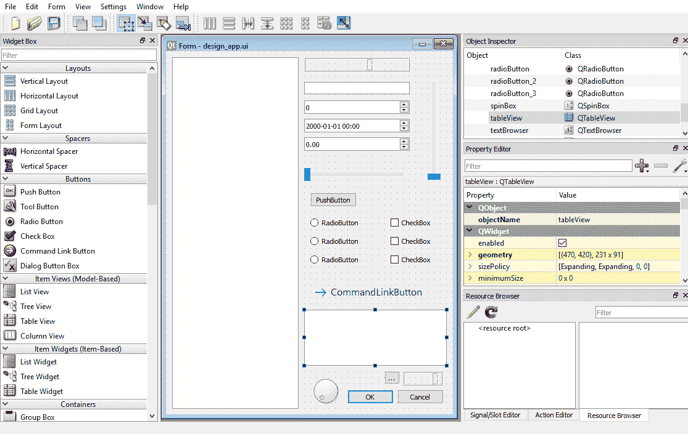
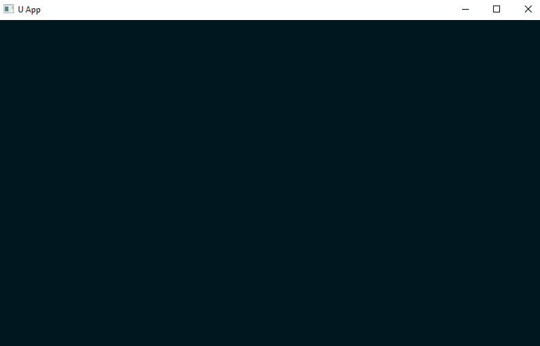
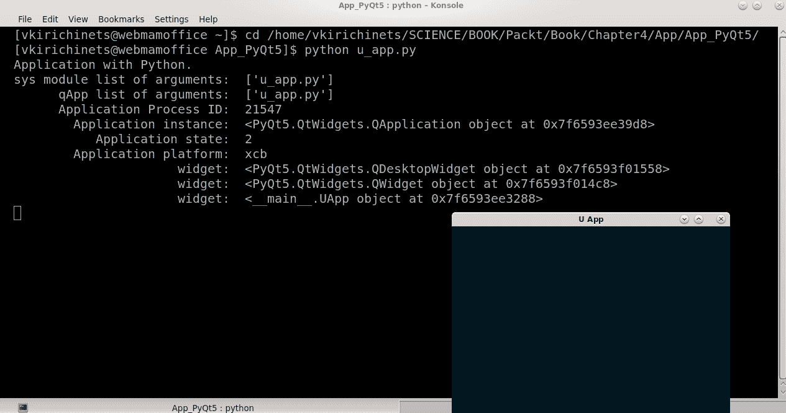
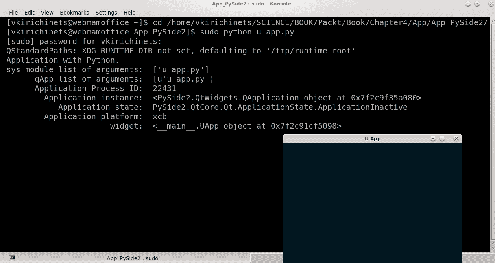

# 第四章：开始使用 PyQt 和 PySide

在本章中，我们将打下基础，以便我们可以使用 Python 绑定（如 PyQt 和 PySide）开始创建 GUI。这些绑定能够利用所有 Python 编程语言的功能和 Python 世界中可用的各种基于 Python 的工具，再加上强大的 Qt 框架，这反过来又允许我们在真实且功能广泛的 GUI 应用程序中可视化我们的想象和开发过程。

在本章中，我们将介绍以下内容：

+   PyQt 与 PySide 的比较

+   PyQt5

+   PySide2

# PyQt 与 PySide 的比较

如我们所见，PyQt 和 PySide 代表了 Python 编程语言功能与 Qt 库的绑定。这些工具非常相似，仅提供了使用 C++实现 Python 语法的功能，因为 Qt 基本上是基于 C++语言的框架。这些绑定作为一组 Python 模块实现，包含实现 GUI 和基础设施的类。PySide 是由社区管理的 Qt 项目([`qt-project.org`](http://qt-project.org))，而 PyQt 是由英国公司 Riverbank Computing([`riverbankcomputing.com`](https://riverbankcomputing.com))开发的绑定。在撰写本书时，这些绑定的最新版本都支持 Qt5.x 框架，包括 PySide2 和 PyQt5 版本。在本书中，我们将使用绑定的最新版本，即 PyQt5 和 PySide2。这些版本可以从官方来源下载和安装，使用`pip`或其他可用的包管理器。

# 下载和安装

要开始使用 Python 这些工具，你需要完成以下操作：

+   从[`www.python.org/downloads/`](https://www.python.org/downloads/)下载并安装了 Python

在 PyQt5 的情况下，你需要完成以下操作：

+   构建并安装了 SIP

+   从官方来源或使用`pip`下载并安装了 PyQt5 包：

```py
> pip3 install PyQt5
```

在 PySide2 的情况下，你需要完成以下操作：

+   安装了 libclang

+   从官方来源下载并安装了 PySide2 包：

```py
> python -m pip install --index-url=http://download.qt.io/snapshots/ci/pyside/5.11/latest pyside2 --trusted-host download.qt.io
```

另一个最推荐的选项是下载并安装 Anaconda 工具集。Anaconda 默认已安装 PyQt5 并准备好使用。此外，可以使用 cmd/Terminal 中的命令安装 PySide2 绑定：

```py
> conda config --add channels conda-forge
> conda install pyside2
```

最后，可以使用 Anaconda Navigator 安装 PySide2，这是默认提供的一个工具。

在本书中，将使用 Python 2.x 的 Anaconda 环境中的 PySide2 和 Python 3.x 的 PyQt5。这避免了众多版本冲突，并获得了关于 2.x/3.x 版本在实际中差异的必要知识。

# PyQt5 与 PySide2 绑定的区别

假设 Python 和 Qt 绑定已安装，让我们描述一下 PyQt 和 PySide 之间的一些差异。这些差异在所讨论的时期内可能不是恒定的，并且将来可能会被排除。首先，有不同的 `import` 语句。

对于 PyQt5 绑定，`import` 的语法如下：

```py
from PyQt5 import QtWidgets
```

对于 PySide2 绑定，使用以下 `import` 语句：

```py
from PySide2 import QtWidgets
```

如我们所见，区别在于用于导入模块的绑定名称。导入某些模块或类的语句可能不同。

例如，PyQt5 导入 Qt 的 `import` 语句如下：

```py
from PyQt5.Qt import Qt
```

但在 PySide2 中，情况不同：

```py
from PySide2.QtCore import Qt
```

此外，其他类可能有不同的导入位置。建议学习 PyQt5 和 PySide2 绑定模块和类的导入位置，以及所使用的版本。

PySide2 绑定仅支持 API 2，这意味着包括 `QStrings`、`QStringLists` 和 `QVariants` 在内的类不可用。

信号和槽有一些不同的语法。

PyQt5 信号的语法如下：

```py
from PyQt5.QtCore import pyqtSignal
sig = pyqtSignal()
```

对于 PySide2 绑定，我们需要修改此语法，使其类似于以下：

```py
from PySide2.QtCore import Signal
sig = Signal()
```

以下是一些关于语法的要点：

+   PySide2 的信号装饰器是 `@Signal`，而不是 PyQt5 绑定中的 `@pyqtSignal`。

+   PySide2 不会导出 Qt 弃用的 C++ 组件。

+   在属性声明方面也存在差异。如果在 PyQt5 中看起来像 `QtCore.pyqtProperty`，那么对于 PySide2，这将变为 `QtCore.Property`。

+   绑定提供了不同的工具名称。例如，PyQt5 工具名称 `pyuic5` 在 PySide2 中将是 `pyside2-uic`，等等。

+   PySide 使用 `event()` 和 `connect()` 与 `QObject` 类。这些属性名不能在代码中用于其他目的。

+   通过与 `QThread` 类一起工作，在 PySide2 中，在调用 `stop()` 后，退出应用程序时需要使用 `wait()`。

+   PySide2 的 `sender()` 方法在槽是一个 Lambda 函数时返回 `None`。

+   使用 PySide2 继承时，父类构造函数始终需要被调用。

让我们看看以下代码片段：

+   PyQt5 类的构造类似于以下：

```py
class UApp(QtWidgets.QWidget):

    def __init__(self, parent=None):
        super(QtWidgets.QWidget, self).__init__(parent)
        ...
    ...
```

+   在 PySide2 中，需要在 `super()` 函数中添加类名：

```py
class UApp(QtWidgets.QWidget):

    def __init__(self, parent=None):
        super(UApp, self).__init__(parent)
        ...
    ...
```

+   PySide2 只支持新式类，这些类可以作为 PyQt5 继承的一部分使用：

```py
class OldStyle():
    ...
```

+   使用 PySide2，我们需要通过添加 `object` 来更改为新式：

```py
class NewStyle(object):
    ...
```

+   旧式信号看起来如下：

```py
self.emit(SIGNAL('text_changed_cb'), text)
```

+   使用 PySide2，旧式信号需要重写如下：

```py
self.emit(SIGNAL('text_changed_cb(QString)'), text)
```

+   只有没有参数的信号才会自动连接到构造函数：

```py
action = QtWidgets.QAction(None, triggered=handler)
```

在前面的代码中，`triggered()` 信号将被连接到槽处理程序，而不是 `triggered(bool)` 信号。

PySide2 与`shiboken2`相关，这是一个 Python 绑定生成器，用于创建 PySide2 模块，并且是 Qt C++ API 到 Python 的接口。Shiboken 是一个生成器运行插件，为 CPython 扩展提供 C++代码。PyQt5 使用 SIP 绑定生成器构建，这是创建 C 和 C++库 Python 绑定的工具。

如我们所见，PyQt5 和 PySide2 之间的差异并不是比较的核心点。所有这些问题都可以轻松预防。在本书中，我们将尝试避免与绑定版本、语言和框架功能相关的限制和限制。因此，正如我们之前提到的，我们将使用最新的 Anaconda 2 环境用于 PySide2，最新的 Anaconda 3 环境用于 PyQt5。此外，还将采用现代编程方法，包括使用新式类。

社区内经常出现关于 PyQt5 和 PySide2 之间差异的问题，这些问题与这些绑定软件的许可证有关。PySide2 采用 GNU **较宽松的通用公共许可证**（**LGPL**）或 Qt 商业许可证，作为 PyQt5 的对抗，PyQt5 采用 Riverbank 商业许可证或 GPL v3。此外，PySide2 的一些第三方组件可能采用不是 LGPL 的许可证。如果您打算将软件用于商业目的，您需要仔细阅读这些许可证规则。

# PyQt5

我们将通过探索 PyQt5 绑定到 Qt 框架来开始我们的 Python GUI 创建学习。正如我们之前提到的，PyQt5 是 Qt 公司提供并由 RiverBank Computing 开发的 Qt 应用程序框架的绑定。在撰写本文时，PyQt5 可以在 Windows、Linux、Unix 平台、macOS、Android 和 iOS 上使用。下载的 PyQt5 包不包含 Qt，到现在为止，您必须已经从官方来源下载并安装了正确的许可证版本的 Qt 框架。PyQt5 是双许可软件，许可协议为 Riverbank 商业许可证和 GPL v3。这意味着如果使用 GPL 许可证，则开发者提供的代码也必须使用兼容的许可证。PyQt5 模块包含以下内容：

+   **基础**：

    +   `Qt`：这是模块的整合，如 Qt 库——所有类的基类。这是 Qt 库的基类。

+   **带有 GUI 创建的基本**：

    +   `QtCore`：这些是 Qt 的核心类；它们提供核心功能，如信号/槽或元素对齐。

    +   `QtWidgets`：这是用于创建桌面应用程序类（如创建窗口）的 GUI。

    +   `QtGui`：这些是用于小部件和 GUI 的核心类，如添加图标、处理颜色和文本。

    +   `QtPrintSupport`：这为应用程序提供了本地/远程打印功能集成，能够生成 PostScript 和 PDF 文件。

    +   `QtMultimedia`：这些是多媒体内容类和用于访问相机和收音机的 API。它包含音频和视频类。

    +   `QtMultimediaWidgets`：这些是多媒体小部件和控制的附加类，例如视频小部件。

    +   `QtSql`：这提供了与 SQL 数据库的集成。这包括 SQL 数据库、驱动程序、字段、表模型和查询类。

    +   `QtSvg`：这提供了对**结构化矢量图形**（**SVG**）内容的渲染支持。

+   **QML**：

    +   `QtQml`：用于将 QML 语言基础设施与 PyQt5 应用程序集成的类。

    +   `QtQuick`：为 QML 用户界面提供扩展。

    +   `QtQuickWidgets`：用于在传统小部件中渲染 QML 场景。

+   **Devices, networking, and the web**：

    +   `QtBluetooth`：这些是用于连接蓝牙设备的类，例如扫描设备、收集信息和交换数据。

    +   `QtNfc`：这提供了连接 NFC 设备（设备使用的近场通信协议）的类。

    +   `QtNetwork`：这些是核心网络类。这有助于创建 UDP 和 TCP 客户端和服务器，并包括实现 HTTP 客户端和支持 DNS 查询的类。提供了与套接字、网络配置和 SSL 证书一起工作的选项。

    +   `QtNetworkAuth`：这些是用于网络授权（OAuth）的类。

    +   `QtWebChannel`：这是用于启用服务器、Python/QML 应用程序和客户端、HTML/JavaScript 或 QML 应用程序之间的点对点通信的类。

    +   `QtWebEngine`：这些是用于将 QML WebEngine 对象与 Python 集成的类。

    +   `QtWebEngineCore`：这些是核心网络引擎类。

    +   `QtWebEngineWidgets`：这提供了一个基于 Chromium 的网络浏览器。

    +   `QtWebSockets`：这是 WebSocket 协议的实现。

    +   `QtPurchasing`：这提供了应用内购买、App Store 和 Google Play 支持。

+   **3D**：

    +   `Qt3DAnimation`：用于在模拟中应用于对象属性的动画的类。

    +   **`Qt3DCore`**：用于近实时模拟系统的核心类，具有 2D 和 3D 渲染。

    +   `Qt3DExtras`：提供预构建元素（如几何形状、网格和材质以及相机控制器）的类。

    +   `Qt3DInput`：用于处理 Qt3D 用户输入的类。

    +   `Qt3DLogic`：与 Qt3D 后端同步帧。

    +   `Qt3DRender`：用于 Qt3D 的 2D 和 3D 渲染类。

    +   `QtDataVisualization`：包含将数据以表面图、条形图和散点图的形式可视化的类。

+   **XML**：

    +   `QtXml`：提供简单 API 的类，用于 XML（SAX）和**文档对象模型**（**DOM**）接口，用于 Qt 框架的 XML 解析器。

    +   `QtXmlPatterns`：用于额外 XML 技术的类，如 XPath 和 XQuery、**可扩展样式表语言转换**（**XSLT**）和 XML 架构验证。

+   **Utilities**：

    +   `QtLocation`: 这提供了创建具有来自流行位置服务（提供导航信息和地理编码）的数据的映射应用程序的类，包括地点搜索。

    +   `QtPositioning`: 此模块提供了用于处理来自卫星、Wi-Fi 等定位信息的类，可用于在地图上确定位置。

    +   `QtSensors`: 这提供了用于处理系统硬件传感器的类，例如陀螺仪和加速度计、高度计、环境光和温度传感器，以及磁力计。

    +   `QtSerialPort`: 此模块提供了用于处理系统串行端口的类，以及配置、I/O 操作、获取和设置 RS-232 引脚的控制信号的类。

    +   `QtDBus`: 这提供了用于处理 D-Bus 协议的类——**进程间通信**（IPC）和**远程过程调用**（RPC）机制。它被设计为允许系统级进程（如打印机硬件驱动服务）与其他用户进程之间的交互。

    +   `QAxContainer`: 这提供了提供对 ActiveX（互联网启用组件）控件和 COM 对象访问的类。

    +   `QtChart`: 这提供了创建 2D 图表的类。这些包括线形和样条图、面积和散点图、条形图、饼图、箱线图、蜡烛图和极坐标图。

    +   `QtDesigner`: 一个模块，其中包含提供使用 Python 扩展 Qt Designer 的类的扩展。

    +   `QtHelp`: 允许在应用程序中创建/查看可搜索的帮助和文档的类。

    +   `uic`: **用户界面编译器**（`uic`）处理使用 Qt Designer 图形界面工具创建的文件，并从创建的`gui.ui`文件生成 Python 代码。

    +   `QtTest`: 这为应用程序提供单元测试。它包括`QSignalSpy`类，该类提供了对信号和槽的反射。

+   **附加内容**:

    +   `QtAndroidExtras`: 专门针对 Android 平台的类。

    +   `QtMacExtras`: 专门针对 macOS 和 iOS 平台的类。

    +   `QtWinExtras`: 专门针对 Windows 的类，例如任务栏按钮上的进度指示器和缩略图工具栏。

    +   `QtX11Extras`: 专门针对 X11 窗口系统的类。

此外，PyQt5 框架还提供了一些实用程序：

+   `pyuic5`: 一个实用工具，可以将使用 Qt Designer 图形工具创建的`gui.ui`文件转换为标准 Python 代码。

+   `pyrcc5`: 一个实用工具，可以将图标、图像、翻译文件等嵌入到任何 Python 模块中，如资源收集文件所述。

+   `pylupdate5`: 一个实用工具，用于从 Python 代码中提取可翻译的字符串并创建/更新翻译文件。

# PySide2

如我们之前提到的，PySide2 库是将提供这些类耦合在一起，以便可以使用 Python 使用 Qt。它由 Qt 项目社区开发。这些库（PyQt 和 PySide）非常相似，并且使用主 Qt 功能来创建 Python 的 GUI。在这方面，PySide2 便于在 Python 应用程序中使用 Qt5 API。这为软件开发者提供了使用 Qt 全部潜力的能力。PySide2 模块提供了对 Qt 各个模块的访问，例如 Qt Widgets、Qt Core 和 Qt GUI。其中一些将重复前面的内容，但为了比较目的，有必要在这里描述这些模块：

+   **GUI 创建**:

    +   `QtCore`: 这是提供核心非 GUI 功能的类，它提供核心功能信号/槽或组件校准，类似于 PyQt5 库。

    +   `QtWidgets`: 这实现了 C++ 类以扩展 Qt GUI 小部件功能，并提供图形组件，如按钮、窗口和小部件。

    +   `QtGui`: 这在 Qt 库中具有用于窗口系统和图形的类，例如事件、OpenGL、OpenGL ES 和 Vulkan 集成；2D 图形；图像处理；字体排印字体；和颜色。

    +   `QtPrintSupport`: 这是 Qt 库的跨平台打印功能。

    +   `QtMultimedia`: 这为音频、视频、广播、摄像头等提供了低级多媒体功能。

    +   `QtMultimediaWidgets`: 这些类用于从 Qt Multimedia Widgets 模块创建多媒体小部件。

    +   `QtSql`: 这是应用程序中数据库实现的模块。这包括驱动程序、SQL API 和 SQL 数据库的用户界面层。

    +   `QtSvg`: 这提供了显示 SVG 文件的类，例如渲染（`QSvgRenderer`）和绘图（`QSvgWidget`）。

    +   `QtConcurrent`: 这提供了用于代码并发执行的 API 功能。它可以用于编写不需要使用低级线程原语（如互斥锁、读写锁、等待条件或信号量）的多线程应用程序结构。

+   **QML**:

    +   `QtQml`: 这是为 Qt QML 基础设施提供的 Python API。

    +   `QtQuick`: 这是在 Qt/C++ 应用程序中用于 Qt Quick 的类。

    +   `QtQuickWidgets`: 这是在基于小部件的应用程序中用于 Qt Quick 的 `QQuickWidget` 类。

+   **网络和网页**:

    +   `QtNetwork`: 这是一个网络编程类，允许创建 UDP 和 TCP 客户端和服务器，并包括实现 HTTP 客户端和支持 DNS 查询的类。提供了与套接字、网络配置和 SSL 证书一起工作的选项。

    +   `QtWebChannel`: 这是一个用于服务器和客户端 HTML/JavaScript 或 QML 应用程序之间点对点通信的类。

    +   `QtWebEngineCore`: 核心功能是将网页内容、由 `QtWebEngine` 共享的公共 API 以及 `QtWebEnginEWidgets` 类融合在一起。

    +   `QtWebEngineWidgets`: 这提供了一个带有常见 C++ 类的网页浏览器引擎，用于提供和协作网页内容。

    +   `QtWebSockets`: 为 Qt 应用程序提供接口，可以作为服务器/客户端处理 WebSocket 请求或从服务器接收数据。这还包括启用基于套接字通信的 C++ 类。

+   **3D**:

    +   `Qt3DAnimation`: 这是一个提供用于在 Qt 框架中动画化 3D 对象的基本元素的模块。

    +   `Qt3DCore`: 这是 Qt3D 模块，包含用于近实时模拟的核心类型类，基于 Qt3D 框架构建。

    +   `Qt3DExtras`: 这提供了与 Qt3D 一起工作的预构建元素。

    +   `Qt3DInput`: 这是一个提供用于处理 Qt3D 用户输入的类的模块。

    +   `Qt3DLogic`: 这提供了与 Qt3D 后端同步帧的类。

    +   `Qt3DRender`: 这是一个包含用于 Qt3D 的 2D/3D 渲染类别的模块。

    +   `QtDataVisualization`: 这提供了将数据以表面图、条形图和散点图的形式可视化的类。

+   **XML**:

    +   `QtXml`: Qt 应用程序中简单 API（SAX）和 DOM 接口的 C++ 实现。

    +   `QtXmlPatterns`: XQuery、XPath、XSLT 和 XML 架构验证。

    +   `QtScxml`: 用于从 SCXML 文件创建状态机类。

+   **实用工具**:

    +   `QtLocation`: 这提供了用于位置和导航信息的 C++ 接口。

    +   `QtPositioning`: 这通过 QML 和 Python 接口提供对卫星和区域监控数据的定位访问。

    +   `QtSensors`: 这通过 QML 和 Python 接口提供了读取系统传感器硬件的类。它还提供了一个运动手势识别 API。

    +   `QAxContainer`: 这提供了 `QAxObject` 对象和 `QAxWidget` 小部件，它们用作 ActiveX 控件和 COM 对象的容器。

    +   `QtCharts`: 这是最常用的图表组件。

    +   `QtTextToSpeech`: 这是一个 API，可以通过 `QTextToSpeechEngine`、`QTextToSpeech` 和 `QVoice` 类访问文本到语音引擎。

    +   `QtHelp`: 这提供了在应用程序中包含在线帮助和文档的类。

    +   `QtUiTools`: 这提供了处理 Qt Designer 表单的类。

    +   `QtTest`: 这提供了用于 Qt 应用程序和库单元测试的类。

+   **附加内容**:

    +   `QtWindowsExtras`: 使您能够使用许多 Windows API 与 Qt 一起使用。

    +   `QtMacExtras`: 专门针对 macOS 和 iOS 操作系统的类。

    +   `QtX11Extras`: 关于 X11 配置的信息。

# 应用程序构建

两个与 Qt 库绑定的 Python 模块（PyQt5 和 PySide2）在本质上相似。最常用的模块与 GUI 创建相关。这些包括 Qt Core、Qt Widgets 和 Qt GUI。正如我们所见，这些模块在 PyQt5 和 PySide2 中都是可用的。正是这些模块将在本书中详细探讨。本书中将要使用的编程方法意味着在 Python 文件中编写 Python 代码，并声明类、函数、变量等。在我们开始这个激动人心的过程之前，我们想考虑一种在设计部分创建 GUI 应用程序的不同方式——涉及 Qt Designer 的创建。

# Qt Designer

这个用于使用 Qt 创建 GUI 应用的图形用户工具几乎包含在 Anaconda 工具集提供的 PyQt 和 PySide 库的所有变体中，包括 PyQt5 独立版本，或者可以下载并安装 Qt。让我们尝试使用 Qt Designer 做些事情。为此，我们只需点击图标打开 Designer，或者我们通过 cmd/Terminal 来做这件事：

```py
for Windows
> designer.exe
or for Linux
> designer-qt5
```

现在，我们可以看到设计师窗口，以及创建表单、按钮、标签等选项。创建一个简单的小部件，并向其中添加一些元素，包括框架和不同的按钮，如下面的截图所示：



然后，我们需要将此文件保存为一个名称，例如 `design_app`**。**需要注意的是，Qt Designer 使用 XML `*.ui` 文件来存储设计，并且本身不会生成任何代码。选择“保存”选项，然后将文件保存为 `design_app.ui` 到 `App/` 目录下。因此，我们将有一个具有 UI 扩展名和 XML 内容的文件。然而，最好将此文件作为一个包含 Python 代码的 Python 文件。为此，我们需要使用一个额外的实用工具——`pyuic5`（PyQt5）或 `pyside2-uic`（PySide2）将此代码转换为 Python。在 cmd/Terminal 中输入以下命令：

```py
> cd /Path/to/the/App
PySide2
> pyside2-uic -o design_app.py design_app.ui
PyQt5
> pyuic5 -o design_app.py design_app.ui
```

现在，我们可以看到位于 `App/` 目录下的 `design_app.py` 文件，其中包含 Python 代码。

本书将不会描述使用 Qt Designer 进行 GUI 开发。这个关于这个工具的简要介绍足以让开发者了解如何使用 Qt Designer。

# 开始使用 GUI

在对 Qt Designer 进行简要介绍之后，让我们继续本书的主要目标，即正确选择构建和编写具有 GUI 的应用程序的定性 Python 代码。大多数编程实践需要理解未来应用程序的功能和形式，以便欣赏应用程序中的一切是如何工作的。但我们将不会这样做。我们将使用 Python——一种实时动态编程语言，它给我们提供了在图形窗口中实现世界上几乎所有事情的机会。我们需要从低到高逐步进行。

首先，我们需要以正确的方式组织包含应用程序文件的目录。尽管本书将演示两种绑定的示例，但建议你在`App/`目录内创建如`App/App_PySide2`和`App/App_PyQt5`之类的目录。但如果你已经选择了某种 Python 绑定，这并不是强制性的。然后，我们需要执行我们之前章节中描述的文件重写，并添加一些更多文件。创建 GUI 应用程序有许多不同的方法。如果将要创建的 GUI 应用程序体积小、规模小或仅提供有限的功能，例如仅执行几个功能，将代码放在单个文件中是有意义的。

然而，这是一个坏主意，因为每个应用程序都可以被重建、更新、升级或通过添加额外代码来扩展。将小型应用程序拆分为多个文件对性能和生产力几乎没有任何影响，或者几乎没有影响。另一方面，将大规模应用程序代码放入单个文件会导致编辑器阅读此文件时出现问题，以及维护问题和一般性的困惑。在重建和更改功能方面也可能出现问题。例如，如果需要更改某些样式属性，将需要找到这些参数，而且总会有一些东西被忽略。GUI 应用程序通常有大量的代码行，而某些特殊操作的函数行数则较少。换句话说，以某种方式在不同文件中拆分应用程序是一个好主意，并将这些文件中的类和函数导入到具有主要 GUI 应用程序的文件中。这是编程的艺术——在正确的位置创建具有文件、类和函数的应用程序。我们需要理解，其中一些需要位于允许的空间中，以排除与命名空间相关的问题。我们将利用**面向对象编程**（**OOP**）方法，这意味着我们希望在多个地方多次使用代码，有时在未来在其他应用程序中使用。此外，GUI 应用程序的样式代码通常需要很多行。

基于此，我们将应用程序拆分为三个文件，就像它们被创建时那样：`u_app.py`、`u_tools.py`以及我们现在要添加的`u_style.py`文件。然后，将它们放入`App/App_PySide2`和`App/App_PyQt5`目录中。`u_app.py`文件将包含 GUI 应用程序的主类，以及运行它的说明。按照以下方式更改代码。

关于`u_app.py`文件，以下代码使用 PyQt5 创建类：

```py
# -*- coding: utf-8 -*-
from u_tools import UTools
from u_style import UWid

class UApp(UWid, UTools):

    def __init__(self, parent=None):
        super(UApp, self).__init__(parent)
        UTools.__init__(self)
        print(self.us1)

if __name__ == "__main__":
    import sys
    from PyQt5 import QtWidgets, QtCore, QtGui
    print(sys.argv)
    app = QtWidgets.QApplication(sys.argv)
    uap = UApp()
    uap.show()
    sys.exit(app.exec_())
```

在此文件中，我们正在创建 GUI 应用程序的主类。此类将结合来自其他模块（第三方包）的所有功能，并创建应用程序。

在 PySide2 的`u_app.py`文件中，我们有以下内容：

```py
# -*- coding: utf-8 -*-
from u_tools import UTools
from u_style import UWid

class UApp(UWid, UTools):

    def __init__(self, parent=None):
        super(UApp, self).__init__(parent)
        UTools.__init__(self)
        print self.us1

if __name__ == "__main__":
    import sys
    from PySide2 import QtWidgets, QtCore, QtGui
    print sys.argv
    app = QtWidgets.QApplication(sys.argv)
    uap = UApp()
    uap.show()
    sys.exit(app.exec_())
```

这是与 PySide2 绑定一起用于 Qt 的主类文件。`u_tools.py` 文件将包含为 GUI 应用程序提供一些功能或额外功能的类和函数。

在 PyQt5 的 `u_tools.py` 文件的情况下，将此文件的内容更改为以下内容：

```py
# -*- coding: utf-8 -*-

class UTools(object):

    def __init__(self):
        self.us1 = "Application with Python."

if __name__ == "__main__":
    ut = UTools()
```

这是包含类的文件。我们将在这里使用一些方便的函数，这些函数与应用程序的 GUI 表示无关。

在 PySide2 的 `u_tools.py` 文件中，我们有以下内容：

```py
# -*- coding: utf-8 -*-

class UTools(object):

    def __init__(self):
        self.us1 = "Application with Python."

if __name__ == "__main__":
    ut = UTools()
```

在可能的情况下，我们将避免在 Python 版本和 Qt 库（PySide2/PyQt5）的 Python 绑定之间的语法、使用的模块和类之间的差异。

`u_style.py` 文件将包含为 GUI 应用程序提供样式的类和函数，包括小部件、按钮、标签、框架、颜色和字体。

在 PyQt5 的 `u_style.py` 文件中，我们有以下内容：

```py
# -*- coding: utf-8 -*-
from PyQt5 import QtWidgets, QtCore, QtGui

color = ["rgba(0,41,59,140)",
         "rgba(0,41,59,255)"]

class UWid(QtWidgets.QWidget):

    def __init__(self, parent=None):
        super(UWid, self).__init__(parent)
        self.setWindowTitle("U App")
        self.setStyleSheet("background-color: %s;" % (
                            color[0],))

```

这些样式文件将只包含与图形相关的对象和图形属性。

在 PySide2 的 `u_style.py` 文件中，我们有以下内容：

```py
# -*- coding: utf-8 -*-
from PySide2 import QtWidgets, QtCore, QtGui

color = ["rgba(0,41,59,140)",
         "rgba(0,41,59,255)"]

class UWid(QtWidgets.QWidget):

    def __init__(self, parent=None):
        super(UWid, self).__init__(parent)
        self.setWindowTitle("U App")
        self.setStyleSheet(
                           "background-color: %s;" % (
                            color[0],))
```

如我们所见，PySide2 和 PyQt5 绑定之间的唯一区别在于名称导入语句以及在打印 `string` 变量时的不同，这取决于不同的 Python 版本。在整个书中，随着我们添加新的元素、小部件和功能，这些文件中的代码将会被增强或更改。

目前，这些应用程序可以通过 cmd/Terminal 命令运行：

```py
### PySide2 ###
> cd Path/to/App/App_PySide2
> Path/to/Python2/python u_app.py
### PyQt5 ###
> cd Path/to/App/App_PyQt5
> Path/to/Python3/python u_app.py
```

我们将得到相同的结果，换句话说，一个空的小部件：



在 cmd/Terminal 中，我们有与当通过 `QApplication` 传递系统参数时相同的输出，即包含应用程序名称的列表和 `UTools` 类的 `string` 变量。

# 应用程序功能

让我们考虑当应用程序创建并运行带有脚本的 `u_app.py` 文件时将执行的过程。让我们逐行查看发生了什么：

1.  在 `u_app.py` 文件中，导入部分导入 `UTools` 类，该类将提供一些功能，包括函数，或者像在这个例子中一样，包含文本的 `string` 变量。实现 `Qwidget`（将作为图形元素显示的小部件）的 `UWid` 类也将被导入。

1.  创建了 `UApp` 类。这是应用程序的主要类，将包含工具、函数、元素以及这些元素的布局，以及额外的功能。这个类将继承 `UTools` 和 `UWid` 类以实现其功能。

1.  如`if __name__ == "__main__"`之类的指令指定了此文件是否将从 cmd/Terminal 或以其他方式（例如可执行脚本）运行。`__name__`变量将包含`"__main__"`值，`if`语句的指令将被实现。在其他情况下，如果此文件中的类、函数或变量被导入到另一个应用程序或代码中，这些指令将不会实现，导入的代码将作为另一个构造中的元素使用，这暗示了面向对象的方法。这些指令如下：

    +   `import sys`——这是从标准 Python 库中导入`sys`模块的方法。`sys`模块提供了访问用于、维护或与 Python 解释器交互的变量和函数。

    +   导入`QtWidgets`、`QtGui`和`QtCore`——这些是最常用的模块，用于创建应用程序、添加图形元素、处理图像、颜色和字体等特性，以及提供功能的核心函数，如事件、信号和槽以及配置。

    +   从`QtWidgets`模块声明`QApplication`类的对象：这个类的继承方案是`QtCore.QObject`—`QtCore.QCoreApplication`—`QtGui.QGuiApplication`—`QtWidgets.QApplication`。这个类为 GUI 应用程序提供了主要的设置和控制流程。对于任何 Qt GUI 应用程序，恰好有一个`QApplication`对象。`qApp`属性提供了从应用程序的任何位置访问`QApplication`对象的方法。此对象接受`sys.argv`参数，这是传递给 Python 脚本的命令行参数列表。正如我们在 cmd/Terminal 输出中看到的那样，此参数具有包含脚本的文件名（`u_app.py`）。

    +   使用小部件创建主应用程序类的实例并调用`show()`方法来可视化小部件：在另一种情况下，如果我们不实现实例且不调用`show()`方法，应用程序将被创建但不会在 GUI 性能中可视化，因为我们将没有可视元素（在这种情况下是`Qwidget`）。`sys.exit(app.exec_())`是执行应用程序的行；所有随后的代码行将不会执行。`sys.exit()`是`sys`模块的`exit()`方法，将退出 Python。这意味着如果发生错误或应用程序窗口关闭，程序将退出。`app.exec_()`启动应用程序的主循环，并返回状态码（成功为`0`），例如应用程序退出或出现某些错误，这些状态码将与`sys.exit()`一起使用。

如果我们从 cmd/Terminal 或其他方式运行该文件，并且包含应用程序定义，这将导致应用程序进入无限循环，并且将持续到应用程序关闭或出现另一个退出事件。为了演示这些功能，让我们暂时向`u_app.py`文件中添加一些内容，包括运行指令和一些信息性语句。

在 PyQt5 的`u_app.py`文件的情况下，我们有以下内容：

```py
...
if __name__ == "__main__":
    ...
    print(" sys list of arguments: ", sys.argv)
    print("qApp list of arguments: ", QtWidgets.qApp.arguments())
    print("Application Process ID: ", QtWidgets.qApp.applicationPid())
    print("  Application instance: ", QtWidgets.qApp.instance())
    print("     Application state: ", QtWidgets.qApp.applicationState())
    print("  Application platform: ", QtWidgets.qApp.platformName())
    print("   List of the widgets: ", QtWidgets.qApp.allWidgets())
    sys.exit(app.exec_())
```

在 PySide2 的`u_app.py`文件的情况下，我们有以下内容：

```py
...
if __name__ == "__main__":
    ...
    print " sys list of arguments: ", sys.argv
    print "qApp list of arguments: ", QtWidgets.qApp.arguments()
    print "Application Process ID: ", QtWidgets.qApp.applicationPid()
    print "  Application instance: ", QtWidgets.qApp.instance()
    print "     Application state: ", QtWidgets.qApp.applicationState()
    print "  Application platform: ", QtWidgets.qApp.platformName()
    print "   List of the widgets: ", QtWidgets.qApp.allWidgets()
    sys.exit(app.exec_())
```

在 cmd/Terminal 中运行这些文件：

```py
### PyQt5 ###
> cd Path/to/App/App_PyQt5
> Path/to/Python3/python u_app.py
### PySide2 ###
> cd Path/to/App/App_PySide2
> Path/to/Python2/python u_app.py
```

在 PyQt5 的`u_app.py`文件的情况下，结果如下：



在 PySide2 的`u_app.py`文件的情况下，结果如下：



通过实施前面的步骤，我们已经构建了我们的应用程序！

# 摘要

这本书的最后一章也是第一部分的最后一章。在这一章中，我们介绍了使用 PyQt5 和 PySide2 Python 绑定创建 GUI 应用程序。接下来的所有章节都将继续这一主题。强烈建议您回顾有关不同 Python 绑定与 Qt 库比较的各种示例的代码。本章简要介绍了 PyQt5 和 PySide，这可能在选择这些框架之一时有所帮助。这两个绑定都有许多优点，也有一些缺点。

下一章将考虑`QWidget`和`QMainWindow`类，它们为显示 GUI 应用程序提供主窗口和小部件窗口。
