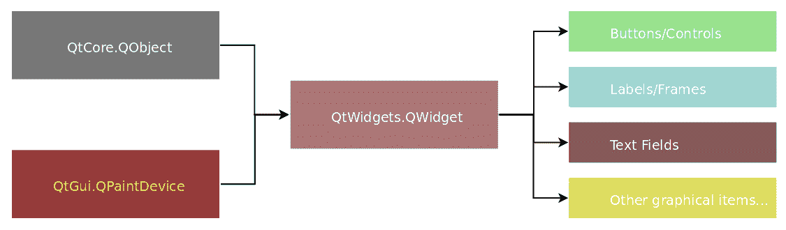
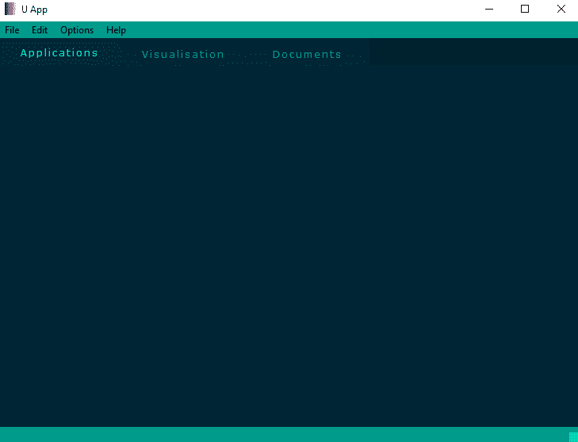

# 使用 QWidget 和主窗口

从本章开始，我们将探讨 GUI 应用程序的图形元素。将考虑与这些视觉对象和其他功能相关的这些方法。当开发者开始构建 GUI 时，他们需要用不同的图形对象填充此应用程序，包括框架、标签、字段、按钮以及许多其他控制元素。在本章中，我们将介绍图形组件的基本字段或它们可以可视化的地方。在 Qt/C++中，`QtWidgets`类通常提供此功能，并且通过 PyQt5 和 PySide2 Python 绑定可用。

本章将涵盖以下主题：

+   `QWidget`

+   `QMainWindow`

# `QWidget`

这个类是`QtWidgets`模块提供的所有用户界面对象的基类。正如 PySide2 文档（[`doc.qt.io/qtforpython/PySide2/QtWidgets/QWidget.html`](https://doc.qt.io/qtforpython/PySide2/QtWidgets/QWidget.html)）中解释的那样，这是用户界面的原子。此类具有以下继承方案：



它几乎也是几乎所有图形元素、附加小部件等的父元素。声明语法如下：

```py
widget = QtWidgets.QWidget()
```

# QWidget 的功能

`QWidget`继承自`QObject`和`QPaintDevice`，并通过以下函数增强了功能。

# set

这些是与小部件相关的设置参数/属性的功能，包括设置样式、宽度或功能：

`widget.setAcceptDrops(bool)`: 如果设置为`True`，则小部件将接受拖放事件。

`widget.setAccessibleDescription("description")`: 这为该小部件提供可访问的描述。

`widget.setAccessibleName("Name")`: 这为该小部件提供可访问的名称。

`widget.setAttribute(QtCore.Qt.WidgetAttribute, bool)`: 如果第二个参数为`True`，则在此小部件上设置属性；否则，清除属性。

`widget.setAutoFillBackground(bool)`: 如果参数为`True`，则小部件的背景将自动填充。

`widget.setBackgroundRole(QtGui.QPalette.ColorRole)`: 这将设置小部件的背景角色为`QtGui.QPalette.ColorRole`类型的参数角色。

`widget.setBaseSize(QtCore.QSize)`: 这将小部件的基本大小设置为`QtCore.QSize`类型的参数。

`widget.setBaseSize(basew, baseh)`: 这将小部件的基本大小设置为参数，其中`basew`（基本宽度）和`baseh`（基本高度）是整数值。

`widget.setContentsMargins(QtCore.QMargins)`: 这将设置围绕小部件内容的`QtCore.QMargins`类型的边距。

`widget.setContentsMargins(left, top, right, bottom)`: 这将设置围绕小部件内容的边距为每一边的整数值。

`widget.setContextMenuPolicy(QtCore.Qt.ContextMenuPolicy)`: 这将设置此小部件的上下文菜单策略，即此小部件如何显示上下文菜单。

`widget.setCursor(QtGui.QCursor)`: 这将为 `QtGui.QCursor` 类型的当前光标设置小部件的光标。

`widget.setDisabled(bool)`: 如果参数为 `True`，则禁用小部件输入事件；否则，输入事件被启用。

`widget.setEnabled(bool)`: 如果参数为 `True`，则启用已禁用的小部件输入事件。

`widget.setFixedHeight(h)`: 这将使用整数值 `h`（小部件的高度）设置固定高度；小部件的高度在布局系统中不会改变。

`widget.setFixedWidth(w)`: 这将使用整数值 `w`（小部件的宽度）设置固定宽度；小部件的宽度在布局系统中不会改变。

`widget.setFixedSize(QtCore.QSize)`: 这将为小部件设置 `QtCore.QSize` 类型的固定大小；小部件的大小在布局系统中不会改变。

`widget.setFixedSize(w, h)`: 这将使用整数值 `w`（宽度）和 `h`（高度）设置小部件的固定大小；小部件的大小在布局系统中不会改变。

`widget.setFocus()`: 如果此小部件或其父级之一是活动窗口，则将键盘输入焦点设置到此小部件。

`widget.setFocus(QtCore.Qt.FocusReason)`: 如果此小部件或其父级之一是活动窗口，则将键盘输入焦点设置到此小部件。使用 `QtCore.Qt.FocusReason` 类型的原因是提供有关导致小部件获得焦点的解释。

`widget.setFocusPolicy(QtCore.Qt.FocusPolicy)`: 这将为小部件设置焦点策略；即小部件接受键盘焦点的方式。

`widget.setFocusProxy(QtWidgets.QWidget)`: 这将为小部件设置 `QtWidgets.QWidget` 类型的焦点代理。

`widget.setFont(QtGui.QFont)`: 这将为小部件设置字体。

`widget.setForegroundRole(QtGui.QPalette.ColorRole)`: 这将为小部件设置前景角色为参数中的角色。

`widget.setGeometry(QtCore.QRect)`: 这将为小部件设置相对于其父级的位置，不包括窗口框架。

`widget.setGeometry(x, y, w, h)`: 这将为小部件设置相对于其父级的位置，不包括窗口框架，参数为 `x`（*x* 轴），`y`（*y* 轴），`w`（宽度）和 `h`（高度）。

`widget.setGraphicsEffect(QtWidgets.QGraphicsEffect)`: 这将为小部件设置图形效果。

`widget.setHidden(bool)`: 如果此参数为 `True`，则将小部件设置为隐藏。

`widget.setInputMethodHints(QtCore.Qt.InputMethodHints)`: 这将设置小部件将拥有的输入法提示。

`widget.setLayout(QtWidgets.QLayout)`: 这将为该小部件设置布局管理器。小部件只能有一个布局管理器。如果设置新的，则需要删除之前的版本。

`widget.setLayoutDirection(QtCore.Qt.LayoutDirection)`: 这将为该小部件设置布局方向。

`widget.setLocale(QtCore.QLocale)`: 这将为该小部件设置区域设置。

`widget.setMask(QtGui.QBitmap)`: 这仅设置小部件的像素，对于具有位图参数的位图，相应的位为 1，设置为可见。

`widget.setMask(QtGui.QRegion)`: 这仅设置与区域参数重叠的小部件部分为可见。

`widget.setMaximumHeight(maxh)`: 这使用整数值 `maxh`（最大高度）为此小部件设置最大高度。

`widget.setMaximumWidth(maxw)`: 这使用整数值 `maxw`（最大宽度）为此小部件设置最大宽度。

`widget.setMaximumSize(QtCore.QSize)`: 这将小部件的最大尺寸设置为 `QtCore.QSize` 类型的参数。

`widget.setMaximumSize(maxw, maxh)`: 这使用整数值作为 `maxw`，即最大宽度，和 `maxh`——最大高度——参数设置小部件的最大尺寸。

`widget.setMinimumHeight(minh)`: 这使用整数值 `minh` 设置小部件的最小高度，即最小高度。

`widget.setMinimumWidth(minw)`: 这使用整数值 `minw`（最小宽度）为此小部件设置最小宽度。

`widget.setMinimumSize(QtCore.QSize)`: 这将小部件的最小尺寸设置为 `QtCore.QSize` 类型的参数。

`widget.setMinimumSize(minw, minh)`: 这使用整数值作为 `minw`，即最小宽度，和 `minh`——最小高度——参数设置小部件的最小尺寸。

`widget.setMouseTracking(bool)`: 如果此参数为 `True`，则为此小部件设置可用的鼠标跟踪。

`widget.setPalette(QtGui.QPalette)`: 这为此小部件设置在渲染标准组件时使用的调色板。

`widget.setParent(QtWidgets.QWidget)`: 这将为此小部件设置 `QtWidgets.QWidget` 类型的参数作为父级。

`widget.setParent(QtWidgets.QWidget, QtCore.Qt.WindowFlags)`: 这为此小部件设置父级，使用 `QtWidgets.QWidget` 类型的第一个参数，并使用标志作为第二个参数。

`widget.setShortcutAutoRepeat(id, bool)`: 如果第二个参数为 `True`，则启用具有给定 `id` 的快捷键的自动重复；否则，将其禁用。

`widget.setShortcutEnabled(id, bool)`: 如果第二个参数为 `True`，则启用具有给定 `id` 的快捷键；否则，将其禁用。

`widget.setSizeIncrement(QtCore.QSize)`: 这为此小部件设置 `QtCore.QSize` 类型的尺寸增量，或用户调整窗口大小时尺寸变化的步长。

`widget.setSizeIncrement(w, h)`: 这使用 `w`，即宽度，和 `h`，即高度，参数为此小部件设置尺寸增量，或用户调整窗口大小时尺寸变化的步长。

`widget.setSizePolicy(QtWidgets.QSizePolicy)`: 这为此小部件设置 `QtWidgets.QSizePolicy` 类型的尺寸策略。

`widget.setSizePolicy(horizontal, vertical)`: 这将为该小部件设置 `horizontal`，为 `QtWidgets.QSizePolicy.Policy` 类型的 `vertical`，以及 `QtWidgets.QSizePolicy.Policy` 类型的 `vertical`。

`widget.setStatusTip("Status tip")`: 这将为小部件设置状态提示。

`widget.setStyle(QtWidgets.QStyle)`: 这将为小部件的 GUI 风格设置 `QtWidgets.QStyle` 类型的样式。

`widget.setStyleSheet("{property: value;}")`: 这将为小部件设置样式表，其中包含对小部件样式的自定义描述。

`widget.setTabletTracking(bool)`: 如果此参数为 `True`，则启用平板电脑跟踪，或者即使在小部件附近悬停时，小部件也会接收平板电脑移动事件；否则，它为 `False`。

`widget.setTabOrder(QtWidgets.QWidget, QtWidgets.QWidget)`: 这将在第一个参数的小部件之后将第二个参数的小部件纳入焦点顺序。

`widget.setToolTip("Tool tip")`: 这将为该小部件设置工具提示。

`widget.setToolTipDuration(msec)`: 这将为工具提示设置持续时间——当工具提示可见时的时间以 `msec`（毫秒）的整数值表示。

`widget.setUpdatesEnabled(bool)`: 如果此参数为 `True`，则启用小部件的更新，小部件接收绘图事件，并具有系统背景。默认情况下，更新是启用的。

`widget.setVisible(bool)`: 如果此参数为 `True`，则小部件将可见，如果它之前是不可见的；否则，小部件将不可见。

`widget.setWhatsThis("What's this")`: 这将为小部件设置 *这是什么* 帮助文本。

`widget.setWindowFilePath("File/path/to/the/widget")`: 这将为该小部件设置关联的文件路径。

`widget.setWindowFlag(QtCore.Qt.WindowType, bool)`: 如果第二个参数为 `True`，则在此小部件上设置 `QtCore.Qt.WindowType` 类型的窗口标志；否则，清除标志。

`widget.setWindowFlags(QtCore.Qt.WindowFlags)`: 这将为小部件设置窗口标志。

`widget.setWindowIcon(QtGui.QIcon)`: 这将为该小部件的窗口设置图标。

`widget.setWindowIconText("Icon text")`: 这将为该小部件窗口的图标设置文本。

`widget.setWindowModality(QtCore.Qt.WindowModality)`: 这将设置模态窗口的行为，或者哪些窗口被模态小部件阻塞。

`widget.setWindowModified(bool)`: 如果此参数为 `True`，则将窗口设置为已修改。

`widget.setWindowOpacity(float)`: 这将设置与窗口相关的不透明度，其中 `0.0` 是完全透明的窗口，而 `1.0` 是完全不透明的窗口。

`widget.setWindowRole(unicode)`: 这将为窗口设置 Unicode 字符串作为角色；这对于在 X11 上运行的 Windows 有意义。

`widget.setWindowState(QtCore.Qt.WindowStates)`: 这将设置窗口状态，例如 `QtCore.Qt.WindowMinimized`、`QtCore.Qt.WindowMaximized`、`QtCore.Qt.WindowFullScreen` 或 `QtCore.Qt.WindowActive`。

`widget.setWindowTitle("Window Title")`: 这为小部件的窗口设置标题。

# is/has

这些是返回与小部件状态相关的布尔值（`bool`）的函数，例如，检查当前状态：

`widget.isActiveWindow()`: 这返回`True`，如果小部件的窗口是活动窗口。

`widget.isAncestorOf(QtWidgets.QWidget)`: 这返回`True`，如果小部件是子参数的父级。

`widget.isEnabled()`: 这返回`True`，如果小部件被启用。

`widget.isEnabledTo(QtWidgets.QWidget)`: 这返回`True`，如果此小部件将变为启用状态，如果同一窗口内父小部件的参数被启用。

`widget.isFullScreen()`: 这返回`True`，如果小部件以全屏模式显示；否则，返回`False`。

`widget.isHidden()`: 这返回`True`，如果小部件被隐藏；否则，返回`False`。

`widget.isLeftToRight()`: 这返回`True`，如果小部件具有从左到右的方向。

`widget.isMaximized()`: 这返回`True`，如果小部件的窗口已最大化。

`widget.isMinimized()`: 这返回`True`，如果小部件的窗口已最小化。

`widget.isModal()`: 这返回`True`，如果小部件的窗口是模态小部件。

`widget.isRightToLeft()`: 这返回`True`，如果小部件具有从右到左的方向。

`widget.isTopLevel()`: 这返回`True`，如果小部件是顶级窗口。

`widget.isVisible()`: 这返回`True`，如果小部件是可见的。

`widget.isVisibleTo(QtWidgets.QWidget)`: 这返回`True`，如果小部件将变为可见的，如果同一窗口内父小部件的参数将被显示。

`widget.isWindow()`: 这返回`True`，如果小部件是独立窗口；否则，返回`False`。

`widget.isWindowModified()`: 这返回`True`，如果窗口内容有未保存的更改。

`widget.hasFocus()`: 这根据小部件键盘是否有输入焦点返回`True`或`False`。

`widget.hasHeightForWidth()`: 如果小部件的首选高度取决于其宽度，它将返回`True`；否则，返回`False`。

`widget.hasMouseTracking()`: 这返回`True`，如果为小部件启用了鼠标跟踪；否则，返回`False`。

`widget.hasTabletTracking()`: 这返回`True`，如果启用了平板电脑跟踪或小部件接收平板电脑移动事件，即使悬停在附近；否则，返回`False`。

# window

这些是更改当前小部件可视化的函数，例如关闭和隐藏：

`widget.close()`: 这将关闭小部件并返回`True`。

`widget.hide()`: 这隐藏小部件。

`widget.show()`: 这显示小部件及其子小部件。

`widget.showFullScreen()`: 这以全屏模式显示小部件。

`widget.showMaximized()`: 这以最大化模式显示小部件。

`widget.showMinimized()`: 这以最小化模式显示小部件。

`widget.showNormal()`: 这以正常模式显示小部件。

`widget.move(QtCore.QPoint)`: 这会将小部件移动到 `QtCore.QPoint` 类型的位置。

`widget.move(x, y)`: 这会将小部件移动到 `x` (*X* 轴) 或 `y` (*Y* 轴) 参数的位置。

`widget.resize(QtCore.QSize)`: 这会使用 `QtCore.QSize` 类型的参数调整小部件的大小。

`widget.resize(w, h)`: 这会使用 `w`（宽度）和 `h`（高度）参数作为整数值调整小部件的大小。

`widget.scroll(dx, dy)`: 这会滚动小部件及其子部件，向右移动 `dx` 像素，向下移动 `dy` 像素。`dx` 和 `dy` 可以为负值。

`widget.scroll(dx, dy, QtCore.QRect)`: 这会滚动小部件的矩形，不包括其子部件，向右移动 `dx` 像素，向下移动 `dy` 像素。`dx` 和 `dy` 可以为负值。

# 功能性

这些是与小部件当前值返回、功能变化等相关函数：

`widget.acceptDrops()`: 这返回 `True` 或 `False`；如果为 `True`，则小部件接受拖放事件。

`widget.accessibleDescription()`: 这返回一个 Unicode 字符串——小部件的描述。

`widget.accessibleName()`: 这返回一个 Unicode 字符串——小部件的名称。

`widget.actions()`: 这返回一个列表，其中包含作为 `QtWidgets.QAction` 类型的 `QtCore.QList` 类型的操作——小部件的操作。

`widget.activateWindow()`: 这会将包含此小部件的最顶层小部件设置为活动窗口。

`widget.addAction(QtWidgets.QAction)`: 这会将操作添加到小部件的操作列表中。

`widget.addActions([QtWidgets.QAction])`: 这会将操作添加到小部件的操作列表中。

`widget.adjustSize()`: 这会调整小部件的大小以适应其内容。

`widget.autoFillBackground()`: 这返回 `True` 或 `False`；如果为 `True`，则背景会自动填充。

`widget.backgroundRole()`: 这返回 `QtGui.QPalette.ColorRole` 类型的颜色角色——小部件的背景角色。

`widget.baseSize()`: 这返回 `QtCore.QSize` 类型的基本大小——小部件的基本大小。

`widget.childAt(QtCore.QPoint)`: 这返回小部件在点位置上的子小部件。

`widget.childAt(x, y)`: 这返回小部件在坐标系中由 `x` (*X* 轴) 或 `y` 轴的位置的子小部件。

`widget.childrenRect()`: 这返回一个 `QtCore.QRect` 类型的矩形——小部件子部件的边界矩形。

`widget.childrenRegion()`: 这返回一个 `QtGui.QRegion` 类型的区域——小部件子部件占用的合并区域。

`widget.clearFocus()`: 这会移除小部件的键盘输入焦点。

`widget.clearMask()`: 这会移除由 `QtWidgets.QWidget.setMask()` 设置的掩码。

`widget.contentsMargins()`: 这返回 `QtCore.QMargins` 类型的边距——小部件的内容边距。

`widget.contentsRect()`: 这返回一个 `QtCore.QRect` 类型的区域——小部件边距内的区域。

`widget.contextMenuPolicy()`: 这返回`QtCore.Qt.ContextMenuPolicy`类型的小部件上下文菜单策略；换句话说，小部件如何显示上下文菜单。

`widget.create(0, True, True)`: 这使用第一个参数窗口（类型`QtGui.WId`），第二个参数`initializeWindow`（类型`QtCore.bool`）和第三个参数`destroyOldWindow`（类型`QtCore.bool`）创建一个新窗口。

`widget.create(0, True, True)`: 这使用第一个参数窗口（类型`sip.voidptr`），第二个参数`initializeWindow`（类型`bool`）和第三个参数`destroyOldWindow`（类型`bool`）创建一个新窗口。

`widget.createWinId()`: 这是窗口系统标识符，这意味着它为窗口系统所知。

`widget.createWindowContainer(QtGui.QWindow, None, QtCore.Qt.WindowFlags)`: 这使用第一个参数窗口（类型`QtGui.QWindow`），第二个参数父元素（类型`QtWidgets.QWidget`）和第三个参数标志（类型`QtCore.Qt.WindowFlags`）创建窗口容器。

`widget.cursor()`: 这返回当前`QtGui.QCursor`类型的光标，即小部件的光标。

`widget.destroy(True, True)`: 这将释放窗口系统资源，并使用第一个参数`destroyWindow`和第二个参数`destroySubWindows`销毁小部件窗口。

`widget.effectiveWinId()`: 这返回`QtGui.WId`类型的标识符或 PyQt5 的`sip.voidptr`——小部件的有效窗口系统标识符。

`widget.ensurePolished()`: 小部件及其子小部件已被抛光；它们将具有适当的字体和调色板。

`widget.find(QtGui.WId)`: 这返回指向具有窗口 ID 的`QtWidgets.QWidget`类型小部件的指针。

`widget.focusNextChild()`: 如果它能找到一个新的小部件来提供键盘焦点，则返回`True`。

`widget.focusNextPrevChild(bool)`: 如果它能找到一个新的小部件来提供键盘焦点，则返回`True`。如果参数为`True`，则向前搜索；如果为`False`，则向后搜索。

`widget.focusPolicy()`: 这返回小部件的`QtCore.Qt.FocusPolicy`类型焦点策略，即小部件接受键盘焦点的方式。

`widget.focusPreviousChild()`: 如果它能找到一个新的小部件来提供键盘焦点，则返回`True`。

`widget.focusProxy()`: 这返回焦点代理，如果焦点代理不存在，则返回`0`。

`widget.focusWidget()`: 这返回了使用`widget.setFocus()`函数调用的`QtWidgets.QWidget`类型的最后一个子小部件。

`widget.font()`: 这返回当前设置在相关小部件中的`QtGui.QFont`类型的字体。

`widget.fontInfo()`: 这返回小部件当前字体类型的`QtGui.QFontInfo`字体信息。

`widget.fontMetrics()`: 这返回小部件当前字体类型的`QtGui.QFontMetrics`字体度量。

`widget.foregroundRole()`: 这返回小部件的前景角色，类型为`QtGui.QPalette.ColorRole`——小部件的前景角色。

`widget.frameGeometry()`: 这返回了 `QtCore.QRect` 类型的几何形状——小部件相对于其父级的几何形状，包括窗口框架。

`widget.frameSize()`: 这返回 `QtCore.QSize` 类型的尺寸——小部件的尺寸，包括窗口框架。

`widget.geometry()`: 这返回 `QtCore.QRect` 类型的几何形状——小部件相对于其父级的几何形状，不包括窗口框架。

`widget.getContentsMargins()`: 这返回四个整数值，用于小部件的内容边距的左侧、顶部、右侧和底部。

`widget.grab(QtCore.QRect(QtCore.QPoint(0,0), QtCore.QSize(-1,-1)))`: 这将小部件渲染为 `QtGui.QPixmap` 类型的位图，受矩形参数限制。

`widget.grabGesture(QtCore.Qt.GestureType, QtCore.Qt.GestureFlags)`: 这将小部件订阅到具有标志（第二个参数）的第一个参数的手势。

`widget.grabKeyboard()`: 这捕获键盘输入。小部件将接收所有键盘事件。

`widget.grabMouse()`: 这捕获鼠标输入。小部件将接收所有鼠标事件。

`widget.grabMouse(QtGui.QCursor)`: 这捕获鼠标输入并更改光标形状。小部件将接收所有鼠标事件。

`widget.grabShortcut(QtGui.QKeySequence, QtCore.Qt.ShortcutContext)`: 这向 Qt 的快捷键系统添加了一个快捷键，该快捷键在给定上下文（第二个参数）中监视给定的键序列（第一个参数）。

`widget.graphicsEffect()`: 这返回 `QtWidgets.QGraphicsEffect` 类型的指针——小部件的图形效果。

`widget.graphicsProxyWidget()`: 这返回对应于图形视图中嵌入小部件的 `QtWidgets.QGraphicsProxyWidget` 类型代理小部件。

`widget.height()`: 这返回小部件的高度，不包括窗口框架。

`widget.heightForWidth(width)`: 这在给定 `width` 的情况下返回此小部件的首选高度。

`widget.inputMethodHints()`: 这返回了小部件的 `QtCore.Qt.InputMethodHints` 类型的输入方法提示。

`widget.inputMethodQuery(QtCore.Qt.InputMethodQuery)`: 关于输入，小部件用于查询要支持复杂输入方法操作的小部件的属性集，以便支持周围文本和重新转换。

`widget.insertAction(QtWidgets.QAction, QtWidgets.QAction)`: 这在小部件动作列表中在另一个动作（第一个参数）之前插入一个动作（第二个参数）。

`widget.insertActions(QtWidgets.QAction, [QtWidgets.QAction])`: 这在小部件动作列表中在另一个动作（第一个参数）之前插入动作（第二个参数）。

`widget.internalWinId()`: 这返回窗口系统标识符。

`widget.keyboardGrabber()`: 这返回当前捕获键盘输入的 `QtWidgets.QWidget` 类型的小部件。

`widget.layout()`: 这返回此小部件的布局管理器。

`widget.layoutDirection()`: 这返回了此`widget`布局管理器的方向。

`widget.locale()`: 这返回了`widget`的`QtCore.QLocale`类型的区域设置。

`widget.lower()`: 这将`widget`降低到父`widget`堆栈的底部。

`widget.mapFrom(QtWidgets.QWidget, QtCore.QPoint)`: 这表示将坐标`pos`（第二个参数）从父坐标系统转换为`widget`的坐标系统。

`widget.mapFromGlobal(QtCore.QPoint)`: 这表示将全局屏幕坐标`pos`（参数）转换为`widget`的坐标系统。

`widget.mapFromParent(QtCore.QPoint)`: 这表示将父坐标`pos`（参数）转换为`widget`的坐标系统。

`widget.mapTo(QtWidgets.QWidget, QtCore.QPoint)`: 这表示将`widget`的坐标`pos`（第二个参数）转换为父坐标系统。

`widget.mapToGlobal(QtCore.QPoint)`: 这表示将`widget`的坐标`pos`（参数）转换为全局屏幕坐标。

`widget.mapToParent(QPoint)`: 这表示将`widget`的坐标`pos`（参数）转换为父`widget`中的坐标。

`widget.mask()`: 这返回了当前设置在`widget`上的`QtGui.QRegion`类型的区域作为掩码。

`widget.maximumHeight()`: 这返回了此`widget`可用的整数类型的最大高度。

`widget.maximumSize()`: 这返回了此`widget`可用的`QtCore.QSize`类型的最大尺寸。

`widget.maximumWidth()`: 这返回了此`widget`可用的整数类型的最大宽度。

`widget.minimumHeight()`: 这返回了此`widget`可用的整数类型的最小高度。

`widget.minimumSize()`: 这返回了此`widget`可用的`QtCore.QSize`类型的最小尺寸。

`widget.minimumSizeHint()`: 这返回了此`widget`可用的`QtCore.QSize`类型的最小尺寸提示。

`widget.minimumWidth()`: 这返回了此`widget`可用的整数类型的最小宽度。

`widget.metric(QtGui.QPaintDevice.PaintDeviceMetric)`: 这返回了带有绘图设备度量参数的度量信息。

`widget.mouseGrabber()`: 这返回了当前正在抓取鼠标输入的`QtWidgets.QWidget`类型的`widget`。

`widget.nativeParentWidget()`: 这返回了此`widget`的`QtWidgets.QWidget`类型的本地父级。

`widget.nextInFocusChain()`: 这返回了在此`widget`的焦点链中的下一个`QtWidgets.QWidget`类型的`widget`。

`widget.normalGeometry()`: 这返回了`widget`的`QtCore.QRect`类型的几何形状，当作为`normal`（非`maximized`或`fullscreen`）顶级`widget`显示时将出现。

`widget.overrideWindowFlags(QtCore.Qt.WindowFlags)`: 这更改了`widget`的窗口标志，而不通知窗口系统。

`widget.overrideWindowState(QtCore.Qt.WindowStates)`: 这会更改子小部件的窗口状态。

`widget.palette()`: 这返回小部件的调色板，该调色板在小部件绘制标准组件时由小部件的样式使用。

`widget.parentWidget()`: 这返回此小部件的 `QtWidgets.QWidget` 类型的父小部件。

`widget.pos()`: 这返回小部件在父小部件内的 `QtCore.QPoint` 类型的位置。

`widget.previousInFocusChain()`: 这返回在此小部件焦点链中的 `QtWidgets.QWidget` 类型的上一个小部件。

`widget.raise_()`: 这会将小部件提升到父小部件堆栈的顶部。

`widget.rect()`: 这返回内部小部件的 `QtCore.QRect` 类型的几何形状，不包括任何窗口框架。

`widget.releaseKeyboard()`: 这将释放键盘捕获。

`widget.releaseMouse()`: 这将释放鼠标捕获。

`widget.releaseShortcut(id)`: 这将从快捷方式系统中移除具有给定 `id` 作为整数值的快捷方式。

`widget.removeAction(QtWidgets.QAction)`: 这将从小部件的动作列表中移除通过参数传入的动作。

`widget.render(QtGui.QPaintDevice, QtCore.QPoint, QtGui.QRegion, QtWidgets.QWidget.RenderFlags)`: 这将在目标（第一个参数）中使用 `RenderFlags`（第四个参数）渲染此小部件的 `sourceRegion`（第三个参数），并在目标中的 `targetOffset`（第二个参数）开始。

`widget.render(QtGui.QPainter, QtCore.QPoint, QtGui.QRegion, QtWidgets.QWidget.RenderFlags)`: 这将在画家设备 (`QtGui.QPainter.device()`) 中使用 `sourceRegion`（此小部件的第三个参数）和 `renderFlags`（第四个参数）渲染小部件，并从 `targetOffset`（第二个参数）开始。

`widget.repaint()`: 这将使用 `QtWidgets.QWidget.paintEvent()` 方法重新绘制小部件。

`widget.repaint(QtCore.QRect)`: 这将在小部件内部重新绘制矩形。

`widget.repaint(QtGui.QRegion)`: 这将在小部件内部重新绘制区域。

`widget.repaint(x, y, w, h)`: 这将在小部件内部重新绘制具有 `x`（*x* 轴）或 `y`（*y* 轴）和 `w`（宽度）以及 `h`（高度）整数值的矩形。

`widget.restoreGeometry(QtCore.QByteArray)`: 这将恢复存储在字节数组几何形状中的顶级小部件的几何形状和状态，如果成功则返回 `True`，否则返回 `False`。

`widget.saveGeometry()`: 这将保存顶级小部件的当前几何形状和状态。

`widget.size()`: 这返回 `QtCore.QSize` 类型的尺寸——小部件的尺寸，不包括窗口框架。

`widget.sizeHint()`: 这返回 `QtCore.QSize` 类型的尺寸——小部件的推荐大小。

`widget.sizeIncrement()`: 这返回 `QtCore.QSize` 类型的尺寸——小部件的增量大小，或者通过这些增量来改变当用户调整窗口大小时的大小。

`widget.sizePolicy()`: 这返回 `QtWidgets.QSizePolicy` 类型的尺寸策略——小部件的尺寸策略。

`widget.stackUnder(QtWidgets.QWidget)`: 这将小部件放置在父小部件堆栈中的参数下。

`widget.statusTip()`: 这返回小部件的状态提示作为 Unicode 字符串。

`widget.style()`: 这返回小部件的`QtWidgets.QStyle`类型的 GUI 样式。

`widget.styleSheet()`: 这返回表示小部件样式表的 Unicode 字符串。

`widget.testAttribute(QtCore.Qt.WidgetAttribute)`: 如果参数中的属性在此小部件上设置，则返回`True`；否则，返回`False`。

`widget.toolTip()`: 这返回此小部件的工具提示作为 Unicode 字符串。

`widget.toolTipDuration()`: 这返回小部件工具提示的持续时间，并以毫秒为单位的整数值表示工具提示何时可见。

`widget.topLevelWidget()`: 这返回此小部件的最高级小部件。

`widget.underMouse()`: 如果小部件位于鼠标光标下，则返回`True`；否则，返回`False`。

`widget.ungrabGesture(QtCore.Qt.GestureType)`: 这将取消订阅小部件给定的手势参数。

`widget.unsetCursor()`: 这将取消设置小部件的光标。

`widget.unsetLayoutDirection()`: 这将取消设置小部件的布局方向。

`widget.unsetLocale()`: 这将取消设置小部件的区域设置。

`widget.update()`: 这将更新小部件，除非更新被禁用或小部件被隐藏。

`widget.update(QtGui.QRegion)`: 当小部件内部指定参数的区域被重绘时，这将更新小部件。

`widget.update(QtCore.QRect)`: 这将更新小部件作为参数内部的小部件中的矩形。

`widget.update(x, y, w, h)`: 这将更新一个矩形，参数为`x`（*x*轴）和`y`（*y*轴）以及`w`（宽度）和`h`（高度）在小部件内部。

`widget.updateGeometry()`: 布局系统将通知小部件已更改，可能需要更改几何形状。

`widget.updateMicroFocus()`: 这将更新小部件的微焦点。

`widget.updatesEnabled()`: 如果此小部件的更新被启用，则返回`True`。

`widget.visibleRegion()`: 这返回未遮挡的`QtGui.QRegion`类型区域，其中可以发生绘制事件。

`widget.whatsThis()`: 这返回小部件的“这是什么”帮助文本作为 Unicode 字符串。

`widget.winId()`: 这返回小部件的`QtGui.WId`类型窗口系统标识符。

`widget.width()`: 这返回小部件的宽度，不包括窗口框架。

`widget.window()`: 这返回此小部件的窗口。

`widget.windowFilePath()`: 这返回与该小部件关联的文件路径作为 Unicode 字符串。

`widget.windowFlags()`: 这返回此小部件使用的`QtCore.Qt.WindowFlags`类型窗口标志。

`widget.windowHandle()`: 如果这是一个本地小部件，则返回关联的`QtGui.QWindow`类型窗口。

`widget.windowIcon()`: 这返回小部件的`QtGui.QIcon`类型窗口图标。

`widget.windowIconText()`: 这返回部件的窗口图标文本，作为 Unicode 字符串。

`widget.windowModality()`: 这返回哪些窗口被模态部件阻塞。

`widget.windowOpacity()`: 这返回窗口的不透明度，以浮点值表示，从`0.0`（完全透明）到`1.0`（完全不透明）。

`widget.windowRole()`: 这返回窗口的角色，作为 Unicode 字符串。

`widget.windowState()`: 这返回当前窗口状态，为`QtCore.Qt.WindowStates`类型。

`widget.windowTitle()`: 这返回部件的窗口标题，作为 Unicode 字符串。

`widget.windowType()`: 这返回部件的窗口类型，为`QtCore.Qt.WindowType`类型。

`widget.x()`: 这返回部件相对于其父级的*x*轴坐标，包括窗口框架。

`widget.y()`: 这返回部件相对于其父级的*y*轴坐标，包括窗口框架。

# 事件

这些是与事件处理程序等事件相关的函数：

`widget.actionEvent(QtGui.QActionEvent)`: 当部件的动作发生变化时，这个事件处理器会使用事件参数被调用。

`widget.closeEvent(QtGui.QCloseEvent)`: 当窗口系统收到顶级部件的窗口关闭请求时，这个事件处理器会使用事件参数被调用。

`widget.changeEvent(QtCore.QEvent)`: 这处理部件的状态变化。

`widget.contextMenuEvent(QtGui.QContextMenuEvent)`: 这是一个设计用来接收部件上下文菜单事件的处理器。

`widget.dragEnterEvent(QtGui.QDragEnterEvent)`: 当鼠标进入部件并且有拖动操作进行时，这个事件处理器会使用事件参数被调用。

`widget.dragLeaveEvent(QtGui.QDragLeaveEvent)`: 当鼠标离开部件并且有拖动操作进行时，这个事件处理器会使用事件参数被调用。

`widget.dragMoveEvent(QtGui.QDragMoveEvent)`: 当某些条件发生时，例如光标进入或移动到部件内，在部件有焦点时按下修改键，以及拖动操作正在进行时，这个事件处理器会使用事件参数被调用。

`widget.dropEvent(QtGui.QDropEvent)`: 当拖动操作在部件上释放时，事件处理程序会使用事件参数被调用。

`widget.enterEvent(QtCore.QEvent)`: 这是一个设计用来接收部件进入事件的处理器，这些事件通过事件参数传递，并且当鼠标光标进入部件时发送给部件。

`widget.event(QtCore.QEvent)`: 这接收对象的事件，并且如果事件被识别并处理，则应返回`True`。

`widget.focusOutEvent(QtGui.QFocusEvent)`: 这是一个设计用来接收部件键盘焦点事件的处理器，当焦点丢失时，会通过事件参数传递。

`widget.focusInEvent(QtGui.QFocusEvent)`: 这是一个设计用来接收小部件键盘焦点事件的处理器，当焦点被接收时，事件参数会随事件传入。

`widget.hideEvent(QtGui.QHideEvent)`: 这是一个设计用来接收小部件隐藏事件的处理器，隐藏事件通过参数传入。

`widget.inputMethodEvent(QtGui.QInputMethodEvent)`: 这是一个设计用来接收输入法组合事件的处理器，输入法事件通过参数传入。

`widget.keyPressEvent(QtGui.QKeyEvent)`: 这是一个设计用来接收小部件按键事件的处理器，按键事件通过参数传入。

`widget.keyReleaseEvent(QtGui.QKeyEvent)`: 这是一个设计用来接收小部件按键释放事件的处理器，按键事件通过参数传入。

`widget.leaveEvent(QtCore.QEvent)`: 这是一个设计用来接收小部件离开事件的处理器，事件通过参数传入。

`widget.moveEvent(QtGui.QMoveEvent)`: 这是一个设计用来接收小部件移动事件的处理器，鼠标事件通过参数传入。

`widget.mouseMoveEvent(QtGui.QMouseEvent)`: 这是一个设计用来接收小部件鼠标移动事件的处理器，鼠标事件通过参数传入。

`widget.mousePressEvent(QtGui.QMouseEvent)`: 这是一个设计用来接收小部件鼠标按下事件的处理器，鼠标事件通过参数传入。

`widget.mouseReleaseEvent(QtGui.QMouseEvent)`: 这是一个设计用来接收小部件鼠标释放事件的处理器，鼠标事件通过参数传入。

`widget.mouseDoubleClickEvent(QtGui.QMouseEvent)`: 这是一个设计用来接收小部件双击鼠标事件的处理器，鼠标事件通过参数传入。

`widget.paintEvent(QtGui.QPaintEvent)`: 这是一个设计用来接收小部件绘制事件的处理器，绘制事件通过参数传入。

`widget.resizeEvent(QtGui.QResizeEvent)`: 这是一个设计用来接收小部件尺寸变化事件的处理器，尺寸变化事件通过参数传入。

`widget.showEvent(QtGui.QShowEvent)`: 这是一个设计用来接收小部件显示事件的处理器，显示事件通过参数传入。

`widget.tabletEvent(QtGui.QTabletEvent)`: 这是一个设计用来接收小部件平板事件处理的处理器，平板事件通过参数传入。

`widget.wheelEvent(QtGui.QWheelEvent)`: 这是一个设计用来接收小部件鼠标滚轮事件的处理器，滚轮事件通过参数传入。

# 信号

`QWidget` 类可用的信号如下：

`widget.customContextMenuRequested(QtCore.QPoint)`: 当用户在控件上请求上下文菜单时，会发出此信号。

`widget.windowIconChanged(QtGui.QIcon)`: 当窗口的图标更改时，会发出此信号，新图标作为参数。

`widget.windowIconTextChanged("Icon text")`: 当窗口的图标文本更改时，会发出此信号，新图标文本作为参数。

`widget.windowTitleChanged("Window Title")`: 当窗口的标题文本更改时，会发出此信号，新窗口标题作为参数。

# QWidget 示例

理解 QWidget 类的这些方法非常重要，因为这些方法非常实用且在几乎所有的由 GUI 开发者使用 PySide2 和 PyQt5 绑定实现的元素中都被广泛使用。这个类被所有图形组件继承，包括按钮、标签、框架和文本字段。我们不会将之前描述的所有方法都添加到应用程序中，因为这只会部分实现并在本书中解释。现在，让我们仅为了演示目的，从`u_style.py`文件中将其中一些添加到控件类中。首先，将图标设置为控件窗口。为此，在`App/App_PySide2`和`App/App_PyQt5`目录中创建一个名为`Icons/`的文件夹，并将你喜欢的图片插入此文件夹。然后，将以下行添加到 PyQt5 和 PySide2 的`u_style.py`文件中以提高控件：

```py
...
class UWid(QtWidgets.QWidget):

    def __init__(self, parent=None):
        ...
        win_icon = QtGui.QIcon("Icons/python1.png")
        self.setWindowIcon(win_icon)
        self.setWindowOpacity(0.95)
        self.setAcceptDrops(True)
        self.setMouseTracking(True)
        self.setUpdatesEnabled(True)
        self.setAutoFillBackground(True)
        ...
    ...
...
```

现在，窗口的控件已有一个图标并且略微透明。

# QMainWindow

此类提供了可以用于 GUI 应用程序的主窗口。QMainWindow 具有**单文档界面**（SDI）或**多文档界面**（MDI），可以通过添加`QMdiArea`作为中央控件来创建。MDI 应用程序中最受欢迎的例子是**GNU 图像处理程序**（GIMP）和 Photoshop，它们代表类似显示的文档（窗口）而不是一个（SDI）。在 SDI 和 MDI 类型的应用程序中，都需要添加中央控件。应用程序中主窗口的声明语法如下：

```py
main_window = QtWidgets.QMainWindow()
```

# QMainWindow 类的函数

`QMainWindow`类继承自`QWidget`，并通过以下函数增强了功能。

# 添加

这些是与向主窗口添加元素相关的函数，例如添加一个停靠小部件或工具栏：

`main_window.addDockWidget(QtCore.Qt.DockWidgetArea, QtWidgets.QDockWidget, QtCore.Qt.Orientation)`: 这会将第二个参数的停靠小部件添加到第一个参数指定的区域，并按照第三个方向参数指定的方向添加。

`main_window.addDockWidget(QtCore.Qt.DockWidgetArea, QtWidgets.QDockWidget)`: 这会将第二个参数的停靠小部件添加到第一个参数指定的区域。

`main_window.addToolBar("Title")`: 此方法创建一个`QtWidgets.QToolBar`对象，设置标题，并将其插入到顶部工具栏区域。

`main_window.addToolBar(QtWidgets.QToolBar)`: 这将在主窗口中添加一个工具栏。

`main_window.addToolBar(QtCore.Qt.ToolBarArea, QtWidgets.QToolBar)`: 这将在主窗口的指定区域（第一个参数）中添加工具栏（第二个参数）。

`main_window.addToolBarBreak(QtCore.Qt.ToolBarArea)`: 这将在现有对象之后将工具栏分隔符添加到指定区域。

# set

这些是与主窗口参数/属性设置相关的函数，包括设置样式、大小或功能：

`main_window.setAnimated(bool)`: 如果参数为`True`，则设置主窗口为动画。

`main_window.setCentralWidget(QtWidgets.QWidget)`: 这将为该主窗口设置参数中指定的中央小部件。

`main_window.setCorner(QtCore.Qt.Corner, QtCore.Qt.DockWidgetArea)`: 这将设置停靠小部件区域（第二个参数）以占据角落（第一个参数）。

`main_window.setDockNestingEnabled(bool)`: 如果参数为`True`，则规定停靠可以嵌套。

`main_window.setDockOptions(QtWidgets.QMainWindow.DockOptions)`: 这将设置此主窗口的停靠行为。

`main_window.setDocumentMode(bool)`: 如果参数为`True`，则将文档模式设置为该主窗口的选项卡栏（用于选项卡停靠小部件）。

`main_window.setIconSize(QtCore.QSize)`: 这将为该主窗口的工具栏图标设置图标大小。

`main_window.setMenuBar(QtWidgets.QMenuBar)`: 这将为该主窗口设置参数中指定的菜单栏。

`main_window.setMenuWidget(QtWidgets.QWidget)`: 这将为该主窗口设置`QtWidgets.QWidget`类型的菜单栏。

`main_window.setStatusBar(QtWidgets.QStatusBar)`: 这将设置此主窗口的状态栏。

`main_window.setTabPosition(QtCore.Qt.DockWidgetAreas, QtWidgets.QTabWidget.TabPosition)`: 这将为停靠小部件区域（第一个参数）设置选项卡位置（第二个参数）。

`main_window.setTabShape(QtWidgets.QTabWidget.TabShape)`: 这将为该主窗口的选项卡停靠小部件设置将使用的选项卡形状。

`main_window.setToolButtonStyle(QtCore.Qt.ToolButtonStyle)`: 这将为该主窗口设置工具栏按钮的样式。

`main_window.setUnifiedTitleAndToolBarOnMac(bool)`: 这将为 macOS 设置统一的标题和工具栏外观。

# is

这些函数返回一个布尔值（`bool`），与主窗口状态相关，例如，检查当前状态：

`main_window.isAnimated()`: 如果停靠小部件和工具栏是动画的，则返回`True`。

`main_window.isDockNestingEnabled()`: 如果停靠可以嵌套，则返回`True`。

# functional

这些是与主窗口当前值返回、功能变化等相关联的函数：

`main_window.centralWidget()`: 这返回此主窗口的`QtWidgets.QWidget`类型的中央小部件。

`main_window.corner(QtCore.Qt.Corner)`: 这返回由`QtCore.Qt.Corner`类型的参数`corner`指定的区域所占据的停靠小部件区域。

`main_window.createPopupMenu()`: 这返回此主窗口的`QtWidgets.QMenu`类型的弹出菜单。

`main_window.dockOptions()`: 这返回此主窗口的`QtWidgets.QMainWindow.DockOptions`类型的停靠行为。

`main_window.dockWidgetArea(QtWidgets.QDockWidget)`: 这返回主窗口停靠小部件的`QtCore.Qt.DockWidgetArea`类型的停靠小部件区域。

`main_window.documentMode()`: 这返回`True`，如果选项卡式停靠小部件的标签栏设置为文档模式。

`main_window.iconSize()`: 这返回此主窗口工具栏图标的`QtCore.QSize`类型的大小。

`main_window.insertToolBar(QtWidgets.QToolBar, QtWidgets.QToolBar)`: 这在第一个参数指定的工具栏之前插入第二个参数指定的工具栏。

`main_window.insertToolBarBreak(QtWidgets.QToolBar)`: 这在参数指定的工具栏之前插入工具栏分隔符。

`main_window.menuBar()`: 这返回主窗口的`QtWidgets.QMenuBar`类型的菜单栏。

`main_window.menuWidget()`: 这返回主窗口的`QtWidgets.QWidget`类型的菜单栏。

`main_window.removeDockWidget(QtWidgets.QDockWidget)`: 这从主窗口布局中移除停靠小部件并隐藏它。

`main_window.removeToolBar(QtWidgets.QToolBar)`: 这从主窗口布局中移除工具栏并隐藏它。

`main_window.removeToolBarBreak(QtWidgets.QToolBar)`: 这移除参数指定的工具栏之前的工具栏分隔符。

`main_window.resizeDocks([QtWidgets.QDockWidget], [int], QtCore.Qt.Orientation)`: 这根据第二个参数中的像素大小和第三个方向参数调整第一个参数指定的停靠小部件的大小。

`main_window.restoreDockWidget(QtWidgets.QDockWidget)`: 这使用`QtWidgets.QMainWindow.restoreState()`函数恢复停靠小部件的状态，如果状态已恢复则返回`True`，否则返回`False`。

`main_window.restoreState(QtCore.QByteArray,0)`: 这使用作为整数类型第二个参数的版本与存储在状态中的数字进行比较来恢复此主窗口的工具栏和停靠小部件的状态。如果不匹配，函数返回`False`，否则返回`True`。

`main_window.saveState(0)`: 这保存此主窗口的工具栏和停靠小部件的当前状态。参数的版本号作为整数值将作为数据的一部分存储。

`main_window.splitDockWidget(QtWidgets.QDockWidget, QtWidgets.QDockWidget, QtCore.Qt.Orientation)`: 这将部件（第一个参数）覆盖的空间分成两部分，将第一个停靠部件移动到第一部分，并将第二个停靠部件（第二个参数）移动到第二部分，第三参数指定了空间如何分割的方向。

`main_window.statusBar()`: 这返回了此主窗口的 `QtWidgets.QStatusBar` 状态栏。

`main_window.tabifiedDockWidgets(QtWidgets.QDockWidget)`: 这返回与参数中的停靠部件一起选项卡化的停靠部件。

`main_window.tabifyDockWidget(QtWidgets.QDockWidget, QtWidgets.QDockWidget)`: 这会将第二个参数中的停靠部件移动到第一个参数中的停靠部件之上，并在主窗口中创建一个选项卡式停靠区域。

`main_window.tabPosition(QtCore.Qt.DockWidgetArea)`: 这返回了参数中指定的区域的选项卡位置。

`main_window.tabShape()`: 这返回了与选项卡式停靠部件一起使用的 `QtWidgets.QTabWidget.TabShape` 类型的选项卡形状。

`main_window.takeCentralWidget()`: 这会移除主窗口的中心部件。

`main_window.toolBarArea(QtWidgets.QToolBar)`: 这返回指定参数的 `QtCore.Qt.ToolBarArea` 类型的工具栏区域。

`main_window.toolBarBreak(QtWidgets.QToolBar)`: 如果工具栏在指定的参数之前有一个断点，则返回 `True`。

`main_window.toolButtonStyle()`: 这返回 `QtCore.Qt.ToolButtonStyle` 类型的工具按钮样式。

`main_window.unifiedTitleAndToolBarOnMac()`: 如果主窗口在 macOS 上使用统一的标题和工具栏外观，则返回 `True`。

# 事件

这些是与事件相关的函数，例如事件处理程序：

`main_window.contextMenuEvent(QtGui.QContextMenuEvent)`: 这是 `QWidget` 事件处理程序，它被设计用来接收主窗口的上下文菜单事件。

`main_window.event(QtCore.QEvent)`: 这是 `QtCore.QObject` 函数，它接收对象的事件，如果事件被识别并处理，则应返回 `True`。

# 信号

`QMainWindow` 类的可用的信号如下：

`main_window.iconSizeChanged(QtCore.QSize)`: 当窗口的图标大小发生变化时，会发出此信号，并传递了新的图标大小作为参数。

`main_window.tabifiedDockWidgetActivated(QtWidgets.QDockWidget)`: 当通过选择选项卡激活选项卡化的停靠部件时，会发出此信号，并传递了选项卡化的停靠部件作为参数。

`main_window.toolButtonStyleChanged(QtCore.Qt.ToolButtonStyle)`: 当窗口中工具按钮使用的样式发生变化时，会发出此信号，并将新的工具按钮样式作为参数传递。

# QMainWindow 示例

`QMainWindow`类提供了一种更全面实现应用程序的方法。这样，我们将使用主窗口而不是之前描述的小部件来重新组织创建的应用程序中的类。为了演示这一点，让我们在`App/App_PySide2`和`App/App_PyQt5`目录中创建一个名为`u_window.py`的文件，并向这些行添加`import`语句：

1.  将以下代码添加到 PyQt5 的`u_window.py`文件中：

```py
...
from PyQt5 import QtWidgets, QtCore, QtGui
from u_style import UWin, UWid, UMBar, USBar, UMenu, UTWid
...
```

1.  将以下代码添加到 PySide2 的`u_window.py`文件中：

```py
...
from PySide2 import QtWidgets, QtCore, QtGui
from u_style import UWin, UWid, UMBar, USBar, UMenu, UTWid
...
```

1.  在 PySide2 和 PyQt5 的情况下，将主窗口类`UWindow`添加到`u_window.py`文件中：

```py
...
class UWindow(UWin):

    def __init__(self, parent=None):
        super(UWindow, self).__init__(parent)
```

在这里，我们添加了从`QWin`类继承的`UWindow`类，而`QWin`类又实现了`QtWidgets`模块的`QMainWindow`类。

1.  将菜单栏添加到`UWindow`类中：

```py
...
    def __init__(self, parent=None):
        ...
        self.menubar = UMBar()
        self.mb1 = UMenu(self.menubar)
        self.mb1.addAction("Open")
        self.mb1.addAction("Save")
        self.mb1.setTitle("&File")
        self.mb2 = UMenu(self.menubar)
        self.mb2.addAction("Cut")
        self.mb2.addAction("Copy")
        self.mb2.addAction("Paste")
        self.mb2.setTitle("&Edit")
        self.mb3 = UMenu(self.menubar)
        self.mb3.addAction("Settings")
        self.mb3.addAction("Run")
        self.mb3.addAction("Configuration")
        self.mb3.setTitle("&Options")
        self.mb4 = UMenu(self.menubar)
        self.mb4.addAction("Online Help")
        self.mb4.addAction("Documentation")
        self.mb4.setTitle("&Help")
        self.menubar.addMenu(self.mb1)
        self.menubar.addMenu(self.mb2)
        self.menubar.addMenu(self.mb3)
        self.menubar.addMenu(self.mb4)
        self.setMenuBar(self.menubar)
```

这个菜单栏包含包含操作的菜单项（选择点）。

1.  将主应用程序窗口的标签控件添加到`UWindow`类中，设置中心小部件和状态栏，并完成文件：

```py
...
    ...
        ...
        self.tabwid = UTWid()
        self.twid1 = UWid()
        self.twid2 = UWid()
        self.twid3 = UWid()
        self.tabwid.addTab(self.twid1, "Applications")
        self.tabwid.addTab(self.twid2, "Visualization")
        self.tabwid.addTab(self.twid3, "Documents")
        self.setCentralWidget(self.tabwid)
        self.stat_bar = USBar()
        self.setStatusBar(self.stat_bar)
...
```

主窗口的中心小部件是一个包含每个标签三个小部件的标签控件。在应用程序窗口的底部是状态栏。

现在，我们需要向`u_style.py`文件中添加一些行：

1.  在`u_style.py`文件（适用于 PySide2 和 PyQt5）中，在`UWid`类之前插入新类，然后向文件中添加新的颜色：

```py
...
color = ["rgba(0,41,59,140)", "rgba(0,41,59,255)",
        "rgba(1,255,217,140)", "rgba(1,255,217,255)"]
...
```

这是一个包含将在应用程序中使用的新的 RGBA 颜色的列表。

1.  然后，添加主窗口样式类：

```py
...
class UWin(QtWidgets.QMainWindow):

    def __init__(self, parent=None):
        super(UWin, self).__init__(parent)
        self.setWindowTitle("U App")
        win_icon = QtGui.QIcon("Icons/python1.png")
        self.setWindowIcon(win_icon)
        self.setWindowOpacity(0.95)
        self.setAnimated(True)
        self.setAcceptDrops(True)
        self.setMouseTracking(True)
        self.setUpdatesEnabled(True)
        self.setAutoFillBackground(True)
        self.setStyleSheet("background-color: %s;" % (color[0],))
...
```

这将为主窗口添加常用属性。

1.  现在，添加菜单栏样式类：

```py
...
class UMBar(QtWidgets.QMenuBar):

    def __init__(self, parent=None):
        super(UMBar, self).__init__(parent)
        self.setStyleSheet("background-color: %s;" % (color[2],))
...
```

菜单栏位于主应用程序窗口的顶部面板中。

1.  向菜单栏中的菜单添加样式类：

```py
...
class UMenu(QtWidgets.QMenu):

    def __init__(self, parent=None):
        super(UMenu, self).__init__(parent)
        self.setStyleSheet("background-color: %s;" % (color[2],))
...
```

菜单是在点击菜单栏选项时出现的弹出列表。

1.  现在，添加标签控件样式类：

```py
...
class UTWid(QtWidgets.QTabWidget):

    def __init__(self, parent=None, twbdr=3, twbdw=0.5,
                 twbbg=color[1], tbpad=7, tbsize=140,
                 tbbg=color[0], tbc=color[2], tbcs=color[3]):
        super(UTWid, self).__init__(parent)
        self.font1 = QtGui.QFont()
        self.font1.setLetterSpacing(
                         QtGui.QFont.AbsoluteSpacing, 2.0)
        self.font1.setWordSpacing(2.0)
        self.font1.setFamily("Verdana")
        self.font1.setPixelSize(12)
        self.font1.setWeight(34)
        self.setFont(self.font1)
        self.twbdr, self.twbdw, self.twbbg  = twbdr, twbdw, twbbg
        self.tbsize, self.tbpad, self.tbbg = tbsize, tbpad, tbbg
        self.tbc, self.tbcs = tbc, tbcs
        self.setStyleSheet(
                 """QTabWidget::pane {border-style: solid;
                      border-radius: %spx; border-width: %spx;
                      border-color: %s;}
                    QTabBar::tab {width: %spx; margin: 0px;
                      padding: %spx; background-color: %s;
                      color: %s; border-style: solid;
                      border-top-right-radius: 10px;
                      border-width: %spx;
                      border-bottom-width: 0px; border-color: %s;}
                    QTabBar::tab:selected {background-color: %s;
                      color: %s;}
                    QTabBar::tab:!selected {margin-top: 5px;}
                    QTabBar QToolButton {color: %s;}"""
                % (self.twbdr, self.twbdw, self.twbbg, self.tbsize,
                   self.tbpad, self.tbbg, self.tbc, self.twbdw,
                   self.tbbg, self.twbbg, self.tbcs, self.tbcs))
...
```

标签控件是应用程序窗口的中心小部件。`setStyleSheet()`方法实现了此标签控件各个元素的风格。

1.  添加状态栏样式类：

```py
...
class USBar(QtWidgets.QStatusBar):

    def __init__(self, parent=None):
        super(USBar, self).__init__(parent)
        self.setStyleSheet("background-color: %s;" % (color[2],))
```

这个状态栏将完成应用程序窗口底部的布局。我们需要将这个主窗口添加到`u_app.py`文件中。

1.  修改`import`语句和`UApp`类的行：

```py
...
from u_window import UWindow

class UApp(UWindow, UTools)
    ...
...
```

`UApp`应用程序的主类继承自`UWindow`类。现在，我们可以在 GUI 表示中看到应用程序主窗口的基础。在 PySide2 和 PyQt5 应用程序中，结果将是相同的：



前面的截图显示了应用程序的主窗口。

# 摘要

本章详细考虑了 PySide2 和 PyQt5 库的两个主要类：`QWidget`和`QMainWindow`。这些类的描述非常重要，因为这构成了创建 GUI 应用程序图形组件的基础。几乎开发者在构建应用程序时将使用的所有类，只要是由 PySide2 和 PyQt5 框架提供的，都是继承自`QWidget`类的。另一方面，`QMainWindow`类提供了一种更全面的方式来创建现代 GUI。

下一章将继续探讨继承自`QWidget`类的图形元素。
