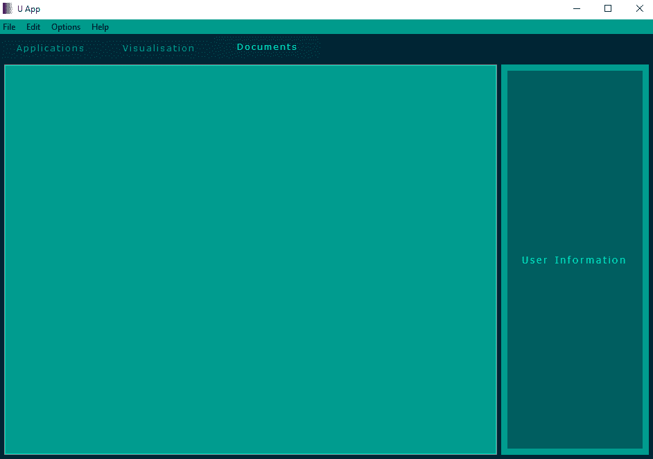
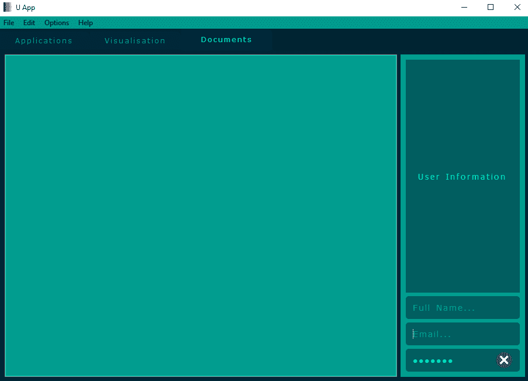
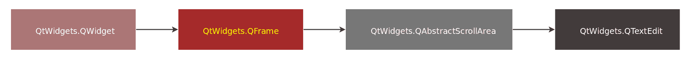
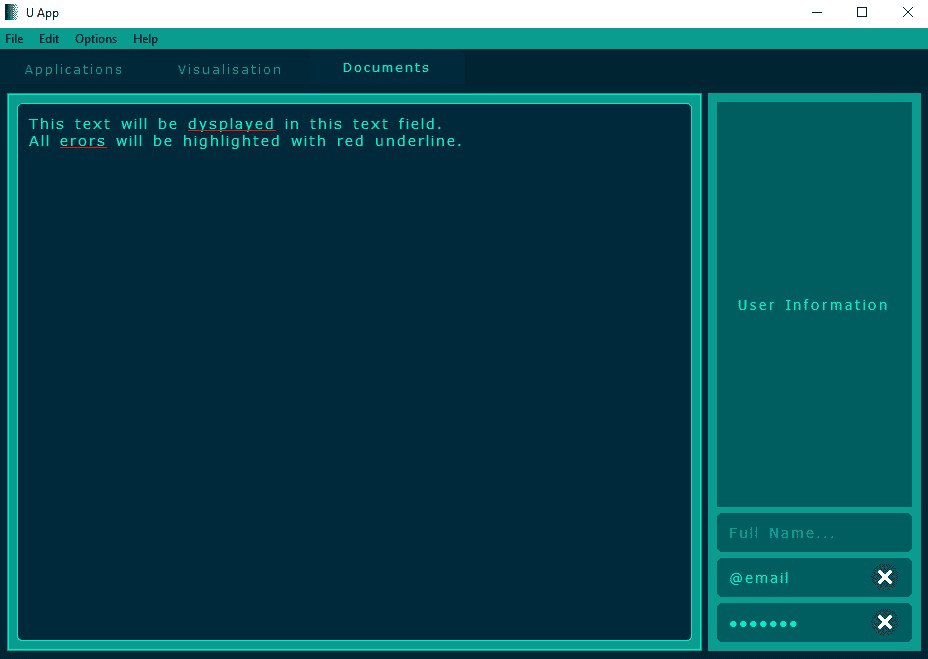

# 第六章：使用框架、标签和文本字段

本章将涵盖的内容是用于在开发第一阶段组织应用程序的图形组件。这些组件提供了实现一些用于可视化应用程序的窗口、带有文本的标签以通知用户应用程序的功能，以及各种文本字段以输入文本和操作文本的能力。我们将首先描述这些方法，然后在章节末尾在应用程序中实现它们。没有现代应用程序可以没有这些组件。用户可能希望有一个完美的可视化效果，解释事物是什么或需要做什么，或者可能发生某些事件。文本字段具有与各种文本一起工作的功能，例如短文本、长描述、可视化文本、从文件加载文本、复制/粘贴文本、对文本的其他附加操作，以及从文本字段保存文本到文件。所有这些都可以通过不同的选项获得。

在本章中，我们将涵盖以下主题：

+   框架

+   标签

+   行编辑字段

+   文本编辑字段

# QFrame

来自 `QtWidgets` 模块的此类是具有框架的窗口的基类。`QFrame` 继承了 `QWidget` 类。框架可以用于通过相似性组合一些元素，并且/或者用作框架内组件的父元素。第二个断言在您需要隐藏某些元素时很有用，您只需隐藏父框架，而不是逐个隐藏它们。创建框架的语法如下：

```py
frame = QtWidgets.QFrame()
```

# QFrame 的功能

`QFrame` 扩展了 `QWidget` 类并提供以下功能。

# 设置

这些函数设置框架的参数/属性，例如样式和宽度：

`frame.setFrameRect(QtCore.QRect)`: 这为此框架绘制的矩形设置。

`frame.setFrameShadow(QtWidgets.QFrame.Shadow)`: 这为此框架设置阴影。

`frame.setFrameShape(QtWidgets.QFrame.Shape)`: 这为此框架设置形状。

`frame.setFrameStyle(int)`: 这设置框架的样式。可用的值如下：

+   `0`: 无框架

+   `1`: 盒子

+   `2`: 面板

+   `3`: 窗口面板

+   `4`/`5`: 水平线/垂直线和样式面板

`frame.setLineWidth(int)`: 这为此框架设置线宽。

`frame.setMidLineWidth(int)`: 这为此框架设置中间线宽。

# 功能

这些函数返回框架的当前值或更改功能：

`frame.frameRect()`: 这返回框架绘制的 `QtCore.QRect` 类型的矩形。

`frame.frameShadow()`: 这返回框架样式中的框架阴影值，类型为 `QtWidgets.QFrame.Shadow`。

`frame.frameShape()`: 这返回框架样式中的框架形状值，类型为 `QtWidgets.QFrame.Shape`。

`frame.frameStyle()`: 这返回框架样式为整数值。

`frame.frameWidth()`: 这返回绘制的框架的宽度为整数值。

`frame.initStyleOption(QtWidgets.QStyleOptionFrame)`: 这使用参数中的值初始化样式选项。

`frame.lineWidth()`: 这以整数值返回框架的线宽。

`frame.midLineWidth()`: 这以整数值返回此框架中间线的宽度。

# 事件

这些函数与事件相关，例如事件处理器：

`frame.changeEvent(QtCore.QEvent)`: 这处理框架的状态变化。

`frame.event(QtCore.QEvent)`: 这接收发送到框架对象的的事件，如果事件被识别并处理，则应返回`true`。

# QFrame 示例

让我们在应用程序中创建简单的框架。通过在`u_style.py`文件中添加以下行，将两个框架放入主窗口的“文档”标签页：

1.  将继承自`QtWidgets.QFrame`的`UFrame`类添加到`u_style.py`文件中：

```py
...
class UFrame(QtWidgets.QFrame):

    def __init__(self, parent=None):
        super(UFrame, self).__init__(parent)
        self.setStyleSheet("background-color: %s;" % (color[2],))
...
```

在这个类中，我们使用`setStyleSheet()`方法设置框架的背景颜色。现在，我们需要在`u_app.py`文件中添加一些行。

1.  将新的导入添加到`u_app.py`文件的导入部分：

```py
...
from u_style import UWid, UFrame
...
```

当我们在未来使用某些组件时，我们需要将`u_style.py`文件中创建的类添加到主应用程序文件的导入部分。

1.  现在，在`u_app.py`文件中的`UApp`类中添加框架及其布局：

```py
...
    def __init__(self, parent=None):
        ...
        self.frame1 = UFrame(self.twid3)
        self.frame1.setLineWidth(3)
        self.frame1.setFrameStyle(6)
        self.frame2 = UFrame(self.twid3)
        self.frame2.setLineWidth(3)
        self.frame2.setFrameStyle(0)
        self.lay1 = QtWidgets.QGridLayout()
        self.lay1.addWidget(self.frame1, 0, 0, 1, 1)
        self.lay1.addWidget(self.frame2, 0, 1, 1, 1)
        self.twid3.setLayout(self.lay1)
    ...
...
```

两个框架已经创建并按照网格布局排列。现在我们可以在主应用程序的“文档”标签页中看到两个不同的框架：


现在，让我们继续介绍`QLabel`类。

# QLabel

标签是一个提供文本或图像显示的 GUI 应用程序中的小部件。**`QLabel`**继承自`QFrame`类。标签在 GUI 应用程序中演示或可视化一些信息。可以在标签上显示图像或电影，或以文本形式向用户显示信息。在应用程序代码中创建标签的语法如下：

```py
label = QtWidgets.QLabel()
```

# QLabel 的功能

`QLabel`扩展了`QWidget`和`QFrame`类，并提供以下功能。

# 设置

这些函数设置标签的参数/属性，例如文本和对齐方式：

`label.setAlignment(QtCore.Qt.Alignment)`: 这设置标签中内容的对齐方式。

`label.setBuddy(QtWidgets.QWidget)`: 这将标签的伙伴设置为参数中指定的。伙伴机制是当用户按下标签的快捷键时，键盘焦点将转移到标签的伙伴小部件。

`label.setIndent(int)`: 这设置标签文本的缩进（以像素为单位）。

`label.setMargin(int)`: 这设置框架最内层像素和标签内容最外层像素之间的距离。

`label.setMovie(QtGui.QMovie)`: 这设置将在标签上显示的电影。

`label.setNum(float**)`: 这设置浮点数的文本表示。

`label.setNum(int)`: 这设置整数的文本表示。

`label.setOpenExternalLinks(bool)`: 如果设置为`True`，则标签将自动打开外部链接。

`label.setPicture(QtGui.QPicture)`: 这设置将在标签上显示的图片。

`label.setPixmap(QtGui.QPixmap)`: 这设置标签的位图。

`label.setScaledContents(bool)`: 如果设置为`True`，则此标签将缩放内容以填充所有可用空间。

`label.setSelection(start, length)`: 这将设置文本的起始位置（第一个参数，一个整数）和长度（第二个参数，也是一个整数）。

`label.setText(str)`: 这以 Unicode 字符串类型为此标签设置文本。

`label.setTextFormat(QtCore.Qt.TextFormat)`: 这根据指定的参数设置标签的文本格式。

`label.setTextInteractionFlags(QtCore.Qt.TextInteractionFlags)`: 这将设置标签如何与用户输入交互，如果它显示文本的话。

`label.setWordWrap(bool)`: 如果设置为`True`，则文本将换行到标签的宽度。

# 有

以下是与标签状态相关的返回布尔值（`bool`）的函数：

`label.hasScaledContents()`: 如果标签允许我们缩放内容以填充所有可用空间，则返回`True`。

`label.hasSelectedText()`: 如果标签的某些或全部文本已被选中，则返回`True`。

# 功能性

这些是与标签当前值的返回或功能更改相关的函数：

`label.alignment()`: 这返回标签中元素的`QtCore.Qt.Alignment`类型的对齐方式。

`label.buddy()`: 这返回标签的`QtWidgets.QWidget`类型的伙伴。

`label.clear()`: 这清除标签的内容。

`label.focusNextPrevChild(bool)`: 如果它可以找到一个新标签来提供键盘焦点，则返回`True`。如果参数为`True`，则向前搜索，如果为`False`，则向后搜索。

`label.heightForWidth(width)`: 这返回给定整数参数`width`的此标签的首选高度。

`label.indent()`: 这返回标签的文本缩进（以像素为单位）。

`label.margin()`: 这返回此标签的框架最内层像素与内容最外层像素之间的距离。

`label.minimumSizeHint()`: 这返回可用于此标签的`QtCore.QSize`类型的最小尺寸提示。

`label.movie()`: 这返回指向标签的`QtGui.QMovie`类型的电影的指针。

`label.openExternalLinks()`: 如果标签应该自动打开链接，则返回`True`。

`label.picture()`: 这返回标签的`QtGui.QPicture`类型的图片。

`label.pixmap()`: 这返回标签的`QtGui.QPixmap`类型的位图。

`label.selectedText()`: 这返回作为此标签选中文本的 Unicode 字符串。

`label.selectionStart()`: 这返回此标签第一个选中字符的索引，如果没有文本被选中，则返回`-1`。

`label.text()`: 这返回标签的文本作为 Unicode 字符串。

`label.textFormat()`: 这个函数返回标签文本的 `QtCore.Qt.TextFormat` 类型的格式。

`label.textInteractionFlags()`: 这个函数返回此标签的 `QtCore.Qt.TextInteractionFlags` 类型的文本交互标志。

`label.wordWrap()`: 如果标签中的文本被换行到标签的宽度，则此函数返回 `True`。

# 事件

这些函数与事件相关，包括事件处理程序：

`label.changeEvent(QtCore.QEvent)`: 这个函数处理标签的状态变化。

`label.contextMenuEvent(QtGui.QContextMenuEvent)`: 这个事件处理程序接收上下文菜单事件。

`label.event(QtCore.QEvent)`: 这个函数接收发送给对象的事件，如果事件被识别并处理，则应返回 `True`。

`label.keyPressEvent(QtGui.QKeyEvent)`: 这个事件处理程序接收传递给参数的按键事件，用于此标签。

`label.focusOutEvent(QtGui.QFocusEvent)`: 这个事件处理程序接收标签的键盘焦点事件，当失去焦点时，作为 `event` 参数传递。

`label.focusInEvent(QtGui.QFocusEvent)`: 这个事件处理程序接收标签的键盘焦点事件，当获得焦点时，作为事件参数传递。

`label.mouseMoveEvent(QtGui.QMouseEvent)`: 这个事件处理程序接收传递给参数的鼠标移动事件，用于此标签。

`label.mousePressEvent(QtGui.QMouseEvent)`: 这个事件处理程序接收传递给参数的鼠标按下事件，用于此标签。

`label.mouseReleaseEvent(QtGui.QMouseEvent)`: 这个事件处理程序接收传递给参数的鼠标释放事件，用于此标签。

`label.paintEvent(QtGui.QPaintEvent)`: 这个事件处理程序接收传递给参数的绘制事件，用于此标签。

# 信号

这些是 `QLabel` 类的可用信号：

`label.linkActivated(str)`: 当用户点击链接时，会发出此信号，URL 由传递给参数的锚点引用。

`label.linkHovered(str)`: 当用户将鼠标悬停在链接上时，会发出此信号，URL 通过参数传递。

# QLabel 示例

标签将在应用程序中使用多次。这只是一个简短的演示。现在我们有一个理由在 `u_style.py` 文件中创建一个带有字体的类。这些字体将用于后续的组件：

1.  在 `u_style.py` 文件的开始处插入 `UFonts` 类：

```py
...
class UFonts(object):

    def __init__(self, parent=None, ls=2.0, ws=2.0,
                 family="Verdana", size=12, weight=34):
        self.font1 = QtGui.QFont() 
        self.font1.setLetterSpacing(QtGui.QFont.AbsoluteSpacing, ls)
        self.font1.setWordSpacing(ws)
        self.font1.setFamily(family)
        self.font1.setPixelSize(size)
        self.font1.setWeight(weight)
...
```

此类将用于更改小部件或图形元素的文本字体。

1.  将 `ULabel` 类添加到 `u_style.py` 文件中：

```py
...
class ULabel(QtWidgets.QLabel):

    def __init__(self, parent=None):
        super(ULabel, self).__init__(parent)
        font = UFonts(ls=3.0, size=14, weight=59)
        self.setFont(font.font1)
        self.setStyleSheet("""background-color: %s;
                               color: %s;"""
                               % (color[0], color[3]))
...
```

`setFont()` 方法使用 `UFonts` 类设置标签的字体。现在，我们需要在 `u_app.py` 文件中添加一些行。

1.  将创建的 `ULabel` 类添加到 `u_app.py` 文件的 `import` 部分：

```py
...
from u_style import UWid, UFrame, ULabel
...
```

1.  在 `UApp` 类内部添加包含标签的行：

```py
...
    def __init__(self, parent=None):
    ...
        ...
        self.label1 = ULabel(self.frame2)
        self.label1.setText("User Information")
        self.label1.setAlignment(QtCore.Qt.AlignCenter)
        ...
        self.layfr2 = QtWidgets.QGridLayout()
        self.layfr2.addWidget(self.label1, 0, 0, 1, 1)
        self.frame2.setLayout(self.layfr2)
    ...
...
```

我们已经设置了带有文本和对齐方式的标签实例。将此标签添加到第二个框架的网格布局中。现在，我们可以运行 `u_app.py` 文件，结果如下（标签位于右侧）：



现在，让我们继续介绍 `QLineEdit` 类。

# QLineEdit

行编辑字段提供了一行文本编辑器。`QLineEdit` 类可用于创建一行用户输入字段，用于输入纯文本，例如用户名、电子邮件和密码。此外，一些其他类型的文本输入字段提供的信息更便于单独使用，并且具有一些特殊用途。行编辑字段通常与应用程序中的用户表单一起使用。在应用程序中，行编辑字段的声明语法如下：

```py
line_edit = QtWidgets.QLineEdit()
```

# QLineEdit 的功能

`QLineEdit` 类继承自 `QWidget` 类，并通过以下功能增强了功能。

# add

这些函数向行 `edit_field` 添加元素或操作：

`line_edit.addAction(QtWidgets.QAction, QtWidgets.QLineEdit.ActionPosition)`: 这将在特定位置（第二个参数）将操作（第一个参数）添加到操作列表中。

`line_edit.addAction(QtGui.QIcon, QtWidgets.QLineEdit.ActionPosition)`: 这将在特定位置（第二个参数）添加带有图标（第一个参数）的新操作。

# set

这些函数设置行编辑字段的参数/属性，例如文本、对齐方式和功能：

`line_edit.setAlignment(QtCore.Qt.Alignment)`: 这将设置行编辑字段内容的对齐方式。

`line_edit.setClearButtonEnabled(bool)`: 如果此参数为 `True`，则将行编辑字段设置为在非空时显示清除按钮。如果参数为 `False`，则行编辑字段中不会显示清除按钮。

`line_edit.setCompleter(QtWidgets.QCompleter)`: 这将行编辑字段设置为从传递给参数的补全器自动完成。

`line_edit.setCursorMoveStyle(QtCore.Qt.CursorMoveStyle)`: 这将设置此行编辑字段的光标移动样式。

`line_edit.setCursorPosition(int)`: 这将为该行编辑字段设置光标位置。

`line_edit.setDragEnabled(bool)`: 如果此参数为 `True`，则为此字段启用拖动。

`line_edit.setEchoMode(QtWidgets.QLineEdit.EchoMode)`: 这将为行编辑字段设置回显模式。可用参数如下：

+   `QtWidgets.QLineEdit.Normal`: `0`

+   `QtWidgets.QLineEdit.NoEcho`: `1`

+   `QtWidgets.QLineEdit.Password`: `2`

+   `QtWidgets.QLineEdit.PasswordEchoOnEdit`: `3`

`line_edit.setFrame(bool)`: 如果此参数为 `True`，则将行编辑字段的边框设置为。

`line_edit.setInputMask(str)`: 这将为该行编辑字段设置输入掩码。

`line_edit.setMaxLength(int)`: 这将设置此字段的字符最大长度。

`line_edit.setModified(bool)`: 如果此参数为`True`，则将行编辑内容设置为已修改或更改/编辑。

`line_edit.setPlaceholderText("Placeholder text")`: 这将设置行编辑字段的占位符文本，即如果字段为空时将显示的文本。

`line_edit.setReadOnly(bool)`: 如果参数为`True`，则将行编辑字段设置为只读模式，以便用户无法编辑其中的内容。

`line_edit.setSelection(start, length)`: 这根据`start`参数（第一个参数）和`length`参数（第二个参数）在行编辑字段中选择文本。

`line_edit.setText("Text in this field")`: 这将设置与该行编辑字段一起显示的文本。

`line_edit.setTextMargins(QtCore.QMargins)`: 这将设置围绕行编辑字段框架内部文本的边距。

`line_edit.setTextMargins(left, top, right, bottom)`: 这将设置围绕行编辑字段内部文本的边距。每个参数都是一个整数值。

`line_edit.setValidator(QtGui.QValidator)`: 这将设置参数中指定的`QtGui.QValidator`类型的验证器，这意味着此行编辑字段将只接受验证器接受的输入。

# edit

这些函数对当前行编辑字段的内容进行一些更改，例如清除、撤销和重做：

`line_edit.clear()`: 这将清除行编辑字段的内容。

`line_edit.copy()`: 这将复制行编辑字段中选定的文本到剪贴板。

`line_edit.cut()`: 这将复制行编辑字段中选定的文本到剪贴板，并从字段中删除它。

`line_edit.paste()`: 这将在行编辑的光标位置插入剪贴板中的文本，并删除所有选定的文本。

`line_edit.redo()`: 如果可用，则重做最后一个操作。

`line_edit.undo()`: 如果可用，则撤销最后一个操作。

`line_edit.selectAll()`: 这将选择行编辑字段中的所有文本，并将光标移动到末尾。

# has/is

这些函数返回与行编辑状态相关的布尔值（`bool`），例如，检查撤销功能是否可用：

`line_edit.hasAcceptableInput()`: 如果输入满足`inputMask`和验证器，则返回`True`。

`line_edit.hasFrame()`: 如果行编辑字段周围有框架，则返回`True`。

`line_edit.hasSelectedText()`: 如果行编辑有选定的文本，则返回`True`。

`line_edit.isClearButtonEnabled()`: 如果行编辑字段在非空时显示清除按钮，则返回`True`。

`line_edit.isModified()`: 如果行编辑的内容已被修改，则返回`True`。

`line_edit.isReadOnly()`: 如果行编辑处于只读模式，则此函数返回`True`，因此用户无法编辑其中的内容。

`line_edit.isRedoAvailable()`: 如果行编辑字段的内容具有重做功能，或者内容之前已被撤销，则返回 `True`。

`line_edit.isUndoAvailable()`: 如果行编辑字段的内容具有撤销功能，或者内容之前已被编辑/更改，则返回 `True`。

# functional

这些函数返回行编辑字段的当前值，并将其更改为以下功能：

`line_edit.alignment()`: 这返回了行编辑字段中文本的对齐方式，为 `QtCore.Qt.Alignment` 类型。

`line_edit.backspace()`: 如果行编辑字段中没有选择文本，则将删除光标左侧的字符，并将光标向左移动一个位置。如果选择了任何文本，则将删除所选文本，并将光标移动到所选文本的开头。

`line_edit.completer()`: 这返回了行编辑字段中文本的当前补全器，为 `QtWidgets.QCompleter` 类型。

`line_edit.createStandardContextMenu()`: 这创建了一个标准上下文菜单，当用户在行编辑字段上右键单击时将显示。

`line_edit.cursorBackward(bool,steps)`: 这通过字符（第二个参数）向后移动光标。如果第一个参数为 `True`，则每个字符都将被选择；否则，选择将被清除。

`line_edit.cursorForward(bool, steps)`: 这通过字符（第二个参数）移动光标。如果第一个参数为 `True`，则每个字符都将被选择；否则，选择将被清除。

`line_edit.cursorMoveStyle()`: 这返回了此行编辑字段光标的移动方式，为 `QtCore.Qt.CursorMoveStyle` 类型。

`line_edit.cursorPosition()`: 这返回了行编辑字段中当前光标位置的整数值。

`line_edit.cursorPositionAt(QtCore.QPoint)`: 这返回了参数中指定的点的光标位置。

`line_edit.cursorRect()`: 这返回了行编辑字段光标放置的 `QtCore.QRect` 类型的矩形。

`line_edit.cursorWordBackward(bool)`: 这通过一个单词移动光标。如果参数为 `True`，则单词将被选择。

`line_edit.cursorWordForward(bool)`: 这通过一个单词移动光标。如果参数为 `True`，则单词将被选择。

`line_edit.del_()`: 如果行编辑字段没有选择文本，它将删除光标右侧的字符。如果选择了文本，光标将移动到选择的开头，并删除所选文本。

`line_edit.deselect()`: 这取消选择了所选文本。

`line_edit.displayText()`: 这返回了显示的文本。

`line_edit.dragEnabled()`: 如果为此行编辑字段启用了拖动，则返回 `True`。

`line_edit.echoMode()`: 这返回了此行编辑字段的 `QtWidgets.QLineEdit.EchoMode` 类型的回显模式。

`line_edit.end(bool)`: 这会将文本光标移动到行编辑字段的末尾。

`line_edit.getTextMargins()`: 这返回行编辑文本的左、上、右和下边距。

`line_edit.home(bool)`: 这会将光标移动到行编辑字段的开始处。如果参数为 `True`，则选择文本；否则，取消选择任何选定的文本。

`line_edit.inputMask()`: 这返回行编辑字段的验证输入掩码。

`line_edit.inputMethodQuery(QtCore.Qt.InputMethodQuery, object)`: 这用于查询行编辑字段的属性集，以支持复杂的输入法操作。

`line_edit.insert("Text will be inserted")`: 这在行编辑字段中插入新文本。它还会删除任何选定的文本并验证结果。

`line_edit.maxLength()`: 这返回此行编辑字段文本的最大长度。

`line_edit.minimumSizeHint()`: 这返回此行编辑字段的 `QtCore.QSize` 类型的最小大小提示。

`line_edit.placeholderText()`: 这返回行编辑字段的占位文本。只要字段为空，就会显示此文本。

`line_edit.selectedText()`: 这返回行编辑字段中选定的文本。

`line_edit.selectionStart()`: 这返回字段中选中文本中第一个字符的索引，如果没有文本被选中，则返回 `-1`。

`line_edit.selectionEnd()`: 这返回字段中选中文本的最后一个字符的索引，如果没有文本被选中，则返回 `-1`。

`line_edit.selectionLength()`: 这返回行编辑字段中选定的字符的长度。

`line_edit.text()`: 这返回行编辑字段的内容作为 Unicode 字符串。

`line_edit.textMargins()`: 这返回此字段文本的边距。

`line_edit.validator()`: 这返回此行编辑字段的验证器。

# events

这些函数与事件相关，包括事件处理程序：

`line_edit.changeEvent(QtCore.QEvent)`: 这处理行编辑字段的州变化。

`line_edit.contextMenuEvent(QtGui.QContextMenuEvent)`: 此事件处理程序接收行编辑上下文菜单事件。

`line_edit.dragEnterEvent(QtGui.QDragEnterEvent)`: 当鼠标进入行编辑字段并且正在拖动时，此事件处理程序会使用事件参数被调用。

`line_edit.dragLeaveEvent(QtGui.QDragLeaveEvent)`: 当鼠标离开行编辑字段并且正在拖动时，此事件处理程序会使用事件参数被调用。

`line_edit.dragMoveEvent(QtGui.QDragMoveEvent)`: 当发生某些条件时，例如光标进入字段；光标在字段内移动；或者在行编辑字段具有焦点的同时按下键盘上的修改键，并且正在拖动时，此事件处理程序会使用事件参数被调用。

`line_edit.dropEvent(QtGui.QDropEvent)`: 当拖动到行编辑字段时，此事件处理程序会使用事件参数被调用。

`line_edit.event(QtCore.QEvent)`: 此接收发送到对象的事件，如果事件被识别并已处理，则应返回`True`。

`line_edit.focusOutEvent(QtGui.QFocusEvent)`: 此事件处理程序接收行编辑键盘焦点事件，当焦点丢失时，这些事件会通过事件参数传递。

`line_edit.focusInEvent(QtGui.QFocusEvent)`: 此事件处理程序接收当接收到焦点时通过事件参数传递的行编辑键盘焦点事件。

`line_edit.inputMethodEvent(QtGui.QInputMethodEvent)`: 此事件处理程序接收传递给参数的事件的输入法组合事件。

`line_edit.keyPressEvent(QtGui.QKeyEvent)`: 此事件处理程序接收传递给参数的事件的行编辑字段的按键事件。

`line_edit.mouseMoveEvent(QtGui.QMouseEvent)`: 此事件处理程序接收传递给参数的事件的此行编辑字段的鼠标移动事件。

`line_edit.mousePressEvent(QtGui.QMouseEvent)`: 此事件处理程序接收传递给参数的事件的此行编辑字段的鼠标按下事件。

`line_edit.mouseReleaseEvent(QtGui.QMouseEvent)`: 此事件处理程序接收传递给参数的事件的此行编辑字段的鼠标释放事件。

`line_edit.mouseDoubleClickEvent(QtGui.QMouseEvent)`: 此事件处理程序接收传递给参数的事件的此行编辑字段的鼠标双击事件。

`line_edit.paintEvent(QtGui.QPaintEvent)`: 此事件处理程序接收传递给参数的事件的此行编辑字段的绘制事件。

# 信号

`QLineEdit`类有以下信号可用：

`line_edit.cursorPositionChanged(int, int)`: 当光标在行编辑字段内部移动时，会发出此信号。旧的和新的位置作为参数传递。

`line_edit.editingFinished()`: 当按下*Enter*键或字段失去焦点时，会发出此信号。

`line_edit.returnPressed()`: 当按下*Enter*键时，会发出此信号。

`line_edit.selectionChanged()`: 当行编辑文本选择发生变化时，会发出此信号。

`line_edit.textChanged(str)`: 当字段中的文本发生变化时，会发出此信号；这也可以通过`setText()`方法以编程方式完成。

`line_edit.textEdited(str)`: 当字段中的文本被编辑时，会发出此信号。它与使用`setText()`方法更改文本无关。

# QLineEdit 示例

为了演示行编辑字段的函数，让我们将此字段放入应用程序中：

1.  将`ULineEd`类添加到`u_style.py`文件中：

```py
...
class ULineEd(QtWidgets.QLineEdit):

    def __init__(self, parent=None, tmrgl=10,
                 tmrgt=10, tmrgr=10, tmrgb=10,
                 drg=True, bdr=5, bdw=1, bdc=color[3]):
        super(ULineEd, self).__init__(parent)
        self.setClearButtonEnabled(True)
        self.setDragEnabled(drg)
        self.setTextMargins(tmrgl, tmrgt, tmrgr, tmrgb)
        self.bdr = bdr
        self.bdw = bdw
        self.bdc = bdc
        font = UFonts(size=14, weight=59)
        self.setFont(font.font1)
        self.setStyleSheet(
                """background-color: %s; color: %s;
                   border-radius: %spx; border-width: %spx;
                   border-color: %s;"""  % (color[0],
                   color[3], self.bdr, self.bdw, self.bdc))
  ...
```

我们向此类添加了各种属性，例如文本边距和行编辑字段边框的颜色。现在，我们需要在`u_app.py`文件中实现此字段。

1.  将以下内容添加到`u_app.py`文件的`import`部分：

```py
...
from u_style import ULineEd
...
```

1.  将以下内容添加到`u_app.py`文件的`__init__()`函数中：

```py
...
def __init__(self, parent=None):
    ...
    self.line_ed1 = ULineEd(self.frame2)
    self.line_ed1.setPlaceholderText("Full Name...")
    self.line_ed2 = ULineEd(self.frame2)
    self.line_ed2.setPlaceholderText("Email...")
    self.line_ed3 = ULineEd(self.frame2)
    self.line_ed3.setPlaceholderText("Password...")
    self.line_ed3.setEchoMode(QtWidgets.QLineEdit.Password)
    self.layfr2 = QtWidgets.QGridLayout()
    self.layfr2.addWidget(self.label1, 0, 0, 1, 1)
    self.layfr2.addWidget(self.line_ed1, 1, 0, 1, 1)
    self.layfr2.addWidget(self.line_ed2, 2, 0, 1, 1)
    self.layfr2.addWidget(self.line_ed3, 3, 0, 1, 1)
    ...
...
```

我们添加了三个行编辑字段来输入用户名、电子邮件和密码。我们还添加到了第二个框架的布局中。

1.  现在，运行应用程序以查看行编辑字段：



现在，让我们继续介绍 `QTextEdit` 类。

# QTextEdit

`QTextEdit` 类用于多行文本表示。此字段支持文本的富格式和平格式。通常，富文本格式化用于在字段中插入 HTML 样式的标签，并具有显示和编辑它们的能力。多行字段是编辑模式下处理文本的最流行工具，用于创建文本编辑器、可视化并编辑文本文件。此类字段用于编写文本消息、创建文本文件、将信息保存到数据库以及许多其他事情。使用 `QTextEdit` 类创建的文本字段允许我们显示文本、图像、列表、表格和其他元素。为了在 GUI 应用程序中实现多行文本编辑器，我们需要了解文本表示的基础知识。根据操作系统（OS）的不同，使用行结束特殊字符，例如 `\n` 用于换行和 `\r` 用于回车，例如，Unix-like 系统中使用 `\n` 和 Windows（**磁盘操作系统**（**DOS**））中使用 `\r\n`。还有其他特殊字符，例如 `\t` 用于制表符和 `\v` 用于垂直制表符。默认情况下，`QTextEdit` 字段使用 `\n` 作为行结束的符号，但您需要记住，这些特殊符号对于文本字段中使用的外部文本可能会有所不同。`QTextEdit` 类的继承方案如下：



在应用程序中声明此类的方式如下：

```py
text_edit = QtWidgets.QTextEdit()
```

# QTextEdit 的功能

`QTextEdit` 类通过以下功能增强了继承类的功能。

# set

这些函数将参数/属性设置到文本编辑字段中，例如文本、对齐方式和功能：

`text_edit.setAcceptRichText(bool)`: 如果参数为 `True`，则文本字段将接受富文本。

`text_edit.setAlignment(QtCore.Qt.Alignment)`: 这将设置当前段落的对齐方式。可用的参数包括 `QtCore.Qt.AlignLeft`，它将文本对齐到左边（默认）；`QtCore.Qt.AlignRight`，它将文本对齐到右边；`QtCore.Qt.AlignCenter`，它将文本对齐到中间；以及 `QtCore.Qt.AlignJustify`，它使文本两端对齐。

`text_edit.setAutoFormatting(QtWidgets.QTextEdit.AutoFormatting)`: 这将设置此文本字段的自动格式化功能。

`text_edit.setCurrentCharFormat(QtGui.QTextCharFormat)`: 这将设置插入新文本时使用的字符格式。

`text_edit.setCurrentFont(QtGui.QFont)`: 这将设置当前字符格式的字体。

`text_edit.setCursorWidth(int)`: 这将设置与该文本字段一起可见的光标宽度。

`text_edit.setDocument(QtGui.QTextDocument)`: 这将设置此文本字段的底层文档。

`text_edit.setDocumentTitle("Document Title")`: 这将设置底层文档的标题。

`text_edit.setExtraSelections(selections)`: 这允许使用在`selections`参数中指定的颜色临时标记文本中的某些区域。

`text_edit.setFontFamily("Font Family")`: 这将设置当前格式的字体家族。

`text_edit.setFontItalic(bool)`: 如果此参数为`True`，则当前格式的字体将被斜体。

`text_edit.setFontPointSize(float)`: 这将设置当前格式的字体点大小。

`text_edit.setFontUnderline(bool)`: 如果此参数为`True`，则当前格式的字体将被下划线。

`text_edit.setFontWeight(int)`: 这将设置当前格式的字体粗细。

`text_edit.setHtml("<p>Html tags</p>")`: 这将使用 HTML 样式格式设置文本。所有之前的文本将被删除。

`text_edit.setLineWrapColumnOrWidth(int)`: 这将设置文本将在此位置（以像素或列为单位，取决于换行模式）换行。

`text_edit.setLineWrapMode(QtWidgets.QTextEdit.LineWrapMode)`: 这将为文本字段设置参数中指定的换行模式。

`text_edit.setOverwriteMode(bool)`: 如果此参数为`True`，则输入的文本将覆盖现有文本。

`text_edit.setPlaceholderText("Placeholder text")`: 这将设置当此文本字段为空时使用的文本。

`text_edit.setPlainText("Text")`: 这将向文本字段添加纯文本。所有之前的文本将被删除。如果文本具有 HTML 样式标签，则这些标签将按原样（不带 HTML 样式格式）显示在文本中。

`text_edit.setReadOnly(bool)`: 如果此参数为`True`，则将此文本字段的只读模式设置为用户无法编辑其中的内容。

`text_edit.setTabChangesFocus(bool)`: 如果此参数为`True`，则允许**Tab**键更改焦点；否则，**Tab**键被视为输入。

`text_edit.setTabStopDistance(float)`: 这将设置**Tab**停止距离（默认为`80.0`像素）。

`text_edit.setTabStopWidth(int)`: 这将设置**Tab**停止宽度。

`text_edit.setText("Text")`: 这将设置文本字段中的文本。所有之前的文本将被删除。文本可以具有 HTML 样式格式或纯文本。HTML 将被格式化。

`text_edit.setTextBackgroundColor(QtGui.QColor)`: 这将设置文本的背景颜色。

`text_edit.setTextColor(QtGui.QColor)`: 这将设置文本颜色。

`text_edit.setTextCursor(QtGui.QTextCursor)`: 这将设置与此文本字段一起可见的光标。

`text_edit.setTextInteractionFlags(QtCore.Qt.TextInteractionFlags)`: 这将设置标志，以指定文本字段如何与用户输入交互。

`text_edit.setUndoRedoEnabled(bool)`: 如果此参数为`True`，则允许我们在文本字段中执行撤销/重做操作。

`text_edit.setWordWrapMode(QtGui.QTextOption.WrapMode)`: 这设置在文本编辑中用于换行的模式。

# 编辑

这些函数对文本编辑字段的内容进行一些更改，例如清除、撤销和重做：

`text_edit.clear()`: 这清除文本编辑字段的内容，并清除撤销/重做历史记录。

`text_edit.copy()`: 这将文本编辑字段中选定的文本复制到剪贴板。

`text_edit.cut()`: 这将文本字段中选定的文本复制到剪贴板，并从文本编辑字段中删除它。

`text_edit.paste()`: 这将在文本字段的光标位置粘贴剪贴板中的文本。

`text_edit.redo()`: 如果对于此文本字段可用，则重做最后一个操作。

`text_edit.undo()`: 如果对于此文本字段可用，则撤销最后一个操作。

`text_edit.selectAll()`: 这选择文本编辑字段中的所有文本，并将光标移动到文本的末尾。

`text_edit.zoomIn(int)`: 这通过在参数指定的范围内增大字体大小来放大文本，并重新计算所有字体大小。它不会改变图像的大小。

`text_edit.zoomInF(float)`: 这通过在参数指定的范围（`float`）内增大字体大小来放大文本，并重新计算所有字体大小。它不会改变图像的大小。

`text_edit.zoomOut(int)`: 这通过在参数指定的范围内减小字体大小来缩小文本，并重新计算所有字体大小。它不会改变图像的大小。

# 是

这些函数返回与文本编辑状态相关的布尔值（`bool`），例如检查撤销功能的可用性：

`text_edit.isReadOnly()`: 如果文本字段处于只读模式，则返回`True`，因此用户无法编辑其中的内容。

`text_edit.isUndoRedoEnabled()`: 如果撤销和重做操作对此文本编辑字段可用，则返回`True`。

# 功能性

这些函数返回文本编辑字段的当前值和功能更改：

`text_edit.acceptRichText()`: 如果文本字段接受允许 HTML 样式标签的富文本插入，则返回`True`。如果返回`False`，则文本字段仅接受纯文本输入。

`text_edit.alignment()`: 这返回当前段落的文本对齐方式。

`text_edit.anchorAt(QtCore.QPoint)`: 这返回在参数指定的位置上的锚点的 Unicode 字符串引用。

`text_edit.append("Text to append")`: 这将新的文本段落追加到文本字段中，作为字段中最后一行的下一行。

`text_edit.autoFormatting()`: 这返回为该文本字段启用的`QtWidgets.QTextEdit.AutoFormatting`类型的自动格式化功能。

`text_edit.canInsertFromMimeData(QtCore.QMimeData)`: 如果在参数中指定的 MIME 数据对象的内 容可以被解码并插入到文本字段中，则返回`True`。

`text_edit.canPaste()`: 如果可以从剪贴板粘贴文本到这个文本字段，则返回`True`。

`text_edit.createMimeDataFromSelection()`: 这返回一个新的`QtCore.QMimeData`类型的 MIME 数据对象，用于表示此文本编辑字段选择的内容。

`text_edit.createStandardContextMenu()`: 这创建一个标准上下文菜单，当用户用鼠标右键单击文本编辑字段时显示。

`text_edit.createStandardContextMenu(QtCore.QPoint)`: 这创建一个标准上下文菜单，当用户在文本编辑字段上右击时显示，并出现在鼠标点击发生的位置，由参数指定。

`text_edit.currentCharFormat()`: 这返回当插入新文本时将使用的当前字符格式。

`text_edit.currentFont()`: 这返回文本格式的当前字体。

`text_edit.cursorForPosition(QtCore.QPoint)`: 这返回在参数中指定的位置（在视口坐标中）的`QtGui.QTextCursor`类型的光标。

`text_edit.cursorRect()`: 这返回包含此文本字段光标的`QtCore.QRect`类型（在视口坐标中）的矩形。

`text_edit.cursorRect(QtGui.QTextCursor)`: 这返回一个包含在参数中指定的光标的`QtCore.QRect`类型（在视口坐标中）的矩形。

`text_edit.cursorWidth()`: 这返回光标在像素中的宽度（默认为`1`）。

`text_edit.document()`: 这返回表示为`QtGui.QTextDocument`类型底层文档的文本编辑字段的内容。

`text_edit.documentTitle()`: 这返回从文本解析出的底层文档的标题。

`text_edit.ensureCursorVisible()`: 这确保文本光标可见，并在必要时滚动文本编辑字段。

`text_edit.extraSelections()`: 这返回之前设置的额外选择。

`text_edit.find("Text to find", QtGui.QTextDocument.FindFlags)`: 使用指定的搜索规则（第二个参数）查找文本（第一个参数）的下一个出现，如果找到文本，则返回`True`并选择此文本。

`text_edit.find(QtCore.QRegExp, QtGui.QTextDocument.FindFlags)`: 使用指定的搜索规则（第二个参数）查找与正则表达式（第一个参数）匹配的下一个出现，如果找到文本，则返回`True`并在字段中选择此文本。

`text_edit.fontFamily()`: 这返回当前文本格式的字体族。

`text_edit.fontItalic()`: 如果当前文本格式是斜体，则返回`True`。

`text_edit.fontPointSize()`: 这返回当前文本格式的字体点大小。

`text_edit.fontUnderline()`: 如果当前文本格式是下划线，则返回`True`。

`text_edit.fontWeight()`: 这返回当前文本格式的字体粗细。

`text_edit.inputMethodQuery(QtCore.Qt.InputMethodQuery, object)`: 这用于查询文本编辑字段的一组属性，以支持复杂的输入法操作，例如支持周围文本和重新转换。

`text_edit.insertFromMimeData(QtCore.QMimeData)`: 这将参数中指定的 MIME 数据对象的内 容插入到文本编辑字段当前光标位置。

`text_edit.insertHtml("<p>Html tags</p>")`: 这将在当前光标位置插入带有 HTML 格式的文本（如果文本是 HTML 样式）。

`text_edit.insertPlainText("Text")`: 这将在当前光标位置插入文本。如果文本有 HTML 格式，则标签将不会被格式化，文本将按原样表示。

`text_edit.lineWrapColumnOrWidth()`: 这返回文本将换行的像素位置或列数（取决于换行模式）。

`text_edit.lineWrapMode()`: 这返回此文本字段的`QtWidgets.QTextEdit.LineWrapMode`类型的行换行模式。

`text_edit.loadResource(int, QtCore.QUrl)`: 这使用类型（第一个参数）和 URL（第二个参数）指定的类型加载资源。

`text_edit.mergeCurrentCharFormat(QtGui.QTextCharFormat)`: 这将参数中指定的属性合并到当前字符的格式中。

`text_edit.moveCursor(QtGui.QTextCursor.MoveOperation, QtGui.QTextCursor.MoveMode)`: 这根据参数移动光标。如果第二个参数是`QtGui.QTextCursor.KeepAnchor`，则光标在移动时会选择文本。可用的移动操作如下：

+   `QtGui.QTextCursor.NoMove` – `0`: 光标保持在当前位置。

+   `QtGui.QTextCursor.Start` – `1`: 光标移动到文本的开始。

+   `QtGui.QTextCursor.StartOfLine` – `3`: 光标移动到当前行的开始。

+   `QtGui.QTextCursor.StartOfBlock` – `4`: 光标移动到当前块（段落）的开始。

+   `QtGui.QTextCursor.StartOfWord` – `5`: 光标移动到当前单词的开始。

+   `QtGui.QTextCursor.PreviousBlock` – `6`: 光标移动到前一个块的开始。

+   `QtGui.QTextCursor.PreviousCharacter` – `7`: 光标移动到前一个字符的开始。

+   `QtGui.QTextCursor.PreviousWord` – `8`: 光标移动到前一个单词的开始。

+   `QtGui.QTextCursor.Up` – `2`: 光标向上移动一行。

+   `QtGui.QTextCursor.Left` – `9`: 光标向左移动一个字符。

+   `QtGui.QTextCursor.WordLeft` – `10`: 光标向左移动一个单词。

+   `QtGui.QTextCursor.End` – `11`: 光标移动到文本的末尾。

+   `QtGui.QTextCursor.EndOfLine` – `13`: 光标移动到当前行的末尾。

+   `QtGui.QTextCursor.EndOfWord` – `14`: 光标移动到当前单词的末尾。

+   `QtGui.QTextCursor.EndOfBlock` – `15`: 光标移动到当前块的末尾。

+   `QtGui.QTextCursor.NextBlock` – `16`: 光标移动到下一个块的开始。

+   `QtGui.QTextCursor.NextCharacter` – `17`: 光标移动到下一个字符。

+   `QtGui.QTextCursor.NextWord` – `18`: 光标移动到下一个单词。

+   `QtGui.QTextCursor.Down` – `12`: 光标向下移动一行。

+   `QtGui.QTextCursor.Right` – `19`: 光标向右移动一个字符。

+   `QtGui.QTextCursor.WordRight` – `20`: 光标向右移动一个单词。

+   `QtGui.QTextCursor.NextCell` – `21`: 光标移动到当前表格内的下一个单元格。

+   `QtGui.QTextCursor.PreviousCell` – `22`: 光标移动到当前表格内的上一个单元格。

+   `QtGui.QTextCursor.NextRow` – `23`: 光标移动到当前表格内的下一行。

+   `QtGui.QTextCursor.PreviousRow` – `24`: 光标移动到当前表格内的上一行。

`text_edit.overwriteMode()`: 如果输入的文本将覆盖现有文本，则返回 `True`。

`text_edit.placeholderText()`: 这返回当此文本字段为空时将使用的占位文本。

`text_edit.print(QtGui.QPagedPaintDevice)`: 这是一个便利函数，用于使用打印机设备打印文本字段中的文本。

`text_edit.print_(QtGui.QPagedPaintDevice)`: 这使用打印机设备打印文本字段的文本。

`text_edit.scrollToAnchor(str)`: 这将文本编辑字段滚动，以便参数中的字符串的锚点可见。

`text_edit.tabChangesFocus()`: 如果 *Tab* 键改变焦点，则返回 `True`。

`text_edit.tabStopDistance()`: 这返回 *Tab* 停止距离。

`text_edit.tabStopWidth()`: 这返回 *Tab* 停止宽度。

`text_edit.textBackgroundColor()`: 这返回 `QtGui.QColor` 类型的文本背景颜色。

`text_edit.textColor()`: 这返回 `QtGui.QColor` 类型的文本颜色。

`text_edit.textCursor()`: 这返回 `QtGui.QTextCursor` 类型的光标副本，显示当前可见的光标。

`text_edit.textInteractionFlags()`: 这返回指定用户输入交互的 `QtCore.Qt.TextInteractionFlags` 类型的标志。

`text_edit.toHtml()`: 这返回具有 HTML 样式的格式化文本。

`text_edit.toPlainText()`: 这返回文本字段的纯文本。

`text_edit.wordWrapMode()`: 这返回用于在文本编辑字段中换行时使用的 `QtGui.QTextOption.WrapMode` 类型的模式。

# events

这些函数与事件相关，例如事件处理程序：

`text_edit.changeEvent(QtCore.QEvent)`: 这处理此文本编辑字段的状态变化。

`text_edit.contextMenuEvent(QtGui.QContextMenuEvent)`: 此事件处理程序接收文本编辑上下文菜单事件。

`text_edit.dragEnterEvent(QtGui.QDragEnterEvent)`: 当鼠标进入文本编辑字段且正在拖动时，此事件处理程序会使用事件参数调用。

`text_edit.dragLeaveEvent(QtGui.QDragLeaveEvent)`: 当鼠标离开文本编辑字段且正在拖动时，此事件处理程序会使用事件参数调用。

`text_edit.dragMoveEvent(QtGui.QDragMoveEvent)`: 当发生某些条件时，例如光标进入字段、光标在字段内移动、在文本编辑字段获得焦点时按下修改键，或者拖动正在进行时，此事件处理程序会使用事件参数被调用。

`text_edit.dropEvent(QtGui.QDropEvent)`: 此事件处理程序在拖动被放置在文本编辑字段上时，使用事件参数被调用。

`text_edit.event(QtCore.QEvent)`: 此接收发送到对象的信号，如果事件被识别并处理，则应返回`True`。

`text_edit.focusOutEvent(QtGui.QFocusEvent)`: 此事件处理程序接收文本编辑字段键盘焦点事件，当焦点丢失时，这些事件通过事件参数传入。

`text_edit.focusInEvent(QtGui.QFocusEvent)`: 此事件处理程序接收文本字段键盘焦点事件，当接收到焦点时，这些事件通过事件参数传入。

`text_edit.inputMethodEvent(QtGui.QInputMethodEvent)`: 此事件处理程序接收通过参数传入的输入法组合事件。

`text_edit.keyPressEvent(QtGui.QKeyEvent)`: 此事件处理程序接收此文本编辑字段的按键事件，事件通过参数传入。

`text_edit.keyReleaseEvent(QtGui.QKeyEvent)`: 此事件处理程序接收此文本字段的按键释放事件，事件通过参数传入。

`text_edit.mouseMoveEvent(QtGui.QMouseEvent)`: 此事件处理程序接收此文本编辑字段的鼠标移动事件，事件通过参数传入。

`text_edit.mousePressEvent(QtGui.QMouseEvent)`: 此事件处理程序接收此文本字段的鼠标按下事件，事件通过参数传入。

`text_edit.mouseReleaseEvent(QtGui.QMouseEvent)`: 此事件处理程序接收此文本字段的鼠标释放事件，事件通过参数传入。

`text_edit.mouseDoubleClickEvent(QtGui.QMouseEvent)`: 此事件处理程序接收此文本编辑字段的鼠标双击事件，事件通过参数传入。

`text_edit.paintEvent(QtGui.QPaintEvent)`: 此事件处理程序接收此文本字段的绘制事件，事件通过参数传入。

`text_edit.resizeEvent(QtGui.QResizeEvent)`: 此事件处理程序接收此文本字段的调整大小事件，事件通过参数传入。

`text_edit.showEvent(QtGui.QShowEvent)`: 此事件处理程序接收文本字段的显示事件，事件通过参数传入。

`text_edit.timerEvent(QtCore.QTimerEvent)`: 此事件处理程序接收文本字段的定时器事件，事件通过参数传入。

`text_edit.wheelEvent(QtGui.QWheelEvent)`: 此事件处理程序接收此字段的鼠标滚轮事件，事件通过参数传入。

# 信号

`QTextEdit`类可用的信号如下：

`text_edit.copyAvailable(bool)`：当在文本字段中选择或取消选择文本时，会发出此信号。如果文本被选中，则参数将为`True`。

`text_edit.currentCharFormatChanged(QtGui.QTextCharFormat)`：当当前字符格式发生变化时，会发出此信号。新格式在参数中。

`text_edit.cursorPositionChanged()`：当光标在文本字段内移动时，会发出此信号。

`text_edit.redoAvailable(bool)`：当重做操作可用（参数为`True`）或不可用（参数为`False`）时，会发出此信号。

`text_edit.undoAvailable(bool)`：当撤销操作可用（参数为`True`）或不可用（参数为`False`）时，会发出此信号。

`text_edit.selectionChanged()`：当文本编辑的文本选择发生变化时，会发出此信号。

`text_edit.textChanged(str)`：当字段内容发生变化时，会发出此信号。

# QTextEdit 示例

让我们在 GUI 应用程序中演示一个多行文本字段。请按照以下章节中描述的步骤进行操作：

1.  在`u_style.py`文件中创建`UTextEd`类：

```py
...
class UTextEd(QtWidgets.QTextEdit):

    def __init__(self, parent=None, bgcolor=color[0], sbh=7,
              sbv=7, sbc=color[1], tepad=7, tebgcolor=color[1],
              tetxc=color[3], lh=14, bdr=5, bdw=1, bdc=color[3]):
        super(UTextEd, self).__init__(parent)
        self.setAcceptRichText(True)
        self.setUndoRedoEnabled(True)
        self.bgcolor, self.tebgcolor = bgcolor, tebgcolor
        self.sbh, self.sbv, self.sbc  = sbh, sbv, sbc
        self.tepad, self.tetxc, self.lh = tepad, tetxc, lh
        self.bdr, self.bdw, self.bdc = bdr, bdw, bdc
        font = UFonts(size=14, weight=59)
        self.setFont(font.font1)
        self.setStyleSheet(
                 """QWidget {background-color: %s;}
                    QScrollBar:horizontal {width: %spx;
                       height: %spx; background-color: %s;}
                    QScrollBar:vertical {width: %spx;
                       height: %spx; background-color: %s;}
                    QTextEdit {padding: %spx;
                       background-color: %s; color: %s;
                       line-height: %spx; border-style: solid;
                       border-radius: %spx; border-width: %spx;
                       border-color: %s;}"""
                % (self.bgcolor, self.sbh, self.sbv, self.sbc,
                    self.sbh, self.sbv, self.sbc, self.tepad,
                    self.tebgcolor, self.tetxc, self.lh,
                    self.bdr, self.bdw, self.bdc))
...
```

此类可用的属性包括滚动条属性、文本字段的行高、边框属性等。现在，我们需要将此文本编辑字段添加到`u_app.py`文件中。

1.  将`UTextEd`添加到`u_app.py`文件的`import`部分：

```py
...
from u_style import ULineEd, UTextEd
...
```

1.  将文本字段行添加到`u_app.py`文件的`__init__()`函数中：

```py
...
    def __init__(self, parent=None):
        ...
        self.text_edit = UTextEd(self.frame1)
        self.layfr1 = QtWidgets.QGridLayout()
        self.layfr1.addWidget(self.text_edit, 0, 0, 1, 1)
        ...
...
```

文本编辑实例添加到第一个框架的网格布局中。现在，我们可以在该字段中输入不同的文本，并进行剪切、复制、粘贴等操作。

# 其他提示

在 GUI 应用程序中，最常见的文本字段实现是创建各种编辑器。这可能是文本编辑器或代码编辑器，用于处理文本或输入代码。因此，拼写检查和与各种语言的语法工作函数非常受欢迎。让我们描述一下在 GUI 应用程序的文本编辑字段中拼写检查的实现。示例是一个在文本编辑字段中提供拼写检查功能的类。首先，我们需要安装额外的包。对此最有用的包是`pyenchant`。要在 cmd/Terminal 中安装此包，请输入以下内容：

```py
> pip install pyenchant
```

然后，在`App/App_PySide2`和`App/App_PyQt5`目录中创建两个名为`u_adds.py`的文件（如果没有，请选择其中一个）并执行以下步骤：

1.  将以下内容添加到 PyQt5 的`u_adds.py`文件`import`部分：

```py
...
import re
from PyQt5.Qt import QSyntaxHighlighter
from PyQt5.Qt import QTextCharFormat
from PyQt5.Qt import Qt
...
```

1.  将以下内容添加到 PySide2 的`u_adds.py`文件`import`部分：

```py
...
import re
from PySide2.QtGui import QSyntaxHighlighter
from PySide2.QtGui import QTextCharFormat
from PySide2.QtCore import Qt
...
```

1.  在两个`u_adds.py`文件中添加`UHighLight`类：

```py
...
class UHighLight(QSyntaxHighlighter):

    words = u"(?iu)[\\w\']+"

    def __init__(self, *args):
        super(UHighLight, self).__init__(*args)
        self.dicts = None

    def setDict(self, dicts):
        self.dict = dicts

    def highlightBlock(self, text):
        if not self.dict:
            return
        formats = QTextCharFormat()
        formats.setUnderlineColor(Qt.red)
        formats.setUnderlineStyle(
                        QTextCharFormat.SpellCheckUnderline)
        for w in re.finditer(self.words, text):
            if not self.dict.check(w.group()):
                self.setFormat(w.start(),
                               w.end() - w.start(), formats)
...
```

这个类用于在文本字段中通过`enchant`库突出显示不正确的文本。要在应用程序的文本字段中使用此工具，我们需要在`u_app.py`文件中添加一些行。

1.  将以下行添加到`u_app.py`文件的`import`部分：

```py
...
import enchant
from u_adds import UHighLight
...
```

1.  将`UHighLight`类添加到`u_app.py`文件的`__init__()`函数中：

```py
...
    def __init__(self, parent=None):
        ...
        self.dicts = enchant.Dict("en_US")
        self.highlighter = UHighLight(self.text_edit.document())
        self.highlighter.setDict(self.dicts)
...
```

我们现在需要创建字典。将`UHighLight`类实例与文本编辑字段的文档作为参数添加，并设置字典。结果将看起来像这样：



这只是一个示例，并且是可选的。此外，在使用这个拼写检查功能时必须小心，因为这些工具可能会导致内存成本问题，如果构造不是以正确的方式线程化，应用程序的性能将受到影响。还有其他提供额外字典的包，这些字典支持各种语言。

# 摘要

本章探讨的元素是 GUI 应用程序的基本组件。框架提供了一个方便的方式来组合图形组件，标签提高了信息可视化。单行和多行文本字段在用户通信中最受欢迎。此外，PyQt5 和 PySide2 还有其他你可以用来处理文本的类，例如`QTextBrowser`，它通过额外的功能改进了`QTextEdit`。还有，`QtGui`类的`QTextDocument`代表文本编辑字段中的文档化文本，而`QTextCursor`类提供了对光标的操作。

在下一章中，我们将继续介绍图形元素，并将探讨混合组件，例如组合框和列表视图，这些组件具有文本和控制功能。
