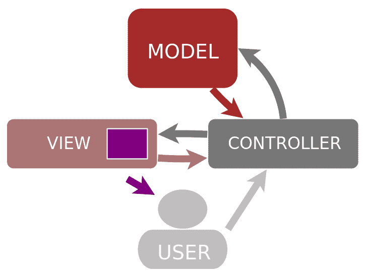
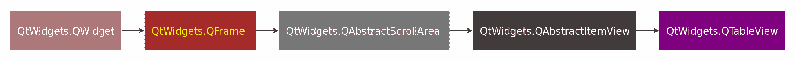
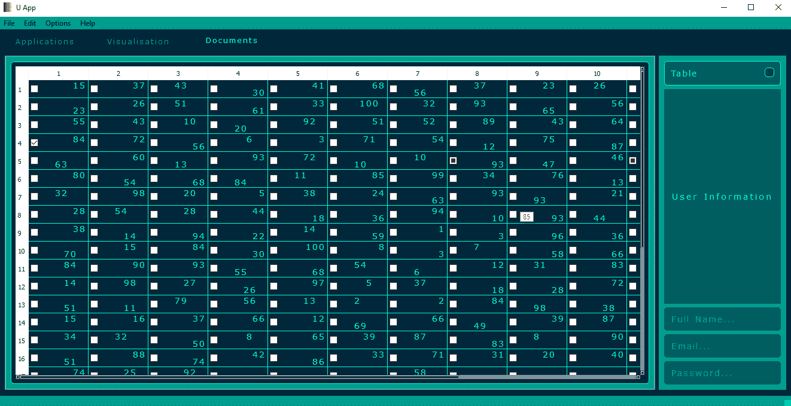

# 第七章：使用 Combobox 和列表视图

本章将要讨论的 GUI 组件在性质上有些混合。它们是文本字段，可以用来控制应用程序中的元素。换句话说，用户可以在这些字段中输入文本，然后通过提供额外功能的下拉菜单进行选择。使用这些组件有助于使 GUI 应用程序更加紧凑和富有信息量。

本章中的组件代表了 Qt 框架中的模型-视图范式。简而言之，行编辑字段也可以使用列表视图实现。

本章将涵盖以下主题：

+   模型-视图架构

+   Combobox

+   简单列表视图

+   表格

# 模型-视图架构

Qt 框架有一组类，它们利用模型-视图范式来调节数据与其表示之间的关系，称为**模型-视图-控制器**（**MVC**）范式。MVC 是一种在建立用户界面时经常使用的模式。MVC 有三个类型的对象：

+   模型（应用程序对象）

+   视图（屏幕展示）

+   控制器（定义用户界面上的用户输入动作）

以下图表展示了模型、视图和控制器之间的交互：



在 Qt 框架中，当视图和控制器结合时，这创建了模型-视图架构。要使用 Qt 创建模型，框架使用`QtCore`模块的类，如基类`QAbstractItemModel`及其继承此类的类，如`QAbstractListModel`和`QAbstractTableModel`。表示视图的类使用`QtWidgets`模块中的视图，如`QListView`、`QTableView`和`QTreeView`，并继承基类`QAbstractItemView`。在这里，我们将仅描述其中的一些，包括使用应用程序实现模型-视图架构的基本知识。有关更深入的了解，请参阅文档（[`doc.qt.io/qt-5/model-view-programming.html`](https://doc.qt.io/qt-5/model-view-programming.html)）。

# QAbstractItemModel

此类实现了模型类的抽象接口。模型-视图架构中用于操作模型部分的函数的完整列表可在文档中找到。此类的构造语法如下：

```py
class Model(QtCore.QAbstractItemModel):

    def __init__(self, parent=None):
        super(Model, self).__init__(parent)

    def rowCount(self, parent):
        return ... 

    def columnCount(self, parent):
        return ...

    def index(self, row, column, parent):
        return ...

    def data(self, index, role):
        return ...
```

需要重写的函数如下：

`columnCount(QtCore.QModelIndex)`: 这返回参数中指定的父项下的列数。

`data(QtCore.QModelIndex, int)`: 这返回第一个参数指定的项在角色（第二个参数）下存储的数据。

`index(int, int, QtCore.QModelIndex)`: 这返回由行（第一个参数）、列（第二个参数）和父项（第三个参数）指定的模型中项的索引。

`rowCount(QtCore.QModelIndex)`: 这返回参数中指定的父项下的行数。

最有用的函数如下：

`insertColumn(int, QtCore.QModelIndex)`: 这在父项（第二个参数）的子项中指定为第一个参数的列之前插入列。

`insertColumns(int, int, QtCore.QModelIndex)`: 这将在由父模型索引（第三个参数）表示的项目相关列（第一个参数）之前插入指定数量的新列（第二个参数）。

`insertRow(int, QtCore.QModelIndex)`: 这在父项（第二个参数）的子项中指定为第一个参数的行之前插入行。

`insertRows(int, int, QtCore.QModelIndex)`: 这将在由父模型索引（第三个参数）表示的项目相关行（第一个参数）之前插入指定数量的新行（第二个参数）。

`moveColumn(QtCore.QModelIndex, int, QtCore.QModelIndex, int)`: 这将源列（第二个参数）从源父项（第一个参数）移动到目标父项（第三个参数）下的目标子项（第四个参数）。

`moveColumns(QtCore.QModelIndex, int, int, QtCore.QModelIndex, int)`: 这将根据第三个参数指定的列数，从源列（第二个参数）开始，从源父项（第一个参数）移动到目标父项（第四个参数）下的目标子项（第五个参数）。

`moveRow(QtCore.QModelIndex, int, QtCore.QModelIndex, int)`: 这将源行（第二个参数）从源父项（第一个参数）移动到目标父项（第三个参数）下的目标子项（第四个参数）。

`moveRows(QtCore.QModelIndex, int, int, QtCore.QModelIndex, int)`: 这将根据第三个参数指定的行数，从源行（第二个参数）开始，从源父项（第一个参数）移动到目标父项（第四个参数）下的目标子项（第五个参数）。

`removeColumn(int, QtCore.QModelIndex)`: 这将移除父项（第二个参数）的列（第一个参数）。

`removeColumns(int, int, QtCore.QModelIndex)`: 这将根据第二个参数指定的列数，从父项（第三个参数）的列（第一个参数）开始移除。

`removeRow(int, QtCore.QModelIndex)`: 这将移除父项（第二个参数）的行（第一个参数）。

`removeRows(int, int, QtCore.QModelIndex)`: 这将根据第二个参数指定的行数，从父项（第三个参数）的行（第一个参数）开始移除。

`sort(int, QtCore.Qt.SortOrder)`: 这根据第二个参数指定的顺序对模型按列（第一个参数）进行排序。

`setData(QtCore.QModelIndex, object, int)`: 这将使用指定的角色（第三个参数）和索引（第一个参数）将项目的数据设置为一个指定的值（第二个参数）。

`setHeaderData(int, QtCore.Qt.Orientation, object, int)`: 这将使用指定的角色（第四个参数）、部分（第一个参数）和方向（第二个参数）将头部数据设置为一个指定的值（第三个参数）。

# QAbstractTableModel

此类提供了一个标准接口，将数据作为二维数组在模型中表示。`QAbstractTableModel`类继承自`QAbstractItemModel`类。此类的构造语法如下：

```py
class Model(QtCore.QAbstractTableModel):

    def __init__(self, parent=None):
        super(Model, self).__init__(parent)

    def rowCount(self, parent):
        return ...

    def columnCount(self, parent):
        return ...

    def data(self, row, column):
        return ...
```

# QAbstractItemView

这是一个提供 Qt 框架中视图类基本功能的基类。通常，这个类在 GUI 应用程序构建中会通过`QListView`、`QTreeView`和`QTableView`类进行重实现。这个类的继承方案如下：



与 GUI 应用程序一起常用的函数包括以下（完整列表可在文档中找到）：

`setDragEnabled(bool)`: 如果参数为`True`，视图将支持项目的拖动。

`setDragDropMode(QtWidgets.QAbstractItemView.DragDropMode)`: 这将设置拖放模式；默认情况下，视图不支持拖放。可用的模式如下：

+   `QtWidgets.QAbstractItemView.NoDragDrop`—`0`：此视图不支持拖放。

+   `QtWidgets.QAbstractItemView.DragOnly`—`1`：此视图支持拖动。

+   `QtWidgets.QAbstractItemView.DropOnly`—`2`：此视图支持放下。

+   `QtWidgets.QAbstractItemView.DragDrop`—`3`：此视图支持拖放。

+   `QtWidgets.QAbstractItemView.InternalMove`—`4`：此视图将接受移动操作，不包括复制。

`setDropIndicatorShown(bool)`: 如果参数为`True`，这将设置放下指示器，如在使用拖放项目时所示。

`setModel(QtCore.QAbstractItemModel)`: 这将设置视图将表示的模型。

`setRootIndex(QtCore.QModelIndex)`: 这将根据参数中指定的索引设置根项。

`setSelectionBehavior(QtWidgets.QAbstractItemView.SelectionBehavior)`: 这将设置视图将使用的选择行为。可用的行为如下：

+   `QtWidgets.QAbstractItemView.SelectItems`—`0`：单个项目。

+   `QtWidgets.QAbstractItemView.SelectRows`—`1`：仅行。

+   `QtWidgets.QAbstractItemView.SelectColumns`—`2`：仅列。

`setSelectionMode(QtWidgets.QAbstractItemView.SelectionMode)`: 这将设置视图对选择如何响应。可用的选择模式如下：

+   `QtWidgets.QAbstractItemView.NoSelection`—`0`：项目未被选中。

+   `QtWidgets.QAbstractItemView.SingleSelection`—`1`: 已选中的项目将被取消选中。

+   `QtWidgets.QAbstractItemView.MultiSelection`—`2`: 选中的项目将被切换，其他项目保持不变。可以通过拖动鼠标在它们上方来切换多个项目。

+   `QtWidgets.QAbstractItemView.ExtendedSelection`—`3`: 已选中的项目将被选中并取消选中，使用 *Shift* 键或 *Ctrl* 键，点击的项目将被切换，而其他项目保持不变。

+   `QtWidgets.QAbstractItemView.ContiguousSelection`—`4`: 已选中的项目将被取消选中，且使用 *Shift* 键不会取消选中。

`setSelectionModel(QtCore.QItemSelectionModel)`: 设置参数中指定的选择模型。

`setState(QtWidgets.QAbstractItemView.State)`: 设置参数中指定的项目视图状态。状态如下：

+   `QtWidgets.QAbstractItemView.NoState`—`0`: 默认状态。

+   `QtWidgets.QAbstractItemView.DraggingState`—`1`: 用户正在拖动项目。

+   `QtWidgets.QAbstractItemView.DragSelectingState`—`2`: 用户正在选择项目。

+   `QtWidgets.QAbstractItemView.EditingState`—`3`: 用户正在编辑项目。

+   `QtWidgets.QAbstractItemView.ExpandingState`—`4`: 用户通过分支打开项目。

+   `QtWidgets.QAbstractItemView.CollapsingState`—`5`: 用户关闭了项目分支。

+   `QtWidgets.QAbstractItemView.AnimatingState`—`6`: 这是执行动画的视图。

`edit(QtCore.QModelIndex)`: 根据参数中指定的索引开始编辑项目。

`model()`: 返回在视图中表示的 `QtCore.QAbstractItemModel` 类型的模型。

`selectAll()`: 选择视图中表示的所有项目。

`startDrag(QtCore.Qt.DropActions)`: 通过调用带有 `exec()` 的拖动操作来启动拖动过程，这与参数中指定的放置动作相关。

`update(QtCore.QModelIndex)`: 更新参数中指定的索引所占据的区域。

# QComboBox

使用 `QComboBox` 类构建的组合框小部件提供了组合按钮和弹出列表。此小部件包含显示当前文本的字段（或可以编辑），包含一些值的弹出列表，以及进行选择和选择多个控件选项的选项。这可以在需要用选项表示多个值以从弹出窗口中选择某物，并且可能意味着其他功能的 GUI 中使用。开发者在图形窗口内部空间有限且需要显示许多值的地方创建组合框。`QComboBox` 类在应用程序中的声明语法如下：

```py
combo_box = QtWidgets.QComboBox()
```

# QComboBox 函数

`QComboBox` 继承了 `QWidget` 类，并通过以下函数增强了功能。

# 添加

这些是与向组合框添加元素或动作相关的函数：

`combo_box.addItem("item", object)`: 这将在组合框弹出列表的末尾添加项目（第一个参数）为 Unicode 字符串类型和可选的用户数据（第二个参数，默认为`None`）。

`combo_box.addItem(QtGui.QIcon, "item", object)`: 这将在组合框弹出列表的末尾添加项目（第二个参数）为 Unicode 字符串类型和可选的用户数据（第三个参数，默认为`None`）。项目的文本将显示为图标（第一个参数）。

`combo_box.addItems(["item"])`: 这将添加多个具有 Unicode 字符串类型文本的项目到组合框弹出列表的末尾。参数中指定的列表的每个项目都将作为弹出列表的新行附加。

# set

这些是与设置与组合框相关的参数/属性设置相关的函数，包括文本、对齐或功能设置：

`combo_box.setCompleter(QtWidgets.QCompleter)`: 这将设置与组合框一起使用的补全器。

`combo_box.setCurrentIndex(int)`: 这将设置组合框中参数指定的项目索引。具有此索引的项目将被标记为当前项并可见。

`combo_box.setCurrentText("Item")`: 这将设置组合框中参数指定的当前文本。具有此文本的项目将被标记为当前项并可见。

`combo_box.setDuplicatesEnabled(bool)`: 如果参数为`True`，则允许将重复的项目输入到组合框中。

`combo_box.setEditable(bool)`: 如果参数为`True`，则设置组合框可以使用行编辑字段进行编辑。

`combo_box.setEditText("Text")`: 这将设置组合框行编辑字段中的文本。

`combo_box.setFrame(bool)`: 如果参数为`True`，则设置组合框周围的框架。

`combo_box.setIconSize(QtCore.QSize)`: 这将设置组合框中显示的图标的大小。

`combo_box.setInsertPolicy(QtWidgets.QComboBox.InsertPolicy)`: 这将设置此组合框的插入策略。可用的策略如下：

+   `QtWidgets.QComboBox.NoInsert`—`0`: 项目将不会被插入。

+   `QtWidgets.QComboBox.InsertAtTop`—`1`: 当前项目将被插入为第一个项目。

+   `QtWidgets.QComboBox.InsertAtCurrent`—`2`: 组合框中的当前项目将被新项目替换。

+   `QtWidgets.QComboBox.InsertAtBottom`—`3`: 当前项目将被插入到最后一个项目之后。

+   `QtWidgets.QComboBox.InsertAfterCurrent`—`4`: 此项目将被插入到当前项目之后。

+   `QtWidgets.QComboBox.InsertBeforeCurrent`—`5`: 此项目将被插入到当前项目之前。

+   `QtWidgets.QComboBox.InsertAlphabetically`—`6`: 此项目将按字母顺序插入。

`combo_box.setItemData(int, object, int)`: 这将为具有索引（第一个参数）的项目设置数据角色（第三个参数），其值为第二个参数指定的值。

`combo_box.setItemDelegate(QtWidgets.QAbstractItemDelegate)`: 这将为弹出列表视图项目设置代理。

`combo_box.setItemIcon(int, QtGui.QIcon)`: 这将为由索引（第一个参数）指定的项目设置图标（第二个参数）。

`combo_box.setItemText(int, "Item")`: 这将为由索引（第一个参数）指定的项目设置文本（第二个参数）。

`combo_box.setLineEdit(QtWidgets.QLineEdit)`: 这将为这个组合框设置将使用的行编辑字段。

`combo_box.setMaxCount(int)`: 这将为这个组合框设置将使用的最大项目数。

`combo_box.setMaxVisibleItems(int)`: 这将设置组合框屏幕中不滚动时将可见的最大项目数。

`combo_box.setMinimumContentsLength(int)`: 这将设置用组合框屏幕表示的项目所需的最小字符数。

`combo_box.setModel(QtCore.QAbstractItemModel)`: 这将为这个组合框设置模型。

`combo_box.setModelColumn(int)`: 这将为组合框模型设置可见列。

`combo_box.setRootModelIndex(QtCore.QModelIndex)`: 这将为组合框项的参数设置根模型项作为索引。

`combo_box.setSizeAdjustPolicy(QtWidgets.QComboBox.SizeAdjustPolicy)`: 这将为这个组合框设置大小调整策略。可用的策略如下：

+   `QtWidgets.QComboBox.AdjustToContents`—`0`: 总是调整到内容。

+   `QtWidgets.QComboBox.AdjustToContentsOnFirstShow`—`1`: 第一次显示时将调整到内容。

+   `QtWidgets.QComboBox.AdjustToMinimumContentsLength`—`2`: 将调整到最小内容长度。

+   `QtWidgets.QComboBox.AdjustToMinimumContentsLengthWithIcon`—`3`: 将调整到最小内容长度，加上图标的空白。

`combo_box.setValidator(QtGui.QValidator)`: 这将为这个组合框设置将使用的验证器。

`combo_box.setView(QtWidgets.QAbstractItemView)`: 这将为组合框弹出列表设置视图。

# edit

这些是进行一些更改当前组合框内容的函数，包括清除、撤销和重做：

`combo_box.clear()`: 这将从组合框中清除弹出列表项。

`combo_box.clearEditText()`: 这将清除组合框编辑字段的文本。组合框的行编辑文本将被清除。

`combo_box.hidePopup()`: 这将隐藏组合框弹出列表；列表将被重置。

`combo_box.showPopup()`: 这将显示组合框弹出列表。

# is/has

这些是返回与组合框状态相关的布尔值（`bool`）的函数，例如，检查可用性：

`combo_box.hasFrame()`: 如果组合框有一个周围的框架，则返回`True`。

`combo_box.isEditable()`: 如果这个组合框的行字段可以编辑，则返回`True`。

# functional

以下是与当前组合框返回的值、功能变化等相关联的函数：

`combo_box.completer()`: 这返回用于此组合框文本输入自动完成的补全器。

`combo_box.count()`: 这计算弹出列表的项目数量并返回整数值。

`combo_box.currentData(int)`: 这返回描述弹出列表当前数据的对象，具有 `QtCore.Qt.UserRole` 参数类型。

`combo_box.currentIndex()`: 这返回用户可能选择的弹出列表中当前项的索引（整数值）。

`combo_box.currentText()`: 这返回用户可能选择的弹出列表中当前项的文本（字符串）。

`combo_box.duplicatesEnabled()`: 如果可以在组合框中输入重复项，则返回 `True`。

`combo_box.findData(object, int, QtCore.Qt.MatchFlags)`: 这返回包含指定数据（第一个参数）、角色（第二个参数）和标志（第三个参数）的项目索引。否则，它返回 `-1` 的值。

`combo_box.findText("Text to find", QtCore.Qt.MatchFlags)`: 这返回包含文本（第一个参数）和标志（第二个参数）的项目索引，例如 `QtCore.Qt.MatchCaseSensitive`。否则，它返回 `-1` 的值。

`combo_box.iconSize()`: 这返回 `QtCore.QSize` 类型的图标大小。

`combo_box.initStyleOption(QtWidgets.QStyleOptionFrame)`: 这使用参数中的值初始化样式选项。

`combo_box.inputMethodQuery(QtCore.Qt.InputMethodQuery, object)`: 这用于查询组合框的属性集，以启用对复杂输入方法操作的支持，例如支持周围文本和重转换。

`combo_box.insertItem(int, "Item text", object)`: 这在弹出列表的位置（第一个参数）插入带有文本（第二个参数）和用户数据（第三个参数）的项目。

`combo_box.insertItem(int, QtGui.QIcon, "Item text", object)`: 这在弹出列表的位置（第一个参数）插入带有文本（第三个参数）的项目，该文本将使用图标（第二个参数）和用户数据（第四个参数）显示。

`combo_box.insertItems(int, ["Item text"])`: 这将在组合框弹出列表的位置（第一个参数）插入多个具有 Unicode 字符串类型文本的项目。可迭代对象（第二个参数）中的每个项目都将作为弹出列表的新行插入，并从给定的位置索引开始。

`combo_box.insertPolicy()`: 这返回在将策略插入组合框时使用的 `QtWidgets.QComboBox.InsertPolicy` 类型的策略。

`combo_box.insertSeparator(int)`: 这在参数指定的位置插入这些组合框项目的分隔符。

`combo_box.itemData(int, int)`: 这根据索引（第一个参数）和给定的角色（第二个参数）返回组合框中项的数据。

`combo_box.itemDelegate()`: 这返回用于弹出列表视图的 `QtWidgets.QAbstractItemDelegate` 类型的项目代理。

`combo_box.itemIcon(int)`: 这返回参数中指定的索引在 combobox 内的项目 `QtGui.QIcon` 类型的图标。

`combo_box.itemText(int)`: 这返回参数中指定的索引在 combobox 中的项目的文本。

`combo_box.lineEdit()`: 如果 combobox 可编辑，则此返回用于编辑 combobox 中项目的行编辑字段。

`combo_box.maxCount()`: 这返回可以与 combobox 一起使用的最大项目数。

`combo_box.maxVisibleItems()`: 这返回可以显示为 combobox 弹出列表的最大项目数。如果有更多元素，则可以通过滚动 combobox 屏幕使它们可见。

`combo_box.minimumContentsLength()`: 这返回将用 combobox 屏幕表示的最小字符数（默认 `0`）。

`combo_box.model()`: 这返回 combobox 的模型。

`combo_box.modelColumn()`: 这返回 combobox 模型中的可见列。

`combo_box.removeItem(int)`: 这从 combobox 中移除由参数指定的索引的项目。

`combo_box.rootModelIndex()`: 这返回 combobox 项目的根模型项索引。

`combo_box.sizeAdjustPolicy()`: 这返回与 combobox 一起使用的 `QtWidgets.QComboBox.SizeAdjustPolicy` 类型的调整大小策略。

`combo_box.validator()`: 这返回 combobox 文本输入的验证器。

`combo_box.view()`: 这返回用于 combobox 的弹出列表视图。

# 事件

这些是与事件相关的函数，例如事件处理程序：

`combo_box.changeEvent(QtCore.QEvent)`: 这处理 combobox 内的状态变化。

`combo_box.contextMenuEvent(QtGui.QContextMenuEvent)`: 此事件处理程序旨在接收 combobox 的上下文菜单事件。

`combo_box.event(QtCore.QEvent)`: 这接收对象的事件，如果事件被识别并处理，则应返回 `True`。

`combo_box.focusOutEvent(QtGui.QFocusEvent)`: 此事件处理程序旨在接收在失去焦点时通过事件参数传递的 combobox 键盘焦点事件。

`combo_box.focusInEvent(QtGui.QFocusEvent)`: 此事件处理程序旨在接收在获得焦点时通过事件参数传递的 comb box 键盘焦点事件。

`combo_box.inputMethodEvent(QtGui.QInputMethodEvent)`: 此事件处理程序旨在接收通过事件参数传递的输入法组合事件。

`combo_box.keyPressEvent(QtGui.QKeyEvent)`: 此事件处理程序旨在接收通过事件参数传递的 combobox 键按下事件。

`combo_box.keyReleaseEvent(QtGui.QKeyEvent)`: 此事件处理程序旨在接收通过事件参数传递的 combobox 键释放事件。

`combo_box.mousePressEvent(QtGui.QMouseEvent)`: 此事件处理器旨在接收带有事件参数的 combobox 的鼠标按下事件。

`combo_box.mouseReleaseEvent(QtGui.QMouseEvent)`: 此事件处理器旨在接收带有事件参数的 combobox 的鼠标释放事件。

`combo_box.paintEvent(QtGui.QPaintEvent)`: 此事件处理器旨在接收带有事件参数的 combobox 的绘制事件。

`combo_box.resizeEvent(QtGui.QResizeEvent)`: 此事件处理器旨在接收和带有事件参数的 combobox 的调整大小事件。

`combo_box.showEvent(QtGui.QShowEvent)`: 此事件处理器旨在接收带有事件参数的 combobox 的显示事件。

`combo_box.wheelEvent(QtGui.QWheelEvent)`: 此事件处理器旨在接收带有事件参数的 combobox 的鼠标滚轮事件。

# signals

`QComboBox` 类可用的信号如下：

`combo_box.activated(int)`: 当在 combobox 中选择项时，会发出此信号，其中包含传递的参数中的项的索引。

`combo_box.activated(str)`: 当在 combobox 中选择项时，会发出此信号，其中包含传递的参数中的项的文本。

`combo_box.currentIndexChanged(int)`: 当在 combobox 中选择项并且项的当前索引发生变化时，会发出此信号，其中包含传递的参数中的索引。

`combo_box.currentIndexChanged(str)`: 当在 combobox 中选择项时，会发出此信号，并且项的当前索引发生变化，其中包含传递的参数中的项的文本。

`combo_box.currentTextChanged(str)`: 当在 combobox 中选择项并且项的当前文本发生变化时，会发出此信号，其中包含传递的参数中的项的文本。

`combo_box.editTextChanged(str)`: 当可编辑行字段中的文本发生变化时，会发出此信号，其中包含传递的文本。

`combo_box.highlighted(int)`: 当用户突出显示项时，会发出此信号，其中包含传递的参数中的项的索引。

`combo_box.highlighted(str)`: 当用户突出显示项时，会发出此信号，其中包含传递的参数中的项的文本。

# QFontComboBox

PyQt5 和 PySide2 提供了完整的 combobox，以便您可以根据文本字段中的文本（例如）选择字体家族。我们可以在应用程序中使用以下行来使用此 combobox：

```py
combo_boxf = QtWidgets.QFontComboBox()
```

`QFontComboBox` 继承了 `QComboBox` 并具有以下功能。

# set

这些是与设置与字体 combobox 相关的参数/属性设置相关的函数，例如设置文本、对齐方式等：

`combo_boxf.setCurrentFont(QtGui.QFont)`: 这为此组合框设置当前字体家族。传递给参数的字体家族名称，如 Helvetica 或 Times New Roman，可以用于。

`combo_boxf.setFontFilters(QtWidgets.QFontComboBox.FontFilters)`: 这设置将与此组合框一起使用的过滤器。可用的过滤器如下：

+   `QtWidgets.QFontComboBox.AllFonts`: 显示所有字体。

+   `QtWidgets.QFontComboBox.ScalableFonts`: 显示可缩放字体。

+   `QtWidgets.QFontComboBox.NonScalableFonts`: 组合框中的非可缩放字体。

+   `QtWidgets.QFontComboBox.MonospacedFonts`: 组合框中的等宽字体。

+   `QtWidgets.QFontComboBox.ProportionalFonts`: 组合框中的比例字体。

`combo_boxf.setWritingSystem(QtGui.QFontDatabase.WritingSystem)`: 这设置作为此组合框过滤器的书写系统。

# 功能

这些函数返回字体组合框的当前值、功能变化等：

`combo_boxf.currentFont()`: 这返回由字体组合框显示/选择的`QtGui.QFont`类型的当前字体家族。

`combo_boxf.fontFilters()`: 这返回组合框的`QtWidgets.QFontComboBox.FontFilters`类型的过滤器。

`combo_boxf.writingSystem()`: 这返回组合框的书写系统。

# 事件

此函数与事件相关，例如事件处理程序：

`combo_boxf.event(QtCore.QEvent)`: 这接收对象的事件，如果事件被识别并处理，则应返回`True`。

# 信号

以下是为`QFontComboBox`类提供的可用信号：

`combo_boxf.currentFontChanged(QtGui.QFont)`: 当组合框的当前字体家族更改时，会发出此信号，并且当在参数中传递新字体时发生。

# QComboBox 示例

让我们在应用程序中实现之前描述的组合框。我们正在创建组合框，以便可以在将可视化的不同字段之间进行选择——文本字段和表格。将`QComboBox`类添加到`u_style.py`文件中：

1.  使用以下行添加`UComBox`类：

```py
...
class UComBox(QtWidgets.QComboBox):

    def __init__(self, parent=None, icon=None, pad=10,
                            bdr=5, bdw=1, bdc=color[3]):
        super(UComBox, self).__init__(parent)
        self.icon, self.pad = icon, pad
        self.bdr, self.bdw, self.bdc = bdr, bdw, bdc
        font = UFonts(size=14, weight=59)
        self.setFont(font.font1)
        self.setStyleSheet(
          """QComboBox {padding: %spx; background-color: %s;
              color: %s; border-style: solid; border-radius: %spx;
              border-width: %spx; border-color: %s;}
             QComboBox:drop-down:down-arrow { image: url(%s);
              width: 14px; height: 14px;}
             QComboBox:drop-down:button { margin: %spx;
              background-color: %s; border-style: solid;
              border-radius: %spx; border-width: %spx;
              border-color: %s;}""" 
             % (self.pad, color[0], color[3], self.bdr, self.bdw,
               self.bdc, self.icon, self.pad, color[0], self.bdr,
               self.bdw, self.bdc))
  ...
```

此组合框具有可重写的样式属性。现在，我们需要将其添加到`u_app.py`文件中，以便我们可以在应用程序中使用它们。

1.  将以下内容添加到`u_app.py`文件的导入部分：

```py
...
from u_style import UComBox
...
```

1.  然后，将以下行添加到`u_app.py`文件的`__init__()`函数中：

```py
...
    def __init__(self, parent=None):
        ...
        self.combox1 = UComBox(self.frame2)
        self.combox1.addItems(["Texts", "Table"])
        ...
        self.layfr2.addWidget(self.combox1, 0, 0, 1, 1)
        self.layfr2.addWidget(self.label1, 1, 0, 1, 1)
        self.layfr2.addWidget(self.line_ed3, 4, 0, 1, 1)
        ... 
...
```

这是将显示项目列表的组合框实例。

1.  要将组合框按钮的箭头更改为图标，我们可以更改以下行，如下所示：

```py
...
self.combox1 = UComBox(self.frame2, icon="Path/to/Icon")
...
```

这将添加指定路径的图标，并将默认箭头图标更改。

# QListView

此类提供了一个在模型上实现的列表或图标视图。`QListView`用于将项目显示为简单的非层次列表。借助列表视图，组合框弹出列表可以以另一种方式表示。`QListView`的继承方案如下：


以下是在应用程序中此类的声明语句：

```py
list_view = QtWidgets.QListView()
```

# QListView 类的函数

`QListView` 类通过以下函数提高功能。

# set

这些是与设置与列表视图相关的参数/属性相关的函数。

`list_view.setBatchSize(int)`: 如果布局模式设置为 `Batched`，则此方法设置每个批次的项数。

`list_view.setFlow(QtWidgets.QListView.Flow)`: 这将设置与列表视图一起使用的内容的流动方式。可用的流动方式如下：

+   `QtWidgets.QListView.LeftToRight`—`0`: 项目将从左到右进行布局。

+   `QtWidgets.QListView.TopToBottom`—`1`: 项目将从上到下进行布局。

`list_view.setGridSize(QtCore.QSize)`: 这将设置布局网格的大小。

`list_view.setLayoutMode(QtWidgets.QListView.LayoutMode)`: 这将设置此列表视图的布局模式。可用的模式如下：

+   `QtWidgets.QListView.SinglePass`—`0`: 所有项目将同时布局。

+   `QtWidgets.QListView.Batched`—`1`: 项目将分批布局。

`list_view.setModelColumn(int)`: 这将设置参数指定的模型中的列，该列将可见。

`list_view.setMovement(QtWidgets.QListView.Movement)`: 这将设置此列表视图中项目的移动方式。可用的移动方式如下：

+   `QtWidgets.QListView.Static`—`0`: 项目不能被移动。

+   `QtWidgets.QListView.Free`—`1`: 项目可以被移动。

+   `QtWidgets.QListView.Snap`—`2`: 当项目被吸附到指定的网格时，项目将被移动。

`list_view.setPositionForIndex(QtCore.QPoint, QtCore.QModelIndex)`: 这将设置模型中索引（第二个参数）指定的项目的位置，相对于第一个参数指定的位置。

`list_view.setResizeMode(QtWidgets.QListView.ResizeMode)`: 这将设置列表视图模型的调整大小模式。可用的调整大小方式如下：

+   `QtWidgets.QListView.Fixed`—`0`: 项目将在列表视图显示时首次布局。

+   `QtWidgets.QListView.Adjust`—`1`: 每次列表视图大小调整时，项目都将进行布局。

`list_view.setRowHidden(int, bool)`: 如果第二个参数设置为 `True`，则将行（第一个参数）设置为隐藏。

`list_view.setSelectionRectVisible(bool)`: 如果参数为 `True`，则将选择矩形设置为可见。

`list_view.setSpacing(int)`: 这将设置布局中表示的项目的所有边框的空间。

`list_view.setUniformItemSizes(bool)`: 如果参数为 `True`，则列表视图中的所有项目都应具有相同的大小。

`list_view.setViewMode(QtWidgets.QListView.ViewMode)`: 这将设置此列表视图的视图模式。可用的视图模式如下：

+   `QtWidgets.QListView.ListMode`—`0`: 项目将使用静态移动、`TopToBottom` 流和较小的尺寸进行布局。

+   `QtWidgets.QListView.IconMode`—`1`: 项将使用自由移动、`LeftToRight` 流和较大大小进行布局。

`list_view.setWordWrap(bool)`: 如果参数为 `True`，则项文本将在单词断点处换行。

`list_view.setWrapping(bool)`: 如果参数为 `True`，则当可见区域的空间不足时，项布局将自动换行。

# is/has

这些是返回与列表视图状态相关的布尔值 (`bool`) 的函数，例如，用于检查可见性：

+   `list_view.isRowHidden(int)`: 如果参数中指定的行在列表视图中被隐藏，则此函数返回 `True`；否则，它返回 `False`。

+   `list_view.isSelectionRectVisible()`: 如果选择矩形可见，则此函数返回 `True`；否则，选择矩形被隐藏。

+   `list_view.isWrapping()`: 如果布局将在可见区域的空间不足时自动换行，则此函数返回 `True`。

# functional

这些是与当前列表视图的返回值相关的函数：

`list_view.batchSize()`: 如果布局模式设置为 `Batched`，则此函数返回每个批次的项数。

`list_view.clearPropertyFlags()`: 这清除列表视图中的属性标志。

`list_view.flow()`: 这返回与 `QtWidgets.QListView.Flow` 类型的列表视图一起使用的内容的流动。

`list_view.gridSize()`: 这返回与 `QtCore.QSize` 类型的列表视图一起使用的布局网格的大小。

`list_view.layoutMode()`: 这返回了 `QtWidgets.QListView.LayoutMode` 类型的布局模式。

`list_view.modelColumn()`: 这返回模型中可见的列数。

`list_view.movement()`: 这返回 `QtWidgets.QListView.Movement` 类型的移动，描述了项是否可以移动、吸附到网格或不能移动。

`list_view.rectForIndex(QtCore.QModelIndex)`: 此函数返回模型中指定位置索引的项的 `QtCore.QRect` 类型的矩形，如参数中指定。

`list_view.resizeMode()`: 这返回了 `QtWidgets.QListView.ResizeMode` 类型的调整大小模式，或当列表视图调整大小时项的布局方式。

`list_view.spacing()`: 这返回布局中所有项周围的空间。

`list_view.uniformItemSizes()`: 如果在此列表视图中所有项的大小都相同，则此函数返回 `True`。

`list_view.viewMode()`: 这返回此列表视图的 `QtWidgets.QListView.ViewMode` 类型的视图模式。

`list_view.wordWrap()`: 如果项文本在单词断点处换行，则此函数返回 `True`。

# events

这些是与事件相关的函数，例如事件处理器：

`list_view.dragLeaveEvent(QtGui.QDragLeaveEvent)`: 当鼠标离开列表视图且正在执行拖动操作时，此事件处理器会使用事件参数被调用。

`list_view.dragMoveEvent(QtGui.QDragMoveEvent)`: 当发生条件时，例如光标进入或移动到视图内，键盘上的修改键在列表视图有焦点时被点击，或者如果有一个拖动操作正在进行，这个事件处理程序会使用事件参数被调用。

`list_view.dropEvent(QtGui.QDropEvent)`: 当拖动操作在列表视图上放下时，这个事件处理程序会使用事件参数被调用。

`list_view.event(QtCore.QEvent)`: 这个接收对象的事件，如果事件被识别并处理，则应返回`True`。

`list_view.mouseMoveEvent(QtGui.QMouseEvent)`: 这个事件处理程序接收列表视图的鼠标移动事件，以及传递给参数的鼠标事件。

`list_view.mouseReleaseEvent(QtGui.QMouseEvent)`: 这个事件处理程序接收列表视图的鼠标释放事件，以及传递给参数的鼠标事件。

`list_view.paintEvent(QtGui.QPaintEvent)`: 这个事件处理程序接收列表视图的绘制事件，以及传递给参数的绘制事件。

`list_view.resizeEvent(QtGui.QResizeEvent)`: 这个事件处理程序接收列表视图的调整大小事件，以及传递给参数的调整大小事件。

`list_view.timerEvent(QtCore.QTimerEvent)`: 这个事件处理程序接收列表视图的计时器事件，以及传递给参数的计时器事件。

`list_view.wheelEvent(QtGui.QWheelEvent)`: 这个事件处理程序接收列表视图的鼠标滚轮事件，以及传递给参数的滚轮事件。

# 信号

`QListView`类可用的信号如下：

`list_view.indexesMoved(QtCore.QModelIndexList)`: 当参数中指定的索引在视图中移动时，会发出这个信号。

# QListView 示例

现在，我们将在 PySide2 和 PyQt5 应用程序的`u_style.py`文件中创建`UListV`类。这个类将展示如何使用我们之前创建的组合框与列表视图：

1.  将`UListV`类添加到`u_style.py`文件中：

```py
...
class UListV(QtWidgets.QListView):

    def __init__(self, parent=None, mg=5, pad=10,
                       bdr=5, bdw=1, bdc=color[3]):
        super(UListV, self).__init__(parent)
        self.setWordWrap(True)
        self.mg, self.pad = mg, pad
        self.bdr, self.bdw, self.bdc = bdr, bdw, bdc
        font = UFonts(size=14, weight=59)
        self.setFont(font.font1)
        self.setStyleSheet(
          """margin: %spx; padding: %spx; background-color: %s;
             color: %s; border-style: solid; border-radius: %spx;
             border-width: %spx; border-color: %s;"""
          % (self.mg, self.pad, color[0], color[3],
                      self.bdr, self.bdw, self.bdc))
...
```

这个列表视图将在组合框中用于显示弹出窗口。为了在应用程序中将这个列表视图与组合框实现，我们需要在`u_app.py`文件中添加一些行。

1.  在`u_app.py`文件的导入部分添加`UListV`类，与`UCombo`类保持一致：

```py
...
from u_style import UComBox, UListV
...
```

1.  此外，修改组合框的行，如下：

```py
...
    def __init__(self, parent=None):
        ...
        self.combox1.addItems(["Texts", "Table"])
        self.combox1.setView(UListV())
        ...
...
```

这设置了组合框元素的列表视图。通过这样做，我们可以为组合框弹出列表设置样式并添加功能。

# QTableView

让我们描述在 GUI 应用程序中的表格实现。`QTableView` 类提供了以表格形式表示数据。根据 Qt 框架的范式，此类（包括列表视图）提供了表格视图的默认模型-视图实现。要填充表格中的数据，您需要使用 `QtCore` 模块中的 `QAbstractTableModel` 类等模型。`QTableView` 类具有以下继承方案：


在应用程序中此类的声明如下：

```py
table_view = QtWidgets.QTableView()
```

# QTableView 函数

`QTableView` 类通过以下函数增强了功能。

# 设置

这些是与设置与表格视图相关的参数/属性相关的函数：

`table_view.setColumnHidden(int, bool)`: 如果第二个参数为 `True`，则将参数指定的列设置为隐藏。

`table_view.setColumnWidth(int, int)`: 这将设置第一个参数指定的列的宽度（第二个参数）。

`table_view.setCornerButtonEnabled(bool)`: 如果参数为 `True`，则将此表左上角的按钮设置为选择整个表。

`table_view.setGridStyle(QtCore.Qt.PenStyle)`: 这将设置用于绘制此表网格的笔风格。可用的样式如下：

+   `QtCore.Qt.NoPen`—`0`: 无笔。

+   `QtCore.Qt.SolidLine`—`1`: 实线。

+   `QtCore.Qt.DashLine`—`2`: 虚线。

+   `QtCore.Qt.DotLine`—`3`: 点划线。

+   `QtCore.Qt.DashDotLine`—`4`: 虚线点划线。

+   `QtCore.Qt.DashDotDotLine`—`5`: 虚线双点划线。

+   `QtCore.Qt.CustomDashLine`—`6`: 自定义虚线，通过使用 `QtGui.QPainterPathStroker` 自定义图案定义。

`table_view.setHorizontalHeader(QtWidgets.QHeaderView)`: 这将设置参数中指定的用作水平表头的表头。

`table_view.setModel(QtCore.QAbstractItemModel)`: 这将设置用于表视图的数据模型。

`table_view.setRowHeight(int, int)`: 这将设置第一个参数指定的行的宽度（第二个参数）。

`table_view.setRowHidden(int, bool)`: 如果第二个参数为 `True`，则将行（第一个参数）设置为隐藏。

`table_view.setShowGrid(bool)`: 如果参数为 `True`，则将使用此表显示网格。

`table_view.setSortingEnabled(bool)`: 如果参数为 `True`，则将表格的排序设置为启用。

`table_view.setSpan(int, int, int, int)`: 这将设置行（第一个参数）和列（第二个参数）中元素的跨距为行数（第三个参数）和列数（第四个参数）。

`table_view.setVerticalHeader(QtWidgets.QHeaderView)`: 这将设置参数中指定的用作垂直表头的表头。

`table_view.setWordWrap(bool)`: 如果参数为`True`，则为此项的文本设置自动换行策略。

# is

这些是返回与表格视图状态相关的布尔值（`bool`）的函数，例如，用于检查可见性：

`table_view.isColumnHidden(int)`: 如果参数中指定的列被隐藏，则返回`True`。

`table_view.isCornerButtonEnabled()`: 如果表格视图左上角显示的按钮被启用，则返回`True`。

`table_view.isRowHidden(int)`: 如果参数中指定的行被隐藏，则返回`True`。

`table_view.isSortingEnabled()`: 如果此表格启用了排序，则返回`True`。

# functional

这些是返回当前表格视图值、功能变化等的函数：

`table_view.clearSpans()`: 这从表格视图中移除所有行/列跨度。

`table_view.columnAt(int)`: 这返回在内容坐标中通过参数指定的 *y* 坐标定位的列。

`table_view.columnCountChanged(int, int)`: 当列被添加或删除时调用此槽。之前的列数作为第一个参数指定，而新的列数作为第二个参数指定。

`table_view.columnMoved(int, int, int)`: 这是当指定为第一个参数的列的索引改变时被调用的槽。之前的索引作为第二个参数指定，而新的索引作为第三个参数指定。

`table_view.columnResized(int, int, int)`: 这是当指定为第一个参数的列的宽度改变时被调用的槽。之前的宽度作为第二个参数指定，而新的宽度作为第三个参数指定。

`table_view.columnSpan(int, int)`: 这返回在指定的行（第一个参数）和列（第二个参数）中表格中元素的列跨度。

`table_view.columnViewportPosition(int)`: 这返回参数中指定的列在内容坐标中的 *x* 坐标。

`table_view.columnWidth(int)`: 这返回参数中指定的列的宽度。

`table_view.gridStyle()`: 这返回表格网格的`QtCore.Qt.PenStyle`类型的样式。

`table_view.hideColumn(int)`: 这隐藏参数中指定的表格列。

`table_view.hideRow(int)`: 这将隐藏参数中指定的行。

`table_view.horizontalHeader()`: 这返回表格视图的`QtWidgets.QHeaderView`类型的水平表头。

`table_view.resizeColumnsToContents()`: 这将所有列的大小调整为基于用于列中每个项目的代理的大小提示。

`table_view.resizeColumnToContents(int)`: 这将参数中指定的列的大小调整为基于用于列中每个项目的代理的大小提示。

`table_view.resizeRowsToContents()`: 这将所有行的大小调整为基于用于每行中每个项目的代理的大小提示。

`table_view.resizeRowToContents(int)`: 这将参数指定的行的大小调整为基于该行中每个项目的代理的大小提示。

`table_view.rowAt(int)`: 这返回在内容坐标中通过参数指定的 *y* 坐标定位的行。

`table_view.rowCountChanged(int, int)`: 当添加或删除列时调用此槽，即上一个行数（第一个参数）和新的行数（第二个参数）。

`table_view.rowHeight(int)`: 这返回参数指定的行的长度。

`table_view.rowMoved(int, int, int)`: 这是调用以更改第一个参数指定的行索引的槽。上一个索引由第二个参数指定，而新索引由第三个参数指定。

`table_view.rowResized(int, int, int)`: 这是调用以更改第一个参数指定的行宽度的槽。上一个宽度由第二个参数指定，而新宽度由第三个参数指定。

`table_view.rowSpan(int, int)`: 这返回在指定的行（第一个参数）和列（第二个参数）中的表格元素的水平跨行数。

`table_view.rowViewportPosition(int)`: 这返回参数指定的行在内容坐标中的 *y* 坐标。

`table_view.selectColumn(int)`: 这将选择由该表格视图参数指定的列。

`table_view.selectRow(int)`: 这将选择由该表格视图参数指定的行。

`table_view.showColumn(int)`: 这将显示参数指定的列。

`table_view.showGrid()`: 如果表格以网格模式显示，则返回 `True`。

`table_view.showRow(int)`: 这将显示由参数指定的行。

`table_view.sortByColumn(int, QtCore.Qt.SortOrder)`: 这将根据第一个参数指定的列按顺序（第二个参数）对模型进行排序。

`table_view.verticalHeader()`: 这返回用于此表格视图的 `QtWidgets.QHeaderView` 类型的垂直标题。

`table_view.wordWrap()`: 如果启用了项目文本的自动换行策略，则返回 `True`。

# 事件

这是一个与事件处理程序、等等相关联的函数：

`table_view.paintEvent(QtGui.QPaintEvent)`: 此事件处理程序接收传递给参数的 paint 事件，用于此表格视图。

# QTableView 示例

要在应用程序中演示表格，我们需要为表格创建数据模型和视图。首先，让我们使用来自 `QtCore` 模块的 `QAbstractTableModel` 类来创建模型。在 `App/App_PyQt5/` 和 `App/App_PySide2/` 目录中创建名为 `u_table.py` 的文件，并在其中包含以下行：

1.  在 PyQt5 的情况下，将以下内容添加到 `u_table.py` 文件的导入部分：

```py
...
from PyQt5 import QtCore
import random
...
```

1.  在 PySide2 的情况下，将以下内容添加到 `u_table.py` 文件的导入部分：

```py
...
from PySide2 import QtCore
import random
...
```

1.  然后，将 `UTModel` 类添加到 `u_table.py` 文件中：

```py
...
class UTModel(QtCore.QAbstractTableModel):

    def __init__(self, parent=None):
        super(UTModel, self).__init__(parent)

    def rowCount(self, parent):
        return 27

    def columnCount(self, parent):
        return 14

    def data(self, row, column):
        randn = random.randint(1, 100)
        return randn
...
```

这些方法在抽象类中是必需的。它们描述了表格中的总行数和列数，以及每个单元格的数据。现在，我们需要使用 `u_style.py` 文件为这个表格添加一些样式。

1.  在 `u_style.py` 文件中创建一个名为 `UTabView` 的类：

```py
...
class UTabView(QtWidgets.QTableView):

    def __init__(self, parent=None, tvpad=7, tvbgcolor=color[1],
                 tvtxc=color[3], bdr=5, bdw=1, bdc=color[3]):
        super(UTabView, self).__init__(parent)
        self.tvpad = tvpad
        self.tvbgcolor, self.tvtxc = tvbgcolor, tvtxc
        self.bdr, self.bdw, self.bdc = bdr, bdw, bdc
        font = UFonts(size=14, weight=59)
        self.setFont(font.font1)
        self.setStyleSheet( 
          """QTableView {padding: %spx; background-color: %s;
              color: %s; border-style: solid;
              border-radius: %spx; border-width: %spx;
              border-color: %s; gridline-color: %s;}"""
          % (self.tvpad, self.tvbgcolor, self.tvtxc,
             self.bdr, self.bdw, self.bdc, color[3]))
  ...
```

这个表格视图将用于使用自定义属性来样式化表格，并允许我们在需要时重新实现它们。

现在，向 `u_app.py` 文件中添加一些行：

1.  在 `u_app.py` 文件的导入部分添加 `UTabView` 类，如下所示：

```py
...
from u_style import UComBox, UListV, UTabView
from u_table import UTModel
...
```

1.  然后，在 `UApp` 类的 `__init__()` 函数内部，添加表格并设置模型。最后，添加组合框的信号和将调用的函数：

```py
...
    def __init__(self, parent=None):
        ...
        self.table = UTabView(self.frame1)
        self.table.setVisible(False)
        model = UTModel()
        self.table.setModel(model)
        self.layfr1 = QtWidgets.QGridLayout()
        self.layfr1.addWidget(self.table, 0, 0, 1, 1)
        self.layfr1.addWidget(self.text_edit, 0, 0, 1, 1)
        ...
        self.combox1.activated.connect(self.txt_table)

    def txt_table(self):
        if self.combox1.currentText() == "Texts":
            self.text_edit.setVisible(True)
            self.table.setVisible(False)
        if self.combox1.currentText() == "Table":
            self.text_edit.setVisible(False)
            self.table.setVisible(True)
...
```

我们使用表格视图来表示应用程序中的表格，并使用模型来表示表格中的数据（遵循模型-视图范式）。因此，如果组合框中选择了表格，表格将如下所示：



这个表格的每个单元格都使用随机数作为值。

# 摘要

在本章中，我们描述了 Qt 框架的基本范式，即模型-视图。从广义上讲，MVC 架构为我们提供了使用数据和以灵活形式表示数据的机会；换句话说，将模型与数据模型的数据视图分开。这样，几乎任何类型的数据都可以用 GUI 应用程序实现。在开发过程中，一些功能，如树视图和列表视图，没有展示，但可以在广泛的软件开发领域中与文档结合使用。在接下来的章节中，将详细介绍具有数据的模型。

下一章将描述使用 Python 绑定创建 GUI 应用程序时使用的不同类型按钮的基本结构。
