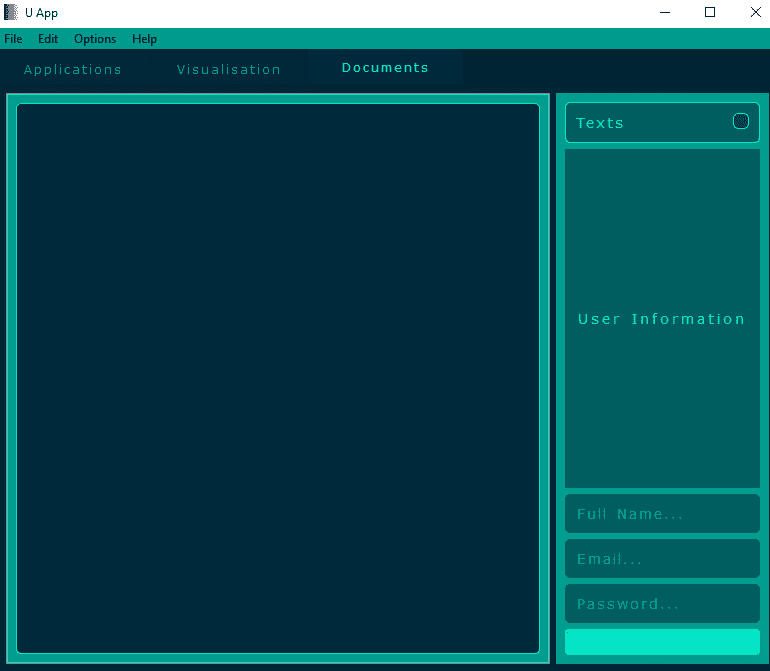
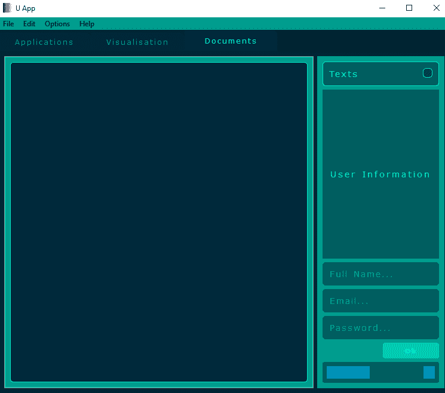

# 实现按钮

在本章中，我们将描述 GUI 应用程序的主要控制元素——**按钮**。按钮是任何 GUI 应用程序中最常用的图形组件。不同的按钮类型为用户提供根据其定义的功能操作应用程序的选项。用户可以点击按钮来启动一个过程并选择可用的选项，或者打开文件对话框窗口。所有这些操作都需要一个实现这些操作的元素。Qt 框架以及相应的 Python 绑定（PySide2 和 PyQt5）提供了用于创建各种任务按钮的广泛类。这些元素非常可定制，允许软件开发者以现代风格实现这些组件。

本章将涵盖以下元素：

+   按钮

+   复选框

+   其他组件

# QAbstractButton

这是一个用于按钮小部件的抽象基类，它提供了与 Qt 框架中按钮相关的功能。本章中描述的按钮将继承这个类。

# QAbstractButton 函数

`QAbstractButton` 继承自 `QWidget` 并通过以下函数增强了功能。

# 设置

这些是与按钮参数/属性设置相关的函数，包括设置文本、对齐或功能：

`setAutoExclusive(bool)`: 如果参数为 `True`，则启用按钮的自动排他性。这意味着该按钮是具有相同父组的排他按钮组的一部分。在排他按钮组中，一次只能选中一个按钮，如果之前选中了某个按钮，它将自动取消选中。

`setAutoRepeat(bool)`: 如果参数为 `True`，则在按钮被按下时启用自动重复。这与移动滑块等按钮相关。

`setAutoRepeatDelay(int)`: 这设置了按钮自动重复的延迟，或者当重复开始后经过参数中指定的毫秒数。

`setAutoRepeatInterval(int)`: 这设置了按钮自动重复的间隔，或者重复发生的间隔，以参数中指定的毫秒数表示。

`setChecked(bool)`: 如果参数为 `True`，则将按钮设置为选中状态。此按钮需要能够被选中。

`setDown(bool)`: 如果参数为 `True`，则将按钮设置为按下状态。

`setIcon(QtGui.QIcon)`: 这指定了按钮将使用的图标。

`setIconSize(QtCore.QSize)`: 这设置了按钮图标的尺寸。

`setShortcut(QtGui.QKeySequence)`: 这设置了将与该按钮关联的助记符，或用于执行动作的键盘快捷键。

`setText("Okay")`: 这设置了按钮的文本。

# 是

这些是返回与按钮状态相关的布尔值（`bool`）的函数：

`isCheckable()`: 此函数返回`True`，如果按钮可选中。

`isChecked()`: 此函数返回`True`，如果按钮被选中且可选中。

`isDown()`: 此函数返回`True`，如果按钮处于按下状态。

# functional

这些是与按钮当前值、功能变化等相关联的函数：

`animateClick(int)`: 此函数执行按钮的动画点击。

`autoExclusive()`: 此函数返回`True`，如果此按钮启用了自动排他性。

`autoRepeat()`: 此函数返回`True`，如果此按钮启用了自动重复功能。

`autoRepeatDelay()`: 此函数返回与按钮自动重复功能相关的延迟。

`autoRepeatInterval()`: 此函数返回与按钮自动重复功能相关的间隔。

`click()`: 此函数执行按钮的点击操作。与此按钮点击相关的所有信号都会被发射。

`group()`: 此函数返回按钮所属的组。

`hitButton(QtCore.QPoint)`: 如果参数指定的位置在按钮矩形内，则此函数返回`True`；否则返回`False`。

`icon()`: 此函数返回此按钮包含的图标，类型为`QtGui.QIcon`。

`iconSize()`: 此函数返回此按钮包含的图标大小，类型为`QtCore.QSize`。

`shortcut()`: 此函数返回与此按钮一起使用的键盘快捷键。

`text()`: 此函数返回此按钮上显示的文本。

# events

这些是与事件相关的函数，例如事件处理程序：

`changeEvent(QtCore.QEvent)`: 此函数处理与按钮相关的状态变化。

`checkStateSet()`: 当使用`QAbstractButton.setChecked()`时，此为虚拟处理程序被调用。

`event(QtCore.QEvent)`: 这是`QtCore.QObject`函数，用于接收对象的事件，如果事件被识别并处理，则应返回`True`。

`focusOutEvent(QtGui.QFocusEvent)`: 这是一个事件处理程序，旨在接收当失去焦点时，带有焦点事件参数的按钮的键盘焦点事件。

`focusInEvent(QtGui.QFocusEvent)`: 这是一个事件处理程序，旨在接收当接收到焦点时，带有焦点事件参数的按钮的键盘焦点事件。

`keyPressEvent(QtGui.QKeyEvent)`: 这是一个事件处理程序，旨在接收按钮的按键事件，以及通过参数传递的按键事件。

`keyReleaseEvent(QtGui.QKeyEvent)`: 这是一个事件处理程序，旨在接收按钮的按键释放事件，以及通过参数传递的按键事件。

`mousePressEvent(QtGui.QMouseEvent)`: 这是一个事件处理程序，旨在接收此按钮的鼠标按下事件，以及通过参数传递的鼠标事件。

`mouseReleaseEvent(QtGui.QMouseEvent)`: 这是一个事件处理程序，用于接收按钮的鼠标释放事件，以及通过参数传入的鼠标事件。

`nextCheckState()`: 当按钮被点击时，会调用此虚拟处理程序。

`paintEvent(QtGui.QPaintEvent)`: 这是一个事件处理程序，用于接收此按钮的绘制事件，以及通过参数传入的绘制事件。

`timerEvent(QtCore.QTimerEvent)`: 这是一个事件处理程序，用于接收按钮的计时器事件，以及通过参数传入的计时器事件。

# 信号

`QAbstractButton` 类可用的信号如下：

`clicked(bool)`: 当按钮被激活、按下快捷键或调用 `click()` 或 `animateClick()` 函数时，会发出此信号。如果按钮可勾选，参数为 `True` 表示已勾选，为 `False` 表示未勾选。

`pressed()`: 当按钮被按下时，会发出此信号。

`released()`: 当按钮被释放时，会发出此信号。

`toggled(bool)`: 当按钮状态改变时，会发出此信号。如果按钮可勾选，参数为 `True` 表示已勾选，为 `False` 表示未勾选。

# QPushButton

应用程序中最常用的图形组件是按钮。用户可以点击按钮执行操作或通过使用他们喜欢的应用程序达到某种效果。Qt 框架提供了 `QPushButton` 类来实现应用程序中的标准按钮，并且可以与 PySide 和 PyQt Python 绑定一起使用。丰富的自定义选项使此元素具有现代风格，可以在各种形式中用于任何地方。应用程序中按钮的声明语法如下：

```py
push_button = QtWidgets.QPushButton()
```

# QPushButton 函数

`QPushButton` 继承自 `QAbstractButton` 类，并通过以下函数增强了功能。

# 设置

这些是与设置与按钮相关的参数/属性设置相关的函数：

`push_button.setAutoDefault(bool)`: 如果参数为 `True`，则将此按钮设置为自动默认按钮。

`push_button.setDefault(bool)`: 如果参数为 `True`，则将此按钮设置为默认按钮。

`push_button.setFlat(bool)`: 如果参数为 `True`，则将此按钮设置为平面。

`push_button.setMenu(QtWidgets.QMenu)`: 这将设置与按钮相关的参数指定的弹出菜单。

# 是

这些是与当前按钮状态的布尔值 (`bool`) 相关的函数：

`push_button.isDefault()`: 如果此按钮是默认按钮，则返回 `True`。

`push_button.isFlat()`: 如果此按钮是平面的，则返回 `True`。

# 功能性

这些是与当前按钮的当前值、功能变化等相关的函数：

`push_button.autoDefault()`: 如果该按钮是自动默认按钮，则返回 `True`。

`push_button.menu()`: 这返回与该按钮关联的 `QtWidgets.QMenu` 类型的弹出菜单。

`push_button.showMenu()`: 这显示与该按钮关联的弹出菜单。

# 事件

这些是与事件相关的函数，例如事件处理程序：

`push_button.changeEvent(QtCore.QEvent)`: 这处理按钮内的状态变化。

`push_button.enterEvent(QtCore.QEvent)`: 这是一个事件处理程序，旨在接收传递带有事件参数的按钮进入事件，并在鼠标光标进入按钮时发送。

`push_button.event(QtCore.QEvent)`: 这接收对象的事件，如果事件被识别并处理，则应返回 `True`。

`push_button.focusOutEvent(QtGui.QFocusEvent)`: 这是一个事件处理程序，旨在接收此按钮的键盘焦点事件，并在失去焦点时通过事件参数传递。

`push_button.focusInEvent(QtGui.QFocusEvent)`: 这是一个事件处理程序，旨在接收此按钮的键盘焦点事件，并在获得焦点时通过事件参数传递。

`push_button.keyPressEvent(QtGui.QKeyEvent)`: 这是一个事件处理程序，旨在接收此按钮的按键事件，事件通过参数传递。

`push_button.keyReleaseEvent(QtGui.QKeyEvent)`: 这是一个事件处理程序，旨在接收此按钮的按键释放事件，事件通过参数传递。

`push_button.leaveEvent(QEvent)`: 这是一个事件处理程序，旨在接收此按钮的离开事件，事件通过参数传递。

`push_button.mousePressEvent(QtGui.QMouseEvent)`: 这是一个事件处理程序，旨在接收此按钮的鼠标按下事件，事件通过参数传递。

`push_button.mouseReleaseEvent(QtGui.QMouseEvent)`: 这是一个事件处理程序，旨在接收此按钮的鼠标释放事件，事件通过参数传递。

`push_button.paintEvent(QtGui.QPaintEvent)`: 这是一个事件处理程序，旨在接收此按钮的绘制事件，事件通过参数传递。

`push_button.timerEvent(QtCore.QTimerEvent)`: 这是一个事件处理程序，旨在接收此按钮的定时事件，事件通过参数传递。

# QToolButton

`QToolButton` 类构建应用程序中的快速访问工具按钮，用于通常在工具栏中定义的命令或选项。此类按钮的声明语法如下：

```py
tool_button = QtWidgets.QToolButton()
```

# QToolButton 函数

`QToolButton` 类从 `QAbstractButton` 类继承，并通过以下函数改进了功能。

# 设置

这些是与设置工具按钮相关参数/属性的函数：

`tool_button.setArrowType(QtCore.Qt.ArrowType)`: 这将为该工具按钮设置箭头类型，箭头将显示而不是正常图标。

`tool_button.setAutoRaise(bool)`: 如果参数为 `True`，则为此工具按钮启用自动提升功能。

`tool_button.setDefaultAction(QtWidgets.QAction)`: 这将为该工具按钮设置参数中指定的默认操作。

`tool_button.setMenu(QtWidgets.QMenu)`: 这将指定与该工具按钮关联的菜单。菜单将根据弹出模式显示。

`tool_button.setPopupMode(QtWidgets.QToolButton.ToolButtonPopupMode)`: 这将为此工具按钮设置弹出模式。可用的弹出模式如下：

+   `QtWidgets.QToolButton.DelayedPopup`—`0`: 菜单将延迟显示

+   `QtWidgets.QToolButton.MenuButtonPopup`—`1`: 菜单将带有特殊箭头显示

+   `QtWidgets.QToolButton.InstantPopup`—`2`: 菜单将无延迟显示，且不会触发操作

`tool_button.setToolButtonStyle(QtCore.Qt.ToolButtonStyle)`: 这将为该工具按钮设置参数中指定的样式。

# 功能性

这些是与工具按钮当前值返回、功能变化等相关联的函数：

`tool_button.arrowType()`: 这将返回与该工具按钮一起使用的 `QtCore.Qt.ArrowType` 类型的箭头。

`tool_button.autoRaise()`: 如果为该工具按钮启用了自动提升功能，则返回 `True`。

`tool_button.defaultAction()`: 这将返回与该工具按钮一起使用的 `QtWidgets.QAction` 类型的默认操作。

`tool_button.menu()`: 这将返回与该工具按钮关联的菜单。

`tool_button.popupMode()`: 这将返回与该工具按钮弹出菜单一起使用的 `QtWidgets.QToolButton.ToolButtonPopupMode` 类型的模式。

`tool_button.showMenu()`: 这将显示与该工具按钮关联的弹出菜单。

`tool_button.toolButtonStyle()`: 这将返回与该工具按钮一起使用的 `QtCore.Qt.ToolButtonStyle` 类型的样式。

# 事件

这些是与事件相关的函数，例如事件处理器：

`tool_button.actionEvent(QtGui.QActionEvent)`: 当与该工具按钮相关的操作发生变化时，将调用此事件处理器，事件通过参数传递。

`tool_button.changeEvent(QtCore.QEvent)`: 这处理与该工具按钮相关的状态变化。

`tool_button.enterEvent(QtCore.QEvent)`: 这是一个事件处理器，旨在接收该工具按钮的进入事件，这些事件通过事件参数传递，并在鼠标光标进入工具按钮时发送。

`tool_button.event(QtCore.QEvent)`: 这将接收对象的事件，如果事件被识别并处理，则应返回 `True`。

`tool_button.leaveEvent(QEvent)`: 这是一个事件处理程序，旨在接收此工具按钮的离开事件，事件通过参数传递。

`tool_button.mousePressEvent(QtGui.QMouseEvent)`: 这是一个事件处理程序，旨在接收此工具按钮的鼠标按下事件，鼠标事件通过参数传递。

`tool_button.mouseReleaseEvent(QtGui.QMouseEvent)`: 这是一个事件处理程序，旨在接收此工具按钮的鼠标释放事件，鼠标事件通过参数传递。

`tool_button.nextCheckState()`: 当工具按钮被点击时，会调用虚拟处理程序。

`tool_button.paintEvent(QtGui.QPaintEvent)`: 这是一个事件处理程序，旨在接收此工具按钮的绘制事件，绘制事件通过参数传递。

`tool_button.timerEvent(QtCore.QTimerEvent)`: 这是一个事件处理程序，旨在接收此工具按钮的计时器事件，计时器事件通过参数传递。

# 信号

`QToolButton` 类的可用信号如下：

`tool_button.triggered(QtWidgets.QAction)`: 当传递给参数的动作被触发时，会发出此信号。

# QRadioButton

应用程序中可以实现另一种类型的按钮，称为无线电按钮。此组件是选项按钮，因为用户可以在不同选项之间进行选择。一次只能检查包含无线电按钮的组中的单个无线电按钮。如果用户选择了无线电按钮，则此组内的其他无线电按钮将被取消选中。`QRadioButton` 类从 `QAbstractButton` 类继承，并提供了那里表示的功能、信号和事件。无线电按钮还可以显示文本和图标。在应用程序中无线电按钮的声明语法如下：

```py
radio_button = QtWidgets.QRadioButton("Choice #1")
```

此按钮的图标可以使用如下方式使用：

```py
radio_button.setIcon(QtGui.QIcon("Path/To/The/icon.png"))
```

在文本的情况下，我们有以下内容：

```py
radio_button.setText("Choice #1")
```

无线电按钮可以像使用 `setStyleSheet()` 函数的每个小部件一样进行样式化。

# QButtonGroup

此类实现了按钮组的容器。带有按钮的容器对于创建具有多个选项的无线电按钮或复选框以传达信息的复杂性非常有用。此类提供了一个抽象容器，不提供视觉表示。按钮组管理组中每个按钮的状态。在应用程序中按钮组的声明语法如下：

```py
button_group = QtWidgets.QButtonGroup()
```

# QButtonGroup 函数

`QButtonGroup` 类从 `QObject` 类继承，并通过以下函数改进了功能。

# 添加

以下函数与向按钮组添加元素相关：

`button_group.addButton(QtWidgets.QAbstractButton, int)`: 此函数将第一个参数指定的按钮添加到此按钮组，并使用第二个参数指定的 ID。如果 ID 是 `1`（默认值），则 ID 将分配给添加的按钮。

# 设置

这些是与设置按钮组相关参数/属性的函数：

`button_group.setExclusive(bool)`: 如果参数为 `True`，则将此按钮组设置为排他性。在这种情况下，这个组中任何时候只能选中一个按钮。

`button_group.setId(QtWidgets.QAbstractButton, int)`: 将第二个参数指定的 ID 设置为第一个参数中指定的按钮。

# 功能

这些是与按钮组当前值返回、功能变化等相关的函数：

`button_group.button(int)`: 返回参数中指定 ID 的按钮。

`button_group.buttons()`: 返回此按钮组中的按钮列表。

`button_group.checkedButton()`: 返回此按钮组中选中的按钮，如果没有选中按钮则返回 `0`。

`button_group.checkedId()`: 返回此按钮组中选中按钮的 ID，如果没有选中按钮则返回 `-1`。

`button_group.exclusive()`: 如果按钮组是排他的，则返回 `True`。这意味着在这个组中任何时候只能选中一个按钮。

`button_group.id(QtWidgets.QAbstractButton)`: 返回参数中指定按钮的 ID。

`button_group.removeButton(QtWidgets.QAbstractButton)`: 从此按钮组中移除参数中指定的按钮。

# 信号

`QButtonGroup` 类可用的信号如下：

`button_group.buttonClicked(QtWidgets.QAbstractButton)`: 当参数中指定的按钮被点击时，会发出此信号。

`button_group.buttonClicked(int)`: 当参数中指定的按钮被点击时，会发出此信号。

`button_group.buttonPressed(QtWidgets.QAbstractButton)`: 当参数中指定的按钮被按下时，会发出此信号。

`button_group.buttonPressed(int)`: 当参数中指定的按钮被按下时，会发出此信号。

`button_group.buttonReleased(QtWidgets.QAbstractButton)`: 当参数中指定的按钮被释放时，会发出此信号。

`button_group.buttonReleased(int)`: 当参数中指定的按钮被释放时，会发出此信号。

`button_group.buttonToggled(QtWidgets.QAbstractButton, bool)`: 当第一个参数指定的按钮被切换时，会发出此信号。如果按钮被选中，第二个参数为 `True`，如果没有选中，则为 `False`。

`button_group.buttonToggled(int, bool)`: 当第一个参数指定的按钮被切换时，会发出此信号。如果按钮被选中，第二个参数为 `True`，如果没有选中，则为 `False`。

# 按钮示例

现在，让我们尝试创建一个用于应用程序的按钮。本书后面将根据需要实现其他类型的按钮。作为一个例子，让我们创建一个按钮：

1.  首先，在两个`u_style.py`文件中构建`UBut1`类：

```py
...
class UBut1(QtWidgets.QPushButton):

    def __init__(self, parent=None,
            bg="rgba(9,219,190,140)",
            bgh="rgba(9,219,190,255)",
            txc="rgba(1,255,255,190)",
            txch="rgba(1,255,255,255)",
            minw=0, minh=0, maxw=None,
            maxh=None, fixw=None, fixh=None,
            mrg=0, pad=7, bds="solid",
            bdr=3, bdw=0, bdc=color[3], checks=False):
        super(UBut1, self).__init__(parent)
        self.setFlat(True)
        self.setMouseTracking(True)
        self.setMinimumWidth(minw)
        self.setMinimumHeight(minh)
        if maxw is not None:
            self.setMaximumWidth(maxw)
        if maxh is not None:
            self.setMaximumHeight(maxh)
        if fixw is not None:
            self.setFixedWidth(fixw)
        if fixh is not None:
            self.setFixedHeight(fixh)
        self.checks = checks
        self.setCheckable(self.checks)
        self.bg, self.bgh, self.txc, self.txch = bg, bgh, txc, txch 
        self.mrg, self.pad = mrg, pad
        self.bds, self.bdr, self.bdw, self.bdc = bds, bdr, bdw, bdc
        self.setStyleSheet(self.but_style(self.mrg, self.pad, self.bg,
                    self.txc, self.bds, self.bdr, self.bdw, self.bgh))
    ...
...
```

我们已经向`UBut1`类的`__init__()`函数添加了各种参数。最大宽度和高度可以根据 GUI 中按钮的外观进行调整。

1.  将用于样式化此按钮的`but_style()`函数添加到`UBut1`类中：

```py
...
    ...
    def but_style(self, mrg=None, pad=None, bg=None,
                  txc=None, bds=None, bdr=None,
                                bdw=None, bdc=None):
        style = """margin: %spx; padding: %spx;
                   background-color: %s; color: %s;
                   border-style: %s; border-radius: %spx;
                   border-width: %spx; border-color: %s;"""
                % (mrg, pad, bg, txc, bds, bdr, bdw, bdc)
        return style
    ...
...
```

此函数将用于避免代码重复，并在事件发生时样式化此按钮。添加将用于事件发生的函数；在第一个实例中，我们将添加处理按钮调整大小事件的函数，或者当按钮根据窗口大小调整大小时，更改此按钮文本的字体。

1.  这里是处理调整大小事件的函数：

```py
...
    ...
    def resizeEvent(self, event):
        self.fonts = UFonts(
           size=int(
              (self.width() + self.height())/self.pad),
                                                weight=100)
        self.setFont(self.fonts.font1)
    ...
...
```

此函数处理通过参数传递的`event`参数的调整大小事件。它根据按钮的大小更改按钮的字体。

1.  添加`enterEvent`函数，该函数处理鼠标进入按钮区域时的按钮进入事件。`enterEvent`函数添加如下：

```py
...
    ...
    def enterEvent(self, event):
        self.setStyleSheet(self.but_style(self.mrg, self.pad,
                           self.bgh, self.txch, self.bds,
                           self.bdr, self.bdw, self.bdc))
    ...
...
```

此函数处理此按钮的进入事件并相应地更改样式。

1.  为此按钮的离开事件添加`leaveEvent`函数：

```py
...
    ...
    def leaveEvent(self, event):.
        self.setStyleSheet(self.but_style(self.mrg,
                 self.pad, self.bg, self.txc, self.bds,
                           self.bdr, self.bdw, self.bgh))
    ...
...
```

此函数处理按钮的离开事件并相应地更改样式。这是一个尝试创建一个提供各种用途的按钮类的例子。或者换句话说，它给用户提供了根据应用程序任务和功能来样式化按钮组件的机会。所有这些样式参数都可以在这个类中更改，也可以在外部更改，例如在主应用程序或其他地方使用时。

现在，我们需要在`u_app.py`文件中将`UBut1`类添加到主应用程序类中，并使用一些自定义参数。按照以下步骤进行操作：

1.  在`u_app.py`文件的`import`部分添加以下行：

```py
...
from u_style import UBut1
...
```

1.  然后，我们需要将此按钮添加到`UApp`类中，如下所示：

```py
...
class UApp(UWindow, UTools):

    def __init__(self, parent=None):
        ...
        self.push_but1 = UBut1(self.frame2)
        self.push_but1.setText("Ok")
        self.layfr2_1 = QtWidgets.QGridLayout()
        self.layfr2_1.addWidget(self.push_but1, 0, 1, 1, 1)
        ...
    ...
...
```

我们已经添加了按钮实例并创建了一个将包含此按钮的布局。

1.  然后，将使用此按钮创建的布局添加到第二个框架的布局中：

```py
...
class UApp(UWindow, UTools):

    def __init__(self, parent=None):
        ...
        self.layfr2.addLayout(self.layfr2_1, 5, 0, 1, 1)
        ...
    ...
...
```

我们将看到以下结果：



在右下角，我们可以看到“确定”按钮。当鼠标指针悬停在按钮上时，它将提供一个更浅绿色的悬停效果。

# QCheckBox

就像单选按钮一样，复选框是一个选项按钮，允许用户做出选择。这些按钮通常与特定动作将使用的功能结合使用。这些选项可以根据用户的偏好开启或关闭。复选框可以显示选项的文本，以及图标。此类按钮的声明语法如下：

```py
check_box = QtWidgets.QCheckBox()
```

# QCheckBox 函数

`QCheckBox` 从 `QAbstractButton` 类继承，并通过以下函数改进了功能。

# set

这些是与设置复选框相关参数/属性的函数：

`check_box.setCheckState(QtCore.Qt.CheckState)`: 这将设置复选框的检查状态。

`check_box.setTristate(bool)`: 这将设置与复选框一起使用的三态可用性。可以使用的状态如下：

+   `QtCore.Qt.Unchecked`: 复选框未被选中。

+   `QtCore.Qt.PartiallyChecked`: 复选框部分选中。

+   `QtCore.Qt.Checked`: 复选框被选中。

# is

此函数返回与复选框状态相关的布尔值 (`bool`)：

`check_box.isTristate()`: 如果这个复选框有三个状态，则返回 `True`。

# functional

此函数与复选框当前值的返回相关：

`check_box.checkState()`: 这返回复选框的 `QtCore.Qt.CheckState` 类型的检查状态。

# 事件

这些是与事件相关的函数，例如事件处理程序：

`check_box.event(QtCore.QEvent)`: 这是 `QtCore.QObject` 函数，接收对象的事件，如果事件被识别并处理，则应返回 `True`。

`check_box.mouseMoveEvent(QtGui.QMouseEvent)`: 这是一个事件处理程序，旨在接收复选框的鼠标移动事件，事件通过参数传递。

`check_box.paintEvent(QtGui.QPaintEvent)`: 这是一个事件处理程序，旨在接收复选框的绘制事件，事件通过参数传递。

# 信号

`QCheckBox` 类可用的信号如下：

`check_box.stateChanged(int)`: 当复选框的状态改变时，会发出此信号，状态通过参数传递。

# 额外组件

除了本章所涵盖的内容外，让我们考虑滑块和其他可用于 GUI 应用程序的有用组件。不同类型的滑块使得提供一些附加的特殊动作成为可能，例如滚动窗口和滑动值。

# QAbstractSlider

此类是包括滚动条、滑块和旋钮在内的组件的父类。`QAbstractSlider` 从 `QWidget` 类继承，并通过以下函数改进了功能。

# set

这些是与设置参数/属性相关的函数，包括大小、范围和功能：

`setInvertedAppearance(bool)`: 如果参数为 `True`，则继承的组件将显示其值反转。

`setInvertedControls(bool)`: 如果参数为 `True`，则将组件使用的轮和按键事件设置为反转。

`setMaximum(int)`: 这将用于组件的参数中指定的最大值设置为。在滑块的情况下，这将是在范围内的最大值。

`setMinimum(int)`: 这将用于组件的参数中指定的最小值设置为。在滑块的情况下，这将是在范围内的最小值。

`setOrientation(QtCore.Qt.Orientation)`: 这将用于组件的朝向设置为 `QtCore.Qt.Horizontal` 或 `QtCore.Qt.Vertical`（默认）。

`setPageStep(int)`: 这将设置与组件一起使用的参数中指定的页面步进。

`setRange(int, int)`: 这将设置用于组件的范围值，从最小值（第一个参数）到最大值（第二个参数）。

`setRepeatAction(QtWidgets.QAbstractSlider.SliderAction, int, int)`: 这设置在间隔（第三个参数）或延迟（第二个参数）时将触发的作用（第一个参数）。

`setSingleStep(int)`: 这将设置用于组件的单步，通常通过响应组件之一的方向键的按下。

`setSliderDown(bool)`: 如果参数为 `True`，则滑块将被拉下。

`setSliderPosition(int)`: 这将设置滑块组件的当前位置指定的参数。

`setTracking(bool)`: 如果参数为 `True`，则将跟踪设置为启用。如果此属性启用，组件在拖动时会发出 `valueChanged()` 信号。在另一种情况下，此信号仅在释放时发出。

`setValue(int)`: 这将设置组件范围内的当前值指定的参数。例如，滑块的把手将移动到这个值。

# is

这些函数返回与状态相关的布尔值 (`bool`)：

`isSliderDown()`: 如果组件被按下，则返回 `True`。

# functional

这些是与当前值返回、功能变化等相关联的函数：

`invertedAppearance()`: 如果继承的组件显示其值被反转，则返回 `True`。

`invertedControls()`: 如果组件使用的轮和按键事件被反转，则返回 `True`。

`maximum()`: 这返回正在使用的组件的整型最大值。在滑块的情况下，这将是在范围内的最大值。

`minimum()`: 这返回正在使用的组件的整型最小值。在滑块的情况下，这将是在范围内的最小值。

`orientation()`: 这返回正在使用的组件的 `QtCore.Qt.Orientation` 类型的朝向。

`pageStep()`: 这返回正在使用的组件的页面步进，以整数值表示。

`repeatAction()`: 这返回正在使用的组件的 `QtWidgets.QAbstractSlider.SliderAction` 类型的重复操作。

`singleStep()`: 这个函数返回正在使用的组件的单步值。

`sliderChange(QtWidgets.QAbstractSlider.SliderChange)`: 这个函数跟踪滑动条的变化，使用可用的参数，如下所示：

+   `QtWidgets.QAbstractSlider.SliderRangeChange`—`0`: 范围变化。

+   `QtWidgets.QAbstractSlider.SliderOrientationChange`—`1`: 方向变化。

+   `QtWidgets.QAbstractSlider.SliderStepsChange`—`2`: 步长变化。

+   `QtWidgets.QAbstractSlider.SliderValueChange`—`3`: 值变化。

`sliderPosition()`: 这个函数返回滑动条组件在范围内的当前位置。

`triggerAction(QtWidgets.QAbstractSlider.SliderAction)`: 这个函数触发参数中指定的滑动条动作。

`value()`: 这个函数返回滑动条组件的当前值。

# 事件

这些是与事件处理程序等事件相关的函数：

`changeEvent(QtCore.QEvent)`: 这个函数处理状态变化。

`event(QtCore.QEvent)`: 这是`QtCore.QObject`函数，它接收对象的事件，如果事件被识别并处理，则应返回`True`。

`keyPressEvent(QtGui.QKeyEvent)`: 这是一个事件处理程序，用于接收用于组件的关键事件，其中事件通过参数传递。

`timerEvent(QtCore.QTimerEvent)`: 这是一个事件处理程序，用于接收用于组件的计时器事件，其中计时器事件通过参数传递。

`wheelEvent(QtGui.QWheelEvent)`: 这是一个事件处理程序，用于接收用于组件的鼠标滚轮事件，其中滚轮事件通过参数传递。

# 信号

`QAbstractSlider`类可用的信号如下：

`actionTriggered(int)`: 当滑动条被传递参数的动作触发时，会发出此信号。

`rangeChanged(int, int)`: 当滑动条的取值范围被修改为新的最小和最大范围参数时，会发出此信号。

`sliderMoved(int)`: 当滑动条移动且`sliderDown()`为`True`时，会发出此信号，其中新的滑动条位置通过参数传递。

`sliderPressed()`: 当滑动条被按下时，会发出此信号，也可以通过`setSliderDown(True)`程序化地触发。

`sliderReleased()`: 当滑动条被释放时，会发出此信号，也可以通过`setSliderDown(True)`程序化地触发。

`valueChanged(int)`: 当滑动条值被修订时，会发出此信号，其中新值通过参数传递。

# QSlider

此类在 GUI 应用程序中提供了一个垂直或水平滑动条，可以用来移动滑动条手柄沿凹槽，并将手柄的位置转换为整数值。`QSlider`类继承自`QAbstractSlider`类。滑动条的声明语法如下：

```py
slider = QtWidgets.QSlider()
```

`QSlider`类通过以下函数改进了功能。

# 设置

这些是与设置与滑动条相关的参数/属性的函数：

`slider.setTickInterval(int)`: 这将设置此滑块的刻度线间隔。

`slider.setTickPosition(QtWidgets.QSlider.TickPosition)`: 这将设置此滑块的刻度线位置。可用参数如下：

+   `QtWidgets.QSlider.NoTicks`—`0`: 没有刻度线。

+   `QtWidgets.QSlider.TicksBothSides`—`3`: 两边都有刻度线。

+   `QtWidgets.QSlider.TicksAbove`—`1`: 刻度线在上方（水平）。

+   `QtWidgets.QSlider.TicksBelow`—`2`: 刻度线在下方（水平）。

+   `QtWidgets.QSlider.TicksLeft`—`TicksAbove`: 刻度线在左侧（垂直）。

+   `QtWidgets.QSlider.TicksRight`—`TicksBelow`: 刻度线在右侧（垂直）。

# 功能性

这些是返回当前值的函数：

`slider.tickInterval()`: 这返回滑块刻度线之间的间隔。

`slider.tickPosition()`: 这返回`QtWidgets.QSlider.TickPosition`类型的刻度线位置。

# 事件

这些是与事件相关的函数，例如事件处理程序：

`slider.event(QtCore.QEvent)`: 这是`QtCore.QObject`函数，它接收对象的事件，如果事件被识别并处理，则应返回`True`。

`slider.mouseMoveEvent(QtGui.QMouseEvent)`: 这是一个事件处理程序，用于接收滑块的鼠标移动事件，并通过参数传递鼠标事件。

`slider.mousePressEvent(QtGui.QMouseEvent)`: 这是一个事件处理程序，用于接收滑块的鼠标按下事件，并通过参数传递鼠标事件。

`slider.mouseReleaseEvent(QtGui.QMouseEvent)`: 这是一个事件处理程序，用于接收滑块的鼠标释放事件，并通过参数传递鼠标事件。

`slider.paintEvent(QtGui.QPaintEvent)`: 这是一个事件处理程序，用于接收滑块的绘制事件，并通过参数传递绘制事件。

# QDial

此类提供了一个可以环绕在`0`到`359`度范围内的圆形范围组件。`QDial`类从`QAbstractSlider`类继承。旋钮的声明语法如下：

```py
dial = QtWidgets.QDial()
```

`QDial`类通过以下函数增强了功能。

# 设置

这些是与设置与旋钮相关的参数/属性相关的函数：

`dial.setNotchesVisible(bool)`: 如果参数为`True`，则将此旋钮的凹槽设置为可见。

`dial.setNotchTarget(float)`: 这将设置此旋钮每个凹槽之间的像素参数指定的目标数值。

`dial.setWrapping(bool)`: 如果参数为`True`，则为此旋钮启用环绕。

# 功能性

这些是与当前值返回相关的函数：

`dial.notchesVisible()`: 如果此旋钮上的凹槽可见，则返回`True`。

`dial.notchSize()`: 这返回旋钮凹槽的当前大小。

`dial.notchTarget()`: 这返回目标像素数作为浮点值，并用于此旋钮的凹槽之间。

`dial.wrapping()`: 如果此旋钮启用了包装，则返回 `True`。

# 事件

这些是与事件处理程序等事件相关的函数：

`dial.event(QtCore.QEvent)`: 这接收对象的事件，如果事件被识别并处理，则应返回 `True`。

`dial.mouseMoveEvent(QtGui.QMouseEvent)`: 这是一个事件处理程序，旨在接收此旋钮的鼠标移动事件，并通过参数传递鼠标事件。

`dial.mousePressEvent(QtGui.QMouseEvent)`: 这是一个事件处理程序，旨在接收此旋钮的鼠标按下事件，并通过参数传递鼠标事件。

`dial.mouseReleaseEvent(QtGui.QMouseEvent)`: 这是一个事件处理程序，旨在接收此旋钮的鼠标释放事件，并通过参数传递鼠标事件。

`dial.paintEvent(QtGui.QPaintEvent)`: 这是一个事件处理程序，旨在接收此旋钮的绘制事件，并通过参数传递绘制事件。

`dial.resizeEvent(QtGui.QResizeEvent)`: 这是一个事件处理程序，旨在接收此旋钮的部件大小调整事件，并通过参数传递大小调整事件。

# QProgressBar

进度条提供了一个水平或垂直组件来指示操作的进度。这可以在应用程序中实现。应用程序的声明语法如下：

```py
progress = QtWidgets.QProgressBar()
```

`QProgressBar` 从 `QWidget` 类继承，并通过以下函数改进了功能。

# 设置

这些是与进度条参数/属性设置相关的函数：

`progress.setAlignment(QtCore.Qt.Alignment)`: 这将设置与进度条一起使用的对齐方式。

`progress.setFormat("%p%")`: 这将设置用于进度的文本格式。可用的格式如下：

+   `"%p%"`: 这些值将被替换为百分比（默认）

+   `"%v%"`: 这些值将被当前值替换

+   `"%m%"`: 这些值将被替换为已完成的步骤总数

`progress.setInvertedAppearance(bool)`: 如果参数为 `True`，则条形将显示其逆序进度。

`progress.setMaximum(int)`: 这将设置此进度条的最大值。

`progress.setMinimum(int)`: 这将设置此进度条的最低值。

`progress.setOrientation(QtCore.Qt.Orientation)`: 这将设置此进度条的朝向。在参数中，可以使用 `QtCore.Qt.Vertical` 或 `QtCore.Qt.Horizontal`（默认）朝向。

`progress.setRange(int, int)`: 这将设置进度条值的范围，指定最小值（第一个参数）和最大值（第二个参数）。通过使用 `setRange(0, 0)`，进度条将被设置为不确定状态。

`progress.setTextDirection(QtWidgets.QProgressBar.Direction)`: 这设置参数中指定的文本显示方向。垂直进度条的可选方向如下：

+   `QtWidgets.QProgressBar.TopToBottom`—`0`: 文本将顺时针旋转 `90` 度

+   `QtWidgets.QProgressBar.BottomToTop`—`1`: 文本将逆时针旋转 `90` 度

`progress.setTextVisible(bool)`: 如果参数为 `True`，则将通过此进度条显示当前完成百分比。

`progress.setValue(int)`: 这设置此进度条指定的当前值。

# 是

此函数返回与状态相关的布尔值 (`bool`)：

`progress.isTextVisible()`: 如果当前完成百分比被显示，则返回 `True`。

# 功能性

这些函数与当前值的返回、功能变化等相关：

`progress.alignment()`: 这返回将与该进度条一起使用的 `QtCore.Qt.Alignment` 类型的对齐方式。

`progress.format()`: 这返回用于生成进度条中显示的文本的格式字符串。

`progress.maximum()`: 这返回进度条的最大值。

`progress.minimum()`: 这返回进度条的最小值。

`progress.orientation()`: 这返回进度条的 `QtCore.Qt.Orientation` 类型的方向。

`progress.reset()`: 这将重置进度条。进度条不会前进，而是回退。

`progress.resetFormat()`: 这将重置与进度条一起使用的文本格式。

`progress.text()`: 这返回与该进度条一起显示的文本。

`progress.value()`: 这返回此进度条当前值。

# 事件

这些函数与事件处理程序等事件相关：

`progress.event(QtCore.QEvent)`: 这接收对象的事件，如果事件被识别并处理，则应返回 `True`。

`progress.mouseMoveEvent(QtGui.QMouseEvent)`: 这是一个事件处理程序，旨在接收进度条的鼠标移动事件，并通过参数传递鼠标事件。

`progress.mousePressEvent(QtGui.QMouseEvent)`: 这是一个事件处理程序，旨在接收进度条的鼠标按下事件，并通过参数传递鼠标事件。

`progress.mouseReleaseEvent(QtGui.QMouseEvent)`: 这是一个事件处理程序，旨在接收进度条的鼠标释放事件，并通过参数传递鼠标事件。

`progress.paintEvent(QtGui.QPaintEvent)`: 这是一个事件处理程序，旨在接收此进度条的绘制事件，并通过参数传递绘制事件。

# 信号

`QProgressBar` 类可用的信号如下：

`valueChanged(int)`: 当进度条值发生变化时，会发出此信号，并通过参数传递新值。

# QProgressBar 示例

现在，我们可以为应用程序创建进度条。这将指示将要运行的操作的进度。为此，在`u_style.py`文件中创建一个名为`UProgress`的类：

1.  为进度条添加`UProgress`类：

```py
...
class UProgress(QtWidgets.QProgressBar):

    def __init__(self, parent=None,
                 bg="rgba(0,190,255,140)",
                 txc="rgba(1,255,255,190)",
                 minw=0, minh=0, maxw=None, maxh=None,
                 fixw=None, fixh=None, mrg=0, pad=7,
                 bds="solid", bdr=3, bdw=0, bdc=color[3]):
        super(UProgress, self).__init__(parent)
        self.setMinimumWidth(minw)
        self.setMinimumHeight(minh)
        if maxw is not None:
            self.setMaximumWidth(maxw)
        if maxh is not None:
            self.setMaximumHeight(maxh)
        if fixw is not None:
            self.setFixedWidth(fixw)
        if fixh is not None:
            self.setFixedHeight(fixh)
        self.bg, self.txc, self.mrg, self.pad = bg, txc, mrg, pad 
        self.bds, self.bdr, self.bdw, self.bdc = bds, bdr, bdw, bdc
        self.setStyleSheet(self.pgrs_style(self.mrg, self.pad,
          self.bg, self.txc, self.bds, self.bdr, self.bdw, color[2]))
    ...
...
```

我们已成功添加了进度条的风格属性。这些可以在应用程序中重新实现。

1.  然后，将`pgrs_style()`函数添加到这个类中。这将用于设置进度条的风格：

```py
...
    ...
    def pgrs_style(self, mrg=None, pad=None, bg=None,
          txc=None, bds=None, bdr=None, bdw=None, bdc=None):
        style = """QProgressBar {margin: %spx; padding: %spx;
                    border-style: %s; border-radius: %spx;
                    border-width: %spx; border-color: %s;}
                   QProgressBar::chunk {background-color: %s;
                   color: %s;} """ % (mrg, pad, bds, bdr, bdw,
                                                 bdc, bg, txc)
        return style
...
```

此函数将重新设置进度条的风格，并依赖于某些事件。这些事件的处理器可以稍后添加。现在，我们需要通过向`u_app.py`文件添加一些类来实现这个进度条在 GUI 中的显示。

1.  将`UProgress`类添加到导入部分：

```py
...
from u_style import UProgress
...
```

1.  然后，将进度条添加到`UApp`类中：

```py
...
    ...
    def __init__(self, parent=None):
        ... 
        self.progress1 = UProgress(self.frame2)
        self.progress1.setRange(0, 0)
        self.layfr2_1 = QtWidgets.QGridLayout()
        self.layfr2_1.addWidget(self.push_but1, 0, 1, 1, 1)
        self.layfr2_1.addWidget(self.progress1, 1, 0, 1, 2)
        ...
    ...
...
```

我们正在使用条的`setRange()`方法来设置不确定模式的进度。当我们运行`u_app.py`文件时，我们将看到以下结果（进度条在不确定模式下无限滑动）：



我们在按钮下方添加了进度条。目前，它处于不确定状态。

# 摘要

本章展示了在 GUI 应用程序中可以使用的最流行组件的基本特性和属性。这些元素包括按钮，以及一些控件和指示条。并非所有这些都在我们的示例中涵盖，但它们可以在需要时添加到应用程序功能实现中。

本章在 GUI 应用程序主要组件的描述下划了一条线。在下一章中，我们将深入探讨 GUI 应用程序中图形的基础知识。
