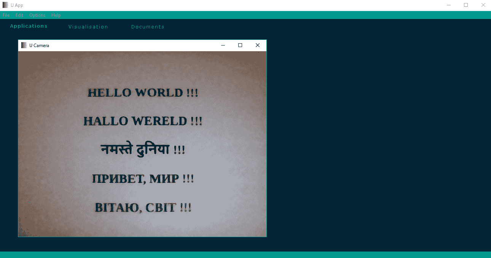

# 图形效果和多媒体

本章是关于图形实现的上一章的延续。在这里，我们将描述向上一章中使用的图形元素添加一些效果的可能性。Qt 框架提供了我们在使用各种类型的图形实现（如 OpenGL、SVG 和 3D 图形）时最常用的类和模块。类也可供使用，以便您可以将效果添加到标准图形元素，如矩形或其他形状。

在本章中，我们将涵盖以下主题：

+   标准图形效果

+   标准动画和变换

+   额外模块

+   多媒体

# 标准图形效果

Qt 库提供了标准图形效果，这些效果可以与`QGraphicsRectItem`和`QGraphicsLineItem`等项相关使用。效果使应用程序的图形元素更具代表性，并且因此以现代风格呈现。这些效果的资源可以是图像、图片、图形元素、图像/元素的某些部分等。通常，可以使用如下设置函数将效果添加到图形项中：

```py
graphics_item = QtWidgets.QGraphicsRectItem()
blur_effect = QtWidgets.QGraphicsBlurEffect()
graphics_item.setGraphicsEffect(blur_effect)
```

# QGraphicsEffect

此类是所有与 Qt 一起使用的图形效果的基类。`QGraphicsEffect`类通过以下函数提高了功能。

# 设置

此函数设置与图形效果相关的参数/属性：

`setEnabled(bool)`: 如果参数为`True`，则将此效果设置为启用。

# is

此函数返回与这些图形效果状态相关的布尔值（`bool`）。

`isEnabled()`: 如果此效果被启用，则返回`True`。

# 功能性

这些是与图形效果的当前值、功能变化等相关联的函数：

`boundingRect()`: 这返回此效果的`QtCore.QRectF`类型的边界矩形。

`boundingRectFor(QtCore.QRectF)`: 这返回`QtCore.QRectF`类型的边界矩形，该矩形依赖于参数中指定的矩形，以设备坐标形式表示此效果。

`draw(QtGui.QPainter)`: 这用于绘制效果，并在需要绘制时被调用。

`drawSource(QtGui.QPainter)`: 这使用参数中指定的画家直接绘制源。

`sourceBoundingRect(QtCore.Qt.CoordinateSystem)`: 这返回映射到参数中指定的系统上的源边界矩形。

`sourceChanged(QtWidgets.QGraphicsEffect.ChangeFlags)`: 这通知此效果的源已更改，参数中的标志描述了发生了什么变化。可用的标志如下：

+   `QtWidgets.QGraphicsEffect.SourceAttached`: 效果被安装到源上。

+   `QtWidgets.QGraphicsEffect.SourceDetached`: 效果从源上卸载。

+   `QtWidgets.QGraphicsEffect.SourceBoundingRectChanged`：源的边界矩形已更改。

+   `QtWidgets.QGraphicsEffect.SourceInvalidated`：源的可视外观已更改。

`sourceIsPixmap()`：如果效果源是位图，则返回 `True`。

`sourcePixmap(QtCore.Qt.CoordinateSystem, PySide2.QtCore.QPoint, QtWidgets.QGraphicsEffect.PixmapPadMode)`：此操作返回一个带有源绘制的 `QtGui.QPixmap` 类型的位图。第一个参数定义了用于源的坐标系。第二个参数是位图应该绘制的偏移量。填充模式（第三个参数）定义了位图的填充方式。可用的填充模式参数如下：

+   `QtWidgets.QGraphicsEffect.NoPad`—`0`：位图不会接收额外的填充。

+   `QtWidgets.QGraphicsEffect.PadToTransparentBorder`—`1`：位图将被填充以完全匹配透明边框。

+   `QtWidgets.QGraphicsEffect.PadToEffectiveBoundingRect`—`2`：位图将被填充以匹配此效果的有效边界矩形。

`update()`：此操作安排此效果的重新绘制。

`updateBoundingRect()`：当此效果的边界矩形发生变化时，此操作会发出通知。

# 信号

`QGraphicsEffect` 类中可用的信号如下：

`enabledChanged(bool)`：当效果根据参数中传入的状态变为启用或禁用时，此信号会被发出。

# QGraphicsBlurEffect

此类实现了图形元素的模糊效果。模糊效果会减少源细节。此类的声明语法如下：

```py
blur_effect = QtWidgets.QGraphicsBlurEffect()
```

`QGraphicsBlurEffect` 类从 `QGraphicsEffect` 类继承，并通过以下函数改进了功能。

# set

这些是与设置与模糊效果相关的参数/属性相关的函数：

`blur_effect.setBlurHints(QtWidgets.QGraphicsBlurEffect.BlurHints)`：此操作设置此效果的模糊提示，它描述了模糊效果是如何应用的。可用的提示如下：

+   `QtWidgets.QGraphicsBlurEffect.PerformanceHint`：此操作将渲染性能设置为最重要的因素。

+   `QtWidgets.QGraphicsBlurEffect.QualityHint`：此操作将渲染质量设置为最重要的因素。

+   `QtWidgets.QGraphicsBlurEffect.AnimationHint`：这表示模糊半径将进行动画处理。

`blur_effect.setBlurRadius(float)`：此操作为此效果设置模糊半径，由参数指定。较大的半径会产生更模糊的外观，而较小的半径会使外观看起来更锐利。

# 功能

这些是与模糊效果的当前值、功能变化等相关联的函数：

`blur_effect.blurHints()`：此操作返回用于此模糊效果的 `QtWidgets.QGraphicsBlurEffect.BlurHints` 类型的提示。

`blur_effect.blurRadius()`：此操作返回此效果的模糊半径。

# 信号

`QGraphicsBlurEffect` 类可用的信号如下：

`blur_effect.blurHintsChanged(QtWidgets.QGraphicsBlurEffect.BlurHints)`: 当模糊提示改变时，会发出此信号，新的模糊提示通过参数传入。

`blur_effect.blurRadiusChanged(float)`: 当模糊半径改变时，会发出此信号，新的模糊半径通过参数传入。

# QGraphicsColorizeEffect

此类实现了着色功能。此效果会着色源的颜色。此类的声明语法如下：

```py
colorize_effect = QtWidgets.QGraphicsColorizeEffect()
```

`QGraphicsColorizeEffect`类继承自`QGraphicsEffect`类，并通过以下函数改进了功能。

# set

这些是与设置着色效果相关参数/属性的函数：

`colorize_effect.setColor(QtGui.QColor)`: 设置用于此着色效果的色彩。

`colorize_effect.setStrength(float)`: 设置效果强度（`0.0`—无效果，`1.0`—完全着色）。

# functional

这些是与着色效果当前值、功能变化等相关联的函数：

`colorize_effect.color()`: 返回用于着色此效果的`QtGui.QColor`类型的颜色。

`colorize_effect.strength()`: 此函数返回效果强度。

# signals

`QGraphicsColorizeEffect`类的可用信号如下：

`colorize_effect.colorChanged(QtGui.QColor)`: 当效果颜色改变时，会发出此信号，新的颜色通过参数传入。

`colorize_effect.strengthChanged(float)`: 当效果强度改变时，会发出此信号，新的强度通过参数传入。

# QGraphicsDropShadowEffect

此类为提供的源提供了阴影效果。此类的声明语法如下：

```py
shadow_effect = QtWidgets.QGraphicsDropShadowEffect()
```

`QGraphicsDropShadowEffect`类继承自`QGraphicsEffect`类，并通过以下函数改进了功能。

# set

这些是与设置阴影效果相关参数/属性的函数：

`shadow_effect.setBlurRadius(float)`: 设置此阴影效果的像素模糊半径。

`shadow_effect.setColor(QtGui.QColor)`: 设置此阴影效果的色彩。

`shadow_effect.setOffset(QtCore.QPointF)`: 通过参数设置阴影偏移。

`shadow_effect.setOffset(float)`: 设置参数中指定的阴影偏移。

`shadow_effect.setOffset(dx, dy)`: 通过指定偏移量的`dx`和`dy`值来设置阴影偏移。

`shadow_effect.setXOffset(float)`: 通过参数设置像素值来设置水平阴影偏移。

`shadow_effect.setYOffset(float)`: 通过参数设置像素值来设置垂直阴影偏移。

# functional

这些是与阴影效果当前值、功能变化等相关联的函数：

`shadow_effect.blurRadius()`: 返回此阴影效果的像素模糊半径。

`shadow_effect.color()`: 此函数返回此阴影的颜色，为`QtGui.QColor`类型。

`shadow_effect.offset()`: 此函数返回`QtCore.QPointF`类型的阴影偏移量。

`shadow_effect.xOffset()`: 此函数返回水平阴影偏移量。

`shadow_effect.yOffset()`: 此函数返回垂直阴影偏移量。

# 信号

`QGraphicsDropShadowEffect`类的可用信号如下：

`shadow_effect.blurRadiusChanged(float)`: 当模糊半径改变时，会发出此信号，新的模糊半径通过参数传入。

`shadow_effect.colorChanged(QtGui.QColor)`: 当效果的颜色改变时，会发出此信号，新的颜色通过参数传入。

`shadow_effect.offsetChanged(QtCore.QPointF)`: 当效果的偏移量改变时，会发出此信号，新的偏移量通过参数传入。

# QGraphicsOpacityEffect

这是实现源不透明效果的类。此类的声明语法如下：

```py
opacity_effect = QtWidgets.QGraphicsOpacityEffect()
```

`QGraphicsDropShadowEffect`类继承自`QGraphicsEffect`类，并通过以下函数增强了功能。

# 设置

这些是与设置与不透明度效果相关的参数/属性相关的函数：

`opacity_effect.setOpacity(float)`: 此函数设置此效果的不透明度（`0.0`—完全透明，`1.0`—完全不透明）。

`opacity_effect.setOpacityMask(QtGui.QBrush)`: 此函数设置参数中指定的不透明度蒙版，为此效果允许将不透明度应用于元素的部分。

# 功能

这些是与不透明度效果的当前值、功能变化等相关联的函数：

`opacity_effect.opacity()`: 此函数返回此效果的不透明度。

`opacity_effect.opacityMask()`: 此函数返回此效果`QtGui.QBrush`类型的不透明度蒙版。

# 信号

`QGraphicsOpacityEffect`类的可用信号如下：

`opacity_effect.opacityChanged(float)`: 当不透明度改变时，会发出此信号，新的不透明度通过参数传入。

`opacity_effect.opacityMaskChanged(QtGui.QBrush)`: 当不透明度蒙版改变时，会发出此信号，新的不透明度蒙版通过参数传入。

# 标准动画和转换

通过 Qt 框架的帮助，效果可以作为标准图形项的动画实现。这些类可以动画化各种项，如`QGraphicsEllipseItem`、`QGraphicsTextItem`等。`QGraphicsItemAnimation`类也可以用于 PySide 绑定。

# QGraphicsTransform

这是一个用于构建高级图形项转换的抽象基类。`QGraphicsTransform`类继承自`QObject`类，并通过以下函数增强了功能：

`applyTo(QtGui.QMatrix4x4)`: 此函数将此转换应用于参数中指定的矩阵。此方法需要在派生类中重新实现。

`update()`: 这通知与这个变换操作相关的操作已改变。

# QGraphicsRotation

这个类提供了在应用程序中对图形项进行旋转的功能。这个类的声明语法如下：

```py
graphics_rotation = QtWidgets.QGraphicsRotation()
```

`QGraphicsRotation` 从 `QGraphicsTransform` 类继承，并通过以下函数增强了功能。

# set

这些是与设置与旋转相关的参数/属性相关的函数：

`graphics_rotation.setAngle(float)`: 这设置这次旋转的角度。`180.0` 的值将使这个项目顺时针旋转 180 度，而 `-180.0` 的值将使这个项目逆时针旋转 180 度。

`graphics_rotation.setAxis(QtGui.QVector3D)`: 这设置旋转轴，参数指定为 3D 空间中的向量。该向量可以是 (0, 0, 1)，围绕 *z* 轴旋转（默认），或者 (1, 0, 0)，这将使项目围绕 *x* 轴旋转。

`graphics_rotation.setAxis(QtCore.Qt.Axis)`: 这设置由参数指定的旋转轴。

`graphics_rotation.setOrigin(QtGui.QVector3D)`: 这设置旋转在 3D 空间中的原点。

# functional

这些是与当前旋转值的返回值相关的函数：

`graphics_rotation.angle()`: 这返回了这次旋转的角度（以度为单位）。

`graphics_rotation.axis()`: 这返回了这次旋转的 `QtGui.QVector3D` 类型的轴。

`graphics_rotation.origin()`: 这返回了这次旋转的 `QtGui.QVector3D` 类型的原点。

# signals

`QGraphicsRotation` 类的可用的信号如下：

`graphics_rotation.angleChanged()`: 当旋转角度改变时，会发出此信号。

`graphics_rotation.axisChanged()`: 当旋转轴改变时，会发出此信号。

`graphics_rotation.originChanged()`: 当旋转的原点改变时，会发出此信号。

# QGraphicsScale

这个类提供了图形项的缩放变换。这个类的声明语法如下：

```py
graphics_scale = QtWidgets.QGraphicsScale()
```

`QGraphicsScale` 从 `QGraphicsTransform` 类继承，并通过以下函数增强了功能。

# set

这些是与设置与缩放相关的参数/属性相关的函数：

`graphics_scale.setOrigin(QtGui.QVector3D)`: 这设置缩放在 3D 空间中的原点。

`graphics_scale.setXScale(float)`: 这设置由参数指定的水平缩放因子。默认值是 `1.0`。如果因子是 `0.0`，则项目将折叠成一个单独的点。如果因子是负值，则项目将在水平方向上镜像。

`graphics_scale.setYScale(float)`: 这设置由参数指定的垂直缩放因子。默认值是 `1.0`。如果因子是 `0.0`，则项目将折叠成一个单独的点。如果因子是负值，则项目将在垂直方向上翻转。

`graphics_scale.setZScale(float)`: 这设置参数中指定的深度缩放因子。默认值为 `1.0`。如果因子为 `0.0`，项目将折叠成一个点。如果因子是负值，项目将翻转成端到端。

# 功能

这些是与缩放当前值返回相关的函数：

`graphics_scale.origin()`: 这返回此缩放的 `QtGui.QVector3D` 类型的原点。

`graphics_scale.xScale()`: 这返回水平缩放因子。

`graphics_scale.yScale()`: 这返回垂直缩放因子。

`graphics_scale.zScale()`: 这返回深度缩放因子。

# 信号

`QGraphicsScale` 类的可用的信号如下：

`graphics_scale.originChanged()`: 当缩放的原点改变时，会发出此信号。

`graphics_scale.scaleChanged()`: 当缩放改变时，会发出此信号。

`graphics_scale.xScaleChanged()`: 当水平缩放改变时，会发出此信号。

`graphics_scale.yScaleChanged()`: 当垂直缩放改变时，会发出此信号。

`graphics_scale.zScaleChanged()`: 当深度缩放改变时，会发出此信号。

# QGraphicsItemAnimation

在 PySide Python 绑定中，此类实现了与图形项目相关的类的动画支持。此类包括对项目接收动画最有用的操作。此类的声明语法如下：

```py
item_animation = QtWidgets.QGraphicsItemAnimation()
```

`QGraphicsItemAnimation` 类通过以下函数增强了功能。

# 设置

这些是与设置与项目动画相关的参数/属性相关的函数：

`item_animation.setItem(QtWidgets.QGraphicsItem)`: 这将设置在此动画中使用的项目。

`item_animation.setPosAt(float, QtCore.QPointF)`: 这将项目在步骤（第一个参数）的位置设置为点（第二个参数）。

`item_animation.setRotationAt(float, float)`: 这将在步骤（第一个参数）处设置项目的旋转到角度（第二个参数）。

`item_animation.setScaleAt(float, float, float)`: 这将在步骤（第一个参数）处设置项目的缩放，具有水平（第二个参数）和垂直（第三个参数）缩放因子。

`item_animation.setShearAt(float, float, float)`: 这将在步骤（第一个参数）处设置项目的剪切，具有水平（第二个参数）和垂直（第三个参数）剪切因子。

`item_animation.setStep(float)`: 这设置此动画的当前步骤，指定在参数中。变换将在这一步执行。

`item_animation.setTimeLine(QtCore.QTimeLine)`: 这设置由参数指定的时间线，用于控制此动画的速率。

`item_animation.setTranslationAt(float, float, float)`: 这将在步骤（第一个参数）处设置项目的平移，具有水平（第二个参数）和垂直（第三个参数）坐标。

# 功能性

这些是与项目动画当前值、功能变化等相关联的函数：

`item_animation.clear()`: 这将清除用于此动画的变换，保留项目和时线。

`item_animation.horizontalScaleAt(float)`: 这将返回在参数指定的步骤中此项目的水平缩放。

`item_animation.horizontalShearAt(float)`: 这将返回在参数指定的步骤中此项目的水平剪切。

`item_animation.item()`: 这将返回在此动画上操作的类型为 `QtWidgets.QGraphicsItem` 的项目。

`item_animation.matrixAt(float)`: 这将返回在参数指定的步骤中用于变换项目的 `QtGui.QMatrix` 类型的矩阵。

`item_animation.posAt(float)`: 这将返回在参数指定的步骤中项目的 `QtCore.QPointF` 类型的位置。

`item_animation.posList()`: 这将返回所有显式插入的位置列表。

`item_animation.reset()`: 这将重置项目的动画到起始位置和变换。

`item_animation.rotationAt(float)`: 这将返回在参数指定的步骤中此项目旋转的角度。

`item_animation.rotationList()`: 这将返回所有显式插入的旋转列表。

`item_animation.scaleList()`: 这将返回所有显式插入的缩放列表。

`item_animation.shearList()`: 这将返回所有显式插入的剪切列表。

`item_animation.timeLine()`: 这将返回此动画的 `QtCore.QTimeLine` 类型的时线。

`item_animation.translationList()`: 这将返回所有显式插入的平移列表。

`item_animation.verticalScaleAt(float)`: 这将返回在参数指定的步骤中项目的垂直缩放。

`item_animation.verticalShearAt(float)`: 这将返回在参数指定的步骤中项目的垂直剪切。

`item_animation.xTranslationAt(float)`: 这将返回在参数指定的步骤中项目的水平平移。

`item_animation.yTranslationAt(float)`: 这将返回在参数指定的步骤中项目的垂直平移。

# 其他模块

除了我们已描述的图形类之外，Qt 还提供了对 OpenGL 的支持，这体现在 `QtGui` 模块中的一系列类中。此外，Qt 库还有用于在 GUI 应用程序中处理图形的附加模块。实现图形支持的模块，如 `QtSvg`、`QtCharts`、`QtDataVisualization` 以及 3D 模块，如 `Qt3DCore`、`Qt3DInput`、`Qt3DLogic`、`Qt3DRender`、`Qt3DExtras` 和 `Qt3DAnimation`，在开发中常用。

现在，让我们考虑 `QtSvg` 模块。如果你想要了解其他模块，建议你阅读文档（PySide2—[`doc.qt.io/qtforpython/index.html`](https://doc.qt.io/qtforpython/index.html) 和 PyQt5—[`www.riverbankcomputing.com/static/Docs/PyQt5/`](https://www.riverbankcomputing.com/static/Docs/PyQt5/))。

# QtSvg

`QtSvg` 模块实现了 SVG 图像的处理。SVG 是一种实现二维矢量图形的语言。为了在应用程序中使用，此模块需要使用以下语句导入：

首先，我们有 PySide2 的 `import` 语句，如下所示：

```py
from PySide2 import QtSvg
```

然后，我们有 PyQt5 的 `import` 语句，如下所示：

```py
from PyQt5 import QtSvg
```

`QtSvg` 模块包括以下类。

# QSvgRenderer

此类使用绘图设备（如 `QPaintDevice`）从 SVG 文件中绘制内容。声明语法如下：

```py
svg_renderer = QtSvg.QSvgRenderer()
```

`QSvgRenderer` 类通过以下函数提高了功能。

# set

这些是与设置与 SVG 渲染器相关的参数/属性相关的函数：

`svg_renderer.setCurrentFrame(int)`: 这设置动画中的当前帧。

`svg_renderer.setFramesPerSecond(int)`: 设置每秒要显示的帧数。

`svg_renderer.setViewBox(QtCore.QRect)`: 设置由整数值参数指定的矩形，该矩形将成为文档的可视区域。

`svg_renderer.setViewBox(QRectF)`: 这将设置由浮点值参数指定的矩形，该矩形将成为文档的可视区域。

# functional

这些是与 SVG 渲染器当前值返回、功能变化等相关联的函数：

`svg_renderer.animated()`: 如果包含动画元素，则返回 `True`。

`svg_renderer.animationDuration()`: 这返回动画中使用的帧数。

`svg_renderer.boundsOnElement(str)`: 返回参数中指定的 ID 的项的 `QtCore.QRectF` 类型的边界矩形。

`svg_renderer.currentFrame()`: 返回动画中的当前帧数。

`svg_renderer.defaultSize()`: 返回 SVG 文件内容的默认大小。

`svg_renderer.elementExists(str)`: 如果参数中指定的 ID 在 SVG 文件中存在，则返回 `True`。

`svg_renderer.framesPerSecond()`: 返回每秒要显示的帧数。

`svg_renderer.isValid()`: 如果当前文档有效，则返回 `True`。

`svg_renderer.load("Path/to/file.svg")`: 加载参数中指定的 SVG 文件，如果内容成功解析，则返回 `True`。

`svg_renderer.load(QtCore.QXmlStreamReader)`: 加载参数中指定的内容中的 SVG，如果内容成功解析，则返回 `True`。

`svg_renderer.load(QtCore.QByteArray)`: 加载参数中指定的 SVG 格式内容，如果内容成功解析，则返回 `True`。

`svg_renderer.render(QtGui.QPainter)`: 这使用参数中指定的画家渲染当前文档或动画文档的当前帧。

`svg_renderer.render(QtGui.QPainter, str, QtCore.QRectF)`: 这使用画家（第一个参数）在边界（第三个参数）上渲染具有 ID（第二个参数）的元素。

`svg_renderer.render(QtGui.QPainter, QtCore.QRectF)`: 这使用画家（第一个参数）在边界（第二个参数）上渲染当前文档。

`svg_renderer.viewBox()`: 这返回文档的可视区域，作为`QtCore.QRect`。

`svg_renderer.viewBoxF()`: 这返回文档的可视区域，作为`QtCore.QRectF`。

# 信号

`QSvgRenderer`类的可用信号如下：

`svg_renderer.repaintNeeded()`: 当文档渲染需要更新时发出此信号。

# QSvgGenerator

此类是 SVG 绘图创建的只写绘图设备。声明语法如下：

```py
svg_generator = QtSvg.QSvgGenerator()
```

`QSvgGenerator`类通过以下函数改进了功能。

# 设置

这些是与设置与 SVG 生成器相关的参数/属性相关的函数：

`svg_generator.setDescription(str)`: 这为生成的 SVG 绘图设置参数中指定的描述。

`svg_generator.setFileName("Path/to/file.svg")`: 这设置用于生成 SVG 绘图的文件名，指定在参数中。

`svg_generator.setOutputDevice(QtCore.QIODevice)`: 这设置用于生成 SVG 绘图的输出设备，指定在参数中。

`svg_generator.setResolution(int)`: 这设置生成输出的分辨率，以**每英寸点数**（**dpi**）为单位，用于计算 SVG 绘图的物理大小。

`svg_generator.setSize(QtCore.QSize)`: 这将设置参数中指定的尺寸，用于生成 SVG 绘图。

`svg_generator.setTitle(str)`: 这设置用于生成 SVG 绘图的标题，指定在参数中。

`svg_generator.setViewBox(QtCore.QRect)`: 这使用参数中指定的整数值设置视图框，用于生成 SVG 绘图。

`svg_generator.setViewBox(QtCore.QRectF)`: 这使用参数中指定的浮点值设置视图框，用于生成 SVG 绘图。

# 功能

这些是与 SVG 生成器当前值的返回、功能变化等相关联的函数：

`svg_generator.description()`: 这返回生成的 SVG 绘图的描述。

`svg_generator.fileName()`: 这返回生成的 SVG 绘图的文件名。

`svg_generator.outputDevice()`: 这返回用于 SVG 绘图的`QtCore.QIODevice`类型的输出设备。

`svg_generator.resolution()`: 这返回生成的输出的分辨率，以 dpi 为单位。

`svg_generator.size()`: 这返回生成的 SVG 绘图的`QtCore.QSize`类型的大小。

`svg_generator.title()`: 这返回生成的 SVG 绘图的标题。

`svg_generator.viewBox()`: 这返回生成的 SVG 绘图的`QtCore.QRect`类型的视图框。

`svg_generator.viewBoxF()`: 这返回生成的 SVG 绘图的`QtCore.QRectF`类型的视图框。

# QGraphicsSvgItem

此类用于渲染 SVG 文件的内容。这可以使用上一章中描述的`QGraphicsView`类将内容渲染到图形视图中。声明语法如下：

```py
svg_item = QtSvg.QGraphicsSvgItem()
```

`QGraphicsSvgItem`类通过以下函数改进了功能。

# 设置

这些是与设置与 SVG 元素相关的参数/属性相关的函数：

`svg_item.setElementId(str)`: 这将设置由参数指定的元素的 XML ID。

`svg_item.setMaximumCacheSize(QtCore.QSize)`: 这将设置此元素的设备坐标缓存大小的最大值，指定在参数中。

`svg_item.setSharedRenderer(QtSvg.QSvgRenderer)`: 这将渲染器设置为共享。渲染器可以在多个元素上使用。

# 功能性

这些是与 SVG 元素当前值返回相关的函数：

`svg_item.elementId()`: 这返回当前渲染元素的 XML ID。

`svg_item.maximumCacheSize()`: 这返回此元素的设备坐标缓存的最大大小。

`svg_item.renderer()`**:** 这返回用于此 SVG 元素的`QtSvg.QSvgRenderer`类型的当前渲染器。

# QSvgWidget

此类使用小部件显示 SVG 文件。声明语法如下：

```py
svg_widget = QtSvg.QSvgWidget()
```

`QSvgWidget`类通过以下函数改进了功能。

# 功能性

这些是与 SVG 小部件当前值返回相关的函数：

`svg_widget.load("Path/to/file.svg")`: 这将加载由参数指定的 SVG 文件，并更新小部件。

`svg_widget.load(QtCore.QByteArray)`: 这将加载由参数指定的 SVG 格式的内容，并更新小部件。

`svg_widget.renderer()`: 这返回用于显示 SVG 小部件内容的`QtSvg.QSvgRenderer`类型的渲染器。

# 多媒体

Qt 框架为 GUI 应用程序提供音频、视频、收音机和相机功能的多媒体支持。可以帮助你实现这一点的模块是`QtMultimedia`和`QtMultimediaWidgets`。`QtMultimedia`包括用于多媒体的低级别工作的类，而`QtMultimediaWidgets`可以表示媒体对象的窗口小部件。`QtMultimedia`模块的`QMediaPlayer`类可以组织播放媒体源。

# Qt 多媒体

`QtMultimedia` 模块实现了处理多媒体功能，如音频、视频、广播和摄像头。在应用程序中使用此模块时，需要使用以下语句导入。

我们有 PySide2 的 `import` 语句，如下所示：

```py
from PySide2 import QtMultimedia
```

我们还有 PyQt5 的 `import` 语句，如下所示：

```py
from PyQt5 import QtMultimedia
```

`QtMultimedia` 模块包括 `QAudio`、`QSound`、`QRadioTuner` 和 `QVideoWindowControl` 等类。让我们考虑可用的摄像头功能，因为这项技术结合了所有媒体功能。

# QMediaObject

这是 `QtMultimedia` 模块中多媒体对象的基本类。此类提供了其他可以在应用程序中使用的多媒体类继承的基本功能。此类的声明如下：

```py
media_object = QtMultimedia.QMediaObject()
```

`QMediaObject` 类通过以下函数提高功能。

# add

此函数与向媒体对象添加属性相关：

`media_object.addPropertyWatch(QtCore.QByteArray)`: 这使媒体对象能够监视属性名称。

# set

此函数与设置与媒体对象相关的参数/属性相关：

`media_object.setNotifyInterval(int)`: 这设置参数中指定的间隔，以毫秒为单位（默认为 `1000`），用于更新属性。

# is

这些是返回与这些媒体对象状态相关的布尔值 (`bool`) 的函数：

`media_object.isAvailable()`: 如果服务可用，则返回 `True`。

`media_object.isMetaDataAvailable()`: 如果与该媒体对象关联的元数据可用，则返回 `True`。

# functional

这些是与媒体对象当前值的返回、功能变化等相关联的函数：

`media_object.availability()`: 这返回由该对象提供的功能可用性，作为 `QtMultimedia.QMultimedia.AvailabilityStatus` 类型。

`media_object.availableMetaData()`: 这返回可用于媒体对象元数据的键列表。

`media_object.bind(QtCore.QObject)`: 这将参数中指定的对象绑定到该媒体对象实例。

`media_object.metaData(str)`: 这返回与参数中指定的元数据键关联的值。

`media_object.notifyInterval()`: 这返回更新属性的间隔。

`media_object.removePropertyWatch(QtCore.QByteArray)`: 这将从属性列表中删除属性名称。

`media_object.service()`: 这返回提供此多媒体功能的媒体服务。

`media_object.unbind(QtCore.QObject)`: 这将参数中指定的对象从该媒体对象中解绑。

# signals

`QMediaObject` 类的可用的信号如下：

`media_object.availabilityChanged(bool)`: 当此媒体对象的可用状态相对于参数中传入的可用性发生变化时，发出此信号。

`media_object.availabilityChanged(QtMultimedia.QMultimedia.AvailabilityStatus)`: 当此媒体对象的服务可用性相对于传入参数的可用性发生变化时，发出此信号。

`media_object.metaDataAvailableChanged(bool)`: 当此媒体对象的元数据相对于传入参数的可用状态发生变化时，发出此信号。

`media_object.metaDataChanged()`: 当此媒体对象的元数据发生变化时，发出此信号。

`media_object.metaDataChanged(str, object)`: 当此媒体对象的元数据元素值（第二个参数）的键（第一个参数）发生变化时，发出此信号。

`media_object.notifyIntervalChanged(int)`: 当此媒体对象的通告间隔周期发生变化时，发出此信号，间隔以毫秒为单位，通过参数传入。

# QCamera

此类实现了可用系统摄像头设备的接口。在应用程序中实现摄像头功能展示了几乎所有的多媒体机会。以下多媒体类将深入探讨可以与摄像头设备一起使用的各种功能。此类的声明语法如下：

```py
camera = QtMultimedia.QCamera()
```

`QCamera` 类通过以下函数提高功能。

# 设置

这些是与设置摄像头相关参数/属性的函数：

`camera.setCaptureMode(QtMultimedia.QCamera.CaptureModes)`: 为此摄像头设置捕获模式，并配置摄像头捕获的内容，如视频或静态图像。可用的捕获模式如下：

+   `QtMultimedia.QCamera.CaptureViewfinder`: 仅配置为显示取景器。

+   `QtMultimedia.QCamera.CaptureStillImage`: 配置为捕获静态帧。

+   `QtMultimedia.QCamera.CaptureVideo`: 配置为视频捕获。

`camera.setViewfinder(QtMultimediaWidgets.QVideoWidget)`: 将基于视频小部件的摄像头设置为指定的取景器。

`camera.setViewfinder(QtMultimediaWidgets.QGraphicsVideoItem)`: 这将基于视频项设置摄像头，并指定了取景器。

`camera.setViewfinder(QtMultimedia.QAbstractVideoSurface)`: 将参数中指定的视频表面设置为摄像头的取景器。

`camera.setViewfinderSettings(QtMultimedia.QCameraViewfinderSettings)`: 设置参数中指定的取景器设置。

# 是

此函数返回与摄像头状态相关的布尔值 (`bool`)：

`camera.isCaptureModeSupported(QtMultimedia.QCamera.CaptureModes)`: 如果在参数中指定的捕获模式受支持，则返回 `True`。

# 功能性

这些是与当前摄像头值的返回、功能变化等相关的函数：

`camera.availableDevices()`: 返回从默认服务提供商可用的摄像头设备列表。

`camera.captureMode()`: 这返回了该相机的 `QtMultimedia.QCamera.CaptureModes` 类型的捕获模式，以及相机的捕获配置，例如视频或静态图像。

`camera.deviceDescription(QtCore.QByteArray)`: 这返回了该相机设备的描述。

`camera.error()`: 这返回了该相机设备的 `QtMultimedia.QCamera.Error` 类型的错误状态。可能发生的错误如下：

+   `QtMultimedia.QCamera.NoError`—`0`: 无错误。

+   `QtMultimedia.QCamera.CameraError`—`1`: 发生错误。

+   `QtMultimedia.QCamera.InvalidRequestError`—`2`: 系统资源不支持请求的功能。

+   `QtMultimedia.QCamera.ServiceMissingError`—`3`: 没有相机服务可用。

+   `QtMultimedia.QCamera.NotSupportedFeatureError`—`4`: 该功能不受支持。

`camera.errorString()`: 这返回了该相机设备的错误状态描述字符串。

`camera.exposure()`: 这返回了该相机的曝光控制对象。

`camera.focus()`: 这返回了该相机的焦点控制对象。

`camera.imageProcessing()`: 这返回了该相机的图像处理控制对象。

`camera.load()`: 这打开该相机设备。相机的状态变为 `QCamera.LoadedStatus`。它用于读取和更改支持的相机设置和功能。

`camera.lockStatus()`: 这返回了请求的相机设置锁定状态的 `QtMultimedia.QCamera.LockStatus` 类型。可能返回的锁定状态如下：

+   `QtMultimedia.QCamera.Unlocked`—`0`: 未锁定。

+   `QtMultimedia.QCamera.Searching`—`1`: 正在聚焦或计算曝光和白平衡。

+   `QtMultimedia.QCamera.Locked`—`2`: 准备捕获。

`camera.lockStatus(QtMultimedia.QCamera.LockType)`: 这返回了指定参数的锁定类型的锁定状态。可用的锁定类型如下：

+   `QtMultimedia.QCamera.NoLock`: 无锁定。

+   `QtMultimedia.QCamera.LockExposure`: 锁定曝光。

+   `QtMultimedia.QCamera.LockWhiteBalance`: 锁定白平衡。

+   `QtMultimedia.QCamera.LockFocus`: 锁定焦点。

`camera.requestedLocks()`: 这返回了请求的锁定类型。

`camera.searchAndLock()`: 这锁定所有支持的相机设置。

`camera.searchAndLock(QtMultimedia.QCamera.LockTypes)`: 这将根据参数指定的请求锁定相机。

`camera.start()`: 这启动了该相机设备。

`camera.state()`: 这返回了该相机对象的 `QtMultimedia.QCamera.State` 类型的当前状态。可能返回的状态如下：

+   `QtMultimedia.QCamera.UnloadedState`—`0`: 初始相机状态。

+   `QtMultimedia.QCamera.LoadedState`—`1`: 相机已加载并准备好配置。

+   `QtMultimedia.QCamera.ActiveState`—`2`: 相机已准备好捕获。

`camera.status()`: 这返回了该相机对象的 `QtMultimedia.QCamera.Status` 类型的当前状态。可能返回的状态如下：

+   `QtMultimedia.QCamera.UnavailableStatus`—`0`: 相机不可用。

+   `QtMultimedia.QCamera.UnloadedStatus`—`1`: 相机未加载。

+   `QtMultimedia.QCamera.LoadingStatus`—`2`: 相机正在加载。

+   `QtMultimedia.QCamera.UnloadingStatus`—`3`: 相机正在卸载。

+   `QtMultimedia.QCamera.LoadedStatus`—`4`: 相机已加载并准备好配置。

+   `QtMultimedia.QCamera.StandbyStatus`—`5`: 相机处于节能待机模式。

+   `QtMultimedia.QCamera.StartingStatus`—`6`: 相机正在启动。

+   `QtMultimedia.QCamera.StoppingStatus`—`7`: 相机正在停止。

+   `QtMultimedia.QCamera.ActiveStatus`—`8`: 相机已启动并可产生数据。

`camera.stop()`: 这停止相机。相机状态从`ActiveState`变为`LoadedState`。

`camera.supportedLocks()`: 这返回支持此相机设备的锁类型。

`camera.supportedViewfinderFrameRateRanges(QtMultimedia.QCameraViewfinderSettings)`: 这返回支持此相机设备的取景器帧率范围列表。

`camera.supportedViewfinderPixelFormats(QtMultimedia.QCameraViewfinderSettings)`: 这返回支持此相机设备的取景器像素格式列表。

`camera.supportedViewfinderResolutions(QtMultimedia.QCameraViewfinderSettings)`: 这返回支持此相机设备的取景器分辨率列表。

`camera.supportedViewfinderSettings(QtMultimedia.QCameraViewfinderSettings)`: 这返回支持此相机设备的取景器设置列表。

`camera.unload()`: 这通过将相机状态更改为`UnloadedStatus`来关闭相机并释放相关资源。

`camera.unlock()`: 这将解锁所有相机锁。

`camera.unlock(QtMultimedia.QCamera.LockTypes)`: 这将解锁参数中指定的相机设置。

`camera.viewfinderSettings()`: 这返回由相机使用的`QtMultimedia.QCameraViewfinderSettings`类型的取景器设置。

# 信号

`QCamera`类的可用信号如下：

`camera.captureModeChanged(QtMultimedia.QCamera.CaptureModes)`: 当捕获模式改变时，会发出此信号。

`camera.error()`: 当错误状态发生变化时，会发出此信号。

`camera.error(QtMultimedia.QCamera.Error)`: 当错误状态变为参数中传递的值时，会发出此信号。

`camera.locked()`: 当所有请求的相机设置都锁定时，会发出此信号。

`camera.lockFailed()`: 当至少一个请求的相机设置锁定失败时，会发出此信号。

`camera.lockStatusChanged(QtMultimedia.QCamera.LockStatus, QtMultimedia.QCamera.LockChangeReason)`: 当所有请求的相机锁的整体状态（第一个参数）在没有原因（第二个参数）的情况下发生变化时，会发出此信号。可用的更改原因参数如下：

+   `QtMultimedia.QCamera.UserRequest`—`0`: 锁定状态因用户请求而改变。

+   `QtMultimedia.QCamera.LockAcquired`—`1`：锁定状态成功更改为 `Locked`。

+   `QtMultimedia.QCamera.LockFailed`—`2`：无法获取请求的锁定。

+   `QtMultimedia.QCamera.LockLost`—`3`：无法维持请求的锁定；状态更改为 `Unlocked`。

+   `QtMultimedia.QCamera.LockTemporaryLost`—`4`：锁定丢失，但相机正在努力重新获取它。

`camera.stateChanged(QtMultimedia.QCamera.State)`：当参数中指定的相机状态改变时，会发出此信号。

`camera.statusChanged(QtMultimedia.QCamera.Status)`：当参数中指定的相机状态改变时，会发出此信号。

# QCameraFocusZone

此类提供了有关用于自动对焦相机的区域的信息。将使用的区域和区域位置取决于相机的功能。这可以用于在相机框架的焦点区域周围绘制矩形，或用于更改区域颜色。该类的声明如下：

```py
camera_focus_zone = QtMultimedia.QCameraFocusZone()
```

`QCameraFocusZone` 类通过以下函数增强了功能。

# set

此函数与设置与相机焦点区域相关的参数/属性相关：

`camera_focus_zone.setStatus(QtMultimedia.QCameraFocusZone.FocusZoneStatus)`：此函数设置参数中指定的此相机焦点区域的状态。可用的焦点区域参数如下：

+   `QtMultimedia.QCameraFocusZone.Invalid`—`0`：区域无效。

+   `QtMultimedia.QCameraFocusZone.Unused`—`1`：区域未使用但可用。

+   `QtMultimedia.QCameraFocusZone.Selected`—`2`：区域用于自动对焦，但不在焦点上。

+   `QtMultimedia.QCameraFocusZone.Focused`—`3`：区域用于自动对焦，并且处于焦点上。

# is

此函数返回与这些相机焦点区域状态相关的布尔值 (`bool`)：

`camera_focus_zone.isValid()`：如果相机焦点区域具有有效的区域和状态，则返回 `True`。

# functional

这些是与相机焦点区域的当前值相关的函数：

`camera_focus_zone.area()`：此函数返回相机框架的 `QtCore.QRectF` 类型区域，该区域包含此焦点区域。

`camera_focus_zone.status()`：此函数返回此相机焦点区域的 `QtMultimedia.QCameraFocusZone.FocusZoneStatus` 类型的当前状态。

# QCameraImageCapture

这是一个用于从相机设备记录媒体内容的类。该类的声明如下：

```py
camera_image_capture = QtMultimedia.QCameraImageCapture()
```

`QCameraImageCapture` 类通过以下函数增强了功能。

# set

这些是与设置与相机图像捕获相关的参数/属性相关的函数：

`camera_image_capture.setBufferFormat(QtMultimedia.QVideoFrame.PixelFormat)`：此函数设置参数中指定的将使用的缓冲图像捕获格式。

`camera_image_capture.setCaptureDestination(QtMultimedia.QCameraImageCapture.CaptureDestinations)`: 设置将使用的参数中指定的捕获目标。可用的捕获目标如下：

+   `QtMultimedia.QCameraImageCapture.CaptureToFile`: 将捕获到文件。

+   `QtMultimedia.QCameraImageCapture.CaptureToBuffer`: 将捕获到缓冲区。

`camera_image_capture.setEncodingSettings(QtMultimedia.QImageEncoderSettings)`: 这将设置参数中指定的图像编码设置。

# is

这些是返回与这些相机图像捕获状态相关的布尔值（`bool`）的函数：

`camera_image_capture.isAvailable()`: 如果图像捕获准备就绪，则返回`True`。

`camera_image_capture.isCaptureDestinationSupported(QtMultimedia.QCameraImageCapture.CaptureDestinations)`: 如果参数中指定的图像捕获目标受支持，则返回`True`。

`camera_image_capture.isReadyForCapture()`: 如果服务准备捕获图像，则返回`True`。

# functional

这些是与当前相机图像捕获的返回值、功能变化等相关联的函数：

`camera_image_capture.availability()`: 返回此功能`QtMultimedia.QMultimedia.AvailabilityStatus`类型的可用性。

`camera_image_capture.bufferFormat()`: 返回使用的`QtMultimedia.QVideoFrame.PixelFormat`类型的缓冲区图像捕获格式。

`camera_image_capture.cancelCapture()`: 这将取消不完整的捕获请求。

`camera_image_capture.capture("Full/Path/to/the/folder/filename.jpg")`: 捕获图像并将其保存到参数中指定的文件。

`camera_image_capture.captureDestination()`: 返回使用的`QtMultimedia.QCameraImageCapture.CaptureDestinations`类型的图像捕获目标。

`camera_image_capture.encodingSettings()`: 返回使用的`QtMultimedia.QImageEncoderSettings`类型的图像编码设置。

`camera_image_capture.error()`: 返回`QtMultimedia.QCameraImageCapture.Error`类型的错误状态。

`camera_image_capture.errorString()`: 返回错误状态作为字符串描述。

`camera_image_capture.imageCodecDescription(str)`: 返回参数中指定的图像编解码器的描述。

`camera_image_capture.supportedBufferFormats()`: 返回支持的缓冲区图像捕获格式列表。

`camera_image_capture.supportedImageCodecs()`: 返回支持的图像编解码器列表。

# signals

`QCameraImageCapture`类的可用信号如下：

`camera_image_capture.bufferFormatChanged(QtMultimedia.QVideoFrame.PixelFormat)`: 当传递给参数的缓冲区格式，用于缓冲区图像捕获时，会发出此信号。

`camera_image_capture.captureDestinationChanged(QtMultimedia.QCameraImageCapture.CaptureDestinations)`: 当传入参数的捕获目标更改时，发出此信号。

`camera_image_capture.imageAvailable(int, QtMultimedia.QVideoFrame)`: 当带有请求 ID（第一个参数）的帧（第二个参数）可用时，发出此信号。

`camera_image_capture.imageCaptured(int, QtGui.QImage)`: 当带有请求 ID（第一个参数）的帧（第二个参数）被捕获时，发出此信号。

`camera_image_capture.imageExposed(int)`: 当在参数中指定的带有请求 ID 的帧曝光时，发出此信号。

`camera_image_capture.imageMetadataAvailable(int, str, object)`: 当带有请求 ID（第一个参数）的图像的元数据可用时，发出此信号，包括元数据的键（第二个参数）和值（第三个参数）。

`camera_image_capture.imageSaved(int, str)`: 当带有请求 ID（第一个参数）的帧被保存到文件名（第二个参数）时，发出此信号。

`camera_image_capture.readyForCaptureChanged(bool)`: 当相机准备参数按指定方式更改时，发出此信号，以指示捕获状态。

# QCameraInfo

此类表示有关可用相机设备的一般信息。此类的声明语法如下：

```py
camera_info = QtMultimedia.QCameraInfo()
```

`QCameraInfo` 类通过以下函数增强了功能：

`camera_info.availableCameras(QtMultimedia.QCamera.Position)`: 此函数返回位于参数中指定位置的可用相机列表。可用于此函数的位置如下：

+   `QtMultimedia.QCamera.UnspecifiedPosition`—`0`: 相机位置未指定。

+   `QtMultimedia.QCamera.BackFace`—`1`: 相机位于设备屏幕的对面。

+   `QtMultimedia.QCamera.FrontFace`—`2`: 相机位于设备屏幕的同侧。

`camera_info.defaultCamera()`: 此函数返回默认相机。

`camera_info.description()`: 此函数返回有关相机的描述。

`camera_info.deviceName()`: 此函数返回相机的名称，作为唯一标识符。

`camera_info.isNull()`: 如果 `QCameraInfo` 为空或无效，则返回 `True`。

`camera_info.orientation()`: 此函数返回该相机传感器的物理方向角度。

`camera_info.position()`: 此函数返回该相机在硬件系统上的 `QtMultimedia.QCamera.Position` 类型的物理位置。

# QCameraViewfinderSettings

此类提供了可以通过 `QCamera` 类设置的取景器设置。此类的声明如下：

```py
viewfinder_settings = QtMultimedia.QCameraViewfinderSettings()
```

`QCameraViewfinderSettings` 类通过以下函数增强了功能。

# set

这些是与设置取景器设置相关的参数/属性设置函数：

`viewfinder_settings.setMaximumFrameRate(float)`: 这将设置取景器的最大帧率，参数指定以每秒帧数的形式。

`viewfinder_settings.setMinimumFrameRate(float)`: 这将设置取景器的最小帧率，参数指定以每秒帧数的形式。

`viewfinder_settings.setPixelAspectRatio(QtCore.QSize)`: 这将设置取景器的像素宽高比，格式由参数指定。

`viewfinder_settings.setPixelAspectRatio(int, int)`: 这将设置取景器的像素宽高比，水平（第一个参数）和垂直（第二个参数）元素。

`viewfinder_settings.setPixelFormat(QtMultimedia.QVideoFrame.PixelFormat)`: 这将设置取景器的像素格式，格式由参数指定。

`viewfinder_settings.setResolution(QtCore.QSize)`: 这将设置取景器的分辨率，格式由参数指定。

`viewfinder_settings.setResolution(w, h)`: 这将设置取景器由 `w`（宽度）和 `h`（高度）指定的分辨率。

# is

此函数返回与这些取景器设置状态相关的布尔值 (`bool`)：

`viewfinder_settings.isNull()`: 如果取景器设置是 `null`，则返回 `True`。

# functional

这些是与取景器设置当前值、功能变化等相关联的函数：

`viewfinder_settings.maximumFrameRate()`: 这返回取景器的最大帧率，以每秒帧数的形式。

`viewfinder_settings.minimumFrameRate()`: 这返回取景器的最小帧率，以每秒帧数的形式。

`viewfinder_settings.pixelAspectRatio()`: 这返回取景器的 `QtCore.QSize` 类型的像素宽高比。

`viewfinder_settings.pixelFormat()`: 这返回取景器 `QtMultimedia.QVideoFrame.PixelFormat` 类型的像素格式。

`viewfinder_settings.resolution()`: 这返回取景器的 `QtCore.QSize` 类型的分辨率。

`viewfinder_settings.swap(QtMultimedia.QCameraViewfinderSettings)`: 这将交换此取景器的设置与参数指定的取景器设置。

# QtMultimediaWidgets

`QtMultimediaWidgets` 模块实现了构建的多媒体对象的可视化。为了在应用程序中使用此模块，需要使用以下语句导入。

我们有 PySide2 的 `import` 语句，如下所示：

```py
from PySide2 import QtMultimediaWidgets
```

我们还有 PyQt5 的 `import` 语句，如下所示：

```py
from PyQt5 import QtMultimediaWidgets
```

`QtMultimediaWidgets` 模块包括 `QCameraViewfinder` 和 `QGraphicsVideoItem` 等类。

# QVideoWidget

此类表示由媒体对象产生的视频小部件。此类的声明语法如下：

```py
video_widget = QtMultimedia.QVideoWidget()
```

`QVideoWidget` 类通过以下函数提高了功能。

# set

这些是与视频小部件相关的设置参数/属性的函数：

`video_widget.setAspectRatioMode(QtCore.Qt.AspectRatioMode)`: 这将设置由该参数指定的模式，表示视频如何缩放到其纵横比。

`video_widget.setBrightness(int)`: 这将设置由该参数指定的亮度值，用于在此视频小部件中显示的视频。有效值介于 `-100` 和 `100` 之间。

`video_widget.setContrast(int)`: 这将设置由该参数指定的对比度值，用于在此视频小部件中显示的视频。有效值介于 `-100` 和 `100` 之间。

`video_widget.setFullScreen(bool)`: 如果参数为 `True`，则显示的视频将处于全屏模式。

`video_widget.setHue(int)`: 这将设置由该参数指定的色调值，用于在此视频小部件中显示的视频。有效值介于 `-100` 和 `100` 之间。

`video_widget.setMediaObject(QtMultimedia.QMediaObject)`: 这将设置由该参数指定的媒体对象，该对象将由该视频小部件显示。

`video_widget.setSaturation(int)`: 这将设置由该参数指定的饱和度值，用于在此视频小部件中显示的视频。有效值介于 `-100` 和 `100` 之间。

# functional

这些是与视频小部件当前值返回相关的函数：

`video_widget.aspectRatioMode()`: 这将返回 `QtCore.Qt.AspectRatioMode` 类型的纵横比模式。

`video_widget.brightness()`: 这将返回显示的视频的亮度。

`video_widget.contrast()`: 这将返回显示的视频的对比度。

`video_widget.hue()`: 这将返回显示的视频的色调。

`video_widget.mediaObject()`: 这将返回由该视频小部件显示的媒体对象。

`video_widget.saturation()`: 这将返回显示的视频的饱和度。

# events

这些是与事件相关的函数，例如事件处理程序：

`video_widget.event(QtCore.QEvent)`: 这接收视频小部件的事件，如果事件被识别并处理，则应返回 `True`。

`video_widget.hideEvent(QtGui.QHideEvent)`: 这是一个事件处理程序，旨在接收视频小部件的隐藏事件，事件通过参数传递。

`video_widget.moveEvent(QtGui.QMoveEvent)`: 这是一个事件处理程序，旨在接收视频小部件的移动事件，事件通过参数传递。

`video_widget.paintEvent(QtGui.QPaintEvent)`: 这是一个事件处理程序，旨在接收视频小部件的绘制事件，事件通过参数传递。

`video_widget.resizeEvent(QtGui.QResizeEvent)`: 这是一个事件处理程序，旨在接收视频小部件的调整大小事件，事件通过参数传递。

`video_widget.showEvent(QtGui.QShowEvent)`: 这是一个事件处理程序，旨在接收视频小部件的显示事件，事件通过参数传递。

# signals

`QVideoWidget` 类的可用信号如下：

`video_widget.brightnessChanged(int)`：当传入参数的亮度调整发生变化时，会发出此信号。

`video_widget.contrastChanged(int)`：当传入参数的对比度调整发生变化时，会发出此信号。

`video_widget.fullScreenChanged(bool)`：当视频小部件的全屏模式发生变化时，会发出此信号，模式的有效性通过参数传入。

`video_widget.hueChanged(int)`：当传入参数的色调调整发生变化时，会发出此信号。

`video_widget.saturationChanged(int)`：当传入参数的饱和度调整发生变化时，会发出此信号。

# 相机示例

为了在 GUI 应用程序中演示多媒体功能，我们将使用具有简单功能（如捕获图像）的相机。在应用程序中使用相机是最受欢迎和解释最详尽的多媒体形式。首先，在`App/App_PySide2/`和`App/App_PyQt5/`目录中创建`u_media.py`文件。然后，在这些目录中创建`camera/`文件夹，并在其中创建一个`captures/`文件夹以保存捕获的图像。路径将是`App/App_PySide2/camera/captures/`和`App/App_PyQt5/camera/captures/`。将以下行插入到`u_media.py`文件中：

1.  在 PyQt5 的情况下，将以下内容插入到`u_media.py`文件的`import`部分：

```py
...
import os
from PyQt5 import QtMultimedia, QtMultimediaWidgets
from PyQt5 import QtWidgets, QtCore, QtGui
from u_style import UBut1
...
```

1.  在 PySide2 的情况下，将以下内容插入到`u_media.py`文件的`import`部分：

```py
...
import os
from PySide2 import QtMultimedia, QtMultimediaWidgets
from PySide2 import QtWidgets, QtCore, QtGui
from u_style import UBut1
...
```

1.  使用继承自`QVideoWidget`的`QCameraViewfinder`类创建`UMedia`类：

```py
...
class UMedia(QtMultimediaWidgets.QCameraViewfinder):

    def __init__(self, parent=None):
        super(UMedia, self).__init__(parent)
        self.setWindowTitle("U Camera")
        win_icon = QtGui.QIcon("Icons/python1.png")
        self.setWindowIcon(win_icon)
        self.setWindowOpacity(1)
        self.camera = QtMultimedia.QCamera()
        self.camera.setViewfinder(self)
        self.camera.start()
        self.cambut1 = UBut1(self, pad=10)
        self.cambut1.setText("Capture")
        self.cambut1.setVisible(False)
        self.cambut1.clicked.connect(self.img_capture)
        self.vc_grid = QtWidgets.QGridLayout()
        self.vc_grid.addWidget(self.cambut1, 0, 0, 1, 1)
        self.vc_grid.setAlignment(QtCore.Qt.AlignTop)
        self.setLayout(self.vc_grid)
    ...
...
```

在这个类中，我们已经添加了相机实例，设置了取景器，添加了一个按钮，并使用网格布局排列了所有元素。

1.  将捕获图像的函数添加到此类中：

```py
...
    ...
    def img_capture(self):.
        image_capture = QtMultimedia.QCameraImageCapture(
                                               self.camera)
        image_capture.setCaptureDestination(
            QtMultimedia.QCameraImageCapture.CaptureToFile)
        self.camera.setCaptureMode(
                    QtMultimedia.QCamera.CaptureStillImage)
        filename = os.path.dirname(os.path.abspath(__file__))
        camera_path = os.path.join(filename, "camera/captures/")
        image_capture.capture(os.path.normpath(camera_path))
    ...
...
```

如果按钮被点击，将会调用此函数。当前相机帧将被捕获并保存到`captures/`文件夹中。

1.  在`img_capture()`函数之后，将进入事件处理程序添加到`UMedia`类中：

```py
...
    ...
    def enterEvent(self, event):
        self.cambut1.setVisible(True)
    ...
...
```

如果鼠标指针进入小部件区域，按钮将显示出来。

1.  为此小部件添加离开事件处理程序：

```py
...
    ...
    def leaveEvent(self, event):
        self.cambut1.setVisible(False)
...
```

如果鼠标指针离开小部件的区域，按钮将不可见。

1.  尽可能使用`subprocesses`模块使用此文件。将以下行添加到`u_media.py`文件中：

```py
if __name__ == "__main__":
    import sys
    app = QtWidgets.QApplication(sys.argv)
    uap_vc = UMedia()
    uap_vc.show()
    sys.exit(app.exec_())
```

如果此文件以应用程序窗口或使用`subprocess`模块启动，则此指令将被实现。如果此文件的类作为另一个应用程序的一部分使用，则不会使用此指令。

现在，在`u_app.py`文件中插入以下行：

1.  在`UApp`类结束时，添加以下函数：

```py
...
    ...
    def video_camera(self):
        subprocess.Popen(["python", r"u_media.py"])
    ...
...
```

此函数将作为子进程运行`u_media.py`文件。

1.  在`UApp`类的`__init__()`函数结束时，暂时添加以下行以调用`video_camera`函数：

```py
...
    def __init__(self, parent=None):
        ...
        self.video_camera()
    ...
...
```

这将在应用程序启动时调用带有子进程的函数。

1.  最后，在 `u_app.py` 文件的末尾，我们可以添加对 `subprocess` Python 标准库模块的 `import`，如下所示：

```py
if __name__ == "__main__":
    import sys, subprocess
    ...
```

现在，我们可以运行 `u_app.py` 文件，并尝试从摄像头设备捕获图像，如下面的截图所示：



当我们点击捕获按钮时，当前帧将被捕获并保存为图像文件到 `captures/` 文件夹。需要注意的是，摄像头（视频和音频）功能取决于个人设备的性能以及已安装编解码器的可用性。因此，建议您收集有关可用于应用程序开发的设备和编解码器的信息。可以使用提供更多与摄像头设备和图像/视频处理相关功能的第三方包，如 OpenCV，在应用程序中实现摄像头功能。

# 摘要

本章完成了我们对基本图形的考察。接下来的章节将扩展这一功能，包括特殊任务。Qt 库拥有最广泛的模块、类和工具集，可用于处理图形，因为它就是这种库的形式。一般来说，框架中代表的大部分类都与这个相关。了解可用于 GUI 开发的 Qt 库中的基本图形原理也非常重要。

下一章将继续介绍 Qt 类，并涵盖基本对话框窗口。
