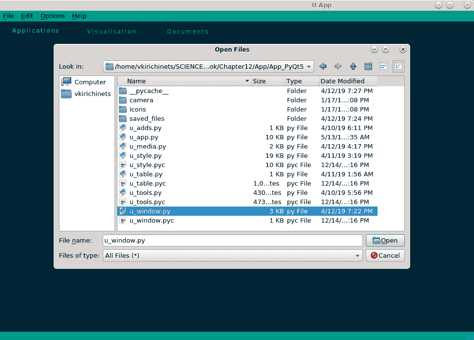
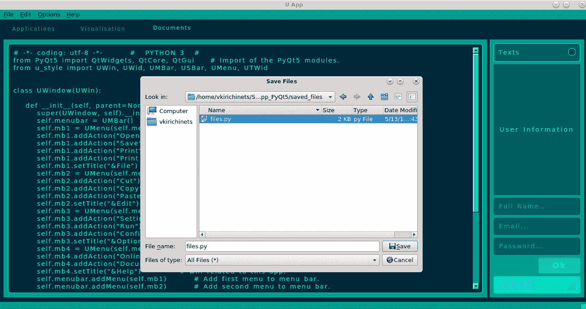
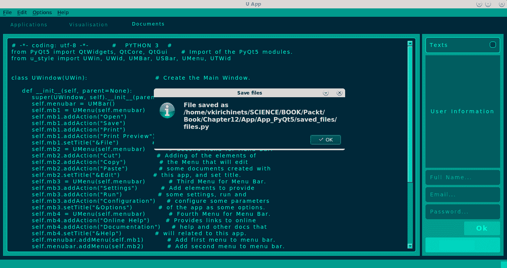
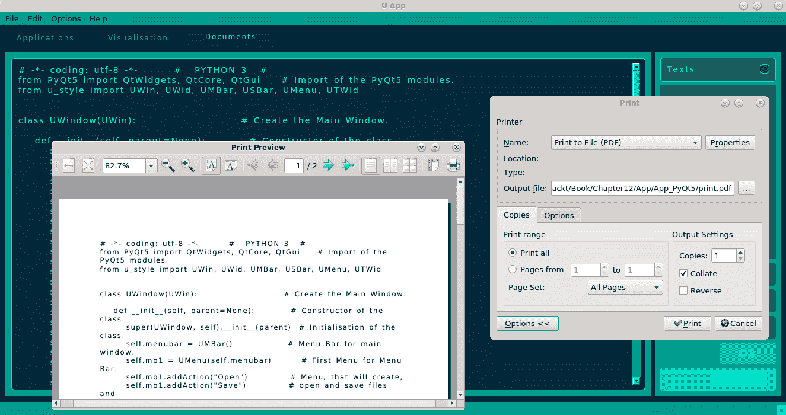

# 文件、打印机和其他对话框

任何具有 GUI 的应用程序都是为了产生操作而创建的。为了以用户友好的方式完成此操作，它需要具备一些基本功能，例如打开和保存文件的能力，在处理某些内容时通知用户，或者在出现错误时通知用户。为了在应用程序中实现这一点，我们可以使用各种打开和保存文件并通知用户事件已发生的对话框窗口。此外，如果用户的任务与文本处理相关，他们可能希望将文本打印成纸质形式或保存到文件中，例如 PDF。在本章中，我们将介绍 Qt 库提供的基本对话框窗口，并在应用程序中演示一些简单的打印实现，包括以下内容：

+   对话框窗口

+   消息框

+   字体和颜色对话框

+   文件

+   打印机

# 对话框窗口

对话框窗口最常用于实现用户与应用程序进程之间的通信。这些对话框窗口可以打开和保存文件，显示错误消息，允许用户在打印前更改打印机的设置，选择颜色和字体，等等。Qt 库为应用程序提供了最流行的对话框窗口。对话框窗口是一种可以是模态或非模态的小部件。模态对话框窗口在可视化时阻止其他应用程序窗口的输入。相比之下，非模态对话框窗口独立于应用程序窗口提供其功能。在此，我们将介绍对话框窗口的基类，即`QDialog`。此外，我们还将检查其他类，例如`QDialogButtonBox`，它构建按钮框。

# QDialog

此类是 Qt 中使用的对话框窗口的基类。几乎所有功能对话框都继承了这个类。其声明语法如下：

```py
dialog = QtWidgets.QDialog()
```

`QDialog`类通过以下各节中描述的函数增强了功能。

# 设置

这些函数将参数或属性设置到对话框窗口中：

`dialog.setModal(bool)`: 如果参数为`True`，则设置此对话框窗口为模态。

`dialog.setResult(int)`: 此操作将对话框窗口的结果代码设置为参数中指定的代码。

`dialog.setSizeGripEnabled(bool)`: 如果参数为`True`，则设置`QSizeGrip`类型的大小调整手柄以调整顶级窗口的大小。

`dialog.setVisible(bool)`: 如果参数为`True`，则设置此对话框窗口为可见。

# 是

此函数返回与该对话框窗口状态相关的布尔值（`bool`）：

`dialog.isSizeGripEnabled()`: 如果此对话框窗口启用了大小调整手柄，则返回`True`。

# 功能性

这些函数返回对话框窗口的当前值，通知您有关功能更改的信息，等等：

`dialog.accept()`: 此操作接受对话框，并将结果代码设置为`Accepted`，以隐藏模态对话框窗口。

`dialog.done(int)`: 这关闭对话框，并根据参数中指定的代码设置结果代码。

`dialog.exec()`: 这将显示并执行模态对话框，并返回对话框结果代码。

`dialog.exec_()`: 这将显示并执行模态对话框，并返回对话框结果代码。

`dialog.open()`: 这将打开并显示模态对话框窗口。

`dialog.reject()`: 当模态对话框隐藏时，此操作拒绝对话框并将结果代码设置为`Rejected`。

`dialog.result()`: 这返回模态对话框的结果代码，例如`Accepted`或`Rejected`。

# events

这些函数与事件相关，例如事件处理程序：

`dialog.closeEvent(QtGui.QCloseEvent)`: 当接收到对话框窗口关闭请求时，此事件处理程序会使用事件参数被调用。

`dialog.contextMenuEvent(QtGui.QContextMenuEvent)`: 此事件处理程序接收对话框窗口的上下文菜单事件。

`dialog.eventFilter(QtCore.QObject, QtCore.QEvent)`: 如果对话框窗口被安装为对象的（第一个参数）事件过滤器，则此事件处理程序将过滤事件。

`dialog.keyPressEvent(QtGui.QKeyEvent)`: 此事件处理程序接收带有参数传递的事件的对话框窗口按键事件。

`dialog.resizeEvent(QtGui.QResizeEvent)`: 此事件处理程序接收带有参数传递的事件的对话框窗口大小调整事件。

`dialog.showEvent(QtGui.QShowEvent)`: 此事件处理程序接收带有参数传递的事件的对话框窗口显示事件。

# signals

这些是`QDialog`类的可用信号：

`dialog.accepted()`: 当对话框被用户接受，或者通过调用`accept()`和`done()`函数时，会发出此信号。

`dialog.finished(int)`: 当用户或通过调用`accept()`、`done()`和`reject()`函数设置对话框的结果代码时，会发出此信号。

`dialog.rejected()`: 当对话框被用户拒绝，或者通过调用`reject()`和`done()`函数时，会发出此信号。

# 消息框

消息框用于通知用户应用程序中发生的事件。这些可以是带有消息、错误和其他事件的窗口。这些小部件是对话框窗口，它们提供与这些事件相关的功能。

# QMessageBox

此类通过询问与过程相关的问题并接收答案来实现用户与应用程序之间的通信。该框使用模态对话框窗口表示形式构建。此类的声明语法如下：

```py
mesage_box = QtWidgets.QMessageBox()
```

`QMessageBox`类继承自`QDialog`类，并通过以下各节中描述的函数增强了功能。

# add

这些函数向消息框添加元素：

`message_box.addButton(QtWidgets.QMessageBox.StandardButton)`: 这将在消息框中添加一个标准按钮，并返回一个按钮。

**`message_box.addButton(QtWidgets.QAbstractButton, QtWidgets.QMessageBox.ButtonRole)`**: 这将在消息框中添加一个按钮（第一个参数）并带有角色（第二个参数）。按钮角色如下：

+   `QtWidgets.QMessageBox.Ok`: 带有 `AcceptRole` 的确定按钮。

+   `QtWidgets.QMessageBox.Open`: 带有 `AcceptRole` 的打开按钮。

+   `QtWidgets.QMessageBox.Save`: 带有 `AcceptRole` 的保存按钮。

+   `QtWidgets.QMessageBox.Cancel`: 带有 `RejectRole` 的取消按钮。

+   `QtWidgets.QMessageBox.Close`: 带有 `RejectRole` 的关闭按钮。

+   `QtWidgets.QMessageBox.Discard`: 带有 `DestructiveRole` 的丢弃或不要保存（平台相关）按钮。

+   `QtWidgets.QMessageBox.Apply`: 带有 `ApplyRole` 的应用按钮。

+   `QtWidgets.QMessageBox.Reset`: 带有 `ResetRole` 的重置按钮。

+   `QtWidgets.QMessageBox.RestoreDefaults`: 带有 `ResetRole` 的恢复默认按钮。

+   `QtWidgets.QMessageBox.Help`: 带有 `HelpRole` 的帮助按钮。

+   `QtWidgets.QMessageBox.SaveAll`: 带有 `AcceptRole` 的全部保存按钮。

+   `QtWidgets.QMessageBox.Yes`: 带有 `YesRole` 的是按钮。

+   `QtWidgets.QMessageBox.YesToAll`: 带有 `YesRole` 的全部是按钮。

+   `QtWidgets.QMessageBox.No`: 带有 `NoRole` 的否按钮。

+   `QtWidgets.QMessageBox.NoToAll`: 带有 `NoRole` 的全部否按钮。

+   `QtWidgets.QMessageBox.Abort`: 带有 `RejectRole` 的中止按钮。

+   `QtWidgets.QMessageBox.Retry`: 带有 `AcceptRole` 的重试按钮。

+   `QtWidgets.QMessageBox.Ignore`: 带有 `AcceptRole` 的忽略按钮。

+   `QtWidgets.QMessageBox.NoButton`: 这是一个无效的按钮。

`message_box.addButton(str, QtWidgets.QMessageBox.ButtonRole)`: 这将在消息框中添加一个带有文本（第一个参数）和角色（第二个参数）的按钮，并返回一个推按钮。

# set

这些函数设置消息框的参数或属性：

`message_box.setCheckBox(QtWidgets.QCheckBox)`: 这将在消息框对话框中设置参数中指定的复选框。

`message_box.setDefaultButton(QtWidgets.QPushButton)`: 这将为消息框设置参数中指定的默认按钮。

`message_box.setDefaultButton(QtWidgets.QMessageBox.StandardButton)`: 这将为消息框设置参数中指定的默认按钮。

`message_box.setDetailedText(str)`: 这将设置消息框中指定的参数详细文本。详细文本是纯文本，将在详细信息区域显示。

`message_box.setEscapeButton(QtWidgets.QAbstractButton)`: 这将设置参数中指定的按钮，当按下 *Esc* 键时将被激活。

`message_box.setEscapeButton(QtWidgets.QMessageBox.StandardButton)`: 这将设置参数中指定的按钮，当按下 *Esc* 键时将被激活。

`message_box.setIcon(QtWidgets.QMessageBox.Icon)`: 这将设置与消息框一起使用的图标。可用的图标如下：

+   `QtWidgets.QMessageBox.NoIcon`—`0`: 消息框不显示图标。

+   `QtWidgets.QMessageBox.Information`—`1`: 显示信息标志的图标。

+   `QtWidgets.QMessageBox.Warning`—`2`: 显示警告标志的图标。

+   `QtWidgets.QMessageBox.Critical`—`3`: 显示临界问题标志的图标。

+   `QtWidgets.QMessageBox.Question`—`4`: 显示问题标志的图标。

`message_box.setIconPixmap(QtGui.QPixmap)`: 这为消息框的图标设置参数中指定的位图。

`message_box.setInformativeText(str)`: 这设置参数中指定的信息文本，它将是消息框中消息的完整描述。

`message_box.setStandardButtons(QtWidgets.QMessageBox.StandardButtons)`: 这将设置参数中指定的标准按钮，这些按钮将在消息框中使用。

`message_box.setText("Message Box Text")`: 这设置参数中指定的文本，该文本将在消息框中显示。

`message_box.setTextFormat(QtCore.Qt.TextFormat)`: 这为消息框中将显示的文本设置参数中指定的文本格式。

`message_box.setTextInteractionFlags(QtCore.Qt.TextInteractionFlags)`: 这设置参数中指定的文本交互标志，它将描述标签与用户输入的交互。

`message_box.setWindowModality(QtCore.Qt.WindowModality)`: 这为消息框设置参数中指定的模式。

`message_box.setWindowTitle(str)`: 这为这个对话框窗口消息框设置参数中指定的标题。

# 功能性

这些函数返回消息框的当前值，通知您关于功能的变化，等等：

`message_box.about(QtWidgets.QWidget, str, str)`: 这显示一个带有标题（第二个参数）和文本（第三个参数）关于第一个参数的简单框。

`message_box.aboutQt(QWidget, str)`: 这显示一个带有标题（第二个参数）关于 Qt 的简单框。

`message_box.button(QtWidgets.StandardButton)`: 这返回与参数中指定的按钮对应的`QtWidgets.QAbstractButton`类型的按钮。

`message_box.buttonRole(QtWidgets.QAbstractButton)`: 这返回参数中指定的按钮的`QtWidgets.QMessageBox.ButtonRole`类型的按钮角色。

`message_box.buttons()`: 这返回添加到消息框中的所有按钮的列表。

`message_box.checkBox()`: 这返回消息框上可用的`QtWidgets.QCheckBox`类型的复选框；否则返回`0`。

`message_box.clickedButton()`: 这返回被点击的`QtWidgets.QAbstractButton`类型的按钮。

`message_box.critical(QtWidgets.QWidget, str, str, QtWidgets.QMessageBox.StandardButton, QtWidgets.QMessageBox.StandardButton)`: 这将打开一个带有标题（第二个参数）、一些文本（第三个参数）的临界消息框，文本位于指定的小部件（第一个参数）之前，并且包含第四个和第五个参数指定的按钮。

`message_box.defaultButton()`: 这返回消息框的 `QtWidgets.QPushButton` 类型的默认按钮。

`message_box.detailedText()`: 这返回在详细信息区域显示的纯文本。

`message_box.escapeButton()`: 这返回当用户按下 *Esc* 键时将被激活的按钮。

`message_box.icon()`: 这返回与消息框一起使用的 `QtWidgets.QMessageBox.Icon` 类型的图标。

`message_box.iconPixmap()`: 这返回当前 `QtGui.QPixmap` 类型的图标位图。

`message_box.information(QtWidgets.QWidget, str, str, QtWidgets.QMessageBox.StandardButton, QtWidgets.QMessageBox.StandardButton)`: 这将在指定的窗口（第一个参数）前打开一个带有标题（第二个参数）、一些文本（第三个参数）的信息消息框，并使用第四个和第五个参数指定的按钮。

`message_box.informativeText()`: 这返回信息文本，例如消息框中消息的完整描述。

`message_box.open(QtCore.QObject, str)`: 这将一个信号连接到一个槽，接收器（第一个参数）和成员（第二个参数）。

`message_box.question(QtWidgets.QWidget, str, str, QtWidgets.QMessageBox.StandardButton, QtWidgets.QMessageBox.StandardButton)`: 这将在指定的窗口（第一个参数）前打开一个带有标题（第二个参数）、一些文本（第三个参数）的问题消息框，并使用第四个和第五个参数指定的按钮。

`message_box.removeButton(QtWidgets.QAbstractButton)`: 这将从消息框中移除指定的参数中的按钮。

`message_box.standardButton(QtWidgets.QAbstractButton)`: 这返回与参数指定的按钮相对应的 `QtWidgets.QMessageBox.StandardButton` 类型的按钮。

`message_box.standardButtons()`: 这返回与消息框一起使用的 `QtWidgets.QMessageBox.StandardButtons` 类型的标准按钮。

`message_box.standardIcon(QtWidgets.QMessageBox.Icon)`: 这返回用于消息框标准图标的 `QtGui.QPixmap` 类型的位图。

`message_box.text()`: 这返回在消息框中显示的文本。

`message_box.textFormat()`: 这返回用于消息框中文本的 `QtCore.Qt.TextFormat` 类型的格式。

`message_box.textInteractionFlags()`: 这返回用于消息框文本交互的 `QtCore.Qt.TextInteractionFlags` 类型的标志。

`message_box.warning(QtWidgets.QWidget, str, str, QtWidgets.QMessageBox.StandardButton, QtWidgets.QMessageBox.StandardButton)`: 这将在指定的窗口（第二个参数）前打开一个带有标题（第二个参数）、一些文本（第三个参数）的警告消息框，并使用第四个和第五个参数指定的按钮。

# 事件

这些函数与事件相关，例如事件处理器：

`message_box.changeEvent(QtCore.QEvent)`: 这处理消息框的状态变化。

`message_box.closeEvent(QtGui.QCloseEvent)`: 当窗口系统收到消息框的关闭请求时，会调用带有事件参数的事件处理器。

`message_box.event(QtCore.QEvent)`: 这接收发送给对象的的事件，如果事件被识别并处理，则应返回`True`。

`message_box.keyPressEvent(QtGui.QKeyEvent)`: 此事件处理器接收传递给参数的消息框的按键事件。

`message_box.resizeEvent(QtGui.QResizeEvent)`: 此事件处理器接收传递给参数的消息框的尺寸变化事件。

`message_box.showEvent(QtGui.QShowEvent)`: 此事件处理器接收传递给参数的消息框的显示事件。

# signals

`QMessageBox`类有以下可用信号：

`message_box.buttonClicked(QtWidgets.QAbstractButton)`: 当在消息框内部点击按钮时，会发出此信号。

# QErrorMessage

此类显示错误消息对话框窗口。应用程序中可能会发生错误，此窗口会通知用户这些事件。此类的声明语法如下：

```py
error_message = QtWidgets.QErrorMessage()
```

`QErrorMessage`继承自`QDialog`类，并通过以下章节中描述的函数增强了其功能。

# functional

这些函数返回错误消息对话框的当前值，通知您有关功能的变化，等等：

`error_message.qtHandler()`: 这会返回一个`QtWidgets.QErrorMessage`类型的对象，该对象输出默认的 Qt 消息。

`error_message.showMessage(str)`: 这会显示参数中指定的消息。

`error_message.showMessage(str, str)`: 这会显示一个消息（第一个参数），并带有请求的消息类型（第二个参数）。

# events

这些函数与事件相关，例如事件处理器：

`error_message.changeEvent(QtCore.QEvent)`: 这处理错误消息对话框的状态变化。

# 字体和颜色对话框

Qt 框架为应用程序提供了标准对话框，用于选择字体和颜色。它们可以用来更改某些文本的字体或元素的色彩。

# QFontDialog

此类实现了字体选择对话框。所选字体可用于文本字段、标签以及其他应用程序元素。此类的声明语法如下：

```py
font_dialog = QtWidgets.QFontDialog()
```

`QFontDialog`继承自`QDialog`类，并通过以下章节中描述的函数增强了其功能：

# set

这些函数设置字体对话框的参数或属性：

`font_dialog.setCurrentFont(QtGui.QFont)`: 这会将参数中指定的字体设置为字体对话框中的高亮字体。

`font_dialog.setOption(QtWidgets.QFontDialog.FontDialogOption, bool)`: 如果第二个参数为`True`，则设置字体对话框选项。可用的选项如下：

+   `QtWidgets.QFontDialog.NoButtons`: 无按钮的字体对话框

+   `QtWidgets.QFontDialog.DontUseNativeDialog`: 作为 Qt 标准实现的字体对话框

+   `QtWidgets.QFontDialog.ScalableFonts`: 带有可缩放字体的字体对话框

+   **`QtWidgets.QFontDialog.NonScalableFonts`**: 带有不可缩放字体的字体对话框

+   **`QtWidgets.QFontDialog.MonospacedFonts`**: 带有等宽字体的字体对话框

+   **`QtWidgets.QFontDialog.ProportionalFonts`**: 带有比例字体的字体对话框

`font_dialog.setOptions(QtWidgets.QFontDialog.FontDialogOptions)`: 这将设置将用于字体对话框的选项。

# 功能

这些函数返回字体对话框的当前值，通知您有关功能更改等更多信息：

`font_dialog.currentFont()`: 此函数返回`QtGui.QFont`类型的当前字体。

`font_dialog.getFont(QtWidgets.QWidget)`: 此函数返回字体并执行模态字体对话框，指定对话框的父窗口。

`font_dialog.getFont(QtGui.QFont, QtWidgets.QWidget, str, QtWidgets.QFontDialog.FontDialogOptions)`: 此函数返回字体并执行模态字体对话框。如果用户点击 OK 按钮，则返回所选字体。如果用户点击取消，则返回初始字体（第一个参数）。它由父窗口小部件（第二个参数）、对话框窗口的标题（第三个参数）和选项（第四个参数）构成。

`font_dialog.open(QtCore.QObject, str)`: 这将信号连接到槽，其中接收器（第一个参数）和成员（第二个参数）。

`font_dialog.options()`: 此函数返回用于字体对话框的`QtWidgets.QFontDialog.FontDialogOptions`类型的选项。

`font_dialog.selectedFont()`: 通过点击 OK 按钮或以其他方式接受时，此函数返回`QtGui.QFont`类型的所选字体。

`font_dialog.testOption(QtWidgets.QFontDialog.FontDialogOption)`: 如果参数中指定的字体对话框选项被启用，则此函数返回`True`；否则，它返回`False`。

# 事件

此函数与事件相关：

`font_dialog.changeEvent(QtCore.QEvent)`: 这处理字体对话框的状态变化。

# 信号

`QFontDialog`类的可用信号如下：

`font_dialog.currentFontChanged(QtGui.QFont)`: 当字体对话框的当前字体更改时，会发出此信号，并通过参数传递新字体。

`font_dialog.fontSelected(QtGui.QFont)`: 当在字体对话框中选择字体时，会发出此信号，并通过参数传递所选字体。

# QColorDialog

此类创建一个用于选择颜色的对话框窗口。所选颜色可用于着色文本、应用程序窗口或其他元素。此类的声明语法如下：

```py
color_dialog = QtWidgets.QColorDialog()
```

`QColorDialog`类继承自`QDialog`类，并通过以下各节中描述的函数增强了其功能。

# 设置

这些函数设置颜色对话框的参数和属性：

`color_dialog.setCurrentColor(QtGui.QColor)`: 这设置将在颜色对话框中高亮显示的颜色（在参数中指定）。

`color_dialog.setCustomColor(int, QtGui.QColor)`: 这设置在索引（第一个参数）处的自定义颜色（第二个参数）。

`color_dialog.setOption(QtWidgets.QColorDialog.ColorDialogOption, bool)`: 如果第二个参数为 `True`，则设置颜色对话框选项。可用的选项如下：

+   `QtWidgets.QColorDialog.NoButtons`: 无按钮的颜色对话框。

+   `QtWidgets.QColorDialog.DontUseNativeDialog`: 作为 Qt 标准的颜色对话框。

+   `QtWidgets.QColorDialog.ShowAlphaChannel`: 可以选择颜色的 alpha 成分。

`color_dialog.setOptions(QtWidgets.QFontDialog.FontDialogOptions)`: 这设置将用于颜色对话框的选项。

`color_dialog.setStandardColor(int, QtGui.QColor)`: 这在索引（第一个参数）处设置标准颜色（第二个参数）。

# 功能

这些函数返回颜色对话框的当前值，通知您有关功能性的更改，等等：

`color_dialog.currentColor()`: 这返回 `QtGui.QColor` 类型的当前颜色。

`color_dialog.customColor(int)`: 这返回在参数中指定的索引处的 `QtGui.QColor` 类型的自定义颜色。

`color_dialog.customCount()`: 这返回颜色对话框支持的自定义颜色的数量。

`color_dialog.getFont(QtGui.QColor, QtWidgets.QWidget, str, QtWidgets.QColorDialog.ColorDialogOptions)`: 这返回颜色并执行模态颜色对话框。当用户点击“确定”按钮时，它返回所选颜色。如果用户点击“取消”，则返回初始颜色（第一个参数）。它是通过父小部件（第二个参数）、对话框窗口的标题（第三个参数）和选项（第四个参数）构建的。

`color_dialog.open(QtCore.QObject, str)`: 这将信号连接到具有接收器（第一个参数）和成员（第二个参数）的槽。

`color_dialog.options()`: 这返回用于此颜色对话框的 `QtWidgets.QColorDialog.ColorDialogOptions` 类型的选项。

`color_dialog.selectedColor()`: 通过点击或按下“确定”按钮或以其他方式接受，返回 `QtGui.QColor` 类型的所选颜色。

`color_dialog.standardColor(int)`: 这返回在参数中指定的索引处的 `QtGui.QColor` 类型的标准颜色。

`color_dialog.testOption(QtWidgets.QColorDialog.ColorDialogOption)`: 如果参数中指定的颜色对话框选项被启用，则返回 `True`；否则，返回 `False`。

# 事件

这些函数与以下事件相关：

`color_dialog.changeEvent(QtCore.QEvent)`: 这处理颜色对话框的状态变化。

# 信号

`QColorDialog` 类可用的信号如下：

+   `color_dialog.currentColorChanged(QtGui.QColor)`: 当颜色对话框的当前颜色发生变化时，会发出此信号，新颜色通过参数传递。

+   `color_dialog.colorSelected(QtGui.QColor)`: 当在颜色对话框中选择颜色时，会发出此信号，所选颜色通过参数传递。

# 文件

在本节中，我们将描述提供在应用程序中打开或保存文件功能的对话框窗口。此外，我们还将涵盖文件的读取和写入。几乎所有的 GUI 应用程序都可以操作或具有操作各种文件的能力。在 Qt 库中，此文件对话框窗口可以通过`QFileDialog`类实现。

# QFileDialog

此类创建一个对话框窗口，用于在应用程序中进行基本的文件操作，例如打开文件、以指定名称保存文件或打开包含文件的目录。此类在应用程序中的声明语法如下：

```py
file_dialog = QtWidgets.QFileDialog()
```

`QFileDialog`类继承自`QDialog`类，并通过以下各节中描述的函数增强了其功能。

# 设置

这些函数用于设置文件对话框的参数或属性：

`file_dialog.setAcceptMode(QtWidgets.QFileDialog.AcceptMode)`: 这将对话框的接受模式设置为参数中指定的模式，这解释了文件对话框用于打开或保存文件。可用的模式如下：

+   `QtWidgets.QFileDialog.AcceptOpen`—`0`: 打开文件的对话框。

+   `QtWidgets.QFileDialog.AcceptSave`—`1`: 保存文件的对话框。

`file_dialog.setDefaultSuffix(str)`: 这将为文件设置默认后缀，该后缀由参数指定，例如**`.txt`**或**`.py`**扩展名。

`file_dialog.setDirectory(str)`: 这将文件对话框的当前目录设置为参数中指定的目录。

`file_dialog.setDirectory(QtCore.QDir)`: 这将文件对话框的当前目录设置为参数中指定的目录。

`file_dialog.setDirectoryUrl(QtCore.QUrl)`: 这将文件对话框的当前目录 URL 设置为参数中指定的 URL。

`file_dialog.setFileMode(QtWidgets.QFileDialog.FileMode)`: 这将文件对话框的文件模式设置为参数中指定的模式。它描述了可以选择的文件的数量和类型。可用的模式如下：

+   `QtWidgets.QFileDialog.AnyFile`—`0`: 任何文件名。

+   `QtWidgets.QFileDialog.ExistingFile`—`1`: 如果存在，则单个文件名。

+   `QtWidgets.QFileDialog.Directory`—`2`: 目录名。

+   `QtWidgets.QFileDialog.ExistingFiles`—`3`: 如果存在，则一个或多个文件名。

`file_dialog.setFilter(QtCore.QDir.Filters)`: 这将用于定义要显示的文件类型的过滤器设置为参数中指定的过滤器。

`file_dialog.setHistory([str])`: 这将文件对话框的浏览历史设置为参数中指定的路径列表。

`file_dialog.setIconProvider(QtWidgets.QFileIconProvider)`: 这设置与文件对话框一起使用的图标提供者，该提供者由参数指定。

`file_dialog.setItemDelegate(QtWidgets.QAbstractItemDelegate)`: 这设置用于在文件对话框视图中的项目渲染的项代理，该代理由参数指定。

`file_dialog.setLabelText(QtWidgets.QFileDialog.DialogLabel, str)`: 这设置将显示在标签（第一个参数）中的文本（第二个参数）。

`file_dialog.setMimeTypeFilters([str])`: 这设置参数中指定的过滤器，作为文件对话框中将使用的**多用途互联网邮件扩展**（**MIME**）类型的列表。

`file_dialog.setNameFilter(str)`: 这设置参数中指定的过滤器，作为文件对话框中将使用的文件类型。

`file_dialog.setNameFilters([str])`: 这设置参数中指定的过滤器，作为文件对话框中将使用的文件类型的列表。

`file_dialog.setOption(QtWidgets.QFileDialog.Option, bool)`: 如果第二个参数是`True`，则设置将用于文件对话框的选项（第一个参数）。

`file_dialog.setOptions(QtWidgets.QFileDialog.Options)`: 这设置将用于文件对话框的选项。

`file_dialog.setProxyModel(QtCore.QAbstractProxyModel)`: 这设置视图的模型为参数中指定的代理模型。

`file_dialog.setSidebarUrls([QtCore.QUrl])`: 这设置文件对话框侧边栏的 URL，该 URL 由参数指定。

`file_dialog.setSupportedSchemes([str])`: 这设置文件对话框允许用户导航的 URL 方案。

`file_dialog.setViewMode(QtWidgets.QFileDialog.ViewMode)`: 这设置用于在文件对话框中显示目录和文件的视图模式，该模式由参数指定。可用的模式如下：

+   `QtWidgets.QFileDialog.Detail`—`0`: 目录中每个项目的图标、名称和详细信息。

+   `QtWidgets.QFileDialog.List`—`1`: 目录中每个项目的图标和名称。

# functional

这些函数返回文件对话框的当前值，通知您有关功能更改等：

`file_dialog.acceptMode()`: 这返回文件对话框的`QtWidgets.QFileDialog.AcceptMode`类型的接受模式。

`file_dialog.defaultSuffix()`: 如果未指定其他后缀，则返回添加为文件名扩展名的默认后缀。

`file_dialog.directory()`: 这返回与文件对话框一起显示的`QtCore.QDir`类型的目录。

`file_dialog.directoryUrl()`: 这返回与文件对话框一起显示的目录的`QtCore.QUrl`类型的 URL。

`file_dialog.fileMode()`: 这返回与对话框一起使用的`QtWidgets.QFileDialog.FileMode`类型的文件模式。

**`file_dialog.filter()`**: 这返回用于在此对话框中显示文件时使用的`QtCore.QDir.Filters`类型的过滤器。

`file_dialog.getExistingDirectory(QtWidgets.QWidget, str, str, QtWidgets.QFileDialog.Options)`: 这将创建一个模态文件对话框，包含父窗口（第一个参数）、标题（第二个参数）、工作目录（第三个参数）和选项（第四个参数）。它返回所选的目录。可用的选项如下：

+   `QtWidgets.QFileDialog.ShowDirsOnly`: 文件对话框只显示目录。

+   `QtWidgets.QFileDialog.DontUseNativeDialog`: 文件对话框使用 Qt 标准对话框。

+   `QtWidgets.QFileDialog.DontResolveSymlinks`: 文件对话框不会解析符号链接。

+   `QtWidgets.QFileDialog.DontConfirmOverwrite`: 如果选中了现有文件，文件对话框不会要求确认覆盖。

+   `QtWidgets.QFileDialog.ReadOnly`: 模态对话框为只读。

+   `QtWidgets.QFileDialog.HideNameFilterDetails`: 文件对话框隐藏文件名过滤器详情。

+   `QtWidgets.QFileDialog.DontUseCustomDirectoryIcons`: 文件对话框使用默认目录图标。

`file_dialog.getExistingDirectoryUrl(QtWidgets.QWidget, str, QtCore.QUrl, QtWidgets.QFileDialog.Options, [str])`: 这将创建一个模态文件对话框，包含父窗口（第一个参数）、标题（第二个参数）、工作本地/远程目录（第三个参数）、选项（第四个参数）以及限制 URL 的受支持方案（第五个参数）。它返回所选的`QtCore.QUrl`类型的目录。

`file_dialog.getOpenFileName(QtWidgets.QWidget, str, str, str, str, QtWidgets.QFileDialog.Options)`: 这将创建一个模态文件对话框，包含父窗口（第一个参数）、标题（第二个参数）、工作目录（第三个参数）、文件过滤器（第四个参数）以及这些文件的选定过滤器（第五个参数）和选项（第六个参数）。它返回所选的文件。

`file_dialog.getOpenFileNames(QtWidgets.QWidget, str, str, str, str, QtWidgets.QFileDialog.Options)`: 这将创建一个模态文件对话框，包含父窗口（第一个参数）、标题（第二个参数）、工作目录（第三个参数）、文件过滤器（第四个参数）以及这些文件的选定过滤器（第五个参数）和选项（第六个参数）。它返回一个或多个选定的文件。

`file_dialog.getOpenFileUrl(QtWidgets.QWidget, str, QtCore.QUrl, str, str, QtWidgets.QFileDialog.Options, [str])`: 这将创建一个模态文件对话框，包含父窗口（第一个参数）、标题（第二个参数）、工作本地/远程目录（第三个参数）、文件过滤器（第四个参数）以及这些文件的选定过滤器（第五个参数）、选项（第六个参数）以及限制 URL 的受支持方案（第七个参数）。它返回所选的文件。

`file_dialog.getOpenFileUrls(QtWidgets.QWidget, str, QtCore.QUrl, str, str, QtWidgets.QFileDialog.Options, [str])`: 这创建一个模态文件对话框，具有父对象（第一个参数）、标题（第二个参数）、工作本地/远程目录（第三个参数）、用于这些文件的过滤器（第四个参数）、用于这些文件的选定过滤器（第五个参数）、选项（第六个参数）以及用于限制 URL 的支持方案（第七个参数）。它返回一个或多个选定的文件。

`file_dialog.getSaveFileName(QtWidgets.QWidget, str, str, str, str, QtWidgets.QFileDialog.Options)`: 这创建一个模态文件对话框，具有父对象（第一个参数）、标题（第二个参数）、工作目录（第三个参数）、用于这些文件的过滤器（第四个参数）、用于这些文件的选定过滤器（第五个参数）和选项（第六个参数）。它返回一个文件名，并且这个文件名不应已经存在。

`file_dialog.getSaveFileUrl(QtWidgets.QWidget, str, QtCore.QUrl, str, str, QtWidgets.QFileDialog.Options, [str])`: 这创建一个模态文件对话框，具有父对象（第一个参数）、标题（第二个参数）、工作本地/远程目录（第三个参数）、用于这些文件的过滤器（第四个参数）、用于这些文件的选定过滤器（第五个参数）、选项（第六个参数）以及用于限制 URL 的支持方案（第七个参数）。它返回一个文件名。

`file_dialog.history()`: 这返回文件对话框的浏览历史记录，作为一个路径列表。

`file_dialog.iconProvider()`: 这返回文件对话框的 `QtWidgets.QFileIconProvider` 类型的图标提供者。

`file_dialog.itemDelegate()`: 这返回用于在文件对话框的视图中渲染项的 `QtWidgets.QAbstractItemDelegate` 类型的项代理。

`file_dialog.labelText(QtWidgets.QFileDialog.DialogLabel)`: 这返回文件对话框中指定参数的标签显示的文本。

`file_dialog.mimeTypeFilters()`: 这返回文件对话框的 MIME 类型过滤器。

`file_dialog.nameFilters()`: 这返回文件对话框的文件类型过滤器。

`file_dialog.open(QtCore.QObject, str)`: 这将一个信号连接到一个槽，其中接收器（第一个参数）是一个成员（第二个参数）。

`file_dialog.options()`: 这返回用于文件对话框的 `QtWidgets.QFileDialog.Options` 类型的选项。

`file_dialog.proxyModel()`: 这返回与文件对话框一起使用的 `QtCore.QAbstractProxyModel` 类型的代理模型。

`file_dialog.restoreState(QtCore.QByteArray)`: 这将文件对话框的布局、历史记录和当前目录恢复到参数中指定的状态。

`file_dialog.saveState()`: 这保存文件对话框的布局、历史记录和当前目录。

`file_dialog.selectFile(str)`: 这将选择文件对话框参数中指定的文件名。

`file_dialog.selectMimeTypeFilter(str)`: 这将选择文件对话框参数中指定的 MIME 类型过滤器。

`file_dialog.selectNameFilter(str)`: 这将选择文件对话框参数中指定的文件类型过滤器。

`file_dialog.selectUrl(QtCore.QUrl)`: 这将选择文件对话框参数中指定的 URL。

`file_dialog.selectedFiles()`: 这将返回文件对话框中选定的文件，作为包含绝对路径的字符串列表。

`file_dialog.selectedMimeTypeFilter()`: 这将返回文件对话框中选定的文件的 MIME 类型。

`file_dialog.selectedNameFilter()`: 这将返回文件对话框中选定的过滤器。

`file_dialog.selectedUrls()`: 这将返回文件对话框中选定的文件 URL 列表。

`file_dialog.sidebarUrls()`: 这将返回当前侧边栏的 URL 列表。

`file_dialog.supportedSchemes()`: 这将返回支持的 URL 方案列表。

`file_dialog.testOption(QtWidgets.QFileDialog.Option)`: 如果参数中指定的选项已启用文件对话框，则返回`True`；否则，返回`False`。

`file_dialog.viewMode()`: 这将返回与文件对话框一起使用的**`QtWidgets.QFileDialog.ViewMode`**类型的视图模式。

# 事件

此函数与事件相关：

`file_dialog.changeEvent(QtCore.QEvent)`: 这处理文件对话框的状态变化。

# 信号

`QFileDialog`类的可用信号如下：

`file_dialog.currentChanged(str)`: 当文件对话框中的当前文件在本地操作中更改时，会发出此信号。新文件路径作为参数传递。

`file_dialog.currentUrlChanged(QtCore.QUrl)`: 当文件对话框中的当前文件更改时，会发出此信号。新文件的 URL 作为参数传递。

`file_dialog.directoryEntered(str)`: 当用户在文件对话框中进入目录进行本地操作时，会发出此信号，目录作为参数传递。

`file_dialog.directoryUrlEntered(QtCore.QUrl)`: 当用户在文件对话框中进入目录时，会发出此信号，目录的 URL 作为参数传递。

`file_dialog.fileSelected(str)`: 当文件对话框中的选择更改并且对话框被接受时，会发出此信号，选定的文件作为参数传递。

`file_dialog.filesSelected([str])`: 当文件对话框中的选择更改并且对话框被接受时，会发出此信号，选定的文件列表作为参数传递。

`file_dialog.filterSelected(str)`: 当在文件对话框中选择过滤器时，会发出此信号。选定的过滤器作为参数传递。

`file_dialog.urlSelected(QtCore.QUrl)`: 当文件对话框中的选择发生变化并且对话框被接受时，会发出此信号，所选 URL 作为参数传递。

`file_dialog.urlsSelected(QtCore.QUrl)`: 当文件对话框中的选择发生变化并且对话框被接受时，会发出此信号，所选 URL 列表作为参数传递。

# 文件对话框示例

为了在我们的应用程序中实现文件对话框，我们将使用 Python 标准库工具打开和读取选定的文件。此外，应用程序文本字段的文本将被保存到文件对话框指定的文件中。为此，我们需要在`u_app.py`文件中使用以下行添加`files()`函数：

1.  在`UApp`类底部添加一个名为`files()`的函数：

```py
...
 ...
    def files(self, action):
        fd = QtWidgets.QFileDialog()
        if action.text() == "Open":
            fdf = fd.getOpenFileNames(
                    self, caption="Open Files",
                    directory=QtCore.QDir.homePath())
        ...
    ...
...
```

此函数将使用`QFileDialog`类的`getOpenFileNames()`静态方法来实现打开可用文件的文件对话框。

1.  现在将调用`files()`函数的信号添加到`UApp`类的`__init__()`函数底部：

```py
...
class UApp(UWindow, UTools):

    def __init__(self, parent=None):
        ...
        self.mb1.triggered.connect(self.files)  # Calling files function.
        ...
    ...
...
```

顶部面板菜单使用`triggered()`信号调用与文件操作相关的函数。我们可以通过在应用程序顶部的文件选项中选择“打开”来运行`u_app.py`文件。文件对话框窗口将类似于以下截图：



1.  现在我们需要添加 Python 标准库工具来打开和读取此文件对话框返回的文件。

要实现这一点，请将以下行添加到`files()`函数中：

```py
...
    ...
    def files(self, action):
        ...
        if action.text() == "Open":
            ...
            if len(fdf[0]) > 0:
                self.text_edit.clear()
                for of in fdf[0]:
                    self.tabwid.setCurrentIndex(2)
                    try:
                        openf = open(of, 'r')
                        self.text_edit.append(str(openf.read()))
                        continue
                    except Exception
                        pass
                    try:
                        openf = open(of, 'rb')
                        self.text_edit.append(str(openf.read()))
                    except Exception:
                        pass
        ...
    ...
...
```

当点击“打开”按钮时，文件对话框将返回带有路径的所选文件或文件。Python 标准库有一个名为`open()`的内置函数，该函数用于打开文件进行读写。此`open()`函数将为所选文件列表中的每个循环打开文件，读取该文件，并将内容追加到应用程序的文本字段中。结果如下：



1.  现在将以下行添加到`files`函数中，以实现使用文件对话框保存文件的功能：

```py
...
    ...
    def files(self, action):
        ...
        if action.text() == "Open":
            ...
        if action.text() == "Save":
            fdf = fd.getSaveFileName(self,
                        caption="Save Files",
                        directory=QtCore.QDir.homePath())
            if fdf[0] != "":
                self.tabwid.setCurrentIndex(2)
                try:
                    open(fdf[0], 'w').write(
                            self.text_edit.toPlainText())
                    success = True
                except Exception:
                    pass
                if success != True:
                    try:
                        open(fdf[0], 'wb').write(
                             self.text_edit.toPlainText())
                        success = True
                    except Exception:
                        pass
                if success == True:
                    self.info_message(fpath=fdf[0],
                        txt="File saved as", types="info")
                else:
                    self.info_message(fpath=fdf[0],
                                  txt="File don`t saved",
                                         types="critical")
    ...
...
```

当选择“保存”选项时，将显示类似的文件对话框。我们可以选择目录和文件名，并将文本字段的文本保存到该文件中。我们可以在`App/App_PySide2/`和`App/App_PyQt5/`中的`saved_files/`文件夹内创建文件夹以保存文件。

1.  将`info_message()`函数添加到`UApp`类底部，以通知用户文件已保存：

```py
...
    ...
    def info_message(self, fpath='', txt='', types="info"):
        message_box = QtWidgets.QMessageBox(self)
        message_box.setStyleSheet("color: #FFFFFF;")
        message_box.setFont(QtGui.QFont("Verdana", 12, 77))
        message_box.setWindowTitle("Save files")
        if types == "info":
            message_box.setIcon(
                         QtWidgets.QMessageBox.Information)
        if types == "critical":
            message_box.setIcon(
                            QtWidgets.QMessageBox.Critical) 
        message_box.addButton(QtWidgets.QMessageBox.Ok)
        message_txt = "%s\n%s" %(txt, fpath)
        message_box.setText(message_txt)
        message_box.exec_()
...
```

此函数创建了一个消息框，当文件以路径保存时，将通知用户。保存文件的结果如下：



此消息框继承了应用程序的样式，并具有自定义的可能性。

# QPrinter

许多应用程序允许用户打印创建的文档或内容。Qt 库提供了一个基本的对话框来打印创建的内容。`QPrinter`类也可用，它提供了与默认系统打印机设备的自定义和操作，以及其他功能，如打印机设置。要了解此类的功能，建议您查看官方 Qt 文档。在此，我们将描述和实现`QPrintDialog`和`QPrintPreviewDialog`类。这两个类都包含在`QtPrintSupport`模块中。要在应用程序中使用这些类，我们需要将以下内容添加到`u_app.py`文件中。

在`PyQt5`的`u_app.py`文件中添加此`import`语句：

```py
...
from PyQt5 import QtPrintSupport
...
```

此外，将以下`import`语句添加到`PySide2`的`u_app.py`文件中：

```py
...
from PySide2 import QtPrintSupport
...
```

# QPrintDialog

此类提供了一个用于选择和配置选项以及打印内容的对话框。我们可以更改打印文档的设置，例如副本数量。此类在应用程序中的声明语法如下：

```py
print_dialog = QtPrintSupport.QPrintDialog()
```

如下节所述，`QPrintDialog`类通过以下功能增强了功能。

# set

这些函数设置打印对话框的参数和属性：

`print_dialog.setOption(QtPrintSupport.QAbstractPrintDialog.PrintDialogOption, bool)`: 如果第二个参数为`True`，则使用此打印对话框启用（第一个参数指定的）选项。

`print_dialog.setOptions(QtPrintSupport.QAbstractPrintDialog.PrintDialogOptions)`: 此函数设置参数中指定的选项，这些选项将与此打印对话框一起启用。

# functional

这些函数返回打印对话框的当前值，通知您有关功能更改的信息，等等：

`print_dialog.open(QtCore.QObject, str)`: 此函数将信号连接到槽，其中接收器（第一个参数）和成员（第二个参数）。

`print_dialog.options()`: 此函数返回用于此打印对话框的`QtPrintSupport.QAbstractPrintDialog.PrintDialogOptions`类型的选项。

`print_dialog.testOption(QtPrintSupport.QAbstractPrintDialog.PrintDialogOption)`: 如果参数指定的选项为此打印对话框启用，则返回`True`；否则返回`False`。

# signals

以下是与`QPrintDialog`类相关的信号：

`print_dialog.accepted(QtPrintSupport.QPrinter)`: 当传入参数的打印机接受打印对话框中设置的值时，会发出此信号。

# QPrintPreviewDialog

此类创建了一个用于在打印前预览内容的对话框。我们可以更改文档设置，例如副本数量。此类的声明语法如下：

```py
print_preview = QtPrintSupport.QPrintPreviewDialog()
```

如下节所述，`QPrintPreviewDialog`类通过以下功能增强了功能。

# functional

这些函数返回打印预览的当前值，通知您有关功能更改的信息，等等：

`print_preview.open(QtCore.QObject, str)`: 这将一个信号连接到一个槽，其中接收器（第一个参数）和成员（第二个参数）。

`print_preview.printer()`: 这返回与打印预览对话框一起使用的当前 `QtPrintSupport.QPrinter` 类型的打印机。

# 信号

这个信号与 `QPrintPreviewDialog` 类一起可用：

`print_preview.paintRequested(QtPrintSupport.QPrinter)`: 当预览对话框生成一组预览页面时，会发出此信号，打印机实例通过参数传入。

# 一个 QPrinter 示例

让我们在应用程序中实现打印机支持。首先，在应用程序顶部面板中添加选择选项，例如 `打印` 和 `打印预览`。为此，我们需要向 `u_window.py` 文件的 `UWindow` 类添加新选项：

1.  将以下选项添加到顶部面板文件部分的菜单中：

```py
...
class UWindow(UWin):

    def __init__(self, parent=None):
        ...
        self.mb1.addAction("Print")
        self.mb1.addAction("Print Preview")
    ...
...
```

文件菜单部分的这些选项将打印文本或打开打印文档的预览。要使用这些打印机对话框，我们需要使用 `QPrinter` 类声明打印机。这将用于使用系统打印机打印文档，或者以另一种方式，例如打印到 PDF 文件。

1.  我们需要向 `u_app.py` 文件中添加以下行。

将 `QPrinter` 类添加到 `UApp` 类的 `__init__` 函数底部：

```py
...
class UApp(UWindow, UTools):

    def __init__(self, parent=None):
        ...
        self.print_device = QtPrintSupport.QPrinter()
    ...
...
```

这在应用程序中创建了 `QPrinter` 类的实例。

1.  现在将打印和打印预览对话框添加到 `UApp` 类的 `files` 函数中：

```py
...
    ...
    def files(self, action):
        ...
        if action.text() == "Save":
            ...
        if action.text() == "Print":
            print_dialog = QtPrintSupport.QPrintDialog(
                                               self.print_device)
            if print_dialog.exec_() == QtWidgets.QDialog.Accepted:
                self.text_edit.print_(print_dialog.printer())
        if action.text() == "Print Preview":
            print_dialog = QtPrintSupport.QPrintPreviewDialog(
                                               self.print_device)
            print_dialog.setWindowTitle("Print Preview")
            print_dialog.setWindowIcon(
                                QtGui.QIcon("Icons/python1.png"))
            print_dialog.paintRequested.connect(
                                           self.text_edit.print_)
            print_dialog.exec_()
    ...
...
```

当选择文件部分选项时，`triggered()` 信号会调用带有 `action` 参数的 `files()` 函数，该参数将是所选选项的文本。我们可以运行 `u_app.py` 文件，并应该看到以下结果：



选择 `打印预览` 和 `打印` 选项将显示打印和预览要打印文本的对话框。

# 摘要

在本章中，我们探讨了在 GUI 应用程序中实现对话框的基本原则。这里并未涵盖 Qt 中所有的对话框。例如 `QInputDialog`、`QProgressDialog`（带有进度条的对话框）和 `QWizard`（在应用程序中创建向导框架的对话框），都可以使用。对于打印，有 `QPageSetupDialog`，用于配置与页面相关的选项。此外，可以通过不表示对话框窗口的类扩展打印功能，这些类非常有用，例如 `QPrinterInfo` 和 `QPrintPreviewWidget`。

在下一章中，我们将介绍布局，即安排应用程序中项目的方式。
