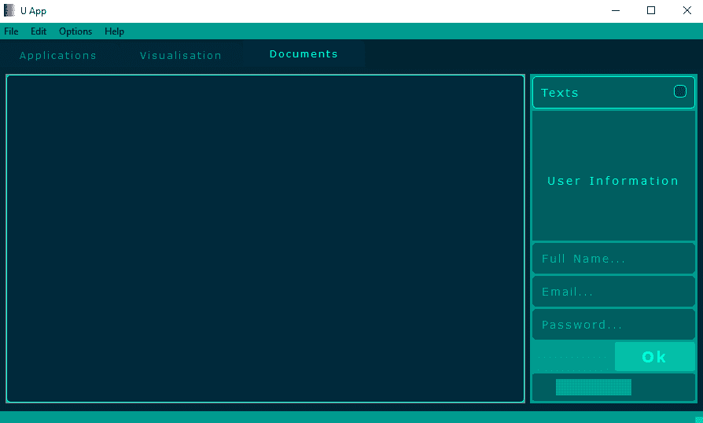
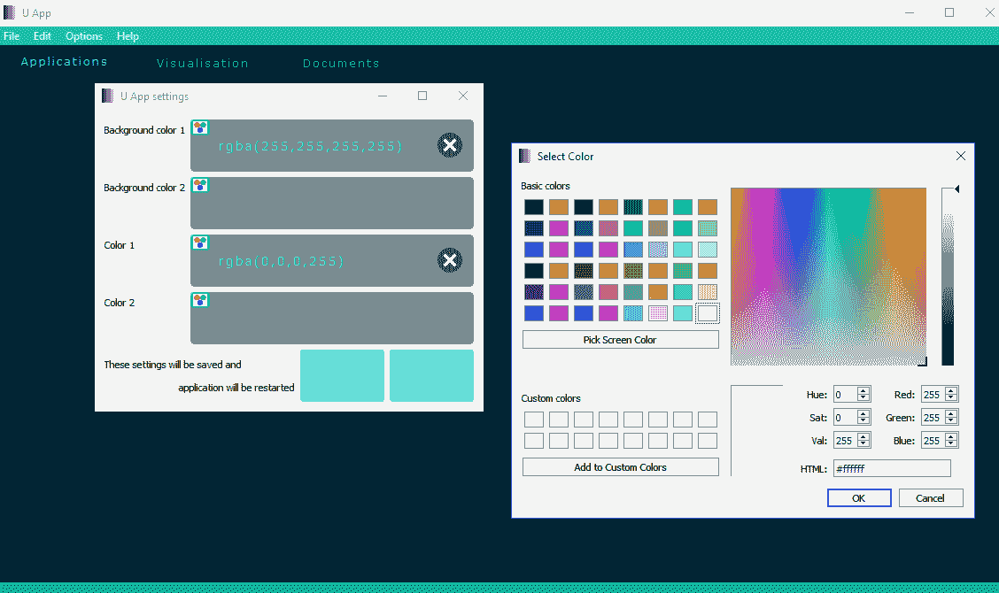
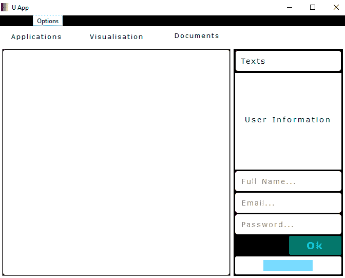

# 创建布局

本章将最终确定我们对于在应用程序中排列和定位项目相关概念的理解。如果元素具有固定的大小和位置，并且需要调整窗口大小，则这些元素不会相应地调整大小，并且会出现图形表示错误。此外，如果应用程序将用于具有不同分辨率（如现实生活中那样）的设备，则图形可视化的结果将会有所不同（并且这往往偏向于不良的一侧）。为项目构建布局是使应用程序独立于窗口大小和原生设备分辨率的基本工具之一。布局在具有 GUI 的应用程序中扮演着几何管理器的角色。

在先前的应用程序开发示例中，已经使用了布局，并且我们对这个机制有一些了解。本章将完成我们对以下主题的理解：

+   布局

+   Box 布局

+   网格布局

+   表格布局

+   堆叠布局

# 布局

正如我们在示例中所见，布局是排列应用程序中项目的一种方便方式，例如小部件的排列和根据设备分辨率、可用空间、大小等自动调整大小。在本节中，我们将介绍 Qt 库中布局的基本知识。

# QLayout

这是一个用于实现 Qt 框架布局的抽象基类。本章中所有布局都继承了这个类的功能；`QLayout` 包含在 `QtWidgets` 模块中，并且可以在自定义类中重实现。重实现的语法如下：

```py
...
class ULayout(QtWidgets.QLayout):

    def __init__(self, parent=None):
        super(ULayout, self).__init__(parent)
...
```

`QLayout` 类通过以下函数增强了功能。

# 添加

这些函数向布局中添加元素：

`addChildLayout(QtWidgets.QLayout)`: 这将添加由参数指定的子布局作为此布局的子布局。

`addChildWidget(QtWidgets.QWidget)`: 这将添加由参数指定的管理小部件到这个布局中。

`addItem(QtWidgets.QLayoutItem)`: 这将添加由参数指定的一项到这个布局中。

`addWidget(QtWidgets.QWidget)`: 这将添加由参数指定的小部件到这个布局中。

# 设置

这些函数设置布局的参数/属性：

`setAlignment(QtWidgets.QWidget, QtCore.Qt.Alignment)`: 这将为小部件（第一个参数）设置对齐（第二个参数）。

`setAlignment(QtWidgets.QLayout, QtCore.Qt.Alignment)`: 这将设置布局（第一个参数）的对齐（第二个参数）。

`setContentsMargins(QtCore.QMargins)`: 这将设置由参数指定的边距，这些边距将用于围绕此布局。

`setContentsMargins(int, int, int, int)`: 这将设置围绕此布局使用的左（第一个参数）、上（第二个参数）、右（第三个参数）和下（第四个参数）边的边距。

`setEnabled(bool)`: 如果参数为 `True`，则启用此布局。

`setMenuBar(QtWidgets.QWidget)`: 这将参数中指定的菜单栏控件设置在父控件的顶部。

`setSizeConstraint(QtWidgets.QLayout.SizeConstraint)`: 这为此布局设置参数中指定的调整大小模式。可用的调整大小模式如下：

+   `QtWidgets.QLayout.SetDefaultConstraint`—`0`: 将控件的最低大小设置为`minimumSize()`。

+   `QtWidgets.QLayout.SetNoConstraint`—`1`: 控件不受约束。

+   `QtWidgets.QLayout.SetMinimumSize`—`2`: 将控件的最低大小设置为`minimumSize()`。

+   `QtWidgets.QLayout.SetFixedSize`—`3`: 将控件设置为`sizeHint()`，并且不能调整大小。

+   `QtWidgets.QLayout.SetMaximumSize`—`4`: 将控件的最大大小设置为`maximumSize()`。

+   `QtWidgets.QLayout.SetMinAndMaxSize`—`5`: 将控件的最大和最小大小设置为`maximumSize()`和`minimumSize()`。

`setSpacing(int)`: 这设置此布局内控件之间的间距。

# is

此函数返回一个与布局状态相关的布尔值（`bool`）：

`isEnabled()`: 如果此布局启用，则返回`True`。否则，返回`False`。

# functional

这些函数与布局的当前值、功能变化等相关：

`activate()`: 这将重新执行此布局的父控件的布局。

`alignmentRect(QtCore.QRect)`: 这返回一个`QtCore.QRect`类型的矩形，当此布局的几何形状设置为参数中指定的矩形时，该矩形将被覆盖。

`closestAcceptableSize(QtWidgets.QWidget, QtCore.QSize)`: 这返回一个大小，该大小满足对控件（第一个参数）的所有约束，并且接近指定的（第二个参数）大小。

`contentsMargins()`: 这返回围绕此布局的`QtCore.QMargins`类型的边距。

`contentsRect()`: 这返回布局几何形状的`QtCore.QRect`类型的矩形，带有内容边距。

`count()`: 这返回此布局中的项数。

`getContentsMargins()`: 这返回围绕布局的左、上、右和底部边距。

`indexOf(QtWidgets.QWidget)`: 这返回在布局中找到的、由参数指定的控件的索引。

`indexOf(QtWidgets.QLayoutItem)`: 这返回在布局中找到的、由参数指定的项的布局索引。

`itemAt(int)`: 这返回在参数指定的索引处的`QtWidgets.QLayoutItem`类型的项。

`menuBar()`: 如果存在菜单栏，则返回此布局的`QtWidgets.QWidget`类型的菜单栏。

`parentWidget()`: 这返回此布局的`QtWidgets.QWidget`类型的父控件。如果是子布局，则返回父布局的父控件。

`removeItem(QtWidgets.QLayoutItem)`: 这将从布局中删除由参数指定的布局项。

`removeWidget(QtWidgets.QWidget)`: 这个函数从布局中移除指定的参数中的小部件。

`replaceWidget(QtWidgets.QWidget, QtWidgets.QWidget, QtCore.Qt.FindChildOptions)`: 使用选项（第三个参数）替换一个小部件（第一个参数）为另一个小部件（第二个参数），并返回一个包含新小部件的`QtWidgets.QLayoutItem`类型项。

`sizeConstraint()`: 这个函数返回`QtWidgets.QLayout.SizeConstraint`类型的调整模式，用于此布局。

`spacing()`: 这个函数返回此布局内部小部件之间的间距。

`takeAt(int)`: 这个函数返回参数中指定的索引处的`QtWidgets.QLayoutItem`类型项，并移除它。

`update()`: 这个函数更新此布局以适应父小部件。

# events

这些是与事件相关的函数，例如事件处理程序：

`childEvent(QtCore.QChildEvent)`: 这个事件处理程序接收布局的子事件，事件通过参数传入。

`widgetEvent(QtCore.QEvent)`: 这个事件处理程序接收布局的父小部件调整大小事件，事件通过参数传入。

# QLayoutItem

这个类使用 Qt 库创建了一个布局实现的抽象项。本章将描述的布局以及`QLayout`类可以使用此功能，并在自定义布局构造中操作这些项；`QLayoutItem`包含在`QtWidgets`模块中，可以在自定义类中重实现。重实现的语法如下：

```py
...
class ULayoutItem(QtWidgets.QLayoutItem):

    def __init__(self, parent=None):ss.
        super(ULayoutItem, self).__init__(parent)
...
```

`QLayoutItem`类通过以下函数增强了功能。

# set

这些函数设置布局项的参数/属性：

`setAlignment(QtCore.Qt.Alignment)`: 这个函数为此布局项设置参数中指定的对齐方式。

`setGeometry(QtCore.QRect)`: 这个函数为这个布局项设置参数中指定的几何形状。

# has/is

这些函数返回与这个布局项的状态相关的布尔值`bool`：

`hasHeightForWidth()`: 如果这个布局项的首选高度依赖于其宽度，则此函数返回`True`。

`isEmpty()`: 如果这个布局项为空，则返回`True`；如果它包含任何小部件，则返回`False`。

# functional

这些函数与布局项的当前值、功能变化等相关：

`alignment()`: 这个函数返回此布局项的`QtCore.Qt.Alignment`类型的对齐方式。

`controlTypes()`: 这个函数返回此布局项的`QtWidgets.QSizePolicy.ControlTypes`类型的控件类型。

`expandingDirections()`: 这个函数返回`QtCore.Qt.Orientations`类型的方向，以便这个布局项可以利用更多空间。

`geometry()`: 这个函数返回被此布局项覆盖的`QtCore.QRect`类型的矩形。

`heightForWidth(int)`: 这个函数返回与参数中指定的宽度相关的布局项的首选高度。

`invalidate()`: 这个函数使这个布局项的缓存信息无效。

`layout()`: 如果此项具有相对布局，则返回`QtWidgets.QLayout`类型的布局。

`maximumSize()`: 这个函数返回此布局项的`QtCore.QSize`类型的最大尺寸。

`minimumHeightForWidth(int)`: 这个函数返回相对于参数中指定的宽度的此小部件的最小高度。

`minimumSize()`: 这个函数返回此布局项的`QtCore.QSize`类型的最小尺寸。

`sizeHint()`: 这个函数返回此布局项的`QtCore.QSize`类型的首选尺寸。

`spacerItem()`: 如果此项是间隔项（空白空间），则返回一个`QtWidgets.QSpacerItem`类型的间隔项。

`widget()`: 如果此项管理小部件，则返回`QtWidgets.QWidget`类型的小部件。

# QSizePolicy

这个类可以用来设置布局中小部件的缩放策略。小部件的尺寸策略描述了它将被如何缩放以及如何被布局引擎处理。通常，这个策略属性用于布局中的小部件。可以通过使用带有与尺寸策略相关的参数的`setSizePolicy()`函数来添加策略。这个类的声明语法如下：

```py
size_policy = QtWidgets.QSizePolicy()
```

`QSizePolicy`类通过以下函数增强了功能。

# set

这些函数设置尺寸策略的参数/属性：

`size_policy.setControlType(QtWidgets.QSizePolicy.ControlType)`: 这个函数设置应用尺寸策略的相关小部件的控制类型。可用的控制类型如下：

+   `QtWidgets.QSizePolicy.DefaultType`: 默认类型；指定为`None`。

+   `QtWidgets.QSizePolicy.ButtonBox`: 这是一个`QtWidgets.QDialogButtonBox`实例。

+   `QtWidgets.QSizePolicy.CheckBox`: 这是一个`QtWidgets.QCheckBox`实例。

+   `QtWidgets.QSizePolicy.ComboBox`: 这是一个`QtWidgets.QComboBox`实例。

+   `QtWidgets.QSizePolicy.Frame`: 这是一个`QtWidgets.QFrame`实例。

+   `QtWidgets.QSizePolicy.GroupBox`: 这是一个`QtWidgets.QGroupBox`实例。

+   `QtWidgets.QSizePolicy.Label`: 这是一个`QtWidgets.QLabel`实例。

+   `QtWidgets.QSizePolicy.Line`: 这是一个`QtWidgets.QFrame.HLine`或`QtWidgets.QFrame.VLine`实例。

+   `QtWidgets.QSizePolicy.LineEdit`: 这是一个`QtWidgets.QLineEdit`实例。

+   `QtWidgets.QSizePolicy.PushButton`: 这是一个`QtWidgets.QPushButton`实例。

+   `QtWidgets.QSizePolicy.RadioButton`: 这是一个`QtWidgets.QRadioButton`实例。

+   `QtWidgets.QSizePolicy.Slider`: 这是一个`QtWidgets.QAbstractSlider`实例。

+   `QtWidgets.QSizePolicy.SpinBox`: 这是一个`QtWidgets.QAbstractSpinBox`实例。

+   `QtWidgets.QSizePolicy.TabWidget`: 这是一个`QtWidgets.QTabWidget`实例。

+   `QtWidgets.QSizePolicy.ToolButton`: 这是一个`QtWidgets.QToolButton`实例。

`size_policy.setHeightForWidth(bool)`: 如果参数为`True`，则设置首选高度取决于小部件的宽度。

`size_policy.setHorizontalPolicy(QtWidgets.QSizePolicy.Policy)`: 这将为这个大小策略设置参数中指定的水平策略。可用的策略如下：

+   **`QtWidgets.QSizePolicy.Fixed`**: 小部件有一个固定大小策略；它永远不会增长或缩小。

+   `QtWidgets.QSizePolicy.Minimum`: 小部件可以被扩展，但不能小于最小 `sizeHint()`。

+   `QtWidgets.QSizePolicy.Maximum`: 小部件可以被缩小，但不能大于最大 `sizeHint()`。

+   `QtWidgets.QSizePolicy.Preferred`: 小部件的 `sizeHint()` 是首选的。

+   `QtWidgets.QSizePolicy.Expanding`: 小部件的 `sizeHint()` 是一个合理的尺寸。小部件可以被扩展。

+   `QtWidgets.QSizePolicy.MinimumExpanding`: 小部件的 `sizeHint()` 是最小且足够的。

+   `QtWidgets.QSizePolicy.Ignored`: 忽略小部件的 `sizeHint()`。

此外，以下标志可以一起使用，与 `|` 运算符结合：

+   `QtWidgets.QSizePolicy.GrowFlag`—`1`: 小部件可以比大小提示增长更多。

+   `QtWidgets.QSizePolicy.ExpandFlag`—`2`: 小部件可以占用尽可能多的空间。

+   `QtWidgets.QSizePolicy.ShrinkFlag`—`4`: 小部件可以比大小提示缩小更多。

+   `QtWidgets.QSizePolicy.IgnoreFlag`—`8`: 忽略大小提示。小部件将获得尽可能多的空间。

`size_policy.setHorizontalStretch(int)`: 这将为这个大小策略设置参数中指定的水平拉伸因子。

`size_policy.setRetainSizeWhenHidden(bool)`: 如果参数为 `True`，则确定此布局在隐藏时将保留小部件的大小。

`size_policy.setVerticalPolicy(QtWidgets.QSizePolicy.Policy)`: 这将为这个大小策略设置参数中指定的垂直策略。可用的策略在前面的小点中描述。

`size_policy.setVerticalStretch(int)`: 这将为这个大小策略设置参数中指定的垂直拉伸因子。

`size_policy.setWidthForHeight(bool)`: 如果参数为 `True`，则设置首选宽度取决于此小部件的高度。

# has

这些函数返回与这个大小策略状态相关的布尔值 (`bool`)：

`size_policy.hasHeightForWidth()`: 如果小部件的首选高度取决于其宽度，则返回 `True`。

`size_policy.hasWidthForHeight()`: 如果小部件的首选宽度取决于其高度，则返回 `True`。

# functional

这些函数与大小策略的当前值、功能变化等相关：

`size_policy.controlType()`: 返回与将要应用大小策略的小部件关联的 `QtWidgets.QSizePolicy.ControlType` 类型的控制类型。

`size_policy.expandingDirections()`: 这返回小部件可以比 `sizeHint()` 函数中指示的更多空间的方向，类型为 `QtCore.Qt.Orientations`。

`size_policy.horizontalPolicy()`: 这返回了此大小策略的 `QtWidgets.QSizePolicy.Policy` 类型的水平策略。

`size_policy.horizontalStretch()`: 这返回了在此大小策略中使用的水平拉伸因子。

`size_policy.retainSizeWhenHidden()`: 如果此布局在隐藏时保留小部件的大小，则返回 `True`。默认值为 `False`。

`size_policy.transpose()`: 这交换了水平/垂直策略/拉伸。

`size_policy.transposed()`: 这返回了`QtWidgets.QSizePolicy`类型的交换大小策略，带有水平/垂直策略/拉伸。

`size_policy.verticalPolicy()`: 这返回了此大小策略的 `QtWidgets.QSizePolicy.Policy` 类型的垂直策略。

`size_policy.verticalStretch()`: 这返回了此大小策略的垂直拉伸因子。

# 盒式布局

在应用程序的小部件中排列项的最简单方法是使用 **box layout** 构造。盒式布局按水平或垂直排列项。水平排列时，项将成行排列，垂直排列时，项将成列排列。提供基本功能的是 `QBoxLayout` 类。

# QBoxLayout

这是盒式布局的基本类。它可以按行/列排列方式水平/垂直排列项。盒式布局的方向，如从左到右（行）或从上到下（列），需要在类的声明中通过相关参数定义。声明语法如下：

```py
box_layout = QtWidgets.QBoxLayout(QtWidgets.QBoxLayout.LeftToRight)
```

`QBoxLayout` 继承了 `QLayout` 类，并通过以下函数增强了其功能：

# add

这些函数将元素添加到布局中：

`box_layout.addLayout(QtWidgets.QLayout, int)`: 这会将布局（第一个参数）添加到这个盒式布局中，使用拉伸因子（第二个参数）。

`box_layout.addSpacerItem(QtWidgets.QSpacerItem)`: 这将指定的参数中的间隔项添加到盒式布局中。

`box_layout.addSpacing(int)`: 这会在布局中添加一个不可拉伸的空间，大小由参数指定。

`box_layout.addStretch(int)`: 这会在布局中添加一个可拉伸的空间，拉伸因子由参数指定。

`box_layout.addStrut(int)`: 这为盒式布局的垂直维度添加了由参数指定的限制。

`box_layout.addWidget(QtWidgets.QWidget, int, QtCore.Qt.Alignment)`: 这会将小部件（第一个参数）添加到这个盒式布局中，使用拉伸因子（第二个参数）和对齐（第三个参数）。

# insert

这些函数将元素插入布局中：

`box_layout.insertItem(int, QtWidgets.QLayoutItem)`: 这在索引（第一个参数）处将项（第二个参数）插入到此布局中。

`box_layout.insertLayout(int, QtWidgets.QLayout, int)`: 这在索引（第一个参数）处将布局（第二个参数）插入到此布局中，并带有拉伸因子（第三个参数）。

`box_layout.insertSpacerItem(int, QtWidgets.QSpacerItem)`: 这将在索引（第一个参数）处插入一个间隔项（第二个参数）到这个布局中。

`box_layout.insertSpacing(int, int)`: 这将在索引（第一个参数）处插入一个具有特定大小（第二个参数）的非拉伸空间到这个布局中。

`box_layout.insertStretch(int, int)`: 这将在索引（第一个参数）处插入一个具有特定大小（第二个参数）的可拉伸空间到这个布局中。

`box_layout.insertWidget(int, QtWidgets.QWidget, int, QtCore.Qt.Alignment)`: 这将在索引（第一个参数）处插入一个小部件（第二个参数），并带有拉伸因子（第三个参数）和对齐方式（第四个参数）。

# 设置

这些函数设置布局的参数/属性：

`box_layout.setDirection(QtWidgets.QBoxLayout.Direction)`: 这将为这个框布局设置参数中指定的方向。可用的方向如下：

+   **`QtWidgets.QBoxLayout.LeftToRight`**—`0`: 从左到右。

+   `QtWidgets.QBoxLayout.RightToLeft`—`1`: 从右到左。

+   `QtWidgets.QBoxLayout.TopToBottom`—`2`: 从上到下。

+   `QtWidgets.QBoxLayout.BottomToTop`—`3`: 从下到上。

`box_layout.setSpacing(int)`: 这将为这个框布局内的小部件之间的间距设置。

`box_layout.setStretch(int, int)`: 这将为这个布局在索引（第一个参数）处设置拉伸因子（第二个参数）。

`box_layout.setStretchFactor(QtWidgets.QWidget, int)`: 这将为这个框布局中的小部件（第一个参数）设置拉伸因子（第二个参数）。

`box_layout.setStretchFactor(QtWidgets.QLayout, int)`: 这将为这个框布局中的布局（第一个参数）设置拉伸因子（第二个参数）。

# 功能性

这些函数与布局的当前值、功能变化等相关：

`box_layout.direction()`: 这返回用于这个框布局的 `QtWidgets.QBoxLayout.Direction` 类型的方向。

`box_layout.stretch(int)`: 这返回指定索引位置处的拉伸因子。

# QHBoxLayout

这个类可以用来构建可以水平排列项的布局，将小部件放置在行内。它是实现框布局的附加类，可用于水平排列。当构建一个简单的应用程序窗口，其中一些元素将排列在顶部或底部，或者有额外的窗口/小部件，其元素将具有相似的方向时，非常有用。这个布局可用的方向是 `RightToLeft` 和 `LeftToRight`（默认）。这个类的声明语法如下：

```py
hbox_layout = QtWidgets.QHBoxLayout()
```

`QHBoxLayout` 继承了 `QBoxLayout`，具有在水平布局中可用和可实现的特性和函数。

# QVBoxLayout

这个类可以用来构建可以垂直排列项的布局，将小部件放置在列内。它是一个用于实现框布局的附加类，可用于垂直排列。当构建一个简单的应用程序窗口，其中包含将排列在左侧或右侧的元素，或者包含具有类似方向的额外窗口/小部件时，它非常有用。此布局的可用方向是 `TopToBottom`（默认）和 `BottomToTop`。此类的声明语法如下：

```py
vbox_layout = QtWidgets.QVBoxLayout()
```

`QVBoxLayout` 继承了 `QBoxLayout`，具有在垂直布局中可用和可实现的特性和功能。

# QGridLayout

这个类以网格形式排列项。网格意味着每个项都将相对于单元格定位在指定的行和列。这是一个非常有用且流行的布局，用于构建具有不同位置、方向和大小的元素的应用程序，这些元素相对于应用程序窗口。此类的声明语法如下：

```py
grid_layout = QtWidgets.QGridLayout()
```

# QGridLayout 函数

`QGridLayout` 继承了 `QLayout` 类，并通过以下函数增强了其功能。

# add

这些函数向网格布局添加元素：

`grid_layout.addItem(QtWidgets.QLayoutItem, int, int, int, int, QtCore.Qt.Alignment)`: 这会将布局项（第一个参数）添加到由行（第二个参数）和列（第三个参数）指定的位置。它将占用一定数量的行（第四个参数）和列（第五个参数），并且它还有一个对齐（第六个参数）。

`grid_layout.addLayout(QtWidgets.QLayout, int, int, QtCore.Qt.Alignment)`: 这会将布局（第一个参数）添加到由行（第二个参数）和列（第三个参数）指定的位置，并使用对齐（第四个参数）。

`grid_layout.addLayout(QtWidgets.QLayout, int, int, int, int, QtCore.Qt.Alignment)`: 这会将布局（第一个参数）添加到由行（第二个参数）和列（第三个参数）指定的位置。它将占用一定数量的行（第四个参数）和列（第五个参数），并使用对齐（第六个参数）。

`grid_layout.addWidget(QtWidgets.QWidget, int, int, QtCore.Qt.Alignment)`: 这会将小部件（第一个参数）添加到由行（第二个参数）和列（第三个参数）指定的位置，并使用对齐（第四个参数）。

`grid_layout.addWidget(QtWidgets.QWidget, int, int, int, int, QtCore.Qt.Alignment)`: 这会将小部件（第一个参数）添加到由行（第二个参数）和列（第三个参数）指定的位置。它将占用一定数量的行（第四个参数）和列（第五个参数），并使用对齐（第六个参数）。

# set

这些函数设置网格布局的参数/属性：

`grid_layout.setColumnMinimumWidth(int, int)`: 这为此网格布局中的列（第一个参数）设置像素（第二个参数）的最小宽度。

`grid_layout.setColumnStretch(int, int)`: 这为此网格布局中的列（第一个参数）设置拉伸因子（第二个参数）。

`grid_layout.setDefaultPositioning(int, QtCore.Qt.Orientation)`: 这设置布局定位模式，将此布局扩展到列/行数（第一个参数）。如果方向（第二个参数）是 `QtCore.Qt.Horizontal`，它将通过列扩展。如果方向是 `QtCore.Qt.Vertical`，它将通过行扩展。

`grid_layout.setHorizontalSpacing(int)`: 这为此网格布局中的小部件设置指定参数的水平间距。

`grid_layout.setOriginCorner(QtCore.Qt.Corner)`: 这为此网格布局设置指定参数的起始角落。

`grid_layout.setRowMinimumHeight(int, int)`: 这为此网格布局中的行（第一个参数）设置像素（第二个参数）的最小高度。

`grid_layout.setRowStretch(int, int)`: 这为此网格布局中的行（第一个参数）设置拉伸因子（第二个参数）。

`grid_layout.setVerticalSpacing(int)`: 这为此网格布局中的小部件设置指定参数的垂直间距。

# functional

这些函数与网格布局的当前值相关：

`grid_layout.cellRect(int, int)`: 这返回单元格的几何形状，以 `QtCore.QRect` 类型表示，其中指定了行（第一个参数）和列（第二个参数）。

`grid_layout.columnCount()`: 这返回此网格布局中的列数。

`grid_layout.columnMinimumWidth(int)`: 这返回指定参数的列的最小宽度，用于此网格布局。

`grid_layout.columnStretch(int)`: 这返回指定参数的列的拉伸因子。

`grid_layout.getItemPosition(int)`: 这返回在此网格布局中具有指定参数索引的项的位置。

`grid_layout.horizontalSpacing()`: 这返回水平排列的小部件之间的间距。

`grid_layout.itemAtPosition(int, int)`: 这返回占据行（第一个参数）和列（第二个参数）的 `QtWidgets.QLayoutItem` 类型的项。

`grid_layout.originCorner()`: 这返回用于此网格布局原点的 `QtCore.Qt.Corner` 类型的角落。

`grid_layout.rowCount()`: 这返回此网格布局中的行数。

**`grid_layout.rowMinimumHeight(int)`**: 这返回指定参数的最小高度，用于此网格布局的列。

`grid_layout.rowStretch(int)`: 这返回指定参数的行的拉伸因子。

`grid_layout.verticalSpacing()`：这返回垂直排列的小部件之间的间距。

# QGridLayout 示例

在本书的前几章中，我们在主应用窗口中排列了元素，并使用`QGridLayout`类添加了额外的小部件。因此，没有必要提供这个类的示例，因为它们之前已经展示过了。

让我们添加一些属性到布局中，以展示所描述的功能，例如添加内容边距和修改布局周围的间距，使它们更具代表性：

1.  在`u_app.py`文件中的`UApp`类中，添加以下行：

```py
...
class UApp(UWindow, UTools):

    def __init__(self, parent=None):
        ...
        self.layfr1.setContentsMargins(0, 0, 0, 0)
        ...
        self.layfr2_1.setSpacing(3)
        ...
        self.layfr2.setSpacing(3)
        self.layfr2.setContentsMargins(3, 3, 3, 3)
    ...
...
```

为每个边的内容边距将添加到布局中，并且布局的元素间距为`3`像素。这不会造成太大的变化，结果将看起来像这样：



这是一个可选的示例。您可以尝试一些其他功能。根据您的判断使用它们。

# QFormLayout

这个类为各种带有项的表单提供布局构造。表单布局包括与这些输入相关联的输入小部件和标签。这个表单有两个列。第一列通常由标签组成，第二列是一个输入小部件。这些类似的表单布局为您提供了以简单表单表示排列项的可能性。  这个类的声明语法如下：

```py
form_layout = QtWidgets.QFormLayout()
```

# QFormLayout 函数

`QFormLayout`继承自`QLayout`类，并通过以下函数增强了其功能。

# add

这些函数向表单布局添加元素：

`form_layout.addRow(QtWidgets.QWidget)`：这将在表单布局中添加一个由参数指定的小部件的行。添加的小部件将占据该行的两列。

`form_layout.addRow(QtWidgets.QLayout)`：这将在表单布局中添加一个由参数指定的布局的行。添加的布局将占据该行的两列。

`form_layout.addRow(QtWidgets.QWidget, QtWidgets.QWidget)`：这将在表单布局中添加一行，包含两列。第一个小部件（第一个参数）将占据第一列，第二个小部件（第二个参数）将占据第二列。

`form_layout.addRow(QtWidgets.QWidget, QtWidgets.QLayout)`：这将在表单布局中添加一行，包含两列。小部件（第一个参数）将占据第一列，布局（第二个参数）将占据第二列。

**`form_layout.addRow(str, QtWidgets.QWidget)`**：这将在表单布局中添加一行，包含两列。一个带有文本的标签（第一个参数）将自动添加并占据第一列，而一个小部件（第二个参数）将占据第二列。

`form_layout.addRow(str, QtWidgets.QLayout)`：这将在表单布局中添加一行，包含两列。一个带有文本的标签（第一个参数）将自动添加并占据第一列，一个布局（第二个参数）将占据第二列。

# insert

这些函数将元素插入到表单布局中：

`form_layout.insertRow(int, QtWidgets.QWidget)`: 这将在表单布局中插入一行，包含两列，在索引（第一个参数）处。添加的控件（第二个参数）将占据该行的两列。

`form_layout.insertRow(int, QtWidgets.QLayout)`: 这将在表单布局中插入一行，包含两列，在索引（第一个参数）处。添加的布局（第二个参数）将占据该行的两列。

`form_layout.insertRow(int, QtWidgets.QWidget, QtWidgets.QWidget)`: 这将在表单布局中插入一行，包含两列，在索引（第一个参数）处。第一个控件（第二个参数）将占据第一列，第二个控件（第三个参数）将占据第二列。

`form_layout.insertRow(int, QtWidgets.QWidget, QtWidgets.QLayout)`: 这将在表单布局中插入一行，包含两列，在索引（第一个参数）处。控件（第二个参数）将占据第一列，布局（第三个参数）将占据第二列。

`form_layout.insertRow(int, str, QtWidgets.QWidget)`: 这将在表单布局中插入一行，包含两列，在索引（第一个参数）处。将自动添加带有文本的标签（第二个参数），并占据第一列，控件（第三个参数）将占据第二列。

`form_layout.insertRow(int, str, QtWidgets.QLayout)`: 这将在表单布局中插入一行，包含两列，在索引（第一个参数）处。将自动添加带有文本的标签（第二个参数），并占据第一列，布局（第三个参数）将占据第二列。

# set

这些函数设置表单布局的参数/属性：

`form_layout.setFieldGrowthPolicy(QtWidgets.QFormLayout.FieldGrowthPolicy)`: 这将设置表单布局中字段的增长策略。可用的策略如下：

+   `QtWidgets.QFormLayout.FieldsStayAtSizeHint`—`0`: 字段永远不会超过有效大小提示。

+   `QtWidgets.QFormLayout.ExpandingFieldsGrow`—`1`: 具有扩展或`MinimumExpanding`属性的字段将扩展以填充可用空间。否则，它们永远不会超过有效大小提示。

+   `QtWidgets.QFormLayout.AllNonFixedFieldsGrow`—`2`: 具有大小策略的字段将扩展以填充可用空间。

`form_layout.setFormAlignment(QtCore.Qt.Alignment)`: 这将设置表单布局内容的对齐方式。

`form_layout.setHorizontalSpacing(int)`: 这将设置表单布局中控件之间的水平间距，以参数指定的值为准。

`form_layout.setItem(int, QtWidgets.QFormLayout.ItemRole, QtWidgets.QLayoutItem)`: 这将设置行（第一个参数）中的项目，其角色（第二个参数）为项目（第三个参数）。

`form_layout.setLabelAlignment(QtCore.Qt.Alignment)`: 这将此表单布局中标签的水平对齐方式设置为参数中指定的对齐方式。

`form_layout.setLayout(int, QtWidgets.QFormLayout.ItemRole, QtWidgets.QLayout)`: 这将为表单布局中的行（第一个参数）设置子布局（第三个参数），用于此表单布局的角色（第二个参数）。

`form_layout.setRowWrapPolicy(QtWidgets.QFormLayout.RowWrapPolicy)`: 这将为此布局的表单设置行换行策略，策略由参数指定。可用的策略如下：

+   **`QtWidgets.QFormLayout.DontWrapRows`**—`0`: 行不换行。

+   `QtWidgets.QFormLayout.WrapLongRows`—`1`: 有足够的水平空间来容纳最宽的标签，其余空间用于字段。

+   `QtWidgets.QFormLayout.WrapAllRows`—`2`: 字段始终位于其标签下方。

`form_layout.setVerticalSpacing(int)`: 这将为此表单布局中的小部件设置参数中指定的垂直间距。

`form_layout.setWidget(int, QtWidgets.QFormLayout.ItemRole, QtWidgets.QWidget)`: 这将为行（第一个参数）设置小部件（第三个参数），用于角色（第二个参数）。可用的项目角色如下：

+   `QtWidgets.QFormLayout.LabelRole`—`0`: 标签小部件。

+   `QtWidgets.QFormLayout.FieldRole`—`1`: 字段小部件。

+   `QtWidgets.QFormLayout.SpanningRole`—`2`: 一个跨越标签和字段列的小部件。

# functional

这些函数与表单布局的当前值、功能变化等相关：

`form_layout.fieldGrowthPolicy()`: 这返回 `QtWidgets.QFormLayout.FieldGrowthPolicy` 类型的增长策略。

`form_layout.formAlignment()`: 这返回用于此表单布局的 `QtCore.Qt.Alignment` 类型的对齐方式。

`form_layout.getItemPosition(int)`: 这检索由参数中的索引指定的项目的行和角色。

`form_layout.getLayoutPosition(QtWidgets.QLayout)`: 这检索参数中指定的子布局的行和角色。

`form_layout.getWidgetPosition(QtWidgets.QWidget)`: 这检索参数中指定的小部件的行和角色。

`form_layout.horizontalSpacing()`: 这返回在此表单布局中水平排列的小部件之间的间距。

`form_layout.itemAt(int, QtWidgets.QFormLayout.ItemRole)`: 这返回行（第一个参数）中具有项目角色的布局项（第二个参数）。

`form_layout.labelAlignment()`: 这返回此表单布局中标签的 `QtCore.Qt.Alignment` 类型的水平对齐方式。

`form_layout.labelForField(QtWidgets.QWidget)`: 这返回与参数中指定的小部件关联的标签。

`form_layout.labelForField(QtWidgets.QLayout)`: 这返回与参数中指定的布局关联的标签。

`form_layout.removeRow(int)`: 这将从表单布局中删除参数中指定的行。

`form_layout.removeRow(QtWidgets.QWidget)`: 这将从此表单布局中移除与指定小部件关联的行。

**`form_layout.removeRow(QtWidgets.QLayout)`**: 这将从此表单布局中移除与指定布局关联的行。

`form_layout.rowCount()`: 这返回此表单布局中的行数。

`form_layout.rowWrapPolicy()`: 这返回此布局中 `QtWidgets.QFormLayout.RowWrapPolicy` 类型的行包装策略。

`form_layout.takeRow(int)`: 这将从此表单布局中移除指定参数的行，但不删除它。

`form_layout.takeRow(QtWidgets.QWidget)`: 这将从此表单布局中移除指定的小部件，但不删除它。

`form_layout.takeRow(QtWidgets.QLayout)`: 这将从此表单布局中移除指定的布局，但不删除它。

`form_layout.verticalSpacing()`: 这返回垂直排列的小部件之间的间距。

# QFormLayout 示例

让我们看看这个应用程序将使用的表单布局的示例。让我们在应用程序顶部面板的 `Options` 部分创建 `Settings` 选项：

1.  要完成这个任务，请创建两个名为 `u_settings.py` 的文件，一个位于 `App/App_PySide2/`，另一个位于 `App/App_PyQt5/`，并在其中添加以下代码：

+   将以下内容添加到 `App_PySide2/u_settings.py` 文件中的 `import` 部分：

```py
...
from PySide2 import QtWidgets, QtCore, QtGui
from u_style import ULineEd, UBut1
...
```

+   将以下内容添加到 `App_PyQt5/u_settings.py` 文件中的 `import` 部分：

```py
...
from PyQt5 import QtWidgets, QtCore, QtGui
from u_style import ULineEd, UBut1
...
```

1.  将打开并读取 `settings.txt` 文件的 `USets` 类添加到该文件中：

```py
...
class USets(QtWidgets.QWidget):

    def __init__(self, parent=None):
        super(USets, self).__init__(parent)
        self.setWindowTitle("U App settings")
        win_icon = QtGui.QIcon("Icons/python1.png")
        color_icon = QtGui.QIcon("Icons/colors.png")
        self.setWindowIcon(win_icon)
        rstop = open("settings.txt", "r")
        rstyle = rstop.read().split(" ")
        rstop.close()
        ...
    ...
...
```

这个类继承自 `QWidget` 类，它将在应用程序中作为独立窗口显示。

1.  将用于应用程序第一种背景颜色的第一个行编辑字段以及打开颜色对话框的按钮添加到 `USets` 类的 `__init__()` 函数中：

```py
...
    ...
        ... 
        self.bgle1 = ULineEd(self, tmrgl=30, tmrgt=20,
                                     tmrgr=0, tmrgb=20)
        self.bgle1.setText(rstyle[0])
        self.bgle1.setMinimumWidth(270)
        self.bgb1 = UBut1(self.bgle1, pad=1)
        self.bgb1.setIcon(color_icon)
        ...
    ...
...
```

我们已经创建了一个第一行编辑字段的实例，其中包含来自 `settings.txt` 文件的第一种颜色的文本，以及一个调用颜色对话框窗口的按钮。

1.  将用于应用程序第二个背景颜色的第二个行编辑字段以及打开颜色对话框的按钮添加到 `USets` 类的 `__init__()` 函数中：

```py
...
    ...
        ...
        self.bgle2 = ULineEd(self, tmrgl=30, tmrgt=20,
                                     tmrgr=0, tmrgb=20)
        self.bgle2.setText(rstyle[1])
        self.bgb2 = UBut1(self.bgle2, pad=1)
        self.bgb2.setIcon(color_icon)
        ...
    ...
...
```

我们已经创建了一个第二行编辑字段的实例，其中包含来自 `settings.txt` 文件的第二种颜色的文本，以及一个调用颜色对话框窗口的按钮。

1.  将用于应用程序第一种附加颜色（用于文本和悬停效果）的第三个行编辑字段以及打开颜色对话框的按钮添加到 `USets` 类的 `__init__()` 函数中：

```py
...
    ...
        ...
        self.colle1 = ULineEd(self, tmrgl=30, tmrgt=20,
                                      tmrgr=0, tmrgb=20)
        self.colle1.setText(rstyle[2])
        self.colb1 = UBut1(self.colle1, pad=1)
        self.colb1.setIcon(color_icon)
        ...
    ...
...
```

我们已经添加了一个第三行编辑字段的实例，其中包含来自 `settings.txt` 文件的第三种颜色的文本，以及一个调用颜色对话框窗口的按钮。

1.  将用于应用程序第二种附加颜色（用于文本和悬停效果）的第四个行编辑字段以及打开颜色对话框的按钮添加到 `USets` 类的 `__init__()` 函数中：

```py
...
    ...
        ...
        self.colle2 = ULineEd(self, tmrgl=30, tmrgt=20,
                                      tmrgr=0, tmrgb=20)
        self.colle2.setText(rstyle[3])
        self.colb2 = UBut1(self.colle2, pad=1)
        self.colb2.setIcon(color_icon)
        ...
    ...
...
```

我们添加了一个实例的第三个行编辑字段，其文本为`settings.txt`文件中的第三个颜色，并添加了一个按钮来调用颜色对话框窗口。

1.  将`Reset`和`Save`按钮添加到此小部件：

```py
...
    ...
        ...
        self.lbinfo = QtWidgets.QLabel(self)
        self.lbinfo.setText("""These settings will be saved and\n
                                application will be restarted""")
        self.breset = UBut1(self, fixw=95, fixh=59)
        self.breset.setText("Reset")
        self.bsave = UBut1(self, fixw=95, fixh=59)
        self.bsave.setText("Save")
        ...
    ...
...
```

建议固定按钮的大小。为了最佳布局构造，这是必需的。

1.  为标签和按钮添加水平框布局：

```py
...
    ...
        ...
        hlay = QtWidgets.QHBoxLayout()
        hlay.addWidget(self.lbinfo)
        hlay.addWidget(self.breset)
        hlay.addWidget(self.bsave)
        ...
    ...
...
```

这将是主表单布局的一个补充。

1.  添加带有文本标签（自动创建）和行编辑字段的表单布局：

```py
...
    ...
        ...
        form_layout = QtWidgets.QFormLayout()
        form_layout.addRow("Background color 1", self.bgle1)
        form_layout.addRow("Background color 2", self.bgle2)
        form_layout.addRow("Color 1", self.colle1)
        form_layout.addRow("Color 2", self.colle2)
        ...
    ...
...
```

这演示了应用程序中的表单布局构造。每一行都有一个标签和一个行编辑字段。

1.  在将此布局添加到小部件时，为表单布局和水平布局添加垂直布局：

```py
...
    ...
        ...
        vlay = QtWidgets.QVBoxLayout()
        vlay.addLayout(form_layout)
        vlay.addLayout(hlay)
        self.setLayout(vlay)
        ...
    ...
...
```

我们将两个布局合并为一个。这证明了我们可以创建任何嵌套布局构造。

1.  在`__init__()`函数的末尾，添加信号：

```py
...
    ...
        ...
        self.bgb1.clicked.connect(self.b1_fd)
        self.bgb2.clicked.connect(self.b2_fd)
        self.colb1.clicked.connect(self.b3_fd)
        self.colb2.clicked.connect(self.b4_fd)
        ...
    ...
...
```

如果点击相应的按钮，这些信号将调用表单布局每一行的颜色对话框窗口。

1.  现在添加将调用打开颜色对话框的功能，当按钮被点击时：

```py
...
    ...
    def b1_fd(self):
        self.color_fd(le=self.bgle1)

    def b2_fd(self):
        self.color_fd(le=self.bgle2)

    def b3_fd(self):
        self.color_fd(le=self.colle1)

    def b4_fd(self):
        self.color_fd(le=self.colle2)
    ...
...
```

每个功能都会调用颜色对话框窗口，并可选择为应用程序窗口的背景和元素的文本颜色：

1.  添加打开颜色对话框并将所选颜色设置为相关行编辑字段的文本的函数：

```py
...
    ...
    def color_fd(self, le=None):
        fd = QtWidgets.QColorDialog()
        fd.setWindowIcon(QtGui.QIcon("Icons/python1.png"))
        if fd.exec_() == QtWidgets.QDialog.Accepted:
            fc = fd.selectedColor()
            color = "rgba(%s,%s,%s,%s)" % (fc.red(), fc.green(), 
                        fc.blue(), fc.alpha())
            le.setText(color)
...
```

此功能将显示颜色对话框窗口。如果选择了喜欢的颜色，并且通过点击 Ok、Accept 或其他类似按钮接受对话框，它将设置相应行编辑字段中的文本为 RGBA 颜色。

1.  如果我们将此小部件作为窗口单独从应用程序中使用，我们可以添加文件的底部部分：

```py
...o
if __name__ == "__main__":
    import sys
    sapp = QtWidgets.QApplication(sys.argv)
    uset = USets()
    uset.show()
    sys.exit(sapp.exec_())
...
```

现在我们需要在`u_app.py`文件中添加行以从应用程序运行此设置小部件：

1.  在`UApp`类的`__init__()`函数底部，添加以下信号：

```py
...
class UApp(UWindow, UTools):

    def __init__(self, parent=None):
        ...
        self.mb3.triggered.connect(self.settings)
        ...
    ...
...
```

使用第三个菜单部分的`triggered()`信号，我们将调用`settings()`函数。

1.  然后，添加顶部面板`Options`部分的函数：

```py
...
    ...
    def options(self, action):
        if action.text() == "Settings":
            from u_settings import USets
            self.sets = USets()
            self.sets.show()
            self.sets.bsave.clicked.connect(self.sets_but)
            self.sets.breset.clicked.connect(self.to_default)
    ...
...
```

在`options()`函数中，我们为`Settings`选项创建了一个指令。我们导入了`u_settings.py`模块的`USets`类，然后创建了此类的实例并显示了此窗口。此外，我们还添加了`Save`和`Reset`按钮的两个`clicked()`信号。

1.  添加点击`Save`按钮的函数：

```py
...
    ...
    def sets_but(self):
        colors = "%s %s %s %s" % (self.sets.bgle1.text(),
                                  self.sets.bgle2.text(),
                                  self.sets.colle1.text(),
                                  self.sets.colle2.text())
        save_open = open("settings.txt", "w")
        save_open.write(colors)
        save_open.close()
        self.new_app()
    ...
...
```

此功能将使用 Python 标准库的`open()`函数将所选颜色的字符串写入`settings.txt`文件。

1.  添加点击`Reset`按钮的函数：

```py
...
    ...
    def to_default(self):
        u_defaults.txt_file(state=True)
        self.new_app()
    ...
...
```

此功能将恢复应用程序的默认颜色。

1.  添加将运行新应用程序的功能：

```py
...
    ...
    def new_app(self):
        self.sets.hide()
        subprocess.Popen(["python", r"u_app.py"])
        sys.exit(0)
    ...
...
```

此功能将以子进程的形式打开新的主应用程序窗口并退出前一个窗口。

现在将以下行添加到`u_style.py`文件：

1.  我们需要将文件顶部的`color`变量所在的行更改为以下内容：

```py
...
setfile = open("settings.txt", "r")
colread = setfile.read().split(" ")
if len(colread) == 4:
    color = colread
else:
    color = ["", "", "", ""]
setfile.close()
...
```

1.  现在，我们需要为应用程序添加默认颜色设置，这些设置将在应用程序启动时安装。为此，在`App/App_PySide2/`和`App/App_PyQt5/`目录中创建`u_defaults.py`文件。

然后，我们可以将这些行添加到这些文件中：

```py
...
import os

def txt_file(state=False):
    colors = "rgba(0,41,59,140) rgba(0,41,59,255)
               rgba(1,255,217,140) rgba(1,255,217,255)"
    if os.path.exists("settings.txt") is state:
        wstyle = open("settings.txt", "w")
        wstyle.write(colors)
        wstyle.close()
...
```

注意，`colors`变量必须包含一个由空格分隔的颜色值的字符串。

1.  我们需要将这些行添加到`u_app.py`文件中，以便应用程序能够正常运行。在`u_app.py`文件的顶部，在所有导入之前，我们需要添加以下行：

```py
...
import u_defaults
u_defaults.txt_file(state=False)
...
```

如果这个应用程序是第一次启动，背景和文本将使用默认颜色。如果我们运行`u_app.py`文件，我们将看到一个简单的带有表单、垂直框和水平框布局的小部件：



因此，当我们选择颜色或在行编辑字段中输入 RGBA 值时，它们将被保存在简单的文本文件中。实际上，这不是保存和保留默认设置（不仅仅是设置）的可靠方式。这个应用程序的这部分只是允许我们玩颜色。此外，字体设置、元素大小等设置也可以以类似的方式添加。使用哪些设置由用户自行决定。

我们可以通过颜色选择来演示，应用程序将看起来像这样：



应用程序现在的颜色是白色。

# QStackedLayout

此外，Qt 库提供了堆叠布局。此类创建一个将项目作为小部件堆栈排列的布局。默认情况下，一次只可见一个小部件；其他小部件被隐藏。与堆叠布局类似的是之前在应用程序中实现的标签小部件。`QStackedWidget`类也可用，可以用作堆叠布局的顶级类。此类的声明语法如下：

```py
stacked_layout = QtWidgets.QStackedLayout()
```

# QStackedLayout 函数

`QStackedLayout`继承自`QLayout`类，并通过以下功能增强了其功能。

# set

这些功能设置堆叠布局的参数/属性：

`stacked_layout.setCurrentIndex(int)`: 这将设置参数中指定的将在当前堆叠布局中可见和激活的小部件的索引。

`stacked_layout.setCurrentWidget(QtWidgets.QWidget)`: 这将设置参数中指定的将在当前堆叠布局中可见和激活的小部件。

`stacked_layout.setStackingMode(QtWidgets.QStackedLayout.StackingMode)`: 这将为此堆叠布局设置参数中指定的堆叠模式。可用的模式如下：

+   `QtWidgets.QStackedLayout.StackOne`—`0`: 只有一个小部件可见。

+   `QtWidgets.QStackedLayout.StackAll`—`1`: 所有小部件都可见，当前小部件被提升并激活。

# 功能性

这些函数与堆叠布局的当前值、功能变化等相关：

`stacked_layout.currentIndex()`: 这个函数返回当前在这个堆叠布局中可见的小部件的索引。

`stacked_layout.currentWidget()`: 这个函数返回当前在这个堆叠布局中可见的`QtWidgets.QWidget`类型的小部件。

`stacked_layout.insertWidget(int, QtWidgets.QWidget)`: 这个函数将小部件（第二个参数）插入到这个堆叠布局的索引位置（第一个参数）。

`stacked_layout.stackingMode()`: 这个函数返回这个堆叠布局的`QtWidgets.QStackedLayout.StackingMode`类型的当前堆叠模式。

`stacked_layout.widget(int)`: 这个函数返回参数指定的索引位置的小部件。

# 信号

这些信号对`QStackedLayout`类可用：

`stacked_layout.currentChanged(int)`: 当堆叠布局中的当前小部件改变时，会发出这个信号，新的当前小部件索引通过参数传递。

`stacked_layout.widgetRemoved(int)`: 当小部件从堆叠布局中移除时，会发出这个信号，小部件的索引通过参数传递。

# 摘要

本章完成了关于学习 Qt 框架中帮助我们构建具有 GUI 的基本应用程序的类和属性的书籍部分。在应用程序中，布局是一种非常重要的机制，用于以用户友好的方式排列项目。请注意，布局不是元素或项目，并且它们在 GUI 应用程序的窗口和控件的后台提供功能。当我们多次在布局之间进行嵌套时，我们需要记住这一点。此外，本章前面描述的抽象基类允许我们为应用程序构建各种特殊布局。

下一章将开始介绍关于应用程序功能特性的书籍章节。我们将探索一组非常小的相关工具，这些工具是从 Python 提供的巨大工具集中挑选出来的，可用于实现应用程序中的各种目的。我们将介绍数据库及其实现。
