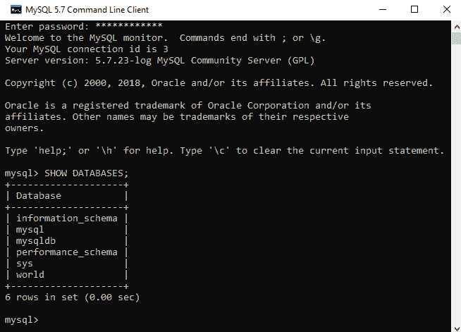

# 第十四章：数据库实现

所有应用程序都操作数据；这是技术世界中任何过程的本质。可重用数据存储为操作提供了巨大的机会，因为如果从应用程序先前操作中存储的数据未被使用，每次运行应用程序时，应用程序都将重新启动其进程。与我们在这本书中构建的 Qt 应用程序相关，在启动时，应用程序将是空的，不会显示任何以前的信息。从某种意义上说，它是一个纯实时应用程序，可以用于网络操作，如抓取，或用于简单的通信和监控。然而，总是需要保存一些东西以备以后使用。在第十三章中实现的示例，*创建布局*，非常原始，不能让我们以更方便的方式重用数据。因此，本章将介绍更方便的重用数据的方法。

在本章中，我们将探讨用于处理各种类型数据存储的各种工具，例如文件、SQL 和 NoSQL。这些工具将主要是第三方包，但尽可能提供基于 Qt 库的模块和类。本章不涵盖 SQL 语言，因为它是在应用程序中数据库的实现。

本章将涵盖以下主题：

+   文件存储

+   CSV

+   SQL

+   NoSQL

# 文件存储

在第十三章*创建布局*中，我们演示了如何将数据保存到文本文件，并在普通任务中（如保存应用程序的颜色设置）稍后重用它。Python 标准库有一些其他工具可以保存各种信息。保存文本文件和从这些文件中检索字符串是做这件事的一种简单但有限的方法。在某些情况下，保存对象并在特定任务中检索它们更可取。Python 标准库包括`pickle`和`shelve`等模块，可以帮助对象的序列化和反序列化，以及如何写入和读取它们。使用 Python 和 Qt 库的绑定，这些模块可以轻松地在我们应用程序中实现。我们将在下一节中讨论这个问题。

# pickle 模块

Python 标准库中的`pickle`模块具有用于序列化和反序列化 Python 对象的二进制协议。这个工具可以将对象保存到文件中，以便在应用程序中执行各种任务时检索。可以保存的 Python 对象包括列表、元组、字典等。任何 Python 对象都可以保存到文件中，但保存字典等可以让我们使用具有键和值的数据结构。请注意，只有 dict、list、tuple 等可序列化对象的 pickleable 对象才能被 pickle。因此，让我们按照以下步骤将`pickle`模块功能添加到我们的应用程序中：

1.  在`App/App_PySide2/`和`App/App_PyQt5/`目录中创建一个`data/`文件夹。我们需要在`u_tools.py`文件中添加以下行，这些行将代表在应用程序中处理数据的各种方法。为了在我们的应用程序中使用`pickle`模块，我们需要添加一个带有导入语句的行。

    在`u_tools.py`文件的`import`部分添加以下语句：

```py
...
import pickle
...
```

此模块包括`dump()`和`load()`函数，用于序列化或反序列化 Python 对象。这些函数将对象写入文件对象，然后从文件中加载对象。

1.  在`u_tools.py`文件的`UTools`类中添加`pickle_dump()`函数，该函数用于序列化对象，代码如下：

```py
...
class UTools(object):

    def __init__(self):
        ...

    def pickle_dump(self, obj=None, filename=None,
                      proto=1, fimps=None):
        fobj = open(filename, 'wb')
        if fimps is not None:
            pickle.dump(obj, fobj, proto, fimps)
        else:
            pickle.dump(obj, fobj)
        fobj.close()
...
```

此函数将以二进制模式打开文件进行写入并转储对象，并将与相关 Python 版本相关的参数包含在内。

1.  现在我们需要添加`pickle_load()`函数，该函数将反序列化对象，添加到`UTools`类中，如下所示：

```py
...
    ...
    def pickle_load(self, filename=None, fimps=None,
                        enc="ASCII", err="strict"):
        fobj = open(filename, 'rb')
        if fimps is not None:
            pl = pickle.load(fobj, fimps, encoding=enc,
                                             errors=err)
        else:
            pl = pickle.load(fobj)
        fobj.close()
        return pl
...
```

此函数将以二进制模式打开文件进行读取，并从文件中加载对象，参数与您使用的 Python 版本相关。我们现在需要在应用程序文件中进行一些更改，以便更容易地进行打开和数据保存操作。打开`u_window.py`文件并在顶部面板中添加一些行。

1.  在顶部面板的数据部分添加以下新的选择选项：

```py
...
class UWindow(UWin):

    def __init__(self, parent=None):
        ...
        self.mb3 = UMenu(self.menubar)
        self.mb3.addAction("Pickle")
        self.mb3.addAction("Shelve")
        self.mb3.addAction("CSV")
        self.mb3.addAction("Pandas")
        self.mb3.addAction("SQLite")
        self.mb3.addAction("PostgreSQL")
        self.mb3.addAction("MySQL")
        self.mb3.addAction("MongoDB")
        self.mb3.addAction("CouchDB")
        self.mb3.setTitle("&Data")
        ...
        self.mb4.setTitle("&Options")
        ...
        self.mb5.setTitle("&Help")
        ...
        self.menubar.addMenu(self.mb5)
...
```

这些额外的选择选项将在本章的后续内容中使用。我们现在需要更改`u_app.py`文件中的`UApp`类，以便能够使用转储和加载操作。

1.  现在，在`UApp`类的`__init__()`函数中插入`Save`按钮，并将其连接到用于保存数据的槽，如下所示：

```py
...
class UApp(UWindow, UTools):

    def __init__(self, parent=None):
        ...
        self.push_but1 = UBut1(self.frame2)
        self.push_but1.setText("Save")
        self.push_but2 = UBut1(self.frame2)
        self.push_but2.setText("Ok")
        ...
        self.layfr2_1 = QtWidgets.QGridLayout()
        self.layfr2_1.addWidget(self.push_but1, 0, 0, 1, 1)
        self.layfr2_1.addWidget(self.push_but2, 0, 1, 1, 1)
        ...
        self.mb1.triggered.connect(self.files)
        self.mb3.triggered.connect(self.data)
        self.mb4.triggered.connect(self.options)
        self.push_but1.clicked.connect(self.save_data)
        # self.push_but2.clicked.connect()
        ...
        self.actx = ""
    ...
...
```

在`__init__()`函数的底部，我们添加了一个空字符串变量，如果工具之前未打开，将用于保存数据。

1.  现在添加`data()`函数，该函数将用于加载序列化的对象，添加到`UApp`类中，如下所示：

```py
...
    ...
    def data(self, action):
        self.text_edit.clear()
        self.actx = action.text()
        if self.actx == "Pickle":
            try:
                txtdata = self.pickle_load(
                                    filename=r"data/u_data.py") 
                self.text_edit.append(str(txtdata))
                self.stat_bar.showMessage(self.actx + " opened")
            except Exception as err:
                self.stat_bar.showMessage(
                                     self.actx + ' ' + str(err))
    ...
...
```

此函数的说明将使用该函数从文件加载数据，或者将错误设置到应用程序的状态栏中。加载数据将被附加到`text edit`字段。

1.  现在添加以下`save_data()`函数：

```py
...
    ...
    def save_data(self):
        self.error = ''
        uname = self.line_ed1.text()
        umail = self.line_ed2.text()
        upass = self.line_ed3.text()
        udata = self.text_edit.toPlainText()
        if (uname != '') and (umail != '') and (upass != ''):
            if self.actx == "Pickle":
                self.user_data1(uname, umail, upass, udata)
            else:
                self.user_data1(uname, umail, upass, udata)
            if self.error != '':
                self.stat_bar.showMessage(
                         self.actx + ' ' + str(self.error))
            else:
                self.stat_bar.showMessage(
                                      self.actx + " saved")
    ...
...
```

此函数将为文件、数据库等提供保存操作。它还将检查所使用的行编辑字段是否为空，并调用`user_data1()`函数。

1.  接下来，在`UApp`类的末尾添加`user_data1()`函数，如下所示：

```py
...
    ...
    def user_data1(self, uname, umail, upass, udata):
        try:
            dictd = {"User Name": uname,
                     "User email": umail,
                     "User password": upass,
                     "User data": udata}
            self.pickle_dump(obj=dictd,
                         filename=r"data/u_data.py")
        except Exception as err:
            self.error = err
...
```

此函数将使用 `UTools` 类的 `pickle_dump()` 函数将数据保存到文件。`pickle` 模块还提供 `dumps()` 和 `loads()` 函数，分别返回字节对象而不是写入文件，并分别读取对象。可以使用 `pickle.Pickler()` 和 `pickle.Unpickler()` 类来序列化和反序列化数据。Python 标准库的 `pickletools` 模块通过添加分析序列化数据的额外函数扩展了 `pickle` 模块的功能。`pickle` 模块对于数据持久化在机器学习模型中以及将这些模型实现为应用程序等任务非常有用。

# `shelve` 模块

`shelve` 模块使用 `pickle` 和 `dbm` 模块创建类似字典的对象，这些对象可以保存到文件中并相应地打开。因此，让我们将 `shelve_open()` 函数添加到 `u_tools.py` 文件中的 `UTools` 类：

1.  首先，将以下模块添加到 `u_tools.py` 文件的导入部分：

```py
...
import shelve
...
```

1.  将 `shelve_open()` 函数添加到 `u_tools.py` 文件中的 `UTools` 类，如下所示：

```py
...
class UTools(object):

    def __init__(self):
        ...
    def shelve_open(self, filename=None, flag='c',
                    proto=None, writeback=False):
        return shelve.open(filename, flag, proto, writeback)
...
```

此函数将数据写入和从数据库中读取。可以通过在应用程序中使用此函数来指定参数。现在，在 `u_app.py` 文件中的 `UApp` 类中，我们需要添加 `shelve` 工具以打开和保存文件。

1.  将 `shelve` 模块功能添加到 `UApp` 类的 `data()` 函数中，如下所示：

```py
...
    ...
    def data(self, action):
        ...
        if self.actx == "Pickle":
              ...
        if self.actx == "Shelve":
            try:
                db = self.shelve_open(filename="data/u_data")
                self.text_edit.append("%s\n%s\n%s\n%s" % (
                        db.get("User Name"),
                        db.get("User email"),
                        db.get("User password"),
                        db.get("User data")))
                self.stat_bar.showMessage(
                                       self.actx + " opened")
            except Exception as err:
                self.stat_bar.showMessage(
                                  self.actx + ' ' + str(err))
        ...
    ...
...
```

`UTools` 类的 `shelve_open()` 函数将用于连接数据库。`get()` 方法将从数据库的指定字段获取数据。

1.  接下来，将以下选项添加到 `save_data()` 函数中：

```py
...
    ...
    def save_data(self):
        ...
            if self.actx == "Pickle":
                ...
            elif self.actx == "Shelve":
                self.user_data2(uname, umail, upass, udata)
            ...
        ...
    ...
...
```

此指令将使用其参数中指定的数据调用 `user_data2()` 函数。

1.  现在将 `user_data2()` 函数添加到 `UApp` 类的末尾，如下所示：

```py
...
    ...
    def user_data2(self, uname, umail, upass, udata):
        try:
            db = self.shelve_open(filename="data/u_data")
            db["User Name"] = uname
            db["User email"] = umail
            db["User password"] = upass
            db["User data"] = udata
            db.close()
        except Exception as err:
            self.error = err
...
```

此函数将数据写入数据库。

`shelve_open()` 函数的对象提供类似于以下字典方法的方法：

+   `db.keys()`：此操作返回对象的所有键。

+   `db.values()`：此操作返回对象的所有值。

+   `db.items()`：此操作返回包含键/值对的元组的可迭代对象。

+   `db.get(key)`：此操作返回与参数中的键相关联的值。

+   `db.update({key: value})`：此操作向数据库对象添加元素。

以下标志也可用：

+   `r`：只读。

+   **`w`**：读写。

+   **`c`**：读写；如果文件不存在，则创建（这是默认标志）。

+   `n`：读写；如果文件不存在，则创建；如果文件存在，则重写。

如您所见，`pickle`和`shelve`模块提供了一些组织数据的方法。它们在处理机器学习算法的应用程序中也很有用。然而，实际上可能存在需要更广泛方法并使用常用工具和数据库的任务。在接下来的章节中，我们将尝试描述这些常用工具。

# CSV

**逗号分隔值**（**CSV**）文件是一种使用逗号分隔值并以纯文本文件形式存储数据的文本文件。这是一种非常流行的文件类型，通常用作机器学习和数据科学中数据源。CSV 文件允许我们创建和操作大型数据集，这些数据集通常包含数十亿个值。与 Microsoft Excel 和 LibreOffice Calc 等流行办公应用程序一起使用的数据表以类似的电子表格形式出现，这些应用程序可以打开 CSV 文件，但 Python 标准库有一个用于创建和操作 CSV 文件的模块。我们还将探讨一些特殊工具，例如 pandas。

# csv 模块

Python 标准库包括用于操作 CSV 文件的`csv`模块。为了向您展示如何有效地使用此模块，我们将提供一个写入和读取 CSV 文件的示例：

1.  首先，将以下行添加到`u_tools.py`文件的`import`部分：

```py
...
import csv
import os
...
```

1.  在`import`部分之后，将以下路径添加到该文件中：

```py
...
pathf = os.path.dirname(os.path.abspath(__file__))
...
```

这一行可以将应用程序文件所在的目录路径获取到我们应用程序的工作目录中。

1.  在`u_tools.py`文件中的`UTools`类中添加以下函数，这些函数将写入和读取 CSV 文件：

```py
...
class UTools(object):
    ...
    def csv_write(self, csvfile=None, fieldnames=None, mode='a',
            newline='', rowdata=None, dialect=csv.excel,
            delimiter=' ', quotechar='|', lineterminator='\r\n'):
    csvpath = os.path.exists(r"%s/%s" % (pathf, csvfile))
    csvf = open(csvfile, mode)
    csvw = csv.DictWriter(csvf, fieldnames=fieldnames,
                    dialect=dialect,delimiter=delimiter,
                    lineterminator=lineterminator)
    if csvpath is False:
        csvw.writeheader()
    csvdict = {k: v for (k, v) in zip(fieldnames, rowdata)}
    csvw.writerow(csvdict)
...
```

前面的函数将数据写入 CSV 文件。如果指定的文件不存在，将添加标题到数据中。

1.  现在，添加以下函数以读取 CSV 文件：

```py
...
    ...
    def csv_read(self, csvfile=None, mode='r',
                                    dialect=csv.excel):
        csvf = open(csvfile, mode)
        csvr = csv.DictReader(csvf, dialect=dialect,
                                        delimiter=' ')
        return csvr
...
```

此函数将使用 Python 标准库的`csv`模块读取 CSV 文件，并将包含数据的`DictReader`对象返回。

在`u_app.py`文件中的`UApp`类中，我们现在需要添加打开和保存 CSV 文件的工具：

1.  首先，将**`csv`**模块功能添加到`UApp`类的`data()`函数中，如下所示：

```py
...
    ...
    def data(self, action):
        ...
        if self.actx == "Shelve":
            ...
        if self.actx == "CSV":
            try:
                for row in self.csv_read(
                                  csvfile="data/tests.csv"): 
                    self.text_edit.append("%s %s %s %s" % (
                            row["User_Name"],
                            row["User_email"],
                            row["User_password"],
                            row["User_data"]))
                self.stat_bar.showMessage(
                                     self.actx + " opened")
            except Exception as err:
                self.stat_bar.showMessage(
                                self.actx + ' ' + str(err))
        ...
    ...
...
```

此函数将读取当调用`UTools`类的`csv_read()`函数时返回的`DataReader`对象的行。

1.  接下来，将以下指令添加到`save_data()`函数中：

```py
...
    ...
    def save_data(self):
        ...
            ...
            elif self.actx == "Shelve":
                ...
            elif self.actx == "CSV":
                self.user_data3(uname, umail, upass, udata)
            ...
        ...
    ...
...
```

此函数将使用其参数指定的数据调用`user_data3()`函数。

1.  现在将`user_data3()`函数添加到`UApp`类的末尾，如下所示：

```py
...
    ...
    def user_data3(self, uname, umail, upass, udata):
        fnames = ["User_Name", "User_email",
                  "User_password", "User_data"]
        rdata = [uname, umail, upass, udata[:140]]
        try:
            for row in self.csv_read(
                             csvfile="data/tests.csv"):
                if (row["User_Name"] == rdata[0]) and (
                        row["User_password"] == rdata[2]):
                    rdata = None
        except Exception:
            pass
        if rdata is not None:
            try: 
                self.csv_write(csvfile="data/tests.csv",
                               fieldnames=fnames,
                               rowdata=rdata, delimiter=' ',
                               lineterminator='\n')
            except Exception as err: 
                self.error = err
...
```

函数将尝试将数据写入 CSV 文件。如果指定的数据已存在于文件中，则不会写入此数据。前面的示例展示了使用 Python 的`csv`模块进行读取和写入 CSV 文件所能实现的功能，尽管其中一些行是可选的，可以重写。

然而，有一些行我们需要注意。包含传递异常语句的行是不推荐的，因为当出现错误时，它们不会给我们提供任何关于错误的信息，也不会告诉我们发生了什么。这可以通过更改与 Python 2.x/3.x 相关的这些行来解决。（如前所述，PyQt5 使用 Python 3.x，而 PySide2 使用 Python 2.x。）

我们可以添加以下几行用于 PyQt5 异常处理：

```py
except Exception as err:
    print(err)
```

以下几行是用于 PySide2 异常处理的：

```py
except Exception as err:
    print err
```

注意，可以使用更具体的异常，例如`FileNotFoundError`或`PermissionError`（3.x）。Python 官方文档中提供了内置异常的完整列表，并且每个 Python 版本都有所不同。

# pandas

在专业处理 CSV 文件时，你应该使用最流行的数据处理工具集：**pandas**。这个工具集允许我们处理大型数据集，操作数据，并在数据科学的几乎所有领域分析和表示数据。此包与 SciPy、NumPy 和 Matplotlib 一起构成了科学 Python 的基础。如其在官方源中所述，pandas 是一个为 Python 编程语言提供高性能、易于使用的数据结构和数据分析工具的库。有关 pandas 库的广泛功能信息，请访问[`pandas.pydata.org/`](http://pandas.pydata.org/)。

我们现在将通过使用 CSV 文件来查看这个强大工具的实际应用。pandas 可以通过以下方式安装：

```py
with pip
> pip install pandas
or with conda
> conda install pandas
```

注意，Anaconda 的最新版本将 pandas 作为默认安装的包，以及 NumPy、SciPy、Matplotlib、scikit-learn 和其他许多包。

在本节中，我们将通过一个简短的示例来介绍如何使用 pandas 编写和读取文件：

1.  安装完成后，你需要导入 pandas 库。为此，将以下`import`语句添加到`u_tools.py`文件中：

```py
...
import pandas
...
```

1.  接下来，将`pandas_write()`函数添加到`u_tools.py`文件中的`UTools`类中，如下所示：

```py
...
class UTools(object):
    ...
    def pandas_write(self, filename=None, writer="csv",
            data=None, columns=None, index=None, dtype=object):
        df = pandas.DataFrame(data, columns=columns,
                                index=index, dtype=dtype)
        df.index.name = "rows\columns"
        if writer == "csv":
            df.to_csv(filename)
        if writer == "excel":
            df.to_excel(filename)
        if writer == "html":
            df.to_html(filename)
        if writer == "json":
            df.to_json(filename)
        return (df, writer)
...
```

前面的函数可以根据指定的文件名和扩展名（类型）以及`writer`参数中指定的类型，将数据写入各种文件，例如 CSV、Excel、HTML 和 JSON。

1.  现在添加以下`pandas_read()`函数，该函数将根据指定的参数读取文件：

```py
...
    ...
    def pandas_read(self, filename=None, reader="csv", sep=',',
                delimiter=None, engine='python', maxrows=999):
        if reader == "csv":
            df = pandas.read_csv(filename, engine=engine)
        if reader == "excel":
            df = pandas.read_excel(filename)
        if reader == "html":
            df = pandas.read_html(filename)
        if reader == "json":
            df = pandas.read_json(filename)
        pandas.options.display.max_rows = maxrows
        return (df, reader)
...
```

此函数可以根据指定的文件名和扩展名（类型）以及`reader`参数中指定的类型，从各种文件中读取数据，例如 CSV、Excel、HTML 和 JSON。

1.  在`u_app.py`文件中的`UApp`类中，添加用于打开和保存文件的 pandas 工具。将 pandas 功能添加到`UApp`类的`data()`函数中，如下所示：

```py
...
    ...
    def data(self, action):
        ...
        if self.actx == "CSV":
            ...
        if self.actx == "Pandas":
            try:
                pread = self.pandas_read(
                              filename="data/ptests.csv",
                                   reader="csv", sep=',') 
                self.text_edit.append(str(pread[0]))
                self.stat_bar.showMessage(
                                   self.actx + " opened")
            except Exception as err:
                self.stat_bar.showMessage(
                              self.actx + ' ' + str(err))
        ...
    ...
...
```

此指令将调用使用 pandas 读取 CSV 文件的函数。它将要么将读取的数据追加到文本字段中，要么在应用程序的状态栏中显示错误消息。

1.  接下来，将以下指令添加到`save_data()`函数中：

```py
...
    ...
    def save_data(self):
        ...
            ...
            elif self.actx == "CSV":
                ...
            elif self.actx == "Pandas":
                self.user_data4(uname, umail, upass, udata)
            ...
        ...
    ...
...
```

此指令将使用参数中指定的数据调用`user_data4()`函数。

1.  将`user_data4()`函数添加到`UApp`类的末尾，如下所示：

```py
...
    ...
    def user_data4(self, uname, umail, upass, udata):
        try:
            ucolumns = ["User_Name", "User_email",
                        "User_password", "User_data"]
            uindex = [i for i in range(1000)]
            udata = {"User_Name": range(0, 1000),
                     "User_email": range(0, 1000),
                     "User_password": range(0, 1000),
                     "User_data": range(0, 1000)}
            self.pandas_write(filename="data/ptests.csv",
                           writer="csv", data=udata,
                           columns=ucolumns, index=uindex)
        except Exception as err:
            self.error = err
...
```

此功能不使用在参数中检索到的数据；相反，它使用由`range()`函数生成的数据，该函数用于表中的每一列。我们现在可以运行`u_app.py`文件并查看结果。当点击`保存`按钮时，将创建一个包含数据的文件。如果您愿意，可以将文件名扩展名更改为`data/tests.xlsx`并将写入器更改为 Excel 进行实验。如您所见，与我们的 CSV 示例相比，这段少量代码提供了很多功能。请注意，其他函数，如`to_html()`，是可选的，仅用于展示 pandas 库的功能。

Pandas 是应用程序中数据操作的首选工具，因为它拥有最广泛的工具集。另一方面，应用程序可能会变得很慢，这是意料之中的。导入 pandas 并写入值的总数会消耗内存资源；在第十六章，*线程和进程*中，我们将尝试解决这个问题。

# SQL

在本节中，我们将探讨基于**结构化查询语言**（**SQL**）的数据库。SQL 是一种特定领域的语言，用于通过管理**关系数据库管理系统**（**RDBMS**）中的数据和处理**关系** **数据流管理系统**（**RDSMS**）中的流式处理来操纵数据库。我们不会深入探讨 SQL 理论，因为您可以通过阅读相关文档来了解更多。在本节中，我们将仅涵盖 GUI 应用程序中最有价值的内容。

数据库，无论是基于 SQL 还是 NoSQL，都提供了比之前讨论的存储数据的其他方法。在早期的例子中，我们已经将数据保存到文件中，并通过创建数据结构来检索它。然而，以这种方式使用 CSV 文件并不总是最有效的方法。在某些应用程序中，我们可能需要一个既方便又提供管理功能的数据库。换句话说，我们需要创建一个 SQL（或 NoSQL）数据库来存储和管理数据。

为了充分利用这本书，读者必须对 SQL 及其主要语句（如`CREATE`、`INSERT`、`SELECT`、`UPDATE`和`DELETE`）有一些基本了解。在下一节中，我们将首先查看主要的第三方 SQL 数据库，然后再探讨 Qt 库能做什么。

# SQLite

SQLite 是一个使用 C 语言实现的 SQL 数据库库，它实现了一个小型且快速的 SQL 数据库引擎。它是一个易于使用的数据库；其优势在于其简单性和可移植性。这个数据库可以轻松地与几乎任何设备的应用程序实现，并且是世界上使用最广泛的数据库。重要的是，这个数据库也包含在 Python 标准库模块中，因此可以使用 PyQt 和 PySide 绑定。

我们不需要下载它、安装它或通过复杂的过程来开始使用这个数据库；我们只需要在文件中导入它，无论何时需要，按照以下步骤：

1.  首先，在 `u_defaults.py` 文件的 `import` 部分中添加以下行：

```py
...
import sqlite3
...
```

1.  打开 `u_defaults.py` 文件，并在 `import` 部分之后添加以下路径以创建数据库：

```py
...
pathf = os.path.dirname(os.path.abspath(__file__))
...
```

1.  然后，在写入文件颜色的函数之后，添加以下行：

```py
...
dbcon = sqlite3.connect("%s/data/u_db.sqlite" % dbpath)
dbcursor = dbcon.cursor()
sql_query = """CREATE TABLE IF NOT EXISTS u_dbtable (
                info_date DEFAULT CURRENT_TIMESTAMP,
                user_name TEXT UNIQUE,
                user_email TEXT UNIQUE,
                user_passw TEXT,
                user_data TEXT UNIQUE);"""
dbcursor.execute(sql_query) 
dbcursor.close()
dbcon.close()
...
```

建立数据库及其游标的连接，编写并执行 SQL 查询，然后关闭游标与数据库的连接是使用 SQL 数据库的标准工作方式。

现在，如果我们运行 `u_app.py` 文件，应该存在一个带有表的 SQLite 数据库，并准备好使用。请注意，数据库文件将创建在应用程序目录的 `data/` 文件夹中。

我们现在想为这个数据库提供一些操作，例如插入或选择值。

1.  因此，在 `u_tools.py` 文件的 `import` 部分中添加以下行：

```py
...
import sqlite3
...
```

1.  将以下将值插入数据库的函数添加到 `u_tools.py` 文件的 `UTools` 类中：

```py
...
class UTools(object):
    ...
    def sqlite_insert(self, username=None, email=None,
                        passw=None, data=None):
        dbcon = sqlite3.connect("%s/data/u_db.sqlite" % pathf)
        dbcursor = dbcon.cursor()
        sql_query = """INSERT INTO u_dbtable (user_name, user_email,
                    user_passw, user_data) VALUES (?, ?, ?, ?);"""
        udata = (str(username), str(email), str(passw), str(data))
        dbcursor.execute(sql_query, udata)
        dbcon.commit()
        dbcursor.close()
        dbcon.close()
...
```

上述函数实现了向 SQLite 数据库插入指定值的连接。

1.  接下来，添加以下函数以选择数据库的值：

```py
...
    ...
    def sqlite_select(self):
        dbcon = sqlite3.connect("%s/data/u_db.sqlite" % pathf)
        dbcursor = dbcon.cursor()
        sql_query = """SELECT info_date, user_name,
                        user_email, user_passw,
                        user_data FROM u_dbtable;"""
        dbcursor.execute(sql_query)
        dbdata = dbcursor.fetchall()
        dbcursor.close()
        dbcon.close()
        return dbdata
...
```

上述函数将根据特定的 SQL 查询从数据库中选择值。

1.  在 `u_app.py` 文件中的 `UApp` 类中，将插入或选择数据库值的 SQLite 功能添加到 `UApp` 类的 `data()` 函数中，如下所示：

```py
...
    ...
    def data(self, action):
        ...
        if self.actx == "Pandas":
            ...
        if self.actx == "SQLite":
            try: 
                dbdata = self.sqlite_select()
                for dtx in dbdata:
                    self.text_edit.append(
                               "%s\n%s\n%s\n%s\n%s" % (
                                dtx[0], dtx[1],dtx[2],
                                dtx[3], dtx[4]))
                self.stat_bar.showMessage(
                                 self.actx + " opened")
            except Exception as err:
                self.stat_bar.showMessage(
                            self.actx + ' ' + str(err))
        ...
    ...
...
```

上述函数将使用 `UTools` 类的 `sqlite_select()` 函数从数据库中选择值。

1.  接下来，将以下代码添加到 `save_data()` 函数中：

```py
...
    ...
    def save_data(self):
        ...
            ...
            elif self.actx == "Pandas":
                ...
            elif self.actx == "SQLite":
                self.user_data5(uname, umail, upass, udata)
            ...
        ...
    ...
...
```

上述指令将使用指定参数的数据调用 `user_data5()` 函数。

1.  现在，将 `user_data5()` 函数添加到 `UApp` 类的末尾，如下所示：

```py
...
    ...
    def user_data5(self, uname, umail, upass, udata):
        try:
            self.sqlite_insert(username=uname, email=umail,
                               passw=upass, data=udata)
        except Exception as err:
            self.error = err
...
```

上述函数将指定的数据写入 SQLite 数据库。

我们现在知道如何通过插入和选择值在我们的应用程序中使用 SQLite3 数据库。请注意，一些用户可能认为 SQLite 比其他数据库不太安全，但它也有许多优点。SQLite 的灵活性、简单性和可靠性等优势意味着它仍然推荐用于应用程序。

# PostgreSQL

PostgreSQL 是一个高级管理的关联数据库系统，可以定义为**对象-关系数据库管理系统（ORDBMS）**。目前，它是大数据和工业任务相关案例中最常用的数据库。作为一个数据库，PostgreSQL 提供了广泛的功能。为了将此数据库应用于我们的应用程序，我们首先需要将其下载并安装到我们的远程或本地设备上。PostgreSQL 可以从官方源[`www.postgresql.org`](https://www.postgresql.org)轻松下载，适用于任何平台。

要安装此数据库，我们需要遵循安装说明，并在连接之前提供密码。下载和安装完成后，我们可以在使用它之前配置 PostgreSQL。以下步骤演示了如何进行此操作：

1.  首先，初始化数据库集群。为此，打开命令行或终端，并将当前目录更改为应用程序目录的`data/`文件夹，如下所示：

```py
> cd Path/to/the/App/App_Pyside2/data
or
> cd Path/to/the/App/App_PyQt5/data
```

1.  接下来，初始化数据库集群，如下所示：

```py
> Path/to/the/installed/PostgreSQL/bin/initdb postgresdb
```

数据库集群将被初始化为一个名为`postgresdb`的文件夹，或者是一个位置（磁盘上的存储区域），其中将创建数据库。初始化完成后，以下消息应出现在命令行或终端窗口中：

```py
...Success. You can now start the database server using:
...Path/to/the/installed/PostgreSQL/bin/pg_ctl -D postgresdb -l logfile start
```

1.  现在，使用命令行或终端中的上一行副本启动服务器：

```py
> Path/to/the/installed/PostgreSQL/bin/pg_ctl -D postgresdb -l logfile start
```

结果应该如下所示：

```py
...waiting for server to start.... done
...server started
```

我们现在已经在所需目录中启动了服务器和数据库集群。请注意，每次我们想要使用数据库时都必须启动服务器。在重新启动或重新安装操作系统后，此服务器可以停止，因此我们需要在环境启动时自动启动服务器。您可以通过阅读官方文档或适用于您操作系统的其他第三方资源来了解如何做到这一点。

1.  现在用以下命令创建 PostgreSQL 数据库：

```py
> Path/to/the/installed/PostgreSQL/bin/createdb psqldb
```

1.  在数据库中创建一个表。为此，在命令行或终端中打开以下`psql`外壳：

```py
> Path/to/the/installed/PostgreSQL/bin/psql psqldb
```

1.  输入以下 SQL 查询以创建表：

```py
psqldb=# CREATE TABLE u_dbtable (
psqldb(# info_date TIMESTAMP DEFAULT NOW(),
psqldb(# user_name TEXT UNIQUE,
psqldb(# user_email TEXT UNIQUE,
psqldb(# user_passw TEXT,
psqldb(# user_data TEXT UNIQUE);
```

结果应该是这样的：

```py
psqldb(# ...;
CREATE TABLE
```

因此，我们现在已经创建了一个用于我们应用程序的 PostgreSQL 数据库和表。PostgreSQL 具有各种功能，使用户能够配置和管理数据库，例如`dropdb`、`dropuser`和`psql`（命令行界面）。这些都可以在 PostgreSQL 安装的`bin/`文件夹中找到。

下一步是将此数据库用于我们的应用程序。Python 标准库不包括 PostgreSQL，因此需要通过第三方包适配器下载和安装，例如`psycopg`。为此，请使用以下命令：

```py
> pip install psycopg2
```

我们现在可以使用 PostgreSQL 与任何基于 Python 的应用程序。要实现此功能，请将以下行添加到`u_tools.py`文件中：

1.  在`u_tools.py`文件中，将以下导入语句添加到`import`部分：

```py
...
import psycopg2
...
```

1.  然后，在`u_tools.py`文件的`UTools`类中添加一个函数，将值插入到 PostgreSQL 数据库中，如下所示：

```py
...
class UTools(object):
    ...
    def psql_insert(self, username=None, email=None,
                     passw=None, data=None):
        dbcon = psycopg2.connect(dbname="psqldb")
        dbcursor = dbcon.cursor()
        sql_query = """INSERT INTO u_dbtable (user_name,
                user_email, user_passw,
                user_data) VALUES (%s, %s, %s, %s);"""
        udata = (str(username), str(email),
                     str(passw), str(data))
        dbcursor.execute(sql_query, udata)
        dbcon.commit()
        dbcursor.close()
        dbcon.close()
...
```

如前例所示，SQL 数据库非常相似，该功能很快就能在应用中识别出正在使用 PostgreSQL 数据库。此功能将值插入到数据库中。

1.  添加以下函数，该函数从 PostgreSQL 数据库中选择值：

```py
...
    ...
    def psql_select(self):
        dbcon = psycopg2.connect(dbname="psqldb")
        dbcursor = dbcon.cursor()
        sql_query = """SELECT info_date, user_name, user_email,
                    user_passw, user_data FROM u_dbtable;"""
        dbcursor.execute(sql_query)
        dbdata = dbcursor.fetchall()
        dbcursor.close()
        dbcon.close()
        return dbdata
...
```

前述函数将根据指定的 SQL 查询从 PostgreSQL 数据库中选择值。

1.  在`u_app.py`文件的`UApp`类中，添加用于插入和选择数据库值的 PostgreSQL 工具。将 PostgreSQL 功能添加到`UApp`类的`data()`函数中，如下所示：

```py
...
    ...
    def data(self, action):
        ...
        if self.actx == "SQLite":
            ...
        if self.actx == "PostgreSQL":
            try:
                dbdata = self.psql_select()
                for dtx in dbdata:
                    self.text_edit.append(
                               "%s\n%s\n%s\n%s\n%s" % (
                                dtx[0], dtx[1], dtx[2],
                                       dtx[3], dtx[4]))
                self.stat_bar.showMessage(
                                 self.actx + " opened")
            except Exception as err:
                self.stat_bar.showMessage(
                            self.actx + ' ' + str(err))
        ...
    ...
...
```

前述指令使用`UTools`类的`psql_select()`函数从数据库中选择数据并将其附加到文本编辑字段。

1.  现在，将`user_data6()`函数添加到`save_data()`函数中，如下所示：

```py
...
    ...
    def save_data(self):
        ...
            ...
            elif self.actx == "SQLite":
                ...
            elif self.actx == "PostgreSQL":
                self.user_data6(uname, umail, upass, udata)
            ...
        ...
    ...
...
```

前述指令将调用带有指定参数的`user_data6()`函数。

1.  接下来，将`user_data6()`函数添加到`UApp`类的末尾，如下所示：

```py
...
    ...
    def user_data6(self, uname, umail, upass, udata):
        try:
            self.psql_insert(username=uname, email=umail,
                                 passw=upass, data=udata)
        except Exception as err:
            self.error = err
...
```

前述指令调用`psql_insert()`函数将用户数据插入到数据库中。现在 PostgreSQL 数据库已集成并准备好使用！

# MySQL

MySQL 数据库需要特别注意。MySQL 是一个开源的关系型数据库管理系统（RDBMS），它结合了 SQLite 的简单性和可靠性，但功能略低于 PostgreSQL。此外，MySQL 是**Linux-Apache-MySQL-Python|PHP|Perl (LAMP)**网络应用程序软件堆栈的组成部分，这对于开发非常重要。

在我们的应用程序中集成此数据库非常简单。我们可以下载并安装 MySQL 的二进制包或压缩存档。使用二进制包，我们可以通过遵循图形安装程序提供的说明轻松安装数据库。使用压缩存档，我们需要使用在[`www.mysql.com`](https://www.mysql.com)上可用的文档并初始化非安装的 MySQL 包。

一切下载并安装完成后，我们可以按照以下步骤创建一个包含表的数据库：

1.  首先，打开一个客户端控制台，输入 root 用户的密码，并输入类似于以下 SQL 查询的查询：

```py
mysql> CREATE DATABASE mysqldb;
```

1.  现在，使用以下命令检查所有可用的数据库：

```py
mysql> SHOW DATABASES; 
```

前述命令的输出如下：



前述截图显示了我们可以使用的数据库。

现在，我们可以为`mysqldb`数据库创建一个表，但我们需要先选择数据库。请注意，在使用数据库之前，您必须选择使用它。

1.  输入以下命令：

```py
mysql> USE mysqldb;
```

1.  使用以下代码创建向数据库添加表的查询：

```py
mysql> CREATE TABLE u_dbtable (
 -> info_date TIMESTAMP DEFAULT CURRENT_TIMESTAMP,
 -> user_name VARCHAR(140) UNIQUE,
 -> user_email VARCHAR(270) UNIQUE,
 -> user_passw TEXT,
 -> user_data TEXT);
```

1.  现在，使用以下命令显示数据库中的表：

```py
mysql> SHOW TABLES;
```

1.  使用以下命令检查连接到数据库的用户：

```py
mysql> SELECT CURRENT_USER();
```

与 PostgreSQL 类似，Python 标准库不包含 MySQL——需要通过第三方包适配器（如 PyMySQL）下载和安装。为此，请在命令行或终端中输入以下命令：

```py
> pip install PyMySQL
```

现在，我们可以开始使用基于 Python 的应用程序来使用 MySQL 数据库。我们在 `u_tools.py` 文件中使用 MySQL 数据库：

1.  在 `u_tools.py` 文件中，将以下 `import` 语句添加到 `import` 部分：

```py
...
import pymysql
...
```

1.  如前所述，将用于将值插入到 MySQL 数据库表中的函数添加到 `u_tools.py` 文件的 `UTools` 类中，如下所示：

```py
...
class UTools(object):
    ...
    def mysql_insert(self, username=None, email=None,
                        passw=None, data=None):
        dbcon = pymysql.connect(host="localhost", user="root",
                        password="rootpassword", db="mysqldb")
        dbcursor = dbcon.cursor()
        sql_query = """INSERT INTO u_dbtable (user_name,
                    user_email, user_passw,
                    user_data) VALUES (%s, %s, %s, %s);"""
        udata = (str(username), str(email),
                    str(passw), str(data))
        dbcursor.execute(sql_query, udata)
        dbcon.commit()
        dbcursor.close()
        dbcon.close()
...
```

上一函数将连接到 MySQL 数据库并插入用户数据。

1.  添加以下函数，该函数将用于从 MySQL 数据库中选择值：

```py
...
    ...
    def mysql_select(self):
        dbcon = pymysql.connect(host="localhost", user="root",
                        password="rootpassword", db="mysqldb")
        dbcursor = dbcon.cursor()
        sql_query = """SELECT info_date, user_name, user_email,
                      user_passw, user_data FROM u_dbtable;"""
        dbcursor.execute(sql_query)
        dbdata = dbcursor.fetchall()
        dbcursor.close()
        dbcon.close()
        return dbdata
...
```

上一函数将连接到 MySQL 数据库并选择用户数据。

1.  在 `u_app.py` 文件的 `UApp` 类中，添加用于插入和选择数据库值的 MySQL 工具。将 MySQL 功能添加到 `UApp` 类的 `data()` 函数中，如下所示：

```py
...
    ...
    def data(self, action):
        ...
        if self.actx == "PostgreSQL":
            ...
        if self.actx == "MySQL":
            try:
                dbdata = self.mysql_select()
                for dtx in dbdata:
                    self.text_edit.append(
                                 "%s\n%s\n%s\n%s\n%s" % (
                                  dtx[0], dtx[1], dtx[2],
                                         dtx[3], dtx[4]))
                self.stat_bar.showMessage(
                                   self.actx + " opened")
            except Exception as err:
                self.stat_bar.showMessage(
                              self.actx + ' ' + str(err))
        ...
    ...
...
```

上一条指令将使用 `mysql_select()` 函数从数据库中读取用户数据并将其附加到文本字段。

1.  接下来，将以下代码添加到 `save_data()` 函数中：

```py
...
    ...
    def save_data(self):
        ...
            ...
            elif self.actx == "PostgreSQL":
                ...
            elif self.actx == "MySQL":
                self.user_data7(uname, umail, upass, udata)
            ...
        ...
    ...
...
```

上一条指令将调用带有指定用户数据的 `user_data7()` 函数。

1.  将 `user_data7()` 函数添加到 `UApp` 类的末尾，如下所示：

```py
...
    ...
    def user_data7(self, uname, umail, upass, udata):
        try:
            self.mysql_insert(username=uname, email=umail,
                              passw=upass, data=udata)
        except Exception as err:
            self.error = err
...
```

上一条指令将使用 `UTools` 类的 `mysql_insert()` 函数将值插入到 MySQL 数据库中。现在，MySQL 数据库操作可用！

# Qt SQL

在 Qt 库中，Qt SQL 模块提供了与 GUI 应用程序的 SQL 数据库集成。此模块包括实现驱动程序、API 和用户界面层的类。目前可用的与驱动程序相关的类有 `QSqlDriver`、`QSqlDriverCreatorBase` 和 `QSqlResult`。对于 API，有 `QSqlDatabase`、`QSqlQuery`、`QSqlField`、`QSqlIndex`、`QSqlRecord` 和 `QSqlError` 等类。实现用户界面层的类包括 `QSqlQueryModel`、`QSqlTableModel` 和 `QSqlRelationalTableModel`。为了在我们的应用程序中使用此模块，我们需要将以下行添加到 `u_tools.py` 文件中：

1.  将以下代码添加到 PyQt5 `u_tools.py` 文件的 `import` 部分：

```py
...
from PyQt5 import QtSql
...
```

1.  将以下代码添加到 PySide2 `u_tools.py` 文件的 `import` 部分：

```py
...
from PySide2 import QtSql
...
```

现在我们来看看 `QtSql` 模块中包含的一些类，这些类用于在我们的应用程序中处理 SQL 数据库。

# QSqlDatabase

此类实现了 SQL API 层并创建了应用程序中数据库的连接。此类的声明语法如下：

```py
sql_db = QtSql.QSqlDatabase()
```

`QSqlDatabase` 类通过以下函数增强了功能。

# add

`sql_db.addDatabase(str, str)` 函数将数据库及其驱动程序类型（第一个参数）和连接名称（第二个参数）添加到连接列表中。

可以为数据库连接指定的驱动程序类型如下：

+   `"QSQLITE"`: SQLite3 或更高版本。

+   `"QSQLITE2"`: SQLite2。

+   `"QPSQL"`: PostgreSQL 驱动程序。

+   `"QMYSQL"`: MySQL 驱动程序。

+   `"QODBC"`: ODBC 驱动程序（包括 Microsoft SQL Server）。

+   `"QOCI"`: Oracle 调用接口驱动程序。

+   `"QDB2"`: IBM DB2。

+   `"QIBASE"`: Borland InterBase 驱动程序。

+   `"QTDS"`: Sybase 自适应服务器。

# set

以下函数设置数据库连接的参数和属性：

`sql_db.setConnectOptions(str)`: 这设置在参数中指定的数据库特定选项。

`sql_db.setDatabaseName(str)`: 这将数据库连接中指定的参数设置的数据库名称。

`sql_db.setHostName(str)`: 这将设置主机名，如参数中指定。

`sql_db.setNumericalPrecisionPolicy(QtSql.QSql.NumericalPrecisionPolicy)`: 这将设置数值精度策略，如参数中指定。

`sql_db.setPassword(str)`: 这设置参数中指定的密码。

`sql_db.setPort(int)`: 这将设置参数中指定的端口号。

`sql_db.setUserName(str)`: 这设置参数中指定的用户名。

# is

以下函数返回与数据库连接状态相关的布尔值（`bool`）：

`sql_db.isDriverAvailable(str)`: 如果参数中指定的驱动程序可用，则返回`True`。

`sql_db.isOpen()`: 如果此数据库连接打开，则返回`True`；否则，返回`False`。

`sql_db.isOpenError()`: 如果在打开数据库连接时发生错误，则返回`True`。

`sql_db.isValid()`: 如果`QtSql.QSqlDatabase`对象具有有效的驱动程序，则返回`True`。

# functional

以下函数与数据库连接的当前值、功能更改等相关：

`sql_db.cloneDatabase(QtSql.QSqlDatabase, str)`: 这克隆数据库连接（第一个参数）并将其存储为连接名称（第二个参数）。

`sql_db.close()`: 这关闭此数据库连接。

`sql_db.commit()`: 这将事务提交到数据库，例如`INSERT`操作。

`sql_db.connectionName()`: 这返回数据库连接的连接名称。

`sql_db.connectionNames()`: 这返回数据库连接的连接名称列表。

`sql_db.connectOptions()`: 这返回与数据库连接一起使用的连接选项。

`sql_db.contains(str)`: 如果连接列表包含参数中指定的连接名称，则返回`True`。

`sql_db.database(str, bool)`: 这返回一个`QtSql.QSqlDatabase`类型的数据库连接，带有连接名称（第一个参数）；如果`open`（第二个参数）为`True`，则未打开的数据库连接将打开。

`sql_db.databaseName()`: 这返回数据库连接的数据库名称。

`sql_db.driver()`: 这返回用于数据库连接的`QtSql.QSqlDriver`类型的数据库驱动程序。

`sql_db.driverName()`: 此函数返回用于数据库连接的驱动程序名称。

`sql_db.drivers()`: 此函数返回所有可用驱动程序的列表。

`sql_db.exec_(str)`: 此函数执行 SQL 语句并返回 `QtSql.QSqlQuery` 类型的对象。

`sql_db.hostName()`: 此函数返回数据库连接的主机名。

`sql_db.lastError()`: 此函数返回数据库中发生的最后一个错误。

`sql_db.numericalPrecisionPolicy()`: 此函数返回数据库连接的 `QtSql.QSql.NumericalPrecisionPolicy` 类型的默认精度策略。

`sql_db.open()`: 此函数使用当前连接值打开数据库连接。

`sql_db.open(str, str)`: 此函数使用指定的用户名（第一个参数）和密码（第二个参数）打开数据库连接。

`sql_db.password()`: 此函数返回数据库连接的密码。

`sql_db.port()`: 此函数返回数据库连接的端口号。

`sql_db.primaryIndex(str)`: 此函数返回参数中指定的表的索引。

`sql_db.record(str)`: 此函数返回 `QtSql.QSqlRecord` 类型的记录，其中填充了参数中指定的表中字段的名称。

`sql_db.registerSqlDriver(str, QtSql.QSqlDriverCreatorBase)`：此函数使用名称（第一个参数）将 SQL 驱动程序（第二个参数）注册。

`sql_db.removeDatabase(str)`**:** 此函数删除参数中指定的名称的数据库连接。

`sql_db.rollback()`: 这将回滚数据库事务。

`sql_db.tables(QtSql.QSql.TableType)`: 此函数返回与数据库连接一起使用的数据库中表列表。

`sql_db.transaction()`: 这将在数据库中开始一个事务，例如插入值。

`sql_db.userName()`: 此函数返回数据库连接的用户名。

# QSqlQuery

`QSqlQuery` 类执行与应用程序中数据库操作相关的 SQL 语句和数据库特定命令。此类的声明语法如下：

```py
sql_query = QtSql.QSqlQuery()
```

`QSqlQuery` 类通过以下功能增强了功能。

# add

此 `add` 函数添加 SQL 查询。

`sql_query.addBindValue(object, PySide2.QtSql.QSql.ParamType)` 函数将绑定值（第一个参数）添加到值列表中，使用类型（第二个参数）。

# set

以下函数设置 SQL 查询的参数和属性：

`sql_query.setForwardOnly(bool)`: 如果此参数为 `True`，则设置仅向前模式。

`sql_query.setNumericalPrecisionPolicy(QtSql.QSql.NumericalPrecisionPolicy)`：此函数设置参数中指定的数值精度策略，该策略将用于查询。

# is

以下函数返回与 SQL 查询状态相关的布尔值 (`bool`)：

`sql_query.isActive()`: 如果查询是活动的，则此函数返回 `True`。

`sql_query.isForwardOnly()`: 如果结果集只能向前滚动，则此函数返回 `True`。

`sql_query.isNull(int)`: 如果查询未激活或未定位到有效记录，如果没有指定参数中的字段，或如果此字段为 `null`，则返回 `True`。

`sql_query.isNull(str)`: 如果此查询未激活，未定位到有效记录，如果参数中没有指定名称的字段，或如果此字段为 `null`，则返回 `True`。

`sql_query.isSelect()`: 如果当前查询使用 SQL `SELECT` 语句从数据库检索值，则返回 `True`。

`sql_query.isValid()`: 如果此查询定位到有效记录，则返回 `True`。

# 功能性

以下函数与 SQL 查询的当前值、功能变化等相关：

`sql_query.at()`: 这返回查询的当前内部位置。

`sql_query.bindValue(str, object, QtSql.QSql.ParamType)`: 这设置占位符（第一个参数），该占位符将在语句中绑定到值（第二个参数），并使用类型（第三个参数）。

`sql_query.bindValue(int, object, QtSql.QSql.ParamType)`: 这设置在位置（第一个参数）的占位符，该占位符将在语句中绑定到值（第二个参数），并使用类型（第三个参数）。

`sql_query.boundValue(str)`: 这返回参数指定的占位符的绑定值。

`sql_query.boundValue(int)`: 这返回参数指定位置的占位符的绑定值。

`sql_query.boundValues()`: 这返回一个包含绑定值的字典。

`sql_query.clear()`: 这清除查询的结果。

`sql_query.driver()`: 这返回与查询一起使用的 `QtSql.QSqlDriver` 类型的数据库驱动程序。

`sql_query.exec_()`: 这将执行预准备的查询语句，如果成功则返回 `True`。

`sql_query.exec_(str)`: 这执行参数中指定的查询语句，如果成功则返回 `True`。

`sql_query.execBatch(QtSql.QSqlQuery.BatchExecutionMode)`: 这将以批处理方式执行查询语句，参数指定了执行模式。可用的模式包括 **`QtSql.QSqlQuery.ValuesAsRows`**—`0`，用于更新多行，以及 `QtSql.QSqlQuery.ValuesAsColumns`—`1`，用于更新单行。

`sql_query.executedQuery()`: 这返回最后成功执行的查询。

`sql_query.finish()`: 此函数指示在查询重新执行之前，不再从查询中获取更多数据。

`sql_query.first()`: 这检索结果中的第一条记录，并将查询定位到检索到的记录。

`sql_query.last()`: 这检索结果中的最后一条记录，并将查询定位到检索到的记录。

`sql_query.lastError()`: 这返回与查询一起发生的最后 `QtSql.QSqlError` 类型的错误。

`sql_query.lastInsertId()`: 这返回最后插入行的对象 ID。

`sql_query.lastQuery()`: 这返回最后查询的文本。

`sql_query.next()`: 这检索结果中的下一个记录。

`sql_query.nextResult()`: 这将丢弃查询的结果集，如果可用，则导航到下一个结果。

`sql_query.numericalPrecisionPolicy()`: 这返回当前使用的`QtSql.QSql.NumericalPrecisionPolicy`类型的精度策略。

`sql_query.numRowsAffected()`: 这返回与 SQL 语句的结果相关的行数。

`sql_query.prepare(str)`: 这将准备参数中指定的 SQL 查询语句以执行。

`sql_query.previous()`: 这检索结果中的上一个记录。

`sql_query.record()`: 这返回包含此查询字段信息的`QtSql.QSqlRecord`类型的记录。

`sql_query.result()`: 这返回与查询相关的`QtSql.QSqlResult`类型的结果。

`sql_query.seek(int, bool)`: 这根据第二个参数，在特定索引（第一个参数）处检索记录。

`sql_query.size()`: 这返回结果中的行数。

`sql_query.value(int)`: 这返回当前记录参数中指定的索引的字段值。

`sql_query.value(str)`: 这返回当前记录参数中指定的名称的字段值。

# Qt SQL 示例

让我们现在看看`QtSql`模块在我们应用程序中的实际应用示例。首先，我们需要打开`u_tools.py`文件，并向其中添加以下行：

1.  将`QSqlDatabase`添加到`UTools`类的`__init__()`函数中，以打开现有数据库或创建一个新数据库（如果不存在），如下所示：

```py
...
class UTools(object):

    def __init__(self):
        ...
        self.qtsql_db = QtSql.QSqlDatabase.addDatabase('QSQLITE')
        self.qtsql_db.setDatabaseName("data/u_db.sqlite")
        self.qtsql_db.open()
    ...
...
```

数据库驱动程序的名称在`addDatabase()`方法中定义。如果可用，还可以使用其他驱动程序。此方法设置名称并打开数据库。

1.  接下来，添加将值插入打开的 SQLite 数据库的函数，如下所示：

```py
...
    ...
    def sql_qt_insert(self, username=None, email=None,
                                passw=None, data=None):
        query = QtSql.QSqlQuery(self.qtsql_db)
        query.prepare("""INSERT INTO u_dbtable (user_name,
                        user_email, user_passw, user_data)
                        VALUES (:user_name, :user_email,
                        :user_passw, :user_data);""")
        query.bindValue(":user_name", username)
        query.bindValue(":user_email", email)
        query.bindValue(":user_passw", passw)
        query.bindValue(":user_data", data)
        query.exec_()
...
```

上述函数使用**`QSqlQuery`**类创建 SQL 查询并通过插入值绑定用户数据。

1.  添加以下函数，该函数将从数据库中选择值：

```py
...
    ...
    def sql_qt_select(self):
        query = QtSql.QSqlQuery(self.qtsql_db)
        query.exec_("""SELECT * FROM u_dbtable;""")
        return query
...
```

上述函数将根据查询选择用户数据并返回。

1.  在`u_app.py`文件的`UApp`类中，添加用于插入和选择数据库值的`QtSQL`工具。将`QtSql`模块功能添加到`UApp`类的`data()`函数中，如下所示：

```py
...
    ...
    def data(self, action):
        ...
        if self.actx == "MySQL":
            ...
        if self.actx == "QtSQL":
            try:
                dbdata = self.sql_qt_select()
                while dbdata.next():
                    self.text_edit.append(
                             "%s\n%s\n%s\n%s\n%s" % ( 
                              dbdata.value(0),
                              dbdata.value(1),
                              dbdata.value(2),
                              dbdata.value(3),
                              dbdata.value(4)))
                self.stat_bar.showMessage(
                               self.actx + " opened")
            except Exception as err:
                self.stat_bar.showMessage(
                          self.actx + ' ' + str(err))
        ...
    ...
...
```

上一条指令使用了`sql_qt_select()`函数从数据库中选择用户数据，并将返回的结果附加到文本字段中。

1.  接下来，向`save_data()`函数中添加以下内容：

```py
...
    ...
    def save_data(self):
        ...
            ...
            elif self.actx == "MySQL":
                ...
            elif self.actx == "QtSQL":
                self.user_data8(uname, umail, upass, udata)
            ...
        ...
    ...
...
```

上一条指令使用指定的用户数据参数调用了`user_data8()`函数。

1.  现在将`user_data8()`函数添加到`UApp`类的末尾，如下所示：

```py
...
    ...
    def user_data8(self, uname, umail, upass, udata):
        try:
            self.sql_qt_insert(username=uname,
                               email=umail,
                               passw=upass,
                               data=udata)
        except Exception as err:
            self.error = err
...
```

前面的函数将调用`UTools`类的`sql_qt_insert()`函数，将用户数据插入 SQLite 数据库。这个例子演示了在实际中`QtSql`模块的使用。正如你所见，它与标准的第三方工具不同，这种结构可能难以理解。在撰写本文时，默认情况下，此模块仅有一个`"QSQLITE"`驱动程序，因此其他驱动程序需要额外加载和配置。是否使用此模块代替第三方数据库工具取决于你。

# NoSQL

NoSQL 数据库是存储数据的其他现代机制。NoSQL 被称为非 SQL 或非关系型，因为数据是以不同于关系型 SQL 数据库中的表格关系的方式建模的。NoSQL 数据库通常用于大数据和实时 Web 应用。NoSQL 的另一个流行定义是*不仅限于 SQL*。这意味着 NoSQL 数据库可以支持 SQL 或与 SQL 数据库并存。

在我们的应用程序中实现 NoSQL 数据库可能会简化文档存储并使数据处理更容易，因此让我们看看如何在 GUI 中使用最流行的 NoSQL 数据库的一些简短示例。

# MongoDB

MongoDB 是一个开源的 NoSQL 文档存储数据库。该数据库以字段/值对的数据结构记录文档。这些文档类似于我们在*pandas*部分中创建的 JSON 对象。MongoDB 的值包括文档、数组和文档数组。要使用 MongoDB，你需要从官方源下载并安装它，[`mongodb.com`](https://mongodb.com)，使用提供的文档。还建议你下载并安装可用的附加开发工具。

与前面的章节类似，在`App/App_PySide2/data/`和`App/App_PyQt5/data/`目录中创建`MongoDB_1/`文件夹，数据库将位于这些目录中：

1.  首先，在你的命令行或 Terminal 中运行以下类似的命令，具体取决于你的操作系统：

```py
> cd /Path/To/The/Installed/MongoDB/bin
```

1.  找到可执行文件，例如`mongod`（Linux）或`mongod.exe`（Windows），并运行以下命令：

```py
> mongod --dbpath=/Path/To/The/App/App_PySide2/data/MongoDB_1
```

1.  要连接到 MongoDB，使用新命令行或 Terminal 中的`mongo`或`mongo.exe`等命令，如下所示：

```py
> /Path/To/The/installed/MongoDB/bin/mongo
```

1.  使用 Python 操作 MongoDB 需要一个适配器；在这种情况下，是`pymongo`。使用以下方式使用`pip`安装适配器：

```py
> python -m pip install pymongo
```

现在我们可以使用我们的应用程序的 MongoDB 功能了！

是时候向`u_tools.py`文件中添加一些行：

1.  打开`u_tools.py`文件，并在`import`部分添加以下行：

```py
...
import pymongo
...
```

1.  将以下函数添加到`u_tools.py`文件中的`UTools`类。这将向 MongoDB 数据库插入值：

```py
...
    ...
    def mongo_insert(self, username=None, email=None,
                                passw=None, data=None):
        client = pymongo.MongoClient('localhost', 27017)
        db = client['umongodb']
        post = {"User Name": username, "Email": email,
                "Password": passw, "Data": data}
        posts = db.posts
        posts.insert_one(post)
...
```

前面的函数使用指定的主机和端口连接到 MongoDB 数据库。

1.  添加用于从 MongoDB 选择值的函数，如下所示：

```py
...
    ...
    def mongo_select(self):
        client = pymongo.MongoClient('localhost', 27017)
        db = client['umongodb']
        dbdata = db.posts.find()
        return dbdata
...
```

在本例中，数据库的名称指定为`'umongodb'`。此函数从数据库中返回所有用户数据。

1.  在`u_app.py`文件中的`UApp`类中，添加 MongoDB 工具以插入和选择数据库值。将 MongoDB 功能添加到`UApp`类的`data()`函数中，如下所示：

```py
...
    ...
    def data(self, action):
        ...
        if self.actx == "QtSQL":
            ...
        if self.actx == "MongoDB":
            try:
                dbdata = self.mongo_select()
                for dtx in dbdata:
                    self.text_edit.append(
                            "%s\n%s\n%s\n%s" % (
                             dtx["User Name"],
                             dtx["Email"],
                             dtx["Password"],
                             dtx["Data"]))
                self.stat_bar.showMessage(
                           self.actx + " opened")
            except Exception as err:
                self.stat_bar.showMessage(
                      self.actx + ' ' + str(err))
        ...
    ...
...
```

前面的指令使用`mongo_select()`函数从数据库中读取数据并将其追加到文本字段。

1.  现在，将以下内容添加到`save_data()`函数中：

```py
...
    ...
    def save_data(self):
        ...
            ...
            elif self.actx == "QtSQL":
                ...
            elif self.actx == "MongoDB":
                self.user_data9(uname, umail, upass, udata)
            ...
        ...
    ...
...
```

`elif`指令将使用带有指定参数的`user_data9()`函数。

1.  现在将`user_data9()`函数添加到`UApp`类的末尾，如下所示：

```py
...
    ...
    def user_data9(self, uname, umail, upass, udata):
        try:
            self.mongo_insert(username=uname,
                              email=umail,
                              passw=upass,
                              data=udata)
        except Exception as err:
            self.error = err
...
```

前面的函数将用于将数据插入到数据库中。这是我们在应用程序中实现 MongoDB 的一个简单、简短和基本的示例。要详细了解 MongoDB 的所有功能和优势，建议阅读 Mongo 的官方文档。

# CouchDB

另一种流行的 NoSQL 数据存储类型是 Apache CouchDB。这个数据库使用与上一节中描述的类似机制，但通过额外的功能进行了改进。CouchDB 是用于实现存储文档的现代化网络工具。如果你使用 HTTP 和 JSON 数据格式，这个数据库是首选选择。

要在你的应用程序中使用这个数据库，你需要按照[`couchdb.apache.org/`](http://couchdb.apache.org/)上针对适当操作系统的说明进行下载和安装。当所有必需的软件都安装并配置好之后，就是启动 CouchDB 的时候了。为了配置和启动这个数据库，建议使用操作系统的额外文档，因为所需的步骤可能不同。

当 CouchDB 打开后，在网页浏览器的搜索栏中输入`http://127.0.0.1:5984/_utils/`。应该会出现一个解释 Couch 数据库管理的页面，以及额外的说明。现在，使用这个网页的功能创建一个名为`u_couchdb`的数据库。一旦数据库创建成功，你就可以创建一个文档。为此，点击网页上的创建文档按钮，并添加以下行：

```py
{
    "_id": "0e2484058a69f09841325dfa0d000b4e",
    "User Name": "user",
    "User email": "user@email.com",
    "User password": "userpassword",
    "User Data": "Hello CouchDB !!!"
}
```

注意，`_id`将会不同。当文档创建时，数据库的第一个记录应该出现在网页上。为了使用 Python 实现这些操作，需要额外的工具来连接到 Couch 数据库，例如`CouchDB`包。使用以下命令通过`pip`安装：

```py
> pip install CouchDB
```

现在打开`u_tools.py`文件，并添加一些行以实现应用程序中的功能：

1.  将以下代码添加到`u_tools.py`文件的`import`部分：

```py
...
import couchdb
...
```

1.  接下来，将以下函数添加到`u_tools.py`文件中的`UTools`类中：

```py
...
class UTools(object):
    ...
    def couch_insert(self, username=None, email=None,
                                passw=None, data=None):
        couch = couchdb.Server("http://127.0.0.1:5984/")
        db = couch["u_couchdb"]
        dbdata = {"User Name": username,
                  "User email": email,
                  "User password": passw,
                  "User Data": data}
        db.save(dbdata)
...
```

前面的函数将使用指定的 URL（主机和端口）连接到数据库，并将值插入到 CouchDB 中。

1.  现在，添加用于从数据库中选择值的函数，如下所示：

```py
...
    ...
    def couch_select(self):
        couch = couchdb.Server("http://127.0.0.1:5984/")
        db = couch["u_couchdb"]
        return db
...
```

前面的函数将连接到数据库，选择可用值，并返回数据。在 `u_app.py` 文件的 `UApp` 类中，添加用于插入和选择数据库值的 CouchDB 工具。

1.  将 CouchDB 功能添加到 `UApp` 类的 `data()` 函数中，如下所示：

```py
...
    ...
    def data(self, action):
        ...
        if self.actx == "MongoDB":
            ...
        if self.actx == "CouchDB":
            try:
                dbdata = self.couch_select()
                for dtx in dbdata.view("_all_docs",
                                       include_docs=True):
                    self.text_edit.append(
                                     "%s\n%s\n%s\n%s" % (
                                  dtx["doc"]["User Name"],
                                 dtx["doc"]["User email"],
                              dtx["doc"]["User password"],
                                 dtx["doc"]["User Data"]))
                self.stat_bar.showMessage(
                                    self.actx + " opened")
            except Exception as err:
                self.stat_bar.showMessage(
                               self.actx + ' ' + str(err))
        ...
    ...
...
```

前面的指令使用了 `UTools` 类的 `couch_select()` 函数从 CouchDB 中选择用户数据。

1.  现在，将以下代码添加到 `save_data()` 函数中：

```py
...
    ...
    def save_data(self):
        ...
            ...
            elif self.actx == "MongoDB":
                ...
            elif self.actx == "CouchDB":
                self.user_data10(uname, umail, upass, udata)
            ...
        ...
    ...
...
```

前面的指令使用了带有指定用户数据参数的 `user_data10()` 函数。

1.  现在，将 `user_data10()` 函数添加到 `UApp` 类的末尾，如下所示：

```py
...
    ...
    def user_data10(self, uname, umail, upass, udata):
        try:
            self.couch_insert(username=uname,
                              email=umail,
                              passw=upass,
                              data=udata)
        except Exception as err:
            self.error = err
...
```

前面的函数将调用 `UTools` 类的 `couch_insert()` 函数将指定的用户数据插入到数据库中。当 `u_app.py` 文件运行时，你可以与 CouchDB 通信以插入值并在文档中选择它们，这些值将在 CouchDB 功能提供的 Fauxton 工具的网页上表示。

# 摘要

本章介绍了构建应用程序最重要的部分——数据处理。在本章中，我们还解释了在应用程序中处理数据的初步步骤。正如我们在本章中概述的，实现的建设方式有些相似，并且它们的使用是可选的，因此我们现在将向前推进，专注于扩展 GUI 应用程序的功能。

下一章将解释应用程序与其用户之间的通信机制。在 Qt 库中，这是通过信号、槽和事件来实现的。
