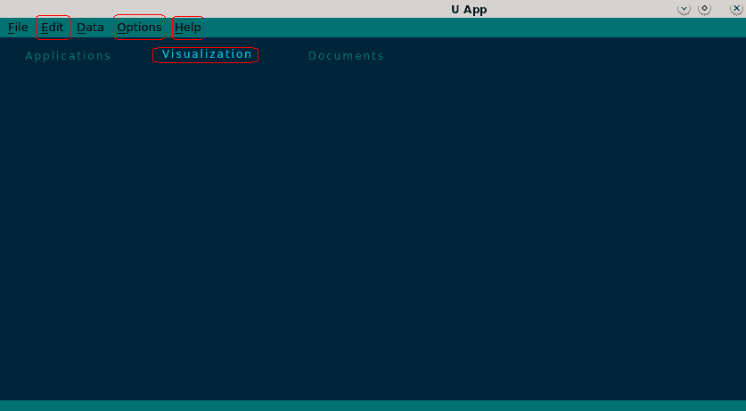
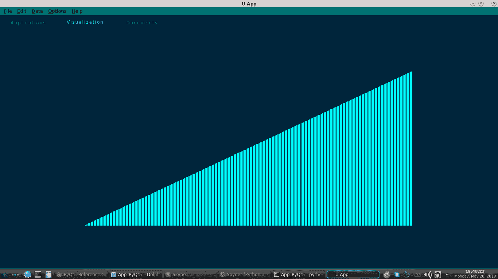
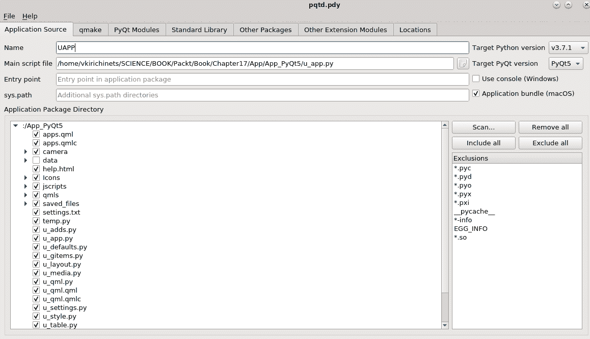
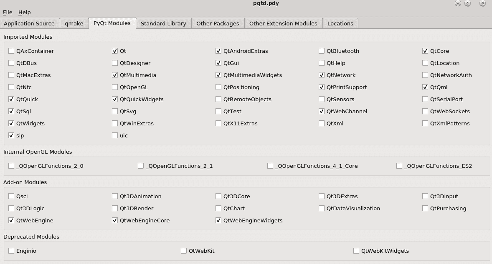
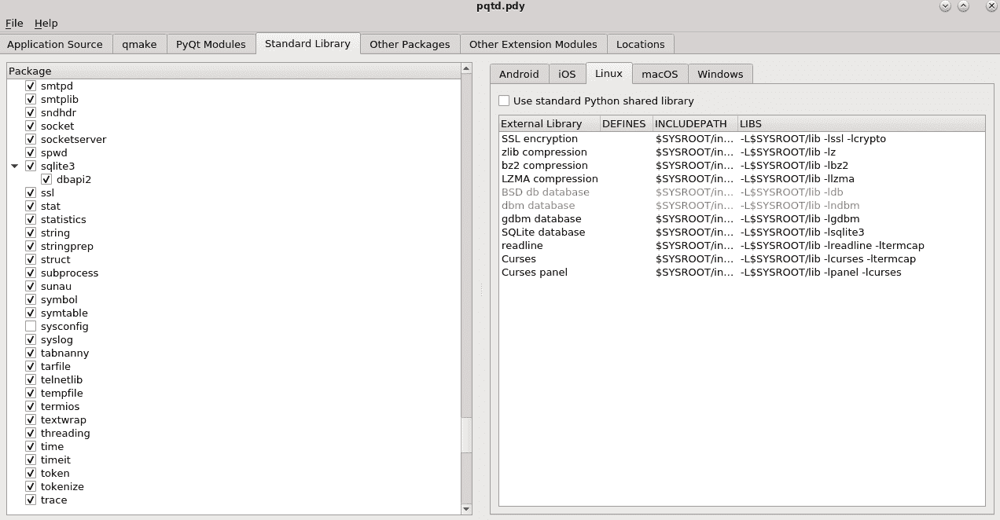
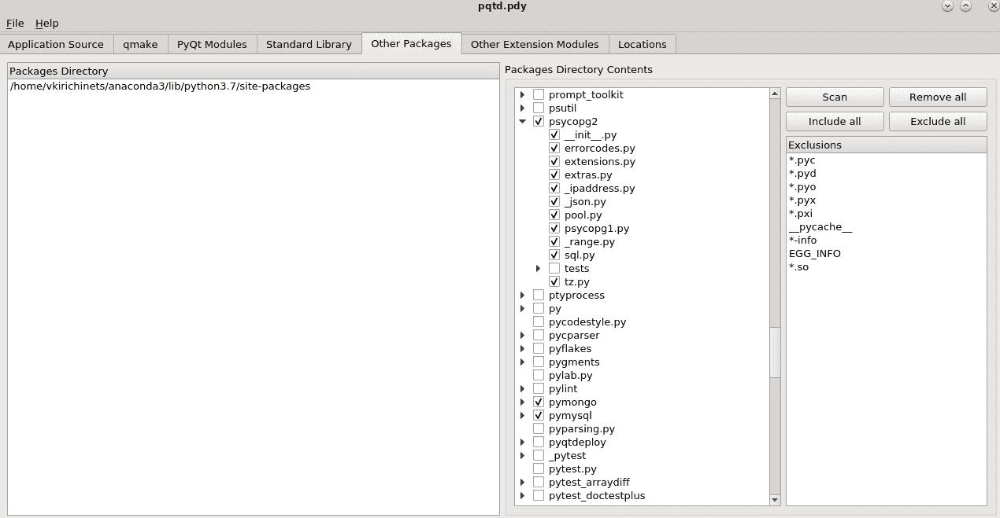
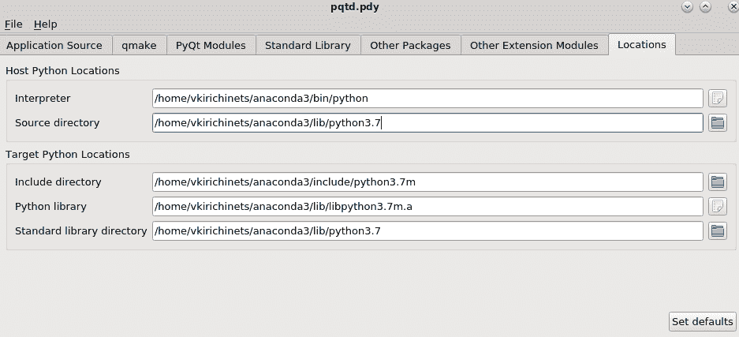
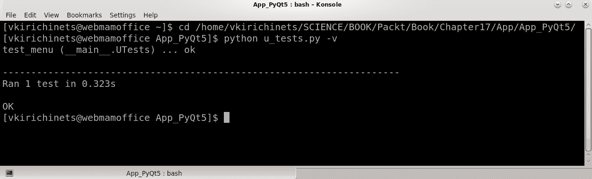

# 完成应用程序、嵌入式设备和测试

本章将完成本书。描述了在开发初期可以使用的主要 GUI 元素。当然，Qt 库有超过 1,500 个类，工具可能根据 GUI 应用任务的不同而有所变化。然而，实现原理是相似的，读者可以轻松实现它们。在本书中，我们创建并演示了一个提供最有用功能的应用程序，本章将打包这个 GUI 应用程序以供展示。我们还将讨论在不同设备和平台上实现 GUI 的机制，并在可能的情况下，无需额外修改。Qt 目前支持最流行和最现代的平台，并为使用嵌入式设备部署应用程序提供了额外的机制。此外，我们将涵盖使用 Qt 库工具实现基于 Qt 的应用程序和库的单元测试的类。本章将涵盖以下主题：

+   完成应用程序

+   嵌入式设备

+   测试

# 完成应用程序

为了完成应用程序，我们需要运行`u_app.py`文件并查看哪些部分/功能尚未完成。正如我们所看到的，顶部面板栏中的一些选项尚未完成，所以让我们来完成这些。



在前面的屏幕截图中，我们看到了`Edit`、`Options`、`Help`和`Visualization`选项，这些选项将在本章的后续内容中构建。

# 编辑选项

顶部面板中的`Edit`选项通常用于使用简单的操作（如撤销/重做之前的操作、从文本字段中剪切选定文本、复制和粘贴到/从缓冲区）编辑文本编辑字段中的某些文本。

一些编辑选项是标准的，并复制了默认弹出窗口的选项，但我们添加了带有子菜单的`Alignment`选项以及文本编辑字段文本的字体/颜色更改选项。首先，打开`u_window.py`文件并添加/更改以下行：

1.  向`Edit`菜单添加新选项并添加一个子菜单，如下所示：

```py
...
class UWindow(UWin):

    def __init__(self, parent=None):
        ...
        self.mb2 = UMenu(self.menubar)
        self.mb2.addAction("Undo")
        self.mb2.addAction("Redo")
        self.mb2.addAction("Cut")
        self.mb2.addAction("Copy")
        self.mb2.addAction("Paste")
        self.mb2_1 = self.mb2.addMenu("&Alignment")
        self.mb2_1.addAction("center")
        self.mb2_1.addAction("left")
        self.mb2_1.addAction("right")
        self.mb2_1.addAction("justify")
        self.mb2.addAction("Text Color")
        self.mb2.addAction("Text Font")
        self.mb2.setTitle("&Edit")
    ...
...
```

将`"&Alignment"`选项添加为`Edit`选项的子菜单。还添加了关于文本字段中选定文本的颜色和字体的选项。

1.  现在我们需要对`u_app.py`文件中的`UApp`类进行一些添加/更改。

对`UApp`类的`Edit`选项的信号进行一些修改：

```py
...
class UApp(UWindow, UTools):

    def __init__(self, parent=None):
        ...
        self.mb1.triggered.connect(self.files)
        self.mb2.triggered.connect(self.edit)
        self.mb2_1.triggered.connect(self.edit_align)
        self.mb3.triggered.connect(self.data)
        ...
    ...
...
```

`Edit`选项（`self.mb2`）将`triggered()`信号连接到`edit()`函数，而`Alignment`子菜单选项将连接到`edit_align()`函数。

1.  现在将`edit()`函数添加到`UApp`类中，如下所示：

```py
...
    ...
    def edit(self, action):
        if action.text() == "Undo":
            self.text_edit.undo()
        if action.text() == "Redo":
            self.text_edit.redo()
        if action.text() == "Cut":
            self.text_edit.cut()
        if action.text() == "Copy":
            self.text_edit.copy()
        if action.text() == "Paste":
            self.text_edit.paste()
        if action.text() == "Text Color":
            fd = QtWidgets.QColorDialog(self)
            if fd.exec_() == QtWidgets.QDialog.Accepted:
                fc = fd.selectedColor()
                self.text_edit.setTextColor(fc)
        if action.text() == "Text Font":
            fd = QtWidgets.QFontDialog()
            if fd.exec_() == QtWidgets.QDialog.Accepted:
                f = fd.selectedFont()
                self.text_edit.setFont(f)
    ...
...
```

此函数将使用简单的编辑选项操作，并包含更改文本编辑字段中选定文本的字体/颜色的功能。

1.  现在将`edit_align()`函数添加到`UApp`类中，如下所示：

```py
...
    ...
    def edit_align(self, action):
        if action.text() == "center":
            self.text_edit.setAlignment(
                              QtCore.Qt.AlignCenter)
        if action.text() == "left":
            self.text_edit.setAlignment(
                                QtCore.Qt.AlignLeft)
        if action.text() == "right":
            self.text_edit.setAlignment(
                               QtCore.Qt.AlignRight)
        if action.text() == "justify":
            self.text_edit.setAlignment(
                             QtCore.Qt.AlignJustify)
    ...
...
```

与此选项相关联，文本编辑字段的文本对齐将使用`QtCore`模块的`Qt`命名空间的`Alignment`标志进行更改。

# 选项“选项”

下一个选项是“运行”子选项。这可以在脚本执行部分的文本编辑字段中直接实现 Python 标准库的一些功能。这将非常清楚地展示 Python 解释器的本质。我们将把文本字段的内容保存到文件中，并使用`subprocess`模块运行它。我们还将实现之前描述的线程的另一种构建。让我们实施以下步骤：

1.  首先，我们需要在`u_tools.py`文件中添加一些行。通过添加`QObject`类来更改`import`部分的行，如下所示：

+   在 PyQt5 的`u_tools.py`文件的情况下，添加以下行：

```py
...
from PyQt5.QtCore import QThread, QObject, QMutex
...
```

+   并且，在 PySide2 的`u_tools.py`文件的情况下，添加以下行：

```py
...
from PySide2.QtCore import QThread, QObject, QMutex
...
```

1.  添加将实现功能的`RunThread`类：

```py
...
class RunThread(QObject):

    sig1 = app_signal(object, object, str)

    def __init__(self, parent=None, datas=None):
        super(RunThread, self).__init__(parent)
        self.datas = datas

    def on_run_code(self):
        try:
            import subprocess
            wf = open("temp.py", "w")
            wf.write(self.datas)
            wf.close()
            sp = subprocess.Popen(
                        ["python", "temp.py"],
                         stdout=subprocess.PIPE,
                         stderr=subprocess.PIPE)
            out = sp.communicate()
            self.sig1.emit(out[0].decode("utf-8"),
                           out[1].decode("utf-8"), '')
        except Exception as err:
            self.sig1.emit('', '', str(err))
...
```

这是一个简单的类，继承自**`QtCore`**模块的`QObject`类。当`on_run_code()`函数被调用时，它将写入文件并使用子进程运行文件。

1.  将`run_code()`函数添加到`u_tools.py`文件的`UTools`类中，如下所示：

```py
...
    ...
    def run_code(self, datas=None):
        self.run_thread = QThread()
        self.run_obj = RunThread(datas=datas)
        self.run_obj.moveToThread(self.run_thread)
        self.run_thread.started.connect(self.run_obj.on_run_code)
        self.run_thread.start()
        return (self.run_thread, self.run_obj)
    ...
...
```

此函数与之前创建的线程相关联，使用`QObject`类的`moveToThread()`方法。重要的是要注意，我们可以看到需要使用线程的`started()`信号来启动`RunThread`类的`on_run_code()`函数。

现在，我们可以在`u_app.py`文件的`UApp`类中实现此选项。我们需要在`u_app.py`文件的`import`部分添加标准库的 time 模块，用于处理时间和数据，如下所示：

1.  将`time`模块添加到`u_app.py`文件中：

```py
...
import time
...
```

1.  现在，我们可以将新选项添加到`UApp`类的`options()`函数中：

```py
...
    ...
    def options(self, action):
        ...
        if action.text() == "Run":
            action.setEnabled(False)
            datas = self.text_edit.toPlainText()
            try:
                self.text_edit.append(
                        "\n\n\n\n\nRESULT -----------> %s\n" %
                            time.strftime("%Y.%m.%d %H:%M:%S"))
                runs = self.run_code(datas=datas)
                def to_field(sto, ste, er):
                    if er == '':
                        self.text_edit.append(
                                  str(sto) + "\n" + str(ste))
                    else:
                        self.stat_bar.showMessage(er)
                runs[1].sig1.connect(
                        to_field, QtCore.Qt.QueuedConnection)
                runs[0].quit()
                def on_stop():
                    action.setEnabled(True)
                runs[0].finished.connect(on_stop)
            except Exception as err:
                self.stat_bar.showMessage(str(err))
    ...
...
```

在此选项中，我们禁用了顶部面板菜单中的“运行”项。然后，我们从文本字段中检索文本，从`u_tools.py`文件中调用`UTools`类的函数，并接收一个包含线程和所用类的元组。我们创建了两个嵌套函数来接收信号。第一个接收来自`RunThread`类的信号，第二个接收具有`finished()`信号的线程的信号。

# 配置选项

“配置”项是可选的，读者可以添加他们自己的喜欢的功能。使用此选项，我们将提供有关 Python 及其已安装包的一些信息。为此，在`App/App_PyQt5/`和`App/App_PySide2/`目录中创建`u_widget.py`文件，并在其中包含用于应用程序中附加信息任务的控件：

1.  我们需要向此文件的`import`部分添加以下行：

+   在 PyQt5 的`u_widget.py`文件的情况下，添加以下内容：

```py
...
from PyQt5 import QtWidgets
from u_style import UWid, UTextEd, UComBox, UListV
...
```

+   并且，在 PySide2 的`u_widget.py`文件的情况下，添加以下内容：

```py
...
from PySide2 import QtWidgets
from u_style import UWid, UTextEd, UComBox, UListV
...
```

唯一的区别是导入`QtWidgets`模块。

1.  现在将 `UWidget` 类添加到这些 `u_widget.py` 文件中，如下所示：

```py
...
class UWidget(UWid):

    def __init__(self, parent=None):
        super(UWidget, self).__init__(parent)
        self.setWindowOpacity(0.95)
        self.infotxt = UTextEd(self)
        self.infocomb = UComBox(self)
        self.infocomb.setView(UListV())
        self.infolay = QtWidgets.QGridLayout()
        self.infolay.addWidget(self.infotxt, 0, 0, 1, 1)
        self.infolay.addWidget(self.infocomb, 1, 0, 1, 1)
        self.infolay.setSpacing(0)
        self.infolay.setContentsMargins(0, 0, 0, 0)
        self.setLayout(self.infolay)
...
```

用于小部件的简单类取决于任务。

现在将行添加到应用程序的 `u_app.py` 文件中：

1.  在 `import` 部分，添加将导入小部件的行，如下所示：

```py
...
from u_widget import UWidget
...
```

1.  然后，向 `UApp` 类的 `options()` 函数添加选项，以显示有关使用的 Python 版本的信息：

```py
...
    ...
    def options(self, action):
        ...
        if action.text() == "Configuration":
            def get_info():
                if self.uwid1.infocomb.currentIndex() == 0:
                    try:
                        condinf = subprocess.Popen(
                                         ["conda", "list"],
                                     stdout=subprocess.PIPE)
                        conp = condinf.communicate()
                        self.uwid1.infotxt.setText(
                                   conp[0].decode("utf-8"))
                    except Exception as err:
                        self.uwid1.infotxt.setText(str(err))
                if self.uwid1.infocomb.currentIndex() == 1:
                    try:
                        condinf = subprocess.Popen(
                                            ["pip", "list"],
                                     stdout=subprocess.PIPE)
                        conp = condinf.communicate()
                        self.uwid1.infotxt.setText(
                                """Platform: %s\nPython %s version
                                \nPython path list: %s
                                \n\nRecursion limit: %s
                                \nFilesystem encoding: %s
                                \nDefault encoding: %s
                                \nAvailable installed packages:
                                 \n\n%s""" %
                                (sys.platform, sys.version,
                                 sys.path,
                                 sys.getrecursionlimit(),
                                 sys.getfilesystemencoding(),
                                 sys.getdefaultencoding(),
                                 conp[0].decode("utf-8")))
                    except Exception as err:
                        self.uwid1.infotxt.setText(str(err))
            self.uwid1 = UWidget()
            self.uwid1.setWindowTitle("Configuration")
            self.uwid1.infocomb.addItems(["conda", "pip"])
            self.uwid1.infotxt.setReadOnly(True)
            self.uwid1.show()
            self.uwid1.infocomb.activated.connect(get_info)
    ...
...
```

选择此选项将显示带有窗口标题的导入小部件。将选项添加到组合框中，以便使用您选择的子进程运行命令。如果已安装并使用 Anaconda 与此应用程序，将显示 `conda` 软件包，或者可以使用 `pip` 选项检查 Python 软件包。

# 帮助选项

你需要完成的下一步是在顶部面板中添加一个 `Help` 选项。我们将使用 Qt 库的一些网页功能来演示附加功能。首先，`Online Help` 子选项将设置 HTML 标签，然后加载 URL。让我们实现以下步骤：

1.  首先，我们需要向 `u_widget.py` 文件中添加一些行。在 `import` 部分，按照以下方式添加以下行：

+   在 PyQt5 的 `u_widget.py` 文件的情况下，添加以下内容：

```py
...
from PyQt5.QtWebEngineWidgets import QWebEngineView
from PyQt5.QtWebEngineWidgets import QWebEngineSettings
...
```

+   并且，在 PySide2 的 `u_widget.py` 文件的情况下，添加以下内容：

```py
...
from PySide2.QtWebEngineWidgets import QWebEngineView
from PySide2.QtWebEngineWidgets import QWebEngineSettings
...
```

`QtWebEngineWidgets` 模块通过提供表示小部件内容和附加设置的类，在 Qt 库中实现了网页功能。

1.  现在，我们需要向 `UWidget` 类添加以下行：

```py
...
class UWidget(UWid):

    def __init__(self, parent=None):
        ...
        self.wview = QWebEngineView(self)
        self.wview.settings().setAttribute(
                QWebEngineSettings.PluginsEnabled, True)
        self.wview.settings().setAttribute(
                QWebEngineSettings.AutoLoadImages, True)
        self.wview.settings().setAttribute(
                QWebEngineSettings.JavascriptEnabled, True)
        self.wview.setVisible(False)
        ...
        self.infolay = QtWidgets.QGridLayout()
        self.infolay.addWidget(self.wview, 0, 0, 1, 1)
        self.infolay.addWidget(self.infotxt, 0, 0, 1, 1)
        self.infolay.addWidget(self.infocomb, 1, 0, 1, 1)
        ...
...
```

将带有设置的 `**QWebEngineView**` 添加到布局中的第一个位置。这也使此视图不可见。

1.  为了在应用程序中实现 `Help` 选项，我们需要向 `u_app.py` 文件中的 `UApp` 类添加信号和函数。

向 `UApp` 类添加信号，如下所示：

```py
...
class UApp(UWindow, UTools):

    def __init__(self, parent=None):
        ...
        self.mb3.triggered.connect(self.data)
        self.mb4.triggered.connect(self.options)
        self.mb5.triggered.connect(self.on_help)
        ...
    ...
...
```

此信号将在选择 `Help` 选项时连接到 `on_help()` 函数。现在，我们需要向 `UApp` 类添加 `on_help()` 函数。

1.  添加 `on_help()` 函数和第一个 `Online Help` 选项，如下所示：

```py
...
    ...
    def on_help(self, action):
        if action.text() == "Online Help":
            self.uwid2 = UWidget()
            self.uwid2.setWindowTitle("Online Help")
            self.uwid2.infocomb.setVisible(False)
            self.uwid2.infotxt.setReadOnly(True)
            self.uwid2.infotxt.setVisible(False)
            self.uwid2.wview.setVisible(True)
            html = open("help.html", "r").read()
            self.uwid2.wview.setHtml(html)
            self.uwid2.show()
...
```

此选项选择将设置来自文件的 HTML 并显示小部件。`help.html` 文件可以是任何创建的 HTML 文件，它代表指向某些有用资源的链接。

1.  现在，通过添加 `Documentation` 选项来完成 `on_help()` 函数：

```py
...
    ...
    def on_help(self, action):
        ...
        if action.text() == "Documentation":
            def get_docs():
                if self.uwid3.infocomb.currentIndex() == 0:
                    try:
                        self.uwid3.wview.load(
                                QtCore.QUrl(
                            "https://docs.python.org/3/"))
                    except Exception as err:
                        self.stat_bar.showMessage(str(err))
                if self.uwid3.infocomb.currentIndex() == 1:
                    try:
                        self.uwid3.wview.load(
                                QtCore.QUrl(
        "https://www.riverbankcomputing.com/static/Docs/PyQt5/"))
                    except Exception as err:
                        self.stat_bar.showMessage(str(err))
                if self.uwid3.infocomb.currentIndex() == 2:
                    try:
                        self.uwid3.wview.load(
                                QtCore.QUrl(
                    "https://doc.qt.io/qtforpython/index.html"))
                    except Exception as err:
                        self.stat_bar.showMessage(str(err))
            self.uwid3 = UWidget()
            self.uwid3.setWindowTitle("Documentation")
            self.uwid3.infocomb.addItems(
                             ["Python", "PyQt5", "PySide2"])
            self.uwid3.infotxt.setReadOnly(True)
            self.uwid3.infotxt.setVisible(False)
            self.uwid3.wview.setVisible(True)
            self.uwid3.show()
            self.uwid3.infocomb.activated.connect(get_docs)
    ...
...
```

此选项将根据组合框中选择的选项加载 URL 并在控件中可视化这些来源。这些示例是我们之前没有涵盖的使用案例，例如 Qt 的网页功能，建议您使用相关文档了解这些类。此外，根据使用的环境，可能还需要额外的配置和设置。

该 `help.html` 文件可以在本书的 GitHub 仓库中找到：[`github.com/PacktPublishing/Hands-On-Qt-for-Python-Developers/tree/master/Chapter17/App/App_PyQt5`](https://github.com/PacktPublishing/Hands-On-Qt-for-Python-Developers/tree/master/Chapter17/App/App_PyQt5)。

# 可视化标签页

我们将通过添加一个查看应用程序使用的数据的可能性的简单示例来整合这本书的材料，并填充`Visualization`标签组件。这是一个数据可视化的演示，可以随时进一步改进。为了创建这个数据可视化，我们将使用一个现有的 CSV 文件，并使用其某一列的值。让我们实施以下步骤：

1.  打开`u_tools.py`文件，并在所有使用线程实现的类之后添加以下行：

```py
...
class PaintThread(QThread):

    sig1 = app_signal(object, str)

    def __init__(self, parent=None):
        super(PaintThread, self).__init__(parent)

    def on_source(self, datas):
        self.datas = datas

    def run(self):
        try:
            import pandas
            df = pandas.read_csv("data/bigtests.csv",
                                 chunksize=1000,
                                 engine="python")
            r = self.datas[1]
            h = self.datas[1] / 1000
            for ch in df:
                wx = self.datas[0] / 1000000
                w = ch["User_Name"].values[777] * wx
                xy = (float(r), float(w))
                self.sig1.emit(xy, '')
                time.sleep(0.05)
                r -= h
            if self.isFinished():
                self.quit()
        except Exception as err:
            self.sig1.emit('', str(err))
            if self.isFinished():
                self.quit()
 ...
```

这个`PaintThread`类将实现一个线程，该线程将使用 pandas 读取数据，将接收到的数据转换成可以从中解释位置的格式，并将这些值发出以在应用程序的图形场景上实现。

1.  将信号添加到`u_tools.py`文件中的`UTools`类：

```py
...
class UTools(object):
    ...
    paint_sig = app_signal(list)
    ...
 ...
```

此信号将用于向`PaintThread`类发出数据，例如宽度和高度。

1.  现在，将`draws()`函数添加到`UTools`类中。这将操作并与`PaintThread`类通信：

```py
...
    ...
    def draws(self, w=None, h=None):
        datas = [w, h]
        self.paint_thread = PaintThread()
        self.paint_sig.connect(self.paint_thread.on_source)
        self.paint_sig.emit(datas)
        self.paint_thread.start()
        return self.paint_thread
...
```

此函数将启动线程，使其在图形场景上绘制，同时发出从`PaintThread`类检索到的宽度和高度的数据。这种线程的构建与之前的构建类似。

1.  现在，我们需要打开`u_app.py`文件，通过添加一些行来完成此任务。让我们将场景、视图和画家添加到`UApp`类的`__init__()`函数中：

```py
...
class UApp(UWindow, UTools):

    def __init__(self, parent=None):
        ...
        self.gscene = QtWidgets.QGraphicsScene()
        self.gview = UGraphView(self.twid2)
        self.painter = QtGui.QPainter()
        self.gvlay = QtWidgets.QGridLayout()
        self.gvlay.addWidget(self.gview, 0, 0, 1, 1)
        self.gvlay.setContentsMargins(0, 0, 0, 0)
        self.twid2.setLayout(self.gvlay)
        ...
        self.push_but2.clicked.connect(self.vis)
        ...
    ...
...
```

这将声明图形场景、图形视图、可用的画家，并将一个带有视图的场景添加到第二个标签小部件中，并使用网格布局排列这些元素。我们还需要更改第二个按钮信号连接的调用函数。

1.  现在，将`vis()`函数添加到`UApp`类中：

```py
...
    ...
    def vis(self):
        self.tabwid.setCurrentIndex(1)
        desktop = QtWidgets.QApplication.desktop()
        self.setGeometry(desktop.availableGeometry())
        self.visualize()
    ...
 ...
```

此函数将设置第二个标签小部件为当前标签小部件。应用程序的几何形状将更改为桌面设备的可用大小。我们将运行此函数来可视化数据。

1.  最后，将`visualize()`函数添加到`UApp`类中：

```py
...
    ...
    def visualize(self):
        self.gscene.clear()
        self.gview.resetCachedContent()
        self.gview.setScene(self.gscene)
        self.gview.setSceneRect(self.gscene.sceneRect())
        self.pen = QtGui.QPen()
        self.scw = float(self.tabwid.currentWidget().width() - 30)
        self.sch = float(self.tabwid.currentWidget().height() - 30)
        try:
            dline = self.draws(w=self.scw, h=self.sch)

            def to_line(xy, er):
                if er == '':
                    color = QtGui.QColor("#00D9FF")
                    cmyk = color.toCmyk()
                    c = cmyk.cyanF()
                    m = cmyk.magentaF() * float(1/xy[1])
                    y = cmyk.yellowF() * float(1/xy[1])
                    k = cmyk.blackF() * float(1/xy[1])
                    a = cmyk.alphaF()
                    color.setCmykF(c, m, y, k, a)
                    self.pen.setColor(color)
                    self.gscene.addLine(QtCore.QLineF(xy[1],
                    self.sch, xy[1], xy[0]), self.pen)
                else:
                    self.stat_bar.showMessage(self.actx + ' ' + er)

            dline.sig1.connect(to_line, QtCore.Qt.QueuedConnection)
        except Exception as err:
            self.stat_bar.showMessage(self.actx + ' ' + str(err))
    ...
...
```

此函数将使用图形视图和图形场景在标签小部件上可视化数据。将使用在笔中指定的颜色、位置和从数据值解释的高度在场景中添加线条。在点击“确定”后，我们可以看到以下结果：



由于我们只有线性数据，可视化将相对普通，但如果某些数据要使用各种值而不是这种线性形式，我们将得到不同的结果。

# 部署到嵌入式设备

Qt 库提供了一套丰富的工具集，支持在大多数现代平台和嵌入式设备上实现 GUI 应用程序。例如，在 Linux 系统上，我们可以轻松创建桌面文件并启动此文件，如果需要，从桌面工作区或任何喜欢的文件夹中运行应用程序。`uapp.desktop` 文件看起来像以下示例，它实现了应用程序的桌面入口：

```py
[Desktop Entry]
Path=/Path/to/the/App/App_PyQt5/
Exec=/Path/to/the/installed/python /Path/to/the/App/App_PyQt5/u_app.py
Icon=/Path/To/the/App/App_PyQt5/Icons/python1.png
Name=UAPP
StartupNotify=true
Terminal=false
Type=Application
```

在绑定使用方面，PyQt5 可以更改为 PySide2。在 Windows 系统上，这可以通过使用第三方 Python 包（如 PyInstaller 和 py2exe）来实现，这些包将 Python 脚本转换为可执行文件（`.exe` 文件）并相应地实现功能。此外，PyInstaller 工具也可以用于 macOS X 系统。建议您通过访问 [`pythonhosted.org/PyInstaller/`](https://pythonhosted.org/PyInstaller/) 了解 PyInstaller 相关文档。这些工具提供简单的操作，以便快速轻松地创建可执行文件。另一种情况是部署应用程序到移动设备。可以帮助完成这些任务的工具和库通常在商业许可下提供，实际上，PyQt 和 PySide 绑定并不非常适合这些任务。

实现应用程序移动版本的一个更好的方法是使用 Kivy 框架、Toga 跨平台 GUI 工具包等，这些框架专门从事移动开发。官方 Qt 源代码在商业许可下提供嵌入式工具和解决方案，有助于在 Android 和 iOS 移动平台上构建和部署 Qt GUI 应用程序。顺便提一下，基于 QML 的应用程序可以很容易地使用 Qt 实现，例如在 第一章 “Python 和 Qt 简介”中提供的示例。

[`www.riverbankcomputing.com`](https://www.riverbankcomputing.com) 提供了带有 `pyqtdeploy` 库的 PyQt5 GUI 移动解决方案。这实现了 PyQt5 应用程序在 iOS 和 Android 平台上的部署。`pyqtdeploy` 库是为了将 Python GUI 应用程序、Python 解释器、Python 标准库、Python C 扩展和第三方扩展和包转换为单一、针对特定目标的可执行文件，该文件可以在大多数流行的桌面和移动平台上运行。`pyqtdeploy` 机制在 BSD 许可下发布，并将详细介绍。要使用它，我们需要在包含 PyQt5 绑定的 Python 安装上使用 `pip` 安装此包：

1.  使用 Python 3.x 版本和 PyQt5 通过 `pip` 在 Anaconda 中安装 `pyqtdeploy`，如下所示：

```py
> pip install pyqtdeploy
```

1.  然后，我们需要在 `App/` 文件夹中（可选）创建 `pyqtdeploy` 项目，在命令行/Terminal 中输入以下命令：

```py
> cd Path/to/the/App
> pyqtdeploy pqtd.pdy
```

`pqtd`是项目的名称，`pqtd.pdy`是这个项目的文件。当点击*Enter*按钮时，`pyqtdeploy` GUI 窗口将显示，可以选择所需的参数，如下所示：

+   名称：将要创建的应用程序可执行文件的名字。

+   主脚本文件：将被用于调用此应用程序的可执行 Python 脚本文件的文件名。

+   入口点：基于 Setuptools 的应用程序的入口点，如果指定了主脚本文件，则不需要指定。

+   sys.path：用于指定`sys.path`的附加路径，例如应用程序目录、ZIP 文件和 EGG。列表包含路径字符串，例如`['/Path/to/the/App', '/path/to/the/App/App_PyQt5', '/path/to/the/App/App_PyQt5/qmls', ...]`等等。

1.  现在我们需要点击 Scan...按钮，选择`App/App_PyQt5/`目录，并点击 Include all。我们将得到类似以下截图的应用程序目录树：



1.  取消勾选此树中的`data`文件夹。然后，我们需要定义将要使用的 PyQt5 模块。为此，选择***PyQt Modules***标签并选择在应用程序中使用过的模块，类似于以下内容：



1.  其中一些是通过提示选择的，这很容易做到。转到 Standard Library 标签并选择所有将要使用的 Python 标准库模块和包，如图所示：



我们可以选择全部并取消勾选`sysconfig`模块。

1.  然后，转到 Other Packages 标签并选择应用程序所需的附加包。正如我们回忆的那样，有`pymysql`、`couchdb`等。为此，点击 Packages Directory 部分顶部，打开将扫描包的目录（通常，这是`/Path/to/the/installed/Python/site-packages`），查看可用的包，并选择所需的包。然后，点击 Scan，`site-packages/directory`的所有包都将显示出来。我们需要选择使用的包，如`pandas`、`pymysql`、`psycopg2`、`pymongo`和`couchdb`：



1.  在位置标签中，我们将配置主机和目标 Python 位置，类似于以下内容：



您的路径将与已安装的 Python 解释器目录相关。现在，我们需要通过点击文件菜单中的 Save 选项来保存之前的操作到 XML 文档。此文件将保存到`App/`文件夹，文件名为`pqtd.pdy`。

1.  因此，现在特征已经选择并保存，我们需要使用 cmd/Terminal 中的命令来构建此项目，如下所示：

```py
> cd Path/to/the/App/pqtd.pdy
> pyqtdeploy-build pqtd.pdy --target=android-32
```

可以与`--target`选项一起使用的架构有`android-32`、`android-64`、`ios-64`、`linux-64`、`macos-64`、`win-32`和`win-64`平台。现在生成的包可以用于在不同平台上进一步部署。

# 测试

任何完成的应用程序都需要测试其内部的工作部分和组件。在本节中，我们将介绍使用 Qt 库工具（如**`QtTest`**模块）创建的应用程序的单元测试。此外，此模块还允许对 GUI 进行测试扩展。Python 标准库单元测试框架`unittest`或第三方工具，如`pytest`，也可以使用。在实际测试中，通常将`unittest`模块与**`QtTest`**模块结合使用。PyQt5 的**`QSignalSpy`**类可以内省信号的发射。

# QtTest

此模块提供了 Qt 应用程序和库的单元测试实现。要使用此模块，我们需要将以下导入语句添加到将使用测试函数的文件中。最佳做法是在应用程序的`App/App_PyQt5/`和`App/App_PySide2/`目录中创建`u_tests.py`文件，并分别添加以下`import`部分，如下所示：

+   在 PyQt5 的`u_tests.py`文件中，添加以下内容：

```py
...
from PyQt5 import QtTest
...
```

+   在 PySide2 的`u_tests.py`文件中，添加以下内容：

```py
...
from PySide2 import QtTest
...
```

`QtTest`模块提供了`QTest`类，可用于应用程序的单元测试。需要注意的是，PySide2 的`QTest`命名空间和 PyQt5 的`QTest`类是不同的。PySide2 的`QTest`命名空间实现了用于单元测试基于 Qt 的应用程序和库的框架功能，并扩展了 GUI。PyQt5 的`QTest`类没有实现完整的 Qt 单元测试框架，并假设将使用 Python 的`stdlib` `unittest`模块与`QTest`一起使用。因此，PyQt5 的`QTest`不能实例化。

# QTest (PySide2)

此命名空间实现了 Qt 库的单元测试框架。声明语法如下：

```py
test = QtTest.QTest()
```

`QTest`通过以下常用函数改进了功能。完整的列表可以在官方 PySide2 文档中找到（[`doc.qt.io/qtforpython/PySide2/QtTest/index.html`](https://doc.qt.io/qtforpython/PySide2/QtTest/index.html)）：

+   `test.asciiToKey("ascii")`: 将参数中指定的 ASCII 字符键值转换为 Qt 键值。

+   `test.currentAppName()`: 返回当前执行的二进制文件名称。

+   `test.currentDataTag()`: 返回当前测试数据名称。

+   `test.currentTestFailed()`: 如果测试函数失败，则返回`True`。

+   `test.currentTestFunction()`: 这将返回当前测试函数的名称。

+   `test.ignoreMessage(QtMsgType, message)`: 这忽略 `qDebug()`、`qInfo()` 或 `qWarning()` 消息。在全局类型（第一个参数）的消息（第二个参数）返回到输出时，它将从测试日志中删除。如果测试完成且消息未在输出中显示，它将被附加到测试日志中。

+   `test.keyToAscii(key)`: 这将参数中指定的 Qt 键值转换为 ASCII 字符键值。

+   `test.qExtractTestData("dirName")`: 这从资源中提取指定在参数中的目录到磁盘。

+   `test.setBenchmarkResult(float, QTest.QBenchmarkMetric)`: 这设置基准结果（第一个参数），带有指标（第二个参数），该指标指定 Qt 测试应该如何解释与该测试函数相关的结果。

+   `test.toPrettyCString(str, int)`: 这返回相同的 `QtCore.QByteArray`，但只包含 ASCII 字符。

# QTest (PyQt5)

此类包含使 PyQt5 应用程序能够进行单元测试的函数。`QTest` 类通过以下常用函数提高了功能。完整的列表可以在官方 PyQt5 文档中找到 ([`www.riverbankcomputing.com/static/Docs/PyQt5/`](https://www.riverbankcomputing.com/static/Docs/PyQt5/)):

`test.keyClick(QtWidgets.QWidget, QtCore.Qt.Key, QtCore.Qt.KeyboardModifiers, int)`: 这模拟在控件（第一个参数）上点击一个键（第二个参数），带有修饰符（第三个参数），并带有测试延迟（第四个参数）以毫秒为单位。

`test.keyClicks(QtWidgets.QWidget, str, QtCore.Qt.KeyboardModifiers, int)`: 这模拟在控件（第一个参数）上按下一个键序列（第二个参数），带有修饰符（第三个参数），并带有测试延迟（第四个参数）以毫秒为单位。

`test.keyEvent(QtTest.QTest.KeyAction, QtWidgets.QWidget, QtCore.Qt.Key, QtCore.Qt.KeyboardModifiers, int)`: 这向控件（第二个参数）发送一个 Qt 键事件，带有键（第三个参数）和相关的动作（第一个参数），以及修饰符（第四个参数），以及测试延迟（第五个参数）以毫秒为单位。

`test.keyPress(QtWidgets.QWidget, QtCore.Qt.Key, QtCore.Qt.KeyboardModifiers, int)`: 这模拟在控件（第一个参数）上按下一个键（第二个参数），带有修饰符（第三个参数），并带有测试延迟（第四个参数）以毫秒为单位。

`test.keyRelease(QtWidgets.QWidget, QtCore.Qt.Key, QtCore.Qt.KeyboardModifiers, int)`: 这模拟在控件（第一个参数）上释放一个键（第二个参数），带有修饰符（第三个参数），并带有测试延迟（第四个参数）以毫秒为单位。

`test.mouseClick(QtWidgets.QWidget, QtCore.Qt.MouseButton, QtCore.Qt.KeyboardModifiers, QtCore.QPoint, int)`: 这模拟了在控件（第一个参数）上使用修饰符（第三个参数）点击鼠标按钮（第二个参数），并带有测试延迟（第五个参数）以毫秒为单位。点击的位置（第四个参数），默认情况下，是控件的中心。

`test.mouseDClick(QtWidgets.QWidget, QtCore.Qt.MouseButton, QtCore.Qt.KeyboardModifiers, QtCore.QPoint, int)`: 这模拟了在控件（第一个参数）上使用修饰符（第三个参数）双击鼠标按钮（第二个参数），并带有测试延迟（第五个参数）以毫秒为单位。默认情况下，位置（第四个参数）是控件的中心。

`test.mouseMove(QtWidgets.QWidget, QtCore.QPoint, int)`: 这将鼠标指针移动到控件（第一个参数），带有测试延迟（第五个参数）以毫秒为单位。它将被移动到位置（第四个参数），默认情况下，是控件的中心。

`test.mouseRelease(QtWidgets.QWidget, QtCore.Qt.MouseButton, QtCore.Qt.KeyboardModifiers, QtCore.QPoint, int)`: 这模拟了在控件（第一个参数）上使用修饰符（第三个参数）释放鼠标按钮（第二个参数），并带有测试延迟（第五个参数）以毫秒为单位。默认情况下，位置（第四个参数）是控件的中心。

`test.qSleep(int)`: 这将暂停一定数量的毫秒，由参数指定，阻塞此测试的执行。

`test.qWait(int)`: 这等待一定数量的毫秒，由参数指定；事件将被处理，并且此测试将保持对事件的响应。

`test.qWaitForWindowActive(QtWidgets.QWidget, int)`: 这等待一定数量的毫秒（第二个参数），直到控件的窗口（第一个参数）变得活跃。

`test.qWaitForWindowExposed(QtWidgets.QWidget, int)`: 这等待一定数量的毫秒（第二个参数），直到控件的窗口（第一个参数）被暴露。

`test.touchEvent(QtWidgets.QWidget, QtGui.QTouchDevice)`: 这为设备（第二个参数）创建并返回一个`QtTest.QTest.QTouchEventSequence`类型的序列，以模拟控件（第一个参数）的事件。

# QTest 示例

如我们所见，PyQt5 绑定仅实现了 Qt 测试框架的一部分。GUI 应用的测试可以通过 PyQt5 相关的简单示例构建来演示，这也可以与 PySide2 绑定一起使用。需要注意的是，*QTest (PyQt5)*部分中描述的方法对 PySide2 绑定也是可用的。通过一个简单的示例，将以下行添加到`u_tests.py`文件的`import`部分：

1.  在 PyQt5 的`u_tests.py`文件中，添加以下内容：

```py
...
from PyQt5.QtWidgets import QApplication
from PyQt5.Qt import Qt
from u_window import UWindow
import unittest
...
```

1.  在 PySide2 的`u_tests.py`文件中，添加以下内容：

```py
...
from PySide2.QtWidgets import QApplication
from PySide2.QtCore import Qt
from u_window import UWindow
import unittest
...
```

测试元素将是实现 GUI 应用程序窗口的`UWindow`类的元素。我们可以在这一行添加任何小部件。

1.  现在将继承 Python 标准库`unittest`模块的`TestCase`基类的类添加到`u_tests.py`文件中。

将`UTests`类添加到`u_tests.py`文件中，通过在文件中添加调用`unittest`模块的`main()`函数的行来完成文件：

```py
...
class UTests(unittest.TestCase):

    def setUp(self):
        self.app = QApplication([])
        self.uwin = UWindow() 
        self.menu = self.uwin.menuBar()

    def test_menu(self):
        self.assertEqual(self.uwin.mb1.title(), "&File")
        self.menu.actions()[0].trigger()
        QtTest.QTest.keyPress(self.uwin, Qt.Key_Enter,
                                     Qt.ControlModifier)
        return

    def tear_down(self):
        pass

unittest.main()
...
```

`setUp()`方法使用启动测试所需的实例操作，例如应用程序、导入的`UWindow`类的类实例以及窗口菜单栏。`test_menu()`函数实现并完成这个测试，通过`tearDown()`。

1.  现在，我们可以在 cmd/Terminal 中通过输入以下命令来运行`u_tests.py`文件：

```py
> python u_tests.py -v
```

我们将看到类似以下的输出：



我们可以用这种方式测试任何小部件，并根据我们的任务增强当前的结构。

# 概述

本章完成了本书中创建的 GUI 应用程序。这个应用程序并不假装是解决特殊任务的专用工具，但它可以很容易地扩展和现代化，适用于今天几乎所有常用的 GUI 实现。本书之前已经描述了几乎所有有用的图形元素。将 GUI 部署到各种平台和架构的过程并不容易，需要额外的材料和示例知识。也可能出现一些限制，这取决于设备的版本和支持的环境。因此，建议学习与使用设备相关的需求。测试应用程序需要彻底理解可以测试的元素、为什么以及如何测试。正确实施测试可以帮助避免与应用程序开发相关的大量错误和错误。

本章完成了这本书的内容，读者必须知道接下来要学习什么。此外，Python 的世界非常广阔。
