# 第一章：RESTful 架构基础介绍

Web 服务是一套计算设备向另一套计算设备提供的软件服务或软件功能。这些设备通过万维网（**WWW**）使用既定或标准化的通信协议进行通信。

本章旨在刷新你对 Web 及其架构的一些基本概念的理解，以及其演变的方式，希望为 RESTful 服务设计和应用打下坚实的基础。本章涵盖了以下主题：

+   万维网（WWW）的简要历史及其演变

+   万维网层和架构

+   Web API 开发模型和基于 REST 的服务通信

+   服务导向架构的简要介绍

+   资源导向架构原则和特性

+   REST 介绍

+   REST 约束

+   RESTful 限定符

+   REST 架构目标

# 技术要求

由于本书涉及 RESTful 设计模式的中级到高级主题，我们期望你对 Web 服务概念及其独特功能有很好的理解。如前所述，本章试图刷新你对万维网、其演变以及它提供的各种 Web 服务类型的理解，因此本章没有正式的技术要求。

# 网络技术演变

通常，本书的目的是提供更详细的 RESTful 模式；然而，本节旨在快速介绍自 20 世纪 90 年代初以来的 Web 服务及其演变，提供关于 Web 1.0 到 Web 3.0 的激动人心的事实，然后转向关于**服务导向架构**（**SOA**）和**资源导向架构**（**ROA**）的详细信息。

如你所知，今天的网络是一个宇宙本身，拥有大量的相互链接的基于 Web 的应用程序、图像、视频、照片和各种交互式内容。哪些 Web 技术使这一切成为可能，它从哪里开始，它是如何随着时间的推移而演变的，以及它是如何使 Web 应用程序开发者能够开发出令人惊叹的交互式 Web 体验的？

以下图表提供了万维网及其随时间演变的简要概述。请注意，每个 Web 版本在其对应的框中提到了其启用技术：

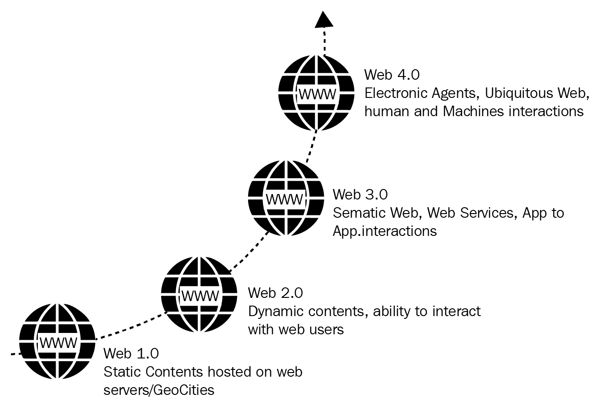

让我们更深入地讨论**Web 3.0**，并关注作为第三代的一部分的 Web 服务及其演变。

# 了解 Web 3.0

以下部分将重点介绍 Web 3.0 以及 Web 服务的演变和历史。

Web 3.0 通常被称为执行语义网，或读写执行网。Web 3.0 将搜索、社交媒体和聊天应用等依赖单一组织运作的服务去中心化。语义和 Web 服务是 Web 3.0 的主要组成部分。

以下图描绘了典型 Web 3.0 结构的层级。语义网层包括**静态 Web**、**翻译**和基于互联网的**富互联网应用**（**RIA**）或**富 Web**：

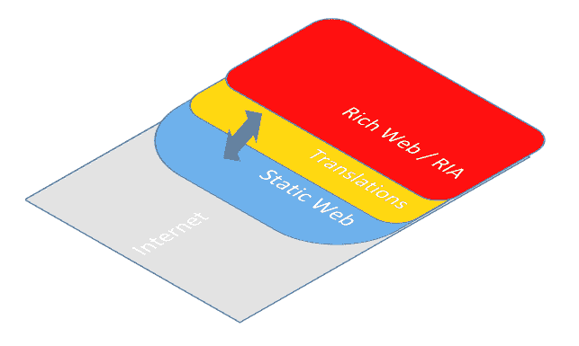

Web 3.0 的分层结构

这个数据驱动的网络会根据用户的搜索进行调整，例如，如果用户搜索架构模式，显示的广告将更相关于架构和模式；它甚至能记住您的最后搜索，并将最后搜索的查询结合起来。有趣，不是吗？

在以下图中您可以看到 Web 3.0 栈，它由各种构建块组成，如 URI、Unicode 表示、语法（XML/JSON）、RDFS 分类法等；它们构成了 Web 3.0 栈：

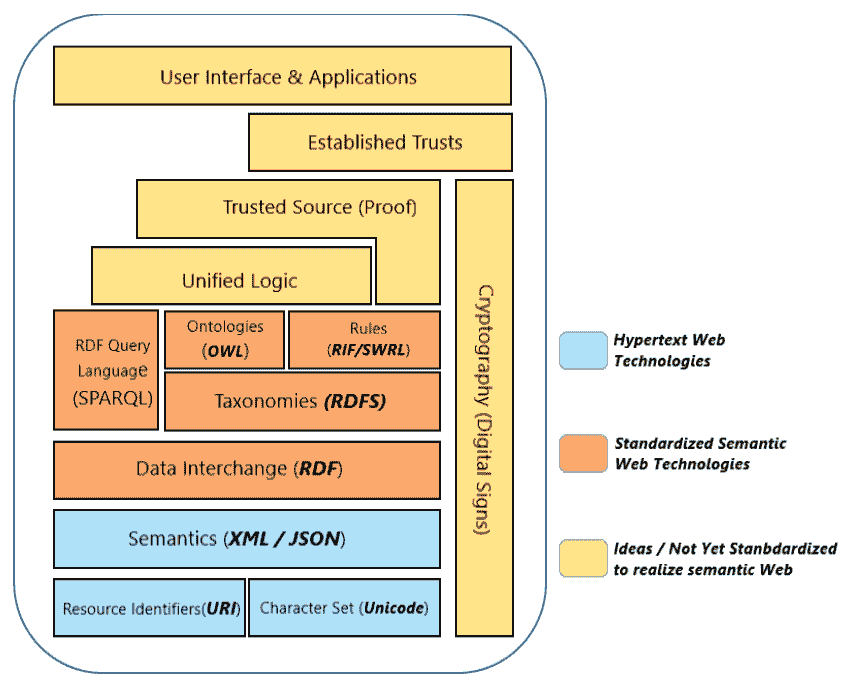

Web 3.0 栈（参考：[`www.w3.org/DesignIssues/w3.org `](https://www.w3.org/DesignIssues)）

让我们继续讨论网络服务架构、规范和通信协议，因为它们是我们转向 ROA、SOA 以及**表示状态转移**（**REST**）或 RESTful 服务之前的基础。

# 了解网络服务架构

网络服务是在网络中两个计算设备之间进行通信的方法，通信以标准化的方式（和规范）发生，用于使用 XML/JSON、SOAP、WSDL 和 UDDI 集成异构网络应用程序。XML/JSON 是提供所包含数据元数据的格式；SOAP 用于传输数据；WSDL 用于定义可消费的服务，而 UDDI 将列出可用的服务。

**网络服务架构**（**WSA**）在开发任何网络服务时要求某些特性的存在，并建议一些可选的特性。

WSA 由三个重要角色组成，如下图中所示，它们如下：

+   **服务提供者**

+   **服务消费者**

+   **服务代理**

这在以下图中展示：

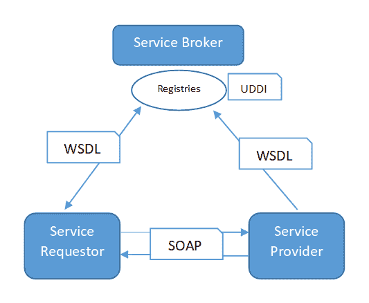

**服务请求者**通过**UDDI**找到**服务提供者**，并使用**简单对象访问协议**（**SOAP**）与提供者联系。然后，**服务提供者**验证服务请求，并以 XML/JSON 作为服务响应向请求者做出响应。

# 讨论网络 API

到目前为止，我们已经讨论了客户端/服务器/网络服务的范式基础，以及它们如何通过标准协议进行通信；然而，我们尚未触及基于 REST 的通信，毕竟这正是本书的主题。本节将介绍网络 API 的介绍，以及网络 API 是如何成为网络服务开发模型。设备之间的通信是基于 REST 的。RESTful API 不使用/需要基于 XML 的网络服务协议，如 SOAP 或 WSDL 来支持它们的接口，而是使用简化的表示。 

下面的图示展示了网络**API**及其作为客户端和服务器端通过高级接口相互暴露的简化表示：

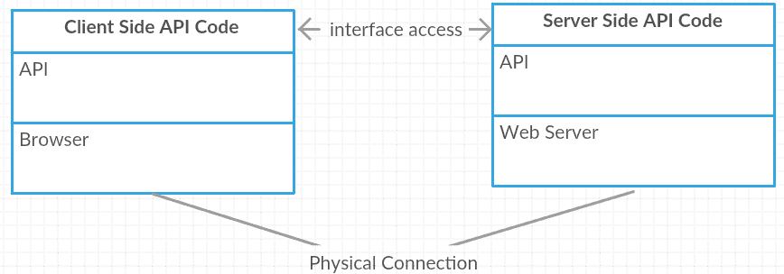

因此，如图所示，网络**API**在客户端和服务器端都是可用的。客户端接口通常以 JavaScript 或浏览器插件的形式暴露，而服务器端接口通常通过 Web 以 JSON/XML 的形式暴露。我们将遇到的一些关于网络 API 的关键术语包括端点、**统一资源标识符**（**URI**）和资源。

网络 API 是针对*任何*网络服务器或网络浏览器的**应用程序编程接口**（**API**）。因此，Web API 是通过 HTTP 协议访问任何 API（可在网络上获得）的概念或方法。存在许多 API 类别，如 SOAP、XML-RPC、JSON-RPC、REST 等。API 可以用任何编程语言开发，如 Java、.NET 等。

因此，现在你已经了解了什么是 Web API 以及 REST API 开发在 Web API 领域中的位置，让我们继续前进，看看下一节中 SOA、ROA、REST、RESTful API 及其关键组成部分的更多细节。

# 了解面向服务的架构

面向服务的架构（Service-oriented architecture）是一种网络服务的架构风格。它定义了一些标准，并规定了设计和发展网络服务的最佳方法。任何网络服务都是具有特定结果的重复性业务活动的逻辑表示，例如获取特定城市的天气预报，访问给定股票的股价，更新库存服务的记录，等等。SOA 是自包含的，同时也提供了将服务与其他服务结合的指南。关于 SOA 的另一个事实是，它对于使用它的服务消费者来说是一个黑盒（或抽象）。

简而言之，SOA 本质上是一组服务，这些服务相互通信，而一个服务是一个定义良好、自包含且独立于其他服务上下文和状态的操作或函数。服务是托管在应用服务器上的应用程序，并通过接口与其他应用程序交互。

SOA 不是一种技术或编程语言；它是一套原则、程序和方法，用于开发软件应用程序。

# 了解面向资源架构

面向资源架构（Resource-oriented architecture）是语义网的基础（请参阅本章的*Web 3.0*部分）。ROA 的理念是使用基本、易于理解和广泛认可的 Web 技术（HTTP、URI 和 XML）以及核心设计原则。

如我们所知，Web 服务的重点是连接信息系统，而 ROA 定义了一种结构设计或一系列指南，以支持并实现任何连接资源内的交互。任何业务实体都可以表示为资源，并且可以通过 URI 使其可访问。

例如，在一个组织的人力资源系统中，每位员工都是一个实体，而薪资、员工详情和档案是该实体的关联（描述符）。

以下是一个面向对象和资源导向概念的快速比较表，它快速概述了 ROA 是什么：

| **面向对象架构中的对象** | **ROA 中的资源** |
| --- | --- |
| 每个实体都被定义为对象 | 实体是服务 |
| 对象具有属性和动作 | 服务具有描述和契约 |
| 对象需要维护状态以进行交互 | 通过定义的位置或地址在网络中进行交互 |

# 资源导向设计

资源导向设计部分旨在向您介绍 ROA 设计指南、设计原则和特性，以及其属性。在介绍了 ROA 属性之后，我们将在后续章节中探讨 REST 架构。

基于 ROA 的 Web 服务描述了一个可发现的自发现实体，其建模基于其逻辑形式（与服务不同，因为它们基于技术形式）。

让我们看一下以下图中 ROA 的基本块，如资源、表示法等：

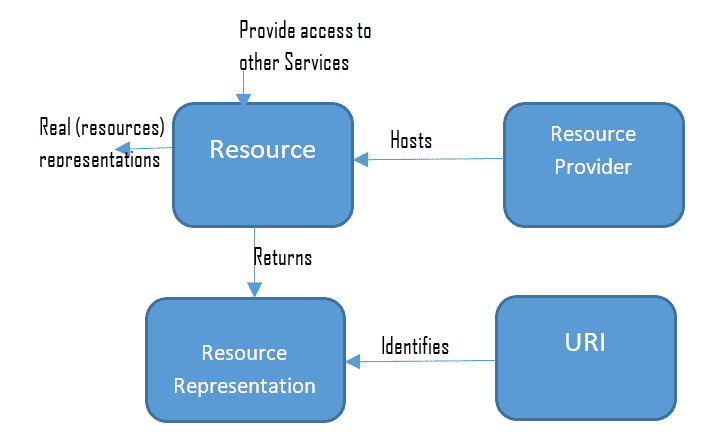

前面图中的块代表了 ROA 的典型结构，并给出了服务消费者如何消费资源的想法。

让我们简要考虑 ROA 的概念和属性，如下所示：

+   **资源提供者**：资源提供者向服务消费者公开资源，以便他们可以使用 HTTP 方法调用服务。微软 Azure 和亚马逊 AWS 是资源提供者的简单例子。

+   **资源**：资源是对一个可识别、可分配的实体的明确引用，并且最重要的是，可以作为资源进行引用。资源的例子可能包括服务器、设备、网页、JavaScript 或软件的最新版本、软件的最新缺陷、一个组织的目录或信息列表等。

+   **资源名称**：资源名称是资源的唯一名称或标识。因此，没有两个资源可以指向相同的数据。例如，软件的最新版本是 2.0.9。

+   **资源表示**：资源表示是关于资源当前状态的有用信息，以特定的格式和特定的语言进行指定。

+   **资源链接和连通性**：表示（链接）另一个资源或资源本身。连通性完全关乎资源链接的可靠性和相关性。

+   **资源接口**：资源接口是访问资源并处理其状态的接口。

+   **可寻址性**：可寻址性是将数据集或功能作为资源暴露出来，资源的可寻址性是通过 URI 实现的。

+   **无状态**：无状态是保持客户端和服务器状态的隔离和独立性。来自客户端的每个请求都应该自包含。

+   **统一接口**：每个服务都需要以相同的方式使用 HTTP 接口，例如 `GET`、`POST`、`PUT`、`DELETE` 等。统一接口简单来说就是使用一些通用的命名法，这些命名法在互联网上被统一解释。例如，`GET` 确实意味着获取（读取）某些内容。

以下表格总结了可用于实现基于 ROA 的 Web 服务的 HTTP 操作：

| **HTTP 操作** | **描述** |
| --- | --- |
| `GET` | 读取资源表示 |
| `PUT` | 创建新资源 |
| `DELETE` | 删除资源（可选地删除相关资源） |
| `POST` | 修改资源 |
| `HEAD` | 资源元信息 |

上表显示了实现 ROA 的 HTTP 方法。

# ROA 的好处

以下列出 ROA 的好处：

+   **独立于客户端合约**：不受接口协议/合约制定的影响，也就是说，无需制定合约，因为整个网络都是基于 HTTP 操作。

+   **显式状态**：由于资源本身代表状态，服务器不会接收到未知的应用特定有效负载；服务器不需要跟踪调用服务器的客户端，客户端也不需要知道它已经与哪个服务器交谈过。

+   **可扩展性和性能**：ROA 的可扩展性体现在无合约边界、显式状态以及从服务器粘性（会话）中解放客户端等特性。关于 ROA 缓存、负载均衡、索引和搜索的响应时间性能改进在提高性能方面发挥着重要作用。

通过负载均衡器在客户端和特定服务器之间创建亲和力的过程称为 **会话粘性**。

合同或协议本质上是一组元数据，它定义了底层软件程序许多方面。

# 从 REST 开始

到目前为止，我们已经探讨了 ROA 和一系列指南，例如无状态、资源、可寻址性、统一资源等。这些指南是 REST 架构的基本实现。由于本书全部关于 RESTful 模式，我们将在本节中进一步探讨 REST 架构风格。

REST 概念是由 Roy Fielding 提交的博士论文。REST 的基本原则是使用**HTTP**协议进行数据通信（在分布式超媒体系统之间），并且它围绕资源的概念展开，其中每个组件都被视为资源，这些资源通过**HTTP**方法使用通用接口进行访问：

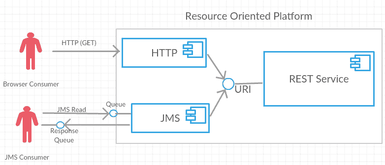

一个 ROA/REST 服务的示例实现

上述图表显示了 REST 在 ROA 架构中的位置以及它如何被不同的消费者访问。

REST 是一种架构风格，而不是一种编程语言或技术。它为分布式系统提供了使用现有网络原则和协议直接进行通信的指南，以创建 Web 服务和 API，无需 SOAP 或其他复杂协议。

REST 架构简单，提供对资源的访问，以便 REST 客户端在客户端端访问和渲染资源。在 REST 风格中，URI 或全局 ID 有助于识别每个资源。正如您所知，REST 使用多种资源表示形式来表示其类型，如 XML、JSON、文本、图像等。

# REST 架构风格约束

有一些设计规则应用于确定 REST 架构风格的特性，这些规则被称为 REST 约束：

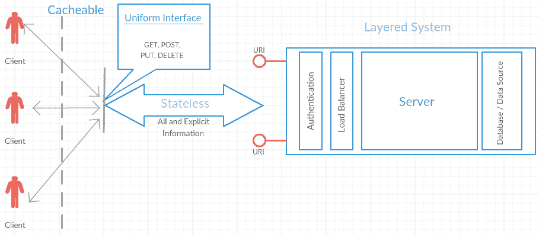

REST 架构风格约束

上述图表展示了典型基于 Web/互联网的应用程序中的 REST 约束。以下是一些 REST 约束：

+   客户端-服务器

+   无状态

+   可缓存

+   统一接口

+   分层系统

+   需求时提供代码

# 从客户端-服务器开始

客户端-服务器架构或模型有助于在用户界面和数据存储之间分离关注点：

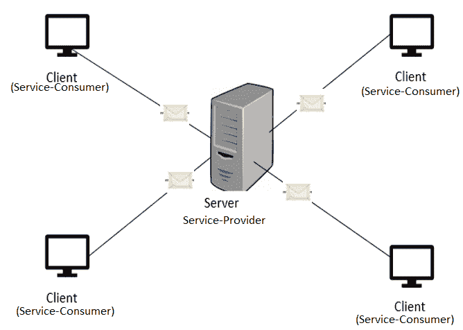

客户端和服务器

让我们按照以下方式在 ROA 的背景下讨论客户端和服务器：

+   **客户端**：它是请求服务的组件，向服务器发送各种类型服务的请求

+   **服务器**：它是服务提供者组件，根据请求持续向客户端提供服务

客户端和服务器通常由分布式系统组成，它们通过网络进行通信。

# 客户端在客户端-服务器架构中

单个服务器可以服务的客户端数量没有上限。客户端和服务器是否位于不同的系统中也不是强制性的。根据系统的硬件配置和服务器提供的功能或服务类型，客户端和服务器可以位于同一系统中。客户端和服务器之间的通信是通过使用请求-响应模式交换消息来实现的。客户端基本上发送一个服务请求，服务器返回一个响应。这种通信的请求-响应模式是进程间通信的一个优秀例子。为了使这种通信高效进行，有必要有一个定义良好的通信协议，该协议规定了通信规则，例如请求消息的格式、响应消息、错误处理等。所有用于客户端-服务器通信的通信协议都在协议栈的应用层工作。为了进一步简化客户端-服务器通信的过程，服务器有时会实现一个特定的 API，客户端可以使用该 API 从服务器访问任何特定的服务。

# 客户端-服务器架构中的服务

在客户端-服务器架构的上下文中使用的术语“服务”指的是资源的抽象。资源可以是任何类型，基于服务器（服务）提供的资源；服务器据此命名。例如，如果服务器提供网页，它被称为**Web 服务器**；如果服务器提供文件，它被称为**文件服务器**，等等。服务器可以在特定时间点接收来自任何数量客户端的请求。但任何服务器都将有其自己的处理能力限制。通常，服务器需要优先处理传入的请求，并按优先级提供服务。服务器中存在的调度系统帮助服务器分配优先级。

客户端-服务器的好处除了关注点的分离外，还有助于以下方面：

+   提高用户界面的可移植性

+   通过简化服务器实现来提高可扩展性

+   使用独立、可测试的组件进行开发

# 理解无状态

无状态约束有助于服务更加可扩展和可靠。在 REST 的上下文中，无状态意味着所有客户端对服务器的请求都携带所有信息作为显式（声明）的，这样服务器就能理解请求，将它们视为独立的，并且这些客户端请求使服务器独立于任何存储的上下文。将会话状态保持在客户端内对于管理这种约束在服务中非常重要。

下图显示了 **服务消费者**（客户端）和**服务状态**是独立的，并且分别在客户端和服务器内部进行管理：

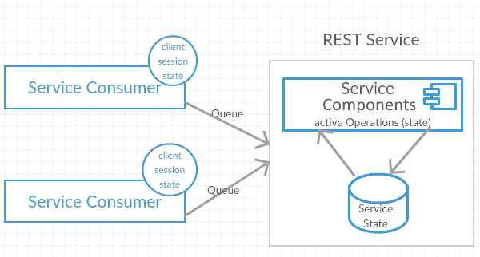

无状态（独立管理状态）

无状态约束对服务与消费者之间允许的通信类型施加了重大限制，以实现其设计目标。以下是无状态实现的限制：

+   客户端完全负责在客户端存储和处理所有应用程序状态及其相关信息。

+   客户端负责在需要时向服务器发送任何状态信息。

+   对于调用请求（客户端）的服务器上没有会话粘性或会话亲和力。

+   服务器还需要包含客户端可能需要创建状态的任何必要信息。

+   HTTP 交互涉及两种状态，应用程序状态和资源状态，无状态适用于两者。让我们看看无状态约束在每个状态中是如何处理的：

    +   **应用程序状态**：存储在服务器端的数据，有助于通过当前上下文信息识别传入的客户端请求，使用之前交互的详细信息。

    +   **资源状态**：这被称为资源表示，它与客户端无关（客户端不需要知道此状态，除非需要作为响应），这是服务器在任何给定时间点的当前状态。

REST 的无状态约束适用于应用程序状态，即仅在应用程序状态上自由，与资源状态无关。Twitter 的 API 是无状态服务的最佳示例（GET: https://api.twitter.com/1.1/direct_messages.json?since_id=xxx&count=x）。

# 无状态的优缺点

以下是无状态的某些优点：

+   由于服务器不需要管理任何会话，因此可以将服务部署到任意数量的服务器上，因此可扩展性永远不会成为问题。

+   无状态等于更少的复杂性；无需在服务器端处理会话（状态）同步逻辑。

+   由于底层应用程序可以缓存服务调用（请求），无状态约束降低了服务器的响应时间，即提高了响应时间方面的性能。

+   与 HTTP 协议的无缝集成/实现是可能的，因为 HTTP 本身就是一个无状态协议。

+   提高了可见性，因为每个请求都是其自身的资源，可以被视为一个独立请求。

+   提高了可靠性，因为它可以从部分故障中恢复。

以下是无状态的某些缺点：

+   增加了每次交互的开销。

+   Web 服务的每个请求都需要获取额外的信息，以便进行解析（解释），以便服务器能够从传入的请求中理解客户端状态，并在需要时处理客户端/服务器会话。

# REST 中的缓存约束

**缓存**是指存储频繁访问的数据（在此上下文中为响应）以服务客户端请求的能力，并且不需要在需要之前生成相同的响应超过一次。良好的缓存管理可以消除部分或全部的客户端-服务器交互，并仍然以预期的响应服务客户端。显然，缓存带来了可扩展性和性能优势，包括更快的响应时间和减少服务器负载。

如您在下一张图中可以看到，服务消费者（**客户端**）从缓存接收响应，而不是从服务器本身接收，还有一些其他响应直接来自服务器。因此，缓存有助于减少或完全消除服务消费者与服务器之间的某些交互，从而有助于提高效率和性能（减少响应的延迟时间）：

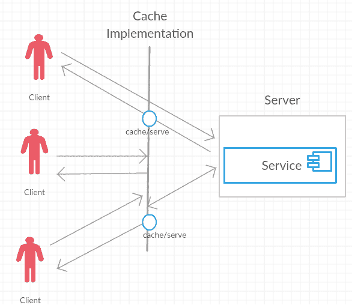

可用的缓存策略或机制有多种，例如浏览器缓存、代理缓存和网关缓存（反向代理），我们可以通过多种方式来控制缓存行为，例如通过 pragma、过期标签等。以下表格展示了可以用来微调缓存行为的各种缓存控制头：

| **头信息** | **描述** | **示例** |
| --- | --- | --- |
| Expires | 表示响应被认为是过时的日期/时间头属性 | Expires: Fri, 12 Jan 2018 18:00:09 GMT |
| Cache-control | 定义了各种指令的头信息（适用于请求和响应），这些指令被缓存机制遵循 | `Max age=4500`, cache-extension |
| E-Tag | 服务器资源状态的唯一标识符 | ETag:`uqv2309u324klm` |
| Last-modified | 响应头帮助识别响应生成的时间 | Last-modified: Fri, 12 Jan 2018 18:00:09 GMT |

更多关于缓存控制指令的信息，请参阅 [`tools.ietf.org/html/rfc2616#section-14.9`](https://tools.ietf.org/html/rfc2616#section-14.9)。

# 缓存的好处

显然，缓存频繁访问的数据有很多好处，以下是一些显著的好处：

+   减少带宽

+   减少延迟（更快的响应时间）

+   减轻服务器负载

+   隐藏网络故障，并以响应服务客户端

缓存约束建立在客户端-服务器和无状态约束的基础上，要求响应被隐式或显式地标记为可缓存或不可缓存。

# 理解统一接口

如我们之前在 ROA 的统一接口部分提到的，基于 REST 的服务可以使用 HTTP 接口，如 `GET`、`POST`、`PUT`、`DELETE` 等，以保持整个网络的统一性。统一接口的目的是在互联网上保留一些共同词汇。例如，`GET` 的确意味着从服务器获取（读取）某些内容。服务可以独立发展，随着其接口的简化和架构的解耦，统一接口也为这些资源带来了统一的词汇。以下图表展示了 **HTTP 方法** 和 **资源名称** 对于 **统一接口** 的组合：

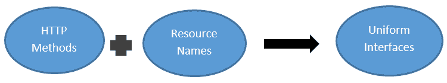

Fielding 提出的四个指导原则构成了满足统一接口的必要约束，具体如下：

+   资源识别

+   资源操作

+   自描述消息

+   超媒体作为应用状态引擎

我们将在以下章节中详细讨论每个约束。

# 资源识别

如我们之前在早期章节中看到的，资源代表网络应用程序中的一个命名实体，它通常是 **统一资源定位符**（**URL**）。因此，一个实体可以通过对其的显式引用来识别并分配为资源。

网络应用程序中的 URL 通常是一个链接，实际上它是一个 URI。例如，主页 URI，[`developer.twitter.com`](https://developer.twitter.com)，唯一标识了特定网站根资源的概念。在 REST 约束中，我们使用的 URI 描述如下：

+   URI 映射到资源的语义不得改变。例如，Twitter 的 [`api.twitter.com/1.1/statuses/retweets/:id.json`](https://developer.twitter.com/en/docs/tweets/post-and-engage/api-reference/get-statuses-retweets-id) 作为 URI 可能永远不会改变，当然内容或值会根据最新更新不断改进。

+   资源识别与其值无关，因此两个资源可能在某个时刻指向相同的数据，但它们不是同一个资源。

+   例如，URI 1，[`api.twitter.com/1.1/statuses/retweets/:id.json`](https://api.twitter.com/1.1/statuses/retweets/:id.json)，返回一个包含最多 100 条最近转发的推文（通过 ID 指定）的集合。

+   另一个 URI 2，[`api.twitter.com/1.1/statuses/retweeters/ids.json`](https://developer.twitter.com/en/docs/tweets/post-and-engage/api-reference/get-statuses-retweeters-ids)，[返回一个包含最多 100 个用户 ID 的集合，这些用户 ID 属于已经转发推文（通过 ID 参数指定）的用户](https://developer.twitter.com/en/docs/tweets/post-and-engage/api-reference/get-statuses-retweeters-ids)。

第二种方法提供了与第一种方法（状态/转发）类似的数据，并可能产生相同的结果或组合，但两种方法确实代表了不同的资源。

+   URI 带来了好处，如只有一个访问资源的方式，动态媒体类型用于资源响应（在请求时提供媒体类型）借助 Accept 头，以及访问这些动态资源的客户端在响应内容类型发生变化时不需要更改任何标识符。

# 资源操作

一旦识别资源，服务器就可以以不同的格式返回资源，例如 JSON、XML、HTML、PNG、SVG 等。这些格式是已识别资源的表示，客户端将从头部了解可能的定义良好的格式或媒体类型列表（也称为**多用途互联网邮件扩展**（**MIME**））。

资源表示被客户端操纵或处理。应用程序需要支持同一资源的多种表示和相同的 URI；换句话说，相同的资源由不同的客户端以不同的方式表示。

让我们举一个例子；一个文档可能被表示为 JSON 给自动化程序，但作为 HTML 给网页浏览器。这些表示的目的在于提供一种与资源交互的方式，因此客户端可以表明他们希望接收的预期表示。

前面的概念区分允许资源以不同的方式表示，而不会改变其标识符。这是通过客户端在每次请求中通过 HTTP 头（Accept）传递给服务器的。资源通过 RESTful 应用程序发送表示来更新或添加。以下图是一个示例表示格式，它捕捉了我 Postman 工具的一个示例请求：

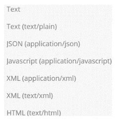

因此，资源表示与 URI 的解耦是 REST 的关键方面之一。

以下列表显示了可以在请求或响应中使用（作为标题）的各种内容类型表示格式：

+   Text/HTML, text/CSS, text/JavaScript

+   Application/XML, application/JSON, application/x-www-form-urlencoded

+   图像（SVG、JPG、PNG 等）

**Postman**是一个帮助我们与 REST API 交互的工具。它提供了一个非常友好的用户界面，可以通过构建请求和读取响应来快速测试 API。第六章，本书的*RESTful 服务 API 测试和安全*提供了更多关于 Postman 工具及其更广泛的测试 RESTful API 能力的信息。

# 自描述消息

客户端的请求和服务器端的响应都是消息；这些消息应该是无状态的且自描述的。它们可以包含正文和元数据。RESTful 应用操作于受约束的消息类型（`GET`、`HEAD`、`OPTIONS`、`PUT`、`POST` 和 `DELETE`）的概念，并且被服务器和客户端完全理解。

资源期望的状态可以表示在客户端的请求消息中。资源当前的状态可能体现在从服务器返回的响应消息中。例如，一个维基页面编辑器客户端可能使用请求消息来传输表示，该表示建议更新服务器管理的网页（资源）的新状态。服务器决定接受或拒绝客户端的请求取决于服务器。

自描述消息可能包括元数据，以传达有关资源状态、表示格式和大小以及甚至消息本身的额外细节。HTTP 消息提供了头部，用于将各种类型的元数据组织成统一的字段。以下图表展示了一个示例请求及其头部，以及针对同一请求的服务器响应及其头部：

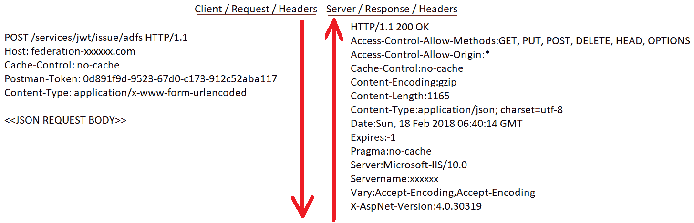

因此，在 REST 风格下的自描述消息就是关于客户端和服务器之间不维护状态，并且需要携带足够关于自身的信息或用显式状态进行解释。所以，在以下表格中，你可以看到带有示例的自描述消息：

| **资源** | `GET` | `PUT` | `POST` | `DELETE` |
| --- | --- | --- | --- | --- |
| `booktitles.com/resources` | 获取属于该集合的所有资源 | 替换为另一个集合 | 创建该集合 | 删除整个集合 |
| `booktitles.com/resources/title18` | 查找第 18 个标题 | 修改第 18 个标题 | 创建新的资源作为第 18 个标题 | 删除第 18 个标题 |

# 超媒体作为应用状态引擎

**超媒体作为应用状态引擎**（**HATEOAS**）是其中最重要的约束之一；如果不解决它，服务就不能被称为 RESTful 服务。然而，在我们深入探讨 HATEOAS 的细节之前，让我们先简要了解一下 **理查德森成熟度模型**（**RMM**），因为它是一个重要的参考，并作为任何 RESTful 服务遵循 HATEOAS 约束的指南。

RMM 是由伦纳德·理查德森开发的一个模型，它将 REST 方法的主要元素分解为 **资源**、**HTTP 动词** 和 **超媒体控制**。以下图表展示了 RMM 的四个级别，这些级别被用来评估 API；也就是说，API 越遵守这些约束，得分就越高：

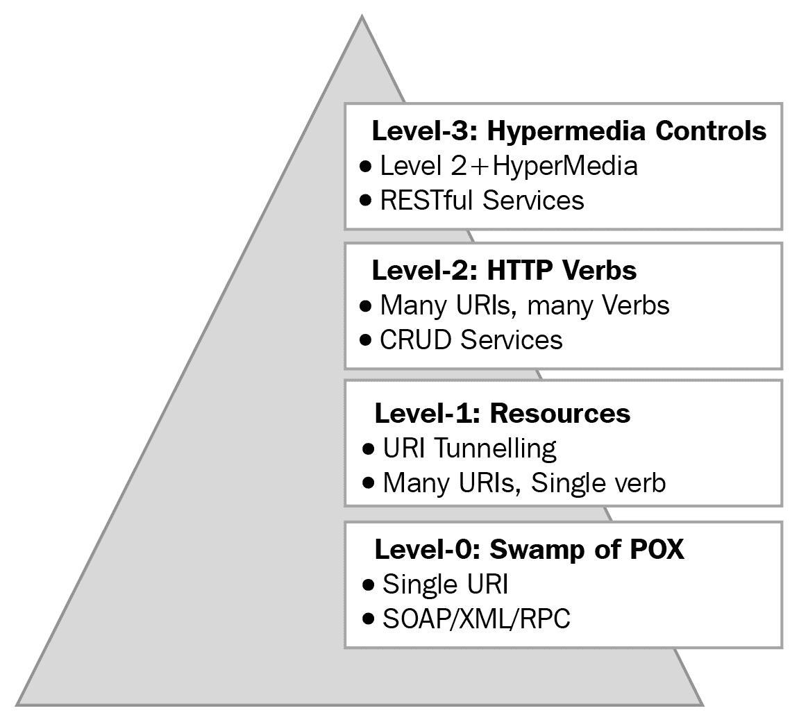

因此，只有当 API 得分达到 **Level-3** 时，它才完全有资格成为 RESTful API。我们将在本章的后面部分看到更多关于如何使 API 成为 RESTful API 的指南。然而，现在你知道为什么我们在转向 HATEOAS 之前在这里提到了 RMM。

一旦客户端从服务器收到其资源请求的初始响应，它应该能够通过从同一响应中获取超链接来移动到下一个应用状态。

让我们通过一个例子来解释前面的陈述。假设一个客户端将新`TODO`项的表示`POST`到服务器，然后任务管理器应用程序的状态将通过增加`TODO`项列表而改变，而`POST`和`GET`都是通过超媒体链接完成的。

通过向任何已识别的资源发送自描述消息来共享资源表示。然后，它们改变应用程序的状态，并且具有接收到的超媒体链接的客户端将移动到下一个应用状态。

在 HTML 浏览器中，`GET`方法是通过点击具有 HREF 属性的锚标签（`<a>`）来完成的，HREF 包含资源 URI。`POST`方法是通过在具有 action URI 属性的`<form>`标签内按下提交按钮来实现的。锚（`<a>`）和表单（`<form>`）标签元素作为客户端请求的资源表示的一部分发送给客户端。

网络合约（共享表示）是关于媒体类型的；调用服务的客户端将知道媒体类型以及如何处理内容。因此，应用程序使服务器能够通过超媒体通知客户端改变其应用状态的可能方式。

一些媒体类型与网络很好地（和谐地）工作，它们被称为**超媒体**格式。包含 URI 和链接的格式是超媒体格式。

简单的 XML 并不适合超媒体，因为它不携带链接和协议。

下面的图表展示了服务器在没有和**带有 HATEOAS**（带有链接和 HREFs）的情况下返回的样本 JSON 响应：

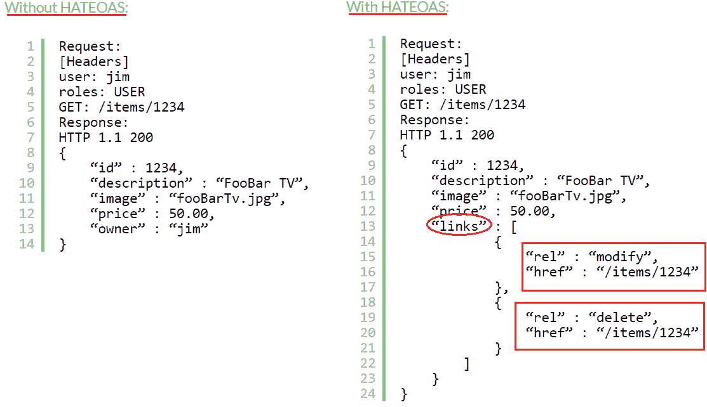

在我们总结这一节之前，让我们回顾一下 HATEOAS：

+   HATEOAS 意味着一个包含指向相关资源链接的应用状态表示（资源）。页面上链接的存在或缺失是资源当前状态的一个基本部分，因此对于 RESTful API 来说是至关重要的。

+   URI 是 REST 架构风格的区分器，定义 URI 非常重要，因为它将存在很长时间。因此，考虑到它们的未来，评估链接（当它们改变时）是至关重要的，或者简单地说，*URI 应该在其表示经历许多变化后保持不变*。关于这一点有一个有趣的阅读材料在[`www.w3.org/Provider/Style/URI.html.en`](https://www.w3.org/Provider/Style/URI.html.en)；它详细支持了这个观点，我们鼓励您查看。

# 分层系统

通常，分层系统由具有不同功能单元的层组成。分层系统的基本特征是层通过预定义的接口进行通信，并且只与上层或下层通信，上层的层依赖于下层的层来执行其功能。随着架构的发展，层可以添加、删除、修改或重新排序。考虑以下层的图示：

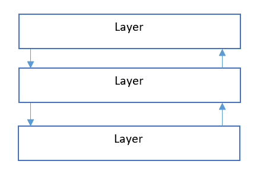

因此，让我们从一个例子开始。REST 风格允许服务利用分层系统架构，其中我们在服务器 A 上部署 REST API，在服务器 B 上存储数据，并通过服务器 C 进行身份验证。调用 REST API 的客户端对所使用的服务器没有任何了解：

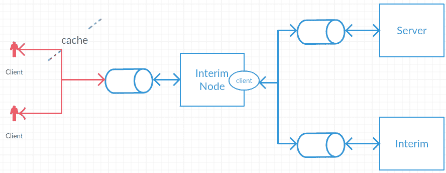

REST 架构风格建议服务可以由多个架构层组成。这些层将具有已发布的服务合同或中间件。给定层中的逻辑不能超出解决方案层次结构中直接上层或下层的层。

中间件是存在于客户端和服务器之间的层，可以添加或删除，更重要的是，不会改变组件之间的接口。

中间件具有以下特性：

+   中间件可以是事件驱动的中间件组件，在消费者和服务之间建立处理层

+   它们也可以是代理（由客户端选择，以提供数据转换服务、增强性能或安全保护）

+   它们也可以是网关（由服务器或网络选择，用于数据转换、安全实施和性能提升）

客户端可能无法判断它是直接连接到服务器的端点，还是连接到实际服务器之前的中间件。中间件服务器通过拥有负载均衡器和共享缓存来帮助实现系统可扩展性的提升。层还可以为其调用客户端实施安全策略。

了解分层系统（设计）的一些应用将对我们有所帮助，因此让我们看看以下要点：

+   允许服务客户端调用服务；被客户端调用的服务不透露任何关于它用于处理客户端请求的其他服务的任何信息。换句话说，服务消费者（客户端）只知道它直接调用的服务，不知道被调用服务所消费的其他服务。

+   客户端和服务器之间的消息由中间件处理，帮助客户端从运行时消息处理逻辑中解放出来，并使其不知道这些消息在其他层是如何处理的。

+   在分层系统中，在不改变服务消费者的情况下添加或删除层对于稳定性和可扩展性至关重要。

+   请求和响应消息不会向接收者透露任何关于消息来自哪一层的细节。

尽管分层系统作为缺点带来了额外的延迟和开销，但权衡利弊，层和分层系统设计的好处如下：

+   封装遗留服务

+   引入中间件

+   限制系统复杂性

+   提高可扩展性

# 按需代码

在分布式计算中，**按需代码**（**COD**）是指任何能够使服务器根据客户端软件的请求，将软件代码发送到客户端并在客户端计算机上执行的技术。网络中 COD 范例的知名例子包括 Java 小程序、Adobe ActionScript 语言（用于 Flash 播放器）和 JavaScript。

以下也可以称为 COD 的优点：

+   COD 是 REST 的可选约束，旨在允许在客户端网络浏览器、小程序、JavaScript 和 ActionScript（Flash）中实现业务逻辑。我认为按需视频网站是 COD 的好例子，因为视频数据文件是根据客户端系统的规格下载和播放的。

+   根据 REST 架构风格，只有一个可选约束，即 COD。COD 允许客户端具有灵活性，因为服务器决定在客户端如何处理特定项目。例如，使用 COD，客户端可以下载动作脚本，如 JavaScript、小程序（如今不太常用）、Flex 脚本以加密客户端-服务器通信，这样底层服务器就不会意识到在过程中使用了任何特定的加密方法。

+   COD 也可以应用于服务和服务消费者。例如，服务设计可以使服务器动态地将一些逻辑部分推迟到服务客户端程序。当服务逻辑可以由消费者更有效地或更有效地执行时，将代码执行延迟到客户端的做法是合理的。

+   RESTful 应用程序可能非常能够利用支持 COD 的客户端。例如，网络浏览器可以允许服务器返回可以在客户端执行的脚本或链接。这种额外的代码执行有助于扩展客户端的功能，而无需用户安装新的客户端软件。

+   在按需代码风格中，客户端组件可以访问一组资源，但不知道如何处理这些资源。它向远程服务器发送请求以获取表示这些知识的代码，接收该代码并在本地执行它。

然而，使用 COD 的缺点是降低了底层 API 的可见性，并不是每个 API 都喜欢这种灵活性。

COD 被视为可选的；不使用此功能的架构仍可被视为 RESTful。

# RESTful 服务规范

在一个在线讨论论坛中，罗伊·菲尔德记录了他对一种声称自己是 RESTful 的服务的不满，但这种服务仅仅是基于 HTTP 的接口。该服务没有满足所有必要的 REST 架构约束。他甚至说，如果应用状态引擎（以及因此 API）不是由超文本驱动的，那么它*不能*是 RESTful 的，*不能*是 REST API*.*

话虽如此，任何需要被称为 RESTful 的服务都必须严格遵循强制性的 REST 架构约束。这些约束是应用于建立 REST 架构风格独特特性的设计规则。

REST 风格的创始人罗伊，强制执行以下 REST 约束，作为任何要被认定为 RESTful 的 Web 服务的强制性要求。这些强制性约束如下：

+   客户端-服务器

+   无状态

+   缓存

+   接口/统一契约

+   分层系统

+   可选的 REST 约束是 COD（不使用此功能的架构仍可被认为是 RESTful）

每个约束都是一个预定的设计决策，并将对服务产生积极和消极的影响。然而，这些约束旨在提供更好的架构，使其类似于网络（可能是积极影响与消极后果的平衡）。

在偏离 REST 约束时，可能需要做出潜在的权衡。确保这些权衡不会削弱或消除规定的约束。如果是这样，该架构可能就不再符合 REST，换句话说，服务（架构）就不是 RESTful 的。

# REST 的架构目标

REST 架构风格带来了一组属性，有助于建立嵌入在 REST 约束应用中的设计目标。这些属性如下：

+   性能

+   可扩展性

+   简单性

+   可修改性

+   可见性

+   可移植性

+   可靠性

+   可测试性

前述属性标志着软件架构的目标状态和万维网的基本品质。在设计决策中遵循 REST 约束有助于实现上述列出的目标，当然，这些属性可以通过更多不是 REST 必要部分的设计决策进一步改进。然而，正如在*RESTful 服务要求*部分引用的那样，一个被称为 RESTful 服务的 Web 服务应该遵守 RESTful 约束。

# 摘要

让我们总结一下本章所涵盖的内容，以及我们在 REST 架构风格背景下可以吸取的教训。我们从一个关于万维网演变、其层和其架构的简要历史开始。然后我们转向 Web API，它是 Web 服务的一个开发模型，以及基于 REST 的服务如何通过简化的表示与现有的 Web 协议进行通信。

我们简要地探讨了 SOA，并更详细地研究了 ROA。我们涵盖了 ROA 的目的（使用简化、易于理解和广泛认可的 Web 技术以及核心设计原则），其原则以及其特性。在为 ROA 打下基础之后，我们了解了 REST 的概念；REST 架构的强制性约束，如客户端-服务器、无状态、可缓存、统一接口和分层系统；以及可选的按需代码约束。

作为统一接口的一部分，我们学习了其四个指导原则，即资源的识别、资源的操作、自描述消息和 HATEOAS，我们还简要提到了 RMM 的重要性，以获得构建 RESTful 服务的基础。

本章详细描述了五个强制性约束以及 Roy 如何看待它们定义了 RESTful 的架构风格。理解什么是 RESTful 以及什么不是 RESTful 至关重要。

我们通过快速介绍 WWW 的软件架构属性以及 REST 约束如何帮助实现 REST 的架构目标，如性能、可扩展性和简单性来结束这一章，这些目标包括性能、可扩展性和简单性。

希望你们喜欢这一章。在下一章中，我们将学习 API 设计策略，例如自助服务启用、资源协作，以及如何解决安全性和可扩展性问题，同时遵循 RESTful API 指南和组成部分。
