# 第六章：RESTful 服务 API 测试和安全

声称企业就绪的任何软件都必须经过严格的测试周期，获得质量保证认证，并满足多个质量标准，以便在生产服务器上使用。软件应用程序的安全性是另一个决定其是否会在生产服务器上使用的关键方面。

为了让读者了解生产和企业级 RESTful API 的不同方面，本章将讨论这些质量和安全措施的各种方面。

本章的目的是带读者进行 API 测试之旅。以下是我们将涵盖的里程碑或主题：

+   API 测试的类型

+   API 测试的挑战

+   API 测试中的安全性

+   此外，我们还将向您展示各种 API 测试工具、API 安全工具和框架的概览

在 API 测试之旅的中途，读者将进行一次小插曲，介绍一些安全问题和 API 漏洞，并学习如何在 API 测试中揭露它们。

# 软件测试概述

任何产品，无论是简单的安全别针还是宏伟的飞机，都需要经过一个过程来确保它解决了其创造的目的，软件也是如此。软件测试是通过验证和验证其目的，从端到端来确认软件的准确性和质量的过程。

因此，任何软件产品或应用的主要重点是验证（根据文档要求检查一致性和对齐）和验证（检查系统的准确性，并验证最终用户的需求与实际结果之间的差异）。

让我们列出一些软件测试的基本成果，然后转向下一部分，重点关注 API 测试：

+   断言并确保实际与需求期望之间没有差异

+   断言并确保软件产品无论用户数量多少都能持续可用

+   预测和揭示隐藏的问题

+   断言并确保产品与预期的最终用户平台、浏览器等无缝运行

# RESTful API 和测试

由于本书涉及 RESTful API，本章旨在引导读者了解一些基本最佳实践和 API 测试原则，以及一些测试框架。通过集成测试（包括手动和自动的），我们可以完成分布式应用的大部分关键 API 测试策略，并帮助这些应用达到生产就绪、可部署，并成为 CI/CD 的一部分，同时确保每个版本的可扩展性和稳定性。

以下部分介绍了 API 测试的基础、API 测试方法、它们的类型等。

# API 测试的基础

我们在前面章节讨论的软件应用程序产品，具有各种软件层，例如用户界面（**UI**）、业务逻辑层、中间件和数据库。**API 测试**和认证主要关注**业务层**上的数据集成测试。**API 测试**是一种软件测试，涉及直接的**API 测试**，与其它通用测试不同，后者主要涉及用户界面：

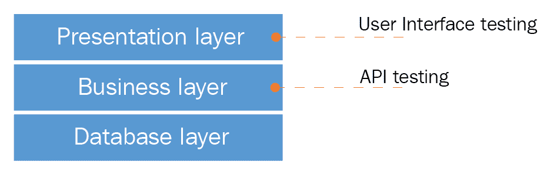

上述图示展示了软件的典型层，其中**API 测试**位于**业务层**，而功能或 UI 测试位于**表示层**。

# 理解 API 测试方法

在开始 API 开发时商定 API 测试的方法是一个关键的 API 策略。让我们看看 API 测试的一些原则：

+   明确定义范围并充分理解 API 的功能

+   常见的测试方法，如边界分析和等价类，是 API 测试用例的一部分

+   制定计划，定义输入参数，准备零和样本数据以供 API 使用

+   确定并比较预期和实际结果，并确保没有差异

# API 测试类型

在本节中，我们将回顾 API 测试的各种类别，并继续探讨最佳实践。

# 单元测试

涉及验证单个操作的测试是单元测试。在我们的投资者服务 API 示例中，第四章，“高级 RESTful API 模式”，我们涵盖了大量的单元测试用例，以下是一个特定单元测试用例的样本代码片段，用于验证从 API 获取所有投资者：

```py
    @Test 
    public void fetchAllInvestors() throws Exception{ 
          RequestBuilder requestBuilder =  
               MockMvcRequestBuilders.get( 
                      "/investors").accept( 
                      MediaType.APPLICATION_JSON); 
          MvcResult result =  
              mockMvc.perform(requestBuilder).andReturn(); 
          MockHttpServletResponse response = 
              result.getResponse();      
    } 
```

# API 验证测试

所有软件都需要快速评估，并确认其创建的目的。验证测试需要在开发过程的最后对每个开发的功能进行运行。与关注 API 的特定部分或功能的单元测试不同，验证测试是一个更高层次的考虑，通过回答一系列问题，以便开发可以进入下一阶段。

验证测试的一组问题可能如下：

1.  一个产品特定的问题，例如，是否是请求的必要功能？

1.  一个行为问题，例如，开发的功能是否做了预期的事情？

1.  一个与效率相关的问题，例如，预期的功能是否以独立和优化的方式使用必要的代码？

所有这些问题，本质上都是为了验证 API 符合约定的验收标准，并确保其完美地遵循关于实现预期最终目标和满足用户需求和要求的规范。

# 功能测试

涉及 API 特定功能和它们的代码库的测试是功能测试。通过 API 验证活跃用户数量、回归测试和测试用例执行都属于功能测试。我们之前在第三章，*基本 RESTful API 模式*和第四章，*高级 RESTful API 模式*中看到了许多使用 Postman 工具执行的功能测试的例子。以下截图可能会刷新你对投资者服务用户认证验证此类功能测试例子的记忆：

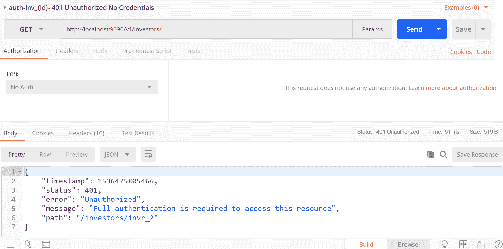

# UI 或端到端测试

包括 GUI 功能和 API 功能在内的涉及和断言端到端场景的测试，在大多数情况下，验证应用程序的每个事务，被归类为端到端测试。

# 压力测试

如我们所知，用户数量的增加不应影响应用程序功能的表现。压力测试将揭示这些问题，并验证 API 在正常条件下的性能。

# 运行时错误检测测试

帮助监控应用程序并检测诸如竞争条件、异常和资源泄露等问题属于运行时错误测试类别。以下要点简要介绍了这些因素。

# 监控 API

测试各种实现错误、处理程序失败和其他 API 代码库内部的固有关注点，确保它没有可能导致应用程序不安全的漏洞。

# 执行错误

对 API 的有效请求返回响应，并断言它们为预期的有效响应是常见的，然而，断言无效请求以期望失败也是 API 测试策略的一部分，这些测试属于执行错误：

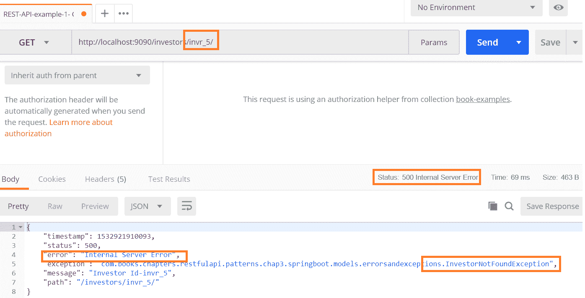

前一个截图展示了第三章，*基本 RESTful API 模式*的例子，当用户提供的 ID 在系统中不存在时，预期会出现错误。

# 资源泄露

通过向 API 提交无效请求来验证底层 API 资源故障的负面测试。在这种情况下，资源包括内存、数据、不安全性、超时操作等。

# 错误检测

检测网络通信故障。由于提供错误的凭据而导致的认证失败是一个错误检测场景的例子。这些测试确保错误被捕获并得到解决：

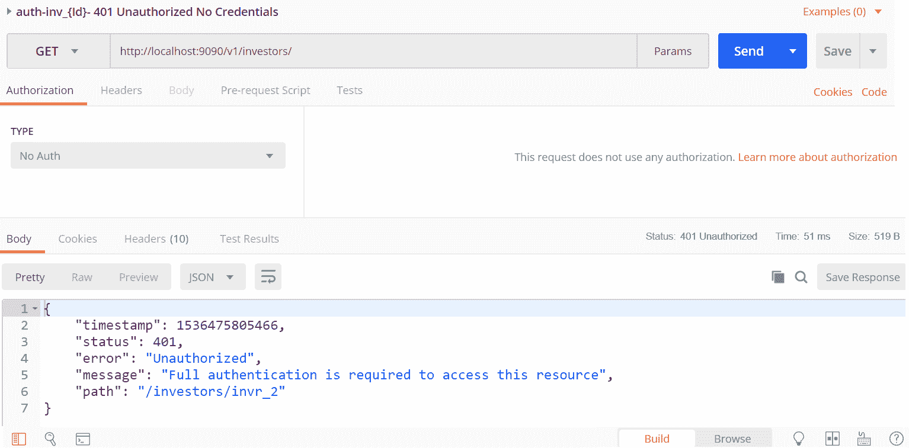

我们在第四章，*高级 RESTful API 模式*，投资者服务示例中遇到了认证错误，如图所示的前一个截图描绘了这一点，因为代码返回了`401`（正如预期的那样）；这是一个错误检测测试的例子。

# REST API 安全漏洞

API 因其简单、结构化、开发速度快和部署迅速而受到欢迎和广泛使用。这自然带来了确保实现免受各种威胁的挑战，例如**中间人攻击**（**MITM**）、缺乏 XML 加密、不安全的端点和 API URL 参数。

REST API 与 Web 应用程序具有类似的安全漏洞；我们将在以下章节中介绍最常见的 API 攻击和漏洞，然后转向安全测试。

# 暴露敏感数据

测试 REST API（或任何应用程序）的首要和最重要的安全方面是评估和确定数据在传输或持久化状态下的数据类别和数据保护需求。例如，个人信息、信用卡信息、健康记录、财务信息、商业信息以及许多其他此类信息类别都需要保护。

此外，数据通过加密得到根本性的保护，因为没有加密的敏感数据泄露可能导致攻击者窃取敏感数据，这不仅仅限于个人数据、信用卡号码、身份盗窃等等。

根据数据的分类（和数据保护需求），你可以应用许多预防措施和保护手段来保护敏感数据。以下是一些保护措施的列表：

+   根据数据分类进行数据分类并应用控制措施。

+   除非必要，否则不要存储敏感信息，并尽快丢弃。使用令牌化和截断方法来防止敏感数据泄露。

+   加密是一种必要且至关重要的保护措施。

+   不要为敏感数据实现缓存（或禁用敏感数据交易的缓存）。

+   为密码使用盐和自适应（具有可配置的迭代次数）散列方法。

# 理解认证和认证攻击

认证是一个确定实体（一个过程、一台机器或一个人类用户）身份的过程，以允许或拒绝该实体访问底层应用程序功能。

登录认证、网络认证、IP 认证、远程认证、基本认证和客户端证书是一些认证类型。

认证攻击是黑客尝试利用认证过程并获取未授权访问的过程。成功渗透认证系统并获得未授权访问将允许黑客窃取敏感信息并更改、破坏或删除有价值的数据。想象一下黑客假扮成某人的身份；这是身份盗窃，可能导致个人损害和金钱盗窃。更糟糕的是，如果被黑客攻击的身份是网络或服务器管理员，那么损害可能超乎我们的想象。

认证类型攻击包括绕过攻击、暴力攻击（针对密码）、验证冒充和反射攻击。

当我们在讨论认证攻击时，回顾一个基本认证的示例实现第四章，*高级 RESTful API 模式*可能是个好主意。投资者服务有一些必要的安全措施，如基本认证、使用默认密钥的授权以及使用凭证进行授权，以限制 API 访问仅限于真正的用户。我们还讨论了如何使用 Postman 测试和验证这些安全措施。

以下截图描述了一个这样的场景（使用默认密钥的授权）以及我们如何使用默认安全密钥验证访问：

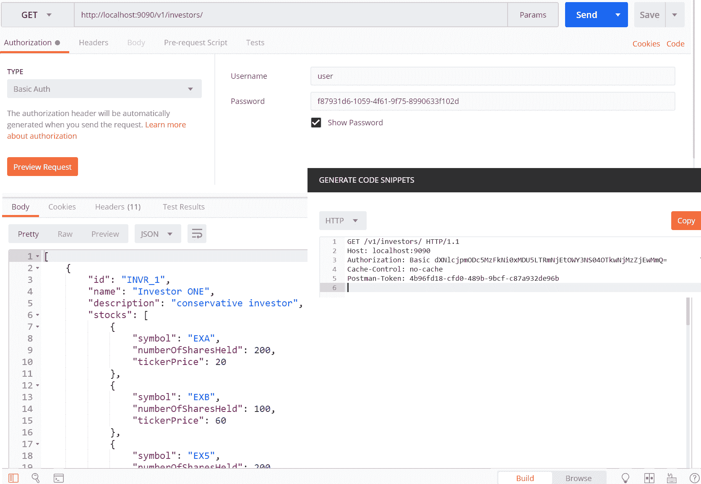

# 理解授权和 OAuth2 方案

如我们所知，证明一个正确的身份是认证，允许经过认证的用户执行特定操作是授权。在本节中，我们将简要介绍 OAuth——一个行业标准的授权协议——以及一些授权方案。当我们在本节中提到 OAuth IETF OAuth 工作组([`tools.ietf.org/wg/oauth/`](https://tools.ietf.org/wg/oauth/))时，指的是 OAuth 2.0，它侧重于客户端开发者的简便性（一个 RESTful 原则），同时为各种应用用例提供特定的授权流程，例如桌面应用程序、Web 应用程序、移动电话，甚至物联网（IoT）支持的客厅设备。

在我们继续介绍 OAuth 2.0 方案之前，让我们通过以下列表了解为什么你会选择基于 OAuth 的授权而不是传统的基于 Cookie 的授权：

+   基于 Cookie 的授权主要是状态性的，也就是说，服务器必须记录活跃用户会话。为了管理活跃会话，服务器需要多次数据库调用以维护状态。此外，一些其他服务器端开销使得将授权过程从应用程序服务器（以无状态的方式）解耦变得困难。

+   基于 Cookie 的认证和授权涉及域名，因为应用程序可能与多个域名交互，因此底层服务器需要一些额外的配置，从而导致维护和安全开销。

+   集成第三方客户端，如 Google+和 Facebook。在许多情况下，使用基于 Cookie 的授权对应用程序进行授权不是一个可行的解决方案。

+   基于 Cookie 的授权被认为是一个维护噩梦（在某些情况下，如原生移动应用），因此不是许多应用程序的首选选择，尤其是在依赖基于移动的认证时。

OAuth 通过允许任意客户端（例如，第一方 iOS 应用程序或第三方 Web 应用程序）通过授权服务器以安全、可靠和有效的方法访问资源服务器上的用户（资源所有者）的资源来解决这些担忧：

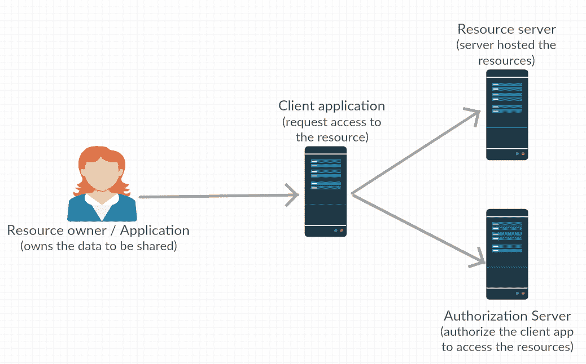

上述图表描述了 OAuth 授权的利益相关者和他们的角色。

现在，让我们看看一些基于 OAuth 2.0 的授权方案以及你可能会选择这些特定方案的情况或业务案例，以下表格展示了这些内容：

| **方案/流程** | **客户端类型** | **简要描述** |
| --- | --- | --- |
| 隐式 | **单页应用**（如 Google Fonts） | 应用请求网关的访问令牌，用户授予权限 |
| 客户端凭据 | 机器到机器的非交互式程序，如服务、守护进程等 | 应用将客户端凭据传递给网关服务器并获取访问令牌 |
| 授权码 | 不太可信的应用（第三方应用请求访问你的应用） | 应用发送从网关接收到的临时授权码，并由同一网关进行验证 |
| 资源所有者密码凭证 | 高度可信的应用（第一方应用） | 客户端将请求用户授权凭据（通常是用户名和密码），然后客户端发送一些参数（`grant_type`、`client_id`、`client_secret`）到授权服务器 |

作为本章的一部分，我们提供了实现**资源所有者**密码凭证流的 OAuth 2.0 示例代码，该代码可在 GitHub 上供任何人下载和执行。

以下图表描述了资源所有者密码凭证 OAuth 方案的标准流程，在我们进入解释如何运行该示例代码的部分之前：

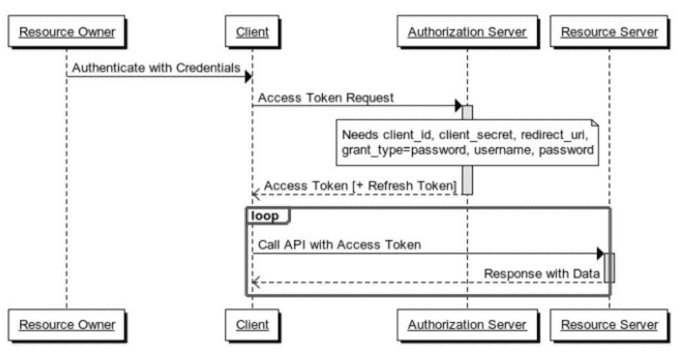

如果你想在你的系统上运行和测试那个示例代码，以下步骤和一些 Postman 工具的截图将会很有用：

1.  从 GitHub 下载代码（你可能需要参考第三章的*技术要求*部分 Chapter 3，*Essential RESTful API Patterns*)。

1.  打开终端并使用`cd`命令进入`downloaded_loc/Hands-On-RESTful-API-Design-Patterns-and-Best-Practices\Chapter06\oauth2-sample`。

1.  运行`mvn clean install`并等待`BUILD SUCCESS`消息。

1.  使用`java -jar target\ oauth2-sample-0.0.1-SNAPSHOT.jar`命令运行应用程序。

1.  打开本地 Postman 工具并测试 URL（在 Postman 集合的`Chapter06`文件夹中）。

1.  当你运行不同的场景时，你会看到以下截图。

1.  尝试错误条件和其它场景（例如提供错误的凭据，使用用户凭据而不是管理员凭据等）。

1.  使用`java -jar`命令运行示例：

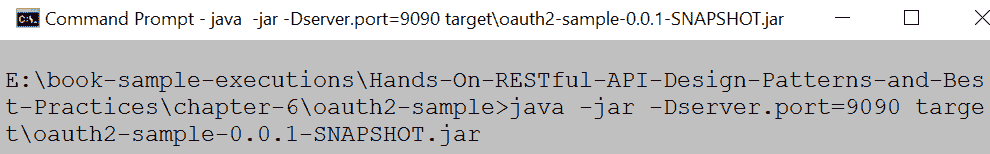

1.  等待本地服务器启动并准备好接受请求：

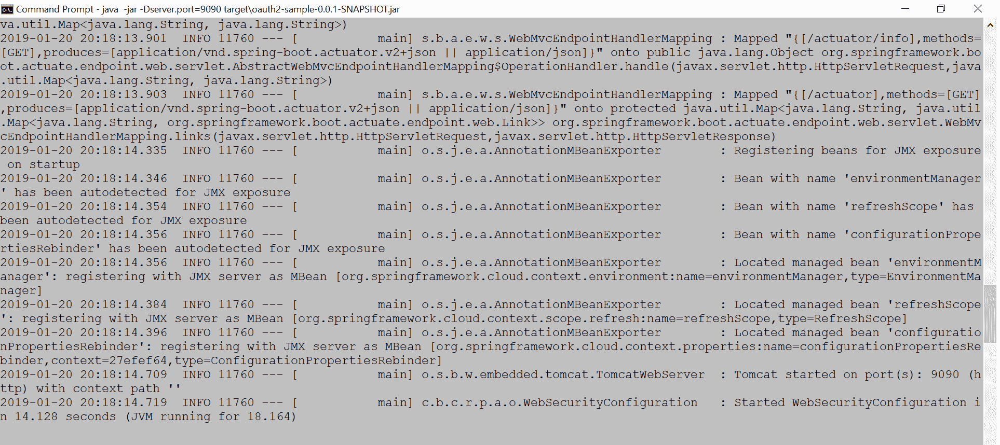

1.  打开 Postman 工具，运行`Chapter06`文件夹中的集合，并观察客户端凭据（对于授权服务器是必需的）：

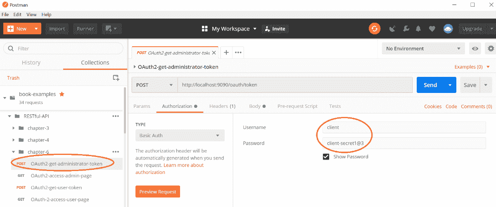

1.  现在输入授权服务器的用户凭据以提供必要的令牌：

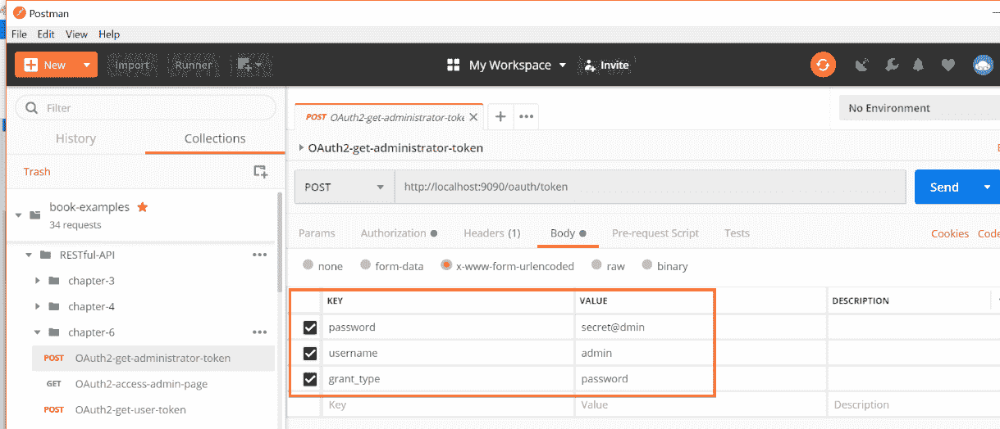

1.  从授权服务器获取访问令牌，以便我们可以在下一步中使用它来访问必要的资源：

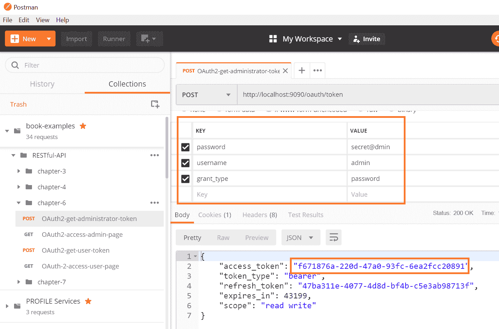

1.  使用我们在上一步中获得的访问令牌访问管理员（资源）API。注意响应体：


1.  使用必要的用户凭据对用户资源重复相同的步骤（注意输入中的用户名）：

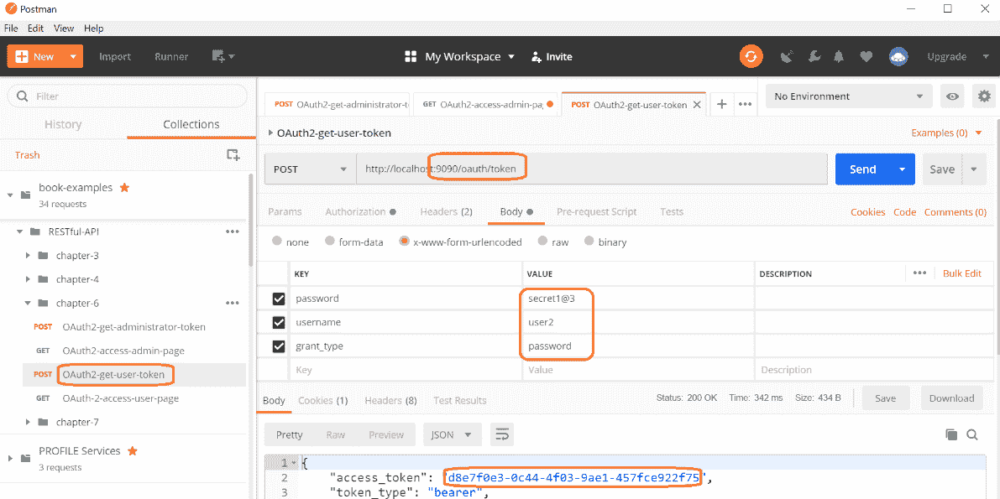

因此，你可以使用示例代码执行不同的场景（本章节未提供），例如错误消息和不同的 HTTP 错误代码（`403`、`302`等）。

# 跨站脚本

**跨站脚本**（**XSS**）攻击是将恶意代码作为输入注入到网络服务的过程，通常通过浏览器进行。一旦注入，恶意脚本可以访问浏览器保留的任何 cookies、会话令牌和敏感信息，甚至可以伪装为渲染页面的内容。XSS 可以分为服务器端 XSS 和客户端 XSS。

传统上，XSS 是三种类型之一：

+   反射型 XSS

+   存储型 XSS

+   DOM XSS

关于 WordPress REST API 缺陷中存储型 XSS 攻击的精彩阅读，请在此处找到：[`threatpost.com/wordpress-rest-api-bug-could-be-used-in-stored-xss-attacks/124294/`](https://threatpost.com/wordpress-rest-api-bug-could-be-used-in-stored-xss-attacks/124294/) 以及在此处：[`threatpost.com/wordpress-silently-fixed-privilege-escalation-vulnerability-in-4-72-update/123533/`](https://threatpost.com/wordpress-silently-fixed-privilege-escalation-vulnerability-in-4-72-update/123533/)。

# 反射型 XSS

成功的反射型跨站脚本攻击发生在应用程序允许攻击者在一个 HTTP 响应中注入浏览器可执行代码（如 JavaScript、Applets、Action Scripts、Flash）时。你可能知道，注入的代码是非持久的，并且只有在用户打开恶意构建的链接或 URL 或渲染受影响响应的第三方网页时才会影响用户。

# 存储型 XSS

存储型 XSS，也称为持久型 XSS，通常被认为是有害且风险高，发生在恶意脚本作为输入注入到易受攻击的应用程序中，并在稍后由其他用户或管理员查看。

# DOM XSS

第三种类型（由 Amit Klein 开发，自 2005 年以来可用），DOM XSS，发生在客户端代码使用不安全的引用到不由服务器提供的页面完全控制的 DOM 对象时。通常，但不限于，动态向页面注入攻击者可控制数据的 API 和 JavaScript 框架。单页应用程序容易受到 DOM XSS 攻击。

XSS 防护需要从用户输入中过滤恶意内容，并且还需要进行编码（转义）。

# 跨站请求伪造

**跨站请求伪造**（**CSRF**），也称为 Sea Surf 或 XSRF，是一种一键攻击漏洞，Web 应用程序暴露了最终用户可能被强制（通过伪造链接、电子邮件和 HTML 页面）在当前已认证会话中执行不受欢迎的操作的可能性。

同步令牌模式、Cookie 到 Header 令牌、双重提交 Cookie 和客户端保护是常见的 CSRF 预防方法。

# 拒绝服务攻击

**拒绝服务**（**DoS**）攻击的目的是通过发送大量虚假请求，使目标机器快速达到其最大负载（处理请求的能力），从而使目标系统拒绝进一步的真实请求。

洪水攻击和缓冲区溢出攻击是两种拒绝服务（DoS）攻击类型。在洪水攻击中，攻击者通过向服务器生成大量流量来饱和目标服务器，导致目标服务器最终陷入 DoS 状态。

另一方面，缓冲区溢出攻击的目的是针对一台机器，并使该机器消耗所有可用内存或硬盘空间，或者导致 CPU 使用率过高。这会导致各种后果，如系统响应缓慢或行为迟钝，甚至可能导致目标系统崩溃，造成潜在的灾难性后果。

请注意，通常，DoS 攻击发生在恶意用户（攻击者）具有比目标服务器更多可用带宽的网络中。Smurf 攻击、ping 洪水和 ping of death 攻击是一些实际的 DoS 攻击。

# 分布式拒绝服务

分布式系统上的 DoS 攻击被称为**分布式拒绝服务**（**DDoS**）攻击。DDoS 攻击通过使用多个被入侵的计算机系统作为攻击流量源，包括网络资源如物联网设备，来实现成功。

# 注入攻击

最有害和最危险的攻击之一是注入攻击。攻击者向应用程序提供不受信任的输入，该输入作为命令或查询的一部分被执行/处理，从而导致应用程序行为的部分或完全失控，并导致诸如数据盗窃、数据丢失、数据完整性丢失和 DoS 等后果。它甚至可能导致整个系统被完全控制。

下表总结了几个常见的注入攻击类型、每种类型的简要描述及其潜在影响：

| **注入类型** | **简要描述** | **潜在影响** |
| --- | --- | --- |
| 代码注入/操作系统命令注入 | 使用应用程序代码执行操作系统命令 | 利用更高权限的漏洞获得更高权限，并可能导致整个系统被完全控制 |
| CRLF 注入 | 在输入序列中注入 EOL/回车字符 | 导致 HTTP 头部分割，便于在响应体中注入任意内容，包括 XSS |
| 电子邮件（邮件命令/SMTP）注入 | 向邮件服务器注入 IMAP/SMTP 语句 | 个人信息泄露和垃圾邮件中继 |
| 主机头注入 | 通过根据用户输入动态生成头信息滥用 HTTP Host 头信任 | 缓存投毒——操纵缓存系统并服务恶意页面密码重置投毒——利用密码重置电子邮件并直接向目标发送恶意内容 |
| LDAP 注入 | 注入并执行**轻量级目录访问协议**（**LDAP**）语句 | 修改 LDAP 树的内容并授予非法权限、权限提升和绕过身份验证 |
| SQL 注入 | 注入伪造的 SQL 命令以执行数据库读取或修改数据 | 导致数据丢失、数据盗窃、数据完整性丢失、DoS，甚至由于 SQL 注入的高级变体而导致完全系统妥协 |
| XPath 注入 | 通过向应用程序注入虚假数据执行伪造的 XPath 查询 | 导致信息泄露和绕过身份验证 |

# 不安全的直接对象引用

**不安全的直接对象引用**（**IDOR**）与其他顶级 API 漏洞一样有害；它们发生在应用程序根据用户输入（如 ID 和文件名）暴露对内部对象的直接访问时。

让我们通过以下图例快速了解 IDOR。在图中，鲍勃从应用程序中获取 ID 为 1001 的文件是有意义的，但他是如何获取 ID 为**1003**的爱丽丝的文档的呢？

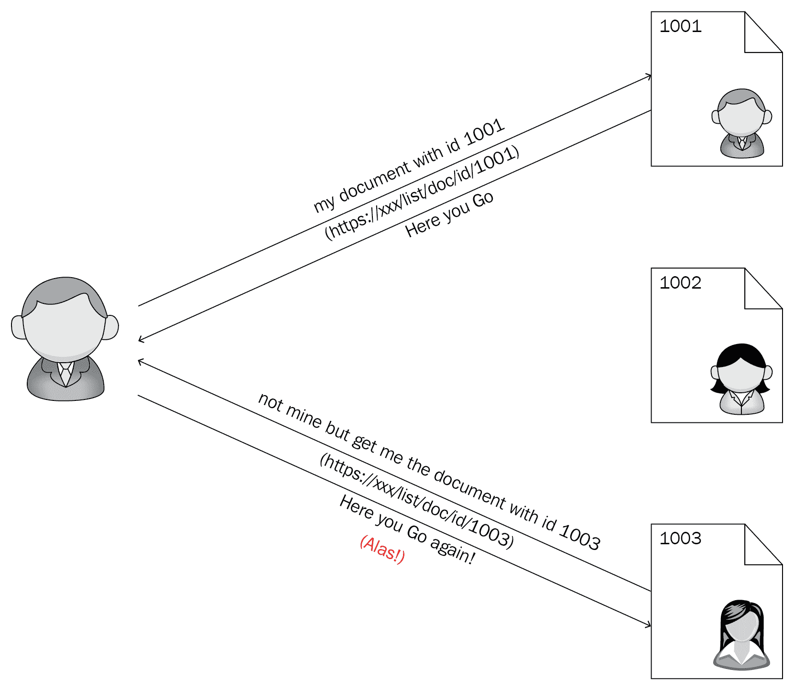

正在发生直接对象引用，因为开发者暴露了对内部实现对象的引用——在这里，在先前的示例中，它是一个文件（对象引用可能是一个目录、图像文件、数据库键等）——与应用程序。

因此，没有验证机制，允许鲍勃（攻击者）操纵这些引用以访问未经授权的数据被称为 IDOR 漏洞。

可以通过绘制所有用户输入作为直接引用（如图例所示）并用作引用对象的端点来测试 IDOR 漏洞。始终建议有两个或更多用户来覆盖直接对象和函数。

# 缺少函数级访问控制

IDOR 的另一个方面是缺少功能级访问权限。应用程序可能遗漏了实现功能级访问权限，因此任何具有网络访问权限的人都可以发送请求并获得响应，而不仅仅是具有特权的特定用户。例如，没有管理员级别访问权限的用户不应能够访问管理员 URL。

应用程序中敏感请求处理程序缺乏保护的 API 属于缺少功能级访问权限漏洞的范畴，因此允许黑客在没有必要授权的情况下渗透应用程序。

测试这种漏洞的各个方面应侧重于两个基本场景——用户是否可以直接浏览资源，以及访问 API 资源的 UI 是否向该 UI 暴露了未经授权的资源。

# 中间人攻击

中间人攻击（MITM attack）是指攻击者将自己置于网络或用户与应用服务器之间的通信中间。他们的意图是窃取、监听、伪装、秘密中继、拦截或篡改两个通信方之间的通信，包括 API 消息，而这一切都表现得像正常的信息交换正在进行中：

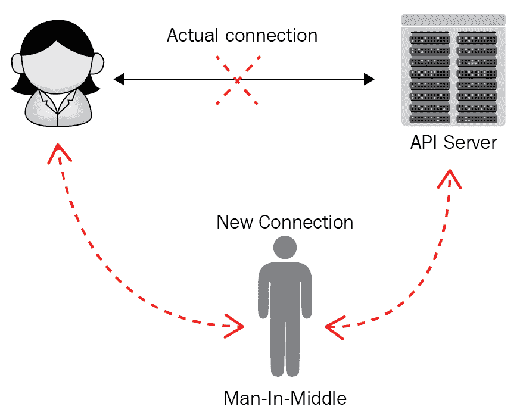

上述图示了一个典型的中间人攻击，其中窃听者模仿并转发通信/响应给呼叫者，就像它们来自服务器一样，它们将看起来是真实的。

中间人攻击的一个例子可能是发出会话令牌的 API 与充当用户浏览器和 HTTP 头（会话令牌）之间中间人的攻击者之间的通信。因此，拦截那个会话令牌很容易，因为它打开了访问用户账户的通道，然后根据该账户的权限进行破坏。

# 常见的中间人攻击类型和防护措施

在以下列表中，有一些常见的中间人攻击类型，你需要意识到，还有一些针对这些攻击的防护措施：

+   **嗅探**：嗅探，也称为数据包嗅探，其中攻击者使用广泛/免费的数据包捕获工具，通过特定的无线设备检查和监控通过网络通信的数据包。

+   **数据包注入**：以这种方式将恶意数据包注入数据通信流中，使其与有效数据流混合，并看起来像是原始/预期通信的一部分。

+   **SSL 剥离**：在运行中将 HTTPS 网络通信更改为 HTTP，使通信不安全，这是另一种中间人攻击形式（用户甚至可能没有意识到他们被重定向到不安全的端点），并且以明文形式泄露敏感信息，攻击者可以迅速获取这些信息。

+   **电子邮件劫持**：这是一种非常常见的中间人攻击类型，攻击者模仿一个受信任的网站（例如，银行的网站）向目标账户发送带有指示的电子邮件，并说服账户持有人遵循电子邮件中的指示，从而导致灾难性的后果，如失去金钱/个人信息等。

+   **Wi-Fi 间谍活动**：这涉及到设置专用的 Wi-Fi 访问点来诱使用户连接并让他们使用该网络。一旦用户连接到这些 Wi-Fi 访问点，攻击者将拦截并获取他们的凭据、信用卡信息以及更多敏感信息。

+   **会话劫持**：一旦用户使用他们的凭据登录到应用程序，应用程序将生成一个临时令牌，这样用户就不需要再次提供凭据来访问后续页面。然而，攻击者可以嗅探并捕获那个会话令牌，并使用它来获取对用户账户的访问权限。

+   **防护措施**：防止中间人攻击的防护措施如下：

    +   **安全/多用途互联网邮件扩展**（**S/MIME**）

    +   **基于公钥基础设施**（**PKI**）的认证证书

    +   SSL/TLS 证书

    +   系统和服务器配置

    +   **HTTP 严格传输安全**（**HSTS**）

# 重放攻击和欺骗

重放攻击，也称为回放攻击，是一种网络攻击，其中攻击者（欺骗了有效交易）恶意多次重复（多次）有效的数据传输（本应只发生一次）。当服务器期望一个有效的交易时，它不会对请求是否为有效交易有任何怀疑。然而，这些是伪装的请求，对客户端产生灾难性的影响：

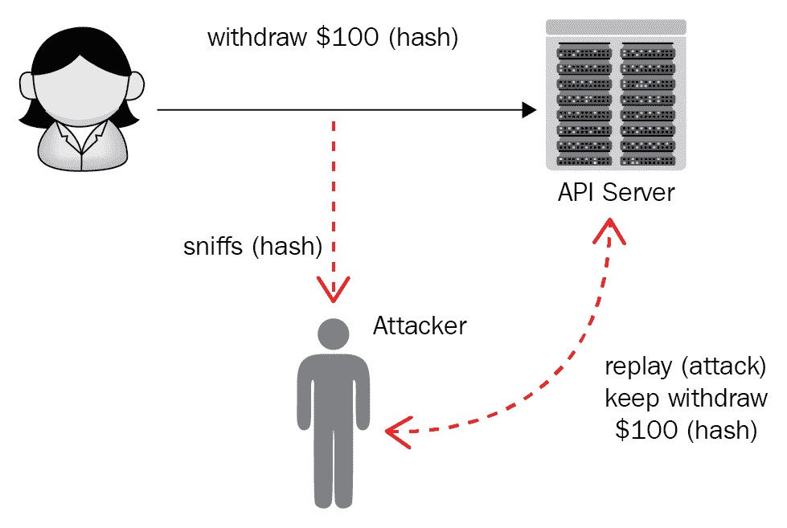

上一张图展示了重放攻击的示例，其中合法用户发送了一个有效的请求，但攻击者欺骗了它并重新发送/重放给 API。

由于 RESTful API 无状态，这些 API 被重放攻击的风险很高（它们是易受攻击的目标）。因此，很明显，API 设计师/开发者需要在他们的 API 中为所有重放攻击采取对策。防护措施包括带有会话标识符的一次性密码、**生存时间**（**TTL**）措施、客户端上的 MAC 实现，以及在请求中包含时间戳，以及像 Kerberos 协议预防、安全路由和**挑战-握手认证协议**（**CHAP**）这样的安全协议。

# 漏洞原因

如前一小节所述，我们已经查看了一些漏洞，现在让我们也熟悉一下以下段落中导致 API 易受各种攻击的一些常见担忧和问题。

# API 设计和开发缺陷

缺少或不遵守 API 安全原则和最佳实践可能导致暴露业务关键数据的缺陷。设计和开发的一个方面是尽可能简化 API，因为复杂性可能导致覆盖范围减少和漏洞。较差的用户输入验证、SQL 注入漏洞和缓冲区溢出是其他一些原因。

第二章*，设计策略、指南和最佳实践*，讨论了设计策略和 RESTful API 设计实践的各个方面。理解和实施这些设计原则和实践有助于减少设计和开发缺陷。

# 系统配置不良

即使设计和发展得再好，如果系统配置（API 所在位置）不遵守安全合规性，那么系统也可能无法得到充分保护。这也会导致漏洞，攻击者会窃取信息。

# 人类错误

不遵守组织安全合规性以及缺乏对安全措施的了解，例如文件销毁政策、安全编码实践、强密码、维护密码的机密性、定期重置密码以及防止访问未知/不安全的网站，这些都会在 API 中造成漏洞，可能导致安全漏洞。

# 内部和外部连接性

由于 API 是未受保护的内网和外网的一部分，因此未受保护网络中 API 的连接性是造成漏洞的另一个主要原因。此外，API 暴露于大型和独特的渠道，如移动网络、风险管理不善以及网络内的宽松授权实践等，都是这一类别漏洞的例子。

# 安全测试

安全测试确保 API 免受外部威胁，并保护我们之前章节中讨论的漏洞。API 安全测试和安全测试人员的主要重点是通过对 API 进行渗透测试、模糊测试、验证、敏感数据泄露确定等操作，找出他们打算测试的 API 的漏洞。

安全功能测试和安全漏洞测试是安全测试的两个类别。功能测试执行手动测试，并手动检查 API 实现中是否存在安全机制。安全漏洞测试执行可能暴露漏洞的自动化测试用例。

测试人员的最终目标应该是通过研究错误信息来理解系统行为，并暴露任何安全漏洞，例如未经授权的访问、IDOR、中间人攻击和重放攻击。

您可以通过运行渗透测试和模糊测试以及各种手动测试来实现安全测试目标。

本节详细讨论渗透测试和模糊测试，并讨论提供现成安全测试支持的工具/框架，以便 API 测试人员可以利用工具为底层 API 获得安全保障。

# 渗透测试或 pen tests

API 测试中的一个强制性要求是渗透测试，也称为 pen tests。pen tests 是通过模拟对系统或 API 的网络安全攻击来暴露/确定可利用的漏洞的过程，例如内部网络漏洞、XSS 攻击、SQL 注入和代码注入攻击。

突破测试从外部角度评估威胁向量，例如支持的功能、可用的资源以及 API 的内部组件。

让我们更详细地讨论突破测试的各个阶段、测试方法、支持突破测试的框架，以及选择最佳渗透工具的一些标准。

# 突破测试的重要性

在我们深入细节之前，以下理由将帮助我们理解为什么突破测试在 API 测试中如此关键：

+   不损害数据隐私

+   确保网络上的金融交易和金融数据的安全

+   发现 API 和底层系统中的安全漏洞和漏洞

+   模拟、预测、理解和评估攻击的影响

+   使 API 完全符合信息安全规范

# 突破测试生命周期

现在我们已经从前面的部分很好地理解了漏洞的原因，让我们在本节中看看突破测试的五个阶段：

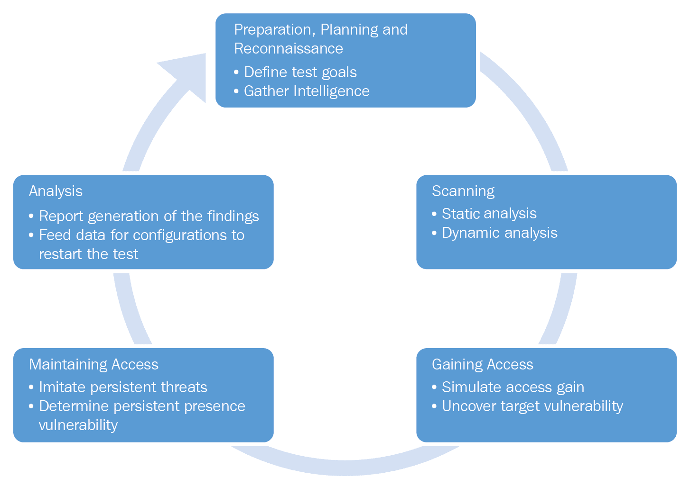

上述图表描述了突破测试的生命周期，包括准备、**扫描**、**获取访问权限**、**维护访问权限**和报告等五个活动阶段。

让我们更详细地探讨以下各阶段。

# 准备、计划和侦察

生命周期第一阶段包括以下两个部分：

+   范围、范围定义、确定要进行的测试目标，以及确定要处理的测试方法和系统

+   收集有关域和端点等情报，了解目标 API 的工作方式，以及其暴露于漏洞的程度

# 扫描

通过静态和动态分析了解目标应用程序对各种入侵尝试的反应是**扫描**阶段的重点。

# 获取访问权限

这涉及尝试通过诸如 XSS、SQL 注入、代码注入和后门等应用程序攻击来揭露 API 漏洞。一旦发现这些漏洞，利用它们进行权限提升、数据窃取方法和流量拦截是**获取访问权限**范围的一部分，以及评估 API 漏洞可能造成的损害。

# 维护访问权限

网络中非法、长期的入侵者存在可能会对系统造成不可逆转的损害，因为他们可能在系统中存在很长时间，这有助于在持续、经过充分研究和精心策划的攻击中进行高度敏感的数据挖掘（尤其是在政府、军事和金融网络上）。

评估长期存在的能力，以及他们获得对系统/API 的深入访问的机会是**维护访问权限**阶段的主要目标。

# 分析

生命周期的最后阶段专注于编译和呈现渗透测试结果作为报告。这些报告通常包含作为渗透测试一部分被利用的特定漏洞，作为渗透测试练习的一部分被损害/访问的敏感数据细节，以及，最重要的是，你在系统中未被检测到的持续时间。这些结果和报告将作为组织内部安全配置的输入/输出，以防止任何未来的攻击。

# API 测试的渗透测试类型

我们讨论了渗透测试在安全测试中的重要性，API 也不例外；它们都需要经过这些渗透测试，确保底层 API 没有暴露任何漏洞。请注意，在实际操作中有三种渗透测试类别，它们是——黑盒渗透测试、灰盒渗透测试和白盒渗透测试。

黑盒测试和灰盒测试假设测试人员对底层 API 的了解仅限于有限的范围。在本节中，我们将简要介绍白盒测试，因为它对于 API 安全测试至关重要，以及为什么在下一节中它被优先用于 API 渗透测试。

# 白盒渗透测试

白盒测试也称为**结构测试**、**开箱测试**、**透明盒测试**和**玻璃盒测试**。白盒渗透测试是一种全面的测试方法，因为你在开始测试之前就能获得有关模式、源代码、模型等方面的全部信息。白盒测试旨在审查代码并捕捉任何设计和开发错误。它们是内部安全攻击的模拟。

API 渗透测试依赖于以下原因进行白盒测试：

+   测试将在模块的所有独立路径上运行

+   测试确认和验证代码内部的所有逻辑决策（`true`/`false`）

+   测试执行语法检查，因此发现对查找代码注入和 SQL 注入攻击至关重要的打印错误

+   测试发现由程序逻辑流程与实际执行不匹配（针对意图的设计）引起的设计错误

有许多开源工具和商业版本可供扫描代码、检查恶意代码、使用数据加密技术查找安全漏洞，甚至找到硬编码的用户名和密码。以下表格中列出了一些工具（包括商业和开源版本）：

| **工具** | **类型** | **提供商** |
| --- | --- | --- |
| Nmap | OpenSSL | Pure Hacking |
| Nessus | Cain and Abel | Torrid Networks |
| Metasploit | THC Hydra | SecPoint |
| Wireshark | w3af | Veracode |

让我们通过指出 API 的渗透测试应该在真实攻击者发现之前暴露 API 漏洞，并继续进行模糊测试来总结本节。

# 模糊测试

模糊测试，也称为模糊化，是质量保证阶段最广泛使用的测试实践之一。它涉及向目标系统输入大量随机数据（噪声或模糊），目的是针对 API 以展示缓冲区溢出或其他不受欢迎的行为，甚至引发系统崩溃。

威斯康星大学的 Barton Miller 在 1988 年（作为他*操作系统实用程序可靠性——模糊生成器项目*的一部分）引入了模糊测试，以揭示 API、软件、网络和操作系统中的任何安全漏洞和编码错误。

API 模糊测试的主要目的并不是测试 API 的正确功能，而是通过模糊数据来探索和测试未定义的区域：

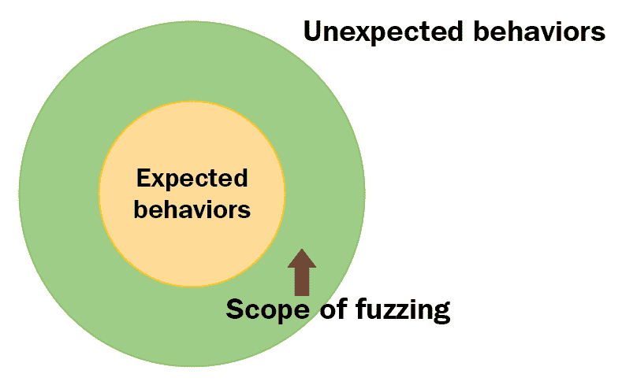

如前图所示，模糊测试的范围是暴露底层 API 的任何意外行为。

# 模糊测试的生命周期

API 模糊测试的典型生命周期中的各个阶段从确定目标 API 和定义测试输入开始，以生成显示 API 中检测到的漏洞的日志结束。以下图示描绘了模糊测试生命周期的每个阶段：

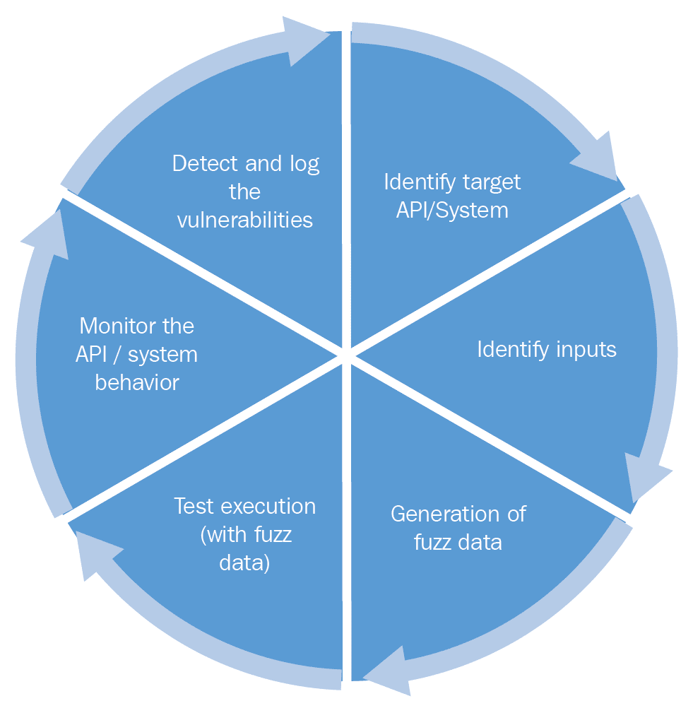

# 模糊测试策略

模糊测试策略根据攻击向量、模糊测试目标、模糊测试方法等因素而有所不同。对于一个 API，让我们专注于模糊测试目标。模糊测试主要有两种分类——基于变异的和基于生成的。我们将在下一节中查看这两种分类的详细信息。

# 基于变异的模糊测试

变异或愚昧的模糊测试是一种简单的方法，其中我们通过改变现有数据样本来创建新的测试数据。样本数据生成从协议的有效样本开始，并改变提供的输入，直到改变输入的每一个位。以下图示说明了两种变异的方法：

1.  位翻转，其中输入以序列或随机方式翻转：

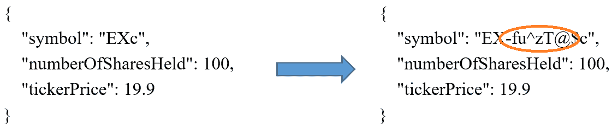

1.  在输入的末尾附加一个随机字符串：

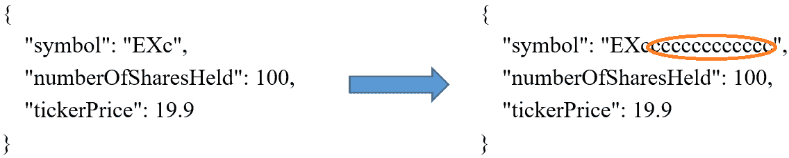

# 基于生成的模糊测试

基于生成的模糊测试，也称为智能模糊测试，是基于对已知格式、已知协议的理解，并按照系统/API 规范（RFC）和格式（例如，API 文档中的格式）从头生成输入的测试。

生成模糊测试能够根据数据模型构建测试数据。有时，这些测试只是注入随机字节，有时它们可以更加智能，知道良好的数据值并将它们以多种有趣的方式组合在一起（例如，将正则表达式作为请求体的一部分，在标题中使用主机名，以及将预期的响应类型更改为不同类型）。

在我们总结关于模糊测试策略的这一节之前，让我们了解另一种非常成功的模糊测试方法，即基于协议的模糊测试（也称为语法测试、语法测试和鲁棒测试）。在基于协议的模糊测试中，测试人员对协议格式有详细的了解，他们的理解取决于给定的规范。在这里，规范被视为一个存储在基于模型的测试工具中的规范数组，并且它还能够生成测试数据。然后，工具需要遍历所有规范，并在序列、数据内容等方面添加不规则性，以暴露漏洞。

请注意，由于变异方法不需要您了解协议，因此您可能会觉得与基于生成的方法相比，一开始使用起来更舒适。然而，基于生成的方法是一个彻底、更好且推荐的过程，尽管它需要更多时间，因为它涉及几个有效的输入组合。然而，它确实导致了更好的代码覆盖率和代码路径。

# 模糊测试的优点和缺点

以下要点旨在说明为什么模糊测试在软件专业人士社区中很受欢迎：

+   由于它们没有关于系统行为的先入之见，因此它们极其简单、易于使用、成本效益高，并且快速设置

+   它们的单次设置易于重复用于回归（自动化）

+   作为一种协议感知测试，测试结果有助于找到精确、描述性且易于调试的错误

+   它使您能够找到在定义测试或基于方法的测试中用肉眼无法找到的漏洞

+   当与黑盒测试、beta 测试和其他调试方法结合使用时，它们能产生最佳结果

虽然模糊测试带来了许多优势，但我们还需要了解和了解一些缺点，这些缺点在此列出：

+   基于变异的模糊测试可以无限期运行（生成大量测试用例并无限期运行），因此在某些情况下确定最佳测试数量或确定它们运行的时间是否足够长是困难的

+   测试结果可能会报告没有缺陷，即使运行了大量的测试用例

+   测试结果可能会报告各种测试用例中的相同缺陷

+   找出哪个测试用例导致了故障是具有挑战性的

+   在系统崩溃的情况下，很难找到漏洞

为了总结本节，让我们列出一些在运行 API 模糊测试时可以轻松利用的工具。

开源：

| **突变模糊测试** | **模糊测试框架** | **领域特定模糊测试** |
| --- | --- | --- |
| American fuzzy lop | Sulley | Microsoft SDL MiniFuzz File Fuzzer |
| Radamsa——一群模糊测试工具 | Boofuzz | Microsoft SDL Regex Fuzzer |
| OWASP WebScarab | BFuzz | ABNF Fuzzer |
| OWASP WSFuzzer | - | - |

上述表格详细介绍了开源模糊测试工具。以下列表提供了一些您可能希望用于模糊测试的商业工具：

+   Codenomicon 的产品套件

+   Peach Fuzer 平台

+   Spirent Avalanche NEXT

+   Beyond Security 的 beSTORM 产品

此外，以下是一些读者可能会觉得有趣的最新工具，可以运行它们的 API：

| **工具** | **参考/链接** |
| --- | --- |
| REST-ler | [`www.microsoft.com/en-us/research/uploads/prod/2018/04/restler.pdf`](https://www.microsoft.com/en-us/research/uploads/prod/2018/04/restler.pdf) |
| Burp | [`portswigger.net/burp`](https://portswigger.net/burp) |
| Fuzzapi | [`github.com/Fuzzapi/fuzzapi`](https://github.com/Fuzzapi/fuzzapi) |
| Fuzz-rest-api | [`github.com/dubzzz/fuzz-rest-api`](https://github.com/dubzzz/fuzz-rest-api) |
| Big-list-of-naughty-strings | [`github.com/minimaxir/big-list-of-naughty-strings/`](https://github.com/minimaxir/big-list-of-naughty-strings/) |

# 回到 API 测试

在前几节中，我们偏离了 API 测试，探讨了安全测试的许多方面。现在，让我们将注意力重新集中，将旅程转向本章剩余部分的一些更多 API 测试方面。

# API 测试用例

首先，让我们假设 API 的测试用例需要一些参数或占位符，例如输入参数、预期结果、接收响应所需的时间（来自 API）、解析输入、错误处理和响应格式，以便确定和认证 API 的测试结果。

在我们继续探讨测试用例准备的一些方面之前，让我们先了解一下 API 测试帮助我们检测的可能类型的错误：

+   API 处理错误或不体面的错误条件

+   任何未使用的标志

+   缺少或重复的功能

+   多线程问题

+   错误处理有效参数值

+   验证问题，如模式验证或结构问题

+   API 的可靠性问题和性能问题（如超时、连接和获取响应时间）

+   API 漏洞和任何安全问题

# API 测试用例和测试用例准备的基本要素

以下列表涵盖了 API 测试测试用例准备的一些基本方面，因为 API 测试的测试用例取决于它们的输出：

+   根据不同的输入条件和输入组合断言返回值。

+   当 API 没有返回值时，断言 API 的行为。检查返回代码。

+   如果底层/目标 API 创建后续事件，断言 API 的事件和触发器。

+   不仅断言更新数据结构时的 API 结果，还要验证它对系统更新后产生的影响。

+   当 API 涉及修改特定资源时，通过访问受影响的资源进行断言。

# API 测试挑战

如果你准备好了必要的测试用例，开始测试目标 API 是否足够？不，还不够——还有一些挑战你应该知道，在接下来的几节中，我们将探讨你可能会遇到的一些常见挑战以及如何解决这些挑战，当你想要开始 API 测试时。

# 初始设置

测试基础设施及其稳定性/可用性，以及正常运行时间。在设计阶段开始并实践 API 测试，并确保 API 达到 100%的运行时间是关键。

# API 架构更新用于测试

请求和响应架构或格式是 API 的生命线。然而，架构的频繁更改是不可避免的（尤其是在开发阶段），因此也需要为架构配置编写测试用例。在 alpha 和 beta 环境中管理测试可以减少多达 90%的问题（由于架构更新）。

# 测试参数组合

向 API 添加额外的参数会指数级地增加组合数量，而测试每个可能的参数请求组合以找到特定于配置的问题是必要的。API 发布和确保潜在的 API 候选发布版本可用于测试有助于有效地解决这些挑战。

# API 调用序列

在许多情况下，按照特定顺序调用 API 以获得期望的结果是不可避免的，对于这些场景，测试用例也需要实现适当的顺序。然而，在主要 API 中，这很具挑战性，当涉及多线程应用程序的情况时，挑战性更大。除了强制执行候选发布版本外，API 调用序列的可视表示或 API 调用序列的流程图将不仅有助于测试阶段，而且对开发团队也有帮助（作为开发阶段的一部分）。

# 验证参数

检查电话号码中的数字和数字数量、长度限制、数据类型验证、数据范围修改等验证标准或测试对于测试团队来说是一项艰巨的任务，尤其是对于具有大量参数需要验证的大型 API。实施合成和**应用性能监控**（**APM**）工具将有助于确保捕捉到由于参数验证而产生的问题。验证参数也是安全测试的关键方面之一。

# 跟踪系统集成

数据跟踪系统有助于找到对调用的正确响应。然而，对于团队来说，确保 API 测试系统与数据跟踪系统正确工作，并且 API 发出的调用得到正确响应是一个具有挑战性的任务。您可以通过实施和包括**持续交付**（**CD**）中的负载测试来解决这个挑战。

# API 测试最佳实践

以下部分列出了您应该了解的一些 API 测试最佳实践。首先，以下是一些测试用例最佳实践：

+   按测试类别（单元测试、功能测试、安全测试等）分组 API 测试用例

+   确保测试用例在每项测试用例的顶部指明涉及的（调用的）API 声明

+   确保在测试用例中明确提及参数选择

+   独立执行测试用例，也就是说，每个测试用例都是一个自包含且独立的实体

+   优先考虑 API 调用，这有助于简化 API 测试

+   保持测试用例不受*测试链*（重用其他测试创建的测试数据对象）的影响

+   测试用例处理一次性调用函数，如删除、关闭窗口、异步调用等，因此需要特别注意以避免不希望的执行

+   确保 API 调用序列规划良好，并且有明确的执行计划

+   为 API 的每个可能的已知输入组合创建测试用例，因为这有助于提高底层 API 的测试覆盖率

# API 测试工具

完成我们的 API 测试之旅，了解一些常见的 API 测试工具可能是个好主意。以下 API 测试工具的截图提供了每个工具的简要细节，包括其易用性、支持的平台，可能很有用：

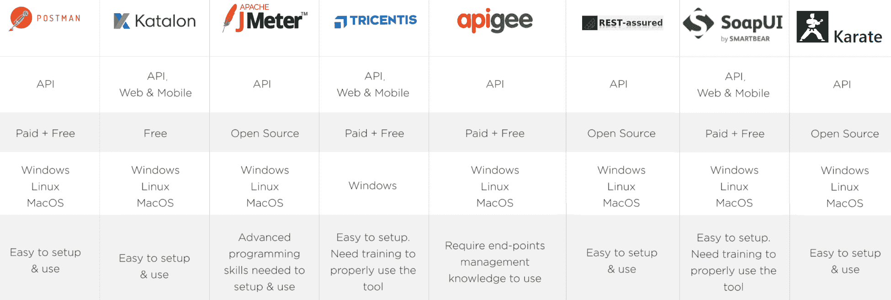

# CQRS

**命令查询责任分离**（**CQRS**）是一种由格雷格·杨提出的架构模式。CQRS 建议将系统的读取操作（查询）和写入操作（命令）分离到不同的子系统，因为读取操作最终是一致的，并且从反规范化视图中检索，而命令通常是异步的，并存储在事务性存储中，读取操作最终是一致的，并且从非规范化视图中检索。

因此，通过使用单独的接口或子系统来分离读取和写入操作，不仅有助于最大化 API 的性能，还有助于安全性和可扩展性方面，以及由于更新命令导致的领域级别合并冲突的管理，从而提供更多灵活性。

在我们进一步探讨 CQRS 之前，让我们看看以下图中传统的**数据访问**模式：

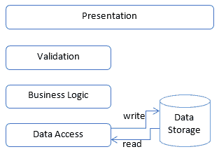

传统的数据源和 DTO 模型（CRUD）

如上图所示，数据的读取和写入操作（源）来自一个数据源或数据存储，包括更新或写入和查询（读取）。

CRUD 方法有一些缺点，如下所示：

+   被读取的数据和被更新的数据可能有不同的表示形式，并且为了同步管理这些更新数据以服务于读取和写入，这给底层系统带来了开销。

+   性能受数据存储和数据访问层的高负载影响，并取决于查询以及获取信息所涉及到的复杂性。高量交易还会增加在数据存储中锁定记录并由多个领域访问时的数据争用机会。

+   管理数据访问的安全性和角色可能也是一个挑战。

CQRS 模式解决了这些缺点，因为它的实现将查询（读取）与更新（**命令**）操作通过单独的接口分离：

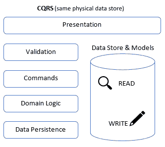

它还检查以下实例：

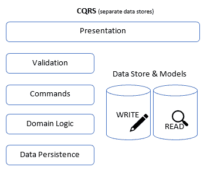

前面的两个图展示了 CQRS 实现的两种变体。第一个图表示了 CQRS 在单一数据源内具有读取和写入模型的简化设计和实现。请注意，它不是一个单一的数据模型（如 CRUD），而是读取和写入作为独立的模型。这种 CQRS 实现版本的缺点是，与 CRUD 不同，基于 CQRS 的系统无法实现带有脚手架机制的自动代码生成。

具有单独数据源的图描述了另一种 CQRS 设计，其中我们有两个不同的物理数据存储，一个用于写入或更新操作（命令），然后另一个专门用于查询。单独的数据存储实现最大化性能、可扩展性和安全性。

虽然 CQRS 带来了更高的性能、可扩展性和安全性，但它也带来了增加的复杂性和维护开销，以管理由于多个数据存储而导致的致性，同时还需要了解以下列表，以确定何时为您的实现选择 CQRS：

+   CQRS 适用于读写（更新）和读取（查询）数量差异显著的系统

+   它适用于读取和写入需要单独扩展的系统

+   它适用于数据一致性不是关键（解决最终一致性）但可用性是关键的系统

+   对于偏好“发射后不管”事件（异步事件）的系统来说，这是理想的。

+   它适用于基于事件源的数据存储访问层的系统

+   它适用于实现领域驱动设计并隔离业务或领域复杂性的系统，并且拥有 CRUD 会使系统更复杂

# 摘要

我们已经完成了我们的 API 测试之旅，回顾这段旅程，我们学习了 API 测试类型和 API 测试方法的一些基本知识，从单元测试用例开始，到 API 验证测试、功能测试、负载测试和端到端测试，以及 API 监控。我们还触及了一些重要的 API 错误方面，如执行错误、资源泄漏和错误检测方法。

当我们在查看 API 测试时，我们了解到了 REST API 世界中的几个关键安全漏洞，包括敏感数据泄露、身份验证攻击、XSS 攻击、会话固定（CSRF）、DoS 攻击和注入攻击。我们不仅关注攻击，因为本章介绍了这些攻击（漏洞）的原因，以及通过渗透和模糊测试检测这些 API 漏洞的方法和工具。

在了解 API 安全措施之后，我们继续我们的 API 测试之旅——我们了解了一些 API 测试用例创建、API 测试挑战和 API 测试最佳实践的 basics，并以 API 测试工具的快照结束了我们的旅程。

# 进一步阅读

*《精通现代网络渗透测试》* ([`www.packtpub.com/networking-and-servers/mastering-modern-web-penetration-testing`](https://www.packtpub.com/networking-and-servers/mastering-modern-web-penetration-testing))，Prakhar Prasad，Packt Publishing。
