# 智能应用的 RESTful 服务组合

通过利用边缘和数字化技术及工具，我们个人、社会和职业环境中的各种有形元素都被数字化了。也就是说，这些元素正变得可计算、可通信、敏感、感知、响应和活跃。数字化元素也被称为智能对象或感知材料。进一步来说，日常场所（如家庭、酒店和医院）中的各种嵌入式系统正通过各种通信和数据传输协议进行联网。因此，数字化实体和网络化嵌入式系统的结合使我们的环境变得智能，这些环境通常是自我感知、环境感知和情境感知的。另一个值得注意的趋势是，所有这些赋权工具正越来越多地与远程持有的（云）应用、服务和数据源集成，以便在它们的操作、输出和提供方面得到适当的加强。存在许多集成和经纪平台、适配器、连接器、驱动程序和插件，它们能够实现**设备到设备**（**D2D**）和**设备到云**（**D2C**）的集成。这种战略性的转变最终使它们在行动和反应中天生智能。这种宏伟且受技术启发的对我们日常环境中元素和实体的转变，导致了面向服务、事件驱动、洞察力丰富、云支持、容错、任务关键、多方面和以人为本的服务及时制定和交付。在构建和提供这些先进和下一代服务方面，强大的 RESTful 范式的作用正在稳步增长。

本章专门设计，旨在向您介绍 RESTful 服务范式在设计和开发下一代以微服务为中心的企业规模应用以及部署方面的贡献。它探讨了能够相互发现和绑定在一起的 RESTful 服务如何导致过程感知、业务关键和以人为本的复合服务。

本章将涵盖以下主题：

+   服务组合的需求

+   各种组合方法（编排和舞蹈）

+   编排方法

+   舞蹈方法

+   向更智能应用发展的编排和舞蹈的混合版本

# 技术要求

+   本章主要是一个包含大量理论信息的章节

+   读者必须熟悉 Java 语言和平台

+   本书 GitHub 仓库中详细开发并部署了一个简单的服务组合示例

# 简要介绍 RESTful 微服务

毫无疑问，我们正朝着承诺的知识时代迈进。我们日常环境中的一切普通和日常事物都在被精心填充正确的和相关的智能，以便在操作、输出和提供方面具有适应性、辅助性和灵巧。也就是说，我们个人、专业和社会环境中的所有物理、机械和电气系统都在系统地调整，以成为数字化实体和元素。它们通过一系列值得注意的技术进步获得所需的知识，这些进步是通过应用经过验证的和潜在数字化和边缘技术带来的。信息、通信、感知、视觉、分析、决策支持和执行技术的快速成熟和稳定性对实现智能解决方案、系统和服务的实现做出了巨大贡献。

快速发展的数字技术包括最先进的 IT 基础设施，如软件定义的云、大数据和快速数据集成平台、流式和物联网数据分析、企业系统的移动赋能、未来的**物联网**（**IoT**）、迷人的区块链技术以及普遍的**软件即服务**（**SaaS**）现象。知名的边缘技术包括消失的传感器、执行器、多方面的微纳米级电子、小型化标签、垫片、标签、条形码、芯片、控制器、斑点、信标和 LED。

数字技术和边缘技术的无缝结合使得强制性的颠覆、创新和转型能够动态而灵活地趋向 IT 愿景，这关乎创造更智能的家庭、酒店和医院。

微服务架构（**MSA**）的出现被誉为全球商业和 IT 组织最有趣和最具启发性的事情。目前运行的网页、云和企业管理应用正在通过微服务进行重新设计、重构和修复，以便更加灵活和具有未来感。进一步来说，各种设备，如移动设备（手机、智能手机、数字助理和平板电脑）、手持设备、可穿戴设备、植入设备（如传感器和执行器）、便携式设备（笔记本电脑）、固定设备、游牧设备和边缘/雾计算设备，也正在通过微服务获得能力。也就是说，每个数字化和连接的设备都作为微服务呈现给外界。所有设备的缺陷和差异都通过这种服务赋能得到处理。通常，每个微服务都填充了精心设计的 RESTful API。因此，接口和实现之间存在分离，这是技术无关的。

本章将探讨如何编排和编排具有 RESTful 接口的微服务，以形成高端和以流程为中心的服务。

# 揭秘微服务架构风格

为了确保通过在**信息和通信技术**（**ICT**）领域的独特进步中智能利用，确保业务敏捷性和自动化，有一些关键要求。必要的 IT 要求包括最大化团队自主性、优化开发速度、在不妥协一致性的前提下提供灵活性、满足弹性、简化维护。有敏捷编程模型和技术可以加快编写软件应用程序代码的过程，但优雅且可扩展地设计和界定应用程序组件对于软件应用程序长期成功至关重要。不应该有任何供应商锁定。任何技术和工具都可以被利用来生产和维持应用程序模块。此外，应用程序组件必须模块化，以便对企业来说正确且相关，因为企业越来越以服务为导向、以客户为中心、具有适应性和生产力。此外，应用程序组件必须公开可发现、网络可访问、互操作和可组合。因此，MSA（微服务架构）的概念在全球 IT 专家的适当滋养下开始蓬勃发展。微服务是细粒度、水平可扩展、独立部署、API 驱动、可使用和可重用、可移植且技术无关的。

随着容器化运动的稳步推进，拥有容器化的微服务变得容易，这些微服务的镜像可以被下载并提交为在容器中可执行的镜像，这些容器成为最理想的运行平台。如前所述，微服务可以被组合（编排和编排）以创建复合、流程感知和业务关键的应用程序。现在，为了管理容器——在典型的 IT 环境中通常数量庞大——容器化编排平台，如 Kubernetes、Swarm 和 Mesos，正在获得越来越多的关注。随着合格技术和工具的可用性，企业和服务提供商正在建立容器化云环境，以托管、运行和管理以微服务为中心的容器化应用程序。因此，遗留应用程序正在被分割成微服务集合，并且有平台和基础设施来运行它们。也就是说，大型单体应用程序正在云化，以便获得云环境的有战略意义的优势以及强大的微服务架构模式。

# 微服务优势

微服务日益流行的原因有很多。首先，微服务严格遵循单一责任原则。也就是说，微服务一次只做一件事，但做得很好。MSA 模式要求不同的责任需要放在不同的服务中。这些细粒度和自包含的微服务提供了许多独特的优势。开发、更改和进步的成本低，上市时间短。每个服务都在自己的进程空间中运行，并拥有自己的数据存储。每个服务都必须赋予易于理解和使用的 API。RESTful API 是 API 启用微服务中最受欢迎的。服务通过 API 调用相互通信。为了构建和维持业务关键和企业级应用，必须将多个微服务结合起来。微服务是模块化的（松散耦合且高度内聚）。松散或松耦合的微服务消除了与依赖相关的风险和缺点。另一方面，软件模块的紧密相关责任被保持在一起。

每个微服务实现一个独特的企业功能，因此拥有较小的代码库。因此，服务开发者轻松快速地引入任何所需的更改变得容易。此外，微服务简化并优化了软件设计。微服务还可以分发给测试人员和用户进行初步验证和确认。

微服务满足了软件应用的敏捷设计和开发的多样化目标。进一步来说，正如我们在本书的另一章中讨论的遗留系统现代化，微服务成为现代化和迁移大型单体应用的最佳选择。微服务可以轻松利用云环境的所有固有优势来产生和维持下一代应用，这些应用必须敏捷、适应性强、机智。

此外，微服务的敏捷性、简洁性和机智性使其成为构建和部署业务关键工作负载的最有能力的单元。也因为其规模较小，将错误引入源代码的可能性较低，并且易于调试微服务及其组合。因此，微服务架构具有许多商业和技术优势。专家们持续发布各种最佳实践，以高度有益的方式利用微服务架构（MSA）的独特能力。随着软件应用变得越来越集成和复杂，MSA 带来的舒缓体验有助于委托开发、部署和运营的复杂性。如果明智地使用，MSA 提供了一系列战略优势；其中值得注意的是应用的敏捷设计、支持云启用和本地软件应用，以及实现关注点分离的能力。

# 云原生应用的出现

MSA 模式成为创建和维持软件应用最有效的工具。为了长期受益，企业正在对两件事进行战略规划——赋予当前运行的应用以微服务为中心，并将这些修复后的应用迁移到云环境中（私有、公共和混合）。也就是说，应用通过利用 MSA 变得云化。

随着云中心的普及，软件工程师和架构师正在设计、开发和部署以微服务为中心的应用于云环境中。这种情况被吹捧为云原生应用。确切地说，为了果断地获得最初设想的所有好处（商业、技术和用户），应用正在通过微服务进行设计，使用其中一个集成开发平台和框架进行开发，并在云环境中部署。基于微服务的软件设计比传统的敏捷编程模型更快，而且有大量方法可用于加快软件构建的过程。

企业 DevOps 工具和流程的持续采用加速了软件应用的持续集成、交付和部署，**站点可靠性工程**（**SRE**）概念的出现为软件工程带来了额外的自动化和加速。因此，未来属于云原生应用。也就是说，各种企业、移动、社交、嵌入式、交易性、运营性和分析性应用都正在被构建为云原生应用。

# 物联网设备服务的不断增长的生态系统

我们讨论了特定业务和通用的微服务，这些微服务正越来越多地被容器化。任何软件的容器镜像都可以统一打包、快速交付并在任何软件平台上轻松部署，以无任何障碍地运行和交付其功能。随着各种特定用途和通用的设备快速增长，设备服务也在持续增加，这些服务符合 MSA 规范。我们有各种设备，如医疗仪器、机器人、无人机、商品、餐具、电器、消费电子产品和机器，它们正在逐渐连接起来，以便加入主流计算领域。领先的市场分析和研究报告预测，在未来一到两年内，将会有数十亿个连接的设备。

连接设备的各种功能正通过服务接口被暴露出来。服务范式能够满足不同和分布式设备之间所需的互操作性。也就是说，每个设备都被视为一个可查找的、灵活的、可用的服务。当将设备作为服务呈现给外界时，微服务的健壮性、多功能性和弹性变得非常有用，这消除了所有依赖性引起的挑战。

# 应用生态系统的变化

主机时代的应用通常是单体和庞大的。它们是集中的、不灵活的、封闭的，且维护成本高昂。然后，我们遇到了客户端-服务器和多层分布式应用。有针对特定业务领域的应用来解决特定问题。有网页、云、社交、企业、移动、可穿戴和物联网应用。然后，还有运营、交易和分析应用。有了微服务的稳固性，各种软件应用都被分解成多个微服务，这些微服务因其便于集成、部署、管理和机动性而非常著名。微服务是自我定义的，因此是自治的。

它们可以独立开发和部署。微服务被填充了它们自己的数据存储。微服务是解耦的，因此不会出现依赖性问题。然而，为了创建和维持更大、更好的应用，需要系统性地找到和融合不同和地理上分布的微服务。也就是说，服务应该被匹配和组合以实现复合应用，这些应用对企业云计算 IT 来说是正确且相关的。不仅对企业应用，而且在创建集成和有洞察力的应用时，组合的行为具有特殊的意义。

组成工作正以两种显著的方式进行——管弦乐和编舞。正如在*云原生应用的兴起*部分所提到的，存在特定领域和中立的应用程序，它们天生需要融合多个微服务以满足不同的业务需求、市场情绪和用户期望。简而言之，微服务的组合值得最高的认可，因为它能够产生更智能的应用，以实现用户赋能。因此，为了实现各种智能应用，API 丰富的、可扩展的、可配置的、互操作的和可组合的微服务是当务之急。组合工具和技术正在蓬勃发展，因此服务组合是构建洞察驱动、高度复杂和集成应用的最好选择，这些应用可以在任何运行时（裸机服务器、虚拟机、容器和函数）上运行。此外，未来呼唤以设备为中心的云环境，这恰当地被称为雾或设备云。微服务组合不仅可以在资源密集型服务器上运行，还可以在资源受限和网络设备上运行，这是微服务的真正美。

# 趋向 API 驱动的世界

集成和协作是软件实现业务流程的重要需求。旧的和现代的软件应用程序运行在多种 IT 平台和基础设施上。软件解决方案自动化了大多数业务流程。然而，业务应用程序必须自发地与其他软件包同步，才能产生成果。流程、应用程序和数据必须集成，以确保管理层和最终用户有一个全面而紧凑的视图。沟通是关键。API 是软件组件广泛认可的机制，用于以系统化的方式找到彼此进行交互。API 正在被创建并供应给任何类型的软件，包括 Web 和云应用程序、数据库、中间件和平台。当前的互联网范式正在稳步扩展。曾经，互联网是网络化计算机的网络。也就是说，各种计算机（客户端和服务器）都联网以共享它们独特的功能。

现在，不仅计算机，我们的通信设备和消费电子产品，如智能手机、**个人数字助理**（**PDAs**）、平板电脑、笔记本电脑、手持设备和通信网关，也加入了互联网。精确地说，**物联网**（**IoD**）范式正在迅速出现和演变。

各种个人和专业设备、仪器、器具和机器正在连接到互联网；借助众多数字化和边缘技术及工具，我们日常环境中的各种常见和便宜的东西正在被数字化，以便充分赋能以加入主流计算。在适当的技术赋能下，日常物品正变得可计算、可通信、敏感、响应和活跃。现在，随着服务工程技术的稳定性加快，我们将世界视为**服务互联网**（**IoS**）。也就是说，一切都被表达和暴露为对外界的服务。各种软件和硬件系统，包括嵌入式系统，都呈现为一系列公开可寻址和可用的服务。这最终有助于隐藏系统的复杂性和缺陷。

一方面，我们看到互联网空间中硬件系统（IT 基础设施）、软件应用程序和服务、数据源以及众多平台数量不断增加。然而，为这些互联网连接的系统、应用程序和服务创建和维持 API 并非易事。另一方面，我们有各种数字化的、嵌入式的、网络化的、便携的、时尚的、轻薄的外设设备。因此，为了在底层系统和遥远互联网托管系统之间建立有益的联系，API 是前进的道路。简而言之，RESTful 服务范式通过简化 API 的创建和使用，为系统集成和协作带来了慰藉。

# 表现层状态转移服务范式

RESTful 服务有助于在基于互联网的系统、应用程序和数据源之间建立有益的关系。RESTful API 使用普遍的 HTTP 方法执行最常见操作（`GET`、`PUT`、`POST`和`DELETE`）。**表现层状态转移**（**REST**）是设计基于 HTTP 的松散耦合应用程序的具有希望和潜力的架构风格。RESTful 服务是最简单且最受欢迎的服务，它们很好地融合在一起，可以应用于 Web、移动、云和物联网应用程序。

# API 设计最佳实践

在创建 API 时，以下**非功能性需求**（**NFRs**）和**服务质量**（**QoS**）属性需要给予最高重视，以便开发灵活的 API。其中最流行的是性能/吞吐量、可扩展性、简单性、可修改性、可移植性和可靠性。如果 API 是基于约束来准备的，这些品质是可以实现的。以下是至关重要的约束条件列表：

+   **客户端-服务器架构**：这本质上规定客户端和服务器应用程序应该能够独立进化。客户端只需要知道资源 URI。客户端和服务器系统之间不应该有任何其他依赖。因此，客户端和服务器接口的设计可以分别进行。这个限制为开发者提供了急需的灵活性，因为相同的 API 可以在多个后端服务器和数据库系统之间利用。API 可以轻松更改以适应特殊要求，而不会对他人造成任何破坏性影响。

+   **缓存性**：众所周知，缓存是将频繁访问的数据的副本存储在请求-响应路径上的多个位置的一种古老做法。当客户端请求资源表示时，请求通常首先发送到最近的缓存以获取数据。如果本地缓存中没有找到所需数据，客户端请求的下一点目的地是代理缓存或请求资源的反向缓存。如果所有缓存都没有最新的数据/新鲜副本，那么就没有其他选择，只能敲击资源本身。使用缓存优化网络可以减少延迟，优化带宽使用，减少服务器负载，并隐藏任何网络故障。

还有其他限制，这些限制在其他章节中有详细说明。

# 了解服务组合方法

编排和协奏是完成组合服务众所周知且广泛使用的方法。随着容器化运动的兴起，微服务正在被容器化并在云环境中运行。随着容器编排平台的采用，多容器应用程序正在轻松且快速地实现。因此，组合应用程序在服务级别和容器级别得到实现。为了组合，微服务必须找到并绑定到其他微服务，以实现更大的目标和达到更高的目标。一个简单的例子是，当新服务在服务注册表中注册时，它必须调用一些其他服务，例如身份验证和授权服务。根据用例，服务可能需要与更多服务交互，以便与其利益相关者和订阅者相关。

如其他地方所示，每个微服务都包含自己的数据源。每个微服务都启用了自己的一个或多个接口。由于 RESTful 服务范式所展现的日益流行和简单性，大多数 API 都是 RESTful API。以下图表生动地说明了以下内容。服务器端有多个微服务，客户端正在访问一个或多个服务。为了使微服务理念蓬勃发展，服务需要动态集成，以便有目的地促进服务交互：

这里有几个重要的挑战。调用服务不知道被调用服务是否运行良好。由于前所未有的服务请求数量，被请求的服务可能会过载。调用服务不知道服务性能、健康状况和安全信息。此外，这里没有故障处理和补偿机制。当多个服务涉及业务流程和交易时，了解数据和控制流中哪个部分出现问题很重要。必须识别问题的根源，以便简化故障排除。

此外，这些类型的交互通过紧密耦合发生，但紧密耦合可能导致依赖问题。这就是为什么更倾向于轻耦合和松耦合服务：以便开发和部署可以独立进行。此外，服务交互不会产生任何问题。RESTful API 是服务协作的方法。

对一个服务的任何更改都会产生级联影响；随着更多服务的加入，服务环境的操作复杂性必然会升级。因此，专家们提出了有能力的替代方案，通过调用紧密耦合的服务来解决这些不良影响。

# 服务编排和协奏

编排微服务必须通过编排引擎进行组合。组合必须通过预定义的模式发生，这些模式通常使用编排语言进行描述。编排更适合和适用于实现业务流程。一个合格且符合标准的编排引擎作为中枢大脑，极大地促进了控制和执行的引导和保证。策略/业务规则通过编排引擎以集中方式进行管理和操作。应用流程的 360 度视图通过编排引擎提供。服务和运营级别的协议（SLA/OLA）通过集中引擎进行估算和编码。简单来说，所有集中管理和常用功能都被从参与服务中抽象出来，并集成到编排引擎中，编排引擎还包含业务流程流和管理引擎。

服务链和流程，通常称为服务编排，在传统和企业管理应用集成中提供帮助：

+   **短运行编排**：除了处理即时数据和会话外，它们是无状态的同步。它们是一种请求和响应类型。它们以序列化的方式与多个服务进行通信。根据第一个服务的输出，编排器为第二个服务形成适当的消息，依此类推。

+   **长时间运行的编排**：这些通常是状态性和异步的。这些涉及人类参与、解释和指令，并通过利用持久数据存储来运行更长的时间。

同样也有一些缺点。编排器和所有相关应用程序组件/服务之间建立了一种紧密耦合。添加新服务和状态需要更新中央业务逻辑。中央协调员有时会成为一个单点故障。

另一方面，编排在多个解耦服务之间实现数据流。每个服务都知道它可以期望和提供什么类型的数据。不需要中央指挥官来运行流程。这完全是关于对等服务组合。每个服务都充满了所需的智能来行动和反应。每个微服务是一个自定义和包含的服务，每个微服务通过消息和事件进行通信并完成分配。**事件驱动架构**（**EDA**）正在成为日益事件驱动的世界的核心架构风格和模式。编排更适合实现事件驱动应用程序。由于它们的解耦性质，微服务可以被替换和用更好的服务实现替代。

可以在不影响系统的情况下集成额外的服务和它们的实例。新技术和算法可以轻松利用。各种服务依赖及其负面影响正在被消除。在基于编排的服务组合中，不存在单点故障。然而，也有一些缺点。没有中央指挥官或协调员，对服务交互和协作的监控、测量和管理仍然是一个挑战。也就是说，查看相互交谈的服务序列视图是有问题的。使每个微服务在其行动和反应中变得自给自足和智能是困难的，而且在参与服务中实现业务要求和技术驱动的进步也有些困难。编排促进了可扩展性和无共享架构。因此，专家和专家们认为，通过结合这两种架构风格，大多数新兴的应用场景都可以优雅地解决。

正如我们所知，由于各种原因，随着时间推移，业务流程正变得越来越复杂。尽管在一方面发生着向优化方向的过程整合，但业务流程仍在不断增长，变得复杂且运行时间长。流程还必须涉及地理上分散的不同微服务。因此，流程治理和管理变得痛苦。随着贡献微服务数量的快速增长，微服务之间细粒度交互的数量必然呈指数增长。因此，有技术支持的解决方案和最佳实践来克服微服务及其交互中存在的问题。主要方法包括编排和编排。接下来的章节将描述它们的需求、关键驱动因素、功能以及如何使用它们。

# 从服务编排开始

业务流程是通过各种服务实现来完成的。然而，涉及服务的顺序是有的。通常，业务流程指示要利用的服务序列。编排是通过集中协调器进行服务组合的一种方式。这个协调器/大脑指导并满足业务流程需求，就像管弦乐队的指挥一样——他是作为中央权威领导团队的。通过在各个微服务之间采用这种中介，紧密耦合带来的问题将一劳永逸地消失。也就是说，我们得到了松散耦合的微服务，它们不需要相互了解。它们也不需要知道其他服务是否正在运行。通信可以主要是同步的。也就是说，请求服务应该等待直到它们从请求服务那里得到响应。

存在一个控制器或协调器，充当服务编排器。也就是说，所有服务交互都通过编排器进行。这遵循了众所周知的交互方式：

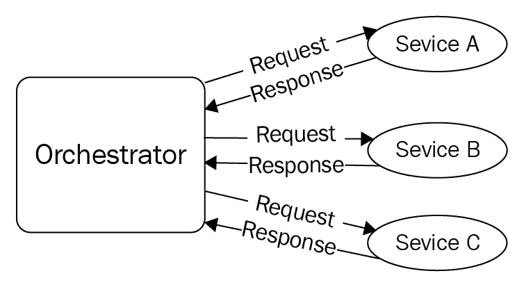

例如，我们需要两个或更多服务参与并调用以完成一个业务流程。调用顺序在这里也很重要。协调器会对每个服务进行调用并等待请求服务的响应。一旦响应到达协调器，下一个服务序列中的服务就必须被调用，依此类推。更多信息请查看[`medium.com/capital-one-developers/microservices-when-to-react-vs-orchestrate-c6b18308a14c`](https://medium.com/capital-one-developers/microservices-when-to-react-vs-orchestrate-c6b18308a14c)。

# 服务编排的不足

这是一个在需要同步通信和处理时实现更紧密流程控制的好方法。这种方法有几个缺点——如果第一个服务没有响应，其他服务就无法被调用。也就是说，它产生了一种耦合，导致不希望出现的依赖性问题。协调器成为单点故障，因此建议采用集群协调。同步通信会阻塞其他服务请求。

下面的图示说明了通过参与不同和地理上分布的微服务，协调过程是如何完成的：

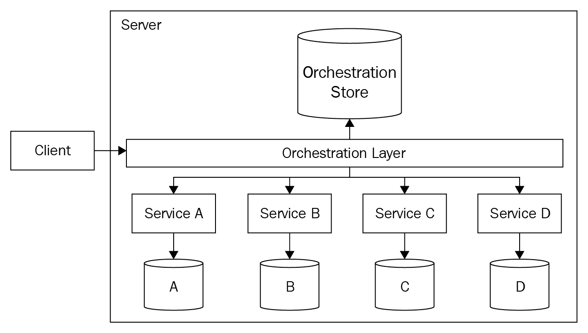

这种组合模型通常不处理故障情况。大多数时候，服务请求正在被处理。故障率大多是百分之一。最佳实践是，如果出现故障，必须立即启动一种或多种可行的应对措施，例如补偿，以便摆脱混乱。重试和修复活动是确保业务连续性的其他机制。为了最大限度地提高业务利润，必须建立数据和灾难恢复能力以减少数据损失。考虑到服务编排的缺点，服务编排（在后续章节中会详细解释）正受到越来越多的关注。

# 应用基于编排的组合

如果大部分工作必须按顺序进行（如果完全没有并行执行的可能性），编排就是可行的方法。如果需要保持控制流逻辑集中化，编排就是前进的方向。如果有数百个微服务参与，且控制流不同，集中化是首选。分布式部署和集中管理的箴言通过编排得到了实现。如果解耦不是严格的要求，编排方法就是广泛使用的一种。

# 从服务编排开始

当构建以微服务为中心的应用程序时，服务依赖必须在萌芽阶段就被遏制。编排会导致依赖，从长远来看这是不好的。因此，必须避免所有类型的依赖，以实现自我定义和自主微服务的战略愿景。专家认为，事件驱动架构（EDA）是解决之前提到的一些挑战的前进之路。也就是说，控制逻辑被塞入编排器模块中，而在这个案例中，逻辑被写入每个参与服务中；逻辑是分布式的，这些授权的服务（智能服务）事先就知道如何对各种事件做出反应。通信是异步的，并且利用事件总线（哑管道）来路由事件。这意味着多个服务可以消费相同的事件，然后启动它们规定的任务。然后，结果被封装并作为事件同时发送回事件总线。如前所述，这些微服务被称为**智能实体**，事件总线只是一个哑管道。事件总线没有嵌入任何智能，它是事件驱动微服务的主要通信基础设施。

异步特性消除了阻塞或等待，这是编排的主要缺点。在接收到事件后，服务可以产生其他事件，这些事件被循环回事件总线，由其他服务消费以执行其分配的工作。这种解耦在微服务世界中是必需的。

下图展示了事件驱动架构模式是如何工作的：

因此，事件生产者和消费者，在不知道任何关于对方的情况下，以目的为导向的方式合作。由于并行处理（许多服务接收事件并继续处理），确保了服务的快速处理。新的服务可以轻松加入并贡献，而不会影响他人。现有的服务可以轻松地调整以适应业务、技术和用户的变化，这毫无疑问是新的常态。微服务可以独立开发和部署，这赋予了不同的和分布式的开发团队专注于他们的核心活动，以更快地实现和部署以微服务为中心的应用程序。事件流存储所有的事件。假设在事件仍在生成时，某个服务崩溃了；经过一段时间，该服务恢复活力，获取所有错过的事件，并对它们采取行动。此外，这种 EDA（一种反应式架构）使我们能够将读取和写入活动分开。也就是说，这两个活动都可以独立完成。这种分离的优势在于，它们可以根据不断变化的需求独立扩展。如果应用程序读取量很大，那么这部分可以单独扩展，而不会影响写入部分。

通过编排，服务相应地被赋予了根据不断变化的情况行动和反应的能力。服务表现得像舞者——执行分配的动作以适当地对其他舞者做出反应，从而有组织地完成过程。

首先，编排概念依赖于流行的 EDA（电子设计自动化）。编排服务通常对事件做出反应，并将它们的输出放入事件总线队列中，然后，其他授权服务从中取走并开始展示它们独特的功能。"事件总线"是主要的中间件和通信基础设施。这在上面的图中得到了说明：

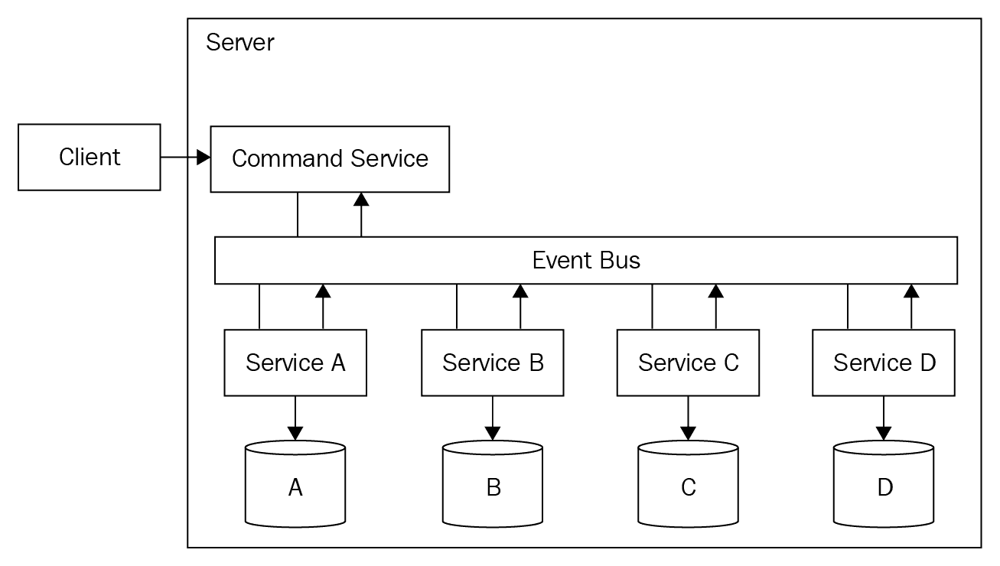

服务不需要与其他服务交谈来启动和实施一个动作。服务正在等待某些事件在某处被启动并通过事件总线转发给它们，这是主要的消息中间件/代理/总线。

# 服务编排的不足

编排的系统是松散耦合的、高度灵活的，并且容易适应变化（内部和外部）。作为一个例子，让我们考虑一个订单应用程序。使用反应式架构（事件驱动编排），流程可以表示如下（这是从[`blog.bernd-ruecker.com/why-service-collaboration-needs-choreography-and-orchestration-239c4f9700fa`](https://blog.bernd-ruecker.com/why-service-collaboration-needs-choreography-and-orchestration-239c4f9700fa)中摘取的）：

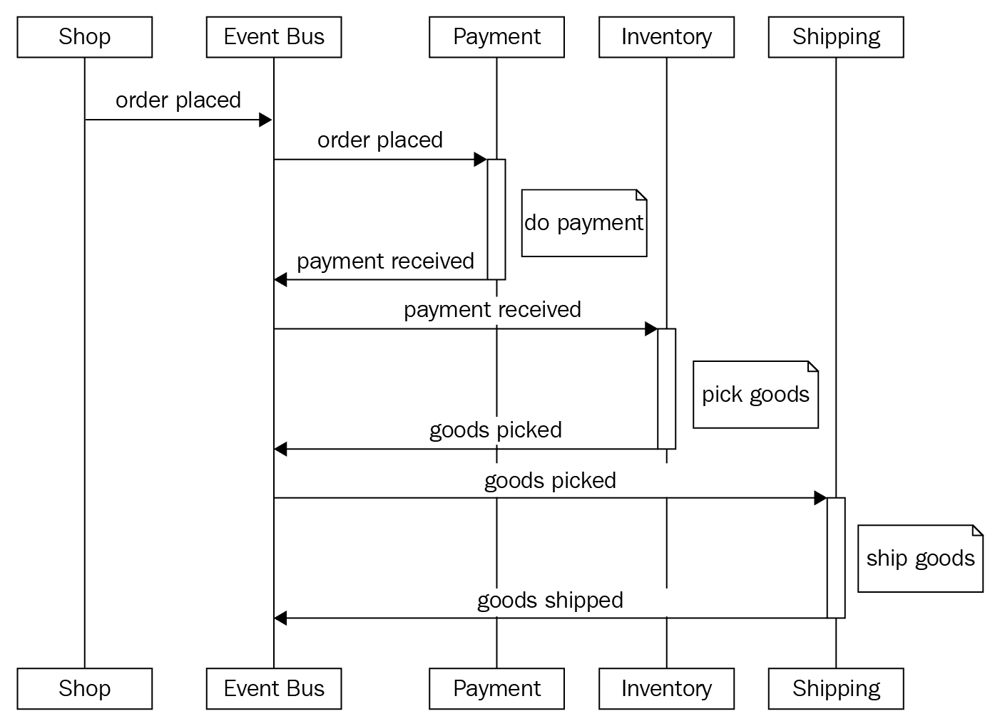

支付服务注定要响应订单放置事件。问题是支付服务必须知道它的消费者。如果任何其他服务需要支付服务，我们需要在支付服务中进行更改。现在，业务需求中有一个新的补充。补充是 VIP 客户可以通过发票稍后支付。这个变化将影响多个组件。支付服务只为非 VIP 客户执行支付。

库存服务也必须对订单放置事件做出反应，但仅限于 VIP 客户。以下图表解释了此过程：

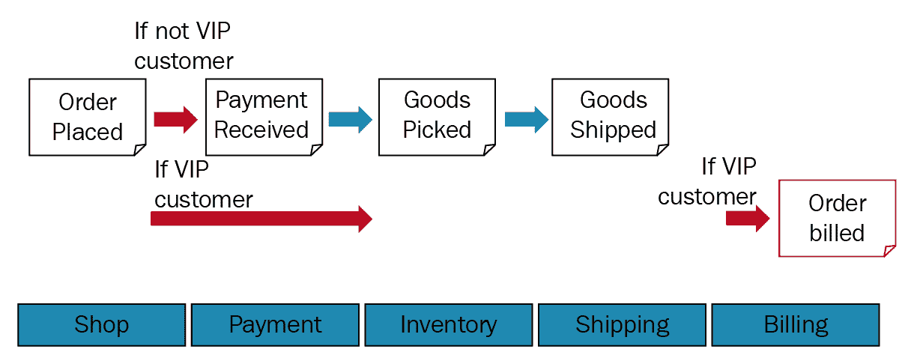

这需要引入一个额外的组件，它为**服务 A**及其用户之间带来清晰的分离。这被称为**事件-命令-转换模式**：

事件-命令-转换模式最终有助于实现解耦的事件驱动系统。

第二个挑战是支付服务可能需要更长的时间来完成。客户必须清偿他们的支付，这可能需要几天或几周。这是一个长期的过程流程，并且必须跟踪其状态。这显然支持编排风格的协作。因此，编排和编舞的融合是提供高度灵活架构以用于复合应用程序的最佳方式。

# 应用基于编舞的作曲

编舞有助于以并行方式完成业务流程。可以通过添加、降级、替换、替代和退役流程组件来更改流程。如果所有或大部分处理都可以异步进行，这种作曲方法是最合适的。并行执行是反应式架构的主要动机。如前所述，流程逻辑通常在此方法中分布。如果这种去中心化是可管理的，那么编舞方法就是好的。为了创建一个集中和综合的监控、测量和管理视图，最佳选择是使用关联 ID。

# 编排与编舞的混合

我们已经看到这两种作曲方法都有优点和缺点。也就是说，随着软件平台和包变得更加分布式、集成和复杂，没有一种架构风格在所有情况下都是完美的匹配。因此，IT 专业人士提出了编排和编舞的混合版本来克服这些限制。

第一种混合模式使用服务之间的反应式（用于服务间通信的编排）和内部服务中的编排（服务内通信）。在以下图中，我们有三个服务：A、B 和 C。这些服务通过事件总线相互驱动和反应。**服务 A**消费一个事件并被触发去编排调用服务 D、E 和 F。这些调用可以是同步的或异步的。然后，从服务获得结果后，**服务 A**产生一个事件：

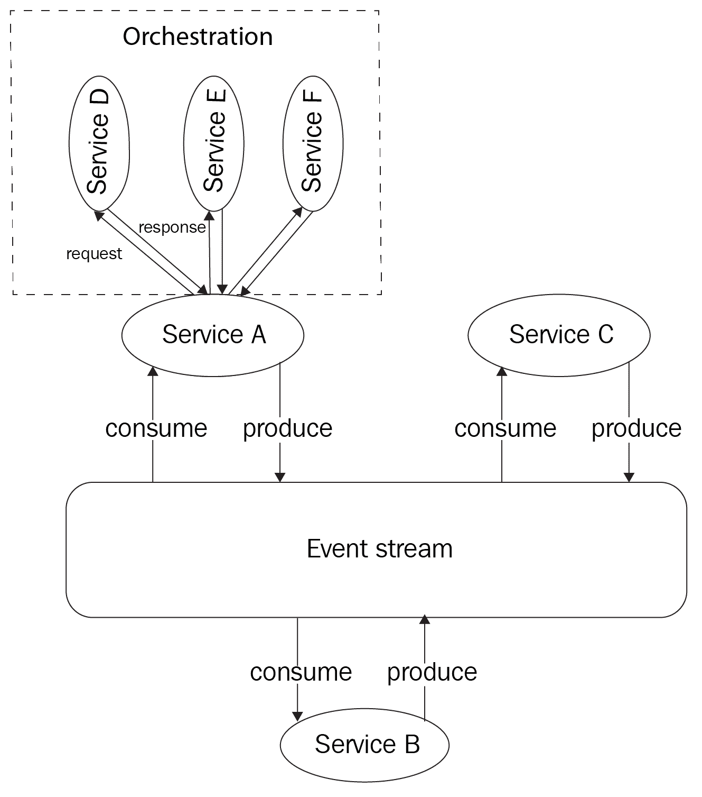

A、B 和 C 服务是解耦的。然而，**服务 A**内的 D、E 和 F 服务是耦合的。这意味着如果这些服务正在进行同步处理，这里会出现阻塞表面。事件总线促进了 A、B 和 C 服务之间的异步处理。每个服务（A、B 和 C）都包含控制逻辑以展示独立的行为。也就是说，逻辑通常分布在多个服务中，而控制、流程和其他横向能力在编排器的情况下被集中化。

*第二种混合模式*使用服务之间的反应式（事件驱动）和协调器（反应式编排器）之间的协调来协助流程。在这个例子中，它利用了命令和事件的观念。如图所示，协调器向事件流产生命令，而有权执行特定命令的微服务接收到命令，执行所需的处理，然后创建并将事件传递到事件流。

在这个例子中，服务 A 和 C 同时启动，协调器消费事件流中生成的事件并相应地做出反应：

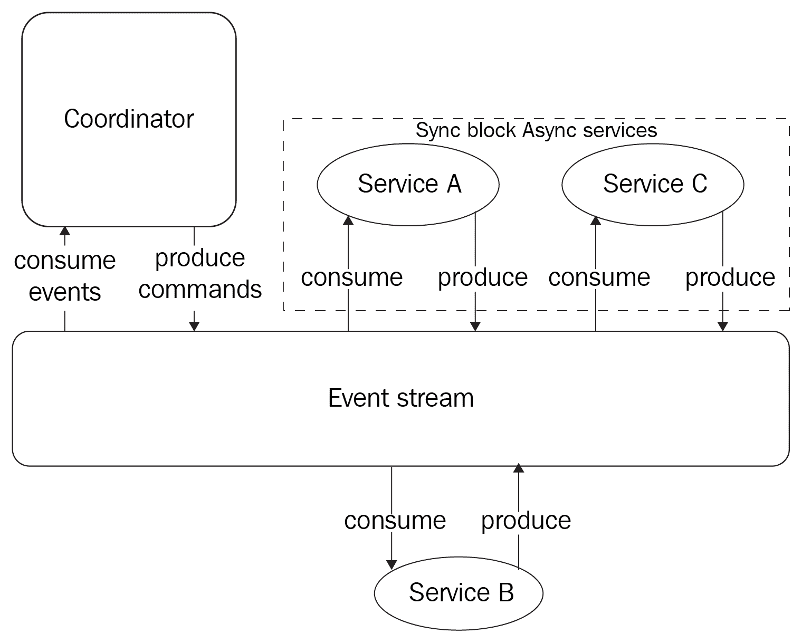

服务通常是解耦的，但服务与协调器之间仍然存在某种耦合。也就是说，协调器必须知道服务需要接收哪些命令才能正确反应。服务之间的事件导致异步处理。整体流程逻辑被放在反应式协调器中。协调器，像往常一样，是一个单点故障。

# 另一个编排和编排混合的例子

这里是另一个有趣的例子，摘自[`dzone.com/articles/event-driven-orchestration-an-effective-microservi`](https://dzone.com/articles/event-driven-orchestration-an-effective-microservi)。

# 编排

如下图所示，一个流程是由用户的事件触发的。然后，通过各自的微服务以编排模式共同完成该流程。这种方法确保了轻量级耦合和高内聚性：

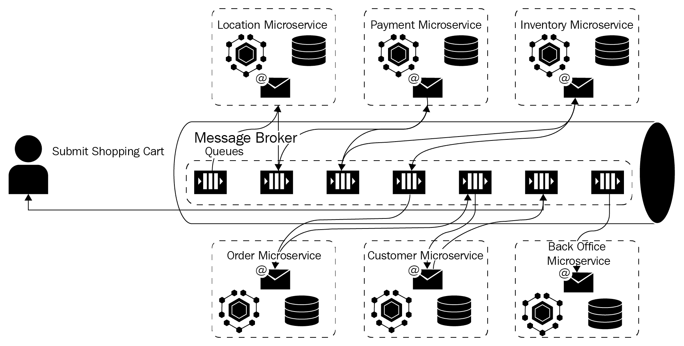

# 使用消息代理的服务编排

这种方法有几个重要的缺点。编排通常启用去中心化方法，因此所有参与的服务都需要嵌入相关的业务处理逻辑。任何业务和通信逻辑的变化都必须在所有微服务之间共享，并且流程的状态信息必须单独存储。没有集中式服务来照顾所有服务。最后，由于多个分布式服务参与流程的履行，严格的 ACID 属性的实施是不可能的。

# 服务编排

在网络中还有另一种方法。这是通过整合**业务流程模型和符号**（BPMN）工作流和 REST 来实现集中式服务编排。以下图表清楚地描述了一个复杂的**购物车微服务**是如何实现的：

# 使用 BPMN 和 REST 进行服务编排

如您所见，有三个原始资源类型。这些资源的相应路径细节也刻在前面的图像中。对于单体应用程序，中央服务器会处理所有资源目的地的请求。进一步来说，有一个共享的数据存储库，将资源作为不同的表存储。对于复杂的查询，备受讨论的复杂连接概念就派上用场了。

# 混合化 - 事件驱动的服务编排

如以下图表所示，购物车服务是通过 BPMN 工作流实现的编排服务。然而，所有各种服务适配器都通过现成的 AMQP 替换，但服务适配器是通过一个通用的现成 AMQP 适配器消除的，这是 AMQP 事件总线的主要组件之一，该事件总线是消息代理，用于解耦服务：

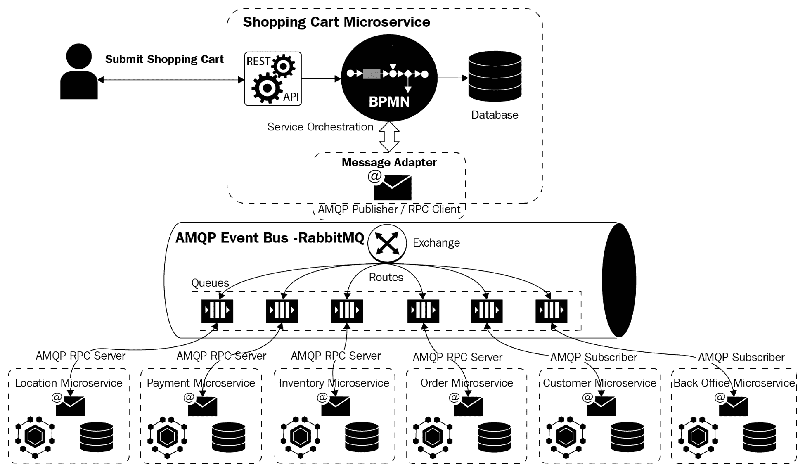

# 数据管理

MSA 的核心哲学是软件设计和开发的去中心化。去中心化不仅指导业务逻辑的组织，还指导数据如何持久化。

在单体架构中，应用程序组件和数据传统上被集中化。其中一个 SQL 数据库，例如 SQL 服务器，被用作包含多个表的单一数据库。这就是在之前时代数据持久化的方式。甚至一些应用程序逻辑的部分甚至以存储过程、复杂的连接等形式委托给 SQL 服务器数据库。

# REST 思维

为了正确且简洁地以去中心化的方式组织数据，RESTful 服务模式非常有用。也就是说，REST 概念引入了一种新的数据建模方式。任何应用程序中都有多个资源。REST 为每个参与资源提供了一个 URL。然后，建议使用标准的 HTTP 动词与资源进行交互。在[`medium.com/@nathankpeck/microservice-principles-decentralized-data-management-4adaceea173f`](https://medium.com/@nathankpeck/microservice-principles-decentralized-data-management-4adaceea173f)的文章作者提出了一个小型社交消息应用的示例 API：

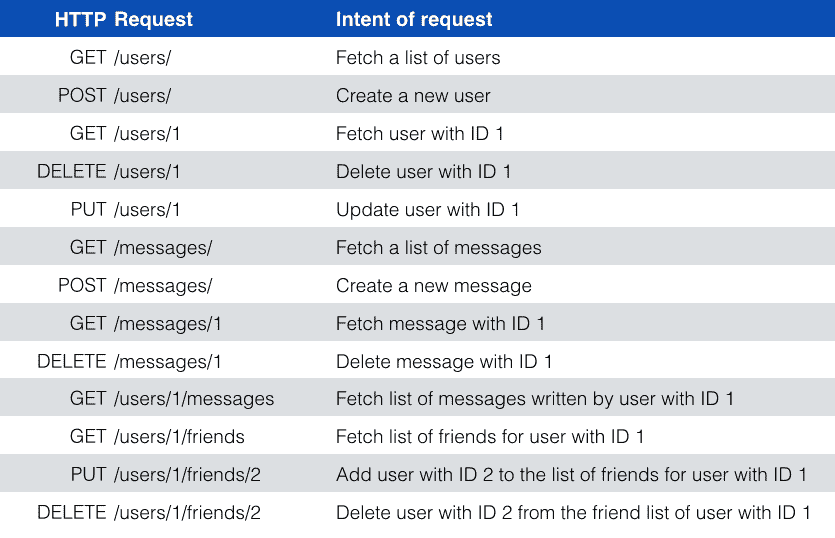

有三种原始资源类型——用户、消息和好友。资源类型有一组路径，如下面的图所示。在单体应用的情况下，中央服务器会处理所有资源路径的请求，并且有一个数据库存储所有资源类型作为表：

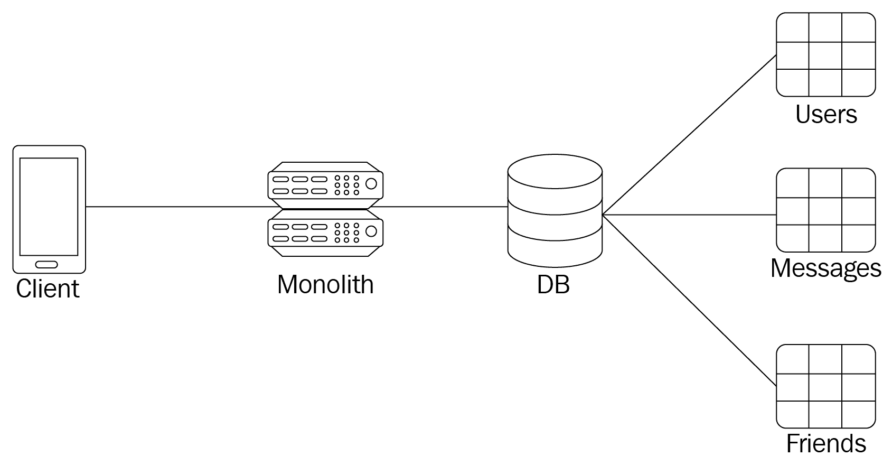

然而，对于以微服务为中心的应用，每个微服务都有自己的数据库。

这种安排确保了数据的安全。也就是说，每个数据请求、访问和操作都必须通过微服务 API 完成。这里的哲学是微服务与资源类型之间存在一对一的映射：

为每个微服务提供一个独特的数据库/数据库实例带来了一系列优势。

# 放弃 SQL 连接

对于更好的数据管理，一个值得注意的技巧是避免使用 SQL 连接操作。在 MSA 世界中，每个数据库在逻辑上都是分离的，执行 SQL 连接函数非常繁琐且耗时。这将是一场技术和安全的噩梦。然而，可能会有不同的应用需求。例如，假设消息应用要求时间线视图。也就是说，时间线视图必须显示认证用户每个朋友的最新消息。此外，这个新视图还必须显示朋友的名字和其他细节，以及发送的消息。

使用基本的 REST API 仍然可以实现这个复杂视图。也就是说，客户端必须调用多个不同资源的 API 来满足这个特殊视图的需求：

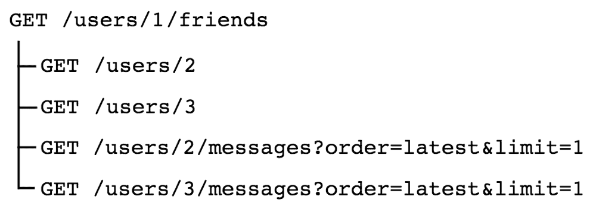

这意味着总共有五个请求。这是为了降低性能。一种解决方案是向 API 引入一个新的路由：

**客户端**可以随后获取这个单一的时间线资源以获取渲染时间线视图所需的所有数据。也就是说，它创建了一个额外的、位于三个数据微服务之上的时间线微服务。这个新的微服务将每个底层微服务视为一个资源。这个顶级微服务将底层微服务的数据合并起来，并将合并后的结果暴露给客户端。

在微服务时代，本地数据库操作是通过一个复合微服务完成的：

广泛讨论的性能问题并未出现在这里，因为时间线服务主要与其他三个服务一起托管在容器中。所有这些都在同一台物理机器或附近的机器上。为了进一步减少往返网络延迟，时间线服务可以利用*批量获取*端点的优势。用户微服务可以有一个端点，接受用户 ID 列表并返回所有匹配的用户对象。这里的优势是，新划分的时间线服务只需向好友服务发起一次请求，向用户服务发起一次请求，以及向消息服务发起一次请求。时间线服务作为一个集中地点来定义逻辑，这种分离有助于在以后的时间点适应任何业务、技术和用户驱动的变化。

# 最终一致性

这是 NoSQL 数据库的一个众所周知的特点。这对于事务数据库来说不是问题，因为事务数据库是集中式架构的主要数据持久化机制。然而，当数据被分割成许多逻辑或物理数据库时，一致性功能就不能轻易实现了。

例如，考虑一下如果用户在他们的朋友删除账户的同时获取他们的时间线会发生什么：

1.  时间线服务从好友服务中获取好友列表，并看到一个需要解析的朋友 ID

1.  好友删除账户，这将从用户服务中删除用户对象，以及从好友服务中删除所有好友引用

1.  时间线服务尝试通过向用户服务发起请求将朋友 ID 转换为用户详情，但收到`404 Not Found`响应

很明显，去中心化数据建模需要额外的条件处理来检测和处理在请求之间底层数据发生变化时的竞争条件。对于复杂的应用程序，有必要将一些表放在同一个数据库中以满足数据库事务。想法是这些关联表必须由单个微服务处理。如果相关数据需要强一致性，可以选择使用经过验证的*two-phase commit*机制。

# 多语言持久性

分散式数据管理有助于利用多语言持久性。不同类型的数据有不同的存储需求。我们有多结构和大量数据需要批处理和实时处理。对于流数据，有以下流分析平台：

+   **读写平衡**：某些类型的数据具有非常高的写入量。这需要不同类型的数据存储。

+   **数据结构**：某些高度结构化的数据类型，如 JSON 文档，可能更适合通过文档导向的 NoSQL 数据库进行存储和提供。

+   **数据查询**：某些数据可能通过简单的键值数据库轻松访问，而其他类型的数据则需要基于多个列值的复杂查询。

+   **数据生命周期**：某些数据只需要很短的时间，可以存储在快速内存数据库中，如 Redis 或 Memcached，而其他数据则需要永久保留，因此使用耐用的磁盘存储。

+   **数据大小**：如今，数据大小差异很大。有一些对象存储选项可以容纳令人震惊的数据量。

因此，在确保的微服务时代，数据管理相当不同且具有挑战性。然而，数据专业人士已经提出了合格的数据持久性、表示、交换、掩码、整理、管理和安全解决方案。

# 摘要

微服务必须通过编排引擎进行组合。组合必须通过预定义的模式发生，这些模式通常使用编排语言进行描述。编排对于实现业务流程流程是相关的。一个合格且符合标准的编排引擎充当一个中央大脑，以引导和保证控制流及其执行。策略/业务规则通过编排引擎以集中方式进行管理和操作。应用程序流程的 360 度视图通过编排引擎提供。服务和运营级别的协议（SLA/OLA）通过集中式引擎进行估算和编码。简单来说，所有集中管理和常用功能都被从参与服务中抽象出来，并集成到编排引擎中，该引擎还具有业务流程流程和管理引擎。

服务链路和流程，通常称为服务编排，正在帮助进行传统和企业的应用程序集成。

“分而治之”一直是调节复杂系统设计、开发、部署和运营复杂性的咒语。微服务架构（MSA）被定位为最高效和敏捷的设计技术。然后还有敏捷开发流程来加速微服务的实现。随着 DevOps 概念的稳定性加快以及众多自动化工具的出现，加速了微服务在云环境中的集成、交付和部署。

为了构建以流程为中心、业务感知、生产就绪和企业级的应用程序，应该识别微服务，根据其能力和专长进行匹配和组合。有两种组合方法——编排和协奏。在下一章中，我们将解释生产有效和可扩展的 RESTful 服务 API 的最佳实践。
