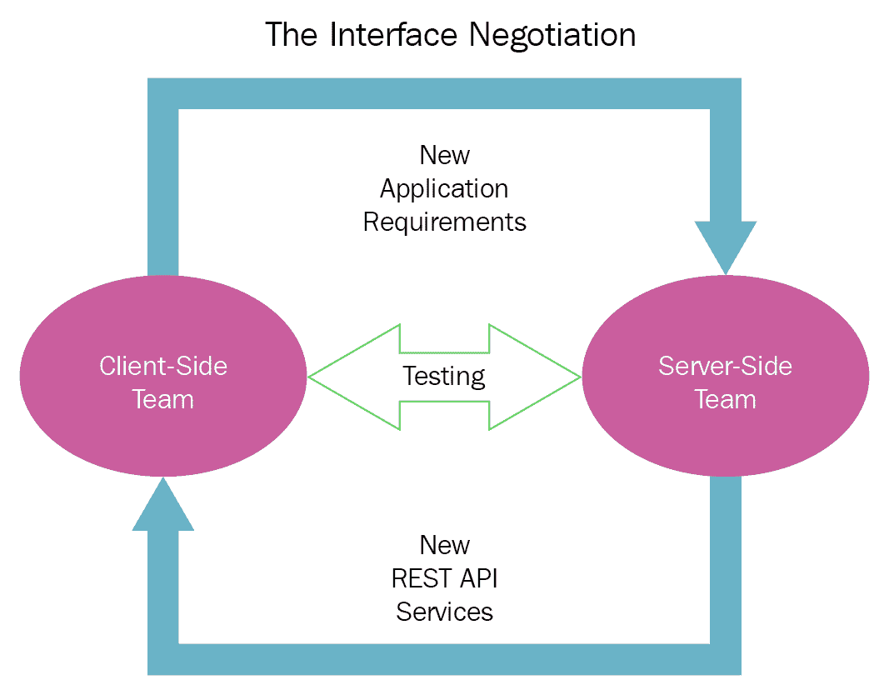

# RESTful API 设计技巧

行业垂直领域的企业级应用正越来越多地被构建为一个多语言微服务的集合。由于**微服务架构**（**MSA**）作为最优化和最有序的应用架构而日益流行，大多数业务关键型应用正被精心设计、开发和部署为一系列独立但交互的微服务。另一个值得注意的趋势是 REST API 在服务和应用中的巨大成功。各种应用（操作、交易和分析）都被配备了 REST API，以便简化应用集成。进一步来说，Web、云、移动和物联网应用都充满了 REST API。

用于设计、开发、调试、交付、部署和退役的现代应用平台也附加到 REST API 上。集成、编排、治理、经纪、合规和管理平台正通过 REST API 向外界公开。由于其简单和轻量级特性，REST 范式大量地吸引了人们的注意力和市场份额。精确地说，每个有价值的微服务、应用和平台都通过 REST 接口进行前端处理。毫无疑问，RESTful API 已经变得深入、普遍和有说服力。也就是说，RESTful API 在构建和集成应用中发挥着至关重要的作用。

本章致力于讨论设计模式和最佳实践，以构建能够轻松应对技术和业务变化的强大且兼容的 REST API。

本章将涉及以下主题：

+   阐述 API 的重要性

+   突出 API 设计模式和最佳实践

+   列举 API 安全指南

+   解释与 API 设计、开发、集成、安全和管理工作相关的各种工具和平台

+   趋向 API 驱动的数字世界

# 技术要求

本章详细介绍了设计高效 RESTful API 的各种最佳实践。读者应具备对 REST 架构风格的一些了解，以及基本的编程经验，以便充分理解和实施本章讨论的最佳实践。

# 从 API 开始

**应用程序编程接口**（API）的概念正因其对将任何应用程序或服务暴露给外界以寻找和使用其独特的商业和技术能力所做出的重大贡献而日益占据主导地位。为了实现应用程序、服务和数据的集成，APIs 正被广泛认可为前进的道路。不同应用程序和服务之间进行数据交换。有要求推出高度集成的系统。这意味着必须系统地集成各种第三方应用程序和后端系统。以企业应用中心、企业服务总线、消息代理和队列、API 网关和管理套件以及服务网格形式出现的中间件解决方案，正在显著地用于本地和远程应用程序集成。所有这些集成引擎都配备了精心设计和意图良好的 APIs。

如我们所知，随着大量轻薄、时尚、便携、用途无关以及特定设备的出现，设备生态系统正迅速增长；也就是说，连接设备越来越多地参与主流计算。在这里，API 在使设备、数据源和服务实现数据与逻辑交换方面的贡献也在稳步增长。API 隐藏了设备的外部异构性和多样性。也就是说，每个设备都表达和暴露为一个服务，每个服务都被分割为一个接口和实现。这种隔离在很大程度上有助于设备长时间运行。当涉及到动态地为设备配备额外功能时，API 是不可或缺的。

简而言之，API 是一种信使，它接收并处理请求，并确保企业系统成功运行。社交网站，如 Facebook 和 Twitter，是少数使用开放或公共 API 以利于其业务的公司之一。一个初创公司可以开放其 API，以便第三方软件可以使用其软件。对于集成世界，对于全球企业来说，建立、组合、保护、控制和增强 API 对于向客户、合作伙伴和员工展示其独特能力变得至关重要。随着数字技术在 IT 世界的中心地位，API 的优雅性正占据首位。

# 了解应用程序编程接口

根据成就卓著的专家们，API 是一套规则和工具，用于启动和监管业务工作负载之间的交互。现在，随着云的快速普及，交互水平已经超越了商业应用。也就是说，大量的 IT 优化和自动化服务也需要相互交互，以便简化并精简业务流程自动化。API 必须独特且统一地找到彼此，启动数据交换，并验证信息，以便软件应用程序能够利用彼此的业务优势。让我们用几个比较来解释 API 及其在我们日益互联的世界中的角色和职责。

如果应用程序是道路上的车辆，那么 API 就是交通规则。规则规定了车辆在道路上必须如何行为。

如果应用程序是食品，那么 API 就是食谱。API 指定并管理各种成分如何融合在一起以创造出美味时尚的菜肴。

如果应用程序是房屋，那么 API 就是蓝图，它阐述了不同的建筑构件如何融合在一起形成一个房屋。

为什么 API 成为了一个主流概念？

在我们日益软件定义和设计的世界中，API（应用程序编程接口）扮演着至关重要的角色，因此加快 API 的生产成为 API 开发者的一项关键任务。也就是说，为 API 的成功制定适当的规则至关重要。API 设计者创建并发布 API，使其他应用程序能够找到并与之交互。

假设你正在公开一个或多个面向客户的 Web 和移动应用程序，这些应用程序运行在云环境中。这些应用程序正被勤奋地配备一个或多个 API。现在，拥有 API 附加的应用程序使得其他开发者能够构建自己的应用程序，这些应用程序可以轻松地与 Web 和移动应用程序集成。这种集成使得应用程序更加庞大和优秀。实施业务流程变得更加容易、快速、无风险且富有成效。客户体验由于全渠道聚合能力的提升而显著提高。无需一个规模庞大的网络公司来设计和开发 API。即使是对于一个想法，一个应用程序也可以通过一个简单的 API 来构建和装饰。应用程序开发者正逐渐习惯于创建和维护 API，以便将他们的应用程序展示给更广泛的受众。

正如我们多次强调的，API 使应用集成变得更加简单。企业集成有其他选择，但在许多方面都显得不足。API 已成为流程集成的标准。当 API 设计者发布一套官方接受且明确定义的规则时，其他人可以自信地开始进行 API 启发的应用程序和平台集成。因此，API 提供了新的可能性和机会。API 赋予开发者控制他人如何使用他们的应用程序的必要权力，同时也规定了他人不能如何使用他们的应用程序。

# API 已成为不可或缺的

开创性的技术正在迅速出现并演变，朝着数字化创新、颠覆和转型发展。各种突破正在被发现并普及，以在 IT 和商业领域带来各种加速、自动化和增强。我们正被各种应用架构所淹没，从**面向服务的架构**（**SOA**）、**事件驱动架构**（**EDA**）和**面向资源的架构**（**ROA**）到 MSA。容器已成为服务的默认运行时。云服务器正被表示和暴露为一组容器。随着容器编排平台的日益流行，创建容器集群并使用它们来运行软件应用程序和服务已成为开发、部署和管理软件最显著的方式。正如本书其他地方所解释的，容器和微服务的酷炫融合推动了下一代应用交付。每个微服务都配备了一个或多个 API。进一步来说，每个微服务都有自己的数据存储。为了数据安全和有效数据管理，每个数据库也被赋予了执行数据操作的 API，以确保操作的信心和清晰度。

另一项显著的进步是云环境的快速普及以及每个云中心都挤满了数千个应用程序和平台。云托管平台不仅允许第三方应用程序开发者开发新的应用程序，还促进了与他们的应用程序的无缝和自发的集成。随着我们朝着联邦云环境前进以创建复合应用程序，API 已成为实现快速出现的多云理念最关键实体。**设备到设备**（**D2D**）、**设备到云**（**D2C**）和**云到云**（**C2C**）的集成通过 API 得到促进。

# 了解主要类型的 API

有几种 API 类型。**远程过程调用**（**RPC**）是允许应用程序远程调用其他应用程序中的一个或多个函数的一种。XML 和 JSON 是内容类型，并且为 XML 和 JSON 都有 RPC API。在 Web 服务领域，SOAP 凭借针对不同目的的多个标准规范统治着世界。但随后，由于极端复杂性，采用率急剧下降。现在，随着轻量级的 REST 架构风格，每个服务、应用程序、平台、中间件和数据库都在公开 RESTful API。

# 描述 API 平台

考虑到 API 对于即将到来的数字时代的重要性，工具和产品供应商推出了各种集成平台，以实现 API 生命周期活动。以下各节讨论了不同的平台解决方案，这些解决方案赋予了 API 世界权力。

# 创建 API 开发平台

有几种方法可以产生高质量的 API。从头开始创建新的 API，翻新现有的 API，以及从当前运行的集成中自动生成 API，这些是众所周知的方法。在这里，我们需要平台支持以其他方式创建 API。有 API 设计和集成平台可以满足这一需求。我们现在有数千个**软件即服务**（**SaaS**）应用程序通过云环境交付。这些服务通常是 API 附加的。这些 API 可以在多个地方重复使用。然而，这些 API 在功能上可能有限。因此，API 必须定制和增强以满足我们的需求。从头开始构建新的 API 既耗时又容易出错。新构建的 API 必须经过多次迭代才能被归类为相对稳定和成熟。

然而，使用高端 API 设计和集成平台，通过几点击就能加快从现有集成创建 API 的速度。这样，我们不会丢弃功能性的应用程序，并且可以通过利用现有投资节省大量时间。也就是说，API 平台提高了**投资回报率**（**RoI**）。

通常，客户端团队设计和开发应用程序，服务器端团队为应用程序部署准备后端 IT 基础设施，测试团队被要求测试客户端以及服务器端输出。这些团队应该以协作的方式为项目开发 REST API：

REST API 正随着业务消费者、合作伙伴和员工提出的见解而频繁变化。这些变化必须纳入 API 及其映射的服务中。这无疑会占用时间，因此上市时间必然会增加。为了加速和增强 REST API 的设计、开发、文档和测试，有几种自动化解决方案可供选择，这些解决方案可以显著增强团队协作。

**RestCase**是一个基于云的 API 开发平台。这个独特的平台使开发者能够协作创建 REST API。这种能力是通过一系列独特的平台模块实现的。关键模块包括一个直观的基于浏览器的界面，该界面可以自动生成文档、测试和模拟。该平台通过创建 API 的模拟来促进快速迭代和测试。

为了让开发团队能够与 QA 和运营团队协作，API 开发平台提供了帮助。这个平台帮助开发团队轻松构建更好的 API。当开发者通过 API 开发平台获得支持时，他们的生产力显著提高。开发时间和成本将降低。API 平台通过共享和与分布式研发团队的协作来增加创新。

# API 集成平台

我们正稳步迈向数字时代。日常物品正通过数字化和边缘技术被赋予数字化能力，以成为数字化产品。也就是说，我们日常环境中的每一件事都变得可计算、可通信、敏感、响应和活跃。每个数字产品都被配备了一个合适的 API，以便公开发现、网络访问和易于使用。为了简化 API 集成，最有效的解决方案是 API 集成平台。集成专家和架构师提到了几个用例，说明了为什么企业应该采用 API 集成平台。

随着云计算环境作为一站式 IT 解决方案的出现，为各种商业服务和运营提供支持，预计在未来几年，大多数企业级、个人、移动和 Web 应用程序都将驻留在云端（包括公有云、私有云、混合云和边缘云）。流行的企业级应用包括**企业资源规划**（ERP）、**供应链管理**（SCM）、知识和内容管理、人力资源、财务和设施管理，以及资产管理。此外，各种运营、交易和分析应用也在被现代化并迁移到云端环境中，以获得云带来的好处（用户、技术和商业）。

因此，物联网设备、桌面、可穿戴设备和智能手机应用程序连接到云应用程序和数据库变得强制性的。云应用程序、平台和基础设施主要是 API 启用。也就是说，D2D、D2C 和 C2C 集成需求在高度互联的世界中急剧增长。为了获得最佳级的应用程序，API 集成平台的作用是令人敬畏的。

# 遗留集成

我们从主机时代继承了大量的东西。我们在各个行业垂直领域运行着许多遗留应用程序。银行应用程序仍在运行遗留代码。没有人能否认主机计算机提供了最高的性能。通常，遗留应用程序遵循单体架构。此外，遗留应用程序规模庞大。与遗留时代相关联的还有几个其他缺点。尽管如此，由于它们的独特能力，企业对现代化遗留投资的步伐相当缓慢。这促使在现代和遗留应用程序之间建立集成管道。遗留系统携带和存储大量的业务交易数据。API 集成平台使数据集成成为可能。也就是说，数据可以被提取、转换并加载到与相关联的新应用程序关联的数据库和仓库中。为了生产和维持集成系统，获取和使用遗留数据是强制性的。API 集成平台对于这种持续的需求非常有用。

API 集成平台促进了复合应用程序的形成。随着 MSA 成为应用架构中最明智的选择，通过编排、编排或混合方法进行组合是生产过程感知和业务关键应用程序的重要任务。众所周知，每个微服务都暴露了一个 API。因此，为了将多个微服务组合成复合应用程序，API 集成平台的贡献是多方面的。

API 集成平台确保了更快的云采用和未来保障的企业集成。您需要一个 API 集成平台来保障企业集成。以下是在未来几年内的预测：

+   数以百万计的软件服务

+   数以亿计的连接设备

+   数以万亿计的数字化文物

随着每个物理的、机械的、电的和电子系统都配备了 API 并以服务的形式呈现，API 集成平台解决方案的采用率在未来几年必将上升。

# API 管理平台

随着企业为最终用户、合作伙伴和员工构建企业级和移动应用程序，API 变得不可或缺。应用程序必须在任何类型的网络上表现良好。API 提供了对托管在云基础设施中的数据服务的设计时间和运行时访问。企业主要是交易性的。移动商务和业务应用程序的交易性日益增加。因此，我们需要 API 管理平台来精确管理 API。

我们已经讨论了 API 开发和集成平台的各种特性和需求，以及它们如何帮助软件开发人员和集成人员自信且清晰地构建集成系统。现在，我们正朝着 API 管理和通过管理平台实现其自动化迈进。一般来说，API 管理涉及设计高质量的 API，然后发布和分析它们，以便持续跟踪其使用情况。API 可以是面向内部或外部的，它们必须易于搜索和消费。随着世界越来越倾向于拥抱 API 经济，有多个产品和平台简化并优化了 API 管理活动。API 管理解决方案的主要目的如下：

+   **API 设计**：API 管理解决方案赋予开发人员和外部各方设计、生产和部署 API 所需的所有知识和能力。进一步来说，它有助于制作 API 文档，设置安全策略、服务级别和运行时能力。

+   **API 网关**：我们专门分配了一章来描述 API 网关的各种功能以及微服务如何通过利用 API 网关解决方案受益。如今，API 管理解决方案也被赋予了作为 API 网关的能力，这为任何服务用户提供了一个集中式和集群式的前端，以便利用分布式微服务。API 网关充当所有下游 API 的守门人，并以安全的方式调节服务交互。

+   **API 存储**：API 应该存储在集中位置，以便内部和外部用户可以利用它们。因此，作为服务市场，API 市场正在快速发展。

+   **API 分析**：随着 API 使用量的增加，跟踪关键指标，如 API 使用情况、交易和性能，变得非常重要。捕捉这些决策支持和增值数据，并对其进行处理，有助于提取有用见解，以提升服务质量。

端到端 API 生命周期活动（如身份验证、为用户提供角色配置、政策建立和执行、用户请求速率限制、API 数据分析、监控）正由管理平台解决方案负责处理。这些解决方案还通过开发人员、外部方和员工来启用和增强 API 的使用。API 文档也正在实现自动化。API 管理套件使用缓存来减轻服务负载。API 日志、运营、性能、可扩展性和安全数据通过 API 分析功能收集并受到各种调查，以便了解服务状态，从而进行调优。几乎所有的企业都在拥抱 API，以在线运营并追求市场覆盖率的提升。进一步来说，API 目录正在在公司门户中发布。灵活的解决方案是部署 API 管理平台，以显著提高业务敏捷性和适应性。

API 必须进行艺术化的架构设计。API 不仅仅是为了使每个软件包都能有一个面向集成的前端，它们还必须极其用户友好。API 端点必须易于理解和使用，以便执行基本任务。API 预计将显著提高开发者的生产力。学习设计模式必须快速且简单，以便赋予开发者创建良好设计的 API 的能力。API 必须设计成持久性的。也就是说，必须确保 API 的一致性。API 质量也必须进行严格的验证和验证，否则，有缺陷的 API 会浪费开发者大量时间。API 提供者和消费者都要求高质量的 API。通过 API 设计、部署和管理自动化工具，全球企业正在实现更好和更一致的结果。

API 已经展现出了成功的曙光，并被用于满足应用集成，这对于企业 IT 团队来说一直是个头疼的问题。API 被视为满足各种集成需求的既定前进方式。除了网络和云服务能力之外，移动服务能力的实现过程正在获得越来越多的关注和市场份额，以便提供随时随地、任何设备、任何网络的信息和服务访问。API 的设计不仅要应对现有设备，还要考虑未来设备。市场上不断涌现出许多艺术设计的 I/O 设备。除了软件系统之外，每个连接的设备和集群基础设施都通过附加高效且可扩展的 API 来实现，以便被发现和绑定，从而创造商业价值。

您可以使用多种技术和工具来安全且高效地加快基于 API 的集成。如前所述，我们已整合了大量的平台解决方案（包括开源和商业级）以促进 API 经济。这些平台本质上保证了所产生和使用的 API 的质量。这种质量是强制性的，以获得 API 现象的好处。

# 揭秘 RESTful 服务范式

本书深入探讨了 RESTful 服务和 API。尽管 REST 风格简单，但它是一个功能齐全的架构风格。对于 IT 专业人员来说，生产、公开和维护高质量的 RESTful API 以实现平滑的功能集成是一项关键且具有挑战性的工作。主要来说，REST 是通过 HTTP 协议实现的。然而，REST 并不局限于 HTTP。REST API 是为*资源*实现的，资源可以是实体或服务。这些 API 提供了一种通过其 URI 来识别资源的方法。URI 可以用来传输资源表示的当前状态。API 可以表示为一组端点，其中包含动词和名词。动词通常表示一个动作，如 get、put 或 delete，而名词则表示与动作相关的参数。始终有一个机制来传达错误消息和成功的执行是一个好习惯。API 必须清楚地阐述其服务和参数，以减少开发者的错误。错误消息也必须全面，以便明确地向最终用户传达正在发生的情况。

随着服务范式的广泛应用，RESTful 服务的需求激增，与 SOAP 服务相比，RESTful 服务相当轻量。面向服务的应用程序开发和组装已成为软件工程的*事实标准*。对于开发和部署互联网应用程序，利用 RESTful 服务作为应用程序组件的需求急剧增长。RESTful 应用程序和服务配备了兼容且高效的 API。RESTful 服务为应用程序开发带来了急需的敏捷性、适应性和简单性。API 已成为 IT 服务和业务工作负载中如此常见的元素。此外，API 是软件基础设施、中间件解决方案、集成服务器、容器化平台和后端数据库系统中最常见的元素。API 作为企业应用程序以一致和认知方式交互的标准化机制。

由于云原生和启用应用程序的显著增长，有必要在云托管应用程序和数据源与企业和个人应用程序之间建立无缝和自发的链接。在这里，REST 范式在其它选项中表现良好。我们有大量的编程和脚本语言用于客户端和服务器端应用程序。不仅桌面和笔记本电脑，还有手持设备、可穿戴设备、便携式设备、游牧设备、无线设备和移动设备正在与 Web 应用程序集成。环境变得高度复杂和异构。此外，许多设备和服务必须协作以完成业务流程。REST 范式在这里提供了帮助。REST 概念是在不同环境中运行 Web 应用程序的抽象，例如 Windows 或 Linux。

RESTful 服务保证了使用不同编程语言和平台编写的应用程序所需的灵活性，以托管和运行这些应用程序。异构应用程序正在通过 RESTful 服务的力量实现相互操作。设备正被暴露为设备服务，并通过 RESTful API 进行前端处理。另一个普遍的趋势是云应用程序由 REST API 驱动。不仅资源密集型系统，而且资源受限的嵌入式设备，都从 RESTful 服务的范式中受益，以便连接。存在几种以设备为中心的通信和数据传输协议，REST 现象正在使用它们成为服务开发者和用户的宠儿。为了在许多使用场景中实现巨大的善意，对这种服务实现概念施加了几个约束。

# 特征化 REST 架构风格

首先，REST 范式是一种架构模式。专家们发布了许多设计模式，以设计和开发 RESTful 服务。有集成和部署模式，可以快速实现开创性的 REST 范式。

REST 范式符合著名的 RoA 模式。应用程序状态和功能被系统地划分为分布式资源。这些资源在线可用，因此每个资源都可以使用普遍的 HTTP 命令（`GET`、`PUT`、`POST`和`DELETE`）进行访问和使用。如果我们想在文件服务器上放置一个文件，我们需要使用`PUT`或`POST`。如果我们想从服务器获取文件，我们可以使用`GET`命令。如果我们想删除文件，`DELETE`命令是我们的首选选项。REST 架构，像往常一样，是客户端-服务器和分层的。它支持客户端缓存。此外，REST 应用程序是无状态的。这意味着它们不存储应用程序的状态。以下是对其独特特征的解释：

+   **客户端-服务器**：客户端可以是任何向服务器发送服务请求的东西。服务器端将托管 RESTful 服务，为客户端提供业务功能。

+   **无状态**：服务器不存储客户端会话信息。客户端必须与服务器共享所有必要细节以获得适当的答案。也就是说，RESTful 服务是自我定义的、自包含的、自主的、高度可扩展的，并且性能良好。

+   **缓存**：由于服务器不存储客户端信息，因此客户端有责任保留所有相关信息。因此，缓存的概念应运而生并变得流行。有时，客户端会再次向服务器发送相同的请求。由于 REST 服务是独立的，客户端将得到相同的响应。为了减少网络流量，客户端侧引入了缓存的概念。由于缓存存储了之前的响应，并且缓存位于客户端侧，因此获取服务响应的速度更快。

**缓存**就是将频繁访问的数据的副本存储在客户端和服务器路径上的多个位置。通常，客户端请求会被传递到世界另一端的服务器。然而，一系列的缓存被整合在客户端和服务器组件之间。也就是说，请求首先敲打客户端侧的本地缓存，然后是服务器侧的反向代理。如果任何一个缓存有最新的资源表示，它就可以被客户端使用。如果没有，请求将被发送到服务器组件以获取最新信息。

+   **分层系统**：由于企业应用复杂性的不断增加，引入了分层。这意味着可以在客户端和服务器之间集成额外的模块。我们熟悉三层和多层应用。这是一种复杂性缓解技术。

# REST 资源表示压缩

REST API 可以以多种格式（XML、JSON、HTML 和文本）返回资源表示。资源表示可以被压缩以节省网络带宽和存储需求。存在不同的传输协议可以实现压缩，并且客户端相应地被通知所使用的压缩算法。

**超媒体作为应用状态引擎**（**HATEOAS**）是 REST 范式的一个重要约束。术语 *超媒体* 指的是指向各种类型的多媒体内容（图像、视频、音频或文本）的链接。这种架构风格有助于在响应消息中使用超媒体链接，以便客户端可以动态地访问正确的资源。

# 允许幂等的 REST API

如果我们多次发送相同的请求并且每次都收到相同的响应，这些 API 通常被称为 **幂等**。一些 API 消费者有意或无意地两次或三次发送相同的请求。API 必须理解这一点，并以相同的响应进行回复。

重点是，我们必须构建和部署 *智能 API。它们的一个特点是幂等 API。* 我们必须为所有标准 HTTP 操作，如 `GET`、`PUT` 和 `DELETE`，拥有 *幂等的 REST API。只有 `POST` API 不会是幂等的。

如前所述，RESTful 通信发生在 HTTP 协议上，HTTP 命令正被 REST 客户端用于与 REST 服务器交互。这种一致性和简单性对于更快、更轻松地采用 REST 架构模式大有裨益，这在日益互联的世界中成为一个重要的概念。

# REST API 设计考虑因素

随着 API 的使用量迅速增加，API 设计过程现在正受到来自各种来源的广泛关注。不仅需要深入规划和实施高度优化和有序的 API，还需要使它们能够适应 Web、移动和云世界，具有弹性、健壮性和多功能性。API 的可用性对于应用程序的持续运行至关重要。API 的高性能和吞吐量至关重要。用户请求的数量、交易的数量以及处理的数据量对于 API 为应用世界贡献力量至关重要。API 必须具有良好的可扩展性，以便自动处理额外的用户和数据负载，从而对消费者和利益相关者具有相关性。不应有任何由 API 引起的应用程序速度减慢和崩溃。我们已在单独的部分讨论了 API 安全性的重要性。任何类型的内部错误、安全漏洞或 API 的漏洞都必须通过测试程序和工具进行清除。任何类型的外部攻击也需要给予足够的考虑。

应用程序必须完全遵守所有声明的 API 要求。也就是说，应用程序必须发送正确的数据和协议，正如 API 规则手册中所刻画的。如果存在任何故意的偏差，结果可能是无法修复的损害。因此，API 监控、日志收集和熟练的管理对于成功至关重要。在设计 API 时，服务架构师和 API 开发者必须认真考虑以下因素。API 在满足 RESTful 服务的 **非功能性需求**（**NFRs**）/**服务质量**（**QoS**）属性方面发挥着至关重要的作用。众所周知，RESTful 服务保证了简单性和普遍性。因此，在设计 REST API 时，架构师和设计师必须特别重视以下 NFRs：

+   **性能**：这是设计用于 RESTful 服务交互和协作的 API 时的一个重要参数。

+   **可扩展性**：RESTful API 必须设计成支持大量应用程序组件。这些组件之间的交互数量也应该相对较高。

+   **可修改性**：新技术不断涌现，商业情绪不断变化，用户期望也在不断演变。由于*变化是唯一的不变因素*，API 必须构建以适应不断变化的需求。

+   **便携性**：API 正在 API 存储库中被使用、测试、精炼和部署。API 必须具备便携性才能在各个系统间工作。

+   **可靠性**：API 必须可靠，以承受系统级别的任何类型的故障和错误。组件和数据级别可能存在故障，但系统仍应继续运行并履行其义务。

当我们努力构建和部署高度可扩展、可用和可靠的系统时，API 作为满足先前 NFRs 的舒缓元素的出现，正受到赞赏和欢迎。

# 枚举 RESTful API 设计模式

API 设计正成为任何 API 产品战略的核心支柱，以实现软件产品的预期成功。任何软件包都必须附加适当的 API 才能远程被发现和绑定。公开 API 有助于任何第三方服务或软件提供商建立联系并被使用。因此，生产易于使用、前瞻性和可持续的 API 对于 API 驱动世界至关重要。良好的 API 设计可以显著提高**开发者体验**（**DX**），并可以提高性能和长期可维护性。API 实现通常对 API 客户端隐藏。这种分离为 API 实现带来的任何进步提供了所需的灵活性，而不会影响任何 API 客户端。一个设计良好的 API 必须具有以下属性：

+   API 必须支持所有标准和相互同意的平台

+   随着设备生态系统的不断增长，任何客户端都可以调用和使用 API

+   什么都不会是静态的

+   API 更改是强制性的，因为应用程序和服务注定要不断现代化

+   API 设计和修改必须以这种方式进行，以确保客户端不受负面影响

# 媒体类型

正如众所周知，客户端和服务器通常交换资源表示。通常，在`POST`请求中，请求体包含要创建的资源表示。相反，在`GET`请求中，响应体包含接收到的资源表示。通常，格式通过使用*媒体类型*（也称为 MIME 类型）来指定。对于非二进制数据，它是 JSON（媒体类型=application/json）和 XML（媒体类型=application/xml）。请求或响应中的 Content-Type 头指定了表示的格式。

在理解了 API 对于创建复合企业的重要性之后，IT 专业人士已经挖掘出许多 API 设计模式，这些模式易于 API 设计者和开发者理解和使用：

+   **无状态**：对于 Web 规模的应用程序，在任何时候，使用各种客户端设备通过 REST 服务获得服务的用户数量都在数百万。通过 RESTful 服务创建的 Web 应用程序必须内部和外部可扩展。因此，在应用程序服务器中存储客户端会话信息可能会降低应用程序性能。也就是说，应用程序服务器必须是无状态的。API 必须设计成支持无状态属性。

+   **内容协商**：我们知道，一个资源可以有多种表示形式，以满足不同客户端设备的不同需求。客户端请求合适的表示形式被称为内容协商。另一种选择是，可以使用不同的 URL 来引用不同的表示形式。

+   **统一资源标识符**（**URI**）**模板**：包含占位符的 URIs。通过使用命名替换变量，模板可以用来为特定资源创建 URIs。模板用于规范文档中描述资源的位置。客户端应该了解这些模板，以生成任何资源的完整 URI。这是由于资源通常不会链接到其他资源。决定资源 URI 的责任在于客户端手动。解决这种困境的正确方法是，从已知位置链接这些资源。单个产品提供必须从中央产品列表资源链接。因此，URI 模板对于明确标识任何资源的 URI 非常有用。

+   **版本控制**：这是一个重要的实践。APIs 不断变化以适应商业和技术变化。API 兼容性是一个严肃的问题。开发者们持续地被要求在 APIs 上引入经过验证的更改。有时，为了能够与较旧版本的 APIs 一起工作，需要向后兼容。其理念是，如果版本号与 API 相关联，则不会有冲突，并且简化了用户的工作。API 版本控制也有助于精确跟踪 API 的演变。

+   **批量操作**：服务正在通过细粒度和粗粒度方法进行装饰。批量操作通常通过粗粒度方法实现。API 设计者必须注意这一点。细粒度方法通常需要多个请求和响应，这浪费了大量的网络带宽资源。通过少数几个请求，可以完成更大更好的操作。

+   **分页**: 通过单个 URI 暴露多种资源可能导致应用程序为客户端获取大量数据。不可能在单页面上显示所有表示细节。分页在这里发挥作用，可以减少将传递给客户端的数据量，从而节省网络带宽。这种模式还可以避免服务器端不必要的处理。在 API 设计阶段，尽管预测作为响应返回的数据量是一项具有挑战性的任务，但对于 API 设计者来说，预测和规划分页资源需求是必要的。

+   **排序**: 对于返回大量数据给客户端的任何 API 端点，排序都是一个重要的功能。为了便于排序功能，许多 API 添加了*sort*或*sort_by* URL 参数，它可以接受字段名作为值。好的 API 设计允许您在排序时指定*升序*或*降序*。排序参数应包含执行排序的属性名称，用逗号分隔。

+   **过滤**: 这是一个公认的说法，即 URL 参数是嵌入基本过滤到 REST API 的方式。如果我们有一个`/products`端点，它是销售的产品，我们可以通过属性名进行过滤，例如`GET /products?state=active`或`GET /products?state=active&seller_id=1234`。这里的问题是这仅适用于精确匹配。如果我们想要过滤范围（价格或日期），就存在挑战。URL 参数通常有一个键和一个值，但为了执行高级过滤，我们需要至少三个组件：属性/字段名、运算符和过滤值。

有方法将这些组件编码到 URL 参数键/值中。您可以在以下链接中找到更多详细信息：[`www.moesif.com/blog/technical/api-design/REST-API-Design-Filtering-Sorting-and-Pagination/`](https://www.moesif.com/blog/technical/api-design/REST-API-Design-Filtering-Sorting-and-Pagination/)。通过限制具有特定和有限属性及其预期值的查询（资源）数量来限制资源或响应称为过滤。因此，可以在多个属性上应用过滤器，或者允许一个过滤属性有多个值。

+   **Unicode**: 当今的 API 必须支持比英语字符更多的字符。如果 URL 中嵌入 Unicode 字符，API 必须相应地开发。

+   **错误日志**: 必须仔细收集各种错误消息，并对其进行各种调查，以从日志中提取任何有用的见解。客户端请求可能有错误。可能是由 API 本身引起的错误。因此，日志收集是错误分析的重要过程。

+   **无状态身份验证和授权**: 如多次提及，REST API 必须设计为无状态的。每个请求都必须是自包含的，以便在没有客户端知识的情况下满足用户请求。如果主要服务无法进行交易，其各种实例必须及时启动以实现请求。这不仅适用于服务请求，也适用于用户身份验证和授权，无状态服务需要参与和调用。通常，用户信息存储在服务器端，以便后续请求不需要访问身份验证服务。然而，这种方法未能通过可扩展性测试，因此每个请求都必须携带所有相关信息，以便进行身份验证和授权。这不仅仅限于用户——服务到服务的授权也通过这种方法得到促进。

专家建议使用 JWT 与 OAuth2 进行用户身份验证。对于服务到服务的通信，在请求消息的头部组件中具有加密的 API 密钥至关重要：

+   **Swagger 用于文档**: API 文档对于开发者深入了解 API 及其独特功能非常重要。API 文档的准确性对于预期的成功至关重要。与其使用人力资源生成 API 文档，不如使用自动化技术和工具来创建 API 文档更简单、更快。API、注释和元数据共同促进了文档的自动化生成。Swagger 是广泛使用的用于记录 REST API 的工具。生成的文档包含有关特定 API 使用的详细信息。它还提供了 API 中方法输入和输出信息的相关细节。

+   **HTTP 状态码**: 网上有很多文章和博客列出了 HTTP 状态码。这些帮助客户端了解服务器面临的实际情况。也就是说，当客户端请求到达服务器端服务时，服务器将向客户端生成一系列响应。可能会有失败或成功。状态码提供了一些关于服务器端发生情况的线索。

+   **HATEOAS**: 每个 HTTP `GET`请求都必须提供响应消息中的所有信息。这些详细信息有助于通过嵌入在响应中的超链接找到与请求对象直接相关的各种资源。此外，它还必须包含描述在每个资源上可用的相关操作的详细信息。这被称为 HATEOAS。HATEOAS 简化了通过资源及其可用操作的导航。这促进了客户端与应用程序进行不同操作的交互。所有元数据都嵌入在服务器的响应中。

我们已经讨论了大多数 API 设计模式，这些模式来源于多个来源，例如经验丰富的从业者撰写的博客。有关应用、服务、设备、中间件和数据库 API 的风险免费和有价值的体验，有设计模式、最佳实践、指标和其他知识指南。

# API 安全设计模式

API 安全至关重要。如果允许对 API 进行任何操作，结果可能是灾难性的。以下是一篇文章，列举了 API 开发者必须细致入微地做的事情，以便达到无法渗透和无法破解的 API：[`dzone.com/articles/top-5-rest-api-security-guidelines`](https://dzone.com/articles/top-5-rest-api-security-guidelines)。首先，正在进行身份验证和认证，以便用户能够访问 RESTful API。接下来是授权。RESTful API 设计必须以这种方式进行，以便可以建立和执行授权权利。此外，将正确的更改引入授权策略/规则也必须是 API 设计的一部分。必须强制执行基于权利的资源访问。

确保设计要求对特定资源集合和操作进行 API 密钥或会话令牌验证是 API 设计者/开发者的责任。例如，如果有一个针对书籍的 API，那么允许任何用户删除条目是不明智的。但是，允许任何人获取书籍目录条目是可以接受的。进一步来说，会话令牌或 API 密钥必须嵌入到消息体中或作为 cookie 发送，以仔细保护特权集合或操作免受未经授权的使用。

# 白名单允许的方法

我们都知道 REST 服务允许对资源执行多种操作的方法。为了避免任何冲突，RESTful 服务必须开发和部署，以确保只接受正确的处理方法。其他方法会自动返回适当的错误消息。关键的安全攻击如下详细说明：

+   **跨站请求伪造**：REST 服务向外部公开资源，以及一个精心设计的 API。保护`PUT`、`POST`和`DELETE`请求的**跨站请求伪造**（**CSRF**）至关重要。标准的保护方法是使用基于令牌的方法之一。如果我们的应用程序中存在任何**跨站脚本**（**XSS**），即使我们使用随机令牌，CSRF 仍然可以轻易完成，因此，专家建议利用可行的机制来防止 XSS。

+   **输入验证**：我们在客户端和服务器端都执行验证。客户端和服务器端的脚本语言具有验证请求和响应的内在能力。如果存在不正确的用户输入，最好拒绝它。此外，记录输入验证失败也是更好的做法。如果有更多的输入验证失败，可以考虑对 API 进行速率限制。

+   **URL 验证**：攻击者可能篡改 HTTP 请求的任何部分以破坏所采用的安全方法。构成 HTTP 请求的关键部分包括 URL、查询字符串、头、cookie、表单和隐藏字段。

+   **安全解析**：所有传入的消息都必须系统地解析以检查任何安全违规行为。确实，REST 可以接受通过多种机制（包括 XML 和 JSON）封装的消息。

+   **验证传入的内容类型**：当我们使用 `POST` 和 `PUT` 方法提交新数据时，客户端应明确指定内容类型（如 XML 或 Java）。

+   **服务器永不假设内容类型**：服务器始终需要验证内容类型和内容是否相同。如果它们不匹配，必须返回适当的错误消息。

+   **验证响应类型**：这是另一种验证。REST 服务允许多种响应类型，因此客户端必须在请求消息的 Accept 标头中明确说明响应类型的首选顺序。此外，对于典型的响应类型有许多 MIME 类型，因此客户端必须指定在回复消息中应使用哪些 MIME 类型。

+   **XML 输入验证**：存在针对 XML 的特定攻击（如 XML 外部实体和 XML 签名包装），因此基于 XML 的服务必须安全地解析 XML 消息以防止攻击。

+   **安全头**：为了正确解释服务器消息，服务器必须将正确的内容类型嵌入到内容类型头中。

+   **XML 编码**：应使用 XML 序列化器构建 XML 消息。然后，只有浏览器可以解析 XML 内容，并且不会出现任何 XML 注入错误。

+   **加密**：当数据正在传输时，它会被加密。也就是说，必须启用传输层安全（**TLS**）。当凭证、更新、删除以及其他增值信息传输时，TLS 非常重要。即使是专家也推荐使用相互认证的客户端证书来确保 RESTful 网络服务的最高安全性。同样，当数据被持久化时，数据必须被加密，当任何应用程序使用数据时，必须采取适当的安全措施。

+   **消息完整性**：密码学确保了机密性，但我们还需要消息完整性。也就是说，我们利用消息摘要/哈希算法来实现消息完整性。**JSON Web Token（JWT**）是一种标准化的、可选验证的、加密的容器格式。它用于在双方之间安全地传输信息。

JWT 定义了在网络中传输的信息的结构，它有两种形式：序列化和反序列化。序列化形式用于通过网络在每个请求和响应中传输数据。反序列化形式用于读取和写入令牌中的数据。JWT 在以下场景中很有用：

**授权**：JWT（Jason Web Tokens）允许登录用户访问路由、服务和资源，因为 JWT 令牌将是后续传入请求（在初始请求之后）的一部分，JWT 也是 SSO（单点登录）实现的热门选择。

**信息交换**：JWT（JSON Web Tokens）正在成为一种在各方之间安全传输信息的方式。JWT 可以使用公钥和私钥进行签名，因此很容易理解发送者是谁。此外，通过消息摘要，可以证明消息在传输过程中没有被篡改。

API 安全性是一个重要的现象。有越来越多的最佳实践和模式用于保护 API。在可视化任何类型的安全影响时，收集错误日志很有用。随着时间的推移，这是确保 API 设计、发布和维护无懈可击安全性的最可靠途径。

总结来说，开发者应该努力理解当前的环境和未来趋势。一开始就提出一个战略上可行的 API 并不容易。如果充满热情并经过讨论，API 可以成就或标记整个场景。API 设计者必须从用户的角度开始思考。稳健的设计是生产并维持最先进和多功能 API 的关键因素。设计不佳的 API 可能会导致失败，或者客户可能对应用程序和服务不满意。

# 摘要

微服务架构是生产多功能和企业级应用程序的主要架构模式和风格，这些应用程序可以优雅地托管和运行在云环境中（本地和远程）。微服务轻量级、易于构建和部署、自我定义、细粒度，并且可网络访问。它们还遵循单一功能原则。

现在，所有通过 HTTP 通信并使用 JSON 或 XML 格式消息或 HTTP 方法（`GET`、`POST`、`PUT`或`DELETE`）的都被称为 RESTful API。RESTful API 易于设计和构建。微服务和 RESTful API 的无缝和自发的结合开辟了新的可能性和机会。因此，在我们的日益互联和以服务为导向的世界中，设计高质量的 RESTful API 具有特殊的重要性。本章提供了相关模式、最佳实践和一般指南，以制定高质量的 RESTful API。

# 进一步阅读

+   [`www.packtpub.com/application-development/hands-restful-python-web-services-second-edition`](https://www.packtpub.com/application-development/hands-restful-python-web-services-second-edition)

+   [`www.packtpub.com/application-development/building-restful-apis-go-video`](https://www.packtpub.com/application-development/building-restful-apis-go-video)

+   [`www.packtpub.com/web-development/restful-web-services-scala`](https://www.packtpub.com/web-development/restful-web-services-scala)
