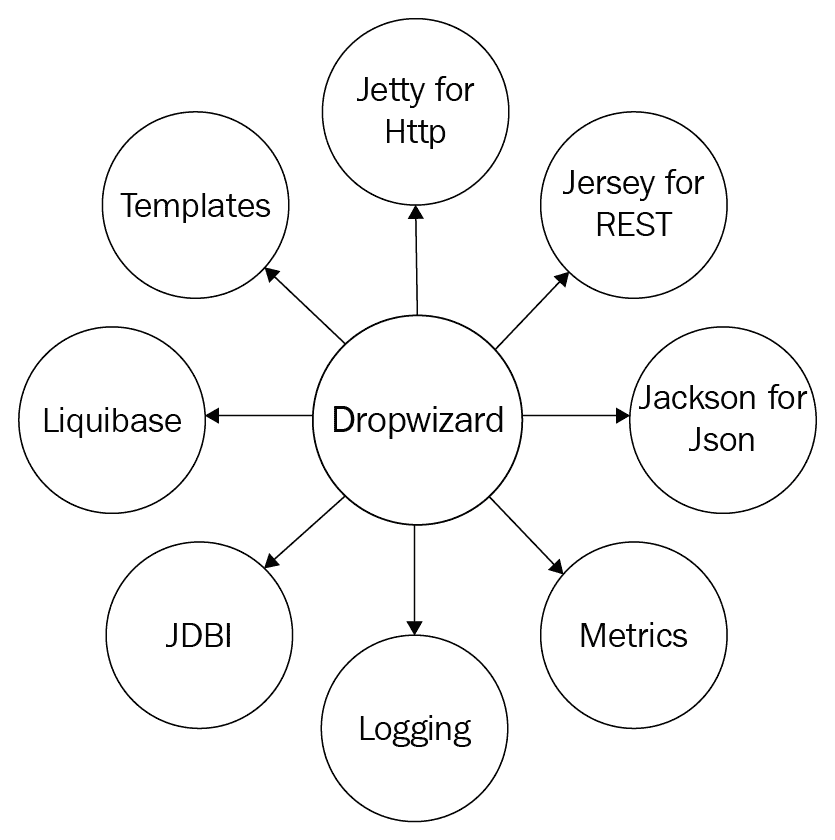

# 第十章：框架、标准语言和工具包

软件框架是软件应用的命脉。它们提供了扩展的功能，并提供了许多开箱即用的实现，这样应用开发者就不需要处理软件的每一个编码方面，而是可以通过使用框架提供的开箱即用功能、库、API 和模型来专注于构建更快、更智能的业务能力。

我们将简要介绍一些流行的框架，并附带一些关于它们支持的编程语言、功能、标准以及特性的信息，例如足迹、适应性、云部署友好性和开发易用性。

本章的目的是向读者介绍一些在为他们的 API 开发需求选择正确框架时可能会派上用场的突出框架。请注意，所讨论的框架列表并不全面，也没有意图提供它们之间的比较。

以下章节目标：

+   本章的目的是向希望使用熟悉的编程语言快速启动他们的 RESTful API 和微服务的应用开发者介绍一些突出的框架。

+   这是一种尝试为读者提供介绍、指南以及一些对编程语言友好的框架的优缺点，以便他们可以根据自己的 RESTful API 开发需求选择并使用更合适的框架。

# 技术要求

由于我们将讨论基于 Java、Python 和 Go（编程语言）的几个突出框架，对一种或多种编程语言的基本理解将使本章的读者能够快速启动他们的 RESTful API 开发，并使用他们喜欢的框架之一。本章既作为参考资料，也作为对这三种编程语言中任何一种有基本理解的人的技术指南。

# 框架的核心特性

如我们所知，框架是软件库、API、脚手架、AJAX、缓存、安全、编译器等等。我们必须通过以下任何框架的核心品质来刷新我们的记忆，因为我们的框架选择依赖于这些品质：

+   简单、一致、易于适应，且易于实现

+   分层架构，设计良好且文档齐全

+   做出真正的权衡

+   使用可重用库和重用库（借鉴自过去）

+   集成和设计以适应变化

让我们看看几个基于 Java 的框架，以了解它们在设计、足迹、文档和适应性方面的能力，以及它们的优缺点。

# Spring Boot

最受欢迎的开源 Java 框架之一是**Spring Boot**。它为许多 Java 开发者提供了一个优秀的平台，可以快速构建和部署基于 REST 的应用程序。

Spring Boot 的基本设计原则如下：

+   为所有 Spring 开发提供快速且易于访问的代码、可重用库和模板

+   有自己的见解（确定、强烈和表达），跳出思维定式，并为开发者提供根据其需求定制的途径，并挑战默认设置

+   提供非功能性需求特征变化，这些变化适用于项目的类，可用于仪表化（例如安全、嵌入式服务器、健康检查、指标和外部化配置）

+   没有代码生成机制，也不需要 XML 配置

模板代码或模板表示在软件应用程序中集成的代码或代码库，我们可以通过少量或无修改地重用这些库。

让我们看看是什么让 Spring 框架成为应用开发者进行 RESTful API 开发的热门选择。

# Spring 的核心功能

Spring 的应用程序、外部配置、配置文件和日志记录是 Spring 核心功能的组成部分。让我们看看每个组成部分及其值：

+   Spring 应用程序提供了一种方便的方式来启动我们的应用程序

+   外部配置帮助我们使用 YAML、环境变量或命令行参数在不同的环境中使用相同的应用程序代码

+   配置文件将应用程序配置的部分隔离开来，并使其仅对某些环境可用

+   它提供了开箱即用的 Apache Commons Logging 功能，然而，这并不会阻止我们使用不同的日志框架

# 使用 Spring 数据进行数据库集成

数据库集成是任何生产级软件应用程序的重要组成部分，我们将观察 Spring 如何通过提供对传统 SQL 数据库和 NoSQL 技术的集成能力来使开发者的生活变得更美好：

+   **SQL**：Spring 为与 SQL 数据库一起工作提供了广泛的支持。使用 Spring 数据的 JdbcTemplate 进行 ORM，提供了称为 **仓库创建** 的额外功能层。

+   **NO-SQL**：一个基于 Spring 的数据访问编程模型，称为 **Spring 数据**，为 Spring 框架提供动力，并提供了一种快速便捷的连接机制，用于连接各种 NoSQL 技术。

# 消息集成

使用 Spring 消息框架，与消息系统的集成得到了极大的简化。无论是使用 JmsTemplate 进行简单消息传递或 ActiveMQ 支持，还是使用 AMQP 进行高级消息传递或 Apache Kafka 集成，Spring 框架都提供了简单的方法来实现消息集成。

# 通过自动配置扩展 Spring

在许多实际场景中，我们需要开发共享库（在组织内部或作为对开源的贡献）和在这种情况下创建特定的配置类——作为模块（JAR）。将其放在应用程序的类路径中，通过消除在自动配置类中定义特定 bean 的需要，可以加快并简化开发。配置示例可以是 LDAP、不同的数据库源配置或安全配置。

# 编写单元测试和集成测试用例

编写单元测试和集成测试是任何开发者的基本实践。Spring 提供了更好的能力来编写单元测试、隔离脚本中的测试以及集成测试。Spring 框架提供了一些测试应用程序的实用工具和注解。对于大多数开发者来说，Spring-boot-starter-test 是首选的测试实用工具，因为它的入门工具导入了 JUnit、AssertJ、Hamcrest 和 Mockito。Spring-test 和 Spring-boot-test 是用于集成测试的常见库，在编写集成测试时非常有用。令人兴奋的是，Spring 测试框架允许我们添加一些自己的额外测试依赖项。

# Spring Boot 的好处

在我们转向另一个流行的框架之前，让我们看看 Spring Boot 的一些优点：

+   快速设置、快速开发和推送到生产（企业就绪）

+   与安全、ORM 和 JDBC 轻松快速集成

+   内置轻量级 HTTP 服务器

+   除了 Java 之外，它还支持 Groovy

+   支持 Maven 和 Gradle 构建工具

+   模块化，与其他库兼容良好

+   学习快速、文档广泛且深入

+   在线和离线都有非常活跃的社区（开发和文档）

# Spring Boot 的缺点

虽然 Spring 有许多优点，但我们也应该意识到它的缺点：

+   版本之间的频繁破坏性更改（通过引入新功能和缺陷修复）

+   可能会强制使用最新版本

+   过多的信息和文档可能过于冗余

+   对于少数人来说，广泛框架的特定查找可能很困难（可能影响快速原型设计）

本书所有代码的选择也是 Spring Boot，从第二章“设计策略、指南和最佳实践”和第三章“必要的 RESTful API 模式”的示例中，我们看到了使用 Spring Boot 启动 RESTful API 是多么容易。Spring Boot 内置了许多功能，它是软件行业成熟的框架之一。

# 开始了解 Light 4j

Light 是一个使用 Java SE 开发的云原生微服务平台，其设计目标是高吞吐量、低延迟和占用小空间。Light 4j 是一个通用 Web/API 框架，内置了不同的框架，如 OAUTH2、门户、日志、消息和度量。

# Light 4j 的核心功能

light-4j 平台旨在容器化微服务，并支持从 OpenAPI 规范为 RESTful API 和 GraphQL IDL 为 GraphQL 服务的设计驱动方法，并具有代码生成和运行时模型（用于验证和安全）。

作为平台或框架，它很好地解决了几个技术横切关注点，如审计、负载均衡、身份验证和健康检查，这样服务或 API 开发者可以专注于业务逻辑，不必过多担心这些技术问题，也称为**非功能性需求**。Light 4j 提供了各种处理逻辑，并将这些非功能性需求从业务上下文中分离出来，以帮助 API 开发者专注于开发业务逻辑。

# 了解 Light Rest 4j

Light Rest 4j 是一个建立在 Light 4j 之上的框架，旨在加快 RESTful API 的开发和部署。它围绕 Swagger 2.0 和 Open API 3.0 规范设计了多个中间件处理程序。Light-rest-4j 附带 Open API 元数据、Open API 安全、Open API 验证器、Swagger 元数据、Swagger 安全和 Swagger 验证器。

# light-code-gen

我们可以使用 OpenAPI 3.0 规范就绪的 light-rest-4j 提供的框架构建 RESTful API 或服务，并使用名为**light-code-gen**的工具命令行工具来构建项目。它为任何服务请求启用 JWT 范围验证和模式验证。

light-code-gen 工具帮助我们使用规范文件和配置 JSON 文件来构建项目。命令行工具可以像 Java 命令行工具、Docker 命令行工具，甚至可以成为 DevOps 管道的一部分的脚本。light-code-gen 还与我们的最爱 Maven 构建工具一起工作。

# 选择 Light 4j 而非其他选项

让我们以以下关于 Light 4j 的事实来结束本节，因为它可能有助于您决定是否选择 Light 4j 进行 RESTful API 开发：

+   基于 Java-SE 的框架

+   可伸缩的设计

+   低延迟

+   小内存占用

+   几个处理程序作为插件

+   开箱即用的 OAuth2 集成（以安全为首要设计）

+   与其他框架易于集成

+   内置的依赖注入框架

+   基准测试表明这是最快的 RESTful 框架

+   由于文档不佳，可能涉及陡峭的学习曲线

+   市场或行业新加入，因此关于生产系统的反馈还不多

基于 light4j 框架构建的 Light-rest-4j 因其各种特性——轻量级、非常低延迟、设计用于可伸缩性、不是基于 J2EE 而是基于 J2SE，以及其以安全为首要的设计——而非常有前途并越来越受欢迎。

# Spark 框架

Spark 是一个由 Per Wendel 创立的微框架，用于以最小的努力用 Java 创建 Web 应用程序，它是一个免费的开源 Java Web 框架，在 Apache 2 许可证下发布。

Spark 框架是一个使用 Java 8 Lambda 表达式（基于 lambda 哲学）构建的快速开发 Web 框架，因此可以帮助用更简洁的方式构建 Web 应用程序，实际上你可以用不到 10 行代码构建一个带有 JSON 响应的 REST API，并在开发 Web API 时提供类似 Node.js 的体验。酷吧，不是吗？

# Spark 框架的核心功能

让我们一瞥 Spark 的一些核心特性：

+   设计用于更快、更轻松地创建 API

+   它是一个轻量级库

+   提供简单的接口，我们可以通过这些接口定义路由并将它们分派到我们请求的路径上的函数

+   遵循 Java 8 lambda 哲学（用更少的行创建 Web API）

# 使用更少的行创建 API

通常，我们会写以下几行代码来使用 Spark 启动一个 hello world API：

```py
1 import static spark.Spark.*;
2
3 public class MyHelloWorld {
4 public static void main(String[] args) {
5 get("/sayhello", (request, response) -> "Hello Reader");
6 }
7 }
```

就这些！正如前面代码片段中所示，第一行`spark.Spark.*`完成了魔法般的操作。通过使用 CURL（curl `http://localhost:4567/sayhello`），我们可以将以下请求和响应作为前述代码的输出可视化：

```py
Request: 

GET http://localhost:4567/sayhello 

Response: 

Hello Reader 

```

如前所述代码片段所示，curl 击中应用程序，因此`Spark.*`的 lambda 函数被触发，客户端（在这种情况下是 curl）获得静态 lambda 函数的输出。这不仅仅是一个简单的 hello world API；我们可以使用 Spark 编写复杂的 RESTful API，因为它支持各种函数，如查询映射、cookies 和会话、过滤器、重定向、异常和错误处理以及视图和模板。

# Spark 的优点

现在是时候回顾 Spark（以及我们还将回顾另一个名为**Dropwizard**的激动人心的框架）的优点了：

+   基于 Java-8-EE 并基于 lambda 哲学（更简洁）

+   促进快速开发

+   使应用开发者能够创建可扩展的 REST API

+   快速且轻量级

+   最适合快速原型设计目的

+   由于 Spark 是 Java EE 的 servlet API 的薄包装，因此在速度因素上得分很高

+   简化和有效的路由

+   通过提供用于将 API 端点路由到处理器的简单**领域特定语言**（**DSL**），提高了生产力

+   支持 Maven 和 Gradle

# Spark 的缺点

任何流行的框架都可能存在缺点，Spark 也不例外：

+   不像其他框架那样受欢迎（社区较小）

+   可能不适合大型项目（SQL 和 NoSQL 即插即用特性）

# Dropwizard

在本节中，我们将回顾另一个在 Apache 许可下授权的基于 Java 的流行框架，名为 Dropwizard。这个框架是以 K.C. Green 网络漫画系列中的一个角色命名的（[`gunshowcomic.com/316`](http://gunshowcomic.com/316)）。

# 概述

**Dropwizard**是一个稳定、成熟的框架，由几个 Java 库组成，但轻量级，旨在通过提供快速开发和部署到生产服务器的功能来帮助 API 开发者。Dropwizard 的主要设计目标是提供可靠、可重用和高效实现所有 Web 应用程序所需的一切，并提供开箱即用的功能，使应用程序能够在生产服务器上部署。框架的可重用库使核心应用程序精简且专注，从而减少了上市时间和维护负担：



如前图所示，**Dropwizard**支持几个强大的库，我们将在接下来的章节中看到每个库的一些细节。

# Dropwizard 的核心功能

Dropwizard 定制了几个高性能的 Java 库实现，例如 Jetty、Jersy、Jackson 和 Metrics。让我们快速浏览一下这些库中的几个。

# Jetty 用于 HTTP

Dropwizard 使用 Jetty HTTP 库，并通过其`main`方法启动一个 HTTP Web 服务器，从而简化了将 Web 应用程序作为简单的 Unix 进程运行，并利用现有的 Unix 进程管理工具。通过将`main`方法作为启动方式，这个过程导致以下结果：

+   无需管理传统的繁重 Java 生产流程

+   解决了 PermGen 问题

+   无需自定义应用程序服务器的配置

+   无需单独的部署工具

+   无类加载器问题

# Jersey 用于 REST

如我们所知，JAX-RS 参考实现 Jersey 是开源的；它附带其本机 API 工具包，用于简化 Java 中 RESTful Web 服务和其客户端的开发。Jersey 还公开了大量的扩展 SPI（软件平台基础设施作为服务模型）。Dropwizard 将 Jersey 捆绑为其 RESTful Web 应用程序框架，并帮助开发者编写干净的代码，提供可测试的类，优雅地将 HTTP 请求映射到简单的 Java 对象，流式输出，矩阵 URI 参数，条件`GET`请求等。

# Jackson

对于应用程序开发者来说，一个关键需求是拥有从 JSON 到对象映射器的功能，并允许领域模型直接导出到那些 Java 对象。Dropwizard 通过拥有 Jackson 作为其核心功能之一，以及许多其他功能，满足了这些应用程序开发者的需求。

# Metrics

这个 Java 库作为一个强大的工具包，提供了测量在生产中部署的组件行为的方法。结合其他突出的库，如 Ehcache 和 Graphite，Metrics 作为一个提供全栈可见性的库，为我们的 RESTful API 和 Web 应用程序提供了全面的支持。

# Liquibase

Dropwizard 包括用于管理数据库脚本修订的开源解决方案。Liquibase 支持各种类型的数据库，以及定义数据库结构的各种文件格式。Liquibase 的亮点是其能够从特定点回滚更改（向前和向后）。

# 其他值得注意的功能

在我们深入了解其优缺点之前，让我们先看看 Dropwizard 中其他值得注意的库：

+   **日志记录**：Logback 和 slf4j 用于高性能和灵活的日志记录

+   **Hibernate validator**：提供用户输入验证的简单方法，以及生成 i18n 友好错误消息的能力

+   **Http 交互**：捆绑 Apache HttpClient 和 Jersey 客户端库，有助于与其他 Web 服务进行低级和高级的 HTTP 交互

+   **JDBI**：提供了一种简单、舒适且直接的方式，通过 Java 后端建立关系型数据库连接

+   **模板**：Dropwizard 支持 Freemarker 和 Mustache，这是面向消费者或用户界面的应用程序最简单的模板系统

# Dropwizard 的好处

由于我们正在介绍每个框架的优缺点，让我们也简要提及 Dropwizard，以便你可以决定是否使用 Dropwizard。以下是其优点：

+   一个 Java 框架

+   内置对配置、应用程序度量、日志记录、操作工具、模板等许多功能的支持

+   你可以进行快速原型设计

+   运维友好

+   非常模块化

+   开发高性能的 RESTful 网络服务

+   支持许多开源和独立库

+   使用 Metrics 实现最佳监控

+   支持集成和使用多个第三方框架

# Dropwizard 的缺点

一些你可能认为 Dropwizard 的缺点因素如下：

+   使用第三方框架和库维护应用程序可能会带来调试噩梦

+   虽然有几个强大的库，但可能存在需要特定库但 Dropwizard 不支持（仅使用 Dropwizard 提供的内容）的情况

+   可能会有一个陡峭的学习曲线

# 理解 Go 框架用于 RESTful API

Go 是微服务和 RESTful API 中较友好的编程语言之一。Go 是一种通用、过程式编程语言，具有高级功能和简洁的语法。它影响了使用包组装进行依赖关系的高效管理，并支持类似于动态语言的动态模式。

# 概述

Go（Go 语言程序员）可以采用许多强大的框架来为他们的应用程序开发重用现成的、可扩展的生产级外部包。本节旨在介绍两个基于 Go 语言的框架——Gin-gonic 和 Revel 的某些细节和功能，你可以使用它们来快速启动你的 RESTful API 开发。

# Gin-gonic

Gin 是一个用 Go 语言编写的 HTTP 网络框架。Gin 的设计灵感来源于 Martini，另一个 Go 框架，然而，Gin 的性能优于 Martini。Gin 框架声称：“如果你需要惊人的性能，那就来点杜松子酒吧。” Gin-gonic 帮助开发者编写更少的样板代码并构建请求处理管道。

**Martini** ([`github.com/go-martini/martini`](https://github.com/go-martini/martini)) 是使用 Go 语言开发的框架。其模块化和非侵入式的设计使得框架易于使用。然而，请注意，它已经不再维护或支持。

# 核心功能

**Gin** 是一个非常精简的框架，并支持您设计和开发 RESTful 网络服务所需的基本功能和功能。精简版本也包含基本库，您可以创建自己的可重用和可扩展的代码片段。

# HttpRouter

**HttpRouter** 是一个轻量级且高性能的 Go 语言 HTTP 请求路由器；它也被称作 **多路复用器**（或简称为 mux）。与 Go 语言 net/HTTP 包的默认多路复用器不同，这个定制化的多路复用器有助于绑定路由模式中的路由变量并与请求方法进行匹配。这个路由器的最大优点是其小巧的内存占用，优化了高性能。由于这个自定义路由器采用压缩基数树结构进行高效的长路径匹配，因此使用自定义路由器可以实现大量的路由。

# Http2 服务器推送

Gin 支持开箱即用的 Http2 服务器推送功能。服务器推送有助于服务器充分利用其网络资源，从而提高页面加载时间。HTTP/2 引入了一个名为 **服务器推送** 的概念，允许服务器在资源被明确请求之前将额外的所需资源推送到浏览器。

# 多模板

Gin 默认只允许使用一个 HTML 模板。然而，有一个定制的 HTML 渲染支持多个模板，即多个 `*template.` 模板。

# 上传文件

通过使用 `multipart.write`，我们可以将文件写入缓存并通过 `POST` 方法发送到服务器。

# 其他值得注意的功能

尽管 *Gin-Gonic* 有许多库并支持多个功能，但以下是一些其最佳特性：

+   分组路由

+   写入日志文件

+   自定义验证器

+   自定义中间件

+   使用 *jsoniter* 构建

# Gin-Gonic 的好处

让我们看看 *Gin-*Gonic 的几个优点：

+   精简且轻量

+   零分配路由器

+   完整的单元测试集

+   兼容性，新版本发布不会破坏旧代码

+   高性能和高可扩展性

# Gin-Gonic 的缺点

让我们注意这个框架的一些缺点：

+   可能不适合大型、基于企业的实施

+   服务器处理能力低，迫使客户端处理工作负载

+   可能存在陡峭的学习曲线

# Revel

在我们的框架列表中，最有前途的一个是 Revel。它功能齐全，旨在为我们提供开箱即用的异步、无状态和模块化能力，以支持我们的 Web API。在接下来的部分，让我们了解一下 Revel 及其功能。

# 核心功能

Revel 是一个自包含的、几乎全栈的 Web 框架，具有可定制的中间件和外部可配置的框架，Gophers 可以快速开发并部署他们的 RESTful API。在接下来的部分，让我们了解 Revel 的一些基本功能。

# 路由器

在文件中可以配置 URL 和路由定义，如下所示：

```py
[METHOD] [URL Pattern] [Controller.Method]
GET / MyGoSite.Hello
```

我们可以用 Revel 以不同的方式路由 URL。以下是一些带有示例的几种路由方法：

+   **固定路径路由**：HTTP 方法和路径的固定路径或精确匹配路由，以调用特定的方法和控制器

+   `GET/About App.About`

+   使用精确匹配/About 作为路径，并在`App`控制器上使用`App.About`作为方法

+   **URL**：参数路由 - 提取带有*前缀*的路径段

+   `GET /user/:id User.Details`

Revel 支持的一些其他路由方法（本节未涵盖）包括自动路由、反向路由、静态服务和清除。

# 服务器引擎

Revel 服务器引擎的最好部分是，应用程序开发者可以自由地实现他们最喜欢的 HTTP 引擎。Revel 默认使用 Go HTTP 引擎，但它允许我们配置任何其他服务器引擎，例如 fastHttp、New Relic HTTP 或我们自定义开发的 HTTP 引擎。这有多酷？

# 控制器

在 Revel 框架中，控制器是负责执行 API 逻辑的逻辑容器。控制器将传入的 HTTP 请求信息，如查询参数、路径参数、JSON 正文和表单数据，传递给处理器。

# 处理器

HTTP 请求路由器负责将传入的请求与预定义的 URL 路径列表进行比较，并调用相应的处理器。处理器负责编写响应头和正文。任何满足`http.Handler`接口的 Go 对象都可以作为处理器。有趣的是，Go 的 HTTP 包附带了一些可以生成处理器的函数，例如`FileServer`、`RedirectHandler`和`NotFoundHandler`。

# 拦截器

在某些情况下，例如请求日志记录、错误处理或身份验证处理，我们需要在框架在特定事件之前或之后调用一个动作，这类调用将通过 Revel 的一个名为**拦截器**的函数来完成。换句话说，拦截器是由框架调用的函数。Revel 支持三种形式的拦截器——函数拦截器、方法拦截器和控制器拦截器。

# 过滤器

Revel 拥有名为**过滤器**的独立功能。过滤器有助于实现水平关注点，例如请求记录、cookie 策略和授权。过滤器是中间件，Revel 的大部分内置功能和请求处理功能都是过滤器。它们是允许它们嵌套的接口。

# 缓存

Revel 附带一个库，它简化了服务器端、低延迟和临时存储作为缓存的使用。如果你需要利用并最小化对数据库的访问，缓存是一个不错的选择。另一个例子是实现基于 cookie 的会话不优先或不足时用户会话的缓存。

# 其他值得注意的功能

这里是 Revel 的一些其他值得注意的功能：

+   **Websockets**：Revel 支持通过 WS 方法或通过将服务器`WebSocket`参数作为操作使用单个 TCP 连接进行全双工通信。

+   **数据库**：通过应用配置（application configuration）数据库部分配置支持数据库。请注意，数据库不是预先配置的，开发者需要使用模块，如 GORM。

+   **测试**：Revel 附带预构建的模块，使得编写和运行功能测试用例变得容易。

# Revel 的好处

现在我们准备查看 Revel 框架的优点：

+   热代码重载

+   综合库

+   高性能

+   模块化，它围绕可组合的中间件构建，称为过滤器，实现了大部分请求处理功能

+   内置测试模块简化了功能测试用例的执行

+   文档完善

# Revel 的缺点

可能使 Revel 不那么吸引人的因素如下：

+   在大多数情况下，综合库是 Revel 的优势；但在某些情况下，它会使代码库庞大并产生较大的占用空间（与 Go 的精简原则相矛盾）

+   可能存在陡峭的学习曲线

+   没有管理包版本的社区标准，开发者需要负责管理和发布必要的最新依赖项（没有向后兼容性）

# Python RESTful API 框架

Python 是评分最高的编程语言之一。它还以其更简单的语法、高级、面向对象、健壮和通用编程而闻名。Python 是任何初学者的首选。

# Python 概述

自 1991 年发布以来，Python 已经发展并支持了多个用于 Web 应用程序开发、科学和数学计算以及图形用户界面的框架，直到最新的 REST API 框架。在本节中，我们将探讨两个综合框架 Django 和 Flask，以便你可以为开发你的 RESTful API 选择最佳框架。

# Django

**Django** 是一个开源的 Web 框架，也以 BSD 许可证提供，旨在帮助开发者快速创建他们的 Web 应用程序，因为它会处理额外的 Web 开发需求。它包括几个包（也称为 **应用程序**），用于处理典型的 Web 开发任务，例如身份验证、内容管理、脚手架、模板、缓存和聚合。接下来，我们将回顾使用 Python 构建的 **Django REST 框架**（**DRF**），并在下一节中使用 Django 核心框架进行 REST API 的开发和部署。

# Django Rest Framework

DRF 是一个开源、成熟度高的 Python 和 Django 库，旨在帮助 APP 开发者构建复杂的 Web API。DRF 的模块化、灵活和可定制架构使得开发简单、现成的 API 端点和复杂的 REST 构造成为可能。DRF 的目标是分割模型，泛化线表示，如 JSON 或 XML，并使用描述视图和 API 端点之间映射的序列化器来定制一组基于类的视图，以满足特定 API 端点的需求。

# 核心特性

在接下来的段落中，我们将简要介绍 Django 的核心功能，然后继续介绍其显著特性。

# Web 可浏览 API

此功能增强了使用 DRF 开发的 REST API。它具有丰富的界面，并且 Web 可浏览 API 也支持多种媒体类型。可浏览的 API 意味着我们所构建的 API 将是自我描述的，并且我们创建的作为 REST 服务一部分的 API 端点将返回 JSON 或 HTML 表示。关于 Web 可浏览 API 的有趣事实是，我们可以通过浏览器完全与之交互，并且任何使用程序化客户端与之交互的端点也将能够以浏览器友好的视图对 Web 可浏览 API 进行响应。

# 身份验证

DRF 的开箱即用功能之一是身份验证；它支持广泛的身份验证方案，从基本身份验证、令牌身份验证、会话身份验证、远程用户身份验证到 OAuth 身份验证。它还支持自定义身份验证方案，如果我们希望实现一个的话。DRF 在视图开始时运行身份验证方案，即在允许任何其他代码执行之前。DRF 通过权限和节流策略确定传入请求的权限，然后根据匹配的凭据决定是否允许或拒绝传入请求。

# 序列化和反序列化

序列化是将复杂数据（如查询集和模型实例）转换为原生 Python 数据类型的过程。转换有助于原生数据类型（如 JSON 或 XML）的渲染。DRF 通过序列化类支持序列化。DRF 的序列化器类似于 Django 的 `Form` 和 `ModelForm` 类。它提供了一个序列化器类，有助于控制响应的输出。DRF 的 `ModelSerializer` 类提供了一个简单的机制，我们可以用它来创建处理模型实例和查询集的序列化器。序列化器还执行反序列化，即序列化器允许将解析后的数据转换回复杂类型。请注意，反序列化仅在验证传入数据之后发生。

# 其他值得注意的特性

下面是 DRF 的其他一些值得注意的特性：

+   **路由器**：DRF 支持自动 URL 路由到 Django，并提供了一种一致且简单的方法将视图逻辑连接到一组 URL

+   **基于类的视图**：一种使常见功能可重用的主导模式

+   **超链接 API**：DRF 支持各种样式（使用主键、实体之间的超链接等）来表示实体之间的关系

+   **通用视图**：允许我们构建映射到数据库模型的 API 视图

DRF 还支持许多其他功能，如缓存、节流和测试，我们不会在此处介绍。

# DRF 的好处

下面是 DRF 的一些好处：

+   可在网页上浏览的 API

+   身份验证策略

+   强大的序列化功能

+   丰富的文档和优秀的社区支持

+   简单而强大

+   源代码测试覆盖率

+   安全且可扩展

+   可定制

# DRF 的缺点

下面是一些可能会让一些打算使用 DRF 的 Python 应用开发者失望的事实：

+   单体和组件一起部署

+   基于 Django ORM

+   学习曲线陡峭

+   响应时间慢

# Flask

Flask 是基于 Werkzeug (WSGI 工具包) 和 Jinja 2 (模板引擎) 的 Python 开发者微框架。它遵循 BSD 许可协议。**Flask** 非常容易设置和使用。像其他框架一样，Flask 提供了几个开箱即用的功能，例如内置的开发服务器、调试器、单元测试支持、模板、安全 Cookie 和 RESTful 请求分发。接下来，让我们看看另一个强大的 RESTful API 框架，称为 **Flask-RESTful**。

# Flask-RESTful

Flask-RESTful 是 Flask 的一个扩展，它为构建 REST API 提供了额外的支持。您永远不会对开发 API 所花费的时间感到失望。Flask-Restful 是一个轻量级抽象，与现有的 ORM/libraries 一起工作。Flask-RESTful 鼓励最佳实践，设置简单。现在让我们看看 Flask-RESTful 提供的核心功能。

# Flask-RESTful 的核心功能

Flask-RESTful 自带一些内置特性；本节涵盖了几个独特的 RESTful 特性，因为我们已经用 Django 介绍了最常见的 RESTful 框架特性，并且它们在支持核心特性方面没有太大差异。

# 资源路由

Flask-RESTful 的设计目标是提供基于 Flask 的可插拔视图构建的资源。可插拔视图提供了一种简单的方法（定义资源方法）来访问 HTTP 方法。考虑以下示例代码：

```py
   class Todo(Resource): 
    def get(self, user_id): 
        .... 
    def delete(self, user_id): 
        .... 
    def put(self, user_id): 
        args = parser.parse_args() 
        .... 

```

# RESTful 请求解析

请求解析指的是一个接口，该接口模仿了用于命令行参数的 Python 解析器*接口*，称为`argparser`。RESTful 请求解析器旨在提供对`(flask.request)`请求对象中任何变量的统一和直接访问。

# 输出字段

在大多数情况下，应用开发者更喜欢控制渲染响应数据，Flask-RESTful 提供了一个机制，允许你使用 ORM 模型或自定义类作为对象进行渲染。关于这个框架的另一个有趣的事实是，应用开发者不必担心暴露任何内部数据结构，因为它允许一个格式和过滤响应对象。因此，当我们查看代码时，将很明显哪些数据将用于渲染以及如何格式化。

# 其他值得注意的特性

如前所述，我们已经介绍了一些独特的特性，以下是 Flask-RESTful 的其他一些值得注意的特性：

+   **API**：这是 RESTful API 的主要入口点，我们将使用 Flask 应用进行初始化。

+   **ReqParse**：这使我们能够在单个请求的上下文中添加和解析多个参数。

+   **输入**：一个有用的功能，它解析输入字符串，并根据输入返回 true 或 false。如果输入来自 JSON 体，则类型已经是本地布尔值，无需进一步解析。

# Flask 框架的优点

让我们看看 Flask 和 Flask-Restful 框架的一些优点：

+   内置开发服务器和调试器

+   开箱即用的 RESTful 请求分发

+   支持安全 cookie

+   集成单元测试支持

+   轻量级

+   非常简单的设置

+   更快（性能）

+   易于 NoSQL 集成

+   丰富的文档

# Flask 的缺点

这里是 Flask 和 Flask-RESTful 的一些缺点：

+   版本管理（由开发者管理）

+   没有浏览 API 的加分项

+   可能会有一个陡峭的学习曲线

# 框架参考表

以下表格提供了一些其他显著的微框架的快速参考，包括它们的特性和支持的编程语言：

| **语言** | **框架** | **简短描述** | **显著特性** |
| --- | --- | --- | --- |
| Java | Blade | 为 Java8 设计的快速优雅的 MVC 框架 | 轻量级 高性能 基于 MVC 模式 RESTful 风格的路由接口 内置安全 |
| Java/Scala | Play Framework | 适用于 Java 和 Scala 的高性能响应式 Web 框架 | 轻量级、无状态、友好的 Web 架构基于 Akka 支持高度可扩展应用程序的预测性和最小资源消耗开发者友好 |
| Java | Ninja Web Framework | 全栈 Web 框架 | 快速开发者友好快速原型设计纯 Java、依赖注入、一流的 IDE 集成简单快速测试（模拟测试/集成测试）优秀的构建和 CI 支持干净的代码库——易于扩展 |
| Java | RESTEASY | 基于 JBoss 的实现，集成了多个框架，以帮助构建 RESTful Web 和 Java 应用程序 | 快速可靠的大社区企业级支持安全支持 |
| Java | RESTLET | 基于 Java 的轻量级且全面的框架，适用于服务器和客户端应用程序。 | 轻量级的大社区原生 REST 支持连接器集 |
| JavaScript | Express.js | 基于 Node.js 的轻量级且灵活的移动和 Web 应用程序 JavaScript 框架 | HTTP 实用方法安全更新模板引擎 |
| PHP | Laravel | 基于 PHP 和 MVC 架构模式的开源 Web 应用程序构建器 | 直观的界面 Blade 模板引擎默认的 Eloquent ORM |
| Elixir | Phoenix (Elixir) | 由 Elixir 函数语言提供动力，一个可靠且快速的微框架 | 基于 MVC 的框架高应用性能 Erlang 虚拟机使资源利用更佳 |
| Python | Pyramid | 基于 Python 的微框架 | 轻量级函数装饰器事件和订阅者支持易于实现和高效 |

# 摘要

我们即将结束另一个激动人心的章节，该章节讨论了来自三大编程语言——Java、Go（Golang）和 Python 的独特、高效、轻量级、开发者友好、快速上市、高度可扩展的框架。你可能已经注意到，本章涵盖了最流行的框架及其核心功能，并在过程中提到了一些值得注意的特性。本章为读者提供了一些关于框架优缺点想法。我们讨论了*Spring-Boot*、*Light 4j*、*Spark Framework*、*Dropwizard*、*Gin-*gonic、*Revel*、*Django*和*Flask*。很明显，有多个优秀的框架可供你使用，以启动你选择的编程语言的 RESTful API 开发。但仅一章，只有几页的信息，还不足以涵盖这些框架的伟大之处以及它们带来的价值。我们希望这一章能让你对流行的框架有一个公平的了解，以便你可以启动不仅原型设计，还可以启动生产级的 RESTful 应用程序。在下一章中，我们将探讨将遗留应用程序迁移到有能力的微服务中的最佳实践。

# 进一步阅读

+   *使用 Python 构建 RESTful Web 服务*，作者：Gastón C. Hillar，[`www.packtpub.com/application-development/building-restful-python-web-services`](https://www.packtpub.com/application-development/building-restful-python-web-services) [2016 年 10 月](https://www.packtpub.com/application-development/building-restful-python-web-services)

+   *使用 Go 构建 RESTful Web 服务*，作者：Naren Yellavula，[`www.packtpub.com/application-development/building-restful-web-services-go`](https://www.packtpub.com/application-development/building-restful-web-services-go)
