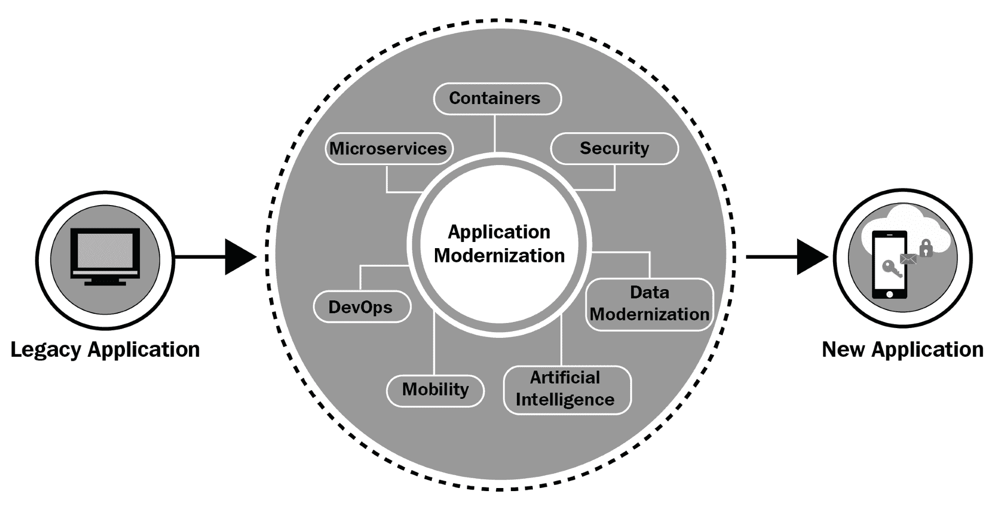

# 传统现代化到以微服务为中心的应用程序

传统应用程序通常是单体、庞大且不灵活的，包含数百万行代码。它们既不模块化也不现代。在它们的特定部分进行任何更改都非常困难。然而，它们在全球范围内成功运行的大多数商业巨头中做出了巨大贡献。主机服务器是最强大和性能最高的 IT 基础设施，托管和运行各种复杂的传统应用程序。尽管关键任务应用程序正在主机上运行，但现代计算要求主机计算和 Web 规模计算之间的一种结合。也就是说，我们需要易于管理和维护的应用程序。在基础设施方面，我们需要开放、高度模块化、可编程、优化和组织的 IT 基础设施。

因此，推动传统应用程序采用软件工程中引入的新创新。有许多值得注意的架构风格、流程优化技术和工具来加速转型过程。数字化转型迫使我们加快速度。每个组织的首要任务是拥有设计良好的

应用程序，能够部署到本地和云环境，以及独立部署、更新服务、在数小时或数天内部署缺陷修复和新功能，而不是数月。

在本章中，我们将讨论**微服务架构**（**MSA**）是如何成为高度敏捷、灵活和有弹性的现代应用程序的前进方向的。

本章目标包括以下内容：

+   描述传统应用程序现代化的需求

+   阐述为什么应用程序必须现代化才能迁移并在云环境中运行

+   描述微服务和容器的组合是传统现代化的首选方案

+   详细说明传统现代化方法

# 技术要求

读者应熟悉以下流行的技术和工具：

+   允许使用 Docker 的容器化平台

+   微服务架构

+   API 网关和管理套件

+   微服务设计原则和模式

+   微服务组成（编排和协奏）

+   云操作

# 容器和微服务的预览

随着开源 Docker 容器化平台的日益流行，容器化领域以前所未有的速度加速发展。如今，容器化在 IT 专业人员中得到了广泛应用。任何类型的软件都可以通过自动化工具轻松容器化。因此，在公共和私有存储库中提供了标准格式的容器就绪镜像。为了使传统应用程序现代化，使用容器作为最有效的包装机制正在兴起并不断发展。

使用容器来现代化遗留应用程序带来了一些优势。容器化的主要目的是从遗留应用程序中去除基础设施依赖。也就是说，容器化应用程序可以在任何平台和基础设施上运行，而无需任何调整。使用这种容器化范式，基础设施的复杂性立即被消除。因此，遗留应用程序变得可移植，并且可以轻松与其他应用程序集成。

一旦容器化，任何遗留应用程序都可以与第三方应用程序交互。使与网页、云和移动平台兼容变得更容易、更快。借助各种用于交付多容器应用程序的平台解决方案，遗留应用程序可以融合以使其对其所有者和最终用户更加相关。将容器化的遗留应用程序从本地云迁移到远程云，或从一个公共云迁移到另一个公共云变得简单。通过附加外部能力，可以增强遗留应用程序的安全性、稳定性和可扩展性。

因此，容器化现象带来的显著进步直接和间接地影响了遗留系统的现代化。容器化运动有几个关键优势，特别是对于战略性和艰巨的遗留现代化目标。遗留软件可以被细分为许多不同的领域，而这些模块中的每一个都在不同的容器中部署。现在，为了保证更高的性能和吞吐量，不同的容器可以在不同的基础设施上运行。一个 I/O 密集型应用程序模块可以被配置在物理/**裸机**（**BM**）服务器上。一些容器化应用程序服务可以部署在公共云中，以利用其可用性、可扩展性和安全性功能。因此，通过使用容器进行现代化的遗留应用程序通常能够获得现代化、敏捷和适应性。

通过以下方法实现遗留应用程序的现代化：

+   **重构应用程序**：正在产生一个新合适且现代的架构，因此，相应的架构决策、组件、连接性和能力被设计和实施。

+   **迁移应用程序到新平台**：遗留应用程序可以部署在新平台上，以便被归类为现代应用程序。

+   **重构应用程序**：应用程序被划分为许多组件，这些组件针对特定的业务功能。已识别的业务功能通过微服务进行重写，然后这些微服务相互融合以产生所需的应用程序。

# 引入微服务架构

正如本书多次提到的，微服务架构（MSA）被定位为下一代应用架构模式。微服务作为独立的项目进行构建、编译和部署。容器是微服务开发和部署的最优单元。每个微服务都拥有自己的数据存储。它们不会被编译成软件解决方案。相反，它们作为独立的服务实现，通过基于标准和通信协议进行集成和编排。

每个服务都通过简单易用的 RESTful API 提供了一个接口。微服务经过精心版本控制，以避免对任何其他用户微服务或应用程序产生不利影响。例如，对于一个**面向消费者**（**B2C**）的电子商务应用，可能开发一个微服务来提供产品目录。另一个微服务负责采购，另一个用于支付，等等。因此，微服务由分布式团队独立开发，然后部署。

通过利用微服务，正在构建复杂和高级的应用程序。另一方面，大型应用程序正在被拆分为一组微服务。

微服务通常是小型且独立的进程，它们通过定义良好且语言无关的 API 相互通信。它们是可用的、可重用的、互操作的、动态可组合的，并且是自我定义的。微服务通过精心设计的接口向外界展示其独特且以业务为中心的能力。因此，软件集成以规范化的方式得到简化并加快。在任何一个企业级软件系统中，通常会在源代码中复制跨领域的关注点和水平（业务无关）的功能。这些功能可以通过微服务集中化。一些功能需要使用先进技术频繁更新和升级。因此，不仅应用开发，维护方面也是全球企业担忧的因素。这些专门的功能可以构建为微服务，然后暴露出来，以便在软件应用中轻松找到和绑定。

# 为什么需要遗留系统现代化？

遗留软件应用是几十年前使用过时的编程语言编写的，通常在大型机服务器上运行。它们体积庞大，因此修改和操作的目标非常难以实现。第三方集成是另一个难题。要整合变化（由业务、技术和用户引起）既耗时又容易出错。它们紧密耦合，通常在一个进程中运行。所有这些特性使它们无法修改，也无法进行任何关键性的进步。它们在意义上并不现代，因为它们通常不具备网页和移动功能。确切地说，它们并不敏捷或适应性差。它们抵制技术升级，这使得它们维护成本非常高。因此，通过利用一系列开创性的技术、编程语言、开发框架和平台，从遗留应用迁移到现代化应用已经引起了广泛关注。随着新的架构模式和风格的出现和演变，软件架构师和开发者热衷于采用它们，以推出能够轻松满足企业和人们不断变化期望的竞争性应用。

DevOps 的概念正在席卷 IT 组织，以消除开发团队和运维团队之间的任何摩擦。绿色 field 项目和云原生应用正在使用这个新概念进行部署和运营。本章中有关 DevOps 的描述，DevOps 被定位为数字时代的必备条件。由于来自各个来源的软件解决方案需要不断的调整和变化，DevOps 的重要性正在获得更多的支持。

对于单体应用，功能在源代码中被重复。企业中的多个单元提供它们的功能，这些功能必须与核心应用集成。当一家公司收购另一家公司时，它们的源代码必须集成。这种集成最终导致相同功能的重复。如果需要对单个功能进行任何修改，整个单体应用都必须重新编译和重新部署。从遗留应用的角度来看，确实存在一些缺陷。这就是为什么现代化开始受到关注。

# 遗留系统到数字化应用现代化

应用程序现代化关乎赋予当前运行的应用程序以满足不断变化的企业目标和客户期望的能力。有许多数字技术和**人工智能**（**AI**）算法正在涌现，它们发展迅速。我们有大量的边缘/数字化技术，如传感器、执行器、植入物、可穿戴设备、贴纸、标签、代码、芯片、控制器、智能尘埃、微粒、信标和 LED 元件，用于将物理、机械和电气系统数字化。也就是说，我们的底层物理系统实现了数字化，加入了主流计算。

一系列数字技术（云、移动性、社交、物联网和数据分析）因其能够带来令人眼花缭乱的数字创新、颠覆和转型而受到广泛关注。随着 AI 算法的成熟，数字智能领域在理解数字数据方面越来越受到重视。因此，真正的数字化转型涉及数字和数字智能技术。此外，还有大量过时和陈旧的应用程序和技术。要实现真正的数字化转型，这些旧的应用程序必须使用现代化和迁移工具进行修改。我们提到的这些广受欢迎的数字技术必须被利用，以推动遗留应用程序的进步。

# 实现现代化

许多现代化和迁移专家已经讨论了如何在不降低现有业务工作负载和 IT 服务的情况下实现现代化。进行现代化，无论是选择重新工程化、重新架构、重新平台化等等，都是需要回答的悬而未决的问题。其他考虑因素包括现代化是否有助于应用程序保持其原始的性能水平和能力，例如可扩展性、可用性、可靠性和安全性。以下图表展示了众多应用程序现代化和迁移技术如何有助于将遗留应用程序提升到满足业务需求、市场需求、客户满意度和更高生产力的新应用程序：

来源：https://www.winwire.com/wp-content/uploads/2018/07/Application-Modernization-Assess-Strategize-Modernize.png

开创性的技术和突破性工具使得向知识丰富、事件驱动、面向服务、云托管、流程感知和以人为本的新应用程序的平稳过渡成为可能。

# 面向遗留应用程序的现代化方法

为了使遗留软件包与利益相关者、合作伙伴、员工和消费者保持相关性，企业组织正要求他们的 IT 团队提供可行的技术来加速和简化遗留应用程序现代化的各个方面。在应用现代化方面，存在几种战略上可行的应用架构、众多方法和最佳实践。现代化的应用程序正在准备在云环境中运行，这些云环境通常是整合的、集中的、共享的、虚拟化的和容器化的，并且是自动化的。简而言之，云环境高度优化和组织，以便极其优雅和敏捷地适应。应用程序必须准备好在云中无任何问题地运行，并实现所有最初设想的好处。MSA 的出现可以帮助加速遗留现代化。

# 以微服务为中心的遗留应用程序现代化

微服务是细粒度、自我定义和自主的服务，它们产生并维持下一代企业级应用程序。使用 MSA，每个应用程序都被构建为一个微服务的集合。换句话说，当适当地组合多个微服务时，我们得到的是能够胜任的应用程序，这些应用程序是云托管的、面向服务的、事件驱动的、充满洞察力的、企业级的和以人为本的。软件架构师对 MSA 模式在构建生产就绪软件解决方案中的未来派和艺术性角色感到非常兴奋。利用数百个不同和分布式微服务作为应用程序模块的复杂和复杂应用程序的设计吸引了大量关注。MSA 范式被定位为敏捷应用设计方法。这被视为软件工程（SE）中的积极发展，因为有许多敏捷开发技术和框架。此外，大型企业中的 DevOps 文化的稳固性正在加快应用程序在生产环境中的部署。也就是说，开发和部署团队之间的问题和摩擦正在克服，这种赋权导致在各种环境中（开发、测试、预生产和生产）应用程序部署速度更快。因此，开发和部署通过 IT 领域的众多进步得到了增强。

繁荣的 MSA 风格显著简化了应用程序的设计和架构。如果我们的业务工作负载和 IT 服务由微服务组成，它们将变得极其灵活、可扩展、可定制和可配置。我们已经看到了为什么全球企业都非常认真地采用 MSA 模式，以便在日常活动中保持竞争力。

架构师和专家已经提出了一些可行的机制，以实现从单体到基于微服务的应用程序的平稳过渡。现代化步骤正在通过多个阶段完成。第一阶段如图所示（来源：[`dzone.com/articles/choosing-a-legacy-software-modernization-strategy`](https://dzone.com/articles/choosing-a-legacy-software-modernization-strategy)）。这讨论了识别遗留应用程序的独特业务功能并将它们分离出来，通过提供底层服务实现，通常是多语言，一个 RESTful API 来实现微服务。在*服务组合*部分，我们讨论了以下图的第二阶段：

# 服务提取

在第一阶段结束时，我们得到了一些具有自己数据存储设施的微服务。这些微服务本质上是模块化的、互操作的，并且它们本质上能够通过 API 相互交互。广泛推荐的设计方法是针对不同领域设计和开发微服务。广泛使用的是**领域驱动设计**（**DDD**）。例如，以电子商务应用程序为例。领域包括购物车、支付、运输、通知、信用验证和分析。每个领域都被视为一个业务功能，因此作为微服务实现。一个微服务内可以有多个方法。可以有微服务内和微服务间的通信和协作。

一个域内的微服务应该频繁交互。有时，一个域内的微服务需要与其他域的微服务连接和对应，以完成不同的业务流程和活动。因此，电子商务和电子商务应用程序必然会有几个域和数百个微服务。随着容器成为在容错方式下托管和运行微服务的最佳选择，可能会有数千个容器来运行以微服务为中心的应用程序。

# 服务组合

第二阶段（[`dzone.com/articles/choosing-a-legacy-software-modernization-strategy`](https://dzone.com/articles/choosing-a-legacy-software-modernization-strategy)）是进行服务组合。在其他章节中，我们讨论了各种组合技术和工具；有两种方法——编排和协奏。

以下图说明了在建立连接和完成数据处理时，集中式代理/中心/总线如何派上用场：

# 服务迁移

第三阶段是关于将微服务迁移到云环境（私有、公共和混合）。全球有多个公共云环境，它们提供许多好处，如成本效益、可扩展性、可用性和安全性。微服务可以适应由业务需求、最终用户、期望和技术进步引起的所有变化。规模和简单性，以及频繁的变化，使微服务成为满足企业 IT 各种功能和非功能需求的完美工具。此外，微服务还使从单体应用平滑过渡到微服务应用成为可能。

并非所有应用都适合现代化和迁移到云环境。应用必须持续接受各种调查，以确保其价值和有效性。应用合理化、优化和现代化对于应用持续与其管理员和用户相关至关重要。随着高度优化和组织良好的 IT 基础设施的出现，应用需要能够在新的环境中工作，同时保证所有性能要求。一些应用必须经过精心重构才能迁移到云端。专家们为传统现代化和迁移提出了一系列最佳实践。我们将在下一节中探讨这种方法；更多详情可以在[`dzone.com/articles/choosing-a-legacy-software-modernization-strategy`](https://dzone.com/articles/choosing-a-legacy-software-modernization-strategy)找到。

# 以容器为中心的传统应用现代化

传统应用可以直接容器化，以在云环境中呈现为现代化的应用。另一个突出的选择是将传统应用细分为多个组件，其中每个组件都服务于一种业务功能。现在，每个业务功能都可以转换为微服务。因此，有以微服务为中心和以容器为中心的方法来实现传统应用的现代化和迁移到云环境。

任何应用都可以直接容器化，但这种过渡可能不会长期有效。因此，应用必须分割成更小、更易于管理的部分。然后这些部分必须实现服务化，然后容器化。有最佳实践、启用模式、知识指南、成功案例、案例研究、优化流程、集成和有洞察力的平台以及经过验证的程序来简化这种类型的传统修复。一流的框架和自动化工具正在蓬勃发展，以应对与遗产转型相关的复杂性。以下是某位现代化专家列出的一份清单。

第一步是将单体应用程序分解成一组可区分的组件。这些组件可以轻松优雅地实现服务化和容器化。这些容器化镜像存储在公开可用的镜像仓库中。这些组件必须极其模块化（松散或轻度耦合且高度内聚），以便为现代化和迁移的目标做出贡献。这些是业务功能，是任何三层应用程序中典型的中间层组件。

在创建了构成应用程序业务逻辑的微服务集合之后，第二步是构建数据访问服务。也就是说，开发数据服务并将它们公开，以便任何应用程序都可以使用它们来获取完成业务任务所需的数据。这种设置解耦了业务和数据逻辑，因此不会出现任何类型的依赖性引发的问题。根据三层应用程序的规范，数据逻辑层是最后一层。在第一步中，我们专注于创建应用程序容器。在第二步中，我们讨论了存储数据以相应地增强应用程序的卷容器。

最后一步完全是关于测试。对于企业级应用程序，我们可以有多个微服务和它们的实例。此外，作为服务运行时的容器现在也变得多种多样。微服务和它们的许多实例可以在单独的容器中运行，因此在典型的 IT 环境中将会有许多容器；也就是说，对于应用程序，可以有多个交互式和协作的微服务。每个微服务都可以在多个容器中运行，以支持冗余。通过单个微服务的多个容器可以实现广泛需求的高可用性。由于容器的易变性，架构师建议为单个微服务托管多个容器。为了确保高可用性，可以有多个微服务的实例。这样，如果一个服务或容器崩溃，其在其他容器中部署的服务实例就会前来救援。然而，真正的困难在于测试这种相互交织的环境。确切地说，单体应用程序需要调整以成为分布式和复杂的应用程序。尽管现代应用程序是敏捷的、经济的和适应性强的，但以微服务为中心的应用程序的管理和运营复杂性必然会升级。进一步来说，检测错误并调试它们以使应用程序无错误确实是一项繁琐的工作。现在出现了几款用于测试微服务的自动化测试工具。专家们正在探索测试分布式微服务的各种方法。此外，复合微服务的测试流程正在被阐述。

# 重构和重写

我们一直在讨论微服务架构的强大出现是如何引发对传统系统现代化改造的需求，以便拥抱现代性。众所周知，关键缓解技术一直是**分而治之**。这个格言不仅适用于构建新的系统，也适用于分解传统系统。由于传统应用程序极其复杂，通过分段方法将它们分割成多个较小的部分也是通过这种方式实现的。基于功能性的隔离是实现分解的一种方式。一旦传统应用程序被细分为多个应用程序模块，真正的现代化改造就开始了；也就是说，有许多应用程序服务需要从陈旧和庞大的应用程序中提取出来。

如前所述，提取的应用程序组件被制作成微服务，以便轻松地将它们迁移到云环境中。应用程序组件和微服务之间存在很大的差距。在功能上，它们几乎相同。但应用程序组件的结构与微服务大相径庭。因此，设计一个可行的机制来弥合应用程序组件和微服务之间的差距至关重要。重构或重写是推荐的方法，以实现现代传统应用程序。将传统软件重构为一系列微服务，并使它们能够根据需要相互通信，被推广为实现现代化的最可靠方法之一。随着微服务架构风格和容器化平台成熟度和稳定性的提高，将大规模应用程序重构为细粒度和精心设计的微服务越来越受到重视。

# 现代化技术术语

传统现代化可以通过多种方式实现。可以将应用程序细分为多个较小的服务组件，并且每个服务都使用现代编程语言进行重写，同时保证传统应用程序的功能。甚至可以使用最新的架构风格，如 SOA、EDA 或两者的组合，来改变传统应用程序的原始架构。目前运行在集中式和主机服务器上的传统应用程序可以被现代化，以在完全新的平台和基础设施上运行，例如云环境。因此，现代化策略的开发和规划需要考虑多个原则、目标、技术和工具。在不同的层次和水平上，所需的现代化以无风险和战略性的方式进行：

+   **重构**通常指的是重新组织应用程序的源代码，以便带来一些清晰度和变化。假设编写的代码不是模块化的，或者由于多年来由不同的团队编写，代码中存在大量重复代码。与新获得的公司软件的集成也可能带来一些复杂性。还有其他几个原因需要现代化。因此，提取代码以满足一些新的要求（业务、技术和用户）被宣传为代码重构。

+   **重构和重新设计**都意味着同一件事。通过使用更新技术（如中间件解决方案、数据库系统、执行平台、可视化工具包和软件基础设施解决方案）重构应用程序，可以现代化遗留应用程序。此外，随着设计应用程序组件的新模式的出现，重新设计正在变得突出。随着这些架构和设计的变化，新应用程序可以具有更高的性能、可扩展性、安全性、可用性、弹性和可持续性。有了强大的面向消息的中间件平台和新的数据库，如 NoSQL 和 NewSQL，现代化是一个持续的过程，以满足不断变化的企业需求，并确保客户的满意度。

+   **重构平台**涉及将待部署的遗留应用程序迁移到更新的平台和基础设施上，以便获得平台和基础设施的好处。

+   **重写**应用程序源代码使用现代编程语言是为了体验新编程语言的独特优势。例如，**Ballerina**是一种新的编程语言，有些人认为它是编写微服务的最佳语言。这种语言简化了服务、数据和应用程序的集成。

在进行现代化时，以下是一些最佳实践的列表：

+   我们必须确保重构技术是有效的。在从正在转型的遗留应用程序中提取一个易于处理的应用组件之后，我们必须开始重构或重写；也就是说，我们可以重构应用程序组件的源代码，将其转换为微服务。否则，我们可以重写代码，创建一个不改变原始应用程序组件功能的微服务。然后，想法是采用与最终实现非常接近的版本。

+   没有必要重构或重写遗留应用程序的其他组件。使用存根机制来检查重构或重写的组件是否模仿了旧行为；也就是说，必须确保现有应用程序组件（尚未重构或重写）与新制定的服务之间建立无缝和自发的连接，以了解是否存在任何偏差或不足。这样，可以保证在遗留现代化过程中几乎不浪费任何时间，而这正是一项耗时的工作。

+   一旦微服务准备就绪，就必须将其放入一个或多个软件仓库（公共和/或私有）中，以便软件开发人员和测试人员能够访问和使用。这种集中式存储也有助于源代码版本控制。有**持续集成**（**CI**）解决方案来集成、构建和测试软件服务。随着企业 DevOps 概念的广泛应用，业务应用程序能够实现持续和一致的集成、交付和部署，以便快速将应用程序和服务推向最终用户，而没有任何风险。

+   随着容器化运动的空前普及，对软件应用进行容器化的关注度也在不断提升。容器化微服务带来了一系列技术优势。有许多文章详细介绍了如何快速交付和部署单个和集体的微服务。随着容器集群、编排和管理平台解决方案的出现，容器化范式正变得深入、参与和普遍。有众多自动化工具来增强与云编排、实现多云容器应用和基础设施即代码相关的各种活动。容器和微服务的融合开辟了日益增长的创新、颠覆和转型。有集成平台能够实现梦想服务时代。

+   在重构或重写应用程序组件时，必须根据一些优先因素进行选择。并非所有组件都适合现代化。进行正确优先级排序需要一些重要参数。需要考虑的关键参数包括提取的简便性、路线图和可能的风险。一些组件可能会变得过时。因此，优先级在以经济、无风险和战略合理的方式完成现代化工作中起着重要作用。

+   数据虚拟化是应用模块与遗留应用的数据源实现真实对应的方式。因此，建议不要专注于数据结构转换，而应专注于创建和使用适当的代理，这些代理可以将来自不同数据库的数据转换为标准格式。这种标准化有助于新创建的微服务（无论是通过重构还是重写）连接和交互数据，而不会出现任何重大问题。

微服务小而灵活。使用微服务修复缺陷、安全漏洞和漏洞相当容易。性能提升、根本原因分析和统一威胁管理形成关键业务、流程感知和云启用的复合应用。微服务在生产环境中的快速部署是另一个积极因素。在以微服务为中心的应用中，可以替换特定的微服务以使用新的微服务，而在单体应用中这种功能不可用。因此，添加功能是一个顺畅的过程。

# 通过微服务进行遗留应用现代化

行业对 MSA 用于现代化遗留应用非常乐观，有许多现实原因。单体应用和以微服务为中心的应用之间存在几个有效差异，如下面的图表所示：

单体应用遵循高度集中的架构，而**微服务**则采用分布式架构。由于数据规模呈指数级增长以及通用服务器的使用，IT 界正倾向于分布式计算。此外，服务正由全球软件开发者开发并在地理上分布的服务器上部署。因此，分布式计算不能再被轻视。MSA 本质支持分布式计算特性，因此，它正在蓬勃发展。

如前所述，每个微服务完成一个或多个业务功能。也就是说，不同的业务能力是通过在不同的进程上运行的单独微服务实现的。对于电子商务应用，我们可以有购物车、客户分析、支付网关、仓储、运输、补给、库存管理和电子邮件通知等模块的微服务。Web 规模应用正在采用 MSA 以实现业务友好性。

对于经常变化负载的应用（用户数量变化快，可能会有不同数据大小的消息数量突然增加），需要机制来支持动态的、横向的、实时的可伸缩性。通过容器化的微服务，我们可以实现这种可伸缩性，因为容器轻量级且可以在几秒钟内启动。

微服务消除了与单体应用程序紧密耦合的应用组件相关的问题。微服务可以通过各种中间件产品（同步和异步通信）进行集成。由于微服务的解耦特性，微服务可以独立设计、开发和部署在生产环境中。也就是说，更新和升级微服务不会影响以微服务为中心的应用程序的其他组件。一些新颖的测试和部署方法正在出现和演变，以给微服务环境带来最大的动态性。

# 微服务的区别

微服务是技术无关的，这意味着通过 MSA 风格解决了技术锁定问题。因此，它被宣传为完全符合多语言架构模式的解决方案。并且可以使用任何编程语言编写微服务。有几种微服务开发框架用于快速实施和安装。MSA 支持许多最新的通信和数据传输协议。服务适配器生态系统正在不断增长，以便与不同的应用程序服务集成。微服务的接口非常正式化，因此依赖性问题不会出现。

复合应用程序可以通过静态和动态服务组合方法快速实现。有用于编写配置和组合文件的脚本语言。有数据表示、交换和持久化机制。与容器化运动的紧密联系为微服务加快软件工程任务提供了合适的时间。另一方面，微服务在将遗留和过时应用程序分割成多个交互式和自主微服务方面表现出色。因此，由于 MSA 领域的进步，企业正在通过遗留现代化来提升业务。

# 代码示例

在 GitHub 仓库中，读者可以找到一些使用 Java 语言开发微服务的示例。然后，还有一些示例展示了如何组合多个微服务以生成过程感知和多容器复合应用程序。遗留重构主要涉及对遗留函数代码段进行更改，以将其呈现为微服务。这些微服务的组合导致了以微服务为中心的现代应用程序。微服务可以从零开始构建。或者，使用自动化工具，遗留应用程序代码片段可以被转换为微服务。

# 克服主要障碍

然而，还有一些障碍需要克服。本节将列出它们。尽管 MSA 风格被宣称为遗留现代化的最优化和有组织的途径，但商业和 IT 团队面临着一些棘手的问题：

+   如前所述，微服务导致分布式系统，因此，开发者必须探索如何从紧密集成的单体应用程序中提取各种业务功能，将选定的部分重构或重写为微服务，并保持新形成的微服务与遗留应用程序的其余部分相连，以验证是否一切按预期工作。这不是一项容易的任务，因此它是现代化旅程中的一个明确的障碍。

+   以前，任何单体应用程序都在单个进程中运行。参与的应用程序组件使用语言特性相互通信。有**远程过程调用（RPCs**）和**远程方法调用（RMIs**）；进程内通信是风险低且快速的。然而，微服务的调用是通过网络进行的。RESTful 接口是访问远程微服务的占主导地位的方式。网络延迟和其他网络相关问题可能会损害微服务的弹性。也就是说，服务间的通信可能会引起一些与网络相关的问题。微服务被填充了 API。API 是任何微服务与其他微服务（可能运行在同一台机器、机架、楼层甚至地理上分布的云环境中）交互的第一个接触点。API 版本可能不同，微服务 API 之间交换的消息的数据格式可能造成不匹配问题，网络拥塞可能发生，微服务上的不同负载可能导致微服务减速甚至失败。

+   测试微服务带来了它自己的问题。单体应用程序可以很容易地测试，因为它们有一个结合的单一代码库。微服务的情况并非如此。在微服务的情况下，每个微服务都必须单独测试。进一步来说，微服务还必须集体测试。有一些新的方法可以简化微服务的测试。

由于 DevOps 工具的广泛应用，微服务需要特别考虑。DevOps 的目标是加快服务部署。也就是说，可以选择并部署特定的服务。因此，为了获得 MSA 的所有好处，企业必须接受 DevOps。

毫无疑问，微服务开辟了新的可能性和机会。尽管有几种针对遗留系统现代化的选择，但将以微服务为中心的遗留应用程序现代化被公认为前进的最佳方式。微服务方法是企业实现数字化颠覆和转型的最佳途径。

# 现代化和迁移遗留应用程序——云环境的作用

技术领域正在不断演变，并且随着新技术的采用和工具的加强而得到巩固。例如，云计算范式已经完全重新定义了 IT 领域。云计算技术使得能够拥有高度优化和组织的 IT 来托管任何类型的业务应用程序成为可能。以前未知的 IT 服务正在被制定和交付，并且新的商业模式正在出现，以满足市场不同部分和细分市场的需求，而现在的市场极为知识驱动。

在最近的一段时间里，我们经常听到关于容器和微服务的话题。它们在推动软件工程进步方面展现出巨大的潜力。云计算之旅也在迅速发展。这种进步意味着旧应用程序需要使用最新的技术进行翻新，以便它们可以在云环境中托管和管理。也就是说，大型应用程序被分割成一组微服务，然后它们被容器化，并存储在容器镜像目录中。容器编排平台随后提供容器资源，获取容器镜像，并将它们部署。

DevOps 概念的广泛使用加速了 IT 运营。创建了一种 DevOps 管道（端到端的工作流程），以按顺序排列将代码带到生产环境所需采取的操作。当任何新制作或更改的微服务的源代码提交到代码仓库时，通常会向选定的 CI 工具（如 Jenkins）发送信号。CI 工具用于构建、测试和集成软件应用程序。然后，持续交付和部署工具将应用程序带到生产环境中。在本章中，我们广泛讨论了如何将传统应用程序现代化为一系列微服务，然后迁移到云环境中。

# 对云环境的需求

云计算理念为 IT 领域带来了范式转变。企业有意识地采用这项技术，以便与他们的客户和消费者保持相关性。云环境是软件定义的，因此云基础设施（服务器机器、存储设备和网络组件）是可编程的、可网络访问的、可远程监控和管理，并且是可定制的。所有类型的架构都可以虚拟化和容器化。因此，云是整合的、集中的和可共享的。随着云环境的日益集成，我们能够拥有混合和多云环境。进一步来说，随着设备生态系统的稳步增长，人们纷纷建立和维持雾或边缘云，以便实现实时数据捕获、处理、知识发现、传播和执行。也就是说，我们的日常环境（家庭、酒店、医院等）正被各种异构设备所充斥。这些设备主要资源受限，其中一些资源密集。这些设备是深度连接和嵌入式系统。有解决方案和方法可以动态创建设备云。因此，边缘云正在扩展云的格局。有大量的通信和数据传输协议用于实现**设备到设备**（**D2D**）的集成。

有物联网网关解决方案和代理，用于在底层设备与托管在遥远云环境中的软件应用之间进行调解；即设备到云。

随着**设备到云**（**D2C**）集成解决方案的可用性和采用率的提高，**设备到云**（**D2C**）集成正日益受到重视。简而言之，有新的云环境正在出现和演变，以满足不同的需求。也就是说，有公共云、私有云、混合云和边缘云。企业也在考虑多云环境，以避免供应商锁定问题。

随着使能技术的挖掘和支持，联邦云环境可能很快就会出现以满足某些特殊需求。云是高度优化和组织的 IT 基础设施。资源利用率随着云化而显著提高。选择适当的云位置以确保更高的性能。云本质上满足了各种非功能性要求，如可伸缩性、可用性、安全性和灵活性。面向 Web 和客户的应用已经部署在公共云环境中。通过额外的安全措施，如**虚拟专用网络**（**VPNs**）、防火墙和负载均衡设备以及入侵检测和预防系统，公共云环境得到了保护并变得安全，以增强用户和企业的信心。工作负载受到各种调查并部署在最合适的物理机器/服务器、**虚拟机**（**VMs**）和容器中。有针对任务和资源的开创性调度解决方案和算法；也就是说，为所有类型的传入作业调度资源是完全自动化的。然后，还有应用节能方法以确保电力节约和减少散热。云化运动带来了成本效率。

因此，IT 基础设施将变得更加敏捷、适应性强且价格合理。这就是为什么云计算模式正成为 IT 旅程中的重要组成部分。企业正通过 IT 的颠覆和转型实现自动化和增强。通过 IT 领域的众多创新来赋权于人是下一个现实目标。因此，我们看到了由通用服务器、设备和高端服务器机组成的云正在形成。有融合和超融合基础设施作为云环境。在最近过去，预测称未来属于网络化和嵌入式设备，它们可以快速形成临时的和特定目的的云，以满足特定的数据处理需求。因此，应用正在作为服务池进行现代化，这些服务正被带到云环境中（公共、私有、混合以及边缘/雾计算）。由于云作为一站式 IT 解决方案在满足各种商业需求方面的日益流行，传统现代化和迁移正受到越来越多的关注。

# 传统现代化和迁移案例研究

理解了集成和洞察性应用的战略意义后，企业正在制定现代化和迁移计划。如前所述，大多数企业级、云、Web 和嵌入式应用正在被构建为以容器化和微服务为中心的应用；传统应用应通过各种自动化流程和产品进行修改。

Blu Age Velocity ([`www.bluage.com/products/blu-age-velocity`](https://www.bluage.com/products/blu-age-velocity)) 以自动化现代化而闻名。这项服务自动化并加速了传统应用程序的现代化。它可以进行逆向和正向工程。也就是说，它可以翻译传统应用程序为以微服务为中心的应用程序。读者可以在 [`www.bluage.com/references`](https://www.bluage.com/references) 找到许多自动化应用程序现代化的案例研究和参考资料。

我们都知道有两种主要的数据处理方法。批量或批量处理主要是将数据分批或累积，以便在预定时间开始处理。然而，随着实时数据处理技术和平台的可用性，实时数据处理正在兴起。此外，随着时间的推移，数据开始失去其价值，因此应该立即收集、清洗和压缩数据，以便提取及时见解。在主机时代，由于固有的 IT 资源限制，批量处理是数据处理的主要方法。传统应用程序主要是单线程的，因此在语言级别上无法实现并行执行。随着多线程语言和应用程序的出现，并行执行获得了极大的重视。随着多核和多处理器计算机的普及，基础设施级别的并行处理正在实现。随着虚拟机和容器的出现，拥有这些服务器资源的多个实例使我们能够快速跟踪应用程序的执行。较新的编程语言本质上支持多线程，因此并发处理在当今非常突出。随着云基础设施的不断细分，并行执行任务的目标正在加速。现在，随着边缘、本地和远程云环境的激增，这些限制正在逐渐消失，实时分析正在蓬勃发展。也就是说，以前进行批量处理的传统应用程序正在通过基于云的平台进行现代化，以实现实时处理。

# 微服务和无服务器计算的组合加速了传统系统的现代化

如前所述，微服务可以被编排以构建更大、更好的应用程序。对于遗留系统的现代化，业务能力被细分为独立的微服务。相反，这些易于管理、独立部署和自主的服务可以组合成流程感知、业务关键和复合服务。微服务在其自己的环境中运行，并以松散耦合的方式与其他服务交互。因此，微服务是隔离的，所以如果某个微服务出现问题，不会影响其他微服务。正因为这种独立性，微服务可以被高级服务替换和替代，跨区域复制、更新和升级而不会影响其他服务。

无服务器计算是各种公共**云服务提供商**（**CSPs**），如 AWS、Azure、IBM 和 Google 最近推出的一种现象。服务器基础设施正在由 CSPs 准备和照顾，以确保函数的平稳运行。这就是为什么**函数即服务**（**FaaS**）这个热门词汇被广泛报道的原因。其理念如下。我们最初从裸机服务器开始。然后虚拟机和容器作为应用程序优化的资源和运行时出现。现在，我们正朝着函数的方向发展。许多开发者开始使用代码级别的组件（函数）创建模块化系统。这些代码级别的组件根据需要附加到当前应用程序上，以便使应用程序与其用户相关。库是一系列函数的集合。然后，赋予权力的应用程序被编译和部署，以便以小额费用订阅和使用。这种安排可以保证高性能。但函数的重用性并没有达到微服务的水平。

主要来说，函数的配置管理挑战导致了许多麻烦。也就是说，不同的应用程序项目可能需要不同版本的函数。如果一个函数库被更新，所有依赖该库的应用程序都必须经历一系列的更新、重新编译和重新部署。另一方面，正如本书反复提到的，微服务是自包含的，重用性的目标很容易实现。

无服务器计算正逐渐成为托管和运行微服务的理想基础。因此，很明显，MSA 和无服务器计算将提供一个可扩展和可伸缩的环境。随着云环境中自动化水平的持续提升，服务开发者和组装者无需烦恼设置基础设施组件以运行、验证和展示他们的服务。通过容器，函数被部署为一个可访问的实体。容器可以快速创建以运行函数和微服务。容器因其实时水平可伸缩性而闻名。当用户数量增加时，新实例会立即被配置以应对额外的负载。

# 摘要

配备 RESTful API 的微服务现在是热门商品。微服务已成为应用开发和部署的最优单元，不仅适用于构建和运行企业级和生产就绪的应用程序，也适用于现代化当前运行的应用程序。也就是说，遗留应用程序正被拆分为一组微服务。由于它们的独特特性，微服务正成为将应用程序迁移到云环境的最合适的单元；也就是说，微服务在构建和运行云启用应用程序方面做出了巨大贡献。新的应用程序正在云环境中直接开发，称为云原生应用程序。本章讨论了遗留现代化、为什么它变得至关重要以及 MSA 模式如何帮助从过时的应用程序创建现代应用程序。

随着微服务架构作为设计和开发下一代业务关键和物联网应用程序最有益的架构风格的空前采用，RESTful 范式获得了新生。也就是说，由于 RESTful API 的简单性和可持续性，微服务越来越多地包含 RESTful API。本书涵盖了 RESTful 服务和 API 如何有助于未来和灵活的 Web/云、移动和物联网应用程序的实用和理论信息方面。
