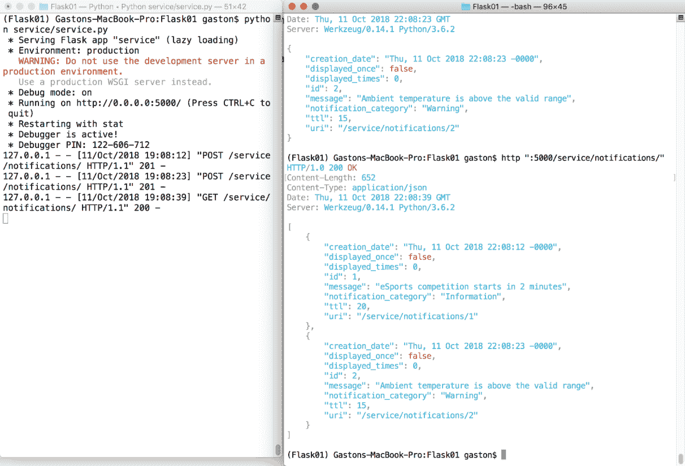

# 使用 Flask 1.0.2 开发 RESTful API 和微服务

在本章中，我们将使用 Python 3.7 和四个不同的网络框架开始我们的 RESTful Web API 之旅。Python 是最受欢迎和最通用的编程语言之一。有成千上万的 Python 包，这些包允许你将 Python 的能力扩展到任何你能想象到的领域，例如网络开发、**物联网**（**IoT**）、人工智能、机器学习和科学计算。我们可以使用许多不同的网络框架和包，用 Python 轻松构建简单和复杂的 RESTful Web API，并且我们可以将这些框架与其他 Python 包结合起来。

我们可以利用我们对 Python 及其所有 ... 的现有知识。

# 设计一个与简单数据源交互的 RESTful API

假设我们必须配置要在连接到物联网设备的 **OLED**（有机发光二极管）显示器上显示的通知消息。该物联网设备能够运行 Python 3.7.1、Flask 1.0.2 和其他 Python 包。有一个团队正在编写代码，从字典中检索表示通知的字符串消息，并在连接到物联网设备的 OLED 显示器上显示它们。我们必须开始开发一个移动应用和网站，它们必须与 RESTful API 交互，以执行表示通知的字符串消息的 CRUD 操作。

我们不需要 **ORM**（对象关系映射的缩写），因为我们不会在数据库中持久化通知。我们只需使用内存字典作为我们的数据源。这是我们对该 RESTful API 的一项要求。在这种情况下，RESTful 网络服务将在物联网设备上运行；也就是说，我们将在物联网设备上运行 Flask 开发服务。

由于我们在服务中有一个内存中的数据源，因此我们将失去我们的 RESTful API 的可伸缩性。然而，我们将与另一个相关联的例子一起工作，该例子涉及更复杂的数据源，稍后将以 RESTful 方式进行扩展。第一个例子将使我们能够了解 Flask 和 Flask-RESTful 如何与一个非常简单的内存数据源一起工作。

我们选择 Flask 是因为它是一个非常轻量级的框架，我们不需要配置 ORM，并且我们希望尽快在物联网设备上运行 RESTful API，以便所有团队都能与之交互。我们认为还将有一个用 Flask 编码的网站，因此，我们希望使用相同的网络微框架来驱动网站和 RESTful 网络服务。此外，Flask 是创建一个可以在云上运行我们的 RESTful API 的微服务的合适选择。

可用于 Flask 的扩展有很多，这些扩展使得使用 Flask 微型框架执行特定任务变得更加容易。我们将利用 Flask-RESTful 扩展，这个扩展将允许我们在构建 RESTful API 的同时鼓励最佳实践。在这种情况下，我们将使用 Python 字典作为数据源。正如之前所解释的，在未来的示例中，我们将使用更复杂的数据源。

首先，我们必须指定我们主要资源——通知的要求。对于通知，我们需要以下属性或字段：

+   一个整数标识符。

+   一个字符串消息。

+   一个 **TTL**（即 **生存时间**），表示通知消息在 OLED 显示上显示的时间长度（以秒为单位）。

+   创建日期和时间。当将新通知添加到集合时，时间戳将自动添加。

+   一个通知类别描述，例如 *警告* 或 *信息*。

+   一个整数计数器，表示通知消息在 OLED 显示上显示的次数。

+   一个布尔值，表示通知消息是否至少在 OLED 显示上显示过一次。

以下表格显示了我们的 API 第一版必须支持的 HTTP 动词、作用域和语义。每个方法由一个 HTTP 动词和一个作用域组成，并且所有方法对所有通知和集合都有一个明确定义的意义。在我们的 API 中，每个通知都有自己的唯一 URL：

| HTTP 动词 | 作用域 | 语义 |
| --- | --- | --- |
| `GET` | 通知集合 | 获取集合中存储的所有通知。 |
| `GET` | 通知 | 获取单个通知。 |
| `POST` | 通知集合 | 在集合中创建一个新的通知。 |
| `PATCH` | 通知 | 更新现有通知的一个或多个字段。 |
| `DELETE` | 通知 | 删除现有的通知。 |

# 理解每个 HTTP 方法执行的任务

让我们考虑 `http://localhost:5000/service/notifications/` 是通知集合的 URL。如果我们向之前的 URL 添加一个数字，我们就可以识别一个特定的通知，其 ID 等于指定的数值。例如，`http://localhost:5000/service/notifications/5` 识别 ID 等于 `5` 的通知。

我们希望我们的 API 能够在 URL 中区分集合和集合的单个资源。当我们提到集合时，我们将使用斜杠（`/`）作为 URL 的最后一个字符，例如 `http://localhost:5000/service/notifications/`。当我们提到集合的单个资源时，我们不会使用斜杠（`/`）作为 URL 的最后一个字符 ...

# 理解微服务

在过去几年中，许多大型且复杂的应用程序开始从单体架构转向微服务架构。微服务架构建议开发一系列较小、松散耦合的服务，以实现复杂应用程序所需的所有功能，这种方式既支持又简化了持续交付，而不是与大型且极其复杂的 Web 服务一起工作。

RESTful API 是微服务架构的必要组成部分，Python 在转向这种架构时非常流行。每个微服务可以封装一个 RESTful API，以实现特定的和有限的目的。微服务是自包含的，易于维护，并有助于支持持续交付。

就像任何架构一样，实现微服务架构有几种方法。我们将学习如何将使用 Flask 和 Python 开发的 RESTful API 封装到微服务中。这样，我们将能够通过开发 RESTful API 并使用它们作为构建自包含且易于维护的微服务的必要组件来利用我们的技能。

# 使用轻量级虚拟环境

在整本书中，我们将使用不同的框架、包和库来创建 RESTful Web API 和微服务，因此，使用 Python 虚拟环境来隔离每个开发环境是方便的。Python 3.3 引入了轻量级虚拟环境，并在后续的 Python 版本中得到了改进。我们将使用这些虚拟环境，因此，你需要 Python 3.7.1 或更高版本。你可以在[`www.python.org/dev/peps/pep-0405`](https://www.python.org/dev/peps/pep-0405)上阅读更多关于 PEP 405 Python 虚拟环境的介绍，它引入了`venv`模块。本书的所有示例都在 Linux、macOS 和 Windows 上的 Python 3.7.1 上进行了测试。

如果您...

# 使用 Flask 和 Flask-RESTful 设置虚拟环境

我们已经遵循了创建和激活虚拟环境的必要步骤。现在，我们将创建一个`requirements.txt`文件来指定我们的应用程序在任何支持平台上需要安装的包集合。这样，在任意新的虚拟环境中重复安装指定包及其版本将变得极其容易。

使用您喜欢的编辑器在最近创建的虚拟环境的根目录下创建一个名为`requirements.txt`的新文本文件。以下行显示了声明我们的 API 所需的包及其版本的文件内容。示例的代码文件包含在`restful_python_2_01_01`文件夹中的`Flask01/requirements.txt`文件中：

```py
Flask==1.0.2 
flask-restful==0.3.6 
httpie==1.0.0
```

`requirements.txt` 文件中的每一行都指示需要安装的包和版本。在这种情况下，我们通过使用 `==` 操作符使用精确版本，因为我们想确保安装了指定的版本。以下表格总结了我们所指定的作为要求的包和版本号：

| 包名 | 要安装的版本 |
| --- | --- |
| `Flask` | 1.0.2 |
| `flask-restful` | 0.3.6 |
| `httpie` | 1.0.0 |

现在，我们必须在 macOS、Linux 或 Windows 上运行以下命令，使用 `pip` 通过最近创建的 `requirements.txt` 文件安装上一表格中解释的包和版本。请注意，Flask 是 Flask-RESTful 的依赖项。在运行以下命令之前，请确保您位于包含 `requirements.txt` 文件的文件夹中：

```py
pip install -r requirements.txt     
```

输出的最后几行将指示所有成功安装的包，包括 `Flask`、`flask-restful` 和 `httpie`：

```py
Installing collected packages: itsdangerous, click, MarkupSafe, Jinja2, Werkzeug, Flask, aniso8601, six, pytz, flask-restful, chardet, certifi, idna, urllib3, requests, Pygments, httpie
      Running setup.py install for itsdangerous ... done
      Running setup.py install for MarkupSafe ... done
Successfully installed Flask-1.0.2 Jinja2-2.10 MarkupSafe-1.0
Pygments-2.2.0 Werkzeug-0.14.1 aniso8601-3.0.2 certifi-2018.8.24 chardet-3.0.4 click-7.0 flask-restful-0.3.6 httpie-1.0.0 idna-2.7 itsdangerous-0.24 pytz-2018.5 requests-2.19.1 six-1.11.0 urllib3-1.23

```

# 使用可枚举的声明响应的状态码

Flask 和 Flask-RESTful 都不包括不同 HTTP 状态码的变量声明。我们不希望返回数字作为状态码。我们希望我们的代码易于阅读和理解，因此我们将使用描述性的 HTTP 状态码。具体来说，我们将利用 Python 3.4 中添加的对枚举的支持来声明一个类，该类定义了代表不同 HTTP 状态码的唯一名称和值集合。

首先，在最近创建的虚拟环境的根文件夹内创建一个 `service` 文件夹。在 `service` 文件夹内创建一个新的 `http_status.py` 文件。以下行显示了声明 `HttpStatus ...` 的代码。

# 创建模型

现在，我们将创建一个简单的 `NotificationModel` 类，我们将使用它来表示通知。请记住，我们不会在数据库或文件中持久化模型，因此在这种情况下，我们的类将仅提供所需的属性，而不提供映射信息。在 `service` 文件夹中创建一个新的 `models.py` 文件。以下行显示了在 `service/models.py` 文件中创建 `NotificationModel` 类的代码。示例代码文件包含在 `restful_python_2_01_01` 文件夹中，位于 `Flask01/service/models.py` 文件中：

```py
class NotificationModel: 
    def __init__(self, message, ttl, creation_date, notification_category): 
        # We will automatically generate the new id 
        self.id = 0 
        self.message = message 
        self.ttl = ttl 
        self.creation_date = creation_date 
        self.notification_category = notification_category 
        self.displayed_times = 0 
        self.displayed_once = False 
```

`NotificationModel` 类仅声明了一个构造函数，即 `__init__` 方法。此方法接收许多参数，并使用它们来初始化具有相同名称的属性：`message`、`ttl`、`creation_date` 和 `notification_category`。`id` 属性设置为 `0`，`displayed_times` 设置为 `0`，`displayed_once` 设置为 `False`。我们将自动通过 API 调用为每个新生成的通知递增标识符。

# 使用字典作为存储库

现在，我们将创建一个`NotificationManager`类，我们将使用它来在内存字典中持久化`NotificationModel`实例。我们的 API 方法将调用`NotificationManager`类的相关方法来检索、插入、更新和删除`NotificationModel`实例。在`service`文件夹中创建一个新的`service.py`文件。以下行显示了在`service/service.py`文件中创建`NotificationManager`类的代码。此外，以下行声明了我们将需要用于此文件中所有代码的所有`导入`。示例代码文件包含在`restful_python_2_01_01`文件夹中，位于`Flask01/service/service.py`文件：

```py
from flask import Flask from flask_restful import ...
```

# 配置输出字段

现在，我们将创建一个`notification_fields`字典，我们将使用它来控制我们想要 Flask-RESTful 在返回`NotificationModel`实例时渲染的数据。打开之前创建的`service/service.py`文件，并将以下行添加到现有代码中。示例代码文件包含在`restful_python_2_01_01`文件夹中，位于`Flask01/service/service.py`文件：

```py
notification_fields = { 
    'id': fields.Integer, 
    'uri': fields.Url('notification_endpoint'), 
    'message': fields.String, 
    'ttl': fields.Integer, 
    'creation_date': fields.DateTime, 
    'notification_category': fields.String, 
    'displayed_times': fields.Integer, 
    'displayed_once': fields.Boolean 
} 

notification_manager = NotificationManager() 
```

我们声明了`notification_fields`字典（`dict`），其中包含字符串和类的键值对，这些类是在`flask_restful.fields`模块中声明的。键是我们想要从`NotificationModel`类中渲染的属性名称，而值是格式化和返回字段值的类。在之前的代码中，我们使用了以下类来格式化和返回键中指定字段的值：

+   `fields.Integer`: 输出一个整数值。

+   `fields.Url`: 生成一个 URL 的字符串表示形式。默认情况下，此类为请求的资源生成一个相对 URI。代码指定了`'notification_endpoint'`作为`endpoint`参数。这样，该类将使用指定的端点名称。我们将在`service.py`文件中稍后声明此端点。我们不希望在生成的 URI 中包含主机名，因此我们使用`absolute`布尔属性的默认值，即`False`。

+   `fields.DateTime`: 以 UTC 格式输出格式化的日期和时间字符串，默认为 RFC 822 格式。

+   `fields.Boolean`: 生成一个布尔值的字符串表示形式。

`'uri'`字段使用`fields.Url`，与指定的端点相关联，而不是与`NotificationModel`类的属性相关联。这是唯一一种指定字段名称在`NotificationModel`类中没有属性的情况。其他指定的字符串键表示我们希望在输出中渲染的所有属性，当我们使用`notification_fields`字典来组成最终的序列化响应输出时。

在我们声明`notification_fields`字典之后，下一行代码创建了一个之前创建的`NotificationManager`类的实例，命名为`notification_manager`。我们将使用此实例来创建、检索和删除`NotificationModel`实例。

# 在 Flask 可插拔视图之上进行资源路由操作

Flask-RESTful 使用基于 Flask 的可插拔视图构建的资源作为 RESTful API 的主要构建块。我们只需创建`flask_restful.Resource`类的子类并声明每个支持的 HTTP 动词的方法。

`flask_restful.Resource`的子类代表一个 RESTful 资源，因此我们将不得不声明一个类来表示通知集合，另一个类来表示通知资源。

首先，我们将创建一个`Notification`类，我们将使用它来表示通知资源。打开之前创建的`service/service.py`文件并添加以下行。示例的代码文件包含在 ...

# 配置资源路由和端点

我们必须通过定义 URL 规则来配置必要的资源路由，以调用适当的方法，并通过传递所有必要的参数。以下行创建应用程序的主要入口点，使用 Flask 应用程序初始化它，并配置服务的资源路由。打开之前创建的`service/service.py`文件并添加以下行。示例的代码文件包含在`restful_python_2_01_01`文件夹中的`Flask01/service/service.py`文件：

```py
app = Flask(__name__) 
service = Api(app) 
service.add_resource(NotificationList, '/service/notifications/') 
service.add_resource(Notification, '/service/notifications/<int:id>', endpoint='notification_endpoint') 

if __name__ == '__main__': 
    app.run(debug=True) 
```

代码创建了一个`flask_restful.Api`类的实例，并将其保存在`service`变量中。每次调用`service.add_resource`方法都会将一个 URL 路由到一个资源，具体到之前声明的`flask_restful.Resource`超类的一个子类。当有请求到服务并且 URL 与`service.add_resource`方法中指定的 URL 之一匹配时，Flask 将调用与请求中指定的类中的 HTTP 动词匹配的方法。该方法遵循标准的 Flask 路由规则。

例如，以下行将发出一个不带任何附加参数的 HTTP `GET`请求到`/service/notifications/`，以调用`NotificationList.get`方法：

```py
service.add_resource(NotificationList, '/service/notifications/') 
```

Flask 会将 URL 变量作为参数传递给被调用的方法。例如，以下行将发出一个 HTTP `GET`请求到`/service/notifications/26`以调用`Notification.get`方法，其中`26`作为`id`参数的值传递：

```py
service.add_resource(Notification, '/service/notifications/<int:id>', endpoint='notification_endpoint')
```

此外，我们可以为端点参数指定一个字符串值，以便在`fields.Url`字段中轻松引用指定的路由。我们将相同的端点名称`'notification_endpoint'`作为`notification_fields`字典中声明的`fields.Url`字段的参数传递，我们使用该字典来渲染每个`NotificationModel`实例。这样，`fields.Url`将生成考虑此路由的 URI。

我们只需几行代码即可配置资源路由和端点。最后一行只是调用`app.run`方法来启动 Flask 应用程序，将`debug`参数设置为`True`以启用调试。在这种情况下，我们通过调用`run`方法立即启动本地服务器。我们也可以通过使用`flask`命令行脚本来达到相同的目的。然而，这个选项需要我们配置环境变量，而且在这个书中我们涵盖的平台（macOS、Windows 和 Linux）的说明是不同的。

与任何其他 Web 框架一样，你永远不应该在生产环境中启用调试。

# 向 Flask API 发送 HTTP 请求

现在，我们可以运行`service/service.py`脚本，该脚本启动 Flask 的开发服务器，以组合和发送 HTTP 请求到我们的未加密和简单的 Web API（我们肯定会添加安全功能）。执行以下命令。确保你已经激活了虚拟环境：

```py
    python service/service.py
```

以下行显示了执行上一条命令后的输出。开发服务器正在监听端口`5000`：

```py
     * Serving Flask app "service" (lazy loading)
     * Environment: production
       WARNING: Do not use the development server in a production environment.
       Use a production WSGI server instead.
     * Debug mode: on
     * Running on http://127.0.0.1:5000/ (Press CTRL+C to quit)
     * Restarting ...
```

# 使用 curl 和 httpie 命令行工具

我们将从命令行工具开始。命令行工具的一个关键优势是，我们可以在第一次构建 HTTP 请求后轻松地再次运行它们，我们不需要使用鼠标或触摸屏幕来运行请求。我们还可以轻松地构建一个包含批量请求的脚本并运行它们。与任何命令行工具一样，与 GUI 工具相比，第一次执行请求可能需要更多时间，但一旦我们执行了许多请求，它就会变得更容易，我们可以轻松地重用我们以前编写的命令来组合新的请求。

**Curl**，也称为**cURL**，是一个非常流行的开源命令行工具和库，它允许我们轻松地传输数据。我们可以使用`curl`命令行工具轻松地组合和发送 HTTP 请求并检查它们的响应。

在 macOS 或 Linux 中，你可以打开一个终端并从命令行开始使用`curl`。

在 Windows 中，你可以在命令提示符中处理`curl`，或者你可以将`curl`作为 Cygwin 包安装选项的一部分进行安装，并在 Cygwin 终端中执行它。如果你决定在命令提示符中使用`curl`命令，请从[`curl.haxx.se/download.html`](http://curl.haxx.se/download.html)下载并解压最新版本。然后，确保将包含`curl.exe`文件的文件夹包含在你的路径中，以便更容易运行命令。

你可以在[`cygwin.com/install.html`](http://cygwin.com/install.html)了解更多关于 Cygwin 终端及其安装过程的信息。如果你决定使用 Cygwin 终端，每次你需要运行`curl`命令而不是使用命令提示符时，都要使用它。

注意，Windows PowerShell 包含一个名为 `curl` 的别名，该别名调用 `Invoke-WebRequest` 命令。因此，如果你决定使用 Windows PowerShell，你必须删除 `curl` 别名才能使用本书中使用的 `curl` 工具。

我们使用 `requirements.txt` 文件安装虚拟环境中的包。在这个文件中，我们将 `httpie` 指定为一个必需的包。这样，我们安装了 **HTTPie**，这是一个用 Python 编写的命令行 HTTP 客户端，它使得发送 HTTP 请求变得容易，并使用比 `curl` 更简单的语法。HTTPie 的一个巨大优点是它显示彩色输出，并使用多行来显示响应细节。因此，HTTPie 使得理解响应比 `curl` 工具更容易。然而，非常重要的一点是要提到 HTTPie 比 `curl` 慢。

每当我们使用命令行编写 HTTP 请求时，我们将使用同一命令的两个版本：第一个使用 HTTPie，第二个使用 `curl`。这样，您将能够使用最方便的一种。

确保您让 Flask 开发服务器继续运行。不要关闭运行此开发服务器的终端或命令提示符。在 macOS 或 Linux 中打开一个新的终端，或在 Windows 中打开一个命令提示符，并运行以下命令。非常重要的一点是，当指定时，您必须输入结束斜杠（`/`），因为 `/service/notifications` 不会匹配任何配置的 URL 路由。因此，我们必须输入 `/service/notifications/`，包括结束斜杠（`/`）。我们将组合并发送一个 HTTP 请求来创建一个新的通知。示例代码文件包含在 `restful_python_2_01_02` 文件夹中，位于 `Flask01/cmd01.txt` 文件：

```py
http POST ":5000/service/notifications/" message='eSports competition starts in 2 minutes' ttl=20 notification_category='Information'
```

以下是对应的 `curl` 命令。非常重要的一点是使用 `-H "Content-Type: application/json"` 选项告诉 `curl` 将 `-d` 选项之后指定的数据作为 `application/json` 发送，而不是默认的 `application/x-www-form-urlencoded` 选项。

示例代码文件包含在 `restful_python_2_01_02` 文件夹中，位于 `Flask01/cmd02.txt` 文件：

```py
curl -iX POST -H "Content-Type: application/json" -d '{"message":"eSports competition starts in 2 minutes", "ttl":20, "notification_category": "Information"}' "localhost:5000/service/notifications/"
```

之前的命令将组合并发送带有以下 JSON 键值对的 `POST http://localhost:5000/service/notifications/` HTTP 请求：

```py
{  
   "message": "eSports competition starts in 2 minutes",  
   "ttl": 20,  
   "notification_category": "Information" 
} 
```

请求指定了 `/service/notifications/`，因此它将匹配 `'/service/notifications/'` 并运行 `NotificationList.post` 方法。由于 URL 路由不包含任何参数，该方法不接收任何参数。由于请求的 HTTP 动词是 `POST`，Flask 调用 `post` 方法。如果新的 `NotificationModel` 成功保存在字典中，函数将返回 HTTP `201 Created` 状态码，并将最近持久化的 `NotificationModel` 序列化为 JSON 格式放在响应体中。以下行显示了 HTTP 请求的示例响应，其中包含 JSON 响应中的新 `NotificationModel` 对象：

```py
    HTTP/1.0 201 CREATED
    Content-Length: 283
    Content-Type: application/json
    Date: Wed, 10 Oct 2018 01:01:44 GMT
    Server: Werkzeug/0.14.1 Python/3.7.1

    {
        "creation_date": "Wed, 10 Oct 2018 01:01:44 -0000",
        "displayed_once": false,
        "displayed_times": 0,
        "id": 1,
        "message": "eSports competition starts in 2 minutes",
        "notification_category": "Information",
        "ttl": 20,
        "uri": "/service/notifications/1"
    }

```

我们将组合并发送一个 HTTP 请求以创建另一个通知。返回到 Windows 的命令提示符，或在 macOS 或 Linux 的终端中运行以下命令。示例代码文件包含在 `restful_python_2_01_02` 文件夹中，在 `Flask01/cmd03.txt` 文件中：

```py
http POST ":5000/service/notifications/" message='Ambient temperature is above the valid range' ttl=15 notification_category='Warning'
```

以下是对应的 `curl` 命令。示例代码文件包含在 `restful_python_2_01_02` 文件夹中，在 `Flask01/cmd04.txt` 文件中：

```py
curl -iX POST -H "Content-Type: application/json" -d '{"message":"Ambient temperature is above the valid range", "ttl":15, "notification_category": "Warning"}' "localhost:5000/service/notifications/"

```

之前的命令将组合并发送带有以下 JSON 键值对的 `POST http://localhost:5000/service/notifications/` HTTP 请求：

```py
{  
   "message": "Ambient temperature is above the valid range",  
   "ttl": 15,  
   "notification_category": "Warning" 
} 
```

以下行显示了 HTTP 请求的示例响应，其中包含 JSON 响应中的新 `NotificationModel` 对象：

```py
    HTTP/1.0 201 CREATED
    Content-Length: 280
    Content-Type: application/json
    Date: Wed, 10 Oct 2018 21:07:40 GMT
    Server: Werkzeug/0.14.1 Python/3.7.1

    {
        "creation_date": "Wed, 10 Oct 2018 21:07:40 -0000",
        "displayed_once": false,
        "displayed_times": 0,
        "id": 2,
        "message": "Ambient temperature is above valid range",
        "notification_category": "Warning",
        "ttl": 15,
        "uri": "/service/notifications/2"
    }

```

我们将组合并发送一个 HTTP 请求以检索所有通知。返回到 Windows 的命令提示符，或在 macOS 或 Linux 的终端中运行以下命令。示例代码文件包含在 `restful_python_2_01_02` 文件夹中，在 `Flask01/cmd05.txt` 文件中：

```py
    http ":5000/service/notifications/"
```

以下是对应的 `curl` 命令。示例代码文件包含在 `restful_python_2_01_02` 文件夹中，在 `Flask01/cmd06.txt` 文件中：

```py
    curl -iX GET "localhost:5000/service/notifications/"
```

之前的命令将组合并发送 `GET http://localhost:5000/service/notifications/` HTTP 请求。该请求指定了 `/service/notifications/`，因此它将匹配 `'/service/notifications/'` 并运行 `NotificationList.get` 方法。由于 URL 路由不包含任何参数，该方法不接收任何参数。由于请求的 HTTP 动词是 `GET`，Flask 调用 `get` 方法。该方法检索所有 `NotificationModel` 对象，并生成包含所有这些 `NotificationModel` 对象序列化的 JSON 响应。

以下行显示了 HTTP 请求的示例响应。前几行显示了 HTTP 响应头，包括状态（`200 OK`）和内容类型（`application/json`）。在 HTTP 响应头之后，我们可以看到 JSON 响应中两个 `NotificationModel` 对象的详细信息：

```py
    HTTP/1.0 200 OK
    Content-Length: 648
    Content-Type: application/json
    Date: Wed, 10 Oct 2018 21:09:43 GMT
    Server: Werkzeug/0.14.1 Python/3.7.1

    [
        {
            "creation_date": "Wed, 10 Oct 2018 21:07:31 -0000",
            "displayed_once": false,
            "displayed_times": 0,
            "id": 1,
            "message": "eSports competition starts in 2 minutes",
            "notification_category": "Information",
            "ttl": 20,
            "uri": "/service/notifications/1"
        },
        {
            "creation_date": "Wed, 10 Oct 2018 21:07:40 -0000",
            "displayed_once": false,
            "displayed_times": 0,
            "id": 2,
            "message": "Ambient temperature is above valid range",
            "notification_category": "Warning",
            "ttl": 15,
            "uri": "/service/notifications/2"
        }
    ]

```

在我们运行了三个请求之后，我们将在运行 Flask 开发服务器的窗口中看到以下行。输出表明服务接收了三个 HTTP 请求，具体是两个 `POST` 请求和一个带有 `/service/notifications/` 作为 URI 的 `GET` 请求。服务处理了这三个 HTTP 请求，并返回了前两个请求的 `201` 状态码和最后一个请求的 `200` 状态码：

```py
127.0.0.1 - - [10/Oct/2018 18:07:31] "POST /service/notifications/ HTTP/1.1" 201 -
127.0.0.1 - - [10/Oct/2018 18:07:40] "POST /service/notifications/ HTTP/1.1" 201 -
127.0.0.1 - - [10/Oct/2018 18:09:43] "GET /service/notifications/ HTTP/1.1" 200 -

```

以下截图显示了 macOS 上并排的两个终端窗口。左侧的终端窗口正在运行 Flask 开发服务器并显示接收和处理的 HTTP 请求。右侧的终端窗口正在运行 `http` 命令以生成 HTTP 请求。在我们组合和发送 HTTP 请求时，使用类似的配置来检查输出是一个好主意：



现在，我们将编写并发送一个 HTTP 请求来检索一个不存在的通知。例如，在上一个列表中，没有`id`值等于`78`的通知。运行以下命令尝试检索此通知。确保你使用一个不存在的`id`值。我们必须确保工具将标题作为响应的一部分显示，以查看返回的状态码。示例代码文件包含在`restful_python_2_01_02`文件夹中的`Flask01/cmd07.txt`文件中：

```py
    http ":5000/service/notifications/78" 
```

以下是对应的`curl`命令。示例代码文件包含在`restful_python_2_01_02`文件夹中的`Flask01/cmd08.txt`文件中：

```py
    curl -iX GET "localhost:5000/service/notifications/78"
```

之前的命令将编写并发送`GET http://localhost:5000/service/notifications/78` HTTP 请求。该请求与之前分析的那个相同，只是`id`参数的数字不同。服务将运行`Notification.get`方法，将`78`作为`id`参数的值。该方法将执行检索与作为参数接收的`id`值匹配的`NotificationModel`对象的代码。然而，`NotificationList.get`方法中的第一行调用了`abort_if_notification_not_found`方法，它无法在字典键中找到 ID，并将调用`flask_restful.abort`函数，因为没有指定`id`值的该通知。因此，代码将返回 HTTP `404 Not Found`状态码。以下行显示了 HTTP 请求的示例响应头和体中包含的消息。在这种情况下，我们只是保留默认消息。当然，我们可以根据我们的具体需求进行自定义：

```py
    HTTP/1.0 404 NOT FOUND
    Content-Length: 155
    Content-Type: application/json
    Date: Wed, 10 Oct 2018 21:24:32 GMT
    Server: Werkzeug/0.14.1 Python/3.7.1

    {
        "message": "Notification 78 not found. You have requested this     
    URI [/service/notifications/78] but did you mean 
    /service/notifications/<int:id> ?"
    }

```

我们为`PATCH`方法提供了一个实现，以便我们的 API 能够更新现有资源的单个字段。例如，我们可以使用`PATCH`方法更新现有通知的两个字段，并将`displayed_once`字段的值设置为`true`，将`displayed_times`设置为`1`。我们不希望使用`PUT`方法，因为这个方法旨在替换整个通知。

`PATCH`方法旨在对现有通知应用一个增量，因此它是仅更改`displayed_once`和`displayed_times`字段值的适当方法。

现在，我们将编写并发送一个 HTTP 请求来更新现有的通知，具体来说，是更新两个字段的值。确保你将配置中的`2`替换为现有通知的 ID。示例代码文件包含在`restful_python_2_01_02`文件夹中的`Flask01/cmd09.txt`文件中：

```py
http PATCH ":5000/service/notifications/2" displayed_once=true 
displayed_times=1

```

以下是对应的`curl`命令。示例代码文件包含在`restful_python_2_01_02`文件夹中的`Flask01/cmd10.txt`文件中：

```py
curl -iX PATCH -H "Content-Type: application/json" -d '{"displayed_once":"true", "displayed_times":1}' "localhost:5000/service/notifications/2"

```

之前的命令将编写并发送一个带有指定 JSON 键值对的 `PATCH` HTTP 请求。请求在 `/service/notifications/` 后面有一个数字，因此它将匹配 `'/service/notifications/<int:id>'` 并运行 `Notification.patch` 方法，即 `Notification` 类的 `patch` 方法。如果存在具有指定 ID 的 `NotificationModel` 实例并且已成功更新，该方法调用将返回 HTTP `200 OK` 状态码，并且最近更新的 `NotificationModel` 实例序列化为 JSON 格式在响应体中。以下行显示了示例响应：

```py
HTTP/1.0 200 OK 
Content-Length: 279 
Content-Type: application/json 
Date: Thu, 11 Oct 2018 02:15:13 GMT 
Server: Werkzeug/0.14.1 Python/3.7.1 

{ 
    "creation_date": "Thu, 11 Oct 2018 02:15:05 -0000", 
    "displayed_once": true, 
    "displayed_times": 1, 
    "id": 2, 
    "message": "Ambient temperature is above valid range", 
    "notification_category": "Warning", 
    "ttl": 15, 
    "uri": "/service/notifications/2" 
} 
```

当物联网设备首次显示通知时，它将执行之前解释的 HTTP 请求。然后，它将执行额外的 `PATCH` 请求来更新 `displayed_times` 字段的值。

现在，我们将编写并发送一个 HTTP 请求来删除一个现有的通知，具体来说，是我们最后添加的那个。就像我们之前的 HTTP 请求一样，我们必须检查前一个响应中分配给 `id` 的值，并将命令中的 `2` 替换为返回的值。示例的代码文件包含在 `restful_python_2_01_02` 文件夹中的 `Flask01/cmd11.txt` 文件里：

```py
    http DELETE ":5000/service/notifications/2"
```

以下是对应的 `curl` 命令。示例的代码文件包含在 `restful_python_2_01_02` 文件夹中的 `Flask01/cmd12.txt` 文件里：

```py
    curl -iX DELETE "localhost:5000/service/notifications/2"
```

之前的命令将编写并发送 `DELETE http://localhost:5000/service/notifications/2` 的 HTTP 请求。请求在 `/service/notifications/` 后面有一个数字，因此它将匹配 `'/service/notifications/<int:id>'` 并运行 `Notification.delete` 方法，即 `Notification` 类的 `delete` 方法。如果存在具有指定 ID 的 `NotificationModel` 实例并且已成功删除，该方法调用将返回 HTTP `204 No Content` 状态码。以下行显示了示例响应：

```py
    HTTP/1.0 204 NO CONTENT
    Content-Length: 3
    Content-Type: application/json
    Date: Thu, 11 Oct 2018 02:22:09 GMT
    Server: Werkzeug/0.14.1 Python/3.7.1
```

# 使用 GUI 工具 – Postman 及其他

到目前为止，我们一直在使用两个基于终端的或命令行工具来编写并发送 HTTP 请求到我们的 Flask 开发服务器：cURL 和 HTTPie。现在，我们将使用一个 **GUI**（代表 **图形用户界面**）工具。

Postman 是一个非常流行的 API 测试套件 GUI 工具，它允许我们轻松地编写并发送 HTTP 请求，以及其他功能。Postman 可作为 Chrome App 和 Macintosh App 提供。我们可以在 Windows、Linux 和 macOS 上作为原生应用执行它。您可以在 [`www.getpostman.com/apps`](https://www.getpostman.com/apps) 下载 Postman 应用程序的版本。

您可以免费下载并安装 Postman 来编写并发送 HTTP 请求到我们的 RESTful API。您只需注册 ...

# 使用其他编程语言消费 API

我们已经构建了我们第一个 RESTful Web Service，它能够使用 Flask 和 Python 作为微服务运行。我们可以使用任何现代编程语言来消费 API，这些语言能够组合并发送 HTTP 请求到 API 支持的资源和动词，并且可以轻松地处理 JSON 内容。

确保我们在使用`curl`和`http`命令行工具时设置 HTTP 请求的内容类型非常重要。我们只需要检查在我们要使用的编程语言中，哪种方式最为方便。

我们可以轻松运行 Flask 开发服务器并检查其控制台输出，每当处理新的请求时，这使得检查到达服务器的请求变得容易。在这种情况下，我们正在处理一个基本且未加密的 API。然而，在接下来的章节中，我们将处理安全且更高级的 API。

# 测试你的知识

让我们看看你是否能正确回答以下问题：

1.  HTTPie 是一个：

    1.  用 Python 编写的命令行 HTTP 服务器，使得创建 RESTful Web Server 变得容易

    1.  命令行实用工具，允许我们对 SQLite 数据库运行查询

    1.  用 Python 编写的命令行 HTTP 客户端，使得组合和发送 HTTP 请求变得容易

1.  Flask-RESTful 使用以下哪个作为 RESTful API 的主要构建块：

    1.  建立在 Flask 可插拔视图之上的资源

    1.  建立在 Flask 资源视图之上的状态

    1.  建立在 Flask 可插拔控制器之上的资源

1.  要处理资源上的 HTTP `PATCH`请求，我们应该在`flask_restful.Resource`的子类中声明哪个方法？

    1.  `patch_restful ...`

# 摘要

在本章中，我们设计了一个 RESTful API 来与一个简单的字典交互，该字典充当数据存储库并执行与通知相关的 CRUD 操作，作为微服务的基线。我们定义了 API 的要求并理解了每个 HTTP 方法执行的任务。我们使用 Flask 和 Flask-RESTful 设置了一个虚拟环境。我们遵循最佳实践来生成可重复的虚拟环境。

我们创建了一个模型来表示和持久化通知。我们学习了如何使用 Flask-RESTful 中的功能配置通知的序列化为 JSON 表示。我们编写了代表资源并处理不同 HTTP 请求的类，并配置了 URL 模式将 URL 路由到类。

最后，我们启动了 Flask 开发服务器，并使用命令行工具来组合和发送 HTTP 请求到我们的 RESTful API，并分析了我们的代码中如何处理每个 HTTP 请求。我们还使用了许多有用的 GUI 工具来组合和发送 HTTP 请求。

现在我们已经了解了如何结合 Flask 和 Flask-RESTful 创建可以封装在微服务中的 RESTful API 的基础知识，在下一章中，我们将通过利用 Flask-RESTful 和相关 ORM 包含的高级功能来扩展 RESTful Web API 的功能。
