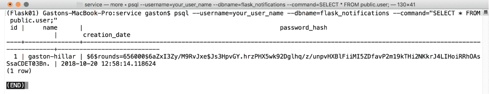

# 第三章：使用 Flask 改进我们的 API 并为其添加身份验证

在本章中，我们将改进上一章开始构建的 RESTful API 的功能，并为其添加与身份验证相关的安全功能。我们将执行以下操作：

+   改进模型中的唯一约束

+   理解 `PUT` 和 `PATCH` 方法之间的区别

+   使用 `PATCH` 方法更新资源的字段

+   编写一个通用的分页类

+   为 API 添加分页功能

+   理解添加身份验证和权限的步骤

+   添加用户模型

+   创建一个模式来验证、序列化和反序列化用户

+   为资源添加身份验证

+   创建用于处理用户的资源类

+   运行迁移以生成用户表

+   使用必要的身份验证来编写请求

# 改进模型中的唯一约束

在上一章中我们编码了 `NotificationCategory` 模型时，我们在创建名为 `name` 的 `orm.Column` 实例时，为 `unique` 参数指定了 `True` 值。因此，迁移过程生成了必要的唯一约束，以确保 `notification_category` 表中的 `name` 字段具有唯一值。这样，PostgreSQL 数据库将不允许我们为 `notification_category.name` 列插入重复值。然而，当我们尝试这样做时生成的错误消息并不清晰。该消息包含了不应该在错误消息中提到的数据库结构详情。

运行以下命令以创建一个具有重复 ... 的类别

# 理解 PUT 和 PATCH 方法之间的区别

HTTP 的 `PUT` 和 `PATCH` 方法有不同的目的。HTTP 的 `PUT` 方法旨在替换整个资源。HTTP 的 `PATCH` 方法旨在对现有资源应用一个增量。

我们的 API 能够更新现有资源的单个字段，因此我们提供了 `PATCH` 方法的实现。例如，我们可以使用 `PATCH` 方法来更新现有的通知，并将它的 `displayed_once` 和 `displayed_times` 字段的值设置为 `true` 和 `1`。

我们不想使用 `PUT` 方法来更新两个字段，因为这个方法旨在替换整个通知。`PATCH` 方法旨在对现有通知应用一个增量，因此它是仅更改这两个字段值的适当方法。

# 使用 PATCH 方法更新资源的字段

现在我们将编写并发送一个 HTTP 请求来更新现有的通知，具体来说，是更新 `displayed_once` 和 `displayed_times` 字段的值。因为我们只想更新两个字段，所以我们将使用 `PATCH` 方法而不是 `PUT`。确保将 `2` 替换为您配置中现有通知的 ID 或主键。示例代码文件包含在 `restful_python_2_03_01` 文件夹中的 `Flask01/cmd307.txt` 文件：

```py
http PATCH ":5000/service/notifications/2" displayed_once=true displayed_times=1
```

以下是对应的`curl`命令。示例代码文件包含在`restful_python_2_03_01`文件夹中，位于`Flask01/cmd308.txt ...`

# 编写通用分页类

目前，在数据库中持久化通知的表只有几行。然而，在我们开始在真实的生产环境中使用封装在微服务中的 API 后，我们将有数百条通知，因此，我们必须处理大量结果集。我们不希望 HTTP `GET`请求在一次调用中检索 1,000 条通知。因此，我们将创建一个通用分页类，并使用它来轻松指定我们想要如何将大量结果集拆分为单个数据页。

首先，我们将编写并发送 HTTP `POST`请求来创建属于我们已创建的通知类别之一（`Information`）的九条通知。这样，我们将总共在数据库中保留 12 条消息。我们原本有三条消息，然后又添加了九条。示例代码文件包含在`restful_python_2_03_01`文件夹中，位于`Flask01/cmd309.txt`文件中：

```py
http POST ":5000/service/notifications/" message='Clash Royale has a new winner' ttl=25 notification_category='Information'
http POST ":5000/service/notifications/" message='Uncharted 4 has a new 2nd position score' ttl=20 notification_category='Information'
http POST ":5000/service/notifications/" message='Fortnite has a new 4th position score' ttl=18 notification_category='Information'
http POST ":5000/service/notifications/" message='Injustice 2 has a new winner' ttl=14 notification_category='Information'
http POST ":5000/service/notifications/" message='PvZ Garden Warfare 2 has a new winner' ttl=22 notification_category='Information'
http POST ":5000/service/notifications/" message='Madden NFL 19 has a new 3rd position score' ttl=15 notification_category='Information'
http POST ":5000/service/notifications/" message='Madden NFL 19 has a new winner' ttl=18 notification_category='Information'
http POST ":5000/service/notifications/" message='FIFA 19 has a new 3rd position score' ttl=16 notification_category='Information'
http POST ":5000/service/notifications/" message='NBA Live 19 has a new winner' ttl=5 notification_category='Information'

```

以下是对应的`curl`命令。示例代码文件包含在`restful_python_2_03_01`文件夹中，位于`Flask01/cmd310.txt`文件中。

```py
curl -iX POST -H "Content-Type: application/json" -d '{"message":"Clash Royale has a new winner", "ttl":25, "notification_category": "Information"}'
"localhost:5000/service/notifications/"

curl -iX POST -H "Content-Type: application/json" -d '{"message":"Uncharted 4 has a new 2nd position score", "ttl":20, "notification_category": "Information"}' "localhost:5000/service/notifications/"

curl -iX POST -H "Content-Type: application/json" -d '{"message":"Fortnite has a new 4th position score", "ttl":18, "notification_category": "Information"}' "localhost:5000/service/notifications/"

curl -iX POST -H "Content-Type: application/json" -d '{"message":"Injustice 2 has a new winner", "ttl":14, "notification_category": "Information"}' "localhost:5000/service/notifications/"

curl -iX POST -H "Content-Type: application/json" -d '{"message":"PvZ Garden Warfare 2 has a new winner", "ttl":22, "notification_category": "Information"}'
"localhost:5000/service/notifications/"

curl -iX POST -H "Content-Type: application/json" -d '{"message":"Madden NFL 19 has a new 3rd position score", "ttl":15, "notification_category": "Information"}' "localhost:5000/service/notifications/"

curl -iX POST -H "Content-Type: application/json" -d '{"message":"Madden NFL 19 has a new winner", "ttl":18, "notification_category": "Information"}' "localhost:5000/service/notifications/"

curl -iX POST -H "Content-Type: application/json" -d '{"message":"FIFA 19 has a new 3rd position score", "ttl":16, "notification_category": "Information"}' "localhost:5000/service/notifications/"

curl -iX POST -H "Content-Type: application/json" -d '{"message":"NBA Live 19 has a new winner", "ttl":5, "notification_category": "Information"}' 
"localhost:5000/service/notifications/"
```

前面的命令将编写并发送九个 HTTP `POST`请求，这些请求指定了具有指定 JSON 键值对的 JSON 键值对。请求指定了`/service/notifications/`，因此，它们将匹配`'/notifications/'`并运行`NotificationListResource.post`方法，即`NotificationListResource`类的`post`方法。

在运行前面的命令后，我们将在我们的 PostgreSQL 数据库中保留 12 条通知。然而，当我们向`/service/notifications/`发送 HTTP `GET`请求以编写和发送消息时，我们不想检索这 12 条消息。我们将创建一个可定制的通用分页类，以在每个数据页中包含最多四个资源。

打开位于`service`文件夹中的`config.py`文件，并添加以下行以声明两个变量，这些变量用于配置全局分页设置。

打开`service/config.py`文件，并添加以下行以声明两个变量，这些变量用于配置全局分页设置。示例代码文件包含在`restful_python_2_03_01`文件夹中，位于`Flask01/service/config.py`文件中：

```py
PAGINATION_PAGE_SIZE = 4 
PAGINATION_PAGE_ARGUMENT_NAME = 'page' 
```

`PAGINATION_PAGE_SIZE`变量的值指定了一个全局设置，即页面大小的默认值，也称为限制。`PAGINATION_PAGE_ARGUMENT_NAME`变量的值指定了一个全局设置，即我们将在请求中使用的默认参数名称，以指定我们想要检索的页面号。

在 `service` 文件夹内创建一个新的 `helpers.py` 文件。以下行显示了创建新的 `PaginationHelper` 类的代码。示例代码文件包含在 `restful_python_2_03_01` 文件夹中的 `Flask01/service/helpers.py` 文件中：

```py
from flask import url_for 
from flask import current_app 

class PaginationHelper(): 
    def __init__(self, request, query, resource_for_url, key_name, schema): 
        self.request = request 
        self.query = query 
        self.resource_for_url = resource_for_url 
        self.key_name = key_name 
        self.schema = schema 
        self.page_size =
current_app.config['PAGINATION_PAGE_SIZE'] 
        self.page_argument_name = current_app.config['PAGINATION_PAGE_ARGUMENT_NAME'] 

    def paginate_query(self): 
        # If no page number is specified, we assume the request requires page #1 
        page_number = self.request.args.get(self.page_argument_name, 1, type=int) 
        paginated_objects = self.query.paginate( 
            page_number, 
            per_page=self.page_size, 
            error_out=False) 
        objects = paginated_objects.items 
        if paginated_objects.has_prev: 
            previous_page_url = url_for( 
                self.resource_for_url,  
                page=page_number-1,  
                _external=True) 
        else: 
            previous_page_url = None 
        if paginated_objects.has_next: 
            next_page_url = url_for( 
                self.resource_for_url, 
                page=page_number+1, 
                _external=True) 
        else: 
            next_page_url = None 
        dumped_objects = self.schema.dump(objects, many=True).data 
        return ({ 
            self.key_name: dumped_objects, 
            'previous': previous_page_url, 
            'next': next_page_url, 
            'count': paginated_objects.total 
        }) 
```

`PaginationHelper` 类声明了一个构造函数，即 `__init__` 方法，该方法接收以下参数并使用它们来初始化具有相同名称的属性：

+   `request`：Flask 请求对象，它将允许 `paginate_query` 方法检索通过 HTTP 请求指定的页码值

+   `query`：`paginate_query` 方法必须分页的 SQLAlchemy 查询

+   `resource_for_url`：一个字符串，表示 `paginate_query` 方法将使用该资源名来生成上一页和下一页的完整 URL

+   `key_name`：一个字符串，表示 `paginate_query` 方法将使用该键名来返回序列化对象

+   `schema`：`paginate_query` 方法必须使用的 Flask-Marshmallow `Schema` 子类来序列化对象

此外，构造函数读取并保存了添加到 `config.py` 文件中的配置变量的值，并将它们保存在 `page_size` 和 `page_argument_name` 属性中。

该类声明了 `paginate_query` 方法。首先，代码检索请求中指定的页码并将其保存到 `page_number` 变量中。如果没有指定页码，代码假设请求需要第一页。然后，代码调用 `self.query.paginate` 方法来检索数据库中对象的分页结果中指定的 `page_number` 页码，每页的结果数量由 `self.page_size` 属性的值指示。下一行将 `paginated_object.items` 属性中的分页项保存到 `objects` 变量中。

如果 `paginated_objects.has_prev` 属性的值为 `True`，则表示存在上一页。在这种情况下，代码调用 `flask.url_for` 函数来生成带有 `self.resource_for_url` 属性值的上一页的完整 URL。`_external` 参数设置为 `True`，因为我们想提供完整的 URL。

如果 `paginated_objects.has_next` 属性的值为 `True`，则表示存在下一页。在这种情况下，代码调用 `flask.url_for` 函数来生成带有 `self.resource_for_url` 属性值的下一页的完整 URL。

然后，代码调用 `self.schema.dump` 方法来序列化之前保存在 `objects` 变量中的部分结果，将 `many` 参数设置为 `True`。`dumped_objects` 变量保存了对调用 `dump` 方法返回的结果的 `data` 属性的引用。

最后，该方法返回一个包含以下键值对的字典：

| 键 | 值 |
| --- | --- |
| `self.key_name` | 保存于 `dumped_objects` 变量中的序列化部分结果。 |
| `'previous'` | 存储在 `previous_page_url` 变量中的上一页的完整 URL。 |
| `'next'` | 存储在 `next_page_url` 变量中的下一页的完整 URL。 |
| `'count'` | 从 `paginated_objects.total` 属性检索的完整结果集中可用的对象总数。 |

# 添加分页功能

打开 `service` 文件夹中的 `views.py` 文件，并将 `NotificationListResource.get` 方法的代码替换为下一列表中突出显示的行。此外，请确保添加突出显示的导入语句。示例代码文件包含在 `restful_python_2_03_01` 文件夹中，位于 `Flask01/service/views.py` 文件：

```py
from helpers import PaginationHelper 

class NotificationListResource(Resource): 
 def get(self): pagination_helper = PaginationHelper( request, query=Notification.query, resource_for_url='service.notificationlistresource', key_name='results', schema=notification_schema) pagination_result = pagination_helper.paginate_query() return pagination_result
```

新代码为...

# 理解添加身份验证和权限的步骤

我们当前的 API 版本在不需要任何类型的身份验证的情况下处理所有传入的请求。我们将使用 Flask 扩展和其他包来使用 HTTP 身份验证方案来识别发起请求的用户或签名请求的令牌。然后，我们将使用这些凭据来应用权限，以确定请求是否必须被允许。不幸的是，Flask 和 Flask-RESTful 都没有提供我们可以轻松插入和配置的身份验证框架。因此，我们将不得不编写代码来执行与身份验证和权限相关的许多任务。

我们希望能够在没有任何身份验证的情况下创建新用户。然而，所有其他 API 调用都只对经过身份验证的用户可用。

首先，我们将安装 `Flask-HTTPAuth` Flask 扩展，以便我们更容易地处理 HTTP 身份验证，并使用 `passlib` 包来允许我们对密码进行散列并检查提供的密码是否有效。

我们将创建一个新的 `User` 模型，该模型将代表一个用户。该模型将提供方法，使我们能够对密码进行散列，并验证提供给用户的密码是否有效。我们将创建一个 `UserSchema` 类来指定我们想要如何序列化和反序列化用户。

然后，我们将配置 Flask 扩展以与我们的 `User` 模型一起工作，以验证密码并设置与请求关联的已认证用户。我们将对现有资源进行更改以要求身份验证，并将添加新资源以允许我们检索现有用户并创建一个新用户。最后，我们将配置与用户相关的资源的路由。

一旦我们完成了之前提到的任务，我们将运行迁移过程以生成新的表，该表将持久化数据库中的用户。然后，我们将编写并发送 HTTP 请求以了解我们的新版本 API 中的身份验证和权限是如何工作的。

确保您退出 Flask 的开发服务器。您只需在运行它的终端或命令提示符窗口中按 Ctrl + C 即可。

现在，我们将安装许多附加包。请确保您已激活我们在 第一章，“使用 Flask 1.0.2 开发 RESTful API 和微服务”，中创建的虚拟环境，我们命名为 `Flask01`。激活虚拟环境后，就是运行许多命令的时候了，这些命令对 macOS、Linux 或 Windows 都是一样的。

现在，我们将编辑现有的 `requirements.txt` 文件，以指定我们的应用程序在任何支持的平台中需要安装的附加包集。这样，在任意新的虚拟环境中重复安装指定包及其版本将变得极其容易。

使用您喜欢的编辑器编辑虚拟环境根文件夹中名为 `requirements.txt` 的现有文本文件。在最后一行之后添加以下行，以声明我们的 API 新版本所需的附加包及其版本。示例的代码文件包含在 `restful_python_2_03_02` 文件夹中，在 `Flask01/requirements.txt` 文件中：

```py
flask-HTTPAuth==3.2.4 
passlib==1.7.1
```

添加到 `requirements.txt` 文件中的每一行都表示需要安装的包及其版本。以下表格总结了我们作为附加要求指定的包及其版本号：

| 包名 | 要安装的版本 |
| --- | --- |
| `Flask-HTTPAuth` | 3.2.4 |
| `passlib` | 1.7.1 |

现在我们必须在 macOS、Linux 或 Windows 上运行以下命令来安装之前表格中解释的附加包及其版本，使用最近编辑的 `requirements.txt` 文件通过 `pip` 进行安装。在运行命令之前，请确保您位于包含 `requirements.txt` 文件的文件夹中：

```py
 pip install -r requirements.txt 
```

输出的最后几行将指示所有新包及其依赖项已成功安装。如果您下载了示例的源代码，并且您没有使用 API 的先前版本，`pip` 也会安装 `requirements.txt` 文件中包含的其他包：

```py
    Installing collected packages: Flask-HTTPAuth, passlib
    Successfully installed Flask-HTTPAuth-3.2.4 passlib-1.7.1  
```

# 添加用户模型

现在，我们将创建一个模型，我们将使用它来表示和持久化用户。打开 `service` 文件夹中的 `models.py` 文件，并在 `ResourceAddUpdateDelete` 类声明之后添加以下行。请确保您添加了高亮的导入语句。示例的代码文件包含在 `restful_python_2_03_02` 文件夹中，在 `Flask01/service/models.py` 文件中：

```py
from passlib.apps import custom_app_context as password_contextimport re class User(orm.Model, ResourceAddUpdateDelete): id = orm.Column(orm.Integer, primary_key=True) name = orm.Column(orm.String(50), unique=True, nullable=False) # I save the hash for the password (I don't persist the actual password) password_hash = orm.Column(orm.String(120), ...
```

# 创建用于验证、序列化和反序列化用户的模式

现在，我们将创建 Flask-Marshmallow 模式，我们将使用它来验证、序列化和反序列化之前声明的 `User` 模型。打开 `service` 文件夹中的 `models.py` 文件，并在现有行之后添加以下代码。示例的代码文件包含在 `restful_python_2_03_02` 文件夹中，在 `Flask01/service/models.py` 文件中：

```py
class UserSchema(ma.Schema): 
    id = fields.Integer(dump_only=True) 
    name = fields.String(required=True,  
        validate=validate.Length(3)) 
    url = ma.URLFor('service.userresource',  
        id='<id>',  
        _external=True) 
```

代码声明了`UserSchema`模式，具体是`ma.Schema`类的子类。记住，我们之前为`service/models.py`文件编写的代码创建了一个名为`ma`的`flask_marshmallow.Mashmallow`实例。

我们将表示字段的属性声明为`marshmallow.fields`模块中声明的适当类的实例。`UserSchema`类将`name`属性声明为`fields.String`的实例。`required`参数设置为`True`，以指定该字段不能为空字符串。`validate`参数设置为`validate.Length(5)`，以指定该字段必须至少有五个字符长。

密码的验证没有包含在模式中。我们将使用在`User`类中定义的`check_password_strength_and_hash_if_ok`方法来验证密码。

# 为资源添加认证

现在我们将执行以下任务：

1.  配置`Flask-HTTPAuth`扩展以与我们的`User`模型一起工作，以验证密码并设置与请求关联的已验证用户。

1.  声明一个自定义函数，该函数将被`Flask-HTTPAuth`扩展用作回调以验证密码。

1.  为我们的资源创建一个新的基类，该基类将需要认证。

打开`service`文件夹内的`views.py`文件，在最后一个使用`import`语句的行之后和声明名为`service_blueprint`的`Blueprint`实例之前添加以下代码。示例的代码文件包含在`restful_python_2_03_02`文件夹中，在`Flask01/service/views.py`文件中：

```py
from flask_httpauth ...
```

# 创建用于处理用户的资源类

我们只想能够创建用户并使用它们来验证请求。因此，我们将只关注创建具有几个方法的资源类。我们不会创建一个完整的用户管理系统。

我们将创建代表用户和用户集合的资源类。首先，我们将创建一个`UserResource`类，我们将使用它来表示用户资源。打开`service`文件夹内的`views.py`文件，在创建名为`service`的`Api`实例的行之后和声明`NotificationResource`类之前添加以下行。示例的代码文件包含在`restful_python_2_03_02`文件夹中，在`Flask01/service/views.py`文件中：

```py
class UserResource(AuthenticationRequiredResource): 
    def get(self, id): 
        user = User.query.get_or_404(id) 
        result = user_schema.dump(user).data 
        return result 
```

`UserResource`类是之前编写的`AuthenticationRequiredResource`的子类，并声明了一个`get`方法，当具有相同名称的 HTTP 方法作为对表示的资源上的请求被调用时，将调用此方法。

该方法接收 `id` 参数中要检索的用户 id。代码调用 `User.query.get_or_404` 方法，如果没有在底层数据库中找到请求的 id 对应的用户，则返回 HTTP `404 Not Found` 状态。如果用户存在，代码将调用 `user_schema.dump` 方法，将检索到的用户作为参数，使用 `UserSchema` 实例来序列化与指定的 `id` 匹配的 `User` 实例。`dump` 方法接收 `User` 实例，并应用在 `UserSchema` 类中指定的字段过滤和输出格式化。字段过滤指定我们不希望序列化密码的哈希值。代码返回 `dump` 方法返回的结果的 `data` 属性，即作为主体的 JSON 格式的序列化消息，带有默认的 HTTP `200 OK` 状态码。

现在我们将创建 `UserListResource` 类，我们将使用它来表示用户集合。打开 `service` 文件夹中的 `views.py` 文件，并在创建 `UserResource` 类的代码之后添加以下行。示例代码文件包含在 `restful_python_2_03_02` 文件夹中，位于 `Flask01/service/views.py` 文件：

```py
class UserListResource(Resource): 
 @auth.login_required def get(self): 
        pagination_helper = PaginationHelper( 
            request, 
            query=User.query, 
            resource_for_url='service.userlistresource', 
            key_name='results', 
            schema=user_schema) 
        result = pagination_helper.paginate_query() 
        return result 

 def post(self): 
        user_dict = request.get_json() 
        if not user_dict: 
            response = {'user': 'No input data provided'} 
            return response, HttpStatus.bad_request_400.value 
        errors = user_schema.validate(user_dict) 
        if errors: 
            return errors, HttpStatus.bad_request_400.value 
        user_name = user_dict['name'] 
        existing_user = User.query.filter_by(name=user_name).first() 
        if existing_user is not None: 
            response = {'user': 'An user with the name {} already exists'.format(user_name)} 
            return response, HttpStatus.bad_request_400.value 
        try: 
            user = User(name=user_name) 
            error_message, password_ok = \ 
                user.check_password_strength_and_hash_if_ok(user_dict['password']) 
            if password_ok: 
                user.add(user) 
                query = User.query.get(user.id) 
                dump_result = user_schema.dump(query).data 
                return dump_result, HttpStatus.created_201.value 
            else: 
                return {"error": error_message}, HttpStatus.bad_request_400.value 
        except SQLAlchemyError as e: 
            orm.session.rollback() 
            response = {"error": str(e)} 
            return response, HttpStatus.bad_request_400.value
```

`UserListResource` 类是 `flask_restful.Resource` 超类的子类，因为我们不希望所有的方法都需要进行身份验证。我们希望能够在未进行身份验证的情况下创建新用户，因此，我们只为 `get` 方法应用了 `@auth.login_required` 装饰器。`post` 方法不需要身份验证。该类声明了以下两个方法，当到达表示的资源上的具有相同名称的 HTTP 方法请求时，将调用这些方法：

+   `get`：此方法返回一个包含数据库中持久化的所有 `User` 实例的列表。首先，代码调用 `User.query.all` 方法来检索所有 `User` 实例。然后，代码调用 `user_schema.dump` 方法，将检索到的用户和 `many` 参数设置为 `True` 以序列化对象的可迭代集合。`dump` 方法将取从数据库检索到的每个 `User` 实例，并应用由 `UserSchema` 类指定的字段过滤和输出格式化。代码返回 `dump` 方法返回的结果的 `data` 属性，即作为主体的 JSON 格式的序列化消息，带有默认的 HTTP `200 OK` 状态码。

+   `post`：此方法检索 JSON 主体中接收到的键值对，创建一个新的 `User` 实例并将其持久化到数据库中。首先，代码调用 `request.get_json` 方法来检索请求中作为参数接收到的键值对。然后，代码调用 `user_schema.validate` 方法来验证使用检索到的键值对构建的新用户。在这种情况下，对这个方法的调用将仅验证用户的 `name` 字段。如果有验证错误，代码将返回一个由验证错误和 HTTP `400 Bad Request` 状态码组成的元组。如果验证成功，代码将检查数据库中是否已存在具有相同名称的用户，以返回适当的错误信息，该字段必须是唯一的。如果用户名是唯一的，代码将创建一个新的用户，指定其 `name`，并调用其 `check_password_strength_and_hash_if_ok` 方法。如果提供的密码满足所有质量要求，代码将使用其密码的散列在数据库中持久化用户。最后，代码返回一个由序列化后的 JSON 格式保存的用户组成的元组，作为正文，并带有 HTTP `201 Created` 状态码。

下表显示了与我们之前创建的、与用户相关的类相关的方法，我们希望为每个 HTTP 方法和范围的组合执行：

| HTTP 方法 | 范围 | 类和方法 | 需要认证 |
| --- | --- | --- | --- |
| `GET` | 用户集合 | `UserListResource.get` | 是 |
| `GET` | 用户 | `UserResource.get` | 是 |
| `POST` | 用户集合 | `UserListResource.post` | 否 |

我们必须通过定义 URL 规则来执行必要的资源路由配置，以调用适当的方法并将所有必要的参数传递给它们。以下几行配置了与用户相关的资源到 `service` 对象的资源路由。打开 `service` 文件夹内的 `views.py` 文件，并在代码末尾添加以下几行。示例代码文件包含在 `restful_python_2_03_02` 文件夹中，位于 `Flask01/service/views.py` 文件：

```py
service.add_resource(UserListResource,  
    '/users/') 
service.add_resource(UserResource,  
    '/users/<int:id>') 
```

每次调用 `service.add_resource` 方法都会将一个 URL 路由到之前编写的与用户相关的资源之一。当有 API 请求时，如果 URL 与 `service.add_resource` 方法中指定的 URL 之一匹配，Flask 将调用与请求中指定的类的 HTTP 方法匹配的方法。

# 运行迁移以生成用户表

现在，我们将运行多个脚本来运行迁移并生成在 PostgreSQL 10.5 数据库中持久化用户所需的必要表。请确保在激活了虚拟环境并位于 `service` 文件夹的终端或命令提示符窗口中运行这些脚本。

运行第一个命令，用模型中检测到的更改填充迁移脚本。在这种情况下，这是我们第二次填充迁移脚本，因此，迁移脚本将生成新的表，以持久化我们的新`User`模型：`user`：

```py
    flask db migrate
```

以下行显示了运行上述命令后生成的示例输出。您的输出将...

# 组合带有必要认证的请求

现在，我们将组合并发送一个 HTTP 请求，以获取不带认证凭据的通知的第一页。示例的代码文件包含在`restful_python_2_03_01`文件夹中，在`Flask01/cmd317.txt`文件中：

```py
    http GET ":5000/service/notifications/?page=1"
```

以下是对应的`curl`命令。示例的代码文件包含在`restful_python_2_03_01`文件夹中，在`Flask01/cmd318.txt`文件中：

```py
    curl -iX GET "localhost:5000/service/notifications/?page=1"
```

我们将在响应头中收到`401 Unauthorized`状态码。以下行显示了示例响应：

```py
    HTTP/1.0 401 UNAUTHORIZED
    Content-Length: 19
    Content-Type: text/html; charset=utf-8
    Date: Sat, 20 Oct 2018 00:30:56 GMT
    Server: Werkzeug/0.14.1 Python/3.7.1
    WWW-Authenticate: Basic realm="Authentication Required"

    Unauthorized Access

```

如果我们想检索通知，即对`/service/notifications/`进行`GET`请求，我们需要通过使用 HTTP 认证提供认证凭据。然而，在我们能够这样做之前，有必要创建一个新的用户。我们将使用这个新用户来测试我们与用户相关的新资源类以及我们在权限策略中的更改。运行以下命令以创建新用户。示例的代码文件包含在`restful_python_2_03_01`文件夹中，在`Flask01/cmd319.txt`文件中：

```py
http POST ":5000/service/users/" name='gaston-hillar' password='wrongpassword'

```

以下是对应的`curl`命令。示例的代码文件包含在`restful_python_2_03_01`文件夹中，在`Flask01/cmd320.txt`文件中：

```py
curl -iX POST -H "Content-Type: application/json" -d '{"name": 
"gaston-hillar", "password": "wrongpassword"}' "localhost:5000/service/users/"

```

当然，创建用户和执行需要认证的方法只能在 HTTPS 下进行。这样，用户名和密码将被加密。封装 API 的生产级微服务必须在 HTTPS 下运行。

之前的命令将组合并发送一个带有指定 JSON 键值对的 HTTP `POST`请求。请求指定`/service/users/`，因此，它将匹配`'/users/'` URL 路由的`UserList`资源，并运行不需要认证的`UserList.post`方法。由于 URL 路由不包含任何参数，因此该方法不接收任何参数。由于请求的 HTTP 动词是`POST`，Flask 调用`post`方法。

之前指定的密码仅包含小写字母，因此，它没有满足我们在`User.check_password_strength_and_hash_if_ok`方法中为密码指定的所有质量要求。因此，我们将在响应头中收到`400 Bad Request`状态码，并在 JSON 体中显示错误消息，指出密码没有满足质量要求。以下行显示了示例响应：

```py
    HTTP/1.0 400 BAD REQUEST
    Content-Length: 76
    Content-Type: application/json
    Date: Sat, 20 Oct 2018 04:19:45 GMT
    Server: Werkzeug/0.14.1 Python/3.7.1

   {
        "error": "The password must include at least one uppercase 
    letter."
    }

```

以下命令将创建一个具有有效密码的用户。示例代码文件包含在`restful_python_2_03_01`文件夹中的`Flask01/cmd321.txt`文件中：

```py
http POST ":5000/service/users/" name='gaston-hillar' password='TTl#ID16^eplG'

```

以下是对应的`curl`命令。示例代码文件包含在`restful_python_2_03_01`文件夹中的`Flask01/cmd322.txt`文件中：

```py
 curl -iX POST -H "Content-Type: application/json" -d '{"name": "gaston-hillar", "password": "TTl#ID16^eplG"}' "localhost:5000/service/users/"

```

如果新的`User`实例成功持久化到数据库中，调用将返回 HTTP `201 Created`状态码，并将最近持久化的`User`序列化为 JSON 格式放在响应体中。以下行显示了 HTTP 请求的示例响应，其中包含 JSON 响应中的新`User`对象。注意，响应中包含了创建用户的 URL，`url`，但没有包含任何与密码相关的信息：

```py
    HTTP/1.0 201 CREATED
    Content-Length: 97
    Content-Type: application/json
    Date: Sat, 20 Oct 2018 15:58:15 GMT
    Server: Werkzeug/0.14.1 Python/3.7.1

    {
        "id": 1,
        "name": "gaston-hillar",
        "url": "http://localhost:5000/service/users/1"
    }

```

我们可以运行之前解释过的命令来检查 PostgreSQL 数据库中迁移创建的`user`表的内容。我们会注意到`user`表中新行的`password_hash`字段内容是经过散列的。以下截图显示了在运行 HTTP 请求后 PostgreSQL 数据库中`user`表新行的内容：



如果我们想检索通知的第一页，即向`/service/notifications/`发送 HTTP `GET`请求，我们需要使用 HTTP 认证提供认证凭据。

现在，我们将组合并发送一个带有认证凭据的 HTTP 请求来检索消息的第一页，即使用我们最近创建的用户名和他的密码。示例代码文件包含在`restful_python_2_03_01`文件夹中的`Flask01/cmd323.txt`文件中：

```py
    http -a 'gaston-hillar':'TTl#ID16^eplG' ":5000/service/notifications/?page=1"

```

以下是对应的`curl`命令。示例代码文件包含在`restful_python_2_03_01`文件夹中的`Flask01/cmd324.txt`文件中：

```py
curl --user 'gaston-hillar':'TTl#ID16^eplG' -iX GET "localhost:5000/service/notifications/?page=1"

```

用户将成功认证，我们将能够处理请求以检索数据库中持久化的通知的第一页。随着我们对 API 所做的所有更改，未经认证的请求只能创建新用户。

# 测试你的知识

让我们看看你是否能正确回答以下问题：

1.  哪个 HTTP 动词是用来替换整个资源的：

    1.  `PATCH`

    1.  `POST`

    1.  `PUT`

1.  哪个 HTTP 动词是用来对现有资源应用 delta 的：

    1.  `PATCH`

    1.  `POST`

    1.  `PUT`

1.  默认情况下，`passlib`库将为 64 位平台使用 SHA-512 方案，并将最小轮数设置为：

    1.  135,000

    1.  335,000

    1.  535,000

1.  `flask.g`对象是：

    1.  一个提供对当前请求访问的代理

    1.  `flask_httpauth.HTTPBasicAuth`类的实例

    1.  一个代理，允许我们存储在这个代理上我们想要在单个请求中共享的任何内容

1.  `passlib`包提供：

    1.  一个支持超过 30 种方案的密码散列框架

    1.  一个认证框架...

# 摘要

在本章中，我们从多个方面改进了 RESTful API。我们添加了当资源不唯一时的用户友好错误信息。我们测试了如何使用`PATCH`方法更新单个或多个字段，并创建了自己的通用分页类，以便我们可以分页结果集。

然后，我们开始处理认证和权限。我们添加了用户模型，并更新了底层的 PostgreSQL 数据库。我们在不同的代码片段中进行了许多更改，以实现特定的安全目标，并利用`Flask-HTTPAuth`和`passlib`在我们的 API 中使用 HTTP 认证。

现在我们已经构建了一个改进的复杂 API，该 API 使用了分页和认证功能，我们将使用框架中包含的额外抽象，并编写、执行和改进单元测试，为将我们的 API 封装成微服务做好准备，这些内容将是下一章的主题。
