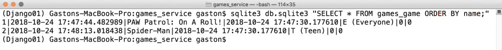
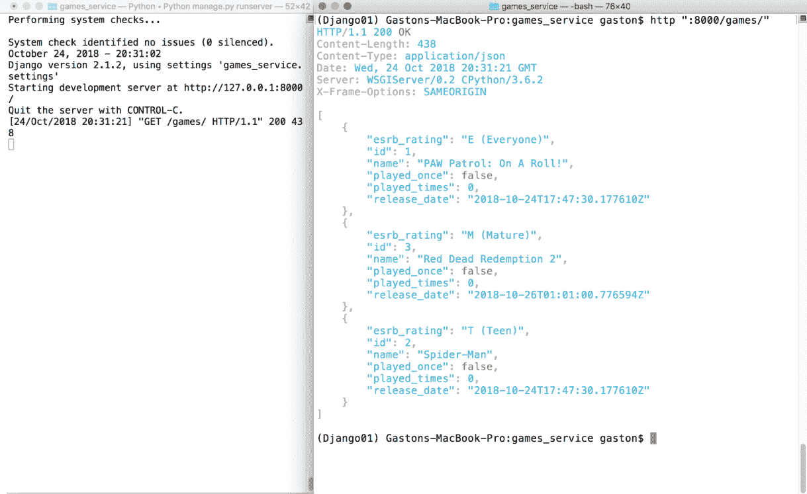

# 第五章：使用 Django 2.1 开发 RESTful API

在本章中，我们将开始使用 Django 和 Django REST framework，并创建一个 RESTful 网络 API，该 API 在简单的 SQLite 数据库上执行 CRUD 操作。我们将做以下事情：

+   设计一个与简单 SQLite 数据库交互的 RESTful API

+   理解每个 HTTP 方法执行的任务

+   使用 Django REST framework 设置虚拟环境

+   创建模型

+   管理序列化和反序列化

+   理解响应的状态码

+   编写 API 视图

+   使用命令行工具向 API 发送 HTTP 请求

+   使用 GUI 工具向 API 发送 HTTP 请求

# 设计一个与简单 SQLite 数据库交互的 RESTful API

想象一下，我们必须开始开发一个需要与 RESTful API 交互以执行游戏 CRUD 操作的移动应用。我们不希望花费时间选择和配置最合适的 **ORM**（**对象关系映射**）；我们只想尽快完成 RESTful API，以便在移动应用中与之交互。我们确实希望游戏持久化在数据库中，但我们不需要它准备好投入生产，因此，我们可以使用最简单的可能的关系数据库，只要我们不需要花费时间进行复杂的安装或配置。

我们需要尽可能短的开发时间。**Django Rest Framework**（**DRF**）将使我们能够轻松完成这项任务，并开始向我们的第一个 RESTful 网络服务发送 HTTP 请求。在这种情况下，我们将使用一个非常简单的 SQLite 数据库，它是新 Django Rest Framework 项目的默认数据库。

首先，我们必须指定我们主要资源：一个游戏。对于一个游戏，我们需要以下属性或字段：

+   一个整数标识符

+   一个名称或标题

+   发布日期

+   一个 **ESRB**（**娱乐软件分级委员会**）评级描述，例如 *T*（青少年）和 *EC*（幼儿）。您可以在 [`www.esrb.org`](http://www.esrb.org) 上了解更多关于 ESRB 的信息

+   一个 `bool` 值，表示游戏是否至少被玩家玩过一次

+   一个整数，表示游戏被玩过的次数

此外，我们希望我们的数据库能够保存一个时间戳，记录游戏被插入数据库的日期和时间。

以下表格显示了我们的 API 第一个版本必须支持的 HTTP 动词、范围和语义。每个方法由一个 HTTP 动词和一个范围组成，所有方法都对游戏和游戏集合有明确的含义：

| **HTTP 动词** | **范围** | **语义** |
| --- | --- | --- |
| `GET` | 游戏集合 | 获取集合中存储的所有游戏，按名称升序排序 |
| `GET` | 游戏 | 获取单个游戏 |
| `POST` | 游戏集合 | 在集合中创建一个新的游戏 |
| `PUT` | 游戏 | 更新现有的游戏 |
| `DELETE` | 游戏 | 删除现有的游戏 |

在 RESTful API 中，每个资源都有自己的唯一 URL。在我们的 API 中，每个游戏都有自己的唯一 URL。

# 理解每个 HTTP 方法执行的任务

在之前的表格中，`GET` HTTP 动词出现了两次，但具有两个不同的范围。第一行显示将 `GET` HTTP 动词应用于游戏集合（资源集合），而第二行显示将 `GET` HTTP 动词应用于单个游戏（资源）。

假设 `http://localhost:8000/games/` 是游戏集合的 URL。如果我们向之前的 URL 添加一个数字和一个斜杠 (`/`)，我们就可以识别一个具有等于指定数值的 ID 的特定游戏。例如，`http://localhost:8000/games/25/` 识别 ID 等于 `25` 的游戏。

我们必须使用以下 HTTP 动词 (`POST`) 和请求 URL (`http://localhost:8000/games/ ...`) 编写并发送一个 HTTP 请求

# 使用 Django REST 框架设置虚拟环境

在 第一章，*使用 Flask 1.0.2 开发 RESTful API 和微服务* 中，我们了解到，在本书中，我们将使用 Python 3.4 中引入和改进的轻量级虚拟环境。现在我们将遵循许多步骤来创建一个新的轻量级虚拟环境，以便使用 Flask 和 Flask-RESTful。

如果您在现代 Python 中没有轻量级虚拟环境的使用经验，强烈建议您阅读第一章 *使用轻量级虚拟环境工作*，*使用 Flask 1.0.2 开发 RESTful API 和微服务* 中命名的部分。该章节包含了关于我们将要遵循的步骤的所有详细解释。

以下命令假设您已在 Linux、macOS 或 Windows 上安装了 Python 3.7.1 或更高版本。

首先，我们必须选择我们的轻量级虚拟环境的目标文件夹或目录。以下是我们将在 Linux 和 macOS 中的示例中使用的路径：

```py
    ~/HillarPythonREST2/Django01
```

虚拟环境的目标文件夹将位于我们主目录内的 `HillarPythonREST2/Django01` 文件夹中。例如，如果我们的 macOS 或 Linux 中的主目录是 `/Users/gaston`，则虚拟环境将在 `/Users/gaston/HillarPythonREST2/Django01` 中创建。您可以在每个命令中将指定的路径替换为您想要的路径。

以下是我们将在 Windows 中的示例中使用的路径：

```py
    %USERPROFILE%\HillarPythonREST2\Django01
```

虚拟环境的目标文件夹将位于我们用户配置文件文件夹内的 `HillarPythonREST2\Django01` 文件夹中。例如，如果我们的用户配置文件文件夹是 `C:\Users\gaston`，则虚拟环境将在 `C:\Users\gaston\HillarPythonREST2\Django01` 中创建。当然，您可以在每个命令中将指定的路径替换为您想要的路径。

在 Windows PowerShell 中，之前的路径如下：

```py
    $env:userprofile\HillarPythonREST2\Django01
```

现在我们必须使用 `-m` 选项后跟 `venv` 模块名称和所需的路径，以便 Python 将此模块作为脚本运行并创建指定路径中的虚拟环境。根据我们创建虚拟环境的平台，指令可能会有所不同。因此，请确保您遵循您操作系统的说明。

在 Linux 或 macOS 中打开一个终端并执行以下命令以创建虚拟环境：

```py
    python3 -m venv ~/HillarPythonREST2/Django01
```

在 Windows 中，在命令提示符中执行以下命令以创建虚拟环境：

```py
    python -m venv %USERPROFILE%\HillarPythonREST2\Django01
```

如果您想使用 Windows PowerShell，请执行以下命令以创建虚拟环境：

```py
    python -m venv $env:userprofile\HillarPythonREST2\Django01 
```

之前的命令不会产生任何输出。现在我们已经创建了虚拟环境，我们将运行特定于平台的脚本以激活它。激活虚拟环境后，我们将安装仅在此虚拟环境中可用的包。

如果您的终端配置为在 macOS 或 Linux 中使用 `bash` shell，请运行以下命令以激活虚拟环境。该命令也适用于 `zsh` shell：

```py
    source ~/PythonREST/Django01/bin/activate
```

如果您的终端配置为使用 `csh` 或 `tcsh` shell，请运行以下命令以激活虚拟环境：

```py
    source ~/PythonREST/Django01/bin/activate.csh 
```

如果您的终端配置为使用 `fish` shell，请运行以下命令以激活虚拟环境：

```py
    source ~/PythonREST/Django01/bin/activate.fish
```

在 Windows 中，您可以在命令提示符中运行批处理文件或 Windows PowerShell 脚本来激活虚拟环境。如果您更喜欢命令提示符，请在 Windows 命令行中运行以下命令以激活虚拟环境：

```py
    %USERPROFILE%\PythonREST\Django01\Scripts\activate.bat
```

如果您更喜欢 Windows PowerShell，启动它并运行以下命令以激活虚拟环境。但是请注意，您需要在 Windows PowerShell 中启用脚本执行才能运行脚本：

```py
    cd $env:USERPROFILE
    PythonREST\Django01\Scripts\Activate.ps1
```

激活虚拟环境后，命令提示符将显示括号内的虚拟环境根文件夹名称作为默认提示的前缀，以提醒我们我们正在虚拟环境中工作。在这种情况下，我们将看到（`Django01`）作为命令提示符的前缀，因为已激活的虚拟环境的根文件夹是 `Django01`。

我们已经遵循了创建和激活虚拟环境的必要步骤。现在我们将创建一个 `requirements.txt` 文件来指定我们的应用程序需要安装在任何支持平台上的包集。这样，在新的虚拟环境中重复安装指定包及其版本将变得极其容易。

使用您喜欢的编辑器在最近创建的虚拟环境的根文件夹中创建一个名为`requirements.txt`的新文本文件。以下几行显示了该文件的内容，该文件声明了我们的 API 所需的包及其版本。示例的代码文件包含在`restful_python_2_05_01`文件夹中的`Django01/requirements.txt`文件中：

```py
Django==2.1.4 
djangorestframework==3.9.0 
httpie==0.9.9 
```

`requirements.txt`文件中的每一行都指示需要安装的包及其版本。在本例中，我们通过使用`==`运算符使用精确版本，因为我们想确保安装的是指定版本。以下表格总结了我们所指定的作为要求的包及其版本号：

| 包名 | 要安装的版本 |
| --- | --- |
| `Django` | 2.1.4 |
| `djangorestframework` | 3.9.0 |
| `httpie` | 1.0.2 |

转到虚拟环境的根文件夹：`Django01`。在 macOS 或 Linux 中，输入以下命令：

```py
    cd ~/PythonREST/Django01
```

在 Windows 命令提示符中，输入以下命令：

```py
    cd /d %USERPROFILE%\PythonREST\Django01
```

在 Windows PowerShell 中，输入以下命令：

```py
    cd $env:USERPROFILE
    cd PythonREST\Django01 
```

现在，在 macOS、Linux 或 Windows 上运行以下命令，使用最近创建的`requirements`文件通过`pip`安装之前表格中解释的包和版本。注意，`Django`是`djangorestframework`的依赖项。在运行命令之前，请确保您位于包含`requirements.txt`文件的文件夹中（`Django01`）：

```py
pip install -r requirements.txt 
```

输出的最后几行将指示所有已成功安装的包，包括`Django`、`djangorestframework`和`httpie`：

```py
Installing collected packages: pytz, Django, djangorestframework, Pygments, certifi, chardet, idna, urllib3, requests, httpie
Successfully installed Django-2.1.4 Pygments-2.2.0 certifi-2018.10.15 chardet-3.0.4 djangorestframework-3.9.0 httpie-1.0.2 idna-2.7 pytz-2018.6 requests-2.20.0 urllib3-1.24

```

现在，运行以下命令以创建一个名为`games_service`的新 Django 项目。该命令不会产生任何输出：

```py
    django-admin.py startproject games_service
```

之前的命令创建了一个包含其他子文件夹和 Python 文件的`games_service`文件夹。现在转到最近创建的`games_service`文件夹。只需执行以下命令：

```py
    cd games_service
```

然后，运行以下命令以在`games_service` Django 项目中创建一个名为`games`的新 Django 应用。该命令不会产生任何输出：

```py
    python manage.py startapp games
```

之前的命令创建了一个新的`games_service/games`子文件夹，其中包含以下文件：

+   `__init__.py`

+   `admin.py`

+   `apps.py`

+   `models.py`

+   `tests.py`

+   `views.py`

此外，`games_service/games`文件夹将有一个包含`__init__.py` Python 脚本的`migrations`子文件夹。以下截图显示了以`games_service`文件夹为起点的目录树中的文件夹和文件：


让我们检查位于`games_service/games`文件夹内的`apps.py`文件中的 Python 代码。以下几行展示了该文件的代码：

```py
from django.apps import AppConfig 

class GamesConfig(AppConfig): 
    name = 'games'
```

代码声明`GamesConfig`类为`django.apps.AppConfig`超类的子类，该超类代表 Django 应用及其配置。`GamesConfig`类仅定义了`name`类属性并将其值设置为`'games'`。

我们必须在`games_service/game_service/settings.py`文件中将`games.apps.GamesConfig`添加为已安装应用之一，这将为`games_service` Django 项目配置设置。我们构建前面的字符串如下：`应用名` + `.apps.` + `类名`，即`games` + `.apps.` + `GamesConfig`。此外，我们还需要添加`rest_framework`应用，以便我们能够使用 Django REST Framework。

`games_service/games_service/settings.py`文件是一个 Python 模块，其中包含模块级变量，这些变量定义了`games_service`项目的 Django 配置。我们将对此 Django 设置文件进行一些修改。打开`games_service/games_service/settings.py`文件，找到以下行，这些行指定了声明已安装应用的字符串列表并将其保存在`INSTALLED_APPS`变量中：

```py
INSTALLED_APPS = [ 
    'django.contrib.admin', 
    'django.contrib.auth', 
    'django.contrib.contenttypes', 
    'django.contrib.sessions', 
    'django.contrib.messages', 
    'django.contrib.staticfiles', 
] 
```

将以下两个字符串添加到`INSTALLED_APPS`字符串列表中，并将更改保存到`games_service/games_service/settings.py`文件中：

+   `'rest_framework'`

+   `'games.apps.GamesConfig'`

以下行显示了声明`INSTALLED_APPS`字符串列表的新代码，其中添加的行被突出显示。示例代码文件包含在`restful_python_2_05_01`文件夹中，位于`Django01/games_service/games-service/settings.py`文件中：

```py
INSTALLED_APPS = [ 
    'django.contrib.admin', 
    'django.contrib.auth', 
    'django.contrib.contenttypes', 
    'django.contrib.sessions', 
    'django.contrib.messages', 
    'django.contrib.staticfiles', 
    # Django REST Framework 
    'rest_framework', 
    # Our Games application 
    'games.apps.GamesConfig', 
] 
```

这样，我们就将 Django REST Framework 和`games`应用添加到了我们的初始 Django 项目`games_service`中。

# 创建模型

现在，我们将创建一个简单的`Game`模型，我们将使用它来表示和持久化游戏。打开`games_service/games/models.py`文件。以下行显示了该文件的初始代码，其中只有一个导入语句和一个注释，表明我们应该创建模型：

```py
from django.db import models 

# Create your models here. 
```

将`games_service/games/models.py`文件的代码替换为以下行。新代码创建了一个`Game`类，具体来说，是在`games/models.py`文件中创建了一个`Game`模型。示例代码文件包含在`restful_python_2_05_01`文件夹中，位于`Django01/games_service/games/apps.py`文件中：

```py
from django.db import models class Game(models.Model): created_timestamp = models.DateTimeField(auto_now_add=True) ...
```

# 管理序列化和反序列化

我们的 RESTful Web API 必须能够将游戏实例序列化为 JSON 表示，并且也能将 JSON 表示反序列化以构建游戏实例。使用 Django REST Framework，我们只需为游戏实例创建一个序列化器类来管理序列化为 JSON 和从 JSON 反序列化。

Django REST Framework 使用两阶段过程进行序列化。序列化器是模型实例和 Python 原语之间的中介。解析器和渲染器充当 Python 原语和 HTTP 请求和响应之间的中介。

我们将通过创建 `rest_framework.serializers.Serializer` 类的子类来配置 `Game` 模型实例和 Python 原始数据之间的中介，以声明字段和必要的序列化和反序列化管理方法。我们将重复一些关于字段的信息，这些信息我们已经包含在 `Game` 模型中，以便我们理解在 `Serializer` 类的子类中可以配置的所有内容。然而，我们将使用快捷方式，这将在下一个示例中减少样板代码。我们将通过使用 `ModelSerializer` 类来在下一个示例中编写更少的代码。

现在，转到 `games_service/games` 文件夹，并创建一个名为 `serializers.py` 的新 Python 代码文件。以下行显示了声明新 `GameSerializer` 类的代码。示例代码文件包含在 `restful_python_2_05_01` 文件夹中，位于 `Django01/games_service/games/serializers.py` 文件中：

```py
from rest_framework import serializers 
from games.models import Game 

class GameSerializer(serializers.Serializer): 
    id = serializers.IntegerField(read_only=True) 
    name = serializers.CharField(max_length=200) 
    release_date = serializers.DateTimeField() 
    esrb_rating = serializers.CharField(max_length=150) 
    played_once = serializers.BooleanField(required=False) 
    played_times = serializers.IntegerField(required=False) 

    def create(self, validated_data): 
        return Game.objects.create(**validated_data) 

    def update(self, instance, validated_data): 
        instance.name = validated_data.get('name',  
            instance.name) 
        instance.release_date = validated_data.get('release_date',  
            instance.release_date) 
        instance.esrb_rating = validated_data.get('esrb_rating',  
            instance.esrb_rating) 
        instance.played_once = validated_data.get('played_once',  
            instance.played_once) 
        instance.played_times = validated_data.get('played_times',  
            instance.played_times) 
        instance.save() 
        return instance 
```

`GameSerializer` 类声明了代表我们想要序列化的字段的属性。请注意，我们省略了在 `Game` 模型中存在的 `created_timestamp` 属性。当对这个类调用继承的 `save` 方法时，重写的 `create` 和 `update` 方法定义了如何创建或修改实例。实际上，这些方法必须在我们的类中实现，因为它们在其基类 `Serializer` 中的声明中只是抛出一个 `NotImplementedError` 异常。

`create` 方法接收 `validated_data` 参数中的验证数据。代码根据接收到的验证数据创建并返回一个新的 `Game` 实例。

`update` 方法接收一个正在更新的现有 `Game` 实例以及 `instance` 和 `validated_data` 参数中的新验证数据。代码使用从验证数据中检索到的更新属性值来更新实例的属性值，为更新的 `Game` 实例调用保存方法，并返回更新并保存的实例。

我们可以在启动默认 Python 交互式外壳之前使其包含所有 Django 项目模块。这样，我们可以检查序列化器是否按预期工作。此外，它将帮助我们理解 Django 中的序列化是如何工作的。

运行以下命令以启动交互式外壳。确保你在终端或命令提示符中的 `games_service` 文件夹内：

```py
    python manage.py shell
```

你会注意到，在介绍默认 Python 交互式外壳的常规行之后，会显示一行说 (`InteractiveConsole`) 的内容。在 Python 交互式外壳中输入以下代码以导入测试 `Game` 模型和其序列化器所需的所有内容。示例代码文件包含在 `restful_python_2_05_01` 文件夹中，位于 `Django01/cmd/serializers_test_01.py` 文件中：

```py
from datetime import datetime 
from django.utils import timezone 
from django.utils.six import BytesIO 
from rest_framework.renderers import JSONRenderer 
from rest_framework.parsers import JSONParser 
from games.models import Game 
from games.serializers import GameSerializer 
```

现在输入以下代码以创建两个`Game`模型的实例并将它们保存。示例的代码文件包含在`restful_python_2_05_01`文件夹中，位于`Django01/cmd/serializers_test_01.py`文件中：

```py
gamedatetime = timezone.make_aware(datetime.now(), timezone.get_current_timezone()) 
game1 = Game(name='PAW Patrol: On A Roll!', release_date=gamedatetime, esrb_rating='E (Everyone)') 
game1.save() 
game2 = Game(name='Spider-Man', release_date=gamedatetime, esrb_rating='T (Teen)') 
game2.save()
```

执行前面的代码后，我们可以使用之前介绍的命令行命令或 GUI 工具检查 SQLite 数据库中的`games_game`表的内容。我们会注意到表中有两行，列的值是我们提供给不同`Game`实例的不同属性的值。然而，请确保你在另一个终端或命令提示符中运行命令，以避免留下我们将继续使用的交互式 shell。以下截图显示了`games_game`表的内容：



在交互式 shell 中输入以下命令以检查保存的`Game`实例的标识符值以及包含我们保存实例到数据库的日期和时间的`created_timestamp`属性值。示例的代码文件包含在`restful_python_2_05_01`文件夹中，位于`Django01/cmd/serializers_test_01.py`文件中：

```py
print(game1.id) 
print(game1.name) 
print(game1.created_timestamp) 
print(game2.id) 
print(game2.name) 
print(game2.created_timestamp) 
```

现在，让我们编写以下代码以序列化第一个游戏实例（`game1`）。示例的代码文件包含在`restful_python_2_05_01`文件夹中，位于`Django01/cmd/serializers_test_01.py`文件中：

```py
game_serializer1 = GameSerializer(game1) 
print(game_serializer1.data) 
```

以下行显示了生成的字典，具体来说，是一个`rest_framework.utils.serializer_helpers.ReturnDict`实例：

```py
{'id': 1, 'name': 'PAW Patrol: On A Roll!', 'release_date': '2018-10-24T17:47:30.177610Z', 'esrb_rating': 'E (Everyone)', 'played_once': False, 'played_times': 0}

```

现在，让我们序列化第二个游戏实例（`game2`）。示例的代码文件包含在`restful_python_2_05_01`文件夹中，位于`Django01/cmd/serializers_test_01.py`文件中：

```py
game_serializer2 = GameSerializer(game2) 
print(game_serializer2.data) 
```

以下行显示了生成的字典：

```py
{'id': 2, 'name': 'Spider-Man', 'release_date': '2018-10-24T17:47:30.177610Z', 'esrb_rating': 'T (Teen)', 'played_once': False, 'played_times': 0}

```

我们可以使用`rest_framework.renderers.JSONRenderer`类轻松地将`data`属性中持有的字典渲染成 JSON。以下行创建了这个类的实例，然后调用`render`方法将`data`属性中持有的字典渲染成它们的 JSON 表示。示例的代码文件包含在`restful_python_2_05_01`文件夹中，位于`Django01/cmd/serializers_test_01.py`文件中：

```py
renderer = JSONRenderer() 
rendered_game1 = renderer.render(game_serializer1.data) 
rendered_game2 = renderer.render(game_serializer2.data) 
print(rendered_game1) 
print(rendered_game2) 
```

以下行显示了从`render`方法调用生成的输出：

```py
    b'{"id":1,"name":"PAW Patrol: On A Roll!","release_date":"2018-10-24T17:47:30.177610Z","esrb_rating":"E (Everyone)","played_once":false,"played_times":0}'
    b'{"id":2,"name":"Spider-Man","release_date":"2018-10-24T17:47:30.177610Z","esrb_rating":"T (Teen)","played_once":false,"played_times":0}'

```

现在，我们将反向操作，从序列化数据到`Game`实例的种群。以下行从 JSON 字符串（序列化数据）生成一个新的`Game`实例；也就是说，我们将编写反序列化代码。示例的代码文件包含在`restful_python_2_05_01`文件夹中，位于`Django01/cmd/serializers_test_01.py`文件中：

```py
json_string_for_new_game = '{"name":"Tomb Raider Extreme Edition","release_date":"2016-05-18T03:02:00.776594Z","game_category":"3D RPG","played":false}' 
json_bytes_for_new_game = bytes(json_string_for_new_game , encoding="UTF-8") 
stream_for_new_game = BytesIO(json_bytes_for_new_game) 
parser = JSONParser() 
parsed_new_game = parser.parse(stream_for_new_game) 
print(parsed_new_game) 
```

第一行创建了一个新的字符串，其中包含定义新游戏的 JSON（`json_string_for_new_game`）。然后，代码将字符串转换为`bytes`，并将转换结果保存在`json_bytes_for_new_game`变量中。`django.utils.six.BytesIO`类提供了一个使用内存字节数组的缓冲 I/O 实现。代码使用这个类从之前生成的序列化数据字节数组`json_bytes_for_new_game`创建一个流，并将生成的实例保存在`stream_for_new_game`变量中。

我们可以使用`rest_framework.parsers.JSONParser`类轻松地将流反序列化并解析成 Python 模型。下一行创建了这个类的实例，然后使用`stream_for_new_game`作为参数调用`parse`方法，将流解析成 Python 原生数据类型，并将结果保存在`parsed_new_game`变量中。

执行前面的行后，`parsed_new_game`包含从流中解析出的 Python 字典。以下行显示了执行前面的代码片段后生成的输出：

```py
{'name': 'Red Dead Redemption 2', 'release_date': '2018-10-26T01:01:00.776594Z', 'esrb_rating': 'M (Mature)'}

```

以下行使用`GameSerializer`类从流中解析出的 Python 字典生成一个名为`new_game`的完全填充的`Game`实例。示例代码文件包含在`restful_python_2_05_01`文件夹中，位于`Django01/cmd/serializers_test_01.py`文件中：

```py
new_game_serializer = GameSerializer(data=parsed_new_game) 
if new_game_serializer.is_valid(): 
    new_game = new_game_serializer.save() 
    print(new_game.name) 
```

首先，代码使用我们从流中解析出的 Python 字典（`parsed_new_game`）作为`data`关键字参数创建`GameSerializer`类的实例。然后，代码调用`is_valid`方法来确定数据是否有效。

注意，当我们尝试在创建序列化器时传递`data`关键字参数以访问序列化数据表示时，我们必须始终调用`is_valid`。

如果方法返回`true`，我们可以访问`data`属性中的序列化表示，因此代码调用`save`方法将相应的行插入数据库，并返回一个完全填充的`Game`实例，保存在`new_game`局部变量中。然后，代码打印出完全填充的`Game`实例中的一个属性，名为`new_game`。

如前述代码所示，Django REST Framework 使得从对象到 JSON 的序列化和从 JSON 到对象的反序列化变得简单，这是我们 RESTful Web API 的核心要求，必须执行 CRUD 操作。

输入以下命令以退出包含我们开始测试序列化和反序列化的 Django 项目模块的 shell：

```py
quit() 
```

# 理解响应状态码

Django REST Framework 在`status`模块中声明了一组用于不同 HTTP 状态码的命名常量。我们将始终使用这些命名常量来返回 HTTP 状态码。

返回数字作为状态代码是不良的做法。我们希望我们的代码易于阅读和理解，因此，我们将使用描述性的 HTTP 状态代码。

例如，如果我们必须返回`404 Not Found`状态代码，我们将返回`status.HTTP_404_NOT_FOUND`，而不是仅仅`404`。如果我们必须返回`201 Created`状态代码，我们将返回`status.HTTP_201_CREATED`，而不是仅仅`201`。

# 编写 API 视图

现在我们将创建 Django 视图，这些视图将使用之前创建的`GameSerializer`类来为 API 处理的每个 HTTP 请求返回 JSON 表示。打开位于`games_service/games`文件夹中的`views.py`文件。以下行显示了该文件的初始代码，只有一个导入语句和一个注释，表明我们应该创建视图：

```py
from django.shortcuts import render 

# Create your views here. 
```

将现有代码替换为以下行。新代码创建了一个`JSONResponse`类，并声明了两个函数：`game_collection`和`game_detail`。我们正在创建 API 的第一个版本，我们使用函数来使代码尽可能简单。在下一个示例中，我们将使用类和更复杂的代码。突出显示的行显示了评估`request.method`属性值的表达式，以确定基于 HTTP 动词要执行的操作。示例代码文件包含在`restful_python_2_05_01`文件夹中，位于`Django01/games-service/games/views.py`文件中：

```py
from django.http import HttpResponse 
from django.views.decorators.csrf import csrf_exempt 
from rest_framework.renderers import JSONRenderer 
from rest_framework.parsers import JSONParser 
from rest_framework import status 
from games.models import Game 
from games.serializers import GameSerializer 

class JSONResponse(HttpResponse): 
    def __init__(self, data, **kwargs): 
        content = JSONRenderer().render(data) 
        kwargs['content_type'] = 'application/json' 
        super(JSONResponse, self).__init__(content, **kwargs) 

@csrf_exempt 
def game_collection(request): 
    if request.method == 'GET': 
        games = Game.objects.all() 
        games_serializer = GameSerializer(games, many=True) 
        return JSONResponse(games_serializer.data) 
    elif request.method == 'POST': 
        game_data = JSONParser().parse(request) 
        game_serializer = GameSerializer(data=game_data) 
        if game_serializer.is_valid(): 
            game_serializer.save() 
            return JSONResponse(game_serializer.data,  
                status=status.HTTP_201_CREATED) 
        return JSONResponse(game_serializer.errors,  
            status=status.HTTP_400_BAD_REQUEST) 

@csrf_exempt 
def game_detail(request, id): 
    try: 
        game = Game.objects.get(id=id) 
    except Game.DoesNotExist: 
        return HttpResponse(status=status.HTTP_404_NOT_FOUND) 
    if request.method == 'GET': 
        game_serializer = GameSerializer(game) 
        return JSONResponse(game_serializer.data) 
    elif request.method == 'PUT': 
        game_data = JSONParser().parse(request) 
        game_serializer = GameSerializer(game,  
            data=game_data) 
        if game_serializer.is_valid(): 
            game_serializer.save() 
            return JSONResponse(game_serializer.data) 
        return JSONResponse(game_serializer.errors,  
            status=status.HTTP_400_BAD_REQUEST) 
 elif request.method == 'DELETE': 
        game.delete() 
        return HttpResponse(status=status.HTTP_204_NO_CONTENT) 
```

`JSONResponse`类是`django.http.HttpResponse`类的子类。超类表示一个以字符串为内容的 HTTP 响应。`JSONResponse`类将其内容渲染为 JSON。该类仅声明了`__init__`方法，该方法创建了一个`rest_framework.renderers.JSONRenderer`实例，并调用其`render`方法将接收到的数据渲染为 JSON，并将返回的`bytestring`保存到`content`局部变量中。然后，代码将`'content_type'`键添加到响应头中，其值为`'application/json'`。最后，代码调用基类的初始化器，传递 JSON `bytestring`和添加到头部的键值对。这样，该类代表了一个我们用于两个函数的 JSON 响应，以便轻松返回 JSON 响应。

代码在两个函数中使用`@csrf_exempt`装饰器来确保视图设置一个**CSRF**（即**跨站请求伪造**）cookie。我们这样做是为了使测试这个示例变得简单，这个示例不代表一个生产就绪的 Web 服务。我们将在稍后的 RESTful API 中添加安全功能。

当 Django 服务器接收到 HTTP 请求时，Django 创建一个`HttpRequest`实例，具体是一个`django.http.HttpRequest`对象。此实例包含有关请求的元数据，包括 HTTP 动词。`method`属性提供了一个表示请求中使用的 HTTP 动词或方法的字符串。

当 Django 加载将处理请求的适当视图时，它将 `HttpRequest` 实例作为第一个参数传递给视图函数。视图函数必须返回一个 `HttpResponse` 实例，具体来说，是一个 `django.http.HttpResponse` 实例。

`game_collection` 函数列出所有游戏或创建一个新的游戏。该函数接收一个 `HttpRequest` 实例作为 `request` 参数。该函数能够处理两种 HTTP 动词：`GET` 和 `POST`。代码会检查 `request.method` 属性的值，以确定根据 HTTP 动词要执行的代码。如果 HTTP 动词是 `GET`，则 `request.method == 'GET'` 表达式将评估为 `True`，代码必须列出所有游戏。代码将从数据库检索所有 `Game` 对象，使用 `GameSerializer` 将它们全部序列化，并返回一个由 `GameSerializer` 生成数据的 `JSONResponse` 实例。代码使用 `many=True` 参数创建 `GameSerializer` 实例，以指定必须序列化多个实例，而不仅仅是单个实例。在底层，当 `many` 参数值设置为 `True` 时，Django 使用 `ListSerializer`。

如果 HTTP 动词是 `POST`，则代码必须根据包含在 HTTP 请求中的 JSON 数据创建一个新的游戏。首先，代码使用一个 `JSONParser` 实例，并使用 `request` 作为参数调用其 `parse` 方法，以解析请求中提供的作为 `JSON` 数据的游戏数据，并将结果保存在 `game_data` 本地变量中。然后，代码使用之前检索到的数据创建一个 `GameSerializer` 实例，并调用 `is_valid` 方法以确定 `Game` 实例是否有效。如果实例有效，代码将调用 `save` 方法将实例持久化到数据库中，并返回一个包含保存数据的 `JSONResponse`，其状态等于 `status.HTTP_201_CREATED`，即 `201 Created`。

`game_detail` 函数检索、更新或删除现有的游戏。该函数接收一个 `HttpRequest` 实例作为 `request` 参数，以及要检索、更新或删除的游戏的 ID 作为 `id` 参数。该函数能够处理三种 HTTP 动词：`GET`、`PUT` 和 `DELETE`。代码会检查 `request.method` 属性的值，以确定根据 HTTP 动词要执行的代码。无论 HTTP 动词是什么，该函数都会调用 `Game.objects.get` 方法，将接收到的 `id` 作为 `id` 参数，从数据库中根据指定的 ID 检索一个 `Game` 实例，并将其保存在 `game` 本地变量中。如果数据库中不存在具有指定 ID 的游戏，代码将返回一个状态等于 `status.HTTP_404_NOT_FOUND` 的 `HttpResponse`，即 `404 Not Found`。

如果 HTTP 动词是`GET`，代码使用`game`作为参数创建一个`GameSerializer`实例，并在一个包含默认`200 OK`状态的`JSONResponse`中返回序列化游戏的 数据。代码返回检索到的游戏序列化为 JSON。

如果 HTTP 动词是`PUT`，代码必须根据 HTTP 请求中包含的 JSON 数据创建一个新的游戏，并使用它来替换现有的游戏。首先，代码使用一个`JSONParser`实例，并使用`request`作为参数调用其`parse`方法来解析请求中提供的作为`JSON`数据的游戏数据，并将结果保存在`game_data`局部变量中。然后，代码使用从数据库中检索到的`Game`实例`game`和将要替换现有数据的检索数据`game_data`创建一个`GameSerializer`实例。接着，代码调用`is_valid`方法来确定`Game`实例是否有效。如果实例有效，代码调用`save`方法将实例持久化到数据库中，并返回一个包含保存数据的`JSONResponse`和默认的`200 OK`状态。如果解析的数据没有生成有效的`Game`实例，代码返回一个状态等于`status.HTTP_400_BAD_REQUEST`的`JSONResponse`，即`400 Bad Request`。

如果 HTTP 动词是`DELETE`，代码调用从数据库中先前检索到的`Game`实例（`game`）的`delete`方法。对`delete`方法的调用擦除了`games_game`表中的底层行，因此，该游戏将不再可用。然后，代码返回一个状态等于`status.HTTP_204_NO_CONTENT`的`JSONResponse`，即`204 No Content`。

现在我们必须在`games_service/games`文件夹中创建一个名为`urls.py`的新 Python 文件，具体来说，是`games_service/games/urls.py`文件。以下行显示了该文件的代码，该代码定义了 URL 模式，该模式指定了请求中必须匹配的正则表达式，以运行在`views.py`文件中定义的特定函数。示例的代码文件包含在`restful_python_2_05_01`文件夹中，在`Django01/games-service/games/urls.py`文件中：

```py
from django.conf.urls import url 
from games import views 

urlpatterns = [ 
    url(r'^games/$', views.game_collection), 
    url(r'^games/(?P<id>[0-9]+)/$', views.game_detail), 
] 
```

`urlpatterns`列表使得将 URL 路由到视图成为可能。代码使用`django.conf.urls.url`函数调用必须匹配的正则表达式，以及定义在视图模块中的视图函数作为参数，为`urlpatterns`列表中的每个条目创建一个`RegexURLPattern`实例。

现在，我们必须替换 Django 在 `games_service` 文件夹中自动生成的 `urls.py` 中的代码，具体来说，是 `games_service/urls.py` 文件。不要将此文件与之前创建并保存在另一个文件夹中的 `urls.py` 文件混淆。`games_service/urls.py` 文件定义了根 URL 配置，因此我们必须包含之前编码的 `games_service/games/urls.py` 文件中声明的 URL 模式。以下行显示了 `games_service/urls.py` 文件的新代码。示例代码文件包含在 `restful_python_2_05_01` 文件夹中，位于 `Django01/games-service/urls.py` 文件：

```py
from django.conf.urls import url, include 

urlpatterns = [ 
    url(r'^', include('games.urls')), 
] 
```

# 向 Django API 发送 HTTP 请求

现在，我们可以启动 Django 的开发服务器来编写和发送 HTTP 请求到我们的不安全 Web API（我们肯定会添加安全性）。执行以下命令：

```py
    python manage.py runserver
```

以下行显示了执行上一个命令后的输出。开发服务器正在监听端口 `8000`。

```py
    Performing system checks...

    System check identified no issues (0 silenced).
    October 24, 2018 - 19:58:03
    Django version 2.1.2, using settings 'games_service.settings'
    Starting development server at http://127.0.0.1:8000/
    Quit the server with CONTROL-C. 
```

使用上一个命令，我们将启动 Django 开发服务器，并且我们只能在我们的开发计算机上访问它。 ...

# 使用命令行工具 - curl 和 httpie

我们将开始使用我们在 第一章 中介绍的 `curl` 和 HTTPie 命令行工具来编写和发送 HTTP 请求，该章名为 *使用 Flask 1.0.2 开发 RESTful API 和微服务*，在名为 *使用命令行工具 - curl 和 httpie* 的部分。在执行下一个示例之前，请确保您已阅读此部分。

每当我们使用命令行编写 HTTP 请求时，我们将使用同一命令的两个版本：第一个使用 HTTPie，第二个使用 `curl`。这样，您就可以使用最方便的一种。

确保您让 Django 开发服务器继续运行。不要关闭运行此开发服务器的终端或命令提示符。在 macOS 或 Linux 中打开一个新的终端，或在 Windows 中打开一个命令提示符，然后运行以下命令。我们将编写并发送一个 HTTP 请求来创建一个新的通知。示例代码文件包含在 `restful_python_2_05_01` 文件夹中，位于 `Django01/cmd/cmd01.txt` 文件：

```py
    http ":8000/games/"
```

以下是对应的 `curl` 命令。示例代码文件包含在 `restful_python_2_05_01` 文件夹中，位于 `Django01/cmd/cmd02.txt` 文件：

```py
    curl -iX GET "localhost:8000/games/"
```

在指定的情况下，您必须输入结束斜杠（`/`）非常重要，因为 `/service/notifications` 不会匹配任何配置的 URL 路由。因此，我们必须输入 `/service/notifications/`，包括结束斜杠（`/`）。

之前的命令将编写并发送以下 HTTP 请求：`GET http://localhost:8000/games/`。这个请求是我们 RESTful API 中最简单的情况，因为它将匹配并运行 `views.game_collection` 函数，即 `game_service/games/views.py` 文件中声明的 `game_collection` 函数。该函数只接收 `request` 作为参数，因为 URL 模式不包含任何参数。由于请求的 HTTP 动词是 `GET`，因此 `request.method` 属性等于 `'GET'`，因此该函数将执行检索所有 `Game` 对象并生成包含所有这些序列化 `Game` 对象的 JSON 响应的代码。

以下行显示了 HTTP 请求的一个示例响应，其中 JSON 响应包含三个 `Game` 对象：

```py
    HTTP/1.1 200 OK
    Content-Length: 438
    Content-Type: application/json
    Date: Wed, 24 Oct 2018 20:25:45 GMT
    Server: WSGIServer/0.2 CPython/3.7.1
    X-Frame-Options: SAMEORIGIN

    [
        {
            "esrb_rating": "E (Everyone)",
            "id": 1,
            "name": "PAW Patrol: On A Roll!",
            "played_once": false,
            "played_times": 0,
            "release_date": "2018-10-24T17:47:30.177610Z"
        },
        {
            "esrb_rating": "M (Mature)",
            "id": 3,
            "name": "Red Dead Redemption 2",
            "played_once": false,
            "played_times": 0,
            "release_date": "2018-10-26T01:01:00.776594Z"
        },
        {
            "esrb_rating": "T (Teen)",
            "id": 2,
            "name": "Spider-Man",
            "played_once": false,
            "played_times": 0,
            "release_date": "2018-10-24T17:47:30.177610Z"
        }
    ]

```

在我们运行请求后，将在运行 Django 开发服务器的窗口中看到以下行。输出表明服务器接收了一个带有 `GET` 动词和 `/games/` 作为 URI 的 HTTP 请求。服务器处理了 HTTP 请求，返回的状态码为 `200`，响应长度等于 `438` 个字符。响应长度可能不同，因为分配给每个游戏的 `id` 值将对响应长度产生影响。`HTTP/1.1."` 后的第一个数字表示返回的状态码（`200`），第二个数字表示响应长度（`438`）：

```py
    [24/Oct/2018 20:25:45] "GET /games/ HTTP/1.1" 200 438 
```

以下截图显示了 macOS 上并排的两个终端窗口。左侧的终端窗口正在运行 Django 开发服务器，并显示接收和处理的 HTTP 请求。右侧的终端窗口正在运行 `http` 命令以生成 HTTP 请求。在编写和发送 HTTP 请求时使用类似的配置来检查输出是一个好主意：



现在，我们将从上一个列表中选择一个游戏，并编写一个 HTTP 请求来检索所选的游戏。例如，在上一个列表中，第一个游戏的 `id` 值等于 `3`。运行以下命令来检索此游戏。使用上一个命令中检索到的第一个游戏的 `id` 值，因为 `id` 号码可能不同。示例代码文件包含在 `restful_python_2_05_01` 文件夹中，位于 `Django01/cmd/cmd03.txt` 文件：

```py
    http ":8000/games/3/"
```

以下是对应的 `curl` 命令。示例代码文件包含在 `restful_python_2_05_01` 文件夹中，位于 `Django01/cmd/cmd04.txt` 文件：

```py
    curl -iX GET "localhost:8000/games/3/"
```

之前的命令将组合并发送以下 HTTP 请求：`GET http://localhost:8000/games/3/`。请求在 `/games/` 后面有一个数字，因此，它将匹配 `'^games/(?P<id>[0-9]+)/$'` 并运行 `views.game_detail` 函数，即 `games_service/games/views.py` 文件中声明的 `game_detail` 函数。该函数接收 `request` 和 `id` 作为参数，因为 URL 模式将 `/games/` 后面指定的数字作为 `id` 参数传递。由于请求的 HTTP 动词是 `GET`，`request.method` 属性等于 `'GET'`，因此，该函数将执行检索与作为参数接收的 `id` 值匹配的 `Game` 对象的代码，如果找到，则生成包含此 `Game` 对象序列化的 JSON 响应。以下行显示了 HTTP 请求的示例响应，其中包含 JSON 响应中与 `id` 值匹配的 `Game` 对象：

```py
    HTTP/1.1 200 OK
    Content-Length: 148
    Content-Type: application/json
    Date: Wed, 24 Oct 2018 22:04:50 GMT
    Server: WSGIServer/0.2 CPython/3.7.1
    X-Frame-Options: SAMEORIGIN

    {
        "esrb_rating": "M (Mature)",
        "id": 3,
        "name": "Red Dead Redemption 2",
        "played_once": false,
        "played_times": 0,
        "release_date": "2018-10-26T01:01:00.776594Z"
    }

```

现在我们将组合并发送一个 HTTP 请求以检索一个不存在的游戏。例如，在之前的列表中，没有 `id` 值等于 `888` 的游戏。运行以下命令尝试检索此游戏。确保您使用一个不存在的 `id` 值。我们必须确保实用工具将标题作为响应的一部分显示，因为响应将没有主体。示例代码文件包含在 `restful_python_2_05_01` 文件夹中，在 `Django01/cmd/cmd05.txt` 文件中：

```py
    http ":8000/games/888/"
```

以下是对应的 `curl` 命令。示例代码文件包含在 `restful_python_2_05_01` 文件夹中，在 `Django01/cmd/cmd06.txt` 文件中：

```py
    curl -iX GET "localhost:8000/games/888/"
```

之前的命令将组合并发送以下 HTTP 请求：`GET http://localhost:8000/games/888/`。请求与之前我们分析过的请求相同，只是 `id` 参数的数字不同。服务器将运行 `views.game_detail` 函数，即 `games_service/games/views.py` 文件中声明的 `game_detail` 函数。该函数将执行检索与作为参数接收的 `id` 值匹配的 `Game` 对象的代码，并抛出并捕获 `Game.DoesNotExist` 异常，因为没有与指定的 `id` 值匹配的游戏。因此，代码将返回 HTTP `404 Not Found` 状态码。以下行显示了 HTTP 请求的示例响应头：

```py
    HTTP/1.1 404 Not Found
    Content-Length: 0
    Content-Type: text/html; charset=utf-8
    Date: Wed, 24 Oct 2018 22:12:02 GMT
    Server: WSGIServer/0.2 CPython/3.7.1
    X-Frame-Options: SAMEORIGIN

```

现在运行以下命令来组合并发送一个 HTTP `POST` 请求以创建一个新的游戏。示例代码文件包含在 `restful_python_2_05_01` 文件夹中，在 `Django01/cmd/cmd07.txt` 文件中：

```py
http POST ":8000/games/" name='Fortnite' esrb_rating='T (Teen)' release_date='2017-05-18T03:02:00.776594Z'

```

以下是对应的 `curl` 命令。使用 `-H "Content-Type: application/json"` 选项来指示 `curl` 将 `-d` 选项之后指定的数据作为 `application/json` 发送，而不是默认的 `application/x-www-form-urlencoded`，这一点非常重要。示例代码文件包含在 `restful_python_2_05_01` 文件夹中，位于 `Django01/cmd/cmd08.txt` 文件：

```py
curl -iX POST -H "Content-Type: application/json" -d '{"name":"Fortnite", "esrb_rating":"T (Teen)", "release_date": "2017-05-18T03:02:00.776594Z"}' "localhost:8000/games/"

```

之前的命令将组合并发送以下 HTTP 请求：`POST http://localhost:8000/games/`，并带有以下 JSON 键值对：

```py
{ 
    "name": "Fortnite",  
    "esrb_rating": "T (Teen)",  
    "release_date": "2017-05-18T03:02:00.776594Z" 
}
```

请求指定了 `/games/`，因此它将匹配 `'^games/$'` 并运行 `views.game_collection` 函数，即 `games_service/ames/views.py` 文件中声明的 `game_collection` 函数。该函数仅接收 `request` 作为参数，因为 URL 模式不包含任何参数。由于请求的 HTTP 动词是 `POST`，因此 `request.method` 属性等于 `'POST'`，因此函数执行解析请求中接收到的 JSON 数据的代码，创建一个新的 `Game` 对象，如果数据有效，则保存新的 `Game` 实例。如果新的 `Game` 实例成功持久化到数据库中，函数返回 HTTP `201 Created` 状态码，并在响应体中将最近持久化的 `Game` 序列化为 JSON。以下行显示了 HTTP 请求的示例响应，其中包含 JSON 响应中的新 `Game` 对象：

```py
    HTTP/1.1 201 Created
    Content-Length: 133
    Content-Type: application/json
    Date: Wed, 24 Oct 2018 22:18:36 GMT
    Server: WSGIServer/0.2 CPython/3.6.2
    X-Frame-Options: SAMEORIGIN

    {
        "esrb_rating": "T (Teen)",
        "id": 4,
        "name": "Fortnite",
        "played_once": false,
        "played_times": 0,
        "release_date": "2017-05-18T03:02:00.776594Z"
    }

```

现在我们运行以下命令来组合并发送一个 HTTP `PUT` 请求以更新现有的游戏，具体来说，用新的游戏替换之前添加的游戏。我们必须检查之前响应中分配给 `id` 的值，并将命令中的 `4` 替换为返回的值。例如，如果 `id` 的值为 `8`，则应使用 `games/8/` 而不是 `games/4/`。示例代码文件包含在 `restful_python_2_05_01` 文件夹中，位于 `Django01/cmd/cmd09.txt` 文件：

```py
 http PUT ":8000/games/4/" name='Fortnite Battle Royale' esrb_rating='T (Teen)' played_once=true played_times=3 release_date='2017-05-20T03:02:00.776594Z'

```

以下是对应的 `curl` 命令。与之前的 `curl` 示例一样，使用 `-H "Content-Type: application/json"` 选项来指示 `curl` 将 `-d` 选项之后指定的数据作为 `application/json` 发送，而不是默认的 `application/x-www-form-urlencoded`，这一点非常重要。示例代码文件包含在 `restful_python_2_05_01` 文件夹中，位于 `Django01/cmd/cmd10.txt` 文件：

```py
curl -iX PUT -H "Content-Type: application/json" -d '{"name":"Fortnite Battle Royale", "esrb_rating":"T (Teen)", "played_once": "true", "played_times": 3, "release_date": "2017-05-20T03:02:00.776594Z"}' "localhost:8000/games/4/"

```

之前的命令将组合并发送 HTTP 请求 `PUT http://localhost:8000/games/15/`，并带有以下 JSON 键值对：

```py
{  
    "name": "Fortnite Battle Royale",  
    "esrb_rating": "T (Teen)",  
    "played_once": true,
     "played_times": 3, 
    "release_date": "2017-05-20T03:02:00.776594Z" 
} 
```

请求在`/games/`之后有一个数字，因此它将匹配`'^games/(?P<id>[0-9]+)/$'`并运行`views.game_detail`函数，即`games_service/games/views.py`文件中声明的`game_detail`函数。该函数接收`request`和`id`作为参数，因为 URL 模式将`/games/`之后指定的数字传递给`id`参数。由于请求的 HTTP 动词是`PUT`，所以`request.method`属性等于`'PUT'`，因此函数执行解析请求中接收到的 JSON 数据的代码，从这些数据创建一个`Game`实例，并更新数据库中现有游戏的全部字段。如果游戏在数据库中成功更新，函数将返回 HTTP `200 OK`状态码，并将最近更新的`Game`序列化为 JSON 格式放在响应体中。以下行显示了 HTTP 请求的一个示例响应，其中在 JSON 响应中显示了更新的`Game`对象：

```py
    HTTP/1.1 200 OK
    Content-Length: 146
    Content-Type: application/json
    Date: Wed, 24 Oct 2018 22:27:36 GMT
    Server: WSGIServer/0.2 CPython/3.6.2
    X-Frame-Options: SAMEORIGIN

    {
        "esrb_rating": "T (Teen)",
        "id": 4,
        "name": "Fortnite Battle Royale",
        "played_once": true,
        "played_times": 3,
        "release_date": "2017-05-20T03:02:00.776594Z"
    }

```

为了成功处理更新现有游戏为新游戏的 HTTP `PUT`请求，我们必须为所有所需字段提供值。我们将组合并发送一个 HTTP 请求来尝试更新一个现有游戏，我们将无法做到这一点，因为我们只为名称提供了一个值。就像之前的请求一样，我们将使用最后添加的游戏中分配给`id`的值。示例的代码文件包含在`restful_python_2_05_01`文件夹中，在`Django01/cmd/cmd11.txt`文件中：

```py
    http PUT ":8000/games/4/" name='Fortnite Forever'
```

以下是对应的`curl`命令。示例的代码文件包含在`restful_python_2_05_01`文件夹中，在`Django01/cmd/cmd12.txt`文件中：

```py
  curl -iX PUT -H "Content-Type: application/json" -d '{"name":"Fortnite Forever"}' "localhost:8000/games/4/"

```

之前的命令将组合并发送 HTTP 请求`PUT http://localhost:8000/games/15/`，带有以下 JSON 键值对：

```py
{  
    "name": "Fortnite Forever",  
} 
```

请求将执行我们之前解释的相同代码。因为我们没有提供`Game`实例所需的所有值，所以`game_serializer.is_valid()`方法将返回`False`，函数将返回 HTTP `400 Bad Request`状态码，并且`game_serializer.errors`属性中生成的详细信息将序列化为 JSON 格式放在响应体中。以下行显示了 HTTP 请求的一个示例响应，其中列出了我们请求中没有包含值的所需字段，在 JSON 响应中使用字段名作为键，错误信息作为值：

```py
    HTTP/1.1 400 Bad Request
    Content-Length: 86
    Content-Type: application/json
    Date: Wed, 24 Oct 2018 22:33:37 GMT
    Server: WSGIServer/0.2 CPython/3.6.2
    X-Frame-Options: SAMEORIGIN

    {
        "esrb_rating": [
            "This field is required."
        ],
        "release_date": [
            "This field is required."
        ]
    }

```

当我们希望我们的 API 能够更新现有资源的一个字段时，在这种情况下，一个现有的游戏，我们应该提供一个`PATCH`方法的实现。`PUT`方法旨在替换整个资源，而`PATCH`方法旨在对现有资源应用一个增量。我们可以在`PUT`方法的处理器中编写代码来对现有资源应用一个增量，但使用`PATCH`方法来完成这个特定任务是一个更好的实践。当我们编写 API 的改进版本时，我们将使用`PATCH`方法。

现在运行以下命令以组合并发送一个 HTTP 请求来删除一个现有的游戏，特别是我们最后添加和更新的游戏。就像我们之前的 HTTP 请求一样，我们必须检查之前响应中分配给`id`的值，并将命令中的`4`替换为返回的值。示例代码文件包含在`restful_python_2_05_01`文件夹中的`Django01/cmd/cmd13.txt`文件：

```py
    http DELETE ":8000/games/4/"  
```

以下是对应的`curl`命令。示例代码文件包含在`restful_python_2_05_01`文件夹中的`Django01/cmd/cmd14.txt`文件：

```py
    curl -iX DELETE "localhost:8000/games/4/"  
```

之前的命令将组合并发送以下 HTTP 请求：`DELETE http://localhost:8000/games/4/`。请求在`/games/`之后有一个数字，因此，它将匹配`'^games/(?P<id>[0-9]+)/$'`并运行`views.game_detail`函数，即`games_service/views.py`文件中声明的`game_detail`函数。该函数接收`request`和`id`作为参数，因为 URL 模式将`/games/`之后指定的数字传递给`id`参数。由于请求的 HTTP 动词是`DELETE`，所以`request.method`属性等于`'DELETE'`，因此，该函数将执行解析请求中接收到的 JSON 数据的代码，从这些数据创建一个`Game`实例，并在数据库中删除现有的游戏。如果游戏在数据库中成功删除，则函数返回 HTTP `204 No Content`状态码。

以下行显示了在成功删除现有游戏后对 HTTP 请求的示例响应：

```py
    HTTP/1.1 204 No Content
    Content-Length: 0
    Content-Type: text/html; charset=utf-8
    Date: Wed, 24 Oct 2018 22:39:15 GMT
    Server: WSGIServer/0.2 CPython/3.6.2
    X-Frame-Options: SAMEORIGIN
```

# 使用 GUI 工具 - Postman 和其他工具

到目前为止，我们一直在使用两个基于终端或命令行工具来组合并发送 HTTP 请求到我们的 Django 开发服务器：cURL 和 HTTPie。现在我们将使用 Postman，这是我们用于在第一章中组合并发送 HTTP 请求到 Flask 开发服务器的 GUI 工具之一：*Developing RESTful APIs and Microservices with Flask 1.0.2*。如果你跳过了这一章，请确保检查该章节中名为*使用 GUI 工具 - Postman 和其他工具*的部分中的安装说明。

一旦启动 Postman，请确保关闭提供常见任务快捷方式的模态对话框。在左上角的+ new 下拉菜单中选择 GET 请求 ...

# 测试你的知识

让我们看看你是否能正确回答以下问题：

1.  以下哪个命令运行脚本以创建一个名为`recipes`的新 Django 应用程序：

    1.  `python django.py startapp recipes`

    1.  `python manage.py startapp recipes`

    1.  `python starapp.py recipes`

1.  以下哪个字符串必须添加到`INSTALLED_APPS`变量中，以便在 Django 应用程序中添加 Django REST Framework：

    1.  `'rest-framework'`

    1.  `'django-rest-framework'`

    1.  `'rest_framework'`

1.  Django 的 ORM：

    1.  集成到 Django 中

    1.  必须在 Django 中配置为可选组件

    1.  必须在配置 SQLAlchemy 之后安装

1.  在 Django REST Framework 中，序列化器作为：

    1.  视图函数和 Python 基本类型之间的中介

    1.  URL 和视图函数之间的中介

    1.  模型实例和 Python 基本类型之间的中介

1.  在`urls.py`文件中声明的`urlpatterns`列表使得：

    1.  将 URL 路由到模型

    1.  将 URL 路由到 Python 基本类型

    1.  将 URL 路由到视图

1.  在 Django REST Framework 中，解析器和渲染器作为中介处理：

    1.  模型实例和 Python 基本类型

    1.  Python 基本类型和 HTTP 请求与响应

    1.  URL 和视图函数

1.  如果我们想在 Django REST Framework 中创建一个简单的`Game`模型来表示和持久化游戏，我们可以创建：

    1.  一个作为`django.db.models.Model`超类子类的`Game`类

    1.  一个作为`djangorestframework.models.Model`超类子类的`Game`类

    1.  `restframeworkmodels.py`文件中的`Game`函数

# 摘要

在本章中，我们设计了一个 RESTful API 来与简单的 SQLite 数据库交互，并使用游戏执行 CRUD 操作。我们定义了 API 的要求，并理解了每个 HTTP 方法执行的任务。我们使用 Django 和 Django REST Framework 设置了虚拟环境。

我们创建了一个模型来表示和持久化游戏，并在 Django 中执行了迁移。我们学会了使用 Django REST Framework 管理游戏实例的序列化和反序列化到 JSON 表示。我们编写了 API 视图来处理不同的 HTTP 请求，并配置了 URL 模式列表将 URL 路由到视图。

最后，我们启动了 Django 开发服务器，并使用命令行工具来组合和发送 HTTP 请求...
