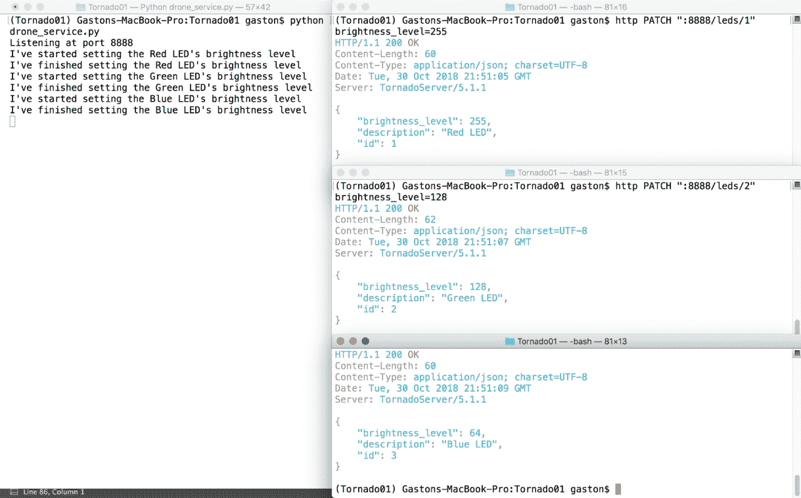

# 第十一章：使用 Tornado 处理异步代码、测试和部署 API

在本章中，我们将利用 Tornado 5.1.1 的非阻塞特性以及异步操作，在上一章中构建的新版本的 API 中。我们将配置、编写和执行单元测试，并学习一些与部署相关的内容。我们将执行以下操作：

+   理解同步和异步执行

+   使用异步代码

+   重新编写代码以利用异步装饰器

+   将 URL 模式映射到异步和非阻塞请求处理器

+   向 Tornado 非阻塞 API 发送 HTTP 请求

+   使用`pytest`设置单元测试

+   编写第一轮单元测试

+   使用`pytest`运行单元测试并检查测试...

# 理解同步和异步执行

在我们使用 Tornado 5.1.1 构建的当前版本的 RESTful API 中，每个 HTTP 请求都是阻塞的。因此，每当 Tornado HTTP 服务器收到一个 HTTP 请求时，它不会开始处理队列中的任何其他 HTTP 请求，直到收到第一个 HTTP 请求的响应。我们在请求处理器中编写的代码是以同步执行方式工作的，并且没有利用 Tornado 在异步执行中包含的非阻塞特性。

为了设置红色、绿色和蓝色 LED 的亮度级别，我们必须发出三个 HTTP `PATCH`请求。我们将发出这些请求以了解我们当前版本的 API 如何处理三个传入的请求。

确保 Tornado 5.1.1 开发服务器正在运行。在 macOS 或 Linux 中打开三个额外的终端，或在 Windows 中打开命令提示符或 Windows PowerShell 窗口。在每个窗口中激活我们为使用 Tornado 构建的 RESTful API 所工作的虚拟环境。我们将在三个窗口中运行命令。

在第一个窗口中写下以下命令。该命令将组合并发送一个 HTTP `PATCH`请求，将红色 LED 的亮度级别设置为`255`。在第一个窗口中写下这一行，但不要按*Enter*键，因为我们将在三个窗口中几乎同时尝试启动三个命令。示例的代码文件包含在`restful_python_2_11_01`文件夹中，在`Tornado01/cmd/cmd1201.txt`文件中：

```py
    http PATCH ":8888/leds/1" brightness_level=255
```

以下是对应的`curl`命令。示例的代码文件包含在`restful_python_2_11_01`文件夹中，在`Tornado01/cmd/cmd1202.txt`文件中：

```py
 curl -iX PATCH -H "Content-Type: application/json" -d '{"brightness_level":255}' "localhost:8888/leds/1"
```

现在，转到第二个窗口，写下以下命令。该命令将组合并发送一个 HTTP `PATCH`请求，将绿色 LED 的亮度级别设置为`128`。在第二个窗口中写下这一行，但不要按*Enter*键，因为我们将在三个窗口中几乎同时尝试启动两个命令。示例的代码文件包含在`restful_python_2_11_01`文件夹中，在`Tornado01/cmd/cmd1203.txt`文件中：

```py
    http PATCH ":8888/leds/2" brightness_level=128
```

以下是对应的 `curl` 命令。示例的代码文件包含在 `restful_python_2_11_01` 文件夹中，位于 `Tornado01/cmd/cmd1204.txt` 文件中：

```py
 curl -iX PATCH -H "Content-Type: application/json" -d '{"brightness_level":128}' "localhost:8888/leds/2"
```

现在，转到第三个窗口并输入以下命令。该命令将组合并发送一个 HTTP `PATCH` 请求来设置蓝色 LED 的亮度级别为 `64`。在第三个窗口中写下这一行，但不要按 *Enter* 键，因为我们将在三个窗口中几乎同时尝试启动两个命令。示例的代码文件包含在 `restful_python_2_11_01` 文件夹中，位于 `Tornado01/cmd/cmd1205.txt` 文件中：

```py
    http PATCH ":8888/leds/3" brightness_level=64
```

以下是对应的 `curl` 命令。示例的代码文件包含在 `restful_python_2_11_01` 文件夹中，位于 `Tornado01/cmd/cmd1206.txt` 文件中：

```py
 curl -iX PATCH -H "Content-Type: application/json" -d '{"brightness_level":64}' "localhost:8888/leds/3"
```

现在，转到每个窗口，从第一个到第三个，并在每个窗口中快速按下 *Enter* 键。你将在运行 Tornado HTTP 服务器的窗口中看到以下几秒钟的行：

```py
    I've started setting the Red LED's brightness level
```

几秒钟后，你将看到以下几行，它们显示了执行描述代码完成时以及开始设置 LED 亮度级别的打印语句的结果：

```py
    I've started setting the Red LED's brightness level
    I've finished setting the Red LED's brightness level
    I've started setting the Green LED's brightness level
    I've finished setting the Green LED's brightness level
    I've started setting the Blue LED's brightness level
    I've finished setting the Blue LED's brightness level
```

在服务器能够处理更改绿色 LED 亮度级别的 HTTP 请求之前，必须等待更改红色 LED 亮度级别的请求完成。更改蓝色 LED 亮度级别的 HTTP 请求必须等待其他两个请求首先完成它们的执行。

以下截图显示了 macOS 上的四个终端窗口。左侧的窗口正在运行 Tornado 5.1.1 HTTP 服务器，并显示处理 HTTP 请求的方法中打印的消息。右侧的三个窗口运行 `http` 命令以生成更改红色、绿色和蓝色 LED 亮度级别的 HTTP `PATCH` 请求。在编写和发送 HTTP 请求时使用类似的配置来检查输出是一个好主意，这样我们就可以理解当前 API 版本中同步执行的工作方式：



记住，我们在请求处理类中编写的不同方法最终都会调用 `time.sleep` 来模拟操作执行所需的时间。

# 重构代码以利用异步装饰器

由于每个操作都需要一些时间并且会阻止处理其他传入的 HTTP 请求，我们将创建这个 API 的新版本，它将使用异步执行，我们将了解 Tornado 非阻塞特性的优势。这样，在另一个请求更改绿色 LED 亮度级别的同时，就可以更改红色 LED 的亮度级别。Tornado 将能够在 I/O 操作与无人机完成一些时间后开始处理请求。

确保您已退出 Tornado HTTP 服务器。您只需在运行它的终端或命令提示符窗口中按 *Ctrl* + *C* 即可。

Tornado 5.1.1 提供 ...

# 将 URL 模式映射到异步请求处理器

保持处于虚拟环境根目录下的 `async_drone_service.py` 文件中（`Tornado01`）。添加以下行以将 URL 模式映射到我们之前编写的 `RequestHandler` 超类子类，这些子类为我们提供了异步方法。以下行创建应用程序的主入口点，用 API 的 URL 模式初始化它，并开始监听请求。与同步版本相比，以下行是新的或已编辑的，已突出显示。示例代码文件位于 `restful_python_2_11_01` 文件夹中的 `Django01/async_drone_service.py` 文件：

```py
class Application(web.Application): 
    def __init__(self, **kwargs): 
        handlers = [ 
            (r"/hexacopters/([0-9]+)", AsyncHexacopterHandler), 
            (r"/leds/([0-9]+)", AsyncLedHandler), 
            (r"/altimeters/([0-9]+)", AsyncAltimeterHandler), 
        ] 
        super(Application, self).__init__(handlers, **kwargs) 

if __name__ == "__main__": 
    application = Application() 
    port = 8888 
    print("Listening at port {0}".format(port)) 
    application.listen(port) 
    tornado_ioloop = ioloop.IOLoop.instance() 
    periodic_callback = ioloop.PeriodicCallback(lambda: None, 500) 
    periodic_callback.start() 
    tornado_ioloop.start() 
```

代码创建了一个名为 `application` 的 `tornado.web.Application` 实例，其中包含构成 Web 应用程序的请求处理器集合。我们只是将处理器的名称更改为具有 `Async` 前缀的新名称。

# 向 Tornado 非阻塞 API 发送 HTTP 请求

现在，我们可以运行 `drone_service.py` 脚本，该脚本启动 Tornado 5.1.1 开发服务器，为我们的新版本 Web API 启动，该 API 使用 Tornado 的非阻塞特性，并结合异步执行。确保 `drone_service.py` 脚本不再运行。执行以下命令：

```py
    python async_drone_service.py
```

以下行显示了执行上一条命令后的输出。Tornado HTTP 开发服务器正在端口 `8888` 监听：

```py
    Listening at port 8888
```

在我们 API 的新版本中，每个 HTTP 请求都是非阻塞的。因此，每当 Tornado HTTP 服务器收到 HTTP 请求并执行异步调用时，它就能够开始 ...

# 使用 pytest 设置单元测试

确保您已退出 Django 开发服务器。您只需在运行它的终端或命令提示符窗口中按 *Ctrl* + *C* 即可。

现在，我们将安装许多附加包，以便能够轻松运行测试并测量它们的代码覆盖率。确保您已激活我们在上一章中创建的虚拟环境，名为 `Tornado01`。激活虚拟环境后，是时候运行许多命令了，这些命令对 macOS、Linux 和 Windows 都相同。

现在，我们将编辑现有的 `requirements.txt` 文件，以指定我们的应用程序在任意支持平台上需要安装的附加包。这样，在任意新的虚拟环境中重复安装指定包及其版本将变得极其容易。

使用您喜欢的编辑器编辑虚拟环境根目录内现有的名为 `requirements.txt` 的文本文件。在最后一行之后添加以下行以声明我们所需的额外包。示例的代码文件包含在 `restful_python_2_11_01` 文件夹中，在 `Tornado01/requirements.txt` 文件中：

```py
pytest==3.9.3 
coverage==4.5.1 
pytest-cov==2.6.0 
pytest-tornasync==0.5.0 
```

添加到 `requirements.txt` 文件中的每一行额外内容都指示需要安装的包和版本。

以下表格总结了我们作为额外要求指定的之前包含的包及其版本号：

| 包名 | 要安装的版本 |
| --- | --- |
| `pytest` | 4.0.2 |
| `coverage` | 4.5.2 |
| `pytest-cov` | 2.6.0 |
| `pytest-tornasync` | 0.5.0 |

我们将在我们的虚拟环境中安装以下 Python 包：

+   `pytest`：这是一个非常流行的 Python 单元测试框架，它使测试变得简单，并减少了样板代码。

+   `coverage`：这个工具测量 Python 程序的代码覆盖率，我们将使用它来确定哪些代码部分被单元测试执行，哪些部分没有。

+   `pytest-cov`：这个针对 `pytest` 的插件使得使用底层的 `coverage` 工具生成覆盖率报告变得容易，并提供了一些额外的功能。

+   `pytest-tornasync`：这个针对 `pytest` 的插件提供了固定装置，使得使用 `pytest` 测试 Tornado 异步代码变得更加容易。

现在，我们必须在 macOS、Linux 或 Windows 上运行以下命令，使用 `pip` 安装之前表格中概述的额外包及其版本，使用最近编辑的 `requirements.txt` 文件。在运行命令之前，请确保您位于包含 `requirements.txt` 文件的文件夹中：

```py
pip install -r requirements.txt 
```

输出的最后几行将指示所有新包及其依赖项是否已成功安装。如果您下载了示例的源代码，并且没有使用之前的 API 版本，`pip` 还将安装 `requirements.txt` 文件中包含的其他包：

```py
Installing collected packages: pytest, coverage, pytest-cov, pytest-tornasync
Successfully installed coverage-4.5.2 pytest-4.0.2 pytest-cov-2.6.0 pytest-tornasync-0.5.0

```

在虚拟环境（`Tornado01`）的根目录下创建一个新的 `setup.cfg` 文件。以下行显示了指定 `pytest` 和 `coverage` 工具所需配置的代码。示例的代码文件包含在 `restful_python_2_11_01` 文件夹中，在 `Tornado01/setup.cfg` 文件中：

```py
[tool:pytest] 
testpaths = tests.py 

[coverage:run] 
branch = True 
source =  
    drone 
    async_drone_service 
```

`tool:pytest` 部分指定了 `pytest` 的配置。`testpaths` 设置将 `tests.py` 的值分配给指示测试位于 `tests.py` 文件中。

`coverage:run` 部分指定了 `coverage` 工具的配置。`branch` 设置设置为 `True` 以启用除了默认语句覆盖率之外的分支覆盖率测量。`source` 设置指定了我们希望考虑进行覆盖率测量的模块。我们只想包括 `drone` 和 `async_drone_service` 模块。

在这种情况下，我们不会为每个环境使用配置文件。然而，在更复杂的应用程序中，你肯定会想使用配置文件。

# 编写第一轮单元测试

现在，我们将编写第一轮单元测试。具体来说，我们将编写与 LED 资源相关的单元测试。测试固定装置提供了一个固定的基线，使我们能够可靠地重复执行测试。Pytest 通过使用`@pytest.fixture`装饰器标记函数，使我们能够轻松地声明测试固定装置函数。然后，每当我们在测试函数声明中使用固定装置函数名称作为参数时，`pytest`将使固定装置函数提供固定装置对象。

`pytest-tornasync`插件为我们提供了许多固定装置，我们将使用这些固定装置轻松编写我们的 Tornado API 测试。为了与该插件一起工作，我们必须声明一个名为`app`的固定装置函数，该函数返回一个`tornado.web.Application ...`

# 提高测试覆盖率

现在，我们将编写额外的单元测试以提高测试覆盖率。具体来说，我们将编写与六旋翼飞行器电机和高度计相关的单元测试。

打开虚拟环境根文件夹（`Tornado01`）中的`tests.py`文件。在最后一行之后插入以下行。示例代码文件包含在`restful_python_2_11_02`文件夹中的`Django01/tests.py`文件：

```py
async def 
test_set_and_get_hexacopter_motor_speed(http_server_client): 
    """ 
    Ensure we can set and get the hexacopter's motor speed 
    """ 
    patch_args = {'motor_speed_in_rpm': 200} 
    patch_response = await http_server_client.fetch( 
        '/hexacopters/1',  
        method='PATCH',  
        body=json.dumps(patch_args)) 
    assert patch_response.code == HTTPStatus.OK 
    get_response = await http_server_client.fetch( 
        '/hexacopters/1', 
        method='GET') 
    assert get_response.code == HTTPStatus.OK 
    get_response_data = escape.json_decode(get_response.body) 
    assert 'motor_speed_in_rpm' in get_response_data.keys() 
    assert 'is_turned_on' in get_response_data.keys() 
    assert get_response_data['motor_speed_in_rpm'] == patch_args['motor_speed_in_rpm'] 
    assert get_response_data['is_turned_on'] 

async def 
test_get_altimeter_altitude_in_feet(http_server_client): 
    """ 
    Ensure we can get the altimeter's altitude in feet 
    """ 
    get_response = await http_server_client.fetch( 
        '/altimeters/1', 
        method='GET') 
    assert get_response.code == HTTPStatus.OK 
    get_response_data = escape.json_decode(get_response.body) 
    assert 'altitude' in get_response_data.keys() 
    assert 'unit' in get_response_data.keys() 
    assert get_response_data['altitude'] >= 0 
    assert get_response_data['altitude'] <= 3000 
    assert get_response_data['unit'] == 'feet' 

async def 
test_get_altimeter_altitude_in_meters(http_server_client): 
    """ 
    Ensure we can get the altimeter's altitude in meters 
    """ 
    get_response = await http_server_client.fetch( 
        '/altimeters/1?unit=meters', 
        method='GET') 
    assert get_response.code == HTTPStatus.OK 
    get_response_data = escape.json_decode(get_response.body) 
    assert 'altitude' in get_response_data.keys() 
    assert 'unit' in get_response_data.keys() 
    assert get_response_data['altitude'] >= 0 
    assert get_response_data['altitude'] <= 914.4 
    assert get_response_data['unit'] == 'meters'
```

之前添加了以下三个测试函数，它们的名称以`test_`前缀开头，并接收`http_server_client`参数以使用此测试固定装置：

+   `test_set_and_get_hexacopter_motor_speed`：此测试函数测试我们是否可以设置和获取六旋翼飞行器的电机速度

+   `test_get_altimeter_altitude_in_feet`：此测试函数测试我们是否可以从高度计检索以英尺为单位的高度值

+   `test_get_altimeter_altitude_in_meters`：此测试函数测试我们是否可以从高度计检索以米为单位的高度值

我们仅编写了一些与六旋翼飞行器和高度计相关的测试，以提高测试覆盖率并记录对测试覆盖率报告的影响。

现在，我们将使用`pytest`命令运行测试并测量它们的代码覆盖率。确保你在激活了虚拟环境的终端或命令提示符窗口中运行此命令，并且你位于其根文件夹（`Tornado01`）内。运行以下命令：

```py
    pytest --cov -s
```

以下行显示了示例输出：

```py
================================================ test session starts =================================================
platform darwin -- Python 3.7.1 pytest-4.0.2, py-1.7.0, pluggy-0.8.0 -- /Users/gaston/HillarPythonREST2/Tornado01/bin/python3
cachedir: .pytest_cache
rootdir: /Users/gaston/HillarPythonREST2/Tornado01, inifile: 
setup.cfg
plugins: tornasync-0.5.0, cov-2.6.0
collected 4 items 

tests.py::test_set_and_get_leds_brightness_levels PASSED                                                       [ 25%]
tests.py::test_set_and_get_hexacopter_motor_speed PASSED                                                       [ 50%]
tests.py::test_get_altimeter_altitude_in_feet PASSED                                                           [ 75%]
tests.py::test_get_altimeter_altitude_in_meters PASSED                                                         [100%]

 ---------- coverage: platform darwin, python 3.7.1-final-0 -----------
    Name                     Stmts   Miss Branch BrPart  Cover
    ----------------------------------------------------------
    async_drone_service.py     142     41     20      8    69%
    drone.py                    63     10     10      5    79%
    ----------------------------------------------------------
    TOTAL                      205     51     30     13    72%
```

输出提供了详细信息，表明测试运行器执行了四个测试，并且所有测试都通过了。由 `coverage` 包提供的测试代码覆盖率测量报告将 `async_drone_service.py` 模块的 `Cover` 百分比从 40% 提高到 69%。此外，`drone.py` 模块的 `Cover` 百分比从上一次运行的 59% 提高到 79%。我们编写的新测试在多个模块中执行了额外的代码，因此在覆盖率报告中产生了重要影响。总覆盖率从 46% 提高到 72%。

如果我们查看缺失的语句，我们会注意到我们没有测试验证失败的场景。现在，我们将编写额外的单元测试来进一步提高测试覆盖率。具体来说，我们将编写单元测试以确保我们无法为 LED 设置无效的亮度级别，无法为六旋翼机设置无效的电机速度，并且在尝试访问不存在的资源时，我们会收到 HTTP `404 Not Found` 状态码。

打开虚拟环境（`Tornado01`）根目录下的 `tests.py` 文件。在最后一行之后插入以下行。示例代码文件包含在 `restful_python_2_11_03` 文件夹中，在 `Django01/tests.py` 文件中：

```py
async def test_set_invalid_brightness_level(http_server_client): 
    """ 
    Ensure we cannot set an invalid brightness level for a LED 
    """ 
    patch_args_led_1 = {'brightness_level': 256} 
    try: 
        patch_response_led_1 = await http_server_client.fetch( 
            '/leds/1',  
            method='PATCH',  
            body=json.dumps(patch_args_led_1)) 
    except HTTPClientError as err: 
        assert err.code == HTTPStatus.BAD_REQUEST 
    patch_args_led_2 = {'brightness_level': -256} 
    try: 
        patch_response_led_2 = await http_server_client.fetch( 
            '/leds/2',  
            method='PATCH',  
            body=json.dumps(patch_args_led_2)) 
    except HTTPClientError as err: 
        assert err.code == HTTPStatus.BAD_REQUEST 
    patch_args_led_3 = {'brightness_level': 512} 
    try: 
        patch_response_led_3 = await http_server_client.fetch( 
            '/leds/3',  
            method='PATCH',  
            body=json.dumps(patch_args_led_3)) 
    except HTTPClientError as err: 
        assert err.code == HTTPStatus.BAD_REQUEST 

async def 
test_set_brightness_level_invalid_led_id(http_server_client): 
    """ 
    Ensure we cannot set the brightness level for an invalid LED id 
    """ 
    patch_args_led_1 = {'brightness_level': 128} 
    try: 
        patch_response_led_1 = await http_server_client.fetch( 
            '/leds/100',  
            method='PATCH',  
            body=json.dumps(patch_args_led_1)) 
    except HTTPClientError as err: 
        assert err.code == HTTPStatus.NOT_FOUND 

async def 
test_get_brightness_level_invalid_led_id(http_server_client): 
    """ 
    Ensure we cannot get the brightness level for an invalid LED id 
    """ 
    try: 
        patch_response_led_1 = await http_server_client.fetch( 
            '/leds/100',  
            method='GET') 
    except HTTPClientError as err: 
        assert err.code == HTTPStatus.NOT_FOUND
```

之前的代码添加了以下三个测试函数，它们的名称以 `test_` 前缀开头，并接收 `http_server_client` 参数以使用此测试固定装置：

+   `test_set_invalid_brightness_level`：这个测试函数确保我们无法通过 HTTP `PATCH` 请求为 LED 设置无效的亮度级别。在这个方法中，许多 `try...except` 块捕获 `HTTPClientError` 异常作为 `err` 并使用 `assert` 确保异常的 `err.code` 属性与 `HTTPStatus.BAD_REQUEST` 匹配。这样，测试确保每个 HTTP `PATCH` 请求都生成了 HTTP `400 Bad Request` 状态码。

+   `test_set_brightness_level_invalid_led_id`：这个测试函数确保我们无法通过 HTTP `PATCH` 请求设置无效 LED `id` 的亮度级别。

+   `test_get_brightness_level_invalid_led_id`：这个测试函数确保我们无法通过 HTTP `GET` 请求获取无效 LED `id` 的亮度级别。

在最后两种方法中，一个 `try...except` 块捕获了 `HTTPClientError` 异常作为 `err`。`except` 块使用 `assert` 确保异常的 `err.code` 属性与 `HTTPStatus.NOT_FOUND` 匹配。这样，测试确保了 HTTP `PATCH` 和 HTTP `GET` 请求生成了 HTTP `404 Not Found` 状态码。

当 HTTP 请求失败时，`http_server_client.fetch` 方法会抛出 `tornado.httpclient.HTTPClientError` 异常，状态码在实例的 `code` 属性中可用。

在虚拟环境（`Tornado01`）根目录下的 `tests.py` 文件中保持。在最后一行之后插入以下行。示例的代码文件包含在 `restful_python_2_11_03` 文件夹中的 `Django01/tests.py` 文件：

```py
async def test_set_invalid_motor_speed(http_server_client): 
    """ 
    Ensure we cannot set an invalid motor speed for the hexacopter 
    """ 
    patch_args_hexacopter_1 = {'motor_speed': 89000} 
    try: 
        patch_response_hexacopter_1 = await http_server_client.fetch( 
            '/hexacopters/1',  
            method='PATCH',  
            body=json.dumps(patch_args_hexacopter_1)) 
    except HTTPClientError as err: 
        assert err.code == HTTPStatus.BAD_REQUEST 
    patch_args_hexacopter_2 = {'motor_speed': -78600} 
    try: 
        patch_response_hexacopter_2 = await http_server_client.fetch( 
            '/hexacopters/1',  
            method='PATCH',  
            body=json.dumps(patch_args_hexacopter_2)) 
    except HTTPClientError as err: 
        assert err.code == HTTPStatus.BAD_REQUEST 
    patch_args_hexacopter_3 = {'motor_speed': 8900} 
    try: 
        patch_response_hexacopter_3 = await http_server_client.fetch( 
            '/hexacopters/1',  
            method='PATCH',  
            body=json.dumps(patch_args_hexacopter_3)) 
    except HTTPClientError as err: 
        assert err.code == HTTPStatus.BAD_REQUEST 

async def test_set_motor_speed_invalid_hexacopter_id(http_server_client): 
    """ 
    Ensure we cannot set the motor speed for an invalid hexacopter id 
    """ 
    patch_args_hexacopter_1 = {'motor_speed': 128} 
    try: 
        patch_response_hexacopter_1 = await http_server_client.fetch( 
            '/hexacopters/100',  
            method='PATCH',  
            body=json.dumps(patch_args_hexacopter_1)) 
    except HTTPClientError as err: 
        assert err.code == HTTPStatus.NOT_FOUND 

async def test_get_motor_speed_invalid_hexacopter_id(http_server_client): 
    """ 
    Ensure we cannot get the motor speed for an invalid hexacopter id 
    """ 
    try: 
        patch_response_hexacopter_1 = await http_server_client.fetch( 
            '/hexacopters/5',  
            method='GET') 
    except HTTPClientError as err: 
        assert err.code == HTTPStatus.NOT_FOUND 

async def test_get_altimeter_altitude_invalid_altimeter_id(http_server_clie
nt): 
    """ 
    Ensure we cannot get the altimeter's altitude for an invalid altimeter id 
    """ 
    try: 
        get_response = await http_server_client.fetch( 
            '/altimeters/5', 
            method='GET') 
    except HTTPClientError as err: 
        assert err.code == HTTPStatus.NOT_FOUND         
```

之前的代码添加了以下四个测试函数，它们的名称以 `test_` 前缀开头，并接收 `http_server_client` 参数以使用此测试固定装置：

+   `test_set_invalid_brightness_level`: 这个测试函数确保我们无法通过 HTTP `PATCH` 请求设置 LED 的无效亮度级别

+   `test_set_motor_speed_invalid_hexacopter_id`: 这个测试函数确保我们无法通过 HTTP `PATCH` 请求设置无效六旋翼飞行器的 `id` 的电机速度

+   `test_get_motor_speed_invalid_hexacopter_id`: 这个测试函数确保我们无法获取无效六旋翼飞行器的 `id` 的电机速度

+   `test_get_altimeter_altitude_invalid_altimeter_id`: 这个测试函数确保我们无法获取无效高度计 `id` 的高度值

我们编写了许多额外的测试，以确保所有验证都能按预期工作。现在，我们将再次使用 `pytest` 命令来运行测试并测量它们的代码覆盖率。确保你在激活了虚拟环境的终端或命令提示符窗口中运行此命令，并且你位于其根目录（`Tornado01`）内。运行以下命令：

```py
    pytest --cov -v
```

以下行显示了示例输出：

```py
================================================ test session starts =================================================
platform darwin -- Python 3.7.1, pytest-4.0.2, py-1.7.0, pluggy-0.8.0 -- /Users/gaston/HillarPythonREST2/Tornado01/bin/python3
cachedir: .pytest_cache
rootdir: /Users/gaston/HillarPythonREST2/Tornado01, inifile: 
setup.cfg
plugins: tornasync-0.5.0, cov-2.6.0
collected 11 items 

tests.py::test_set_and_get_leds_brightness_levels PASSED                                                       [  9%]
tests.py::test_set_and_get_hexacopter_motor_speed PASSED                                                       [ 18%]
tests.py::test_get_altimeter_altitude_in_feet PASSED                                                           [ 27%]
tests.py::test_get_altimeter_altitude_in_meters PASSED                                                         [ 36%]
tests.py::test_set_invalid_brightness_level PASSED                                                             [ 45%]
tests.py::test_set_brightness_level_invalid_led_id PASSED                                                      [ 54%]
tests.py::test_get_brightness_level_invalid_led_id PASSED                                                      [ 63%]
tests.py::test_set_invalid_motor_speed PASSED                                                                  [ 72%]
tests.py::test_set_motor_speed_invalid_hexacopter_id PASSED                                                    [ 81%]
tests.py::test_get_motor_speed_invalid_hexacopter_id PASSED                                                    [ 90%]
tests.py::test_get_altimeter_altitude_invalid_altimeter_id PASSED                                              [100%]

------------ coverage: platform darwin, python 3.7.1-final-0 -----------
    Name                     Stmts   Miss Branch BrPart  Cover
    ----------------------------------------------------------
    async_drone_service.py     142     17     20      2    87%
    drone.py                    63      8     10      3    85%
    ----------------------------------------------------------
    TOTAL                      205     25     30      5    86%

```

提供的输出详细说明了测试运行器执行了 `11` 个测试，并且所有测试都通过了。由 `coverage` 包提供的测试代码覆盖率测量报告将 `async_drone_service.py` 模块的 `Cover` 百分比从 69% 提高到 87%。此外，`drone.py` 模块的 `Cover` 百分比从上一次运行的 79% 提高到 85%。我们编写的新测试在多个模块中执行了额外的代码，因此在覆盖率报告中产生了重要影响。总覆盖率从 72% 提高到 86%。

# 理解将 Tornado API 部署到云的策略

Tornado 提供了自己的 HTTP 服务器，因此它可以不使用 WSGI 容器运行。然而，一些云提供商，如 Google App Engine，仅允许在 WSGI 环境中运行 Tornado。当 Tornado 在 WSGI 环境中运行时，它不支持异步操作。因此，在选择我们的云平台时，我们必须考虑到这个重要的限制。

我们必须确保在生产环境中 API 在 HTTPS 下运行。此外，我们还需要确保添加一些身份验证和限流策略。我们的 Tornado 示例是一个简单的 RESTful API，它提供了一些我们可以用作基准来生成更 ...

# 测试你的知识

让我们看看你是否能正确回答以下问题：

1.  `Future` 做了以下哪一项？

    1.  封装可调用的异步执行

    1.  封装可调用的同步执行

    1.  在作为参数指定的执行器上同步运行异步方法

1.  `concurrent.futures.ThreadPoolExecutor`类为我们提供了以下哪个功能？

    1.  同步执行调用的高级接口

    1.  异步执行调用的高级接口

    1.  组合 HTTP 请求的高级接口

1.  `@tornado.concurrent.run_on_executor`装饰器允许我们做以下哪一项？

    1.  在执行器上同步运行异步方法

    1.  在执行器上运行异步方法而不生成`Future`

    1.  在执行器上异步运行同步方法

1.  在 Tornado 中编写异步代码的推荐方法是使用以下哪个？

    1.  协程

    1.  链式回调

    1.  子程序

1.  以下哪个由`pytest-tornasync pytest`插件定义的固定值提供了异步 HTTP 客户端用于测试？

    1.  `tornado_client`

    1.  `http_client`

    1.  `http_server_client`

1.  如果我们想将 JSON 响应体中的字节转换为 Python 字典，我们可以使用以下哪个函数？

    1.  `tornado.escape.json_decode`

    1.  `tornado.escape.byte_decode`

    1.  `tornado.escape.response_body_decode`

# 摘要

在本章中，我们了解了同步执行和异步执行之间的区别。我们创建了一个新的 RESTful API 版本，它利用了 Tornado 中的非阻塞特性，并结合了异步执行。我们提高了现有 API 的可扩展性，并使其在等待传感器和执行器的慢速 I/O 操作时能够开始执行其他请求。通过使用 Tornado 提供的基于`tornado.gen`生成器的接口来避免将我们的方法分割成多个带有回调的方法，这使得在异步环境中工作变得更加容易。

然后，我们设置了测试环境。我们安装了`pytest`以及许多插件，以便更容易地发现和执行单元测试 ...
