# 第一章：组装机器人

本章将为您提供关于本书内容所基于的移动机器人的各种实用组装指南。考虑到非常实用的方法，我们将深入探讨 GoPiGo3 的特点以及它为何是一个理想的机器人学习平台。

首先，我们将关注硬件，并讨论每个机器人所组成的组件，包括机械部件和嵌入式系统、传感器和电机。

在完成 GoPiGo3 组装部分后，您将获得手动技能，以便您可以开始操作机器人中的典型组件。您还将被推动采用在组装机器人时应用部分验证测试的系统化方法，也称为**单元测试**。

在本章的第一部分介绍了 GoPiGo3 机器人之后，我们将深入解释这些概念，包括嵌入式控制器、GoPiGo3 板和嵌入式计算机 Raspberry Pi。

接下来，我们将描述机器人将使用的传感器和执行器，我们将它们分为我们所说的**机电**。

最后，我们将为您提供一些有用的指南，以便组装机器人变得简单直接。然后，我们将使用易于启动的软件 DexterOS 测试 GoPiGo3 机器人。尽管我们将在本书的后面部分采用 Ubuntu 作为运行 ROS 的操作系统，但我们建议您从 DexterOS 开始，这样您可以在避免特定软件编程任务的同时熟悉硬件，这些任务将在后面的章节中留出。

在本章中，我们将涵盖以下主题：

+   理解 GoPiGo3 机器人

+   熟悉嵌入式硬件——GoPiGo3 板和 Raspberry Pi

+   深入了解机电——电机、传感器和 2D 摄像头

+   整合所有内容

+   在 DexterOS 下使用 Bloxter（可视化编程）进行硬件测试

# 理解 GoPiGo3 机器人

GoPiGo3 是由 Dexter Industries 制造的基于 Raspberry Pi 的机器人车。它旨在用作学习机器人技术和编程的教育套件，这两者都是互补的视角，清楚地表明了您应该获得的知识，以成为一名机器人工程师。我们将通过让 Modular Robotics 工程总监 Nicole Parrot 用自己的话来解释这一点来解释这意味着什么：

“GoPiGo 起源于 2014 年初的一次 Kickstarter 活动，当时 Raspberry Pi 还相对较新。最初的用户是爱好者，但很快教师和编程俱乐部志愿者开始将他们的 GoPiGo 分享给学生。这导致了对电路板的各种修改，以使其成为教室适用的机器人。它坚固耐用，功能齐全，并且仍然基于 Raspberry Pi！最新的版本自 2017 年以来一直存在，是一个稳定的平台。”

基于 Raspberry Pi 的机器人课堂中提供了许多优势。它可以使用多种编程语言进行编程，它可以在不使用蓝牙的情况下独立于学校 Wi-Fi，并且它可以直接在板上执行高级应用，如计算机视觉和数据收集。配备 DexterOS 的 GoPiGo 预装了所有科学库。配备 Raspbian for Robots 的 GoPiGo 允许用户安装项目所需的任何库和工具。它包含两个 Python 库：easygopigo3.py 和 gopigo3.py。这两个库都提供了对机器人的高级控制和低级控制，这取决于用户的技能水平。

GoPiGo 已经成为寻求简单、文档齐全的 Raspberry Pi 机器人的大学、研究人员和工程师的首选。

准备好深入机器人学了吗？让我们开始吧！

# 机器人学视角

从机器人学的角度来看，你将学习如何与基本部件协同工作：

+   **电机**，它允许机器人从一个点移动到另一个点。在 GoPiGo3 中，我们有内置编码器的直流电机，它们提供精确的运动。这是从 GoPiGo2 升级的主要改进之一，在那里编码器位于电机外部，并且不太准确。

+   **传感器**，它们从环境中获取信息，例如近物距离、亮度、加速度等。

+   **控制器**——即 GoPiGo3 红色主板——负责与传感器和执行器的物理接口。这是 GoPiGo3 与物理世界交互的实时组件。

+   一块**单板计算机**（**SBC**）Raspberry Pi 3B+，它提供处理能力。因此，它运行在一个操作系统下，通常是基于 Linux 的发行版，从软件角度来看提供了广泛的灵活性。

大多数教育套件仅停留在 3 级控制器；它们不包括 4 级单板计算机。控制器中的软件是一个小的程序（只有一个），它嵌入在板上。每次你想修改机器人的代码时，你必须完全替换现有的程序，并使用 USB 端口上的串行连接从外部计算机中刷新新版本。

这里的一个经典例子是 Arduino 控制的机器人。在这里，Arduino 板扮演着我们的 GoPiGo3 板的角色，如果你曾经使用过它，你一定会记得你需要如何通过 USB 线将新程序从笔记本电脑上的 Arduino IDE 传输到机器人。

# 编程视角

从编程的角度来看，GoPiGo3 允许你通过学习一个视觉编程语言 Bloxter（Google Blockly 的开源分支，专门为 GoPiGo3 开发）来轻松入门。当涉及到学习编写软件程序的基本概念时，这是一个非常舒适的先决条件。

但如果您正在阅读这本书，我们确信您已经知道如何使用许多可用的语言之一进行编程，即 C、C++、Java、JavaScript 或 Python。Dexter Industries 提供了各种开源库（[`github.com/DexterInd/GoPiGo3/tree/master/Software`](https://github.com/DexterInd/GoPiGo3/tree/master/Software)），您可以使用这些库来编程 GoPiGo3。以下是一些例子：

+   C

+   C#

+   Go

+   Java

+   Node.js（JavaScript）

+   Python

+   Scratch

无论如何，在本章的第一部分，我们鼓励您只使用 Bloxter 来强调机器人视角，并熟悉您手中的硬件。之后，您可以使用您选择的任何语言，因为有许多可用的 GoPiGo3**应用程序编程接口**（**API**）可供选择。

在这本书中，我们将重点关注 Python 作为 ROS（机器人操作系统）编程的主要语言。Python 语言易于学习，同时仍然非常强大，在机器人和计算机科学领域占主导地位。在阅读了第二章中的 Python 示例，“GoPiGo3 单元测试”之后，我们将开始学习**机器人操作系统**（**ROS**），它不是一个实际的编程语言，而是为机器人提供开发应用框架的开发应用程序。因此，我们将向您展示如何通过包装器来适应您的 Python 程序，以便它们也可以在 ROS 中作为构建高级功能的部分运行。

当您发现 GoPiGo3 的 Python 代码基础被 ROS 包装后，它能做更多的事情时，您将欣赏这种跳转到 ROS 的附加价值。这个软件升级为 GoPiGo3 提供了一个工具包，使学生、创造者和工程师能够理解机器人是如何工作的。此外，您应该知道 ROS 在专业环境中被广泛使用。

# 机器人套件和资源

从高层次来看，我们可以将机器人的硬件分为两组：

+   **机电学**：这指的是允许它与物理世界交互的传感器和执行器。

+   **嵌入式硬件**：允许它从传感器获取信号，将其转换为数字信号，并提供处理逻辑并向执行器发送命令的电子板。在这里，我们通常有两种类型的电子板：

    +   **控制器**，它作为与传感器和执行器的物理接口——即 GoPiGo3 板。控制器处理来自机电设备的模拟和数字信号，将它们转换为 CPU 可以处理的数字信号。

    +   **计算机**，它为我们提供了实现智能逻辑的手段。在大多数机器人中，这是一个 SBC（单板计算机）。在 GoPiGo3 的情况下，这是一个运行 Linux 操作系统发行版的 Raspberry Pi，例如 Raspbian 或 Ubuntu。

尽管您可以直接通过树莓派的**通用输入/输出**（**GPIO**）引脚将数字设备连接到树莓派，但从功能角度来看，最好通过控制器——即 GoPiGo3 板——将所有传感器和执行器进行接口——也就是说，保持与物理世界的接口在控制器层面，并在计算机层面进行处理和计算。

如果您是经常使用树莓派的用户并且拥有该板，您只需要购买 GoPiGo3 机器人基础套件（[`www.dexterindustries.com/product/gopigo3-robot-base-kit/`](https://www.dexterindustries.com/product/gopigo3-robot-base-kit/)）。该套件包括以下内容：

+   GoPiGo3 板（红色板）

+   底盘（框架、轮子、硬件）

+   电机

+   编码器

+   电源电池组和电缆

+   组装用的螺丝刀

以下图片展示了所有包含的部件：

），该套件包括树莓派 3 及其配件，以及一个配备伺服电机的可转向距离传感器，使其能够覆盖 180°的视野。此传感器套件由以下组成：

+   距离传感器（[`www.dexterindustries.com/product/distance-sensor/`](https://www.dexterindustries.com/product/distance-sensor/））

+   伺服包（[https://www.dexterindustries.com/product/servo-package/](https://www.dexterindustries.com/product/servo-package/））

以下图片展示了组装完成的初学者入门套件最终的外观。通过添加树莓派和可转向的距离传感器，使用机器人基础套件也能得到相同的结果：

)提供了控制器所期望的一般功能：

+   与传感器和执行器进行实时通信。

+   通过**串行外设接口**（**SPI**）进行**输入/输出**（**I/O**）接口，该接口将传感器的数据传输到 Raspberry Pi，并且也可能接收对执行器的命令（也来自 Raspberry Pi，在它的 CPU 中运行控制循环的每一步逻辑之后）。

+   在板上加载的单个程序称为固件。由于该软件的目标是在计算机实现逻辑的同时实现通信协议，因此除非你决定在可用新版本时升级它，否则不需要对其进行更改。

让我们简要解释一下我们在前面的项目符号列表中提到的输入/输出接口协议。SPI 是一个用于在微控制器和外部设备之间发送数据的总线，在我们的例子中是传感器。它使用独立的时钟和数据线，以及一个选择线来选择要与之通信的设备。生成时钟的连接端称为主设备，在我们的例子中是 Raspberry Pi，而另一端称为从设备，即 GoPiGo3 板。这样，两个板就同步了，比异步串行通信更快，后者是通用板（如 Arduino）中的典型通信协议。

你可以在[`learn.sparkfun.com/tutorials/serial-peripheral-interface-spi`](https://learn.sparkfun.com/tutorials/serial-peripheral-interface-spi)的简单教程中了解更多关于 SPI 协议的信息。通过 SPI 与 Raspberry Pi 进行通信是通过引脚接口进行的，这可以在以下图像的顶部部分看到。只需要 40 个 GPIO 引脚中的 5 个用于此类接口：

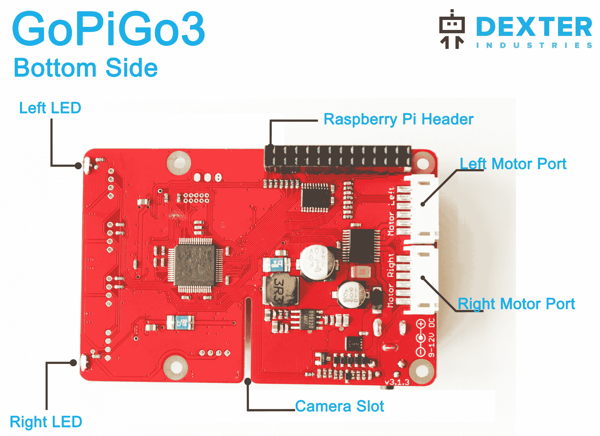

图片来源：Dexter Industries: https://32414320wji53mwwch1u68ce-wpengine.netdna-ssl.com/wp-content/uploads/2014/07/GoPiGo3-Bottom_annotated-600x441.jpg

为了与设备接口，该板提供了以下功能（板的俯视图可以在下一张图中看到）：

+   两个 I2C 端口——两个 Grove 端口通过电平转换芯片连接到 Raspberry Pi 的 I2C 总线

+   一个串行端口——一个 Grove 端口通过电平转换芯片连接到 Raspberry Pi 的串行引脚

+   两个模拟-数字端口——两个连接到 GoPiGo3 微控制器的 Grove 端口

+   两个 PWM 类型伺服电机的伺服端口：

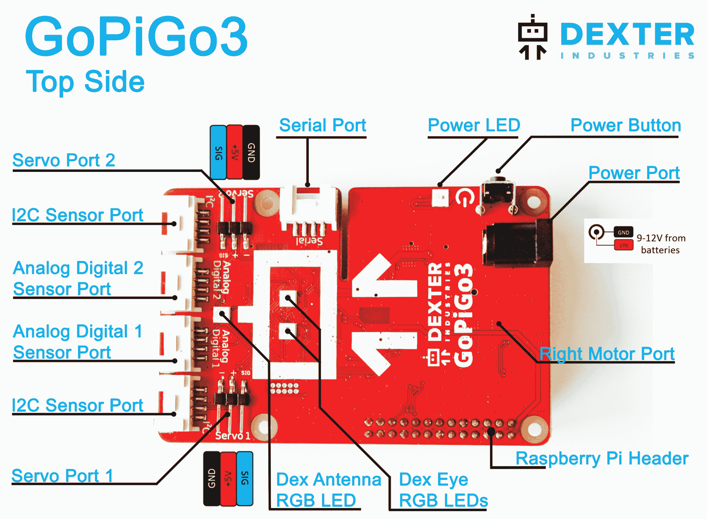

图片来源：Dexter Industries: https://32414320wji53mwwch1u68ce-wpengine.netdna-ssl.com/wp-content/uploads/2014/07/GoPiGo3-Top-768x565.jpg

让我们解释这些新概念：

+   **串行端口**：这是我们之前在讨论 SPI 时提到的互补通信协议。虽然后者是同步的（需要五个接口引脚），但串行端口是异步的——也就是说，没有时钟信号需要跟随，只需要两个引脚：**Tx**用于数据传输和**Rx**用于数据接收。在 GoPiGo3 中，此端口通过一个电平转换芯片直接连接到 Raspberry Pi 的串行引脚。

+   **I2C 端口**：正如其名称所示，它使用 I2C 通信协议。就像 SPI 一样，它是一个同步协议，比异步串行更快。I2C 使用两条线，**SDA**用于数据，**SCL**用于时钟信号。第三和第四条线是用于电源供应的：**VIN**为 5V 和**GND**接地——即 0V 参考。**SDA**是双向的，因此任何连接的设备都可以发送或接收数据。在这两个端口中，你将连接距离传感器和线跟随传感器。

+   **模拟-数字**：这些端口可以连接到模拟、数字或 I2C Grove 设备。我们将连接到一个模拟-数字端口，即 IMU 传感器。我们将在稍后详细讨论这一点。

+   **伺服端口，连接 PWM 伺服电机**：这些端口比配备编码器的电机便宜且易于控制，同时提供足够的精度来控制它们将支持的方位。在 GoPiGo3 中，我们可以将距离传感器或 Pi 摄像头连接到伺服电机。**脉冲宽度调制**（**PWM**）技术指的是通过改变电压供应的占空比来在连续范围内进行控制，从而产生从 0V 到 5V 的等效输出：0V 是 0%占空比，而 100%对应于在整个周期内施加 5V。通过在周期中应用低于 100%的百分比 5V，你可以获得对位置的连续控制，范围从 0 到 180°的电机轴旋转。有关此内容的解释和一些有用的图表，请访问[`www.jameco.com/jameco/workshop/howitworks/how-servo-motors-work.html`](https://www.jameco.com/jameco/workshop/howitworks/how-servo-motors-work.html)。

# Raspberry Pi 3B+

Raspberry Pi 在教育领域和工业领域都有最大的社区，这使得它成为开发机器人或**物联网**（**IoT**）设备嵌入式软件的最佳单板计算机选择。以下图像显示了 Raspberry Pi 3B+，这是为 GoPiGo3 供电的最常见型号：

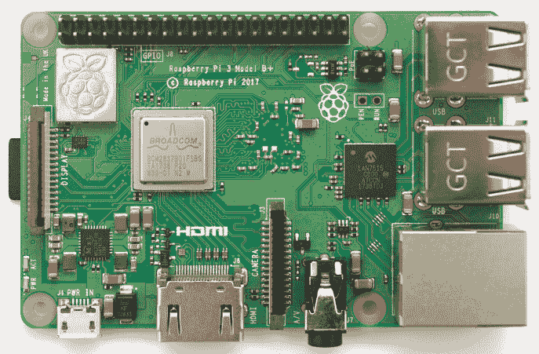

图片来源：https://en.wikipedia.org/wiki/File:Raspberry_Pi_3_B%2B_(39906369025).png, 许可证 CC BY-SA 2.0

Raspberry Pi 3B+ 的主要特性如下：

+   由四个 Cortex-A53 1.4 GHz 组成的 **中央处理单元**（**CPU**）。

+   **图形处理单元**（**GPU**）是 250 MHz 的 Broadcom VideoCore IV。

+   **同步动态随机存取存储器**（**SDRAM**）为 1 GB，与 GPU 共享。

+   板载存储通过 MicroSDHC 插槽提供。您可以选择任何适合您需求的 micro SD 卡大小。无论如何，一般建议使用 16 GB 容量的 10 级 micro SD 卡——10 表示它能够以 10 Mb/second 的速度写入。

让我们回顾一下这些组件的功能：

+   CPU 提供了运行各种算法的计算能力。这正是我们机器人智能所在之处。

+   GPU 的任务是处理计算机图形和图像处理。在我们的案例中，它将主要致力于处理 Pi 相机的图像并提供计算机视觉功能。

+   SDRAM 有 1 GB 易失性存储，与 GPU 共享，因此这是您分配给 GPU 的内存量（默认情况下，它最多占用 64 Mb）。RAM 是程序加载并执行的地方。

+   板载 microSD 卡是包含操作系统以及所有已安装软件的持久存储。

Raspberry Pi 运行操作系统，通常是基于 Linux 的发行版，如 Debian 或 Ubuntu。

虽然基于 Debian 的 Raspbian 是 Raspberry Pi 基金会的官方发行版，但我们将使用由 Canonical 支持的 Ubuntu，因为这是 Open Robotics ([`www.openrobotics.org`](https://www.openrobotics.org)) 每年提供 ROS 版本的平台，与 Ubuntu 的年度版本同步。

# 为什么机器人需要 CPU？

除了这本书的目标是让您获得一些 ROS 的实际操作经验——为此，您需要 Linux 操作系统来安装软件——如果您真的想创建一个智能机器人，您需要运行计算密集型算法的处理能力，这正是 Raspberry Pi 等 CPU 所提供的。

为什么这个计算是必要的？因为一个智能机器人必须将环境信息与当前任务的逻辑相结合，才能成功完成它。让我们以将一个物体从当前位置移动到目标位置为例。为此，激光距离传感器、3D 相机和/或 GPS 等设备为机器人提供环境信息。这些数据源必须结合起来，以便机器人能够在环境中定位自己。通过提供目标位置，它还必须计算将物体携带到那里的最佳路径，这被称为*路径规划*。在执行这样的路径规划时，它必须检测路径上可能出现的障碍物并避开它们，同时不失目标。因此，任务的每一步都涉及到在机器人的 CPU 中执行一个算法。

这就是您将学会使用 ROS 解决的大量实际场景之一，ROS 目前是机器人应用开发的*事实标准*。

# 深入了解机电一体化

如 GoPiGo 官方文档[`www.dexterindustries.com/GoPiGo/learning/technical-specifications-for-the-gopigo-raspberry-pi-robotics-kit/`](https://www.dexterindustries.com/GoPiGo/learning/technical-specifications-for-the-gopigo-raspberry-pi-robotics-kit/)所述，GoPiGo3 机器人的规格如下：

+   **工作电压**：7V-12V

+   **外部接口**：

    +   **I2C 端口**：两个连接到 Raspberry Pi I2C 总线的 Grove 端口，通过一个电平转换芯片

    +   **串行端口**：一个连接到 Raspberry Pi 串行引脚的 Grove 端口，通过一个电平转换芯片

    +   **模拟数字端口**：两个连接到 GoPiGo3 微控制器的 Grove 端口

+   **编码器**：两个每转六脉冲计数的磁性编码器（通过 120:1 的齿轮减速，每轮旋转总共 720 个脉冲）

+   **车轮直径**：66.5 毫米

+   **车轮间距**：117 毫米

+   **更多信息**：设计信息可在官方 GitHub 仓库[`github.com/DexterInd/GoPiGo3`](https://github.com/DexterInd/GoPiGo3)找到

这只是对我们之前在标题为*GoPiGo3 板*的章节中解释的内容的总结。在本节中，我们将专注于描述连接到 GoPiGo3 板的设备。

# 最有用的传感器

我们将要安装到 GoPiGo3 上的传感器是我们完成机器人顶级任务（即低成本的运动规划导航）所需的传感器。以下是一些传感器：

+   距离传感器

+   跟踪线

+   **惯性测量单元**（**IMU**）传感器

+   2D 相机

在使用循线传感器的情况下，由于机器人将跟随地板上标记的路径（通常是黑色），可以跳过运动规划部分，导航将变得容易得多。如果路径上有障碍物，你必须应用一个算法来绕过障碍物并返回路径——也就是说，将循线传感器再次放置在黑线上方。

现在，我们应该花时间了解每个传感器提供的信息。在这本书的后面部分，你将遇到这样的导航问题以及可以用来实现它的算法。

# 距离传感器

简单的距离传感器使我们能够测量其前方物体的距离。它有一个小激光器，用于测量到物体的距离。传感器使用飞行时间方法进行非常快速和精确的距离读取。产品页面可在[`www.dexterindustries.com/product/distance-sensor/`](https://www.dexterindustries.com/product/distance-sensor/)查看：

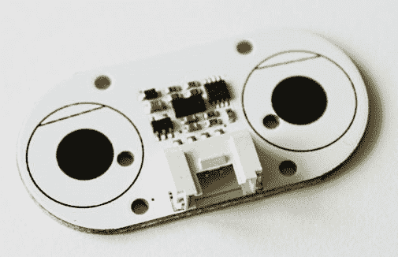

图片来源：Dexter Industries：https://shop.dexterindustries.com/media/catalog/product/cache/4/image/1800x2400/9df78eab33525d08d6e5fb8d27136e95/d/e/dexter-industries-raspberry-pi-robot-distance-sensor-for-robots-front-of-sensor-1.jpg

你可以将距离传感器连接到任意的两个 I2C 端口之一。请注意，GoPiGo3 软件库不会要求你指定使用哪个端口。这将被自动检测。

你可以将传感器安装到伺服包上，以扫描大约 180°的宽角度。伺服电机可以连接到伺服端口 1 或伺服端口 2。产品页面可在[`www.dexterindustries.com/product/servo-package/`](https://www.dexterindustries.com/product/servo-package/)查看：

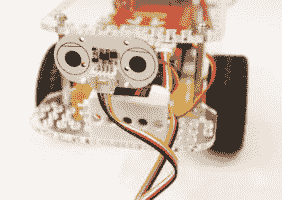

图片来源：Modular Robotics：https://www.dexterindustries.com/wp-content/uploads/2019/09/GoPiGo3-Molded-Servo-Frontal-300x200.jpg

在第二章“GoPiGo3 单元测试”中，有一个你可以用你的机器人运行的特定测试，以检查这个单元是否正常工作。

# 循线传感器

GoPiGo3 的循线传感器由六对 LED 光电晶体管组成。当你将传感器放在面前读取字母时，LED 发射器是每对中最右边的一部分。这可以在以下照片中看到，这是一张有电源的传感器的图片，尽管你此时还看不到 LED 的光束：

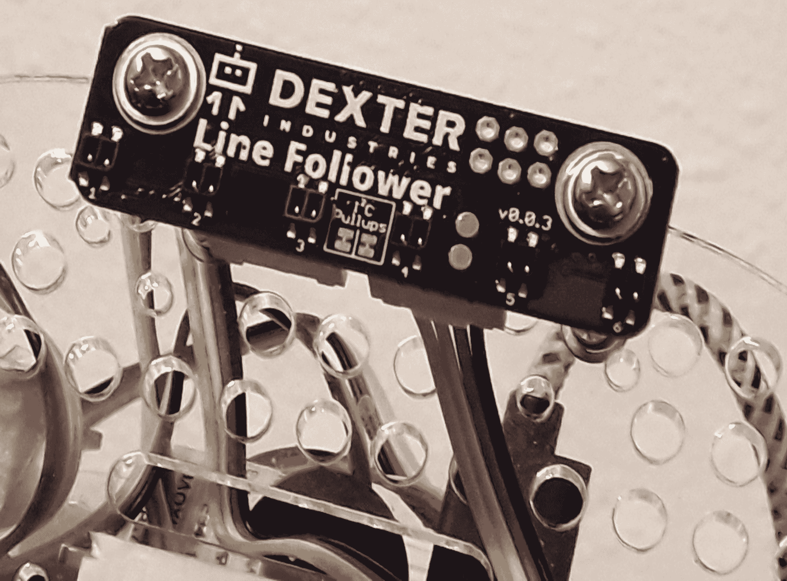

为什么在图片中看不到它们？因为 LED 发出红外光，人眼无法检测到；然而，手机摄像头可以揭示它（默认情况下，这些摄像头的光学系统不包括红外滤光片）。所以，如果您后来发现线跟踪器工作不正常，您必须首先检查硬件。为此，只需用智能手机的相机应用程序拍照即可。

在下面的图像中，传感器视图被有意模糊处理，以便您可以看到光线并确认光线是从 LED 光敏晶体管的右侧发出的。接收部分，即光敏晶体管，是检测是否有从 LED 发射器反射的光线的组件。该组件的产品页面可在[`www.dexterindustries.com/product/line-follower-sensor/`](https://www.dexterindustries.com/product/line-follower-sensor/)查看：

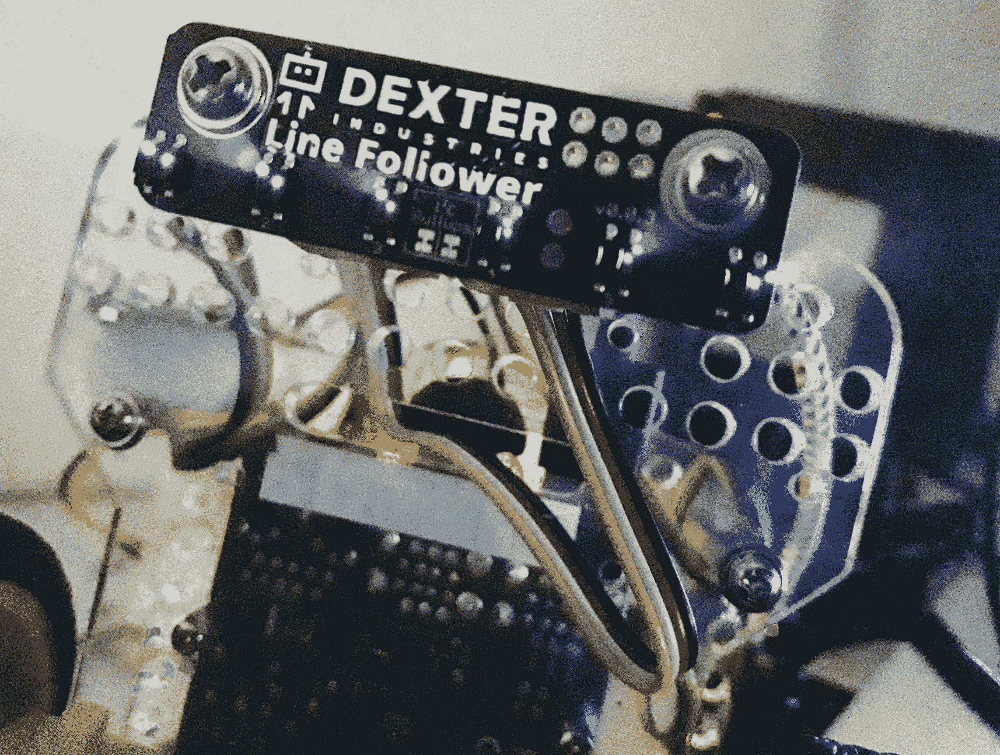

现在，您已经可以理解线跟踪传感器的原理了：

+   如果光线因为地板是白色的而反射，光敏晶体管就会接收到反射的光束，并在数据传感器流中提供这一信息。

+   如果传感器位于黑色表面上，光敏晶体管不会接收到任何反射光线，并让机器人知道。

反射会使传感器电子报告的信号接近 1（白色表面），而吸收则提供接近 0 的值（黑色表面）。但是，如果传感器离地板很远或者没有面向它呢？好吧，从传感器的角度来看，吸收等同于没有反射。因此，报告的信号接近零。这一特性使得 GoPiGo3 不仅能跟随地面上的黑色路径，还能沿着边缘行走，避免可能损坏机器人的凹坑。

由于您有六对，您将拥有六个信号，每个信号报告 0 或 1。这六个数字将使我们能够推断出机器人在黑色线上的中心位置有多好。传感器的规格如下：

+   带有 Grove 连接器的 I2C 传感器。

+   六个模拟传感器，每个传感器根据从地板接收到的光线量给出 0 到 1 之间的值，其中 0 表示黑色，1 表示白色。

+   传感器可以以高达 120 Hz 的频率轮询。

+   一个简单的库([`di-sensors.readthedocs.io/en/master/api-basic.html#easylinefollower`](https://di-sensors.readthedocs.io/en/master/api-basic.html#easylinefollower))和一个驱动级库([`di-sensors.readthedocs.io/en/master/api-advanced.html#linefollower`](https://di-sensors.readthedocs.io/en/master/api-advanced.html#linefollower))可用，并且完全有文档记录。简单的库提供了为您做繁重工作的方法。

以下是从发射器-接收器底部的视图。这个面必须比地板高出几毫米，以确保 LED 发射的正确反射：

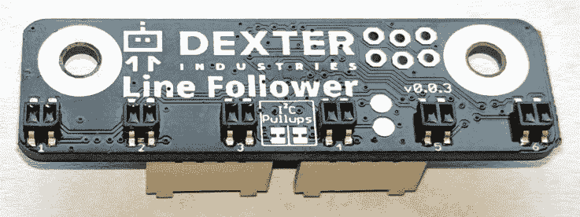

图片来源：Modular Robotics：https://shop.dexterindustries.com/media/catalog/product/cache/4/thumbnail/1800x2400/9df78eab33525d08d6e5fb8d27136e95/l/i/linefollower_bottom.jpg

以下图片显示了线跟踪传感器正确安装在 GoPiGo3 上——即在地板上方：

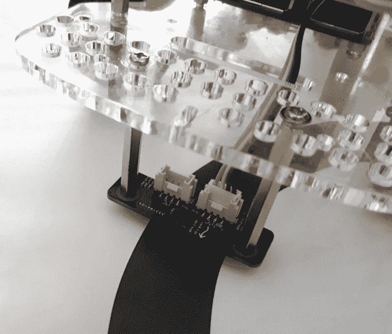

图片来源：Modular Robotics：http://www.dexterindustries.com/wp-content/uploads/2019/03/linefollowerinaction.jpg

有关如何组装和校准传感器的说明，请访问 [`www.dexterindustries.com/GoPiGo/line-follower-v2-black-board-getting-started/`](https://www.dexterindustries.com/GoPiGo/line-follower-v2-black-board-getting-started/)。对于连接，你可以使用线跟踪传感器上可用的两个 I2C 连接器中的任何一个。请记住，其中一个将被距离传感器使用。

如果你使用 Raspbian For Robots ([`www.dexterindustries.com/raspberry-pi-robot-software/`](https://www.dexterindustries.com/raspberry-pi-robot-software/))，线跟踪器也可以连接到 AD 端口之一。它适用于更高级的使用，并且为此配置编写的代码略有不同。

为了介绍机器人技术，我们将通过将传感器连接到 I2C 端口并使用更友好的 DexterOS ([`www.dexterindustries.com/dexteros/`](https://www.dexterindustries.com/dexteros/)) 来简化操作。在 第二章 *GoPiGo3 的单元测试* 中，我们将介绍你可以运行的具体测试，以检查该单元是否正常工作。

# IMU 传感器

IMU 传感器使我们能够测量机器人的方向，以及在其移动过程中获得其位置的估计。Dexter Industries IMU 的产品页面可以在 [`www.dexterindustries.com/product/imu-sensor/`](https://www.dexterindustries.com/product/imu-sensor/) 查看。传感器的相应方面可以在以下图片中看到：

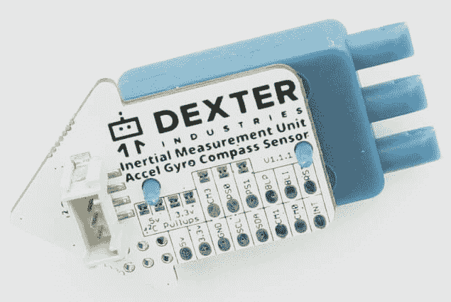

图片来源：Dexter Industries：https://shop.dexterindustries.com/media/catalog/product/cache/4/thumbnail/1800x2400/9df78eab33525d08d6e5fb8d27136e95/i/m/imu-sensor_mount2-800x800.jpg

在以下图片中，你可以看到它安装在 GoPiGo3 上。要连接到机器人，你只需将其插入 GoPiGo 板上的 AD1 或 AD2 即可：

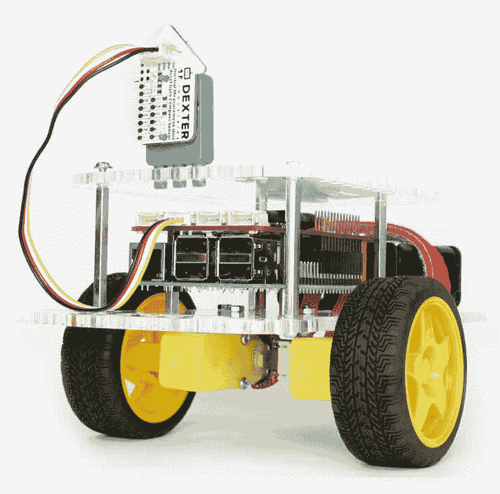

图片来源：Dexter Industries：https://shop.dexterindustries.com/media/catalog/product/cache/4/thumbnail/1800x2400/9df78eab33525d08d6e5fb8d27136e95/i/m/imu-sensor_gpg3_3.jpg

此 IMU 有九个 **自由度**（**DOF**），以及温度测量功能。让我们来谈谈 IMU 的每个传感器以及它们提供的数据类型：

+   让我们从更简单的一个开始，即温度。这提供了环境室温，可以与其它传感器结合使用，例如，通过在 GoPiGo3 覆盖的表面多个位置进行测量，创建一个房间的温度图。

+   加速度计是一个绝对传感器，因为它的值始终参照为零加速度（静止物体）。它为三个轴——*X*, *Y,* 和 *Z*——提供值：

    +   它适合测量机器人的倾斜度（一个余弦值为垂直加速度除以重力值=9.81 m/s²的角度）和自由落体状态，这相当于一个 90°的斜坡，是一个垂直墙面（传感器持续检测重力，即 9.81 m/s²，如果物体保持在水平面上）。

    +   加速度计在测量速度方面并不准确，因为传感器没有直接提供这个值。我们可以通过在时间上对加速度信号进行积分来获得它，这会产生累积误差（漂移），主要来自传感器噪声（电子）和测量误差本身。这就是陀螺仪发挥作用以提供准确速度测量的地方。

    +   陀螺仪是一个差分传感器，它相对于任意参考提供了三个旋转（*X*, *Y,* 和 *Z* 轴）。它们实际上提供的是旋转速度。这意味着它们在测量旋转速度方面很准确，但不适合测量角位置（你必须对速度信号进行时间积分，积累测量误差和传感器噪声，从而产生漂移）。

一个六自由度 IMU 将是一个结合了加速度计（三个自由度）和陀螺仪（三个自由度）的设备：

+   加速度计可以准确地测量相对于垂直的倾斜度。它在中等/长期测量中没有漂移，但短期测量不准确。

+   陀螺仪可以准确地测量旋转速度，但它们有漂移。这意味着它们不适合中等/长期测量。

通过结合加速度计和陀螺仪的六个值，可以获得一个改进的测量方向。这通过以下图中的欧拉角——*α, β, γ*——来表示：

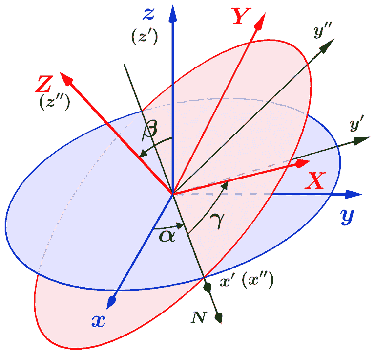

图片来源：https://commons.wikimedia.org/wiki/File:Euler_angles_zxz_int%2Baxes.png，许可协议 CC BY-SA 4.0

比欧拉角更常用的方法是 Tait-Bryan 版本或导航角，即偏航-俯仰-横滚角，其定义如下：

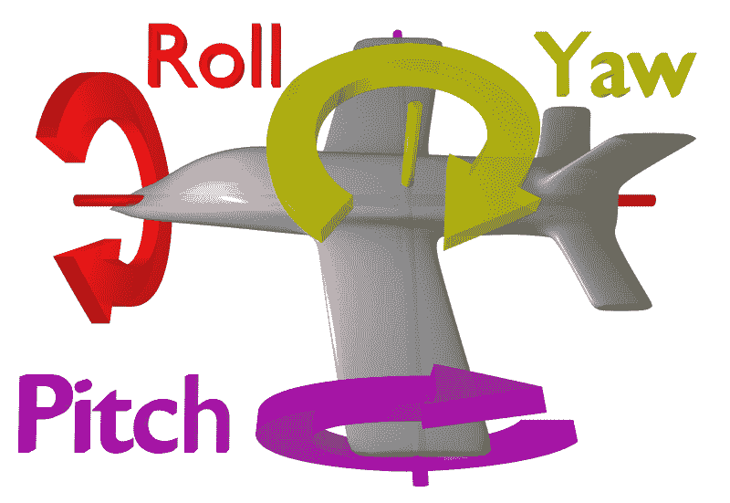

图片来源：https://es.m.wikipedia.org/wiki/Archivo:Flight_dynamics_with_text.png，许可协议 CC BY-SA 3.0

这些角度是通过应用一个特殊的滤波器，称为**互补滤波器**，到传感器的信号中获得的。它的工作原理如下：

+   对于加速度计的信号，它表现为低通滤波器，因为我们信任它的中/长期测量。

+   对于陀螺仪的信号，它表现为高通滤波器，因为我们信任它的短期测量。

从数学上讲，互补滤波器表示如下：

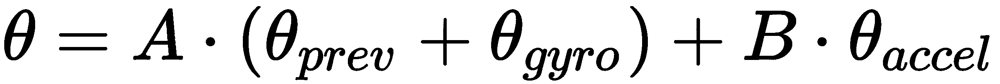

在这里，*A* 和 *B* 的和必须为 1。这些常数由传感器的校准确定，典型值包括 *A* = 0.98，*B* = 0.02。互补滤波器提供与卡尔曼滤波器非常相似的结果，卡尔曼滤波器是**最佳线性（无偏）估计器**（**BLE**），但计算量更大。

现在，我们有三个旋转（关于 *X*、*Y*、*Z* 轴），但它们还不是绝对角度：

+   多亏了加速度计，相对于垂直方向的姿态是一个绝对参考，但对于水平平面上的姿态，我们缺少这样的参考，因为陀螺仪是一个差分传感器。

+   这就是磁力计似乎给我们提供地球磁场（三个轴 *X*、*Y*、*Z*）的方向。

因此，使用我们的 6 + 3 = 9 个自由度 IMU，我们有了机器人的绝对姿态，以重力场和磁场矢量作为参考。在第二章，*GoPiGo3 的单元测试*中，我们将介绍你可以用你的机器人运行的一个特定测试来检查这个单元是否正常工作。

# Pi 相机

Pi 相机是一个定制的 2D 相机，具有**相机串行接口**（**CSI**）。下面的图像显示了两个物理组件——即相机的电子板和带状电缆：

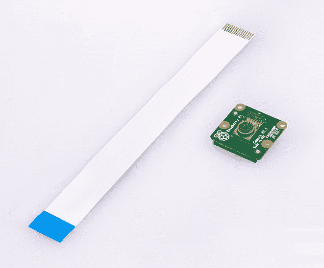

图片来源：https://commons.wikimedia.org/wiki/File:Raspberry_Pi_Camera_Module_v2_with_ribbon.jpg, 许可证 CC BY-SA 4.0

在下面的图像中，我们可以看到如何将带子连接到 Raspberry Pi 的 CSI 端口：

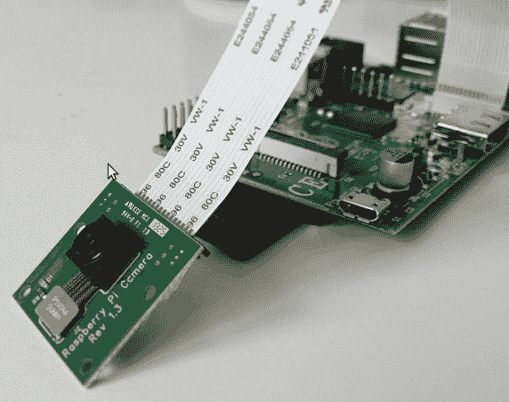

图片来源：https://www.flickr.com/photos/nez/9398354549/in/photostream by Andrew，许可证：CC BY-SA 2.0

Pi 相机能够提供高达 30 **帧每秒**（**FPS**）的 HD 分辨率（1920 x 1080 像素）。你可以在[`picamera.readthedocs.io/en/release-1.12/fov.html`](https://picamera.readthedocs.io/en/release-1.12/fov.html)的文档中找到可能的配置。在第二章，*GoPiGo3 的单元测试*中，我们将介绍你可以用你的机器人运行的一个特定测试来检查这个单元是否正常工作。

# 将所有这些放在一起

现在您已经熟悉了硬件，是时候将所有部件组装起来，连接它们，并进行快速测试以检查 GoPiGo3 是否正常工作。组装过程在官方文档中有详细的步骤说明，包括大量的图表和照片；您可以在[`www.dexterindustries.com/GoPiGo/get-started-with-the-gopigo3-raspberry-pi-robot/1-assemble-gopigo3/`](https://www.dexterindustries.com/GoPiGo/get-started-with-the-gopigo3-raspberry-pi-robot/1-assemble-gopigo3/)找到这份文档。

或者，您可以使用[`edu.workbencheducation.com/`](https://edu.workbencheducation.com/)上的 Workbench 培训环境，并免费注册一个个人账户，在注册进度的同时完成相同的组装过程。如果您这样做，请按照制造商官方文档中的两个组装阶段进行操作：

+   **GoPiGo3 组装阶段 1**：[`edu.workbencheducation.com/cwists/preview/26659-build-your-gopigo3-stage-1x`](https://edu.workbencheducation.com/cwists/preview/26659-build-your-gopigo3-stage-1x)

+   **GoPiGo3 组装阶段 2**：[`edu.workbencheducation.com/cwists/preview/26655-build-your-gopigo3-stage-2x`](https://edu.workbencheducation.com/cwists/preview/26655-build-your-gopigo3-stage-2x)

请注意，每个电机的电缆必须插入同一侧的连接器。如果您反方向操作，那么当您使用 GoPiGo3 API 库命令前进时，机器人会向后移动，反之亦然。如果您遇到这种情况，您只需交换连接器，使其正常工作。

要安装 Pi 相机，请按照[`www.dexterindustries.com/GoPiGo/get-started-with-the-gopigo3-raspberry-pi-robot/4-attach-the-camera-and-distance-sensor-to-the-raspberry-pi-robot`](https://www.dexterindustries.com/GoPiGo/get-started-with-the-gopigo3-raspberry-pi-robot/4-attach-the-camera-and-distance-sensor-to-the-raspberry-pi-robot/)上的说明进行。这些说明扩展了 Raspberry Pi 部分。

组装好基础套件后，您可以继续安装传感器：

+   对于循线传感器，您可以按照[`www.dexterindustries.com/GoPiGo/line-follower-v2-black-board-getting-started/`](https://www.dexterindustries.com/GoPiGo/line-follower-v2-black-board-getting-started/)上的说明进行操作。

+   要安装距离传感器，您可以观看[`www.youtube.com/watch?v=R7BlvxPCll4`](https://www.youtube.com/watch?v=R7BlvxPCll4)上的视频。这个视频展示了如何将 Pi 相机安装在 Sero 套件顶部，但您也可以安装距离传感器。

+   对于 IMU 传感器，将其插入一个模拟-数字 Grove 连接器（AD1 或 AD2）中，并确保其方向正确，如以下图片所示（参见*X*、*Y*和*Z*轴的方向）。

以下图片显示了连接了三个传感器的 GoPiGo3：

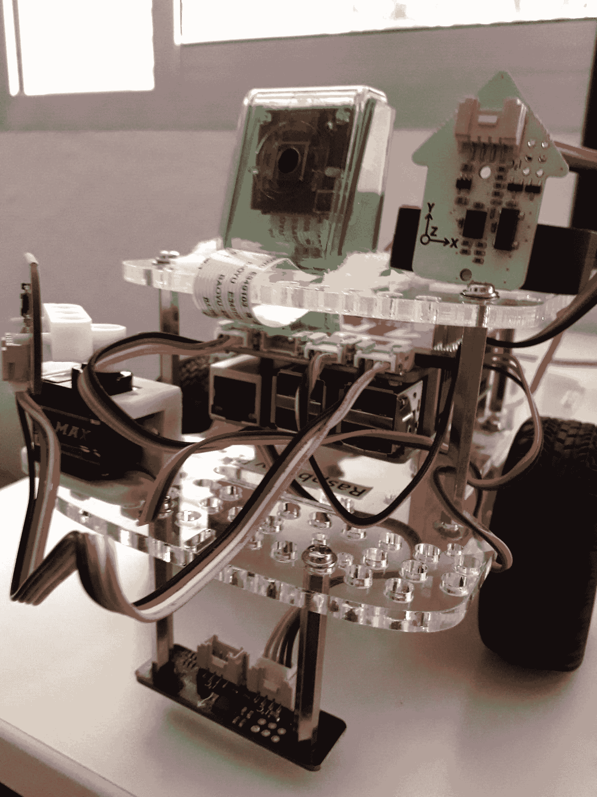

注意，IMU 传感器的*Z*轴应指向前方，*X*轴应指向左轮，因此*Y*轴应沿着垂直轴向上。当正确校准并放置在水平表面上时，两个角度，*俯仰*和*横滚*，将为零，如果*Z*指向磁南，*偏航*角度也将为零。

# 快速硬件测试

为了快速测试并专注于手头的硬件，我们将使用 DexterOS，这是 Dexter Industries 创建的基于 Raspbian 的发行版，允许用户快速开始。操作系统的详细信息可在[`www.dexterindustries.com/dexteros/`](https://www.dexterindustries.com/dexteros/)找到。Dexter Industries 通过提供一个简单的网络环境，简化了界面，无需处理完整的 Linux 桌面。

你可以通过连接到名为 GoPiGo 的 Wi-Fi 接入点来访问它（不需要密码）。这样，你将直接通过你的笔记本电脑连接到机器人。在安装之前，让我们回顾一下我们可用的资源。

# 资源

在与机器人一起工作时，你将至少管理以下三个网站/仓库：

+   在 GitHub 上托管由 Dexter Industries 提供的官方库。具体如下：

    +   **GoPiGo3 官方库**：[`github.com/DexterInd/GoPiGo3`](https://github.com/DexterInd/GoPiGo3)。这个仓库不仅包含多种语言的 API（Python、Scratch、C、JavaScript、Go 等），还包含示例和完整的项目，其中一些我们将在下一章中使用，以扩展到 ROS。

    +   **DI 传感器库**：[`github.com/DexterInd/DI_Sensors`](https://github.com/DexterInd/DI_Sensors)。这个仓库涵盖了 Dexter Industries 提供的所有传感器，不仅限于 GoPiGo3 中使用的传感器。它为 Python、Scratch、C#和 Node.js 提供了 API。

    +   **基于 Web 的学习平台**：[`edu.workbencheducation.com/`](https://edu.workbencheducation.com/)。如果你是从零开始，这是一个针对 GoPiGo3 的指导培训网站。

# 开始使用 DexterOS

在完成“整合一切”部分的第 1 步和第 2 步后，你应该通过[`www.dexterindustries.com/dexteros/get-dexteros-operating-system-for-raspberry-pi-robotics/`](https://www.dexterindustries.com/dexteros/get-dexteros-operating-system-for-raspberry-pi-robotics/)中的步骤，在那里你可以下载操作系统的映像文件，并按照说明使用 Etcher 应用程序（[`www.balena.io/etcher/`](https://www.balena.io/etcher/））烧录微 SD 卡。按照以下步骤开始使用 DexterOS：

1.  一旦你将卡插入 Raspberry Pi 的插槽中，打开 GoPiGo 板并连接到它创建的 Wi-Fi 网络（其 SSID 为 GoPiGo，无需密码）。

1.  之后，前往[http://mygopigo.com](http://gopigo.com)或`http://10.10.10.10`以访问机器人的环境，首页看起来如下。你可以在[`edu.workbencheducation.com/cwists/preview/26657x`](https://edu.workbencheducation.com/cwists/preview/26657x)找到逐步操作流程：

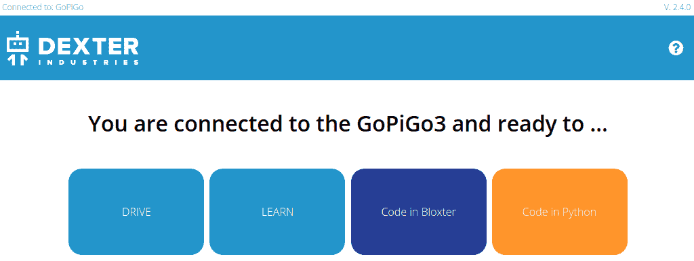

请注意，如果你保持笔记本电脑的互联网连接（有线），那么你应该连接到机器人的 IP 地址`http://10.10.10.10`。如果你需要帮助，你可以访问 DexterOS 论坛[`forum.dexterindustries.com/c/DexterOS`](https://forum.dexterindustries.com/c/DexterOS)。

从这一点开始，正如你在首页上看到的那样，你可以做以下事情：

+   DRIVE：通过基本控制面板在所有方向上移动机器人。

+   LEARN：通过在 Bloxter 中遵循引导教程——我们选择的语言之一——或使用 Jupyter Lab 笔记本的 Python。

+   使用 Bloxter 编写代码：基于 Google 的开源 Blockly 的可视化编程语言([`github.com/google/blockly`](https://github.com/google/blockly))。

+   使用 Python 编写代码：我们将用它来开发我们的机器人训练。

接下来，我们将开始使用 Bloxter 进行编码。

# 使用 Bloxter 进行编码

在可用的编程语言中，**Bloxter**为你提供了在不涉及编写代码的复杂性下学习机器人的机会。使用可视化界面，你可以排列和连接模块，并快速开发基本的程序来控制 GoPiGo3。让我们开始吧：

1.  通过在首页上点击“LEARN”，然后点击“Bloxter 中的课程”，你可以访问可用的课程，如下面的截图所示：

1.  选择你喜欢的，考虑到它们是按难度递增排序的：

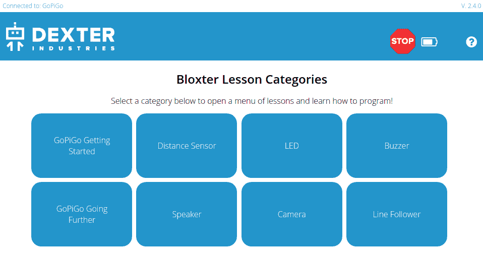

在开始第二章，*GoPiGo3 单元测试*之前，建议你完成 Bloxter 部分的 LEARN 部分。课程易于跟随，并且它们会教你比仅仅阅读文档更多的关于 GoPiGo3 的知识。

# 校准机器人

按照以下步骤校准机器人：

1.  返回主页面，点击[`mygopigo.com/`](http://mygopigo.com/)，然后在首页右上角的图标上点击。会出现一个帮助屏幕，包含两个按钮，一个用于校准，另一个用于检查电池状态，如下面的截图所示：

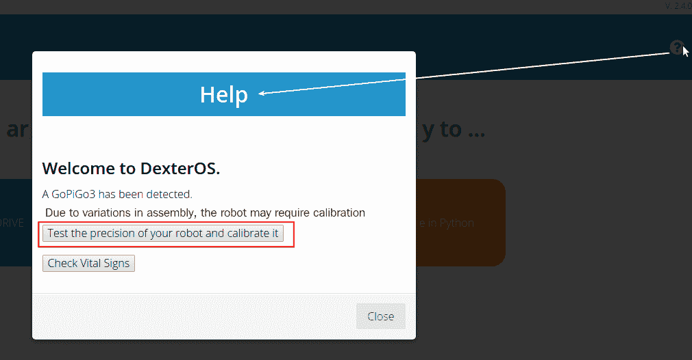

1.  点击“检查生命体征”来检查生命体征：

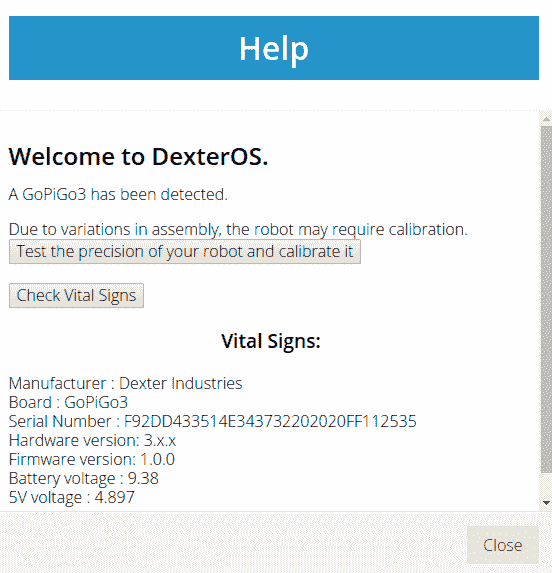

1.  现在，点击前面的按钮，测试你机器人的精度并进行校准。你会看到以下屏幕：

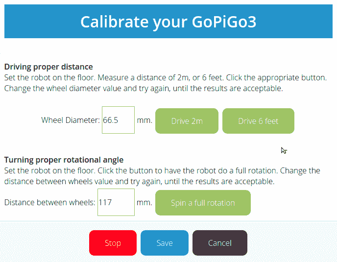

1.  调整尺寸，使其与你的机器人尺寸相匹配：

    +   **轮径**: 在地面上标记 2 米的距离，然后点击**驱动 2m**按钮。如果 GoPiGo3 刚好到达终点线，66.5 毫米是合适的。如果没有到达，你应该稍微增加直径；如果超过了终点线，你应该减少它。再次测试。通过试错，你会找到最适合你自己的机器人的直径。

    +   **车轮之间的距离**: 这个过程非常相似，唯一的区别是，在这种情况下，当你按下旋转一周时，机器人将围绕自身旋转。如果 GoPiGo3 完成 360°的完整旋转，117 毫米是合适的。如果没有完成旋转，你应该减少距离；如果旋转超过 360°，你应该增加它。再次测试。通过试错，你将能够调整这个距离，就像调整轮径一样。

# 驾驶机器人

要驾驶机器人，请按照以下步骤操作：

1.  关闭帮助窗口，并在主页上选择**DRIVE**项。

1.  通过点击此按钮，你可以访问一个面板，其中包含用于移动机器人前后和旋转左右的控制按钮。继续检查 GoPiGo3 是否按预期移动。

1.  每当你需要停止运动时，请按键盘上的空格键：

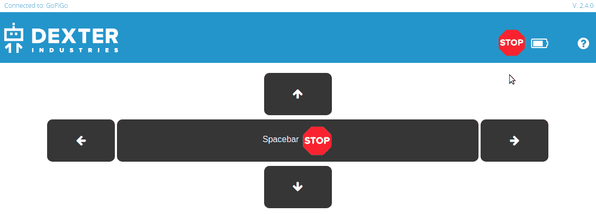

接下来，我们将检查传感器。

# 检查传感器

按照以下步骤检查传感器：

1.  返回主页并点击**Code in Bloxter**。

1.  在屏幕的右侧，你会看到一个滑动窗口，你可以在这里指定连接到每个传感器的端口。在我们的示例中，我们设置了以下配置：

    +   将**距离传感器**插入 I2C-1，GoPiGo3 左侧的 I2C 接口

    +   **循线传感器**连接到 I2C-2，GoPiGo3 右侧的 I2C 接口

    +   **IMU**传感器连接到 AD1（左侧）

1.  一旦你在 DexterOS 中选择了一个端口，你将能够为出现的每个下拉菜单进行选择，这些都是关于来自传感器的实时数据，如下面的截图所示：

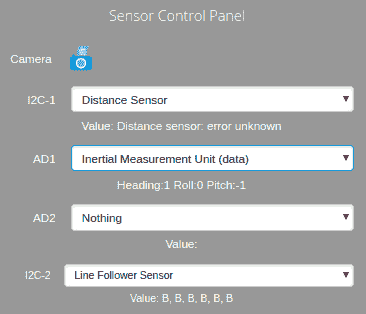

1.  检查所有三个——即距离传感器、循线传感器和 IMU——以提供读数。在距离传感器中，你可能会得到一个*错误未知*的消息。不要担心，传感器并没有损坏，只是软件的一个错误。在我们下一章使用 Python 时，你肯定会获得良好的读数。

1.  最后，让我们看看更复杂的传感器——IMU 的数据。在将其连接到 AD1 后，当您选择“惯性测量单元”或“惯性测量单元（数据）”时，窗口会提示您——将机器人空转 3 秒钟以校准其方向。这样，我们通过结合地球的重力和磁场来获得绝对方向参考。然后，如果我们从下拉列表中选择“惯性测量单元”，我们将看到实时报告的欧拉角度。如果它们已经正确校准，我们应该找到以下内容：

    +   当 GoPiGo3 在水平表面上并且面向东方时，欧拉航向（偏航、俯仰和滚转）的三个角度都是零。在这种情况下，*Z*轴（在传感器上涂有颜色）指向南方。

    +   在这个位置，如果你用手围绕*Z*轴旋转 GoPiGo3 超过 90°，那么滚转角度将是 90°，*X*轴将指向向上（指向天顶）。

    +   回到原始位置，如果你用手围绕*X*轴旋转 GoPiGo3 +90°，俯仰角度将是 90°，*Y*轴将指向南方。

GoPiGo3 中 IMU 的物理位置可以在以下图片中看到：

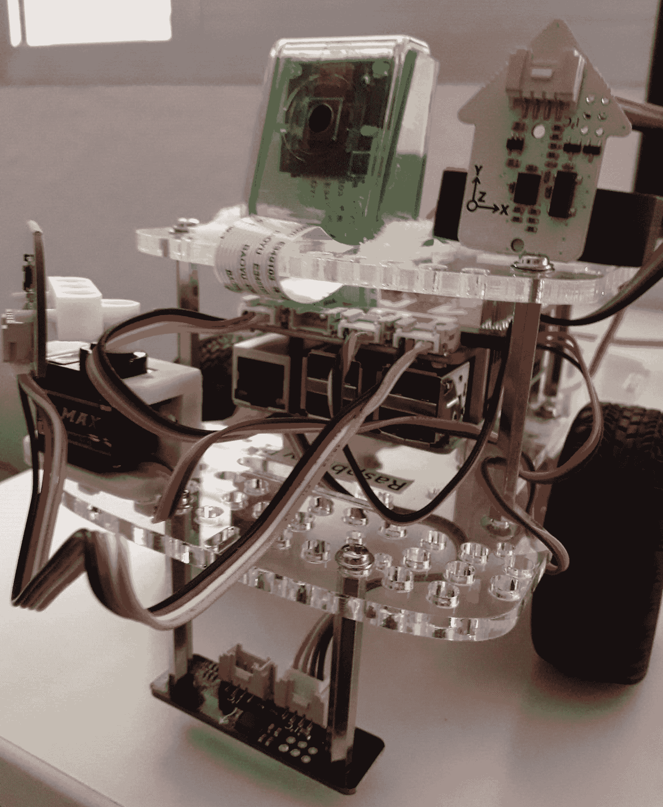

在下一章中，我们将学习如何使用 Pi Camera，当我们使用 Python 编程机器人时。

# 关闭机器人

要完成您与 GoPiGo3 的第一段旅程，只需长时间按住 GoPiGo 红色板上的黑色按钮。几秒钟后，红色 LED 将停止闪烁，这意味着关闭过程已完成。

# 摘要

在本章中，我们通过了解套件中传感器和电机的物理原理，熟悉了 GoPiGo3 硬件。我们通过运行一些快速测试来检查它们是否正常工作，以便我们可以开始编程任务。

在下一章中，我们将学习如何使用 Python 编程 GoPiGo3，同时为它的每个主要组件执行一些单元测试：伺服电机、距离传感器、线跟踪器、IMU 和 Pi Camera。

# 问题

1.  机器人是否必须配备像 Raspberry Pi 这样的计算机？

A) 是的，因为计算机为控制板供电。

B) 不，因为计算机只需要在屏幕上可视化软件代码。如果已经将程序烧录到控制器中，它可能可以独立工作。

C) 并非真的；你可以编写一个小程序来控制机器人，并将其烧录到控制器的芯片上。每次你给机器人供电时，它都会在无限循环中执行程序。

1.  GoPiGo3 的距离传感器发射什么类型的辐射？

A) 激光

B) 红外线

C) 超声波

1.  为什么你看不到线跟踪传感器发出的光？

A) 因为传感器必须先通过软件命令预先激活

B) 它不发射光，而是一个磁场

C) 它在可见光范围内不发射任何东西

1.  GoPiGo 红板上的串行端口有什么用途？

A) 为了让我们能够以与 Arduino 板相同的方式编程它，在那里您使用串行端口将程序烧录到微控制器的芯片上。

B) 为了从传感器同步传输数据到板。

C) 为了从 Raspberry Pi 访问 GPIO 的串行引脚。

1.  IMU 传感器是否提供机器人的绝对方向？

A) 是的，因为这是将加速度计和陀螺仪放在一起的目标。

B) 只有当 IMU 包含磁力计。

C) 只有在具有六个自由度的 IMU 传感器的情况下。

# 进一步阅读

您可以通过阅读制造商提供的详尽官方文档来了解更多关于 GoPiGo3 的功能：

+   Dexter Industries GoPiGo3 文档：[`gopigo3.readthedocs.io`](https://gopigo3.readthedocs.io)

+   Dexter Industries DI-Sensors 文档：[`di-sensors.readthedocs.io`](https://di-sensors.readthedocs.io)

+   Pi 相机文档：[`picamera.readthedocs.io/`](https://picamera.readthedocs.io/)
