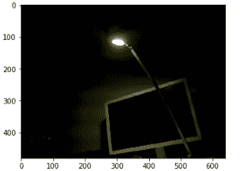

# GoPiGo3 的单元测试

在完成硬件组装后，在本章中，您将通过 JupyterLab 环境熟悉 GoPiGo3 的工作方式，这是一个友好的界面，它采用由人类可读段落和 Python 代码片段组成的笔记本结构。您将为每个测试程序产生两个版本：JupyterLab 笔记本和纯 Python 脚本。

使用这些编程工具，您将单独测试每个传感器/执行器，并检查它们是否正常工作，同时了解每个技术背后的知识。

我们将涵盖以下主题：

+   在 Jupyterlab 友好的环境中开始 Python 编程

+   测试机器人感知：距离传感器、循线传感器和 2D

+   测试机器人动作：电机和编码器

如果您遵循实际练习，您将了解不同的包（传感器、电机等）如何构建整个机器人，传感器测量了什么，以及如何系统地测试传感器和执行器。

# 技术要求

第一部分的代码，*Python 和 Jupyterlab 入门*，包含在 GoPiGo3 制造商提供的自定义操作系统 *DexterOS* 的图像中。在第一章*组装机器人*中，我们解释了如何获取此图像并将其烧录到 SD 卡中。这已在*快速硬件测试*部分和*DexterOS 入门*子部分的*入门*部分中解释。

本章的代码位于本书的 GitHub 仓库中，位于[`github.com/PacktPublishing/Hands-On-ROS-for-Robotics-Programming/tree/master/Chapter2_Unit_Tests.`](https://github.com/PacktPublishing/Hands-On-ROS-for-Robotics-Programming/tree/master/Chapter2_Unit_Tests)在*单元测试传感器和驱动器*部分的开始，我们解释了如何在 Raspberry Pi 上本地克隆代码。

# 在 Jupyterlab 友好的环境中开始 Python 编程

**JupyterLab** 是 Python 社区中的一个非常全面的工具，因为它允许您编写程序，就像在学校课堂上解决数学问题一样。也就是说，您编写标题，然后是问题陈述和初始数据。在此声明之后，您编写一个段落来解释您将要执行的操作，然后编写执行该操作的 Python 行（代码单元格）。对于每个操作，您重复相同的步骤：

1.  一个人类可读的段落解释下一个操作，该段落使用众所周知的 *markdown 语法* 格式化。[`commonmark.org/help/`](https://commonmark.org/help/)

1.  包含执行操作的 Python 代码行的代码单元格。

1.  对每个执行单个操作的代码片段重复步骤 1 和 2。最后一个将提供问题的解决方案。

这里有一个自解释的示例，用于读取 GoPiGo3 的距离传感器：


接下来，我们将解释如何为 GoPiGo3 启动 JupyterLab。

# 启动 GoPiGo3 的 JupyterLab

在 DexterOS 中，你有两个课程解释了 Jupyter 笔记本和用 Python 控制机器人：

1.  你可以通过访问 `http://mygopigo.com` 或 `http://10.10.10.10` 来访问它们，然后点击 LEARN，然后点击 Python 中的课程：


然后启动 JupyterLab 环境，在窗口的左侧你会看到两个文件：

+   +   `1_Moving_Around.ipynb` 是一个 Jupyter 笔记本，逐步解释了如何让机器人前进和旋转。按照笔记本中的说明执行命令。

    +   `2_The_Environment.ipynb` 是另一个例子，解释了如何处理 JupyterLab：运行一个单元、停止执行等等。如果你在前一个笔记本中遇到了困难，请按照这个笔记本操作，然后返回到第一个笔记本。

1.  现在我们尝试 `1_Moving_Around.ipynb`。以下命令使机器人前进 10 厘米：

```py
my_gopigo.drive_cm(10)
```

1.  如果你更喜欢用英寸工作，使用这个命令：

```py
my_gopigo.drive_inches(10)
```

1.  如果你同时在同一个代码单元中执行这两个命令，你会在执行第二个命令之前注意到一个小间隙：

```py
my_gopigo.drive_cm(10)
my_gopigo.drive_inches(10)
```

现在我们用机器人进行一次物理测试：

1.  在起点在地面上做一个标记，向前开 10 厘米，向后开 10 厘米，看看运动有多精确：

```py
# Forward
my_gopigo.drive_cm(10)
my_gopigo.drive_inches(10)

# Backward
my_gopigo.drive_cm(-10)
my_gopigo.drive_inches(-10)
```

你应该会发现它准确地回到了起点。我们用千分尺测量的误差（测量了三次）分别是 +1.29 毫米、-0.76 毫米和 +2.16 毫米。正数表示在倒车时它通过了起点，而负数表示它没有到达起点。

1.  如果你将距离相加（10 厘米 + 10 英寸 = 35.4 厘米）并放入一个向前命令中，然后发出另一个命令以相同的距离后退，我们测量的误差是（我们再次进行了三次测量）-0.01 毫米、-1.40 毫米和 -0.72 毫米：

```py
# Forward
my_gopigo.drive_cm(+35.4)

# Backward
my_gopigo.drive_cm(-35.4)
```

你可以看到，使用两个命令引入的暂停引入了一个大约 1 毫米的错误。仅使用一个命令向前和一个命令向后可以显著减少错误。

1.  我们可以对转向进行类似的测试：

```py
# Turn clockwise (right)
my_gopigo.turn_degrees(90)

# Turn counterclockwise (left)
my_gopigo.turn_degrees(-90)
```

1.  其他有用的命令如下：

```py
my_gopigo.forward()
my_gopigo.backward()
my_gopigo.right()
my_gopigo.left()
```

1.  要停止机器人，使用这个命令：

```py
my_gopigo.stop()
```

1.  非常重要的是要注意，软件流程可能与机器人物理不兼容。尝试这个序列并观察 GoPiGo3 的表现：

```py
my_gopigo.forward()
my_gopigo.backward()
my_gopigo.right()
my_gopigo.left()
```

似乎只有最后一行被执行，即 `my_gopigo.left()`。实际上发生的情况是，命令执行得非常快（每次几毫秒），机器人的惯性不允许 GoPiGo 有足够的时间向前、向后或向右移动。移除最后一行来检查它：现在你看到的唯一实际执行的命令是 `my_gopigo.right()`。

在为机器人编程时，最具挑战性的问题之一是理解其动力学，因为可能看起来像是软件错误的东西，可能是机器人意外物理反应。因此，在开发软件之前，您必须确保您理解问题的物理原理，包括其质量（惯性）、摩擦力、电机上的最大负载、电源限制和电池水平。来自物理世界的变量列表可能是无限的，您应该应用您的力学和电学知识来成功开发功能软件。

对于这个简单案例的一个可能解决方案是在序列中指定您想要它移动的距离或角度：

```py
my_gopigo.drive_cm(-10) # Forward
my_gopigo.drive_cm(10) # Backward
my_gopigo.turn_degrees(90) # Right (clockwise)
my_gopigo.turn_degrees(-90) # Left (counterclockwise)
```

要在 DexterOS 中保存您的作品，您必须从 `~/.lessons_python` 文件夹中进行。这个文件夹属于 `pi:users`，而 DexterOS 用户是 `jupyter`（在终端中输入 `$ whoami` 命令或在提示符中查看）。在树中向上移动一级，并创建一个您想要的任何名称的文件夹。然后使用文件 | 另存为... 在该位置保存您的更改。

# 硬件测试

要在 LEARN 环境之外访问 DexterOS 中的这些笔记本，请导航到 [`mygopigo.com`](http://mygopigo.com/) 或 `http://10.10.10.10`，然后点击 Python 中的代码。JupyterLab 将启动：


在屏幕左侧的文件管理器视图中，您将找到这两个笔记本：

+   其中一个是 `First Ride Around.ipynb`，它提供了一个用于通过视觉面板控制机器人的小部件：


+   另一个笔记本是 `Hardware Testing.ipynb`，它为电池、LED 灯和编码器运行特定的测试。以下小节中讨论了我们对 GoPiGo3 行为的预期。

# 测试电池、LED 灯和电机/编码器

打开笔记本并逐个检查每个单元，以了解其功能。

# 电池水平

以下命令读取并显示当前电池电压*.* 对于 GoPiGo3 正常工作，这个值应该高于 9 V。当电池电量不足时，您将失去与机器人的 Wi-Fi 连接，您必须充电或更换新电池：

```py
print("Battery voltage : ", GPG.get_voltage_battery() )

OUTPUT ===> Battery voltage : 9.114
```

接下来，我们将查看硬件信息和电压水平。

# 硬件信息和当前电压水平

下一个命令块将打印制造商信息、硬件和固件版本以及电池水平。以下与输出相关：

+   *电池电压* 与之前相同。测量给出略有不同的值，9.294V，这是正常的。

+   *5V 电压* 是通过 GPIO 向 Raspberry Pi 提供电源的电压。GoPiGo 红色电路板有一个电源调节器，将 9V 的原始输入转换为稳定的 5V。如果电池充电良好，这个值应该非常接近 5V，如所示：

```py
print("Manufacturer : ", GPG.get_manufacturer() )
print("Board : ", GPG.get_board() )
print("Serial Number : ", GPG.get_id() )
print("Hardware version: ", GPG.get_version_hardware())
print("Firmware version: ", GPG.get_version_firmware())
print("Battery voltage : ", GPG.get_voltage_battery() )
print("5v voltage : ", GPG.get_voltage_5v() )

OUTPUT ===> 
Manufacturer    :  Dexter Industries
Board           :  GoPiGo3
Serial Number   :  F92DD433514E343732202020FF112535
Hardware version:  3.x.x
Firmware version:  1.0.0
Battery voltage :  9.294
5v voltage      :  4.893
```

接下来，我们将检查 LED 灯和闪烁灯。

# LED 灯和闪烁灯

板上顶部有两个 LED 灯，模拟 GoPiGo3 的眼睛。通过运行以下代码块，它们将改变颜色：

```py
colors = [ (255,0,0), (255,255,0), (255,255,255), (0,255,0), (0,255,255), (0,0,255), (0,0,0)]
for color in colors:
    GPG.set_eye_color(color)
    GPG.open_eyes()
    time.sleep(0.5)
```

闪烁灯是位于前面红色板下方的两个小红灯。以下代码使它们闪烁 5 次：

```py
for i in range(5):
 GPG.led_on("left")
 GPG.led_on("right")
 time.sleep(0.5)
 GPG.led_off("left")
 GPG.led_off("right")
 time.sleep(0.5)
```

视觉检查，并注意控制台不会显示任何消息。

# 电机和编码器测试

下一个单元格将运行大约 5 秒，并将报告编码器读数：

```py
GPG.set_motor_dps(GPG.MOTOR_LEFT | GPG.MOTOR_RIGHT, 100)
start = time.time()
lapse = 0

while lapse < 5:
   lapse = time.time() - start
   time.sleep(0.5)
   print("LEFT: {} RIGHT:{}".format(GPG.get_motor_status(GPG.MOTOR_LEFT),GPG.get_motor_status(GPG.MOTOR_RIGHT)))

passed_test = GPG.get_motor_status(GPG.MOTOR_LEFT)[0]==0 and GPG.get_motor_status(GPG.MOTOR_RIGHT)[0]==0
GPG.set_motor_dps(GPG.MOTOR_LEFT | GPG.MOTOR_RIGHT, 0)

if passed_test:
   print("Test passed.")
else:
   print("Test failed.")
```

这些是结果：

```py
LEFT: [0, 26, 3095, 101]  RIGHT:[0, 26, 4806, 101]
LEFT: [0, 26, 3146, 101]  RIGHT:[0, 28, 4856, 101]
LEFT: [0, 26, 3196, 101]  RIGHT:[0, 28, 4906, 101]
LEFT: [0, 26, 3246, 101]  RIGHT:[0, 26, 4957, 96]
LEFT: [0, 26, 3296, 101]  RIGHT:[0, 26, 5007, 101]
LEFT: [0, 26, 3347, 101]  RIGHT:[0, 28, 5057, 101]
LEFT: [0, 24, 3397, 105]  RIGHT:[0, 26, 5107, 96]
LEFT: [0, 21, 3447, 96]  RIGHT:[0, 26, 5158, 101]
LEFT: [0, 26, 3497, 101]  RIGHT:[0, 21, 5208, 101]
LEFT: [0, 28, 3547, 96]  RIGHT:[0, 28, 5258, 96]
LEFT: [0, 33, 3598, 101]  RIGHT:[0, 33, 5308, 101]
Test passed.
```

我们应该看到最后的消息，告诉我们测试是否通过。目前不必担心理解这些数字：这是一个 GoPiGo3 自我检查并报告是否通过或失败的内测。

如果成功，你可以继续进行以下测试。GoPiGo3 将向前行驶 10 厘米，最后的输出值应该大约是 10。如果这个测试失败，你可以通过点击顶部红色的**停止**按钮来停止机器人：

```py
GPG.reset_encoders()
#GPG.set_speed(GPG.DEFAULT_SPEED)
GPG.drive_cm(10)
encoders_read = round(GPG.read_encoders_average())
print("Drove {:.2f} cm".format(encoders_read))
if encoders_read == 10:
 print("Test passed.")
else:
 print("Test failed.")
```

如果一切顺利，你将获得以下消息：

```py
Drove 10.00 cm Test passed.
```

再次，如果这个测试失败，你可以通过按顶部红色的**停止**按钮来停止机器人。在这些基本测试之后，我们对 GoPiGo3 的硬件和软件有了足够的了解，可以执行单元测试，这是本章的主要目标。

# 传感器和驱动单元测试

在本节中，我们将通过使用 Jupyter Notebooks 在 Python 中运行一些简单的脚本。从你的笔记本电脑中的终端，克隆书籍仓库并进入`Chapter2_Unit_Tests`文件夹以访问本章的文件：

```py
$ git clone https://github.com/PacktPublishing/Hands-On-ROS-for-Robotics-Programming
$ cd Hands-On-ROS-for-Robotics-Programming/Chapter2_Unit_Tests
```

为了完整性，我们在`lessons_GettingStarted`文件夹中包含了上一节使用的笔记本。

# 使用传感器和电机快速入门

要进入机器人的 Python 环境，打开红色板，并从你的笔记本电脑连接到*GoPiGo* Wi-Fi 网络。然后，在浏览器中访问以下 URL：

`http://10.10.10.10/python`

在 JupyterLab 中，关注左侧，那里显示了文件存储。要运行任何示例，你必须手动上传到你想在机器人存储中放置的位置。创建一个名为`Chapter2_Unit_Tests`的文件夹并上传所需的文件。我们将在每个练习的开始处指出我们将使用哪个文件。

# 驱动绕行

本小节中的文件位于仓库的`./Chapter2_Unit_Tests/drivingAround`文件夹中。你可以逐个上传它们。之后，在 JupyterLab 中通过打开启动器标签页启动一个 shell 会话：

1.  从标签页中选择终端图标，如图所示：


1.  通过更改到它们的目录来从终端执行脚本：

```py
$ cd./Chapter2_Unit_Tests/drivingAround
$ python <name_of_script.py>
```

第一个脚本是`1-easyMotors.py`，它执行一个非常简单的序列：

1.  电机向前移动 1 秒。

1.  电机停止 1 秒。

1.  驱动机器人 50 厘米然后停止。

1.  向右转 1 秒。

1.  向左转 1 秒。

1.  停止。

您可以在以下代码列表中看到脚本的第一个部分，它显示了前进 1 秒然后停止 1 秒的命令：

```py
# import the time library for the sleep function
import time
# import the GoPiGo3 drivers
from easygopigo3 import EasyGoPiGo3

# Create an instance of the GoPiGo3 class.
# GPG will be the GoPiGo3 object.
gpg = EasyGoPiGo3()

print("Move the motors forward freely for 1 second.")
gpg.forward()
time.sleep(1)
gpg.stop()
print("Stop the motors for 1 second.")
time.sleep(1)
```

第二部分如下所示，它包括前进 50 厘米，然后向右转 1 秒，然后向左转 1 秒的命令：

```py
print("Drive the motors 50 cm and then stop.")
gpg.drive_cm(50, True)
time.sleep(1)

print("Turn right 1 second.")
gpg.right()
time.sleep(1)
print("Turn left 1 second.")
gpg.left()
time.sleep(1)

print("Stop!")
gpg.stop()
print("Done!")
```

下一个脚本是 `2-driveSquare.py`，它做了它所说的：它在地板上画一个正方形。如果我们使用一个`for`循环，在每次驱动 30 厘米后进行 90 度旋转，我们得到一个行数非常少的程序：

```py
from easygopigo3 import EasyGoPiGo3

gpg = EasyGoPiGo3()
length = 30

for i in range(4):
  gpg.drive_cm(length) # drive forward for length cm
  gpg.turn_degrees(90) # rotate 90 degrees to the right
```

`3-circularMoves.py` Python 脚本使 GoPiGo3 在一个方向上走半圆，然后在相反方向上走，返回起点：

```py
from easygopigo3 import EasyGoPiGo3

gpg = EasyGoPiGo3()

gpg.orbit(180, 50) # draw half a circle
gpg.turn_degrees(180) # rotate the GoPiGo3 around
gpg.orbit(-180, 50) # return on the initial path
gpg.turn_degrees(180) # and put it in the initial position
```

程序 `4-drawEight.py` 将弧线和直线路径结合起来，在地板上绘制一个 8 形状：

```py
from easygopigo3 import EasyGoPiGo3

gpg = EasyGoPiGo3()
radius = 30

gpg.orbit(-270, radius) # to rotate to the left
gpg.drive_cm(radius * 2) # move forward
gpg.orbit(270, radius) # to rotate to the right
gpg.drive_cm(radius * 2) # move forward
```

最后，程序 `5-accelerateForward.py` 展示了如何加速机器人。这个序列相当简单：

1.  设置初始速度和结束速度。

1.  通过将它们之间的间隔除以 20 来计算步长。

1.  运行一个循环，每次迭代增加步进值。

1.  每 0.1 秒执行一次迭代。

1.  2 秒后，GoPiGo3 将达到最大速度并停止：

```py
from easygopigo3 import EasyGoPiGo3
from time import time, sleep

gpg = EasyGoPiGo3()

# setting speed to lowest value and calculating the step increase in speed
current_speed = 50
end_speed = 400 step = (end_speed - current_speed) / 20
gpg.set_speed(current_speed) # start moving the robot at an ever increasing speed
gpg.forward()
while current_speed <= end_speed:
  sleep(0.1)
 gpg.set_speed(current_speed)
  current_speed += step # and then stop it
gpg.stop() 
```

现在我们来测试我们为机器人配备的所有传感器。

# 距离传感器

为了与传感器通信，我们将使用 DI-sensors Python 库 [`github.com/DexterInd/DI_Sensors`](https://github.com/DexterInd/DI_Sensors)。

首先，我们需要修改端口连接。这就是我们现在要回顾的内容。

# 检查端口连接

以下图表在连接传感器到 GoPiGo3 端口时应非常有帮助，以确保硬件正确布线：


图片来源：Dexter Industries： https://gopigo3.readthedocs.io/en/master/_images/gpg3_ports.jpg

从上一章，你应该记得每个端口的用途：

+   **AD1**和**AD2**是通用*输入/输出*端口。

+   **SERVO1**和**SERVO2**是伺服控制器端口。

+   **I2C**端口是您连接*I2C 启用*设备的地方。

+   **串行**端口是您可以连接*UART 启用*设备的地方。

根据这个描述，检查传感器是否按照我们在第一章中描述的方式连接：

+   **距离传感器**应该插入到**I2C-1**，GoPiGo3 左侧的 I2C 端口。

+   伺服包应该连接到**SERVO1**。

+   **线跟踪器**应该插入到**I2C-2**，GoPiGo3 右侧的 I2C 端口。

+   **IMU**传感器应该连接到**AD1**（在左侧）。

# 距离传感器单元测试

尽管您已经将距离传感器连接到**I2C-1**端口，但请注意，GoPiGo3 软件库不会要求您在脚本中指定您使用的是两个端口中的哪一个。它将自动检测。

测试文件位于存储库的 `./Chapter2_Unit_Tests/DI-distance` 文件夹中。您可以逐个上传到 DexterOS：

+   `di-distance_cm.py`

+   `di-distance-easygopigo_mm.py`

然后，通过打开启动器窗口并从中选择终端图标，在 JupyterLab 中打开一个 shell 会话。通过移动到它们的位置来在终端中执行脚本：

```py
$ cd./Chapter2_Unit_Tests/DI-distance
$ python <script.py>
```

第一个脚本是`di-distance_cm.py`。它以固定的时间速率读取数据：

```py
# import the modules
from di_sensors.easy_distance_sensor import EasyDistanceSensor
from time import sleep

# instantiate the distance object
my_sensor = EasyDistanceSensor()

# and read the sensor iteratively
while True:
  read_distance = my_sensor.read()
  print("distance from object: {} cm".format(read_distance))

  sleep(0.1)
```

发布间隔为 0.1 秒，如`sleep(0.1)`行中指定。距离传感器 API 的详细说明可在[`di-sensors.readthedocs.io/en/master/api-basic.html#easydistancesensor`](https://di-sensors.readthedocs.io/en/master/api-basic.html#easydistancesensor)找到。`my_sensor.read()`方法提供厘米距离，但如果你更喜欢使用其他单位，还有另外两种方法：

+   `my_sensor.read_mm()`用于毫米。

+   `my_sensor.read_inch()`用于英寸。

第二个脚本`di-distance-easygopigo_mm.py`按照[`github.com/DexterInd/GoPiGo3`](https://github.com/DexterInd/GoPiGo3)导入 GoPiGo3 库，这隐式地包含了传感器库[`github.com/DexterInd/DI_Sensors`](https://github.com/DexterInd/DI_Sensors)。你可以看到它使用相同的类方法来读取数据。在这种情况下，使用的是读取毫米距离的函数：

```py
# import the GoPiGo3 drivers
import time
import easygopigo3 as easy

# This example shows how to read values from the Distance Sensor

# Create an instance of the GoPiGo3 class.
# GPG will be the GoPiGo3 object.
gpg = easy.EasyGoPiGo3()

# Create an instance of the Distance Sensor class.
# I2C1 and I2C2 are just labels used for identifyng the port on the GoPiGo3 board.
# But technically, I2C1 and I2C2 are the same thing, so we don't have to pass any port to the constructor.
my_distance_sensor = gpg.init_distance_sensor()

while True:
    # Directly print the values of the sensor.
 print("Distance Sensor Reading (mm): " + str(my_distance_sensor.read_mm()))
```

为了完整性，我们已将这两个库包含在本章的文件夹中：

+   `easysensors.py`用于传感器

+   `easygopigo3.py`用于机器人

如果你检查后者，你将在文件开头看到这条`import`行：

```py
import easysensors
...
try:
 from di_sensors import easy_distance_sensor
```

这样，我们可以将所需的 DI 传感器集成到你的机器人中，以增加其感知能力。让我们通过一个例子来更好地理解 Dexter Industries 提供的库。

# GoPiGo3 API 库

机器人的主要类是`GoPiGo3`，你可以在以下图中看到类结构。`easysensors`库被`EasyGoPiGo3`类（继承）导入，因此可以访问所有传感器方法。类结构在以下图中展示：


图片来源：Dexter Industries：https://gopigo3.readthedocs.io/en/master/_images/inheritance-e4cb3d2ae1367b2d98aab1a112a1c8e1b7cd9e47.png

一个包含该类所有功能的总结表格可在[`gopigo3.readthedocs.io/en/master/api-basic/structure.html#functions-short-list`](https://gopigo3.readthedocs.io/en/master/api-basic/structure.html#functions-short-list)找到。API 库的详细内容可在[`gopigo3.readthedocs.io/en/master/api-basic/easygopigo3.html`](https://gopigo3.readthedocs.io/en/master/api-basic/easygopigo3.html)找到。

因此，使用`easygopigo3.py`库，你可以创建你的机器人实例并初始化所需的传感器。例如，距离传感器通过以下类方法进行初始化：

```py
easygopigo3.EasyGoPiGo3.init_distance_sensor([port])
```

在我们的脚本中，这是通过三行实现的：

```py
import easygopigo3 as easy
gpg = easy.EasyGoPiGo3()
my_distance_sensor = gpg.init_distance_sensor()
```

在第一行，您导入`easygopigo3`库。在第二行，您实例化一个机器人对象，在第三行，您初始化距离传感器。然后，您就可以从传感器获取数据了：

```py
my_distance_sensor.read_mm()
```

简而言之，如果您使用`easygopigo3.py`库，**顶层对象是机器人本身**。另一方面，如果您在一个不涉及 GoPiGo 的自定义项目中使用传感器，顶层对象尚未创建，除非您已经有了相应的库。如果没有，您需要定义一个表示该实体（例如气象站）的类，并导入 DI 传感器库。这是下一小节的主题。

# DI 传感器 API 库

每种传感器类型都有自己的类和方法。在`./Chapter2_Unit_Tests/DI-distance/di-distance_cm.py`脚本中，我们使用了 DI-sensors 库。类结构在以下屏幕截图中有显示，并在[`di-sensors.readthedocs.io/en/master/structure.html#library-structure`](https://di-sensors.readthedocs.io/en/master/structure.html#library-structure)中进行了说明：


图片由 Dexter Industries 提供：https://di-sensors.readthedocs.io/en/master/_images/inheritance-a8243413ad98ddae26cdf121c775ad137c7f2e30.png

所有 DI 传感器的总结表格方法显示在[`di-sensors.readthedocs.io/en/master/structure.html#functions-short-list`](https://di-sensors.readthedocs.io/en/master/structure.html#functions-short-list)。您将找到每个传感器的两种使用方法：

+   **简单方法**——以`easy`前缀开头——是为了快速使用，并提供顶层功能。您可以在前一个图例的右侧看到语法。

+   没有带`easy`前缀的**高级方法**是供开发者使用的，并提供低级控制。

距离传感器由以下类管理：

```py
di_sensors.easy_distance_sensor.EasyDistanceSensor([…])
```

在我们的脚本中，传感器初始化如下:: 

```py
from di_sensors.easy_distance_sensor import EasyDistanceSensor
my_sensor = EasyDistanceSensor()
```

前面的行描述如下：

+   在第一行，您导入距离传感器的类。请注意，您只需要从`di_sensors.easy_distance_sensor`导入`EasyDistanceSensor`类。

+   在第二行，您使用`Easy`类实例化距离传感器对象。

然后，您就可以从传感器获取数据了：

```py
read_distance = my_sensor.read()

```

与不使用`easy`选项的情况进行比较。语法类似，唯一的区别是去除了`_easy`和`Easy`前缀：

```py
from di_sensors.distance_sensor import DistanceSensor my_sensor = DistanceSensor()
read_distance = my_sensor.read()

```

同样的方案将适用于我们稍后要介绍的其他传感器，特别是线跟踪器和 IMU。

# 伺服包

伺服包由一个**脉冲宽度调制**（**PWM**）伺服电机组成。它通过施加产生电机轴在 180°幅度范围内的成比例旋转的电压进行开环控制。在下面的图像中有一个小杆，使我们能够可视化旋转。在我们的 GoPiGo3 组装中，我们将看到旋转距离传感器：


图片来源：Dexter Industries：https://www.dexterindustries.com/wp-content/uploads/2017/06/GoPiGo3-Servo-Assembly-11-600x338.jpg

伺服包是描述在 *距离传感器单元测试* 部分的 GoPiGo3 API 库的一部分。它的 API 方法在 [`gopigo3.readthedocs.io/en/master/api-basic/sensors.html#servo`](https://gopigo3.readthedocs.io/en/master/api-basic/sensors.html#servo) 中详细说明。

接下来，我们将执行一些单元测试来检查它是否能够正确旋转。由于我们已经将距离传感器与伺服包一起安装，我们可以通过旋转伺服来测量 180º 视场内的障碍物距离。在测试中，我们还将校准机器人能够覆盖的实际视场。

# 伺服包单元测试

测试包括将距离传感器相对于伺服电机轴放置在一个角度位置，这个位置覆盖了 GoPiGo3 的整个前方视图，从左到右。所有的解释和代码都在位于 `./Chapter2_Unit_Tests/DI-servo_package/servoCalibration.ipynb` 的 Jupyter 笔记本中：

1.  首先，我们从 `EasyGoPiGo3` 类创建伺服对象。为此，我们需要导入库并实例化 `GoPiGo3`：

```py
import easygopigo3 as easy
my_gpg3 = easy.EasyGoPiGo3()
```

1.  然后，我们初始化伺服：

```py
servo = my_gpg3.init_servo()
```

1.  我们检查我们是否能够完全旋转伺服。你应该已经卸下传感器以防止与机器人底盘碰撞：

```py
servo.rotate_servo(0)   # This is 0º position
servo.rotate_servo(180) # This is 180º position
```

1.  然后，将伺服移动到区间的中间，90º，并将传感器安装好，使其朝向前方：

```py
servo.rotate_servo(90)
```

1.  调整角度，使传感器正好朝向前方。在我们的例子中，这个角度是 95°。你应该找出你自己的角度：

```py
servo.rotate_servo(95)
```

1.  一旦我们检查了参考位置，让我们设置实际限制。为此，找到防止机器人底盘干扰传感器的角度。在我们的例子中，这些角度是 30º 和 160º。同样，你应该找出你自己的角度：

```py
servo.rotate_servo(30)
servo.rotate_servo(160)
```

这样，我们就完成了带有距离传感器的伺服包的设置。

对于高级用户，还有一个 API 库，**gopigo3**，它提供了对硬件的低级访问，以便您能够完全控制它。尽管本书的范围不包括低级编程，但您提供了一个 Python 脚本，`Servo.py`，简要说明了其方法的使用。此脚本以 *计数* 而不是 *旋转角度* 来设置旋转。我们执行一个循环，当计数从 1000 到 2001 时。

这样，您就可以访问伺服电机的全部分辨率，并且应该对它能够提供的旋转步长的大小有一个概念。

# 跟踪线

如第一章所述，跟踪线由六个发射器-接收器对组成，用于感应地板上的六个对齐点，以确定机器人相对于它将跟随的黑线的偏离程度。

线路跟随器也是 GoPiGo3 API 库的一部分。其方法在[`di-sensors.readthedocs.io/en/master/api-basic.html#easylinefollower`](https://di-sensors.readthedocs.io/en/master/api-basic.html#easylinefollower)中有详细说明。我们将进行的单元测试包括验证传感器能否告知机器人位于黑色线哪一侧。

# 线路跟随器单元测试

测试用的 Jupyter 笔记本是`./CH2-uniTests/di-lineFollower/lineFollower_libraries.ipynb`。这个笔记本还展示了简单的库，`di_sensors.easy_line_follower`，以及高级版本，`di_sensors.line_follower`，的实际应用。

当传感器报告**中心**时，这是因为机器人在黑色线路上很好地居中，如下一张图片所示。这意味着两个外部发射器-接收器对报告**白色**，而它们之间的对报告**黑色**：


当传感器报告**左侧**时，这意味着线路稍微在机器人左侧，如下一张照片所示。这意味着最左侧的对报告**黑色**，中间的对**黑色**，其余的对**白色**：


如果机器人完全偏离了线路，所有对都会报告**白色**，线路跟随器总体上也会报告**白色**。反之亦然：如果所有对都报告**黑色**，可能是因为黑色线条太宽或者机器人被放置在了一个暗色的表面上。

# 不惯性测量单元（IMU）

使用提供的惯性测量单元（IMU），我们有以下传感器：

+   磁力计，三轴

+   惯性测量单元（IMU），三轴

+   加速度计，三轴

如前一章所述，有了这三个传感器——一旦完成校准设置——就可以获得机器人在 3D 空间中的绝对方向，用欧拉角来量化。此外，我们还有温度，因为 DI IMU 配备了温度传感器。

# IMU 单元测试

测试用的 Jupyter 笔记本是`./Chapter2_Unit_Tests/DI-IMU/IMU_reading.ipynb`。相应的 DI 传感器 API 库在[`di-sensors.readthedocs.io/en/master/examples/imu.html`](https://di-sensors.readthedocs.io/en/master/examples/imu.html)上有文档说明。

在运行笔记本时，你可以检查报告的欧拉角是否正确。

# Raspberry Pi

Pi 是任何机器人不可或缺的感知设备。考虑到大约 80%的人类大脑处理的感觉数据来自视觉。在本节中，我们只将测试 Pi 是否能够拍照以检查其是否正常工作。在*[第十章](https://cdp.packtpub.com/hands_on_ros_for_robotics_programming/wp-admin/post.php?post=33&action=edit)，在机器人学中应用机器学习*，我们将使用相机捕获的图像上的对象识别算法。因此，机器人将表现出更智能的行为，能够识别颜色、形状、面孔等等。

# Pi 单元测试

测试的 Jupyter 笔记本位于 `./Chapter2_Unit_Tests/PiCamera/Taking_Photos.ipynb`。这个简单的例子拍摄照片并创建直方图，即显示图像中每种颜色的数量和每种颜色的数量的图表。

因此，让我们拍摄一张颜色较少的照片，以便更容易理解直方图的信息。以下是用 GoPiGo3 拍摄的照片，具有我们需要的特征：



这可以通过以下代码片段实现：

1.  首先，我们拍照。然后将其转换为 JPG 图像格式并保存，最后在屏幕上显示结果：

```py
with picamera.PiCamera() as camera:
 camera.resolution = (640, 480)
 camera.capture(output, format = 'rgb', use_video_port = True)

img = Image.fromarray(output)
img.save("../photo.jpg")

plt.imshow(output)
```

1.  最后，我们用这个简单的命令绘制直方图：

```py
img = Image.open("../photo.jpg")
histogram = img.histogram()
plt.plot(histogram)
```

这是结果：


你可能会看到颜色集中在三个点上。*x* 轴的刻度从 0（黑色）到 768（白色）。这个区间是通过考虑 24 位 RGB 像素值可以高达 768 来解释的。让我们看看每根垂直线代表什么：

+   在 *x* = 0 的线上表示的是黑色区域。

+   在 *x* = 525 的线上表示的是更闪亮的区域，即灯泡。

+   最后，很容易推断出 *x* = 250 对应的是显示器周围的较亮区域，看起来有灰色调。

通过这次最后的测试，我们验证了我们的机器人所有的传感器和驱动器都工作正常，我们准备进入下一步，构建功能行为。

# GoPiGo3 项目

在 Github 上托管的官方 GoPiGo3 软件提供了几个有趣的项目。[`github.com/DexterInd/GoPiGo3`](https://github.com/DexterInd/GoPiGo3)。在这个阶段，我们建议你克隆仓库并将其中的一些项目上传到运行 DexterOS 的机器人。项目位于仓库的这个文件夹中：[`github.com/DexterInd/GoPiGo3/tree/master/Projects`](https://github.com/DexterInd/GoPiGo3/tree/master/Projects)。

你可以尝试，例如，位于 [`github.com/DexterInd/GoPiGo3/tree/master/Projects/BasicRobotControl`](https://github.com/DexterInd/GoPiGo3/tree/master/Projects/BasicRobotControl) 的 *基本机器人控制* 项目。你拥有使用连接到机器人的无线键盘的按键来完全控制驱动器、LED 和闪烁灯的方法：

```py
[key w ] : Move the GoPiGo3 forward
[key s ] : Move the GoPiGo3 backward
[key a ] : Turn the GoPiGo3 to the left
[key d ] : Turn the GoPiGo3 to the right
[key <SPACE> ] : Stop the GoPiGo3 from moving
[key <F1> ] : Drive forward for 10 centimeters
[key <F2> ] : Drive forward for 10 inches
[key <F3> ] : Drive forward for 360 degrees (aka 1 wheel rotation)
[key 1 ] : Turn ON/OFF left blinker of the GoPiGo3
[key 2 ] : Turn ON/OFF right blinker of the GoPiGo3
[key 3 ] : Turn ON/OFF both blinkers of the GoPiGo3
[key 8 ] : Turn ON/OFF left eye of the GoPiGo3
[key 9 ] : Turn ON/OFF right eye of the GoPiGo3
[key 0 ] : Turn ON/OFF both eyes of the GoPiGo3
[key <INSERT>] : Change the eyes' color on the go
[key <ESC> ] : Exit
```

到目前为止，你可能认为我们用来将新文件放入机器人的方法很繁琐。我们使用了 DexterOS，这样你就可以快速开始，无需处理 Linux 问题。

从下一章开始，我们将在你的笔记本电脑上使用 Ubuntu 16.04 和 GoPiGo3 内部的完整 Linux 桌面，Ubuntu 18.04。这将使机器人能够连接到互联网，并允许你直接将仓库克隆到机器人中。

# 摘要

在本章中，我们通过运行允许我们测试机器人传感器和执行器的简单程序，熟悉了 GoPiGo3 的 Python 环境。我们按照正式的*单元测试*方法逐一检查了它们。这实现了两个目标：开始 Python 编程和功能验证您的机器人硬件。

接下来，我们将把机器人放到下一章，我们将讨论 ROS 的核心软件概念，这是我们稍后用来编程 GoPiGo3 的。

# 问题

1.  如果你有这个 Python 命令序列，GoPiGo3 会做什么？

```py
my_gopigo.drive_cm(10)
my_gopigo.turn_degrees(90)
```

A) 它将向前行驶 10 厘米，然后向右转 90 度

B) 它将向前行驶 10 厘米，然后向左转 90 度

**C**) 它将转 90 度

1.  GoPiGo3 正常工作所需的电池电量是多少？

**A**) 略高于 9V 就足够了。

B) 5V，与 Raspberry Pi 所需的电压相同。

C) 没有最小值。如果电压低，机器人将缓慢行驶。

1.  哪组命令将使 GoPiGo3 绘制直径为 60 厘米的直角圆弧？

A) `gpg.orbit(90, 60)` **B**) `gpg.orbit(90, 30)` **C**) `gpg.orbit(180, 30)`

1.  线跟踪器的六个传感器信号中哪一种组合不对应于 GoPiGo3 位于黑色线右侧？（w: 白色，b: 黑色）

**A**) b-b-b-b-w

B) w-b-b-b-w

C) b-b-b-w-w

1.  如果有一个图像直方图，它由在*x* = 0 和*x* = 768 处的两条等高垂直线组成，且*x*的颜色范围是从 0 到 768，那么图像中存在哪些颜色？

A) 灰色，因为它是以相等比例混合黑色和白色所得的结果。

**B**) 图像的一半是黑色，另一半是白色。

C) 不可能得到这样的直方图。

# 进一步阅读

要深入了解 GoPiGo3 的技术细节，您可以在以下官方指南中找到非常详细的信息：

+   Dexter Industries GoPiGo3 文档：[`gopigo3.readthedocs.io`](https://gopigo3.readthedocs.io)

+   Dexter Industries DI-Sensors 文档：[`di-sensors.readthedocs.io`](https://di-sensors.readthedocs.io)

+   Pi 相机文档：[`picamera.readthedocs.io/`](https://picamera.readthedocs.io/)
