# 第三章：ROS 入门

**机器人操作系统**（**ROS**）是一个开源软件。其开发始于 Willow Garage，一个技术孵化器和机器人研究实验室。其起源可以追溯到 2000 年中叶斯坦福大学的几个项目，当时研究人员每次都必须为每个项目构建软件时，都会发现自己是在重新发明轮子。

2007 年，Willow Garage 率先推出了 ROS。主要目标是重用现有代码，并使快速原型化新机器人设计成为可能，专注于高级功能并最大限度地减少编辑代码的需求。如果您对 ROS 如何成为机器人应用程序开发的**事实上的**标准感兴趣，可以查看一个交互式页面[`www.ros.org/history`](https://www.ros.org/history)。

ROS 旨在开发需要不同设备相互通信以创建灵活和可扩展环境的应用程序。本章将解释 ROS 的基本概念。它将使用通俗易懂的语言介绍框架，同时避免过于技术性的描述。这是因为我们的首要目标是干净利落地向你展示 ROS 在概念上的含义。在接下来的章节中，我们将有机会涵盖技术描述；这些描述在任何情况下你都需要，以便能够在项目中使用 ROS。

在本章的第一部分，我们将介绍 ROS 在底层是如何工作的，以及为什么它不应仅仅被视为一种特定用途的编程语言，而应被视为开发机器人应用程序的框架。您将深入了解 ROS 图的核心概念和节点之间的异步通信。

在第二部分，您将逐步引导配置笔记本电脑上的 ROS 环境。

在第三部分，通过一个实际练习的引导，你将学习如何使用命令行在节点之间交换简单的消息。

最后，我们将为您概述许多由开源社区贡献的可用 ROS 包。

在本章中，我们将涵盖以下主题：

+   ROS 基本概念和 ROS 图

+   配置您的 ROS 开发环境

+   ROS 节点之间的通信：消息和主题

+   使用 ROS 的公开可用包

# 技术要求

本章的实践方面要求您能够访问带有以下两种 Ubuntu 版本之一的台式计算机或笔记本电脑：

+   Ubuntu 16.04 Xenial

+   Ubuntu 18.04 Bionic

**长期支持**（**LTS**）Ubuntu 版本由 Canonical 维护长达 5 年。此外，这类版本在偶数年发布。因此，2016 年发布的 Ubuntu 16.04 将会维护到 2021 年，而 2018 年发布的 Ubuntu 18.04 将会维护到 2023 年。我们不会考虑奇数年版本，即 Ubuntu 17 或 Ubuntu 19，因为它们是开发版本，不是 LTS 版本。

Open Robotics 每年都会发布一个新的 ROS 版本，与每个 Ubuntu 版本同步。对应关系如下：

+   在 Ubuntu 16.04 Xenial 下运行的 ROS Kinetic

+   在 Ubuntu 18.04 Bionic 下运行的 ROS Melodic

到本书写作时，最常用的版本是 ROS Kinetic。以下章节中提供的实际例子适用于 Ubuntu 16.04 和 Ubuntu 18.04。因此，它们也适用于 ROS Kinetic 和 ROS Melodic。

当我们不区分 Ubuntu 或 ROS 版本时，你应该假设它们适用于这两个版本。如果根据版本的不同，命令或要运行的脚本有所不同，我们将明确指出。

本章的代码可以在本书仓库的 `Chapter3_ROS_basics` 中找到，该仓库托管在 GitHub 上，网址为 [`github.com/PacktPublishing/Hands-On-ROS-for-Robotics-Programming/tree/master/Chapter3_ROS_basics`](https://github.com/PacktPublishing/Hands-On-ROS-for-Robotics-Programming/tree/master/Chapter3_ROS_basics)。在 *设置 ROS 软件包* 部分中，你将学习如何下载代码并将其与你的 ROS 安装一起使用。

# ROS 基本概念

在早期，斯坦福大学机器人学的研究人员发现，为机器人原型设计软件是一项繁重的编程任务，因为他们必须为每个项目从头开始编码。曾经有一段时间，C++ 和 Python 等编程语言被用作机器人的一般编程语言，而这一事实要求人们付出巨大的努力来构建每一块软件，以提供机器人级别的功能，例如导航或操作。

这不仅是一个代码可重用性的问题，而且也是一个机器人工作方式的问题。在过程式编程中，程序的典型流程是按顺序执行一个步骤接着另一个步骤，如下面的图所示：

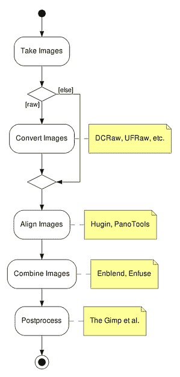

这个程序执行的任务是将多个图像合并成一个，这一点很容易推断。从我们的机器人角度来看，这种工作流程的主要缺点是，如果某些步骤未能执行，那么流程就无法继续，因此无法提供其结果，即合并后的图像。如果我们用机器人的类比，这意味着一个类人机器人如果其一只手臂（例如，肘关节的驱动电机损坏）不能正常工作，那么它可能无法完成其任务。类人机器人当然应该能够用另一只手臂完成任务。这正是 ROS 所做的！

让我们看看以下 ROS 图的例子。

# ROS 图

这个图对于 ROS 来说，就像工作流程图对于过程式编程来说一样：

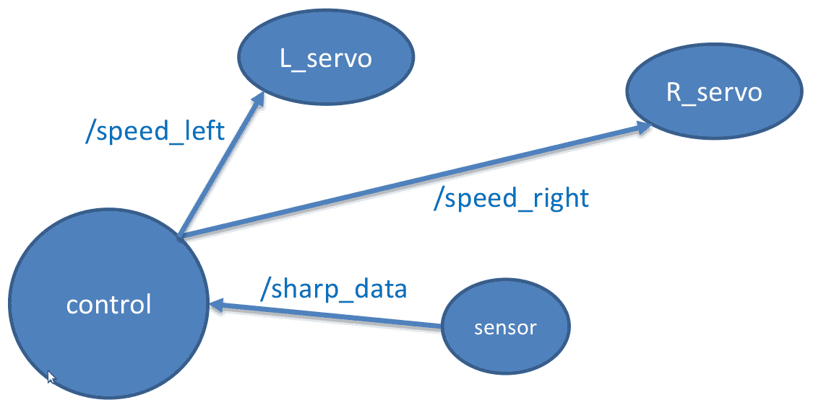

在前面的图中，每个圆圈——称为**节点**——代表一个独立的程序（这可以用 Python、Java、C++、Ruby、Node.js 或 ROS 已实现的任何其他编程语言编写）。它们之间的连接——称为**边缘**——代表信息的交换。箭头方向的意义是显而易见的：数据发射器是箭头开始的节点，接收节点是箭头指向的节点。出现在边缘上方的单词是 ROS 所说的**主题**，它们构成了节点之间交换信息的通道。当一个节点需要使用主题的信息时，它会通过订阅它来这样做，这个操作会在图中从数据提供者（此类主题的数据）到订阅节点添加一个新的箭头。

那么，从机器人的角度来看，这个图做了什么？记住，GoPiGo3 是一个经典的差速驱动机器人，其中每个轮子都可以独立转动，传感器——例如，距离传感器——在移动时为机器人提供有关障碍物距离的信息：

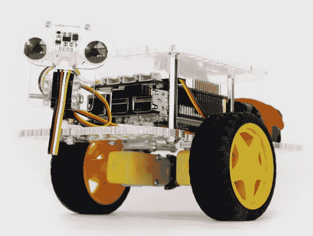

图片来源：Dexter Industries https://32414320wji53mwwch1u68ce-wpengine.netdna-ssl.com/wp-content/uploads/2017/05/GPG3_FullServoDistanceGoogly_1-800x800.jpg

因此，你可能已经猜到了，在前面的 ROS 图中，`L_servo`节点是控制左伺服电机的程序（通过旋转该轮子），而`R_servo`节点对右轮做同样的操作。

`sensor`节点是那个从距离传感器读取数据并通过连接到它的边缘（即使用`/sharp_data`主题）使它们对`control`节点可用的节点。

在`control`节点中运行着决定如果 GoPiGo3 遇到障碍物时应该做什么的程序。例如，它可以旋转机器人直到找到一个没有障碍物的方向。旋转意味着`control`节点向`L_servo`和`R_Servo`节点发送相反的命令。

这些信号是通过图中的相应边缘流动的：`/speed_left`主题或左舵机，以及`/speed_right`用于另一个。在 ROS 语言中，我们说`control`节点在`/speed_left`主题中发布左舵机的命令。

# roscore

**roscore**是必须启动的第一个节点，以便 ROS 环境可以运行。这允许每个节点通过订阅它发布的主题来找到任何其他节点。roscore 还管理 ROS 参数的数据库——定义机器人配置的值。因此，如果 roscore 进程崩溃，主节点失败，机器人将停止工作。您可以猜测，这个单点故障对于像 ROS 这样的分布式计算框架来说是一个明显的限制。因此，ROS2 解决了这个问题，运行中的软件不再需要主节点。节点之间的通信依赖于**DDS**（数据分发服务）架构，适用于实时系统。

您能看出编写机器人程序与编写软件应用程序的不同之处吗？在机器人领域，您关注应用程序的顶层功能，并集成其他人编写的预制软件组件。

请注意，并非所有机器人领域的软件都遵循这种方法。实际上，在其众多用途中，我们选择 ROS 是因为其哲学与本书所采用的*实践学习*方法论非常契合。

这些软件组件，由代码块组成的节点群组，构成了我们所说的**ROS 软件包**。几个相关的节点构成了一个 ROS 软件包，提供特定的功能，例如，使用摄像头进行物体识别。

# 工作空间和 catkin

在 ROS 中，工作空间是一个用于构建和运行您软件的独立环境。您可以使用不同的工作空间来管理不同的项目。工作空间将包含您项目所需的全部 ROS 软件包。

在物理上，它是在您的家目录中的一个文件夹，其中包含您应用程序的所有特定文件，这样部署这个工作空间到另一个预装了 ROS 的机器上时可以正常工作，并且与原始计算机上的表现相同。

catkin 与工作空间的概念紧密相连，它是 ROS 的构建系统，结合了 CMake 宏和 Python 脚本，在 CMake 的正常工作流程之上提供功能。在此阶段，您只需知道这是一个工具，每次您在工作空间中包含新的软件包时都会用来构建软件。您可以在[`wiki.ros.org/catkin/conceptual_overview`](http://wiki.ros.org/catkin/conceptual_overview)找到 catkin 的深入概念解释。

# 配置您的 ROS 开发环境

在本节中，我们将指导您如何安装和配置您在笔记本电脑上舒适地使用 ROS 所需的工具。简而言之，在开始本章的实践练习之前，您需要完成以下步骤：

1.  请确保您的计算机运行**Ubuntu 16.04**或**Ubuntu 18.04**。这两个都是 LTS 版本，在撰写本书时拥有最广泛的 ROS 软件包集合。

1.  在您的笔记本电脑上安装和设置 **ROS**。您还将获得在 Raspberry Pi、GoPiGO3 机器人的 CPU 上安装 ROS 的指南。然而，在本书的第二部分，您只需要笔记本电脑，因为我们将会处理一个机器人的虚拟模型。物理机器人的包含留待本书的第三部分。

1.  对于 *集成开发环境*（**IDE**），我们将使用 **RoboWare Studio**，它基于微软的通用 IDE **Visual Studio Code**。我们将在下面的 *安装 RoboWare Studio* 部分提供设置说明。

因此，假设您的笔记本电脑具备所需的操作系统，我们现在继续进行配置的第二步。

# 安装 ROS

如果您使用的是 Ubuntu 16.04，您需要安装 ROS 的 Kinetic 发行版。另一方面，如果您有 Ubuntu 18.04，要安装的 ROS 版本称为 Melodic。请记住，这些选择在 *技术要求* 部分中已有详细解释。

在安装软件之前，请确保您有这两个基本的 `curl` 和 `git` 工具。如果不是这种情况，请运行以下命令来安装缺少的工具：

```py
$ sudo apt update
$ sudo apt install curl git
```

**ROS Kinetic** 安装页面上的说明（[`wiki.ros.org/kinetic/Installation/Ubuntu`](http://wiki.ros.org/kinetic/Installation/Ubuntu)）非常清晰且直接。它们适用于您的笔记本电脑（*amd64/i386*）和 Raspberry Pi（*armhf* 架构）。它们包含在此处以完成描述。

**ROS Melodic** 也有一个安装页面 [`wiki.ros.org/melodic/Installation/Ubuntu`](http://wiki.ros.org/melodic/Installation/Ubuntu)。在那里，您会发现命令与 Kinetic 相同，因为它们是以一种不依赖于所选 Ubuntu 版本的方式编写的。

按照以下步骤，您将在笔记本电脑上安装并运行 ROS：

1.  首先，添加 ROS 的源仓库：

```py
$ sudo sh -c 'echo "deb http://packages.ros.org/ros/ubuntu $(lsb_release -sc) main" > /etc/apt/sources.list.d/ros-latest.list'
```

此命令将 ROS 仓库源添加到您的系统中。由于此类源依赖于 Ubuntu 版本，上面片段中的内部命令 `$(lsb_release -sc)` 输出的是版本，即 Ubuntu 16.04 的 **xenial** 和 Ubuntu 18.04 的 **bionic**。

1.  然后，设置您的密钥：

```py
$ sudo apt-key adv --keyserver 'hkp://keyserver.ubuntu.com:80' --recv-key C1CF6E31E6BADE8868B172B4F42ED6FBAB17C654
```

或者，您可以使用 `curl` 而不是 `apt-key` 命令。如果您在代理服务器后面，这将很有用：

```py
$ curl -sSL 'http://keyserver.ubuntu.com/pks/lookup?op=get&search=0xC1CF6E31E6BADE8868B172B4F42ED6FBAB17C654' | sudo apt-key add -
```

如果您没有得到验证密钥，那么它可能因安全原因而更改（截至 2020 年 2 月，密钥仍然有效）。如果此刻不是这种情况，请访问官方安装页面 [`wiki.ros.org/melodic/Installation/Ubuntu`](http://wiki.ros.org/melodic/Installation/Ubuntu)，并找到需要替换密钥值 `0xC1CF6E31E6BADE8868B172B4F42ED6FBAB17C654` 的部分。

1.  更新您的源：

```py
$ sudo apt update
```

1.  如果你的笔记本电脑上安装了 Ubuntu 16.04，请安装完整的 ROS Kinetic 堆栈，包括名为 **Gazebo** 的模拟器、导航和机器人感知包（推荐）：

```py
$ sudo apt install ros-kinetic-desktop-full
```

如果你正在使用 Ubuntu 18.04，请执行 ROS Melodic 的安装：

```py
$ sudo apt install ros-melodic-desktop-full
```

或者，你可以安装桌面版，它只包括 ROS GUI 工具（`rqt`，`rviz`）。稍后，当需要时，你可以添加模拟（Gazebo）、导航和感知的包（记住，这些包在上述第 4 步中概述的完整版本中安装）：

```py
$ sudo apt install ros-kinetic-desktop
```

或者，如果你使用的是 Ubuntu 18.04，你可以使用以下方法：

```py
$ sudo apt install ros-melodic-desktop
```

1.  初始化 `rosdep`。这是使你能够轻松安装源代码编译所需系统依赖的组件。它也是运行 ROS 中一些核心组件所必需的：

```py
$ sudo rosdep init
$ rosdep update
```

1.  为你的交互式 shell 会话设置 ROS 环境：

```py
$ source /opt/ros/kinetic/setup.bash
```

或者，如果你使用的是 Ubuntu 18.04，请使用以下方法：

```py
$ source /opt/ros/melodic/setup.bash
```

为了避免每次打开新终端时都需要运行此命令，请使用以下命令将其包含在 `.bashrc` 文件的末尾：

```py
$ echo "source /opt/ros/kinetic/setup.bash" >> ~/.bashrc
$ source ~/.bashrc
```

上面的代码片段中的第二个命令执行了 **.bashrc** 文件，刷新你的自定义设置。如果在 Ubuntu 18.04 中，只需将 `kinetic` 替换为 `melodic`：

```py
$ echo "source /opt/ros/melodic/setup.bash" >> ~/.bashrc $ source ~/.bashrc
```

1.  最后，安装 `rosinstall`，这是一个命令行工具，它使你能够轻松下载许多 ROS 包的源代码树：

```py
$ sudo apt install python-rosinstall python-rosinstall-generator python-wstool build-essential
```

请记住，随着你对机器人中的 Raspberry Pi 和你的笔记本电脑之间的通信越来越熟悉，你可以从你的电脑上执行所有桌面交互，让 Raspberry Pi 只执行机器人特定的任务。这种方法将使 GoPiGo3 更加响应，因为你将在 Raspberry Pi 上有一个最小的 Ubuntu 服务器和 ROS 基础版本，它不包括 GUI 工具，只包含核心包以及构建和通信库。

你可以参考下一节，了解如何为机器人准备 ROS 环境的具体细节。

# Ubuntu 和 Raspberry Pi 上的 ROS

由于你将在 Raspberry Pi 上仅使用核心 ROS 包，因此建议你安装最新的 Ubuntu LTS 版本，即 Ubuntu Mate 18.04 Bionic ([`ubuntu-mate.org/download/`](https://ubuntu-mate.org/download/))。这是因为，尽管几乎所有贡献的 ROS 包都适用于 ROS Kinetic，但同样真实的是，核心包已经在 ROS Melodic 2018 版本中可用。因此，在 Ubuntu 18.04 下在 Raspberry Pi 上安装此版本是安全的。

如前所述，ROS Melodic 安装页面 ([`wiki.ros.org/melodic/Installation/Ubuntu`](http://wiki.ros.org/melodic/Installation/Ubuntu)) 上的说明非常清晰和直接。

按照以下指南决定安装哪个版本：

+   如果安装 ROS 桌面版（对于初学者和涵盖本书内容来说推荐使用），请使用以下命令：

```py
$ sudo apt-get install ros-melodic-desktop
```

+   如果您希望安装基础版本，即 ROS Base，从而从您的 Raspberry Pi 获得更好的性能，那么请使用此命令（这仅推荐给高级用户；目前，没有桌面 GUI）：

```py
$ sudo apt install ros-melodic-ros-base
```

如本节开头所述，对于本章，您只需要一台笔记本电脑。物理机器人留到本书的第三部分，从 第六章 开始，即 *ROS 编程 – 命令和工具*。在该章中，我们将提供正确设置 Raspberry Pi 上软件的必要细节。

# 集成开发环境 (IDE)

在 ROS wiki 专门介绍 *集成开发环境* 的部分 ([`wiki.ros.org/IDEs`](http://wiki.ros.org/IDEs)) 中，描述了目前可用的 ROS IDE——在撰写本书时，共有 15 个 IDE。在所有这些选项中，我们选择使用 RoboWare Studio，原因如下：

+   它是微软的通用和可定制的 IDE **Visual Studio Code**（**VSC**）的一个分支，在开发者社区中被广泛使用。它是开源的、轻量级的、易于使用，并提供大量贡献的插件，使得您可以定制 IDE 环境以满足自己的特定需求。**RoboWare Studio** 是基于 VSC 代码构建的，以提供 ROS 开发功能。此外，IDE 的插件面板已定制，以便您可以轻松按需安装 ROS 软件包。当前版本是 1.2.0，于 2018 年 6 月发布。其代码是开源的，并在 GitHub 上公开提供，地址为 *TonyRobotics/RoboWare-Studio* ([`github.com/TonyRobotics/RoboWare-Studio`](https://github.com/TonyRobotics/RoboWare-Studio))。

+   **RoboWare Studio** 的即开即用功能让您可以开始使用 ROS 的所有主要特性：工作空间、软件包、节点、消息/服务/动作等。

在本书的所有解释中，我们都会为您提供在 `bash` 中执行的命令，因为这是指挥 ROS 的原生方式。

RoboWare Studio 等集成开发环境在至少两种场景下可能会有所帮助：

+   当您刚开始使用 ROS 时，如果您不太熟悉命令行，可以避免处理其复杂性

+   在开发项目时，IDE 可以帮助管理与您的应用程序组成的 ROS 软件包一起散布的大量文件。这些软件包提供诸如坐标变换、计算机视觉、机器人导航等功能。

在任何情况下，我们的建议是使用 RoboWare Studio 完成这本书的第一轮学习，然后在第二轮学习中直接进入 `bash`。如果你想跳过其中一个，那么就放弃 IDE 选项，并继续使用命令行学习。练习 `bash` 命令是真正理解 ROS 的工作方式的最佳方法，你当然知道这不仅仅适用于 ROS，也适用于任何在 Linux OS 下运行的软件工具。

因此，从现在开始，使用你选择的 IDE 编辑文件，并且始终使用 ROS 命令行（或者如果你更喜欢使用 GUI 界面，则使用 RoboWare）。

# 安装 RoboWare Studio

假设你已经在你的计算机上安装了 ROS，请在终端中执行以下命令块以安装所需的依赖项，如 RoboWare Studio 可用手册中所示，手册链接为 [`github.com/TonyRobotics/RoboWare/blob/master/Studio/RoboWare_Studio_Manual_1.2.0_EN.pdf`](https://github.com/TonyRobotics/RoboWare/blob/master/Studio/RoboWare_Studio_Manual_1.2.0_EN.pdf)：

```py
$ sudo apt-get update
$ sudo apt-get install build-essential python-pip pylint
```

然后，安装 `clang-format-3.8` 包：

```py
$ sudo apt-get install clang-format-3.8
```

二进制文件托管在 GitHub 上，链接为 [`github.com/TonyRobotics/RoboWare/blob/master/Studio`](https://github.com/TonyRobotics/RoboWare/blob/master/Studio)。你可以从以下链接下载适用于 Ubuntu OS AMD64 的 RoboWare Studio 最新版本：[`github.com/TonyRobotics/RoboWare/raw/master/Studio/roboware-studio_1.2.0-1524709819_amd64.deb`](https://github.com/TonyRobotics/RoboWare/raw/master/Studio/roboware-studio_1.2.0-1524709819_amd64.deb)。你还可以在 GitHub 上找到源代码，链接为 [`github.com/tonyrobotics/roboware-studio`](https://github.com/tonyrobotics/roboware-studio)。

安装相当简单；从你获取 `.deb` 文件的位置执行以下命令：

```py
$ sudo dpkg -i roboware-studio_1.2.0-1524709819_amd64.deb
```

完成后，你可以通过点击 RoboWare Studio 图标来启动 IDE。

# ROS 节点之间的通信 – 消息和主题

我们将通过逐步进行的方式实现让两个节点相互通信的目标。首先，你需要创建一个个人工作空间，然后从 [`github.com/PacktPublishing/Hands-On-ROS-for-Robotics-Programming`](https://github.com/PacktPublishing/Hands-On-ROS-for-Robotics-Programming) 拉取书籍仓库，并进入 `Chapter3_ROS_basics` 文件夹，自行完成练习。

# 创建工作空间

按照以下步骤从命令行创建工作空间：

1.  首先，创建你稍后需要放置 ROS 包的文件夹：

```py
$ mkdir -p ~/catkin_ws/src
```

以下是对文件夹的描述：

+   `catkin_ws` 将成为你工作空间的根位置。

+   `src` 是你放置代码的地方，即在 ROS 包内部。

注意，`**~**` 等同于主目录，即 `/home/bronquillo`。

1.  移动到最后一个文件夹，并执行以下命令以初始化工作空间：

```py
$ cd ~/catkin_ws/src
$ catkin_init_workspace
```

最后一条命令将生成 `~/catkin_ws/src/CMakeLists.txt` 文件，该文件包含工作空间的定义和配置。该文件实际上是一个指向 ROS 安装文件夹中定义工作空间配置位置的符号链接：

```py
/opt/ros/melodic/share/catkin/cmake/toplevel.cmake
```

1.  首次构建工作空间；此时文件夹为空无关紧要：

```py
$ cd ~/catkin_ws
$ catkin_make
```

通过列出内容，你会看到两个新的文件夹：

+   +   `build` 包含我们工作空间的编译结果，并在创建用于执行 ROS 命令的包时提供所有代码。

    +   `devel` 包含工作空间的配置，每次你打开终端时都会源生它（参考以下步骤）。

注意，编译必须在根文件夹 `~/catkin_ws` 中完成，而工作空间初始化是在应用程序代码文件夹 `~/catkin_ws/src` 中完成的。

1.  要将工作空间添加到你的 ROS 环境中，你需要源生生成的 `setup` 文件：

```py
$ source ~/catkin_ws/devel/setup.bash
```

1.  为了避免每次打开新终端时都要运行此命令，将其包含在你的 `.bashrc` 文件中：

```py
$ echo "source ~/catkin_ws/devel/setup.bash" >> ~/.bashrc
$ source ~/.bashrc
```

1.  然后，你应该在你的 `.bashrc` 文件中添加以下两行：

```py
source /opt/ros/kinetic/setup.bash
source ~/catkin_ws/devel/setup.bash
```

记住，第一行负责 ROS 系统配置，第二行负责你的工作空间设置。

# 创建工作空间并使用 RoboWare 构建

以下说明允许你使用 RoboWare IDE 创建工作空间，避免使用命令行：

1.  启动 RoboWare 并点击“新建工作空间...”项：

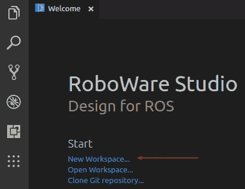

1.  在弹出的窗口中，指定工作空间名称并选择你想要放置它的文件夹：

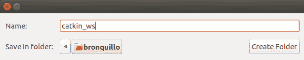

设置文件夹名称后，RoboWare 会为用户透明地执行 `catkin_init_workspace`，你将在 IDE 窗口的左侧看到一个新的文件和一个新的文件夹。它们是 `src` 文件夹和其中的文件 `CMakeLists.txt`，该文件包含你的工作空间定义和配置：

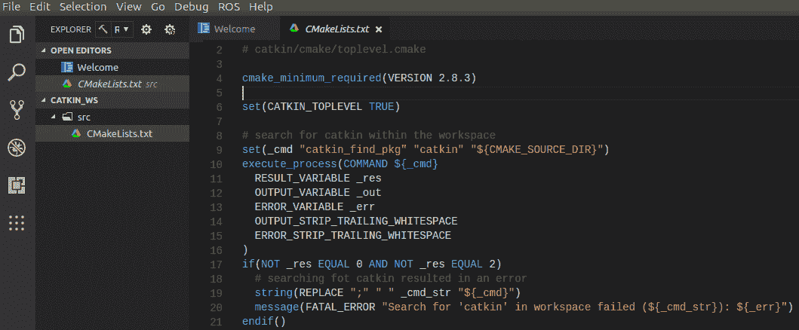

现在，你只需要注意到该文件有一个指向 ROS 安装文件夹 `/opt/ros/kinetic` 中的 ROS 系统文件的符号链接。此文件夹包含所有可能创建的工作空间的通用配置。

你可以在 RoboWare 中打开一个终端，并使用 `ls -la` 命令从特定的 `~/catkin/src` 位置列出所有文件：

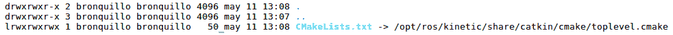

这样的终端可以通过顶部菜单栏访问，通过点击“视图”项，然后从下拉菜单中选择“集成终端 (*Ctrl* + *`*)”：

1.  选择构建模式并将其设置为调试，如下面的截图所示：

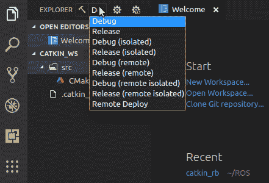

1.  然后，从顶部菜单栏中选择 ROS | 构建：

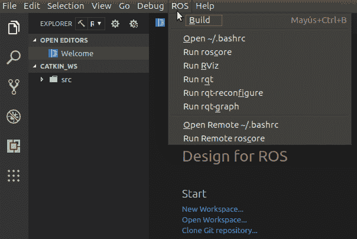

你将在屏幕底部的输出窗口中看到以下日志：

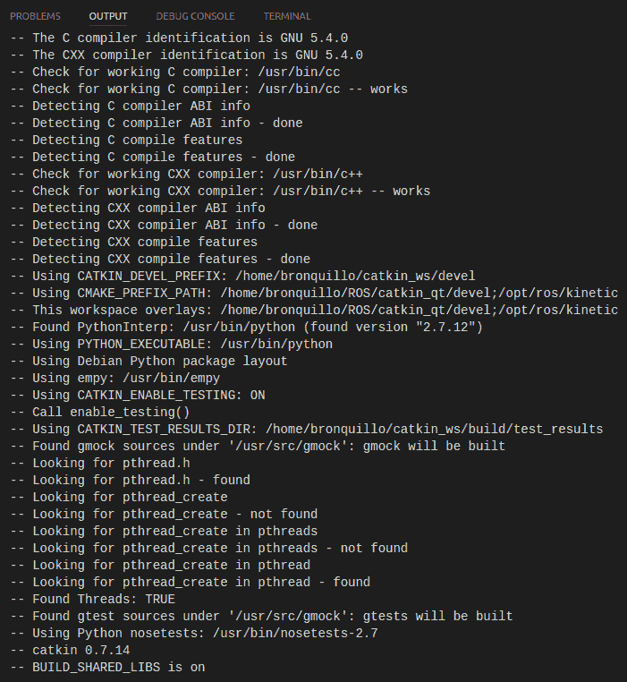

如果成功，最后几行应该看起来像这样：

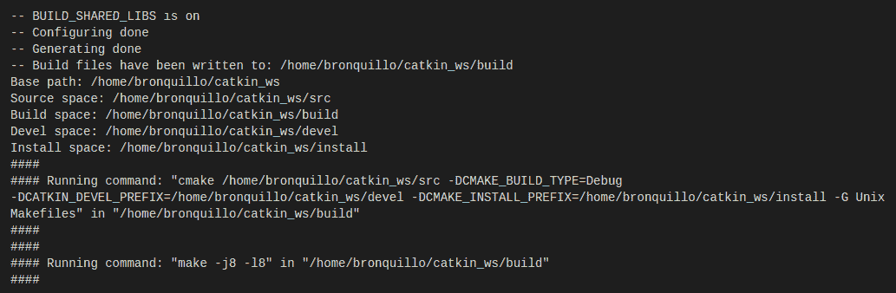

接下来，让我们设置 ROS 软件包。

# 设置 ROS 软件包

按照以下步骤设置 ROS 软件包：

1.  从终端克隆书籍仓库 [`github.com/PacktPublishing/Hands-On-ROS-for-Robotics-Programming`](https://github.com/PacktPublishing/Hands-On-ROS-for-Robotics-Programming) 到您的家目录：

```py
$ cd ~
$ git clone https://github.com/PacktPublishing/Hands-On-ROS-for-Robotics-Programming 
```

1.  我们将把本章的代码复制到 ROS 工作区。这样，您将有一个更干净的 ROS 环境：

```py
$ cp -R ~/Hands-On-ROS-for-Robotics-Programming/Chapter3_ROS_basics ~/catkin_ws/src
```

不要在 `src` 文件夹名称后添加反斜杠，`\n`。如果您这样做，文件将直接复制到 `src` 文件夹，而不是在 **`src/Chapter3_ROS_basics`** 之下。

1.  在 `Chapter3_ROS_basics` 文件夹中，您可以找到属于您将要使用的第一个 ROS 软件包的本章文件。其配置包含在 `package.xml` 文件中。请注意，软件包名称定义在 `<name>ros_basics</name>` 标签内。您可以在以下代码文件中找到它：

```py
<?xml version="1.0"?>
<package format="2">
    <name>ros_basics</name>
    <version>0.0.0</version>
    <description>Code samples for "Chapter 3: Getting started with ROS"</description>
    <maintainer email="brjapon@therobotacademy.com">Bernardo R. Japon</maintainer
    <license>GNU v3.0</license>

    <buildtool_depend>catkin</buildtool_depend>
    <build_depend>rospy</build_depend>
    <build_export_depend>rospy</build_export_depend>
    <exec_depend>rospy</exec_depend>
</package>
```

1.  然后，前往工作区根目录并再次构建：

```py
$ cd ~/catkin_ws
$ catkin_make
$ source ~/catkin_ws/devel/setup.bash
```

通常，您至少需要在以下两种情况下重新构建工作区：

+   每次您包含一个新的软件包

+   如果您的代码包含用可编译语言（如 C++）编写的部分

在这本书中，我们将主要使用 Python，这是一种广泛使用的开源语言，它使得开始使用 ROS 更加容易。由于 Python 是一种解释型语言，因此您不需要每次修改软件包的代码库时都重新构建工作区。因此，只有在添加或删除 ROS 软件包时才需要重新构建。检查新添加的软件包 `ros_basics` 是否为 ROS 所知的方法是执行此简单命令：

```py
$ rospack list | grep ros_basics
```

输出应该看起来像这样：

```py
ros_basics /home/bronquillo/catkin_ws/src/book/Chapter3_ROS_basics
```

虽然在这里，我们将从一个预制的 ROS 软件包开始工作，但了解在此阶段如何从头开始创建自己的软件包是相关的。从您工作区 `src` 位置运行此命令（`$ cd ~/catkin_ws/src/`）：

```py
$ catkin_create_pkg <YOUR-PACKAGE-NAME> <DEPENDENCIES>
```

`<YOUR-PACKAGE-NAME>` 代表您想要分配给软件包的名称。`<DEPENDENCIES>` 指的是您代码运行所需的 ROS 软件包列表。例如，如果您的软件包将包含 Python 和 C++ 代码，您将需要 `rospy` 用于前者，`roscpp` 用于后者。然后，命令将如下所示：

```py
$ catkin_create_pkg <YOUR-PACKAGE-NAME> rospy roscpp
```

这将创建一个以软件包名称命名的文件夹和两个文件：

+   `package.xml`：如前所述的软件包配置

+   `CMakelists.txt`：CMake 构建系统的输入，用于构建软件包

`CMakelists.txt` 也包含对 `<YOUR-PACKAGE-NAME>` 的引用。在我们的例子中，此文件如下所示：

```py
cmake_minimum_required(VERSION 2.8.3)
project(ros_basics)

find_package(catkin REQUIRED COMPONENTS rospy)

###################################
## catkin specific configuration ##
###################################
catkin_package()

###########
## Build ##
###########
include_directories()

```

# 使用 RoboWare 访问软件包文件并构建工作区

这里有一个替代方法。以下演示了您可以使用 RoboWare 克隆软件包仓库并构建工作区。

在按照*设置 ROS 包*部分中解释的方法克隆并放置章节代码后，你可以在 IDE 窗口左侧的文件树视图中探索内容。点击任何文件都会让你在主窗口中看到内容：

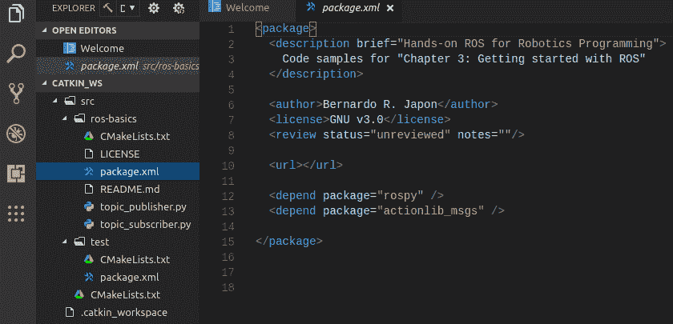

最后，构建工作空间；请注意，每次你创建自己的新包或克隆外部包时，你都需要做这件事。为此，转到顶部菜单栏，选择 ROS，然后像以前一样点击构建。

# 发布主题的节点

对于接下来的步骤，由于我们需要处理多个同时终端，我们将使用一个非常方便的工具，即 Terminator，它允许你同时处理多个终端。运行以下命令在你的系统上安装它：

```py
$ sudo apt-get update
$ sudo apt-get install terminator
```

启动 Terminator 并将屏幕分为四个终端（你可以通过鼠标右键连续分割窗口）。我们将它们分别称为`T1`、`T2`、`T3`和`T4`，如下面的截图所示：

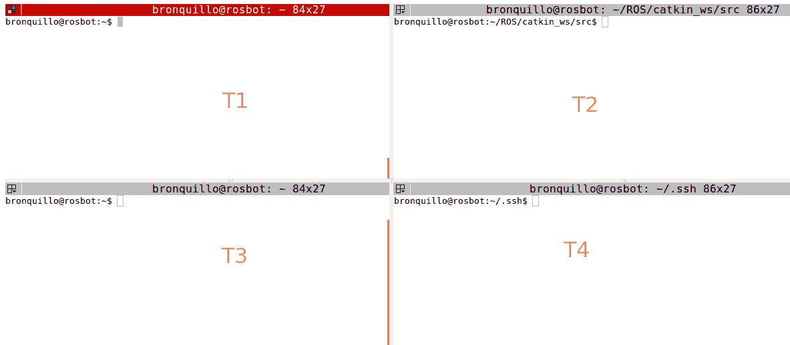

在终端 1（左上角的窗口）中启动 roscore 节点：

```py
T1 $ roscore
```

你应该能在`T1`中看到这个输出：

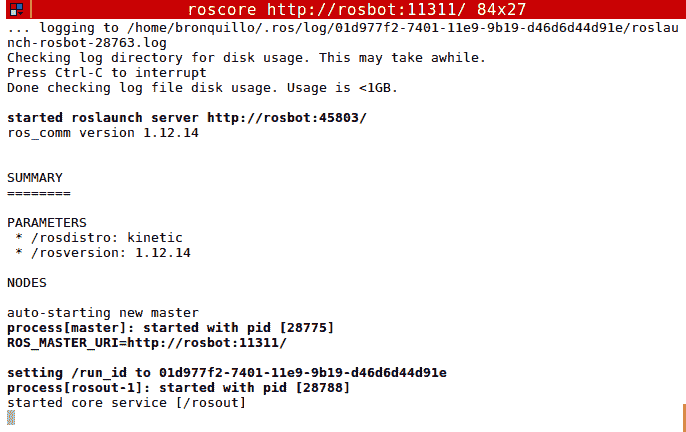

这是 ROS 的根进程。roscore 启动一个节点并启动主服务，因为 ROS 是一个集中式系统。主节点始终是必需的，以便其他节点可以执行，并且必须在任何其他节点之前启动。

在下一个终端`T2`中，运行以下命令来启动发布者节点：

```py
T2 $ rosrun ros_basics topic_publisher.py
```

这将启动`topic_publisher`节点，但没有任何事情发生！没错。发布者就是那样，一个发布者。我们需要一个监听器来了解正在发送什么数据。

前往终端 3 并列出当前声明的主题：

```py
T3 $ rostopic list
/counter
/rosout
/rosout_agg
```

在列表中，`/counter`似乎是一个每 0.5 秒更新增量计数器的主题。其他两个主题`/rosout`和`/rosout_agg`是 ROS 中的控制台日志报告机制。

`topic_publisher.py`文件中的这一行设置了`/counter`主题发布者：

```py
pub = rospy.Publisher('counter', Int32, queue_size=10)
```

要查看发布的消息，请在终端中运行此命令：

```py
T3 $ rostopic echo counter -n 5
```

这将输出将在`/counter`主题中发布的下五条消息：

```py
data: 530
---
data: 531
---
data: 532
---
data: 533
---
data: 534
---
```

最后，我们将展示一个实时视图，它会打印发送消息的实时频率：

```py
T3 $ rostopic hz counter

average rate: 2.000
min: 0.500s max: 0.501s std dev: 0.00020s window: 146
average rate: 2.000
min: 0.500s max: 0.501s std dev: 0.00020s window: 148
average rate: 2.000
min: 0.500s max: 0.501s std dev: 0.00020s window: 150
average rate: 2.000
min: 0.500s max: 0.501s std dev: 0.00020s window: 152
average rate: 2.000
min: 0.500s max: 0.501s std dev: 0.00020s window: 154
average rate: 2.000
min: 0.500s max: 0.501s std dev: 0.00020s window: 156
average rate: 2.000
```

按*Ctrl* + *C*停止`T3`中的日志。请注意，如果你在前两个终端中的任何一个终端这样做，每个终端控制的进程都将终止，并产生以下后果：

+   **终端 T2**：发布者进程将结束，并且不再通过`/counter`主题发送消息。

+   **终端 T1**：在此终端中按下*Ctrl* + *C*将终止 roscore，这使人们明显看出，这个过程是 ROS 的单点故障，也就是说，所有相关进程（包括节点和消息）都将终止。

# 监听主题的节点

由于有一个节点在`/counter`主题上发布增量计数，我们现在将启动一个订阅此主题的节点。

首先，让我们通过在`T3`中发出以下命令来可视化当前的 ROS 图：

```py
T3 $ rqt_graph
```

一个窗口会弹出并显示以下内容：

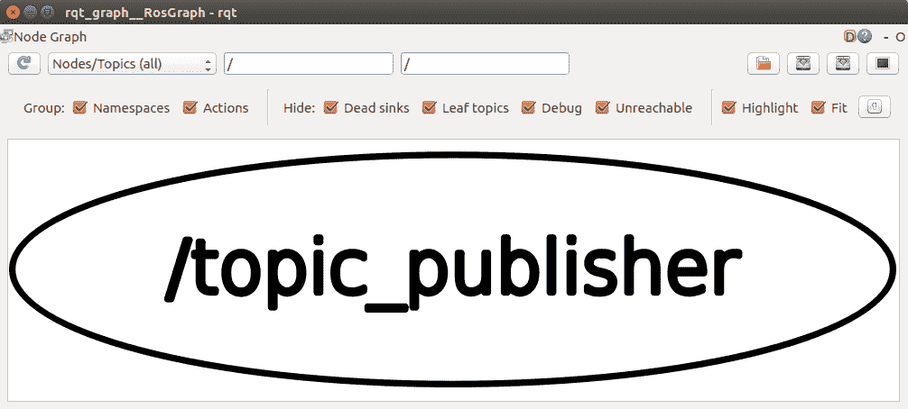

只有一个节点，即我们在`T2`中启动的那个。`/counter`主题没有出现，因为没有其他节点在监听它。为了使主题显示，请在`T4`中启动监听器：

```py
T4 $ rosrun ros_basics topic_subscriber.py
```

你将在右下角的终端窗口中看到这个日志，除非你终止（按*Ctrl* + *C*）`T1`或`T2`中的任何一个，它们分别对应于`roscore`和`topic_publisher`。

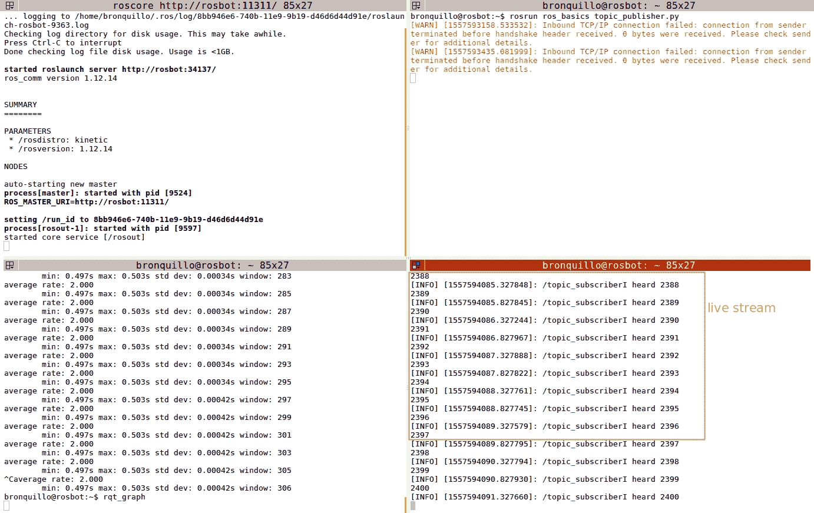

如果你回到 ROS 图窗口并点击更新图标，你会看到`/topic_publisher`节点，路由消息的`/counter`主题，以及监听节点`/topic_subscriber`：

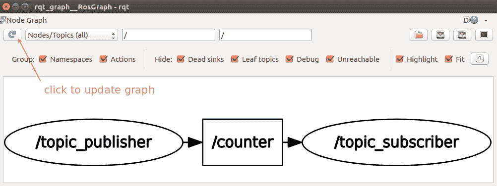

这个简单的例子说明了 ROS 中通信的发布/订阅架构。你已经可以欣赏到它是如何工作的，以及底层通信原理是多么简单，这是 ROS 框架的基础。我们现在将做一些实际的操作。

让我们的计数器表现得像一个计时器。我们该如何做呢？嗯，你只需要修改脚本`topic_publisher.py`，通过更改指定每秒向主题发送消息次数的参数，这个概念被称为发布的**频率**，其单位是*赫兹*（=次数/秒）。在脚本中，负责这种行为的 Python 对象是：

```py
rate = rospy.Rate(2)
```

在脚本下面的循环中，通过将**rospy**的`sleep`方法应用于定义的`rate`对象来实现配置的行为：

```py
rate.sleep()
```

记住，**rospy**是允许我们运行用 Python 编写的节点的 ROS 库。**rospy**定义了一组方法来在 ROS 中实现有用的功能，例如以这种方式设置发布频率。

上面的行表示每秒发布两条消息，即每 0.5 秒一条消息。因此，如果`rate`设置为 1 Hz，频率将是每秒一条消息，因此模拟了一个计时器。你可以在不需要停止 ROS 的情况下修改这样的脚本`topic_publisher.py`，并且一旦再次执行它，节点就会回到图中。让我们一步一步地展示如何做：

1.  在终端`T2`中按*Ctrl* + *C*停止节点的执行。

1.  修改文件以以 1 Hz 的速率发布，如之前所示。

1.  然后，重新启动节点：

```py
T2 $ rosrun ros_basics topic_publisher.py
```

你将在启动`topic_subscriber.py`的终端`T4`中看到效果。因此，新行出现的速度（即计数）将是之前的两倍，当速率是 2 Hz 时。这将产生每秒一次的计数更新（+1），对应于 1 Hz 的速率。

# 在同一节点中结合发布者和订阅者

一个节点能否像真实人类一样同时说话和监听？嗯，如果 ROS 是一个机器人框架，那么这是可能的。让我们来探索这个问题：

1.  在前两个终端中启动这两个命令，每个命令都在一个独立的终端中：

```py
T1 $ roscore
T2 $ rosrun ros_basics doubler.py
```

`/doubler` 是一个订阅 `/number` 主题的节点，如 `doubler.py` 脚本中的这两行所述：

```py
rospy.init_node('doubler')
...
sub = rospy.Subscriber('number', Int32, callback)
...
```

此外，`/doubler` 还在 `/doubled` 主题中发布其结果：

```py
...
pub = rospy.Publisher('doubled', Int32, queue_size=10)
```

你会注意到没有任何事情发生，因为它需要被喂以可以乘以 2 的数字，如 `topic_subscriber.py` 的回调中所示：

```py
def callback(msg):
  doubled = Int32()
  doubled.data = msg.data * 2
```

1.  启动一个用于监听 `/doubled` 主题的终端：

```py
T3 $ rostopic echo doubled
```

然后，让我们手动发布一个 `/number` 主题：

```py
T4 $ rostopic pub number std_msgs/Int32 2
 publishing and latching message. Press ctrl-C to terminate
```

`T3` 终端的输出是 `4`，正如预期的那样：

```py
data: 4
---
```

1.  在 `T4` 中尝试发送其他数字，并检查双倍值是否立即在 `T3` 中显示。

如果你在一个第五个终端中发出 `rqt_graph`，你会看到类似这样的内容：


这里，你可以看到 `/number` 和 `/doubled` 主题，`/doubler` 节点，以及两个具有大机器名称的其他节点，它们的对应关系如下：

+   +   前一图中左侧的节点 `/rostopic_5469_` 是由 `T4` 中的命令创建的：

```py
T4 $ rostopic pub number std_msgs/Int32 2
```

+   +   右侧的节点 `/rostopic_5631_` 是由 `T3` 中的命令创建的：

```py
T3 $ rostopic echo doubled
```

1.  为了完成这个练习，我们将把数字喂给 `/counter` 主题，不是从命令行，而是从上一节中看到的发布节点脚本 `topic_publisher.py` 中：将 `doubler.py` 中的主题名称修改为 `counter`：

```py
sub = rospy.Subscriber('counter', Int32, callback)
```

然后，在停止所有终端后，在每个独立的终端中执行以下每一行：

```py
T1 $ roscore
T2 $ rosrun ros_basics doubler.py
T3 $ rosrun ros_basics topic_publisher.py
T4 $ rostopic echo doubled
```

在这个终端中，每次发布 `/counter` 时，你将看到 `counter` * 2 的结果。看看 ROS 图（记得点击刷新按钮），你会发现它反映了正在发生的事情：


请记住，`rqt_graph` 在调试代码时将提供非常有用的信息，例如，检测主题名称中的任何错误。看看下面的图，其中乘以 2 不起作用，因为 `/topic_publisher` 订阅了 `count` 主题（注意末尾缺少 `r` 字符）。节点彼此断开连接，错误输入的主题（没有人监听）没有出现：

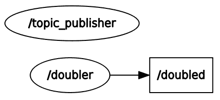

在下一节中，我们将概述 ROS 包系统的扩展。

# 使用 ROS 的公共包

ROS 贡献的包在官方网站 [`www.ros.org/browse/list.php`](http://www.ros.org/browse/list.php) 上索引。

截至 2018 年 7 月，ROS Indigo（为 Ubuntu 14.04 LTS 发布的发行版）有超过 2900 个包，而 ROS Kinetic（2016 年，Ubuntu 16.04 LTS）有超过 1600 个。其中一些下载量较大的包括以下内容：

+   `rviz` ([`wiki.ros.org/rviz`](http://wiki.ros.org/rviz)): 这是 ROS 的 3D 可视化工具。您将在第四章，*创建虚拟双轮 ROS 机器人*中开始使用它。

+   `gazebo_ros_pkgs` ([`wiki.ros.org/gazebo_ros_pkgs`](http://wiki.ros.org/gazebo_ros_pkgs)): 这允许您在 ROS 内部使用 Gazebo 3D 模拟器。我们将在第五章，*使用 Gazebo 模拟机器人行为*中介绍 Gazebo。

+   `sensor-msgs` ([`wiki.ros.org/sensor_msgs`](http://wiki.ros.org/sensor_msgs)): 这是一个定义常用传感器（如摄像头和扫描激光测距仪）消息的包。

+   `tf2` ([`wiki.ros.org/tf2`](http://wiki.ros.org/tf2)): 这是一个处理环境中所用到的多个参考系之间坐标变换的包。

+   `laser-geometry` ([`wiki.ros.org/laser_geometry`](http://wiki.ros.org/laser_geometry)): 这使得将 2D 激光扫描转换为点云以用于导航成为可能。

这应该能给您一个清晰的了解，ROS 编程对您意味着什么。换句话说，集成其他开发者（即包）开发的软件，并通过设计一个连贯的 ROS 图来使它们协同工作，以构建您希望机器人拥有的功能。

# 摘要

在本章中，我们介绍了 ROS，并通过简单的示例进行实践，以便帮助您理解 ROS 的架构。顶级实体是工作空间，它是一个用于构建和运行软件的独立环境。

工作空间由 ROS 包组成，即提供特定功能以集成到您的机器人中的预制的软件块。随后，catkin 是每次您在工作空间中包含新包时用于构建软件的工具。

节点是 ROS 中的基本实体，它包含使机器人工作的功能代码块。提供特定功能的节点集合构成了一个 ROS 包。**roscore**，运行主节点的进程，允许每个节点通过订阅发布的主题来找到其他节点。**roscore**还管理 ROS 参数的数据库。

节点之间的通信是通过主题实现的，主题是 ROS 图中的通道——信息流过的边缘。当一个节点需要使用主题的信息时，它通过订阅它来实现。

在下一章中，你将学习如何构建一个差速驱动机器人的虚拟模型，该模型模拟 GoPiGo3 的特性。本章还将为你提供方法，首先使用虚拟机器人测试你的代码，然后安装并在物理机器人上执行它。

# 问题

1.  ROS 环境中的顶级组件是什么？

A) 包

B) 工作空间

C) ROS 图

1.  roscore 进程的目的是什么？

A) 允许节点与其他节点通信并管理机器人参数

B) 为图中的所有其他节点提供主节点

C) 允许 ROS 节点从 LAN 外部被发现

1.  标记正确的句子：一个节点可以 __ 。

A) 只发布主题或只订阅主题

B) 同时发布主题和订阅主题

C) 发布主题和/或订阅其他主题

1.  如果一个节点未能执行其程序，会发生什么？

A) 机器人的一些功能将失败

B) 机器人将无法工作

C) 它发布的主题将被设置为未定义

1.  标记错误的句子：在发布的主题中识别消息的方法是 __。

A) 启动一个发布此类主题数据的节点

B) 输入 `$ rostopic echo </topic_name>` 命令

C) 编写一个订阅该主题的节点

# 进一步阅读

要深入了解本章中解释的概念，你可以遵循以下链接和教程：

+   ROS 教程*s:*[`wiki.ros.org/ROS/Tutorials`](http://wiki.ros.org/ROS/Tutorials) (第一部分至第六部分)

+   *ROS 机器人实例，第二版，Fairchild C.，Harman，Packt Publishing，T. L*。（2017），*第一章，ROS 入门*：[`www.packtpub.com/hardware-and-creative/ros-robotics-example-second-edition`](https://www.packtpub.com/hardware-and-creative/ros-robotics-example-second-edition)。

+   *使用 ROS 编程机器人*，*Quigley M.，Gerkey B.，Bill Smart B*。（2015），*第一版，O'Reilly*：[`shop.oreilly.com/product/0636920024736.do`](http://shop.oreilly.com/product/0636920024736.do) (*第二章*，*预备知识*和*第三章*，*主题*）。
