# 创建虚拟两轮 ROS 机器人

RViz 是一个 3D 可视化工具，可以显示机器人模型。它提供了一个可配置的 **图形用户界面**（**GUI**），允许用户显示他们可能请求的任何信息，以便执行当前任务。RViz 可用于机器人可视化和在构建 **统一机器人描述格式**（**URDF**）模型时调试特定功能。此格式使用 XML 来模拟机器人。

为了说明如何使用 RViz 和 URDF，在本章中，你将构建一个简单的两轮机器人，它是 GoPiGo3 的数字孪生。你将创建描述机器人主要组件的 URDF 文件。此文件作为多个 ROS 工具可视化的输入 – 不仅包括 RViz，还包括 Gazebo 模拟工具，它还包含物理引擎。Gazebo 将在下一章中介绍，而本章中，你将集中精力熟悉 RViz。

本章将教你如何理解 URDF 文件的语法，并掌握在构建机器人模型时使用 RViz 系统性地测试/检查功能的技能。

在本章中，我们将介绍以下主题：

+   开始使用 RViz 进行机器人可视化

+   使用 URDF 构建 differential drive 机器人

+   使用 RViz 检查 GoPiGo3 模型在 ROS 中的情况

+   URDF 模型中的机器人参考系

+   使用 RViz 在构建过程中检查结果

# 技术要求

在上一章中，你被告知如何克隆本书的代码仓库，以便它在你的笔记本电脑的主文件夹中。如果你没有这样做，从你的笔记本电脑上的终端，像这样将仓库克隆到你的主文件夹中：

```py
$ cd ~
$ git clone https://github.com/PacktPublishing/Hands-On-ROS-for-Robotics-Programming 
```

接下来，只需将本章的代码复制到 ROS 工作空间中。这样，你将拥有一个更干净的 ROS 环境：

```py
$ cp -R ~/Hands-On-ROS-for-Robotics-Programming/Chapter4_RViz_basics ~/catkin_ws/src/
```

移动到新文件的路径并检查文件是否存在：

```py
$ cd ~/catkin_ws/src/Chapter4_RViz_basics
$ ls -la
```

本章包含一个名为 `rviz_basics` 的新 ROS 软件包，因此请重新构建工作空间，以便它被你的 ROS 环境所识别。

```py
$ cd ~/catkin_ws
$ catkin_make
```

通过选择软件包并列出其文件来检查软件包是否正确安装：

```py
$ roscd rviz_basics
$ ls -la
```

现在，你已经准备好完成这一章了。

# 开始使用 RViz 进行机器人可视化

RViz 提供了一个可配置的 GUI，以便你可以显示有关机器人的特定信息。

为了确保 RViz 加载默认配置，请将 `default.rviz` 文件放置在 `~/.rviz/` 文件夹中。你将在该文件夹中找到 `Chapter4_RViz_basics`。

你可以使用以下命令打开 RViz GUI：

```py
T1 $ roscore
T2 $ rviz
```

`T2` 命令，`rviz` 是官方 `$ rosrun rviz rviz` 声明的缩写，其中第一个 `rviz` 指的是软件包，第二个 `rviz` 指的是同名节点。

目前，RViz 窗口将是空的，所以它只会显示地板级别的网格。在下一节中，我们将教你如何构建机器人模型并准备可视化它。一旦启动，你将看到一个类似于以下截图的窗口：

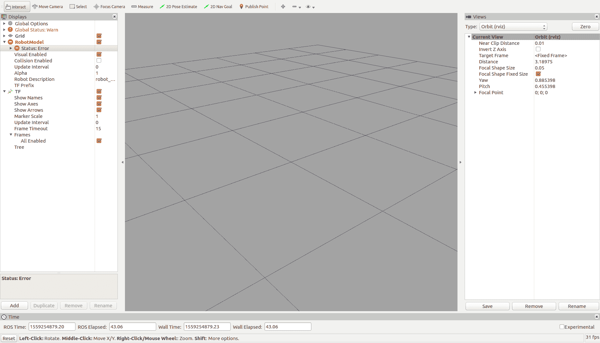

如果你仔细查看前面的截图，你会在左侧面板看到一个错误消息。这是因为还没有加载机器人模型。我们将在下一节中开发这个模型。

# 使用 URDF 构建差速驱动机器人

GoPiGo3 套件由四个子组件组成：

+   底盘，这是所有部件都连接到的主要结构。这包括以下内容：

    +   Raspberry Pi 和 GoPiGo3 板

    +   电机

    +   电池包

    +   轮子

    +   万向轮

+   两个轮子——左轮和右轮，每个轮子由一个电机驱动。

+   Caster（万向轮），它是一个连接在底盘后部的小型自由轮，使机器人在三个点上保持支撑：左右轮子和万向轮本身。请注意，一个自由轮是使机器人能够在地面上滚动所需的最小条件：

    +   如果没有万向轮，系统将会欠约束。那么，你将得到一个需要由其电机连续驱动以保持平衡的自平衡机器人。这是一个*闭环*控制问题，需要从其加速度计和陀螺仪获取的**惯性测量单元**（**IMU**）数据来驱动电机并保持机器人平衡：

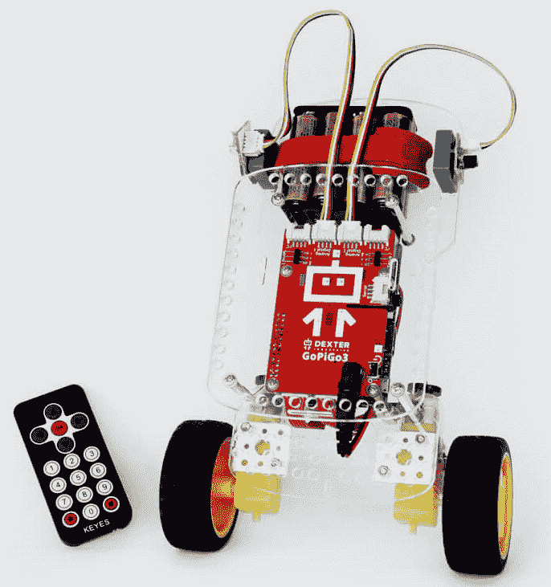

图片来源：Dexter Industries https://shop.dexterindustries.com/media/catalog/product/cache/4/thumbnail/1800x2400/9df78eab33525d08d6e5fb8d27136e95/b/a/balancebot_remote2-150x150_1_1.jpg

1.  +   如果有两个万向轮，系统将会过约束。机器人将在四个点上得到支撑——两个轮子和两个万向轮——第二个万向轮的位置将由另一个万向轮和两个轮子确定。如果四个轮子/万向轮中的任何一个没有与地面接触，你将得到一个跛脚的机器人。

从模拟模型的角度来看，像 GoPiGo3 这样的差速驱动机器人由三个部分组成，每个部分都是一个刚体。因此，我们将机器人分为移动部分：

+   机器人本体，包括底盘和所有连接到它上的固定部件（Raspberry Pi、GoPigo3 板、电机和电池包）

+   左轮和右轮

+   Caster

回到 ROS，你将使用 URDF 构建一个模拟的 GoPiGo3。这是一个表示组件级别的机器人模型的 XML 格式描述。ROS 包含一个 URDF 包（[`wiki.ros.org/urdf`](http://wiki.ros.org/urdf)），以便在模拟目的下接受这种机器人描述格式。

在接下来的章节中，我们将展示如何使用 URDF 描述 GoPiGo3 的四个移动部分。

# GoPiGo3 的 URDF 概述

首先，我们将为您提供一个构建模型的概述，然后我们将一步一步地引导您通过这个过程。我们的 URDF 模型在 RViz 中的渲染方式如下：

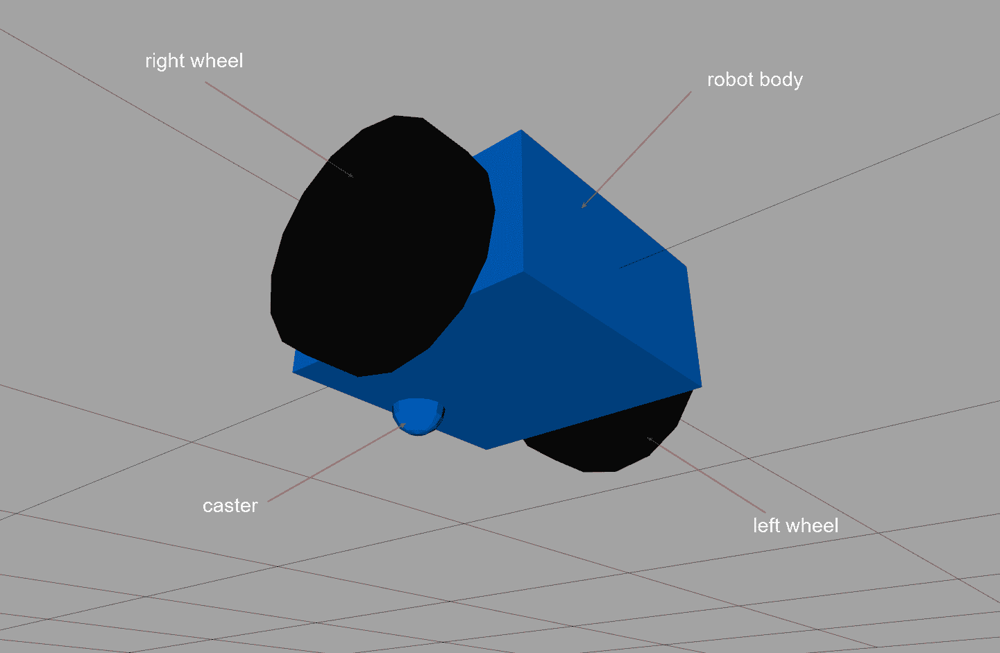

此模型对应以下 URDF 描述：

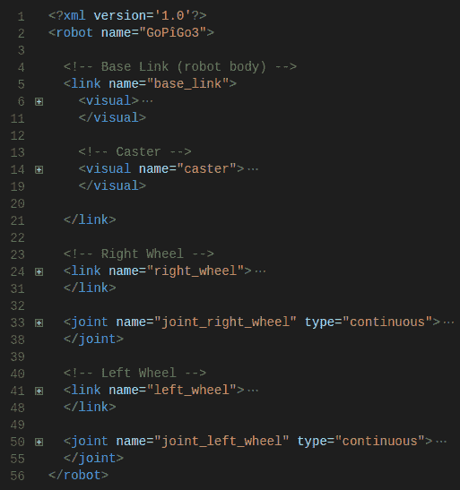

XML 标签的内容已经折叠——这可以从行号右侧的加号推断出来——以显示每个块对应于机器人的一个部分：

+   最高级标签是`<robot>`，它标识了整个机器人。

+   `<link>`标签指的是每个移动部分，通过`name`属性进行标识。所有内容都指定了该部分的特征：

    +   `name="base_link"`指的是机器人身体，在这种情况下，底盘及其附件：树莓派、GoPiGo3 板、电机和电池包。

    +   `name="caster"`指的是万向节自由轮，但它位于`<visual>`子标签内，这意味着它是机器人身体的一部分，而不是一个独立的移动部分。尽管它是一个滚动元件，但请记住，模拟模型试图用简单的描述来捕捉其现实世界的特性。由于万向节仅仅是一个支撑，它不需要由电机驱动。因此，我们可以将其固定在机器人身体上，并且只处理三个移动部分（机器人身体、右轮和左轮）而不是四个。如果你在担心它可能产生的摩擦，那么请不要担心——稍后，我们将学习如何设置零值以确保它像自由轮一样运行。《<visual>`标签指的是机器人一部分的刚体表示，而无需将其定义为单独的连接。

    +   `name="right_wheel"`指的是右轮。

    +   `name="left_wheel"`指的是左轮。

+   `<joint>`标签代表两个部分之间的连接。从机械角度来看，这些关节标签对应于车轮安装的轴承。每个车轮连接都有一个与之相关联。

接下来，我们将详细解释在这个模型中使用的每个`<link>`和`<joint>`标签的内容。

# URDF 机器人身体

`<link>`元素，如 URDF XML 规范中定义的（[`wiki.ros.org/urdf/XML/link`](http://wiki.ros.org/urdf/XML/link)），定义了一个具有惯性、视觉特征和碰撞属性的刚体。在本章中，我们将介绍`<visual>`。我们将把`<inertia>`和`<collision>`留到本书的后面部分，因为这些属性仅在执行 Gazebo（见第五章，*使用 Gazebo 模拟机器人行为*）的物理模拟时才需要。

`<visual>`标签描述了部件的视觉外观。不要将其与`<collision>`标签混淆，因为后者定义了用于干涉或碰撞计算的体积。通常，两者可能定义不同的体积，尽管它们在大多数情况下是一致的。

为什么它们应该不同？对于复杂形状，干涉计算在 CPU 负载和时间长度上可能会很重。因此，在`<collision>`标签中使用简单形状会更好，将它们定义为实际形状的包络。例如，对于以下屏幕截图中的机械臂，你可以将手臂的`<visual>`元素定义为实际形状——即显示的形状——并将`<collision>`元素简化为手臂的包络圆柱，以方便干涉计算：

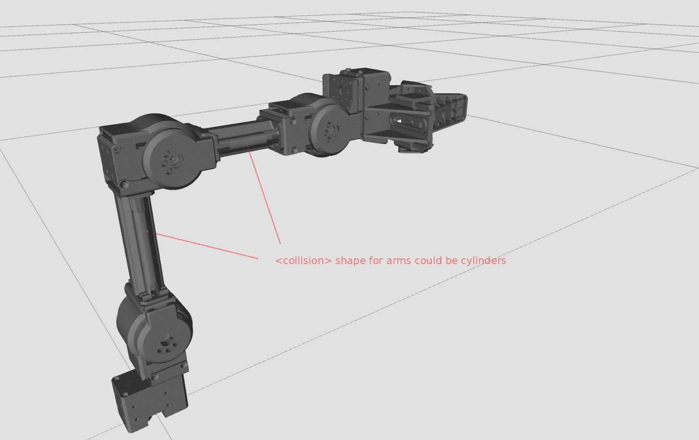

`<origin>`标签指定了`<visual>`元素相对于链接参考框架的参考框架。

`<geometry>`标签描述了视觉形状（盒子、圆柱、球体或网格）及其尺寸。

`<material>`标签使用`<color>`和`<texture>`设置`<visual>`元素的外观。

给定这些标签描述，我们可以在以下代码片段中轻松地了解`base_link`元素，即机器人身体：

```py
<?xml version='1.0'?>
<robot name="gopigo3">

  <!-- Base Link -->
  <link name="base_link">
    <visual>
      <origin xyz="0 0 0" rpy="0 0 0" />
      <geometry>
          <box size="0.5 0.5 0.25"/>
      </geometry>
      <material name="blue">
        <color rgba="0 0.5 1 1"/>
      </material>
    </visual>

    <!-- Caster -->
    <visual name="caster">
      <origin xyz="0.2 0 -0.125" rpy="0 0 0" />
      <geometry>
        <sphere radius="0.05" />
      </geometry>
    </visual>

  </link>
...
```

因此，`base_link`元素由以下内容组成：

+   一个长度为 0.5 米、高度为 0.25 米的盒子。

+   它的参考框架位于盒子的几何中心，与链接的参考框架相同（所有三个线性轴和三个旋转轴的值均为零）。

+   `<material>`标签指定蓝色颜色为 RGBA 索引：红色=0，绿色=0.5，蓝色=1。第四个，A=1，是 alpha 通道，它表示不透明度。值为 1 表示不透明物体，而值为 0 表示它是透明的。

在 RViz 中渲染链接提供了以下简单的盒子方面：

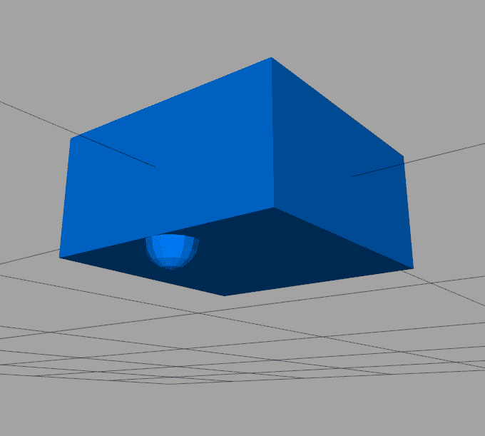

但等等——那个附着在底部面的半球形形状是什么？那是驱动器，是我们可以将它建模为机器人身体的一部分的自由轮，如前所述。

# 驱动器

驱动器描述嵌套在`<link name="base_link">`元素中。这意味着它是一个固定在机器人身体上的刚性部分。让我们来看看它是什么：

+   它是一个半径为 0.05 米的球体，位于 x=0.2 米，z=-0.125 米。请注意，*Z*坐标是盒子高度的一半（=0.25 米）且为负值。这意味着上半球体嵌入在盒子内，而下半球体仅保持在盒子的底部部分可见。

+   默认情况下，选择的颜色与为盒子定义的颜色相同。

仔细检查以下代码，以确保你理解它：

```py
    <!-- Caster -->
 <visual name="caster">
 <origin xyz="0.2 0 -0.125" rpy="0 0 0" />
 <geometry>
 <sphere radius="0.05" />
 </geometry>
 </visual>
```

这就是驱动器在 RViz 中的外观，使盒子半透明：

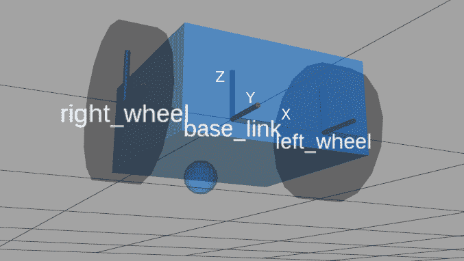

注意 *X*、*Y* 和 *Z* 轴的位置和方向，并注意它们的方向。这个事实在匹配 IMU 的轴时尤其重要。下面的照片显示了如何在物理 GoPiGo3 上放置这样的传感器，以确保 IMU 轴与 `base_link` 框架平行，并且具有相同的方向（请参见传感器表面打印的标记轴组）：

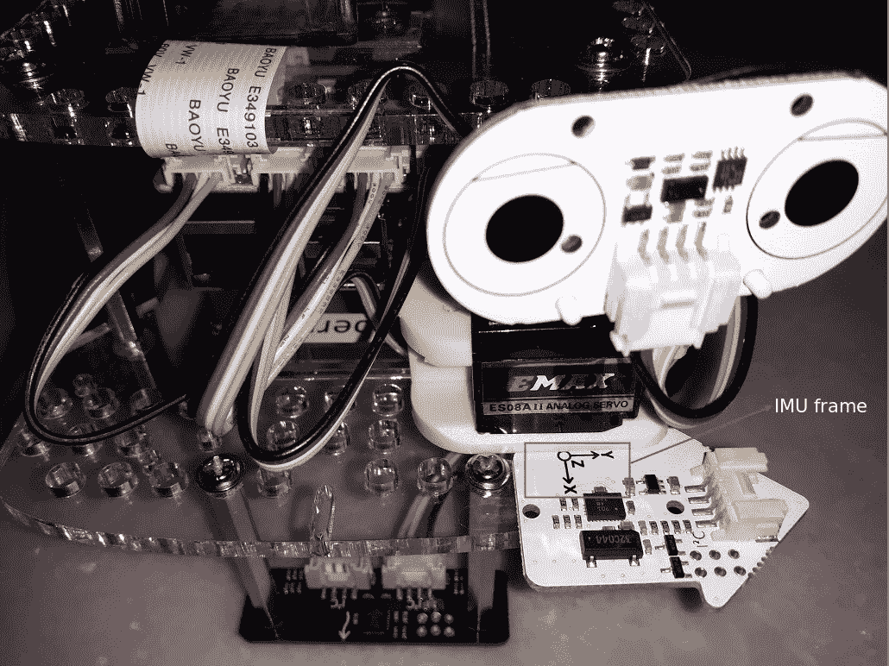

最后，在下面的照片中，你可以看到整个机器人。这将帮助你确保你知道前一张照片中细节的位置：

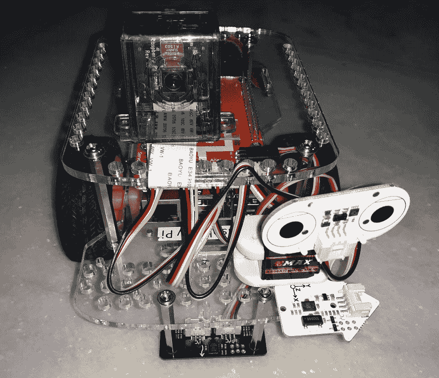

接下来，让我们看看 URDF 模型的左右轮子。

# URDF 模型的左右轮子

既然你已经了解了基本的 URDF 标签，那么阅读右轮的定义就很简单了，如下代码片段所示：

```py
  <!-- Right Wheel -->
  <link name="right_wheel">
    <visual>
      <origin xyz="0 0 0" rpy="1.570795 0 0" />
      <geometry>
          <cylinder length="0.1" radius="0.2" />
      </geometry>
      <material name="black">
        <color rgba="0.05 0.05 0.05 1"/>
      </material>
    </visual>
  </link>

  <joint name="joint_right_wheel" type="continuous">
    <parent link="base_link"/>
    <child link="right_wheel"/>
    <origin xyz="0 -0.30 0" rpy="0 0 0" /> 
    <axis xyz="0 1 0" />
  </joint>
```

在 `<origin>` 标签内部，`rpy` 属性的第一个分量（绕 *X* 轴的旋转），1.570795 = π/2，是设置轮子为垂直位置的关键。圆柱形轮子的半径为 0.2 m，长度为 0.1 m。

这里新增的元素是 `<joint>` 标签 ([`wiki.ros.org/urdf/XML/joint`](http://wiki.ros.org/urdf/XML/joint))，它用于指定关节的动力学和运动学以及其安全限制：

+   `type="continuous"` 表示一个铰链关节，它围绕轴旋转且没有上下限。

+   父链接和子链接标识了哪些链接通过这个关节连接。

+   原点指定了相对于父链接的子链接在 *X*、*Y* 和 *Z* 方向上的偏移以及三个旋转。然后，`<origin xyz="0 -0.30 0" rpy="0 0 0" />` 将关节放置在 Y = -0.30 m 的位置。这些坐标是相对于父链接的框架：

    +   `axis` 定义了相对于父框架的关节旋转轴。这里，`<axis xyz="0 1 0" />` 表示旋转轴是 Y（Y 坐标中的值 1）。

左轮的 XML 描述几乎与右轮相同。唯一的区别是关节在 Y = 0.30 m 的位置（`<origin xyz="0 0.30 0" ... />`），与右轮的符号相反，即 `<origin xyz="0 -0.30 0" ... />`：

```py
  <!-- Left Wheel -->
  <link name="left_wheel">
    <visual>
      <origin xyz="0 0 0" rpy="1.570795 0 0" />
      <geometry>
          <cylinder length="0.1" radius="0.2" />
      </geometry>
      <material name="black"/>
    </visual>
  </link>

  <joint name="joint_left_wheel" type="continuous">
    <parent link="base_link"/>
    <child link="left_wheel"/>
    <origin xyz="0 0.30 0" rpy="0 0 0" /> 
    <axis xyz="0 1 0" />
  </joint>
```

在下一节中，你将学习如何在 RViz 中可视化 URDF 描述，RViz 是 ROS 的可视化工具。

# 使用 RViz 检查 ROS 中的 GoPiGo3 模型

现在，是时候开始使用 ROS 进行工作了！你将发现 `roslaunch`，这是 ROS 命令，允许我们一次性启动多个节点，避免了像上一章那样需要打开单独的终端的需求。

由于您已经克隆了本书的代码仓库，我们将处理的文件位于仓库的 `Chapter4_RViz_basics` 文件夹中，并且它们都是 `rviz_basics` ROS 软件包的一部分，如 `package.xml` 中定义的那样。本章的文件结构可以在以下 RoboWare Studio IDE 截图中看到：

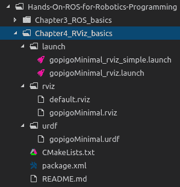

您可以在终端中使用 `tree` bash 命令获取此树状结构：

```py
$ tree ~/catkin_ws/src/book/Chapter4_RViz_basics
```

请记住，它默认不包含在 Ubuntu 中，您可能需要安装它：

```py
$ sudo apt-get update
$ sudo apt-get install tree
```

这将产生以下输出：

```py
├── CMakeLists.txt
├── launch
│   ├── gopigoMinimal_rviz.launch
│   └── gopigoMinimal_rviz_simple.launch
├── package.xml
├── README.md
├── rviz
│   ├── default.rviz
│   └── gopigoMinimal.rviz
└── urdf
 └── gopigoMinimal.urdf
```

此树状结构根据文件类型将文件组织到各种文件夹中：

+   `./launch` 将具有 `*.launch` 扩展名的文件分组，即将在运行时环境中使用的不同机器人配置和软件包。每个启动文件对应于特定运行的设置。

+   `./rviz` 存储特定 RViz 配置的文件，每个可能的配置一个文件。

+   `./urdf` 包含我们之前描述的机器人模型的 XML URDF 文件。

确保此文件夹位于您的工区内，并使用 `catkin` 构建它，以便 ROS 能够识别您的新软件包：

```py
$ cd ~/catkin_ws
$ catkin_make
```

在 第三章 的 *ROS 入门* 部分的 *使用 Roboware – 创建工作空间并构建它* 小节中，我们解释了如何在 Roboware IDE 中执行这些操作。如果您更喜欢使用桌面应用程序，请查看该章节和该小节。

最后，您可以从终端使用以下片段执行 `roslaunch`：

```py
$ roslaunch rviz_basics gopigoMinimal_rviz.launch model:=gopigoMinimal
```

RViz 窗口将启动，您将看到一个简化的 GoPiGo3 模型，如下所示：


您可以通过旋转鼠标并单击左键来检查模型，并通过使用鼠标滚轮或单击右键并向前（放大）或向后（缩小）移动鼠标来放大/缩小。

RViz 的左侧面板包含两个对我们感兴趣的项目。用鼠标单击展开以检查它们：

+   **RobotModel**：您可以使用刻度来可视化所需的内容。在“链接”下的项目允许我们访问 GoPiGo URDF 模型的各个部分：`base_link`（机器人本体）、`left_wheel` 和 `right_wheel`。

+   **TF**：它提供了访问多个坐标系框架的权限。在我们的案例中，GoPiGo3 的每个部分都有一个框架，每个关节也有一个框架。

接下来，我们将查看 `roslaunch` 命令。

# 理解 roslaunch 命令

让我们退一步，使用一个最小的启动文件来理解这些脚本的语言法：

```py
$ roslaunch rviz_basics gopigoMinimal_rviz_simple.launch
```

正如我们在 `rosrun` 中所看到的，ROS 命令的结构非常相似：

+   第一个是命令名称本身，`roslaunch`。

+   第二个是软件包名称，`rviz_basics`。

+   第三个是我们将要执行的脚本，`gopigoMinimal_rviz_simple.launch`。

`gopigoMinimal_rviz_simple.launch` 文件的内容如下：

```py
<launch>
   <!-- set these parameters on Parameter Server -->
   <param name="robot_description" textfile="$(find rviz_basics)/urdf/gopigoMinimal.urdf" />

   <!-- Start 3 nodes: joint_state_publisher, robot_state_publisher and rviz -->

   <!-- Send joint values -->
   <node pkg="joint_state_publisher" type="joint_state_publisher" name="joint_state_publisher"/>

   <!-- Combine joint values to TF-->
   <node name="robot_state_publisher" pkg="robot_state_publisher" type="state_publisher"/>

   <node name="rviz" pkg="rviz" type="rviz" args="-d $(find rviz_basics)/rviz/gopigoMinimal.rviz" required="true" />
</launch>
```

语法，以 XML 格式，应该对你来说很熟悉。在这个文件中，有三种类型的标签：

+   `<launch> </launch>`: 定义了属于 `roslaunch` 描述的行块。

+   `<node />`: 这是用来执行 ROS 节点的句子。它等同于我们在上一章中解释的 `rosrun` 命令。因此，与 `<node />` 标签行等效的命令如下：

```py
<node name="robot_state_publisher" pkg="robot_state_publisher" type="state_publisher"/>

is equivalent to...

$ rosrun robot_joint_state_publisher state_publisher
```

你可以很容易地推断出 `<node>` 标签的 `pkg` 属性是包名，而属性类型指的是包含此节点代码的脚本。

+   `<param />` 代表参数，是 ROS 中的一个新概念。它包含一个存储在 ROS 参数服务器中的值，你可以将其视为存储机器人特征的地方。一组参数定义了特定的机器人配置。如 ROS 官方文档（[`wiki.ros.org/Parameter%20Server`](http://wiki.ros.org/Parameter%20Server)）中所述，ROS 参数服务器如下：

"*这是一个可以通过网络 API 访问的共享、多变量字典。节点使用此服务器在运行时存储和检索参数。由于它不是为高性能设计的，因此最好用于静态、非二进制数据，如配置参数。*"

在我们的特定情况下，我们在启动文件中有以下声明：

```py
 <param name="robot_description" textfile="$(find rviz_basics)/urdf/gopigoMinimal.urdf" />
```

`robot_description` 参数是存储 URDF 文件的路径。你将看到这样的路径在 `$(find rviz_basics)` 文件属性中包含一个环境变量。这是 ROS 提供的一个非常好的功能，这样你就不必提供绝对或相对路径。`find` 命令应用于 `rviz_basics` 包，并返回包的绝对路径，即 `~/catkin_ws/src/book/Chapter4_RViz_basics`。`$` 符号表示与系统环境变量相同的值。

# 使用 Roboware 执行启动文件

使用 `roslaunch **rviz_basics** gopigoMinimal_rviz_simple.launch` 命令所做的工作，可以在 **Roboware** IDE 中通过将其放置在文件顶部，右键单击鼠标以显示上下文菜单，并选择第一个项目，即运行启动文件来完成：

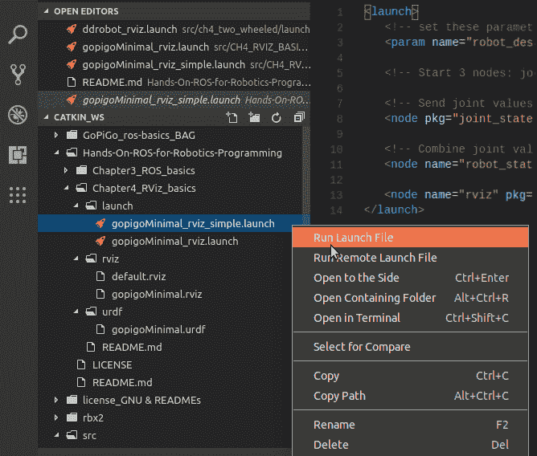

在接下来的部分，我们将执行另一个启动文件，`gopigoMinimal_rviz_simple.launch`，它引入了更多高级功能。在此之前，请关闭任何打开的 RViz 窗口或在终端中按 *Ctrl* + *C* 以关闭正在运行的 ROS 进程。

# 从 RViz 控制 GoPiGo3 机器人的轮子

可以使用以下命令启动机器人的完整版本：

```py
$ roslaunch rviz_basics gopigoMinimal_rviz.launch model:=gopigoMinimal
```

我们在这里所做的是从命令行提供一个参数，`gopigoMinimal`。如果你注意查看启动文件的内容，即 `gopigoMinimal_rviz.launch`，你会在文件开头找到一个带有 `<arg />` 标签的新部分：

```py
<launch>
    <!-- values passed by command line input -->
    <arg name="model" default="gopigoMinimal" />
    <arg name="gui" default="False" />

    <!-- set these parameters on Parameter Server -->
    <param name="robot_description" textfile="$(find rviz_basics)/urdf/$(arg model).urdf" />

    <!-- Start 3 nodes: joint_state_publisher, robot_state_publisher and rviz -->

    <!-- Send joint values -->
    <node pkg="joint_state_publisher" type="joint_state_publisher" name="joint_state_publisher">
      <param name="/use_gui" value="$(arg gui)"/>
    </node>
    <!-- Combine joint values to TF-->
    <node name="robot_state_publisher" pkg="robot_state_publisher" type="state_publisher"/>

    <node name="rviz" pkg="rviz" type="rviz" args="-d $(find rviz_basics)/rviz/$(arg model).rviz" required="true" />
    <!-- (required = "true") if rviz dies, entire roslaunch will be killed -->
</launch>

```

被标记为参数的值可以通过在 `<filename>.launch` 后简单添加参数名称、`:=` 符号和其值从命令行传递：

```py
<arg name="model" default="gopigoMinimal" />

is invoked with...

model:=gopigoMinimal
```

在 `<arg />` 标签中，你可以使用默认属性提供一个默认值。在我们这个特定情况下，我们不需要将参数值添加到 `roslaunch` 命令中，因为值是默认的。因此，结果是与你写下以下内容完全相同：

```py
$ roslaunch rviz_basics gopigoMinimal_rviz.launch

```

在启动文件中，有一个可选的第二个参数，`gui`：

```py
<arg name="gui" default="False" />
```

它是一个布尔值，默认值是 `False`，也就是说，不会发生任何不同的事情。现在，假设你执行命令时指定它为 `True`：

```py
$ roslaunch rviz_basics gopigoMinimal_rviz.launch model:=gopigoMinimal gui:=True
```

如果你这样做，你将在 RViz 旁边看到一个额外的窗口。暴露的 GUI 允许你使用滑块独立旋转每个轮子：

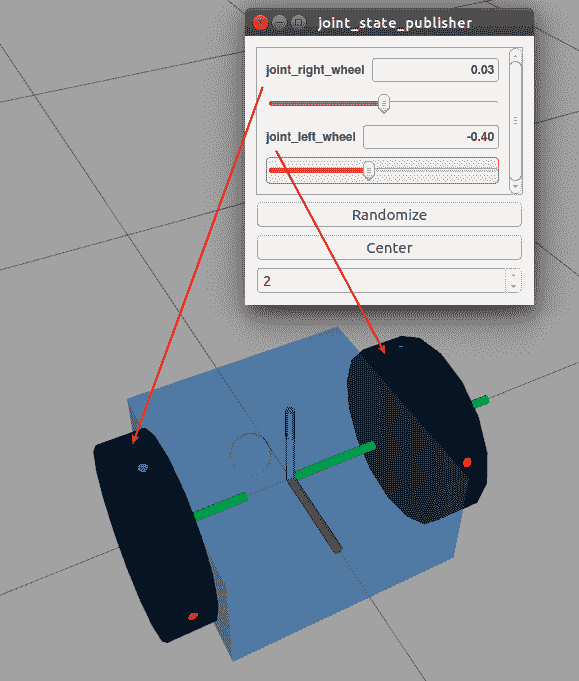

这个交互式功能是 `joint_state_publisher` 包的一部分 ([`wiki.ros.org/joint_state_publisher`](http://wiki.ros.org/joint_state_publisher))，其 `joint_state_publisher` 节点通过启动文件使用 `gui:=True` 参数调用。我们将在下一节中解释这个功能。

# 使用 joint_state_publisher 包

启动文件中允许我们使用 GUI 交互式旋转轮子的部分如下：

```py
 <node pkg="joint_state_publisher" type="joint_state_publisher" name="joint_state_publisher">
   <param name="/use_gui" value="$(arg gui)"/>
 </node>
```

`joint_state_publisher` 节点公开了 `/use_gui` 参数来决定是否应该显示 `joint_state_publisher` 窗口。如果设置为 `True`，则窗口处于活动状态。如果是这样，我们通过在启动文件中定义的 `gui` 参数将期望的值作为参数传递给节点：

```py
<arg name="gui" default="False" />
```

记住 `roslaunch` 命令：

```py
$ roslaunch rviz_basics gopigoMinimal_rviz.launch model:=gopigoMinimal gui:=True

```

`gui` 参数设置为 `True`。然后，`joint_state_publisher` 的 `/use_gui` 参数值被设置为 `gui` 参数的值，正如在 `gopigoMinimal_rviz.launch` 文件中的 `<param name="/use_gui" value="$(arg gui)"/>` 标签所表达的那样。

`joint_state_publisher` 节点启动了一个小部件，允许你交互式地旋转每个轮子。最后，从终端运行 `rqt_graph` 来查看 ROS 图：

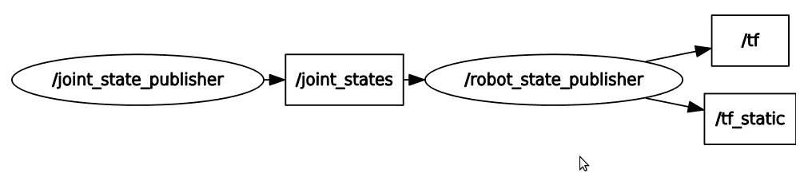

`/joint_states` 主题是我们移动窗口中滑块时修改的主题。

# URDF 模型中的机器人参考框架

理解如何放置你将用于机器人的不同参考框架非常重要。首先，你必须决定 `<joint>` 元素在空间中的位置。在我们的例子中，我们有两个：一个用于右轮，一个用于左轮。让我们先看看右轮的配置：

```py
  <joint name="joint_right_wheel" type="continuous">
    <parent link="base_link"/>
    <child link="right_wheel"/>
    <origin xyz="0 -0.30 0" rpy="0 0 0" /> 
    <axis xyz="0 1 0" />
  </joint>
```

现在，让我们看看左轮的配置：

```py
 <joint name="joint_left_wheel" type="continuous">
   <parent link="base_link"/>
   <child link="left_wheel"/>
   <origin xyz="0 0.30 0" rpy="0 0 0" />
   <axis xyz="0 1 0" />
 </joint>

```

在这里，你可以看到 `<origin>` 标签指定了位置：

+   右关节原点沿 *y* 地面轴为 -0.30 m（绿色轴）。

+   左关节原点沿 *y* 地面轴为 +0.30 m。

在这两种情况下，关于 `rpy="0 0 0"` 属性，没有旋转，并且两个坐标框架都与地面的坐标框架平行。我们知道这两个 `<joint>` 标签相对于地面，因为它们都有 `base_link` 作为父链接，而且你知道我们模型的第一个链接，`base_link`，是机器人整体位置和朝向的绝对参考。

通常，`<origin>` 是从父链接到子链接的变换。关节位于子链接的原点。`<axis xyz="0 1 0">` 标签指定旋转轴。在这种情况下，它是 `y` 轴，因为它有 `1` 的值，而 `x` 和 `z` 的值是 `0`。

在下面的截图中，您可以看到的是 `base_link`、`right_wheel` 和 `left_wheel` 的相应框架。它们位于每个链接的 `<visual>` 标签内。在这三个案例中，在 URDF 文件中，您将看到它们遵循以下模式：

```py
<link name="base_link">
   <visual>
     <origin xyz="0 0 0" rpy=".. .. .." />

```

`xyz="0 0 0"` 表示它们与关节参考框架重合：


在轮子的例子中，我们有以下情况：

```py
<origin xyz="0 0 0" rpy="1.570795 0 0" />
```

1.570795 = π/2 = 90° 是绕 *x* 轴（红色）的旋转。这确保了形成轮子的圆柱体是垂直朝向的。

# 使用 RViz 在构建模型时进行检查

考虑到我们关于 URDF 所介绍的所有概念，我们可以使用 RViz 工具在构建机器人模型时提供帮助。它可以提供的检查如下：

+   机器人的总体尺寸必须与实际机器人的尺寸相匹配。当您部分部分地构建模型时，如果有关部件尺寸的任何错误，当您测量总体尺寸（长度、宽度和高度）时将出现错误。您可以通过使用 RViz 工具栏中的测量工具来检查这一点。

+   您还可以通过视觉检查机器人部件之间可能存在的干扰，特别是那些相邻且相对于彼此移动的部件（相对于彼此）。

+   参考坐标系的朝向。

+   您可以通过在 RViz 中取消选中相应的链接或更改 `<color>` 标签来应用透明效果，从而可视化被其他部分隐藏的部分。

在下面的图中，您可以看到我们已从 RViz 中提取了俯视图，并使用透明度检查所有部件是否对齐以及它们之间的相对位置：

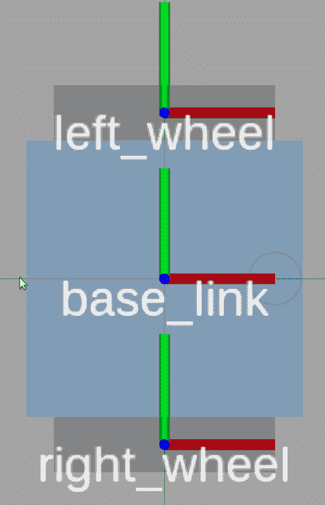

这种透明度使我们能够检查滑轮的位置是否正好位于 `base_link` 的中间。此外，轮子不会与 `base_link` 发生干扰，它们的旋转轴是同轴的。

# 在 RViz 窗口中更改模型的外观

在 RViz 中控制模型的可视化效果，您可以通过显示窗口中的一些参数进行修改，如下面的截图所示：

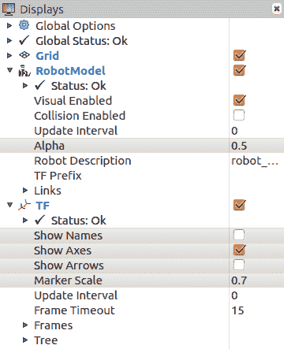

我们用灰色标记了本章中我们所做的基本更改：

+   **Alpha**：此参数控制整个模型的透明度级别。值`1`对应不透明的外观，而`0`是完全透明的，即不可见。每个链接也有一个 Alpha 参数来控制单个部分的透明度（在“链接”子树下展开以访问它）。

+   **显示名称**：如果勾选，链接的名称将在屏幕上显示。

+   **显示轴**：如果勾选，它将显示每个链接的参考框架。

+   **显示箭头**：如果勾选，它将显示每个关节的方向。

+   **标记比例**：默认值为`1`。减小其值，使屏幕上的文字更小。

要保存此组参数，请转到顶部菜单中的“文件”项并选择“另存为配置”。在此，您指定具有`.rviz`扩展名的文件名，您的自定义设置将保存在那里。

注意，在同一个“文件”菜单中，您还有“保存图像”选项，这将生成当前 RViz 窗口的截图。

# 有用的 ROS 检查工具

最后，您应该知道，如果您想进行一些检查，有两个有用的 ROS 工具：

+   `check_urdf`尝试解析 URDF 文件以验证运动链：

```py
$ roscd rviz_basics
$ check_urdf ./urdf/gopigoMinimal.urdf
```

`roscd`命令将提示更改为您作为参数指示的 ROS 包的路径，即`rviz_basics`。输出如下，其中当前文件夹是请求的`rviz_basics`路径，即`$`符号之前，`~/catkin_ws/src/CH4_RVIZ_BASICS`：

```py
~/catkin_ws/src/CH4_RVIZ_BASICS$ check_urdf ./urdf/gopigoMinimal.urdf
robot name is: gopigoMinimal
---------- Successfully Parsed XML ---------------
root Link: base_link has 2 child(ren)
 child(1): left_wheel
 child(2): right_wheel
```

一切正常！

+   `rqt_tf_tree`允许我们在 GUI 环境中可视化`tf`信息，如下所示：

```py
$ roslaunch rviz_basics gopigoMinimal_rviz.launch model:=gopigoMinimal 
$ rosrun rqt_tf_tree rqt_tf_tree

```

将打开一个窗口，显示此方面图：

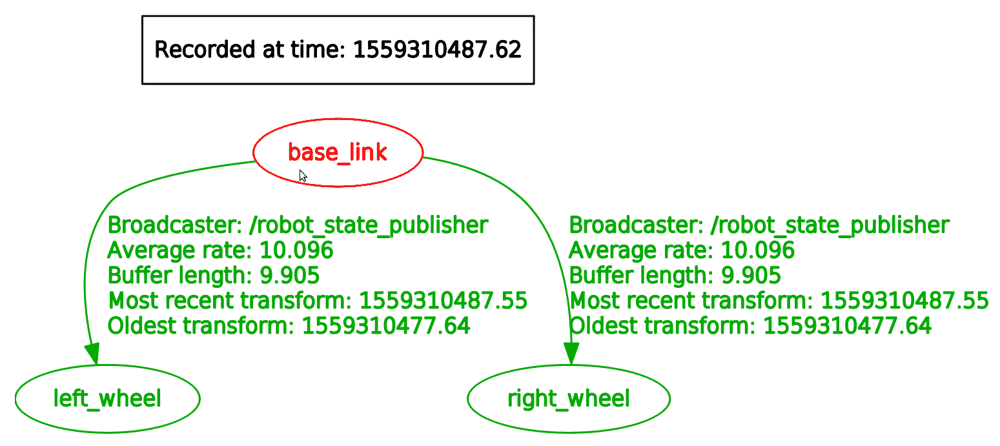

前面的图表告诉您，`base_link`（机器人身体部分）和车轮连接良好。箭头代表关节元素：`joint_right_wheel`和`joint_left_wheel`。

或者，您可以将相同的输出生成为一个 PDF 文件：

```py
$ rosrun tf view_frames
```

然后，您可以打开创建的 PDF 文件，如下所示：

```py
$ evince frames.pdf
```

如果您想与同事分享输出，这种方式做事情更方便。

# 摘要

在本章中，我们介绍了 ROS 的两个基本元素。一个是 URDF 格式，这是描述机器人虚拟模型的标准方式。另一个是 RViz，ROS 可视化工具，它允许您在构建模型时检查模型并检查最终结果。

通过查看 GoPiGo3，你已经了解了这些基本元素，在那里你创建了一个包含底盘、电机和轮子的简化模型。我们向你展示了如何通过访问`joint_state_publisher`节点的`joint_states`主题与 GUI 交互式地旋转轮子，该节点属于同名包。这个包提供了一个工具，用于为给定的 URDF 模型设置和发布关节状态值。在 GoPiGo3 的情况下，我们有两个关节：左轮和右轮。万向轮是第三个关节，但由于它是一个自由轮（不是由电机驱动），所以我们不需要在虚拟 GoPiGo3 中将其定义为这样的关节。将其刚性连接到机器人本体就足够了。

在 RViz 中，我们可以模拟机器人的运动学。在下一章中，我们将更进一步，模拟动力学。这将需要我们完成 URDF 模型，包括质量和惯性属性，并在轮子中指定滚动阻力，以再现作用在机器人上的所有力。我们将使用 Gazebo 来完成这项工作，这是一个与 ROS 集成的动力学模拟器。使用 Gazebo，我们还可以再现机器人的物理环境（障碍物、斜坡、墙壁等）。

# 问题

1.  URDF 模型的格式是什么？

A) 它是一个文本文件。

B) JSON。

C) XML。

1.  GoPiGo3 的 URDF 模型有多少个链接和关节？

A) 四个链接（机器人本体、万向轮、左轮和右轮）和两个关节

B) 三个链接（机器人本体、左轮和右轮）和两个关节

C) 三个链接（机器人本体、左轮和右轮）和三个关节

1.  在 URDF 模型中，你可以使用哪个标签来指定链接的颜色？

A) `<visual>`

B) `<geometry>`

C) **`<material>`**

1.  在 ROS 包中，是否必须按文件夹（SRC、URDF、RViz、launch）分组文件类型？

A) 不，唯一强制条件是将包放在`~/catkin_ws/src/`下。

B) 只建议创建一个干净的包结构。

C) 不，但如果你这样做，你必须在该`package.xml`配置文件中声明位置。

1.  你是否总是需要在终端中运行`roscore`来启动 ROS 进程？

A) 是的，因为由`roscore`启动的主节点是保持图中节点间通信的东西。

B) 当使用`roslaunch`时，你可以隐式启动主节点。

C) 如果你已安装`roscore`包，则必须运行`roscore`进程。

# 进一步阅读

+   ROS URDF 教程：[`wiki.ros.org/urdf/Tutorials`](http://wiki.ros.org/urdf/Tutorials).

+   ROS 可视化教程：[`wiki.ros.org/visualization/Tutorials`](http://wiki.ros.org/visualization/Tutorials).

+   *《ROS 机器人编程：由 TurtleBot3 开发者编写的手册》*，YoonSeok Pyo，HanCheol Cho，RyuWoon Jung，和 TaeHoon Lim（2017），ROBOTIS Co. Ltd，第一版：[`www.pishrobot.com/wp-content/uploads/2018/02/ROS-robot-programming-book-by-turtlebo3-developers-EN.pdf`](http://www.pishrobot.com/wp-content/uploads/2018/02/ROS-robot-programming-book-by-turtlebo3-developers-EN.pdf)。章节：*ROS 工具：RViz 和 rqt*以及 10.8 *使用 RViz 进行 TurtleBot3 仿真*。
