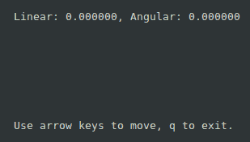
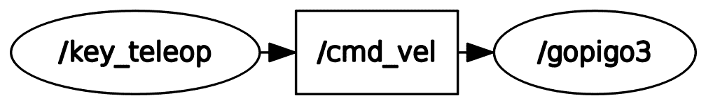
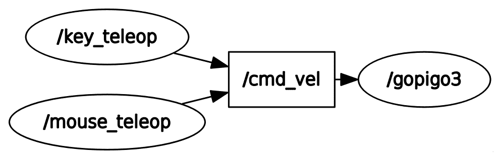
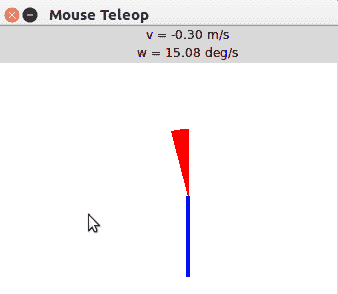
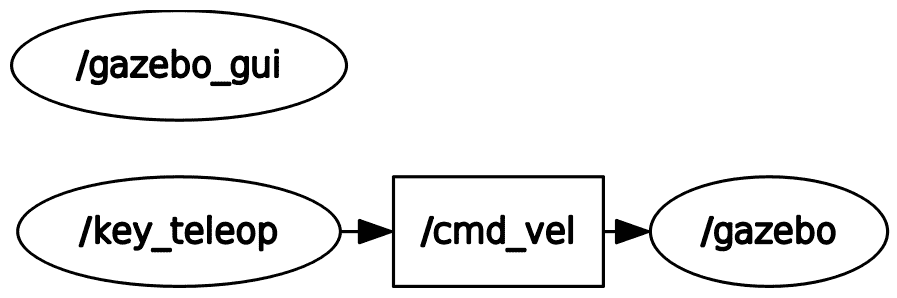
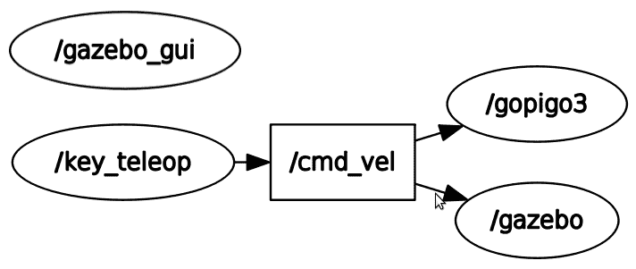

# 机器人控制和仿真

在本章中，你将设置专门用于编程 GoPiGo3 的 ROS 开发环境。这种理解将通过从使用笔记本电脑键盘的键到更技术性的使用 ROS 主题的方式建立。最后，你将猜测哪些主题将允许你将基于键盘/主题的手动控制与内部编程逻辑（即智能行为）连接起来，从而使机器人能够执行自主任务。从这个意义上说，Gazebo 中的 3D 模拟是测试开发过程中的行为并在将应用程序推送到物理机器人之前的重要工具，这有助于在基于现场的工作中节省时间和精力。

到本章结束时，你将学会如何为真实机器人设置 ROS 环境。远程控制和自主控制在机器人软件开发方面建立了质的差异。通过自己尝试远程控制，你将准备好跨越机器人真正自主的边界。

最后，你将通过将物理机器人的行为与仿真进行比较，了解在机器人应用开发中使用仿真的有用性。这些观察到的差异将允许你调整 Gazebo 中虚拟机器人仿真的参数。这种方法的主要优势是，你可以在最终的开发阶段仅使用真实硬件进行测试，而在开发过程中始终使用虚拟模型进行开发和测试。

本章将涵盖以下主题：

+   设置 GoPiGo3 开发环境，使其能够在笔记本电脑上与 ROS 进行网络连接

+   案例研究 3 - 使用键盘远程控制物理机器人

+   使用命令行通过 ROS 主题远程控制机器人

+   在 Gazebo 中，比较手动遥控下物理机器人和虚拟模型的行为

我们将根据关于机器人驱动（电机和编码器）的第三个案例研究对这些概念进行解释。记住，前两个案例研究已在第六章，*ROS 编程 - 命令和工具*中介绍，如下：

+   **案例研究 1**：发布和读取距离传感器

+   **案例研究 2**：从 Pi 摄像头获取并可视化图像

到本章结束时，我们将拥有 GoPiGo3 的 ROS 包的第一个完整版本。这将成为本书其余部分构建我们智能机器人行为的基础。

# 技术要求

对于本章，不需要额外的硬件或软件配置。只需确保你具备以下条件：

+   根据第六章的*技术要求*部分，GoPiGo3 的*ROS 编程 - 命令和工具*

+   笔记本电脑，根据第三章，*ROS 入门*中的*配置你的 ROS 开发环境*部分

在下一节中，我们将准备 ROS 环境，以便你的笔记本电脑和机器人可以在一个独特的 ROS 图中相互通信。让我们回顾一下我们需要用到的代码：

+   **本章代码（笔记本电脑）**：在本章中，我们将使用位于`Chapter7_Robot_control_simulation`文件夹中的代码（[`github.com/PacktPublishing/Hands-On-ROS-for-Robotics-Programming/tree/master/Chapter7_Robot_control_simulation`](https://github.com/PacktPublishing/Hands-On-ROS-for-Robotics-Programming/tree/master/Chapter7_Robot_control_simulation)）。将其文件复制到 ROS 工作空间，以便你可以使用它们，并将其余文件放在`src`文件夹之外。这样，你将拥有一个更干净的 ROS 环境：

```py
$ cp -R ~/Hands-On-ROS-for-Robotics-Programming/Chapter7_Robot_control_simulation ~/catkin_ws/src
```

代码中包含一个名为`gazebo_control`的新 ROS 包。重建工作空间，使其为你的 ROS 安装所知：

```py
$ cd ~/catkin_ws
$ catkin_make
$ source ~/catkin_ws/devel/setup.bash
```

通过选择该包并列出文件来检查该包是否已正确安装：

```py
$ roscd gazebo_control
$ ls -la
```

+   **本章代码（GoPiGo3）**：你将使用我们在第六章，*在 ROS 中编程 - 命令和工具*中开发的相同代码。记住，它对应于位于 Raspberry Pi 上的名为`mygopigo`的 ROS 包。

现在，你准备好跟随本章的解释，并以实际的方式理解它们。

# 设置 GoPiGo3 开发环境

在上一章中，你尝试了在 GoPiGo3 的 Raspberry Pi 上运行 ROS 桌面版本。对于严肃的开发策略，你应该在机器人上启动应用程序的最小配置，并在笔记本电脑上启动所有伴随的开发任务。

记住，在第三章，*ROS 入门*中，你在笔记本电脑上运行 ROS。因此，机器人应用程序本身是在这种环境中执行的，由于我们没有在计算机之外建立连接，所以没有移动物理机器人的可能性。

在本节中，你将学习如何在它们连接时同时使用笔记本电脑和 Raspberry Pi ROS 环境，即 Raspberry Pi 控制 GoPiGo3 机器人，笔记本电脑用于 CPU 密集型计算/可视化任务。

# 机器人和远程计算机之间的 ROS 网络

要创建两个 ROS 环境，我们需要满足两个先决条件：

+   机器人和计算机 ROS 环境需要知道如何相互通信。

+   主节点（`roscore`进程）应该是唯一的，并且可以在其中任何一个运行。

让我们学习如何满足这两个条件。

# ROS 环境之间的通信

计算机在网络中的识别方式是通过其 IP 地址，通常使用 IPv4 协议。一般来说，你可以使用`ifconfig`命令找到分配给你的机器的 IP 地址：

```py
$ ifconfig

eth0: ...
lo:   ...
wlan0: flags=4163<UP,BROADCAST,RUNNING,MULTICAST> mtu 1500
 inet addr: 192.168.1.58 netmask 255.255.255.0 broadcast 192.168.1.255
 inet6 addr: fe80::7d9d:84a9:ec7:20cd prefixlen 64 scopeid 0x20<link>

 RX packets 212 bytes 46561 (46.5 KB)
 RX errors 0 dropped 0 overruns 0 frame 0
 TX packets 202 bytes 43986 (43.9 KB)
 TX errors 0 dropped 0 overruns 0 carrier 0 collisions 0
```

你应该关注无线接口，通常命名为 `wlan0`，因为你已经为机器人配置了 Wi-Fi 访问。IP 地址是跟在 `inet` 单词后面的 4 x 4 字节字段。因此，对于 GoPiGo3 中的 Raspberry Pi，这个字段是 `192.168.1.58`。

对于笔记本电脑，也以终端打开。如果你使用的是有线连接，你应该查看 `eth0` 而不是 `wlan0`。在我们的示例案例中，计算机的 IP 地址是 `192.168.1.54`。如果有太多的网络接口，输出可能会过于冗长。为了专注于你正在寻找的内容，你可以过滤输出，如下所示：

```py
$ ifconfig | grep 'inet'
```

一旦你有了两个 IP 地址，你只需使用 ROS 环境变量来指示它们。在以下小节中，我们将向你展示如何配置每台计算机。

# 机器人网络配置

接下来，你必须遵循三个步骤来设置 Raspberry Pi：

1.  在终端中执行以下两个命令来定义 ROS 所需的环境变量：

```py
$ export ROS_HOSTNAME=192.168.1.58
$ export ROS_MASTER_URI=http://${ROS_HOSTNAME}:11311
```

第一条命令设置了允许 ROS 知道其当前运行的主机 IP 地址的变量。第二行是主节点的 URL。由于它被设置为 `ROS_HOSTNAME`，我们是在说它将在机器人计算机上运行。端口 `11311` 是 ROS 设置用于与主节点通信的默认端口。随后启动的每个节点都将自动分配一个新的可用端口。

1.  有一种方法可以抽象 IP 地址本身，因为在 Ubuntu 系统中，`avahi-daemon` ([`manpages.ubuntu.com/manpages/bionic/man8/avahi-daemon.8.html`](http://manpages.ubuntu.com/manpages/bionic/man8/avahi-daemon.8.html)) 允许你通过简单地将 `.local` 添加到主机名来指向本地网络中的机器。为此，配置命令将如下所示：

```py
$ export ROS_HOSTNAME=gopigo3.local
```

主机名可以在终端提示符中找到，通常格式为 `user@hostname :~$`。如果你有任何疑问，可以在终端中使用 `hostname` 命令来询问：

```py
pi@gopigo3 :~$ hostname
 gopigo3
```

1.  每次你启动新的终端时都需要这个配置。因此，如果我们将其作为额外的行包含在 `.bashrc` 文件中，你就不必手动做这件事：

```py
$ echo export ROS_HOSTNAME=gopigo3.local >> ~/.bashrc
$ echo export ROS_MASTER_URI=http://${ROS_HOSTNAME}:11311 >> ~/.bashrc
```

通过列出文件末尾来检查结果：

```py
$ tail ~/.bashrc
```

你应该能看到引用的两个配置行。

现在 Raspberry Pi 已经配置好了，我们将为笔记本电脑做类似的事情。

# 笔记本网络配置

对于远程计算机，这些是等效的步骤：

1.  在终端中执行以下两个命令来设置环境变量：

```py
$ export ROS_HOSTNAME=192.168.1.54
$ export ROS_MASTER_URI=http://gopigo3.local:11311
```

你在第一行指定其 IP 地址为 `192.168.1.54`，而在第二行中，我们声明 ROS 主节点位于机器人上，即 `gopigo3.local`。这样，如果你的网络重启并且 Raspberry Pi 被分配了不同的 IP 地址，你的系统就不需要重新配置。

1.  至于机器人，将以下两行添加到 `.bashrc` 文件中，以便每次启动新终端时自动配置：

```py
$ echo export ROS_HOSTNAME=rosbot.local >> ~/.bashrc
$ echo export ROS_MASTER_URI=http://gopigo3.local:11311 >> ~/.bashrc
```

我们还展示了设置 `ROS_HOSTNAME` 的替代方法，即使用 `rosbot.local` 而不是数字 IP 地址。

# 启动主节点并连接

以下过程允许我们在笔记本电脑和 Raspberry Pi 之间建立连接：

1.  使用已熟悉的 `roscore` 命令在机器人上启动 ROS 主节点：

```py
pi@gopigo3 :~$ roscore
```

1.  然后，在笔记本电脑上执行基本检查，以确定它是否知道主节点存在：

```py
bronquillo@rosbot:~$ rostopic list
 /rosout
 /rosout_agg
```

`/rosout_agg` 和 `/rosout_agg` 是由主节点发布的主题。

如果一切顺利，你可以远程控制你的 GoPiGo3。在进入下一节之前关闭终端，以确保 `roscore` 已关闭。

# 案例研究 3 – 使用键盘进行遥控

本案例研究将帮助你完成 GoPiGo3 ROS 软件包的第一个版本。在前一章中，你处理的是距离传感器和 Pi 摄像头，我们为每个都进行了一个案例研究。

通过将运动功能与现有的机器人驱动程序相结合，你将拥有一个能够与其环境进行基本交互的机器人：

+   **感知能力**包括使用距离传感器检测障碍物，以及使用 Pi 摄像头对周围环境的视觉识别。

+   **驱动能力**，其中机器人能够在地板上移动，同时通过距离传感器感知可能的障碍物，并通过其摄像头的图像流识别形状和人。

案例研究 3 侧重于驱动能力。在本节中，你将学习如何使用键盘和鼠标远程移动机器人。

# 在机器人上运行 gopigo3 节点

在本节中，我们将运行一个在 Raspberry Pi 上的节点，该节点将提供控制能力：

1.  在机器人上启动 GoPiGo3 ROS 软件包：

```py
$ roslaunch mygopigo gopigo3.launch
```

这是你需要直接在 Raspberry Pi 上运行的唯一命令。由于你已配置 ROS，使笔记本电脑能够与机器人通信，因此以下命令可以在笔记本电脑上运行。

当在 bash 命令前加上 `T1`、`T2`、`T3` 或 `T4` 时，我们总是会指代笔记本电脑上的连续终端。

2. 然后，在你的笔记本电脑上，确保只有一个节点，即 `gopigo3`：

```py
T1 $ rosnode list
 /gopigo3
 /rosout
```

记住，`/rosout` 主题对应于主节点。

3. 接下来，列出所有可用的 ROS 主题，以找出它们的名称：

```py
T1 $ rostopic list
/battery_voltage
/cmd_vel
...
/motor/encoder/left
/motor/encoder/right
...
/motor/status
/odom
/rosout
/rosout_agg
/servo/position/1
/servo/position/2
...
/tf
```

请记住，三个感兴趣的主题被称为 `/battery_voltage`、`/cmd_vel` 和 `/motor/status`。我们将在本节后面提供它们的详细信息。

4. 要获取有关这些主题的更多信息，可以使用 `rosnode` 命令的 `info` 选项。这将告诉你 `gopigo3` 节点能做什么：

```py
T1 $ rosnode info gopigo3
Node [/gopigo3]
Publications: 
 * /battery_voltage [std_msgs/Float64]
 * /joint_state [sensor_msgs/JointState]
 * /motor/encoder/left [std_msgs/Float64]
 * /motor/encoder/right [std_msgs/Float64]
 * /motor/status [gopigo3_node/MotorStatusLR]
...
Subscriptions: 
 * /cmd_vel
 ...
 * /motor/dps/left
 * /motor/dps/right
 ...
```

在这里，你可以看到 `/battery_voltage` 和 **`/motor/status`** 是发布者（节点代码中的对象，将数据流到这些主题），而 `/cmd_vel` 是一个订阅者（以及一个在节点中声明的对象，允许我们从现有主题中消费数据）：

+   +   发布者允许你从电池电量和电机分别获取状态信息。

    +   `/cmd_vel`订阅者允许机器人接受远程控制的运动命令。

在下一小节中，我们将检查发布者，以便了解它们流出的消息结构。

# 检查发布的主题和消息

现在我们已经确定了三个主题，让我们来看看它们，并获取一些机器人特定的信息：

1.  要找到电池的最后五个值，请在终端中运行以下命令。这将允许你检查`/battery_voltage`主题：

```py
T1 $ rostopic echo battery_voltage -n 5

data: 9.568
---
data: 9.551
---
data: 9.594
---
data: 9.568
---
data: 9.586
```

你可以推断出电压大约是 9.6V，这意味着电池已经充电。

1.  让我们调查这个主题是如何构建的：

```py
T1 $ rostopic info battery_voltage
 Type: std_msgs/Float64
```

它使用`std_msgs/Float64`消息类型，这对应于一个 64 位大小的浮点数。这种消息类型是 ROS 标准消息库的一部分([`wiki.ros.org/std_msgs`](http://wiki.ros.org/std_msgs))。要了解 ROS 消息由什么组成，你可以使用`rosmsg`命令：

```py
T1 $ rosmsg info std_msgs/Float64
 float64 data
```

1.  在这个节点中还有一个主题，`/motor/status`，它使用一个自定义的更复杂的消息：

```py
T1 $ rostopic info motor/status
 Type: mygopigo/MotorStatusLR
```

1.  让我们找到消息的结构。请注意，消息的定义是在`mygopigo`包下的`msg`文件夹中声明的：

```py
T1 $ rosmsg info mygopigo/MotorStatusLR

 std_msgs/Header header
 uint32 seq
 time stamp
 string frame_id

mygopigo/MotorStatus left
 bool low_voltage
 bool overloaded
 int8 power
 float32 encoder
 float32 speed

mygopigo/MotorStatus right
 bool low_voltage
 bool overloaded
 int8 power
 float32 encoder
 float32 speed
```

这有三个部分：

+   +   包含序列号和时间戳的头部

    +   来自左侧电机的数据

    +   来自右侧电机的数据

如果我们取最后发布的消息的内容，我们可以在实践中可视化这个结构：

```py
T1 $ rostopic echo motor/status -n 1
header: 
 seq: 177
 stamp: 
 secs: 1566220531
 nsecs: 946445941
 frame_id: ''
left: 
 low_voltage: False
 overloaded: False
 power: -128
 encoder: 0.0
 speed: 0.0
right: 
 low_voltage: False
 overloaded: False
 power: -128
 encoder: 0.0
 speed: 0.0
```

在这里，你可以看到主题报告了`low_voltage`级别警告，电机`overload`警告，`power`，`encoder`数据和当前的`speed`。

现在，让我们继续到移动机器人的实际部分。

# 遥操作包

`key_teleop`([`wiki.ros.org/key_teleop`](http://wiki.ros.org/key_teleop))是一个由 ROS 贡献的包，它提供了一个非常简单的机制，使用键盘的箭头键来控制机器人。按照常规方式克隆源代码并在你的笔记本电脑上安装该包：

```py
$ cd ~/catkin_ws/src
$ git clone https://github.com/ros-teleop/teleop_tools
$ cd .. && catkin_make
```

这里还有另外两个包可用，它们也是`teleop_tools`包的一部分：

+   `joy_teleop`，一个通用的操纵杆接口，用于主题和动作

+   `mouse_teleop`，一个指向设备（例如鼠标、触摸板等）遥操作工具

由于你已经构建了整个仓库，这两个都对你可用。

# 在笔记本电脑上运行遥操作

自从你完成了*在机器人中运行 gopigo3 节点*这一小节，你应该已经通过`$ roslaunch mygopigo gopigo3.launch`命令使`gopigo3`节点运行。现在让我们学习如何远程控制它：

1.  在你的笔记本电脑上启动遥操作节点：

```py
T1 $ rosrun key_teleop key_teleop.py /key_vel:=/cmd_vel
```

之前的命令启动了`key_teleop`节点，终端的提示被一个类似于以下截图的界面所替换：



这个灰色窗口告诉您如何使用键盘上的箭头键移动机器人：

+   +   向上箭头键使机器人以 0.8 m/s 的速度向前移动。您可以在界面上看到命令速度。

    +   向下箭头键使机器人以 -0.5 m/s 的速度向后移动（负号表示向后）。

    +   向左箭头键使机器人以 1 rad/s 的速度逆时针（向左）旋转。

    +   向右箭头键使机器人以 -1 rad/s 的速度顺时针旋转（负号表示向右旋转）。

为了有效地移动它，请注意，启动 `key_teleop` 节点的终端必须是活动窗口。如果不是这种情况，只需点击它上的任何位置使其成为活动窗口。

1.  使用 `T2` 命令，我们可以像往常一样可视化 ROS 图：

```py
T2 $ rqt_graph
```

它应该看起来如下：



在节点可执行脚本之后附加的 `T1` 命令就是我们所说的重新映射。这项技术允许两个节点进行通信，其中监听节点订阅者的字面量 `/cmd_vel` 与发布节点 `/key_vel` 的字面量不匹配。因此，重新映射包括将一个节点的发布主题连接到另一个节点的订阅主题。这样，我们知道 `key_teleop` 节点的输出将成为 `gopigo3` 节点的输入。

现在，让我们学习如何使用鼠标而不是键盘来遥控机器人。

# 使用鼠标进行遥操作

此过程与键盘上的操作等效：

1.  在第三个终端中输入以下命令以应用来自 `teleop_tools` 包的 `mouse_teleop` 包：

```py
T3 $ rosrun mouse_teleop mouse_teleop.py /mouse_vel:=/cmd_vel
```

在此情况下，重新映射的主题是 `/mouse_vel:=/cmd_vel`。

1.  刷新 `rqt_graph` 窗口；您将看到以下内容：



前面的图表表明，机器人可以无障碍地同时接受来自鼠标和键盘的命令。这种情况发生在我们在启动鼠标控制命令之前没有在 `T1` 终端中终止键盘控制。

另一方面，如果您终止了 `T1` 终端，机器人将继续工作，但那时您只能通过鼠标控制它，因为 `T3` 中的进程使其保持活动状态（如果我们刷新窗口，`key_teleop` 节点将从 `rqt_graph` 中消失）。

1.  最后，检查鼠标控制是否正常工作（如果您之前终止了它，请重新启动 `T1` 命令）：

+   +   选择 `T1` 的窗口。您将使用箭头键移动 GoPiGo3。

    +   通过执行 `T3` 命令选择出现的新窗口。现在，您可以使用鼠标移动 GoPiGo3（同时按住左键）。

下面的新窗口是用于控制鼠标的：



蓝线代表前进（正速度）- 向后方向。在这种情况下，它以-0.3 m/s（向后）的速度移动。线越长，速度越快。红色圆形区域代表相同的旋转方向。在这种情况下，当向左旋转（逆时针）时，旋转速度为每秒 15.08 度。

这个例子说明了 ROS 的两个重要概念：

+   **消息的并发性**：如果有两个或更多节点向映射到另一个节点订阅者的主题发布消息，该节点将接受来自两者的消息，并尝试执行所有这些消息。这是一个当你以高级水平使用 ROS 时会利用的好特性。

+   **运行环境的弹性**：机器人可以以部分功能工作。它将仅丢失由已死亡的 ROS 节点提供的功能。

在这一点上，重要的是要思考 ROS 如何为编程机器人提供高级层，与使用 C 或 Python 等过程式语言相比。此外，这也意味着你将更多地关注机器人的功能，而不是编程代码：你将集成现有的提供低级层（例如来自键盘或鼠标的控制命令）的包，并通过 ROS 主题将它们联系起来，以构建高级层（使用键盘和/或鼠标控制机器人的运动）。

# 使用 ROS 主题进行远程控制

在上一节中，你使用人机界面（键盘和鼠标）控制了在`/cmd_vel`主题上发布的机器人消息。在本节中，你将直接使用命令行中的`rostopic`发布消息。这样，你将熟悉这个相关主题及其消息结构。理解`/cmd_vel`在底层的工作方式至关重要，因为你在本书剩余章节中将要覆盖的许多高级示例中都将使用它。

# 运动控制主题 - `/cmd_vel`

现在我们已经享受了与机器人的玩耍，让我们了解这种控制形式是如何工作的。gopigo3 节点订阅的`/cmd_vel`主题是产生机器人平移和旋转的关键。在机器人上运行`gopigo3`节点的同时，运行`rostopic`命令以从主题检索信息：

```py
T1 $ rostopic info /cmd_vel

 Type: geometry_msgs/Twist

 Publishers: None
 Subscribers: 
 * /gopigo3 (http://gopigo3.local:40605/)
```

主题`/cmd_vel`使用`geometry_msgs/Twist`类型（64 位）的`geometry_msgs`消息库（[`wiki.ros.org/geometry_msgs`](http://wiki.ros.org/geometry_msgs)）。这个库提供了用于处理几何原语（点、向量、姿态）的消息。命令还告诉你哪些节点订阅了该主题，在我们的例子中，只有`gopigo3`。现在，让我们检索消息类型的结构：

```py
T1 $ rosmsg info geometry_msgs/Twist 
 geometry_msgs/Vector3 linear
 float64 x
 float64 y
 float64 z
 geometry_msgs/Vector3 angular
 float64 x
 float64 y
 float64 z
```

在这里，我们可以看到它由六个 64 位浮点数组成，这将允许你将其视为两个各由三个分量组成的三维向量。前三个分量形成线性向量，并指代沿 *X*、*Y* 和 *Z* 轴的速度，而剩下的三个形成旋转向量，表示绕每个轴的角速度。让我们看看这在实践中是如何工作的。

# 使用 /cmd_vel 直接驱动 GoPiGo3

以前，我们关注的是最终用户的机器人控制视角，即键盘按键或鼠标点击和位移。现在，我们将从开发者的视角来发现如何实现相同类型的控制，这是你在 ROS 中构建新应用程序所需要的。让我们开始吧：

1.  以 1 rad/s 的速率旋转机器人，通过命令行发布消息。记住，`gopigo3` 节点必须在机器人上运行：

```py
T1 $ rostopic pub /cmd_vel geometry_msgs/Twist  'angular: {z: 1}'
 publishing and latching message. Press ctrl-C to terminate
```

1.  一旦你输入命令，除了看到 GoPiGo3 向左旋转（逆时针）外，你还会收到关于该命令的伴随信息消息。

1.  由于你没有指定发布频率，ROS 假设你想要保持该消息锁定，即永远运行。你可以通过在另一个终端使用 `rostopic` 来检查这一点：

```py
T2 $ rostopic echo /cmd_vel
 linear: 
 x: 0.0
 y: 0.0
 z: 0.0
 angular: 
 x: 0.0
 y: 0.0
 z: 1.0
 ---
```

1.  我们如何停止机器人？很简单——发送一个新的消息，将旋转设置为零：

```py
T3 $ rostopic pub /cmd_vel geometry_msgs/Twist  'angular: {z: 0}'
```

你会看到 GoPiGo3 停止，并且 `T2` 抛出一个新的六值集合，告诉我们角 `z` 现在等于 `0`。

1.  下一步是引入以给定速率的消息更新。在 `T1` 中停止进程并写下以下命令：

```py
T1 $ rostopic pub -r 0.5 /cmd_vel geometry_msgs/Twist  'angular: {z: 1}'
```

在 `T2` 中，你应该每 2 秒（= 0.5 Hz 频率）看到一个新消息。`-r` 选项（速率的缩写）是你用来指定消息发送频率的选项。由于你保持相同的旋转速度，你不会注意到机器人运动中的任何变化。

1.  前往另一个终端，并在 `/cmd_vel` 主题上以相同的 0.5 Hz 频率发布双倍速度（2 rad/s）：

```py
T3 $ rostopic pub -r 0.5 /cmd_vel geometry_msgs/Twist  'angular: {z: 2}'
```

你会看到 GoPiGo3 在指定的速率下在 1 和 2 rad/s 的角速度之间交替。

1.  前往 `T4` 并发送停止旋转命令：

```py
T4 $ rostopic pub -r 0.5 /cmd_vel geometry_msgs/Twist 'angular: {z: 0}'
```

观察机器人每 2 秒停止一段时间。

1.  如果你想让机器人更频繁地停止？在 `T4` 中停止进程，并以更高的 1 Hz 速率重新启动命令：

```py
T4 $ rostopic pub -r 1 /cmd_vel geometry_msgs/Twist  'angular: {z: 0}'
```

1.  我们如何让它停止更长时间？很简单——指定更高的频率，即 10 Hz。当使用这样的值时，你会发现 GoPiGo3 旋转非常少，因为每秒钟 10 次接收停止命令，覆盖了在 `T1`（1 rad/s）和 `T3`（2 rad/s）中设置的最近速度设置的效果。

1.  最后，我们如何停止一切？按照以下步骤操作：

    1.  停止终端 `T1`。这通过将速度设置为 1 rad/s 来避免发送新消息。

    1.  停止终端`T3`。这将取消 2 弧度/秒的速度命令。此时，机器人只从最后一个终端接收零速度命令。机器人已经停止，但 ROS 仍在运行一些进程，尽管它们不是以机器人运动的形式可见。

    1.  停止终端`T4`。这确保 gopigo3 节点现在对`/cmd_vel`主题发布的任何消息都是空闲的。

    1.  你应该检查`T2`（使用`$ rostopic echo /cmd_vel`命令）是如何停止提供更新的。你也可以关闭这个终端。

尝试思考如果你首先采取的行动是停止`T4`会发生什么。通过将序列应用于物理机器人并查看结果来检查这一点。

在下一节中，你将在`/cmd_vel`主题中发布`geometry_msgs/Twist`消息，以了解你的机器人的实际*X*、*Y*和*Z*轴。

# 检查 GoPiGo3 的 X、Y 和 Z 轴

现在，你将应用你所学的知识，实际找到机器人的*X*、*Y*和*Z*轴及其正负方向。在`T1`中应用以下命令，并确保你准备好在之后用`T2`停止它，以避免机器人撞到任何障碍物：

```py
T1 $ rostopic pub /cmd_vel geometry_msgs/Twist 'linear: {x: 0.1}'
T2 $ rostopic pub /cmd_vel geometry_msgs/Twist  'linear: {x: 0}'
```

你应该看到 GoPiGo3 向前移动，即距离传感器向前，而万向轮向后。对于负*X*轴，改变线性速度的符号：

```py
T1 $ rostopic pub /cmd_vel geometry_msgs/Twist 'linear: {x: -0.1}'
T2 $ rostopic pub /cmd_vel geometry_msgs/Twist  'linear: {x: 0}'
```

你应该发现 GoPiGo 现在正在向后移动，即距离传感器向后。要猜测剩余轴*Y*的方向，记得在先前的子节中，你检查了围绕*Z*轴的旋转在机器人向左旋转（逆时针）时是正的。这意味着*Z*轴向上，指向天花板。由于你已经通过经验找到了*X*和*Z*轴的朝向，你可以轻松推断出 Y 轴指向左侧。

为什么我们没有用**rostopic pub**检查*Z*轴？你有一个在平面上移动的机器人，即地板。如果你尝试为*Z*轴应用线性速度命令，你将什么也看不到，因为...好吧，GoPiGo3 不能飞！

留给你去推断为什么类似的线性速度命令对 GoPiGo3 的运动没有可见的影响。

# 组合运动

我们已经学习了如何找到机器人的实际 X、Y 和 Z 轴。如果你需要回忆如何做，请回到第四章，*创建虚拟双轮 ROS 机器人*，*使用 URDF 构建差速驱动机器人*部分。

在考虑它们的朝向的同时，让我们通过结合平移（线性*X*）和旋转（角度*Z*）来设计一个更复杂的轨迹。目标是让 GoPiGo3 以 45º/s 的速度沿着半径为 0.25 米的圆周路径行驶：

+   角度*Z*速度是 45º/s = 0.785 弧度/秒。我们只需要将单位从六十进制的度数转换为弧度。

+   线性 *X* 速度可以通过将请求的半径乘以角速度来获得；即，*0.25 m * 0.785 rad/s = 0.196 m*。

按照以下步骤进行：

1.  在单个`/cmd_vel`消息中应用这两个值：

```py
T1 $ rostopic pub /cmd_vel geometry_msgs/Twist '{linear: {x: 0.196}, angular: {z: 0.785}}'
```

1.  要停止此过程，你可以发送一个消息，其中所有六个组件都等于零：

```py
T2 $ rostopic pub -r 10 /cmd_vel geometry_msgs/Twist  '[0, 0, 0]' '[0, 0, 0]'
```

这是一个替代的`geometry_msgs/Twist`消息语法，其中你指定一个线性速度的三分量向量（按照顺序 *X*，*Y*，*Z*），以及一个包含角速度三个分量的向量（同样按照顺序 *X*，*Y*，*Z*）。

1.  最后，通过发送分别针对平移和旋转的单独命令来检查叠加原理如何应用于运动合成：

```py
T1 $ rostopic pub /cmd_vel geometry_msgs/Twist 'linear: {x: 0.196}'
T2 $ rostopic pub /cmd_vel geometry_msgs/Twist 'angular: {z: 0.785}'
```

`T1`中的命令使 GoPiGo3 以 0.196 m/s 的速度向前移动。然后，`T2`中的命令添加一个 0.785 rad/s 的角运动，从而产生 GoPiGo3 从直线运动到半径为 0.25 m 的圆周轨迹的预期轨迹。

停止机器人并关闭 Raspberry Pi。在下一节中，我们将切换到 Gazebo 模拟环境，因此我们只需要笔记本电脑。我们将在第五章中停止的地方返回 GoPiGo3 的虚拟模型，*使用 Gazebo 模拟机器人行为*。

# 远程控制物理和虚拟机器人

到目前为止，你已经处理了一个配置片段，其中 ROS 主节点在机器人上运行。对于本章的其余部分，你将只使用笔记本电脑。因此，你需要调整你的配置，以便主节点可以再次定位在台式计算机上。否则，你会收到错误，并且无法启动任何 ROS 环境。

# 将 ROS 主机还原到本地计算机

解决这个问题很简单；只需遵循以下步骤：

1.  打开你的本地`.bashrc`文件，并注释掉指定要指向以找到 ROS 主机的 URL 的最后一行：

```py
$ nano ~./bashrc
 ...
 export ROS_HOSTNAME=rosbot.local
 # THIS LINE IS NOW A COMMENT # export ROS_MASTER_URI=http://gopigo3.local:11311
```

注意，在`rosbot.local`的位置，你应该使用你的当前主机名，`<your-hostname>.local`。如果你不确定，或者它还没有在你的配置文件中正确设置，只需在终端中运行`$ hostname`来回忆它。

1.  关闭所有终端，打开一个新的终端，并检查`ROS_MASTER_URI`变量：

```py
$ echo $ROS_MASTER_URI
 http://localhost:11311
```

你应该发现环境变量已经恢复到默认服务器（localhost）和默认端口（`11311`）。现在，我们准备好切换到虚拟机器人。

# 使用 Gazebo 模拟 GoPiGo3

回想一下我们在第五章中进行的 Gazebo 模拟，*使用 Gazebo 模拟机器人行为*部分。其文件已包含在本章的示例代码中，以便我们可以将它们作为起点。现在，按照以下步骤进行：

1.  使用 GoPiGo3 模型启动 Gazebo 环境：

```py
T1 $ roslaunch gazebo_control spawn.launch
```

尽管你可能发现启动文件名与第五章中“使用 Gazebo 模拟机器人行为”的代码中的文件名不同，但其内容完全相同，即`gopigo_gazebo.launch`。

1.  然后，在另一个终端中列出相关主题：

```py
T2 $ rostopic list
 /clock
 /gazebo/link_states
 /gazebo/model_states
 /gazebo/parameter_descriptions
 /gazebo/parameter_updates
 /gazebo/set_link_state
 /gazebo/set_model_state
 /gazebo_gui/parameter_descriptions
 /gazebo_gui/parameter_updates
 /rosout
 /rosout_agg
```

所有新的主题都对应于 Gazebo 节点。

1.  特别是，`/clock`主题是 Gazebo 发布时间戳的地方，从而允许具有模拟同步时间系统的存在。`spawn.launch`文件中`/clock`的参数定义如下：

```py
<launch>
      ...
      <arg name="use_sim_time" default="true"/>
      ...
</launch>
```

1.  `use_sim_time`参数请求 ROS 模拟一个时钟，其时间戳在`/clock`上发布。你可以像往常一样检查主题及其消息类型：

```py
T2 $ rostopic info /clock
 Type: rosgraph_msgs/Clock

 Publishers: 
 * /gazebo (http://rosbot.local:37865/)

 Subscribers: 
 * /rosout (http://rosbot.local:34729/)
 * /gazebo (http://rosbot.local:37865/)
 * /gazebo_gui (http://rosbot.local:38297/)

T2 $ rosmsg info rosgraph_msgs/Clock
 time clock
```

时钟消息类型属于`rosgraph_msgs`包。查看以下链接了解更多关于此包的信息：[`wiki.ros.org/rosgraph_msgs`](http://wiki.ros.org/rosgraph_msgs)。

现在我们已经设置了环境，我们可以添加一个虚拟控制器，这将允许我们以与之前使用物理机器人相同的方式在 Gazebo 中控制 GoPiGo3。

# 将控制器添加到机器人的 Gazebo 模型中

在这里，我们将使用一个名为**控制器**的机制，将速度`/cmd_vel`消息转换为机器人的左右轮的运动。对于两轮机器人的情况，这被称为**差速驱动控制器**。这个名字是因为通过以相同的速度旋转车轮来实现直线路径。左右角速度之间的任何差异都会使机器人描述一个圆周路径。差异越大，这样的圆的半径就越小（直线路径对应于描述一个无限半径的圆的扇形，即车轮之间无限小的速度差异）。

让我们进入实际部分：

1.  要将差速驱动控制器包含到你的机器人模型中，请将以下片段添加到`urdf/gopigo.gazebo`文件的`<robot>`标签内：

```py
<gazebo>
    <plugin filename="libgazebo_ros_diff_drive.so" name="differential_drive_controller">
       <alwaysOn>true</alwaysOn>
       <updateRate>20</updateRate>
       <leftJoint>joint_left_wheel</leftJoint>
       <rightJoint>joint_right_wheel</rightJoint>
       <wheelSeparation>0.4</wheelSeparation>
       <wheelDiameter>0.2</wheelDiameter>
       <torque>0.1</torque>
       <commandTopic>cmd_vel</commandTopic>
       <odometryTopic>odom</odometryTopic>
       <odometryFrame>odom</odometryFrame>
       <robotBaseFrame>base_link</robotBaseFrame>
    </plugin>
 </gazebo>
```

你必须设置这些对应关系，这些对应关系定义在你的机器人 URDF 模型中：

+   +   `<robotBaseFrame>`对应于`base_link`

    +   `<leftJoint>`对应于`joint_left_wheel`

    +   `<rightJoint>`对应于`joint_right_wheel`

`<torque>`标签是您指定每个可以施加的最大扭矩的地方。这就是您需要了解的，以便执行我们在第五章中建议的实验，即“使用 Gazebo 模拟机器人行为”章节的最后部分，“调整 Gazebo 模型的指南”。

1.  注意你是如何通过将`<commandTopic>`标签设置为 ROS 的`/cmd_vel`主题来告诉控制器它将接收哪些运动命令的：

```py
...
<commandTopic>cmd_vel</commandTopic>
...
```

1.  然后，停止并重新启动 Gazebo 以找到差速驱动为模拟提供的新的功能：

```py
T1 $ roslaunch gazebo_control spawn.launch
```

1.  有两个新的主题，`/cmd_vel`和`/tf`：

```py
T2 $ rostopic list
 ...
 /cmd_vel
 ...
 /tf
```

1.  记住从上一节中我们使用`/cmd_vel`主题控制物理 GoPiGo3。按照相同的步骤，你可以使用键盘（箭头键）进行遥操作虚拟机器人：

```py
T2 $ rosrun key_teleop key_teleop.py /key_vel:=/cmd_vel
```

确保你处于启动`T2`的窗口，这样任何按键都会被捕获，你可以在 Gazebo 中看到它们对机器人产生的影响。

1.  使用`T3 $ rqt_graph`可视化 ROS 图。你应该获得以下图中所示的结果：



和之前一样，`T2`终端中重映射`/key_vel:=/cmd_vel`的主题允许使用箭头键控制虚拟机器人。

最后，我们将把物理机器人和虚拟机器人在同一个 ROS 环境中连接起来。

# 同时进行现实世界和模拟

由于我们将与机器人一起工作，我们需要在笔记本电脑上指定 ROS 主节点，使其指向 GoPiGo3。为此，在本地`.bashrc`文件中取消以下行的注释以切换回该配置：

```py
export ROS_MASTER_URI=http://gopigo3.local:11311
```

你不需要关闭其他 bash 终端，你可以在每个终端中重新加载更新的`.bashrc`：

```py
$ source ~/.bashrc
```

现在，你可以使用两种版本的 GoPiGo3 执行 ROS：

1.  首先，启动机器人：

```py
$ roslaunch mygopigo gopigo3.launch

```

1.  然后，在笔记本电脑上启动剩余的 ROS 环境。首先，启动键盘控制：

```py
T1 $ rosrun key_teleop key_teleop.py /key_vel:=/cmd_vel 
```

1.  接下来，启动虚拟模型：

```py
T2 $ roslaunch gazebo_control spawn.launch
```

1.  最后，检查 ROS 图：

```py
T3 $ rqt_graph
```

如果一切顺利，你应该看到以下熟悉的图：



这表示你应该能够同时使用相同的按键（`key_teleop`节点）控制物理机器人（`gopigo3`节点）和虚拟机器人（`gazebo`节点）。

1.  通过点击笔记本电脑键盘的左右箭头键检查遥操作。物理和虚拟 GoPiGo3 将同时旋转。如果你按下*上*或*下*箭头键，也会得到类似的结果。

为了使按键有效，你需要选择启动`key_teleop.py`节点的终端窗口，即`T2`。

恭喜你——你已经成功完成了一次如何使用 ROS 控制机器人的全程之旅！

# 概述

在本章中，你已经在物理 GoPiGo3 和其在 Gazebo 中的虚拟模型之间建立了对应关系。你已经检查了从 ROS 的角度来看，控制实际机器人或虚拟机器人并没有区别。因为两者都是使用相同的主题`/cmd_vel`移动，ROS 不会关心你处理的是哪种类型的机器人。

这个事实解释了从 ROS 的角度来看，你可以选择用虚拟机器人测试你的代码，然后安全地将其应用到物理机器人上。我们只需要启动物理机器人的 ROS 节点。这在三种情况下很有用。首先，当你为现有的机器人开发新应用程序时，你可以用 Gazebo 中的虚拟模型进行代码调试。其次，当你没有可用的机器人硬件时——因为你还在决定购买哪一款——你可以在购买决定之前虚拟地玩耍和测试机器人。第三，当你设计新机器人时，你可以选择并行启动其机械设计和软件开发。当你这样做时，开发的代码将在进行任何制造活动之前向你的机械设计发送反馈。这个迭代循环应该通过降低开发成本来使最终产品受益。

在下一章中，你将面对机器人的第一个自主任务：让它意识到其环境，并能够导航到达预定义的目的地。这些任务将向你介绍**同时定位与建图**（**SLAM**）技术，这是一种在所有类型的自主车辆中广泛使用的算法，尤其是在自动驾驶汽车中。

# 问题

1.  如果你需要让两台不同的计算机通过 ROS 进行通信，你应该将 ROS 主节点放在哪里？

A) 在拥有更新版本 ROS 的那个上。

B) ROS 主节点将在你启动`roscore`进程的第一个计算机上运行。

C) 你可以将主节点放在你想要的位置。在一台计算机上运行`roscore`，在另一台计算机上，你告诉 ROS 主节点位于另一台机器上。

1.  你有一个名为`mazinger_zeta`的物理机器人，它接受`/walk`主题中的`geometry_msgs/Twist`消息。使用键盘远程控制机器人时，正确的主题重映射命令是什么？

A) `rosrun key_teleop key_teleop.py /walk:=/cmd_vel`

B)**`rosrun key_teleop key_teleop.py /key_vel:=/walk`**

C) `rosrun key_teleop key_teleop.py /walk:=/key_vel`

1.  如果你将 1 m/s 的速度命令应用到*Y*轴，GoPiGo3 会如何移动？

A) 机器人将向左以 1 m/s 的速度移动

B) 不会发生任何事情

C) 你需要指定一个发布频率，以便命令生效

1.  这个命令对物理机器人有什么可见的影响？

```py
T1 $ rostopic pub /cmd_vel geometry_msgs/Twist 'angular: {z: 90}'
```

A) 它将以最大可能的速度旋转，因为这是低于 90 弧度/秒的。

B) GoPiGo3 不能以如此大的角速度移动。

C) 由于它超过了 GoPiGo3 能处理的最大速度，机器人将保持静止。

1.  如果你同时用键盘控制 GoPiGo3 和虚拟机器人，如果你告诉它们每 2 秒旋转π弧度，你会注意到什么区别？

A) 它们都会完成一个 360º的完整转弯。

B) 虚拟机器人将旋转 360 度，但物理机器人不会完成整个转弯，因为车轮与地板之间的摩擦力会产生相反的力。

C) 虚拟机器人将精确旋转 360 度，但物理机器人不会，因为轮编码器的精度有限。

# 进一步阅读

+   ROS 网络和时序同步：[`wiki.ros.org/ROS/NetworkSetup`](http://wiki.ros.org/ROS/NetworkSetup)

+   *《ROS 机器人编程：由 TurtleBot3 开发者编写的手册》*，YoonSeok Pyo，HanCheol Cho，RyuWoon Jung，TaeHoon Lim（2017），ROBOTIS Co. Ltd，第 1 版：[`www.pishrobot.com/wp-content/uploads/2018/02/ROS-robot-programming-book-by-turtlebo3-developers-EN.pdf`](http://www.pishrobot.com/wp-content/uploads/2018/02/ROS-robot-programming-book-by-turtlebo3-developers-EN.pdf)，章节：*移动机器人*

+   在 Gazebo 中使用 ROS 将声纳和红外传感器插件集成到机器人模型中：[`medium.com/teamarimac/integrating-sonar-and-ir-sensor-plugin-to-robot-model-in-gazebo-with-ros-656fd9452607`](https://medium.com/teamarimac/integrating-sonar-and-ir-sensor-plugin-to-robot-model-in-gazebo-with-ros-656fd9452607)
