# 使用 Gazebo 的虚拟 SLAM 和导航

在本章中，您将了解机器人导航的概念和组件。通过 **SLAM**（即 **Simultaneous Localization and Mapping**）技术，您将能够使用 GoPiGo3 执行自主导航。本章涉及模拟的高级主题。因此，您理解前一章中的概念至关重要，在那里我们向您提供了与 Gazebo 中的虚拟机器人交互的基础。

SLAM 是一种在机器人中用于探索和绘制未知环境的同时估计机器人自身位姿的技术。随着它的移动，它将通过处理来自其传感器的原始数据来获取周围环境的结构化信息。

您将使用 GoPiGo3 的数字孪生以实用的方法探索这个概念，清楚地理解为什么需要 SLAM 实现才能进行适当的导航。模拟将在 Gazebo 中运行，这是 ROS 原生模拟工具，具有提供逼真结果的物理引擎。

本章将涵盖以下主题：

+   使用 Gazebo 进行动态模拟

+   导航中的组件

+   机器人感知和 SLAM

+   使用 GoPiGo3 练习 SLAM 和导航

通过涵盖这些主题，您将更加熟悉 Gazebo 环境。您将理解导航和 SLAM 的概念以及它们之间的关系。通过非常实用的方法，您将学习在 Gazebo 中使用机器人的虚拟模型运行 SLAM 和导航任务。

# 技术要求

为了总结和阐明本章关于虚拟机器人的步骤以及下一章关于物理 GoPiGo3 的目的，以下列表显示了我们将要使用的所有这些传感器和执行器，以及前几章中处理每个部分的章节：

+   **距离传感器**：在第六章，*在 ROS 中编程 – 命令和工具*，*案例研究 1：发布和读取距离传感器*部分教您如何在 ROS 中使用物理机器人使用距离传感器。

+   **线跟踪器**。请参阅以下列表以获取组装和单元测试说明。

+   **IMU 传感器**。请参阅以下列表以获取组装和单元测试说明。

+   **Pi 相机**：在第六章，*在 ROS 中编程 – 命令和工具*，*案例研究 1：发布和读取距离传感器*部分教您如何在 ROS 中使用物理机器人使用 Pi 相机。

+   **驱动电机和编码器**：在前一章中，*案例研究 3：使用键盘进行遥控*部分首先教您如何在 ROS 中使用物理机器人使用这些项目，然后如何在 Gazebo 模拟器下实现差分驱动控制器。

对于所有这些，您有以下内容：

+   组装说明，可以在 第一章 的 *深入电机械学* 部分、*组装机器人* 中找到

+   单元测试说明，可以在 第二章 的 *单元测试传感器和驱动* 部分、*GoPiGo3 单元测试* 中找到，其中提供的软件教您如何使用 Python 进行单元测试

为了对 SLAM 主题进行最佳且易于理解的覆盖，我们将在虚拟机器人中实现 360° 覆盖的 **激光测距传感器**（**LDS**）。该传感器技术有低成本版本，例如 **EAI YDLIDAR X4**（可在 [`www.aliexpress.com/item/32908156152.html`](https://es.aliexpress.com/item/32908156152.html) 购买），这是我们将在下一章中使用的。

在本章中，我们将使用位于 [`github.com/PacktPublishing/Hands-On-ROS-for-Robotics-Programming/tree/master/Chapter8_Virtual_SLAM`](https://github.com/PacktPublishing/Hands-On-ROS-for-Robotics-Programming/tree/master/Chapter8_Virtual_SLAM) 的 `Chapter8_Virtual_SLAM` 文件夹中的代码。将其文件复制到 ROS 工作空间以使其可用，并将其余部分放在 `src` 文件夹之外。这样，您将拥有一个更干净的 ROS 环境：

```py
$ cp -R ~/Hands-On-ROS-for-Robotics-Programming/Chapter8_Virtual_SLAM ~/catkin_ws/src/
```

代码包含以下两个新的 ROS 包：

+   `gopigo3_description` 包包含 URDF 模型以及用于完整、动态模拟的 SDF（Gazebo 标签）。此包提供了 `gopigo3_rviz.launch` 启动文件，用于在 RViz 中交互式可视化模型。

+   `virtual_slam` 包含虚拟机器人模拟本身以及运行 Gazebo 中 SLAM 所需的启动文件。

然后，重新构建工作空间，使其为您的 ROS 安装所知：

```py
$ cd ~/catkin_ws
$ catkin_make
```

通过选择它们并列出文件来检查包是否已正确安装：

```py
$ rospack list | grep gopigo3
```

然后您需要做一些安装和配置才能运行练习，如下所示。

# ROS 导航包

以下步骤提供了在 Ubuntu 16.04 上运行的 ROS Kinetic 版本的安装说明：

1.  首先，让我们准备您的机器，安装导航堆栈所需的 ROS 包：

```py
$ sudo apt install ros-kinetic-navigation ros-kinetic-amcl ros-kinetic-map-server ros-kinetic-move-base ros-kinetic-urdf ros-kinetic-xacro ros-kinetic-compressed-image-transport ros-kinetic-rqt-image-view
```

1.  在 **ROS Kinetic** 中，您可以从二进制文件安装 `slam_gmapping`。

```py
$ sudo apt-get install ros-kinetic-slam-gmapping
```

这将安装 `gmapping` 和 `openslam_gmapping` 包。如果您正在使用 ROS Melodic（即，您在 Ubuntu 18.04 上）：

+   安装 Melodic 的相应版本：

```py
$ sudo apt install ros-melodic-navigation ros-melodic-amcl ros-melodic-map-server ros-melodic-move-base ros-melodic-urdf ros-melodic-xacro ros-melodic-compressed-image-transport ros-melodic-rqt-image-view
```

+   最后是 `slam_gmapping` 包，在撰写本文时，它已经以二进制版本提供：

```py
sudo apt-get install ros-melodic-slam-gmapping
```

# 在本地计算机上运行的 ROS 主

由于在本章中，您将只使用您的本地计算机，因此您需要重新配置 ROS 主 URI，使其不指向机器人，而是指向您的本地计算机。然后，打开您的本地 `.bashrc` 文件，注释掉指定 ROS 主可以找到的 URL 的最后一行：

```py
$ nano ~./bashrc
 ...
 export ROS_HOSTNAME=rosbot.local
 # THIS LINE IS NOW A COMMENT # export ROS_MASTER_URI=http://gopigo3.local:11311
```

关闭所有终端，打开一个新的终端，并检查 `ROS_MASTER_URI` 变量：

```py
$ echo $ROS_MASTER_URI
 http://localhost:11311
```

你应该会发现环境变量已恢复到默认服务器（`localhost`）和默认端口（`11311`）。现在，我们准备切换到虚拟机器人。

# 使用 Gazebo 进行动态模拟

在上一章中，你执行了一个非常基本的导航版本，其中关于机器人环境的反馈始终来自你作为人类操作员。例如，你看到 GoPiGo3 正在向一个障碍物前进，所以你让它向左或向右转以避开它。

本节通过提供来自你的人类视觉以及机器人传感器的反馈，使你在遥控方面前进了一步。更确切地说，GoPiGo3 将提供来自 Pi 相机和其距离传感器的数据。目标是让你通过获取尽可能高质量的传感器数据来更精确地遥控它。你至少可以猜出在现实世界中至少两种常见的场景，这种手动遥控对于执行计划中的任务至关重要：

+   **手术机器人遥操作**：在这种情况下，专家外科医生可以在患者被照顾的手术室外进行手术操作。

+   **遥操作救援机器人**：这在人类无法自行到达的位置的事故中使用，例如洪水发生时山脉之间的峡谷，或者在需要避免直接人类存在的灾难中，例如在放射性水平如此之高以至于暴露的人类在几分钟内就会吸收致命辐射的核灾难中。

在心中牢记这些关键点，你应该不仅将这一部分视为进入自主导航之前的一个先前的学习步骤，而且还将其视为一种激励性的介绍，介绍一种在现实世界中与遥操作机器人共同工作的常见方式。

# 向 GoPiGo3 模型添加传感器

到目前为止，你应该已经为你的虚拟机器人配备了一个差速驱动控制器，该控制器可以将速度命令转换为左右轮的旋转。我们需要通过某种方式感知环境来完善模型。为此，我们将添加两个常见传感器的控制器，一个二维相机和一个 LDS。第一个对应于你物理机器人的 Pi 相机，而第二个是 GoPiGo3 套件中的单向距离传感器。

# 相机模型

你可以像往常一样使用`<visual>`标签添加相机的实体，但由于它是一个商业设备，你可以通过使用制造商提供的或开源社区中其他人制作的逼真的三维 CAD 模型来获得更好的外观。URDF 定义如下：

```py
<link name="camera">
  <visual>
    <origin xyz="0.25 0 0.05" rpy="0 1.570795 0" />
    <geometry>
      <mesh filename="package://virtual_slam/meshes/piCamera.stl" scale="0.5 0.5 0.5"/>
    </geometry>
  </visual>
  ...
</link>

<joint name="joint_camera" type="fixed">
    <parent link="base_link"/>
    <child link="camera"/>
    <origin xyz="0 0 0" rpy="0 0 0" /> 
    <axis xyz="1 0 0" />
</joint>

```

我们可以在前面的片段中看到两个块：用于指定实体的`<link>`元素，以及用于将相机连接到机器人底盘的`<joint>`块。由于相机是刚性连接到身体上的，我们指定`type="fixed">`来模拟这种特性。

关于 `<link>` 元素，我们引入了 `<mesh>` 标签来导入来自 CAD DAE 文件类型的几何形状，如前文片段中加粗所示。以下截图显示了相机的 CAD 模型：

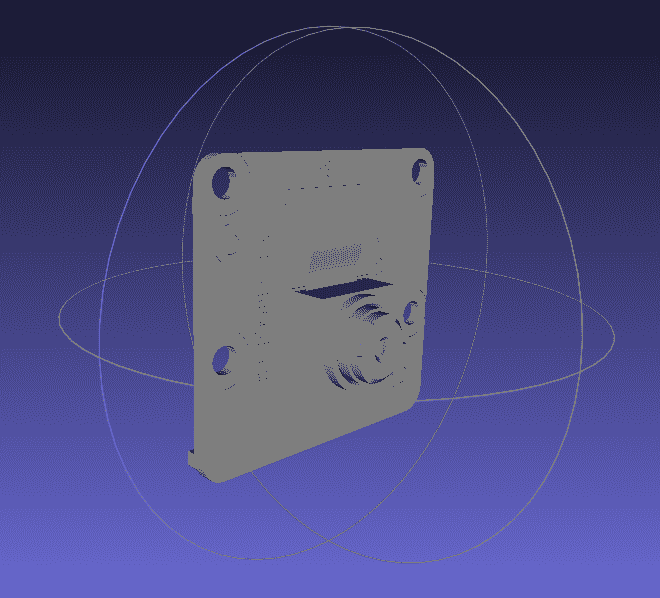

然后我们使用 `<gazebo>` 标签添加相机技术特性：

```py
<gazebo reference="camera">
  <sensor type="camera" name="camera1">
    <update_rate>30.0</update_rate>
    <camera name="front">
      <horizontal_fov>1.3962634</horizontal_fov>
      <image>
        <width>800</width>
        <height>800</height>
        <format>R8G8B8</format>
      </image>
    <clip>
      <near>0.02</near>
      <far>300</far>
    </clip>
    </camera>
    <!-- plugin "camera_controller" filename="libgazebo_ros_camera.so" -->
  </sensor>
</gazebo>
```

`<update_rate>` 标签指定传感器以 30 Hz 的频率读取，即每秒读取 30 张图像。最后，我们添加了模拟相机行为的 Gazebo 插件。以下片段是替换先前代码块中注释行中提到的 `plugin "camera_controller"` 的内容：

```py
      <plugin name="camera_controller" filename="libgazebo_ros_camera.so">
        <alwaysOn>true</alwaysOn>
        <updateRate>0.0</updateRate>
        <cameraName>gopigo/camera1</cameraName>
        <imageTopicName>image_raw</imageTopicName>
        <cameraInfoTopicName>camera_info</cameraInfoTopicName>
        <frameName>camera</frameName>
        <hackBaseline>0.07</hackBaseline>
        <distortionK1>0.0</distortionK1>
        <distortionK2>0.0</distortionK2>
        <distortionK3>0.0</distortionK3>
        <distortionT1>0.0</distortionT1>
        <distortionT2>0.0</distortionT2>
      </plugin>

```

相机控制器位于 `libgazebo_ros_camera.so` 文件中，因此你在这个块中提供的是你使用的相机的技术规格。将 `<updateRate>` 设置为 `0.0` 表示 Gazebo 应该从先前的 `<sensor>` 标签中获取刷新率，即 30 Hz。如指定（见粗体字字段），相机图像将在 `/gopigo/camera1/image_raw` 主题中发布。

启动 ROS 可视化工具以检查模型是否正确构建。由于 **RViz** 只代表其视觉特征——它不包括任何物理仿真引擎——因此它比 Gazebo 轻得多，你可以使用所有选项来检查模型的每个外观方面：

```py
$ roslaunch gopigo3_description gopigo3_basic_rviz.launch
```

此启动文件与你在第四章创建虚拟两轮 ROS 机器人中使用的启动文件非常相似。以下截图显示了你应该看到的成果：

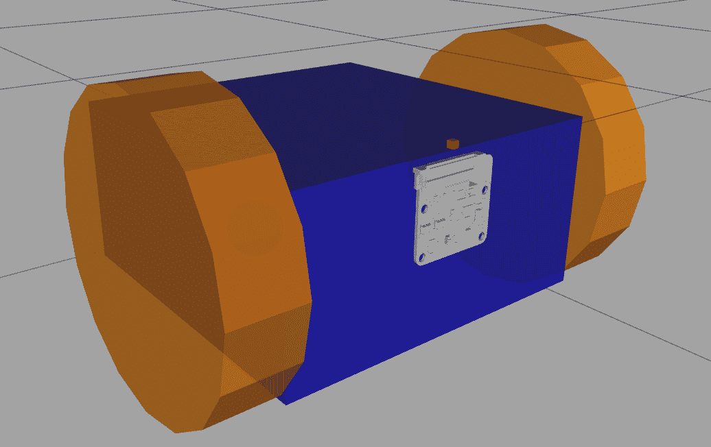

在下一节中，你将进行一个实际练习，以了解如何使用 Gazebo 来操作相机。

# 模拟相机

按照以下步骤进行模拟：

1.  让我们先以与上一章相同的方式将机器人放置在 Gazebo 中，并启用键盘远程控制：

```py
T1 $ roslaunch virtual_slam gopigo3_basic_world.launch 
T2 $ rosrun key_teleop key_teleop.py /key_vel:=/cmd_vel
```

`key_teleop` 允许你使用键盘的箭头键远程控制 GoPiGo3。

1.  现在，从预装在 ROS 中的 `image_view` 包启动一个节点：

```py
T3 $ rosrun image_view image_view image:=/gopigo/camera1/image_raw
```

我们正在重新映射 `image` 主题，以便节点从相机节点主题 `/gopigo/camera1/image_raw` 获取数据。此主题在相机控制器插件的先前片段中定义，结合了 `<imageTopicName>` 和

`<cameraInfoTopicName>` 标签。使用箭头键远程操作机器人，你将在图像窗口中看到主观视图：

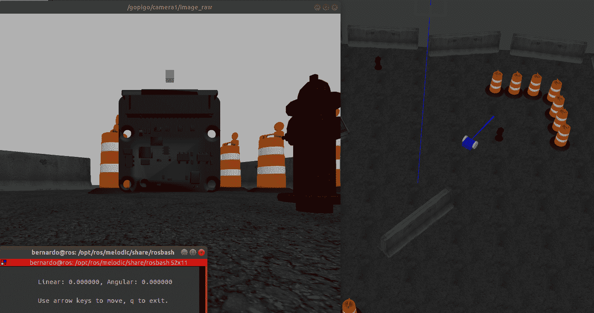

背景窗口对应于 Gazebo（从终端 `T1` 启动），在那里您可以看到虚拟机器人正在观察交通锥。主观视图显示在左侧窗口（`T2`），由 Pi 相机图像实时流提供，使用 `image_view` 包。最后，左下角的窗口（`T3`）是您需要选择以能够使用键盘上的箭头键移动机器人的窗口。我们已经使用它们将机器人放置在交通锥前面，如前面的截图所示。

在这一点上，让我们使用众所周知的命令 `rqt_graph` 获取 ROS 图，并查看图像主题重映射是如何处理的：

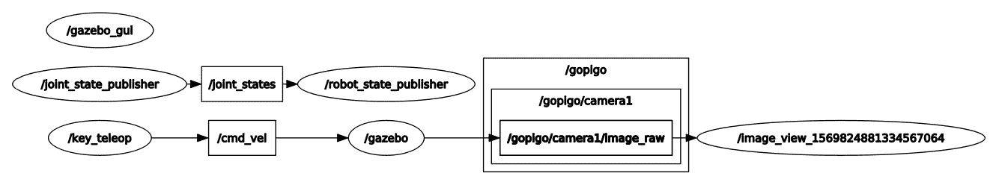

感谢映射参数 `image:=/gopigo/camera1/image_raw`，`image_view` 包的 `image` 主题保持隐式，仅可见 `/gopigo/camera1/image_raw`。

您是否意识到，当您使用预构建的 ROS 模块和自定义机器人定义时，交付机器人行为是多么快速和简单？在下一节中，我们将为第二个传感器介绍这些相同的步骤。

# 距离传感器

我们通过遵循我们之前介绍的用于摄像头的相同程序，在 `<visual>` 标签下添加此传感器的实体模型。URDF 定义如下：

```py
<joint name="distance_sensor_solid_joint" type="fixed">
    <axis xyz="0 1 0" />
    <origin rpy="0 0 0" xyz="0 0 0" />
    <parent link="base_link"/>
    <child link="distance_sensor_solid"/>
  </joint>

  <link name="distance_sensor_solid">
    <visual>
      <origin xyz="0.2 0 0.155" rpy="1.570795 0 1.570795" />
      <geometry>
        <mesh filename="package://gopigo3_description/meshes/IR_Sensor_Sharp_GP2Y_solid.stl" scale="0.005 0.005 0.005"/>
      </geometry>
      <material name="red"/>
    </visual>
    ...
  </link>
```

在前面的代码片段中，我们可以看到两个块：用于指定实体的 `<link>` 元素，以及用于将传感器主体连接到机器人底盘的 `<joint>` 块。由于距离传感器是刚性连接到机器人底盘的，我们指定 `type="fixed">` 来模拟这一特性。我们使用的实体模型如下截图所示。在这种情况下，我们使用 STL 格式的 CAD 模型，并通过 `<mesh>` 标签引用它：

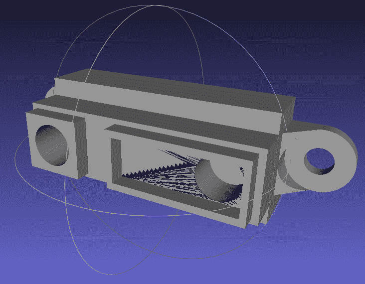

我们将在另一个实体中基于传感器本身，因为如果您使用前面截图中的实体，您将在 Gazebo 中看到距离射线被实体阻挡，因此传感器将始终产生零距离值。所以，我们将向您解释一个技巧，通过这个技巧您可以分离传感器的实体模型和位于链接框架原点的传感点：

```py
<joint name="distance_sensor_joint" type="fixed">
    <axis xyz="0 1 0" />
    <origin rpy="0 0 0" xyz="0.245 0 0.13" />
    <parent link="base_link"/>
    <child link="distance_sensor"/>
</joint>
<link name="distance_sensor">
    <visual>
         <origin xyz="0 0 0" rpy="0 0 0"/>
         <geometry>
             <box size="0.01 0.01 0.01"/>
         </geometry>
         <material name="red"/>
    </visual>
</link>
```

此代码片段创建了一个 10 cm x 10 cm 的盒子，并将其放置在 `<joint>` 标签指定的坐标中。

然后我们使用 `<gazebo>` 标签添加传感器技术特性，您可以看到它引用了前面代码片段中定义的 `distance_sensor` 链接（不是 `distance_sensor_solid`）：

```py
<gazebo reference="distance_sensor"> 
   <sensor type="ray" name="laser_distance">
      <visualize>true</visualize>
      <update_rate>10</update_rate>
      <ray>
         ...
         <range>
            <min>0.01</min>
            <max>3</max>
            <resolution>0.01</resolution>
         </range>
      </ray>
      <!-- plugin filename="libgazebo_ros_range.so" name="gazebo_ros_ir" -->
    </sensor> 
   </gazebo>
```

`<update_rate>` 标签指定传感器以 10 Hz 的频率读取，而 `<range>` 标签设置测量距离值在 10 cm 到 3 m 之间，分辨率为 1 cm。

`<visualize>**true**</visualize>` 标签块允许您在 Gazebo 中看到距离传感器的激光射线覆盖 `<range>` 标签中解释的极限；也就是说，其检测范围达到 3 米。

最后，我们添加了模拟距离传感器行为的 Gazebo 插件。以下片段是替换先前代码块中注释掉的`plugin "gazebo_ros_ir"`行：

```py
       <plugin filename="libgazebo_ros_range.so" name="gazebo_ros_ir">
         <gaussianNoise>0.005</gaussianNoise>
         <alwaysOn>true</alwaysOn>
         <updateRate>0.0</updateRate>
             <topicName>gopigo/distance_sensor</topicName>
             <frameName>distance_sensor</frameName>
         <radiation>INFRARED</radiation>
         <fov>0.02</fov>
       </plugin> 
```

距离传感器的控制器位于`libgazebo_ros_range.so`文件中，因此您在这个块中提供的是您所使用传感器的技术规格。将`<updateRate>`标签设置为`0.0`意味着 Gazebo 应该从先前的`<sensor>`标签中获取刷新率，即 10 Hz。如指定（请参阅粗体字字段），范围值将在`/sensor/ir_front`主题中发布。

启动 ROS 可视化工具以检查模型是否正确构建。由于**RViz**仅表示其视觉特征，它比 Gazebo 轻得多，您有所有选项来检查模型的每个外观方面：

```py
$ roslaunch gopigo3_description gopigo3_basic_rviz.launch
```

在下面的屏幕截图中，您可以一起看到我们之前包括的相机所得到的结果：

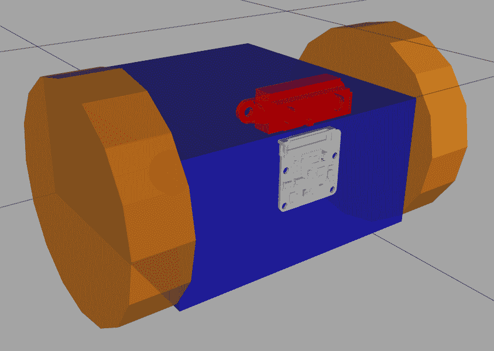

在下一节中，您将通过实际练习看到在 Gazebo 下使用距离传感器的工作方式。

# 模拟距离传感器

这个测试包括距离传感器和二维相机。使用以下代码中的四个终端运行示例：

```py
T1 $ roslaunch virtual_slam gopigo3_basic_world.launch
T2 $ rosrun key_teleop key_teleop.py /key_vel:=/cmd_vel
T3 $ rostopic echo /gopigo/distance_sensor
T4 $ rosrun image_view image_view image:=/gopigo/camera1/image_raw
```

下面的屏幕截图是您应该获得的结果的组合视图：

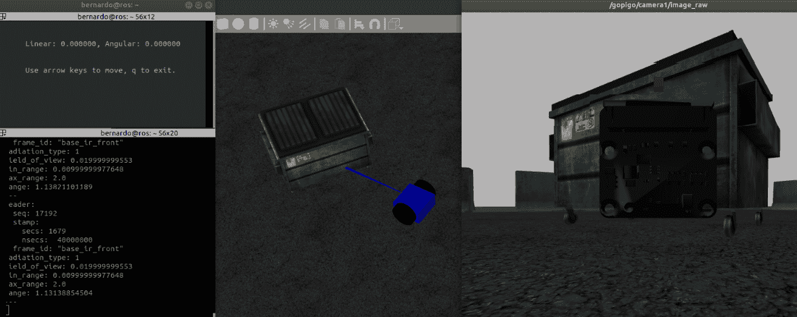

在前面的屏幕截图中，您可以找到以下组件：

+   中央窗口是 Gazebo 窗口，您可以看到 GoPiGo3、一个障碍物和距离传感器的射线。

+   顶部左边的灰色窗口是我们需要选择的窗口，以便箭头键的推力被接收为远程控制的`/cmd_vel`主题消息。

+   底部左边的黑色窗口实时显示发送到距离传感器主题的消息，即`/gopigo/distance_sensor`。当前到障碍物的距离在`range`字段中找到，值为 1.13 米。

+   右侧的窗口显示了机器人通过其二维相机看到的实时视图，该视图通过`/gopigo/camera1/image_raw`主题接收。

您可以手动驾驶从场景的一侧到另一侧，而不会撞到任何家具。您作为人类规划最优路径，并执行它，将机器人带到目的地目标，同时避开障碍物。您之前所做的是机器人现在必须自己做的，尽可能好地执行。这项任务被称为**导航**，这是我们将在下一节中要讨论的内容。

# 导航组件

导航是机器人按照计划轨迹从当前位置移动到目标位置的过程。在机器人中，这种能力意味着它能够确定轨迹上的任何位置，以及根据环境表示（如地图）制定行动计划。我们还应该添加避免动态障碍物或第一次构建地图时未存在的其他障碍物的能力。

在构建导航能力时，需要考虑四个组成部分：

+   环境图，预先存在并作为输入提供给机器人，或者通过其自身手段使用其传感器收集的感官数据来构建。这个过程，即数据采集加上解释，构成了我们所说的机器人感知能力。一个利用机器人感知的著名技术被称为 SLAM，如前所述。

+   实时姿态，理解为机器人相对于环境中的固定参考系在位置和旋转（统称为姿态）方面的定位能力。在机器人技术中，用于获取姿态的典型技术被称为死 reckoning，其中当前姿态是相对于前一个姿态加上内部里程计数据（来自电机的旋转编码器）和 IMU 传感器数据来估计的，以减少这些计算的错误。GoPiGo3 中都有这两种。

+   机器人感知，源于传感器数据及其解释的结合，使机器人意识到周围的对象和障碍物。在 GoPiGo3 中，有助于感知的传感器是距离传感器、Pi 相机和 LDS。

+   路径规划和执行，包括计算最佳路径及其执行，以便机器人能够达到目标位置。由于地图不包含环境的所有细节，并且可能存在动态障碍物，因此路径规划也应该是动态的。其算法将越好，因为它将能够适应环境中的变化条件。

接下来，我们将介绍成本图，这是导航基础上的一个关键概念。

# 安全导航的成本图

机器人导航的成本图源于机器人姿态的结合，该姿态由里程计数据（编码器）和 IMU 传感器估计，以及使用距离传感器和 LDS 在环境中感知到的对象和障碍物，以及从 SLAM 技术获得的**占用栅格地图**（**OGM**）。

这些信息源提供障碍区域、可能的碰撞和机器人可移动区域的联合测量。存在一个全局成本图和一个局部成本图。全局成本图通过 SLAM 获得的固定地图来计算导航路径，而局部版本允许机器人处理其即时环境的细粒度细节，以绕过障碍物并避免碰撞。

costmap，无论是局部还是全局，都是以 8 位范围为测量单位，即网格占用图中的每个单元格的值从 0 到 255。0 值表示空闲区域，而 255 表示占用区域。接近 255 的值表示碰撞区域，而中间值从低碰撞概率（0-127）到高（128-252）。

在下一节中，我们将最终处理 SLAM，这是机器人导航的核心技术。作为一个起点，我们将通过集成 LDS 来完成 GoPiGo3 感知能力的设置。

# 机器人感知和 SLAM

在 ROS 中实现机器人导航最直接的方法是使用提供 360°覆盖范围的 LDS，使机器人能够感知其周围的所有物体和障碍物。

在本章的介绍中，我们确定了**EAI YDLIDAR X4**作为一个低成本选项，可以与我们的物理机器人集成。这将在下一章中介绍，而在本章中，我们将开发其虚拟模型以集成到 Gazebo 中。

下一个子节扩展了我们本章中工作的虚拟 GoPiGo3，以包括这个特定的 LDS 模型。之后，我们将部署一个快速 SLAM 示例，以了解该功能可以为机器人导航提供哪些概述。

# 添加激光测距传感器（LDS）

添加传感器的过程与我们在上一节中为距离传感器所做的工作类似。按照以下步骤进行操作：

1.  我们按照之前介绍的方法，在`<visual>`标签下添加这个传感器的实体模型。URDF 定义如下：

```py
  <link name="base_scan">
    <visual name="sensor_body">
      <origin xyz="0 0 0" rpy="0 0 0" />
      <geometry>
        <mesh filename="package://gopigo3_description/meshes/TB3_lds-01.stl" scale="0.003 0.003 0.003"/> 
      </geometry>
      <material name="yellow"/>
    </visual>
    <visual name="support">
      <origin xyz="0 0 -0.0625" rpy="0 0 0" />
      <geometry>
        <cylinder length="0.12" radius="0.1" />
      </geometry>
    </visual> 
  </link>
```

我们可以在前面的片段中的`<link>`元素内看到两个`<visual>`块：`sensor_body`是 LDS 本身，而`support`创建了传感器和机器人底盘之间的物理接口。我们用于传感器主体的实体模型是以下屏幕截图所示，它由 STL 格式的 CAD 模型组成，该模型引用自`<mesh>`标签：

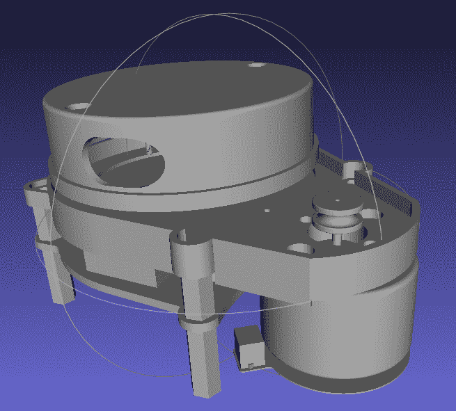

1.  接下来，我们在机器人底盘上附加传感器组件，添加一个`<joint>`元素，其`<type="fixed">`：

```py
  <joint name="scan_joint" type="fixed">
    <parent link="base_link"/>
    <child link="base_scan"/>
    <origin xyz="-0.1 0 0.25" rpy="0 0 0"/>
  </joint>
```

1.  然后，我们使用`<gazebo>`标签添加传感器技术特性，该标签指向前面片段中定义的`distance_sensor`链接（不是`distance_sensor_solid`）：

```py
  <gazebo reference="base_scan">
    <sensor type="ray" name="lds_lfcd_sensor">
      <visualize>true</visualize>
      <update_rate>5</update_rate>
      <ray>
        <scan>
          <horizontal> <samples>721</samples> ... </horizontal>
        </scan>
        <range>
          <min>0.12</min>
          <max>10</max>
          <resolution>0.015</resolution>
        </range>
      </ray>
        <!-- plugin name="gazebo_ros_lds_lfcd_controller" filename="libgazebo_ros_laser.so" -->
    </sensor>
  </gazebo>
```

`<range>`标签设置了从 12 厘米到 10 米的测量距离值，如 EAI YDLIDAR X4 的技术规范中所示。请注意`<visualize>true</visualize>`标签，因为对于这种具有 360°视场的传感器，屏幕将被射线填满以显示它覆盖的角度范围。建议在视觉检查确认传感器正常工作后将其设置为`false`。

`<visualize>true</visualize>` 标签块对于距离传感器具有与之前章节中当我们构建其模型时相同的意义和效果，在 *距离传感器* 子节中解释过。唯一的区别是，LDS 以 360º 的覆盖范围覆盖所有角度，追踪 `<samples>` 标签内指定的样本数量那么多条射线。

`<update_rate>` 标签指定传感器以 5 Hz 的频率读取，但 LDS 的规格是 5,000 Hz。我们为什么不使用实际值？这是出于 CPU 使用率的原因：

请记住，如果我们将其读取频率设置为其实际物理能力，它将每秒读取 5,000 个样本，每个样本是一个包含 720 个点的向量。

由于 LDS 覆盖了所有可能的方向，为了得到 0.5º 均匀分布的 720 条射线，您需要多放一个样本，即 721，因为 0º 和 360º 实际上是同一个角度。

每个点将由两个浮点值（64 位）来表征，因此每个样本需要 720 x 2 x 64 = 92160 位 = 11 Kb。由于会有 5,000 个样本，我们需要 53 Mb/s 的带宽。这是一个巨大的值，需要由 Raspberry Pi CPU 来管理。

由于机器人将以低速移动，没有必要进行如此高频率的读取，因此我们可以将其限制为仅 5 Hz，这对机器人行为没有任何影响。这将只需要 55 Kb/s 的带宽，比传感器可以提供的低 1,000 倍。

这是一个明确的例子，说明了为什么您不应该直接在 Gazebo 中引入传感器的规格，因为它可能会影响模拟的性能。您需要批判性地分析每个传感器，并决定在它的虚拟控制器中设置哪些参数，以便它能很好地重现实际行为，同时不会不必要地过载 CPU。

1.  下一步是添加模拟距离传感器行为的 Gazebo 插件。以下片段是替换前面代码块中注释的行，该行引用 `plugin "gazebo_ros_lds_lfcd_controller"`：

```py
      <plugin name="gazebo_ros_lds_lfcd_controller" filename="libgazebo_ros_laser.so">
        <topicName>/gopigo/scan</topicName>
        <frameName>base_scan</frameName>
      </plugin>
```

距离传感器的控制器位于 `libgazebo_ros_laser_range.so` 文件中，因此您在这个块中提供的是您想要覆盖前面片段中 `<sensor>` 标签提供的值的传感器技术规格。如指定（请参阅粗体字母中的字段），范围值将在 `/gopigo/scan` 主题中发布。

1.  最后，启动 ROS 可视化工具以检查模型是否正确构建。由于 RViz 只代表其视觉特征，它比 Gazebo 轻得多，您有所有选项来检查模型的每个外观方面：

```py
$ roslaunch gopigo3_description gopigo3_rviz.launch
```

在下面的屏幕截图中，您可以一起看到我们之前包括的相机和结果：

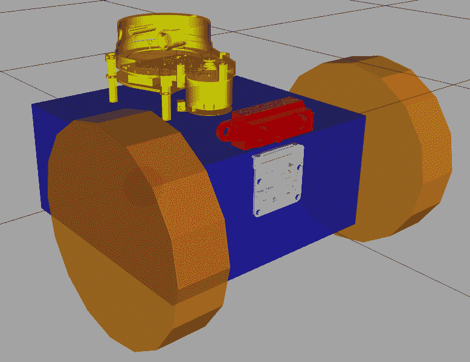

在下一个子节中，您将进行一个实际练习，以了解在 Gazebo 下激光距离传感器是如何工作的。

# 模拟 LDS

在虚拟机器人中包含 LDS 模型后，我们可以通过在 Gazebo 中运行模拟来查看它的工作情况：

1.  在单独的终端中执行以下命令以查看传感器的工作情况：

```py
T1 $ roslaunch virtual_slam gopigo3_world.launch
T2 $ rosrun key_teleop key_teleop.py /key_vel:=/cmd_vel
T3 $ rostopic echo /gopigo/scan
```

在`T3`中，你会看到大量数据，因为每个`LaserScan`消息包含 720 个点来覆盖传感器周围的 360°视图。

1.  为了测试这个传感器，最好使用一个 Python 脚本，使机器人在环境中游荡，同时避开障碍物。为此，我们在脚本中实现了以下规则：

+   +   如果没有障碍物，以 0.8 m/s 的参考速度前进。

    +   如果距离传感器的范围低于 2 米，就后退并逆时针旋转，直到避开障碍物。

    +   由于距离传感器提供单向测量，我们应该检查 LDS 的测量值，以确定是否存在侧面的障碍物，阈值应低于 1.6 米。如果检测到障碍物，就后退并更快地逆时针旋转，以避开障碍物，并且不要卡在它上面。

这个简单的算法在`wanderAround.py`脚本中实现，可以在`./virtual_slam/scripts/wanderAround.py`文件夹下找到。

1.  现在，试一试，享受观看 GoPiGo3 如何从一个世界的一边游荡到另一边，同时避开障碍物。要运行的序列如下：

```py
T1 $ roslaunch virtual_slam gopigo3_world.launch
T2 $ rosrun virtual_slam wanderAround.py
```

以下截图显示了机器人四处游荡的情况：

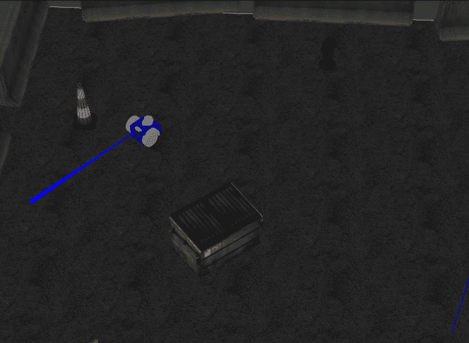

为了完成这一部分，我们将简要介绍 SLAM 理论的关键概念，以便在我们进入本章最后部分，即机器人导航实现的实际部分时，你知道底下的情况。

# SLAM 概念

SLAM 允许机器人使用以下两种信息来源构建环境地图：

+   机器人姿态估计，来源于内部里程计（旋转编码器）和 IMU 传感器数据

+   到物体、障碍物和墙壁的距离，来自距离传感器，特别是 LDS

在其最基本版本中，地图包括二维信息，而在更高级的应用中使用工业级 LIDAR 传感器时，通过 LIDAR 和/或三维摄像头提供的三维信息构建了一个更丰富的地图。为了我们学习路径的目的，我们将处理二维 OGM，这在 ROS 项目中也很常见。

# 占位网格地图（OGM）

以一个有四个静态障碍物的正方形房间为例。以下图显示了在 ROS 中使用 SLAM 生成的地图（你稍后会学习如何自己生成它）：

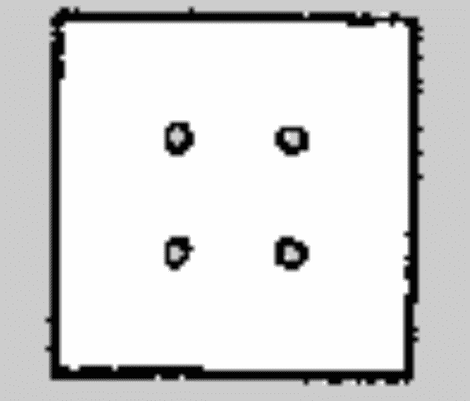

在这样的二维地图中，空闲区域和占用区域以不同的灰度强度（8 位格式，0-255 范围，如前面在描述成本图时已提到）绘制。然后，每个单元格的占用概率作为 255 与强度值的差值除以 255 获得。这意味着以下：

+   白色区域（255 值）表示 0%的概率；也就是说，其中没有障碍物。

+   黑色区域（0 值）表示 100%的概率；也就是说，它们被占用。

这种概率分布允许构建一个成本图，帮助机器人确定选择哪个轨迹以达到目标位置。当发布到 ROS 时，占用概率转换为介于 0（0%概率，即空闲空间）和 100（100%，即占用空间）之间的整数值。未知区域分配值为-1。地图信息使用两个文件存储：

+   `.pgm` 格式文件，称为便携式灰度图格式。

+   包含地图配置的 `.yaml` 文件。请参阅以下内容的示例：

```py
image: ./test_map.pgm
resolution: 0.010000
origin: [-20.000000, -20.000000, 0.000000]
negate: 0
occupied_thresh: 0.65
free_thresh: 0.196
```

最有趣的参数是最后两个：

+   `occupied_thresh = 0.65` 意味着如果一个单元格的概率超过 65%，则被认为是占用的。

+   `free_thresh = 0.196` 确立了以下阈值值，即单元格被认为是空闲的，即 19.6%。

给定图像的像素大小，可以很容易地推断出地图中单元格的物理尺寸。此值由 `resolution` 参数指示，即 0.01 米/像素。

# SLAM 过程

使用 Gazebo 模拟构建地图涉及采用以下工作流程：

1.  在建模环境中启动机器人模型。

1.  启动映射 ROS 包。

1.  在 RViz 中启动一个特殊的可视化，让我们看到机器人移动时扫描的区域。

1.  远程操作机器人，使其尽可能覆盖虚拟环境的地表。

1.  一旦探索完成，保存地图，生成前面章节中指明的格式文件，即 `.pgm` 和 `.yaml`。

完成这一信息收集阶段后，我们就可以让机器人尝试并成功完成导航任务。

# 导航过程

一旦你的机器人生成了一张地图，它将使用它来规划到达指定目标位置的路程。执行此类计划的流程称为导航，涉及以下步骤：

1.  在建模环境中启动机器人模型。这一步骤与前面描述的 SLAM 过程中的第一步相同。

1.  提供机器人之前构建的成本图。请记住，地图是环境的特点，而不是机器人的特点。因此，你可以用一个机器人构建地图，并在任何其他机器人放入相同环境中进行导航时使用相同的地图。

1.  设置导航算法。我们将使用 **自适应蒙特卡洛定位**（**AMCL**）算法，这是有效导航中最常见的选择。本书的范围不包括描述此类算法，但在本章末尾的进一步阅读部分提供了有用的参考资料。

1.  启动 RViz 可视化，这将允许你在环境中可视化机器人，并轻松标记它应达到的目标姿态（位置和方向）。

1.  让机器人自主导航到目标位置。此时，你可以放松并享受观看 GoPiGo3 如何避开障碍物并尽量减少需要覆盖的距离，到达指定位置的过程。

如果你希望机器人导航到另一个位置，只需在它到达前一个目标后，在 RViz 中指示即可。现在，是时候看到前两个过程——SLAM 和导航——的实际操作了。这正是本章最后部分的内容范围。

# 使用 GoPiGo3 练习 SLAM 和导航

正如前一小节末尾提到的，我们将运行一个使用 GoPiGo3 的 SLAM 和导航的端到端示例。第一个过程是使用 SLAM 构建环境的地图。让我们回顾上一节中列出的步骤，并看看如何在 ROS 中执行每个步骤。

# 使用 SLAM 探索环境以构建地图

让我们按照以下步骤构建一个名为 `stage_2.world` 的简单 Gazebo 世界的地图：

1.  通过运行以下代码行在建模环境中启动机器人模型：

```py
T1 $ roslaunch virtual_slam gopigo3_world.launch world:=stage_2.world

```

此命令启动 Gazebo 并将 GoPiGo3 模型放置在其中，如下面的截图所示：

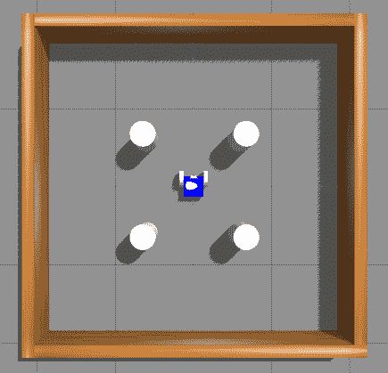

环境由一个包含四个静态障碍物的正方形空间组成。我们在上一节 *占用栅格地图（OGM）* 子节中使用过的二维地图对应于这个 Gazebo 世界，其文件名为 `stage_2.world`。

你可以看到，这个世界的结构远比本章第一部分使用的那个简单（还有一个没有障碍物的更简单环境，名为 `stage_1.world`）。我们使用这个来通过最小设置说明导航概念，以便更好地理解。

将重复此过程作为读者的练习，使用第一部分 *使用 Gazebo 的动态模拟* 章节中的 Gazebo 世界。为此，只需省略 `world` 参数，使其采用启动文件中指定的默认值。执行此模拟的命令是 `$ roslaunch virtual_slam gopigo3_world.launch`

最后，请注意，我们可以通过将 `world` 参数设置为所选环境的文件名来指定任何我们想要在 Gazebo 中使用的其他环境（可用世界位于本章代码的 `./virtual_slam/worlds` 文件夹内）：

```py
T1 $ roslaunch virtual_slam gopigo3_world.launch world:= <OTHER_WORLD.world>
```

1.  启动 SLAM 映射 ROS 包，包括一个将机器人的虚拟模型与实际扫描数据叠加的 RViz 可视化：

```py
T2 $ roslaunch virtual_slam gopigo3_slam.launch
```

下面的屏幕截图显示了 RViz 窗口的外观，其中您可以实时看到虚拟机器人和扫描数据（绿色点）。浅灰色区域是机器人实际上通过其 LDS 传感器感知到的区域，而未着色的区域（障碍物后面的阴影空间）是 GoPiGo3 尚未了解的：

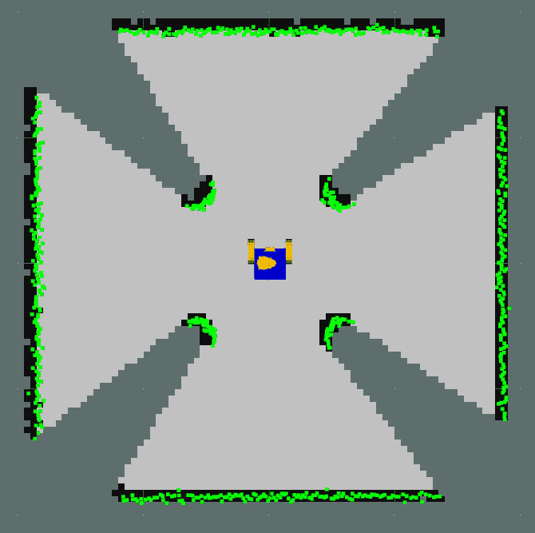

在下一步中，我们将探索整个环境以构建地图。

1.  通过遥控操作机器人，使其尽可能覆盖当前 Gazebo 世界的表面。让我们像往常一样使用遥控操作包来做这件事：

```py
T3 $ rosrun key_teleop key_teleop.py /key_vel:=/cmd_vel
```

随着您移动机器人，LDS 传感器将从未知区域获取扫描数据，您将在 RViz 窗口中收到反馈：

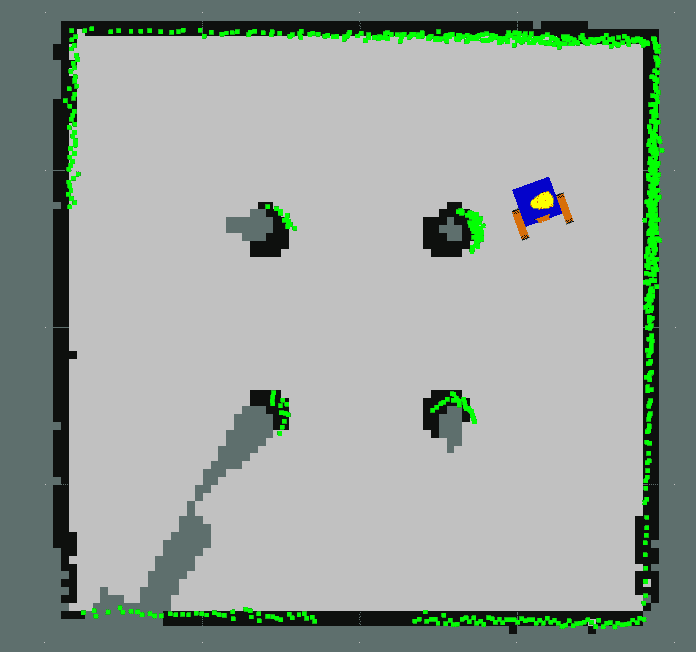

在前面的屏幕截图中，您可以看到，在环境中徘徊之后，只有左下角的部分没有被扫描。然后移动机器人到那个位置，一旦所有空间都被同一种颜色（浅灰色）填满，就继续进行第 4 步以保存地图。

1.  一旦完成探索，保存地图，生成前面*SLAM 过程*子节中指示的两种格式的两个文件，即，`.pgm`和`.yaml`：

```py
T4 $ rosrun map_server map_saver -f ~/catkin_ws/map_stage_2
```

您将在工作空间根目录中获得两个文件：`map_stage_2.pgm`和`map_stage_2.yaml`。

生成的地图的外观在前面*占用栅格地图（OGM）*子节中显示。

提供了地图，我们就可以使用 GoPiGo3 进行机器人导航了。

# 使用导航沿计划轨迹行驶

首先，关闭所有打开的终端。然后，就像在 SLAM 过程中一样，让我们一步一步地进行一些导航：

1.  在建模环境中启动机器人模型。这一步与 SLAM 过程中的第一步相同：

```py
T1 $ roslaunch virtual_slam gopigo3_world.launch
```

1.  设置导航算法并启动 RViz。我们将使用 AMCL，这是最常用的有效导航选择。本书的范围不包括描述此类算法，但您可以在章节末尾的*进一步阅读*部分找到有用的参考资料。

在这一步中，我们还提供了机器人之前构建的成本图。为此，您只需参考之前创建的`.yaml`地图文件。确保相应的`.pgm`文件具有相同的名称，并且放置在同一位置。这一点在`roslaunch`命令中通过`map_file`参数指定：

```py
T2 $ roslaunch virtual_slam gopigo3_navigation.launch map_file:=$HOME/catkin_ws/map_stage_2.yaml
```

1.  下面的屏幕截图显示了 RViz 窗口，它让您可视化环境中的机器人并标记它应该达到的目标姿态（位置和方向）：

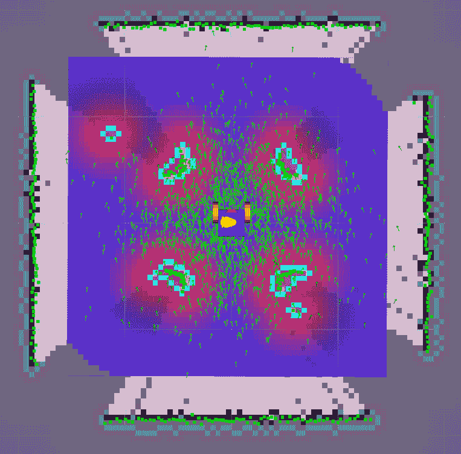

在 RViz 窗口的右上角找到 2D Nav Goal 按钮。您将使用它来标记机器人应该导航的目标位置。

首先，您必须通过按下**2D 姿态估计**按钮告诉机器人这是初始姿态。然后，在屏幕上标记它（在这个特定情况下，这是不必要的，因为初始姿态与机器人在前一小节开始构建地图时的姿态相同）。

之后，您可以按下**2D 导航目标**按钮，通过点击左鼠标按钮将目标设置为*左下角*。当箭头达到所需方向时释放鼠标。释放后，机器人将计算要遵循的路径并开始自主导航：

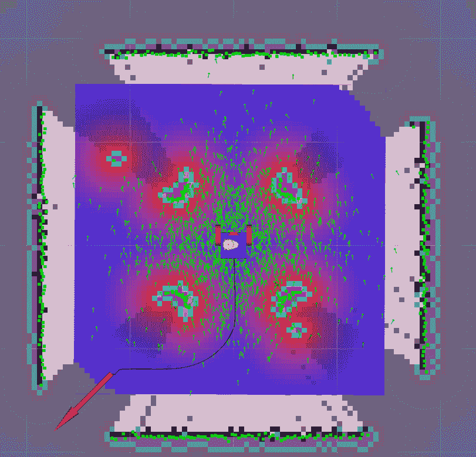

上述截图显示了导航计划执行的第一瞬间。红色箭头的方向告诉 GoPiGo3 到达目标后应该朝哪个方向保持面对，从机器人到目标的曲线线是计划路径。由于它有环境地图，机器人能够规划一条避开障碍物的路径。等待几秒钟，您将看到机器人如何在没有外部帮助的情况下到达目标。

1.  一旦机器人到达，再次按下**2D 导航目标**按钮，然后标记右上角。以下截图显示了下一个导航计划的执行第一瞬间：

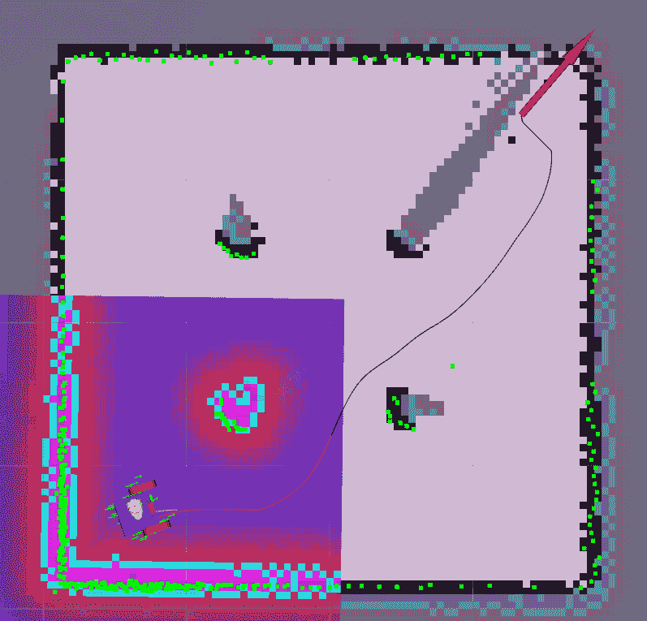

您可以看到新的计划路径以及它是如何考虑沿途障碍物的存在以避免碰撞的。机器人周围的蓝色方块代表障碍物避障规划的局部窗口。这是由**动态窗口方法**（**DWA**）方法使用的，该方法生成一个能够有效避开障碍物的局部路径。DWA 方法在考虑机器人的动力学时进行计算，特别是其有限的速度和加速度。

机器人导航的 AMCL 算法根据提供的地图生成到达目标的全局路径，而 DWA 方法计算考虑机器人可能在其附近遇到的局部条件的局部路径。后者提供了处理地图中存在的障碍物以及动态障碍物的能力，例如行人穿越机器人的路径。*全局路径*和*局部路径*结合在一起产生*高度自主的机器人导航*。

以下截图显示了 GoPiGo3 在到达目标前的最后瞬间。欣赏一下，在这个点上，DWA 窗口也包含了目标：

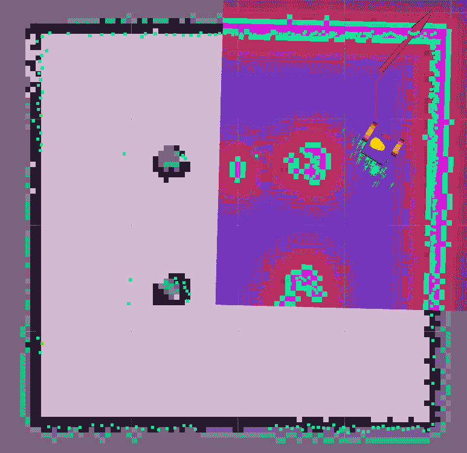

1.  最后，你应该将机器人导航框架在一系列任务中，这些任务是机器人必须依次完成，以实现用户设定的目标。以本章中用于解释目的的导航路径为例，想象一个场景，其中 GoPiGo3 必须在位置 *A*（左下角）拾起一个物体，并将其运送到位置 *B*（右上角）。在这种情况下，任务序列如下：

    1.  导航到位置 *A*。

    1.  在位置 *A* 拾起物品。

    1.  导航到位置 *B*。

    1.  在位置 *B* 放下物品。

从概念上讲，这很容易，对吧？但在本章中，我们只涵盖了完成任务 1 和 3 的基础知识。稍后，在 第十章 “在机器人学中应用机器学习”中，你将获得关于**目标识别**的技术背景，以便你也能编程任务 2 和 4。更确切地说，它将在 *“在机器人学中程序化应用机器学习的方法论”* 部分提供这一见解。

# 摘要

本章向你介绍了机器人导航的主要任务。SLAM 和导航是机器人学中的复杂问题，也是活跃的研究课题。因此，本章为你提供了如何实现它的初步了解，以便你能够快速理解其原理，而不必深入了解算法和背后的数学。

我们希望已经激起了你对这个主题的好奇心。现在你已准备好在现实世界中用物理 GoPiGo3 执行相同的任务。在下一章中，你将使用物理机器人执行导航和 SLAM 任务。

# 问题

1.  传感器规格在 Gazebo SDF 文件中包含在哪里？

A) 在 `<gazebo>` 标签外

B) 在 `<joint>` 标签内

C) 在 `<sensor>` 标签内

1.  关于在 Gazebo 中传感器控制器的规格，在运行模拟时，哪个参数与 CPU 使用率最相关？

A) 扫描距离，因为传感器范围越大，CPU 执行的带宽消耗就越多。

B) 角度扫描，因为角度分辨率越高，存储读取数据在 RAM 中所需的带宽消耗就越大。

C) 传感器的最大频率，因为它们在真实传感器中非常高，很容易超载 CPU。

1.  传感器的机械属性在 Gazebo 机器人描述中包含在哪里？

A) 在 `<gazebo>` 标签外

B) 在 `<joint>` 标签内

C) 在 `<sensor>` 标签内

1.  SLAM 技术为机器人提供了什么？

A) 避免环境中移动障碍物的方法

B) 建立环境地图的方法

C) 避免环境中静态和移动障碍物的方法

1.  你如何操作性地指定导航目标给机器人？

A) 告诉它目标位置和方向

B) 在环境的二维地图中设置目标位置

C) 标记机器人预期导航到的区域边界

# 进一步阅读

要深入了解本章中解释的概念，你可以查阅以下参考资料：

+   自适应蒙特卡洛定位（AMCL），见[`roboticsknowledgebase.com/wiki/state-estimation/adaptive-monte-carlo-localization/`](http://roboticsknowledgebase.com/wiki/state-estimation/adaptive-monte-carlo-localization/)

+   *机器人中的粒子滤波*，人工智能不确定性（UAI）会议论文集，Thrun S. (2002)，见[`robots.stanford.edu/papers/thrun.pf-in-robotics-uai02.pdf`](http://robots.stanford.edu/papers/thrun.pf-in-robotics-uai02.pdf)

+   *SLAM 傻瓜指南*，同时定位与建图教程，Riisgaard S，见[`zyzx.haust.edu.cn/moocresource/data/081503/U/802/pdfs/soren_project.pdf`](http://zyzx.haust.edu.cn/moocresource/data/081503/U/802/pdfs/soren_project.pdf)

+   *室内导航中的机器人感知*，Endres, F. (2015)，弗莱堡阿尔伯特-路德维希大学，见[ https://d-nb.info/1119716993/34](https://d-nb.info/1119716993/34)
