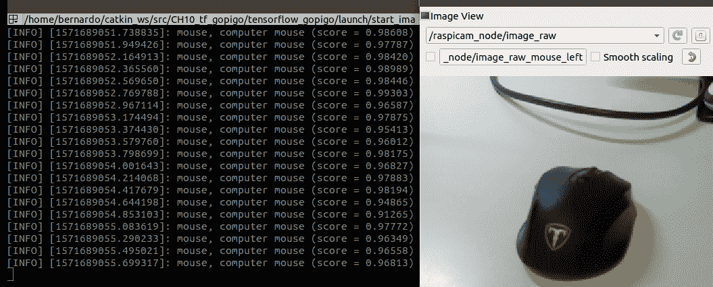

# 第十章：在机器人中应用机器学习

本章提供了机器人中机器学习（ML）的实战介绍。尽管我们假设您尚未在这个领域工作，但拥有一些统计学和数据分析背景将有所帮助。无论如何，本章旨在对主题进行温和的介绍，更倾向于直觉而非复杂的数学公式，并将重点放在理解机器学习领域中常用的概念。

在本章中，我们将通过提供特定机器人的具体示例来讨论这些概念。这在某种程度上是原创的，因为大多数关于机器学习的参考书籍和书籍都提供了面向数据科学的应用示例。因此，随着您对机器人学的熟悉，您应该更容易以这种方式理解这些概念。

通过对深度学习的解释，您将了解这项技术对于机器人通过处理来自机器人摄像头的原始数据（2D 和/或 3D）以及特定距离传感器获取周围环境知识是多么关键。在本章中，通过解释对象识别的具体示例，您将学习原始图像数据是如何被处理以构建机器人在机器人中的知识，使其能够采取智能行动。

本章将涵盖以下主题：

+   设置 TensorFlow 系统环境

+   机器学习在机器人中的应用

+   机器学习（ML）管道

+   一种将机器学习程序化应用于机器人的方法

+   应用于机器人的深度学习——计算机视觉

我们将为 GoPiGo3 实现的具体应用涉及计算机视觉，这是机器人中最常见的感知任务。装备了这种能力，机器人应该能够意识到它周围的物体，使其能够与之交互。通过本章的学习，我们期望您能够掌握在机器人中何时以及如何应用深度学习的基本见解。

# 技术要求

对于本章的示例，我们将使用 TensorFlow（[`www.tensorflow.org/`](https://www.tensorflow.org/)），这是谷歌在 2015 年开源的机器学习框架，由于所有积极参与开发或作为最终用户的众多人员，它已成为数据科学社区中的大哥大。

TensorFlow 的主要 API 是用 Python 开发的，我们将使用它。为了安装它，我们需要在我们的系统中安装知名的 `pip` Python 软件包管理器。尽管它捆绑在 Ubuntu 操作系统中，但我们提供了安装说明。稍后，我们将介绍 TensorFlow 的安装过程。

让我们先提供本章代码的路径，然后描述配置笔记本电脑以使用 TensorFlow 的逐步过程。

在本章中，我们将使用位于[`github.com/PacktPublishing/Hands-On-ROS-for-Robotics-Programming/tree/master/Chapter10_Deep_Learning_`](https://github.com/PacktPublishing/Hands-On-ROS-for-Robotics-Programming/tree/master/Chapter10_Deep_Learning_)的`Chapter10_Deep_Learning_`文件夹中的代码。

将其文件复制到**ROS**（即**机器人操作系统**）工作空间，以便它们可用，并将其余部分留在`src`文件夹之外：

```py
$ cp -R ~/Hands-On-ROS-for-Robotics-Programming/Chapter10_Deep_Learning_ ~/catkin_ws/src
```

这样，你将拥有一个更干净的 ROS 环境。像往常一样，你需要在笔记本电脑上重新构建工作空间：

```py
$ cd ~/catkin_ws
$ catkin_make
$ source ~/catkin_ws/devel/setup.bash
```

然后，让我们开始设置 TensorFlow。

# 设置 TensorFlow 的系统环境

首先，我们将设置`pip`，Python 包管理器，然后是执行机器学习（ML）的框架，即 TensorFlow。

# 安装 pip

Ubuntu 发行版通常预装了`pip`。除非 Python 库要求你升级，否则你可以保持相同的版本。在任何情况下，我们建议使用最新版本，如下所述。

# 安装最新版本

这部分适用于你需要安装或升级`pip`的情况：

1.  首先，如果有旧版本，请先删除它：

```py
$ sudo apt remove python-pip
```

我们这样做是因为 Ubuntu 仓库可能没有`pip`的最新版本。在下一步中，你将访问原始源以获取所有更新。

1.  下载安装脚本并执行它：

```py
$ sudo apt update
$ curl "https://bootstrap.pypa.io/get-pip.py" -o "get-pip.py"
$ sudo python get-pip.py
```

1.  检查已安装的版本：

```py
$ pip --version
 pip 19.3.1 from /usr/local/lib/python2.7/site-packages/pip (python 2.7)

```

如果它已经存在于你的系统中，你可以很容易地使用`pip`本身进行升级：

```py
$ sudo pip install --upgrade pip
```

现在，你已准备好进行 ML 环境的安装。

# 安装 TensorFlow 和其他依赖项

OpenCV，这个知名的开源计算机视觉库（[`opencv.org/`](https://opencv.org/)），为 ROS 带来了图像处理的能力。它被 TensorFlow 用来处理从机器人摄像头获取的图像。要在你的系统中安装它，你需要我们之前解释过的`pip`包管理器：

```py
$ pip install opencv-python --user
```

`--user`标志确保包被安装到用户主目录的`~/.local/lib/python2.7/site-packages`下。否则，它应该被安装到系统范围内的`/usr/local/lib/python2.7/dist-packages`路径，就像`pip`一样（在这种情况下，你应该使用`sudo`进行安装）。

OpenCV ROS 桥（[`wiki.ros.org/cv_bridge`](http://wiki.ros.org/cv_bridge)）与 ROS 的全栈安装一起提供。如果由于某种原因，你的环境中缺少这个包，你可以很容易地使用以下命令安装它：

```py
$ sudo apt update && sudo apt install ros-<ROS_VERSION>-cv-bridge
```

对于`<ROS_VERSION>`标签，使用`kinetic`值或`melodic`，具体取决于你拥有的 ROS 发行版。

最后，按照以下步骤安装 TensorFlow：

```py
$ pip install --upgrade tensorflow --user
```

使用`--upgrade`标志，如果你已经安装了该包，你可以更新它。如果你在使用 Ubuntu 16.04，TensorFlow V2 将会抛出兼容性问题。在这种情况下，按照以下步骤安装 TensorFlow V1：

```py
$ pip install --upgrade tensorflow==1.14 --user
```

在 Ubuntu 18.04 中，你将准备好升级版的 TensorFlow。

# 使用 GPU 实现更好的性能

或者，你也可以使用 TensorFlow 的 GPU 版本来利用笔记本电脑上的这种硬件。**GPU**（即**图形处理单元**）卡主要用于为屏幕上的显示输出供电。因此，它在图像处理方面非常出色。

由于我们在机器学习中需要进行的计算类型非常相似（即，浮点、向量和矩阵运算），你可以通过使用 GPU 而不是 CPU 进行计算来加速你的机器学习模型的训练和使用。

通过使用 GPU，你可能在速度计算上至少能比使用 CPU 快 10 倍，即使在最便宜的 GPU 卡上也是如此。因此，选择 GPU 是值得的。在 Ubuntu 18.04 中安装相应 TensorFlow 库的命令相当简单：

```py
$ pip install --upgrade tensorflow-gpu --user
```

与之前一样，如果你正在使用 Ubuntu 16.04，请安装 TensorFlow V1 以避免兼容性问题：

```py
$ pip install --upgrade tensorflow-gpu==1.14 --user
```

安装了 TensorFlow 后，无论是正常版本还是具有 GPU 性能的版本，你就可以在 ROS 中使用机器学习了。

# 机器学习进入机器人领域

机器学习的根源在于统计学。记得当你有一个在 x-y 坐标系上的点云，并试图找到同时最适合所有这些点的直线吗？这就是我们所说的线性回归，可以用一个简单的解析公式来解决。**回归** 是你开始学习机器学习时通常学习的第一个算法。

为了获得视角，请注意，在 1980 年之前，人工智能和机器学习是同一知识体系的一部分。然后，人工智能研究人员将他们的努力集中在使用逻辑、基于知识的途径上，而机器学习保持算法途径，*回归* 是最基本的方法，其主要的算法包是基于神经网络的。因此，这一事实有利于机器学习作为一个独立的学科发展。

沿着 60 年代和 70 年代神经网络传统研究的路径，机器学习在这个领域持续发展。然后，它的第一个黄金时代出现在 90 年代。

然而，25 年前，神经网络所需的计算机资源超出了普通个人电脑的范畴，因为需要处理大量数据才能获得准确的结果。直到十多年后，计算能力才对每个人开放，然后基于神经网络算法的问题解决最终成为了一种商品。

这个事实将我们带到了当前机器学习（ML）的繁荣时期，在这个时期，内容推荐（如商店、电影和音乐）以及面部/物体识别（基于摄像头的应用程序）等功能在大多数现代智能手机中被广泛使用。

另一方面，机器人从 1950 年开始在工业领域展开其道路，最初只是执行重复动作的机械装置。随着人工智能及其伴随的学科机器学习（ML）的并行发展，这些领域的实际成果可以转移，因为机器人也由与解决机器学习问题相似的 CPU 供电。然后，机器人逐渐获得了通过意识到它们在环境中的影响来更好地完成动作的能力。来自机器人的摄像头和传感器的数据为*学习系统*提供反馈，使得它每次都能表现得更好。这个学习系统实际上就是一个机器学习流程。

机器学习与人类学习有何不同？嗯，我们的大脑要高效得多。要首次识别一个动物是狗还是孩子，一个小孩只需要四到五个样本，而一个机器学习算法需要数百个样本才能在答案上准确无误。这就是为什么机器人使用的机器学习模型需要用大量数据进行预训练的根本原因，这样机器人就可以通过智能动作——即从一个位置拿起一个物体并将其移动到另一个之前标记为目标的位置（这是物流行业的一个典型问题）——来**准确**和**实时**地做出反应。

这个识别对象的任务就是我们将在本章的实际例子中要做的。我们将为机器人提供能够识别不同种类常见对象（如球、鼠标、键盘等）的训练模型，并将观察当将其置于这些对象之前时的反应。因此，让我们继续解释围绕这个实际例子中关于识别多种对象的相关概念。

# 机器学习中的核心概念

在进入图像中对象识别的使用案例之前，让我们先来看一个更为简单的例子，即根据几个独立变量（如面积、房间数量、距离市中心距离、人口密度等）预测房价。

首先，为了有一个可以工作的机器学习算法，我们需要一个基础模型，当输入数据时，它可以产生预测结果。数据必须根据我们为模型选择的特征（即独立变量）提供。然后，通过与我们简单例子的对应，我们可以解释在机器学习问题中涉及的几个概念：

+   算法是整体计算，指定为一系列要遵循的指令或步骤，以产生一个结果。所有的指令都必须明确无误，执行算法的参与者不需要做出任何额外的决策；所有决策都包含在算法中，算法指定在需要评估条件时在某个特定点要做什么。然后，你可以轻松推断出算法是可以用计算机编程的，无论使用哪种语言。在预测房价的例子中，算法包括将给定的样本数据（即面积、房间数量等）的指令序列应用到数据上，以获得其价格预测。

+   模型提供了一种分析函数的假设，该函数应用于输入数据以获得预测。例如，我们可以说房价模型是输入的线性函数，也就是说，给定房屋面积的百分比增加会导致其预测价格的百分比增加。对于其他独立变量，同样的推理也适用，因为我们假设了线性依赖。模型在算法的一些步骤中应用。

+   特征是我们模型的独立变量，也就是说，你必须用这些可用的数据来预测房价。在我们的例子中，这些是面积、房间数量、距离市中心和人口密度。

+   数据集是一个结构化数据集合，为所选的每个特征提供大量物品的值。在我们的例子中，数据集应该是一个表格，其中每一行包含一个具体房屋的可供数据，每一列包含每个所选特征的值，即面积列、房间数量列、距离市中心列、人口密度列等。

面对新的问题时，数据科学家必须决定这三个要素：算法、模型和特征。最后一个话题，特征选择，是人为解决机器学习问题提供额外价值的地方；其余任务都是自动化的，由计算机完成。下一个小节将详细解释特征是什么，并强调其选择对于获得准确预测的重要性。

# 机器学习中的特征选择

机器学习中的特征构成一组必须由用户选择的特性，并且数据集的构建是基于这个选择的。做出良好特征选择的专业知识更多的是一个问题，即经验和洞察力，而不是一个结构化的过程。因此，一个好的数据科学家是理解问题并能将其分解为其基本部分以找到相关特征的人。这些特征作为独立变量，可以从它们中做出准确的预测。

为了解决一个机器学习问题，进行正确的特征选择是至关重要的。如果你没有检测到相关的特征，无论你向求解器投入多少数据，你都不会得到一个好的预测。如下所示，我们将数据集输入到机器学习算法中，以获得一个结果，即预测：


数据收集是根据选定的特征构建的。例如，如果你决定基于三个特征——面积、房间数量和距离市中心——为给定城市的房屋建立价格预测模型，那么对于你想要预测价格的每一座新房屋，你必须向算法提供这些特征的特定值，例如，85 平方米、4 个房间和距离市中心 1.5 公里。

接下来，理解这些特征值是如何组合起来以获得预测的是至关重要的。

# 机器学习流程

问题解决分为两部分。第一部分是根据此图所示的流程训练模型：


由于我们假设一个简单的模型，其中输出线性依赖于特征值，因此训练的目标是确定应用于每个特征的权重，以获得预测。让我们用这个数学公式来解释它：

*价格 = W1 * 面积 + W2 * 房间数 + W3 * 距离*

如你所推断，权重，*W1*、*W2*和*W3*，是乘以每个特征的系数。在将三个乘积相加后，我们得到预测价格。因此，训练阶段包括找到最适合我们现有数据集的权重集。在训练集中，数据包含特征和实际价格。因此，通过应用最小二乘回归算法（[`www.statisticshowto.datasciencecentral.com/least-squares-regression-line/`](https://www.statisticshowto.datasciencecentral.com/least-squares-regression-line/)），我们确定*W1*、*W2*和*W3*的最佳值，以最适合所有提供的实际价格。此算法保证所得方程是提供所有用于训练的项目最小全局误差的方程。

但我们不想仅仅拟合提供的数据，因为我们已经知道这些价格。我们希望得到的方程也能是任何其他未知价格的房子的最佳拟合。因此，验证这种方程的方法是使用一个不同的数据集，称为测试集，而不是我们用于训练的数据集。在执行训练之前，程序化的方法是分割可用的数据。典型的方法是制作两个随机集：一个包含 70%-90%的数据用于训练，另一个包含剩余的 30%-10%用于验证。这样，训练集为我们提供了暂时的最佳拟合权重 W1、W2 和 W3，而验证集用于估计我们的机器学习模型在操作上定义得有多好，即最小平方误差。

第二部分对应于预测本身，即当我们的机器学习算法在实际应用中投入生产时。在预测（生产）阶段，我们有以下内容：


实际上，机器学习的过程更像是循环的，而不是线性的，因为随着我们获得更多的训练数据，我们可以改进权重的计算，然后用新的系数集重新编写方程，即 W1、W2 和 W3。这样，机器学习是一个迭代的过程，随着更多数据的可用性和模型的反复重新训练，可以提高预测的准确性。

# 从机器学习到深度学习

在本节中，你将了解深度学习是什么以及它与机器学习的关系。而获得这种洞察力的最直接方法就是简要概述最常用的算法。然后，从那个角度来看，你可以理解为什么深度学习现在是研究最活跃的领域。

# 机器学习算法

如前图和解释所指出的，算法是机器学习问题解决的中心部分。数据科学家还必须根据他们面临的问题类型选择应用哪种算法。所以，让我们快速概述一下最常用的算法。

# 回归

回归试图找到最适合点云的曲线，并且已经在预测房价的案例中进行了详细描述。在这种情况下，我们一直在谈论线性依赖，但算法可以推广到任何可以用系数（权重）和自变量（特征）之间的点积之和表示的曲线，即多项式。一个常见的例子是特征的平方项。在这种情况下，曲线是抛物线，从数学上可以表示如下：

*y = W1 * x + W2 * x² + W3 * 1*

让我们用一个现实生活中的例子来回顾一下。给定一个独立变量，即候选人的工作经验年数，我们希望预测他们在申请工作机会时的薪资。您很容易理解，至少在工作经验的前几年，薪资的依赖性并不遵循线性依赖，也就是说，拥有 2 年工作经验的候选人不会比拥有 1 年工作经验时获得两倍的薪资。随着他们积累更多经验，薪资的百分比增长将逐渐更高。这种关系可以用抛物线来建模。然后，从独立变量*x*和薪资，我们定义两个特征：*x*和*x²*。

# 逻辑回归

逻辑回归用于分类问题，这是机器学习中非常常见的一种类型。在这种情况下，我们试图预测一个二元分类，例如通过/失败、赢/输、生/死或健康/生病。这个算法可以理解为回归的特殊情况，其中预测变量是分类的，也就是说，它只能取有限集合的值（如果是二元分类，则为两个）。基础模型是一个概率函数，给定一个独立变量的值，如果得到的概率大于 50%，我们预测通过、赢、生或健康，如果低于 50%，预测就是另一个类别，即失败、输、死或生病。

# 产品推荐

产品推荐是消费者领域最常用的功能，例如购物、看电影和阅读书籍，输入用户特征以及具有相似特征的其他用户的高评分项目。实现此功能有多种算法，如协同过滤或特征化矩阵分解。如果您对这个领域感兴趣，我们在本章末尾的*进一步阅读*部分提供了良好的介绍性参考文献。

# 聚类

聚类是一种场景，其中我们有许多项目，我们希望根据相似性将它们分组。在这种情况下，项目是无标签的，我们要求算法做两件事：

+   将相似的项目组成一组。

+   标记这些组，以便新项目既被算法分类又被标记。 

例如，考虑一个关于许多主题的文本集合，您希望算法将相似文本分组并识别每个组的主要主题，即对它们进行标记：历史、科学、文学、哲学等。用于这种场景的经典算法之一是最近邻方法，其中您定义一个度量标准，为每一对项目计算它，并将足够接近的（基于定义的度量标准）对分组在一起。它可以被认为是一种计算在每一对两点之间的距离类似的函数。

在**多分类场景**中，如果有超过两个类别——比如说 n 个——可以通过解决 n 个逻辑回归来处理，其中每个逻辑回归对每个可能的类别执行二分类。例如，如果我们想检测图像中的主要颜色（有四种可能的类别：红色、绿色、蓝色或黄色），我们可以构建一个由四个逻辑回归组成的分类器，如下所示：

+   红色/非红色

+   绿色/非绿色

+   蓝色/非蓝色

+   黄色/非黄色

可能存在第五个类别，我们可以称之为*未知*，对于图像没有被归类为红色、绿色、蓝色或黄色的情况。最后，这种应用于图像的多逻辑回归类型是进入最后一种算法——深度学习——的大门，我们将从现在开始直到本章结束都聚焦于此。

# 深度学习

深度学习现在是机器学习中最活跃的研究领域。该算法的底层模型是一个神经网络，其工作方式试图模仿人脑的工作方式。模型中的每个神经元都使用一个特殊的功能——称为**sigmoid**——从其输入进行回归，该功能提供了一个尖锐但连续的输出事件的概率分布。这个函数与之前描述的**逻辑回归**中使用的概率函数相同。在这种情况下，如果得到的概率大于 50%，则神经元被激活并向下传递给另一个或多个神经元。如果低于 50%，则神经元不活跃，因此对下游的影响可以忽略不计。

接下来，我们将提供更多关于深度学习工作原理的细节，这样当你使用 GoPiGo3 进行实际练习时，你就知道在 ROS 中发生了什么。

# 深度学习和神经网络

从现在开始，我们将基于图像中物体识别的实际例子来解释我们的说明，对于机器人来说，这些信息将由树莓派摄像头提供。在下面的图中，你可以看到一个表示神经网络的图示，它区分了可能存在的三种层：

+   输入层是我们提供数据集的地方。记住，这样的数据必须根据所选特征进行结构化，也就是说，每个特征一个神经元。我们稍后将会讨论这种特定且非常常见的图像数据集案例。

+   隐藏层（一个或多个）是深度学习管道中的中间步骤，它们提取更多特征，以便算法能够更好地区分对象。这些隐藏特征是隐含的，并且最终用户不一定需要了解它们，因为它们的提取是网络结构本身的内在（自动）属性。

+   输出层提供预测。如果一个神经元被激活（概率大于 50%），则每个神经元提供一个逻辑 1，如果没有被激活（低于 50%），则提供一个 0。因此，输出层的最终概率将是带有一定概率的答案：


许可证 CC-BY-SA-2.5 来源：https://commons.wikimedia.org/wiki/File:Neural_Network.gif

按照顺序方法，让我们通过解释每一层对输入数据的作用来解释神经网络是如何工作的。

# 输入层

这是深度学习管道的第一步，这一层的最常见结构是拥有与图像像素数三倍一样多的输入神经元（特征）：

+   对于 256 x 256 像素大小的图像，这意味着 65.536 像素。

+   通常，我们将处理彩色图像，因此每个像素将有三个通道：红色、蓝色和绿色；每个值代表从 0 到 255 的强度，颜色深度为 8 位。

+   然后，特征的数量是 *65.536 x 3 = 196.608*，每个特征的价值将是一个介于 0 到 255 之间的数字。每个特征都由输入层中的一个神经元表示。

之后，神经网络被要求回答这个问题：图片中是否有猫？下一层的目的是提取图像的必要方面来回答这个问题。

# 隐藏层（s）

为了理解这一层是如何工作的，让我们回顾一下我们之前解释的回归算法。在那里，我们将预测变量表示为特征的线性组合——面积、房间数量和到中心的距离分别乘以权重，即 *W1*、*W2* 和 *W3*。将我们的神经网络与之类比，特征将应用于神经元，权重将应用于连接每一对神经元的边：


来源：https://commons.wikimedia.org/wiki/File:Artificial_neural_network_pso.png, Cyberbotics Ltd.

CC BY-SA 3.0 https://creativecommons.org/licenses/by-sa/3.0

每个特征的价值将使用其神经元的 sigmoid 函数（输入层；*j* 神经元）进行处理，以产生一个概率值，*Sij*，然后乘以连接到每个下游神经元（隐藏层；*i* 神经元）的边权重 *Wij*。因此，隐藏层中神经元 *i* 的特征输入是一个乘积之和，其项数与上游连接到它的神经元数量（输入层；*j* 神经元）一样多。

这样的结果是所有 *j* 的项之和，*Sij*，其中索引 *j* 是一个迭代器，它遍历连接到输入层中 *i* 神经元的所有神经元。连接神经元对的边的权重 *Wij* 更恰当地称为**超参数**。

隐藏层的神经网络结构提供了我们所说的内在特征，这些是网络的固有属性，不需要用户选择（它们由神经网络的开发者建立）。用户需要做的是训练网络以获得最佳的一组权重，*Wij*，使网络尽可能准确地预测可用数据集。这就是深度学习的魔力所在，因为精心设计的层架构可以提供非常准确的预测模型。缺点是您需要大量的数据来获得一个训练良好的网络。

从一开始回顾，给定一个输入图像，您可以根据前一层，*Sij*，和连接到神经元*i*的边的权重，*Wij*，计算每个层神经元的特征输入，*Fi*：

*Fi = (对 j 求和) [Sij * Wij]*

逐层向下进行，您最终可以获得输出层神经元的概率，因此可以回答分析图像包含的预测。

如前所述，鉴于网络结构的复杂性，您可能会猜测，为了训练这样的模型，您可能需要比传统机器学习算法（如回归）更多的数据。更具体地说，您需要计算有多少超参数作为连接成对神经元的边。一旦达到这个里程碑，您就会得到一个训练好的网络，可以应用于未标记的图像以预测其内容。

# 输出层

对于我们示例中的问题，即图片中是否有一只猫？如果是，则图像显示猫，否则不是。所以，我们只需要输出层中的一个神经元，如图所示。然后，如果用许多猫的照片进行训练，这个网络可以分类图像，以判断它是否包含猫（1）或不包含（0）。这里的一个重要点是，模型应该能够识别图像中猫的任何位置，中心、左、右、上、下等：


来源：https://commons.wikimedia.org/wiki/File:NeuralNetwork.png

如果我们需要分类 10 种对象（例如几种类型的宠物），我们需要一个有 10 个神经元的输出层。网络的计算结果将是一个包含 10 个概率的向量——每个概率都与每个神经元相关联，提供最大值（最接近 100%）的那个将告诉我们输入图像中更可能有什么类型的宠物。

当然，您可以使网络更复杂，添加更多的输出神经元（以及可能的更多隐藏层）以获得图像的更多细节。考虑以下内容：

+   识别是否有一只猫或两只或更多。

+   识别面部特征，例如眼睛和/或嘴巴是张开还是闭合：


来源：https://www.flickr.com/photos/55855622@N06/5173363938 by jeici1，许可：CC BY 2.0

这是一个相当复杂的话题，超出了本介绍章节的范围，其目标只是提供一个对深度学习是什么以及它是如何工作的描述性理解。无论如何，鼓励读者深入研究这个话题，为此，在本章末尾的“进一步阅读”部分包含了两个教学参考：*直观深度学习第一部分和第二部分*。

从这个点开始，我们转向实际部分，首先陈述一个处理机器人中机器学习问题的通用方法。

# 在机器人中程序化应用机器学习的方法

机器学习的一个特定方面是，机器人的响应必须实时发生，没有延迟，这样采取的行动才是有效的。例如，如果它发现一个障碍物横在它正在跟随的路径上，我们期望它能避开它。为此，障碍物识别必须发生在机器人视野中出现时。因此，避免障碍物的后续行动必须立即采取，以避免碰撞。

我们将用一个端到端的示例来支持我们的方法描述，这个示例涵盖了 GoPiGo3 目前能做的所有事情。然后，通过这个示例，我们期望 GoPiGo3 能够从当前位置携带负载到目标位置（这在垃圾收集机器人中是一个常见的情况）。

# 应用程序编程的一般方法

解决这个挑战所涉及的步骤如下：

1.  确定涉及哪些高级任务。

1.  列出构成高级任务的原子任务。在这个层面上，我们在 ROS 中创建程序，编写节点脚本和启动文件。

1.  通过调整高级任务的算法以适应我们试图解决的特定情况来编程机器人应用。

接下来，我们将对每个步骤进行分解，以便我们可以在真实机器人中实现功能：

1.  这些是需要执行的高级任务：

    +   **SLAM**：这是**同时定位与建图**（SLAM）来构建实际环境的地图。

    +   **导航**：设置目标姿态，GoPiGo3 可以自主移动，直到达到目标。

    +   **视觉识别**：GoPiGo3 可以识别它需要放置的位置，以便收集它携带的垃圾。

1.  列出例子中涉及的原子任务。比如说，为了成功，GoPiGo3 必须能够做到以下这些：

    1.  加载环境地图。

    1.  根据地图信息计算达到目标位置的优化路径。

    1.  开始向目标导航。

    1.  避开路径上发现的障碍物。

    1.  如果在环境中发现意外条件，阻止它进一步前进，然后寻求帮助。

    1.  在收到帮助后，继续前往目标位置的路。

    1.  识别垃圾存储入口，并停在吊车将钩住装载垃圾的确切位置。

1.  编程机器人应用程序。前面的每个原子任务将对应一个 ROS 节点脚本，这可以表示为一个只有一个`<node>`标签的启动文件。然后，你必须将这些七个节点放在 ROS 图中，并绘制应该使用主题连接成对的边：

    +   对于每个发布的主题，你应该确定主题应该以多高的频率发布，以便机器人能够快速反应。例如，由于 GoPiGo3 的典型速度为 1 米/秒，我们希望扫描距离每 1 米更新 10 次。这意味着机器人每前进 10 厘米（=0.1 米）就会收到一个感知更新，并且能够检测到半径为 0.1 米的圆周外的障碍物存在。为了使机器人能够反应并避开障碍物，计算机器人可以反应的最小发布速率的简单公式为：*(1 m/s) / 0.1 m = 10 Hz*。

    +   对于每个节点订阅的主题，代码应该触发一个机器人动作，使其能够成功适应环境中的这种条件。例如，给定提供 GoPiGo3 周围距离的主题，当其值低于一个阈值，例如 20 厘米（你将看到这个数字的来源），GoPiGo3 将重新计算局部路径以避开障碍物。我们应该根据之前决定的 10 赫兹的发布速率来选择这个阈值；记住，这个速率来自机器人每前进 10 厘米就会收到一个感知更新的事实。考虑到 2 的安全系数，阈值简单地为*10 厘米 * 2 = 20 厘米*，为避开障碍物提供空间和时间。

目前对于原子任务 1 到 6，不需要机器学习。但是，当涉及到与垃圾停止入口对齐时，GoPiGo3 需要知道的不只是它的姿态，还有它相对于入口的位置，这样吊车才能成功地将装载的垃圾钩住。

# 集成机器学习任务

第 7 步的这个节点将其功能定义为*识别垃圾存储入口并在吊车将装载的垃圾钩住的精确位置停止*。因此，Pi 相机发挥了作用，并且必须在节点的逻辑编程中包含图像识别能力。这个逻辑可以简要地表达为发布`cmd_vel`消息到机器人的差速驱动器，使 GoPiGo3 能够正好放置在正确的位置。因此，这是一个视觉感知（即图像中入口形状的对齐与否）和运动命令之间的反馈机制，以纠正和居中：

+   如果图像中的入口向左偏移，机器人应该向左旋转。

+   如果向右偏离，它应该旋转一个与入口到图像中心的距离成比例的角度。

你应该首先问的问题应该是：我们如何将这样的机器学习任务与我们的机器人应用集成？答案将阐明 ROS 发布/订阅机制既强大又简单。其中立性允许我们通过遵守以下两个规则将任何可以封装成黑盒的任务集成进来：

+   输入通过订阅的主题提供。

+   输出通过发布的主题传递。

在将机器学习应用于使机器人定位在入口门的具体案例中，我们有以下内容：

+   机器学习节点（订阅的主题）的输入来自 Pi 摄像头的图像流。

+   机器学习节点（发布的主题）的输出是从门形状到图像中心的水平距离。

然后，GoPiGo3 驱动节点将输出主题作为数据，以确定应该发送到电机的哪个`cmd_vel`命令。这建立了一个与机器学习节点的反馈循环，使得机器人位置收敛，最终在入口门中定位：


机器学习发布的主题`object_position`是一个整数，它提供了从对象（入口门）质心到图像帧中心的像素距离。

虽然这超出了本章的范围，但在此处了解 ROS 提供节点之间其他交互机制是有好处的，程序员选择使用哪个取决于要实现的具体功能：

+   ROS 服务是服务器/客户端架构的经典实现。客户端节点（*驱动节点*）向服务器节点（*机器学习节点*）发出请求，并执行计算（从入口门到图像帧中心的像素距离）。然后，将响应发送回客户端。与发布/订阅机制的关键区别在于，它不期望接收请求；节点独立地以代码中设置的速率发布消息，无论其他节点是否在监听。

+   ROS 动作类似于 ROS 服务，即它对节点的请求提供响应，不同之处在于，在这种情况下，客户端节点不会阻塞执行（直到收到答案）。也就是说，它继续执行其他代码指令，当它收到响应时，客户端触发程序化的动作（使机器人旋转以对齐）。这种行为被称为异步，与 ROS 服务不同，ROS 服务本质上是同步的，即它阻塞节点执行直到收到响应。

那么，让我们深入了解如何让 GoPiGo3 意识到它周围的对象，我们将在本章的最后部分完成这项工作，在那里我们将构建一个能够检测广泛对象类型的通用机器学习节点。

# 应用于机器人的深度学习——计算机视觉

本章的实践部分包括操作性地实现前面描述的 ML 节点。我们之前将其表示为黑盒，现在作为一个 ROS 包开发，你可以将其与前面章节中发现的任何功能集成：

+   在第七章，*机器人控制和仿真*中，对 Gazebo 中的虚拟机器人和物理 GoPiGo3 的遥控

+   在第八章，*使用 Gazebo 的虚拟 SLAM 和导航*中为虚拟机器人进行机器人导航，以及在第九章，*机器人导航的 SLAM*中为物理 GoPiGo3 进行导航。

因此，我们将本节分为两部分：

+   第一部分，*Gazebo 中的物体识别*，为你提供了集成 Gazebo 中图像识别 ML 节点的工具，这样在完成实践后，你可以发挥你的创造力，将物体识别与**遥控**或**机器人导航**中的任何驱动节点结合，使虚拟机器人变得更智能。

+   第二部分，*现实世界中的物体识别*，提供了与物理 GoPiGo3 相同的集成，你将发现无论图像来自哪里，即 Gazebo 或现实世界，ML 节点黑盒都是相同的。当将 ML 节点订阅链接到任何这些场景的图像时，选择权在你手中。

此过程还提供了一种测试新机器人应用的操作方法。从 Gazebo 中的验证开始，你将主要检查开发的代码没有重大错误，机器人按预期工作；然后，将其带入现实世界——了解所有不在 Gazebo 中存在的外部变量如何影响机器人，看看它的反应，然后决定你需要对哪些代码进行优化才能使其工作。

# Gazebo 中的物体识别

要获取代码，请按照本章“技术要求”部分开头提供的说明操作。在 Gazebo 中的练习将会非常简单且非常有效。你将检查虚拟 GoPiGo3 如何从来自机器人摄像头的图像流中识别一个常见的*网球*：

1.  让我们先在 Gazebo 中创建一个球体的模型：

```py
T1 $ roslaunch tf_gopigo gopigo3_world.launch
```

1.  然后，启动一个`rqt_image_view`节点来观看从机器人摄像头感知到的主观视角：

```py
T2 $ rosrun rqt_image_view rqt_image_view
```

点击左上角的空白框，选择`;`/gopigo/camera1/image_raw`主题。然后，你将看到机器人通过其前摄像头获取的主观视角。

1.  接下来，在 Gazebo 中创建一个球体的模型：

```py
T3 $ sudo -s
   $ roslaunch models_spawn_library spawn_tennisball.launch
```

请记住，`models_spawn_library`包要求你以超级用户身份执行启动文件。一旦球体在 Gazebo 中创建，过程就会结束，`T3`将被释放。

1.  然后，启动遥控节点，这样你就可以像往常一样用键盘控制 GoPiGo：

```py
T4 $ rosrun key_teleop key_teleop.py /key_vel:=/cmd_vel
```

此软件包是在第七章中安装的，*机器人控制和模拟*。如果您尚未安装，请现在安装。此 ROS 软件包的来源在[`github.com/ros-teleop/teleop_tools`](https://github.com/ros-teleop/teleop_tools)。

1.  最后，启动图像识别节点并观察屏幕输出。在您已经启用`sudo`的地方使用`T3`：

```py
T3 $ sudo -s
   $ roslaunch tf_gopigo start_image_recognition.launch
```

通过订阅`/result`主题，您可以获取更简洁的流，该主题仅提供识别对象的名称：

```py
T6 $ rostopic echo /result
```

看看以下截图的组成，显示如何在终端窗口（左下角）中识别网球：


是否容易复制？我们希望如此。现在，让我们使用物理机器人重复此过程。

# 真实世界中的物体识别

首先，记得像往常一样将 ROS 主 URI 指向机器人：

```py
$ export ROS_MASTER_URI=http://gopigo3.local:11311
```

将此应用于笔记本电脑上的每个新终端，或将此行包含在`.bashrc`文件中。物理机器人配置如图所示，GoPiGo3 位于一个小黄色球的前面：


在 Raspberry Pi 的两个独立终端中运行以下两个命令：

```py
r1 $ roslaunch mygopigo gopigo3.launch
r2 $ roslaunch raspicam_node camerav2_410x308_30fps.launch
```

您在前面使用的是第六章中的软件包，*在 ROS 中使用 ROS-命令和工具进行编程*。所以请确保您没有删除它们，如果已删除，请恢复它们。在笔记本电脑上运行新软件包以执行图像识别：

```py
T1 $ rosrun image_transport republish compressed in:=/raspicam_node/image out:=/raspicam_node/image_raw
```

`image_transport-`软件包（您可以在[`wiki.ros.org/image_transport`](http://wiki.ros.org/image_transport)找到其 ROS 维基页面）在 ROS 中常用，以提供对低带宽压缩格式的图像传输的透明支持。

然后，`T1`使`raspicam_node/image`——来自`r2`的输出——以原始格式可用，即`/raspicam_node/image_raw`主题，这是`T1`的输出。这有助于图像流，然后可以通过`start_image_recognition.launch`稍后进行处理。此时，查看 ROS 图非常有用：


记住，此可视化是通过另一个终端中的`rqt_graph`命令启动的。找到由`image_republisher_157...`节点执行传输操作。然后，启动一个`rqt_image_view`节点来观察通过 Pi 相机感知的主观视图：

```py
T2 $ rosrun rqt_image_view rqt_image_view
```

在弹出窗口中，您必须选择`/raspicam_node/image_raw`主题以从 Pi 相机获取主观视图。

最后，正如我们在模拟中所做的那样，启动图像识别节点并订阅`/result`主题：

```py
T3 $ sudo -s
 $ roslaunch tf_gopigo start_image_recognition.launch rgb_image_topic:=/raspicam_node/image_raw
T4 $ rostopic echo /result
```

对于 Gazebo 场景，唯一的区别是您必须将 Pi 相机提供的`raspicam_node`主题重映射到名为`rgb_image_topic`的主题，这是图像识别节点接受的主题。

我们依次向机器人展示了三个不同的物体：黄色的球、鼠标和监控器。找出机器人如何实时识别这三个物体。这令人惊讶吗？

可以在这里看到黄色的球：


然后，鼠标可以在这里看到：



最后，监控器可以在这里看到：


如果你已经到达这个阶段，你就有很好的条件开始创建在 ROS 中集成对象识别作为使用 GoPiGo3 执行智能动作的能力的高级应用程序。

# 摘要

本章提供了机器人学中机器学习的快速介绍。我们希望你已经对机器学习和深度学习有了定性理解，了解了神经网络如何处理图像以识别物体，并且能够在模拟和/或物理机器人中操作实现该算法。

机器学习是一个非常广泛的领域，你不应该期望，实际上也不需要成为该领域的专家。你需要吸收的知识是如何将深度学习能力集成到你的机器人中。

正如你在实际案例中看到的，我们使用了一个覆盖常见物体的预训练模型。然后，我们只是简单地使用了这个模型，并且不需要额外的训练。网上有大量由数据科学公司和开源开发者共享的已训练模型。你应该花时间寻找这些模型，只有在机器人面临的场景非常特定，通用机器学习模型无法以足够的准确性覆盖时，才去训练自己的模型。

在最后两章中，我们将重点关注强化学习，这是一个与本章描述的深度学习技术互补的任务。后者使机器人获得环境的感知，而前者则将几个面向目标的动作串联起来。

# 问题

1.  解决机器学习任务需要更多数据科学家经验和洞察力的任务是什么？

A) 算法选择

B) 特征选择

C) 模型

1.  机器学习和深度学习之间有什么关系？

A) 机器学习涵盖了众多算法，而深度学习仅包括用于寻找深度特征的算法。

B) 深度学习是机器学习的一个子集。

C) 深度学习处理除了神经网络之外的所有机器学习算法。

1.  你应该如何将机器学习任务与 ROS 应用程序集成？

A) 你应该在模型外部进行训练，然后向 ROS 提供一个结果文件。

B) 你可以选择使用发布/订阅、ROS 服务或动作服务器。

C) 你必须使用 ML 模型的特定通信协议。

1.  发布/订阅机制和 ROS 服务机制的主要区别是什么？

A) ROS 服务是同步的，而发布/订阅是异步的。

B) ROS 服务是异步的，而发布/订阅是同步的。

C) 发布/订阅不需要从其他节点接收请求来发布消息。

1.  如果在*深度学习应用于机器人——计算机视觉*部分中解释的实用示例是用红球而不是黄球进行的，那么使用相同模型的预测会怎样？

A) 是的，颜色不是物体形状识别的特征。

B) 是的，除了识别球体，它还会指出它是红色的。

C) 这取决于模型是否用不同颜色的球体进行过训练。

# 进一步阅读

要深入了解本章中解释的概念，你可以查看以下参考资料：

+   *机器学习简史:* [`www.dataversity.net/a-brief-history-of-machine-learning`](https://www.dataversity.net/a-brief-history-of-machine-learning)

+   *自 1950 年以来的机器人简史:* [`www.encyclopedia.com/science/encyclopedias-almanacs-transcripts-and-maps/brief-history-robotics-1950`](https://www.encyclopedia.com/science/encyclopedias-almanacs-transcripts-and-maps/brief-history-robotics-1950)

+   *机器学习在推荐系统中的应用 - 第一部分（算法、评估和冷启动）:* [`medium.com/recombee-blog/machine-learning-for-recommender-systems-part-1-algorithms-evaluation-and-cold-start-6f696683d0ed`](https://medium.com/recombee-blog/machine-learning-for-recommender-systems-part-1-algorithms-evaluation-and-cold-start-6f696683d0ed)

+   *机器学习在推荐系统中的应用 - 第二部分（深度推荐、序列预测、AutoML 和推荐中的强化学习）:* [`medium.com/recombee-blog/machine-learning-for-recommender-systems-part-2-deep-recommendation-sequence-prediction-automl-f134bc79d66b`](https://medium.com/recombee-blog/machine-learning-for-recommender-systems-part-2-deep-recommendation-sequence-prediction-automl-f134bc79d66b)

+   *直观深度学习第 1a 部分：神经网络简介:* [`medium.com/intuitive-deep-learning/intuitive-deep-learning-part-1a-introduction-to-neural-networks-d7b16ebf6b99`](https://medium.com/intuitive-deep-learning/intuitive-deep-learning-part-1a-introduction-to-neural-networks-d7b16ebf6b99)

+   *直观深度学习第二部分：计算机视觉中的卷积神经网络:* [`medium.com/intuitive-deep-learning/intuitive-deep-learning-part-2-cnns-for-computer-vision-24992d050a27`](https://medium.com/intuitive-deep-learning/intuitive-deep-learning-part-2-cnns-for-computer-vision-24992d050a27)

+   *构建你的第一个卷积神经网络以识别图像:* [`medium.com/intuitive-deep-learning/build-your-first-convolutional-neural-network-to-recognize-images-84b9c78fe0ce`](https://medium.com/intuitive-deep-learning/build-your-first-convolutional-neural-network-to-recognize-images-84b9c78fe0ce)
