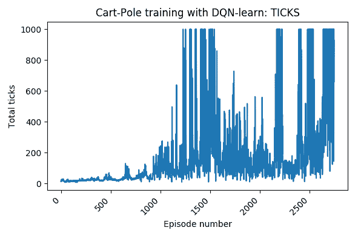

# 使用 OpenAI Gym 进行机器学习

在上一章中，我们向您介绍了如何使用深度学习来识别来自树莓派摄像头的实时图像流中的物体。因此，这为机器人提供了执行与识别物体相关的智能动作的能力。例如，如果物体是一个球，机器人可以收集它并把它放好，以免有人踩到球而造成事故。

在本章中，您将了解到**强化学习**（**RL**），这是一个机器学习的领域，如今是一个非常活跃的研究主题，在某些场景中已经取得了超越人类性能的成功，如最近 AlphaGo 游戏的案例所示（[`deepmind.com/blog/article/alphago-zero-starting-scratch`](https://deepmind.com/blog/article/alphago-zero-starting-scratch)）。

您将使用 Python 框架**OpenAI Gym**以实践的方式学习，这是一个用于开发比较强化学习（RL）算法的工具包。我们将提供一个概念性的方法来处理 RL，这将使我们能够使用 Gym 环境以编程方式处理各种问题。为了做到这一点，我们将区分三个主要组件：*场景*、*任务*和*代理*。在这里，场景是机器人演化的物理环境，任务是机器人预期学习的动作，代理是做出执行动作决策的软件程序。

这种分离将允许您解耦这些组件，并在不同的范围内重用它们。例如，您可能已经训练了一个代理，使得一个两轮驱动的机器人，如我们的 GoPiGo3，能够从一个点到目标位置携带负载，并且可以使用相同的代理与不同的机器人一起使用，例如四轮驱动的 Summit XL（[`www.robotnik.es/robots-moviles/summit-xl`](https://www.robotnik.es/robots-moviles/summit-xl)）。代理的代码是相同的，因为它抽象了机器人的具体特征。

同样，您可以使用不同的生成场景来测试同一机器人。这将展示训练好的代理在不同边界条件下执行的能力。带着这些想法，本章将向您介绍 OpenAI Gym API 的基础知识，如何将其与 ROS 环境集成，以及如何通过图形化表示来跟踪训练过程。

本章将涵盖以下主题：

+   OpenAI Gym 简介

+   运行环境

+   配置环境文件

+   运行模拟并绘制结果

在第一部分，您将开始在原生的 Python 环境中使用基础 Gym API。在接下来的部分中，您将学习如何添加 ROS 包装器以在 Gazebo 中训练机器人。

# 技术要求

在本章中，我们将使用位于[`github.com/PacktPublishing/Hands-On-ROS-for-Robotics-Programming/tree/master/Chapter11_OpenAI_Gym`](https://github.com/PacktPublishing/Hands-On-ROS-for-Robotics-Programming/tree/master/Chapter11_OpenAI_Gym)的`Chapter11_OpenAI_Gym`文件夹中的代码。将本章的文件复制到 ROS 工作空间中，将它们放在`src`文件夹内：

```py
$ cp -R ~/Hands-On-ROS-for-Robotics-Programming/Chapter11_OpenAI_Gym ~/catkin_ws/src/
```

接下来，您需要安装 Anaconda ([`www.anaconda.com`](https://www.anaconda.com))。这是已成为数据科学社区*事实上的*开源标准的 Python 发行版。它为机器学习项目提供了一个完整的 Python 环境。

访问 Anaconda 网站的下载部分[`www.anaconda.com/distribution/#linux`](https://www.anaconda.com/distribution/#linux)，并选择 Python 2.7 捆绑包。我们选择这个包是因为 ROS Python 客户端专注于这个版本；然而，您应该知道它最近在 2019 年 12 月已经停止维护。

Open Robotics 计划在 2020 年 5 月创建一个新的 ROS 发行版，针对 Python 3：[`discourse.ros.org/t/planning-future-ros-1-distribution-s/6538`](https://discourse.ros.org/t/planning-future-ros-1-distribution-s/6538)。

下载 Anaconda 后，转到下载目录并输入以下命令以执行安装代码：

```py
$ bash Anaconda2-2019.10-Linux-x86_64.sh
```

被粗体字母标记的文件名应与您下载的名称匹配。如果不是这样，请运行`bash`命令，将文件名替换为您实际拥有的名称。

`$ conda init`命令可以从安装脚本中可选执行，如果成功，它将提供以下输出：

```py
==> For changes to take effect, close and re-open your current shell. <==
If you'd prefer that conda's base environment not be activated on startup, 
 set the auto_activate_base parameter to false:

 $ conda config --set auto_activate_base false
```

Conda 是 Anaconda 附带的包管理器。它允许您轻松地安装、删除、列出和检查 Anaconda 安装中的 Python 包。

安装 Anaconda 后，您将在`~/.bashrc`文件中看到以下行被添加：

```py
# >>> conda initialize >>>
# !! Contents within this block are managed by 'conda init' !!
__conda_setup="$('/home/${USER}/anaconda2/bin/conda' 'shell.bash' 'hook' 2> /dev/n$
if [ $? -eq 0 ]; then
 eval "$__conda_setup"
else
 if [ -f "/home/${USER}/anaconda2/etc/profile.d/conda.sh" ]; then
 . "/home/${USER}/anaconda2/etc/profile.d/conda.sh"
 else
 export PATH="/home/${USER}/anaconda2/bin:$PATH"
 fi
fi
unset __conda_setup
# <<< conda initialize <<<
```

为了使添加的配置生效，请在终端提示符中 source 它：

```py
$ source ~/.bashrc
```

前面的`.bashrc`行应将您带到（基础）默认的 Anaconda 环境。我们建议您在启动时不要激活 Conda 的基础环境。为了确保这一点，将`auto_activate_base`参数设置为`false`：

```py
$ conda config --set auto_activate_base false
```

如果您希望恢复默认配置，可以通过将值更改为`true`来还原它。最后，您可以选择在终端中手动激活默认的 Anaconda 环境，使用以下命令：

```py
$ conda activate
```

在这个基础环境中，您能够安装 Jupyter 笔记本。您可以使用它们来查看、运行和修改 Python 笔记本：

```py
(*base*) $ jupyter notebook
```

请记住，这是与 DexterOS 预安装的用户友好的 Python 运行时。它在第二章，*GoPiGo3 单元测试*中使用，以运行大多数示例。要取消激活虚拟环境，只需运行以下命令：

```py
(*base*) $ conda deactivate
```

你可以在以下 URL 找到一个有用的 Conda 包管理器速查表，你应该随身携带：[`kapeli.com/cheat_sheets/Conda.docset/Contents/Resources/Documents/index`](https://kapeli.com/cheat_sheets/Conda.docset/Contents/Resources/Documents/index)。

到目前为止，我们已经准备好使用 OpenAI Gym 及其安装；这将在下一节中解释。

# OpenAI Gym 简介

在上一章中，我们提供了将 RL 应用到机器人时可以期待的内容的实用概述。在本章中，我们将提供一个一般性的视角，你将发现 RL 是如何用于训练智能 **代理** 的。

首先，我们需要在我们的笔记本电脑上安装 OpenAI Gym 和 OpenAI ROS，为实际示例做准备。然后，我们将解释其概念。

# 安装 OpenAI Gym

正如我们在上一章中所做的那样，我们将为本章的 Python 设置创建一个虚拟环境，我们将称之为 `gym`。以下两个命令允许创建并激活 `gym`：

```py
$ conda create -n gym pip python=2.7
$ conda activate gym
```

在此之后，安装我们将需要的特定 Python 包：

+   Keras 包 ([`keras.io/`](https://keras.io/))，这是一个高级神经网络 API，在 OpenAI Gym 中使用。记住，它也在上一章中使用过，但我们需要再次安装它，因为这是一个新的 `gym` 环境。Keras 将使我们能够使用 **DQN**（即 **深度 Q 网络**）算法训练代理，这是一个基于深度学习的算法。

+   你还需要 TensorFlow，因为它被用作 Keras 的后端。

+   最后，你需要 Gym 包 ([`github.com/openai/gym`](https://github.com/openai/gym))，这是 OpenAI Gym 的 Python 实现。

你可以连续安装三个包，如下所示：

```py
(gym) $ pip install tensorflow keras gym box2d-py
```

现在，检查 `gym` 的版本：

```py
(gym) $ pip show gym
```

输出应该是这样的：

```py
Name: gym
Version: 0.15.4
Summary: The OpenAI Gym: A toolkit for developing and comparing your reinforcement learning agents.
Home-page: https://github.com/openai/gym
Author: OpenAI
Author-email: gym@openai.com
License: UNKNOWN
Location: ~/anaconda2/envs/gym/lib/python2.7/site-packages
Requires: pyglet, cloudpickle, six, scipy, numpy, opencv-python, enum34
```

此外，还需要安装 Jupyter 笔记本，因为一些 Python 示例是以这种友好的格式解释的：

```py
(gym) $ conda install jupyter
```

最后，安装一个名为 `pybox2d` 的可选库。这是一个用于游戏和简单模拟的 2D 物理引擎，由 Gym 的一些预装环境使用：

```py
(gym) $ conda install -c https://conda.anaconda.org/kne pybox2d
```

技术要求到此结束。以下小节是可选的，旨在增加你对管理 Python 和 Anaconda 的不同方式的了解。我们将向你展示如何从源代码安装 OpenAI Gym 并在您的工作文件夹中托管该包，这是一种在开发模式下使用 Python 包的典型方式。

# 无 Anaconda（可选）

如果你不想使用 Anaconda，而是继续在 Ubuntu 随附的 Python 环境中工作，你可以通过添加 `--user` 标志在本地用户目录中安装：

```py
$ pip install --user tensorflow keras tflearn gym

```

这将必要的包放置在 `~/.local/lib/python2.7/site-packages` 文件夹中。

# 以开发模式安装 gym（可选）

这允许你在工作目录中拥有 OpenAI Gym 的源代码，更改包中的文件，并立即看到它们的效果，而无需重新安装 `gym` 模块：

```py
(gym) $ conda deactivate
$ cd ~/catkin_ws
$ git clone https://github.com/openai/gym
$ cd gym
$ pip install --user -e . 
```

`-e` 选项允许这种安装方式，并且适合用作开发者模式。`--user` 选项将安装本地化到用户的 `~/.local/lib/python2.7/site-packages` 位置。

为了保持环境整洁，移除包安装，只保留 Gym 虚拟环境中的 `gym` Python 包：

```py
$ rm -rf gym.egg-info
$ ls ~/.local/lib/python2.7/site-packages | grep gym | xargs rm
```

这段代码片段会告诉你如何手动从系统中移除一个 Python 包。

为了复现本章中的示例，我们将遵循之前的方法，即在 Conda 环境中将 Gym 安装为系统包。

# 安装 OpenAI ROS

为了让代码能在 ROS 中运行，你必须安装 OpenAI ROS，它建立在 OpenAI Gym 之上。执行以下命令以克隆贡献的 ROS 包并开始 ROS 的设置：

```py
$ cd ~/catkin_ws/src
$ git clone https://bitbucket.org/theconstructcore/openai_ros.git
$ cd ~/ros_ws
$ catkin_make
$ source devel/setup.bash
$ rosdep install openai_ros
```

注意，我们不得不从源代码安装 ROS 包，因为编译的二进制文件在 Ubuntu 中不可用。特别是，值得注意的是，`rosdep install openai_ros` 命令相当于 Ubuntu 的通用 `sudo apt install <package>` 命令；也就是说，每次安装新组件时，它都会自动包含所需的依赖项。记住，对于一个 ROS 包，其依赖项在源代码根目录下的 `package.xml` 文件中声明。

一旦 OpenAI Gym 的安装完成，我们就可以继续解释其概念。

# 代理、人工智能和机器学习

代理的概念来源于人工智能领域，用于指代任何做出决策的事物。换句话说，这就是典型的计算机程序使用 `if ... then ... else ...` 类型的条件指令所做的事情。简单来说，一个 *代理* 是一个可以做出比纯条件更复杂决策的程序。例如，考虑一个视频游戏：当你与机器对战时，你的对手会观察你的行动并决定下一步做什么以赢得游戏。驱动对手决策的是代理。推广这个想法，代理可以用来解决许多类型的问题；例如，何时停止和启动加热器以在设定温度点保持房间温暖。

当你使用经验数据而不是解析公式——就像使用**PID**控制器（比例-积分-微分）来解决之前提到的温度调节问题一样——告诉**智能体**在数百或数千种特定情况下应该做什么（室外温度、室内温度、室内人数、一天中的时间等），你正在训练它，使其能够概括并正确应对广泛的条件。而这个训练过程就是我们通常所说的机器学习，以及本书最后两章特定范围的强化学习。

在这一点上，你也应该意识到，如果一个使用机器学习的**智能体**在它被训练的输入条件范围内做出好的决策。如果你或多个相关条件超出了训练范围，你不能期望它做出好的决策。因此，前面段落提供实验数据的重要性，这些数据是数百或数千种特定情况，用于训练过程。

OpenAI Gym 是一个基于强化学习技术的智能体训练的框架。一旦这个智能体被训练，它可以在类似的问题中重复使用，以增强决策能力。为了说明这些概念，我们将使用一个简单的机制，即车杆，也称为倒立摆。

# 车杆示例

这是倒立摆的经典控制问题，它实验了一个不稳定的平衡（看看下面的图）。通过施加横向力*F*，你可以补偿它的倾向向下坠落，并使其保持竖立（即当角度θ接近零时）：


来源：https://de.wikipedia.org/wiki/Datei:Cart-pendulum.svg

我们将使用 OpenAI Gym 来解决这个问题，方法是从一个没有任何关于问题物理知识的**智能体**开始，也就是说，它没有任何关于应该施加什么横向力的想法，以便车杆保持竖立。通过试错策略，智能体将学会哪些力的方向和值对于摆的每个角度是合适的。这是一个快速解决的问题，因为你只有一个自由度——角度θ——和一个独立变量——力，*F*。

这个例子包含在本书的代码库中，我们将以此为基础来解释 OpenAI Gym 框架的常见概念：环境、观察和空间。

# 环境

环境是一个场景，它通过一个最小化的接口来模拟一个问题（例如保持车杆竖立），这个接口允许一个智能体与之交互。你可以通过运行以下代码片段来看到车杆环境在动作中的样子：

```py
$ cd ~/catkin_ws/src/Chapter12_OpenAI_Gym/cart-pole
$ conda activate gym
(*gym*) $ python cart-pole_env.py
```

你应该看到车杆在随机移动和旋转，如下面的截图所示：


脚本的内容相当简单：

```py
import gym

env = gym.make('CartPole-v0')
env.reset()

for _ in range(1000):
    env.render()
    env.step(env.action_space.sample())

env.close()
```

在导入`gym`模块后，我们将`env`变量设置为预定义的`CartPole-v0`环境。然后，在下一行，我们对`env`应用`.reset()`方法，以便初始化环境。

脚本的主体是一个`for`循环，我们将其设置为 1,000 次迭代。在这些迭代中的每一次，脚本都会做两件事：

+   使用`env.render()`渲染小车和杆的状态。

+   执行模拟的一步需要随机动作，这是通过`env.step(env.action_space.sample())`这一行实现的。`.sample()`方法提供了一个随机力，*F*，作用于小车和杆的底部。

通过将几个步骤连接起来并让系统演化，代理完成一个剧集，其结束由以下三种可能性之一定义：

+   杆的角度大于±12°。

+   小车相对于轨道中心的位移超过±2.4 单位。

+   集剧长度超过 200 步。

这个定义是环境规范的一部分，可以在[`github.com/openai/gym/wiki/CartPole-v0`](https://github.com/openai/gym/wiki/CartPole-v0)找到。现在让我们回顾一下观察和空间定义。

# 空间

空间描述了有效的动作（*F* 力）和观察（小车和杆的角度θ）。这个观察的概念将在下一小节中详细讨论。每个环境都有两个空间与之相关联：

+   **动作空间**：这由`env.action_space`对象下的状态变量集合定义。这个空间定义了代理可以采取的可能动作。对于小车和杆的情况，只有一个变量：施加一个侧向力，*F*。

+   **观察空间**：这描述了代理的物理状态，即小车和杆的角位置θ。从操作上讲，它是`env.observation_space`对象下的状态变量集合。

现在让我们描述观察的概念，以便全面理解它们如何支持学习过程。

# 观察

给定一个环境，一个观察由一组定义环境给定状态的值组成，即角度θ。这就像是对场景进行快照。环境步骤函数`env.step`返回以下内容：

+   当前状态；也就是说，它设置状态变量当前值，**θ**。从操作上讲，它是一个名为`observation`的对象类型变量。

+   智能体从最后一步获得的奖励，即力 *F*，正如在描述动作空间时之前提到的。奖励就像游戏中的分数——一个累积所有奖励（分数）的定量值，即从当前剧集开始执行的动作中获得的所有奖励（分数）。如果施加的力有助于使购物车杆保持竖立，则奖励为正；如果不这样做，则给予负奖励（或惩罚）。这个变量是浮点类型，称为 `reward`。

+   当前剧集是否结束，通过一个名为 `done` 的布尔变量。当它结束时，调用 `env.reset` 函数来重新启动环境，为下一剧集做准备。

+   诊断信息以名为 `info` 的 Python 字典对象的形式呈现。

因此，智能体将尝试最大化其得分，该得分是它为每次施加的力所获得的奖励的累积总和。这个最大化算法将教会它保持购物车杆竖立。

前面的解释应该能让你理解脚本是如何工作的。现在我们将运行一个购物车杆的训练会话，以便你能看到如何对**良好**的行为进行正面奖励，鼓励智能体构建有效的策略。

# 运行完整的购物车杆示例

我们运行的第一脚本 `cart-pole_env.py` 的目的是展示 1,000 个随机步骤的序列。新的脚本将为每个采取的动作提供反馈，通过给予良好行为的奖励：

```py
$ cd ~/catkin_ws/src/Chapter12_OpenAI_Gym/cart-pole
$ conda activate
(*gym*) $ python CartPole-v0.py
```

脚本中的迭代块包括以下行：

```py
env.render()

action = agent.act(state)
next_state, reward, done, _ = env.step(action)

score += reward

next_state = np.reshape(next_state, (1, 4))
agent.remember(state, action, reward, next_state, done)

state = next_state
```

按照行顺序，以下是每个步骤所执行的操作：

1.  渲染环境。这是显示正在发生什么的窗口。

1.  选择下一个动作。这是使用累积经验来决定做什么的地方，同时考虑到当前状态。

1.  运行新的步骤；也就是说，执行所选动作并观察发生了什么。观察返回智能体的新状态 `next_state`、智能体获得的奖励以及一个布尔变量 `done`，告诉你剧集是否结束。

1.  奖励被添加到 `score` 变量中，该变量累积了从剧集开始以来获得的所有奖励。

1.  接下来，将（状态、动作和奖励）集存储在记忆中——`agent.remember`——这样智能体就可以利用它们过去的经验，促进在给定状态下给予它们更多奖励的动作。

1.  最后，我们将当前 `state` 变量更新为 *步骤 3* 的输出，即 `next_state` 的值。

当训练完成时，一个表示得分随剧集演变的曲线被描绘出来：


您可以看到，在 40 个回合之后，代理开始获得大约 200 分的良好成绩。这意味着代理已经学会了通过施加防止杆子掉落的力的方向来保持杆子的平衡。这个简单的例子需要几分钟才能在每一新回合中达到 200 分的目标，所以让我们快速了解强化学习是如何工作的。

请注意，小车杆问题并不代表真实场景。在实际情况下，状态由一组许多变量定义，代理可能采取的可能动作也有很多。真实的强化学习问题非常 CPU 密集，它们需要成千上万甚至数百万个回合才能获得相当好的性能。

在下一节中，我们将描述一个更现实的问题，其中存在 500 个状态和六个可能的行为。第二个示例的目标是理解分数最大化算法在其最基本版本中的工作原理，即通过 Q 学习算法。

# Q 学习解释——自动驾驶出租车示例

我们将要解决的问题包括一辆自动驾驶出租车，它必须将乘客接送到正确的位置。它必须尽可能快地这样做，同时遵守交通规则。图形基于 ASCII 字符，我们将使用真实图像来解释目标。我们还将遵循按时间顺序的帧序列：

+   第一序列表示出租车——黄色方块——在起始位置。它可以向上、向下、向左或向右移动，除非它遇到垂直杆；这种移动是不允许的。有四个可能的出租车停靠站，出租车可以在那里接客或送客。它们用字母**R**、**G**、**B**和**Y**标记。蓝色字母（在这种情况下是**R**）是接客地点，紫色字母（在这种情况下是**G**）是乘客需要被运送到的目的地：


+   下一个图中的第二个序列显示了模拟的一个步骤，其中乘客在车内。他们是在位置**R**被接走的，正在被运送到目的地。这种状态在视觉上是可以识别的，因为代表出租车的方块被填充为绿色（当它不载有乘客时，颜色保持为黄色）：


+   最后一个序列对应于出租车将乘客送到目的地的场景；在这种情况下，用字母**G**表示。当这种情况发生时，出租车颜色再次变为黄色：


这个问题的目标是训练一个强化学习智能体，使其学会在每个行程中按照最短路径驾驶出租车。最短路径通过奖励策略来操作实现，该策略为智能体在每次采取的动作中根据其效用给予预定义的奖励。因此，强化学习智能体将尝试通过将状态与*有用*的动作关联起来，来最大化其总奖励。这样，它将逐渐发现一个运输策略，使其在全局平均意义上最小化从接客地点到下客站点的旅行时间。奖励策略将在本节后面详细说明。

使用这样简单的例子来解释 Q 学习的优势在于，它允许你应用**无模型强化学习算法**。这是因为它不包含任何数学模型来预测基于当前状态，系统的下一个状态将是什么。为了理解如果存在模型会有什么不同，让我们以一个位于位置*x*、以速度*v*移动的机器人为例。经过时间*t*后，新的位置预计如下：


由于机器人的状态由其位置*y*表示，下一个状态*y'*将是速度*v*的函数，即*f(v)*。如果应用的速度加倍—*2v*—机器人将达到不同的状态，*x''*，因为它将在相同的时间步长*t*内行驶双倍的距离。在这种情况下，速度值的集合构成了动作空间。基于这个预测，机器人能够预测在执行动作之前将获得什么奖励。另一方面，对于无模型的情况，无法预测奖励。机器人唯一能做的就是执行动作并看看会发生什么。

拥有这种视角，你将意识到使用无模型强化学习算法解释 Q 学习的教学理由。智能体只需学会在每个状态下选择最有奖励的动作——它不需要提前做出任何预测。经过多次尝试，它将学会一个最优的运输策略。

# 如何运行自动驾驶出租车的代码

代码是一个位于仓库`Chapter12_OpenAI_Gym/taxi`文件夹中的 Python 文件。至于小车杆，程序是用 Python 编写的，文件名为`Taxi-v3.ipynb`。`.ipynb`扩展名是已知的 Jupyter 笔记本扩展。我们选择这种方式在 Python 中编码，以便通过仅仅跟随笔记本就能理解示例，因为你在同一个地方既有代码又有解释。

Jupyter 笔记本在第二章中介绍，*GoPiGo3 的单元测试*。在那里，我们使用笔记本环境中的 Python 代码对传感器和执行器进行了实际解释。

我们建议您打开笔记本，从头到尾阅读它，然后回到这里来完成对该主题的理解。为此，请遵循以下说明：

1.  激活 `gym` 环境：

```py
$ conda activate gym
```

1.  移动到示例位置：

```py
(gym) $ cd ~/catkin_ws/src/Chapter12_OpenAI_Gym/taxi
```

1.  启动笔记本服务器。此命令将在默认浏览器的窗口中打开文件资源管理器：

```py
(gym) $ jupyter notebook
```

1.  点击 `Taxi-v3.ipynb` 文件，浏览器将打开另一个窗口显示笔记本内容。

阅读完毕后，我们准备返回到上一节中介绍的空间（行为和状态）以及奖励概念，并针对当前示例进行详细说明。

# 奖励表

此表指定代理对每个行为获得的奖励。一个设计良好的策略会通过更高的奖励来激励最期望的行为。对于出租车示例，奖励表如下：

+   如果代理成功完成放货，将获得 +20 分。

+   每经过一个时间步长，它会失去 1 分。这样，我们鼓励它尽可能快地解决环境：只要它在路上，它就在消耗资源，如燃料，因此这个负奖励可以理解为燃料费用。

+   每次非法行为（在取货或放货行为期间）都会被扣除 10 分。

接下来，我们继续描述出租车必须遵守以在环境中进化的行为和状态空间。

# 行动空间

行动空间包括代理可以执行的可能行为。对于出租车示例，这些行为如下：

+   四种可能的移动：向南移动 (*S*)、向北移动 (*N*)、向东移动 (*E*) 或向西移动 (*W*)

+   接载乘客 (*P*)

+   放货 (*D*)

因此，总共有六个可能的行为，我们将它们称为**行为变量**。

# 状态空间

状态空间由定义我们问题的状态变量的所有可能值的组合组成。对于出租车示例，这些变量如下：

+   当前位置是基于行号和列号定义的。这些共有 5 行 x 5 列 = 25 个单元格（位置）。

+   四个目的地：用 **R**（红色；它在随附的 Jupyter 笔记本中显示的颜色）、**B**（蓝色）、**Y**（黄色）和 **G**（绿色）标记。

+   与出租车相关的五个可能的乘客位置：

    +   在四个位置中的任何一个进行取货/放货

    +   加 1 分，如果乘客在剩余的任何单元格中（+1）

因此，我们总共有 25 x 4 x 5 = 500 种可能的状态。以下表示其中之一：

```py
 +---------+
                    |R: | : :G|
                    | : | : : |   
                    | : : : : |
                    | |o: | : |
                    |Y| : |B: |
                    +---------+
```

由于编码环境知道墙壁的移动，因此当环境尝试更新状态时，如果需要穿越墙壁，出租车将无法移动，并将保持在同一单元格中。这是通过保持状态不变来实现的。否则，冒号 `:` 允许出租车移动到新单元格。请注意，撞击墙壁没有额外的惩罚，只是时间步长的 -1。

如果你引入这个新规则，训练应该会更快一些，因为智能体将隐式地学习墙的位置，并且在被撞到几次后不会坚持朝那个方向移动。

# 使用 RL 算法的自动驾驶出租车示例

如前所述，我们将使用 Q-learning 来解释学习过程，因为它简单且具有物理意义。请注意，Q-learning 算法让智能体跟踪其奖励，以学习每个状态的最好动作：

+   每次从给定状态采取一个动作时，根据 P 获得一个奖励。

+   与每个对（状态，动作）相关的奖励创建了一个 500 x 6 的 q 表。

对于一个具体的状态-动作对，q 值代表在该状态下该动作的*质量*。因此，对于一个完全训练好的模型，我们将有一个 500 x 6 的矩阵，即 3,000 个 q 值：

+   每一行代表一个状态。

+   每行的最大 q 值让智能体知道在该状态下应该采取什么动作。

在第一步中，q 值是任意的。然后，当智能体在与环境交互时获得奖励，每个状态-动作对的 q 值将根据以下方程更新：

```py
Q(state,action) ← (1−α)Q(state,action) + α(reward + γ maxQ(next state,all actions))
```

上述方程描述如下：

+   α，或 alpha，是学习率（0<α≤1），并应用于智能体发现的新信息，即公式中求和的第二部分的第一个部分，`α * reward`。

+   γ，或伽马，是折扣因子（0≤γ≤1），它决定了我们想要给予未来奖励的重要性程度。如果这个因子为 0，它会使智能体只考虑即时奖励，使其表现出贪婪的行为。因此，这个参数权衡了未来行动的效用。它适用于求和公式的第二部分的第二部分：`γ * maxQ[next_state, all actions]`。

最后，我们还应该考虑**探索**和**利用**之间的权衡。让我们解释一下这些概念的含义：

+   探索指的是机器人从给定状态执行动作的行为，这是第一次。这将让它发现该状态-动作对是否有高奖励。在操作上，它包括采取随机动作。

+   另一方面，利用指的是从给定状态执行过去奖励最多的动作的行为。在操作上，它包括采取该状态下具有最大 q 值的动作。

我们需要平衡这两种行为，为此，我们引入了ϵ（epsilon）参数，它代表应该采取探索类型动作的百分比。这防止智能体遵循单一路线，这条路线可能并不一定是最好的。

# 评估智能体

脚本在一分钟内运行了 100,000 个回合。然后，我们用 100 个回合评估智能体，并得到以下平均值：

+   每个回合的步骤：12

+   每个回合的惩罚：0

与暴力方法（你可以在 Jupyter 笔记本中找到）相比，你获得的路由从数百到数千步，以及超过 1,000 次惩罚（记住，每次非法动作都会给出 1 次惩罚）。

# 超参数和优化

那么，你如何选择 alpha、gamma 和 epsilon 的值呢？嗯，这个策略必须基于直觉和试错。无论如何，随着智能体学习最佳动作，这三个值都应该随时间减少：

+   随着智能体对环境的了解越来越多，并且可能信任所获得的经验，降低学习需求 alpha。

+   随着智能体发展出端到端策略，并不仅仅关注即时奖励，同时降低折扣因子 gamma。

+   最后，降低利用率 epsilon，因为随着环境变得熟悉，探索的收益会失去优先级。

到这一点，你应该准备好进入 OpenAI ROS 来训练在 Gazebo 中为机器人提供动力的智能体。

# 运行环境

本章剩余部分的目标是将你在 RL（强化学习）一般问题中学到的知识应用到特定领域，如机器人学。为了方便知识迁移，我们将重现简单的小车杆示例，将其建模为 Gazebo 中的机器人。代码示例位于本章代码库的`cart-pole_ROS`文件夹中。请在您的笔记本电脑上移动到该位置：

```py
$ cd ~/catkin_ws/src/Chapter12_OpenAI_Gym/cart-pole_ROS
```

在内部，你可以找到两个 ROS 包，每个包都以其名称命名文件夹：

+   `cartpole_description` 包含了使用 ROS 的 Gazebo 仿真框架，用于小车杆。这个包的结构与第五章中描述的非常相似，即*使用 Gazebo 模拟机器人行为*。因此，没有必要深入研究其细节。

+   `cartpole_dqn` 包含了先前的 Gazebo 模拟的 OpenAI Gym 环境。这就是引入 RL 算法的地方，我们将在接下来的段落中关注这一点。

该包相当相似。让我们通过启动文件`start_training.launch`进入：

```py
<launch>
    <rosparam command="load" file="$(find cartpole_dqn)/config/cartpole_dqn_params.yaml" />
    <!-- Launch the training system -->
    <node pkg="cartpole_dqn" name="cartpole_dqn" type="cartpole_dqn.py" output="screen"/>
</launch>

```

带有`<rosparam>`标签的行是加载训练过程配置的行。我们将在下一节中解释这一点。此文件是`cartpole_dqn_params.yaml`，它位于`config`文件夹中。

另一行，带有`<node>`标签，启动单个 ROS `cartpole_dqn`节点，该节点在 Python 脚本`cartpole_dqn.py`下实现小车杆的训练过程。以下按顺序简要描述了此代码执行的操作：

1.  它为小车杆创建 Gym 环境。

1.  它从 ROS 参数服务器加载配置（这一点将在以下子节中详细说明）。

1.  然后，它使用加载的参数初始化学习算法。

1.  最后，它循环预定义的剧集数量，每个剧集由固定数量的步骤组成（这两个值也是配置文件的一部分）。

1.  对于每个回合，它执行以下操作：

    +   初始化环境并获取机器人的第一个状态。

    +   对于当前回合中的每一步，智能体选择一个动作来运行，这将是在随机动作选择和最佳动作选择（取决于 epsilon 探索参数）之间的一种：

```py
observation, reward, done, info = env.step(action)
```

这是循环的关键行，你可以看到，它与纯 Python 中的 cart pole 示例和上一节中的 taxi 示例中使用的是相同的。因此，步骤的输出如下：

+   +   `observation`：应用动作后环境的新状态

    +   `reward`：表示采取的动作有效性的值

    +   `done`：一个布尔变量，告诉你是否已经达到目标

1.  最后，我们通过遵循两个后续步骤让算法从结果中学习：

    +   记住运行步骤：`self.remember(state, action, reward, next_state, done)`

    +   回放以优化动作选择：`self.replay(self.batch_size)`

在这种情况下，我们使用的算法与我们描述的*自动驾驶*出租车示例中的 Q-learning 有所不同。它被称为 DQN，并利用深度学习来为给定状态选择最佳动作。这是在 RL 问题中更广泛使用的算法，如果你想深入其公式，可以通过跟随章节末尾*进一步阅读*部分的最后一条参考文献。简而言之，这是它执行的操作：

+   在每个回合的每一步中，记住过程保存正在运行的内容，并作为智能体的记忆。

+   然后，回放过程从回合的最后几个步骤中取一个迷你批次，并用于改进神经网络。这样一个网络为智能体在每一个给定状态下提供*最佳*的动作。

从概念上讲，智能体使用其从先前经验中获取的记忆来猜测哪个动作可能最方便，以在回合中最大化其总奖励。

在剩余的部分中，我们将专注于使用 Gazebo 在 ROS 中的具体训练和评估。

# 配置环境文件

在先前的`start_training.py`脚本算法描述的*步骤 2*中，ROS 参数被加载到模型中。它们的定义来自`start_training.launch`文件的这一行：

```py
<rosparam command="load" file="$(find cartpole_dqn)/config/cartpole_dqn_params.yaml" />
```

当执行这部分时，`cartpole_dqn_params.yaml`文件中的参数被加载到内存中，并可供`cartpole_dqn.py`脚本使用。其中更相关的是以下内容：

```py
alpha = rospy.get_param('/cartpole_v0/alpha')
gamma = rospy.get_param('/cartpole_v0/gamma')
epsilon = rospy.get_param('/cartpole_v0/epsilon')
```

`cartpole_v0`是在`yaml`文件定义之前声明的命名空间。每个参数的含义在*使用 RL 算法的自动驾驶出租车示例*子节中已涵盖。尽管 DQN 算法比 Q-learning 更复杂，但*alpha*、*gamma*和*epsilon*的概念意义与两者相同。你可以通过回顾先前的 Q-learning 算法部分来记住它们。

# 运行模拟并绘制结果

要运行这个模拟场景，我们遵循标准方法，首先启动一个 Gazebo 环境——`cartpole_description`包的一部分，包含机器人的模型——然后，我们将开始训练过程：

```py
T1 $ roslaunch cartpole_description main.launch
```

在 Gazebo 窗口中的结果应该类似于以下截图。尽管这是一个 3D 环境，但模型本身的行为更像是一个 2D 模型，因为购物车杆只能沿着引导方向滑动：


对于训练过程，我们有一个在其他 ROS 包中的启动文件，即`cartpole_v0_training`：

```py
T2 $ conda activate gym
T2 $ (gym) roslaunch cartpole_dqn start_training.launch
```

注意，在运行启动文件之前，你必须激活`gym`Python 环境，这是你安装 OpenAI Gym 的地方。

你将看到训练过程的实时演变图，它实时显示每个回合获得的奖励。训练结束后，你应该获得一个类似于这个的图表：



请记住，对于购物车杆的每一个动作，都会给予+1 的奖励。因此，图表也代表了每个回合的总奖励数。为了测量收敛，更有用的是绘制每个回合过去 100 个回合的平均动作次数（=奖励）。例如，对于第 1,000 个回合，这意味着取第 901 个到第 1,000 个回合的奖励（动作次数），并计算这 100 个值的平均值。这个结果就是以下图表中第 1,000 个回合所绘制的：


实际上，收敛的准则是在最后 100 个回合中获得平均奖励超过 800。你可以检查曲线实验在 2,600 个回合后进行提升，并迅速达到标准。

在本节的第二部分，我们将介绍一种友好的方法来访问 ROS 控制台日志，以便详细跟踪训练过程。

# 使用记录器检查你的进度

如你所观察到的，日志输出量很大，速度非常快。ROS 提供了一个名为`rqt_tool`的其他工具，可以轻松跟踪会话的日志。要访问它，从终端启动：

```py
$ rqt_console
```

这应该显示一个与以下截图相似的窗口：


在消息源下面的两个框中，你可以根据自己的标准排除或包含消息。如果你想更改节点的日志级别，运行`rqt_logger_level`实用程序：

```py
$ rosrun rqt_logger_level rqt_logger_level
```

以下截图显示了节点的日志级别：


`rqt_console`工具允许你实时跟踪日志并将其保存到文件以供离线分析。

# 摘要

本章为你提供了将强化学习应用于真实机器人的所需理论背景。通过剖析简单的购物车杆示例，你现在应该理解在经典强化学习任务中幕后发生了什么。

此外，通过首先使用原生的 OpenAI Gym 框架在 Python 中这样做，然后在内部 ROS 中，你应该已经获得了使用真实机器人 GoPiGo3 执行 RL 过程的基本技能。这就是你在本书的最后一章将要学习的内容。

# 问题

1.  代理如何遵循 RL 方法进行学习？

A) 通过它从每次执行动作获得的奖励中获取的经验。

B) 通过随机探索环境和通过试错发现最佳策略。

C) 通过一个输出系统状态作为 q 值的函数的神经网络。

1.  使用 RL 训练的代理是否必须预测动作的预期结果？

A) 是的；这是一个称为无模型强化学习（model-free RL）的特征。

B) 只有在它不采用无模型强化学习（model-free RL）方法的情况下。

C) 不是；根据定义，强化学习方法只需要意识到奖励和惩罚以确保学习过程。

1.  如果你以学习率，alpha，为 0.7 运行 Q 学习算法，这从学习过程的角度来看意味着什么？

A) 将提供更高奖励的 30%的成对状态-动作保留下来。

B) 将 Q 矩阵所有元素的 30%的值保留下来，并将剩余的 70%从新动作的结果中获取。

C) 将每次迭代步骤中获得的 70%的最高知识保留到下一个步骤。

1.  如果你以折扣因子，gamma，为 1 运行 Q 学习算法，这从学习过程的角度来看意味着什么？

A) 代理将只对即时奖励感兴趣。

B) 代理将只对任务的最终目标感兴趣。

C) 代理将只对一次实现目标感兴趣。

1.  如果你以探索率，epsilon，为 0.5 运行 Q 学习算法，这从学习过程的角度来看意味着什么？

A) 代理的行为将与选择随机动作的代理相似。

B) 代理将在情节的 50%步骤中选择随机动作。

C) 代理将在所有 50%的情节中选择随机动作。

# 进一步阅读

要深入了解本章中解释的概念，你可以参考以下资源：

+   *强化学习：入门*，Sutto R.，Barto A. (2018)，麻省理工学院出版社，根据 Creative Commons Attribution-NonCommercial-NoDeriv 2.0 通用许可证授权（[`www.andrew.cmu.edu/course/10-703/textbook/BartoSutton.pdf`](http://www.andrew.cmu.edu/course/10-703/textbook/BartoSutton.pdf)）

+   *机器学习项目*，第：*深度强化学习的偏差-方差：如何使用 OpenAI Gym 构建 Atari 机器人*（[`assets.digitalocean.com/books/python/machine-learning-projects-python.pdf`](https://assets.digitalocean.com/books/python/machine-learning-projects-python.pdf)）

+   使用 ROS 和 Gazebo 进行强化学习 ([`ai-mrkogao.github.io/reinforcement%20learning/ROSRL`](https://ai-mrkogao.github.io/reinforcement%20learning/ROSRL))

+   使用 ROS 和 Gazebo 测试不同的 OpenAI RL 算法 ([`www.theconstructsim.com/testing-different-openai-rl-algorithms-with-ros-and-gazebo/`](https://www.theconstructsim.com/testing-different-openai-rl-algorithms-with-ros-and-gazebo/))

+   *扩展 OpenAI Gym 用于机器人：使用 ROS 和 Gazebo 的强化学习工具包*，Zamora I.，González N.，Maoral V.，Hernández A. (2016)，arXiv:1608.05742 [cs.RO]

+   *使用 Keras 和 Gym 进行深度 Q 学习* ([`keon.github.io/deep-q-learning`](https://keon.github.io/deep-q-learning))
