# 第一章. Instant Pygame for Python Game Development How-to

欢迎使用 *Pygame for Python Game Development How-to*。这本书是为那些想要快速、轻松地使用 Pygame 创建游戏并熟悉其重要方面的开发者而编写的。你通常会学到以下典型内容：

+   Pygame 基础

+   精灵

+   OpenGL

Pygame 是由 Pete Shinners 编写的 Python 框架的一部分，正如其名称所暗示的，可以用来创建视频游戏。Pygame 自 2004 年以来是免费和开源的，并受 GPL 许可证的许可，这意味着你可以基本上制作任何类型的游戏。Pygame 是建立在 **Simple DirectMedia Layer**（**SDL**）之上的。SDL 是一个 C 框架，它为包括 Linux、Mac OS X 和 Windows 在内的各种操作系统上的图形、声音、键盘和其他输入设备提供了访问权限。

# 准备你的开发环境（简单）

我们将安装 Python、Pygame 以及我们需要的其他软件。

## 准备工作

在我们安装 Pygame 之前，我们需要确保 Python 已经安装。在某些操作系统上，Python 已经预装了。Pygame 应该与所有 Python 版本兼容。我们还需要 NumPy 数值库。我是 Packt Publishing 出版的两本关于 NumPy 的书的作者——*NumPy 初学者指南*和*NumPy 烹饪书*。请参考这些书籍以获取更多关于 NumPy 的信息。

## 如何操作...

+   在 Debian 和 Ubuntu 上安装

    Python 可能已经在 Debian 和 Ubuntu 上安装，但通常开发头文件没有安装。在 Debian 和 Ubuntu 上，使用以下命令安装 python 和 python-dev：

    ```py
    sudo apt-get install python
    sudo apt-get install python-dev

    ```

    Pygame 可以在 Debian 存档 [`packages.qa.debian.org/p/pygame.html`](http://packages.qa.debian.org/p/pygame.html) 中找到。我们可以使用以下命令安装 NumPy：

    ```py
    sudo apt-get install python-numpy

    ```

+   在 Windows 上安装

    Windows 的 Python 安装程序可以在 [www.python.org/download](http://www.python.org/download) 找到。在这个网站上，我们还可以找到 Mac OS X 和 Linux、Unix、Mac OS X 的源代码压缩包。

    从 Pygame 网站 ([`www.pygame.org/download.shtml`](http://www.pygame.org/download.shtml))，我们可以下载适用于我们使用的 Python 版本的相应二进制安装程序。

    从 SourceForge 网站下载 Windows 的 NumPy 安装程序（[`sourceforge.net/projects/numpy/files/`](http://sourceforge.net/projects/numpy/files/)）。

+   在 Mac 上安装 Python

    Python 预装在 Mac OS X 上。我们也可以通过 MacPorts、Fink 或类似的项目来获取 Python。例如，我们可以通过运行以下命令来安装 Python 2.6 版本的端口：

    ```py
    sudo port install python26

    ```

    二进制 Pygame 软件包可以从 [`www.pygame.org/download.shtml`](http://www.pygame.org/download.shtml) 下载，适用于 Mac OS X 10.3 及以上版本。我们可以从 SourceForge 网站获取 NumPy 安装程序（[`sourceforge.net/projects/numpy/files/`](http://sourceforge.net/projects/numpy/files/)）。通常，最新版本是最好的。

+   从源代码安装

    Pygame 使用`distutils`系统进行编译和安装。要使用默认选项开始安装 Pygame，只需运行以下命令：

    ```py
    python setup.py

    ```

    如果您需要有关可用选项的更多信息，请键入以下命令：

    ```py
    python setup.py help

    ```

    为了编译代码，您需要为您的操作系统安装一个编译器。设置此内容超出了本书的范围。有关在 Windows 上编译 Pygame 的更多信息，请参阅[`pygame.org/wiki/CompileWindows`](http://pygame.org/wiki/CompileWindows)。有关在 Mac OS X 上编译 Pygame 的更多信息，请参阅[`pygame.org/wiki/MacCompile`](http://pygame.org/wiki/MacCompile)。

# 运行一个简单的游戏（简单）

我们将创建一个简单的游戏，我们将在书中进一步改进它。正如编程书籍的传统做法，我们将从一个 Hello World!示例开始。这本身不是一个游戏。重要的是要注意所谓的“主游戏循环”，在这里所有动作发生，以及使用`Font`模块来渲染文本。在这个程序中，我们将操作 Pygame 的`Surface`对象，用于绘图，并且我们将处理退出事件。

## 如何做...

1.  **导入**：首先，我们将导入所需的 Pygame 模块。如果 Pygame 安装正确，我们应该不会出现错误，否则请返回到*准备你的开发环境（简单）*食谱：

    ```py
    import pygame, sys
    from pygame.locals import *
    ```

1.  **初始化**：我们将通过创建一个 400 x 300 像素的显示并设置窗口标题为`Hello World`来初始化 Pygame：

    ```py
    pygame.init()
    screen = pygame.display.set_mode((400, 300))

    pygame.display.set_caption('Hello World!')
    ```

1.  **主游戏循环**：游戏通常有一个游戏循环，它永远运行，直到例如发生退出事件。在这个例子中，我们将只在坐标（100，100）处设置一个带有文本`Hello world`的标签。文本的字体大小为 19，红色，并回退到默认字体：

    ```py
    while True: 
       sys_font = pygame.font.SysFont("None", 19)
       rendered = sys_font.render('Hello World', 0, (255, 100, 100))
       screen.blit(rendered, (100, 100))

       for event in pygame.event.get():
          if event.type == QUIT:
             pygame.quit()
             sys.exit()

       pygame.display.update()
    ```

    我们得到以下截图作为最终结果：

    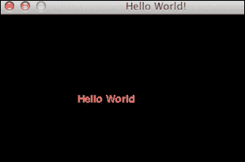

    以下是为 Hello World 示例提供的完整代码：

    ```py
    import pygame, sys
    from pygame.locals import *

    pygame.init()
    screen = pygame.display.set_mode((400, 300))

    pygame.display.set_caption('Hello World!')

    while True: 
       sysFont = pygame.font.SysFont("None", 19)
       rendered = sysFont.render('Hello World', 0, (255, 100, 100))
       screen.blit(rendered, (100, 100))
       for event in pygame.event.get():
          if event.type == QUIT:
             pygame.quit()
             sys.exit()

       pygame.display.update()
    ```

## 它是如何工作的...

这可能看起来不多，但我们在这一步学到了很多。通过审查的函数总结在下表中：

| 函数 | 描述 |
| --- | --- |
| `pygame.init()` | 此函数执行初始化，需要在调用任何其他 Pygame 函数之前调用。 |
| `pygame.display.set_mode((400, 300))` | 此函数创建一个所谓的`Surface`对象进行绘制。我们给这个函数一个表示表面宽度和高度的元组。 |
| `pygame.display.set_caption('Hello World!')` | 此函数将窗口标题设置为指定的字符串值。 |
| `pygame.font.SysFont("None", 19)` | 此函数从逗号分隔的字体列表（在这种情况下为无）和字体大小参数创建系统字体。 |
| `sysFont.render('Hello World', 0, (255, 100, 100))` | 此函数在表面上绘制文本。第二个参数指示是否使用抗锯齿。最后一个参数是一个表示颜色 RGB 值的元组。 |
| `screen.blit(rendered, (100, 100))` | 此函数在表面上绘制。 |
| `pygame.event.get()` | 此函数获取一个`Event`对象列表。事件代表系统中的某些特殊事件，例如用户退出游戏。 |
| `pygame.quit()` | 此函数清理 Pygame 使用的资源。在退出游戏之前调用此函数。 |
| `pygame.display.update()` | 此函数刷新表面。 |

# 使用 Pygame 进行绘图（简单）

在我们开始创建酷炫的游戏之前，我们需要了解 Pygame 的绘图功能。正如我们在前面的菜谱中注意到的，在 Pygame 中我们在`Surface`对象上绘制。有无数种绘图选项——不同的颜色、矩形、多边形、线条、圆形、椭圆、动画和不同的字体。

## 如何操作...

以下步骤将帮助你了解你可以使用 Pygame 进行的不同绘图选项：

1.  **导入**：我们需要 NumPy 库来随机生成用于颜色的 RGB 值，因此我们将添加一个额外的导入：

    ```py
    import numpy 
    ```

1.  **初始化颜色**：使用 NumPy 生成包含三个 RGB 值的四个元组：

    ```py
    colors = numpy.random.randint(0, 255, size=(4, 3))
    ```

    然后定义白色为变量：

    ```py
    WHITE = (255, 255, 255)
    ```

1.  **设置背景颜色**：我们可以使用以下代码使整个屏幕变为白色：

    ```py
    screen.fill(WHITE)
    ```

1.  **绘制圆形**：使用我们生成的第一种颜色在窗口中心绘制一个圆形：

    ```py
    pygame.draw.circle(screen, colors[0], (200, 200), 25, 0)
    ```

1.  **绘制线条**：要绘制线条，我们需要一个起点和一个终点。我们将使用第二种随机颜色，并给线条设置厚度为`3`：

    ```py
    pygame.draw.line(screen, colors[1], (0, 0), (200, 200), 3)
    ```

1.  **绘制矩形**：绘制矩形时，我们需要指定颜色、矩形左上角的坐标以及其尺寸：

    ```py
    pygame.draw.rect(screen, colors[2], (200, 0, 100, 100))
    ```

1.  **绘制椭圆**：你可能惊讶地发现，绘制椭圆需要与矩形类似的参数。这些参数实际上描述了一个可以围绕椭圆绘制的想象中的矩形：

    ```py
    pygame.draw.ellipse(screen, colors[3], (100, 300, 100, 50), 2)
    ```

    使用随机颜色绘制的包含圆形、线条、矩形和椭圆的窗口结果：

    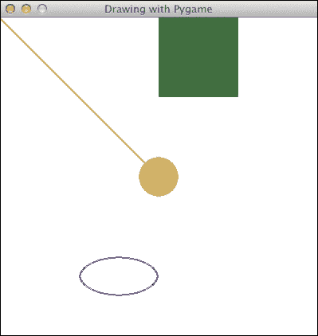

    绘图演示的代码如下：

    ```py
    import pygame, sys
    from pygame.locals import *
    import numpy 

    pygame.init()
    screen = pygame.display.set_mode((400, 400))

    pygame.display.set_caption('Drawing with Pygame')
    colors = numpy.random.randint(0, 255, size=(4, 3))

    WHITE = (255, 255, 255)

    #Make screen white
    screen.fill(WHITE)

    #Circle in the center of the window
    pygame.draw.circle(screen, colors[0], (200, 200), 25, 0)

    # Half diagonal from the upper-left corner to the center
    pygame.draw.line(screen, colors[1], (0, 0), (200, 200), 3)

    pygame.draw.rect(screen, colors[2], (200, 0, 100, 100))

    pygame.draw.ellipse(screen, colors[3], (100, 300, 100, 50), 2)

    while True: 
       for event in pygame.event.get():
          if event.type == QUIT:
             pygame.quit()
             sys.exit()

       pygame.display.update()
    ```

# 简单对象动画

现在我们已经知道了如何使用 Pygame 进行绘图，是时候尝试一些更动态的内容了。大多数游戏，即使是静态的，都有一定程度的动画。从程序员的角度来看，动画不过是将对象在不同的时间和不同的位置显示出来，从而模拟运动。

Pygame 提供了一个`Clock`对象，用于管理每秒绘制多少帧。这确保了动画与用户 CPU 的速度无关。

## 如何操作...

我们将加载一张图片，并使用 NumPy 再次定义一个围绕屏幕的顺时针路径：

1.  首先，我们需要创建一个时钟，如下所示：

    ```py
    clock = pygame.time.Clock()
    ```

1.  **加载图像**：作为本书附带源代码的一部分，应该有一张头像图片。我们将加载这张图片并在屏幕上移动它：

    ```py
    img = pygame.image.load('head.jpg')
    ```

1.  **初始化数组**：我们将定义一些数组来保存动画期间图像位置的坐标，我们希望在动画中放置图像的位置。由于对象将被移动，路径有四个逻辑部分：右、下、左和上。每个部分将有 40 个等距步骤。我们将初始化这些部分的所有值为 0：

    ```py
    steps = numpy.linspace(20, 360, 40).astype(int)
    right = numpy.zeros((2, len(steps)))
    down = numpy.zeros((2, len(steps)))
    left = numpy.zeros((2, len(steps)))
    up = numpy.zeros((2, len(steps)))
    ```

1.  **设置位置坐标**：设置图像位置坐标是微不足道的。然而，有一个需要注意的技巧，`[::-1]`表示法会导致数组元素的顺序反转：

    ```py
    right[0] = steps
    right[1] = 20
    down[0] = 360
    down[1] = steps

    left[0] = steps[::-1]
    left[1] = 360

    up[0] = 20
    up[1] = steps[::-1]
    ```

1.  **连接部分**：路径部分可以连接，但在我们能够这样做之前，数组必须使用 `T` 操作符进行转置：

    ```py
    pos = numpy.concatenate((right.T, down.T, left.T, up.T))
    ```

1.  **设置时钟速率**：在主事件循环中，我们将让时钟以每秒 30 帧的速度滴答：

    ```py
       clock.tick(30)
    ```

    以下截图是移动头部的：

    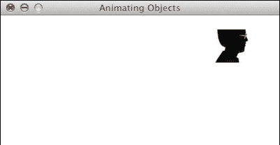

    ### 注意

    你应该能够在[`www.youtube.com/watch?v=m2TagGiq1fs`](https://www.youtube.com/watch?v=m2TagGiq1fs)上观看这个动画的电影。

    此示例的代码几乎使用了我们迄今为止学到的所有内容，但仍然足够简单，易于理解：

    ```py
    import pygame, sys
    from pygame.locals import *
    import numpy

    pygame.init()
    clock = pygame.time.Clock()
    screen = pygame.display.set_mode((400, 400))

    pygame.display.set_caption('Animating Objects')
    img = pygame.image.load('head.jpg')

    steps = numpy.linspace(20, 360, 40).astype(int)
    right = numpy.zeros((2, len(steps)))
    down = numpy.zeros((2, len(steps)))
    left = numpy.zeros((2, len(steps)))
    up = numpy.zeros((2, len(steps)))

    right[0] = steps
    right[1] = 20

    down[0] = 360
    down[1] = steps

    left[0] = steps[::-1]
    left[1] = 360

    up[0] = 20
    up[1] = steps[::-1]

    pos = numpy.concatenate((right.T, down.T, left.T, up.T))
    i = 0

    while True: 
       # Erase screen
       screen.fill((255, 255, 255))

       if i >= len(pos):
          i = 0

       screen.blit(img, pos[i])
       i += 1

       for event in pygame.event.get():
          if event.type == QUIT:
             pygame.quit()
             sys.exit()

       pygame.display.update()
       clock.tick(30)
    ```

## 它是如何工作的...

在这个食谱中，我们了解了一些关于动画的知识。我们学到的最重要的概念是时钟。我们使用的新的函数描述如下表：

| 函数 | 描述 |
| --- | --- |
| `pygame.time.Clock()` | 此函数创建一个游戏时钟 |
| `numpy.linspace(20, 360, 40)` | 此函数创建一个包含 20 和 360 之间 40 个等距值的数组 |
| `numpy.zeros((2, len(steps)))` | 此函数创建一个指定维度的数组，并用零填充 |
| `numpy.concatenate((right.T, down.T, left.T, up.T))` | 此函数将数组连接起来形成一个新的数组 |
| `clock.tick(30)` | 此函数执行游戏时钟的滴答，其中 30 是每秒的帧数 |

# 使用字体（简单）

经常需要显示一些文本，例如计数器或消息。

## 如何操作...

Pygame 有一个 `font` 模块可以帮助我们显示文本。

1.  **创建字体**：我们可以通过指定字体文件名和字体大小作为构造函数参数来创建字体：

    ```py
    font = pygame.font.Font('freesansbold.ttf', 32)
    ```

1.  **显示文本**：由于我们在之前的食谱中使图像在边缘移动，所以在屏幕中央显示计数器和图像位置，背景为蓝色，文字为红色，将会非常棒。以下代码片段实现了这一点：

    ```py
    text = "%d %d %d" % (i, pos[i][0], pos[i][1])
    rendered = font.render(text, True, RED, BLUE)
    screen.blit(rendered, (150, 200))
    ```

    ### 注意

    动画截图如下，也应该在[`www.youtube.com/watch?v=xhjfcFhaXN0`](https://www.youtube.com/watch?v=xhjfcFhaXN0)上。

    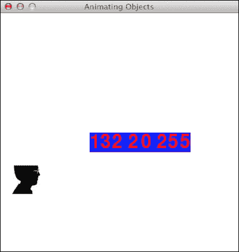

    代码几乎与之前的食谱相同，只是增加了创建和显示字体的代码：

    ```py
    import pygame, sys
    from pygame.locals import *
    import numpy

    pygame.init()
    clock = pygame.time.Clock()
    screen = pygame.display.set_mode((400, 400))

    pygame.display.set_caption('Animating Objects')
    img = pygame.image.load('head.jpg')

    steps = numpy.linspace(20, 360, 40).astype(int)
    right = numpy.zeros((2, len(steps)))
    down = numpy.zeros((2, len(steps)))
    left = numpy.zeros((2, len(steps)))
    up = numpy.zeros((2, len(steps)))

    right[0] = steps
    right[1] = 20

    down[0] = 360
    down[1] = steps
    left[0] = steps[::-1]
    left[1] = 360

    up[0] = 20
    up[1] = steps[::-1]

    pos = numpy.concatenate((right.T, down.T, left.T, up.T))
    i = 0

    # create a font
    font = pygame.font.Font('freesansbold.ttf', 32)
    RED = (255, 0, 0)
    BLUE = (0, 0, 255)

    while True: 
       # Erase screen
       screen.fill((255, 255, 255))

       if i >= len(pos):
          i = 0

       screen.blit(img, pos[i])

       # displaying text in the center of the screen
       text = "%d %d %d" % (i, pos[i][0], pos[i][1])
       rendered = font.render(text, True, RED, BLUE)
       screen.blit(rendered, (150, 200))
       i += 1

       for event in pygame.event.get():
          if event.type == QUIT:
             pygame.quit()
             sys.exit()

       pygame.display.update()
       clock.tick(30)
    ```

# 使用 Matplotlib 和 Pygame（简单）

Matplotlib 是一个易于绘图的开源库。我们可以将 Matplotlib 集成到 Pygame 游戏中并创建各种图表。您可以在[`matplotlib.org/users/installing.html`](http://matplotlib.org/users/installing.html)找到 Matplotlib 的安装说明。

## 如何操作...

在本食谱中，我们将使用前一个食谱中的位置坐标并绘制它们的图表：

1.  **使用非交互式后端**：为了将 Matplotlib 与 Pygame 集成，我们需要使用非交互式后端，否则 Matplotlib 将默认为我们提供一个 GUI 窗口。我们将导入主 Matplotlib 模块并调用`use`函数。此函数必须在导入主`matplotlib`模块之后以及导入其他`matplotlib`模块之前立即调用：

    ```py
    import matplotlib

    matplotlib.use("Agg")
    ```

1.  **创建 Matplotlib 画布**：非交互式图表可以绘制在 Matplotlib 画布上。创建此画布需要导入、一个图形和一个子图。我们将指定图形大小为 3 英寸乘以 3 英寸。更多详细信息可以在本食谱的末尾找到：

    ```py
    import matplotlib.pyplot as plt
    import matplotlib.backends.backend_agg as agg

    fig = plt.figure(figsize=[3, 3])
    ax = fig.add_subplot(111)
    canvas = agg.FigureCanvasAgg(fig)
    ```

1.  **绘图数据**：在非交互式模式下，绘图比默认模式复杂一些。由于我们需要重复绘图，将绘图代码组织在函数中是有意义的。图表最终绘制在画布上。画布给我们的设置增加了一些复杂性。在本例的末尾，您可以找到关于函数的更详细说明：

    ```py
    def plot(data):
       ax.plot(data)
       canvas.draw()
       renderer = canvas.get_renderer()

       raw_data = renderer.tostring_rgb()
       size = canvas.get_width_height()

       return pygame.image.fromstring(raw_data, size, "RGB")
    ```

    ### 注意

    以下截图显示了动画的实际效果。您还可以在 YouTube 上观看一个屏幕录制视频，链接为[`www.youtube.com/watch?v=t6qTeXxtnl4`](https://www.youtube.com/watch?v=t6qTeXxtnl4)。

    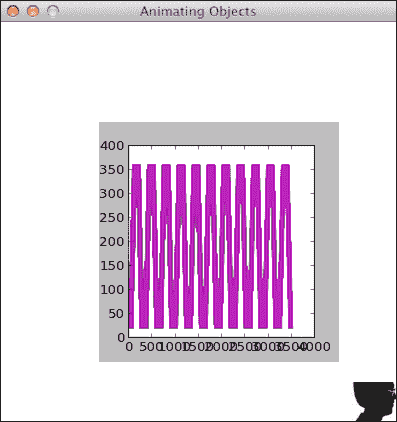

    修改后，我们得到以下代码：

    ```py
    import pygame, sys
    from pygame.locals import *
    import numpy
    import matplotlib

    matplotlib.use("Agg")

    import matplotlib.pyplot as plt
    import matplotlib.backends.backend_agg as agg

    fig = plt.figure(figsize=[3, 3])
    ax = fig.add_subplot(111)
    canvas = agg.FigureCanvasAgg(fig)

    def plot(data):
       ax.plot(data)
       canvas.draw()
       renderer = canvas.get_renderer()

       raw_data = renderer.tostring_rgb()
       size = canvas.get_width_height()

       return pygame.image.fromstring(raw_data, size, "RGB")

    pygame.init()
    clock = pygame.time.Clock()
    screen = pygame.display.set_mode((400, 400))

    pygame.display.set_caption('Animating Objects')
    img = pygame.image.load('head.jpg')

    steps = numpy.linspace(20, 360, 40).astype(int)
    right = numpy.zeros((2, len(steps)))
    down = numpy.zeros((2, len(steps)))
    left = numpy.zeros((2, len(steps)))
    up = numpy.zeros((2, len(steps)))

    right[0] = steps
    right[1] = 20

    down[0] = 360
    down[1] = steps

    left[0] = steps[::-1]
    left[1] = 360

    up[0] = 20
    up[1] = steps[::-1]

    pos = numpy.concatenate((right.T, down.T, left.T, up.T))
    i = 0
    history = numpy.array([])
    surf = plot(history)

    while True: 
       # Erase screen
       screen.fill((255, 255, 255))

       if i >= len(pos):
          i = 0
          surf = plot(history)

       screen.blit(img, pos[i])
       history = numpy.append(history, pos[i])
       screen.blit(surf, (100, 100))

       i += 1

       for event in pygame.event.get():
          if event.type == QUIT:
             pygame.quit()
             sys.exit()

       pygame.display.update()
       clock.tick(30)
    ```

## 工作原理...

本表中解释了与绘图相关的函数：

| 函数 | 描述 |
| --- | --- |
| `matplotlib.use("Agg")` | 此函数指定使用非交互式后端 |
| `plt.figure(figsize=[3, 3])` | 此函数创建一个 3 英寸乘以 3 英寸的图形 |
| `fig.add_subplot(111)` | 此函数创建一个子图（在这种情况下我们只需要一个子图） |
| `agg.FigureCanvasAgg(fig)` | 此函数以非交互式模式创建一个画布 |
| `ax.plot(data)` | 此函数使用指定数据创建一个图表 |
| `canvas.draw()` | 此函数在画布上绘制 |
| `canvas.get_renderer()` | 此函数获取画布的渲染器 |

# 访问表面像素数据（中级）

Pygame `surfarray` 模块处理 Pygame `Surface`对象和 NumPy 数组之间的转换。如您所回忆的，NumPy 可以以快速和高效的方式操作大型数组。

## 如何操作...

在本食谱中，我们将使用小图像填充游戏屏幕。

1.  **将像素复制到数组中**：`array2d`函数将像素复制到二维数组中。还有一个类似的三维数组函数。我们将从头像图像中复制像素到一个数组中：

    ```py
    pixels = pygame.surfarray.array2d(img)
    ```

1.  **创建游戏屏幕**：NumPy 数组有一个形状属性，对应于数组的维度。这个属性是一个元组。例如，一个二维数组将有一个包含两个元素的形状元组。让我们使用数组的`shape`属性从像素数组的形状创建游戏屏幕。屏幕在两个方向上都会大七倍：

    ```py
    X = pixels.shape[0] * 7
    Y = pixels.shape[1] * 7
    screen = pygame.display.set_mode((X, Y))
    ```

1.  **平铺图像**：使用 NumPy 的`tile`函数平铺图像很容易。数据需要转换为整数值，因为颜色定义为整数：

    ```py
    new_pixels = numpy.tile(pixels, (7, 7)).astype(int)
    ```

1.  **显示数组**：`surfarray`模块有以下特殊函数（`blit_array`）用于在屏幕上显示数组：

    ```py
    pygame.surfarray.blit_array(screen, new_pixels)
    ```

    以下截图显示了代码的结果：

    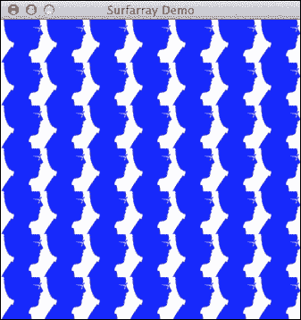

    以下代码执行图像平铺：

    ```py
    import pygame, sys
    from pygame.locals import *
    import numpy

    pygame.init()
    img = pygame.image.load('head.jpg')
    pixels = pygame.surfarray.array2d(img)
    X = pixels.shape[0] * 7
    Y = pixels.shape[1] * 7
    screen = pygame.display.set_mode((X, Y))
    pygame.display.set_caption('Surfarray Demo')
    new_pixels = numpy.tile(pixels, (7, 7)).astype(int)

    while True: 
       screen.fill((255, 255, 255))
       pygame.surfarray.blit_array(screen, new_pixels)

       for event in pygame.event.get():
          if event.type == QUIT:
             pygame.quit()
             sys.exit()

       pygame.display.update()
    ```

## 工作原理...

以下表格简要描述了我们使用的新函数和属性：

| 函数 | 描述 |
| --- | --- |
| `pygame.surfarray.array2d(img)` | 这将像素数据复制到一个二维数组中 |
| `pixels.shape[0]` | `shape`属性以元组的形式持有 NumPy 数组的维度 |
| `numpy.tile(pixels, (7, 7))` | 这将数组平铺到指定的维度，维度由元组指定 |
| `pygame.surfarray.blit_array(screen, new_pixels)` | 这将在屏幕上显示数组值 |

# 访问声音数据（简单）

一款好的游戏需要优秀的音乐和音效。Pygame 的`mixer`模块让我们可以播放声音或任何音频。

## 如何做...

我们将使用标准的 Python 下载 WAV 音频文件。当游戏退出时，我们将播放这个声音。这个例子要求你实际执行示例代码，因为这本书没有音频支持。

1.  **创建声音对象**：在指定音频文件名后，我们可以创建一个 Pygame `Sound`对象。这个类正如你所期望的那样，体现了声音的概念：

    ```py
    audio = pygame.mixer.Sound(WAV_FILE)
    ```

1.  **播放声音**：`Sound`对象有一个`play`方法，它有几个循环参数。如果这个参数的值设置为-1，声音将无限循环：

    ```py
    audio.play(-1)
    ```

1.  **暂停游戏**：有时我们需要暂停游戏的执行，就像在我们的例子中，以便能够听到声音。我们可以使用以下代码片段来完成：

    ```py
    pygame.time.delay(TIMEOUT * 1000)
    ```

    延迟以毫秒为单位指定，这就是为什么我们要乘以 1000。

1.  **停止声音**：过了一段时间后，我们需要使用相应的`stop`方法来停止声音：

    ```py
    audio.stop()
    ```

    音频演示代码如下：

    ```py
    import pygame, sys
    from pygame.locals import *
    import numpy
    import urllib2
    import time

    WAV_FILE = 'smashingbaby.wav'

    def play():
        audio = pygame.mixer.Sound(WAV_FILE)
        audio.play(-1)
        TIMEOUT = 1
        pygame.time.delay(TIMEOUT * 1000)
        audio.stop()
        time.sleep(TIMEOUT)

    pygame.init()
    pygame.display.set_caption('Sound Demo')
    response = urllib2.urlopen('http://www.thesoundarchive.com/austinpowers/smashingbaby.wav')
    filehandle = open(WAV_FILE, 'w')
    filehandle.write(response.read())
    filehandle.close()
    screen = pygame.display.set_mode((400, 400))

    while True: 
       sys_font = pygame.font.SysFont("None", 19)
       rendered = sys_font.render('Smashing Baby', 0, (255, 100, 100))
       screen.blit(rendered, (100, 100))

       for event in pygame.event.get():
          if event.type == QUIT:
             play()
             pygame.quit()
             sys.exit()

       pygame.display.update()
    ```

## 工作原理...

本演示最重要的函数总结如下表：

| 函数 | 描述 |
| --- | --- |
| `pygame.mixer.Sound(WAV_FILE)` | 这个函数根据文件名创建一个`Sound`对象。 |
| `audio.play(-1)` | 这个函数播放并无限循环（-1 表示无限）。默认情况下，声音只播放一次。这对应于 0 次循环。如果值为 2，声音将播放一次，然后重复播放 2 次。 |
| `pygame.time.delay(TIMEOUT * 1000)` | 此函数使游戏暂停指定的毫秒数。 |
| `audio.stop()` | 此函数停止音频播放。 |

# 播放电影（中级）

如今，大多数商业游戏都有小电影片段，试图向我们解释剧情。例如，一款第一人称射击游戏可能有一个显示下一场任务简报的电影。电影播放是一个很酷的功能。Pygame 为 MPEG 视频提供了有限的支持。

## 准备工作

我们需要为这个演示准备一个 MPEG 电影。一旦您有了电影，您可以使用以下命令将其转换为在 Pygame 游戏中使用：

```py
ffmpeg -i <infile> -vcodec mpeg1video -acodec libmp3lame -intra <outfile.mpg>

```

安装`ffmpeg`和命令行选项超出了本书的范围，但不应太难（见[`ffmpeg.org/`](http://ffmpeg.org/)）。

## 如何操作...

电影播放的设置与我们在前一个菜谱中介绍的声音播放类似。以下代码演示了播放 MPEG 视频。请注意`play`函数：

```py
import pygame, sys
from pygame.locals import *
import time

pygame.init()
screen = pygame.display.set_mode((400, 400))
pygame.display.set_caption('Movie Demo')

def play():
    movie = pygame.movie.Movie('out.mpg')
    movie.play()
    TIMEOUT = 7
    pygame.time.delay(TIMEOUT * 1000)
    movie.stop()

while True: 
   screen.fill((255, 255, 255))

   for event in pygame.event.get():
      if event.type == QUIT:
         play()
         pygame.quit()
         sys.exit()

   pygame.display.update()
```

## 工作原理...

电影播放的相关函数可以在以下表中找到：

| 函数 | 描述 |
| --- | --- |
| `pygame.movie.Movie('out.mpg')` | 此函数根据 MPEG 电影的文件名创建一个`Movie`对象 |
| `movie.play()` | 此函数开始播放电影 |
| `movie.stop()` | 此函数停止电影的播放 |

# Pygame 在 Android 上（中级）

Android 是一个由 Google 最初开发的开源智能手机操作系统。大多数 Android 应用程序是用 Java 编程语言编写的，并在基于 Java 的虚拟机上运行。幸运的是，我们可以为 Android 手机创建 Pygame 游戏。这不是一件小事，我们只会介绍最基本的内容。

## 准备工作

我们将安装**Pygame Subset For Android**（**PGS4A**）。在我们开始之前，您需要安装 JDK、Python 2.7 或更高版本。从[`pygame.renpy.org/dl`](http://pygame.renpy.org/dl)下载适合您操作系统的相应软件。

要安装必要的软件，我们需要一个互联网连接和相当大的硬盘空间。如果您没有几个 GB 的空闲空间，您可能需要腾出更多空间。我们可以通过运行以下命令来安装 Android SDK 和其他我们将需要的软件，如 Apache Ant：

```py
android.py installsdk

```

这将启动一个向导，引导您完成安装。在安装过程中，您可以接受所有默认选项，但您确实需要生成一个密钥。除非您真的认真对待创建应用程序，否则您不必担心这个密钥的安全性。

## 如何操作...

我们将创建一个简单的游戏，打印"Hello World From Android!"，并将其命名为`mygame`。

1.  **设置游戏**：创建一个与游戏名称相同的目录，并在其中放置一个包含以下内容的`main.py`文件：

    ```py
    import pygame

    # Import the android module. If we can't import it, set it to None - this
    # lets us test it, and check to see if we want android-specific # behavior.
    try:
        import android
    except ImportError:
        android = None

    # Event constant.
    TIMEREVENT = pygame.USEREVENT

    # The FPS the game runs at.
    FPS = 30

    def main():
        pygame.init()

        # Set the screen size.
        screen = pygame.display.set_mode((480, 800))

        # Map the back button to the escape key.
        if android:
            android.init()
            android.map_key(android.KEYCODE_BACK, pygame.K_ESCAPE)

        # Use a timer to control FPS.
        pygame.time.set_timer(TIMEREVENT, 1000 / FPS)

        while True:
            ev = pygame.event.wait()

            # Android-specific:
            if android:
                if android.check_pause():
                    android.wait_for_resume()

            # Draw the screen based on the timer.
            if ev.type == TIMEREVENT:
                screen.fill((255, 255, 255))
                font = pygame.font.Font('freesansbold.ttf', 32)
                rendered = font.render('Hello From Android!', 0, (255, 100, 100))
                screen.blit(rendered, (100, 100))
                pygame.display.flip()

            # When the user hits back, ESCAPE is sent. Handle it and
            # end the game.
            elif ev.type == pygame.KEYDOWN and ev.key == pygame.K_ESCAPE:
                break

    # This isn't run on Android.
    if __name__ == "__main__":
        main()
    ```

    这基本上是将 PGS4A 网站上的代码修改为打印欢迎信息的代码。更详细的解释将在食谱的末尾给出。

1.  **配置游戏**: 我们可以使用以下命令配置游戏：

    ```py
    android.py configure mygame

    ```

    我们将接受所有默认设置并将存储设置设置为内部。

1.  **构建、安装和运行游戏**: Android 本质上是一个 Java 框架，因此涉及大量的编译。这和 Python 世界有点不同。由于这个游戏很简单，构建不会花费很长时间。首先，我们将启动模拟器——这是一个模拟实际手机行为的程序。找到 Android SDK 中的`android`可执行文件。启动它，在打开的 GUI 应用程序中选择**工具** | **管理 AVD...** | **新建...**。创建一个**Android 虚拟设备**（**AVD**）并给它命名。点击**启动...**按钮。一个手机模拟器将启动。如果它被锁定，你可以按*F2*解锁。

    我们现在可以使用以下命令构建和安装游戏：

    ```py
    android.py build mygame release install

    ```

## 它是如何工作的...

在此代码中使用的相关函数描述如下：

| 函数 | 描述 |
| --- | --- |
| `android.init()` | 此函数初始化 Android |
| `android.map_key(android.KEYCODE_BACK, pygame.K_ESCAPE)` | 此函数将 Android 返回按钮映射到 Pygame 的 escape 按钮 |
| `pygame.time.set_timer(TIMEREVENT, 1000 / FPS)` | 此函数在指定的毫秒时间间隔内触发事件 |
| `android.check_pause()` | 此函数检查暂停请求 |
| `android.wait_for_resume()` | 此函数将游戏置于睡眠模式 |

# 人工智能（中级）

在游戏中，我们经常需要模拟智能行为。`scikits-learn`项目旨在提供机器学习的 API。我最喜欢它的地方是它惊人的文档。

## 准备中

我们可以在命令行中输入以下命令来安装`scikit-learn`：

```py
pip install -U scikit-learn

```

或者：

```py
easy_install -U scikit-learn

```

这可能因为权限问题而无法工作，因此你可能需要在命令前加上`sudo`或者以管理员身份登录。

## 如何做到这一点...

我们将生成一些随机点并将它们聚类，这意味着彼此靠近的点将被放入同一个聚类中。这是你可以使用`scikits-learn`应用到的许多技术之一。**聚类**是一种旨在根据相似性对项目进行分组的机器学习算法。

1.  **生成随机点**: 我们将在一个 400 像素乘 400 像素的正方形内生成 30 个随机点位置：

    ```py
    positions = numpy.random.randint(0, 400, size=(30, 2))

    ```

1.  **计算亲和矩阵**: 我们将使用到原点的欧几里得距离作为**亲和度度量**。亲和矩阵是一个包含亲和度分数的矩阵，在这种情况下是距离：

    ```py
    positions_norms = numpy.sum(positions ** 2, axis=1)
    S = - positions_norms[:, numpy.newaxis] - positions_norms[numpy.newaxis, :] + 2 * numpy.dot(positions, positions.T)

    ```

1.  **聚类点**: 将上一步的结果传递给`AffinityPropagation`类。此类将点标记为适当的聚类编号：

    ```py
    aff_pro = sklearn.cluster.AffinityPropagation().fit(S)
    labels = aff_pro.labels_

    ```

1.  **绘制多边形**：我们将为每个簇绘制多边形。涉及到的函数需要一个点的列表、一个颜色（让我们将其涂成红色），和一个表面：

    ```py
    pygame.draw.polygon(screen, (255, 0, 0), polygon_points[i])

    ```

    结果是每个簇都有一组多边形，如下面的截图所示：

    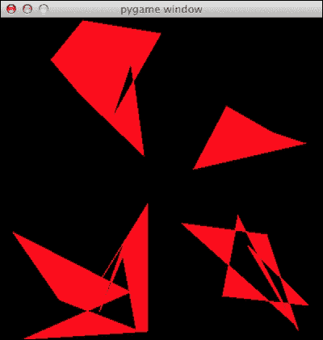

    簇示例代码如下所示：

    ```py
    import numpy
    import sklearn.cluster
    import pygame, sys
    from pygame.locals import *

    positions = numpy.random.randint(0, 400, size=(30, 2))

    positions_norms = numpy.sum(positions ** 2, axis=1)
    S = - positions_norms[:, numpy.newaxis] - positions_norms[numpy.newaxis, :] + 2 * numpy.dot(positions, positions.T)

    aff_pro = sklearn.cluster.AffinityPropagation().fit(S)
    labels = aff_pro.labels_

    polygon_points = []

    for i in xrange(max(labels) + 1):
       polygon_points.append([])

    # Sorting points by cluster
    for i, l in enumerate(labels):
       polygon_points[l].append(positions[i])

    pygame.init()
    screen = pygame.display.set_mode((400, 400))

    while True: 
       for point in polygon_points:
          pygame.draw.polygon(screen, (255, 0, 0), point)

       for event in pygame.event.get():
          if event.type == QUIT:
             pygame.quit()
             sys.exit()

       pygame.display.update()
    ```

## 它是如何工作的...

人工智能配方中最重要的一行在以下表格中描述得更为详细：

| 函数 | 描述 |
| --- | --- |
| `numpy.random.randint(0, 400, size=(30, 2))` | 这创建了一个 30 行 2 列的随机整数数组。这对应于二维空间中的 30 个点。值在 0 到 400 之间。 |
| `numpy.sum(positions ** 2, axis=1)` | 这计算了位置数组平方的数组之和。 |
| `numpy.dot(positions, positions.T)` | 这计算了位置数组和其转置的点积。 |
| `sklearn.cluster.AffinityPropagation().fit(S)` | 这创建了一个 `AffinityPropagation` 对象并使用亲和矩阵进行拟合。 |
| `pygame.draw.polygon(screen, (255, 0, 0), polygon_points[i])` | 这根据一个表面、一个颜色（在这种情况下是红色）和一系列点绘制一个多边形。 |

# 绘制精灵（中级）

**精灵**是计算机图形学中的一个术语，指的是一个二维的可视对象，它已经被优化用于渲染。Pygame 提供了处理精灵的 `Sprite` 类。它可以在 `Surface` 对象上绘制精灵。它还具有碰撞函数。对于复杂的游戏，我们可以将精灵分组在一起以便于管理。精灵不是线程安全的，所以在使用多个线程时你应该小心。

## 如何做到这一点...

我们将重新做动画演示，但这次使用精灵和 `Rect` 对象，这些对象代表矩形。一个 `Rect` 对象有 `left`、`top`、`width` 和 `height` 属性。我们将在整个示例中使用这些和其他属性。此外，当鼠标按钮被点击时，我们将让角色旋转。然而，我们现在不会关心我们确切点击了哪里。

我们将创建一个扩展 `Sprite` 类的类。精灵类有一个 `update` 方法，它在每一帧都会触发。所有涉及精灵移动的逻辑都应该放在这里。

1.  **构造函数**：首先，我们需要创建精灵并执行子类化。所有的初始化逻辑都放在这里。有关函数的更多详细信息可以在下一节中找到。我们定义了一个图像、矩形，以及跟踪角色移动的变量：

    ```py
    class Head(pygame.sprite.Sprite):
        def __init__(self):
            pygame.sprite.Sprite.__init__(self) 
            self.image, self.rect = load_image('head.jpg', -1)
            screen = pygame.display.get_surface()
            self.area = screen.get_rect()
            self.STEP = 9
            self.MARGIN = 12
            self.xstep = self.STEP 
            self.ystep = 0
            self.dizzy = 0
            self.direction = 'right'
    ```

1.  **更新方法**：`update` 方法调用辅助方法，这些方法要么使头部旋转，要么按顺时针方向移动它。移动是通过以下行实现的：

    ```py
    newpos = self.rect.move((self.xstep, self.ystep))

    ```

    以下行负责旋转：

    ```py
    self.image = pygame.transform.rotate(self.original, self.degrees)

    ```

    ### 备注

    你可以在 YouTube 上找到一个游戏的短片 ([`www.youtube.com/watch?v=EFQlc_siPrI`](https://www.youtube.com/watch?v=EFQlc_siPrI))。以下是一个游戏的截图：

    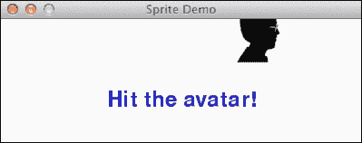

    以下是 Sprite 演示的完整代码列表：

    ```py
    import os, pygame
    from pygame.locals import *

    def load_image(name, colorkey=None):
        try:
            image = pygame.image.load(name)
        except pygame.error, message:
            print 'Cannot load image:', name

        image = image.convert()

        return image, image.get_rect()

    class Head(pygame.sprite.Sprite):
        def __init__(self):
            pygame.sprite.Sprite.__init__(self) 
            self.image, self.rect = load_image('head.jpg', -1)
            screen = pygame.display.get_surface()
            self.area = screen.get_rect()
            self.STEP = 9
            self.MARGIN = 12
            self.xstep = self.STEP 
            self.ystep = 0
            self.degrees = 0
            self.direction = 'right'

        def update(self):
            if self.degrees:
                self._spin()
            else:
                self._move()

        def _move(self):
            newpos = self.rect.move((self.xstep, self.ystep))

            if self.direction == 'right' and self.rect.right > self.area.right - self.MARGIN:
                self.xstep = 0
                self.ystep = self.STEP 
                self.direction = 'down'

            if self.direction == 'down' and self.rect.bottom > self.area.bottom - self.MARGIN:
                self.xstep = -self.STEP
                self.ystep = 0
                self.direction = 'left'

            if self.direction == 'left' and self.rect.left < self.area.left + self.MARGIN:
                self.xstep = 0
                self.ystep = -self.STEP
                self.direction = 'up'

            if self.direction == 'up' and self.rect.top < self.area.top + self.MARGIN:
                self.xstep = self.STEP
                self.ystep = 0
                self.direction = 'right'

            self.rect = newpos

        def _spin(self):
            center = self.rect.center
            self.degrees = self.degrees + 12
            if self.degrees >= 360:
                self.degrees = 0
                self.image = self.original
            else:
                self.image = pygame.transform.rotate(self.original, self.degrees)
            self.rect = self.image.get_rect(center=center)

        def hit(self):
            if not self.degrees:
                self.degrees = 1
                self.original = self.image

    def main():
        pygame.init()
        screen = pygame.display.set_mode((400, 400))
        pygame.display.set_caption('Sprite Demo')

        background = pygame.Surface(screen.get_size())
        background = background.convert()
        background.fill((250, 250, 250))

        if pygame.font:
            font = pygame.font.Font(None, 36)
            text = font.render("Hit the avatar!", 1, (0, 0, 200))
            textpos = text.get_rect(centerx = background.get_width()/2, centery = background.get_height()/2)
            background.blit(text, textpos)

        screen.blit(background, (0, 0))
        pygame.display.flip()

        clock = pygame.time.Clock()
        head = Head()
        sprite = pygame.sprite.RenderPlain(head)

        while True:
            clock.tick(60)

            for event in pygame.event.get():
                if event.type == QUIT:
                    return
                elif event.type == MOUSEBUTTONDOWN:
                   head.hit()

            sprite.update()

            screen.blit(background, (0, 0))
            sprite.draw(screen)
            pygame.display.flip()

    if __name__ == '__main__': 
       main()
    ```

## 如何工作...

以下是对本演示中使用的各种函数的更详细描述：

| 函数 | 描述 |
| --- | --- |
| `pygame.sprite.Sprite.__init__(self)` | 这将创建精灵。 |
| `screen.get_rect()` | 这将获取一个 `Rect` 对象。 |
| `pygame.display.get_surface()` | 这将获取一个 `Surface` 对象。 |
| `self.rect.move((self.xstep, self.ystep))` | 这将根据 `x` 和 `y` 坐标移动一个矩形。 |
| `pygame.transform.rotate(self.original, self.degrees)` | 这将根据一个 `Surface` 对象和角度（以度为单位）旋转一个图像。正值对应逆时针旋转，负值对应顺时针旋转。 |
| `self.image.get_rect(center=center)` | 这将根据图像的中心坐标获取矩形。 |
| `pygame.sprite.RenderPlain(head)` | 这将渲染精灵。 |

# 使用 Pygame 和 OpenGL（高级）

OpenGL 为 2D 和 3D 计算机图形指定了一个 API。该 API 由函数和常量组成。我们将专注于名为 **PyOpenGL** 的 Python 实现。

## 准备工作

使用以下命令安装 PyOpenGL：

```py
pip install PyOpenGL PyOpenGL_accelerate

```

你可能需要具有 root 权限才能执行此命令。相应的 `easy_install` 命令如下：

```py
easy_install PyOpenGL PyOpenGL_accelerate

```

## 如何做...

为了演示目的，我们将使用 OpenGL 绘制 Sierpinski 网格。这是由数学家 Waclaw Sierpinski 创建的三角形形状的分形模式。通过递归和原则上无限的过程获得三角形。

1.  **OpenGL 初始化**：首先，我们将初始化一些与 OpenGL 相关的原始数据。这包括设置显示模式和背景颜色。在食谱的末尾给出了逐行解释：

    ```py
    def display_openGL(w, h):
     pygame.display.set_mode((w,h), pygame.OPENGL|pygame.DOUBLEBUF)

     glClearColor(0.0, 0.0, 0.0, 1.0)
     glClear(GL_COLOR_BUFFER_BIT|GL_DEPTH_BUFFER_BIT)

     gluOrtho2D(0, w, 0, h)

    ```

1.  **显示点**：算法要求我们显示点，越多越好。首先，我们将绘图颜色设置为红色。其次，我们定义三角形的顶点（我自己称它们为点）。然后我们定义随机索引，这些索引将用于选择三个三角形顶点中的一个。我们在中间某个地方随机选择一个点，实际上并不重要。之后，我们在前一个点和随机选择的顶点之间绘制一个中点。最后，我们“刷新”结果：

    ```py
        glColor3f(1.0, 0, 0)
        vertices = numpy.array([[0, 0], [DIM/2, DIM], [DIM, 0]])
        NPOINTS = 9000
        indices = numpy.random.random_integers(0, 2, NPOINTS)
        point = [175.0, 150.0]

        for index in indices:
           glBegin(GL_POINTS)
           point = (point + vertices[index])/2.0
           glVertex2fv(point)
           glEnd()

        glFlush()
    ```

    Sierpinski 三角形看起来是这样的：

    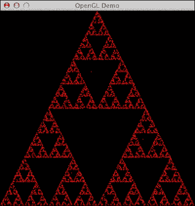

    以下展示了包含所有导入的完整 Sierpinski 网格演示代码：

    ```py
    import pygame
    from pygame.locals import *
    import numpy

    from OpenGL.GL import *
    from OpenGL.GLU import *

    def display_openGL(w, h):
      pygame.display.set_mode((w,h), pygame.OPENGL|pygame.DOUBLEBUF)

      glClearColor(0.0, 0.0, 0.0, 1.0)
      glClear(GL_COLOR_BUFFER_BIT|GL_DEPTH_BUFFER_BIT)

      gluOrtho2D(0, w, 0, h)

    def main():
        pygame.init()
        pygame.display.set_caption('OpenGL Demo')
        DIM = 400
        display_openGL(DIM, DIM)
        glColor3f(1.0, 0, 0)
        vertices = numpy.array([[0, 0], [DIM/2, DIM], [DIM, 0]])
        NPOINTS = 9000
        indices = numpy.random.random_integers(0, 2, NPOINTS)
        point = [175.0, 150.0]

        for index in indices:
           glBegin(GL_POINTS)
           point = (point + vertices[index])/2.0
           glVertex2fv(point)
           glEnd()

        glFlush()
        pygame.display.flip()

        while True:
            for event in pygame.event.get():
                if event.type == QUIT:
                    return

    if __name__ == '__main__':
      main()
    ```

## 如何工作...

如承诺，以下是示例中最重要的部分的逐行解释：

| 函数 | 描述 |
| --- | --- |
| `pygame.display.set_mode((w,h), pygame.OPENGL | pygame.DOUBLEBUF)` | 这将设置显示模式为所需的宽度、高度和 OpenGL 显示。 |
| `glClear(GL_COLOR_BUFFER_BIT | GL_DEPTH_BUFFER_BIT)` | 这使用一个掩码清除缓冲区。在这里，我们清除颜色缓冲区和深度缓冲区位。 |
| `gluOrtho2D(0, w, 0, h)` | 这定义了一个 2D 正交投影矩阵，其中包含左、右、上、下裁剪平面的坐标。 |
| `glColor3f(1.0, 0, 0)` | 这使用三个浮点值定义当前绘图颜色，用于 RGB（0-1，而不是 Pygame 中常用的 0-255）。在这种情况下，我们将用红色进行绘制。 |
| `glBegin(GL_POINTS)` | 这定义了原语或一组原语的顶点。在这里，原语是点。 |
| `glVertex2fv(point)` | 这用于根据顶点渲染一个点。 |
| `glEnd()` | 这关闭了由`glBegin`开始的代码部分。 |
| `glFlush()` | 这强制执行 GL 命令。 |

# 检测碰撞（中级）

在精灵演示中，我们省略了碰撞检测部分。Pygame 的`Rect`类中有许多有用的碰撞检测函数。例如，我们可以检查一个点是否在矩形内，或者两个矩形是否重叠。

## 如何实现...

除了碰撞检测，我们还将用我们创建的锤子图像替换鼠标光标。这不是一个非常漂亮的图像，但比无聊的旧光标要好。

1.  **更新击中方法**：我们将更新精灵演示代码中的`hit`方法。在新版本中，我们检查鼠标光标是否在头像精灵内。实际上为了更容易击中头部，我们创建了一个稍微大一点的矩形：

    ```py
    def hit(self):
             mouse_x, mouse_y = pygame.mouse.get_pos()
             collided = False
             bigger_rect = self.rect.inflate(40, 40)

             if bigger_rect.collidepoint(mouse_x, mouse_y):
                collided = True

             if not self.degrees and collided:
                self.degrees = 1
                self.original = self.image
                self.nhits += 1
             else:                                  
                self.nmisses += 1

    ```

1.  **替换鼠标光标**：替换鼠标光标的所有必要步骤都已经介绍过了。除了使鼠标光标不可见：

    ```py
    pygame.mouse.set_visible(False)
    ```

    游戏的截图如下所示：

    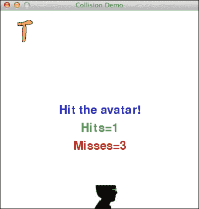

本例的完整代码可以在本书的代码包中找到。

## 工作原理...

在这个配方中，我们了解了一些关于碰撞检测、鼠标光标和矩形的知识：

| 函数 | 描述 |
| --- | --- |
| `pygame.mouse.get_pos()` | 这以元组的形式获取鼠标位置。 |
| `self.rect.inflate(40, 40)` | 这基于偏移量创建一个更大的矩形。如果偏移量是负数，这将导致一个更小的矩形。 |
| `bigger_rect.collidepoint(mouse_x, mouse_y)` | 这检查一个点是否在矩形内。 |
| `pygame.mouse.set_visible(False)` | 这隐藏了鼠标光标。 |

# 添加网络功能（高级）

当你能够与其他人一起玩游戏时，游戏会变得更加有趣。通常这意味着通过某种客户端-服务器架构在互联网上玩游戏。在 Python 世界中，Twisted 通常用于这种架构。

## 准备工作

Twisted 可以根据您的操作系统以多种方式安装。更多信息请参阅[`twistedmatrix.com/trac/wiki/Downloads`](https://twistedmatrix.com/trac/wiki/Downloads)。

## 如何实现...

很遗憾，我们无法在这个教程中创建一个大型多人游戏，但我们可以创建一个简单的客户端-服务器设置，这将为我们稍后要创建的谜题奠定基础。

1.  **服务器**：首先，我们将设置服务器，它将回显客户端的消息并在其前面添加一个序列号：

    ```py
    from twisted.internet import reactor, protocol

    class Server(protocol.Protocol):
        def __init__(self):
           self.count = 0

        def dataReceived(self, msg):
             self. count += 1
             self.transport.write("%d %s" % (self.count, msg))

    def main():
        factory = protocol.ServerFactory()
        factory.protocol = Server
        reactor.listenTCP(8888,factory)
        reactor.run()

    if __name__ == '__main__':
        main()
    ```

    如您所见，服务器在 TCP 上运行在端口 8888（见 [`en.wikipedia.org/wiki/Transmission_Control_Protocol`](http://en.wikipedia.org/wiki/Transmission_Control_Protocol)）。

1.  **客户端设置**：客户端通过与服务器相同的端口发送消息，并在 Pygame GUI 中显示来自服务器的消息。我们将在下一节中详细介绍。在后面的示例中，我们将使用此代码做更多有趣的事情：

    ```py
    from twisted.internet import reactor, protocol
    from pygame.locals import *
    import pygame

    class Client(protocol.Protocol):
        def __init__(self):
           self.msg = 'Hello'
           self.end_msg = False

        def sendMessage(self, msg):
            self.transport.write(msg)
            self.update(msg)

        def dataReceived(self, msg):
           self.msg = msg

           if msg.startswith("19"):
              self.end_msg = True

        def update(self, msg):
            screen = pygame.display.get_surface()

            screen.fill((255, 255, 255))
            font = pygame.font.Font(None, 36)
            text = font.render(self.msg, 1, (200, 200, 200))
            textpos = text.get_rect(centerx=screen.get_width()/2, centery=screen.get_height()/2)
            screen.blit(text, textpos)
            pygame.display.flip()

            if self.end_msg:
               reactor.stop()

    def send(p):
        p.sendMessage("Hello!")

        for i in xrange(1, 20):
          reactor.callLater(i * .1, p.sendMessage, "IMPORTANT MESSAGE!")

    def main():
        pygame.init()
        screen = pygame.display.set_mode((400, 400))
        pygame.display.set_caption('Network Demo')

        c = protocol.ClientCreator(reactor, Client)
        c.connectTCP("localhost", 8888).addCallback(send)
        reactor.run()

        while True:
           for event in pygame.event.get():
             if event.type == QUIT:
                 return

    if __name__ == '__main__':
        main()
    ```

    在我们可以启动客户端之前，我们需要启动服务器。在游戏 GUI 中，您应该看到 **Hello** 被显示，然后是 **1 重要消息**！到 **19 重要消息**！，如下截图所示：

    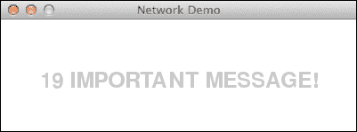

## 它是如何工作的...

在这个示例中，我们看到了如何使用 Pygame GUI 创建一个简单的服务器和客户端。原则上，我们现在可以扩展这个设置来创建一个多人游戏。以下给出了 Twisted 客户端和服务器设置的详细信息：

| 函数 | 描述 |
| --- | --- |
| `self.transport.write("%d %s" % (self.count, msg))` | 这写入了一条消息。在这种情况下，我们在消息前面添加了一个序列号。 |
| `factory = protocol.ServerFactory()` | 这创建了一个 Twisted 服务器工厂，它本身创建 Twisted 服务器。 |
| `reactor.listenTCP(8888,factory)` | 这使用给定的工厂监听端口 8888。 |
| `reactor.run()` | 这将启动服务器或客户端。 |
| `reactor.stop()` | 这停止客户端或服务器。 |
| `reactor.callLater(i * .1, p.sendMessage, "IMPORTANT MESSAGE!")` | 这注册了一个在指定秒数后执行的带有参数的回调函数。 |
| `protocol.ClientCreator(reactor, Client)` | 这创建了一个 Twisted 客户端。 |
| `c.connectTCP("localhost", 8888).addCallback(send)` | 这通过 TCP 在端口 8888 上连接客户端并注册了一个回调函数。 |

# 调试游戏（中级）

调试是那些没有人真正喜欢，但非常重要需要掌握的事情之一。它可能需要数小时，而且由于墨菲定律，您很可能没有那么多时间。因此，有系统性和熟悉您的工具非常重要。在您找到错误并实施修复后，您应该有一个测试。这样至少您将不必再次经历调试的地狱。

PuDB 是一个易于安装的基于控制台的全屏 Python 调试器。PuDB 支持 cursor 键和 vi 命令。如果需要，调试器还可以与 IPython 集成。

## 准备工作

为了安装 puDB，我们只需要执行以下命令：

```py
sudo easy_install pudb

```

## 如何做...

要调试碰撞演示代码，请在命令行中输入以下命令：

```py
python -m pudb collision_demo.py

```

### 小贴士

源代码可以从 Packt Publishing 网站下载。

下面的截图显示了最重要的调试命令在顶部：

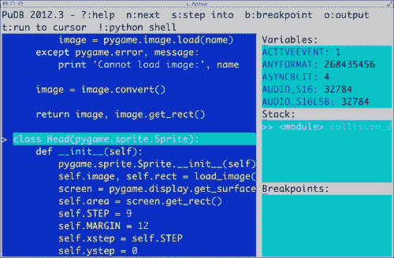

我们还可以看到正在调试的代码、变量、堆栈和定义的断点。输入 `q` 退出大多数菜单。输入 `n` 将调试器移动到下一行。我们还可以使用光标键或 vi 的 *J* 和 *K* 键进行移动，例如，通过输入 `b` 来设置断点。

# 性能分析您的代码（中级）

性能对游戏来说很重要，幸运的是，有很多 Python 性能分析工具。性能分析是关于构建一个软件程序的配置文件，以便收集有关内存使用或时间复杂度的信息。

`cProfile` 是 Python 2.5 中引入的一个 C 扩展。它可以用于 **确定性性能分析**。确定性性能分析意味着时间测量是精确的，没有使用采样。与统计性能分析相对比，后者来自随机样本。

## 如何操作...

以下步骤将帮助您性能分析您的代码：

1.  **创建配置文件**：我们将对碰撞演示代码进行性能分析，并将性能分析输出存储在以下文件中：

    ```py
    python -m cProfile -o collision_demo.profile collision_demo.py
    ```

1.  **pstats 浏览器**：创建文件后，我们可以在特殊的命令行浏览器中查看和排序数据：

    ```py
    python -m pstats collision_demo.profile 
    Welcome to the profile statistics browser.

    ```

1.  **获取帮助**：能够获取帮助总是一件好事，只需在命令行中输入以下命令：

    ```py
    collision_demo.profile% help

    Documented commands (type help <topic>):
    ========================================
    EOF  add  callees  callers  help  quit  read  reverse  sort  stats  strip

    ```

1.  **排序**：我们可以使用以下 `sort` 命令进行排序：

    ```py
    collision_demo.profile% sort
    Valid sort keys (unique prefixes are accepted):
    stdname -- standard name
    nfl -- name/file/line
    pcalls -- call count
    file -- file name
    calls -- call count
    time -- internal time
    line -- line number
    cumulative -- cumulative time
    module -- file name
    name -- function name

    ```

1.  **前三个被调用的函数**：我们可以通过排序和调用 `stats` 来获取前三个被调用的函数：

    ```py
    collision_demo.profile% sort calls
    collision_demo.profile% stats 3

     380943 function calls (380200 primitive calls) in 18.056 seconds

     Ordered by: call count
     List reduced from 801 to 3 due to restriction <3>

     ncalls  tottime  percall  cumtime  percall filename:lineno(function)
     52156    0.013    0.000    0.013    0.000 {method 'endswith' of 'str' objects}
    31505/31368    0.003    0.000    0.003    0.000 {len}
     27573    0.022    0.000    0.022    0.000 {method 'lower' of 'str' objects}

    ```

## 它是如何工作的...

我们对碰撞演示进行了性能分析。以下表格总结了性能分析器的输出：

| 列 | 描述 |
| --- | --- |
| `Ncalls` | 调用次数 |
| `Tottime` | 函数中花费的总时间 |
| `Percall` | 每次调用的耗时，通过将总耗时除以调用次数计算得出 |
| `Cumtime` | 函数及其被调用的函数所花费的累积时间，包括递归调用 |

# 使用 Pygame 的拼图游戏（高级）

我们将在网络示例中继续进行。这次我们将创建一个拼图游戏，允许我们猜测一个单词。请注意，这只是一个原型。它还需要很多润色。

## 如何操作...

以下步骤将帮助您创建所需的拼图游戏：

1.  **服务器更改**：服务器中的更改相当简单。我们只是检查我们是否猜对了单词：

    ```py
    from twisted.internet import reactor, protocol

    class Server(protocol.Protocol):
        def dataReceived(self, msg):
             resp = '*' * 20
             print msg

             if msg == 'secret':
                resp = msg

             self.transport.write(resp)

    def main():
        factory = protocol.ServerFactory()
        factory.protocol = Server
        reactor.listenTCP(8888,factory)
        reactor.run()

    if __name__ == '__main__':
        main()
    ```

1.  **客户端更改**：最重要的更改是处理输入框中的按键以及处理来自服务器的响应。输入框允许我们输入文本，使用 *退格* 键编辑它，并使用 *回车* 键提交。文本框上方的标签显示尝试次数和游戏状态。我们使用 Twisted 循环回调每 30 毫秒更新 GUI：

    ```py
    from twisted.internet import reactor, protocol
    from pygame.locals import *
    import pygame
    from twisted.internet.task import LoopingCall

    class Client(protocol.Protocol):
        def __init__(self):
           self.STARS = '*' * 20
           self.msg = self.STARS
           self.font = pygame.font.Font(None, 22)
           self.screen = pygame.display.get_surface()
           self.label = 'Guess the word:'
           self.attempts = 0

        def sendMessage(self, msg):
            self.transport.write(msg)

        def dataReceived(self, msg):
           self.msg = msg 

           if self.msg != self.STARS:
             self.label = 'YOU WIN!!!!'

           self.update_prompt()

        def update_prompt(self):
            self.screen.fill((255, 255, 255))
            BG = (0, 255, 0)
            FG = (0, 0, 0)

            pygame.draw.rect(self.screen, BG, (100, 200, 200, 20))

            self.screen.blit(self.font.render(self.msg, 1, FG), (100, 200))
            self.screen.blit(self.font.render("%d %s" % (self.attempts, self.label), 1, FG), 
                  (140, 180))
            pygame.display.flip()

    def handle_events(p):
       while True:
          for event in pygame.event.get():
             if event.type == QUIT:
                reactor.stop()
                return
             elif event.type == KEYDOWN:
                key = event.key

                if p.msg == '*' * 20:
                   p.msg = ''

                if key == K_BACKSPACE:
                   p.msg = p.msg[0:-1]
                   p.update_prompt()
                elif key == K_RETURN:
                   p.attempts += 1
                   p.sendMessage(p.msg)
                   return
                elif ord('a') <= key <= ord('z'):
                   p.msg += chr(key)
                   p.update_prompt()

    def send(p):
       p.update_prompt()
       tick = LoopingCall(handle_events, p)
       tick.start(.03)

    def main():
        pygame.init()
        screen = pygame.display.set_mode((400, 400))
        pygame.display.set_caption('Puzzle Demo')

        c = protocol.ClientCreator(reactor, Client)
        c.connectTCP("localhost", 8888).addCallback(send)
        reactor.run()

    if __name__ == '__main__':
        main()
    ```

    以下截图是在猜出单词后的截图：

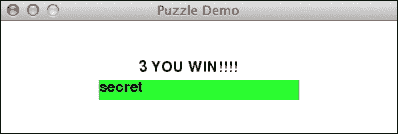

## 它是如何工作的...

虽然这似乎是一个相当详尽的配方，但可能只有几行代码需要一些解释：

| 函数 | 描述 |
| --- | --- |
| `LoopingCall(handle_events, p)` | 这创建了一个循环回调。一个定期被调用的回调函数。 |
| `tick.start(.03)` | 这以 30 毫秒的周期启动循环回调。 |

# 使用 Pygame 模拟（高级）

作为最后一个例子，我们将使用康威的生命游戏来模拟生命。原始的生命游戏基于一些基本规则。我们从二维正方形网格上的随机配置开始。网格中的每个单元格可以是死的或活的。这个状态取决于单元格的八个邻居。卷积可以用来评估游戏的基本规则。我们将需要 SciPy 包来进行卷积部分。

## 准备工作

使用以下任意一个命令安装 SciPy：

+   `sudo pip install scipy`

+   `easy_install scipy`

## 如何做...

以下代码是带有一些修改的生命的游戏实现：

+   单击鼠标一次会画一个十字直到再次点击

+   按 *R* 键将网格重置为随机状态

+   按 *B* 键根据鼠标位置创建方块

+   *G* 创建滑翔机

代码中最重要的数据结构是一个二维数组，它存储游戏屏幕上像素的颜色值。这个数组以随机值初始化，然后在游戏循环中重新计算。有关涉及函数的更多信息，请参阅下一节。如前所述，以下代码如下：

```py
import os, pygame
from pygame.locals import *
import numpy
from scipy import ndimage

def get_pixar(arr, weights):
  states = ndimage.convolve(arr, weights, mode='wrap')

  bools = (states == 13) | (states == 12 ) | (states == 3)

  return bools.astype(int)

def draw_cross(pixar):
   (posx, posy) = pygame.mouse.get_pos()
   pixar[posx, :] = 1
   pixar[:, posy] = 1

def random_init(n):
   return numpy.random.random_integers(0, 1, (n, n))

def draw_pattern(pixar, pattern):
     print pattern

     if pattern == 'glider':
      coords = [(0,1), (1,2), (2,0), (2,1), (2,2)]
     elif pattern == 'block':
      coords = [(3,3), (3,2), (2,3), (2,2)]
     elif pattern == 'exploder':
      coords = [(0,1), (1,2), (2,0), (2,1), (2,2), (3,3)]
     elif pattern == 'fpentomino':
      coords = [(2,3),(3,2),(4,2),(3,3),(3,4)]

     pos = pygame.mouse.get_pos()

     xs = numpy.arange(0, pos[0], 10)
     ys = numpy.arange(0, pos[1], 10)

     for x in xs:
        for y in ys:
           for i, j in coords:
               pixar[x + i, y + j] = 1

def main():
    pygame.init ()

    N = 400
    pygame.display.set_mode((N, N))
    pygame.display.set_caption("Life Demo")

    screen = pygame.display.get_surface()

    pixar = random_init(N)
    weights = numpy.array([[1,1,1], [1,10,1], [1,1,1]])

    cross_on = False

    while True:
       pixar = get_pixar(pixar, weights)

       if cross_on:
          draw_cross(pixar)

       pygame.surfarray.blit_array(screen, pixar * 255 ** 3)
       pygame.display.flip()

       for event in pygame.event.get():
         if event.type == QUIT:
             return
         if event.type == MOUSEBUTTONDOWN:
            cross_on = not cross_on
         if event.type == KEYDOWN:
            if event.key == ord('r'):
               pixar = random_init(N)
               print "Random init"
            if event.key == ord('g'):
               draw_pattern(pixar, 'glider')
            if event.key == ord('b'):
               draw_pattern(pixar, 'block')
            if event.key == ord('e'):
               draw_pattern(pixar, 'exploder')
            if event.key == ord('f'):
               draw_pattern(pixar, 'fpentomino')

if __name__ == '__main__':
    main()
```

### 注意

你应该在 YouTube 上观看一个屏幕录像，链接为 [`www.youtube.com/watch?v=NNsU-yWTkXM`](https://www.youtube.com/watch?v=NNsU-yWTkXM)。

游戏动作的截图如下所示：

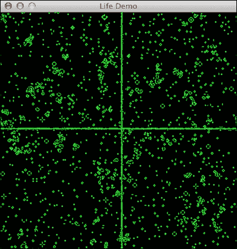

## 工作原理...

我们使用了一些需要解释的 NumPy 和 SciPy 函数：

| 函数 | 描述 |
| --- | --- |
| `ndimage.convolve(arr, weights, mode='wrap')` | 这在给定数组上应用卷积操作，使用 wrap 模式中的权重。模式与数组边界有关。有关数学细节，请参阅[`en.wikipedia.org/wiki/Convolution`](http://en.wikipedia.org/wiki/Convolution)。 |
| `bools.astype(int)` | 这将布尔数组转换为整数。 |
| `numpy.arange(0, pos[0], 10)` | 这创建了一个从 `0` 到 `pos[0]` 的数组，步长为 10。所以如果 `pos[0]` 等于 1000，我们将得到 0, 10, 20 … 990。 |
