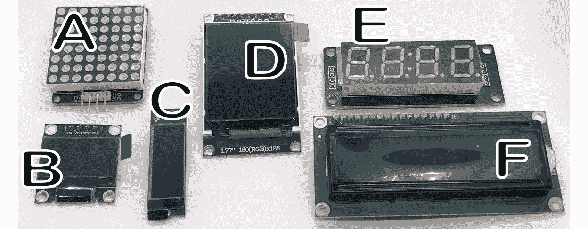
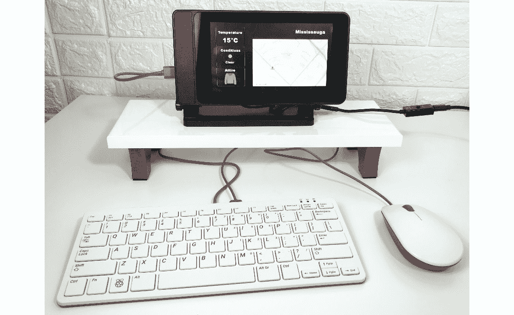
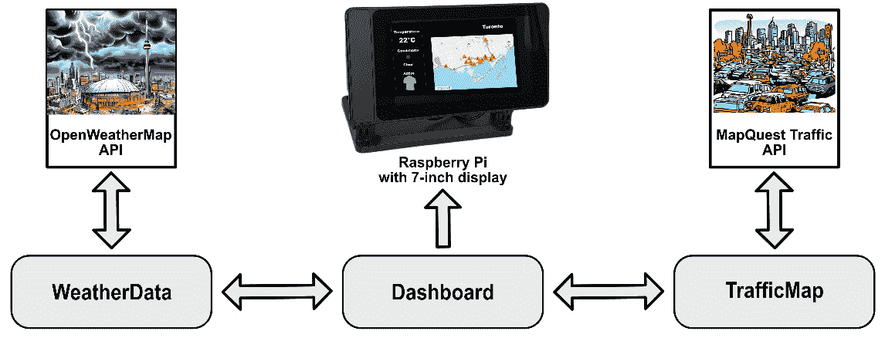
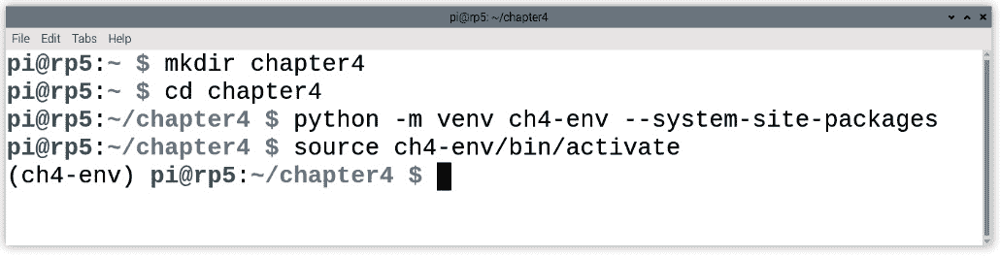
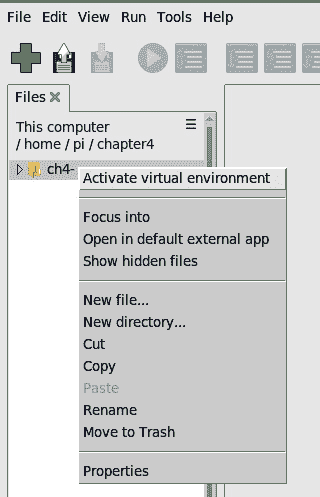
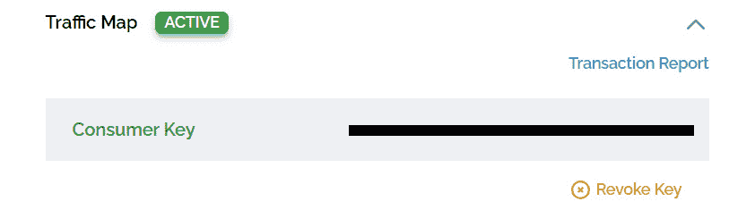
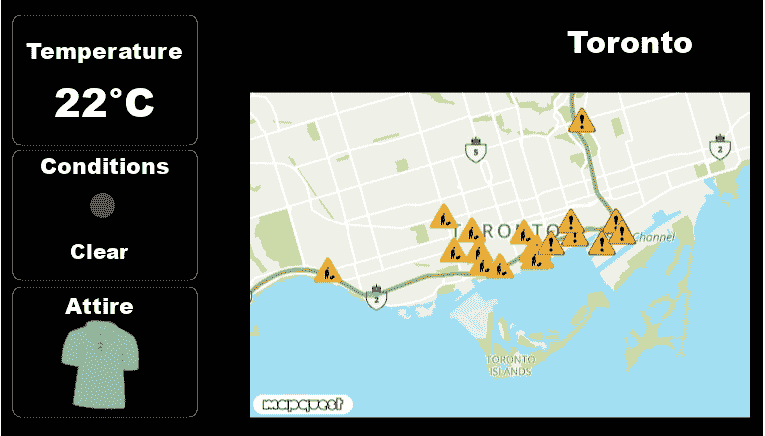

# 4

# 构建物联网信息显示屏

在本章中，我们将使用带有树莓派品牌 7 英寸触摸屏的设备构建一个物联网信息显示屏。我们将使用这个信息显示屏来显示实时天气信息和当地交通信息。

我们将从探索与我们的树莓派兼容的屏幕开始本章。我们将查看小型**有机发光二极管**（**OLED**）屏幕、点阵显示器、七段显示器和树莓派的小型 LCD 显示器。

在我们的项目中，我们将使用树莓派的 7 英寸触摸屏构建一个物联网信息显示屏。这个*仪表盘*不仅会显示天气详情，还会展示描绘当地交通状况的地图。

本章中获得的知识将为我们提供一套多功能工具箱，促进未来树莓派和物联网项目中的创造力和创新。

我们将涵盖以下主题：

+   调研与我们的树莓派兼容的显示屏，并探索屏幕类型

+   创建一个物联网信息显示屏

让我们开始吧！

# 技术要求

完成本章所需的以下要求：

+   具备中级 Python 编程知识

+   一台较新的树莓派，最好是带有至少 4GB RAM 的树莓派 5

+   带有兼容壳体的树莓派品牌 7 英寸触摸屏（可选）

本章的代码可以在以下位置找到：

[`github.com/PacktPublishing/-Internet-of-Things-Programming-Projects-2nd-Edition/tree/main/Chapter4`](https://github.com/PacktPublishing/-Internet-of-Things-Programming-Projects-2nd-Edition/tree/main/Chapter4%0D)

# 调研与我们的树莓派兼容的显示屏，并探索屏幕类型

树莓派提供了与各种外部屏幕接口的灵活性，满足不同的应用和需求。在图 4.1 中，我们看到我们可以连接到树莓派的小型显示屏示例：



图 4.1 – 可与树莓派一起使用的小型显示屏

*图 4.1*展示了针对不同用途定制的小型显示屏：用于精细细节的 OLED 屏幕（*B*、*C*、*D*）；用于简洁文本的 16 x 2 LCD（*F*）；以及用于清晰数字和字符的点阵（*A*）和段式显示（*E*）。这些选项提供了一系列灵活的视觉表示。

树莓派有几种更大的屏幕选项，包括标准的 4K 计算机显示器，以及我们图 4.2-2 中看到的小型显示器：


图 4.2 – 封装的树莓派 7 英寸触摸屏（A）和 3.5 英寸 LCD 屏幕（B）

图 4.2-1*中的屏幕是树莓派品牌的 7 英寸触摸屏。它在这里展示在一个专门为其设计的壳体中。在图 4.2-2*中，我们看到一个 3.5 英寸的 LCD 屏幕，它连接到树莓派的 GPIO 端口。

让我们更仔细地看看每种类型的屏幕，以了解它们的独特特性和应用。

在*图 4.1*和*图 4.2*中展示的每个屏幕都为特定应用提供了独特的优势，理解这些优势可以增强我们的树莓派项目。以下是对每个屏幕/显示器的描述：

+   **小型 OLED 屏幕**：OLED 屏幕（见*图 4.1*中的*B*、*C*和*D*）以其清晰的细节和能效著称。小型 OLED 屏幕（0.到 1.3 英寸）常用于需要最小空间和低功耗的项目。

    OLED 屏幕用于显示系统状态或在小型设备如健身追踪器中。它们非常适合显示有限的信息，如图标、温度或时间，其紧凑的尺寸和能效使它们成为在无需过多功耗或空间的情况下进行清晰、简洁显示的理想选择。

+   **16 x 2 液晶显示屏**：16 x 2 液晶显示屏（见*图 4.1*中的*F*）由 16 列和 2 行的字符组成。它们提供了一个简单的界面来显示基于文本的信息，非常适合需要显示简洁文本数据的应用，例如在工业环境中，它们可能用于显示错误信息或生产计数等关键信息。此外，这些屏幕也常用于 3D 打印机，用于向用户显示控制信息。

+   **8 x 8 点阵显示器**：8 x 8 点阵显示器（见*图 4.1*中的*A*），由 64 个独立 LED 组成，排列成 8x8 的网格。通过独立控制每个 LED，这个网格可以创建简单的图像、字符或动画。这种显示器的较大版本常用于公共信息板上的滚动文字。值得注意的是，这种类型的显示器出现在我们第一章和第二章中使用的树莓派 Sense HAT 设备上。

+   **七段显示器**：七段显示器（见*图 4.1*中的*E*）由 7 个或有时 8 个单独的段（包括小数点）组成。通过控制哪些段被点亮，这种显示器可以形成数字和某些字母的形状。这种显示器最早在 20 世纪初发明，最初用于计算器、数字时钟等设备，随着亮度、能效等功能的提升，其应用范围也得以扩大，使得它们在现代数字时钟和工业计数器中仍然具有相关性。

+   **树莓派 7 英寸触摸显示屏**（见*图 4.2*中的*A*）是树莓派项目的多功能附件。这款触摸屏通过**DSI**（即**数字串行接口**）端口无缝连接，无需额外的驱动程序即可实现触摸功能，分辨率为 800 x 480 像素。

+   **3.5 英寸**液晶显示屏（见*图 4.2*中的 B）通过 GPIO 端口连接到树莓派。分辨率为 320 x 480 像素，这款紧凑型显示屏为手持设备和物联网项目提供了解决方案。这些屏幕也提供 5 英寸尺寸，通常连接到 HDMI 和 GPIO 端口。

现在我们已经了解了可以与树莓派一起使用的各种屏幕，是时候专注于本章的项目了：使用 7 英寸树莓派触摸屏（见*图 4.2*中的 A）创建物联网信息显示。

# 创建物联网信息显示

如本章开头所述，我们的物联网信息显示将显示实时天气预报和交通地图。

我们将使用安装在兼容外壳中的带有鼠标和键盘的树莓派品牌 7 英寸触摸屏来开发我们的物联网信息显示：



图 4.3 – 使用 7 英寸触摸屏的树莓派开发环境

树莓派品牌 7 英寸屏幕的关键优势是它与树莓派 5 上的**MIPI**（即**移动行业处理器接口**）端口相连，而不是 GPIO 或 HDMI 端口。这确保了无缝集成，消除了下载和安装用于触摸功能的额外驱动程序的需求。我们不会在这个项目中使用触摸功能。

使用我们的标准显示器

虽然这款带有树莓派品牌的 7 英寸显示器提供了令人印象深刻的特性，但它对于创建我们的物联网信息显示并非必需。我们可以利用已经连接到我们的树莓派的普通显示器。然而，使用普通显示器可能会导致显示周围出现大边框，因为我们的代码中组件的位置是硬编码的。

*图 4.4*概述了我们创建物联网信息显示时将遵循的软件架构：



图 4.4 – 物联网信息显示的软件架构

我们将使用`WeatherData`类从`OpenWeatherMap` API 中提取天气信息。

`Dashboard`类集中了应用程序的显示信息，我们将利用**Kivy**库来创建 GUI。通过全屏模式显示我们的 GUI，我们创建了一个类似信息亭的效果。

正如我们使用`WeatherData`类调用`OpenWeatherMap` API 一样，我们使用`TrafficMap`类调用 MapQuest Traffic API 以获取交通数据。与`WeatherData`类不同，`TrafficMap`类使用 GPS 坐标生成表示交通状况的图像文件。这种交通的视觉表示不仅增加了所提供信息的价值，而且也成为了我们物联网信息显示的焦点。

我们将首先设置我们的开发环境来开始编码。

## 设置我们的开发环境

我们将为我们的开发使用 Python 虚拟环境。由于有些库只与 Python 的根安装兼容，我们将在 Python 虚拟环境中使用系统包。为此，我们需要执行以下操作：

1.  在我们的 Raspberry Pi 5 上，我们打开一个终端应用程序。

1.  为了存储我们的项目文件，我们使用以下命令创建一个新的目录：

    ```py
    mkdir chapter4
    ```

1.  我们随后使用以下命令导航到新目录：

    ```py
    cd chapter4
    ```

1.  我们需要一个子目录来存放我们的项目。我们使用以下命令创建此文件夹：

    ```py
    mkdir IoTInformationDisplay
    ```

1.  我们使用以下命令为我们的项目创建一个新的 Python 虚拟环境：

    ```py
    ch4-env and enable access to the system site packages. This allows the virtual environment to inherit packages from the global Python environment, which can be useful when certain libraries are installed system wide. Once the environment is set up, we can activate it and begin installing project-specific packages without affecting the global Python environment.
    ```

1.  在我们创建新的 Python 虚拟环境后，我们使用以下命令将其源代码导入：

    ```py
    ch4-env Python virtual environment:
    ```



图 4.5 – 使用 dashboard-env 环境的终端

1.  我们使用以下命令安装代码所需的 Python 包：

    ```py
    requests is a Python library simplifying HTTP requests, ideal for web service interactions. Kivy enables the development of multitouch, cross-platform applications with a focus on rich user interfaces. With the Python packages installed, we may close the Terminal with the following command:

    ```

    退出

    ```py

    ```

1.  我们现在准备好加载 Thonny。我们通过点击树莓派任务栏中的**菜单**图标，导航到**编程**类别，并选择**Thonny**来完成。

1.  默认情况下，Thonny 使用树莓派内置的 Python 版本。对于我们的项目，我们将使用我们刚刚创建的 Python 虚拟环境。首先，我们需要通过点击**查看**并选择**文件**（如果尚未选择）来查看项目文件。

1.  在“文件”部分，我们定位到`ch4-env`目录。

1.  然后，我们右键单击文件夹并选择**激活虚拟环境**选项：



图 4.6 – 在 Thonny 中激活 Python 虚拟环境

在我们的项目文件夹创建、Python 虚拟环境设置并激活，以及安装了项目所需的包之后，我们现在可以开始编写代码。

## 创建一个 WeatherData 类

我们使用一个`WeatherData`类来封装对`OpenWeatherMap` API 的调用。除了温度和天气状况，我们物联网信息显示的天气部分还显示天气状况图标以及着装图像。在*图 4**.7 中，我们看到用于着装的图像：


图 4.7 – 我们物联网信息显示中使用的着装图像

着装图像应该对我们很熟悉，因为我们创建天气指示器时使用了相同的图像。*第三章*。在我们的物联网信息显示中，这些图形将根据温度和风速的计算结果确定的因子来展示。

在本节中，我们将介绍`WeatherData`类的代码。

那么，让我们开始吧：

1.  在 Thonny 中，我们通过选择**文件**然后**新建**或按键盘上的*Ctrl* + *N*来创建一个新的标签页。

1.  在我们的代码中，我们首先输入我们的导入语句：

    ```py
    import requests
    import json
    ```

1.  我们随后定义我们的类名，`WeatherData`，以及我们的类变量：

    ```py
    class WeatherData:
        temperature = 0
        weather_conditions = ''
        wind_speed = 0
        city = ''
    ```

1.  从这里，我们定义我们的初始化方法：

    ```py
        def __init__(self, city):
            self.city = city
            api_key = 'xxxxxxxxxxxxxxxxxxxxxxxxxxxxxxxxxx'
            base_url = "http://api.openweathermap.org/data/2.5/weather"
             complete_url = f"{base_url}?q={self.city}&appid={api_key}&units=metric"
            response = requests.get(complete_url)
            data = response.json()
            if data["cod"] != "404":
                main = data["main"]
                wind = data["wind"]
                weather = data["weather"]
                self.temperature = main["temp"]
                self.weather_conditions = weather[0][" main"]
                self.wind_speed = wind["speed"]
                self.icon = weather[0]["icon"]
    ```

1.  我们然后定义 `get_temperature()` 和 `get_conditions()` 方法：

    ```py
        def get_conditions(self):
            return self.weather_conditions
        def get_temperature(self):
            return str(int(self.temperature))
    ```

1.  为了适应添加天气状况图标，我们添加了一个名为 `get_weather_conditions_icon()` 的方法：

    ```py
        def get_weather_conditions_icon(self):
            return f"http://openweathermap.org/img/wn/{self.icon}.png"
    ```

    此方法使用 f-string 构建并返回一个 URL，这是 Python 中的一种特性，允许在字符串字面量中嵌入表达式。通过将 `self.icon` 的值附加到 OpenWeatherMap 的基本 URL（`f"http://openweathermap.org/img/wn/{self.icon}.png"`），它形成了一个完整的 URL，该 URL 领向一个代表当前天气状况（如晴朗、多云或雨天）的 PNG 图像。这将使我们能够将代表当前天气状况的图标嵌入到我们的物联网信息显示中。

1.  为了确定要显示的服装图像，我们需要两个额外的函数。第一个函数使用风速和温度返回一个适当称为 `wind_temp_factor` 的因子：

    ```py
        def get_wind_temp_factor(self):
            if self.temperature < 0:
                temp_factor = 0
            elif self.temperature > 30:
                temp_factor = 30
            else:
                temp_factor = self.temperature
            wind_factor = self.wind_speed / 20
            wind_temp_factor = temp_factor - wind_factor
            return wind_temp_factor
    ```

    此方法首先将 `self.temperature` 值限制在 `0` 到 `30` 之间（将其分配给 `temp_factor`），然后除以风速 `20`（将其分配给 `wind_factor`），最后从 `temp_factor` 中减去 `wind_factor`，将结果值作为 `wind_temp_factor` 返回。这些值都是任意的，可能需要更改。

1.  我们 `WeatherData` 类中的最后一个方法根据 `wind_temp_factor` 返回服装图像的路径：

    ```py
        def get_attire_image(self):
            factor = self.get_wind_temp_factor()
            if factor < 8:
                return "images/gloves.png"
            elif factor < 18:
                return "images/long-shirt.png"
            elif factor < 25:
                return "images/short-shirt.png"
            else:
                return "images/shorts.png"
    ```

1.  我们代码的最后一部分位于 `WeatherMap` 类外部，使我们能够测试该类：

    ```py
    if __name__=="__main__":
        weather = WeatherData('Toronto')
        print(weather.get_temperature())
        print(weather.get_attire_image())
        print(weather.get_conditions())
        print(weather.get_weather_conditions_icon())
    WeatherData class for Toronto and then prints various weather-related information to our console.
    ```

1.  我们将代码保存为 `WeatherData.py`，位于 `IoTInformationDisplay` 项目子文件夹中。

我们现在准备构建一个 `TrafficMap` 类，该类将封装创建本地交通地图的代码。

## 创建 `TrafficMap` 类

我们使用 `TrafficMap` 类与 MapQuest API 进行接口，使我们的应用程序能够生成交通地图。为了连接到 MapQuest API，我们首先需要创建一个账户并生成一个 API 密钥。

### 为我们的应用程序生成 API 密钥

MapQuest 开发者提供各种工具和服务，使开发者能够访问地图、路线信息等。对于我们项目，我们需要从 MapQuest 获取一个 API 密钥以访问他们的网络服务，特别是交通地图数据。以下是设置免费账户和获取 API 密钥的步骤：

1.  我们首先导航到 MapQuest 开发者网站 ([`developer.mapquest.com/plans`](https://developer.mapquest.com/plans)) 以访问开发者门户。

1.  对于我们的应用程序，**MapQuestGo** 计划就足够了。此计划将为我们提供 15,000 个起始交易。要创建一个计划，我们点击 **订阅** 按钮，并按照概述的步骤进行。

1.  一旦我们的个人资料创建完成，我们可以通过访问以下 URL 生成一个新的 API 密钥：[`developer.mapquest.com/user/me/apps`](https://developer.mapquest.com/user/me/apps)。

1.  我们点击 **创建新密钥** 按钮，并输入应用程序名称：


图 4.8 – 在 MapQuest 开发者中创建新的 API 密钥

1.  将生成一个新的 API 密钥，可以在 **管理** **密钥** 部分查看：



图 4.9 – 在 MaqQuest 开发者中查看 API 密钥

我们将使用此密钥调用 MapQuest 交通 API。将 API 密钥复制并粘贴到可以稍后访问的文本文档中是个好主意。生成 API 密钥后，我们现在可以创建我们的 `TrafficMap` 类。

### 编写 TrafficMap 类

我们使用 Thonny 编写 `TrafficMap` 类：

1.  我们通过点击树莓派任务栏中的 **菜单** 图标来启动 Thonny。然后，我们导航到 **编程** 类别并选择 **Thonny**。

1.  一旦进入 Thonny，我们激活 `ch4-env` 虚拟环境。

1.  我们通过选择 **文件** 然后选择 **新建** 或按键盘上的 *Ctrl* + *N* 创建一个新的标签页。

1.  在我们的代码中，我们首先输入我们的导入：

    ```py
    import requests
    ```

1.  对于我们的 `TrafficMap` 类，我们只需要导入 `requests` 包。我们定义我们的类名 `TrafficMap` 和我们的初始化方法：

    ```py
    class TrafficMap:
        def __init__(self, latitude, longitude, zoom):
            self.latitude = latitude
            self.longitude = longitude
            self.zoom = zoom
            self.size = "500,325"
            self.api_key = "xxxxxxxxxxxxxxxxxxxxxxxxxxxx"
    ```

    让我们看看我们刚刚添加的内容：

    +   `self.latitude`: 指定地图上位置的纬度，用于将地图中心定位在该纬度。

    +   `self.longitude`: 指定地图上位置的经度，用于将地图中心定位在该经度。

    +   `self.zoom`: 设置地图的缩放级别，控制地图上可见的区域大小（例如，较高的值可能显示更近、更详细的视图）。

    +   `self.size`: 设置地图的固定大小，定义像素宽度和高度。大小设置为 `"500,325"` 的字符串。

    +   `self.api_key`: 存储硬编码的 API 密钥，这是对 API 进行身份验证所必需的。

1.  我们 `TrafficMap` 类的核心是 `get_traffic_map()` 方法。我们使用此方法调用 MapQuest 交通网络服务，并使用响应创建我们的交通地图：

    ```py
    def get_traffic_map(self):
            base_url = "http://www.mapquestapi.com\
                        /staticmap/v5/map"
            params = {
                'key': self.api_key,
                'center': f"{self.latitude},
                            {self.longitude}",
                'zoom': self.zoom,
                'size': self.size,
                'traffic': 'flow|cons|inc'
            }
            response = requests.get(base_url,
                                    params=params)
            if response.status_code == 200:
                with open('images/traffic_map.png', 'wb') as f:
                    f.write(response.content)
                return "images/traffic_map.png"
            else:
                return "images/error.png"
    ```

    让我们看看我们刚刚添加的内容：

    +   `base_url`: MapQuest 静态地图 API 的 URL 端点。

    +   `params`: 我们使用这个包含 API 请求必要参数的字典：

        +   `self.api_key`: 指定与 MapQuest 静态地图 API 进行身份验证的 API 密钥。

        +   `center` – `f"{self.latitude},{self.longitude}"`: 使用对象的 `latitude` 和 `longitude` 属性定义地图的中心。

        +   `self.zoom`: 指定地图的缩放级别，控制地图上可见的缩放或细节。

        +   `self.size`: 使用对象先前定义的大小属性设置地图的大小，可能定义像素宽度和高度。

        +   `traffic: 'flow|cons|inc'`: 指定要在地图上包含的交通信息，表示不同类型的交通数据，如流量、拥堵和事件。

    +   `response = requests.get(base_url, params=params)`: 向存储在`base_url`中的 URL 发送一个带有在`params`中定义的参数的`GET`请求，并将响应存储在`response`变量中。

    +   如果请求成功（`response.status_code == 200`），则发生以下情况：

        +   在`images`目录中创建或覆盖了一个图像文件（`traffic_map.png`）。

        +   响应的内容（即图像数据）被写入到文件中。

        +   该方法返回保存图像的路径：`"images/traffic_map.png"`

    +   如果请求不成功，该方法返回`images`目录中预定义的`error.png`图像的路径。此图像包含`Error loading traffic map`消息。

重要提示

从这个方法中我们可以得到的主要启示是，与许多需要 JSON 库来解析的 API 响应不同，对 MapQuest Traffic API 的`GET`请求的响应直接包含交通地图的图像数据，因此它可以保存为图像文件，无需解析 JSON。

1.  我们将代码保存为`TrafficMap.py`在`IoTWeatherDisplay`项目子文件夹中。

随着`WeatherData`和`TrafficMap`类的创建完成，我们现在可以继续编写一个`Dashboard`类，该类将处理从这些网络服务检索到的信息显示。

## 添加 Dashboard 和 MyApp 类

对于`Dashboard`类，我们使用 Kivy 库。Kivy 是一个开源的 Python 框架，旨在开发可在各种平台上运行的多点触控应用程序，包括 Windows、macOS、Linux、iOS 和 Android。

在我们定义 Dashboard 类的同一 Python 文件中，我们将添加一个名为 MyApp 的 Kivy App 类。在这个代码中，MyApp 类是 Kivy 的 App 类的子类，通过在其 build()方法中创建 Dashboard 类的实例来定义应用程序的主要入口点。

要做到这一点，我们执行以下操作：

1.  我们通过点击树莓派任务栏中的**菜单**图标来启动 Thonny。然后，我们导航到**编程**类别并选择**Thonny**。

1.  一旦进入 Thonny，我们将激活`ch4-env`虚拟环境。

1.  我们可以通过选择**文件**然后**新建**，或者在键盘上按*Ctrl* + *N*来创建一个新的标签页。

1.  我们通过配置 Kivy 以全屏和无边框模式运行来开始我们的代码：

    ```py
    from kivy.config import Config
    Config.set('graphics', 'fullscreen', 'auto')
    Config.set('graphics', 'borderless', '1')
    ```

为什么我们在添加其他导入之前要配置我们的 Kivy 应用程序？

在 Kivy 中导入其他包之前，我们配置我们的应用程序以确保设置在应用程序的生命周期开始时应用。如果配置在导入包之后完成，某些设置可能不会应用，或者可能导致意外的行为，因为 Kivy 组件可能在自定义设置设置之前就已经使用默认配置初始化了。

1.  配置完成后，我们导入我们应用程序所需的其它包：

    ```py
    from kivy.app import App
    from kivy.uix.floatlayout import FloatLayout
    from kivy.uix.label import Label
    from kivy.uix.image import Image, AsyncImage
    from kivy.clock import Clock
    from WeatherData import WeatherData
    from TrafficMap import TrafficMap
    ```

    让我们看看我们刚刚添加了什么：

    +   `from kivy.app import App`: 从 Kivy 框架中导入主应用程序类，这是构建和运行应用程序所必需的。

    +   `from kivy.uix.floatlayout import FloatLayout`: 从 Kivy 中导入 `FloatLayout` 类，允许以自由形式定位和调整小部件的大小。我们这样做是为了能够在屏幕上的确切位置定位我们的 GUI 组件。

    +   `from kivy.uix.label import Label`: 从 Kivy 中导入 `Label` 类，用于在屏幕上显示文本。

    +   `from kivy.uix.image import Image, AsyncImage`: 从 Kivy 中导入 `Image` 和 `AsyncImage` 类，允许在应用程序中显示静态和异步图像。

    +   `from kivy.clock import Clock`: 从 Kivy 中导入 `Clock` 类，使应用程序内周期性函数的安排成为可能。我们将使用此类每 30 分钟更新我们的仪表板。

    +   `from WeatherData import WeatherData`: 导入我们自定义的 `WeatherData` 类，用于处理与天气相关的信息。

    +   `from TrafficMap import TrafficMap`: 导入自定义的 `TrafficMap` 类，用于管理交通地图数据和图像。

1.  在导入之后，我们定义我们的 `Dashboard` 类及其初始化方法：

    ```py
    class Dashboard(FloatLayout):
        def __init__(self,
                     city,
                     latitude,
                     longitude,
                     zoom):
            super(Dashboard, self).__init__()
            self.city = city
            self.traffic_map = TrafficMap(latitude,
                                          longitude,
                                          zoom)
            self.init_widgets()
            Clock.schedule_interval(self.update_status, 1800)
            self.update_status(0)
    ```

    让我们看看我们刚刚添加的内容：

    1.  我们的 `Dashboard` 类继承自 Kivy 的 `FloatLayout` 类，允许定位和布局功能。

    1.  我们使用特定的参数（`city`、`latitude`、`longitude` 和 `zoom`）初始化我们的类。

    1.  通过 `super(Dashboard, self).__init__()` 调用 `FloatLayout` 超类的 `__init__()` 方法，确保适当的初始化并从父类继承行为。

    1.  然后，我们使用给定的 `latitude`、`longitude` 和 `zoom` 参数设置交通地图。

    1.  我们使用 Kivy 的 `Clock` 类来安排每 `1800` 秒（`30` 分钟）的定期更新。

    1.  我们调用 `self.init_widgets()` 方法来创建和定位布局内部的小部件。

    1.  在初始化过程中，我们调用一次 `self.update_status(0)` 来设置仪表板的初始状态。如果未调用此方法，仪表板的初始状态可能未设置，可能导致在预定更新发生之前显示初始内容出现延迟，预定更新设置为每 `1800` 秒或 `30` 分钟发生一次。

1.  在类初始化到位后，我们初始化小部件的状态。我们首先从 `Temperature`、`Conditions` 和 `Attire` 小部件开始：

    ```py
    def init_widgets(self):
            self.add_widget(Label(text="Temperature",
                                  pos=(-275, 175),
                                  color=(1, 1, 1, 1),
                                  font_size=22,
                                  font_name='fonts/
                                  ArialBlack.ttf'))
            self.add_widget(Label(
                             text="Conditions",
                             pos=(-275, 60),
                             color=(1, 1, 1, 1),
                             font_size=22,
                             font_name='fonts/
                             ArialBlack.ttf'))
            self.add_widget(Label(text="Attire",
                             pos=(-280, -80),
                             color=(1, 1, 1, 1),
                             font_size=22,
                             font_name='fonts/
                             ArialBlack.ttf'))
            self.add_widget(Image(source='images/box.png',
                                  pos=(-275, 145)))
            self.add_widget(Image(source='images/box.png',
                                  pos=(-275, 10)))
            self.add_widget(Image(source='images/box.png',
                                  pos=(-275, -127)))
    ```

1.  然后，我们添加一个 `city` 字段、天气状况和交通地图：

    ```py
    self.city_label = Label(text=self.city,
                                    pos=(250, 185),
                                    color=(1, 1, 1, 1),
                                    font_size=30,
                                    font_name='fonts/
                                    ArialBlack.ttf')
            self.add_widget(self.city_label)
            self.temperature_label = Label(pos=(-275,
                                                125),
                                     color=(1, 1, 1, 1),
                                     font_size=40,
                                     font_name='fonts/
                                     ArialBlack.ttf')
            self.add_widget(self.temperature_label)
            self.conditions_image = AsyncImage(pos=(-278,
                                                    20))
            self.add_widget(self.conditions_image)
            self.weather_conditions_label = Label(
                                            pos=(-280,
                                                 -25),
                                            color=(1, 1,
                                                   1, 1),
                                            font_size=20,
                                         font_name='fonts/
                                         ArialBlack.ttf')
            self.add_widget(self.weather_conditions_label)
            self.traffic_map_image = AsyncImage(pos=(120,
                                                    -30))
            self.add_widget(self.traffic_map_image)
            self.attire_image = Image(pos=(-280, -140))
            self.add_widget(self.attire_image)
    ```

    `init_widgets()` 方法负责初始化并添加静态和动态小部件到 `Dashboard` 布局中，`Dashboard` 是 Kivy 的 `FloatLayout` 类的子类。

重要提示

静态小部件是那些在整个应用程序生命周期中保持不变且不需要动态更新的组件。这包括在指定位置添加显示温度、状况和着装文本的标签，并使用特定的颜色、字体大小和字体。还包括三个图像小部件，显示位于‘images/box.png’的图像，放置在布局的不同位置。

`AsyncImage`小部件用于显示天气状况图标，一个用于显示天气状况文本的标签，另一个`AsyncImage`小部件用于显示交通地图，以及一个图像小部件用于显示当前天气状况的适当着装。

`init_widgets()`方法利用 Kivy 的`FloatLayout`类提供的`add_widget()`方法将每个小部件添加到布局中。动态小部件也存储为`Dashboard`类的属性，以便以后可以轻松访问和更新。

1.  我们使用`Dashboard`类的`update_status()`方法，每隔`30`分钟（如初始化方法中设置）为我们的屏幕提供新的值：

    ```py
        def update_status(self, *args):
            weather_data = WeatherData(self.city)
            self.traffic_map_image.source =
                         self.traffic_map.
                         get_traffic_map()
            self.attire_image.source = weather_data.
                                       get_attire_image()
            self.temperature_label.text = weather_data.
                                         get_temperature()
                                         + "\u00B0C"
            self.weather_conditions_label.text =
                         weather_data.get_conditions()
            self.conditions_image.source =
                         weather_data.
                         get_weather_conditions_icon()
    ```

    `Dashboard`类中的`update_status()`方法在更新动态小部件以反映当前数据方面发挥着重要作用。最初，它使用当前城市创建`WeatherData`类的一个实例。然后，该方法继续更新`traffic_map_image`小部件的源，以一个新的交通地图图像反映当前状况，该图像是通过`TrafficMap`类的`get_traffic_map()`方法获得的。它还更改`attire_image`小部件的源，以表示适合当前天气的服装，利用`WeatherData`类的`get_attire_image()`方法。

    温度标签的文本通过从`WeatherData`类获取当前温度来更新，并在后面附加度符号和字母*C*来表示摄氏度。`weather_conditions_label`小部件的文本被修改，以提供对当前天气状况的描述，这也来自`WeatherData`类。

    最后，`conditions_image`小部件的来源被更新为一个代表当前天气状况的图标，这是通过使用`WeatherData`类中的`get_weather_conditions_icon()`方法实现的。

1.  完成我们的`Dashboard`类后，我们将接下来开发`MyApp`类。这个类将作为我们的 Kivy 应用程序的入口点，处理仪表盘界面的初始化和管理。我们将在同一文件中紧随`Dashboard`类之后立即创建这个类：

    ```py
    class MyApp(App):
        def build(self):
            city = 'Toronto'
            latitude = 43.6426
            longitude = -79.3871
            zoom = 12
            return Dashboard(city,
                             latitude,
                             longitude,
                              zoom)
    if __name__ == '__main__':
        MyApp().run()
    ```

    `MyApp`类继承自 Kivy 的`App`类，负责初始化和运行主应用程序。在`MyApp`的`build()`方法中，指定了城市多伦多及其相应的纬度和经度坐标（`43.6426`和`-79.3871`），以及缩放级别。这些 GPS 坐标指向多伦多的位置（多伦多市中心靠近 CN 塔）。

    然后创建并返回一个 `Dashboard` 对象，并带有这些参数。`if __name__ == '__main__':` 这一行确保只有当脚本直接运行时（不是作为另一个脚本中的模块导入时）才会执行其后的代码。直接运行时，它创建 `MyApp` 类的一个实例并调用其 `run()` 方法，启动 Kivy 应用程序并显示与多伦多相关的指定细节的初始化仪表板。

1.  我们将代码保存为 `Dashboard.py` 在 `IoTWeatherDisplay` 项目子文件夹中。

在编写了所有这些代码之后，是时候在我们的 7 英寸屏幕上运行它了。

## 运行物联网信息显示应用程序

要通过 `Dashboard.py` 脚本执行我们的物联网信息显示，我们使用 Thonny。我们可以点击绿色的运行按钮并在键盘上按 *F5*，或者点击顶部的 **运行** 菜单选项，然后选择 **运行** **当前脚本**。

在没有错误输入（或从 GitHub 仓库 [`github.com/PacktPublishing/-Internet-of-Things-Programming-Projects-2nd-Edition/tree/main/Chapter4`](https://github.com/PacktPublishing/-Internet-of-Things-Programming-Projects-2nd-Edition/tree/main/Chapter4) 复制）所有上述代码的情况下，我们应该在我们的 7 英寸显示器上看到物联网信息显示全屏运行：



图 4.10 – 显示加拿大多伦多天气和交通信息的物联网信息显示

如我们所见，今天在多伦多是相对温暖的一天。在交通流量方面，有施工和其他需要避免的区域。天气晴朗，建议今天穿短袖衬衫。如果我们在一个标准计算机显示器上运行它，我们可能会看到显示周围有一个大黑边。

在创建物联网信息显示等特定应用中，可以从 Raspberry Pi 中移除鼠标和键盘，使设备可以作为带有 7 英寸触摸屏的亭子使用。

# 摘要

在本章中，我们探讨了与 Raspberry Pi 兼容的各种小型屏幕。然后我们使用 Raspberry Pi 的 7 英寸触摸屏创建了一个多功能的物联网信息显示，其中包括特定城市的天气预报和交通地图。

通过利用和优化网络服务数据，我们展示了 Raspberry Pi 在处理复杂信息显示任务方面的灵活性。本章开发的原则和代码可以适应其他用途，例如家庭自动化仪表板、公共信息亭或制造过程的工业监控系统。

在过去的几章中，我们主要关注显示信息——特别是通过网络服务提供的天气信息。在下一章中，我们将开始探索使用 Raspberry Pi 的感官信息，我们致力于构建物联网安全应用程序。

# 第二部分：构建物联网家庭安全仪表板

在*第二部分*中，我们探讨了树莓派和树莓派 Pico 上的通用输入/输出（GPIO）端口，使用树莓派 Pico W 和 PIR 运动传感器构建了一个物联网警报模块，利用 M5Stack ATOM Matrix 和树莓派 Pico W 创建了一个物联网按钮，并在带有 7 英寸触摸屏的树莓派 5 上开发了一个物联网警报仪表板，用于控制和监控。

本部分包含以下章节：

+   *第五章*, *探索 GPIO*

+   *第六章*, *构建物联网警报模块*

+   *第七章*, *构建物联网按钮*

+   *第八章*, *创建一个物联网警报仪表板*
