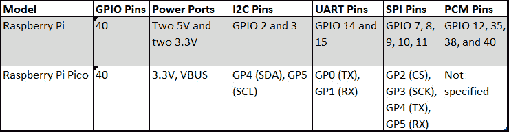
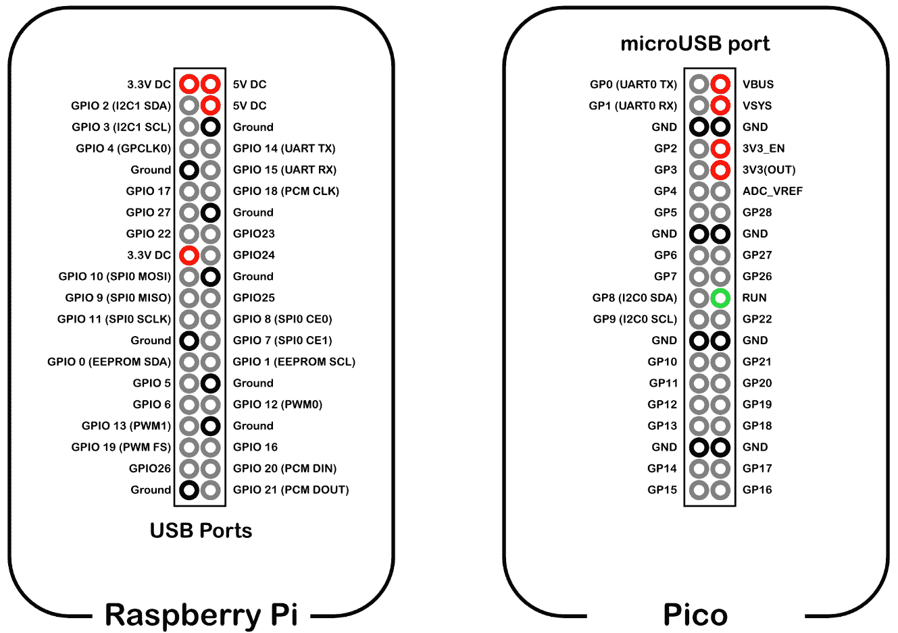
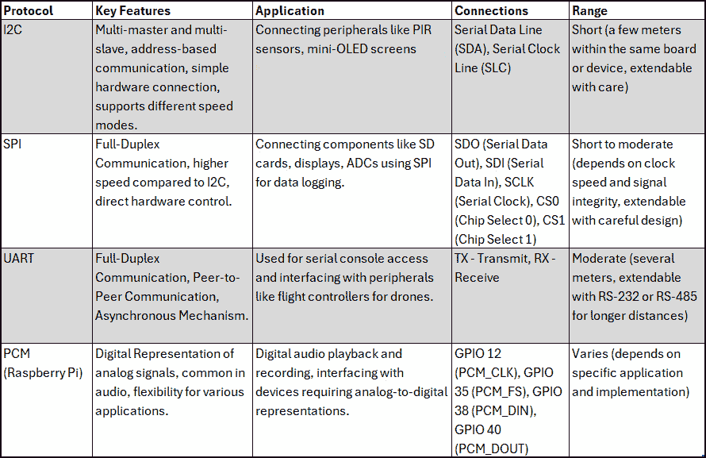
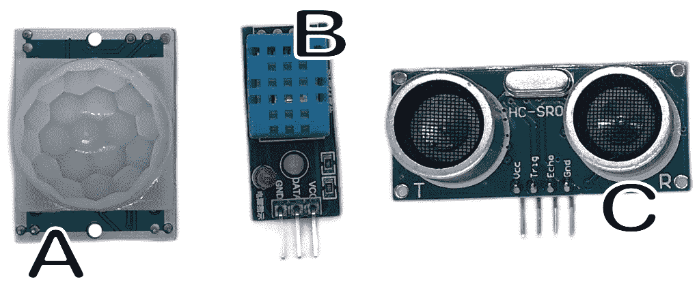
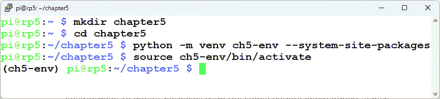
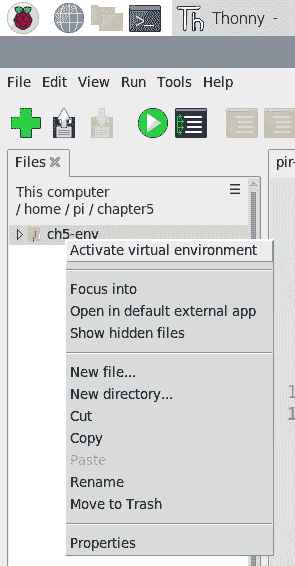
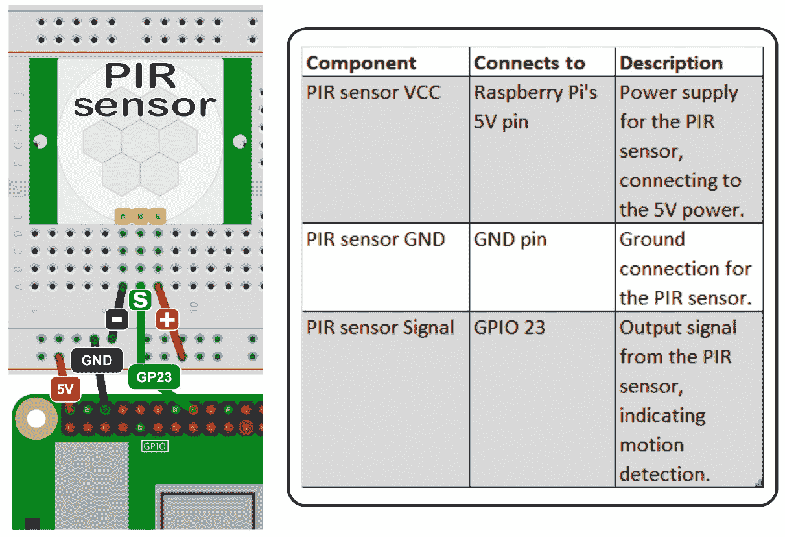
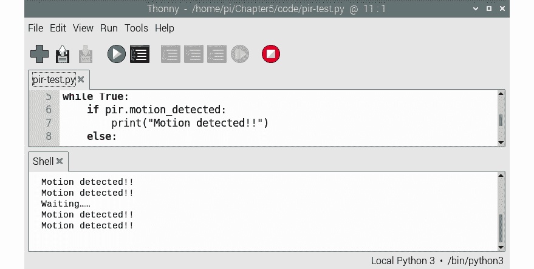
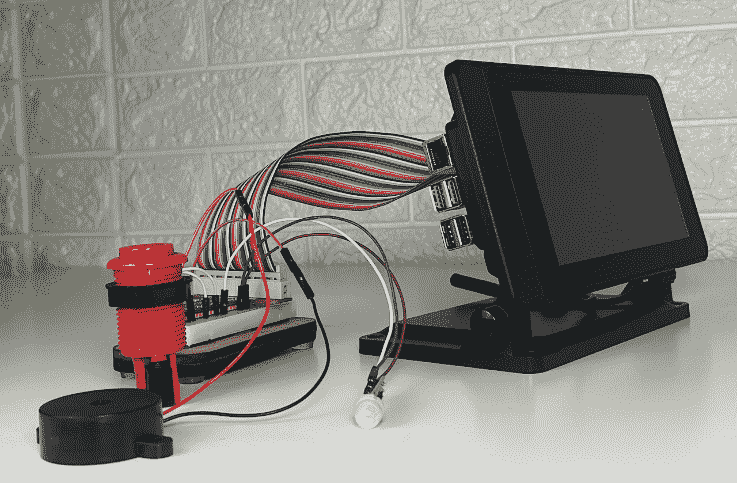
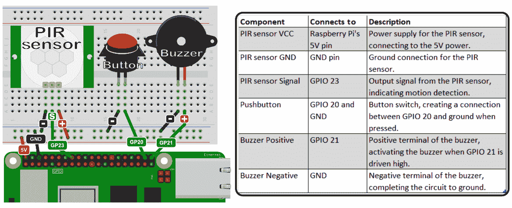

# 第五章：探索 GPIO

在本书的前四章中，我们已涉及树莓派上的**通用输入/输出**（**GPIO**）端口。在第三章中，我们广泛地使用了它来构建我们的天气指示器。在本章中，我们将深入探讨树莓派 GPIO 端口的特性和应用，随着我们开始构建我们的物联网家庭安全应用。我们还将探索树莓派 Pico 上的 GPIO 端口，它是树莓派的微控制器兄弟。

在动手实验部分，我们将使用 PIR 运动传感器来检测人类存在，构建一个基本的报警系统。这个系统将集成一个按钮用于激活控制，以及一个蜂鸣器作为警报机制。通过这个实际练习，我们将展示树莓派如何与各种组件接口，以创建功能性的实际应用。

在本章中，我们将涵盖以下内容：

+   介绍树莓派和树莓派 Pico 上的 GPIO

+   理解传感器、执行器和指示器

+   构建一个简单的报警系统

让我们开始吧！

# 技术要求

完成本章所需的以下要求：

+   具备 Python 编程的中间知识

+   一款较新的树莓派，最好是带有至少 4GB RAM 的树莓派 5

+   一个 PIR 传感器

+   一款 SFM-27 蜂鸣器

+   一个按钮，如街机风格的按钮

本章的代码可以在以下位置找到：

[`github.com/PacktPublishing/-Internet-of-Things-Programming-Projects-2nd-Edition/tree/main/Chapter5`](https://github.com/PacktPublishing/-Internet-of-Things-Programming-Projects-2nd-Edition/tree/main/Chapter5%0D)

# 介绍树莓派上的 GPIO

GPIO 端口是树莓派和 Pico 上的一组 40 个引脚，允许与外部世界交互。这些引脚可以配置为输入或输出，并可以连接到传感器、LED 等。其中包括提供电源的端口、几个接地连接以及用于特定协议（如 I2C、UART、SPI 和 PCM）的 GPIO。在下面的表中，我们可以看到我们如何将引脚与特定的通信协议匹配：



图 5.1 – 树莓派 GPIO 引脚和通信协议

## 探索树莓派 GPIO 引脚图

在*图 5.2*中，我们可以看到树莓派和树莓派 Pico 的 GPIO 端口引脚图。概述了 GPIO 引脚编号以及可能配置为特殊操作的引脚。

重要提示

树莓派和树莓派 Pico 的许多购买都附带一个 GPIO 引脚图参考表。这个工具对于开发来说非常有用，因为它作为 GPIO（树莓派）和 GP（Pico）引脚编号的指南，这些编号是设备连接到 Pi 和 Pico 所需的。

我们可能在互联网上找到这些图表的多种版本。对于有兴趣的人来说，有一个交互式的树莓派 GPIO 引脚图在[`pinout.xyz`](https://pinout.xyz)。



图 5.2 – GPIO 引脚图

树莓派（Raspberry Pi）的 GPIO 端口包括 GPIO 0（EEPROM SDA）和 GPIO 1（EEPROM SCL）引脚，这些引脚使得与连接的 HAT 模块进行自动通信成为可能。此外，还有用于各种通信协议的引脚。

为了更好地理解树莓派和 Pico 的通信能力，让我们来检查我们可能配置设备与之工作的特定通信协议。

## 理解 GPIO 引脚通信协议

树莓派和 Pico 的 GPIO 引脚支持多个关键通信协议，如 I2C、SPI、UART 和 PCM。这些协议使得树莓派和 Pico 能够与各种设备和传感器交互。每种协议都有其独特的应用，从与传感器接口到数字音频传输。在接下来的章节中，我们将概述这些可能配置的通信方法。

### I2C

I2C 是由飞利浦半导体（Philips Semiconductor）现在为恩智浦半导体（NXP Semiconductors）开发的串行通信协议。I2C 允许多个设备通过双线接口相互通信。

下面是连接的分解：

+   **串行数据线**（**SDA**）：这是数据线。

+   **串行时钟线**（**SLC**）：这是同步 I2C 总线上的数据传输的时钟线。

I2C 协议的关键特性包括以下内容：

+   **多主多从**：多个设备可以连接到总线上，并且可以支持超过一个主设备。

+   **基于地址的通信**：总线上的每个设备都有一个唯一的地址，允许进行定向通信。

+   **简单的硬件连接**：在设置 I2C 连接时，SDA 和 SCL 线只需要两个上拉电阻。

+   **速度变体**：I2C 支持不同的速度模式，包括标准模式（最高 100 Kbps）、快速模式（最高 400 Kbps）、高速模式（最高 3.4 Mbps）等。

在树莓派和 Pico 上，I2C 协议对于仅用两根线连接 PIR 传感器、迷你 OLED 屏幕和其他组件尤其有价值。

### SPI

**串行外设接口**（**SPI**）是一种用于短距离通信的同步串行通信协议，主要用于嵌入式系统，用于连接微控制器和外围设备，如传感器、SD 卡和 LCD。

下面是连接的分解：

+   **SDO—串行数据输出**：该线路用于从控制器向外围设备发送数据。

+   **SDI—串行数据输入**：该线路允许外围设备将数据发送回控制器。

+   **SCLK—串行时钟**：类似于 I2C 中的 SCL 线，它提供时钟信号，同步设备间的数据传输。

+   **CS0—芯片选择 0**：当存在多个外围设备时，此线路对于选择特定设备至关重要。通过切换 CS0，控制器可以确定它与哪个设备进行通信。

+   **CS1—芯片选择 1**：与 CS0 类似，CS1 提供了一条额外的选择线路，使得在单个 SPI 总线上可以寻址更多设备。

以下是 SPI 的功能和优势：

+   **全双工通信**：SPI 支持同时双向通信，允许数据同时发送和接收。这意味着在 SPI 通信期间，数据可以同时从主设备流向从设备，以及从从设备流向主设备。这与 I2C 不同，I2C 在半双工模式下运行（在任何给定时刻可以发送或接收数据，但不能同时进行）。

+   **速度**：在数据传输速率方面，SPI 通常超过 I2C，使其适用于需要高速通信的应用。

+   **直接硬件控制**：与 I2C 中的特定寻址方案不同，SPI 通过 CE 引脚提供更直接的设备控制。

SPI 通信在连接如 SD 卡、显示屏、**ADCs**（即**模拟-数字转换器**）等组件时非常有用。一个例子是我们通过 SPI 连接 SD 卡进行数据记录的应用。

### UART

UART，即**通用异步收发器**，是电子领域的一种常用通信协议，尤其以其在设备之间点对点通信中的简单性和有效性而闻名。UART 以其全双工通信能力而突出。这允许两个设备同时交换数据。

以下是连接的分解：

+   **TX—发送**：此连接用于将数据发送到另一个设备。

+   **RX—接收**：相反，此连接用于从另一个设备接收数据。

这些连接允许双向通信；当树莓派和 Pico 通过它们的 TX 引脚发送数据时，它们也可以通过它们的 RX 引脚接收数据。

与 I2C 和 SPI 等其他通信方法相比，UART 的一些特性包括：

+   **对等通信**：与 I2C 和 SPI 不同，后者有定义的主从关系，UART 设备作为对等体通信，没有指定的主设备或从设备。

+   **异步机制**：与 SPI 不同，UART 通信不依赖于共享的时钟信号。相反，在启动通信之前，两个设备必须就波特率达成一致。

由于其简单性，UART 通常用于串行控制台访问和与需要简单通信路径的外围设备接口。UART 和树莓派的一个常见用途是将无人机飞行控制器连接起来。

### PCM

我们可以在树莓派上的 GPIO 12、35、38 和 40 上设置**PCM**（**脉冲编码调制**），这些引脚通过在固定时间间隔内采样它们的幅度并将其量化为数字代码来数字表示模拟信号。这些引脚专门用于设备上的 PCM 通信：

+   **GPIO 12**（**PCM_CLK**）：这是时钟引脚，确保数据传输时的同步。

+   **GPIO 35**（**PCM_FS**）：这是帧同步。它有助于定义数据帧的开始和结束。

+   **GPIO 38**（**PCM_DIN**）：这是数据输入。这是树莓派从外部设备接收 PCM 数据的地方。

+   **GPIO 40**（**PCM_DOUT**）：这是数据输出。树莓派使用此引脚将 PCM 数据发送到其他设备。

PCM 的一些显著特点包括以下内容：

+   **数字表示法**：PCM 将模拟信号转换为数字格式，使其在抗噪声和干扰的格式中保存原始信号的细微差别，非常适合。

+   **在音频中常见**：许多音频格式，如 WAV，使用 PCM 来数字表示声音，确保高保真度。

+   **灵活性**：PCM 可用于音频以外的各种应用，包括电信和数据存储。

在树莓派上，PCM 的实用性在各种任务中显而易见，从数字音频播放和录制到与需要精确的模拟到数字表示的设备进行接口。PCM 与树莓派的一个显著应用是在数字音频系统和声音接口领域。

以下是一个总结通信协议和树莓派以及树莓派 Pico 的表格：



图 5.3 – 总结的通信协议

现在我们已经了解了可以与树莓派和树莓派 Pico 一起使用的通信协议，让我们来看看传感器、执行器和指示器，以及我们如何将它们连接到我们的树莓派和树莓派 Pico 上。这是 GPIO 端口的主要用途。

# 理解传感器、执行器和指示器

树莓派和 Pico 的 GPIO 功能为连接各种传感器和驱动指示器（如 LED）以及控制执行器（如伺服电机）提供了基础。通过集成这些设备，我们的设备可以收集数据并根据这些信息执行响应动作。

例如，一个 PIR 传感器（*图 5**.4*中的*A*）可以检测房间内的运动，从而点亮 LED 或触发警报。使用温度和湿度传感器，如 DHT11（*图 5**.4*中的*B*），我们可以评估环境条件，并据此启动风扇或加热元件。

使用距离传感器（*图 5**.4*中的*C*），我们可以测量物体的接近程度，并指令伺服电机停止机器人，防止碰撞：



图 5.4 – 树莓派的传感器

我们可以将许多设备集成到我们的 Raspberry Pi 和 Pico 中。仅就机器人技术而言，它提供了用于引导机器人沿预定路径行驶的线跟踪传感器和**飞行时间**（**TOF**）传感器，这些传感器体积小且精确，距离传感器。在机器人技术之外，还有土壤湿度、雨量检测、光线和温度/湿度传感器，这为自调节温室创造了潜力。

在下一节中，我们将探讨如何使用 Python 和 GPIO Zero 库连接并读取 PIR 传感器（*图 5.4* 中的 *A*）和 Raspberry Pi 的数据。结合我们所学，我们将利用我们的知识来创建一个基本的报警系统，使用我们的 Raspberry Pi。

在我们编写与 PIR 传感器交互的代码之前，我们将首先设置我们的开发环境。

## 设置我们的开发环境

我们将使用 Python 虚拟环境进行我们的开发。由于有些库只与 Python 的根安装版本兼容，因此我们将使用系统包在我们的 Python 虚拟环境中。为此，我们执行以下操作：

1.  在我们的 Raspberry Pi 5 上，我们打开一个终端。

1.  为了存储我们的项目文件，我们使用以下命令创建一个新的目录：

    ```py
    mkdir chapter5
    ```

1.  然后，我们使用以下命令导航到新目录：

    ```py
    cd chapter5
    ```

1.  我们使用以下命令为我们的项目创建一个新的 Python 虚拟环境：

    ```py
    ch5-env and enable access to the system site packages. This allows the virtual environment to inherit packages from the global Python environment, which can be useful when certain libraries are installed system wide. Once the environment is set up, we can activate it and begin installing project-specific packages without affecting the global Python environment.
    ```

1.  在创建我们的新 Python 虚拟环境后，我们使用以下命令将其源代码导入：

    ```py
    ch5-env Python virtual environment:
    ```



图 5.5 – 使用 dashboard-env 环境的终端

1.  我们使用以下命令关闭终端：

    ```py
    exit
    ```

1.  现在，我们已准备好加载 Thonny。我们通过点击 Raspberry Pi 任务栏中的**菜单**图标，导航到**编程**类别，并选择**Thonny**来完成此操作。

1.  默认情况下，Thonny 使用 Raspberry Pi 内置的 Python 版本。对于我们的项目，我们将使用我们刚刚创建的 Python 虚拟环境。为了开始，我们需要通过点击**视图**并选择**文件**来查看项目文件（如果尚未选择）。

1.  在“文件”部分，我们找到`ch5-env`目录。

1.  然后，我们右键点击文件夹并选择**激活虚拟环境**选项：



图 5.6 – 在 Thonny 中激活 Python 虚拟环境

在创建我们的项目文件夹并设置和激活我们的 Python 虚拟环境后，我们现在可以开始编写代码来访问连接到 GPIO 端口的传感器。我们将从探索 PIR 传感器开始。

## 探索 PIR 传感器

**被动红外**（**PIR**）传感器是专门用于检测红外辐射的设备，通常由生物体因体温而发出。这些传感器通过监测红外水平的变化来工作，这些变化发生在红外源（如人）在其视野中移动时。PIR 传感器可以通过其占主导地位的独特球壳来识别（*图 5.4* 中的 *A*）。

将 PIR 传感器连接到 Raspberry Pi 很简单。需要三个引脚：

+   VCC 连接到 Raspberry Pi 的 5V。

+   GND 连接到 GND 引脚。

+   信号连接到 GPIO 23。

在 *图 5.7* 中，我们看到一个 PIR 传感器通过面包板连接到 Raspberry Pi：



图 5.7 – 将 PIR 传感器连接到 Raspberry Pi

要从我们的 PIR 传感器获取感官数据，我们使用 GPIO Zero 库。为此，我们执行以下操作：

1.  在 Thonny 中，我们通过选择 **文件** 然后选择 **新建** 或按键盘上的 *Ctrl* + *N* 来创建一个新的标签页。

1.  在标签页中，我们输入以下代码：

    ```py
    from gpiozero import MotionSensor
    from time import sleep
    pir = MotionSensor(23)
    while True:
        if pir.motion_detected:
            print("Motion detected!!")
        else:
            print("Waiting……")
        sleep(5)
    ```

1.  我们将代码保存为 `pir-test.py`。

1.  要在 Thonny 中运行代码，我们点击绿色运行按钮，按键盘上的 *F5* 或点击顶部的 **运行** 菜单选项，然后选择 **运行** **当前脚本**。

1.  当我们把手靠近 PIR 传感器时，我们应该看到消息 `"Motion detected!!"`：



图 5.8 – 测试 PIR 传感器的结果

在测试了 PIR 传感器后，我们现在可以使用 Raspberry Pi 构建一个基本的报警系统。

# 构建一个简单的报警系统

Raspberry Pi 的 GPIO 引脚可以配置为特定的通信协议，如 I2C，或设置为标准输入/输出引脚以测量条件或水平。

在本章的最后部分，我们将使用我们的知识来构建一个简单的报警系统。我们的报警系统将包括一个按钮、一个 PIR 传感器和一个蜂鸣器。所有组件都连接到 GPIO 端口（*图 5.9*）。



图 5.9 – 蜂鸣器、按钮和 PIR 传感器通过扩展排线连接到 GPIO 端口

在 *图 5.9* 中，我们使用 GPIO 扩展排线将 GPIO 端口连接到面包板，这样我们就可以轻松地进行原型设计和重新配置连接。排线简化了过程并使布线整齐。使用 GPIO 扩展电缆完全是可选的。就像我们在 *第四章* 中做的那样，我们的 Raspberry Pi 安装了 Raspberry Pi 七英寸触摸屏及其相关的外壳。

我们使用以下图示将组件连接到 GPIO 端口：



图 5.10 – 基本报警电路

我们在 Thonny 中编写我们的报警系统代码：

1.  在 Thonny 中，我们通过选择 **文件** 然后选择 **新建** 或按键盘上的 *Ctrl* + *N* 来创建一个新的标签页。

1.  在标签页中，我们输入以下代码：

    ```py
    from gpiozero import MotionSensor, Button, Buzzer
    from time import sleep
    pir = MotionSensor(23)
    button = Button(20)
    buzzer = Buzzer(21)
    active = False
    def toggle_alarm():
        global active
        if active:
            active = False
            buzzer.off()
            print("Alarm deactivated!")
        else:
            active = True
            print("Alarm activated!")
    def monitor():
        while True:
            if active:
                pir.wait_for_motion()
                print("Motion detected!")
                sleep(5)
                if active:
                    buzzer.on()
                    print("Alarm triggered!")
            else:
                buzzer.off()
    button.when_pressed = toggle_alarm
    try:
        monitor()
    except KeyboardInterrupt:
        print("Exiting...")
        buzzer.off()
    ```

    在执行我们的代码之前，让我们先过一遍。

    +   我们首先导入我们的库：

        +   `gpiozero` 用于 Raspberry Pi GPIO 操作

        +   `time` 用于创建睡眠间隔

    +   我们然后定义我们的 GPIO 连接：

        +   PIR 传感器连接到 GPIO 引脚 23

        +   按钮连接到 GPIO 引脚 20

        +   蜂鸣器连接到 GPIO 引脚 21

        +   `active`：用于跟踪闹钟状态的变量（开启/关闭）

    +   我们定义了我们的`toggle_alarm()`函数：

        +   在活动和非活动状态之间切换闹钟状态

        +   如果在蜂鸣器响起时解除闹钟，蜂鸣器会被关闭

    +   我们接下来定义`monitor()`函数：

        +   如果闹钟系统处于活动状态，则持续检查运动

        +   如果检测到运动，程序将等待五秒钟以允许解除闹钟

        +   如果在五秒钟延迟后闹钟仍然处于活动状态，蜂鸣器会响起

    +   然后我们将`button.when_pressed`的`gpiozero`属性设置为绑定到`toggle_alarm()`函数。这允许我们在按下按钮时立即执行一个函数。这种事件驱动的方法消除了连续轮询的需要。

    +   我们的主要执行块运行`monitor()`函数。

    +   `try / catch`允许在键盘中断（*Ctrl* + *C*）的情况下干净地退出，确保在退出时蜂鸣器被关闭。

1.  我们将程序保存为`basic-alarm.py`。

1.  要在 Thonny 中运行代码，我们点击绿色运行按钮，在键盘上按*F5*，或者在顶部点击**运行**菜单选项，然后点击**运行****当前脚本**。

1.  我们通过按下按钮来激活闹钟。我们的单一传感器是 PIR 传感器，它监控运动。

1.  一旦检测到运动，蜂鸣器激活前会有五秒钟的延迟。这为意识到闹钟的人提供了时间，在蜂鸣器响起之前将其关闭。

1.  要关闭闹钟，我们只需再次按下按钮。

在接下来的章节中，我们将我们的基本闹钟系统转变为一个使用 Raspberry Pi Pico W 的物联网闹钟。这将使我们能够从全球任何位置监控传感器数据，提供像在我们旁边安装的传感器一样管理我们的闹钟系统的便利性和多功能性。

# 摘要

在*第五章*中，我们探讨了 Raspberry Pi 的 GPIO 引脚及其通信能力，包括 I2C、SPI、UART 和 PCM 等协议。我们强调了 GPIO 引脚图在处理 Raspberry Pi 和 Raspberry Pi Pico 时的意义。

我们专注于 PIR 传感器进行运动检测，并将其连接到我们的 Raspberry Pi。然后我们利用这些知识使用 PIR 传感器、按钮和蜂鸣器构建了一个基本的闹钟系统。尽管我们没有与 Pico 进行实际操作练习，但我们学到的原理和技术适用于 Raspberry Pi 和 Raspberry Pi Pico。

本章开始了我们物联网家庭安全系统的构建。在接下来的章节中，我们将向我们的基本闹钟添加功能，当我们将其转变为一个令人印象深刻的物联网家庭安全系统时，我们将创建一个物联网闹钟模块和一个物联网按钮来启动它。
