# 6

# 构建物联网警报模块

在上一章中，我们探讨了 Raspberry Pi 的 GPIO 端口并构建了一个基本的警报系统。我们学习了不同的通信协议，并使用 GPIO 端口与一组传感器一起工作。在本章中，我们将使用 Raspberry Pi Pico W、公共**消息队列遥测传输**（**MQTT**）服务器和 MQTTHQ 网页客户端（*图 6**.1*）来增强我们的基本警报系统。

我们将使用 Raspberry Pi Pico W 来托管当`运动`消息发送到 MQTT 服务器并通过 MQTTHQ 网页客户端查看时：

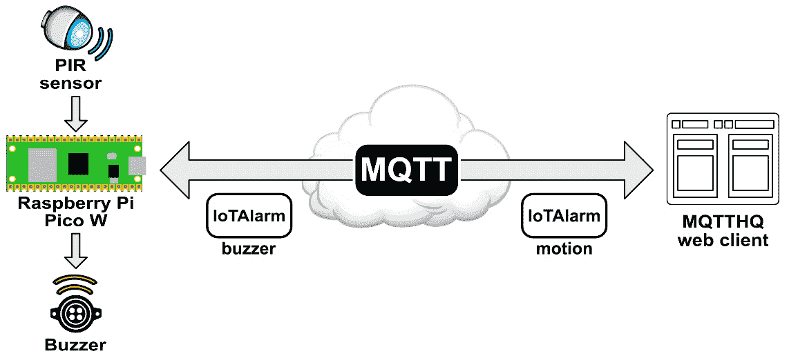

图 6.1 – 使用 MQTT 的物联网警报模块

我们将从 MQTTHQ 网页客户端向 Raspberry Pi Pico W 发送`蜂鸣器`消息以激活蜂鸣器。这个 Raspberry Pi Pico W 和 MQTTHQ 网页客户端设置构成了我们物联网家庭安全系统的基础。

我们将从这个章节的开始，通过使用公共服务器作为我们的开发平台来探索 MQTT。然后，我们将熟悉 Raspberry Pi Pico W，突出其在物联网应用中的优势。最后，我们将通过将我们的物联网警报模块组件安装到定制的 3D 打印机箱中结束。

因此，在本章中，我们将涵盖以下主要主题：

+   探索 MQTT

+   使用 Raspberry Pi Pico W 和 MQTT

+   构建一个物联网警报模块机箱

让我们开始吧！

# 技术要求

完成本章所需的以下要求：

+   Python 编程的中级知识。

+   1 x Raspberry Pi Pico WH（带引脚）用于与面包板或 Raspberry Pi Pico GPIO 扩展器一起使用。

+   1 x Raspberry Pi Pico W（不带引脚）用于安装到可选的 3D 打印机箱中。

+   1 x HC-SR501 PIR 传感器。

+   1 x LED，通过 220 欧姆电阻连接（请参阅*第三章*以了解构造）。

+   1 x SFM-27 激活蜂鸣器。

+   有访问 3D 打印机或 3D 打印服务的权限以打印可选的机箱。

本章的代码可以在以下位置找到：

https://github.com/PacktPublishing/-Internet-of-Things-Programming-Projects-2nd-Edition/tree/main/Chapter6

# 探索 MQTT

**MQTT**是物联网的关键组件，它使得连接设备之间实现轻量级和高效的通信成为可能。在*图 6**.1*中，我们展示了 MQTT 在普遍的云符号中，象征着互联网。MQTT 基于**发布-订阅**模型，允许设备向特定主题发布消息，同时订阅相关主题。这个框架确保了高效和选择性的通信，使得设备只能接收与其功能相关的消息。MQTT 的轻量级设计最小化了资源开销，使其成为能力受限设备的理想选择。

我们通过查看 MQTT 中的发布-订阅模型是如何工作的来开始我们对 MQTT 的调查。

## 理解 MQTT 中的发布-订阅模型

MQTT 在使物联网设备之间通信方面有效，归功于其发布/订阅模型。该模型为设备之间提供了一种灵活且可扩展的通信方式。

在 MQTT 中，设备被分为两个角色——发布者和订阅者：

+   在`IoTAlarm`主题下的`motion`消息，而温度传感器在`temp`主题下通信一个`25 C`的消息。

+   `IoTAlarm`和`temp`主题，而手机仅订阅了`IoTAlarm`主题。

MQTT 中的主题充当通道或通信路径。我们可以将主题视为标签或类别，消息属于这些类别，例如在*图 6*.2 中用黑色框和白色文字标记的`IoTAlarm`和`temp`主题。当发布者向特定主题发送消息时，MQTT 代理（服务器）管理该消息。

代理维护一个所有订阅该主题的订阅者列表，保证消息发送给每个订阅者。这种机制允许高效且具有选择性的通信，因为设备只接收它们已订阅的主题的消息。在*图 6*.2 中，我们看到我们的 PC 订阅了`IoTAlarm`和`temp`主题，而我们的手机仅订阅了`IoTAlarm`主题：

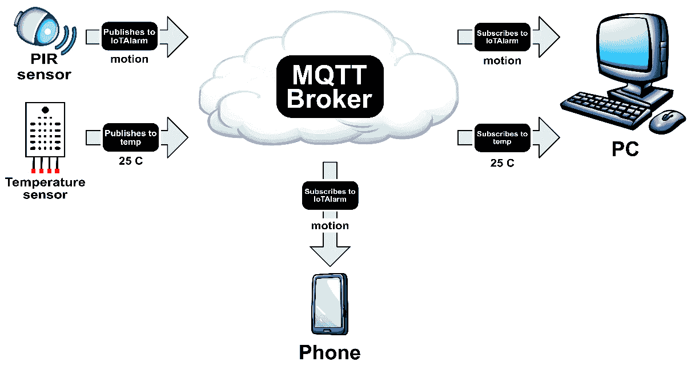

图 6.2 – MQTT 通信示意图

在我们尝试一些 MQTT 的动手经验之前，我们将探讨 MQTT 中的**服务质量**（**QoS**）级别。理解 QoS 级别至关重要，因为它们决定了 MQTT 中消息的可靠性和交付保证。

## 理解 MQTT 中的 QoS

**QoS**是 MQTT 的一个重要方面，它决定了 MQTT 代理（服务器）和 MQTT 客户端（设备或应用程序）之间消息传递的保证级别。

MQTT 提供了三个 QoS 级别：

+   **QoS 0 (最多一次)**: 在此模式下，消息最多只发送一次，这意味着消息可能不会被发送到接收者，也可能在没有确认或收件保证的情况下丢失。这种 QoS 级别适用于消息丢失可以接受且消息传递不是关键的场景。

+   如果发送者收到（ACK）消息已被接收的确认，它将重新发送消息。这种 QoS 级别保证了消息被接收者接收，但可能导致重复消息。

+   **QoS 2 (精确一次)**: QoS 2 提供了最高级别的保证。它确保消息恰好一次被发送到接收者。这种 QoS 级别涉及发送者和接收者之间更复杂的握手，以确保没有重复或消息丢失。

为了我们的开发目的，QoS 0 是足够的，因为它提供了合理的消息传递，无需 QoS 1 和 QoS 2 所需的更复杂的消息跟踪和确认机制。QoS 0 简化了代码中的消息处理，使其成为开发场景中的实际选择。

## 使用 MQTTHQ 网页客户端探索 MQTT 基础知识

为了获取 MQTT 的实际知识，我们将使用 **MQTTHQ 网页客户端**。这个基于网页的服务简化了学习 MQTT 的过程，消除了复杂安装或大量编程的需求。作为一个面向开发和测试的公共资源，它为我们提供了一个可访问的环境来探索和理解 MQTT 的功能。

我们首先在网页浏览器中打开网页客户端：

1.  在我们的浏览器中，我们使用以下 URL 导航到客户端：[`mqtthq.com/client`](https://mqtthq.com/client)。

1.  为了确保我们可以使用客户端进行测试，我们验证从屏幕右上角的消息中我们是否连接到了 [public.mqtthq.com](https://public.mqtthq.com/)：


图 6.3 – 连接到 mqtthq.com 客户端

如果没有出现表示 *已连接* 的消息，我们继续刷新页面，直到出现为止。

1.  在 `IoTAlarm` 中保留 `0`，并点击 **订阅** 按钮。

1.  我们应该注意到，**接收到的有效载荷** 下的文本更新为显示 **等待数据…**，并且 **订阅** 按钮已变为 **取消订阅** 按钮：

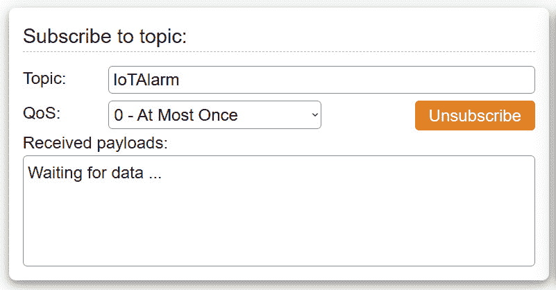

图 6.4 – 订阅 IoTAlarm 主题

1.  在 `IoTAlarm` 中保留 `0`，将 `Hello World!` 消息替换为 `motion`，然后点击 **发布** 按钮：

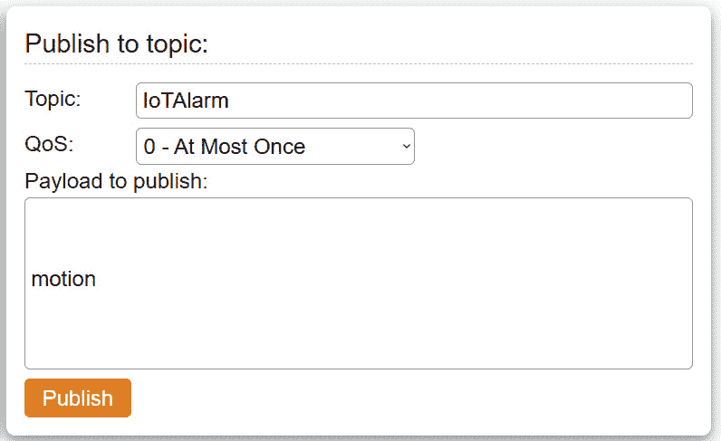

图 6.5 – 向 IoTAlarm 主题发布消息

1.  我们应该注意到，我们的 `motion` 消息现在已出现在 **订阅主题** 部分的 **接收到的有效载荷** 框下：


图 6.6 – 接收到的 MQTT 消息

1.  为了确认我们已成功从发布者向订阅者发送 MQTT 消息，我们可以使用两台不同的计算机：一台用于发布消息，另一台用于订阅并接收它们。

通过这次练习，我们有效地展示了使用 MQTTHQ 网页客户端发布和订阅 MQTT 消息的过程。在下一节中，我们将利用 Raspberry Pi Pico W 的功能开始构建我们的物联网警报模块。

# 使用 Raspberry Pi Pico W 和 MQTT

在本节中，我们将使用 **Raspberry Pi Pico W** 构建我们应用程序的物理警报部分。这个微控制器不仅价格低廉，而且为我们的项目带来了一系列功能，使我们能够高效地执行任务，而无需使用像 Raspberry Pi 这样的 **单板计算机**（**SBC**）的全部功能。

Raspberry Pi Pico W 并不取代我们的 Raspberry Pi；它补充了它，为我们的工具箱增添了独特的优势。作为一个微控制器，Pico W 与 Raspberry Pi 相比，成本效益更高，并且由于其更简单的架构和较低的功耗，通常不会过热。这种区别对于我们的物联网报警模块等项目至关重要，其主要任务是捕捉感官数据——这不需要 SBC 的计算能力。这使我们能够将 Raspberry Pi 保留用于需要更多计算资源的任务。

作为微控制器，我们的 Raspberry Pi Pico W 启动迅速，为我们的程序提供快速启动。我们不需要加载一个沉重的操作系统。

## 介绍 RP2040 芯片

Raspberry Pi Pico W 使用的是 Raspberry Pi Foundation 创建的双核 ARM Cortex-M0+处理器 RP2040 芯片。该芯片通过将微控制器典型的简化操作与执行更复杂微计算机类型任务的能力相结合，被设计为微控制器和微计算机之间的桥梁。

我们 Raspberry Pi Pico W 中的 *W* 表示我们的微控制器支持 Wi-Fi。除了 Raspberry Pi Pico W，还有标准 Pico（不带 Wi-Fi）、Pico H（不带 Wi-Fi 且带有焊接引脚）和 Pico WH（带有 Wi-Fi 和焊接引脚）。

Raspberry Pi Pico W 所基于的 RP2040 芯片也存在于其他微控制器上，如 *Arduino Nano RP2040 Connect*、*Pimoroni Tiny 2040* 和 *Adafruit Feather RP2040*。在 *图 6**.7* 中，我们看到 Waveshare RP2040-Zero-M (*A*)、Raspberry Pi Pico (*B*) 和 Raspberry Pi Pico W (*C*)：

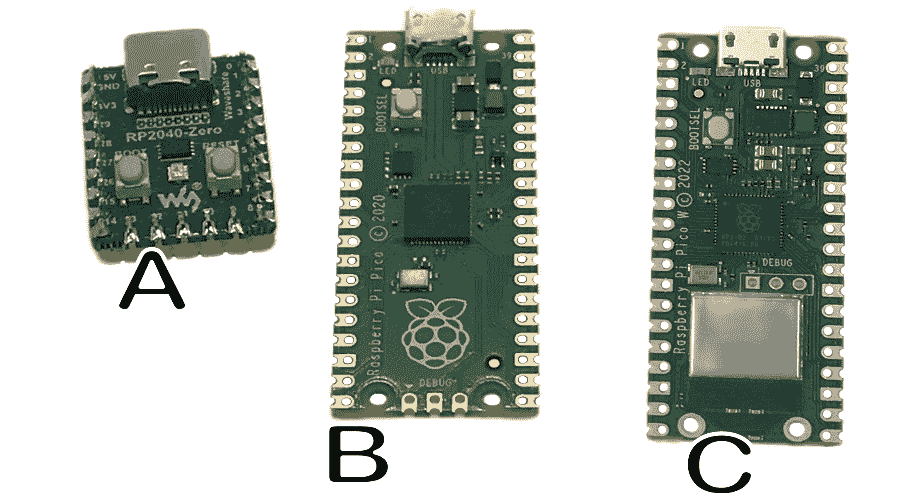

图 6.7 – 基于 RP2040 的微控制器

要在面包板上构建我们的报警电路，我们需要在 Raspberry Pi Pico W 上安装引脚。我们可以自己焊接它们，或者选择购买 Pico WH 版本。

我们将开始构建我们的物联网报警模块，首先在面包板上构建电路。

## 配置我们的报警电路

在本节中，我们将使用 SFM-27 主动蜂鸣器、一个带有电阻的 LED 和一个 HC-SR501 PIR 传感器来构建我们的报警电路。在将组件移动到 3D 打印的盒子之前，我们将在面包板上配置我们的电路。我们可以用 Raspberry Pi Pico GPIO 扩展器代替面包板。对于面包板，我们使用焊接到我们的组件上的公跳线连接到面包板。对于 GPIO 扩展器，我们使用焊接到我们的组件上的母跳线进行连接。

在 *图 6**.8* 中，我们可以看到我们的电路在一个 Fritzing 图中展示。为了创建我们的电路，我们使用 *图 6**.8* 中概述的连接将我们的组件连接到 Raspberry Pi Pico W：

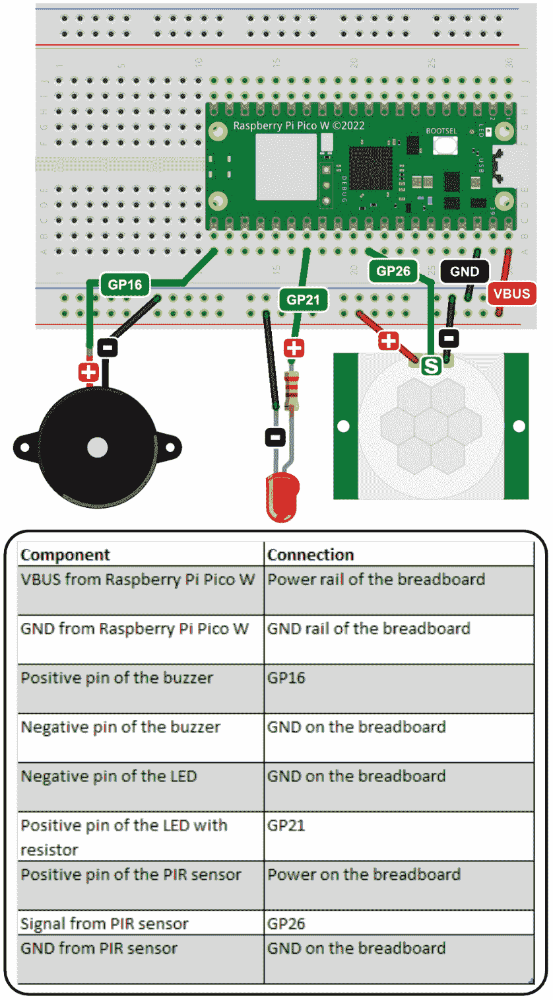

图 6.8 – Raspberry Pi Pico W 报警电路

注意我们与 Raspberry Pi Pico W 上的 VBUS 端口的连接。当 Pico 通过 USB 供电时，连接到 VBUS 端口的组件将接收大约 5V 的电压，这是标准的 USB 电压。我们将通过 USB 端口为我们的物联网报警模块供电。

下表概述了 Raspberry Pi Pico W 上的电源端口，并提供了关于我们如何在未来的项目中利用它们的见解：

| **端口** | **输入** **电压用途** | **输出** **电压用途** |
| --- | --- | --- |
| VBUS | 用于从 5V USB 源供电。 | 当 Pico 通过 USB 供电时，可用于为外部组件供电 5V。 |
| VSYS | 接受 1.8V 至 5.5V 的外部电源。 | 通常不用于为外部组件供电。 |
| 3V3(OUT) | 不常用于输入。 | 为外部 3.3V 组件提供稳定的 3.3V 供电。 |
| 3V3_EN | 不是一个电源端口，但是一个控制引脚，用于启用/禁用 3.3V 供电。 | 不适用。 |

表 6.1 – Raspberry Pi Pico (W) 上的电源端口

在我们的电路连接好之后，我们就可以开始编码了。我们将首先设置 Thonny 以进行微控制器开发。

## 设置我们的开发环境

就像我们迄今为止所做的一切软件开发一样，我们将使用 Thonny 作为我们的 **集成开发环境**（**IDE**）。Thonny 的操作系统版本（Windows、macOS、Linux、Raspberry Pi OS 等）的选择是灵活的，因为我们的重点是编写用于连接微控制器的代码，而不是用于编码的计算机。

重要提示

注意，Thonny 的不同操作系统版本可能表现出不同水平的功能，这对于本章是必要的。本节的内容基于 Thonny 的 Windows 版本，提供的截图反映了这一点。

我们将使用 **MicroPython**，Python 的轻量级版本，针对微控制器进行了优化，来开发我们的代码。MicroPython 与 Python 共享核心语法和功能，但需要注意的是，由于其专注于资源受限的环境，它可能缺少标准 Python 中可用的某些广泛库和功能。然而，这些差异是 MicroPython 在微控制器编程中使用的效率权衡。

要在我们的 Raspberry Pi Pico W 上安装 MicroPython，我们执行以下操作：

1.  如果我们的操作系统上没有 Thonny，我们将访问 Thonny 网站，并下载一个合适的版本（[`thonny.org`](https://thonny.org)）。

1.  我们随后使用适合我们操作系统的适当方法启动 Thonny。

1.  在按住 Pico W 上的 *BOOTSEL* 按钮（USB 端口附近的小白按钮）的同时，我们将它插入一个可用的 USB 端口，并忽略可能出现的任何弹出窗口。

1.  然后，我们点击屏幕右下角的解释器信息，并选择 **安装 MicroPython…**：

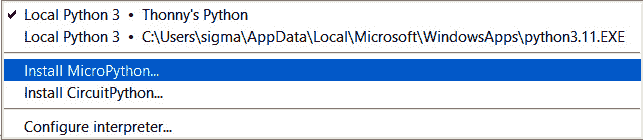

图 6.9 – 安装 MicroPython…选项

1.  对于**MicroPython 变体**，我们选择**Raspberry Pi • Pico W/** **Pico WH**：

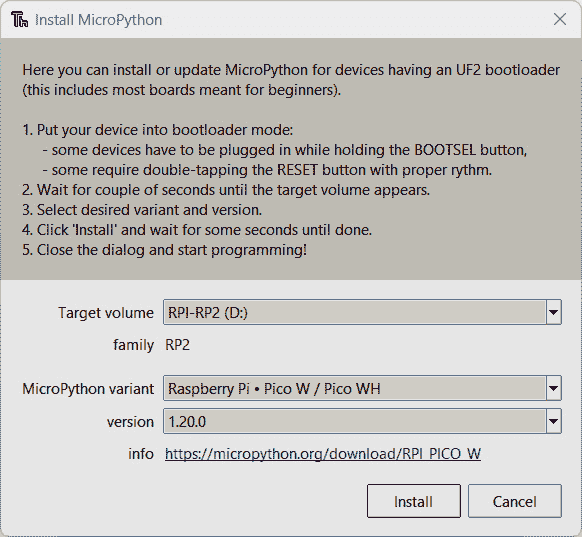

图 6.10 – 在 Raspberry Pi Pico W 上安装 MicroPython

1.  我们点击**安装**按钮，安装完成后点击**关闭**按钮。

1.  要使 Thonny 配置为在我们的 Pico W 上运行 MicroPython 解释器，我们从屏幕的右下角选择它：

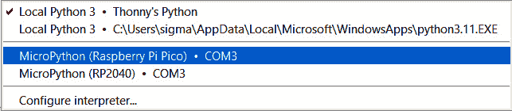

图 6.11 – 从我们的 Pico W 中选择 MicroPython 解释器

1.  我们通过检查**Shell**来确认 Thonny 正在使用我们的 Raspberry Pi Pico W 上的 MicroPython 解释器：

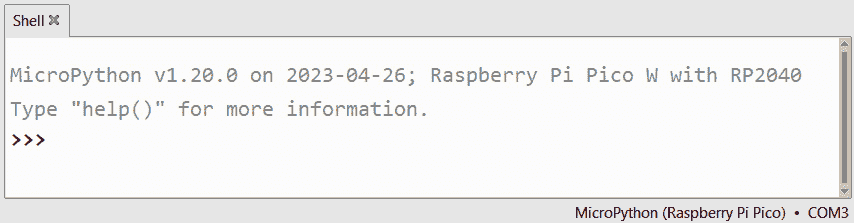

图 6.12 – Thonny 中的 MicroPython 提示

1.  要运行 MQTT 代码，我们需要安装 MQTT 库。为此，我们在搜索框中输入`umqtt`，并点击**在 PyPI 上搜索**：

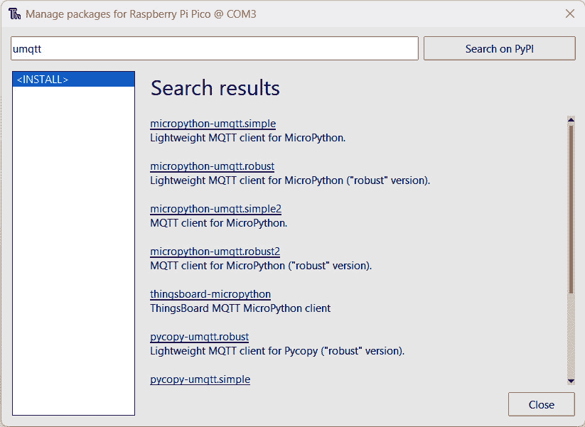

图 6.13 – 在我们的 Pico W 上安装 MQTT 库

1.  我们选择`micropython-umqtt.simple`包，并点击**安装**按钮。

1.  然后我们点击**关闭**按钮关闭对话框。

现在我们已经在我们的 Raspberry Pi Pico W 上安装了 MicroPython 和 MQTT 库，我们准备开始编码。我们的初步重点将是连接组件，然后是实现 MQTT 相关代码。

## 编写报警模块客户端代码

到现在为止，我们应该已经非常熟悉 Thonny IDE 了。连接到 Raspberry Pi Pico W 上的 MicroPython 解释器不会显著改变我们与 Thonny 的交互。

尽管如此，在我们的开发过程中能够查看存储在 Pico W 和我们的计算机上的文件是有益的。这种可见性使我们能够轻松验证文件位置并有效地管理我们的项目。

要在 Thonny 中打开**文件**视图，我们点击顶部的**视图**菜单并选择**文件**：

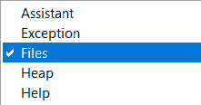

图 6.14 – 在 Thonny 中启用文件视图

我们应该在 Thonny 的左侧看到我们的 Raspberry Pi Pico W 和我们的计算机上的项目文件视图。

现在我们准备好开始编写代码了。我们将从蜂鸣器开始。

### 通过代码激活蜂鸣器

*图 6.1* 展示了从 MQTT 代理发送到我们的 Raspberry Pi Pico W 的`IoTAlarm`类型消息。此消息的目的是激活我们的报警模块中的蜂鸣器。为了处理这个任务，我们将创建一个单独的程序。与监控我们电路中的 PIR 传感器或 LED 组件相比，激活蜂鸣器涉及一个稍微复杂的过程，因此我们希望将其代码分离。

要做到这一点，我们执行以下操作：

1.  我们将 Raspberry Pi Pico W 连接到 USB 端口并启动 Thonny。我们可以使用 Raspberry Pi 或其他操作系统来完成此操作。

1.  我们接着通过从屏幕右下角选择它来在我们的 Pico W 上激活 MicroPython 环境。

1.  在一个新的编辑标签中，我们输入以下代码：

    ```py
    from machine import Pin, PWM
    import utime
    BUZZER_PIN = 16
    buzzer = PWM(Pin(BUZZER_PIN))
    BUZZER_FREQ = 4000
    def activate_buzzer(duration=5):
        buzzer.freq(BUZZER_FREQ)
        buzzer.duty_u16(32768)
        utime.sleep(duration)
        buzzer.duty_u16(0)
    ```

1.  要保存文件，我们从下拉菜单中选择 **文件** | **另存为...**。这将打开以下对话框：

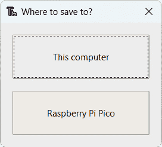

图 6.15 – 将文件保存到我们的 Raspberry Pi Pico W

1.  在此对话框中，我们被提供选择存储文件位置的机会。要将文件保存在我们的 Raspberry Pi Pico W 上，我们点击相应的按钮。

1.  我们将文件命名为 `buzzer.py` 并点击 `Pin` 和 `PWM`（用于 `machine` 模块）。

1.  我们导入 `utime` 类以实现计时功能。

1.  我们将 `BUZZER_PIN` 常量设置为 16。这对应于我们的蜂鸣器接线图。

1.  我们通过在指定的 `BUZZER_PIN` 常量上初始化 `PWM` 类来创建一个 `buzzer` 对象。这种基于 PWM 的方法允许我们快速改变提供给蜂鸣器的电压，从而控制声音的音调和音量。

1.  我们接着将 `BUZZER_FREQ` 常量设置为 `4000`，表示用于蜂鸣器的 PWM 信号的频率。

1.  我们接着定义一个 `activate_buzzer()` 函数。此函数接受一个可选的 `duration` 参数（默认为 5 秒）。

1.  在 `activate_buzzer()` 函数内部，我们执行以下操作：

    1.  我们将 `buzzer` 对象的频率设置为指定的 `BUZZER_FREQ` 常量。

    1.  我们将蜂鸣器的占空比设置为 50%（32768 出自 65536 的完整 16 位范围），创建一个平衡的音调，蜂鸣器在信号的 16 位周期中活跃一半，另一半不活跃。

    1.  然后，我们的代码使用 `utime.sleep()` 函数暂停程序指定的秒数。

    1.  在指定的时间后，将 `buzzer` 对象的占空比设置为 `0`，关闭蜂鸣器。

我们可以使用 Thonny 中的 Shell 来测试我们的代码。为此，我们执行以下操作：

1.  在 Shell 中，我们从蜂鸣器文件中导入 `activate_buzzer()` 函数：

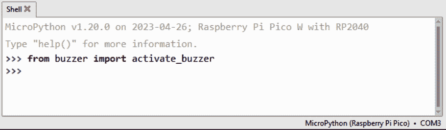

图 6.16 – 导入 activate_buzzer() 函数

1.  函数导入后，我们可以通过简单地调用它并按键盘上的 *Enter* 键来运行它：

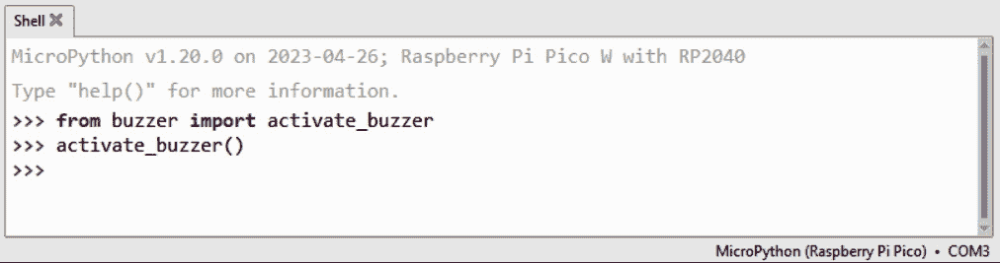

图 6.17 – 激活蜂鸣器

1.  在蜂鸣器正确接线后，我们应该听到它响 5 秒。要调整持续时间，我们只需将另一个值传递给 `activate_buzzer()` 函数。

我们必须为自己鼓掌，因为我们刚刚编写并执行了我们的第一个 MicroPython 程序！蜂鸣器代码完成后，是时候为我们的报警模块创建主程序了。

### 创建主代码

在本节中，我们将编写代码来为我们的物联网警报模块供电。在这段代码中，我们将连接 PIR 传感器、LED、Wi-Fi 和 MQTT 代理。

在 MicroPython 中，两个文件控制 Pico W 的启动和代码执行：`boot.py`在启动时处理必要的初始化，而`main.py`包含主要的用户代码，用于自定义逻辑和函数。

对于我们的代码，我们不会关注`boot.py`。然而，我们将专注于`main.py`，这是当 Pico W 首次通电时负责启动应用程序的程序。

要编写我们的物联网警报模块代码，我们执行以下操作：

1.  在 Thonny 的新标签页中，我们首先输入我们的导入代码：

    ```py
    import machine
    import utime
    import network
    import _thread
    from umqtt.simple import MQTTClient
    from buzzer import activate_buzzer
    ```

    在我们前面的代码中，我们有以下内容：

    +   `machine`: 提供对微控制器相关的函数和类的访问。

    +   `utime`: 提供与时间相关的函数和定时控制，用于管理延迟和时间戳。

    +   `network`: 提供与配置和管理网络连接相关的网络功能。

    +   `_thread`: 允许创建和管理线程，以实现代码的并发执行。

    +   `MQTTClient`（来自`umqtt.simple`）：提供通过 MQTT 进行通信的 MQTT 客户端功能。

    +   `activate_buzzer`（来自`buzzer`）：用于激活蜂鸣器的自定义函数。

1.  然后我们设置我们的变量：

    ```py
    SSID = "WiFiNetworkName"
    PASSWORD = "xxxxxxxxx"
    MQTT_SERVER = "broker.mqtthq.com"
    MQTT_PORT = 1883
    pir = machine.Pin(26, machine.Pin.IN)
    led = machine.Pin(21, machine.Pin.OUT)
    wlan = network.WLAN(network.STA_IF)
    mqtt_client = None
    ```

    在前面的代码中，我们有以下变量：

    +   `SSID`: 存储程序连接的 Wi-Fi 网络名称（SSID）的变量

    +   `PASSWORD`: 存储 Wi-Fi 网络密码的变量

    +   `MQTT_SERVER`: 存储 MQTT 代理/服务器的地址（我们将使用`broker.mqtt.com`）

    +   `MQTT_PORT`: 存储 MQTT 端口号的变量

    +   `pir`: 将 GPIO 引脚 26 配置为我们的 PIR 传感器的输入引脚

    +   `led`: 将 GPIO 引脚 21 配置为输出引脚，以控制我们的 LED

    +   `wlan`: 初始化一个 WLAN（Wi-Fi）接口，用于以站（客户端）模式连接到 Wi-Fi 网络，允许我们的 MicroPython 设备充当客户端并加入现有的无线网络。此初始化是必需的，因为它允许我们的 Pico W 连接到现有的 Wi-Fi 网络，从而实现网络通信

1.  在定义我们的变量之后，我们创建一个函数来将我们的 Raspberry Pi Pico W 连接到我们的 Wi-Fi 网络：

    ```py
    def connect_wifi():
        wlan.active(True)
        wlan.connect(SSID, PASSWORD)
        while not wlan.isconnected():
            print('Trying to connect to WiFi...')
            utime.sleep(5)
        print('WIFI connection established')
    ```

    在我们的代码中，我们有以下内容：

    +   `wlan.active(True)`: 激活 Wi-Fi 接口

    +   `wlan.connect(SSID, PASSWORD)`: 使用指定的 SSID（网络名称）和密码（网络密码）启动连接到 Wi-Fi 网络的操作

    +   `while not wlan.isconnected():`: 此循环持续检查设备是否连接到 Wi-Fi 网络：

        +   `print('Trying to connect to WiFi...')`: 如果未连接，它将打印一条消息，指示正在进行的连接尝试

        +   `utime.sleep(5)`: 它暂停 5 秒钟，然后再检查连接状态

    +   `print('WIFI connection established')`: 一旦连接，我们的代码将打印一条消息，确认已成功连接到 Wi-Fi 网络

1.  在我们的 Wi-Fi 连接功能到位后，我们添加了一个处理从我们的 MQTT 代理接收到的`buzzer`消息的功能：

    ```py
    def sub_iotalarm(topic, msg):
        print((topic, msg))
        if topic == b'IoTAlarm' and msg == b'buzzer':
            print("buzzer is detected")
            activate_buzzer()
    ```

    在我们的代码中，以下情况发生：

    1.  我们的`sub_iotalarm()`函数通过首先打印接收到的主题和消息来处理传入的 MQTT 消息

    1.  如果主题是`IoTAlarm`且消息是`buzzer`，它将调用`activate_buzzer()`函数来触发蜂鸣器

1.  `motion_handler()`函数负责处理运动检测事件，打印通知，如果 MQTT 客户端已连接，则将`motion`消息发布到`IoTAlarm`主题：

    ```py
    def motion_handler(pin):
        print('Motion detected!!')
        if mqtt_client is not None:
            mqtt_client.publish(b"IoTAlarm", b"motion")
        else:
            print("MQTT client is not connected.")
    ```

    在我们的代码中，以下情况发生：

    1.  我们的`motion_handler()`函数接受一个名为`pin`的参数。这个参数作为中断处理程序预期参数的占位符是必需的；尽管我们在函数内部没有使用它，但它对于与中断系统保持兼容性是必要的。

    1.  我们使用`b`前缀来表示字符串（`IoTAlarm`和`motion`）应该被当作字节对象处理，而不是文本（Unicode）字符串，这在发送二进制数据（如 MQTT 协议）时是必需的。

1.  `connect_mqtt()`函数在代码和 MQTT 代理之间建立连接：

    ```py
    def connect_mqtt(device_id, callback):
        global mqtt_client
        while mqtt_client is None:
            try:
                print("Trying to connect to
       MQTT Server...")
                mqtt_client = MQTTClient(
                                          device_id,
                                          MQTT_SERVER,
                                          MQTT_PORT)
                mqtt_client.set_callback(callback)
                mqtt_client.connect()
                print('MQTT connection established')
            except:
                mqtt_client = None
                print('Failed to connect to MQTT Server, retrying...')
                utime.sleep(5)
    ```

    在我们的代码中，以下情况发生：

    1.  `connect_mqtt()`函数在代码和 MQTT 服务器之间建立连接，接受两个参数：`device_id`用于设备识别和`callback`用于指定处理传入消息的函数（称为回调函数）。`device_id`参数是分配给每个 MQTT 客户端的唯一标识符，允许我们的 MQTT 代理在网络中区分特定的设备。

    1.  在`while`循环中，我们的代码尝试使用给定的设备 ID 连接到 MQTT 服务器，配置`callback`函数以处理消息，并成功建立 MQTT 连接。如果连接遇到任何问题，我们的函数将在 5 秒暂停后重试。

什么是回调函数？

在我们的物联网报警系统背景下，回调函数被用作 MQTT 通信过程的一部分。在我们的代码中，我们使用`sub_iotalarm()`函数作为回调，这意味着当从 MQTT 代理接收到相关 MQTT 消息时，`sub_iotalarm()`函数会自动被调用。在我们的回调函数内部，我们根据接收到的消息定义了特定的操作，例如激活蜂鸣器。

1.  最后一种方法控制 LED 的闪烁模式，指示应用程序的连接状态，并在 Raspberry Pi Pico W 独立于计算机运行时启用故障排除：

    ```py
    def connection_status():
        while True:
            if wlan.isconnected():
                if mqtt_client is not None:
                    led.on()  # Steady on when both WiFi and MQTT connected
                else:
                    led.on()  # Blink every half-second when only WiFi is connected
                    utime.sleep(0.5)
                    led.off()
                    utime.sleep(0.5)
            else:
                led.on()  # Blink every second when WiFi is not connected
                utime.sleep(1)
                led.off()
                utime.sleep(1)
    ```

    在我们的代码中，我们有以下内容：

    +   `Steady On`：当 Wi-Fi 和 MQTT 都连接时，LED 保持常亮。这发生在 Wi-Fi 连接时（`wlan.isconnected()`为`True`）并且存在`mqtt_client`的值。

    +   `Fast Blink`：当只有 Wi-Fi 连接时（MQTT 客户端为`None`），LED 每半秒快速闪烁一次。

    +   `慢闪`：当 Wi-Fi 和 MQTT 都没有连接时，LED 灯以 1 秒的间隔缓慢闪烁。

1.  为了使`connection_status()`函数能够独立执行，我们的代码启动了一个新的线程。多线程允许多个任务或函数的并发执行，从而有效地利用 RP2040 的双核处理器同时运行不同的操作：

    ```py
    _thread.start_new_thread(connection_status, ())
    ```

1.  我们的代码随后调用函数，使用唯一的客户端 ID`IoTAlarmSystem`连接到 Wi-Fi 和 MQTT 代理：

    ```py
    connect_wifi()
    connect_mqtt("IoTAlarmSystem", sub_iotalarm)
    ```

1.  然后，我们订阅`IoTAlarm`消息：

    ```py
    mqtt_client.subscribe("IoTAlarm")
    ```

1.  为了启用我们的 PIR 传感器，我们使用以下方式设置其`irq()`方法：

    ```py
    pir.irq(trigger=machine.Pin.IRQ_RISING,
    handler=motion_handler)
    ```

    在我们的代码中，以下情况会发生：

    1.  会调用`motion_handler()`函数，向 MQTT 代理发布`motion`消息。

1.  在一个无限循环中，我们等待消息：

    ```py
    while True:
        mqtt_client.wait_msg()
    ```

    一旦收到消息，它就会被我们之前在代码中定义的回调函数`sub_iotalarm()`处理。

1.  我们将代码保存为`main.py`到我们的 Raspberry Pi Pico W 上，以确保当我们打开电源或重置它时，我们的代码会自动运行。这是 MicroPython 的标准做法。

代码编写完成后，是时候用 MQTTHQ 网络客户端测试它了。

### 运行我们的警报模块应用程序

我们在 Raspberry Pi Pico W 上运行代码有两种选择。一种是用标准 USB 电源线给 Pico W 供电，这在测试后使用是合适的，但它不会提供访问调试打印消息的功能。第二种选择是在 Thonny 中运行我们的代码。这将使我们能够排除我们遇到的任何问题。为此，我们遵循以下步骤：

1.  我们在 Thonny 中选择`main.py`标签，确保我们选择的是安装在 Pico W 上的版本，而不是我们的操作系统上的版本。

1.  我们点击绿色的运行按钮，在键盘上按*F5*，或者点击顶部的**运行**菜单选项，然后点击**运行** **当前脚本**。

1.  我们应该在 Shell 中观察到的消息是，我们的代码首先连接到 Wi-Fi 网络，然后连接到 MQTT 服务器。

1.  我们也应该观察到我们的 LED 灯相应地闪烁，在连接到 Wi-Fi 网络之前缓慢闪烁，在连接到 Wi-Fi 网络但在连接到 MQTT 服务器之前快速闪烁，一旦建立两个连接，则稳定闪烁。

1.  把手放在 PIR 传感器前面，我们应该观察到一条`Motion detected!!`消息，然后是一条来自 MQTT 服务器的消息：

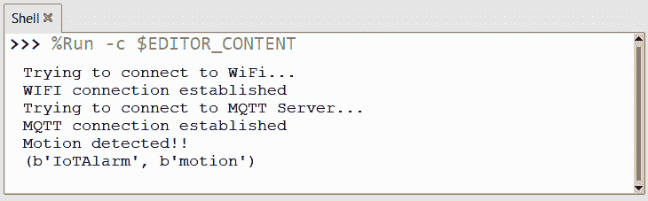

图 6.18 – 使用 PIR 传感器检测运动

1.  如果我们只收到`Motion detected!!`消息，但没有收到来自 MQTT 服务器（代理）的消息，那么我们的应用程序已经失去了与服务器的连接。这也应该通过我们的 LED 灯缓慢闪烁来指示。为了解决这个问题，我们分别使用**停止**和**运行**按钮停止并重新启动我们的程序。

1.  为了验证我们的代码正在发送 MQTT 消息，我们遵循上一节中*使用 MQTTHQ 网络客户端探索 MQTT 基础*的步骤。在订阅`IoTAlarm`主题后，网络客户端应该在我们的 PIR 传感器被触发时接收到一个`motion`消息：

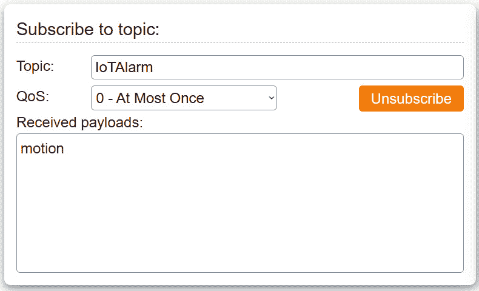

图 6.19 – 接收运动消息

1.  为了测试我们的蜂鸣器，我们使用 MQTTHQ 网络客户端发布一个`buzzer`消息：

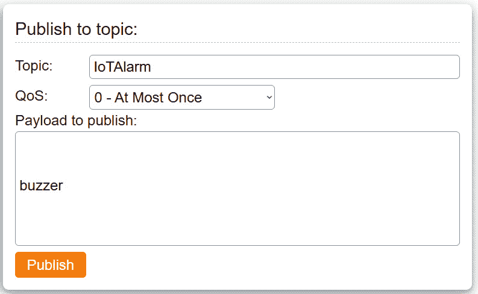

图 6.20 – 发布蜂鸣器消息

1.  点击**发布**按钮后，我们应该听到我们的警报声持续 5 秒钟。

现在我们已经创建了我们的第一个 MQTT 应用程序！我们已经从我们的 Raspberry Pi Pico W 向互联网发送了 MQTT 消息。正如我们可以想象的那样，我们应用程序的可能性是巨大的。例如，我们可以通过添加更多传感器来扩展我们的物联网警报系统，例如用于安全的门/窗户接触传感器，或用于家庭气候监测的温度和湿度传感器。在下一章中，我们将添加对警报模块的监控和远程布防，因为我们继续构建我们的物联网家庭安全系统。

为了完成我们的物联网警报模块，我们现在将我们的组件安装到一个定制的 3D 打印外壳中。

# 构建物联网警报模块外壳

如我们之前所做的那样，我们将把我们的组件安装到一个定制设计的 3D 打印外壳中。*图 6**.21*展示了我们的警报模块外壳的渲染图，该外壳设计用于容纳 PIR 传感器、蜂鸣器、带有电阻的 LED 和 Raspberry Pi Pico W。

为了紧凑性，我们选择了不带引脚的 Raspberry Pi Pico W，简化了组件安装和焊接。需要注意的是，这个选择是可选的，我们也可以使用带引脚的 Raspberry Pi Pico WH：

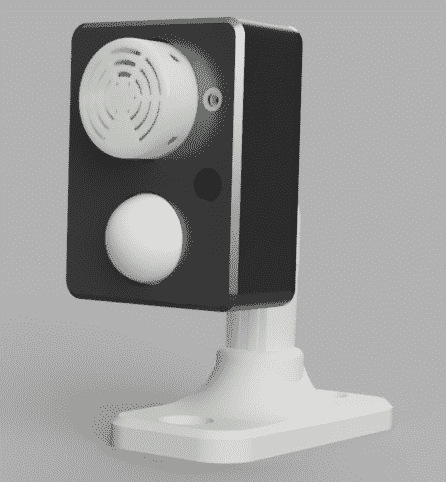

图 6.21 – 警报模块定制外壳

在我们继续构建和测试我们的物联网警报模块之前，我们将首先识别部件。

## 识别定制外壳的部件

在*图 6**.22*中，我们可以看到组装我们的物联网警报模块定制外壳所需的部件：

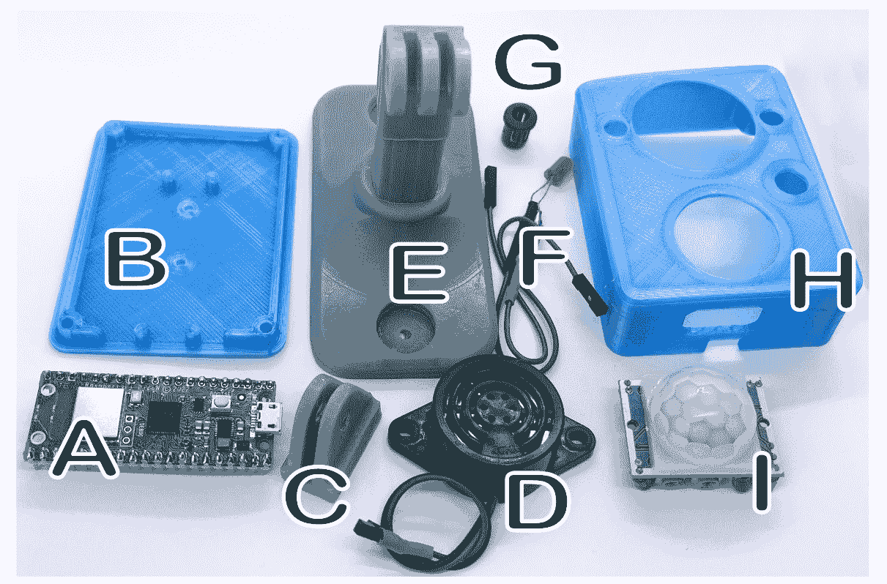

图 6.22 – 警报模块部件

让我们逐一分析每个部分：

+   **Raspberry Pi Pico W** (*A*): 带引脚版本（如上图所示），或无引脚版本（推荐）。

+   **背板** (*B*): 使用**聚乳酸** (**PLA**), **丙烯腈丁二烯苯乙烯** (**ABS**), 或**聚对苯二甲酸乙二醇酯** **Glycol** (**PETG**) 3D 打印而成。

+   **钩子** (*C*): 使用 PLA、ABS、PETG 或工程级树脂（如上图所示）3D 打印而成。对于**熔融沉积建模** (**FDM**)打印机，部件应侧向打印，并带有支撑以增强强度。

+   **SFM-27 主动蜂鸣器** (*D*): 设计用于安装此蜂鸣器的外壳。

+   **侧装支架** (*E*): 用于将报警模块安装在墙上的 3D 打印可选支架。可以使用液体树脂打印机（如图所示）打印 PLA、ABS、PETG 或工程级树脂。

使用 FDM 打印机打印分体支架

SenseHAT 外壳文件中的分体支架（`Build Files` 文件夹，*第一章* 仓库）非常适合 FDM 打印。通过分割并打印每个半部分在其侧面，支架获得了显著强度。还提供了一个配套底座。

+   **带电阻的 LED** (*F*): 请参阅 *第三章* 了解构造方法。

+   **LED 座** (*G*): 用于将 LED 固定在外壳中。

+   **前壳** (*H*): 使用 PLA、ABS 或 PETG 3D 打印。

+   **HC-SR501 PIR 传感器** (*I*): 设计用于适配此 PIR 传感器的外壳。

+   6 个 M2 5 毫米螺丝（未显示）。

+   2 个 M4 10 毫米螺栓（未显示）。

+   2 个 M4 螺母（未显示）。

+   4 个 M3 10 毫米螺栓（未显示）。

+   带胶棒的胶枪（未显示）。

什么是工程级树脂？

液体树脂 3D 打印机通过使用紫外线将液体树脂逐层固化来创建形状。标准树脂通常用于小型艺术打印，提供出色的细节，但往往会导致部件脆弱。另一方面，工程树脂（如 Siraya Tech Blu）提供优异的强度，使其适合功能性组件。图 6.22 中的部件 *C* 和 *E* 使用标准树脂和 Siraya Tech Tenacious 的 80-20 混合打印，使部件更具柔韧性并减少其脆弱性。

3D 打印部件的文件位于本章 GitHub 仓库的 `Build Files` 目录中。

既然我们已经确定了构建报警模块外壳所需的部件，让我们将其组装起来。

## 构建报警模块外壳

*图 6.23* 展示了构建物联网报警模块外壳的步骤：

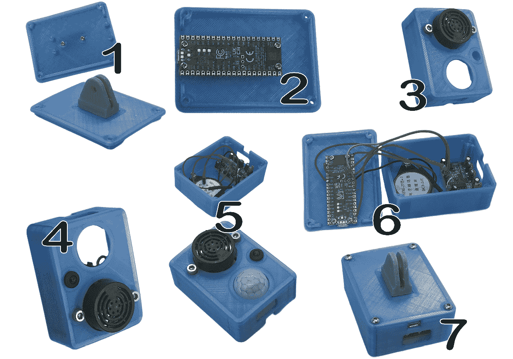

图 6.23 – 构建报警模块外壳的步骤

要构建外壳，我们执行以下操作（*图 6.23* 中表示不同组件的字母在以下步骤中分别提及各自组件的名称）：

1.  使用两个 M2 5 毫米螺丝，我们将钩子 (*C*) 螺旋到背板 (*B*) 上 (*图 6.23*，步骤 1*)。我们也可以使用环氧树脂胶水来完成这项工作。

1.  使用四个 M2 5 毫米螺丝，我们将 Raspberry Pi Pico W 固定在背板 (*B*) 上，使 USB 端口向下并朝向开口 (*图 6.23*，步骤 2*)。

1.  我们使用两个 M4 10 毫米螺栓和 M4 螺母将蜂鸣器 (*D*) 固定在前壳 (*H*) 上 (*图 6.23*，步骤 3*)。

1.  然后我们使用 LED 座 (*G*) 将带有电阻 (*F*) 的 LED 安装在前壳 (*H*) 中 (*图 6.23*，步骤 4*)。

1.  使用胶枪，我们将 PIR 传感器 (*I*) 固定在前壳 (*H*) 上。确保 PIR 控制器面向开口。我们还可以使用胶枪加强 LED 的放置 (*图 6.23*，步骤 5*)。

1.  使用电烙铁，我们根据*图 6.8*中的布线图将组件焊接到 Raspberry Pi Pico W 上（*图 6.23*，*步骤 6*）。

1.  使用四个 M3 10 毫米螺栓，我们将背板（*B*）固定到前面板（*H*）上（*图 6.23*，*步骤 7*）。

1.  如果尚未安装，我们使用 Thonny 在 Raspberry Pi Pico W 上安装 MicroPython 和我们的客户端代码。

对于我们的设计，我们使用 micro-USB 端口为我们的 Raspberry Pi Pico W 供电并访问安装的程序。这使我们能够轻松更新我们的客户端软件，例如更改 Wi-Fi 网络和密码或使用的 MQTT 主题。

此外，我们的外壳还提供了对 PIR 传感器上控制器的访问，以便我们可以控制灵敏度和关闭时间。

HC-SR501 PIR 传感器上的控制是什么？

HC-SR501 PIR 传感器配备了两个可调节的控制：灵敏度控制，通过顺时针旋转增加灵敏度以微调传感器对运动的响应，逆时针旋转则降低灵敏度；时间延迟控制，调节检测到运动后输出信号持续的时间，顺时针旋转延长信号持续时间，逆时针旋转缩短信号持续时间。这些控制并排放置，可以使用小螺丝刀进行调整。

要操作我们的物联网报警模块，我们只需将一根 micro-USB 线从我们的 Raspberry Pi Pico W 连接到标准 USB 充电器。LED 灯最初应该快速闪烁，表示正在建立 Wi-Fi 连接，然后程序连接到 MQTT 代理时，LED 灯会慢速闪烁，最后，LED 灯会保持常亮，表示我们的模块已准备好使用。如果我们决定不打印*图 6.22 E*中的支架，我们可以将我们的模块安装在我们选择的 GoPro 相机支架上：

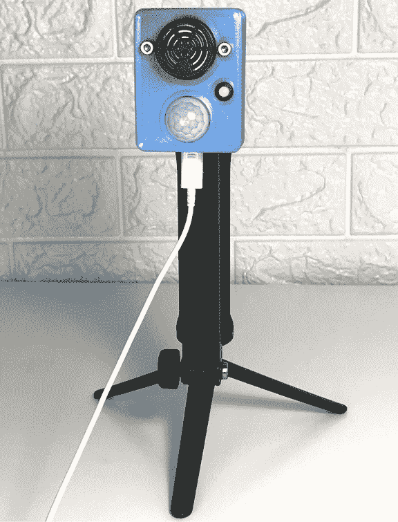

图 6.24 – 安装在 GoPro 相机支架上的报警模块

要测试我们的物联网报警模块，我们连接到`mqtthq.com`网络客户端并订阅`IoTAlarm`主题。将手放在 PIR 传感器上，我们应该在客户端看到`motion`消息出现。发布`IoTAlarm`主题并发送`buzzer`消息应该激活我们的蜂鸣器 5 秒钟。

我们刚刚构建了我们第一个基于 MQTT 的物联网报警模块，封装在一个物理外壳中，能够通过 MQTT 消息远程感应运动并激活报警。凭借其内置的 GoPro 挂钩，我们可以在任何有 Wi-Fi 连接的地方轻松安装我们的物联网报警模块。

# 摘要

在本章中，我们探讨了 MQTT 并使用它创建了一个基于 MQTT 的物联网报警模块。我们介绍了令人惊叹的 Raspberry Pi Pico W，这是一个补充我们的 Raspberry Pi 的微控制器。我们首先理解了 MQTT 的发布-订阅模型，它使得连接设备之间的高效和选择性通信成为可能。此外，我们还考察了在最大化 Raspberry Pi Pico 双核处理器利用率方面线程的重要性。

我们编写了连接到 Wi-Fi 和 MQTT 服务器的代码，处理运动检测和激活报警组件。我们学习了如何使用回调函数来处理 MQTT 消息。

此外，我们还涵盖了在 Raspberry Pi Pico W 上保存和运行我们的代码，使其成为一个独立的物联网报警系统。我们还 3D 打印了一个定制的盒子来容纳 PIR 传感器、LED 灯、蜂鸣器和 Raspberry Pi Pico W。

我们的基于 MQTT 的物联网报警模块现在已经完成，我们准备在扩展我们的物联网家庭安全系统功能的同时，探索进一步的增强。在下一章中，我们将构建一个物联网按钮，我们将使用它来控制我们的报警模块。
