# 7

# 构建物联网按钮

在本章中，我们将构建我们物联网家庭安全系统的一个基本组件：一个物联网按钮。我们将使用不同的硬件基础构建这个按钮的两个版本——M5Stack ATOM Matrix 和 Raspberry Pi Pico W。

M5Stack ATOM Matrix 是一款紧凑型 ESP32 基于的微控制器，内置点阵显示屏，也用作触摸按钮，这种设计选择显著减小了其尺寸，使其成为物联网项目的超紧凑型解决方案。我们熟悉的 Raspberry Pi Pico W 是一个受欢迎的微控制器选项，以其多功能性和与各种外部外围设备的无缝集成而著称。

在我们创建更高级的版本之前，我们将从 ATOM Matrix 开始构建一个简单的物联网按钮：

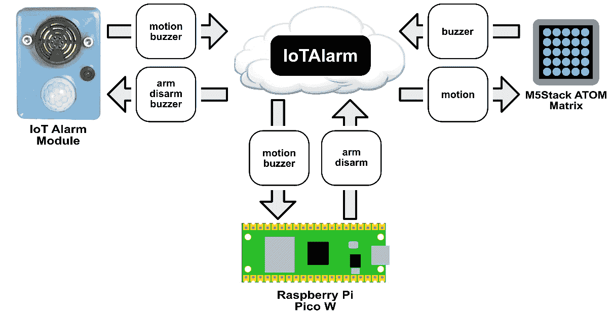

图 7.1 – 物联网按钮架构

在我们的设计中，物联网警报模块（来自*第六章*）、Raspberry Pi Pico W 和 M5Stack ATOM Matrix 都使用 `IoTAlarm` 主题进行通信，如图 7.1 中的黑色框体上的白色文字所示。在我们的图形中，我们将主题移动到云中，因为我们现在熟悉 MQTT 协议，不再需要用视觉表示它。消息以白色框体和黑色文字表示，虽然每个设备都可以通过此主题读取和发送任何消息，但它们被配置为过滤相关消息并传输特定于设备的消息。在图 7.1 中，我们看到每个设备处理的特定消息以及我们两个物联网按钮微控制器实现的复杂性差异。

我们将使用 CloudAMQP 进行 MQTT 通信，与我们的第二个物联网按钮进行通信，确保通过其可扩展的消息服务实现高效可靠的数据传输。这提高了按钮的性能和实时数据交换的可靠性。

在我们导航这些按钮的创建过程时，我们在熟悉不同硬件平台的同时，加深了对 MQTT 通信和 Python 编程的理解。通过为我们的项目使用两个不同的基础，我们为自己提供了选择最佳平台以用于即将到来的物联网应用的洞察力。

在本章中，我们将涵盖以下主要内容：

+   介绍物联网按钮

+   使用 M5Stack ATOM Matrix 创建我们的物联网按钮

+   使用 Raspberry Pi Pico W 优化我们的物联网按钮

让我们开始吧！

# 技术要求

完成本章所需的以下要求：

+   Python 编程的中级知识

+   1 个 M5Stack ATOM Matrix

+   1 个 Raspberry Pi Pico WH（带引脚）用于与面包板一起使用

+   1 个 Raspberry Pi Pico W（无引脚）将安装在一个可选的 3D 打印外壳中

+   1 个 24 毫米街机式按钮

+   1 个迷你 SPST 开关

+   1 个 0.96 英寸 OLED 屏幕

+   1 x LED 与 220 欧姆电阻连接（如前所述，在 *第三章* 中使用）

+   1 x SFM-27 主动蜂鸣器

+   12 x M2 5 毫米螺丝

+   2 x M4 20 毫米螺栓

+   2 x M4 螺母

+   4 x M3 10 毫米螺栓

+   1 x M5 25 毫米螺栓

+   1 x M5 螺母

+   1 x LED 支架

+   热胶枪

+   有 3D 打印机打印可选外壳的访问权限

本章的代码可以在以下位置找到：

[`github.com/PacktPublishing/-Internet-of-Things-Programming-Projects-2nd-Edition/tree/main/Chapter7`](https://github.com/PacktPublishing/-Internet-of-Things-Programming-Projects-2nd-Edition/tree/main/Chapter7)

# 介绍物联网按钮

在动画电影 *WALL-E*（2008 年）的结尾，麦考瑞上校与 AI 自动驾驶系统对抗，通过按下一个大蓝色按钮来重新控制 Axiom 宇宙飞船。这导致庞大的 Axiom 在返回地球时启动了超光速跳跃。在科幻小说中，单个按钮通常被视为创新的灯塔，一个强调关键时刻的戏剧性工具。在 *WALL-E* 的案例中，这个按钮超越了简单的单一动作结果，比如发出蜂鸣声，而是承载着人类未来的重量，触发了一系列行动，最终导致了人类和地球的救赎和重生。

在本章中，我们将构建自己的强大按钮，虽然它没有像 *WALL-E* 中的蓝色按钮那样的力量。然而，我们的按钮将带我们进入物联网按钮的世界，在这里，单个动作可以触发一系列自动化任务——在我们的案例中，是与我们在上一章中构建的物联网警报模块进行交互。

## 利用物联网按钮

物联网按钮在物联网领域中处于核心地位，借助互联网跨越距离，在全球范围内启动动作。考虑一下从多伦多按下按钮激活孟买机器的可能性，或者远程触发警报以帮助宿舍学生按时上课。这种全球范围将简单的按钮变成了强大的工具，使日常任务更加高效和互联。

以下是一些我们可以用物联网按钮做的事情：

+   **智能家居控制按钮**：这个按钮可以通过简单的配置命令控制各种家用电器和系统——单次或双击可以控制灯光

+   **订单按钮**：在零售环境中特别有用，这个按钮可以促进快速订购或重新订购特定产品，从而提高业务效率

+   **反馈按钮**：这些按钮可以安装在企业或服务环境中，以收集用户或客户的即时反馈，有助于保持高标准的服务

+   **会议室预订按钮**：在办公空间中，这些按钮可以帮助顺利预订会议室，防止预订冲突并提高效率

+   **智能农业**：这些按钮可以简化农业流程，例如立即灌溉农田区域或自动释放牲畜饲料

在本章中，我们将使用我们的物联网按钮与物联网报警模块进行交互。为此，我们将使用 M5Stack ATOM Matrix 构建一个简单的按钮，以及使用我们的 Raspberry Pi Pico W 构建一个更复杂的按钮。

## 探索物联网按钮开发中的各种技术

在物联网快速发展的领域中，技术的选择可以极大地影响我们创建的设备的功能性和适应性。在本章中，我们采用这种方法，因为我们使用了两个不同但有效的平台——M5Stack ATOM Matrix 和 Raspberry Pi Pico W——来构建不同复杂程度的物联网按钮。

我们从 M5Stack ATOM Matrix 开始构建我们的初始按钮。这款微控制器以其紧凑性而著称，它集成了点阵屏幕，该屏幕作为触摸按钮使用。其简单的设计不仅便于组装，还支持简单的按钮解决方案，非常适合我们的第一个物联网按钮（见*图 7.2*中的*B*）：

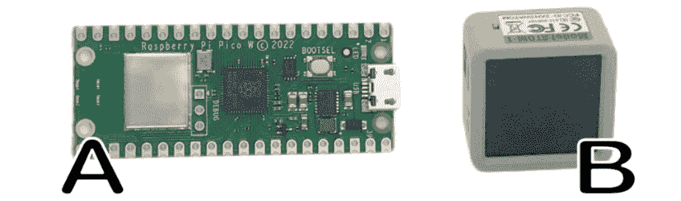

图 7.2 – Raspberry Pi Pico W 和 M5Stack ATOM Matrix

在从 ATOM Matrix 项目中学到的知识的基础上，我们接下来将利用 Raspberry Pi Pico W 的能力（见*图 7.2*中的*A*）。我们因它的多功能性和与各种外围设备的兼容性而了解这个平台。这为我们提供了更多按钮开发的定制化。Raspberry Pi Pico W 使我们能够创建一个比 M5Stack ATOM Matrix 具有更高功能性的按钮。

与两种不同的技术基础一起工作不仅拓宽了我们的理解，而且鼓励我们对物联网项目开发采取灵活的方法。这种从简单到更高级按钮的进步旨在帮助我们稳步积累知识，为我们选择未来物联网项目的正确平台提供洞察力。

让我们开始吧。

# 使用 M5Stack ATOM Matrix 创建我们的物联网按钮

在*图 7.1*中，我们展示了右侧的 ATOM Matrix，它接收一个`运动`输入消息并发出一个`蜂鸣器`输出消息。这些消息分别与物联网报警模块上的**被动红外**（**PIR**）传感器检测和蜂鸣器激活相关联。利用其集成的点阵屏幕（也用作触摸按钮），我们将使用 M5Stack ATOM Matrix 来创建我们的第一个物联网按钮。

在我们开始设置和编程 ATOM Matrix 之前，让我们花点时间熟悉 M5Stack 提供的产品系列。

## 探索 M5Stack 设备

M5Stack 以其可堆叠的开发套件而闻名，适合爱好者和专业人士。这些套件基于 ESP32 微控制器，提供了功能和可扩展性，这对于物联网、人工智能和机器人项目至关重要。M5Stack 的模块提供了易于集成的各种功能，并配备了用户友好的开发环境。

在**图 7**.3 中，我们看到了各种 M5Stack 设备的照片：

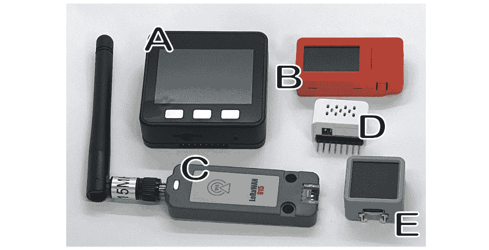

图 7.3 – M5Stack 设备

让我们看看这些设备的功能：

+   **M5Stack Basic** (*A*): M5Stack Basic 是一款适用于物联网应用的全面中央控制器，由 Espressif ESP32 芯片组供电，内置两个 Xtensa® 32 位 LX6 微处理器，峰值频率为 240 MHz。它提供了一系列丰富的开发接口，包括**模拟数字转换器** (**ADC**)、**数字模拟转换器** (**DAC**)和**集成电路间** (**I2C**)，以及 15 个输入/输出（IO）引脚。它配备了一块 2.0 英寸的 HD **平面切换** (**IPS**)显示屏，并配有扬声器和 microSD 卡槽。

+   **M5StickC PLUS** (*B*): M5StickC PLUS 由 ESP32-PICO-D4 芯片供电，内置 Wi-Fi 功能。它配备了一块大型的 1.14 英寸屏幕，分辨率为 135 x 240 px。该板集成了红外线、**实时时钟** (**RTC**)、麦克风和 LED 灯，并配备了强大的 120 mAh 电池。它支持 HAT 和 Unit 产品系列。

+   **M5Stack Unit LoRaWAN915** (*C*): M5Stack Unit LoRaWAN915 是一款专为 915 MHz 频率通信设计的**LoRaWAN**（简称**长距离广域网络**）模块，利用 ASR6501 芯片组实现长距离连接，同时保持低功耗和高灵敏度。

+   **ENV III HAT** (*D*): ENV III HAT 是一款多功能的环保传感器，兼容 M5StickC 系列，内置 SHT30 和 QMP6988 以测量温度、湿度和大气压力。

+   **ATOM Matrix** (*E*): ATOM Matrix 是 M5Stack 最紧凑的开发板，尺寸为 24*24 mm，为紧凑型嵌入式设备项目提供了广泛的 GPIO 引脚。由 ESP32-PICO-D4 芯片供电，它集成了 Wi-Fi 技术，并配备了 4 MB 的**串行外围接口** (**SPI**)闪存。该板具有一个 5*5 RGB LED 矩阵、一个红外 LED、一个可编程按钮以提供额外的输入支持，以及内置的**惯性测量单元** (**IMU**)传感器（MPU6886）。

对于我们的第一个物联网按钮，我们将使用 ATOM Matrix。虽然我们本可以选择 Basic、M5StickC PLUS 或更新的 ATOMS3（未展示），因为这些设备都提供了按钮和屏幕以供反馈，但我们选择了 ATOM Matrix，因为它提供了独特的小巧和简洁结合，非常适合这个入门级项目。此外，其集成的点阵屏幕，作为触摸按钮的双重功能，为用户提供了更直观和互动的体验。

M5Stack 提供了直观的工具来设置和编程我们的 ATOM Matrix。我们将从烧录工具开始配置我们的 Matrix。

## 将固件烧录到我们的 ATOM Matrix

M5Burner 允许我们将固件烧录到我们的 M5Stack 设备上。这个工具简化了我们的烧录过程。

要使用此工具，我们执行以下操作：

1.  我们使用此 URL 从 M5Stack 网站下载安装文件：[`docs.m5stack.com/en/download`](https://docs.m5stack.com/en/download)。

1.  对于我们的项目，我们将下载并安装烧录工具的 Windows 版本。安装完成后，我们将运行程序并点击左侧的**ATOM**标签页，我们应该看到以下屏幕：

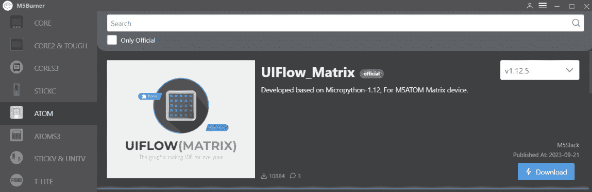

图 7.4 – M5Burner ATOM 屏幕

1.  `UIFlow_MATRIX`固件是为 ATOM Matrix 设计的，它支持拖放图形编程，这可以转换为 MicroPython。它具有内置的库，并提供无线编程的**空中传输**（**OTA**）更新。我们点击**下载**按钮将固件下载到我们的本地计算机。

1.  固件下载完成后，我们点击**烧录**按钮（以前称为**下载**按钮）开始将**UIFlow_MATRIX**固件烧录到我们的 ATOM Matrix。我们应该看到一个请求我们 Wi-Fi 信息的对话框。

1.  通过点击右上角的蓝色按钮，我们可以自动填写我们电脑的 Wi-Fi 详情或手动输入。输入后，我们点击**下一步**继续。接下来应该看到**烧录**屏幕。

1.  我们选择 ATOM Matrix 连接的端口，并点击**开始**按钮以启动固件烧录。然后，一个进度屏幕将显示烧录的当前状态。

1.  成功完成后，我们点击绿色的**烧录成功，点击此处** **返回**按钮：

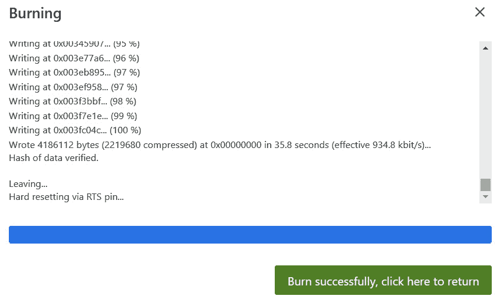

图 7.5 – 烧录成功

我们现在已成功将**UIFlow_MATRIX**固件安装到我们的 ATOM Matrix 上。我们应该注意到，我们设备上的点阵屏幕会闪烁绿色。这个固件包含专用的库，我们将使用这些库来创建我们的第一个物联网按钮。

固件安装后，现在是时候配置我们的 ATOM Matrix，以便我们可以开始编程它。

## 配置 ATOM Matrix 以进行编程

要编程我们的 ATOM Matrix，我们将使用 M5Stack 的 UIFlow，特别是它的 Python 环境。UIFlow 作为一个在线 IDE，通过 API 密钥连接到我们的设备。为了成功开发，必须检索此密钥并正确配置我们的 ATOM Matrix。

要配置我们的 ATOM Matrix，我们执行以下操作：

1.  在**M5Burner**窗口中，我们点击**ATOM**标签页。

1.  我们点击**UIFlow_Matrix**部分中的**配置**按钮：

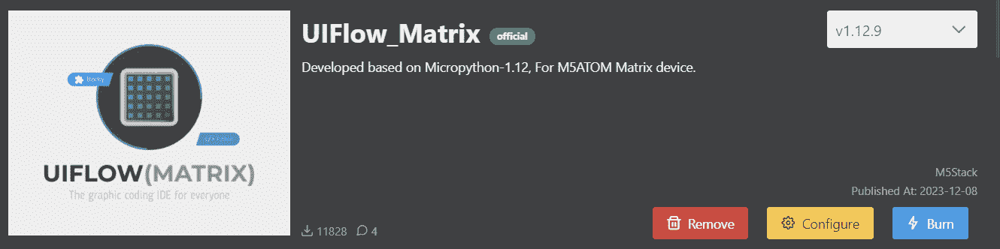

图 7.6 – UIFlow Matrix 配置按钮

1.  这应该打开 **UIFlow 配置** 对话框，并且我们的 ATOM 矩阵连接的端口应该显示出来。我们点击 **加载** 以继续到下一个屏幕。

1.  这将带我们到下一个屏幕，**UIFlow 配置**：

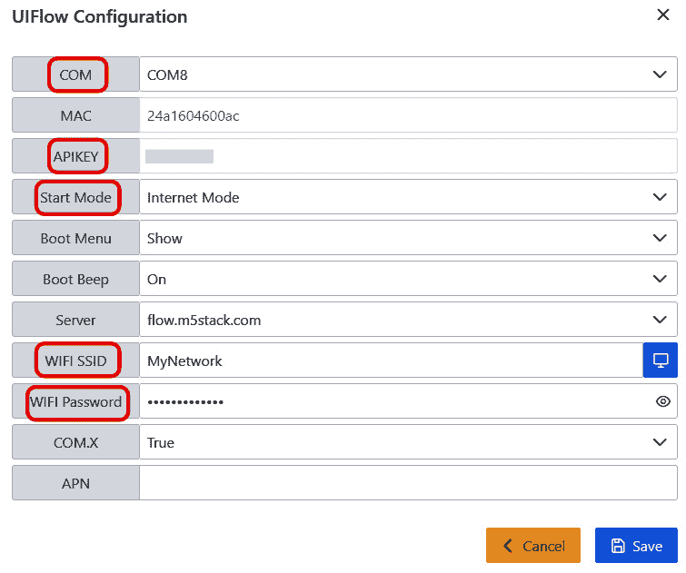

图 7.7 – 主要 UIFlow 配置屏幕

1.  使用 **图 7**.7 作为参考，我们将关注由方框突出显示的参数。从 **COM** 开始，它应该设置为我们的 ATOM 矩阵连接的端口。

1.  **APIKEY** 参数作为 UIFlow IDE 和我们的设备之间的连接桥梁。我们注意这个密钥并保持它易于访问。

1.  **启动模式** 决定了设备的启动行为。我们将其配置为 **互联网模式** 以与 UIFlow IDE 连接。在编程我们的 ATOM 矩阵后，此模式将自动切换到 **应用模式**。在此之后，要重新连接到 IDE，我们需要重新访问 **M5Burner** 并将其重置为 **互联网模式**。

1.  如果尚未设置正确的值，我们设置 **WIFI SSID** 和 **WIFI 密码** 参数。

1.  我们点击蓝色 **保存** 按钮将参数保存到我们的 ATOM 矩阵中。

在配置好我们的 ATOM 矩阵后，我们就可以开始编程并将设备变成我们的第一个功能性的 IoT 按钮。

## 将我们的 ATOM 矩阵转换为 IoT 按钮

我们将使用 M5Stack 的 UIFlow 在线 IDE 进行开发，因为它为 M5Stack 设备提供了一个直接的编码平台。我们将使用从设备配置中记录的 API 密钥来连接到 IDE。

要将 MicroPython 代码添加到我们的 ATOM 矩阵中，我们执行以下操作：

1.  在一个支持互联网的浏览器中，我们导航到以下 URL：[`flow.m5stack.com`](https://flow.m5stack.com)。

1.  我们将看到一个屏幕，可以选择 `UIFlow1.0` 或 `UIFlow2.0`。由于我们使用的是 ATOM 矩阵，我们选择 UIFlow1.0 并点击 **确认**。

1.  在 IDE 中，我们点击 **</> Python** 选项卡，这样我们就可以用 MicroPython 编程我们的 ATOM 矩阵：

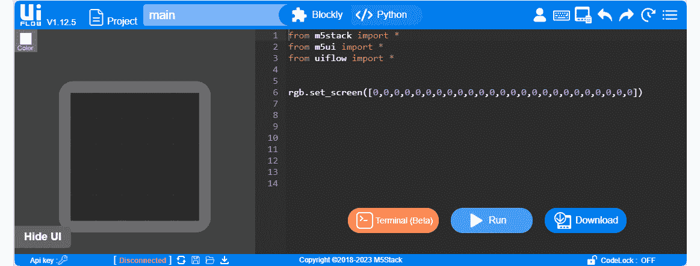

图 7.8 – UIFlow IDE

1.  要将我们的 ATOM 矩阵链接到 UIFlow，我们点击屏幕左下角的 **Api key** 标签以打开 **设置** 屏幕：

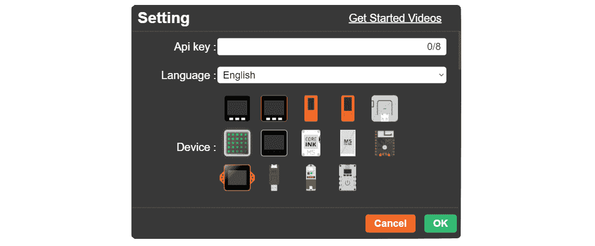

图 7.9 – 设置屏幕

1.  我们输入设备的 API 密钥并点击 **确定** 以将我们的 ATOM 矩阵连接到 UIFlow IDE。

1.  在代码编辑器中，我们用以下代码覆盖了现有的代码：

    ```py
    from m5stack import *
    from m5ui import *
    from uiflow import *
    from m5mqtt import M5mqtt
    import time
    rgb.setColorAll(0x000000)
    def cb_IoTAlarm(topic_data):
        if topic_data == 'motion':
            rgb.setColorAll(0xff0000)
            wait(5)
        rgb.setColorAll(0x00cccc)
    def buttonA_pressFor():
        m5mqtt.publish(str('IoTAlarm'), str('buzzer'), 0)
    btnA.pressFor(1, buttonA_pressFor)
    m5mqtt = M5mqtt(
        'IoTMatrix',
        'broker.mqtthq.com',
        1883,
        '',
        '',
        300
    )
    m5mqtt.subscribe(str('IoTAlarm'), cb_IoTAlarm)
    rgb.setColorAll(0x00cccc)
    m5mqtt.start()
    ```

    在将代码下载到我们的 ATOM 矩阵之前，让我们将其分解。我们首先从导入开始：

    +   `from m5stack import *`：从 M5Stack 库导入所有函数和类。

    +   `from m5ui import *`：导入所有与 UI 相关的函数和类，用于 M5Stack。

    +   `from uiflow import *`：导入所有 UIFlow 特定的函数和类。

    +   `from m5mqtt import M5mqtt`：导入 `M5mqtt` 类，允许进行 MQTT 通信。

    +   `import time`：导入标准的 Python `time`库。

1.  然后，我们使用以下命令将屏幕设置为黑色：

    ```py
    cb_IoTAlarm(topic_data). This does the following:1.  Checks if the incoming message under the `IoTAlarm` topic is `motion`.2.  If `motion` is received, the RGB LED color is set to red (`0xff0000`) for 5 seconds.3.  Afterward, the RGB LED color is reset to a cyan color (`0x00cccc`).
    ```

1.  然后，我们定义一个函数来扫描按钮`A`（屏幕）的按下，并称它为`buttonA_pressFor()`。

    在此方法中，当按钮`A`按下 1 秒钟时，我们使用`IoTAlarm`主题和`buzzer`有效负载发布一条消息。

1.  然后，我们使用给定的参数创建了一个名为`m5mqtt`的`M5mqtt`类的实例：

    +   设备名称设置为`IoTMatrix`。

    +   MQTT 代理地址设置为`broker.mqtthq.com`。

    +   MQTT 端口设置为`1883`。

    +   我们为用户名和密码提供空字符串，因为不需要它们。

    +   我们将 MQTT 保持活动时间设置为`300`秒。

1.  我们的代码随后订阅了`IoTAlarm`主题，并使用以下代码设置了回调函数：

    ```py
    m5mqtt.subscribe(str('IoTAlarm'), cb_IoTAlarm)
    ```

1.  然后，我们将 RGB LED 矩阵颜色设置为青色作为初始状态：

    ```py
    rgb.setColorAll(0x00cccc)
    ```

1.  最后一行启动 MQTT 客户端，使其能够发送和接收消息：

    ```py
    m5mqtt.start()
    ```

1.  将代码放置到位后，我们通过点击屏幕右下角的蓝色**下载**按钮将其下载到 ATOM Matrix。

在我们的 ATOM Matrix 上加载代码后，我们现在可以开始测试它。

## 测试我们的物联网按钮

在我们的初始测试中，我们将使用之前在*第六章*中介绍的 MQTTHQ 网络客户端，在测试我们的物联网按钮在物联网警报模块上之前。

要做到这一点，我们执行以下操作：

1.  在浏览器中，我们导航到以下 URL：[`mqtthq.com/client`](https://mqtthq.com/client)。

1.  在`IoTAlarm`。

1.  在`运动`消息中，点击橙色**发布**按钮。

1.  在我们的 ATOM Matrix 上，我们应该观察到我们的屏幕在 5 秒钟后变回初始颜色。

1.  在`IoTAlarm`主题中。

1.  在我们的 ATOM Matrix 上，我们按住并保持主按钮（屏幕）1 秒钟，然后释放。

1.  在`buzzer`消息中。

1.  在 MQTTHQ 测试成功完成后，我们现在可以开始测试我们在物联网警报模块上的物联网按钮。使用微型 USB 线，我们将我们在*第六章*中创建的物联网警报模块插入到 USB 电源砖中。

1.  初始化后，我们在 PIR 传感器前挥动手，观察 ATOM Matrix 上的屏幕在 5 秒钟内变为红色。

1.  按住并保持 ATOM Matrix 上的主按钮（屏幕）一秒钟，然后释放，应该会在我们的物联网警报模块上触发蜂鸣器。

祝贺我们刚刚使用 M5Stack ATOM Matrix 创建了我们的第一个物联网按钮！由于我们的物联网警报模块和物联网按钮之间的连接是通过互联网进行的，因此我们可以将这两个设备放置在世界上的任何地方，并使它们进行通信。

尽管我们的 ATOM Matrix 具有方便的形状，就像所有 M5Stack 控制器一样，但我们确实有一个定制的支架，我们可以将其安装在上面（*图 7**.10*）。3D 打印机文件位于本章 GitHub 存储库的`Build Files`文件夹中：


图 7.10 – M5Stack ATOM Matrix 底座

要使用底座，我们将 ATOM Matrix（见**图 7.10**中的**B**）放入底座的杯形部分（见**图 7.10**中的**A**），USB-C 端口朝向底座的底部。底座有一个后孔，可以容纳一个 M2 5 毫米螺丝（未显示）以固定 ATOM Matrix，它后面有一个 2 毫米的安装孔。底座设计用来容纳一个 90 度角的 USB-C 电缆或适配器。此外，它还可以覆盖一个开口以隐藏 USB-C 电缆，使其适用于天花板或架子。

在我们的第一个物联网按钮完成之后，我们现在准备构建按钮的更复杂第二个版本。

# 使用 Raspberry Pi Pico W 改进我们的物联网按钮

随着我们的物联网警报系统变得越来越复杂，公共 MQTTHQ 服务器的局限性变得越来越明显。鉴于它是一个公共平台，其可靠性可能不一致。转向一个可靠、私有的服务器将显著提高我们的开发过程和系统可靠性。

在本节中，我们将使用 Raspberry Pi Pico W、蜂鸣器、街机风格的按钮、开关、LED 和 OLED 屏幕（**图 7.11**）来构建一个改进的物联网按钮。通过迁移到使用 CloudAMQP 的私有 MQTT 服务器，我们提高了项目的可靠性和效率。

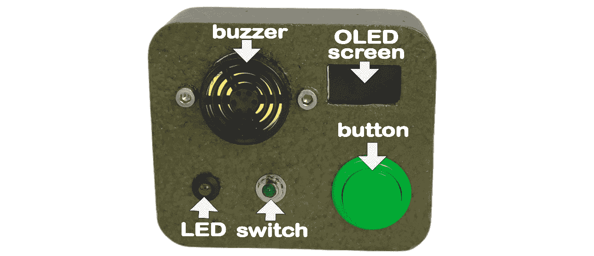

图 7.11 – 改进的物联网按钮

虽然使用私有服务器是可选的，但它相对于继续使用公共 MQTTHQ 服务器来说是一个显著的升级。本节中的代码仍然可以使用公共 MQTTHQ 服务器（需要配置更改）；然而，通过选择 CloudAMQP，我们将提高我们物联网警报系统的可靠性和安全性。

我们将首先使用 CloudAMQP 设置一个 MQTT 实例。

## 设置 CloudAMQP 实例

CloudAMQP 是一个针对物联网设备和应用程序优化的托管 MQTT 服务。它确保了具有 WebSocket 和保留消息等功能的可靠、实时消息传递。凭借其直观的界面，CloudAMQP 既适合爱好者也适合企业，是我们物联网警报系统的绝佳选择。

我们可以在此查看服务的定价 – [`www.cloudamqp.com/plans.xhtml`](https://www.cloudamqp.com/plans.xhtml)

对于我们的需求，免费的**小狐猴**服务就足够了。在设置账户后，我们创建一个实例用于我们的项目。为此，我们执行以下操作：

1.  登录我们的账户将显示**实例**页面。要创建一个新的实例，我们点击绿色的**创建新实例**按钮。

1.  这将带我们到`IoTProgrammingProjects`，将我们的计划设置为`Little Lemur`，并留空**标签**字段。我们点击绿色的**选择区域**按钮进入下一屏幕。

1.  这将带我们到**AWS**下的`CA-Central Canada-1(Canada)`。我们点击绿色的**审查**按钮进入下一屏幕。

1.  在**确认新实例**界面，我们审查我们的实例设置。

1.  要创建我们的实例`IoTProgrammingProjects`，我们点击绿色的**创建** **实例**按钮。

1.  要获取更多关于我们实例的详细信息，我们点击`IoTAlarmSystem`链接。

1.  点击链接提供了我们的实例详情，我们将使用这些详情将我们的应用程序连接到 MQTT 服务器：

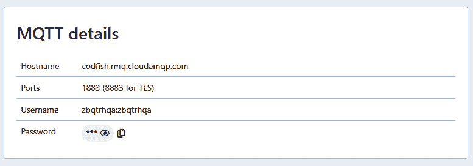

图 7.12 – MQTT 连接详情

在创建我们的实例并获取详细信息后，我们现在可以更新警报模块代码，从*第六章*更新到与新的 MQTT 服务器集成并增强其功能。

## 修改我们的警报模块代码

我们将修改*第六章*中的代码，以便我们的警报模块与更先进的第二个物联网按钮一起工作。我们的修订代码从公共 MQTTHQ 服务器转移到更可靠的 CloudAMQP 私有服务器。

为了支持这一点，我们的新代码添加了`USERNAME`、`MQTT_PASSWORD`和`DEVICE_ID`认证参数，以增强安全性。另一个重大更新是`ARMED`模式，它允许我们通过 MQTT 激活或解除系统。当检测到运动时，修改后的`motion_handler()`函数会考虑`ARMED`状态，发出蜂鸣声。

最后，我们的修订代码改变了 LED 反馈系统。除了显示 Wi-Fi 和 MQTT 连接状态外，LED 还会通过非常缓慢的闪烁来指示警报是否被激活。

我们物联网警报模块代码的新版本可以在本章 GitHub 仓库的`CloudAMQP`文件夹中找到。要将代码安装到物联网警报模块，我们遵循*第六章*中概述的步骤。

## 构建我们的 Raspberry Pi Pico W 物联网按钮

第二个物联网按钮在硬件和软件方面都有显著的进步，因为我们使用了 Raspberry Pi Pico W。Raspberry Pi Pico W 和 M5Stack ATOM Matrix ESP32 都作为令人印象深刻的微控制器脱颖而出。Pico W 因其双核 ARM Cortex-M0+处理器和 Wi-Fi 功能而引人注目，而 ATOM Matrix 则通过其 ESP32 芯片带来了 Wi-Fi 和蓝牙。然而，考虑到我们的第二个物联网按钮项目更重视计算能力和 Wi-Fi，我们将选择 Raspberry Pi Pico W。

添加 OLED 屏幕为我们提供了警报的状态，同时也充当了我们的 MQTT 消息的监控器。从公共 MQTTHQ 服务器切换到 CloudAMQP 的私有服务器在软件上提高了可靠性和安全性。这一举措降低了与公共服务器相关的风险。

### 查看我们的 Pico W 物联网按钮的组件

对于我们物联网按钮的第二版，我们将使用街机风格的按钮来发送消息以启动警报模块。OLED 屏幕将显示从物联网警报模块发送回来的 MQTT 消息。从物联网警报模块发送的 `buzzer` 消息将在构成物联网按钮第二版组装的活性蜂鸣器上启动旋律。要解除警报模块的警报，我们只需将开关从当前位置切换即可。

在 *图 7*.13 中，我们看到组成我们的 Raspberry Pi Pico W 物联网按钮的组件：

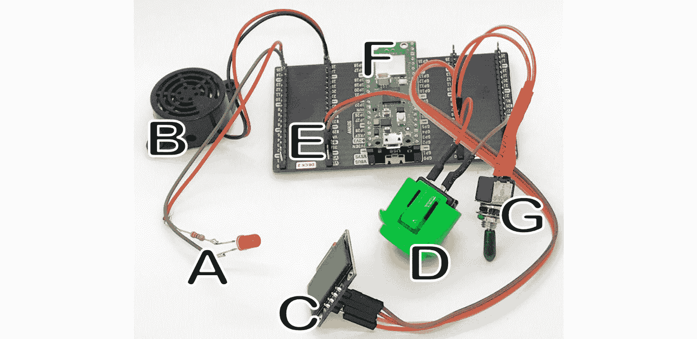

图 7.13 – 物联网按钮 V2 电路连接到 Pico GPIO 扩展器

以下是组件：

+   *A*：220 欧姆电阻的单色 LED

+   *B*：SM-127 活性蜂鸣器

+   *C*：0.96 英寸 OLED 屏幕

+   *D*：24 毫米街机按钮

+   *E*：Raspberry Pi Pico 的 GPIO 扩展板（可选）

+   *F*：用于开发用途的 Raspberry Pi Pico WH

+   *G*：单刀单掷开关

对于开发，我们将使用 Raspberry Pi Pico WH，但在安装到定制外壳时将切换到无头版本。

使用 GPIO 扩展器

GPIO 扩展器的使用（见 *图 7*.13 中的 *E*）是可选的。要使用扩展器，需要女性跳线连接。使用 GPIO 扩展器的好处是，由于其女性跳线连接，可以轻松地将组件过渡到未来项目中使用 Pico WH 的安装。

我们将通过检查标准面包板上的接线图来开始构建 Raspberry Pi Pico W 物联网按钮。

### 连接我们的 Raspberry Pi Pico W 物联网按钮

在 *图 7*.14 中，我们可以看到 Raspberry Pi Pico W 物联网按钮的接线图。我们将使用标准微型 USB 线连接到 Pico WH 的 USB 端口以供电。Pico W 的 3.3 V 引脚用于为面包板的轨道供电：

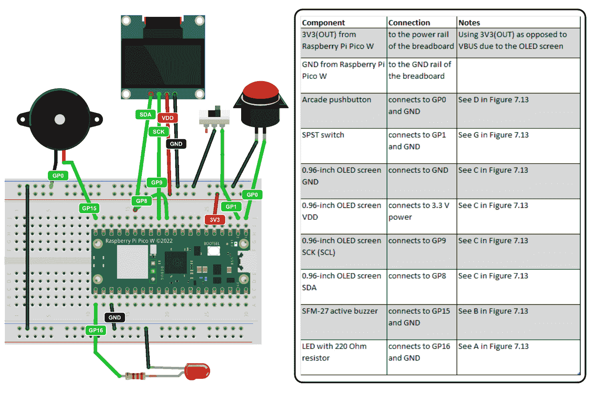

图 7.14 – Raspberry Pi Pico W 物联网按钮接线图

现在我们已经设置好接线，我们将进入编码阶段。我们将首先加载我们代码所需的必要软件包。

### 设置程序所需的软件包

运行我们 Raspberry Pi Pico W 物联网按钮代码所需的软件包是 `micropython-umqtt.simple` 软件包和 `micropython-ssd1306` 软件包。要将软件包加载到我们的 Raspberry Pi Pico W 上，我们执行以下操作：

1.  使用 Thonny IDE，我们点击 **工具** | **管理软件包**。

1.  在搜索框中，我们输入我们想要搜索的软件包名称，然后点击 **在 PyPI 上搜索** 按钮。

1.  然后我们通过点击 **安装** 按钮来安装软件包。

如果加载软件包时出现错误，该怎么办？

在加载包时出现错误的情况下，我们可能只需将 GitHub 仓库中的`library`文件夹复制到我们的 Pico W 中。该文件夹可以在此章节的仓库中找到，位于`Second IoT Button/library-files-from-pico-w`。参见*图 7.15*以了解 Raspberry Pi Pico W 的文件结构。

1.  在继续编写代码之前，我们应该验证我们的 Pico W 上的文件结构如下：

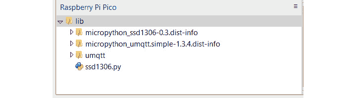

图 7.15 – Raspberry Pi Pico W 库结构

在安装了我们的包之后，现在是时候编写我们的代码了。我们将从控制蜂鸣器的代码开始，因为这将包含在主代码之外的一个单独的文件中。

### 激活蜂鸣器

在*图 7.1*中，我们看到来自物联网警报模块的`buzzer`消息。在我们重写的物联网警报模块代码中，当警报被激活并且 PIR 传感器检测到运动时，会发送一个`buzzer`消息。我们将在我们的 Raspberry Pi Pico W 物联网按钮中使用此消息来激活其警报，尽管我们将使用它通过其扬声器播放旋律。像物联网警报模块代码一样，我们将使用单独的文件来激活蜂鸣器。

要做到这一点，我们执行以下操作：

1.  我们将 Raspberry Pi Pico W 连接到 USB 端口并启动 Thonny。我们可以使用 Raspberry Pi 或另一个操作系统来做这件事。

1.  然后，我们通过从屏幕的右下角选择它来激活 Pico W 上的 MicroPython 环境。

1.  在一个新标签中，我们输入以下代码：

    ```py
    from machine import Pin, PWM
    import utime
    BUZZER_PIN = 16
    buzzer = PWM(Pin(BUZZER_PIN))
    def play_notes(
        notes = [
            (330, 0.5),  # E4 for 0.5 seconds
            (262, 0.5),  # C4 for 0.5 seconds
            (330, 0.5),  # E4 for 0.5 seconds
            (392, 0.5),  # G4 for 0.5 seconds
            (349, 0.5),  # F4 for 0.5 seconds
            (262, 1),  # C4 for 0.5 seconds
        ]
        ):
        for freq, duration in notes:
            buzzer.freq(freq)
            buzzer.duty_u16(32768)
            utime.sleep(duration)
        buzzer.duty_u16(0)
    ```

    在我们测试代码之前，让我们将其分解：

    1.  我们首先从`machine`模块导入`Pin`和`PWM`，以及`utime`模块。

    1.  我们将`BUZZER_PIN`常量设置为引脚号`16`，这对应于我们的布线图（*图 7.14*）。

    1.  然后，我们使用定义的引脚通过`PWM`类初始化`buzzer`。

    1.  我们的`play_notes()`函数有一个默认参数`notes`，它是一个元组列表。每个元组代表赫兹频率（例如`E4`、`C4`等）和持续时间（以秒为单位）。

    1.  对于`notes`列表中的每个频率-持续时间对，我们执行以下操作：

        1.  我们将蜂鸣器的频率设置为指定的频率。

        1.  我们以 50%的占空比（`duty_u16(32768)`）激活蜂鸣器。这产生一个方波，定义了蜂鸣器发出的声音的特性。

        1.  我们使用`utime.sleep(duration)`等待指定的时间。

    1.  在播放所有音符后，我们将蜂鸣器关闭（通过将其占空比设置为 0）。

1.  要保存文件，我们点击`buzzer.py`到我们的 Raspberry Pi Pico W。

1.  为了测试我们的代码，我们使用新蜂鸣器脚本中的`play_notes()`函数：

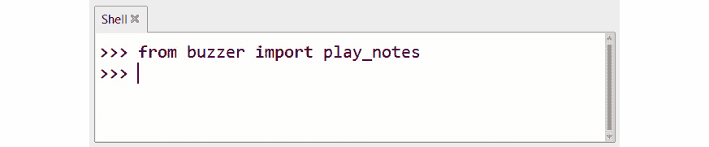

图 7.16 – 导入 play_notes()函数

1.  要激活我们的蜂鸣器，我们只需调用该函数并按*Enter*键：

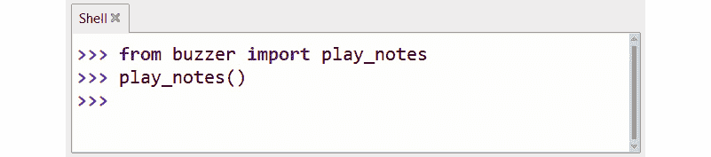

图 7.17 – 运行 play_notes() 函数

1.  我们应该听到蜂鸣器播放其默认旋律。为了进一步测试我们的函数，让我们向其发送 `[(262, 1),(330, 2),(392, 0.5),(262, 1)]` 音符：

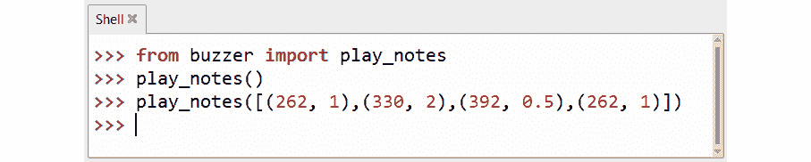

图 7.18 – 使用 play_notes() 函数播放新旋律

1.  我们应该注意到蜂鸣器播放了不同的旋律。

在我们的蜂鸣器代码就绪后，现在是时候专注于为主板供电的 Raspberry Pi Pico W IoT 按钮编写主要代码了。

### 编写我们 IoT 按钮的主要功能代码

在完成蜂鸣器脚本后，我们准备好开发增强型 IoT 按钮的主要代码。这个新版本可以启动 IoT 报警模块，并具有显示屏。屏幕指示报警模块的状态（要么是已启动，要么是解除），并显示来自 CloudAMQP 服务器的最新 MQTT 消息。

当 IoT 报警模块触发时，我们的 IoT 按钮的蜂鸣器提供可听反馈。它在接收到 `buzzer` 消息时激活。我们使用 IoT 按钮组件上的开关作为切换，以解除 IoT 报警模块的警报。

要为我们的增强型 IoT 按钮创建代码，我们执行以下操作：

1.  我们将 Raspberry Pi Pico W 连接到 USB 端口并启动 Thonny。我们可以使用 Raspberry Pi 或其他操作系统来完成此操作。

1.  然后，我们在屏幕的右下角选择 MicroPython 环境以激活 Pico W。

1.  我们将从导入开始。在新标签页中，我们输入以下代码：

    ```py
    from machine import Pin, I2C
    import utime
    import network
    from umqtt.simple import MQTTClient
    from buzzer import play_notes
    import ssd1306
    import _thread
    ```

1.  我们定义变量，其值来自我们的 CloudAMQP 账户（*图 7**.12*）：

    ```py
    SSID = "MyWiFiNetwork"
    WIFI_PASSWORD = "xxxxxxxxxxxxx"
    led = machine.Pin(15, machine.Pin.OUT)
    button = Pin(0, Pin.IN, Pin.PULL_UP)
    switch = Pin(1, Pin.IN, Pin.PULL_UP)
    previous_switch_state = switch.value()
    MQTT_SERVER = "codfish.rmq.cloudamqp.com"
    MQTT_PORT = 1883
    USERNAME = "xxxxxx"
    PASSWORD = "xxxxxx"
    DEVICE_ID = "IoTAlarmSystem"
    last_message = ""
    i2c = I2C(0, scl=Pin(9), sda=Pin(8))
    display = ssd1306.SSD1306_I2C(128, 64, i2c)
    mqtt_client = None
    ```

1.  `on_message_received()` 方法作为我们的 MQTT 客户端的回调。通过使用 `global` 关键字与 `last_message`，我们确保此变量的更新在代码的全球范围内反映：

    ```py
    def on_message_received(topic, msg):
        global last_message
        print("Received:", topic, msg)
        if topic == b"IoTAlarm":
            last_message = msg.decode()
            if msg == b"buzzer":
                play_notes()
    ```

1.  `connect_wifi()` 函数初始化并激活 Pico W 的 Wi-Fi。如果未连接，它尝试使用预定义的 SSID 和密码加入网络。同时，LED 闪烁以指示连接过程。成功连接后，LED 保持点亮，并显示设备的 IP 地址：

    ```py
    def connect_wifi():
        wlan = network.WLAN(network.STA_IF)
        wlan.active(True)
        if not wlan.isconnected():
            print('Connecting to WiFi...')
            wlan.connect(SSID, WIFI_PASSWORD)
            while not wlan.isconnected():
                led.on()
                utime.sleep(0.5)
                led.off()
                utime.sleep(0.5)
            led.on()
            print('WiFi connected, IP:', wlan.ifconfig()[0])
    ```

1.  `connect_mqtt()` 函数尝试使用预定义的服务器详情建立 MQTT 连接。如果成功，它设置消息回调并订阅 `IoTAlarm` 主题。如果连接失败，函数将等待 5 秒并重试：

    ```py
    def connect_mqtt():
        global mqtt_client
        while mqtt_client is None:
            try:
                print('Trying to connect to MQTT Server...')
                mqtt_client = MQTTClient(
                    DEVICE_ID, MQTT_SERVER, MQTT_PORT,
                    USERNAME, PASSWORD
                )
                mqtt_client.set_callback(
                              on_message_received)
                mqtt_client.connect()
                mqtt_client.subscribe(b"IoTAlarm")
                print('MQTT connection established and subscribed to IoTAlarm')
            except:
                mqtt_client = None
                print('Failed to connect, retrying...')
                utime.sleep(5)
    ```

1.  `display_status()` 函数每 5 秒更新一次显示。它显示 MQTT 连接状态在顶部，`arm`/`disarm` 状态在中间，以及底部接收到的最新 MQTT 消息。如果连接到 MQTT，则显示 `MQTT 已连接`；否则，显示 `MQTT 等待连接`。我们在代码中单独的线程中运行此方法：

    ```py
    def display_status():
        global last_message
        is_armed = False
        while True:
            display.fill(0)
            if mqtt_client:
                msg = "MQTT Connected"
            else:
                msg = "MQTT waiting"
            display.text(msg, 0, 0)
            if last_message == "arm":
                is_armed = True
            elif last_message == "disarm":
                is_armed = False
            if is_armed:
                display.text("Status: Armed", 0, 20)
            else:
                display.text("Status: Disarmed", 0, 20)
            display.text("Msg: " + last_message, 0, 40)
            display.show()
            utime.sleep(5)
    ```

1.  `main()` 函数启动 Wi-Fi 和 MQTT 连接，并持续检查按钮和开关状态。如果按钮被按下超过一秒钟，将通过 MQTT 发布 `启动` 消息。如果开关状态发生变化，则发送 `解除警报` 消息。该函数还会检查传入的 MQTT 消息。如果在检查消息时发生错误，则打印错误，系统等待 5 秒后继续检查。系统在循环迭代之间等待 0.1 秒以优化性能。我们首先定义 `main()` 函数和变量：

    ```py
    def main():
        global last_message, previous_switch_state
        connect_wifi()
        connect_mqtt()
        button_start_time = None
    ```

1.  然后，我们定义一个无限循环并检查主按钮是否被按下超过一秒钟（`1000` 毫秒）或更长时间：

    ```py
        while True:
            if button.value() == 0:
                if button_start_time is None:
                    button_start_time = utime.ticks_ms()
            else:
                if button_start_time is not None:
                    button_elapsed_time = utime.ticks_diff(utime.ticks_ms(), button_start_time)
                    if button_elapsed_time >= 1000:
                        mqtt_client.publish(
                            b"IoTAlarm",
                            b"arm"
                        )
                        last_message = "arm"
                    button_start_time = None
            current_switch_state = switch.value()
    ```

1.  如果当前开关状态不等于上一个开关状态，我们的代码会发送一个 `解除警报` 消息。这种条件检查使我们能够将开关用作切换，而不是定义一个明确的开启或关闭状态：

    ```py
    if current_switch_state != previous_switch_state:
                mqtt_client.publish(
                    b"IoTAlarm",
                    b"disarm"
                )
                last_message = "disarm"
            previous_switch_state = current_switch_state
            try:
                mqtt_client.check_msg()
            except Exception as e:
                print("Error checking MQTT message:", str(e))
                utime.sleep(5)
            utime.sleep(0.1)
    ```

1.  然后，我们初始化一个新的线程来并发运行 `display_status()` 函数。通过使用线程，它允许 `display_status()` 函数独立且同时与其他程序部分一起操作，确保显示状态持续更新，而不会阻碍或等待其他进程：

    ```py
    _thread.start_new_thread(display_status, ())
    ```

1.  最后，我们调用 `main()` 函数，该函数指导程序的核心活动——处理连接、按钮输入和管理 MQTT 消息：

    ```py
    main()
    ```

1.  要保存文件，我们点击 `main.py` 到我们的 Raspberry Pi Pico W。

主代码编写完成后，是时候对其进行测试了。

### 运行增强的物联网按钮

在我们的 Raspberry Pi Pico W 物联网按钮应用程序上执行代码允许它与物联网警报模块交互。按钮可以启动或解除警报模块。我们将使用 Windows 中的 **MQTT 探索器** 应用程序来监控实时 MQTT 消息，以及发送消息来测试我们的增强型物联网按钮。

我们将首先从 MQTT 探索器应用程序发送消息。为此，我们执行以下操作：

1.  在 Windows 的 Microsoft Store 中，我们搜索 MQTT 探索器应用：

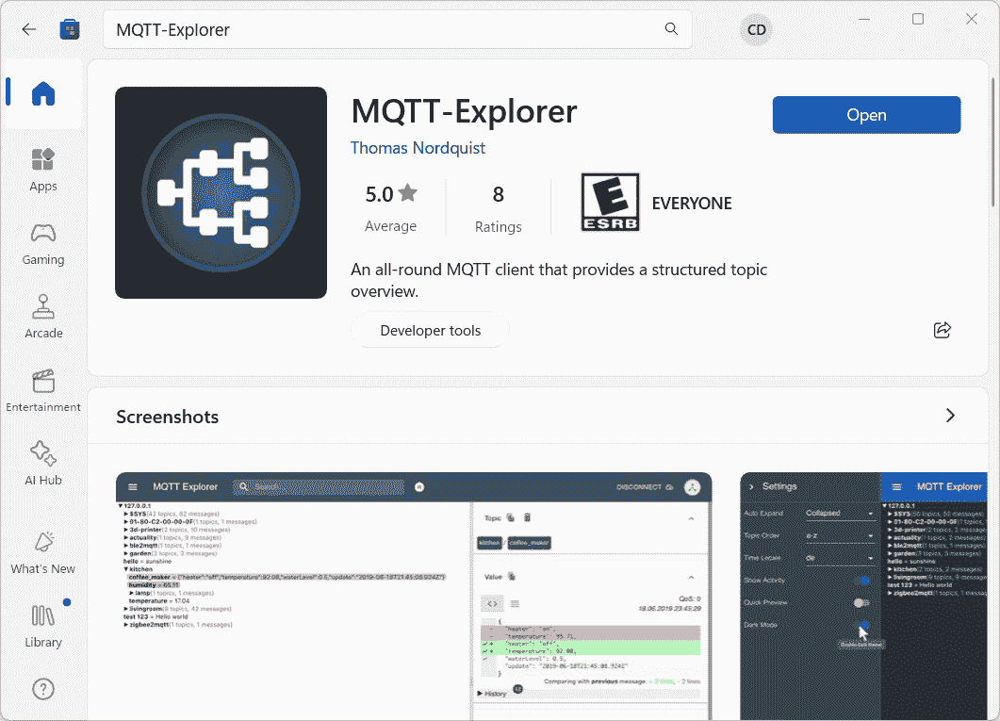

图 7.19 – Microsoft Store 中的 MQTT 探索器

1.  我们通过在 Thonny 中点击 **运行** 按钮或将我们的 Pico W 插入 USB 电源供应来在我们的 Raspberry Pi Pico W 物联网按钮应用程序上运行 `main.py`。

1.  使用 MQTT 探索器，我们创建了一个名为 `IoTAlarmSystem` 的连接，该连接使用来自 *图 7.12* 的 MQTT 服务器凭据：

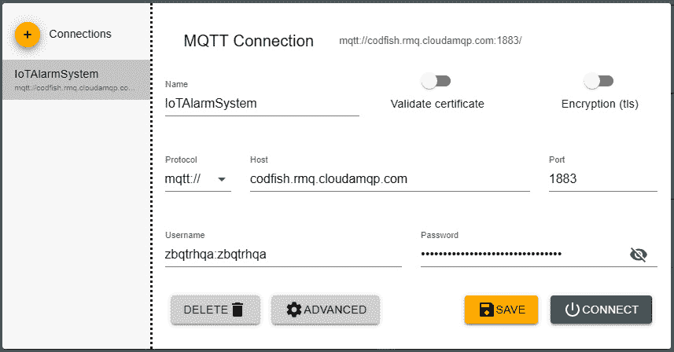

图 7.20 – 使用 MQTT 探索器创建 MQTT 连接

1.  使用 MQTT 探索器发送消息时，我们在主题中输入 `IoTAlarm`，在消息中输入 `test`，然后点击 **发布** 按钮：

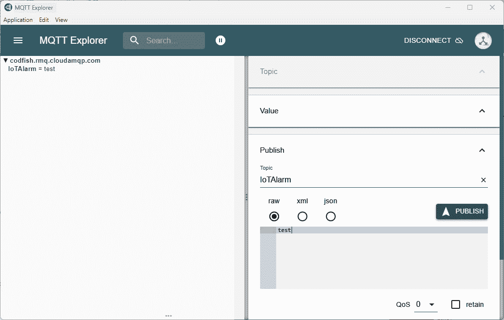

图 7.21 – 发送 MQTT 消息

1.  我们应该观察到一条 `test` 消息出现在我们的物联网按钮电路的 OLED 屏幕上。

1.  然后，我们按下并保持物联网按钮电路上的街机按钮超过一秒钟。

1.  我们应该在 MQTT 探索器应用程序上观察到 `arm` 消息。

1.  我们还应该注意到 IoT 警报模块上的 LED 每 5 秒闪烁一次。这表明 IoT 警报模块已武装。

1.  我们通过在 PIR 传感器前挥动手来测试 IoT 警报模块。我们应该观察到警报响起。

1.  我们应该注意到，经过一段时间后，增强型 IoT 按钮电路上的警报会关闭。

1.  要解除警报，我们将开关从当前位置切换。这应该导致当 PIR 传感器检测到运动时，蜂鸣器关闭。这也应该禁用增强型 IoT 按钮上的蜂鸣器。

我们应该为自己鼓掌，因为我们已经成功构建了一个基本的 IoT 警报系统！在本章的最后部分，我们将把组件安装到定制的 3D 打印外壳中。

## 在定制外壳中安装组件

布线我们的组件和运行我们的代码是一个令人兴奋的步骤。然而，将它们装入定制外壳可以使我们的项目提升一个层次，并允许我们为实际用途使用我们的应用程序。定制外壳不仅提供保护，而且具有安装我们的高级 IoT 按钮在任何所需位置的灵活性。

在 *图 7**.22* 中，我们查看我们定制外壳的组件，全部为 3D 打印。部件 *A* 和 *B* 使用 **Fused Deposition Modeling** (**FDM**) 打印机生产，而 *C* 和 *D* 使用液体树脂打印机。虽然任何打印机类型都适用，但 FDM 打印需要在打印床上仔细定位部件以考虑层线强度：

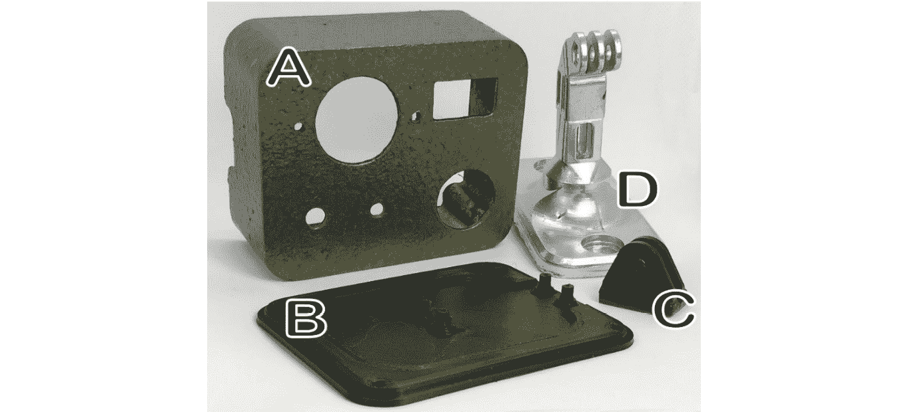

图 7.22 – 增强型 IoT 按钮的定制外壳

我们定制外壳的部件如下分解：

+   *A*: 外壳

+   *B*: 后盖

+   *C*: 插件

+   *D*: 壁侧安装支架

所有部件都可以在本章 GitHub 存储库的 `Build Files` 文件夹的 `Pico Button` 子文件夹中找到。安装螺丝和 LED 座未显示。

使用 FDM 打印机打印分割支架

SenseHAT 外壳文件中的分割支架（`Build Files` 文件夹，*第一章* 存储库）非常适合 FDM 打印。通过分割并打印每个半边，支架获得了显著强度。还提供了一个配套底座。

要将组件安装到我们的定制外壳中，我们遵循 *图 7**.23* 中的步骤：

1.  我们首先使用两个 M5 10 毫米螺栓和两个 M5 螺母（见 *B* 在 *图 7**.13* 中）将蜂鸣器（见 *A* 在 *图 7**.22* 中）安装到外壳上。

1.  然后（*图 7**.23*，*步骤 2*），我们将开关（*图 7**.13*，*G*）和街机按钮（见 *D* 在 *图 7**.13* 中）安装到外壳中相应的孔中（见 *A* 在 *图 7**.22* 中）：

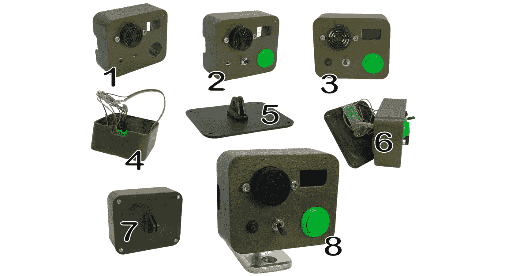

图 7.23 – 构建增强型 IoT 按钮的外壳

1.  使用 LED 支架，我们将 220 欧姆电阻的 LED（见*图 7**.13*中的*A*）安装到外壳中（见*图 7**.22*中的*A*），使用左侧孔（见*图 7**.23*，*步骤 3*）。

1.  我们使用 4 个 M2 5 毫米螺丝或热胶枪的胶水（见*图 7**.23*，*步骤 4*）将 OLED 屏幕（见*图 7**.13*中的*C*）固定到外壳（见*图 7**.22*中的*A*）。

1.  然后（见*图 7**.23*，*步骤 4*），我们将组件连接到新的树莓派 Pico W。

1.  我们随后使用两个 M2 5 毫米螺丝将钩子（见*图 7**.22*中的*C*）安装到背板上（见*图 7**.22*中的*B*）（见*图 7**.23*，*步骤 5*）。

1.  我们使用四个 M2 5 毫米螺丝（见*图 7**.23*，*步骤 6*）将 Pico W 固定在背板上（见*图 7**.22*中的*B*）。

1.  然后（见*图 7**.23*，*步骤 7*），我们使用四个 M3 10 毫米螺栓将背板（见*图 7**.22*中的*B*）固定到外壳（见*图 7**.13*中的*A*）。

1.  在将背板（见*图 7**.22*中的*B*）固定到外壳（见*图 7**.22*中的*A*）后，我们使用 M5 20 毫米螺栓和 M5 螺母将组件连接到安装支架（见*图 7**.22*中的*D*）。

1.  使用“为我们的物联网按钮编码主要功能”部分的步骤，我们安装了我们的增强型物联网按钮的软件包和客户端代码。

在组件安全安装后，我们现在可以将我们的树莓派 Pico W 物联网按钮放置在任何希望的位置，无论是家庭、办公室还是车间环境。我们的设计不仅服务于我们的主要警报系统目的，而且使其适用于多种其他应用，扩大其用途，并在许多不同场景中提供创新的集成潜力。

# 摘要

在本章中，我们探讨了物联网按钮，从描述它们是什么以及它们在哪里使用开始。然后，我们探讨了我们可以用来构建物联网按钮的各种技术。

我们随后开始使用公共 MQTT 服务和 M5Stack ATOM Matrix 构建我们的第一个物联网按钮。我们能够将我们的物联网按钮连接到我们在*第六章*中构建的物联网警报模块。

从那里，我们使用 CloudAMQP 将我们的 MQTT 服务器升级为私有服务器。我们这样做是为了可靠性和安全性的原因，因为我们开始构建我们的物联网警报系统。在用树莓派 Pico W 和各种组件构建第二个物联网按钮之前，我们升级了物联网警报模块上的代码。

我们通过将我们的第二个（增强型）物联网按钮的组件安装到 3D 打印的盒子里来结束本章。这样做将我们的电路从教育工具转变为适合在商业环境中部署的工作设备。

在下一章中，我们将继续构建我们的物联网警报系统，回到树莓派，在那里我们将构建一个安全仪表板。
