# 8

# 创建物联网警报仪表板

在当今数字化时代，物联网已经革命性地改变了安全，将基本的警报仪表板转变为全面、实时的安全监控器。在*第六章*中，我们通过构建一个能够检测运动并中继 MQTT 消息的物联网警报模块开始了构建物联网警报系统的过程。*第七章*介绍了两种版本的物联网按钮：第一个使用 M5Stack ATOM Matrix 和 LCD 矩阵屏幕，第二个集成了 OLED 屏幕、蜂鸣器、用于启动我们的物联网警报模块的街机式按钮以及用于解除的切换开关：  

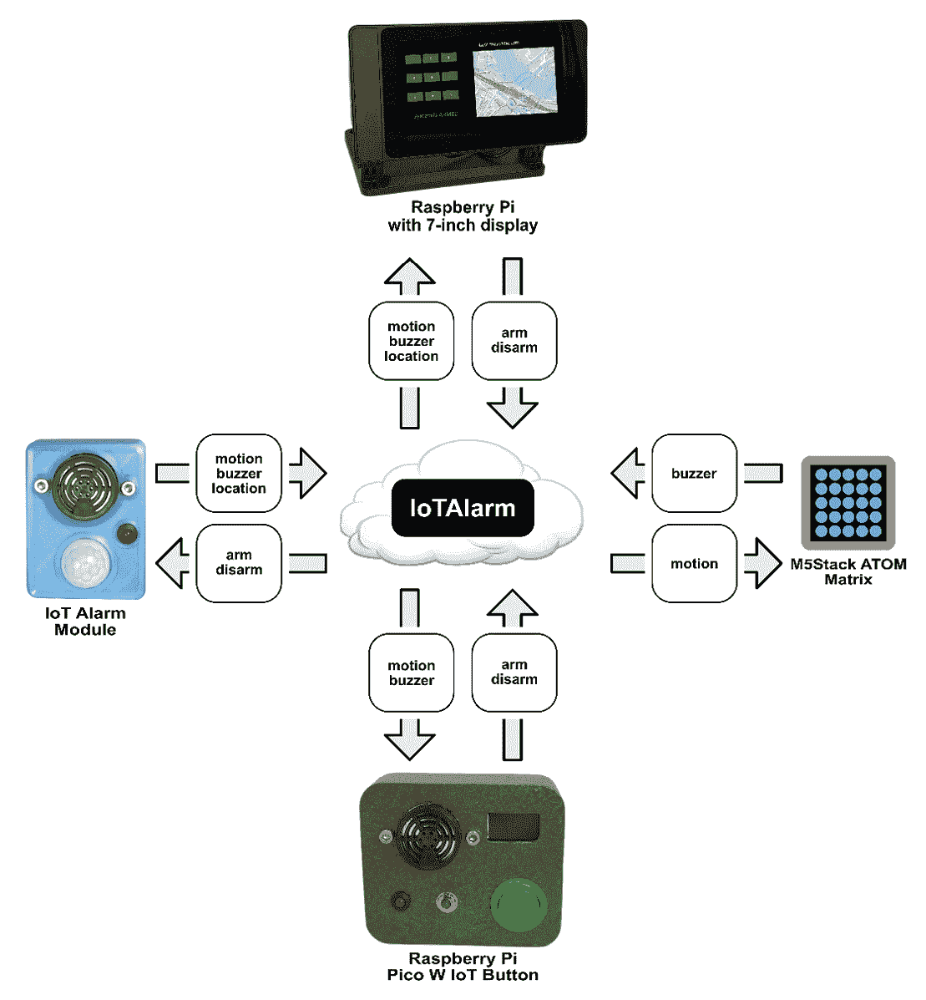

图 8.1 – 物联网警报系统

在本章中，我们将使用带有 7 英寸触摸屏的 Raspberry Pi 5 作为我们的物联网警报仪表板（*图 8**.1*）。这个仪表板将允许我们启动和解除我们的物联网警报模块，查看最新的 MQTT 通知，并观察一个标记我们警报激活位置的地图。它将订阅并发布到与其他物联网警报系统设备相同的 MQTT 主题，即物联网警报模块、M5Stack ATOM Matrix 物联网按钮和 Raspberry Pi Pico W 物联网按钮。

物联网警报仪表板完成了我们的高级物联网警报系统。我们的系统利用物联网技术和互联网的广泛覆盖范围进行全球应用部署。

在本章中，我们将涵盖以下主题：

+   探索物联网警报仪表板

+   创建 Raspberry Pi 5 物联网警报仪表板

+   构建外部警报蜂鸣器支架

+   运行我们的应用程序

让我们开始吧！

# 技术要求

完成本章所需的以下要求：

+   具备 Python 编程的中级知识

+   一款新型 Raspberry Pi，例如 Raspberry Pi 5

+   带有兼容机箱的 Raspberry Pi 品牌 7 英寸触摸屏

+   1 个 SFM-27 主动蜂鸣器

+   2 个 M2 5mm 螺丝

+   2 个 M4 20mm 螺栓

+   2 个 M4 螺母

+   1 个 M5 20mm 螺栓

+   1 个 M5 螺母

+   复合（多线）带 USB 插头的电缆（废弃的 USB 充电电缆效果很好）

+   热胶枪

+   访问 3D 打印机或 3D 打印服务以打印可选的机箱

本章的代码可以在以下位置找到：

[`github.com/PacktPublishing/-Internet-of-Things-Programming-Projects-2nd-Edition/tree/main/Chapter8`](https://github.com/PacktPublishing/-Internet-of-Things-Programming-Projects-2nd-Edition/tree/main/Chapter8)

# 探索物联网警报仪表板

物联网的真正优势是其无限的能力，正如物联网警报仪表板所示。将 Raspberry Pi 5 等设备与物联网的广泛网络集成，开辟了新的可能性，尤其是在安全系统中。在家庭或商业警报系统中使用 Raspberry Pi，提供了巨大的创新潜力。这款多功能设备为超越传统警报系统的先进安全解决方案打开了可能性。

## 使用物联网警报仪表板进行工业流程

在现代工业环境中，监控安全和效率至关重要。通常集成到控制室的工业物联网警报仪表盘提供了设施运营的概述。它显示实时指标和系统状态，并在设备偏离标准参数时发送警报。

仪表盘的优势在于其能够通过互联网快速检测和沟通问题。例如，在石化厂中，罐体上的传感器将数据发送到仪表盘，如图*图 8.2*所示。在这里，罐体上的传感器发布“temp”和“level”MQTT 消息，分别指示罐内液体的温度和液位。Raspberry Pi 已被设置为订阅这些消息，并将此信息传递到网络界面和模拟仪表。如果罐体的液位下降或温度发生剧烈变化，系统会标记这种差异：

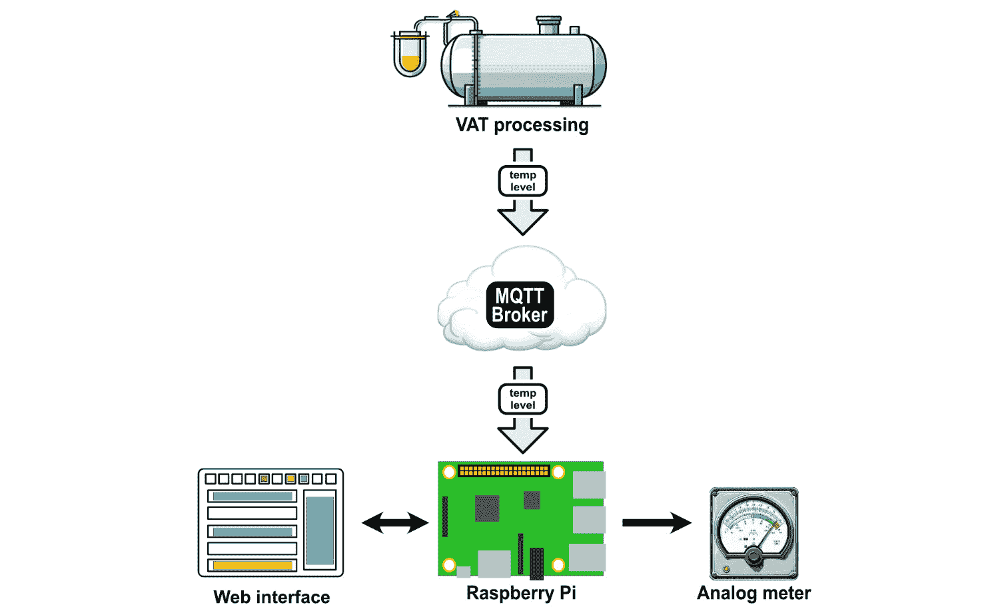

图 8.2 – 工业物联网应用

警报会通知团队，以便及时采取行动确保工人安全并预防潜在危险。仪表盘还可以启动自动化响应，例如关闭受影响区域。

除了安全之外，物联网仪表盘还提高了运营效率。分析长期数据可以帮助行业预测维护需求，减少停机时间。仪表盘还可以连接到供应系统，更新原材料水平和产品计数。通过使用来自各种来源的数据，行业可以提高安全和效率。

## 探索物联网安全警报仪表盘

对于现代安全，物联网的集成重新定义了警报仪表盘的功能。这些不再是过去的传统系统；增强型物联网警报仪表盘是动态的，提供远程访问和响应性操作。例如，随着智能家居和企业的兴起，安全漏洞不仅会触发响亮的警报器，还能通过业主的移动设备即时通知他们，启动实时视频画面捕捉，甚至与当地执法部门沟通，这一切都得益于物联网的连接性。

配备我们的 Raspberry Pi 5 及其 7 英寸触摸屏显示器，我们将为我们的物联网警报系统构建一个警报仪表盘（*图 8.3**）。使用这个仪表盘，我们可以使用 4 位数字密码来启用和禁用我们的物联网警报模块。我们的仪表盘将显示最新的`IoTAlarm` MQTT 消息，并提供触发警报的区域地图：

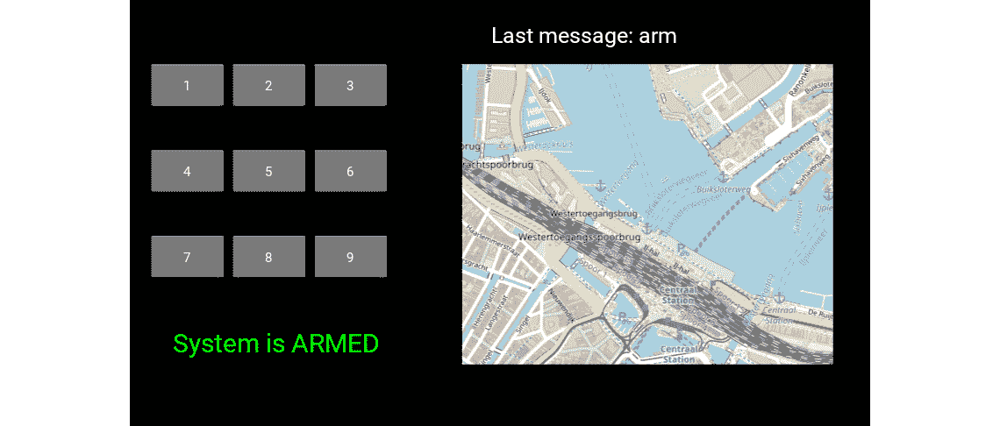

图 8.3 – 物联网警报仪表盘

由于我们的 Raspberry Pi 5 没有内置蜂鸣器，我们将添加一个外部蜂鸣器，并通过复合（多线）电缆通过 GPIO 端口连接。这个外部蜂鸣器将放置在一个定制设计的 3D 打印支架上，并在我们的启用物联网警报模块被触发时播放旋律。

我们将首先通过升级物联网警报模块的代码开始开发，使其能够与物联网警报仪表板的地图功能协同工作。

# 创建 Raspberry Pi 5 警报仪表板

自 2023 年底发布以来，Raspberry Pi 5 为紧凑型计算设定了新的标准，使开发者能够在各个领域构建更高效、更强大的应用程序。

Raspberry Pi 5 拥有先进的处理器，提高了我们的物联网警报仪表板的数据处理速度和多任务处理能力。其强大的软件支持和广泛的 Python 支持，提供了无与伦比的编程灵活性，适用于物联网警报系统的需求。搭配 7 英寸触摸屏，我们的 Raspberry Pi 5 为我们的系统提供了一个用户友好且高效的界面。

我们将开始开发我们的物联网警报仪表板，通过修改来自 *第六章* 的物联网警报模块代码，使其在 `IoTAlarm` MQTT 主题上发布 `location` 数据。一旦该数据被激活，我们的仪表板将能够精确地识别物联网警报模块的地理位置。

## 修改物联网警报模块代码

*图 8.1* 展示了我们的物联网警报模块的一个略微修改版本，其中添加了一个 `location` 消息，该消息将地理位置数据发送到我们的物联网警报仪表板。在这种情况下，我们可以将类似图 *图 8.4* 中所示的 GPS 模块集成到我们的物联网警报模块中：

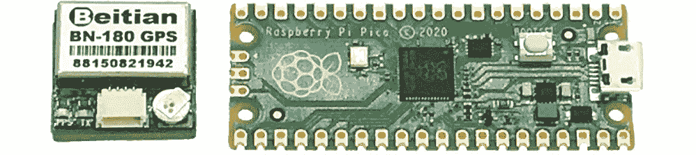

图 8.4 – GPS 模块紧邻 Raspberry Pi Pico

GPS 测试代码

本章的 GitHub 仓库包含 BN-180 GPS 模块和 Raspberry Pi Pico 的测试代码。

然而，尽管其体积紧凑且易于连接到 Raspberry Pi Pico W，但由于我们的物联网警报模块是室内使用，GPS 将难以获得强信号：

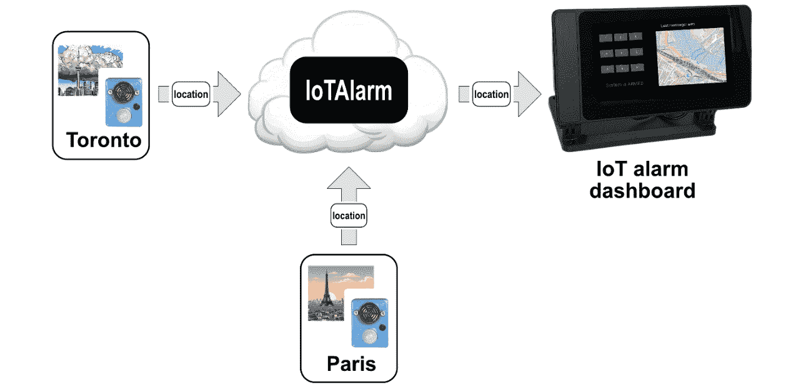

图 8.5 – 物联网警报模块的全球部署

相反，我们将直接将 GPS 坐标嵌入到我们的物联网警报模块代码中，假设模块的位置在部署后保持静态。由于代码需要 Wi-Fi 配置更新，因此在我们现场部署物联网警报模块时调整 GPS 详细信息非常简单。这部分地理位置数据将作为增强我们模块代码的一部分，在 `location` 消息中发布。这种方法使我们能够将物联网警报模块全球部署，如图 *图 8.5* 所示。

为了发布地理位置信息，我们将修改存储在我们的物联网警报模块上的 `main.py` 文件中的 `motion_handler()` 方法。

使用微控制器时，与 C 相比使用 MicroPython 的优势

虽然 MicroPython 的运行速度比 C 语言慢，但当涉及到修改物联网警报模块的代码时，其适应性是显而易见的。使用 C 语言时，更改需要重新编译和外部代码跟踪。然而，MicroPython 可以直接在微控制器上编辑，在更改过程中绕过文件系统搜索。

要修改代码，我们必须执行以下操作：

1.  首先，我们将 Raspberry Pi Pico W 连接到计算机的 USB 端口并启动 Thonny。

1.  然后，我们从屏幕的右下角选择 Pico W 上的 MicroPython 环境以激活它：

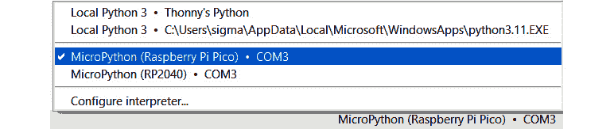

图 8.6 – 在 Thonny 中选择 MicroPython 和 Pico（显示 Windows 版本）

1.  在`main.py`文件下打开它：

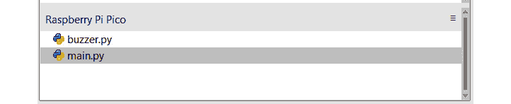

图 8.7 – 选择 main.py 文件

1.  然后，我们重写`motion_handler()`方法，使其如下所示：

    ```py
    def motion_handler(pin):
        print('Motion detected!')
        if mqtt_client:
            if ARMED:
                activate_buzzer()
                mqtt_client.publish(b"IoTAlarm", b"buzzer")
                mqtt_client.publish(b"IoTAlarm",
                                    b"location:43.6426,-79.3871")
            else:
                mqtt_client.publish(b"IoTAlarm", b"motion")
        else:
            print("MQTT client not connected.")
    ```

1.  我们在这里的唯一更改是在`mqtt_client`对象上添加另一个发布方法。在新的`publish()`方法中，我们创建了一个名为`location`的消息，它提供了加拿大多伦多 CN 塔的大致 GPS 坐标。

物联网警报模块地理位置

我们设计的物联网警报模块旨在永久安装在室内位置——即硬编码的地理位置。我们以加拿大多伦多的 CN 塔为例。我们鼓励您提供您自己的独特 GPS 坐标。

1.  我们接着将我们的更改保存到我们的 Raspberry Pi Pico W。

我们将在下一节设置和启动 Raspberry Pi 5 上的物联网警报仪表板时看到这次调整的影响。

## 编写仪表板代码

对于物联网警报仪表板，我们将使用 Raspberry Pi 5、7 英寸触摸屏 Raspberry Pi 及其兼容的机箱。此配置类似于我们在*第四章*中建立的配置，增加了专用于物联网警报仪表板的外部蜂鸣器。

我们将从设置我们的开发环境和安装代码所需的包开始。

### 设置我们的开发环境

我们将为我们的开发使用 Python 虚拟环境。由于有一些库只与 Python 的根安装版本兼容，我们将在 Python 虚拟环境中使用系统包。为此，我们必须执行以下操作：

1.  在我们的 Raspberry Pi 5 上，我们打开一个终端应用程序。

1.  要存储我们的项目文件，我们运行以下命令创建一个新的目录：

    ```py
    mkdir dashboard
    ```

1.  然后，我们导航到新目录：

    ```py
    cd dashboard
    ```

1.  接下来，我们为我们的项目创建一个新的 Python 虚拟环境：

    ```py
    dashboard-env and enable access to the --system-site-packages. This allows the virtual environment to inherit packages from the global Python environment without affecting the global Python environment.
    ```

1.  创建了新的 Python 虚拟环境后，我们使用以下命令将其源代码导入：

    ```py
    dashboard-env Python virtual environment:
    ```

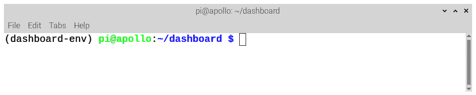

图 8.8 – 显示使用 dashboard-env 环境的终端

1.  接下来，我们安装代码所需的额外包：

    ```py
    kivy-garden.mapview extension offers an interactive map widget, while paho.mqtt is a Python client library that enables MQTT communications; it’s popular in IoT due to its efficiency. We’re ensuring that we install the version of paho.mqtt that will work with our program by specifying that we want 1.5.1.
    ```

1.  在安装了额外的包后，我们关闭终端：

    ```py
    exit
    ```

1.  现在我们已经准备好加载 Thonny。为此，我们点击 Raspberry Pi 任务栏中的**菜单**图标，导航到**编程**类别，并选择**Thonny**。

1.  默认情况下，Thonny 使用 Raspberry Pi 的内置 Python 版本。对于我们的项目，我们将使用我们刚刚创建的 Python 虚拟环境。首先，我们需要通过点击**查看**并选择**文件**来查看项目文件（如果它还没有被选中）。

1.  在`文件`部分，我们定位并打开`dashboard-env`目录。

1.  然后，右键单击`pyvenv.cfg`文件，并选择**激活虚拟环境**选项：

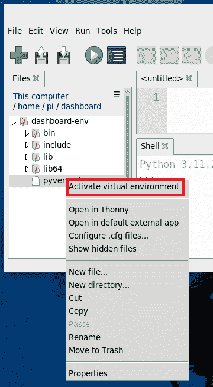

图 8.9 – 在 Thonny 中激活 Python 虚拟环境

激活 Python 虚拟环境

在上述步骤中，我们通过点击`pyvenv.cfg`文件激活了 Python 虚拟环境。这一步骤以这种方式概述是为了展示一种激活 Python 虚拟环境的方法，而不是之前章节中展示的方法。

在创建项目文件夹、设置 Python 虚拟环境并安装我们项目所需的包后，我们可以开始编写我们的物联网警报仪表板的代码。我们将把我们的代码分成两个文件——一个用于创建仪表板的 GUI，另一个用于激活蜂鸣器。但在我们这样做之前，我们必须将蜂鸣器连接到我们的 Raspberry Pi 5 的 GPIO 端口。

### 连接蜂鸣器

对于我们的项目，我们将使用一个 SFM-27 主动蜂鸣器。我们将蜂鸣器的正极线（红色）连接到 GPIO 4，负极线（黑色）连接到 Raspberry Pi 5 上的 GND。我们有将蜂鸣器安装到定制外壳的选项，我们将在本章后面讨论这一点。为了我们的代码开发和测试目的，直接将 SFM-127 主动蜂鸣器连接到 Raspberry Pi 5 就足够了：

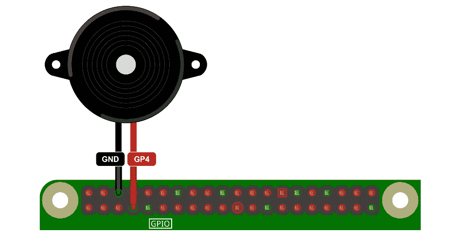

图 8.10 – 将蜂鸣器连接到 Raspberry Pi 5 的 GPIO 端口

在蜂鸣器连接到我们的 Raspberry Pi 5 后，现在是时候编写和测试蜂鸣器代码了。我们将使用此代码在仪表板从 MQTT 服务器接收到`buzzer`消息时激活蜂鸣器。

### 编写和测试蜂鸣器代码

我们使用 Thonny 在我们的 7 英寸屏幕的 Raspberry Pi 5 上编写蜂鸣器代码。为了有更多的屏幕空间来辅助编码，我们可以通过 Raspberry Pi 5 的 mini-HDMI 端口添加另一个显示器，创建一个双显示器设置。

要编写和测试我们的蜂鸣器代码，请按照以下步骤操作：

1.  我们通过点击 Raspberry Pi 任务栏中的**菜单**图标，导航到**编程**类别，并选择**Thonny**来启动 Thonny。

1.  然后，我们激活`dashboard-env` Python 虚拟环境。

1.  一旦进入 Thonny，我们通过选择**文件**然后**新建**或按键盘上的*Ctrl* + *N*来创建一个新的标签页。

1.  在我们的新文件中，我们输入以下代码：

    ```py
    from gpiozero import TonalBuzzer
    from gpiozero.tones import Tone
    from time import sleep
    class BuzzerMelody:
        def __init__(self, pin, notes=[('E4', 1),
                                       ('E4', 0.5),
                                       ('F4', 0.5),
                                       ('G4', 1.5)]):
            self.buzzer = TonalBuzzer(pin)
            self.melody = notes
        def play_melody(self):
            for note, duration in self.melody:
                self.buzzer.play(Tone(note))
                sleep(duration)
                self.buzzer.stop()
                sleep(0.1)  # pause between notes
    if __name__ == "__main__":
        buzzer_melody = BuzzerMelody(4)
        buzzer_melody.play_melody()
    ```

1.  我们将文件保存为 `buzzer.py`，位于 Raspberry Pi 5 的 `dashboard` 项目文件夹中。

    在测试我们的代码之前，让我们检查它：

    1.  我们首先从 `gpiozero` 模块导入 `TonalBuzzer` 类。

    1.  然后，我们从 `gpiozero.tones` 导入 `Tone` 类。

    1.  我们通过从 `time` 模块导入 `sleep` 函数来完成我们的导入。

    1.  接下来，我们定义一个 `BuzzerMelody` 类：初始化器 (`__init__`) 接受一个引脚和一个包含音符及其时长的列表。列表有一个默认旋律。在初始化器中，我们执行以下操作：

        1.  使用提供的引脚初始化一个 `TonalBuzzer` 对象

        1.  设置旋律

    1.  然后，我们定义 `play_melody()` 方法。在这个方法中，我们执行以下操作：

        1.  遍历旋律音符

        1.  按指定时长播放每个音符

        1.  确保音符播放后蜂鸣器停止

        1.  在音符之间添加短暂的暂停

    1.  如果脚本作为主程序执行，我们执行以下操作：

        1.  使用引脚 4 创建 `BuzzerMelody` 类的实例

        1.  使用 `play_melody()` 方法播放旋律

1.  我们通过点击 Thonny 中的绿色运行按钮，按键盘上的 *F5*，或在顶部菜单中选择 **运行** 然后选择 **运行当前脚本** 来运行代码。

1.  我们应该会听到蜂鸣器播放旋律。

在我们的蜂鸣器代码就绪后，是时候使用 Kivy 编写我们的主仪表盘代码了。

### 创建我们的 Kivy 仪表盘

如前所述，我们将使用 Raspberry Pi 5 的 7 英寸触摸屏来显示我们的仪表盘。使用此屏幕是可选的，因为我们可能使用标准显示器与 Raspberry Pi 一起使用。

要编写和测试我们的 Kivy 仪表盘代码，请按照以下步骤操作：

1.  通过点击 Raspberry Pi 任务栏中的 **菜单** 图标，导航到 **编程** 类别，然后选择 **Thonny** 来启动 Thonny。

1.  然后，我们激活 `dashboard-env` Python 虚拟环境。

1.  一旦在 Thonny 中，通过选择 **文件** 然后选择 **新建** 或按键盘上的 *Ctrl* + *N* 创建一个新标签。

1.  我们将使用必要的导入开始我们的代码：

    ```py
    from kivy.config import Config
    Config.set('graphics', 'fullscreen', 'auto')
    Config.set('graphics', 'borderless', '1')
    from kivy.app import App
    from kivy.uix.floatlayout import FloatLayout
    from kivy.uix.label import Label
    from kivy.uix.button import Button
    from kivy.clock import Clock
    from threading import Thread
    import paho.mqtt.client as mqtt
    from kivy_garden.mapview import MapView, MapMarkerPopup
    from buzzer import BuzzerMelody
    ```

    让我们检查这段代码：

    +   `kivy.config`：我们的代码从 Kivy 导入配置设置，以调整应用程序的行为。

    +   `fullscreen`：我们配置应用程序以全屏模式运行。

    +   `borderless`：我们的设置消除了窗口边框。

    +   `kivy.app`：我们的代码访问 Kivy 的主要应用程序类，用于初始化和操作 Kivy 应用程序。

    +   `kivy.uix.floatlayout`：我们导入 `FloatLayout`，这是一种灵活的布局机制，根据相对坐标放置小部件。

    +   `kivy.uix.label`：我们的代码使用 `Label` 小部件，允许我们在应用程序中显示文本。

    +   `kivy.uix.button`：我们整合了 `Button` 小部件，以便它可以与我们的键盘一起使用。

    +   `kivy.clock`：我们利用 `Clock` 类来安排在定时间隔运行特定函数。

    +   `Threading`：为了确保平滑的多任务处理，我们的代码使用线程进行并行操作。我们使用线程在单独的线程上运行`start_mqtt()`方法。

    +   `paho.mqtt.client`：我们在代码中使用 MQTT 客户端库与我们的 MQTT 服务器进行通信。

    +   `kivy_garden.mapview`：我们的代码引入了用于展示地图（`MapView`）和交互式地图标记（`MapMarkerPopup`）的类。我们使用这些类在地图上直观地表示警报被触发的确切位置。

    +   `buzzer.BuzzerMelody`：我们导入`BuzzerMelody`类，以便我们可以激活外部蜂鸣器。

1.  然后，为我们的代码设置变量声明：

    ```py
    MQTT_SERVER = "codfish.rmq.cloudamqp.com"
    MQTT_PORT = 1883
    USERNAME = "<<MQTT server username>>"
    MQTT_PASSWORD = "<<MQTT server password>>"
    DEVICE_ID = "IoTAlarmDashboard"
    TOPIC = "IoTAlarm"
    ```

1.  从这里，我们必须定义继承自`FloatLayout`类的`AlarmDashboard`类，并定义初始化方法：

    ```py
    class AlarmDashboard(FloatLayout):
        def __init__(self, **kwargs):
            super(AlarmDashboard, self).__init__(**kwargs)
            self.password_toggle = "1234"
            self.entered_password = ''
            self.system_armed = False
            self.lockout = False
            self.last_message = ''
            self.client = mqtt.Client(client_id=DEVICE_ID)
            self.client.username_pw_set(USERNAME, MQTT_PASSWORD)
            self.client.on_message = self.on_message
            Thread(target=self.start_mqtt).start()
            self.init_widgets()
            self.buzzer = BuzzerMelody(4)
    ```

    让我们检查这段代码：

    1.  首先，我们初始化特定的属性，例如默认密码（`password_toggle`）、当前输入的密码（`entered_password`）、系统状态标志（`system_armed`）、锁定状态（`lockout`）和最后接收到的消息（`last_message`）。

    1.  然后，我们设置一个具有唯一`client_id`的 MQTT 客户端，并使用`username_pw_set`方法提供必要的认证细节。

    1.  客户端的`on_message`属性被设置为名为`on_message()`的方法，我们的代码将使用该方法来处理传入的 MQTT 消息。

    1.  我们使用`start_mqtt`方法在单独的线程上启动 MQTT 连接，以避免阻塞主应用程序。

    1.  我们将在后面定义的`init_widgets`方法被调用以初始化和排列用户界面元素。

    1.  最后，我们使用`BuzzerMelody`类的实例初始化`buzzer`属性，并将其设置在 GPIO 引脚 4 上。

1.  现在，使用`on_message()`方法来处理来自我们的 MQTT 服务器的消息：

    ```py
    def on_message(self, client, userdata, msg):
        message = f"{str(msg.payload.decode('utf-8'))}"
        self.last_message = "Last message: " + message
        if message.startswith("location:"):
            parts = message.split(":")[1].split(",")
            lat = float(parts[0])
            lon = float(parts[1])
            Clock.schedule_once(
                lambda dt: self.update_map(lat, lon), 0
            )
        if message == "arm":
            Clock.schedule_once(
                lambda dt: self.update_system_status(True), 0
            )
        elif message == "disarm":
            Clock.schedule_once(
                lambda dt: self.update_system_status(False), 0
            )
        if message == "buzzer":
            self.buzzer.play_melody()
        Clock.schedule_once(
            lambda dt: self.update_message_display(), 0
        )
    ```

    让我们检查这段代码：

    1.  接收到消息后，我们的代码将解码消息有效载荷，从字节转换为字符串

    1.  最新的消息存储时带有`Last` `message:`前缀

    1.  如果接收到的消息以`location:`开头，它将提取纬度和经度值

    1.  这些值随后用于更新显示的地图，并安排调用`update_map()`方法

    1.  如果接收到的消息是`arm`，系统状态将通过`update_system_status()`方法更新为`armed`

    1.  如果接收到的消息是`disarm`，系统状态将通过`update_system_status()`方法更新为`disarmed`。

    1.  如果接收到的消息是`buzzer`，将通过`buzzer`实例的`play_melody()`方法播放旋律

    1.  无论消息内容如何，都会使用`update_message_display()`方法更新显示的消息

在我们的代码中使用 lambda()函数

在 Python 中，`lambda()` 函数用作匿名内联函数。它通常用于表达为单个语句的简短操作。具体来说，在我们的代码中，`lambda()` 函数与 Kivy 的 `Clock.schedule_once()` 方法配对，以延迟某些方法的执行。通过使用 `Clock.schedule_once()` 方法，可以安排一个函数在指定延迟后运行。当第二个参数为 `0` 时，表示函数应在下一个帧上立即调用。

我们代码中的每个 `lambda()` 函数都遵循 `lambda dt: some_method(arguments)` 模式。在这里，`dt` 代表自上一帧以来经过的时间。它是 `Clock.schedule_once()` 自动提供的参数。例如，`Clock.schedule_once(lambda dt: self.update_map(lat, lon), 0)` 将 `self.update_map(lat, lon)` 方法安排在即将到来的帧上执行，并使用已解析的 `lat` 和 `lon` 值作为其参数。本质上，这些 `lambda()` 函数充当一个通道，将参数传递给方法，并通过 Kivy 的调度机制在下一帧上设置它们以执行。利用 `Clock()` 函数确保我们的 UI 更新保持平滑并与显示的刷新率同步，同时也防止了主线程的阻塞，从而提高了应用程序的响应性。

1.  我们的代码定义了一个名为 `update_map()` 的方法，其主要目的是以两种主要方式更新显示的地图：

    ```py
        def update_map(self, lat, lon):
            self.mapview.center_on(lat, lon)
            marker = MapMarkerPopup(lat=lat, lon=lon)
            self.mapview.add_widget(marker)
    ```

    让我们来看看这段代码：

    1.  我们的代码将地图的中心调整到新的纬度和经度坐标，这些坐标作为参数（`lat` 和 `lon`）提供。

    1.  然后，它在地图上指定的坐标处放置一个标记（具体来说是一个可以显示弹出窗口的交互式标记）。这个标记指示触发警报的物联网警报模块的确切位置。

1.  `update_system_status()` 方法根据 `is_armed` 的值更新我们的仪表板上的状态消息：

    ```py
        def update_system_status(self, is_armed):
            if is_armed:
                self.system_armed = True
                self.system_status.text = "System is ARMED"
                self.system_status.color = (0, 1, 0, 1)
            else:
                self.system_armed = False
                self.system_status.text = "System is DISARMED"
                self.system_status.color = (1, 0, 0, 1)
    ```

1.  然后，我们的代码定义了一个名为 `start_mqtt()` 的方法，用于设置和初始化应用程序的 MQTT 通信：

    ```py
        def start_mqtt(self):
            self.client.connect(MQTT_SERVER, MQTT_PORT)
            self.client.subscribe(TOPIC)
            self.client.loop_forever()
    ```

    让我们来看看这段代码：

    1.  该方法使用给定的服务器地址 (`MQTT_SERVER`) 和端口号 (`MQTT_PORT`) 将 MQTT 客户端连接到指定的 MQTT 服务器。

    1.  一旦连接，客户端会订阅一个特定的主题 (`TOPIC`)，这意味着它将开始监听在该主题上发布的消息。

    1.  最后，调用客户端的 `loop_forever()` 方法，该方法使 MQTT 客户端持续不断地检查传入的消息，并在应用程序运行期间处理这些消息。

1.  我们的代码定义了一个名为 `init_widgets()` 的方法，用于初始化并在我们的仪表板上放置各种用户界面组件。我们将从**键盘**初始化过程开始：

    ```py
    def init_widgets(self):
        # Keypad buttons
        positions = [
            (0.03, 0.75), (0.14, 0.75), (0.25, 0.75),
            (0.03, 0.55), (0.14, 0.55), (0.25, 0.55),
            (0.03, 0.35), (0.14, 0.35), (0.25, 0.35)
        ]
        for index, pos in enumerate(positions, 1):
            btn = Button(
                text=str(index), size_hint=(0.1, 0.1),
                pos_hint={'x': pos[0], 'y': pos[1]}
            )
            btn.bind(on_press=self.handle_key_press)
            self.add_widget(btn)
    ```

    在这里，设置了一个按键布局，按钮以 3x3 网格排列。这些按钮的位置使用 `positions` 列表指定，其中每个元组代表相对的 `x` 和 `y` 坐标。当我们遍历这些位置时，我们创建一个带有相应数字的按钮，并将其 `on_press` 事件绑定到 `handle_key_press()` 方法，该方法将捕获按钮按下动作。每个按钮一旦初始化，就使用 `add_widget()` 方法添加到仪表板中。

1.  现在，编写 **系统状态标签** 的代码：

    ```py
        # System status
        self.system_status = Label(
            text="System is DISARMED",
            size_hint=(1, 0.2),
            pos_hint={'x': -0.3, 'y': 0.1},
            font_size=30,
            color=(1, 0, 0, 1)
        )
        self.add_widget(self.system_status)
    ```

    这个标签显示系统的状态，指示它是处于警戒状态还是解除警戒状态。它使用特定的文本大小、颜色和定位进行样式设置。一旦初始化，该标签就被添加到仪表板中。

1.  接下来，设置一个用于 **MQTT 消息显示** 的标签：

    ```py
        # MQTT Messages
        self.message_display = Label(
            text="Waiting for message...",
            size_hint=(0.77, 0.6),
            pos_hint={'x': 0.23, 'y': 0.62},
            font_size=25,
            color=(1, 1, 1, 1)
        )
        self.add_widget(self.message_display)
    ```

    在这里，已经设置了一个标签来显示传入的 MQTT 消息。它有一个默认文本 `Waiting for message...`，并且与系统状态标签的样式相似。一旦创建，它就被添加到仪表板中。

1.  最后，添加一个 **MapView 小部件**：

    ```py
        self.mapview = MapView(
            zoom=15, lat=52.379189, lon=4.899431,
            size_hint=(0.5, 0.7), pos_hint={'x': 0.45, 'y': 0.15}
        )
        self.add_widget(self.mapview)
    ```

    在这里，我们初始化一个 `MapView` 小部件来显示地理位置。它预设了特定的缩放级别和初始纬度和经度坐标。这个地图视图允许我们在地图上可视化位置。一旦初始化，它就被添加到我们的仪表板中。

1.  `update_message_display()` 方法用于刷新或更新 `message_display` 小部件中显示的文本，以显示系统接收到的最新消息：

    ```py
        def update_message_display(self):
            self.message_display.text = self.last_message
    ```

1.  `handle_key_press()` 方法管理用户在输入警报系统密码时与虚拟键盘的交互，确定输入代码的有效性，并根据密码输入调整警报系统的状态：

    ```py
    def handle_key_press(self, instance):
        if not self.lockout:
            self.entered_password += instance.text
            print("The key:" + instance.text + " was pressed")
            if len(self.entered_password) == 4:
                if self.entered_password == self.password_toggle:
                    if self.system_armed:
                        self.system_armed = False
                        self.system_status.text = "System is\
        DISARMED"
                        self.system_status.color = (1, 0, 0, 1)
                        self.client.publish(TOPIC, "disarm")
                    else:
                        self.system_armed = True
                        self.system_status.text = "System is ARMED"
                        self.system_status.color = (0, 1, 0, 1)
                        self.client.publish(TOPIC, "arm")
                    self.entered_password = ''
                else:
                    self.lockout = True
                    Clock.schedule_once(self.end_lockout, 5)
                    self.entered_password = ''
    ```

    让我们检查这段代码：

    +   `self.entered_password` 字符串，表示用户当前输入的密码。

    +   `handle_key_press()` 方法验证它是否与预定义的警报系统代码匹配。如果代码正确，以下操作会发生：

        1.  警报系统的状态在 `armed` 和 `disarmed` 之间切换。

        1.  向 `IoTAlarm` 主题发送相应的消息（`arm` 或 `disarm`）。

    +   `lockout` 模式：

        1.  启动一个计时器，在指定的时间（本例中为 5 秒）后结束锁定状态。

        1.  输入的代码已重置，以备再次尝试。

1.  `end_lockout()` 函数旨在终止系统的锁定状态。将 `lockout` 属性设置为 `False` 确保在锁定期间被限制的操作或交互现在被允许：

    ```py
        def end_lockout(self, dt):
            self.lockout = False
    ```

1.  在这一点上，我们的代码引入了主应用程序类 `MyApp`，该类基于 Kivy 的 App 框架构建。在这个类中，`build()` 方法构建并返回一个 `AlarmDashboard` 实例。如果我们直接运行此代码（未导入到另一个脚本中），则 `if __name__ == '__main__':` 检查确保创建并启动一个新的 `MyApp` 实例，从而启动整个警报应用程序：

    ```py
    class MyApp(App):
        def build(self):
            return AlarmDashboard()
    if __name__ == '__main__':
        MyApp().run()
    ```

1.  将我们的代码保存为`dashboard.py`在项目文件夹中。

在编写了仪表板代码并测试了蜂鸣器后，是时候为我们的蜂鸣器构建定制支架了。像往常一样，这是可选的；我们可以在不将蜂鸣器封装到支架中的情况下运行我们的应用程序。然而，这样做可以使我们的应用程序看起来更专业，增强用户体验，并提供更精致的展示，确保蜂鸣器在需要时可以安全且易于访问。

# 构建外部报警蜂鸣器支架

将我们的蜂鸣器封装在定制支架中增强了我们的物联网报警仪表板。在本节中，我们将构建支架。在我们组装之前，我们将首先识别组成定制蜂鸣器支架的部件。

## 识别部件

组成定制蜂鸣器支架的部件可以使用 3D 打印机或 3D 打印服务（如 Shapeways [`www.shapeways.com`](https://www.shapeways.com)）制作。

这些部件在*图 8**.11 中显示：

+   *A*：这是位于本章 GitHub 仓库`Build Files/Buzzer Stand`文件夹中的`Stand.stl`文件的 3D 打印版本。这个版本的文件是用液体树脂 3D 打印机打印的，随后进行了喷漆。对于那些更喜欢使用 FDM 打印机的人来说，位于`Build Files/Split Stand`下的分体支架将是一个更好的选择：

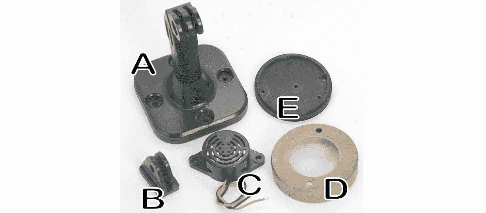

图 8.11 – 定制蜂鸣器支架的部件

+   *B*：这是我们标准的钩子。它是由液体树脂 3D 打印的`Hook.stl`文件版本，该文件位于本章 GitHub 仓库的`Build Files`文件夹中。

+   *C*：这是为该支架设计的标准 SFM-127 主动蜂鸣器。

+   *D*：这是涂漆的 FDM 3D 打印的`Front.stl`文件版本，它也位于`Build` `Files`文件夹中。

+   *E*：使用 FDM 3D 打印机创建了一个`Back.stl`文件的版本。该部件通过钩子(*B*)将前面(*D*)与支架(*A*)连接起来。

+   未显示：一根多芯电缆，如废弃的 USB 电缆。

+   未显示：2 个 M4 20mm 螺栓。

+   未显示：2 个 M3 10mm 螺栓。

+   未显示：2 个 M2 5mm 螺栓。

+   未显示：1 个 M5 20mm 螺栓。

+   未显示：1 个 M5 螺母。

+   未显示：2 个用于将蜂鸣器连接到 GPIO 端口的雌性跳线端子。

应使用哪种类型的 3D 打印机来创建部件？

在*图 8**.9 中，使用了 FDM 和液体树脂 3D 打印机创建了部件。打印机的选择取决于用户的经验和部件的设计。如图 8**.10 中的*E*和*D*所示的平面部件，适用于 FDM 打印机。如图 8**.10 中的部件*A*所示的装饰性设计，则更适合液体树脂打印机。虽然钩子(*B*)可以使用任何一种方法，但我们选择了一种使用工程级树脂（Siraya Tech Blu）的液体树脂打印机，以增加强度。

在确定了部件后，是时候构建我们的定制蜂鸣器支架了。

## 构建支架

要构建定制的蜂鸣器支架，我们必须遵循 *图 8**.12* 中所示的步骤：

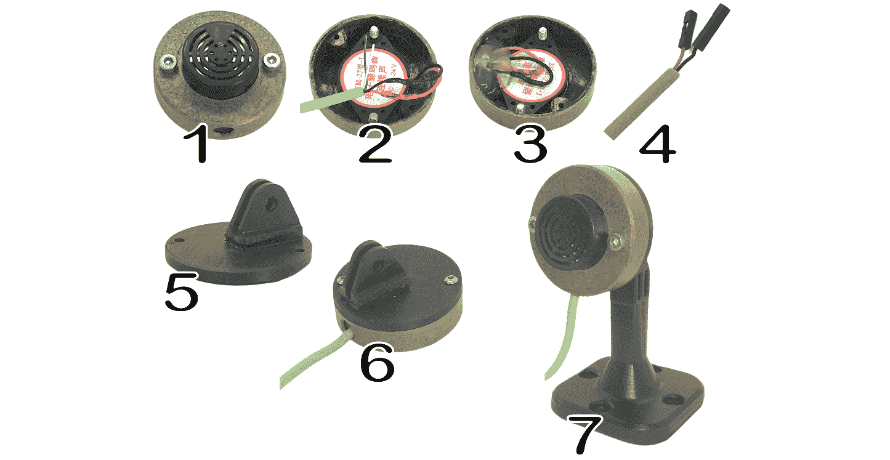

图 8.12 – 构建定制蜂鸣器支架的步骤

让我们仔细看看：

1.  使用两个 M4 10mm 螺栓，将蜂鸣器（见 *C* 在 *图 8**.11* 中）固定到前壳上（见 *D* 在 *图 8**.11* 中）。螺栓应紧紧拧入蜂鸣器。如果它们松动，我们可以用两个 M4 螺母拧紧。

1.  使用多芯电缆，例如废弃的 USB 电缆，将两根线焊接到蜂鸣器上（见 *C* 在 *图 8**.11* 中）。

1.  将多芯电缆穿过前壳上的孔（见 *D* 在 *图 8**.11* 中），并通过热胶枪涂抹胶水，将电缆固定到壳体上。

1.  使用多芯电缆（在我们的例子中是红色和黑色）的两根相同电线，将两个母跳线端子压接到线的末端。另一种选择是将预先存在的跳线电缆焊接到末端而不是压接。

1.  然后，通过使用两个 M2 5mm 螺丝或环氧树脂胶水，将钩子（见 *B* 在 *图 8**.11* 中）固定到背板上（见 *E* 在 *图 8**.11* 中）。

1.  使用两个 M3 10mm 螺栓，将背板（见 *E* 在 *图 8**.11* 中）固定到前壳（见 *D* 在 *图 8**.11* 中）。

1.  使用 M5 20mm 螺栓和 M5 螺母，将组装好的壳体固定到支架上（见 *A* 在 *图 8**.11* 中）。

在构建好定制支架后，我们可以按照 *图 8**.10* 中所示的接线图，将我们的蜂鸣器重新连接到 Raspberry Pi 5 的 GPIO 端口。

我们现在已准备好测试我们的应用程序。

# 运行我们的应用程序

现在是我们一直在过去几章中构建的时刻：测试我们的整个物联网报警系统。在构建好物联网报警仪表板后，我们的物联网报警系统就完成了：

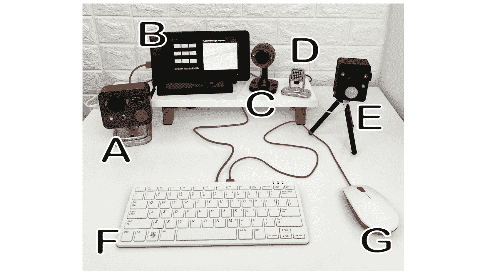

图 8.13 – 完成的物联网报警系统

我们首先在 *第六章* 中构建了物联网报警模块（见 *E* 在 *图 8**.13* 中），然后继续在 *第七章* 中构建物联网按钮（见 *A* 和 *D* 在 *图 8**.13* 中）。在本章中，我们使用了带有活动蜂鸣器（见 *B* 和 *C* 在 *图 8**.13* 中）的 Raspberry Pi 5、7 英寸屏幕和外壳（见 *B* 在 *图 8**.13* 中）、键盘（见 *F* 在 *图 8**.13* 中）和鼠标（见 *G* 在 *图 8**.13* 中）来构建物联网报警仪表板。

要测试物联网报警仪表板，我们只需启动物联网报警模块，并通过在其 PIR 传感器前移动物体来激活它。为此，请按照以下步骤操作：

1.  要启动物联网报警模块，使用我们的鼠标，将四位 PIN 码（1234）输入到物联网报警仪表板的键盘上。

1.  我们应该注意到，物联网报警模块通过 LED 的长闪烁进入警戒模式。要激活报警，我们在 PIR 传感器前挥动手臂。

1.  几秒钟后，我们应该听到物联网警报模块上的蜂鸣器声音，接着是物联网按钮（版本 2）和物联网警报仪表板上的蜂鸣器。

1.  我们还应该注意到，在物联网警报仪表板的屏幕上应该显示一个带有 CN 塔标记的多伦多地图：

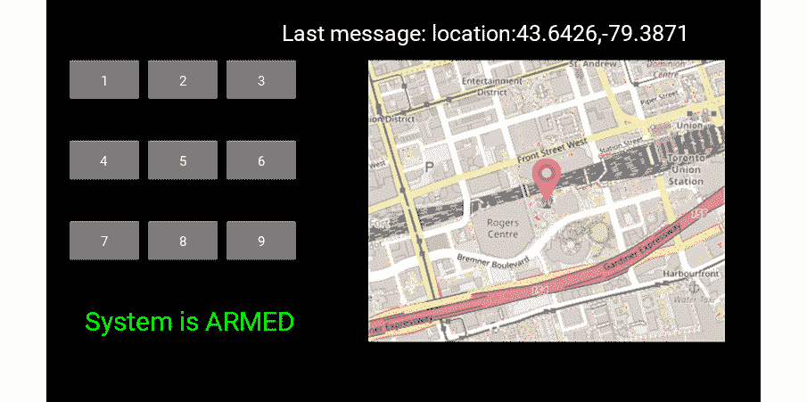

图 8.14 – 显示警报激活位置的物联网警报仪表板

在成功测试了物联网警报系统之后，我们完成了本书的第二部分。在整个这一过程中，我们探索了基于互联网的设备通信，并利用了 Raspberry Pi Pico W 微控制器和 Raspberry Pi 5 计算机的能力。这个基础对于本书中的高级项目将非常有价值。

如果我们真的想接受挑战，我们可以尽可能地将物联网警报系统的每个组件放置得远一些，也许可以通过将一个组件给另一个城市的友人来实现。进行这样的活动将帮助我们不仅欣赏物联网，而且总体上欣赏我们的互联网连接的世界。

# 摘要

在本章中，我们通过构建物联网警报仪表板完成了我们的物联网警报系统。我们首先通过考虑一个油罐的液位和温度的例子来理解物联网警报仪表板及其用法。在本章中，我们逐步介绍了设置、编码和测试我们的物联网警报仪表板的过程，包括添加一个外部蜂鸣器的定制支架。

我们使用 Kivy 在 Raspberry Pi 5 上构建了我们的物联网警报系统仪表板。该仪表板集成了地图功能，以确定任何激活的物联网警报模块的位置。

在我们结束对物联网警报系统的讨论时，我们期待着下一个令人兴奋的挑战：使用 LoRa 构建一个远程监控站。下一节将介绍我们关于长距离通信的知识，这将拓宽我们在物联网项目中的理解和能力。

# 第三部分：创建一个 LoRa 支持的物联网监控站

在这部分，我们将创建一个远程环境监控站，使用 LoRa 收集和传输温度和湿度数据，并通过互联网传输。我们将使用这些数据来控制一个模拟的天气指示器。

本部分包含以下章节：

+   *第九章*，*理解 LoRa*

+   *第十章*，*将 LoRa 与互联网集成*
