# 9

# 理解 LoRa

在本章中，我们探索**LoRa**（即**长距离**）的世界，这是物联网通信的关键技术。LoRa 以其在最小功率下传输数据到长距离而闻名。我们将探讨其在农业等领域的实际应用，如实现大规模传感器网络的效率管理，以及在城市化环境中协助智能城市倡议，如街道照明控制。

我们还将研究**射频频谱**，了解不同频率如何分配给各种无线通信，使我们能够更好地理解 LoRa 技术的操作范围。通过研究频谱，我们可以确定哪些频段最适合 LoRa 传输。

然后，我们的重点转向实际方面：使用 Raspberry Pi Pico 和 Pico W 分别构建 LoRa 传感器发射器和 LoRa 接收器。我们将从组装发射器电路开始，整合 RFM95W LoRa 模块、DHT22 温度传感器和 Raspberry Pi Pico。然后，我们将将这些组件放入定制的 3D 打印外壳中。我们将强调使用标准的 Raspberry Pi Pico，因为它在不需要 Wi-Fi 的任务中效率高，得益于其较低的功耗和减少的固件开销。

对于接收器，我们使用 Raspberry Pi Pico W，专注于其 Wi-Fi 功能以供未来的开发使用。我们将为接收器构建一个定制外壳，就像发射器一样，但带有 LED 进行状态指示。

开发过程包括设置 CircuitPython，安装必要的库，以及编写发射器和接收器的代码。CircuitPython 是 MicroPython 的开源衍生产品，由 Adafruit 开发，旨在简化微控制器的编程。在我们的代码中，我们将使用传输之间的延迟来遵守欧洲占空比限制。

最后，我们将在户外测试我们的应用程序，展示 LoRa 令人印象深刻的范围能力，与 Wi-Fi 有限的范围相比。

本章我们将探讨以下主题：

+   探索 LoRa

+   构建 LoRa 传感器发射器

+   构建 LoRa 接收器

让我们开始吧！

# 技术要求

完成本章所需的以下要求：

+   Python 编程的中级知识

+   1 x Raspberry Pi Pico WH（带引脚）用于开发（可添加引脚到 Raspberry Pi Pico W）

+   1 x Pico GPIO 扩展器用于开发

+   1 x Raspberry Pi Pico（用于 LoRa 传感器发射器）

+   1 x Raspberry Pi Pico W（用于 LoRa 接收器）

+   2 x RFM95W LoRa 模块

+   1 x DHT22 温度和湿度传感器

+   1 x LED（任何颜色）

+   1 x 220 欧姆电阻

+   4 x M3 10 毫米螺栓

+   12 x M2 5 毫米螺丝

+   2 x M5 20 毫米螺栓

+   2 x M5 螺母

+   热胶枪

+   有访问 3D 打印机或 3D 打印机服务以打印定制外壳的能力

+   定制外壳的构建文件可在我们的 GitHub 仓库中找到

本章的代码和构建文件可在此处找到：

[`github.com/PacktPublishing/-Internet-of-Things-Programming-Projects-2nd-Edition/tree/main/Chapter9`](https://github.com/PacktPublishing/-Internet-of-Things-Programming-Projects-2nd-Edition/tree/main/Chapter9)

# 探索 LoRa

LoRa 是一种无线通信技术，以其能够在长距离传输数据同时消耗极低功率的能力而闻名。由于其效率和可靠性在各种环境中，LoRa 在物联网领域变得越来越重要。作为扩展无线通信范围的解决方案，LoRa 技术已经发展到在连接广泛的物联网设备中扮演关键角色的地步。

在以下章节中，在我们探讨频谱及其与 LoRa 的关系之前，我们将查看 LoRa 的实际应用。

## LoRa 技术的实际应用

LoRa 技术在农业等领域发挥着重要作用，使农民能够在大片土地上部署传感器网络来监测土壤湿度、温度和其他关键参数，从而提高作物管理和资源效率。

**LoRa 节点**为现代化农业实践提供了一种经济有效的解决方案，与成本更高的替代方案（如基于**长期演进**（**LTE**）的系统或广泛的线缆传感器网络）形成对比。虽然 LTE 支持更密集的数据应用，但其更高的功率需求和运营成本可能成为障碍。

在*图 9**.1*中，我们看到一个由 AI 生成的图像，展示了用于测量现代农场土壤和天气条件的 LoRa 节点：


图 9.1 – 使用 LoRa 技术的现代农场

在城市环境中，LoRa 可能被用于管理智能城市应用，如街灯。在*图 9**.2*中，我们看到一个用于城市环境的智能路灯。在这种情况下，灯光的控制由一个中央办公室通过发送到路灯的 LoRa 消息来决定是打开或关闭，或者控制其亮度：

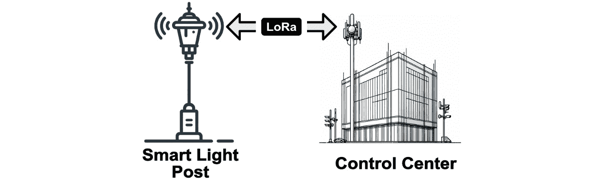

图 9.2 – 使用 LoRa 消息进行控制的智能路灯

这种控制方法有益，因为它允许根据实时数据和需求远程管理照明，例如根据交通状况或一天中的时间调整亮度。

为了更好地理解 LoRa 通信技术的应用，让我们考察它所使用的射频频谱，重点关注不同频率如何满足各种应用需求和场景。

## 调查射频频谱

无线电频谱被用于各种无线通信，包括电视广播、移动数据、卫星以及 LoRa 等物联网技术。频率被分配给特定用途，以避免干扰并优化通信效率。例如，**超高频**(**UHF**)波段通常用于电视广播、移动电话和 Wi-Fi。每个频段都有独特的特性，如传播范围和穿透能力，使它们适用于特定应用。

通常，低频，以其较长的波长为特征，可以传播更远的距离，并且比高频更有效地穿透障碍。相反，高频虽然波长较短，但由于其较大的带宽，能够携带更多的数据。这些特性对于确定不同类型通信的合适频段至关重要。

低频穿透力的一个常见例子是，当我们身处俱乐部外时，经常能听到音乐中低音或低频部分，但不会听到高频部分，因为低频比高频更擅长穿透俱乐部的墙壁。这种穿透物体的能力使得低频特别适用于需要覆盖较大区域或穿越障碍的通信。例如，像 AM 广播中使用的低频波段可以覆盖广阔的地理区域，而尽管高频提供了更多的带宽，但它们的覆盖范围较短，更适合具有**视距**(**LOS**)通信的城市环境。高频对于像手机通信这样的技术来说更受欢迎，因为它们可以携带更多的数据，提供更大的语音和数据传输容量。在 *图 9**.3* 中，我们可以看到用于无线通信及其特定频段内运行的相关技术的频率谱图：

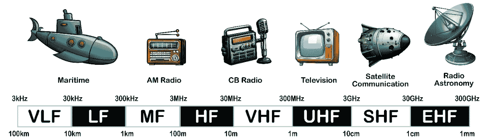

图 9.3 – 无线通信的频率谱

LoRa 在欧洲运行于 867-869 MHz 的未授权频段，在北美为 902-928 MHz，在澳大利亚为 915-928 MHz (*图 9**.4*). 这些频率的选择是为了平衡其覆盖范围和穿透力，非常适合 LoRa 所支持的低功耗、长距离通信。

具体的频段可以在 *图 9**.4* 中所示的范围内根据国家法规有所不同。我们应始终检查当地法规，以确保符合允许的特定频率：

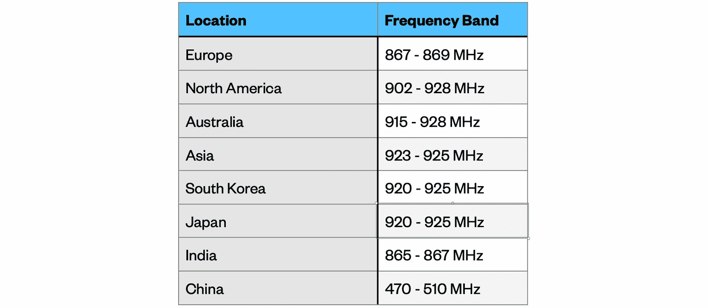

图 9.4 – 根据位置确定的 LoRa 频率

使用未授权频段伴随着监管限制，以确保公平使用并最小化干扰。在欧洲，868 MHz 频段受到 1%的占空比限制，限制了传输时间。在北美，915 MHz 频段有逗留时间限制，限制了信号在信道上的占用时间。

这些限制鼓励了频谱的有效使用和创新通信协议的开发，正如 LoRa 在这些框架中的有效性所展示的那样。在我们即将在下一节中开始编写 LoRa 代码时，我们将考虑这些限制，*构建一个 LoRa* *传感器发射器*。

现在我们已经对频谱和 LoRa 在其中的位置有了基本的了解，让我们来探讨**扩频因子**（**SF**），这是影响 LoRa 网络范围、数据速率和功率效率的关键参数。

## 理解 LoRa SF

LoRa 采用**跳频扩频**（**CSS**）技术，其中信号随时间变化频率以编码数据。这种技术提高了信号可靠性并最小化了功耗，使其非常适合长时间运行的物联网设备。LoRa 使用广泛的频率范围允许设备在长距离内保持连接，同时消耗更少的能量。在这个过程中，数据传输涉及在宽频谱内改变信号的频率，显著增强了其抗干扰和噪声的能力。

作为补充，LoRa 的 SF，这是 LoRa 通信中的一个关键参数，范围从`SF7`到`SF12`。SF 决定了每个符号（数据包）传输的持续时间，本质上平衡了传输范围和数据速率。较高的 SF 值，如`SF12`，可以扩展范围但降低数据速率，因此适合长距离通信。相比之下，较低的 SF 值，如`SF7`，在较短的距离上提供更快的速率。这种灵活性使得 LoRa 能够满足各种用例，从智能城市中人口密集的城市区域到需要长距离监控的偏远地区。

在*图 9.5*中，我们看到在农业环境中展示了 SF：

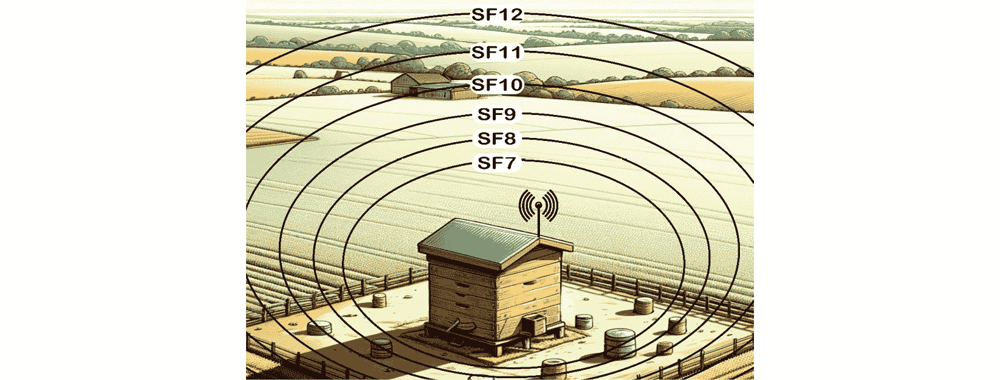

图 9.5 – 在农业环境中展示的 SF

随着 SF 数值的增加，范围也会增加，但更高的 SF 值由于传输时间的延长而需要更多的能量。为了有效通信，发送方和接收方必须配置相同的 SF。

现在我们已经探讨了 LoRa 通信技术，让我们将所学知识应用到 Raspberry Pi Pico 和 Pico W 上。

## 使用 Raspberry Pi Pico 和 Pico W 的 LoRa

在本章中，我们将开发一个 LoRa 传感器发射器和 LoRa 接收器。我们的 LoRa 传感器发射器将使用 Raspberry Pi Pico、DHT22 温度传感器和 RFM95W LoRa 模块。我们的 LoRa 接收器将使用 Raspberry Pi Pico W、LED 和 RFM95W LoRa 模块。我们可能会在 *图 9.6* 中看到我们的应用程序概述：

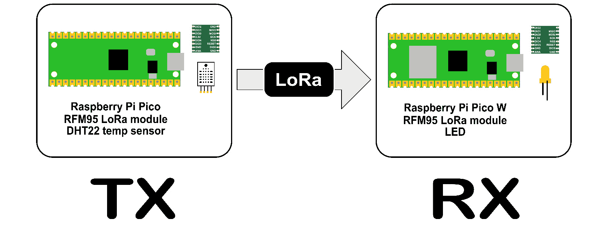

图 9.6 – LoRa 传感器发射器和 LoRa 接收器

我们将开始创建我们的应用程序，首先构建一个 LoRa 传感器发射器。在我们将温度传感器安装到测试电路中之前，我们将首先将 RFM95W LoRa 模块连接到 Raspberry Pi Pico。最后，我们将将这些组件安装到定制的 3D 打印机箱中。

# 构建 LoRa 传感器发射器

在本节中，我们将使用 Raspberry Pi Pico、RFM95W LoRa 模块和 DHT22 温度传感器构建一个带有温度传感器的 LoRa 传感器发射器。我们的目标是创建一个从 DHT22 温度传感器读取温度和湿度数据并使用 RFM95W LoRa 模块传输这些信息的设备。虽然我们可以轻松地将 Pico 替换为 Pico W，但我们将使用 Raspberry Pi Pico 而不是 Pico W 进行设计。

对于构建和测试我们的电路，我们将使用安装在 Pico GPIO 扩展器上的 Raspberry Pi Pico WH。使用 Pico WH 允许我们构建和测试适用于 Pico 和 Pico W 应用程序的电路。由于尺寸限制，我们将使用 Pico W 作为我们应用程序的接收器部分，而不是 Pico WH。

使用标准 Pico 而非 Pico W 的优势

除了成本优势外，Raspberry Pi Pico 相比于 Raspberry Pi Pico W，为我们提供的 LoRa 传感器发射器带来了更多好处。以其较低的功耗而闻名的标准 Pico，非常适合不需要 Wi-Fi 的任务。其更简单的设计导致固件开销减少，使设备能够将资源集中在特定任务上，而不是管理 Wi-Fi 连接。

我们还将构建一个定制的机箱来容纳我们的组件。这个机箱不仅提供保护，还将确保线路整齐，并提高我们 LoRa 传感器发射器的整体耐用性和便携性。我们将首先将电线添加到 RFM95W LoRa 模块，并将其连接到我们的 Raspberry Pi Pico WH 以进行开发。在我们将组件安装到定制机箱中时，我们将用 Pico 替换 Pico WH。

## 构建我们的电路

RFM95W 是一款紧凑型 LoRa 模块，因其长距离能力和低功耗而受到青睐。专为亚 GHz 频率操作设计，非常适合需要高效、长距离无线通信的应用。尽管体积小巧，RFM95W 在覆盖比传统无线技术更远距离方面表现出色，使其在开阔环境中特别有效。

我们将首先将跳线焊接在 RFM95W 上。

### 将电线添加到 RFM95W 上

RFM95W 模块的尺寸仅为 16 毫米乘以 16 毫米，非常小巧。在焊接跳线到 RFM95W 的孔时必须小心。这不是一个适合初学者焊接的工作。

在*图 9.7*的*步骤 1*中，我们看到在添加跳线之前 RFM95W 的样子。我们添加的跳线类型取决于我们选择的面包板选项。例如，在这种情况下，我们正在添加母跳线（*图 9.7*的*步骤 2*），因为我们将会使用 GPIO 扩展器为我们的 Raspberry Pi Pico WH：

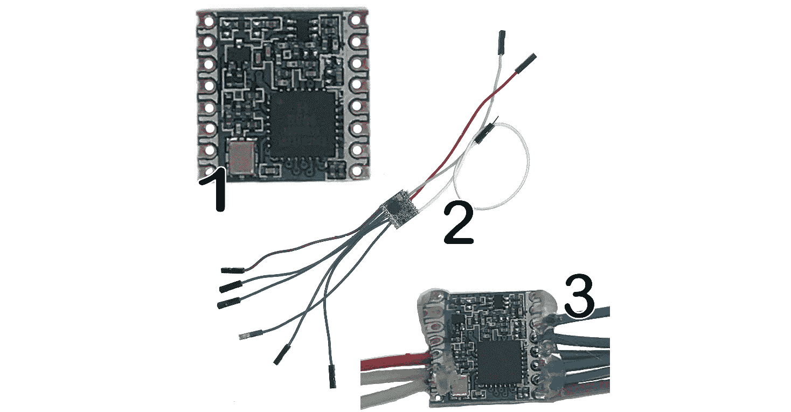

图 9.7 – 将线连接到 RFM95W

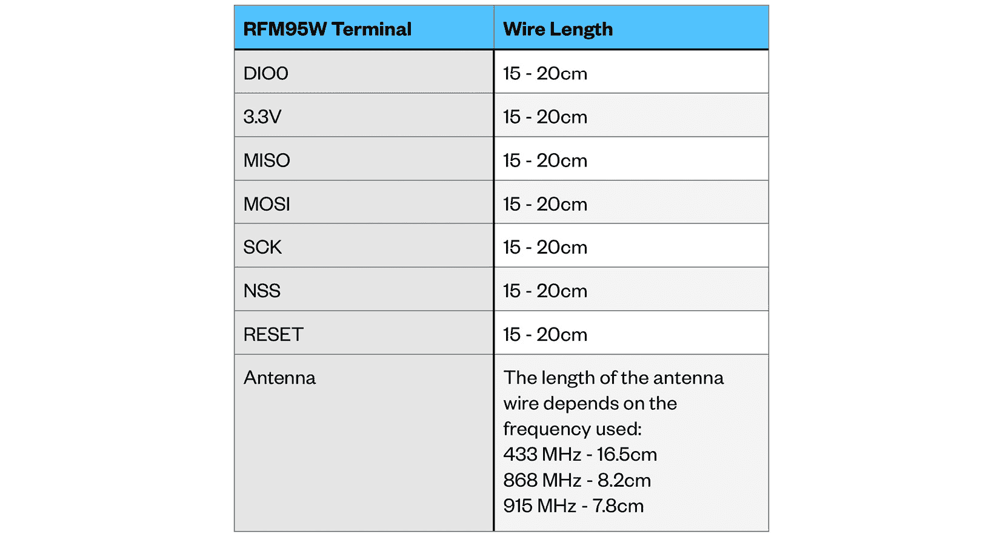

图 9.8 – RFM95W 的接线引脚

我们不需要将线焊接在 RFM95W 的每个端子上。在*图 9.8*中，我们概述了需要跳线的端子和所需的线长：

我们的表格显示，我们使用的天线线长度取决于我们选择的 RFM95W LoRa 模块的具体频率型号。为了适应这种变化，我们设计了不同版本的定制外壳以适应每个型号。

每个版本都包含一个直天线线封装，有效地创建了一个针对相应频率定制的内置天线。这个设计特点对我们这些遇到过低成本天线无法准确匹配其标称频率的问题的人来说特别有吸引力。

Adafruit RFM95W LoRa 无线收发器扩展板

对于那些希望使用比标准 RFM95W 更大的 LoRa 板的人来说，Adafruit RFM95W LoRa 无线收发器扩展板是一个不错的选择。与我们的 RFM95W 不同，这个板子适合面包板使用，使用了引脚头。

为了加强 RFM95W 上跳线的焊接连接，我们可以使用热胶枪上的胶水，如*图 9.7*的*步骤 3*中详细说明。我们使用这些跳线将模块插入 Raspberry Pi Pico WH GPIO 扩展器进行初始测试和原型制作。

### 组装我们的电路

在将跳线焊接到我们的 RFM95W 模型后，我们现在可以在 Raspberry Pi Pico GPIO 扩展器上构建我们的电路。*图 9.9*展示了 Raspberry Pi Pico、Raspberry Pi Pico WH 和 RFM95W LoRa 模块的接线图：


图 9.9 – 将 RFM95W 模块连接到 Raspberry Pi Pico

为了完成我们的电路，我们使用*图 9.10*中的接线图将 DHT22 温度传感器添加到电路中：

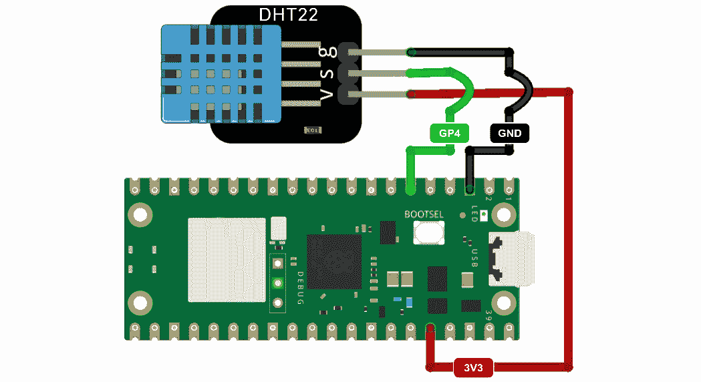

图 9.10 – 将 DHT22 连接到 Raspberry Pi Pico (WH)

在*图 9.11*（*A*）中，我们通过使用带有 GPIO 扩展器的 Raspberry Pi Pico（在添加 DHT22 之前）来获得我们电路布局的实际视图。在我们的例子中，我们正在使用 Raspberry Pi Pico WH 和 GPIO 扩展器进行电路构建和测试：

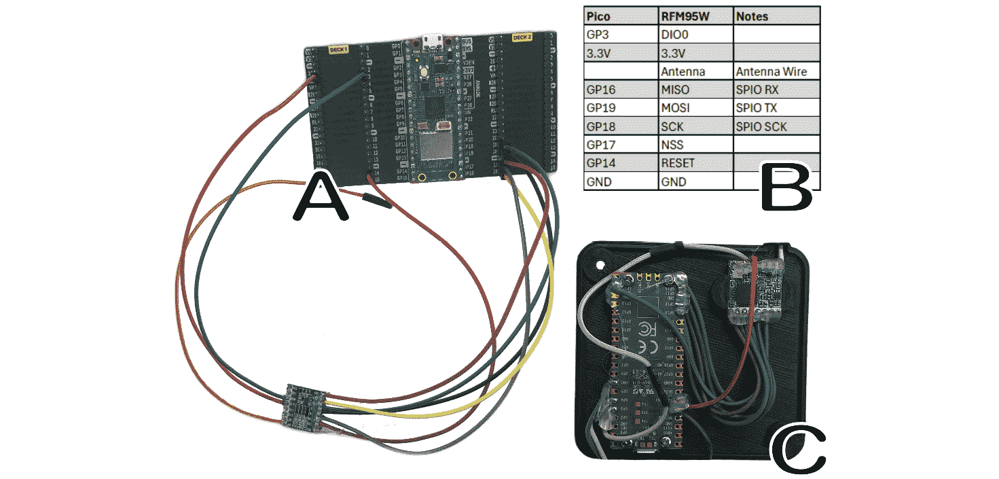

图 9.11 – 配有 GPIO 扩展器和 RFM95W LoRa 模块的 Raspberry Pi Pico WH

我们可以在 *图 9.11* (*B*) 中看到一个表格，显示了线缆连接，以及我们的 Raspberry Pi Pico 和 RFM95W 连接在一起时的样子（*图* *9.11* (*C*))。

在我们的电路连接好之后，我们现在可以编写代码，通过 LoRa 发送温度和湿度数据。我们将使用 Thonny 作为我们的开发环境，并使用 CircuitPython 固件。

## 开发代码

由于这些 Python 实现之间存在几个关键差异，因此我们的应用程序将使用 **CircuitPython** 而不是 **MicroPython**。CircuitPython 是 Adafruit 开发的 MicroPython 衍生品，为特定用例提供了更流畅的体验，特别是其全面的库支持。

我们将首先通过将 CircuitPython 固件安装到我们的 Raspberry Pi Pico WH 上来开始我们的开发。

### 设置 CircuitPython 和传感器库

我们使用 Thonny IDE 为 Raspberry Pi Pico (WH) 开发我们的应用程序，这是一个兼容各种开发环境（如 Raspberry Pi、Windows、Linux 和 macOS）的工具。在我们的示例中，我们正在 Windows 上使用 Thonny。

在设置 Raspberry Pi Pico (WH) 方面，通过 Thonny 安装 CircuitPython 是一个简单的过程，就像我们安装 MicroPython 一样。

要在我们的 Raspberry Pi Pico (WH) 上安装 CircuitPython，我们执行以下操作：

1.  如果我们的操作系统上没有 Thonny，我们访问 Thonny 网站，下载合适的版本（[`thonny.org`](https://thonny.org)）。

1.  然后，我们使用适合我们操作系统的适当方法启动 Thonny。

1.  在按住 Pico（WH）上的 *BOOTSEL* 按钮的同时，即靠近 USB 端口的白色小按钮，我们将它插入一个可用的 USB 端口，并忽略可能出现的任何弹出窗口：

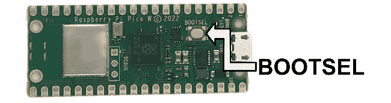

图 9.12 – Pico WH（与 Pico 相似）上的 BOOTSEL 按钮

1.  然后，我们在屏幕右下角点击解释器信息，并选择**安装 CircuitPython…**：

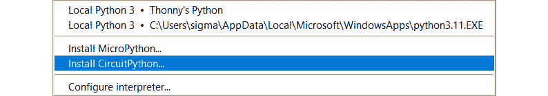

图 9.13 – 安装 CircuitPython… 选项

1.  对于 `RPI-RP2 (D:)`)。在我们的示例中，我们选择了**Raspberry Pi • Pico / Pico H** CircuitPython 变体和最新版本：

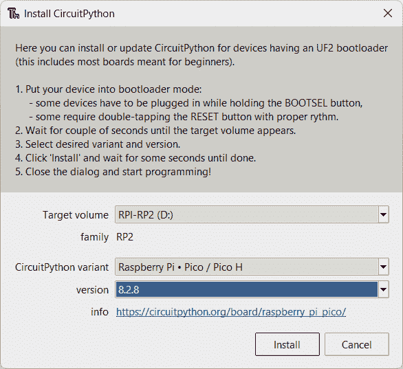

图 9.14 – 在 Raspberry Pi Pico W 上安装 MicroPython

1.  尽管我们在 Pico WH 上进行开发，但我们将其视为一个用于开发的 Pico。我们点击**安装**按钮，然后在安装完成后点击**关闭**按钮。

1.  要将 Thonny 配置为在我们的 Pico（WH）上运行 CircuitPython 解释器，我们从屏幕右下角选择它：

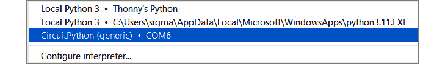

图 9.15 – 选择 CircuitPython 解释器

1.  我们通过检查 **Shell** 来确认 Thonny 是否在我们的 Raspberry Pi Pico (WH) 上使用 CircuitPython 解释器：

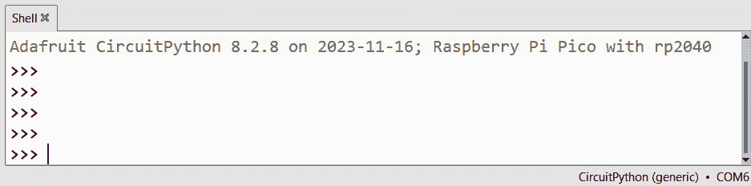

图 9.16 – Thonny 中的 CircuitPython 提示

在安装了 CircuitPython 之后，我们现在可以安装我们代码所需的库。这涉及到从 Adafruit 网站下载包，并将我们需要的库文件复制到我们的 Raspberry Pi Pico (WH) 上。

要这样做，我们执行以下操作：

1.  使用网页浏览器，我们导航到以下 URL：[`circuitpython.org/libraries`](https://circuitpython.org/libraries)。

1.  由于我们使用的是 CircuitPython 8，我们下载 `adafruit-circuitpython-bundle-8.x-mpy-20231205.zip` ZIP 文件，并将其解压到我们的计算机上的某个位置。

1.  我们感兴趣的文件是 `adafruit_rfm9x.mpy` 和 `adafruit_dht.mpy`，这两个文件都可以在解压目录的 `lib` 文件夹中找到。这些文件分别是我们的 RFM95W 和 DHT22 传感器的库文件。要从 Thonny 将这些库安装到我们的 Raspberry Pi Pico (WH) 上，我们在 **文件** 部分找到它们，然后右键点击以获取以下对话框：

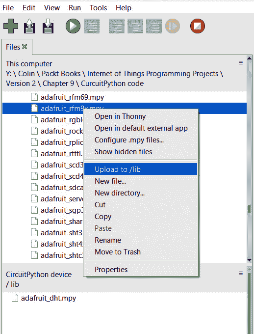

图 9.17 – 将库文件上传到 Raspberry Pi Pico (WH)

1.  我们必须确保将这些库上传到我们的 Pico (WH) 上的 `lib` 文件夹，而不是根目录。这涉及到在 Thonny 的 **CircuitPython 设备** 部分下双击 `lib` 文件夹以打开它。在将库上传到 Pico (WH) 之后，我们的 Pico (WH) 上的文件结构应该如下所示：

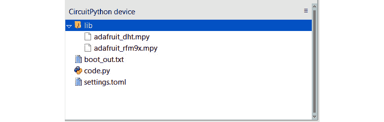

图 9.18 – 上传库后 Pico 文件结构

在我们的电路搭建好，并安装了 CircuitPython 和库之后，现在是时候编写我们的代码了。正如我们将看到的，我们不需要大量的代码就能通过 LoRa 发送温度和湿度数据。

### 创建 LoRa 传输代码

为了符合不同的监管标准，我们将为我们的 LoRa 传输使用延迟。虽然欧洲的 1% 负载周期限制允许消息之间有 99 秒的延迟，但鉴于温度和湿度数据的稳定性，我们将此延迟扩展到 120 秒，这将导致负载周期大约为 0.83%。

尽管北美法规侧重于占用时间，即发射机占用频率通道的时间段而不是负载周期，但我们为了统一性采用这种负载周期方法。由于作者位于北美，我们将使用 RFM95W 的 915 MHz 频率版本来应用我们的应用。

要编写我们的 LoRa 传输代码，我们执行以下操作：

1.  我们将我们的 Raspberry Pi Pico (WH) 连接到 USB 端口并启动 Thonny。我们可以使用 Raspberry Pi 或其他操作系统来完成这个操作。在我们的例子中，我们正在 Windows 上使用 Thonny。

1.  然后，我们从屏幕的右下角选择 Pico (WH) 上的 CircuitPython 环境，以激活它。

1.  在一个新标签页中，我们输入以下代码：

    ```py
    import time
    import board
    import busio
    import digitalio
    import adafruit_rfm9x
    import adafruit_dht
    spi = busio.SPI(board.GP18, MOSI=board.GP19, MISO=board.GP16)
    cs = digitalio.DigitalInOut(board.GP17)
    rst = digitalio.DigitalInOut(board.GP14)
    rfm9x = adafruit_rfm9x.RFM9x(spi, cs, rst, 915.0)
    dht_sensor = adafruit_dht.DHT22(board.GP4)
    print("Sending temperature and humidity data every 120 seconds")
    while True:
        try:
            temperature = dht_sensor.temperature
            humidity = dht_sensor.humidity
            data = f"Temp: {temperature}C, Humidity: {humidity}%"
            rfm9x.send(bytes(data, "utf-8"))
            print("Sent:", data)
        except RuntimeError as e:
            print("DHT22 read error:", e)
        time.sleep(120)
    ```

    在我们的代码中，我们执行以下操作：

    1.  `time`，`board`，`busio`，`digitalio`，`adafruit_rfm9x`（用于 LoRa 通信）和 `adafruit_dht`（用于 DHT22 传感器）。

    1.  **然后设置 SPI 通信**：我们使用特定的 GPIO 引脚（GP18，GP19，GP16）配置 SPI，用于 RFM95W LoRa 模块。

    1.  **我们初始化芯片选择（CS）和复位（RST）引脚**：我们为 CS（GP17）和 RST（GP14）引脚设置数字 I/O。

    1.  **然后创建一个 RFM95W LoRa 对象**：我们初始化 RFM9x 对象以在 915.0 MHz 的频率上进行 LoRa 通信。此值应根据当地法规设置。

    1.  **我们初始化 DHT22 传感器**：我们在 GPIO 4（GP4）上设置 DHT22 温度和湿度传感器。

    1.  **然后打印一个状态消息**：我们指示每 120 秒将发送温度和湿度数据。

    1.  **我们持续发送数据**：在一个无限循环中，我们从 DHT22 传感器读取温度和湿度，格式化数据，并通过 LoRa 发送。如果发生读取错误，我们打印错误消息。

    1.  **然后我们在传输之间延迟**：我们在发送下一组数据之前等待 120 秒。

1.  要保存文件，我们从下拉菜单中选择 **文件** | **另存为...**。这将打开以下对话框：


图 9.19 – 将文件保存到我们的 Raspberry Pi Pico (WH)

1.  在此对话框中，我们被提供选择文件存储位置的选择。要将文件保存到我们的 Raspberry Pi Pico (WH)，我们点击相应的按钮。

1.  然后，我们将文件命名为 `code.py` 并点击 `code.py` 是特殊的，因为系统在启动或重置时自动执行此文件，使其成为设备启动时运行的默认脚本。

我们使用的是哪个 SF？

在我们的代码中，我们没有明确设置 SF，因此使用的是 `adafruit_rfm9x` 库的默认值。通常，这是一个 SF 为 `7` 的值。由于我们正在使用默认的 SF 为 `transmit` 和 `receive` 节点，因此在我们的应用程序中不需要关注此设置。

1.  要运行我们的代码，我们点击绿色运行按钮，在键盘上按 *F5*，或者点击顶部菜单的 **运行** 选项，然后点击 **运行** **当前脚本**。

1.  在 **Shell** 中，我们将看到一个通知，确认已创建包含温度和湿度数据的 LoRa 消息：

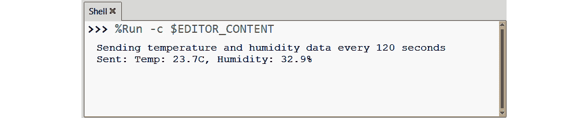

图 9.20 – LoRa 消息通知

回顾一下，我们刚刚创建了一个无线发送温度和湿度传感数据的 LoRa 传感器发射器。如果没有错误，我们可以合理地假设我们的 LoRa 消息已成功传输。然而，没有 LoRa 接收器，我们无法确认这一点。我们将在下一节中通过构建一个接收器来解决这个问题。在构建接收器之前，我们首先将我们的组件放入一个定制的 3D 打印外壳中。

## 在定制外壳中安装组件

继续我们之前项目的实践，我们将把我们的组件安装在一个定制外壳中。这种方法允许我们在需要的地方方便地放置我们的 LoRa 传感器发射器。我们可以在 *图 9**.21* 中看到我们的 LoRa 传感器发射器的定制外壳。

我们的定制外壳设计容纳了 DHT22 传感器，允许它从前端伸出，以进行准确的温度和湿度读取。天线，一根焊接在 RFM95W 模块上的直导线，被放置在连接到外壳底板的突出部分中。一个专门为此目的设计的天线盖完成了封闭，保护并隔离了天线。定制外壳的 915 MHz 版本在 *图 9**.21* 中显示：

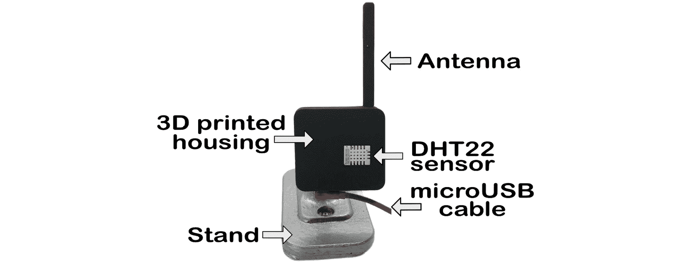

图 9.21 – 用于我们 LoRa 发射节点的定制外壳

我们的定制外壳在后面设计了一个多功能的 GoPro 式挂钩，使得它能够与我们在本书早期章节中构建的各种支架兼容。这一特性使得我们的 LoRa 传感器发射器易于且灵活地安装。

Raspberry Pi Pico 上的微型 USB 端口是暴露的，这使得我们可以为我们的设备供电。我们也可以使用这个端口来编程我们的 Raspberry Pi Pico。

使用移动电源为我们的 Raspberry Pi Pico 供电

我们可以使用标准的手机移动电源远程为我们的节点供电。然而，选择一个不会因为低功耗而自动关机的移动电源很重要，因为 Raspberry Pi Pico 的功耗要求很低。

我们将开始构建我们的定制外壳，首先识别部件。

### 识别我们的定制 LoRa 外壳的部件

我们的定制外壳由 3D 打印部件组成，可以拧在一起。我们可以在 *图 9**.22* 中看到部件和主要组件：

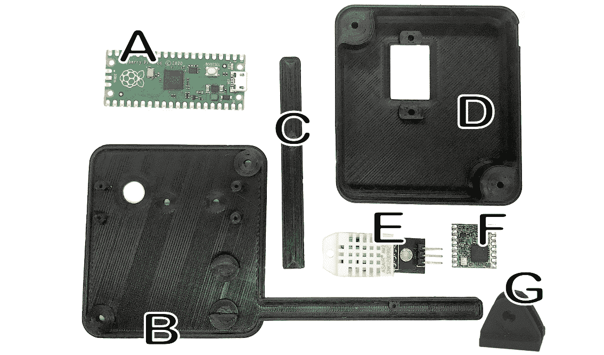

图 9.22 – 定制外壳的部件

让我们逐一分析每个部件：

+   Raspberry Pi Pico (*A* 在 *图 9**.22*): 由于空间限制，我们使用无引脚版本的 Raspberry Pi Pico。

+   后盖 (*B* 在 *图 9**.22*): 后盖固定了 Raspberry Pi Pico 和 RFM95W LoRa 模块。天线延长部分的长度基于所使用的频率模型。在这个例子中，我们看到的是 915 MHz 模型。

+   天线盖 (*C* 在 *图 9**.22*): 天线盖用于将带后盖 (*B*) 的线状天线封闭起来。

+   前壳（*图 9.22*中的*D*）：前壳固定 DHT22 传感器，并封闭后板（*图 9.22*中的*B*），以完成外壳。

+   DHT22 温度和湿度传感器（*图 9.22*中的*E*）。

+   RFM95W LoRa 模块（*图 9.22*中的*F*）：所示版本是 915 MHz 型号。

+   连接器（*图 9.22*中的*G*）。

+   2 x M3 10 mm 螺栓（未显示）。

+   4 x M2 5 mm 螺丝（未显示）。

在识别了部件后，现在是时候组装我们的定制外壳了。

### 构建定制的 LoRa 外壳

要构建定制外壳，我们遵循*图 9.23*中显示的步骤和以下概述：

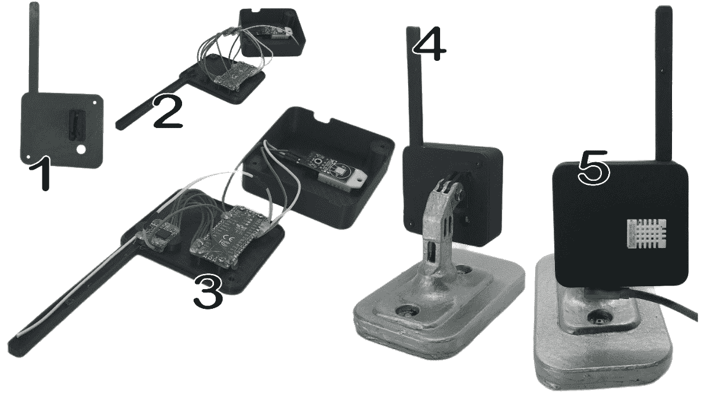

图 9.23 – 构建定制外壳的步骤

1.  我们首先使用环氧胶或两个 M2 5 mm 螺丝（*图 9.23*，步骤 1）将连接器（*图 9.22*中的*G*）固定在后板（*图 9.22*中的*B*）上。

1.  使用*图 9.9*和*图 9.10*中的接线图，我们将 RFM95W 和 DHT11 传感器的电线焊接到 Raspberry Pi Pico 上。

1.  使用四个 M2 5 mm 螺丝，我们将 Raspberry Pi Pico（*图 9.22*中的*A*）固定在后板（*图 9.22*中的*B*）上，使得 USB 端口向下并指向后板底部或远离天线（*图 9.23*，步骤 2）。

1.  使用热胶枪，我们将 DHT22（*图 9.22*中的*E*）固定在前壳（*图 9.22*中的*D*）上。或者，根据 DHT22 上存在的孔，可以使用两个 M3 5 mm 螺栓（*图 9.23*，步骤 3）。

1.  我们将 RFM95W（*图 9.22*中的*F*）摩擦固定在后板（*图 9.22*中的*B*）上，使得天线线紧挨着后板上的线槽并延伸出来（*图 9.23*，步骤 3）。如果 RFM95W 没有固定好，可以使用热胶枪的胶水将其固定在原位。

1.  使用两个 M3 10 mm 螺栓，我们将后板固定到前壳上（*图 9.23*，步骤 4）。

1.  我们使用两个 M2 5 mm 螺丝将天线盖（*图 9.22*中的*C*）固定在后板的前面。

由于我们使用了一个单独的 Raspberry Pi Pico WH 来编写代码，因此我们需要在新的 Pico 上安装 CircuitPython、必要的库以及我们的代码。建议使用 Thonny 测试代码，以检查在将组件安装到定制外壳中时可能出现的任何问题。

现在我们已经准备好了 LoRa 传感器发射器，我们将继续构建一个 LoRa 接收器。这个设备将负责从发射器接收传感器信息。我们将保持接收器设计简单，其主要功能是确认接收 LoRa 消息。为此，一个 LED 灯足以指示状态。

# 构建 LoRa 接收器

在*图 9**.6 中，我们看到 LoRa 接收器正在处理来自我们的 LoRa 传感器发射器的消息。我们的接收器设计简单，只需要一个 LED 来确认接收到的消息。我们正在使用 Raspberry Pi Pico W 作为接收器，因为我们计划在下一章利用其 Wi-Fi 功能并将传感器数据发布到互联网。

我们不会介绍在 LoRa 接收器的 Pico W 上安装 CircuitPython 或所需库的步骤，因为我们已经为 LoRa 传感器发射器介绍了这些步骤，我们只需为接收器做相同的事情。我们应该使用本项目的 Pico W 版本的 CircuitPython，因为我们将在下一章实现 Wi-Fi 功能。

此外，我们不会详细说明为 LoRa 接收器构建定制外壳的过程，因为它与发射器的过程类似。关键的区别是在前壳中用带有电阻和 LED 支架的 LED 替换 DHT22 传感器。安装 LED 的步骤在*第六章*的*图 6.22*和*图 6.23*中已有概述。

在本节中，我们将重点关注 LoRa 接收器的代码，并突出展示 LoRa 传感器发射器和 LoRa 接收器在户外测试的结果。

我们将从 LED 与电阻连接到 Raspberry Pi Pico W 的布线图开始。

## 将 LED 连接到 Raspberry Pi Pico W

对于我们的 LoRa 接收器，我们需要一个 LED 来用于确认 LoRa 消息。根据我们在本书中到目前为止所学的内容，我们可以轻松地通过添加一个 OLED 屏幕等更健壮的视觉方式来增强我们的 LoRa 接收器。由于我们旨在仅关注确认 LoRa 信号，我们将坚持使用简单的 LED。我们可以在运行 LoRa 接收器的同时，在 Thonny 的 Shell 中监控 LoRa 消息：

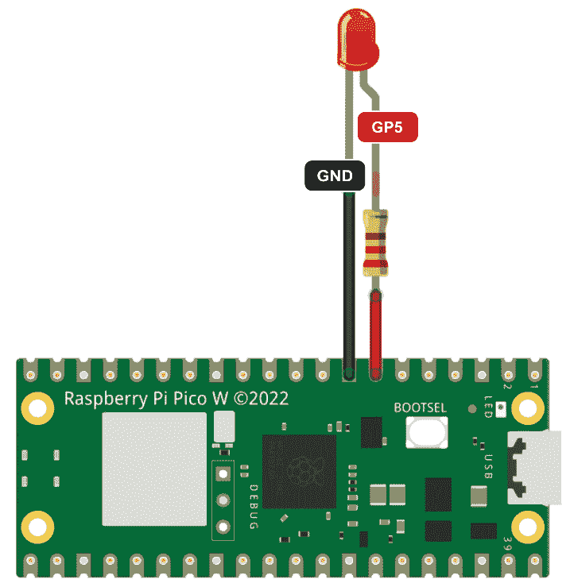

图 9.24 – Raspberry Pi Pico W，220 欧姆电阻和 LED

要将 LED 连接到我们的 Raspberry Pi Pico W，我们需要在 LED 的正极上焊接一个 220 欧姆的电阻。然后我们将电阻连接到 Pico 的 GP5 端口。对于地线，我们将 LED 的负极连接到 Pico W 上的任何 GND 引脚（*图 9**.24*）。

将 220 欧姆电阻和 LED 连接到我们的 Pico W 后，我们使用上一节中*构建 LoRa* *传感器发射器*的步骤将 RMM95W LoRa 模块连接到我们的 Pico W。

现在我们已经准备好开始编写代码。

## 创建接收 LoRa 消息的代码

我们的 LoRa 接收器代码使用 Adafruit `adafruit_rfm9x`库来监听 LoRa 消息。在接收到消息后，它将消息打印到 Thonny 的 Shell 中，并使 LED 闪烁两次。

要编写我们的 LoRa 接收器代码，我们需要做以下几步：

1.  我们将 Raspberry Pi Pico W 连接到 USB 端口并启动 Thonny。我们可以使用 Raspberry Pi 或其他操作系统来完成这项工作。

1.  然后，我们从屏幕的右下角选择 CircuitPython 环境，以激活我们的 Pico W。

1.  在一个新标签页中，我们输入以下代码：

    ```py
    import time
    import board
    import busio
    import digitalio
    import adafruit_rfm9x
    spi = busio.SPI(board.GP18, MOSI=board.GP19, MISO=board.GP16)
    cs = digitalio.DigitalInOut(board.GP17)
    rst = digitalio.DigitalInOut(board.GP14)
    rfm9x = adafruit_rfm9x.RFM9x(spi, cs, rst, 915.0)
    led = digitalio.DigitalInOut(board.GP5)
    led.direction = digitalio.Direction.OUTPUT
    print("Listening for LoRa messages...")
    def flash_led(times, duration):
        for _ in range(times):
            led.value = True
            time.sleep(duration)
            led.value = False
            time.sleep(duration)
    while True:
        packet = rfm9x.receive()
        if packet is not None:
            print("Received message:", packet)
            flash_led(2, 0.5)
    ```

    在我们的代码中，我们执行以下操作：

    1.  我们首先导入必要的库：`time`、`board`、`busio`、`digitalio`和`adafruit_rfm9x`用于 LoRa 通信。

    1.  然后我们通过配置 SPI 使用 GPIO 引脚 GP18（SCK）、GP19（MOSI）和 GP16（MISO）来设置 SPI 通信。

    1.  我们通过将 GP17 设置为 CS 和 GP14 设置为 RST 来初始化 CS 和 RST 引脚。

    1.  我们创建了一个 RFM95W LoRa 对象，并初始化该对象以进行 915.0 MHz 的通信。

    1.  我们在 GP5 初始化一个 LED。

    1.  然后我们打印一条状态消息，表明设备正在监听 LoRa 消息。

    1.  我们定义了一个用于闪烁 LED 的函数，这样我们就可以用设定的持续时间闪烁 LED 指定次数。

    1.  在一个连续的循环中，我们监听 LoRa 消息，检查传入的 LoRa 数据包，打印任何接收到的消息，并在接收到数据包时闪烁 LED 两次，每次 0.5 秒。

1.  要保存文件，我们从下拉菜单中选择**文件** | **另存为...**。这将打开**保存位置**对话框。

1.  在此对话框中，我们被提供了选择文件存储位置的选择。为了将其保存在我们的 Raspberry Pi Pico W 上，我们点击相应的按钮。

1.  然后我们将文件命名为`code.py`并点击**确定**。

1.  要运行我们的代码，我们点击绿色运行按钮，在键盘上按*F5*，或者点击顶部的**运行**菜单选项，然后点击**运行** **当前脚本**。

1.  如果它还没有运行，我们打开电源并运行 LoRa 传感器发射器。

1.  在 Shell 中，我们将看到一条通知，确认收到了 LoRa 消息：

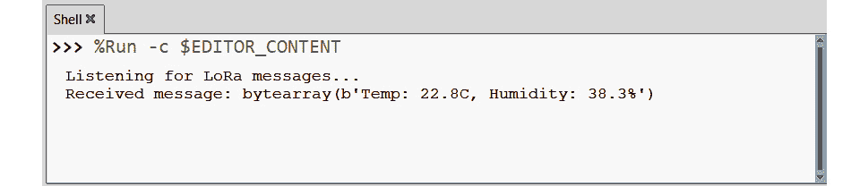

图 9.25 – 接收 LoRa 消息

1.  我们还应该观察我们的 LED 闪烁两次。

正面结果不仅证实了我们的 LoRa 接收器工作正常，而且我们的 LoRa 传感器发射器也是如此。为了充分利用我们的应用程序，我们需要将我们的发射器和接收器放在室外。为此，我们应该将我们的 LoRa 接收器安装在其自己的定制外壳中。正如提到的，我们遵循为 LoRa 传感器发射器概述的相同步骤，用电阻代替 LED，用 DHT22 温度传感器代替 LED 支架。

在 LoRa 传感器发射器和 LoRa 都准备好后，是时候将我们的应用程序带到户外了。

## 测试我们的应用程序

LoRa 通信以其覆盖长距离的能力而闻名，这是它在无线通信技术领域的独特之处。虽然典型的 LoRa 传输在城市环境中从几公里到农村地区超过 10 公里，但在最佳条件下，这项技术已经显示出更大的潜力。使用仅 25 mW 的传输功率，一项世界纪录被打破，LoRa 传输达到了 766 公里（476 英里）。这一记录突出了 LoRa 卓越的远程能力，尤其是在条件有利且设置优化以实现最大范围的情况下。

在*图 9.26*中，我们观察了在 160 米距离上测试我们应用程序的结果：

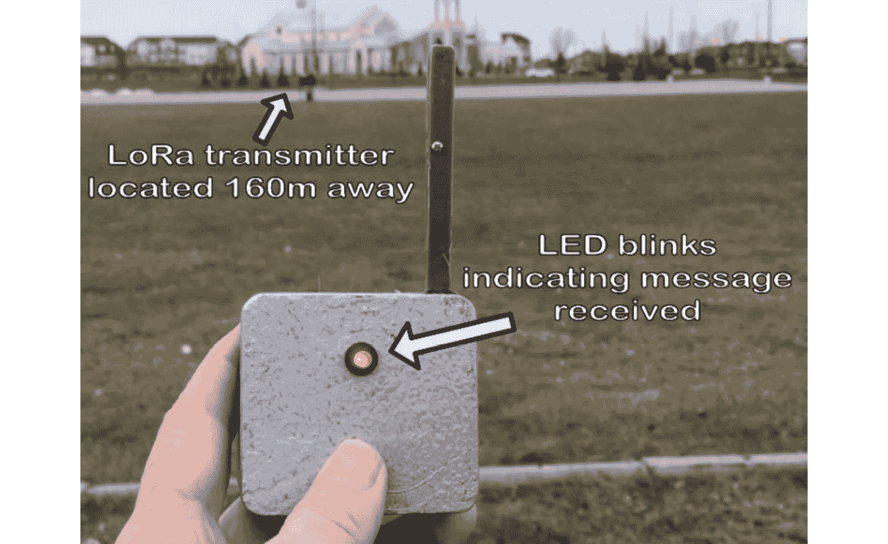

图 9.26 – 在 160 米距离上测试我们的 LoRa 传感器发射器和 LoRa 接收器

交替的测试方法

我们还可以通过应用吹风机等热源的热量来测试我们的应用程序，或者甚至将我们的 LoRa 发射器放入冰箱中并观察结果。

对于 LoRa 来说，这个距离虽然不大，但在考虑诸如农场监控等应用时却具有重要意义，在这些应用中，传感器可以分布在广阔的区域，远远超出传统 Wi-Fi 网络的覆盖范围，Wi-Fi 网络通常在室内约 50 米，在开阔空间中不到 100 米。

# 摘要

在本章中，我们探讨了 LoRa 技术，这是物联网通信的一个重要组成部分。我们首先讨论了 LoRa 在低功耗下传输数据的能力，强调了它在无线技术中的重要性。我们研究了其在农业中的应用，它改善了作物管理中的传感器网络管理，以及在城市环境中的智能城市倡议，如街道照明控制。

我们随后检查了 LoRa 在射频频谱中的技术方面。这包括理解频率是如何分配给无线通信的，这对于确定 LoRa 传输的正确频段非常重要。

在我们的动手部分，我们分别使用 Raspberry Pi Pico 和 Pico W 构建了 LoRa 传感器发射器和 LoRa 接收器。这包括构建一个带有 LoRa 模块和温度传感器的发射器，以及使用简单的 LED 确认的 LoRa 接收器。

在下一章中，我们将进一步探讨，我们将我们的 LoRa 接收器连接到互联网，并使用它来控制我们在*第三章*中创建的新版本模拟仪表式天气指示器。
