# 11

# 介绍 ROS

在本章中，我们介绍了**机器人操作系统**（**ROS**），这是一个用于开发机器人应用的强大工具。我们将探讨 ROS 在机器人领域的意义，并详细说明在 Raspberry Pi 4 上设置 ROS 的过程。这涉及到用 Ubuntu 替换标准 Raspberry Pi OS，因为 Ubuntu 与 ROS 特定版本的兼容性和优化。

我们将从设置和运行用户友好的 ROS 模拟器**TurtleSim**开始我们的动手练习。我们将这样做是为了了解基本的 ROS 概念和操作。从简单的键盘控制开始，我们将学习如何在模拟器环境中指挥和操纵虚拟机器人。随后，我们将通过使用**消息队列遥测传输**（**MQTT**）消息来控制 TurtleSim 模拟器，以此开始弥合模拟与现实应用之间的差距。

通过与 TurtleSim 合作开发技能，我们将为构建名为 A.R.E.S.（代表高级机器人眼睛用于安全）的高级物联网机器人做好准备。A.R.E.S.是本书的最终和最复杂的项目，并将包括剩余的章节。

本章我们将涵盖以下主题：

+   探索 ROS

+   在我们的 Raspberry Pi 上安装 Ubuntu 和 ROS

+   运行和控制模拟机器人

让我们开始吧！

# 技术要求

完成本章所需的以下要求：

+   Python 编程的中级知识

+   基本的 Linux 命令行知识

+   用于 MQTT 服务器实例的 CloudAMQP 账户

+   新款 Raspberry Pi 4 或任何能够安装 Ubuntu 的计算机（本章使用了安装了 Ubuntu 的 Mac mini）

+   microSD 卡和 microSD-USB 适配器

本章的代码可以在以下位置找到：

[`github.com/PacktPublishing/-Internet-of-Things-Programming-Projects-2nd-Edition/tree/main/Chapter11`](https://github.com/PacktPublishing/Internet-of-Things-Programming-Projects-2nd-Edition/tree/main/Chapter11)

# 探索 ROS

在本节中，我们将探索 ROS 的基本知识。本节绝对不是对 ROS 网站上可能找到的优秀文档的深入替代。

ROS 是一个用于机器人应用的**开源软件**（**OSS**）开发套件，提供了一个连接研究和生产的标准平台。设计用于加速机器人开发过程，ROS 简化了机器人系统的创建。它是 100%开源且商业友好的。

我们的目标是建立一个共同的知识库，为我们提供完成本章项目以及最终 A.R.E.S.机器人所需的 ROS 的基本概念和工具。我们将从概述本章的主要项目开始：使用 MQTT 消息控制 ROS TurtleSim 虚拟机器人。

## 检查我们的 TurtleSim 控制器 ROS 应用

TurtleSim 是 ROS 提供的一个轻量级机器人模拟器，主要用于学习 ROS 概念的教育工具。它提供了一个简单的界面，用于教授 ROS 的基础知识，使用户能够在安全和受控的环境中实验命令并观察模拟机器人的行为。

在本章的主要项目中，我们将使用 MQTT 消息来控制 TurtleSim 实例，根据我们发送到 MQTT 实例的 `move` 主题的消息，命令机器人画圆或停止移动。

在 *图 11*.1 中，我们看到我们的应用程序被展示出来。使用 Windows 中的 MQTT-Explorer 创建的消息被发送到我们在 ROS 中创建的 `circle` 节点。根据消息，我们发送 `draw_circle` 或 `stop`，将 `cmd_vel` 主题的 ROS 消息发送到 TurtleSim 实例。这种内部消息使用发布者和订阅者，类似于 MQTT 通信的执行方式：

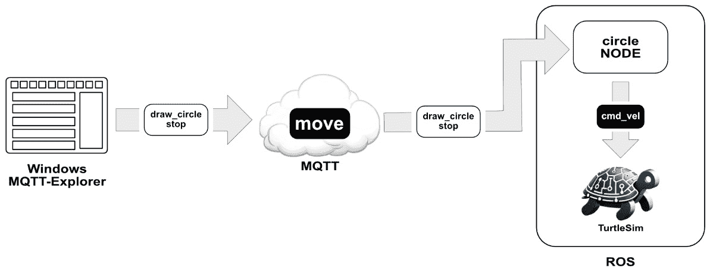

图 11.1 – 使用 MQTT 消息控制模拟机器人

对于本章的应用程序，我们将直接使用 MQTT-Explorer 应用程序发送消息。在下一章中，我们将使用 Raspberry Pi Pico W 构建一个物联网摇杆，并使用它来控制模拟机器人。

现在我们已经概述了本章的目标，让我们退后一步，对 ROS 概念有一个基本的了解。这个概述将为我们提供对其架构和在机器人技术中角色的基本洞察。

## 理解 ROS 节点通信

ROS 支持广泛的平台和应用，包括 Linux、Windows、macOS 和嵌入式系统，使其非常灵活。其模块化框架基于节点、主题、服务和动作的概念。ROS 中的节点是执行特定计算的单个进程，而主题作为节点之间通过发布者-订阅者机制交换消息的通信渠道。

对于我们的应用程序，我们将使用主题和发布者-订阅者模型，将来自我们自定义 `circle` 节点的 `cmd_vel` 主题的 `vel_msg` 消息发送到 TurtleSim 虚拟机器人的实例。尽管发布者可能有多个订阅者，但我们将只使用一个 TurtleSim 实例来订阅我们在自定义节点中构建的发布者。以下图示说明了这一点：

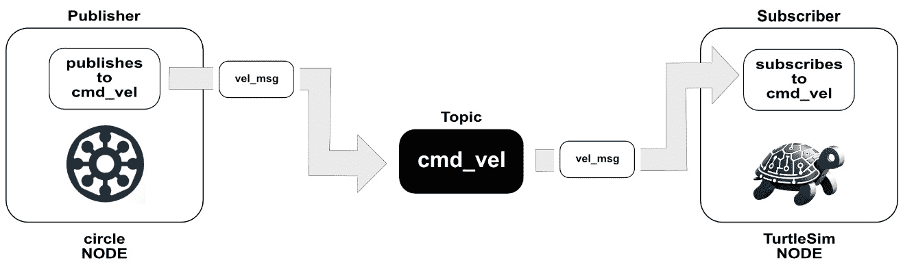

图 11.2 – ROS 内部发布者-订阅者模型视图

ROS 中的服务为节点提供了执行请求-响应交互的方式，这对于需要即时反馈的任务非常有用。动作提供了一种执行需要持续反馈和取消可能性的长时间运行任务的方法。我们不会在我们的应用程序中使用服务或动作。

现在我们对 ROS 节点通信有了一定的了解，让我们来看看 ROS 中的项目结构。

## 调查 ROS 项目的结构和组织

ROS 项目的结构是为了高效地开发和管理工作机器人应用而组织的。在其核心，一个 ROS 项目是围绕软件包和工作空间的概念构建的，这对于组织机器人项目的各种组件至关重要。以下列表总结了 ROS 项目的关键概念：

+   **软件包和工作空间**：一个 ROS 工作空间是一个目录（或文件夹），其中开发并编译 ROS 软件包。每个软件包，通常在工作空间内的一个目录，代表机器人特定的功能或组件，例如传感器、执行器、算法，甚至是一组相关的节点。软件包可以包含 ROS 节点、库、数据集、配置文件，或构成独立且可重用模块的任何内容。

+   **ROS 节点和通信**：在这些软件包中，主要的可执行单元是节点。每个节点被设计来执行特定的任务，例如控制电机、处理传感器数据或执行计算。节点通过主题、服务或动作相互通信。主题允许异步的发布-订阅通信，非常适合流式传输数据，如传感器读数或控制命令。服务提供同步的请求-响应交互，适用于需要即时反馈的任务。动作适合长时间运行的任务，这些任务需要连续的反馈和取消的可能性。如前所述，我们将创建一个自定义节点，使用主题和发布-订阅方法与 TurtleSim 模拟器进行通信。

+   在 ROS 1 中使用`catkin`或在 ROS 2 中使用`colcon`来编译和管理软件包。构建系统处理依赖关系并将软件包集成到 ROS 生态系统中。我们将使用`colcon`来编译我们的项目。

+   `ros2` `run`命令。

我们将构建我们的工作空间，构建我们的软件包，并直接从命令行执行我们的程序。在我们这样做之前，让我们探索 ROS 发行版如何与 Ubuntu 版本相匹配。

## 将 ROS 发行版与 Ubuntu LTS 版本相匹配

每个 ROS 发行版都与指定的 Ubuntu **长期支持**（**LTS**）版本配对，这种策略保证了稳定性和兼容性，因为它为 ROS 开发者提供了一个一致的代码库来工作。

ROS 的发布策略是明确的：每个 ROS 发布版对应一个 Ubuntu LTS 版本，发布后不再支持新的 Ubuntu 版本。为了利用 Ubuntu 与 ROS 的这种配对，我们将安装 Ubuntu 22.04 和 ROS 2 的 Humble Hawksbill 版本到我们的 Raspberry Pi 4（对于那些希望在除 Raspberry Pi 以外的计算机上运行 Ubuntu 的人，我们可能可以跳过下一节）。

我们将首先使用 Raspberry Pi Imager 将 Ubuntu 闪存到 microSD 卡上。

# 在我们的 Raspberry Pi 上安装 Ubuntu 和 ROS

在本节中，我们将逐步介绍如何在我们的 Raspberry Pi 4 上安装 Ubuntu 22.04 和 ROS Humble Hawksbill。这包括选择正确的 Ubuntu 镜像，使用 Raspberry Pi 镜像工具将其烧录到 microSD 卡，并设置 Raspberry Pi 以 Ubuntu 启动。

为什么我们使用 Raspberry Pi 4 而不是 Raspberry Pi 5？

在撰写本文时，Raspberry Pi 5 不支持 Ubuntu 22.04 以及 ROS 的最新版本。

我们将首先在我们的选择电脑上启动 Raspberry Pi 镜像工具。

## 在我们的 Raspberry Pi 4 上安装 Ubuntu

要将 Ubuntu 安装到我们的 Raspberry Pi 4，我们将使用 Raspberry Pi 镜像工具将操作系统烧录到 microSD 卡，然后将其安装到我们的 Pi 上。Raspberry Pi 镜像工具是由 Raspberry Pi 基金会创建的工具，用于简化使用 Raspberry Pi 操作系统和其他兼容系统镜像 microSD 卡的过程。

Raspberry Pi 镜像工具适用于 Windows、macOS 和 Linux，甚至可以安装在 Raspberry Pi 本身上。

在 Raspberry Pi 上使用 Raspberry Pi 镜像工具

我们可以使用 Raspberry Pi 镜像工具在我们的 Raspberry Pi 上将镜像烧录到 microSD 卡。这个过程涉及到使用连接到 Raspberry Pi USB 端口的 SD 卡读卡器。我们可以通过在 Raspberry Pi OS 的终端中使用 `sudo apt install rpi-imager` 命令来安装镜像工具。

将 Ubuntu 烧录到 microSD 卡以供 Raspberry Pi 使用，我们需要执行以下步骤：

1.  使用网络浏览器，我们导航到以下网站下载 Raspberry Pi 镜像工具：

    [`www.raspberrypi.com/software/`](https://www.raspberrypi.com/software/)

1.  要开始镜像过程，我们将 microSD 卡插入 USB microSD 适配器，然后将适配器连接到电脑的 USB 端口：


图 11.3 – 插入 microSD 卡的 USB microSD 适配器

1.  接下来，我们在电脑上安装 Raspberry Pi 镜像工具软件。安装完成后，启动镜像工具将显示主界面，准备好让我们选择操作系统镜像和安装的目标 microSD 卡：

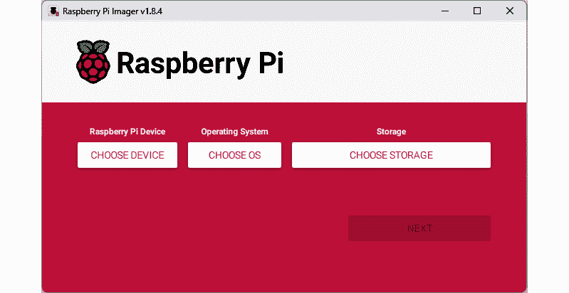

图 11.4 – Raspberry Pi 镜像工具

1.  在 **Raspberry Pi 设备** 下，我们选择 **不筛选**。

1.  对于 **操作系统**，我们选择 **其他通用操作系统**，然后选择 **Ubuntu**，然后选择 **Ubuntu Desktop 22.04.3 LTS (64-BIT)**。

1.  然后，我们点击 **选择存储** 按钮，并选择我们插入电脑的 microSD 卡。

1.  我们的选择应该如下所示：

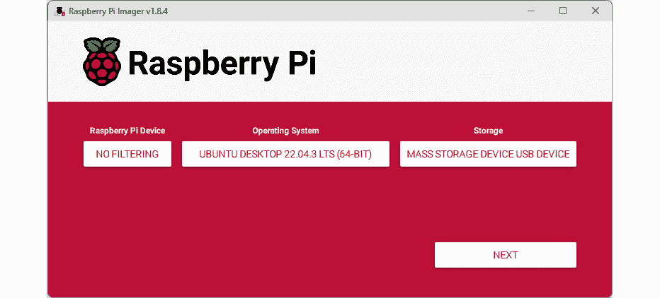

图 11.5 – 选择后的 Raspberry Pi 镜像工具

选择正确的 Ubuntu 版本

在编写本文时，ROS 2 的最新版本支持 Ubuntu 22.04。因此，在我们的示例中，我们将使用 Ubuntu 22.04 LTS，尽管最新的 Ubuntu 版本是 23.10。对于 ROS 2 的未来版本，选择与使用的 ROS 2 版本相对应的 Ubuntu 版本非常重要。

1.  要开始烧录过程，我们点击**下一步**按钮，并在**警告**对话框中点击**是**按钮以继续。

1.  写作过程完成后，Raspberry Pi Imager 将执行验证以确保图像已正确写入 microSD 卡。在验证成功后，我们应该看到一个**写入成功**屏幕，表明 microSD 卡现在可以用于我们的 Raspberry Pi，并安装了新操作系统。

1.  在将图像烧录到我们的 microSD 卡后，我们接着将卡安装到我们的 Raspberry Pi 上，并按照步骤完成 Ubuntu 在 Raspberry Pi 上的安装。

现在 Ubuntu 已经在我们的 Raspberry Pi 上运行，下一步是安装适当的 ROS 版本。尽管名为 ROS，但它不是一个操作系统。相反，它作为一个中间件或软件框架运行，提供构建和管理机器人应用程序的工具和库。

## 将 ROS 添加到我们的 Ubuntu 安装中

在总结我们的**探索 ROS**部分时，我们强调了将每个 ROS 发行版与特定的 Ubuntu LTS 版本匹配的重要性，以确保稳定性。在 Raspberry Pi 上安装了 Ubuntu 22.04 后，我们现在准备安装 ROS。

到本文编写时为止，有两个与 Ubuntu 22.04 兼容的 ROS 版本：Humble Hawksbill 和 Iron Irwini。Humble Hawksbill 是一个 LTS 版本，这意味着它旨在提供稳定性和长期支持，非常适合长期项目和寻求稳定开发环境的人。另一方面，Iron Irwini 是一个非 LTS 版本，通常具有更多前沿的变更，但支持生命周期较短。

由于我们希望我们的应用稳定性高于新功能，我们将使用 Humble Hawksbill。

重要提示

这里提供的 ROS 安装说明是在编写时最新的。然而，建议您咨询官方网页以获取最新的指导，因为可能会有更新或变化。

要在我们的 Raspberry Pi 上安装 Humble Hawksbill，我们执行以下操作：

1.  要查看 ROS 的最新版本，我们导航到以下网站：

    [`www.ros.org/blog/getting-started/`](https://www.ros.org/blog/getting-started/)

1.  要查看 ROS 的当前版本，我们滚动到页面上的**安装**部分，我们看到以下内容：

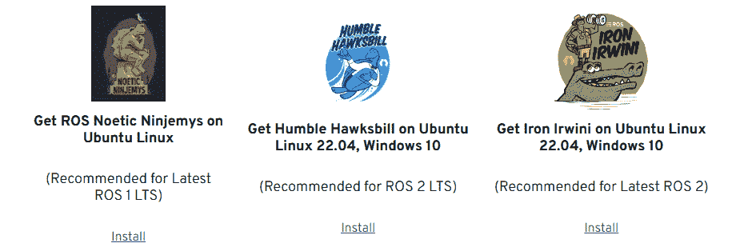

图 11.6 – ROS 的当前版本

1.  要继续，我们在**Humble** **Hawksbill**部分下点击**安装**链接。

    这将带我们到 Humble Hawksbill 安装页面。

1.  要为 Ubuntu 安装 Humble Hawksbill，我们点击**Debian 软件包**链接（在以下图中用红色框突出显示），位于**Ubuntu Linux – Jammy** **Jellyfish (22.04)**下：

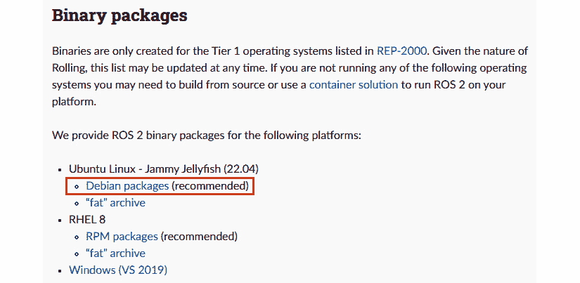

图 11.7 – ROS 的二进制软件包

1.  要在 Ubuntu 中设置区域设置，我们只需从网页的**设置区域设置**部分复制命令。这可以通过点击代码框右上角的**复制**图标快速完成，该图标在我们悬停时出现。然后我们将这些命令粘贴并执行到 Ubuntu 终端中，以完成区域设置过程：

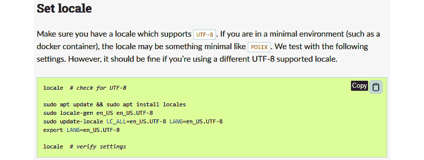

图 11.8 – 在 Ubuntu 中设置区域设置

1.  要配置我们的系统以访问和验证 ROS 软件仓库，我们复制、粘贴并执行**设置** **源**部分下的每个部分的代码：

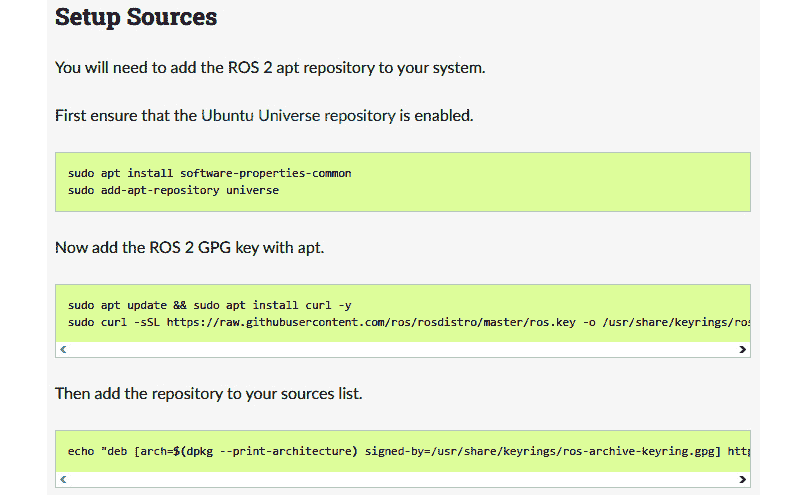

图 11.9 – 配置我们的 Ubuntu 安装以访问 ROS 软件仓库

1.  要更新我们系统的软件包，我们在终端中输入以下命令：

    ```py
    sudo apt update
    ```

1.  然后，我们使用以下命令升级系统上的软件包：

    ```py
    sudo apt upgrade
    ```

1.  我们将使用 ROS 的桌面版本。我们使用以下命令安装它：

    ```py
    sudo apt install ros-humble-desktop
    ```

1.  由于我们将创建自己的节点，我们需要 ROS 开发工具。我们使用以下命令安装这些工具：

    ```py
    sudo apt install ros-dev-tools
    ```

在安装了 ROS 和 ROS 开发工具后，我们现在可以开始探索了。我们将从一个简单的发布-订阅示例开始。

## 测试我们的 ROS 安装

我们可以使用不同的组件测试我们的新 ROS 安装，无论这些组件是用什么编程语言编写的。对此的一种常见方法，也是我们将采用的方法，是使用一个简单的发布-订阅模型，其中发布者是用 C++编写的，而订阅者是用 Python 编写的。

在图 11.10 中，显示的节点是 ROS 桌面安装的一部分。该图突出显示了一个**发布者**节点，用 C++编写，它向 chatter 主题发送一个 Hello World:消息，后跟一个顺序号。**订阅者**节点是用 Python 编写的，并订阅 chatter 主题：

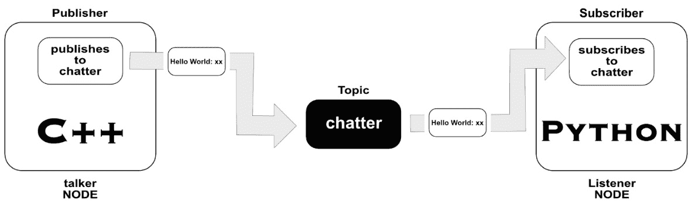

图 11.10 – 使用 C++发布者和 Python 订阅者的 ROS 发布-订阅

要运行示例，我们执行以下操作：

1.  在 Ubuntu 中，我们打开一个新的终端并输入以下命令：

    ```py
    source /opt/ros/humble/setup.bash
    ```

    我们使用此命令初始化当前终端会话的 ROS 环境，从而启用 ROS 命令和包的使用。

1.  要启动发布者，我们输入以下内容：

    ```py
    talker from the demo_nodes_cpp package. We should observe messages printed to the console:
    ```

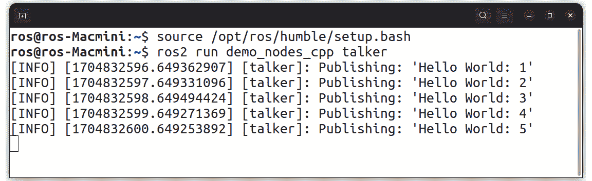

图 11.11 – 运行 talker 节点时的输出

从终端中我们可以看到，`talker` 节点发布了一个 `Hello World:` 后跟递增数字的输出。尽管我们无法从输出中得知，但我们节点发布的主题是 `chatter` 主题。

1.  要接收消息，我们在 Ubuntu 中打开一个新的终端并启动以下命令的 Python 订阅节点：

    ```py
    source /opt/ros/humble/setup.bash
    ros2 run demo_nodes_py listener
    ```

    每当我们打开一个新的终端时，我们必须源 ROS 安装以启用 ROS 命令。我们应该在我们的新终端中观察到已发布的消息的确认：

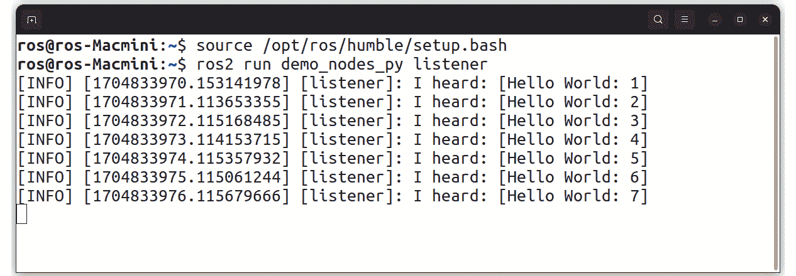

图 11.12 – 从 talker 节点接收消息

通过这种方式，我们已经成功安装并测试了我们的 ROS 安装。在下一节中，我们将运行一个模拟机器人并通过 MQTT 消息来控制它。

# 运行和控制模拟机器人

在本节中，我们探讨使用 TurtleSim，这是一个轻量级且用户友好的工具，在 ROS 中用于模拟机器人的运动和行为。TurtleSim 是一个优秀的教育资源，特别是对于 ROS 的初学者来说，可以帮助他们理解基本概念，如节点交互、消息传递和简单的机器人命令。

通过使用 TurtleSim，我们将学习如何创建一个 ROS 节点来控制虚拟机器人。我们将使用 MQTT 消息来控制 TurtleSim 机器人。在接下来的章节中，我们将使用在这里学到的知识将我们的机器人转换为物理机器人，我们将其称为 A.R.E.S。

我们将首先在 Ubuntu 中启动一个 TurtleSim 节点，然后使用一个单独的 ROS 节点来控制它。

## 启动和测试 TurtleSim

如前所述，TurtleSim 设计用于帮助新用户通过简单界面熟悉 ROS 的功能，如节点、主题和服务。通过运行 TurtleSim，我们可以在一个受控环境中模拟机器人的运动和行为。

要启动 TurtleSim，我们执行以下操作：

1.  在 Ubuntu 中，我们打开一个新的终端并输入以下命令：

    ```py
    source /opt/ros/humble/setup.bash
    turtlesim_node node from the turtlesim package. Once these commands are executed, a TurtleSim window should appear, displaying a graphic of a simulated turtle positioned in the center of the screen:
    ```

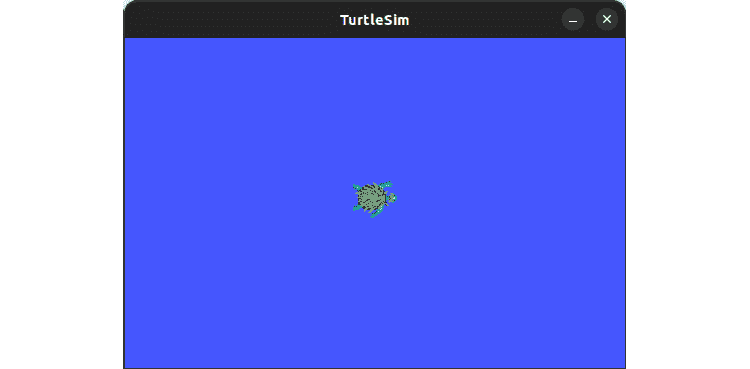

图 11.13 – TurtleSim 机器人

1.  要控制海龟，我们使用另一个节点。为此，我们在 Ubuntu 中打开另一个终端并执行以下命令：

    ```py
    source /opt/ros/humble/setup.bash
    turtle_teleop_key node from the turtlesim package. This node allows us to control the TurtleSim robot with our keyboard. Our Terminal should look like the following:
    ```

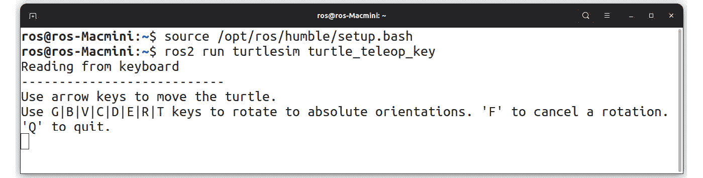

图 11.14 – 运行 turtle_teleop_key 节点

1.  我们可以通过按住键盘上的箭头键来移动我们的 TurtleSim 机器人。我们还可以使用终端中列出的任何键来旋转我们的机器人：

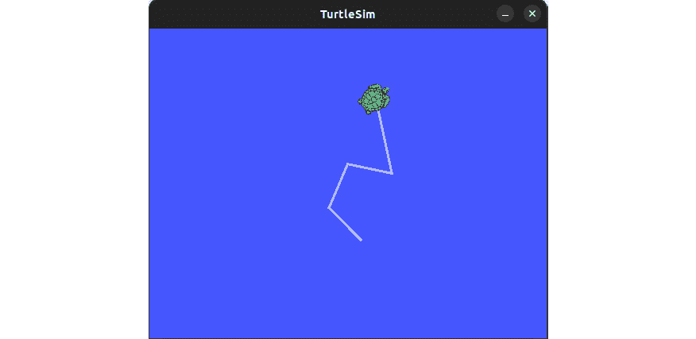

图 11.15 – 移动 TurtleSim 机器人的结果

1.  要在 ROS 中可视化节点和主题连接，我们可以使用 `rqt_graph`，这是一个图形工具，显示节点如何交互。它对于调试和解析 ROS 系统中的网络特别有帮助。要启动 `rqt_graph`，我们在新的 Ubuntu 终端中输入以下命令：

    ```py
    source /opt/ros/humble/setup.bash
    rqt_graph tool. We should see the following window:
    ```

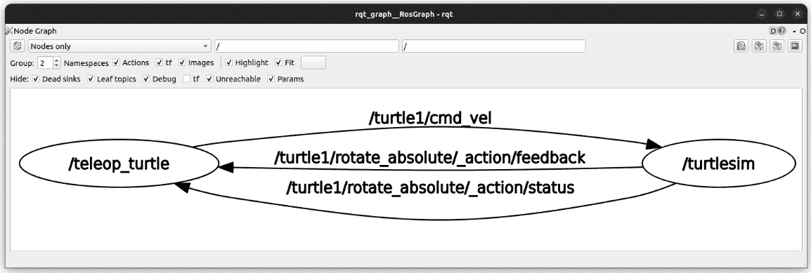

图 11.16 – 在 ROS 中使用 rqt_graph 工具

1.  从我们的图中，`cmd_vel`主题是 ROS 中的一个关键通信通道，它将作为控制器的`teleop_turtle`节点与模拟机器人的`turtlesim`节点连接起来。在我们的 ROS 图中，我们将 TurtleSim 实例称为`turtle1`，并且我们在与`cmd_vel`主题交互时使用这个名字来识别被控制的特定海龟。图还显示了`rotate_absolute`动作。对于我们的基本机器人控制应用，我们只对`cmd_vel`主题通信感兴趣。

为什么我们启动 turtle_teleop_key 但查看 teleop_turtle？

`rqt_graph`工具中`teleop_turtle`节点名称与`ros2 run turtlesim turtle_teleop_key`命令之间的区别源于框架的命名约定和结构。《turtle_teleop_key》命令指的是 ROS 中的可执行文件，当运行时，初始化一个 ROS 节点。这个节点在 ROS 环境中内部命名为`teleop_turtle`，用于通信和识别。这种方法允许 ROS 具有灵活性，其中单个可执行文件可以启动不同的节点，节点名称可以根据特定需求或配置动态更改。节点名称对于网络通信，如发布到主题，是至关重要的，而可执行文件名称只是用于启动节点。

我们的练习展示了我们如何使用一个节点来控制机器人——在这个例子中，是`teleop_turtle`节点，它允许我们通过键盘控制 TurtleSim 机器人。在下一节中，我们将创建自己的节点，这将使我们能够通过 MQTT 消息来控制机器人。

## 创建 ROS 工作空间和包

在 ROS 2 中，包的结构和创建对于组织、分发和编译我们的代码至关重要。在 ROS 2 中创建一个包涉及使用`ament`作为构建系统和`colcon`作为构建工具。我们有选择以 C++或 Python 创建包的选项。

ROS 2 包的内容取决于它是一个 CMake 包还是 Python 包。通常，CMake 包包括一个`CMakeLists.txt`文件和一个`package.xml`文件，以及源代码和包头文件的目录。另一方面，Python 包将包括`package.xml`和`setup.py`文件，以及一个与包同名且包含`__init__.py`文件等文件的目录。对于我们的应用，我们将使用 Python。

在 ROS 2 工作空间中，我们可以有多个包，每个包都有自己的文件夹，并且这些包可以是不同的构建类型。建议将包保存在我们工作空间的`src`文件夹中，以保持组织。

在以下图中，我们可以看到我们将要构建的 ROS 工作空间的结构，其中点（`.`）代表工作空间的根目录。工作空间只是我们的文件系统中的一个目录。在`src`文件夹下，我们有一个名为`mqtt_robot`的单个包：


图 11.17 – ROS 工作空间结构

为了构建我们的 ROS 应用程序，我们将首先创建一个工作空间，这是一个包含用于组织我们应用程序 ROS 包的 `src` 子文件夹的 Linux 目录。

要做到这一点，我们执行以下操作：

1.  我们在 Ubuntu 终端中打开我们的家目录并执行以下命令：

    ```py
    mkdir -p ch11_ws/src
    ```

重要提示

在家目录中创建我们的工作空间简化了未来的导航，因为我们可以在命令中使用 `~` 字符作为快捷方式。

使用此命令，我们创建了一个工作空间。`mkdir` 命令中的 `-p` 标志确保任何必要的父目录作为新目录路径的一部分被创建。

1.  创建文件夹后，我们使用以下命令导航到 `src` 文件夹：

    ```py
    cd ch11_ws/src
    ```

1.  为了初始化我们的 ROS 环境，我们执行以下命令：

    ```py
    source /opt/ros/humble/setup.bash
    ```

1.  然后，我们通过执行以下命令创建我们的包：

    ```py
    ros2 pkg create --build-type ament_python --license Apache-2.0 --node-name draw_circle mqtt_robot --license Apache-2.0
    ```

    在我们构建包的命令中，我们指定了 Apache 2.0 许可证。

什么是 Apache 2.0 许可证？

此许可证是一个开源许可证，允许商业和非商业用途以及修改，但要求在分发版本中披露重大更改，并明确授予用户专利权。在我们的情况下，此披露要求仅适用于我们修改构建工具或 Apache 2.0 许可证软件的现有代码，而不是在包创建后我们自己编写的代码。

1.  通过这一行，我们创建了一个名为 `mqtt_robot` 的新包，具有 Python 构建类型，并生成了一个名为 `draw_circle` 的节点。要查看新的文件结构，我们执行 `tree` 命令：

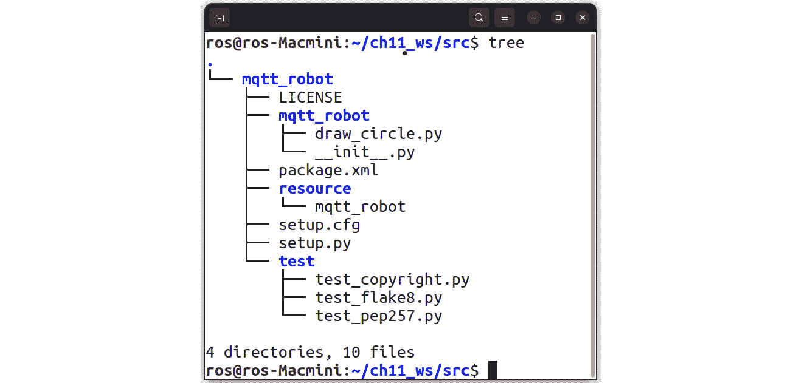

图 11.18 – src 目录下的工作空间文件结构

使用我们创建的 `ch11_ws` 工作空间和 `mqtt_robot` 包，我们现在可以开始修改生成的代码以适应我们的需求。我们将从 `draw_circle.py` 脚本开始。

## 修改生成的 Python 代码

在我们的包代码生成后，我们在 `src` 文件夹下看到一个名为 `mqtt_robot` 的文件夹。这个文件夹代表我们的包。在这个文件夹内部还有一个同名的文件夹，`mqtt_robot`。正是在这个第二个 `mqtt_robot` 文件夹中，我们找到了我们应用程序的主要 Python 代码。

为了创建我们应用程序的逻辑，我们将修改 `draw_circle.py` 脚本。为此，我们执行以下操作：

1.  对于我们的应用程序，我们需要 `paho-mqtt` 库来进行 MQTT 通信。在 Ubuntu 终端中，我们输入以下命令来安装库：

    ```py
    draw_circle.py script with the following command:

    ```

    在文本编辑器中打开 `draw_circle.py` 文件，我们执行以下命令：

    ```py
    gedit draw_circle.py
    ```

    ```py

    ```

1.  我们首先删除所有代码。然后，我们以导入开始编写新的代码：

    ```py
    import rclpy
    from rclpy.node import Node
    from geometry_msgs.msg import Twist
    import paho.mqtt.client as mqtt
    ```

    在我们的代码中，我们有以下内容：

    1.  `import rclpy`：导入 ROS 2 客户端库，允许脚本与 ROS 2 功能交互并创建 ROS 2 节点。

    1.  `from rclpy.node import Node`: 从 `rclpy` 模块中导入 `Node` 类，使脚本能够为 ROS 2 应用程序定义自定义节点。

    1.  `from geometry_msgs.msg import Twist`: 从 `geometry_msgs` 包中导入 `Twist` 消息类型；我们使用它来发送命令以移动 TurtleSim 机器人。

    1.  `import paho.mqtt.client as mqtt`: 导入我们将用于 MQTT 协议通信的 Paho MQTT 客户端库。

1.  我们定义了一个 `MQTTMessage` 类，它包括一个初始化方法和一个设置标志的方法。`__init__()` 方法将 `should_draw_circle` 属性初始化为 `False`，而 `set_flag()` 方法在类接收到 `draw_circle` 消息时将此属性更新为 `True`。当接收到 `stop` 消息时，我们将 `should_draw_circle` 设置为 `False`：

    ```py
    class MQTTMessage:
        def __init__(self):
            self.should_draw_circle = False
        def set_flag(self, message):
            if message == 'draw_circle':
                self.should_draw_circle = True
            elif message == 'stop':
                self.should_draw_circle = False
    ```

1.  我们从 ROS 2 的 `Node` 类派生出 `CircleMover` 类。这个类旨在根据 MQTT 消息控制 TurtleSim 中的模拟海龟的运动。该类使用 MQTT 消息处理程序初始化，设置 `turtle1/cmd_vel` 主题的发布者以控制运动，并配置 MQTT 客户端以连接到代理并处理传入的消息：

    ```py
    class CircleMover(Node):
        def __init__(self, mqtt_message):
            super().__init__('circle_mover')
            self.mqtt_message = mqtt_message
            self.publisher = self.create_publisher(
                             Twist, 'turtle1/cmd_vel', 10)
            timer = 0.1  # seconds
            self.timer = self.create_timer( timer,
                         self.timer_callback)
            self.vel_msg = Twist()
            # Initialize MQTT Client and set up callbacks
            self.mqtt_client = mqtt.Client()
            self.mqtt_client.on_connect = self.on_connect
            self.mqtt_client.on_message = self.on_message
            self.mqtt_client.username_pw_set("username",
                                             "password")
            self.mqtt_client.connect("
                               driver.cloudmqtt.com",
                               port, 60)
            self.mqtt_client.loop_start()
        def on_connect(self, client, userdata, flags, rc):
            client.subscribe("move")
        def on_message(self, client, userdata, msg):
            self.mqtt_message.set_flag(
                                msg.payload.decode())
    ```

1.  类内部的 `timer_callback()` 函数根据由 MQTT 消息设置的 `should_draw_circle` 标志确定海龟的运动，从而通过 MQTT 实现对海龟的动态控制：

    ```py
        def timer_callback(self):
            if self.mqtt_message.should_draw_circle:
                self.vel_msg.linear.x = 1.0
                self.vel_msg.angular.z = 1.0
            else:
                self.vel_msg.linear.x = 0.0
                self.vel_msg.angular.z = 0.0
            self.publisher.publish(self.vel_msg)
    ```

1.  为了完成我们的代码，我们为我们的 ROS 2 Python 脚本定义了一个 `main()` 函数，该函数初始化 ROS 客户端库，创建 `MQTTMessage` 类的一个实例，然后使用 MQTT 消息处理程序创建 `CircleMover` 类的一个实例。它使用 `rclpy.spin()` 方法运行 ROS 节点，保持节点活跃并响应回调。在终止时，它销毁节点并关闭 ROS 客户端库。我们使用 `main()` 函数作为脚本的入口点，在直接运行脚本时执行它：

    ```py
    def main(args=None):
        rclpy.init(args=args)
        mqtt_message = MQTTMessage()
        circle_mover = CircleMover(mqtt_message)
        rclpy.spin(circle_mover)
        circle_mover.destroy_node()
        rclpy.shutdown()
    if __name__ == '__main__':
        main()
    ```

1.  完成我们的代码后，我们使用相同的名称，`draw_circle.py`，保存文件。

我们的下一步是更新 `package.xml` 文件，以包含我们的代码所需的 Python 库依赖项。

## 更新 package.xml

ROS 中的 `package.xml` 文件是一个描述符，它包含有关 ROS 包的基本信息，例如其名称、版本、维护者、许可证和依赖项。对于构建过程至关重要，它通知 `colcon` 构建工具编译包所需的依赖项。它由开发者创建和维护。

对于我们的目的，我们将修改 `package.xml` 以通知它我们的代码需要编译的 Python 库。

要做到这一点，我们执行以下操作：

1.  我们打开一个 Ubuntu 终端并导航到包含 `package.xml` 文件的文件夹：

    ```py
    package.xml in a text editor, we execute the following command:

    ```

    </package>):

    ```py
      <exec_depend>rclpy</exec_depend>
      <exec_depend>paho-mqtt</exec_depend>
    ```

    ```py

    ```

1.  这些行指示编译器，`rclpy`（ROS 的 Python 客户端库）和`paho-mqtt`（用于 MQTT 通信）是 ROS 包的执行依赖项，这意味着这些包是运行包中包含的 ROS 节点所必需的。我们保存我们的更改并关闭编辑器。

通过更新`package.xml`，我们现在可以编译我们的代码并运行我们的新节点。

## 编译和运行我们的代码

要编译我们的代码，我们使用`colcon` ROS 工具，这是一个用于编译 ROS 包、处理依赖项并在工作空间中跨多个包协调构建的命令行工具。对于我们的应用程序，我们需要它只编译一个包。

要编译和执行我们的新代码，我们执行以下操作：

1.  在 Ubuntu 中，我们打开一个新的终端并源我们的 ROS 2 环境：

    ```py
    source /opt/ros/humble/setup.bash
    ```

1.  然后，我们导航到我们的工作空间根目录：

    ```py
    cd ~/ch11_ws
    ```

1.  要编译我们的代码，我们执行以下命令：

    ```py
    colcon build
    ```

为什么我们从 src 文件夹创建一个包，但从根目录编译？

值得注意的是，在 ROS 工作空间中，包的创建和编译发生在不同的级别。虽然我们在工作空间的`src`文件夹内创建单个包，但编译是在工作空间的根文件夹中进行的。这种区别是关键的：创建包是在`src`中的本地化操作，但使用`colcon`在工作空间根目录编译确保`src`中的所有包一起构建。

1.  完成后，终端将出现一条确认成功构建的消息。

1.  我们的代码编译完成后，现在是时候源我们的新 ROS 环境了。我们使用以下命令执行此操作：

    ```py
    source ~/ch11_ws/install/setup.bash
    ```

1.  这就像我们源 ROS 环境一样。要运行我们的节点，我们执行以下命令：

    ```py
    draw_circle, from the package we created, mqtt_robot. Upon execution, our Terminal will enter a wait state, ready to respond to incoming events or actions.
    ```

1.  如果尚未运行，我们启动一个 TurtleSim 实例。

我们可能会注意到没有任何动作发生。TurtleSim 中的海龟没有移动，而我们启动节点所用的终端处于等待状态。要使海龟移动，我们需要向我们的新节点发送一个 MQTT 消息。

让我们来做这件事。

## 使用 MQTT 消息控制我们的机器人

我们在*图 11.1*中看到了我们应用程序的高级概述，其中使用 MQTT-Explorer 的 MQTT 消息指导我们的 ROS 模拟机器人。`draw_circle`消息提示海龟画一个圆圈，而`stop`则停止其移动。这构成了我们项目的基础，我们将在接下来的章节中通过添加更多功能来扩展它。

要通过 MQTT 消息控制 TurtleSim 机器人，我们执行以下操作：

1.  在 Windows 中使用 MQTT-Explorer 应用程序，我们向`move`主题发布一个`draw_circle`消息。

1.  发送后，我们应该观察到我们的 TurtleSim 机器人开始画圈移动：

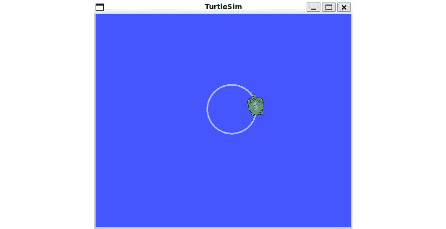

图 11.19 – 从 MQTT 消息移动的 TurtleSim 机器人

1.  要停止机器人，我们使用 MQTT-Explorer 应用程序在`move`主题下发送一个`stop`消息。

1.  我们应该观察到 TurtleSim 机器人停止移动。

我们使用 MQTT 消息控制虚拟机器人的演示为将所学概念应用到即将到来的真实机器人项目 A.R.E.S.奠定了基础。

# 摘要

在本章中，我们开始了对 ROS 的探索。我们首先在 Raspberry Pi 4 上设置了 ROS，选择 Ubuntu 而不是标准的 Raspberry Pi OS，以获得与 ROS 更好的兼容性。

我们的动手之旅从用户友好的 ROS 模拟器 TurtleSim 开始。我们学习了基本的 ROS 操作和概念，从键盘控制来操控虚拟机器人开始。然后我们进阶到使用 MQTT 消息进行控制，架起了模拟与现实应用之间的桥梁。

在 TurtleSim 上的这次体验为我们主要项目 A.R.E.S.打下了基础，A.R.E.S.是一个将在接下来的章节中开发的先进物联网机器人。

在下一章中，我们将回到构建物联网设备，因为我们正在构建一个 MQTT 游戏手柄来控制我们的 TurtleSim 机器人。
