# 12

# 创建物联网游戏手柄

在本章中，我们将创建一个用于远程控制 ROS TurtleSim 机器人的物联网游戏手柄。我们将基于第七章的物联网按钮项目以及第十一章对 TurtleSim 虚拟机器人的介绍来构建我们的经验。

利用 Raspberry Pi Pico WH 的 Wi-Fi 功能，我们将展示物联网在机器人领域的实际应用。本章概述了设计并构建一个 USB 供电的游戏手柄，集成了 PS2 游戏手柄模块、LED 和街机按钮等组件。我们将使用这个物联网游戏手柄在接下来的章节中控制我们的 A.R.E.S.机器人。

尽管 Raspberry Pi Pico W 也可以，但我们将使用 Raspberry Pi Pico WH 本章。

在本章中，我们将涵盖以下主题：

+   理解我们的物联网游戏手柄应用

+   连接我们的电路

+   开发我们的物联网游戏手柄代码

+   为我们的应用创建一个定制的 ROS 节点

+   构建物联网游戏手柄外壳

让我们开始吧！

# 技术要求

在本章中，你需要以下内容：

+   中级 Python 编程知识

+   基本的 Linux 命令行知识。

+   用于 MQTT 服务器实例的 CloudAMQP 账户

+   从上一章安装的 Ubuntu-ROS 计算机

+   可以访问 3D 打印机或 3D 打印服务

+   Raspberry Pi Pico WH

+   Raspberry Pi Pico WH GPIO 扩展器

+   PS2 游戏手柄模块

+   带有 220 欧姆电阻的 LED

+   24 毫米街机式按钮

+   4 个 M3 10 毫米螺栓

+   4 个 M2 5 毫米螺丝

+   8 个 M2.5 5 毫米螺栓

+   4 个 M2.5 10 毫米支撑螺母

+   1 个 8 毫米 LED 支架

+   连接 Raspberry Pi Pico WH 到 GPIO 扩展器的电线

+   定制外壳的构建文件可以在我们的 GitHub 仓库中找到

本章的代码可以在以下链接找到：

[`github.com/PacktPublishing/-Internet-of-Things-Programming-Projects-2nd-Edition/tree/main/Chapter12`](https://github.com/PacktPublishing/-Internet-of-Things-Programming-Projects-2nd-Edition/tree/main/Chapter12%0D)

# 理解我们的物联网游戏手柄应用

在*第七章*中，我们开发了一个远程启动物联网报警系统的设备。基于这一经验，本章的应用涉及使用 Raspberry Pi Pico WH 创建一个物联网游戏手柄。这个游戏手柄将远程控制 ROS TurtleSim 机器人，从而展示物联网在机器人领域的实际应用。

由于 Wi-Fi 功能和预先焊接的引脚头，我们将使用 Raspberry Pi Pico WH 进行设计。在我们的应用中，我们将集成 PS2 游戏手柄模块、LED 和街机式按钮与 Raspberry Pi Pico WH。Raspberry Pi Pico WH 将被编程以传输反映游戏手柄动作、游戏手柄按钮状态和街机按钮状态的 MQTT 消息。此外，LED 将具有双重功能，依次指示 Wi-Fi 连接状态和 MQTT 连接状态：

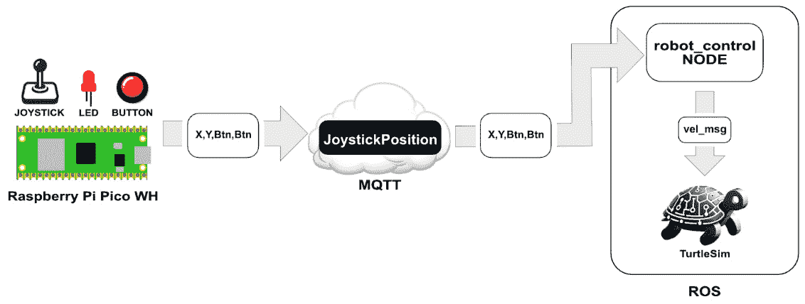

图 12.1 – 物联网游戏手柄应用概述

如我们在 *图 12**.1* 中所见，我们的 Raspberry Pi Pico WH 将 *x* 轴、*y* 轴和两个按钮的状态作为 MQTT 消息，在 `JoystickPosition` 主题下发送到我们的自定义 ROS 节点 `robot_control`。然后，我们的 ROS 节点反过来将 `vel_msg` 消息发送到 TurtleSim 机器人的一个实例。

我们将首先连接我们的物联网游戏手柄的电路。

# 连接电路

为了简化布线，我们正在使用 GPIO 扩展器以及我们的 Raspberry Pi Pico WH。我们稍后将要构建的机箱允许轻松转移测试电路的布线，突出了使用 GPIO 扩展器的实用性。我们可以在以下图中看到组成物联网游戏手柄的组件：

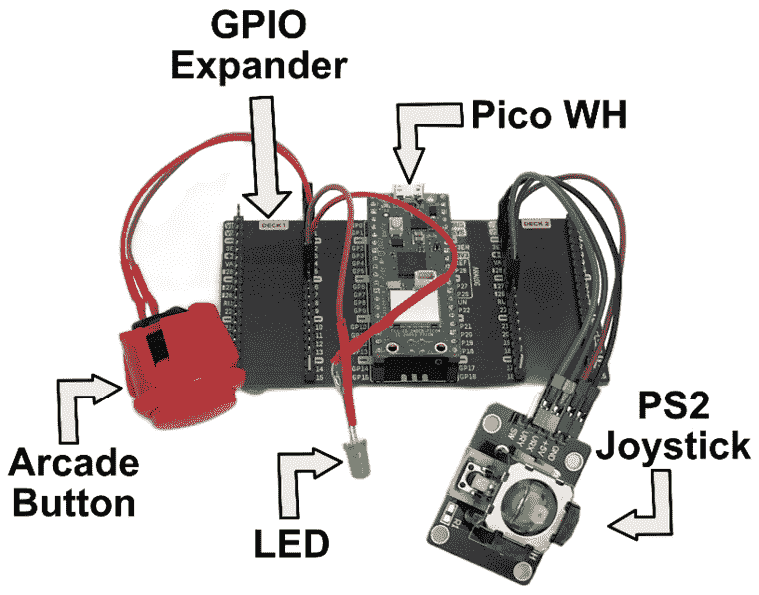

图 12.2 – 物联网游戏手柄的组件

在 *图 12**.2* 中，我们使用的组件包括一个 24 毫米的街机风格按钮，一个绿色 LED（任何颜色都可以）焊接到一个 220 欧姆电阻上（有关此处的说明，请参阅 *第三章*），以及一个 PS2 游戏手柄模块。

这种设置使得将我们的组件转移到定制机箱以进行最终安装变得更加容易。使用这些组件，我们根据 *图 12**.3* 作为参考连接电路：

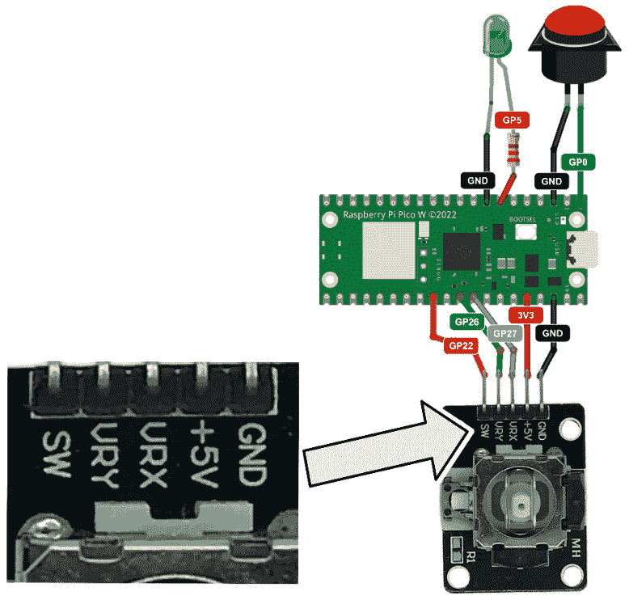

图 12.3 – 连接物联网游戏手柄

连接如下：

+   街机风格按钮连接到 GP0 和 GND。

+   带有 220 欧姆电阻的 LED 正端连接到 GP5。

+   LED 的负端连接到 GND。

+   SW（开关）从 PS2 游戏手柄模块连接到 GP22。

+   VRY (*y* 轴) 从 PS2 游戏手柄模块连接到 GP26。

+   VRX (*x* 轴) 从 PS2 游戏手柄模块连接到 GP27。

+   +5V（电源）从 PS2 游戏手柄模块连接到 3V3。

+   PS2 游戏手柄模块的 GND 连接到 GND。

在电路布线完成后，我们就可以开始编写我们的应用程序了。

# 开发我们的物联网游戏手柄的代码

我们将在 Raspberry Pi Pico WH 上安装 CircuitPython 并使用 Thonny 进行开发。我们的 Pico WH 代码将包括两个文件，一个用于封装游戏手柄功能，另一个用于发送 MQTT 消息。

我们将首先设置我们的 Raspberry Pi Pico WH 以进行开发。

## 设置我们的 Raspberry Pi Pico WH

对于我们的物联网游戏手柄，我们将安装 CircuitPython 并使用 Adafruit MiniMQTT 库。我们同样可以使用 MicroPython 和 `micropython-umqtt.simple` 包。然而，在物联网游戏手柄应用中使用 CircuitPython 的 Raspberry Pi Pico WH 提供了比 MicroPython 更稳定、维护得更好的库。

要在 Raspberry Pi Pico WH 上安装 CircuitPython，我们执行以下与我们在 *第九章* 中所做的相同步骤：

1.  如果我们的操作系统上没有 Thonny，我们访问 Thonny 网站，下载适当的版本 ([`thonny.org`](https://thonny.org))。

1.  然后我们使用适合我们操作系统的适当方法启动 Thonny。

1.  在按住 Pico WH 上的 *BOOTSEL* 按钮（USB 端口附近的小白按钮）的同时，我们将它插入一个可用的 USB 端口，并忽略可能出现的任何弹出窗口。

1.  然后我们点击屏幕右下角的解释器信息，并选择 **安装 CircuitPython…**：

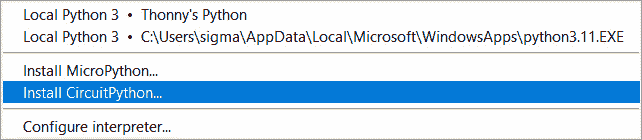

图 12.4 – 安装 CircuitPython… 选项

1.  对于我们的目标版本，我们选择我们的 Pico WH（在我们的示例中为 **RPI-RP2 (D:)**）。然后我们选择 CircuitPython 变种的最新版本 – **Raspberry Pi • Pico W /** **Pico WH**：

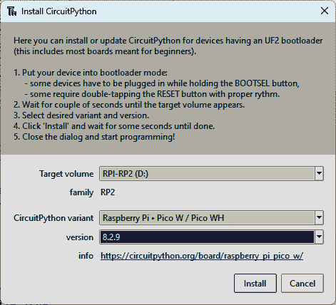

图 12.5 – 在 Raspberry Pi Pico WH 上安装 CircuitPython

1.  安装完成后，我们点击 **安装** 按钮，然后点击 **关闭** 按钮。

1.  要将 Thonny 配置为在我们的 Pico 上运行 CircuitPython 解释器，我们从屏幕右下角选择它：

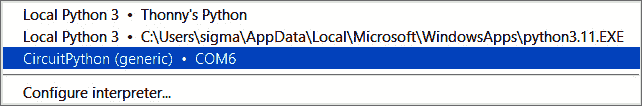

图 12.6 – 从我们的 Pico WH 选择 CircuitPython 解释器

1.  在我们的 Raspberry Pi Pico WH 上安装好 CircuitPython 后，下一步是安装 Adafruit MiniMQTT 库。为此，我们遵循 *第十章* 中 *安装 CircuitPython 库的* *MQTT* 部分中概述的步骤。

当我们的 Raspberry Pi Pico WH 准备好开发时，是时候创建一个 `Joystick` 类了。

## 创建一个 Joystick 类

如前所述，我们的 Pico WH 代码分为两个文件，一个用于将摇杆封装在我们称为 `Joystick` 的类中，另一个基于该类的值发送 MQTT 消息。我们首先从摇杆代码开始。

要编写摇杆代码，我们执行以下操作：

1.  我们将 Raspberry Pi Pico WH 连接到 USB 端口并启动 Thonny。我们可以使用 Raspberry Pi 或其他操作系统来完成此操作。

1.  我们然后通过从屏幕的右下角选择它来激活 Pico WH 上的 CircuitPython 环境。

1.  在一个新的编辑器中，我们开始编写代码，使用导入语句：

    ```py
    import board
    import digitalio
    import analogio
    import time
    ```

    在我们的代码中，我们有以下内容：

    +   `import board`：访问特定于板的引脚和硬件接口，这对于与 Raspberry Pi Pico W 上的 GPIO 引脚进行接口至关重要。

    +   `import digitalio`：管理数字输入和输出，例如读取按钮的状态或控制 LED，这对于数字信号交互至关重要。

    +   `import analogio`：促进模拟输入功能，例如读取在一定范围内变化的传感器数据，这在涉及如电位计等可变输入的项目中是常见的要求。

    +   `import time`：提供时间相关函数，使任务如引入程序执行延迟成为可能，这在控制操作流程和时机方面很有用。

1.  我们接着定义一个`Joystick`类并设置变量：

    ```py
    class Joystick:
        def __init__(self):
            self.adc_x = analogio.AnalogIn(board.GP27)
            self.adc_y = analogio.AnalogIn(board.GP26)
            self.button = digitalio.DigitalInOut(board.GP0)
            self.button.direction = digitalio.Direction.INPUT
            self.button.pull = digitalio.Pull.UP
            self.button2 = digitalio.DigitalInOut(board.GP22)
            self.button2.direction = digitalio.Direction.INPUT
            self.button2.pull = digitalio.Pull.UP
            self.mid = 32767
            self.dead_zone = 10000
    ```

    在我们的代码中，我们有以下内容：

    +   初始化（`__init__()`方法）：我们的代码设置了`Joystick`类。

    +   `self.adc_x`和`self.adc_y`：这些是摇杆*x*和*y*轴的模拟输入对象，分别连接到 GP27 和 GP26 引脚。它们从摇杆的电位计读取模拟值。

    +   `self.button`：一个按钮的数字输入/输出对象，连接到 GP0 引脚。它配置为输入并带有上拉电阻，这是按钮的常见设置。此变量代表我们的街机风格按钮的状态。

    +   `self.button2`：类似于`self.button`。这代表一个连接到 GP22 引脚的第二个按钮，也设置为输入并带有上拉电阻。此变量代表摇杆按钮的状态（通过按下摇杆激活）。

    +   `self.mid`：模拟读数的中间值，用于确定摇杆的中性位置。

    +   `self.dead_zone`：死区阈值决定了摇杆的灵敏度，区分轻微的无意动作和有意动作。这解释了当摇杆处于中性位置时的微小差异。

1.  在设置好我们的变量后，我们编写了第一个方法，我们称之为`get_binary_value()`。此函数旨在将摇杆的位置解释为二进制输出。它首先检查摇杆的当前位置，由`value`表示，是否在围绕中点的预定义死区（`self.mid`）内。如果是这样，它返回`0`，表示摇杆处于中性位置。如果摇杆的位置超出此死区，则函数返回`-1`（对于低于中点的位置，表示负方向）和`1`（对于高于中点的位置，表示正方向）：

    ```py
    def get_binary_value(self, value):
            if abs(value - self.mid) < self.dead_zone:
                return 0
            return -1 if value < self.mid else 1
    ```

1.  我们接着定义我们的第二个方法，`read()`。此方法将摇杆和按钮的状态合并为一个单一输出。它使用`get_binary_value()`方法计算摇杆的*x*和*y*轴的二进制值，根据位置将模拟读数转换为二进制（`-1`、`0`或`1`）。它还评估两个按钮的状态，将它们的数字值转换为布尔格式（按下或未按下）。然后，该方法返回一个包含这些二进制值和按钮状态的元组：

    ```py
        def read(self):
            x_val = self.get_binary_value(self.adc_x.value)
            y_val = self.get_binary_value(self.adc_y.value)
            button_state = not self.button.value
            button2_state = not self.button2.value
            return x_val, y_val, button_state, button2_state
    ```

1.  我们随后编写测试代码。我们使用此代码来测试我们的`Joystick`类。它初始化`Joystick`类的一个实例，并进入一个无限循环以连续测试摇杆的功能。在循环的每次迭代中，它使用`read()`方法读取摇杆的*x*和*y*轴的当前位置以及两个按钮的状态。然后，这些值被打印到控制台，显示摇杆的*x*和*y*位置以及每个按钮的按下状态。`if __name__ == "__main__":`块确保只有当脚本作为主程序执行时，这个主循环才会运行，而不是当作为模块导入时，这使得我们能够轻松地测试我们的`Joystick`类：

    ```py
    if __name__ == "__main__":
        joystick = Joystick()
        while True:
            x, y, button_state, button2_state = joystick.read()
            print("X Position:", x)
            print("Y Position:", y)
            print("Button 1 Pressed:", button_state)
            print("Button 2 Pressed:", button2_state)
            time.sleep(5)
    ```

1.  要保存文件，我们点击`joystick.py`到我们的 Raspberry Pi Pico WH。

1.  要运行我们的代码，我们点击绿色的**运行**按钮，在键盘上按*F5*，或者点击顶部的**运行**菜单选项，然后选择**运行****当前脚本**。

1.  在 shell 中，我们应该观察到摇杆值随着摇杆的移动和按钮的按下而改变：

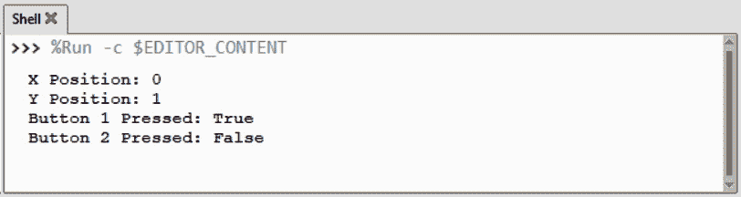

图 12.7 – 摇杆和按钮状态

在我们的`Joystick`类和`joystick.py`文件编写并成功测试后，我们现在可以编写代码以通过 MQTT 消息发送摇杆状态。

## 从我们的物联网摇杆发送 MQTT 消息

在创建并测试了`Joystick`类之后，现在是时候编写代码以通过 MQTT 消息发送摇杆和按钮状态了。

要编写摇杆代码，我们执行以下操作：

1.  我们将 Raspberry Pi Pico WH 连接到 USB 端口并启动 Thonny。我们可以使用 Raspberry Pi 或其他操作系统来完成此操作。

1.  我们随后通过从屏幕的右下角选择它来激活 Pico WH 上的 CircuitPython 环境（参见*图 12.6**）。

1.  在一个新的编辑器中，我们以导入开始我们的代码：

    ```py
    import time
    import board
    import wifi
    import socketpool
    import digitalio
    from adafruit_minimqtt.adafruit_minimqtt import MQTT
    from joystick import Joystick
    ```

    在我们的代码中，我们有以下内容：

    +   `import time`: 包含时间相关函数，在代码中用于延迟和定时控制。

    +   `import board`: 提供了对 Raspberry Pi Pico WH 硬件特定细节的访问，特别是其 GPIO 引脚。

    +   `import wifi`: 启用 Wi-Fi 功能，对于物联网应用中的网络连接至关重要。

    +   `import socketpool`: 管理网络套接字，用于网络通信，如 MQTT 消息传递。

    +   `import digitalio`: 允许进行数字输入和输出控制，这对于管理 LED、按钮和其他数字组件很有用。

    +   `from adafruit_minimqtt.adafruit_minimqtt import MQTT`: 导入 Adafruit MiniMQTT 库，用于处理 MQTT 协议通信，这是物联网消息的标准。

    +   `from joystick import Joystick`: 导入我们的自定义`Joystick`类，用于处理与我们的摇杆模块的接口逻辑。

1.  我们随后设置变量声明：

    ```py
    WIFI_SSID = 'MySSID'
    WIFI_PASSWORD = 'SSID-password'
    MQTT_SERVER = "mqtt-server"
    MQTT_PORT = 18756
    USERNAME = "mqtt-username"
    PASSWORD = "mqtt-password"
    MQTT_TOPIC = "JoystickPosition"
    led = digitalio.DigitalInOut(board.GP5)
    led.direction = digitalio.Direction.OUTPUT
    ```

    在我们的代码中，我们有以下内容：

    +   `WIFI_SSID` 和 `WIFI_PASSWORD`: 这些变量存储 Wi-Fi 网络的凭据，对于将 Raspberry Pi Pico WH 连接到互联网至关重要。

    +   `MQTT_SERVER`、`MQTT_PORT`、`USERNAME`、`PASSWORD`: 这些设置用于配置 MQTT 客户端。它们指定了连接到我们的 CloudAMQP 服务器所需的服务器地址、端口号和认证凭据。

    +   `MQTT_TOPIC`: 定义了消息将要发布的 MQTT 主题。在这种情况下，它设置为 `JoystickPosition`，表示与摇杆位置相关的消息将被发送到这个主题。

    +   `led = digitalio.DigitalInOut(board.GP5)`: 在 Raspberry Pi Pico W 的 GP5 引脚上初始化一个数字输出，用于我们的 LED。

    +   `led.direction = digitalio.Direction.OUTPUT`: 将引脚方向设置为输出，允许我们的程序控制 LED（例如，打开或关闭）。

1.  我们使用 `flash_led()` 方法打开和关闭我们的 LED，将其用作状态指示器。我们的方法接受时间和持续时间值，以便根据特定的程序状态自定义 LED 的闪烁：

    ```py
    def flash_led(times, duration):
        for _ in range(times):
            led.value = True
            time.sleep(duration)
            led.value = False
            time.sleep(duration)
    ```

1.  `connect_to_wifi()` 方法用于将我们的 Raspberry Pi Pico WH 连接到我们的 Wi-Fi 路由器和互联网。此函数持续尝试连接到 Wi-Fi，使用 `WIFI_SSID` 和 `WIFI_PASSWORD` 凭据。在失败的情况下，它将打印错误消息，闪烁 LED，并在 3 秒暂停后重试：

    ```py
    def connect_to_wifi():
        while True:
            try:
                print("Trying to connect to WiFi...")
                wifi.radio.connect(WIFI_SSID, WIFI_PASSWORD)
                print("Connected to Wi-Fi!")
                break
            except Exception as e:
                print("Failed to connect to WiFi. Retrying...")
                flash_led(1, 2)
                time.sleep(3)
    ```

1.  `connect_to_mqtt()` 函数尝试在循环中建立与 MQTT 服务器的连接。如果连接成功，它将打印确认消息并退出循环。在连接失败的情况下，它将报告失败，激活半秒的 LED 闪烁作为错误指示，然后等待 3 秒后重试：

    ```py
    def connect_to_mqtt(mqtt_client):
        while True:
            try:
                print("Trying to connect to MQTT Broker...")
                mqtt_client.connect()
                print("Connected to MQTT server!")
                break
            except Exception as e:
                print("Failed to connect to MQTT. Retrying...")
                flash_led(1, 0.5)
                time.sleep(3)
    ```

1.  然后，我们的代码调用 `connect_to_wifi()` 来建立 Wi-Fi 连接。接下来，从 `wifi.radio` 创建一个套接字池来管理网络通信。然后，使用指定的服务器、端口和用户凭据实例化一个 MQTT 客户端，并通过 `connect_to_mqtt(mqtt_client)` 连接到 MQTT 代理。在建立 MQTT 连接后，将 LED 设置为持续开启状态（`led.value = True`），作为设置成功的指示。最后，创建一个 `Joystick` 类的实例，准备捕获用户输入：

    ```py
    connect_to_wifi()
    pool = socketpool.SocketPool(wifi.radio)
    mqtt_client = MQTT(broker=MQTT_SERVER, port=MQTT_PORT,
    username=USERNAME,
    password=PASSWORD,
    socket_pool=pool)
    connect_to_mqtt(mqtt_client)
    led.value = True
    joystick = Joystick()
    ```

1.  代码中的 `send_mqtt_message()` 函数负责格式化和发送摇杆数据通过 MQTT。它接受摇杆的*x*和*y*轴的值以及两个按钮的状态。按钮的状态根据它们是否被按下转换为`True`或`False`。然后，该函数构建一个包含*x*和*y*位置以及两个按钮状态的消息字符串。该消息被发布到由 `MQTT_TOPIC` 定义的 MQTT 主题，允许通过 MQTT 协议传输摇杆的状态：

    ```py
    def send_mqtt_message(x, y, button1, button2):
        button1_state = True if button1 else False
        button2_state = True if button2 else False
        message = f'X: {x}, Y: {y}, Button 1: \
                  {button1_state}, Button 2: {button2_state}'
        mqtt_client.publish(MQTT_TOPIC, message)
    ```

1.  代码中的 `main()` 函数代表读取摇杆输入并发送相应 MQTT 消息的主要循环。在无限循环中，它不断调用 `joystick.read()` 方法以获取摇杆的 *x* 和 *y* 轴的当前位置以及两个按钮的状态。然后，它将这些值传递给 `send_mqtt_message()` 函数以格式化和传输它们作为 MQTT 消息。每个循环迭代结束时包含一个 1 秒延迟 (`time.sleep(1)`)，以管理 MQTT 传输的频率。`if __name__ == "__main__":` 块确保只有当脚本作为主程序执行时，此主循环才会运行，而不是当作为模块导入时：

    ```py
    def main():
        while True:
            x, y, button1_pressed, button2_pressed = joystick.read()
            send_mqtt_message(x, y, button1_pressed, button2_pressed)
            time.sleep(1)
    if __name__ == "__main__":
        main()
    ```

1.  要保存文件，我们点击 `code.py` 到我们的 Raspberry Pi Pico WH。

1.  要运行我们的代码，我们点击绿色的 **运行** 按钮，在键盘上按 *F5*，或者点击顶部的 **运行** 菜单选项，然后点击 **运行** **当前脚本**。

1.  为了测试我们的代码，我们将 MQTT-Explorer 应用程序连接到我们的 CloudAMQP 服务器，并观察接收到的消息。

1.  我们应该观察到三个不同的输出值：`1`、`0` 和 `-1`，分别表示它们的中间、正和负位置。此外，我们还应该看到两个按钮的状态（`True` 或 `False`）：`Button 1` 对应于街机风格的按钮，而 `Button 2` 表示摇杆的点击动作。

在我们的物联网摇杆代码完成后，是时候创建我们的自定义 `robot_control` ROS 节点，以便我们可以控制 TurtleSim 机器人。

# 为我们的应用程序创建一个自定义的 ROS 节点

在 *第十一章* 的 *创建 ROS 工作空间和包* 部分，我们概述了如何设置用于 TurtleSim 机器人控制的 `circle` 节点。遵循此蓝图，我们现在将在 *第十一章* 中提到的 ROS 配备的 Ubuntu 系统上创建一个 `robot_control` 节点。这包括为 `robot_control` 节点设置一个新的 ROS 工作空间和包，使我们能够使用新的物联网摇杆控制 TurtleSim 机器人。

为了确保清晰并避免与现有的 `circle` 节点发生任何潜在的混淆，尽管有可能重用 *第十一章* 中的那些，我们将为 `robot_control` 节点创建一个新的工作空间和包。这种方法使我们能够为每个项目维护独立的环境。

## 创建我们的自定义 `robot_control` 节点

由于我们已经在 Ubuntu 安装上安装了 `paho-mqtt` Python 库，因此我们不需要再次安装它。

要创建我们的新节点，我们执行以下操作：

1.  我们在 Ubuntu 终端中打开并执行以下命令，在主目录下：

    ```py
    src folder with the following command:

    ```

    cd ch12_ws/src

    ```py

    ```

1.  要初始化 ROS 环境，我们执行以下命令：

    ```py
    source /opt/ros/humble/setup.bash
    ```

1.  然后我们通过执行以下命令创建我们的包：

    ```py
    ros2 pkg create --build-type ament_python --license Apache-2.0 --node-name robot_control mqtt_robot
    mqtt_robot with the Python build type and generated a node named robot_control. This will give us a Python script named robot_control.py. To navigate to the folder that contains this script, we enter the following command:

    ```

    在文本编辑器中打开 `robot_control.py` 文件，我们执行以下命令：

    ```py
    gedit robot_control.py
    ```

    ```py

    ```

1.  我们首先删除所有代码。然后，我们用导入语句开始我们的新代码：

    ```py
    import rclpy
    from rclpy.node import Node
    from geometry_msgs.msg import Twist
    import paho.mqtt.client as mqtt
    ```

    在我们的代码中，我们有以下内容：

    +   `import rclpy`: 导入 ROS 2 的 Python 客户端库，允许脚本与 ROS 2 功能交互并创建 ROS 2 节点

    +   `from rclpy.node import Node`: 从 `rclpy` 模块导入 `Node` 类，使脚本能够为 ROS 2 应用程序定义自定义节点

    +   `from geometry_msgs.msg import Twist`: 从 `geometry_msgs` 包导入 `Twist` 消息类型；我们使用它来发送移动 TurtleSim 机器人的命令

    +   `import paho.mqtt.client as mqtt`: 导入我们将用于 MQTT 协议通信的 Paho MQTT 客户端库

1.  在我们的代码中，我们创建了一个 `MQTTMessage` 类。此类根据 MQTT 消息的内容有效地解析和更新其属性，该消息包含摇杆位置数据和按钮状态：

    ```py
    class MQTTMessage:
        def __init__(self):
            self.x = 0
            self.y = 0
            self.button1 = False
            self.button2 = False
        def update_values(self, message):
            parts = message.split(', ')
            self.x = float(parts[0].split(': ')[1])
            self.y = float(parts[1].split(': ')[1])
            self.button1=parts[2].split(': ')[1].strip() == "True"
            self.button2 = parts[3].split(': ')[1].strip() == "True"
    ```

    在我们的代码中，我们有以下内容：

    +   `class MQTTMessage`: 定义用于处理 MQTT 消息的类。

    +   `__init__()` 方法：

        +   将 `x` 和 `y` 初始化为 `0`，代表默认位置。

        +   将 `button1` 和 `button2` 设置为 `False`，表示它们的默认未按下状态。

    +   `update_values()` 方法：

        +   以 `message` 字符串作为输入，并根据逗号将其分割成部分。

        +   解析 `message` 以提取并将 `X` 和 `Y` 值转换为浮点数。

        +   通过分割字符串部分并将它们与 `"True"` 进行比较来确定 `button1` 和 `button2` 的状态。使用 `strip()` 方法来删除任何前导/尾随空格。

1.  `RobotController` 类是 `Node` 类的子类：

    ```py
    class RobotController(Node):
        def __init__(self, mqtt_message):
            super().__init__('robot_controller')
            self.mqtt_message = mqtt_message
            self.publisher = self.create_publisher(
                Twist, 'turtle1/cmd_vel', 10)
            timer_period = 0.1
            self.timer = self.create_timer(
                timer_period, self.timer_callback)
            self.vel_msg = Twist()
            self.mqtt_client = mqtt.Client()
            self.mqtt_client.on_connect = self.on_connect
            self.mqtt_client.on_message = self.on_message
            self.mqtt_client.username_pw_set(
                "mqtt-username", "mqtt-password")
            self.mqtt_client.connect(
                "driver.cloudmqtt.com", 18756, 60)
            self.mqtt_client.loop_start()
    ```

    在我们的代码中，我们有以下内容：

    +   我们将 `RobotController` 定义为 `Node` 的子类

    +   `__init__()` 方法：

        +   使用名称 `robot_controller` 初始化节点

        +   存储作为参数传递的 `mqtt_message`

        +   在 `turtle1/cmd_vel` 主题上创建 ROS `Twist` 消息的发布者

        +   设置一个周期性回调函数的定时器，间隔为 0.1 秒

        +   将 `self.vel_msg` 初始化为用于速度命令的 `Twist` 对象

    +   MQTT 客户端配置：

        +   创建一个新的 MQTT 客户端

        +   设置连接和消息回调（`on_connect()` 和 `on_message()` 方法）

        +   配置客户端以 MQTT 的用户名和密码

        +   建立与 `driver.cloudmqtt.com` 上端口 `18756` 的 MQTT 服务器连接（在 `on_connect()` 方法中验证端口号用于处理 MQTT 客户端连接。在成功连接（由 `rc` 为 `0` 表示）后，它打印一条确认消息并将客户端订阅到 `JoystickPosition` 主题，使客户端能够接收相关消息。如果连接失败，它将显示一个包含特定 `rc` 代码的错误消息，以帮助诊断问题。该方法参数遵循 Paho MQTT 库的约定：

            ```py
                def on_connect(self, client, userdata, flags, rc):
                    if rc == 0:
                        print("Connected successfully to MQTT Broker")
                        client.subscribe("JoystickPosition")
                    else:
                        print(f"Failed to connect with error code {rc}.")
            ```

        +   `on_message()` 方法用于处理传入的 MQTT 消息。在接收到消息后，它将消息有效载荷从字节解码为字符串，然后使用 `update_values()` 方法更新 MQTT `message` 对象的新值：

            ```py
                def on_message(self, client, userdata, msg):
                    self.mqtt_message.update_values(msg.payload.decode())
            ```

        +   `timer_callback()`方法是`RobotController`类中的最后一个方法。它根据两个按钮的状态调整机器人的移动。如果按下`button1`，则将机器人设置为逆时针画圆。按下`button2`则相反，使机器人沿顺时针方向移动。如果两个按钮都没有按下，则根据摇杆的`Y`和`X`位置分别设置机器人的线性和角速度。设置速度后，更新的`vel_msg()`函数被发布以控制机器人的移动：

            ```py
            def timer_callback(self):
                    if self.mqtt_message.button1:
                        self.vel_msg.linear.x = 1.0
                        self.vel_msg.angular.z = 1.0
                    elif self.mqtt_message.button2:
                        self.vel_msg.linear.x = -1.0
                        self.vel_msg.angular.z = -1.0
                    else:
                        self.vel_msg.linear.x = float(self.mqtt_message.y)
                        self.vel_msg.angular.z = float(self.mqtt_message.x)
                    self.publisher.publish(self.vel_msg)
            ```

        +   `main()` 函数在任意类外部执行，作为运行集成 MQTT 的 ROS 2 节点的入口点。它首先初始化 ROS 客户端库，然后创建`MQTTMessage`和`RobotController`类的实例，并将 MQTT 消息对象传递给后者。应用程序进入 ROS 事件循环以处理回调，包括 MQTT 消息，确保机器人对摇杆命令做出响应。退出时，通过销毁 ROS 节点和终止 ROS 客户端库来关闭：

            ```py
            def main(args=None):
                rclpy.init(args=args)
                mqtt_message = MQTTMessage()
                robot_controller = RobotController(mqtt_message)
                rclpy.spin(robot_controller)
                robot_controller.destroy_node()
                rclpy.shutdown()
            if __name__ == '__main__':
                main()
            ```

        +   代码完成后，我们使用相同的名称`robot_control.py`保存文件。我们的下一步是更新`package.xml`文件，以包含我们的代码的 Python 库依赖项（有关 ROS 包的更多信息，请参阅*第十一章*）。为此，我们打开一个 Ubuntu 终端并导航到包含`package.xml`文件的文件夹：

            ```py
            package.xml in a text editor, we execute the following command:

            ```

            </package>):

            ```py
              <exec_depend>rclpy</exec_depend>
              <exec_depend>paho-mqtt</exec_depend>
            ```

            ```py

            ```

        +   我们保存我们的更改并关闭编辑器。

通过更新`robot_control.py`和`package.xml`，我们现在可以编译我们的代码并运行我们的新节点。

## 使用我们的物联网摇杆控制 ROS TurtleSim 机器人

在我们可以运行我们的新节点之前，我们必须编译它。正如我们在*第十一章*中所做的那样，我们使用`colcon` ROS 工具编译我们的代码。为了编译和执行我们的新代码，我们执行以下操作：

1.  在 Ubuntu 中，我们打开一个新的终端并源码我们的 ROS 2 环境：

    ```py
    source /opt/ros/humble/setup.bash
    ```

1.  然后，我们导航到工作区的根目录：

    ```py
    cd ~/ch12_ws
    ```

1.  要编译我们的代码，我们执行以下命令：

    ```py
    colcon build
    ```

1.  完成后，终端将显示一条确认成功构建的消息。

1.  代码编译完成后，现在是时候源码我们的新 ROS 环境了。我们使用以下命令执行此操作：

    ```py
    source ~/ch12_ws/install/setup.bash
    ```

1.  这与我们的 ROS 环境源码方式类似。要运行我们的节点，我们执行以下命令：

    ```py
    robot_control, from the package we created, mqtt_robot. We should observe a message indicating that we have successfully connected to the MQTT broker:
    ```

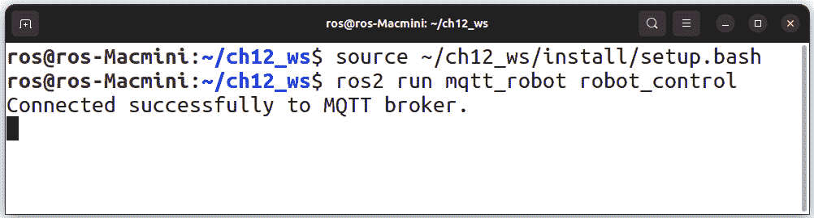

图 12.8 – 运行 robot_control 节点

1.  在另一个 Ubuntu 终端中，我们使用以下命令启动 TurtleSim 机器人的实例：

    ```py
    source /opt/ros/humble/setup.bash
    code.py program from Thonny.
    ```

1.  我们应该观察到我们可以使用我们的物联网摇杆导航 TurtleSim 机器人。按下并保持主街机式按钮将使机器人逆时针画圆，而点击并保持摇杆控制下应该使机器人顺时针画圆：

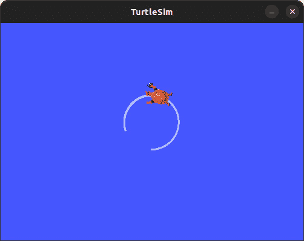

图 12.9 – 按压物联网摇杆上的街机风格按钮后，再按摇杆控制按钮的结果

通过这种方式，我们成功管理了使用我们的物联网摇杆对虚拟机器人的远程控制，展示了系统的全球覆盖范围。这个应用展示了物联网和机器人集成的大量潜力。

在最后一步，我们将物联网摇杆的组件封装在一个定制设计的外壳中。这通过使设备更容易管理和操作来提高可用性。此外，定制外壳为电子设备提供保护，并使我们的应用具有专业的外观。

# 构建物联网摇杆外壳

如前所述，我们的定制外壳使我们的物联网摇杆看起来更专业，并给我们提供了一个可以握在手中的东西。我们使用 3D 打印部件和一些常用组件来组装定制外壳。

我们案例的 3D 打印部件的`.stl`文件可以在本章 GitHub 仓库的`Build Files`部分找到。我们可以在以下图中看到组成外壳的部件：

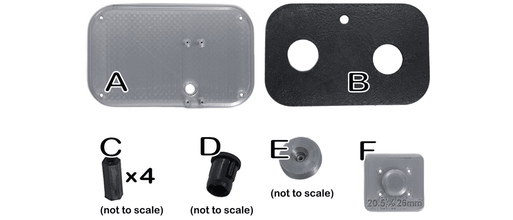

图 12.10 – 组成物联网摇杆外壳的部件

组成物联网摇杆外壳的部件，如*图 12.10*所示，如下：

+   *A*: 后盖板。从`.stl`文件中 3D 打印而成。

+   *B*: 前壳。从`.stl`文件中 3D 打印而成（图中的部件已被上色）。

+   *C*: 4 个 M2.5 10 毫米支撑件。

+   *D*: 8 毫米 LED 支架。

+   *E*: PS2 摇杆模块的摇杆。从`.stl`文件中 3D 打印而成。

+   *F*: PS2 摇杆模块的钻孔引导。从`.stl`文件中 3D 打印而成。我们使用钻孔引导，因为不同版本的 PS2 摇杆模块的安装孔位置存在差异。我们示例中使用的版本在*y*轴上安装孔间距为 20.5 毫米，在*x*轴上为 26 毫米。

+   *G*: 1 个 M2 8 毫米螺丝（未显示）。

+   *H*: 4 个 M2 5 毫米螺丝（未显示）。

+   *I*: 8 个 M2.5 5 毫米螺栓（未显示）。

+   *J*: 4 个 M3 10 毫米螺栓（未显示）。

构建物联网摇杆外壳时，我们首先将摇杆（*图 12.10*中的*E*）固定到 PS2 摇杆上（如*图 12.11*所示）。我们用我们自己的摇杆替换 PS2 摇杆附带的摇杆，以便有更大的范围。我们可以在以下图中看到物联网摇杆的构建过程：

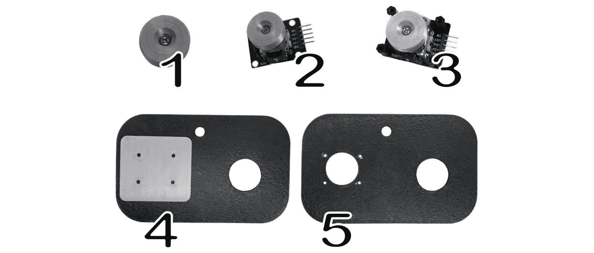

图 12.11 – 为 PS2 摇杆准备我们的定制外壳

为了准备我们的 PS2 摇杆外壳，我们执行以下操作：

1.  将 M2 8 毫米螺丝固定到摇杆上，使其部分穿过摇杆（*图 12.11*中的*步骤 1*）。

1.  通过手动拧紧螺丝将摇杆固定到 PS2 摇杆的茎部（*图 12.11*中的*步骤 2*）。

1.  使用四个 M2.5 5 毫米螺栓将四个 M2.5 10 毫米支撑件固定到 PS2 摇杆上（图 12**.11* 中的 *步骤 3*）。

1.  将钻孔引导器对准前壳的摇杆孔，使其与图 12**.11** 中 *步骤 4* 所示的方向一致。PS2 摇杆将被安装，使得引脚向右延伸。

1.  使用适当尺寸的钻头，在前壳上钻四个孔（图 12**.11** 中的 *步骤 5*）。

在摇杆安装并钻孔后，现在是时候构建外壳了。为此，我们遵循以下图中的步骤：

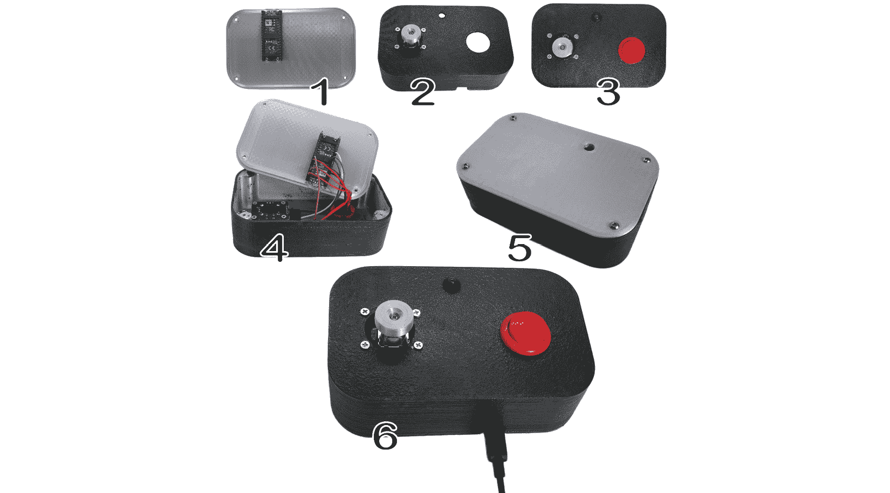

图 12.12 – 构建 IoT 摇杆外壳

以图 12**.12* 为参考，我们按照以下步骤构建物联网摇杆外壳：

1.  我们首先使用四个 M2 5 毫米螺丝将 Raspberry Pi Pico WH 固定在背板上，将 USB 端口向下定位以便于访问。这种设置确保 Pico 的 *复位* 按钮可以通过背板上的指定孔访问。选择 Pico WH 可以方便地与测试电路中的 GPIO 扩展器集成。虽然 Raspberry Pi Pico W 也可以使用，但需要焊接来安装，这使得 Pico WH 对于这个应用来说更加方便（图 12**.12* 中的 *步骤 1*）。

1.  然后，我们使用四个 M2.5 5 毫米螺栓将 PS2 摇杆固定在前壳上。我们必须确保安装 P2 摇杆，使得引脚指向外壳的右侧（图 12**.12* 中的 *步骤 2*）。

1.  使用 LED 座，我们将带有电阻的 LED 连接到前壳。我们使用适当的孔将街机风格的按钮固定在前壳上（图 12**.12* 中的 *步骤 3*）。

1.  我们使用四个 M3 10 毫米螺栓将背板固定在前壳上（图 12**.12* 中的 *步骤 4*）。

1.  为了给物联网摇杆供电，我们将一根微型 USB 线缆连接到 Raspberry Pi Pico WH 的 USB 端口。

现在，我们可以将我们的物联网摇杆插入并使用它来控制 TurtleSim 机器人。

# 摘要

在本章中，我们组装了我们的物联网摇杆，并使用它来控制 TurtleSim 虚拟机器人。我们从组件接线开始，然后继续编写代码，通过 MQTT 消息传输摇杆动作。

我们将组件封装在一个定制的 3D 打印外壳中，增强了摇杆的可用性和耐用性。通过这个应用，我们展示了物联网设备与机器人系统的无缝集成。

在下一章中，我们将把我们的虚拟 TurtleSim 机器人转换为现实生活中的物理机器人，并使用我们新的物联网摇杆来控制它。
