# 13

# 介绍用于安全的先进机器人眼睛（A.R.E.S.）

在本章中，我们将把我们的 TurtleSim 虚拟机器人转换为现实生活中的机器人，我们将称之为 A.R.E.S.（即 Advanced Robotic Eyes for Security）。A.R.E.S.将具有视频流，我们可以通过 VLC 媒体播放器在我们的本地网络中查看。我们将使用我们在*第十二章*中创建的物联网摇杆来控制 A.R.E.S.。

我们将使用树莓派作为大脑或感官输入，以及树莓派 Pico 来控制电机、LED 和蜂鸣器来构建 A.R.E.S.。我们将使用标准电机和我们的树莓派 Pico H 上的机器人板来控制电机。我们将使用位于本章 GitHub 仓库“构建文件”目录中的`.stl`文件来 3D 打印框架。

本章我们将涵盖以下主题：

+   探索我们的 A.R.E.S.应用程序

+   构建 A.R.E.S.

+   软件设置和配置

+   使用 ROS 编程 A.R.E.S.

让我们开始吧！

# 技术要求

为了全面学习本章内容，你需要以下条件：

+   Python 编程的中级知识

+   Linux 命令行的基本知识

+   用于 MQTT 服务器实例的 CloudAMQP 账户

+   来自*第十二章*的物联网摇杆

+   3D 打印机或 3D 打印服务的访问权限

+   自定义情况的构建文件可以在我们的 GitHub 仓库中找到

请参阅“构建 A.R.E.S.”部分以了解所需的硬件组件。

本章的代码可以在以下链接找到：

https://github.com/PacktPublishing/-Internet-of-Things-Programming-Projects-2nd-Edition/tree/main/Chapter13

# 探索我们的 A.R.E.S.应用程序

A.R.E.S.机器人展示了各种物联网组件的集成。它通过我们在*第十二章*中创建的物联网摇杆进行操作，并通过 MQTT 与树莓派通信命令。我们的设计将包含树莓派 3B+和树莓派 Pico H。在下面的图中，我们可以看到 A.R.E.S.机器人的轮廓，包括从物联网摇杆的连接：

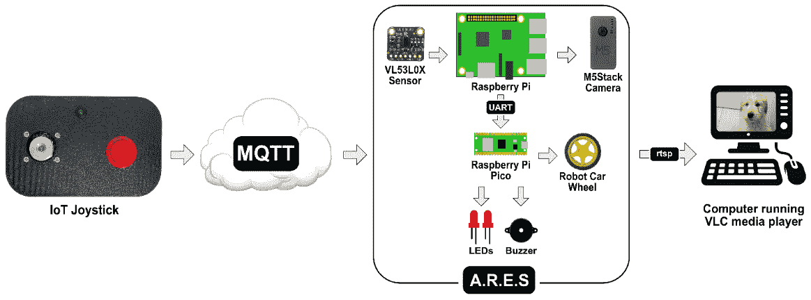

图 13.1 – A.R.E.S.机器人应用程序

作为大脑的树莓派 3B+使用**UART**（通用异步收发传输器）通信来中继命令到树莓派 Pico H，后者反过来控制汽车的运动、LED 和蜂鸣器，对输入做出动态响应。配备有 VL53L0X 传感器，A.R.E.S.可以测量距离，从而避免障碍物。此外，安装在 A.R.E.S.上的 M5Stack 摄像头可以实时传输视频流，可以通过 VLC 媒体播放器在任意计算机上查看，使用**实时流协议**（RTSP）。

使用树莓派 3B+为 A.R.E.S.编程

对于 A.R.E.S.，我们选择 Raspberry Pi 3B+而不是 4 或 5 等较新型号，因为它具有更高的能效和成本效益。它能够使用标准手机电池组运行，非常适合我们的需求，而其较低的价格和作为当前型号的可用性确保了经济和实用性的双重好处。

在启动 A.R.E.S.机器人项目时，我们首先组装 3D 打印的框架并安装必要的组件。A.R.E.S.设计得非常紧凑，使其成为教育用途的理想机器人平台。一旦框架完成，我们将继续进行软件配置，在我们的 Raspberry Pi 3B+上配置操作系统，并编程 Raspberry Pi Pico H。让我们从构建框架开始。

# 构建 A.R.E.S.

A.R.E.S.由 3D 打印部件和常见组件组成，如直流电机、LED、Raspberry Pi 3B+、Raspberry Pi Pico H、**ToF**（飞行时间），传感器、Wi-Fi 相机、电池组和各种螺栓和螺丝。

我们将开始构建 A.R.E.S.，首先识别 3D 打印的部件。

## 识别 3D 打印框架部件

我们可以在本章 GitHub 仓库的“构建文件”目录下找到这些部件的`.stl`文件。在以下图中，我们可以看到打印出的部件：


图 13.2 – A.R.E.S. 3D 打印部件

由 3D 打印部件组成的 A.R.E.S.框架部件如下：

+   *A*: 底座

+   *B*: 外壳

+   *C*: 面板

+   *D*: 电池组支架

+   *E*: 电机支架

+   *F*: 测试台（可选的用于测试目的的底座）

在识别了 3D 打印框架部件后，让我们看看用于构建 A.R.E.S.的组件。

## 识别用于创建 A.R.E.S.的组件。

我们使用的构建 A.R.E.S.的组件是标准电子组件，可以从亚马逊或 AliExpress 等在线供应商那里轻松购买。以下图展示了我们使用的组件：

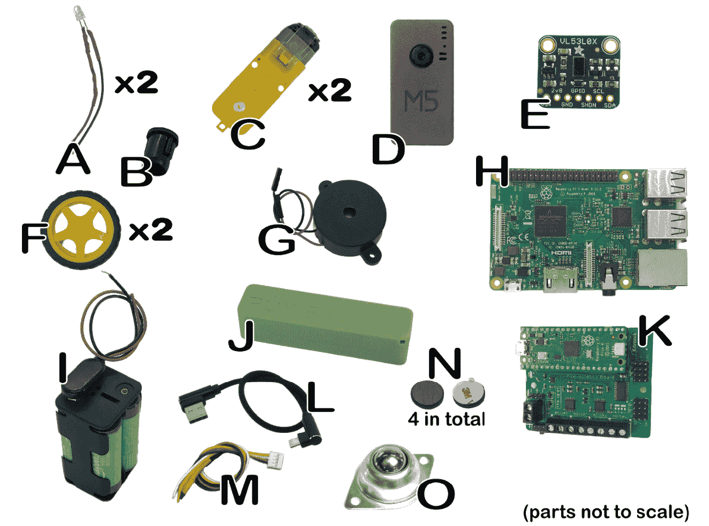

图 13.3 – 组成 A.R.E.S.机器人的部件

构建 A.R.E.S.所需的组件如下：

+   *A*: 2 x LED 和 220 欧姆电阻

+   *B*: 2 x 5 毫米（8 毫米宽）LED 支架

+   *C*: 2 x TT 直流机器人电机

+   *D*: M5Stack 计时器相机 X 及其支架（未展示）

+   *E*: Adafruit VL53L0X ToF 传感器

+   *F*: 2 x TT 机器人汽车轮子

+   *G*: SFM-27 蜂鸣器

+   *H*: Raspberry Pi 3B+

+   *I*: 4 节 AA 电池的电池组（含电池）

+   *J*: 手机 USB 电池组

+   *K*: 带有 Kitronik Simply Robotics 电机驱动板的 Raspberry Pi Pico H

+   *L*: 短微 USB 到 USB 线

+   *M*: Grove 连接器到公跳线连接器，用于将相机连接到 Raspberry Pi 3B+的 GPIO 端口

+   *N*: 4 x 2 毫米厚，18 毫米直径的磁铁，带有双面粘合垫

+   *O*: 轮子（32 毫米宽度）

+   *未显示*：18 个 M3 10 毫米螺栓，4 个 M3 20 毫米螺栓，8 个 M3 螺母，6 个 M2.5 10 毫米螺栓，2 个 M4 10 毫米螺栓，4 个 M2.5 40 毫米支撑柱，3 个 M3 20 毫米支撑柱，跳线，带有连接器和电线的压接套件（可选但推荐），热胶枪，烙铁

将组件安装到位后，让我们开始构建我们的 A.R.E.S.机器人。

## 构建 A.R.E.S.

使用我们的 3D 打印框架部件和电子组件，现在是时候构建 A.R.E.S.了。为了构建 A.R.E.S.，我们使用以下图作为指南：

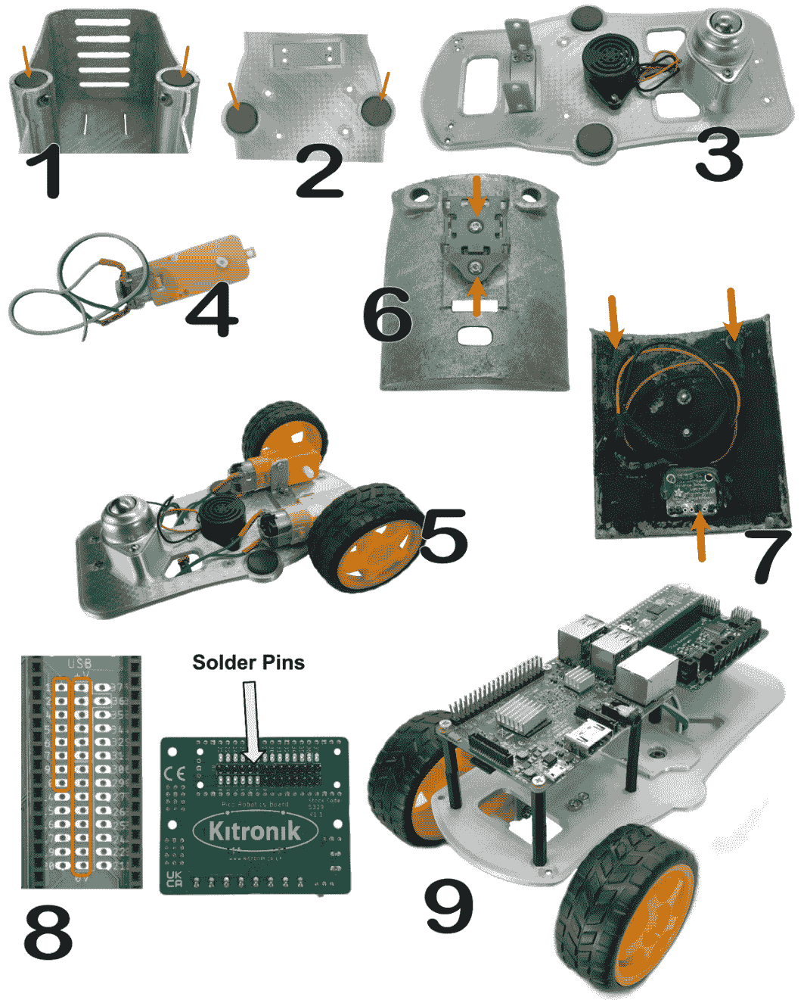

图 13.4 – 构建 A.R.E.S.机器人

步骤如下（编号步骤也对应图中的编号组件）：

1.  使用双面胶带（通常与产品一起包装），我们将两个磁铁（*N*来自*图 13**.3*）固定在外壳上（*B*来自*图 13**.2*）。

1.  使用相反极性的磁铁（*N*来自*图 13**.3*），我们将磁铁（在固定前务必测试）固定到底座上（*A*来自*图 13**.2*）。

1.  使用两个 M4 10 毫米螺栓，我们将 SFM-27 蜂鸣器（*G*来自*图 13**.3*）固定到底座上（*A*来自*图 13**.2*）。螺栓应插入蜂鸣器底座；然而，可能需要 M4 螺母。在此步骤中，我们还使用两个 M3 螺栓将万向轮（*O*来自*图 13**.3*）固定到底座上（*A*来自*图 13**.2*）。

1.  我们将 20 厘米长的电线焊接在每个 TT 电机的端子上（*C*来自*图 13**.3*）。

1.  使用电机支架（*E*来自*图 13**.2*），我们将 TT 电机（*C*来自*图 13**.3*）和 TT 机器人汽车轮子（*F*来自*图 13**.3*）固定在底座上（*A*来自*图 13**.2*）。

1.  使用两个 M3 10 毫米螺栓，我们将 M5Stack Timer Camera X（*D*来自*图 13**.3*）附带的相机支架固定在面板上（*C*来自*图 13**.2*）。

1.  使用 LED 支架（*B*来自*图 13**.3*）和带有电阻的 LED（*A*来自*图 13**.3*），我们将 LED 穿过面板上的适当孔（*C*来自*图 13**.2*）。我们使用热胶枪的胶水将 VL53L0X ToF 传感器（*E*来自*图 13**.3*）固定在面板上（*C*来自*图 13**.2*）。我们还可以将 LED 固定在原位，以防止它们移动。

1.  需要访问 Raspberry Pi Pico H 上的 GP 引脚，但它们位于电机板的**DIP**（即**双列直插式封装**）插座内，因此无法访问。为了克服这个问题，我们需要在电机板的底部焊接引线脚，使我们能够将 SFM-27 蜂鸣器（*G*来自*图 13**.3*）和带有电阻的 LED（*A*来自*图 13**.3*）连接到 Raspberry Pi Pico H。

1.  我们使用 10 毫米 M2.5 和 10 毫米 M3 螺栓，将四个 M2.5 40 毫米支撑件固定在底座的前面（*图 13**.2*中的*A*）和三个 M3 20 毫米支撑件固定在底座的后面（*图 13**.2*中的*A*）。我们可以使用电机板（*图 13**.3*中的*K*）将 Raspberry Pi 3B+（*图 13**.3*中的*H*）和 Pico H 固定在支撑件上；然而，这将是临时的，因为这些组件在我们接线 A.R.E.S.时会移动。我们还可以临时放置电池组提升器（*图 13**.2*中的*D*）。我们使用提升器来覆盖电线，提供一个平坦的表面放置电池组（*图 13**.3*中的*I*）。

在组装好框架并放置好组件后，现在是时候将我们的组件连接到 Raspberry Pi 和 Pico H 上了。

## 接线 A.R.E.S.

接线 A.R.E.S.需要连接到 Raspberry Pi 3B+和 Kitronik 电机板。使用*图 13**.1*作为参考，我们可以看到我们将 VL53L0X ToF 传感器和 M5Stack Timer Camera X 连接到 Raspberry Pi 3B+，将 TT DC 机器人电机、带电阻的 LED 和蜂鸣器通过电机板连接到 Raspberry Pi Pico H。我们还通过 UART 通信将 Raspberry Pi 3B+连接到 Raspberry Pi Pico H。

我们从机器人电机开始接线。在下面的图中，我们可以看到电机板的高清图，其中连接电池组和电机的端子被突出显示：

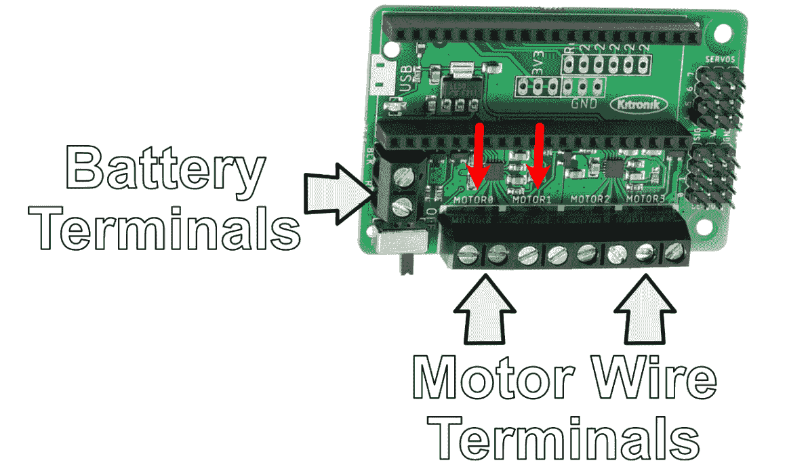

图 13.5 – Raspberry Pi Pico H 的 Kitronik 电机板

要接线我们的电机，我们执行以下操作：

1.  将右侧电机，如*图 13**.4*的第 9 步所示，连接到电机板上的**Motor0**。在这个阶段，电线的极性不是关键，因为我们可以在必要时纠正它们的方向。

1.  将左侧电机的电线连接到电机板上的**Motor1**。

1.  将 AA 电池组的电线连接到电机板上的电池端子，注意极性。

在连接好机器人电机和电池线后，现在是时候接线其余的组件了。我们将使用标准的女性跳线来制作连接。虽然不是必需的，但使用压接套件制作自己的跳线可以使接线设置整洁有序。我们使用*图 13**.6*中的接线图作为参考：

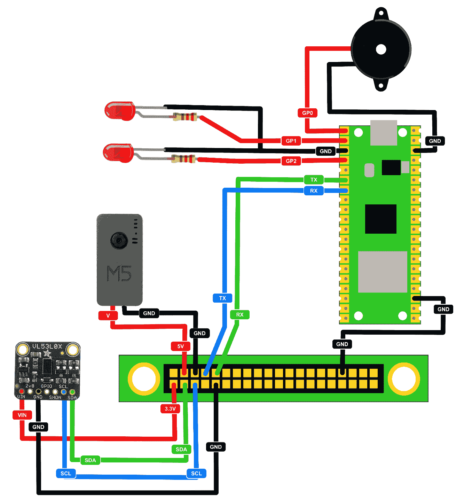

图 13.6 – A.R.E.S.的组件接线图

要接线其余的组件，我们执行以下操作：

1.  使用 Grove 连接器连接到女性跳线连接器（*图 13**.3*中的*M*），我们将 M5Stack Timer Camera X 连接到 Raspberry Pi 3B+，将 Raspberry Pi 的 5V 连接到摄像机的 V 连接器，将 Raspberry Pi 的 GND 连接到摄像机的 G。

1.  我们将 ToF 传感器的 VIN 连接到 Raspberry Pi 的 3.3V。

1.  我们将 ToF 传感器上的 SDA 连接到树莓派上的 SDA (GPIO 2)。

1.  我们将 ToF 传感器上的 SCL 连接到树莓派上的 SCL (GPIO 3)。

1.  我们将 ToF 传感器上的 GND 连接到树莓派的 GND。

1.  我们将树莓派上的 TX (GPIO 14) 连接到树莓派 Pico H 的 RX (GP5) 或电机板上的 7 号引脚。

1.  我们将树莓派上的 RX (GPIO 15) 连接到树莓派 Pico H 的 TX (GP4) 或电机板上的 6 号引脚。

1.  我们将树莓派上的 GND 连接到树莓派 Pico H 的 GND 或电机板上的 GND (0V) 引脚。

1.  我们将 SFM-27 蜂鸣器的正极线连接到树莓派 Pico H 的 GP0 或电机板上的 1 号引脚。

1.  我们将 SFM-27 蜂鸣器的负极线连接到电机板上的 GND (0V) 引脚。

1.  我们将 LED 的正极通过电阻连接到 GP1 和 GP2 或电机板上的 2 号和 4 号引脚。

1.  我们将 LED 的负极通过电阻连接到电机板上的 GND (0V) 引脚。

在我们进行连接时，可能需要移动树莓派和电机板。此外，建议我们最初不要将面板（*图 13**.2 中的 *C*）连接到底座（*图 13**.2 中的 *A*），因为我们需要访问树莓派 3B+ 上的 microSD 端口。

在布线就绪后，让我们设置 A.R.E.S. 的软件。我们首先将 Ubuntu 安装到我们的树莓派 3B+ 上。

# 软件设置和配置

为了设置 A.R.E.S. 的软件架构，我们将从这个章节的 GitHub 仓库中运行一个脚本。脚本首先确保以 root 权限运行，更新和升级系统，并安装必要的工具和接口，例如 **I2C**（代表 **Inter-Integrated Circuit**）和 UART。然后继续安装 Adafruit Blinka 以支持 CircuitPython 库，设置 ROS Humble Hawksbill 用于机器人编程，并安装 Colcon 构建系统以进行软件编译。

脚本还负责通过 `rosdep` 进行依赖管理，并将 ROS 2 环境设置添加到 `bashrc` 文件中以便于访问。到过程结束时，我们的树莓派 3B+ 已完全配置为 A.R.E.S.。

在运行脚本之前，我们将使用 Raspberry Pi Imager 将 Ubuntu 烧录到 microSD 卡上，并将卡安装到我们的树莓派 3B+ 上。由于 A.R.E.S. 机器人的 microSD 卡插槽位于前面，因此面板将覆盖它。因此，在安装 Ubuntu 时，我们将保持面板与底座断开连接，如图所示：

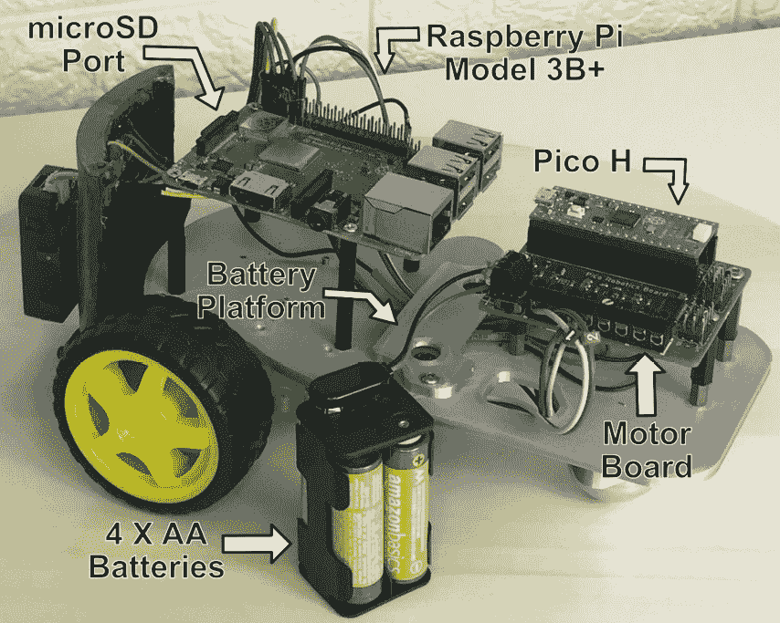

图 13.7 – A.R.E.S. 的侧面视图，面板已断开以允许访问 microSD 卡

我们将从我们选择的计算机上运行 Raspberry Pi Imager。对于本章的示例，我们将将其安装在 Windows 计算机上。

## 在我们的树莓派 3B+ 上安装 Ubuntu

Raspberry Pi Imager 是一个多功能的工具，旨在简化在 Raspberry Pi 设备上安装操作系统的过程。由 Raspberry Pi 基金会开发，这个实用程序允许我们将各种操作系统闪存到 SD 卡上，然后可以在 Raspberry Pi 上启动和运行。

虽然 Raspberry Pi Imager 主要支持安装 Raspberry Pi OS（以前称为 Raspbian），但其功能扩展到一系列其他操作系统。这使我们能够尝试不同的环境或需要由替代操作系统更好地支持的功能。

要使用 Raspberry Pi Imager，我们只需在我们的计算机上下载并安装应用程序，从其广泛的列表中选择所需的操作系统，然后选择安装的目标 SD 卡。Raspberry Pi Imager 可以安装在包括 Windows、macOS 和 Linux 在内的各种操作系统上。例如，在本章中，我们将将其安装到 Windows 机器上。我们将烧录 Ubuntu 22.04 的命令行版本，以对应 Humble Hawksbill 版本的 ROS。

要使用 Raspberry Pi Imager 将 Ubuntu 安装到我们的 A.R.E.S.机器人上的 Raspberry Pi 3B+，我们导航到 URL 并下载我们正在使用的操作系统的 imager（[`www.raspberrypi.com/software/`](https://www.raspberrypi.com/software/）），然后按照以下步骤安装工具：

1.  我们将我们的 microSD 卡插入到计算机的端口上。

1.  安装完成后，我们打开工具，选择**Raspberry Pi 3**作为**Raspberry Pi 设备**，选择**UBUNTU SERVER 22.04.4 LTS (64-BIT)**作为**操作系统**，以及我们插入的 microSD 卡作为**存储**选项：

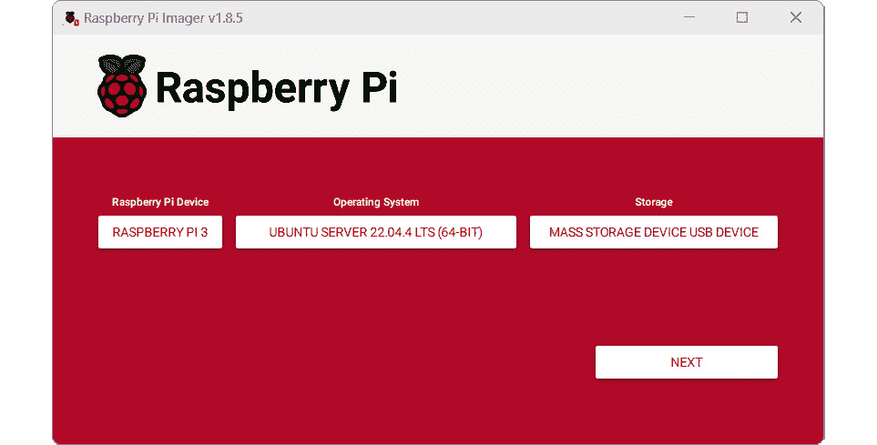

图 13.8 – 设置 Raspberry Pi Imager

要继续，我们点击**下一步**按钮。这将带我们到**使用操作系统定制？**对话框：

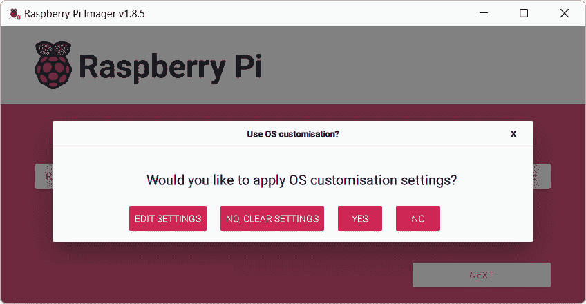

图 13.9 – 图像定制对话框

1.  由于我们想设置计算机名和网络名，我们点击**编辑设置**按钮，并得到以下屏幕：

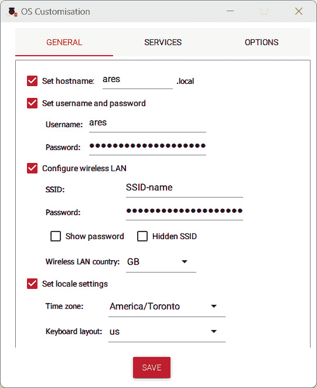

图 13.10 – 操作系统定制屏幕

我们将主机名和用户名都设置为`ares`。我们为用户名提供了一个密码，并输入我们的 SSID（局域网网络）和 SSID 密码。

1.  要通过 SSH 启用远程访问，我们点击顶部的**服务**选项卡并选择**启用 SSH**：

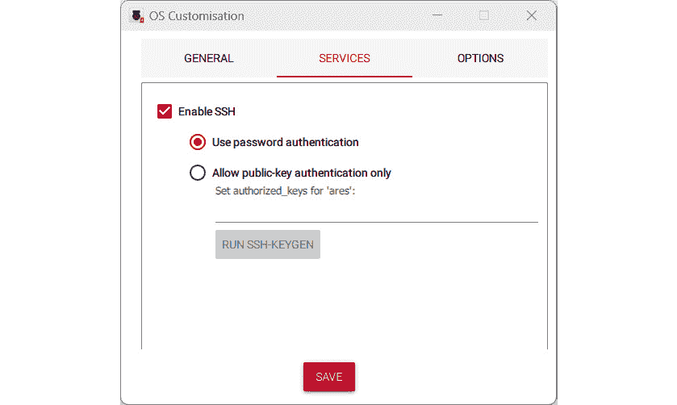

图 13.11 – 启用 SSH

1.  要保存我们的设置，我们点击**保存**按钮。

1.  要应用设置，我们点击**是**按钮。

    我们将随后看到一个警告：

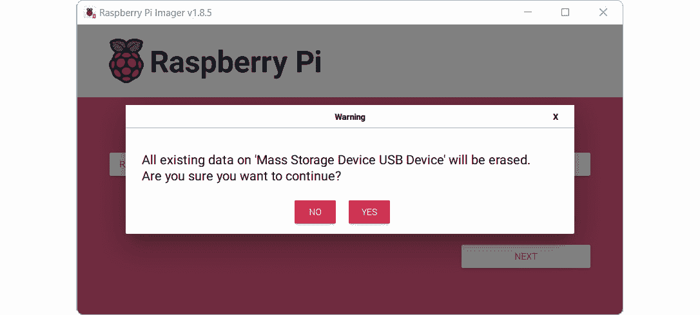

图 13.12 – 警告信息

1.  我们点击**是**，因为我们想擦除 microSD 卡上的任何数据，并用 Ubuntu 操作系统替换它。

Raspberry Pi Imager 随后将安装 Ubuntu 22.04 操作系统到我们的 microSD 卡上，我们将将其安装到 A.R.E.S.上的 Raspberry Pi 3B+。我们不需要设置 Wi-Fi 网络或启用 SSH。

安装了 Ubuntu 后，现在是时候安装 ROS 以及我们为 A.R.E.S.需要的 Python 库了。我们将使用存储在我们 GitHub 仓库中的专用脚本来自动化这个过程。

## 运行安装脚本

在前面的章节中，我们手动安装了开发库，这是一个详尽但耗时的工作过程。现在，利用我们对 Python 库的熟悉，我们将通过 GitHub 仓库中的脚本简化 A.R.E.S.与 ROS 以及必要库的设置。

在 Ubuntu 上以 root 权限执行，此脚本自动化了包括 ROS 在内的安装过程。尽管直接安装到操作系统与**最佳实践**相悖，但它简化了过程。对于未来的项目，建议读者探索使用 Docker 等工具进行容器化。

要运行 A.R.E.S.安装脚本，我们执行以下操作：

1.  以**图 13.7**为参考，我们确保我们能够访问 Raspberry Pi 3B+上的端口。

1.  我们将显示器、键盘和鼠标连接到 Raspberry Pi，并插入新镜像的 microSD 卡。

    由于 Ubuntu 的服务器版本是基于命令行的，因此当我们启动 Raspberry Pi 时，我们将不会看到一个 GUI。我们使用在镜像过程中设置的凭据登录。登录后，我们应该在`home`目录中。我们可以使用`pwd`命令来验证这一点：

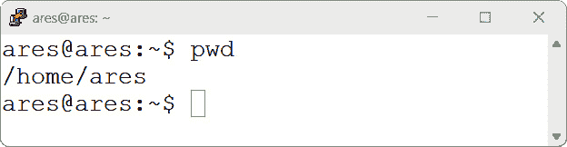

**图 13.13 – 验证当前目录**

1.  设置脚本位于本书的 GitHub 仓库中。要下载脚本以及我们用于 A.R.E.S.机器人的 Python 代码，我们使用以下命令将仓库克隆到我们的 Raspberry Pi 上：

    ```py
    code. We may verify the creation of the code directory by running the ls command:
    ```

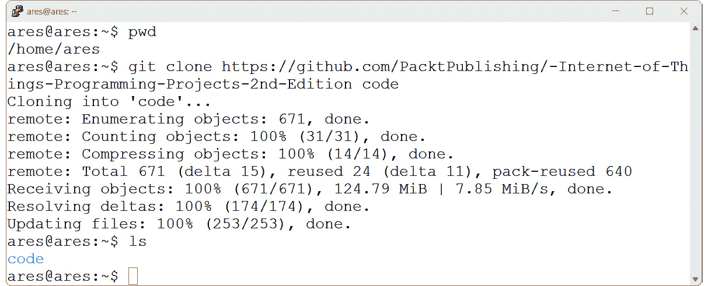

**图 13.14 – 克隆仓库**

脚本位于`code`目录的子目录中。我们使用以下命令将其复制到当前目录（`.`）：

```py
cp code/Chapter13/code/setup-ares.sh .
```

1.  我们使用`ls`命令验证脚本是否成功复制：

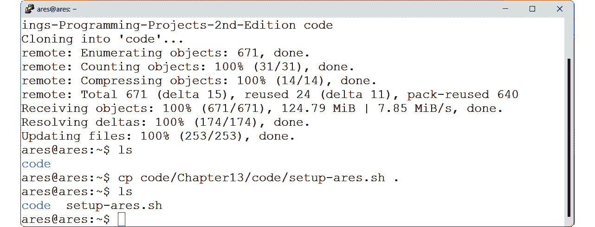

**图 13.15 – 验证设置脚本成功复制**

1.  我们使用以下命令以管理员权限执行脚本：

    ```py
    sudo bash setup-ares.sh
    ```

    以管理员权限执行脚本确保它具有执行系统级更改和安装的必要权限，而不会遇到访问限制。我们的脚本最初会更新我们的系统，然后安装 ROS 和必要的 Python 库。这可能需要几分钟才能完成。完成后，我们应该会看到我们机器的 IP 地址，这样我们就可以通过 SSH 远程登录。当 A.R.E.S.远程运行时，这将很有必要：

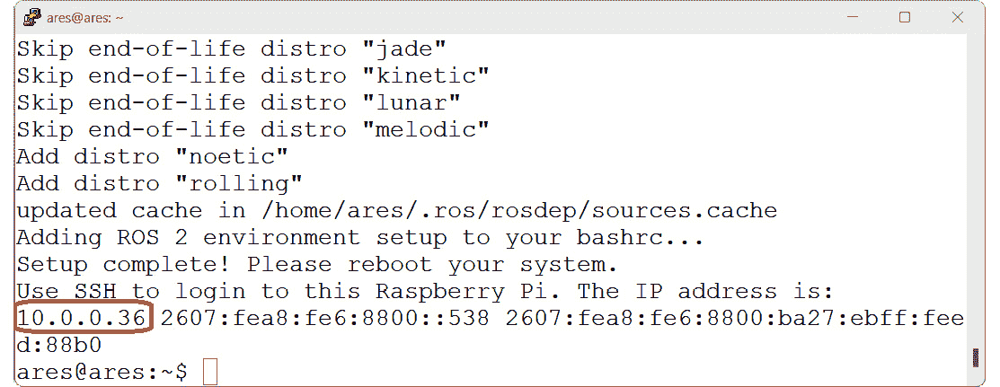

**图 13.16 – 运行设置脚本的结果**

1.  在完成我们的设置脚本后，我们现在可以将机器人面部固定到 A.R.E.S. 的底板上：

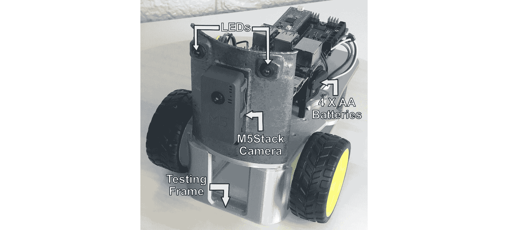

图 13.17 – A.R.E.S. 的正面视图

在构建 A.R.E.S. 和在 Raspberry Pi 3B+ 上安装操作系统后，现在是时候在我们的 Raspberry Pi Pico H 上安装代码了。参考 *图 13*.*1*，我们可以看到 A.R.E.S. 使用 Pico H 来控制电机、LED 和蜂鸣器。

我们将首先编写代码来控制 LED 和蜂鸣器。

## 为 Pico H 创建警报代码

要编程我们的 Pico H，我们需要将一个微型 USB 线连接到 Pico H 的 USB 端口。尽管我们打算错开 Pico H 和 Raspberry Pi 3B+ 的高度，但我们可能需要暂时从支架上卸下 Raspberry Pi 3B+，以便将微型 USB 线连接到 Pico H。

一旦连接了微型 USB 线，我们就可以将 Pico H 连接到我们选择的电脑上并运行 Thonny。我们将在 Pico H 上的一个名为 `device_alarm.py` 的文件中创建一个名为 `Alarm` 的类，以封装警报功能。为了简单起见，我们将 LED 的闪烁与蜂鸣器的激活结合起来。

要做到这一点，我们执行以下操作：

1.  参考第十二章的 *设置我们的 Raspberry Pi Pico WH* 部分 (*章节 12*]，尽管我们选择了 **Raspberry Pi • Pico / Pico H** 作为 **CircuitPython** **变体**选项，但我们还是在我们的 Raspberry Pi Pico 上安装了 CircuitPython：

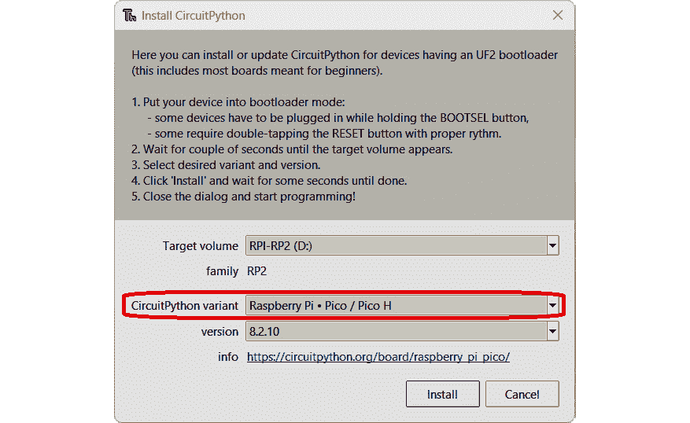

图 13.18 – 在我们的 Raspberry Pi Pico H 上安装 CircuitPython

1.  然后，我们从屏幕的右下角选择 Pico H，激活其上的 CircuitPython 环境。

1.  在一个新的编辑器中，我们以导入开始我们的代码：

    ```py
    import time
    import board
    import pwmio
    import digitalio
    ```

    在我们的代码中，我们有以下内容：

    +   `import time`：提供时间相关函数，使任务如引入程序执行延迟成为可能，这对于控制操作流程和时序非常有用。

    +   `import board`：访问特定于板的引脚和硬件接口，这对于与 Raspberry Pi Pico W 上的 GPIO 引脚进行接口至关重要。

    +   `import pwmio`：我们使用这个库通过操作 `import digitalio`：管理数字输入和输出，例如读取按钮的状态或控制 LED，这对于数字信号交互至关重要。

1.  然后，我们定义一个 `Alarm` 类并创建一个初始化方法：

    ```py
    class Alarm:
        def __init__(self, buzzer_pin=board.GP1, led_pin1=board.GP0, led_pin2=board.GP2, frequency=4000):
            self.buzzer = pwmio.PWMOut(buzzer_pin, frequency=frequency, duty_cycle=0)
            self.led1 = digitalio.DigitalInOut(led_pin1)
            self.led1.direction = digitalio.Direction.OUTPUT
            self.led2 = digitalio.DigitalInOut(led_pin2)
            self.led2.direction = digitalio.Direction.OUTPUT
    ```

    在我们的代码中，以下操作发生：

    1.  我们定义一个名为 `Alarm` 的类。`__init__()` 方法接受可选参数，包括蜂鸣器引脚、两个 LED 引脚和蜂鸣器频率，并具有默认值。

    1.  然后，我们将指定引脚上的蜂鸣器初始化为 PWM 输出，给定频率，占空比为 `0`（关闭状态）。

    1.  我们的代码在指定的引脚上设置了两个 LED 作为数字输出，准备打开或关闭。

1.  我们的这个类只包含一个方法，`activate_alarm()`：

    ```py
        def activate_alarm(self, num_of_times=5):
            blink_rate = 0.5
            for _ in range(num_of_times):
                self.buzzer.duty_cycle = 32768
                self.led1.value = True
                self.led2.value = True
                time.sleep(blink_rate)
                self.buzzer.duty_cycle = 0
                self.led1.value = False
                self.led2.value = False
                time.sleep(blink_rate)
    ```

    在我们的代码中，我们执行以下操作：

    1.  我们在`Alarm`类中定义了一个`activate_alarm()`方法，用于指定次数（默认为`5`）激活警报。

    1.  在方法内部，我们将`blink_rate`变量设置为`0.5`秒，然后循环指定次数，根据`blink_rate`变量切换蜂鸣器和 LED 灯的开关。

1.  为了测试我们的代码和接线，我们使用以下代码：

    ```py
    alarm = Alarm(buzzer_pin=board.GP1, led_pin1=board.GP0, led_pin2=board.GP2)
    alarm.activate_alarm(10)
    ```

1.  要保存文件，我们点击`device_alarm.py`到我们的 Raspberry Pi Pico H。

1.  要运行我们的代码，我们点击绿色的**运行**按钮，在键盘上按*F5*，或者点击顶部的**运行**菜单选项，然后点击**运行****当前脚本**。

1.  我们应该观察到蜂鸣器和 LED 灯闪烁 10 次。

提示

为了防止在我们的应用程序中执行测试代码，我们要么删除该代码段，要么将其注释掉。

在编写并测试了警报代码后，现在是时候测试电机了。

## 测试和控制电机

为了封装电机控制功能，我们在一个名为`wheel.py`的文件中创建了一个名为`Wheel`的类。

要做到这一点，我们执行以下操作：

1.  我们的代码需要`PicoRobotics.py`库，该库可能位于本章 GitHub 仓库的`code` | `PicoH`下。要使用 Thonny 将库下载到我们的 Pico H，我们首先在电脑上找到`lib`目录。然后我们右键点击`lib`目录并选择**上传****到/**：

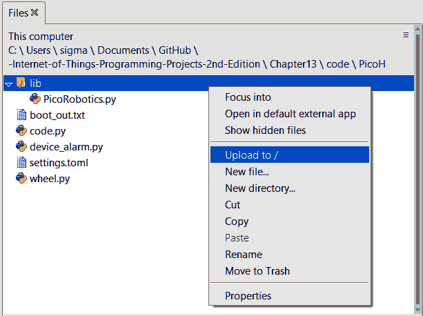

图 13.19 – 将 lib 目录从我们的电脑上传到我们的 Pico H

1.  我们在 Thonny 中打开一个新的编辑器，并通过将`KitronikPicoRobotics`和`time`库导入到我们的程序中来开始编码：

    ```py
    from PicoRobotics import KitronikPicoRobotics
    import time
    ```

1.  这些库将允许我们与 Pico 机器人板进行接口。然后我们定义我们的类和方法：

    ```py
    class Wheel:
        def __init__(self, speed):
            self.motor_board = KitronikPicoRobotics()
            self.speed = speed
        def forward(self):
            self.motor_board.motorOn(1, "f", self.speed)
            self.motor_board.motorOn(2, "f", self.speed)
        def reverse(self):
            self.motor_board.motorOn(1, "r", self.speed)
            self.motor_board.motorOn(2, "r", self.speed)
        def turn_right(self):
            self.motor_board.motorOn(1, "r", self.speed)
            self.motor_board.motorOn(2, "f", self.speed)
        def turn_left(self):
            self.motor_board.motorOn(1, "f", self.speed)
            self.motor_board.motorOn(2, "r", self.speed)
        def stop(self):
            self.motor_board.motorOff(1)
            self.motor_board.motorOff(2)
    ```

    在我们的代码中，以下情况发生：

    1.  我们定义了一个`Wheel`类。

    1.  `__init__()`构造函数初始化类，设置实例变量，包括封装 Pico 机器人电机板功能的`motor_board`，以及用于控制电机速度的`speed`参数。

    1.  我们实现了一个`forward()`方法，以指定速度使两个轮子向前移动。

    1.  我们实现了一个`reverse()`方法，以指定速度使两个轮子反向移动。

    1.  然后，我们实现了一个`turn_right()`方法，通过以指定速度正向运行左轮和反向运行右轮来使机器人向右旋转。

    1.  我们实现了一个`turn_left()`方法，通过以指定速度反向运行右轮和正向运行左轮来使机器人向左旋转。

    1.  我们随后实现了一个`stop()`方法来停止两个电机，使机器人的移动停止。

1.  为了测试我们的代码和接线，我们使用以下代码：

    ```py
    #Test code
    wheel = Wheel()
    wheel.forward()
    time.sleep(1)
    wheel.reverse()
    time.sleep(1)
    wheel.turn_right()
    time.sleep(1)
    wheel.turn_left()
    time.sleep(1)
    wheel.stop()
    ```

1.  在运行代码之前，我们必须确保电机板上的电源开关已打开，并且 AA 电池组已连接：

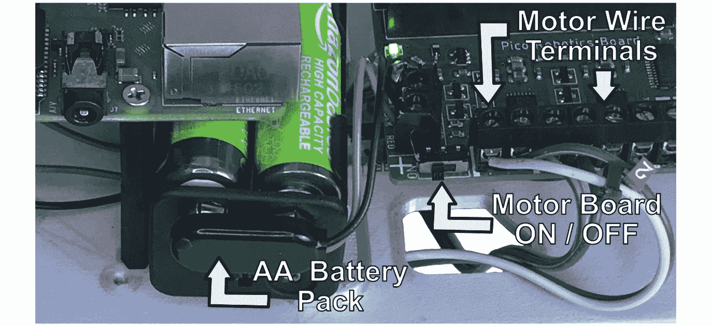

图 13.20 – 电机板和 AA 电池组的特写

1.  为了测试目的，我们将 A.R.E.S.放置在测试台上，使其车轮离地（*图 13**.17*）。

1.  要保存文件，我们点击`wheel.py`到我们的 Raspberry Pi Pico H。

1.  要运行我们的代码，我们点击绿色的**运行**按钮，在键盘上按*F5*，或者在顶部的**运行**菜单选项中点击**运行** **当前脚本**。

我们应该在 A.R.E.S.上观察车轮完成一系列动作，包括向前移动、向后移动、向右移动和向左移动，然后停止。

提示

为了避免我们的测试代码在测试之外运行，我们将其注释或删除，并将`wheel.py`保存到我们的 Pico H 上。

在这个阶段，我们通过调整电机板上的电机接线来确保车轮按预期方向移动，这可能涉及重新排列电机线端子的电线。

在正确配置和测试了连接到 Pico H 的 LED、蜂鸣器和电机后，我们现在将进行 Raspberry Pi Pico H 和板上 A.R.E.S.的 Raspberry Pi 3B+之间的通信测试。

## 测试 Pi 和 Pico 之间的通信

在*图 13**.1*中，我们观察到 Raspberry Pi 3B+和 A.R.E.S.上的 Raspberry Pi Pico H 之间的通信是通过 UART 完成的。具体来说，消息是从 Raspberry Pi 3B+发送到 Pico H 的，以控制连接到 Pico H 的 LED、蜂鸣器和电机。我们在构建 A.R.E.S.时通过各自的 GPIO 端口连接了这两个设备。

在本节中，我们将使用位于本章 GitHub 仓库中的 Python 测试脚本和我们在 Pico H 上创建的新文件来测试通信。我们将从 Pico H 开始。

### 创建 Pico H 脚本

为了在 Pico H 上创建将等待 Raspberry Pi 3B+命令的代码，我们执行以下操作：

1.  我们在 Thonny 中打开一个新的编辑器，并开始通过导入我们程序所需的库来编写代码：

    ```py
    import board
    import busio
    import time
    from wheel import Wheel
    from device_alarm import Alarm
    ```

    在我们的代码中，我们执行以下操作：

    1.  我们首先导入`board`模块以访问物理引脚定义。

    1.  然后，我们导入用于总线通信（UART）功能的`busio`模块。

    1.  我们使用`time`模块来执行延迟。

    1.  我们从我们的`wheel`模块中导入`Wheel`类。

    1.  然后，我们从我们创建的`device_alarm`模块中导入`Alarm`类。

1.  在我们的导入就绪后，我们设置我们的变量声明：

    ```py
    wheel = Wheel(20)
    alarm = Alarm()
    uart = busio.UART(board.GP4, board.GP5, baudrate=115200)
    ```

    在我们的代码中，我们有以下内容：

    +   `wheel = Wheel(20)`: 创建一个`Wheel`类的实例，其速度参数设置为`20`。

    +   `alarm = Alarm()`: 初始化`Alarm`类的一个实例。

    +   `uart = busio.UART(board.GP4, board.GP5, baudrate=115200)`: 使用 Pico H 上的`GP4`和`GP5`引脚建立 UART 通信链路，并将波特率设置为`115200`。

1.  然后，我们创建一个函数来清除我们的 UART 缓冲区，通过连续读取直到没有数据剩余（通过移除可能导致错误的旧或不相关的数据来确保准确和最新的数据通信）：

    ```py
    def clear_uart_buffer():
        while uart.in_waiting > 0:
            uart.read(uart.in_waiting)
    ```

1.  我们的代码随后在一个连续循环中运行，等待通过 UART 接收消息：

    ```py
    while True:
        data = uart.read(uart.in_waiting or 32)
        while '<' in message_buffer and '>' in message_buffer:
            start_index = message_buffer.find('<') + 1
            end_index = message_buffer.find('>', start_index)
            message = message_buffer[start_index:end_index].strip()
            message_buffer = message_buffer[end_index+1:]
            print("Received:", message)
            if message == 'f':
                print("Moving forward")
                wheel.forward()
            elif message == 'b':
                print("Moving in reverse")
                wheel.reverse()
            elif message == 'l':
                print("Left turn")
                wheel.turn_left()
            elif message == 'r':
                print("Right turn")
                wheel.turn_right()
            elif message == 'a':
                print("Alarm")
                wheel.stop()
                alarm.activate_alarm(2)
            elif message == 's':
                print("Stop")
                wheel.stop()
    ```

    在我们的代码中，以下操作发生：

    1.  我们从 UART 连接中连续读取最多 32 字节的数据。

    1.  我们移除包围的尖括号。

    1.  我们打印出接收到的消息以进行调试。

    1.  我们使用 `if` 语句根据消息内容执行特定操作：

        +   如果消息是 `'f'`，机器人会向前移动。

        +   如果消息是 `'b'`，机器人会向后移动。

        +   如果消息是 `'l'`，机器人会向左转。

        +   如果消息是 `'r'`，机器人会向右转。

        +   如果消息是 `'a'`，机器人会激活警报并停止移动。

        +   如果消息不匹配任何指定的命令，机器人会停止任何移动。

    1.  我们随后清除 UART 缓冲区以移除任何剩余的数据。

    1.  然后我们引入一个短暂的 0.1 秒延迟，以防止 CPU 过载。

1.  要保存文件，我们点击 `code.py` 到我们的 Raspberry Pi Pico H。

1.  要运行我们的代码，我们点击绿色的 **运行** 按钮，在键盘上按 *F5* 或者在顶部点击 **运行** 菜单选项，然后点击 **运行** **当前脚本**。

执行 `code.py` 后，我们期望我们的代码在 Shell 中不会产生任何输出，这表明它处于等待来自 Raspberry Pi 的通信的状态。在 Pico H 设置并等待消息后，现在是时候从 Raspberry Pi 执行我们的测试脚本了。

### 从 Raspberry Pi 运行 UART 测试代码

在本章的 GitHub 仓库中，我们有一个名为 `uart-test.py` 的文件，我们可以用它来测试我们的 A.R.E.S. 机器人上 Raspberry Pi 和 Pico H 之间的连接。在本节中，我们将使用 PuTTY 从 Windows 计算机登录到我们的 Raspberry Pi 并运行测试，同时保持我们的 Pico 通过 Thonny 连接。

要做到这一点，我们执行以下操作：

1.  使用 Windows 上的 PuTTY 等程序，或基于 Linux 的系统上的终端，我们使用运行设置脚本后获得的 IP 地址（作为主机名）登录我们的 Raspberry Pi 3B+：

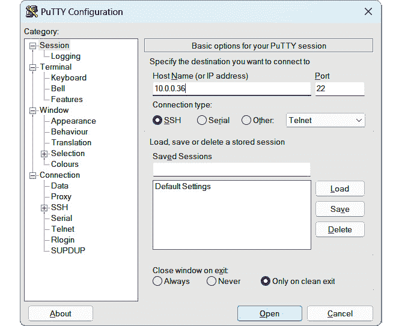

图 13.21 – 在 Windows 中使用 PuTTY 登录我们的 Raspberry Pi 3B+

1.  如果这是第一次通过 PuTTY 登录，我们可能会收到安全警报。我们点击 **接受** 以继续。

1.  要将我们的测试程序复制到当前目录，我们运行以下命令（我们绝对不能忘记点号）：

    ```py
    vi with the following command:

    ```

    vi uart-test.py

    ```py

    Running the command will produce the following output:
    ```

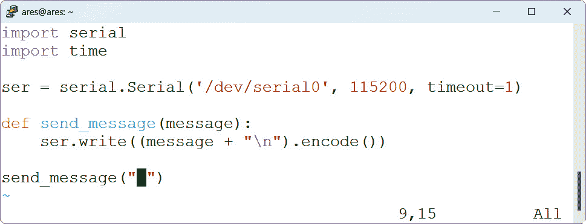

图 13.22 – 在 vi 编辑器中查看 uart-test.py

1.  我们使用以下命令关闭编辑器：

    ```py
    code.py executing, the following command initiates the test:

    ```

    sudo python3 uart-test.py

    ```py

    ```

1.  我们应该观察到 LED 和蜂鸣器在两个脉冲中激活，同时 Thonny 的输出确认已收到警报消息：

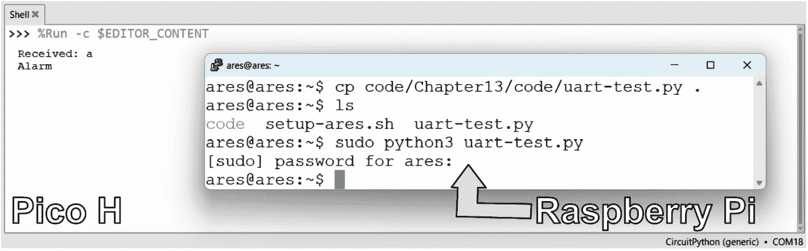

图 13.23 – 运行 uart-test.py 测试脚本的输出结果

在我们的 A.R.E.S. 机器人上成功测试了 Raspberry Pi 和 Raspberry Pi Pico H 之间的 UART 连接后，现在是时候测试距离传感器了。

## 测试 ToF 传感器

为了测量 A.R.E.S.前方距离，我们将使用 Adafruit 提供的 VL53L0X ToF 传感器。该传感器能够以高精度测量从 30 毫米到 1.2 米的距离，通过使用微型激光来检测光传播的时间。其窄光束克服了声纳或**红外**（**IR**）传感器的局限性，使其非常适合在机器人和交互式项目中执行精密任务。兼容 3-5V 和 I2C 通信，它设计用于与各种微控制器轻松使用。

对于 A.R.E.S.，我们将 VL53L0X 连接到我们的 Raspberry Pi 3B+。我们将在设计中使用它，一旦检测到距离小于 10 厘米的物体，机器人就会停止前进。

要测试传感器，我们运行本章 GitHub 存储库中可用的测试脚本。要运行测试，我们执行以下操作：

1.  使用 Windows 上的 PuTTY 程序或基于 Linux 的系统上的终端，我们使用在运行设置脚本后获得的 IP 地址登录到我们的 Raspberry Pi 3B+。

1.  要将我们的测试程序复制到当前目录，我们运行以下命令（我们绝对不能忘记点号）：

    ```py
    cp code/Chapter13/code/distance-sensor-test.py .
    ```

1.  要运行测试，我们执行以下命令：

    ```py
    python3 distance-sensor-test.py
    ```

1.  通过将手放置在传感器（集成到 A.R.E.S.的口中）的不同距离处，我们应该在终端中观察到传感器输出值的相应变化：

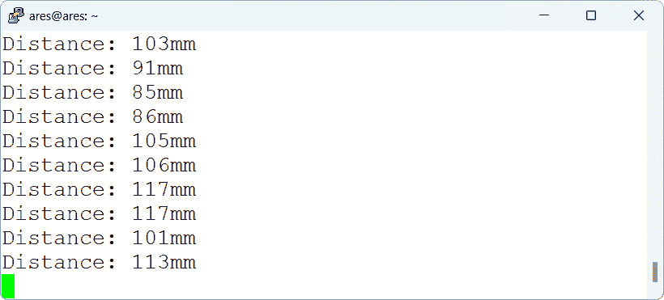

图 13.24 – 测试 VL53L0X ToF 传感器的输出

ToF 传感器与距离传感器是否相同？

ToF 传感器，通过测量光从物体反弹回来的时间，提供精确的距离读数。相比之下，传统的距离传感器，通常使用超声波或 IR 技术，基于声波或光强度来测量距离。ToF 传感器通常在各种范围内提供比这些常见距离传感器更高的精度和可靠性。

在 ToF 传感器运行后，我们准备配置 A.R.E.S.的相机，与 Raspberry Pi 和 Pico H 不同，该相机在 ROS 环境之外流式传输视频，任何网络设备都可以访问。

我们将使用 Arduino IDE 来编程相机。

## 从 A.R.E.S.流式传输视频。

对于视频流，我们将使用由 ESP32 芯片供电的 M5Stack Timer Camera X，该芯片配备 300 万像素（ov3660）传感器，可拍摄高达 2048x1536 像素的图像。尽管它支持 I2C 进行配置，但我们将通过 Raspberry Pi 3B+的 5V 电源直接为其供电，绕过 I2C 设置。该相机作为我们 A.R.E.S.机器人的“鼻子”。

我们将使用 Arduino IDE 和 M5Stack 提供的程序来设置相机。为此，我们执行以下操作：

1.  使用网络浏览器，导航到 Arduino 网站，并从[`www.arduino.cc/en/software`](https://www.arduino.cc/en/software)下载最新的 Arduino IDE。

1.  下载完成后，我们安装 Arduino IDE 并打开它。

1.  要将我们的 M5Stack Timer Camera X 库和示例代码添加到 Arduino IDE 中，我们选择**文件** | **首选项**（在 Windows 中）并将以下网址添加到**附加板管理器网址**框中：[`m5stack.oss-cn-shenzhen.aliyuncs.com/resource/arduino/package_m5stack_index.json`](https://m5stack.oss-cn-shenzhen.aliyuncs.com/resource/arduino/package_m5stack_index.json).

1.  对话框应如下所示：

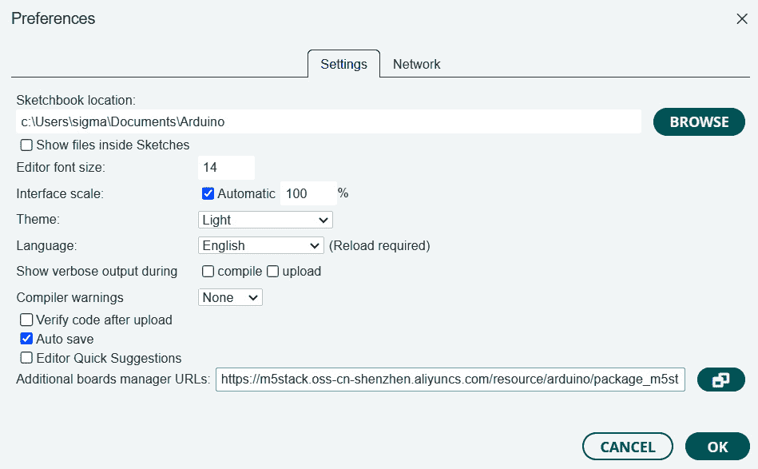

图 13.25 – 将 M5Stack 板添加到 Arduino IDE

1.  我们点击**确定**以关闭对话框。

1.  使用 USB-C 线缆，我们将 Timer Camera X 连接到运行 Arduino IDE 的电脑。我们可以从 A.R.E.S.的表面移除相机，以便更容易访问 USB-C 端口。

1.  要将**M5TimerCAM**设置为设备，我们点击**工具** | **板** | **M5Stack** | **M5TimerCAM**：

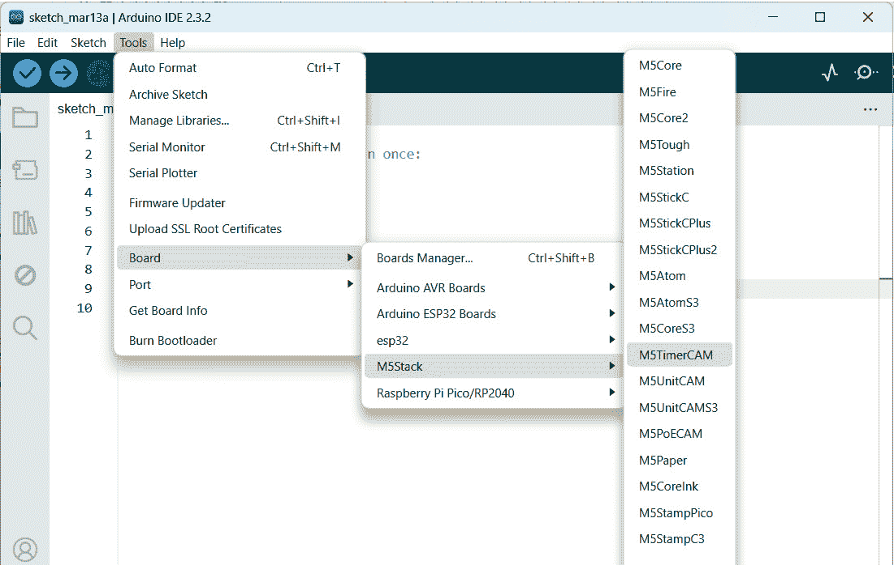

图 13.26 – 选择 M5TimerCAM

1.  接下来，我们需要选择相机连接的端口。为此，我们点击**工具** | **端口**并选择相机连接的端口（如果只将相机连接到我们的电脑，将只有一个选项）。

1.  要访问 M5Stack Timer Camera 示例代码，我们点击**工具** | **管理库…**并搜索**Timer-CAM**。

1.  我们然后将鼠标悬停在章节标题旁边，直到出现三个点，然后选择**示例** | **rtsp_stream**：

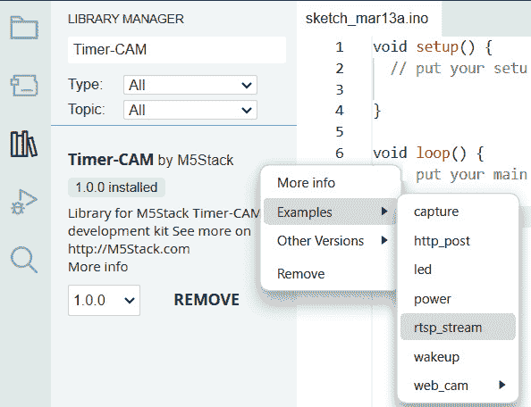

图 13.27 – 选择 rtsp_stream 示例代码

1.  这将打开另一个包含示例代码的 Arduino 窗口。

1.  我们需要串行监视器来找到视频将广播的地址。要加载串行监视器，我们点击**工具** | **串行监视器**：

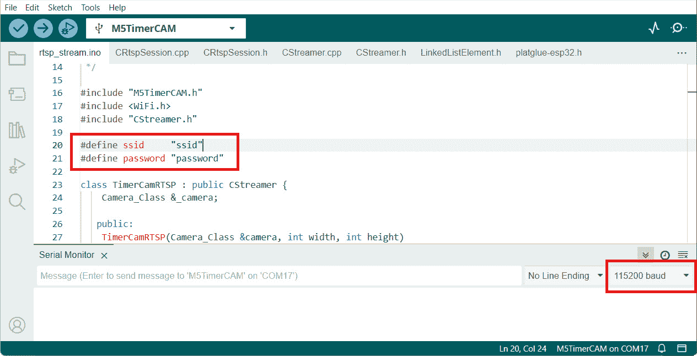

图 13.28 – 查看串行监视器

1.  我们将波特率设置为`115200`并将 SSID 名称和密码输入到代码中（如图中所示的区域）。

1.  要将代码上传到我们的相机，我们点击**上传**按钮，其外观如下：.

1.  编译后，代码将上传到我们的相机。我们可以在串行监视器中查看`rtsp`地址：

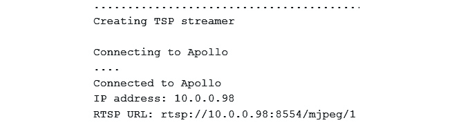

图 13.29 – 输出到串行监视器

1.  我们复制`rtsp` URL 并将其粘贴到 VLC 媒体播放器中，方法是点击 VLC 媒体播放器中的**媒体** | **打开网络流…**：

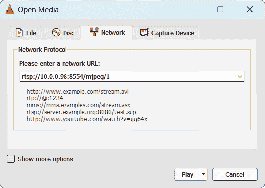

图 13.30 – 使用 VLC 媒体播放器进行视频流

1.  要开始流式传输，我们点击**播放**按钮。

1.  我们应该观察到来自相机的视频流：

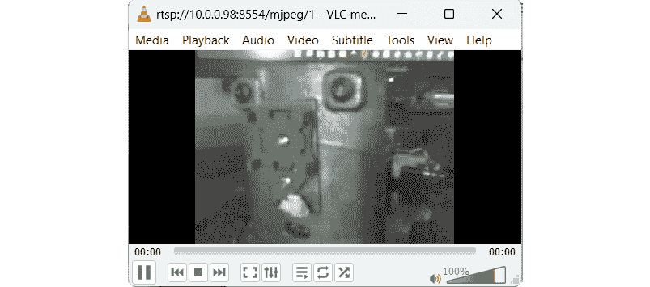

图 13.31 – 在 VLC 媒体播放器中显示的相机视频流

A.R.E.S. 目前缺少鼻子，但在测试了摄像头后，我们可以断开 USB-C 电缆并将其重新连接到 A.R.E.S.的面部。这完成了 A.R.E.S.组件的测试阶段，为我们开发 ROS 节点并允许通过互联网控制 A.R.E.S.铺平了道路。

# 使用 ROS 编程 A.R.E.S.

现在，A.R.E.S. 已经组装完成，并且必要的软件和固件已经安装，我们准备使用 ROS 通过互联网进行远程控制。在我们的设置过程中，我们安装了 ROS 以及所有必要的库。除了我们的设置脚本外，我们还从 GitHub 仓库下载了测试脚本，并运行它们以确保一切正常工作。

在我们的 GitHub 仓库中已经存在一个预存在的 ROS 工作空间。要使用此代码创建一个 ROS 节点，只需将预存在的工作空间转移到我们的 `home` 目录，并执行一个 `colcon build` 命令。

要做到这一点，我们执行以下操作：

1.  使用 Windows 上的 PuTTY 程序或基于 Linux 的系统上的终端，我们使用在运行设置脚本后获得的 IP 地址登录到我们的 Raspberry Pi 3B+。

1.  要将我们的 ROS 工作空间复制到当前目录，我们运行以下命令（我们绝对不能忘记这个点）：

    ```py
    cp -r code/Chapter13/code/ares_ws .
    ```

1.  然后我们使用以下命令进入我们的工作空间：

    ```py
    cd ares_ws
    ```

1.  我们使用以下命令源 ROS 环境：

    ```py
    nano to view our code, we type the following:

    ```

    在 *第十二章* 的 `robot_control.py` 文件中，我们将仅探索代码的某些部分。我们从初始化方法中的代码开始，该方法是用来给我们使用串行 0 端口的权限：

    ```py
            password = 'sudo-password'
            command = 'chmod a+rw /dev/serial0'
            subprocess.run(f'echo {password} | sudo -S {
        command}', shell=True, check=True)
    ```

    ```py

    ```

重要提示

由于安全考虑，强烈建议不要将管理员密码放在文件中。然而，在我们的应用程序在严格控制的开发环境中运行，且访问受到严格限制的情况下，我们绕过了这一指南。我们需要这个密码，以便我们可以更改 `serial0` 端口的权限。没有它，我们将无法访问，因此无法向 Pico H 发送命令。

在我们的代码中，以下操作会发生：

1.  我们将 `sudo` 用户的密码存储在 `password` 变量中。我们将更改 `/dev/serial0` 权限以供所有用户读写操作的命令存储在 `command` 变量中。

1.  我们使用 `sudo` 命令执行操作，无需手动输入密码，通过将密码管道输入到 `sudo -S` 中，利用 `subprocess.run` 并启用 shell 执行，以及通过 `check=True` 强制命令成功。

1.  在初始化方法内部，我们还设置了 `ser` 实例变量等于 `serial0`，这是我们连接 Pico H 的端口：

    ```py
    self.ser = serial.Serial('/dev/serial0', 115200, timeout=1)
    ```

1.  我们的 `send_message()` 方法将命令格式化为位于开括号 `<` 和闭括号 `>` 之间，并通过串行端口发送消息：

    ```py
        def send_message(self, command):
            if command.strip() == 's' and
    self.last_command_sent == 's':
                print("Skip sending 's' command
      to avoid sending it two times in a row")
                return
            framed_command = f"<{command}>\n"
            print(f"Sending framed command:
              {framed_command.strip()}")
            self.ser.write(framed_command.encode
            self.get_logger().info(f"Sent command: {command.strip()}")
            self.last_command_sent = command.strip()
    ```

    在我们的代码中，以下操作会发生：

    1.  我们检查当前命令是否为 `'s'`，以及上一个发送的命令是否也是 `'s'`，以防止连续发送 `'s'`。这是因为在没有与物联网摇杆交互时，停止命令是默认命令，因此可能会使通信通道充满冗余信号，从而可能导致系统中的不必要的处理和响应延迟。

    1.  如果满足前面的条件，我们的代码将跳过发送命令，并记录相关信息。

    1.  我们随后使用开括号（`<`）和闭括号（`>`）格式化 `command`，然后跟一个换行符。

    1.  我们记录正在发送的封装命令。然后，我们的代码使用 `.encode()` 将封装命令转换为字节，并通过串行端口发送。

    1.  我们记录原始命令（去除空白字符）的发送情况。然后，我们的代码将当前命令（去除空白字符）更新到 `self.last_command_sent` 中，以供将来检查。

    要构建我们的代码，我们执行 `colcon` 命令：

    ```py
    colcon build
    ```

1.  在构建我们的节点后，我们使用以下命令对其进行源码设置：

    ```py
    source install/setup.bash
    ```

1.  现在，我们已经准备好运行我们的节点，让我们的机器人通过物联网摇杆进行控制。我们使用以下命令来完成此操作：

    ```py
    ros2 run ares robot_control
    ```

小贴士

在我们发送命令之前，建议将 A.R.E.S. 放在测试台上。随着我们的节点运行，我们可以使用我们在 *第十二章* 中构建的物联网摇杆来控制 A.R.E.S.。

我们刚刚使用 MQTT 和 ROS 通过互联网控制了一个机器人。使用 MQTT 和 ROS 通过互联网控制机器人不仅证明了远程机器人操作的技术可行性，而且突出了远程监控和干预的潜在用途，这些用途在 **灾难恢复**（**DR**）、危险环境探索和医疗保健支持等领域至关重要。

# 摘要

在本章中，我们集成了 MQTT 和 ROS，并创建了 A.R.E.S. 机器人。使用 MQTT，一种轻量级消息协议，使我们能够在机器人和我们的物联网摇杆之间实现高效且可靠的通信。ROS 为我们提供了一个强大的框架，用于开发复杂的机器人应用。通过选择 ROS 构建 A.R.E.S.，我们利用其庞大的工具和库生态系统，确保我们的机器人不仅能够执行高级任务，而且能够适应未来的增强和扩展。

在构建和编程 A.R.E.S. 的过程中，我们很容易想象利用我们的知识来构建更先进的机器人，这些机器人能够执行复杂任务，与人类无缝交互，并能够自主适应各种环境和挑战。

在我们接下来的最后一章中，我们将为 A.R.E.S. 添加视觉识别功能。
