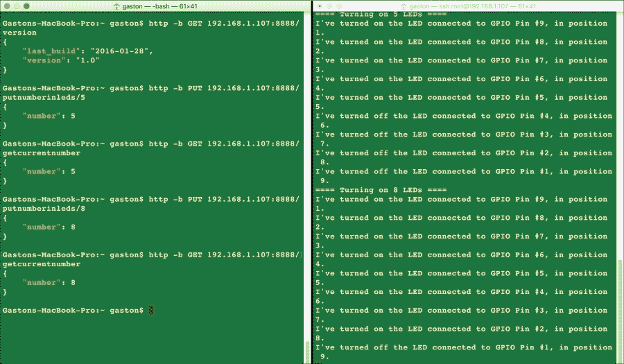
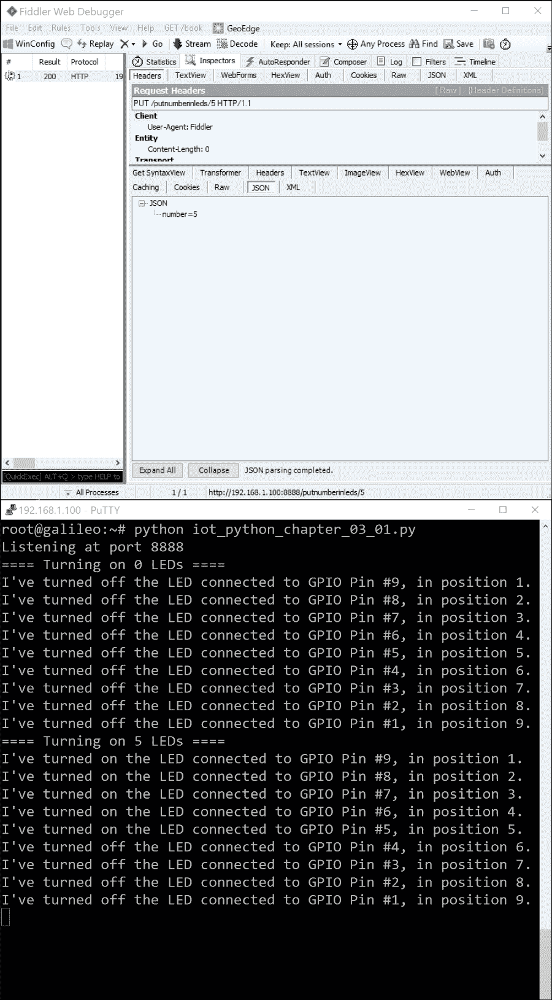
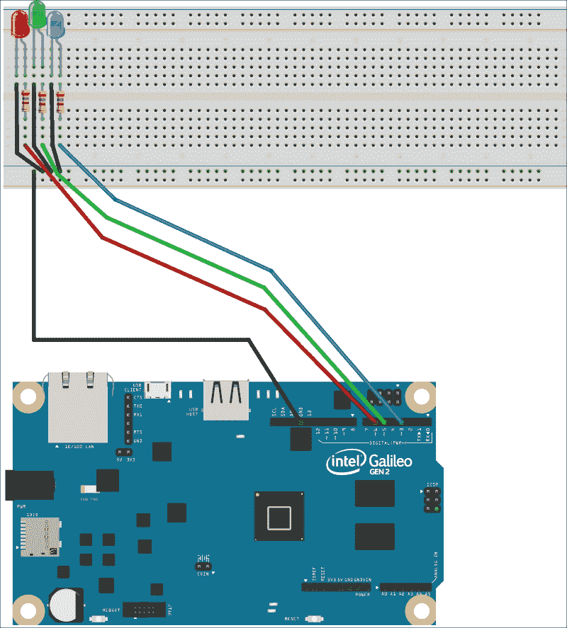
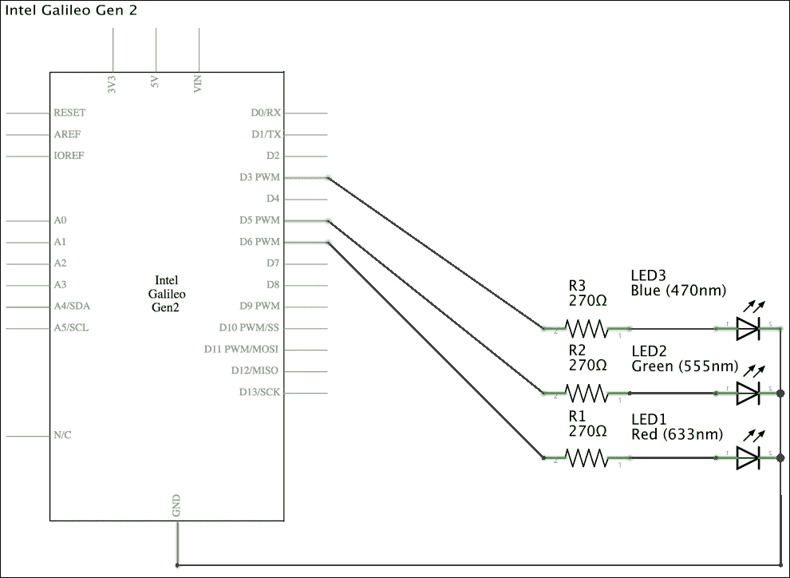
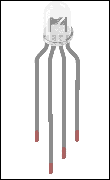
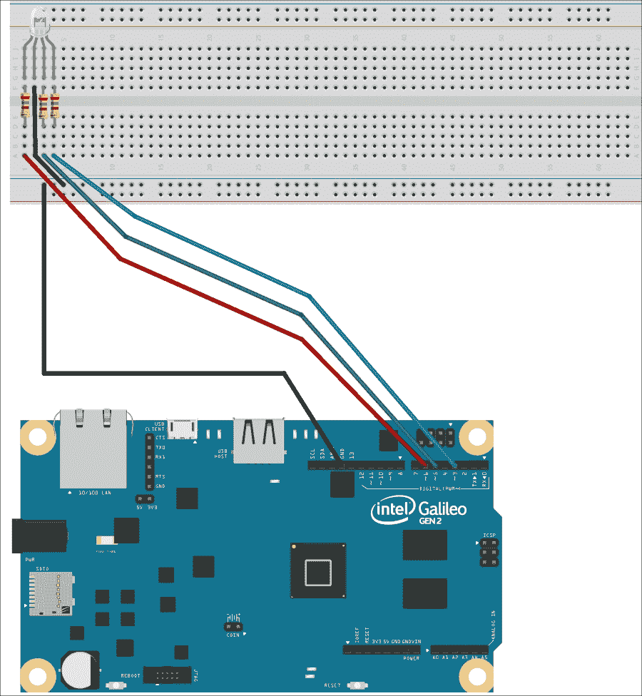
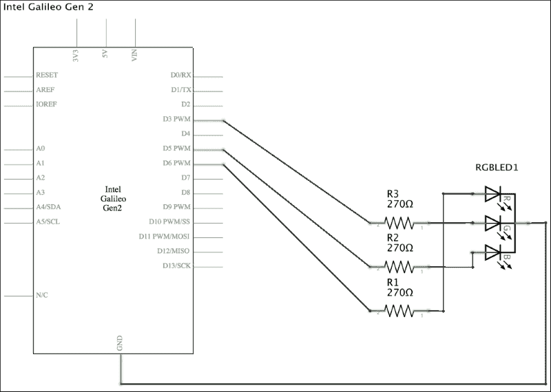

# 第四章. 使用 RESTful API 和脉冲宽度调制

在本章中，我们将通过 HTTP 请求与板子交互，并使用脉冲宽度调制来生成不同的输出电压。我们将：

+   使用 Tornado 网络服务器在 Python 中构建 RESTful API

+   组合并发送 HTTP 请求以在 LED 上打印数字

+   使用脉冲宽度调制控制引脚上的输出电压

+   淡入和淡出连接到板子的 LED

+   使用不同的工具来组合和发送与板子交互的 HTTP 请求

+   使用 RGB LED 构建 RESTful API 来混合红色、绿色和蓝色，并生成数百万种颜色

+   使用`mraa`和`wiring-x86`库来控制脉冲宽度调制

# 使用 RESTful API 在 LED 上打印数字

Tornado 是一个 Python 网络框架和异步网络库。它因其非阻塞网络 I/O 而广为人知，提供了出色的可伸缩性。我们将利用 Tornado 使得构建 RESTful API 变得非常容易，并使任何客户端都能消费这个 API，并在连接到板子的 LED 上打印数字。以下是为 Tornado 网络服务器提供的网页：[`www.tornadoweb.org`](http://www.tornadoweb.org)。

在第一章*理解和设置基础物联网硬件*中，我们安装了`pip`安装程序，以便在板子上运行的 Yocto Linux 中轻松安装额外的 Python 2.7.3 包。现在，我们将使用`pip`安装程序来安装 Tornado 4.3。我们只需在 SSH 终端中运行以下命令即可安装该包。

```py
pip install tornado
```

输出的最后几行将指示`tornado`包已成功安装。不要担心与构建轮和平台不安全警告相关的错误消息。

```py
Collecting tornado
/usr/lib/python2.7/site-packages/pip/_vendor/requests/packages/urllib3/util/ssl_.py:90: InsecurePlatformWarning: A true SSLContext object is not available. This prevents urllib3 from configuring SSL appropriately and may cause certain SSL connections to fail. For more information, see https://urllib3.readthedocs.org/en/latest/security.html#insecureplatformwarning.
  InsecurePlatformWarning
  Downloading tornado-4.3.tar.gz (450kB)
    100% |################################| 454kB 25kB/s 
Collecting backports.ssl-match-hostname (from tornado)
  Downloading backports.ssl_match_hostname-3.5.0.1.tar.gz
Collecting singledispatch (from tornado)
  Downloading singledispatch-3.4.0.3-py2.py3-none-any.whl
Collecting certifi (from tornado)
  Downloading certifi-2015.11.20.1-py2.py3-none-any.whl (368kB)
    100% |################################| 372kB 31kB/s 
Collecting backports-abc>=0.4 (from tornado)
  Downloading backports_abc-0.4-py2.py3-none-any.whl
Collecting six (from singledispatch->tornado)
  Downloading six-1.10.0-py2.py3-none-any.whl
...
Installing collected packages: backports.ssl-match-hostname, six, singledispatch, certifi, backports-abc, tornado
  Running setup.py install for backports.ssl-match-hostname
  Running setup.py install for tornado
Successfully installed backports-abc-0.4 backports.ssl-match-hostname-3.5.0.1 certifi-2015.11.20.1 singledispatch-3.4.0.3 six-1.10.0 tornado-4.3
```

现在，我们将安装 HTTPie，这是一个用 Python 编写的命令行 HTTP 客户端，它使得发送 HTTP 请求变得容易，并使用比 curl（也称为 cURL）更简单的语法。HTTPie 显示彩色输出，这将使我们能够轻松发送 HTTP 请求来测试我们的 RESTful API。我们只需在 SSH 终端中运行以下命令即可安装该包。

```py
pip install --upgrade httpie
```

输出的最后几行将指示`httpie`包已成功安装。不要担心平台不安全警告。

```py
Collecting httpie
/usr/lib/python2.7/site-packages/pip/_vendor/requests/packages/urllib3/util/ssl_.py:90: InsecurePlatformWarning: A true SSLContext object is not available. This prevents urllib3 from configuring SSL appropriately and may cause certain SSL connections to fail. For more information, see https://urllib3.readthedocs.org/en/latest/security.html#insecureplatformwarning.
  InsecurePlatformWarning
  Downloading httpie-0.9.3-py2.py3-none-any.whl (66kB)
    100% |################################| 69kB 117kB/s 
Collecting Pygments>=1.5 (from httpie)
  Downloading Pygments-2.0.2-py2-none-any.whl (672kB)
    100% |################################| 675kB 17kB/s 
Collecting requests>=2.3.0 (from httpie)
  Downloading requests-2.9.1-py2.py3-none-any.whl (501kB)
    100% |################################| 503kB 23kB/s 
Installing collected packages: Pygments, requests, httpie
Successfully installed Pygments-2.0.2 httpie-0.9.3 requests-2.9.1
```

现在，我们可以使用 `http` 命令轻松地向 `localhost` 发送 HTTP 请求并测试使用 Tornado 构建的 RESTful API。显然，在我们测试本地 RESTful API 正常工作后，我们希望从连接到我们局域网的计算机或设备发送 HTTP 请求。你可以在你的计算机上安装 HTTPie 或使用任何其他允许你编写和发送 HTTP 请求的应用程序，例如之前提到的 curl 工具([`curl.haxx.se`](http://curl.haxx.se)) 或在 Windows 系统上使用的 Telerik Fiddler([`www.telerik.com/fiddler`](http://www.telerik.com/fiddler))。Telerik Fiddler 是一个带有图形用户界面的免费网页调试代理，但它只能在 Windows 上运行。你甚至可以使用能够从移动设备编写和发送 HTTP 请求的应用程序，并通过它们测试 RESTful API。

### 提示

如果你正在使用 OS X 或 Linux 系统，你可以打开终端并从命令行开始使用 curl。如果你正在使用 Windows 系统，你可以轻松地从 Cygwin 软件包安装选项中安装 curl，并在 Cygwin 终端中执行它。

为了使用 Tornado 构建 RESTful API，我们首先必须创建 `tornado.web.RequestHandler` 类的子类并重写必要的处理 HTTP 请求到 URL 的方法。例如，如果我们想处理一个同步操作的 HTTP `GET` 请求，我们必须创建 `tornado.web.RequestHandler` 类的新子类并定义带有所需参数的 `get` 方法（如果有）。如果我们想处理 HTTP `PUT` 请求，我们只需定义带有所需参数的 `put` 方法。然后，我们必须在 `tornado.web.Application` 类的实例中映射 URL 模式。

以下几行展示了我们必须添加到现有代码中的新类，无论是使用 `mraa` 还是 `wiring-x86` 库，这些库使得在前一章中在 LED 中打印数字成为可能。我们已经有 `Led` 和 `NumberInLeds` 类，代码添加了以下类：`BoardInteraction`、`VersionHandler`、`PutNumberInLedsHandler`、`GetCurrentNumberHandler`。示例代码文件为 `iot_python_chapter_04_01.py`。

```py
import mraa
from datetime import date
import tornado.escape
import tornado.ioloop
import tornado.web

class BoardInteraction:
    number_in_leds = NumberInLeds()
    current_number = 0

class VersionHandler(tornado.web.RequestHandler):
    def get(self):
        response = {'version': '1.0',
                    'last_build': date.today().isoformat()}
        self.write(response)

class PutNumberInLedsHandler(tornado.web.RequestHandler):
    def put(self, number):
        int_number = int(number)
        BoardInteraction.number_in_leds.print_number(int_number)
        BoardInteraction.current_number = int_number
        response = {'number': int_number}
        self.write(response)

class GetCurrentNumberHandler(tornado.web.RequestHandler):
    def get(self):
        response = {'number': BoardInteraction.current_number}
        self.write(response)
```

`BoardInteraction` 类声明了两个类属性：`number_in_leds` 和 `current_number`。其他类定义了与这些类属性一起工作的方法，以访问保存在 `number_in_leds` 中的公共 `NumberInLeds` 实例，以及保存在 `current_number` 中的当前通过 LED 显示的数字。

代码声明了以下三个 `tornado.web.RequestHandler` 的子类：

+   `VersionHandler`：定义了一个无参数的 `get` 方法，该方法返回包含版本号和最后构建日期的响应。

+   `PutNumberInLedsHandler`: 定义了一个需要数字参数的 `put` 方法，该参数指定了必须通过 LED 打印的数字。该方法调用存储在 `BoardInteraction.number_in_leds` 类属性中的 `NumberInLeds` 实例的 `print_number` 方法，并使用在 `number` 属性中指定的要开启的 LED 数量。然后，代码将正在打印的数字保存到 `BoardInteraction.current_number` 类属性中，并返回一个包含打印数字的响应。

+   `GetCurrentNumberHandler`: 定义了一个参数较少的 `get` 方法，该方法返回一个包含 `BoardInteraction.current_number` 类属性值的响应，即正在通过 LED 打印的数字。

下面的行使用先前声明的 `tornado.web.RequestHandler` 的子类来使用 Tornado 构建网络应用程序，代表 RESTful API 和新的 `__main__` 方法。示例代码文件为 `iot_python_chapter_04_01.py`。

```py
application = tornado.web.Application([
    (r"/putnumberinleds/([0-9])", PutNumberInLedsHandler),
    (r"/getcurrentnumber", GetCurrentNumberHandler),
    (r"/version", VersionHandler)])

if __name__ == "__main__":
       print("Listening at port 8888")
    BoardInteraction.number_in_leds.print_number(0)
    application.listen(8888)
    tornado.ioloop.IOLoop.instance().start()
```

首先，代码创建了一个名为 `application` 的 `tornado.web.Application` 类实例，其中包含组成网络应用程序的请求处理器列表。代码将一个元组列表传递给 `Application` 构造函数。该列表由正则表达式（`regexp`）和 `tornado.web.RequestHandler` 的子类（`request_class`）组成。

`__main__` 方法打印一条消息，指示 HTTP 服务器正在监听的端口号，并使用保存在 `BoardInteraction.number_in_leds` 中的 `NumberInLeds` 实例打印数字 0，即关闭九个 LED。下一行调用 `application.listen` 方法，在指定的端口上为应用程序构建一个具有定义规则的 HTTP 服务器。代码将 `8888` 作为 `port` 参数传递，即 Tornado HTTP 服务器的默认端口号。

然后，调用 `tornado.ioloop.IOLoop.instance().start()` 启动了使用 `application.listen` 创建的服务器。这样，每当网络应用程序收到请求时，Tornado 会遍历组成网络应用程序的请求处理器列表，并为第一个与请求路径匹配的关联正则表达式的 `tornado.web.RequestHandler` 子类创建一个实例。然后，Tornado 根据 HTTP 请求调用以下方法之一，并基于新实例的相应参数：

+   `head`

+   `get`

+   `post`

+   `delete`

+   `patch`

+   `put`

+   `options`

下表显示了与前面代码中定义的正则表达式匹配的一些 HTTP 请求。在这种情况下，HTTP 请求使用 localhost，因为它们是在板上运行的 Yocto Linux 本地执行的。如果我们用板的分配 IP 地址替换 localhost，我们就可以从任何连接到我们的 LAN 的计算机或设备发出 HTTP 请求。

| HTTP 动词和请求 URL | 匹配请求路径的元组（`regexp`，`request_class`） | 被调用的 `RequestHandler` 子类和方法 |
| --- | --- | --- |
| `GET http://localhost:8888/version` | `(r"/version", VersionHandler)])` | `VersionHandler.get()` |
| `PUT http://localhost:8888/putnumberinleds/5` | `(r"/putnumberinleds/([0-9])", PutNumberInLedsHandler)` | `PutNumberInLedsHandler.put(5)` |
| `PUT http://localhost:8888/putnumberinleds/8` | `(r"/putnumberinleds/([0-9])", PutNumberInLedsHandler)` | `PutNumberInLedsHandler.put(8)` |
| `GET http://localhost:8888/getcurrentnumber` | `(r"/getcurrentnumber", GetCurrentNumberHandler)` | `GetCurrentNumberHandler.get()` |

`RequestHandler`类声明了一个`SUPPORTED_METHODS`类属性，以下代码。在这种情况下，我们没有重写类属性，因此，我们继承了超类的声明：

```py
SUPPORTED_METHODS = ("GET", "HEAD", "POST", "DELETE", "PATCH", "PUT", "OPTIONS")
```

在超类中声明的`get`、`head`、`post`、`delete`、`patch`、`put`和`options`方法的默认代码是一行，它会引发`HTTPError`。例如，以下行显示了在`RequestHandler`类中定义的`get`方法的代码。

```py
def get(self, *args, **kwargs):
    raise HTTPError(405)
```

无论何时，Web 应用程序收到请求并与 URL 模式匹配，Tornado 都会执行以下操作：

1.  创建一个映射到 URL 模式的`RequestHandler`子类的实例。

1.  使用应用程序配置中指定的关键字参数调用`initialize`方法。我们可以重写`initialize`方法，将参数保存到成员变量中。

1.  无论哪个 HTTP 请求，调用`prepare`方法。如果我们调用`finish`或`send_error`，Tornado 不会调用任何其他方法。我们可以重写`prepare`方法来执行任何 HTTP 请求所需的代码，然后在`get`、`head`、`post`、`delete`、`patch`、`put`或`options`方法中编写特定的代码。

1.  根据基于 URL 正则表达式捕获的不同组调用方法。如前所述，我们必须重写我们希望我们的`RequestHandler`子类能够处理的方法。例如，如果有 HTTP `GET`请求，Tornado 将调用`get`方法并传递不同的参数。

1.  在这种情况下，我们正在使用同步处理器，因此，Tornado 在根据 HTTP 请求返回之前的方法调用后调用`on_finish`。我们可以重写`on_finish`方法来执行清理或记录。非常重要的一点是，Tornado 在向客户端发送响应后调用`on_finish`。

以下行将在板上的 Yocto Linux 上启动 HTTP 服务器和我们的 RESTful API。不要忘记，你需要使用 SFTP 客户端将 Python 源代码文件传输到 Yocto Linux，正如前一章所述。

```py
python iot_python_chapter_04_01.py
```

在我们启动 HTTP 服务器后，我们将看到以下输出，并且板上的所有 LED 都将关闭。

```py
Listening at port 8888
==== Turning on 0 LEDs ====
I've turned off the LED connected to GPIO Pin #9, in position 1.
I've turned off the LED connected to GPIO Pin #8, in position 2.
I've turned off the LED connected to GPIO Pin #7, in position 3.
I've turned off the LED connected to GPIO Pin #6, in position 4.
I've turned off the LED connected to GPIO Pin #5, in position 5.
I've turned off the LED connected to GPIO Pin #4, in position 6.
I've turned off the LED connected to GPIO Pin #3, in position 7.
I've turned off the LED connected to GPIO Pin #2, in position 8.
I've turned off the LED connected to GPIO Pin #1, in position 9.
```

# 组成和发送 HTTP 请求

HTTP 服务器正在 Yocto Linux 上运行，等待我们的 HTTP 请求来控制连接到 Intel Galileo Gen 2 板上的 LED。现在，我们将在 Yocto Linux 本地编写和发送 HTTP 请求，然后从其他计算机或设备发送，这些设备连接到我们的局域网。

HTTPie 支持类似 curl 的本地主机缩写。例如，`:8888` 是一个展开为 `http://localhost:8888` 的缩写。我们已经在另一个 SSH 终端中运行了 HTTP 服务器，因此，我们可以在另一个 SSH 终端中运行以下命令。

```py
http GET :8888/version
```

之前的命令将组成并发送以下 HTTP 请求：`GET http://localhost:8888/version`。该请求是我们 RESTful API 中的最简单情况，因为它将匹配并运行只接收 `self` 作为参数的 `VersionHandler.get` 方法，因为 URL 模式不包含任何参数。该方法创建一个响应字典，然后调用 `self.write` 方法并将 `response` 作为参数。`self.write` 方法将接收到的数据块写入输出缓冲区。因为数据块（`response`）是一个字典，`self.write` 将其作为 JSON 写入，并将响应的 `Content-Type` 设置为 `application/json`。以下行显示了 HTTP 请求的示例响应，包括响应头：

```py
HTTP/1.1 200 OK
Content-Length: 46
Content-Type: application/json; charset=UTF-8
Date: Thu, 28 Jan 2016 03:15:21 GMT
Etag: "fb066668a345b0637fdc112ac0ddc37c318d8709"
Server: TornadoServer/4.3

{
    "last_build": "2016-01-28", 
    "version": "1.0"
}
```

如果我们不想在响应中包含头信息，我们可以使用 `-b` 选项执行 HTTPie。例如，以下行执行相同的 HTTP 请求，但不在响应输出中显示头信息。

```py
http –b GET :8888/version
```

一旦我们知道我们的请求正在正常运行，我们可以打开一个新的终端、命令行或我们想要使用的 GUI 工具，从计算机或任何连接到局域网的设备上编写和发送 HTTP 请求。我们只需要在我们的请求 URL 中使用分配给板的 IP 地址而不是 `localhost`。不要忘记在下一个请求中将 `192.168.1.107` 替换为您的板 IP 地址。

现在，我们可以在计算机或设备上运行以下 HTTPie 命令来使用 RESTful API 使板上的五个 LED 点亮。在您输入命令后，您会注意到显示 Python 代码输出的 SSH 终端将显示一条消息，表明它正在点亮 5 个 LED 以及指示正在点亮和关闭的 LED 的附加消息。此外，您将看到 5 个 LED 点亮。

```py
http -b PUT 192.168.1.107:8888/putnumberinleds/5
```

之前的命令将组成并发送以下 HTTP 请求：`PUT http://192.168.1.107:8888/putnumberinleds/5`。该请求将匹配并运行接收 `5` 作为其 `number` 参数的 `PutNumberInLedsHandler.put` 方法。以下行显示了 HTTP 服务器的响应，其中包含了打印在 LED 上的数字，即已点亮的 LED 数量：

```py
{
    "number": 5
}
```

以下图像显示了 OS X 上并排的两个终端窗口。左侧的终端窗口在一台生成 HTTP 请求的计算机上运行，右侧的终端窗口是运行在 Yocto Linux 上的 Tornado HTTP 服务器 SSH 终端，它显示了我们 Python 代码的输出。在组合和发送 HTTP 请求时检查输出，使用类似的配置是一个好主意。



在 Fiddler 中，点击 **Composer** 或按 *F9*，在 **Parsed** 选项卡的下拉菜单中选择 **PUT**，然后在下拉菜单右侧的文本框中输入 `192.168.1.107:8888/putnumberinleds/5`（不要忘记将 IP 替换为您的板子 IP）。然后，点击 **Execute** 并双击捕获日志中出现的 200 结果。如果您想查看原始响应，只需点击 **Request Headers** 面板下方的 **Raw** 按钮即可。

以下图像显示了 Windows 上 Fiddler 窗口和 Putty 终端窗口并排。左侧的 Fiddler 窗口在一台生成 HTTP 请求的计算机上运行，右侧的 Putty 终端窗口是运行在 Yocto Linux 上的 SSH 终端，它显示了我们 Python 代码的输出。



我们可以在计算机或设备上运行以下 HTTPie 命令来使用 RESTful API 告诉我们已点亮多少个 LED。

```py
http -b GET 192.168.1.107:8888/getcurrentnumber
```

上一条命令将组合并发送以下 HTTP 请求：`GET http://192.168.1.107:8888/getcurrentnumber`。该请求将匹配并运行 `GetCurrentNumber.get` 方法。以下几行显示了来自 HTTP 服务器的响应，其中包含了打印在 LED 上的数字，即最后一次 API 调用中已点亮的 LED 数量：

```py
{
    "number": 5
}
```

如果我们再次查看构成 Web 应用的请求处理器列表，我们会注意到 `putnumberinleds` 的条目指定了一个正则表达式，该正则表达式接受从 0 到 9 的数字作为其参数：

```py
(r"/putnumberinleds/([0-9])", PutNumberInLedsHandler)
```

如果我们在计算机或设备上运行以下 HTTPie 命令来使用 RESTful API 使板子点亮十二个 LED，请求将不会匹配请求处理器列表中的任何正则表达式。

```py
http -b PUT 192.168.1.107:8888/putnumberinleds/12
```

因此，Tornado 将返回一个 `404: Not found` 错误作为结果。

```py
<html><title>404: Not Found</title><body>404: Not Found</body></html>
```

如果我们在计算机或设备上运行以下 HTTPie 命令，也会发生相同的情况，因为 `x` 不是 0 到 9 之间的数字。

```py
http -b PUT 192.168.1.107:8888/putnumberinleds/x
```

以下 HTTPie 命令将点亮 8 个 LED。

```py
http -b PUT 192.168.1.107:8888/putnumberinleds/8
```

上一条命令将组合并发送以下 HTTP 请求：`PUT http://192.168.1.107:8888/putnumberinleds/8`。该请求将匹配并运行接收 `8` 作为其 `number` 参数的 `PutNumberInLedsHandler.put` 方法。以下几行显示了来自 HTTP 服务器的响应，其中包含了打印在 LED 上的数字，即已点亮的 LED 数量：

```py
{
    "number": 8
}
```

打开的 LED 数量从 5 变为 8，因此，我们可以在计算机或设备上运行以下 HTTPie 命令，使用 RESTful API 告诉我们打开了多少个 LED。

```py
http -b GET 192.168.1.107:8888/getcurrentnumber
```

以下行显示了 HTTP 服务器响应，其中包含已打印在 LED 上的数字：

```py
{
    "number": 8
}
```

我们创建了一个非常简单的 RESTful API，允许我们打开 LED 并检查当前打印在 LED 上的数字。当然，我们应该向 RESTful API 添加身份验证和整体安全性，以使其完整。我们的 RESTful API 使我们能够使用任何可以编写和发送 HTTP 请求的应用程序、移动应用程序或 Web 应用程序在 LED 上打印数字。

# 带 PWM 功能的引脚布线

我们想要控制输出电压，以便能够淡入淡出三种不同颜色的三个 LED：红色、绿色和蓝色。输出电压越低，LED 的亮度级别越低。输出电压越高，LED 的亮度级别越高。因此，当输出电压接近 0V 时，LED 的亮度较低，而当输出电压接近 IOREF 电压，即在我们的实际配置中为 5V 时，LED 的亮度较高。具体来说，我们希望能够为每个 LED 设置 256 个亮度级别，从 0 到 255。在这种情况下，我们将使用三个 LED，但稍后在本章中我们将转向一个能够在一个电子组件中混合三种颜色的单色 RGB LED。

当我们使用配置为数字输出的 GPIO 引脚工作时，我们可以设置 0V（低值）或 IOREF 电压，即在我们的实际配置中为 5V（高值）。因此，我们可以通过其最大亮度级别关闭或打开 LED（而不烧毁它）。

如果我们将红色、绿色和蓝色 LED 连接到三个 GPIO 引脚，并将它们配置为数字输出，我们将无法设置 256 个亮度级别。我们必须将三个 LED 连接到三个我们可以用作**PWM**（脉冲宽度调制）输出引脚的数字 I/O 引脚。在第一章中，*理解和设置基础物联网硬件*，当我们学习了英特尔 Galileo Gen 2 板上的 I/O 引脚时，我们了解到带有波浪线符号(~)作为数字前缀的引脚可以用作 PWM 输出引脚。因此，我们可以使用以下引脚连接三个 LED：

+   将**~6**引脚连接到红色 LED

+   将**~5**引脚连接到绿色 LED

+   将**~3**引脚连接到蓝色 LED

在完成必要的布线后，我们将编写 Python 代码来创建另一个 RESTful API，允许我们设置三个 LED 中的每个 LED 的亮度。我们需要以下部分来使用此示例：

+   一个红色超亮 5mm LED

+   一个绿色超亮 5mm LED

+   一个蓝色超亮 5mm LED

+   三个 5%容差的 270Ω电阻（红紫棕金）

下图显示了连接到面包板的组件、必要的布线和从英特尔 Galileo Gen 2 板到面包板的布线。示例的 Fritzing 文件为`iot_fritzing_chapter_04_02.fzz`，以下图像是面包板视图：



在这种情况下，我们希望三个 LED 彼此靠近。这样，三个 LED 可以将光线投射到黑色表面上，我们可以看到三种颜色的交汇处产生的颜色将类似于我们在稍后将要使用的颜色选择器中选择的颜色。

以下图像显示了用符号表示的电子组件的原理图。



如前图所示，板上的符号中标记为**D3 PWM**、**D5 PWM**和**D6 PWM**的三个具有 PWM 功能的 GPIO 引脚连接到一个**270Ω**电阻，该电阻连接到 LED 的正极，每个 LED 的负极连接到地。

现在，是时候将组件插入面包板并完成所有必要的布线了。不要忘记关闭 Yocto Linux，等待所有板载 LED 熄灭，并在从板上的引脚添加或移除任何电线之前，从英特尔 Galileo Gen 2 板上拔掉电源。

# 使用 PWM 生成模拟值

脉宽调制，简称 PWM，是一种通过使用数字开/关模式，通过数字方式生成模拟结果的技术。提供 PWM 功能的引脚使用数字控制来创建方波，并且可以通过控制信号在开启状态（**IOREF**电压）和关闭状态（0V）中停留的时间来模拟配置的**IOREF**电压（默认板配置为 5V）和 0V 之间的电压。脉冲宽度是信号在开启状态（**IOREF**电压）中的持续时间，因此，脉宽调制意味着通过改变脉冲宽度来获取感知到的模拟值。

当你每秒重复数百次开启状态和关闭状态的信号，并且将 LED 连接到 PWM 引脚时，我们可以生成与信号在 0V 和**IOREF**电压之间保持恒定电压相同的信号，以控制 LED 的亮度级别。

我们可以将从 0 到 1 的浮点值写入配置为模拟输出的 PWM 启用引脚，即从 0%占空比（始终处于关闭状态）到 100%占空比（始终处于开启状态）。我们想要表示 256 个亮度值（从 0 到 255），因此，以下图表显示了横坐标轴（*x*-轴）上的亮度值和相应的浮点值，这些值必须写入纵坐标轴（*y*-轴）上的引脚。


之前图表的方程式如下：`y = x / 255`，具体来说，`值 = 亮度 / 255`。我们可以在我们的 Python 解释器中运行以下代码来查看所有从 0 到 255（包括）的亮度级别将写入的所有值。

```py
for brightness in range(0, 256):
    print(brightness / 255.0)
```

我们可以将浮点值乘以 5 来计算每个亮度级别的电压值。由于我们使用的是板子的默认设置，**IOREF** 跳线设置为 5V，因此输出中的 1.0 值表示 5V（`1.0 x 5 = 5`）。输出中的 0.5 值表示 2.5V（`0.5 x 5 = 2.5`）。以下图表显示了横坐标轴（x 轴）上的亮度值和对应于纵坐标轴（y 轴）上生成相应亮度值的输出电压值。


之前图表的方程式如下：`y = x / 255 * 5`，具体来说，`电压 = 亮度 / 255 * 5`。我们可以在我们的 Python 解释器中运行以下代码来查看所有从 0 到 255（包括）的亮度级别将生成的所有电压输出。

```py
for brightness in range(0, 256):
    print(brightness / 255.0 * 5)
```

我们将创建一个新的 `AnalogLed` 类来表示连接到我们的板子上的 LED，该 LED 可以具有从 0 到 255（包括）的亮度级别。以下行显示了新 `AnalogLed` 类的代码。示例的代码文件为 `iot_python_chapter_04_02.py`。

```py
import mraa
from datetime import date
import tornado.escape
import tornado.ioloop
import tornado.web

class AnalogLed:
    def __init__(self, pin, name):
        self.pin = pin
        self.name = name
        self.pwm = mraa.Pwm(pin)
        self.pwm.period_us(700)
        self.pwm.enable(True)
        self.brightness_value = 0
        self.set_bightness(0)

    def set_brightness(self, value):
        brightness_value = value
        if brightness_value > 255:
            brightness_value = 255
        elif brightness_value < 0:
            brightness_value = 0
        led_value = brightness_value / 255.0
        self.pwm.write(led_value)
        self.brightness_value = brightness_value
        print("{0} LED connected to PWM Pin #{1} set to brightness {2}.".format(self.name, self.pin, brightness_value))
```

当我们在 `pin` 必需参数中创建 `AnalogLed` 类的实例时，我们必须指定连接 LED 的引脚号，并在 `name` 必需参数中指定 LED 的名称。构造函数，即 `__init__` 方法，创建一个新的 `mraa.Pwm` 实例，其 `pin` 参数为接收到的 `pin`，将其引用保存到 `pwm` 属性中，并调用其 `period_us` 方法以将 PWM 周期配置为 700 微秒（700 µs）。因此，输出占空比将确定信号处于 ON 状态的 700 微秒周期中的百分比。例如，0.5（50%）的输出占空比意味着信号将在 700 微秒周期中的 350 微秒内处于 ON 状态（700 * 0.5 = 350）。

然后，代码使用 `True` 作为参数调用 `pwm.enable` 方法，以设置 PWM 引脚的启用状态，并允许我们通过调用 `pwm.write` 方法开始设置 PWM 引脚的输出占空比百分比。

下一行创建了一个 `brightness_value` 属性，其初始值为 0，这将使我们能够轻松检索设置到连接到引脚的 LED 的最后一个亮度值。最后，构造函数使用 0 作为 `value` 参数的值调用 `set_brightness` 方法，以将配置引脚连接的 LED 的亮度级别设置为 0。

该类定义了一个`set_brightness`方法，该方法接收一个亮度级别值作为`value`参数。代码的前几行确保我们始终设置一个介于 0 到 255（包括）之间的亮度级别。如果`value`参数的值不包含在该范围内，代码将较低级别（0）或较高级别（255）的值分配给`brightness_value`变量。

然后，代码计算 PWM 引脚所需的输出占空比百分比，以表示亮度级别作为一个介于`1.0f`（100%）和`0.0f`（0%）之间的浮点值。代码将此值保存在`led_value`变量中，然后使用此变量作为百分比参数调用`self.pwm.write`方法，以设置配置为 PWM 输出的引脚的输出占空比为`led_value`。下一行将有效的亮度级别保存到`brightness_value`属性中。

最后，代码打印有关 LED 名称、引脚编号和已设置的亮度级别的详细信息。这样，该方法将亮度级别从 0 到 255（包括）转换为适当的输出占空比值，并将输出写入以控制连接的 LED 的亮度级别。

现在，我们可以编写使用新的`AnalogLed`类创建每个 LED 的一个实例的代码，并轻松控制它们的亮度级别。以下行显示了`BoardInteraction`类的代码。示例的代码文件是`iot_python_chapter_04_02.py`。

```py
class BoardInteraction:
    # The Red LED is connected to pin ~6
    red_led = AnalogLed(6, 'Red')
    # The Green LED is connected to Pin ~5
    green_led = AnalogLed(5, 'Green')
    # The Blue LED is connected to Pin ~3
    blue_led = AnalogLed(3, 'Blue')
```

`BoardInteraction`类仅声明了三个类属性：`red_led`、`green_led`和`blue_led`。这三个类属性保存了之前创建的`AnalogLed`类的新实例，并代表连接到引脚**~6**、**~5**和**~3**的红、绿和蓝 LED。现在，我们将创建其他类，这些类定义了与这些类属性一起工作的方法，以访问常见的`AnalogLed`实例。

下一行显示了添加以下类的代码：`VersionHandler`、`PutRedBrightnessHandler`、`PutGreenBrightnessHandler`和`PutBlueBrightnessHandler`。示例的代码文件是`iot_python_chapter_04_02.py`。

```py
class VersionHandler(tornado.web.RequestHandler):
    def get(self):
        response = {'version': '1.0',
                    'last_build': date.today().isoformat()}
        self.write(response)

class PutRedBrightnessHandler(tornado.web.RequestHandler):
    def put(self, value):
        int_value = int(value)
        BoardInteraction.red_led.set_brightness(int_value)
        response = {'red': BoardInteraction.red_led.brightness_value}
        self.write(response)

class PutGreenBrightnessHandler(tornado.web.RequestHandler):
    def put(self, value):
        int_value = int(value)
        BoardInteraction.green_led.set_brightness(int_value)
        response = {'green': BoardInteraction.green_led.brightness_value}
        self.write(response)

class PutBlueBrightnessHandler(tornado.web.RequestHandler):
    def put(self, value):
        int_value = int(value)
        BoardInteraction.blue_led.set_brightness(int_value)
        response = {'blue': BoardInteraction.blue_led.brightness_value}
        self.write(response)
```

代码声明了以下四个`tornado.web.RequestHandler`的子类：

+   `VersionHandler`：定义了一个无参数的`get`方法，该方法返回包含版本号和最后构建日期的响应。

+   `PutRedBrightnessHandler`：定义了一个`put`方法，该方法需要一个`value`参数，该参数指定了红色 LED 所需的亮度级别。该方法调用存储在`BoardInteraction.red_led`类属性中的`AnalogNumber`实例的`set_brightness`方法，并使用`value`参数中指定的所需亮度级别。然后，代码返回一个响应，其中包含已转换为 PWM 引脚输出占空比百分比的亮度级别，该 PWM 引脚连接到红色 LED。

+   `PutGreenBrightnessHandler`: 定义了 `put` 方法来设置绿色 LED 所需的亮度级别。它的工作方式与之前描述的 `PutRedBrightnessHandler` 方法相同，但代码使用 `BoardInteraction.green_led` 类属性来控制绿色 LED 的亮度级别，而不是使用 `BoardInteraction.red_led` 类属性。

+   `PutBlueBrightnessHandler`: 定义了 `put` 方法来设置蓝色 LED 所需的亮度级别。它的工作方式与之前描述的 `PutRedBrightnessHandler` 方法相同，但代码使用 `BoardInteraction.blue_led` 类属性来控制蓝色 LED 的亮度级别，而不是使用 `BoardInteraction.red_led` 类属性。

下面的几行展示了添加以下类的代码：`GetRedBrightnessHandler`、`GetGreenBrightnessHandler` 和 `GetBlueBrightnessHandler`。示例的代码文件是 `iot_python_chapter_04_02.py`。

```py
class GetRedBrightnessHandler(tornado.web.RequestHandler):
    def get(self):
        response = {'red': BoardInteraction.red_led.brightness_value}
        self.write(response)

class GetGreenBrightnessHandler(tornado.web.RequestHandler):
    def get(self):
        response = {'green': BoardInteraction.green_led.brightness_value}
        self.write(response)

class GetBlueBrightnessHandler(tornado.web.RequestHandler):
    def get(self):
        response = {'blue': BoardInteraction.blue_led.brightness_value}
        self.write(response)
```

代码声明了以下三个 `tornado.web.RequestHandler` 的子类：

+   `GetRedBrightnessHandler`: 定义了一个无参数的 `get` 方法，该方法返回一个包含 `BoardInteraction.red_led.brightness_value` 属性值的响应，即设置到红色 LED 的亮度值

+   `GetGREENBrightnessHandler`: 定义了一个无参数的 `get` 方法，该方法返回一个包含 `BoardInteraction.green_led.brightness_value` 属性值的响应，即设置到绿色 LED 的亮度值

+   `GetBlueBrightnessHandler`: 定义了一个无参数的 `get` 方法，该方法返回一个包含 `BoardInteraction.blue_led.brightness_value` 属性值的响应，即设置到蓝色 LED 的亮度值

下面的几行使用之前声明的 `tornado.web.RequestHandler` 子类，用 Tornado 构建了一个 Web 应用程序，它代表一个新的 RESTful API 和新的 `__main__` 方法。示例的代码文件是 `iot_python_chapter_04_02.py`。

```py
application = tornado.web.Application([
    (r"/putredbrightness/([0-9]+)", PutRedBrightnessHandler),
    (r"/putgreenbrightness/([0-9]+)", PutGreenBrightnessHandler),
    (r"/putbluebrightness/([0-9]+)", PutBlueBrightnessHandler),
    (r"/getredbrightness", GetRedBrightnessHandler),
    (r"/getgreenbrightness", GetGreenBrightnessHandler),
    (r"/getbluebrightness", GetBlueBrightnessHandler),
    (r"/version", VersionHandler)])

if __name__ == "__main__":
    print("Listening at port 8888")
    application.listen(8888)
    tornado.ioloop.IOLoop.instance().start()
```

如前例所示，代码创建了一个名为 `application` 的 `tornado.web.Application` 类实例，其中包含构成 Web 应用的请求处理器列表，即正则表达式和 `tornado.web.RequestHandler` 子类的元组。

下表显示了与前面代码中定义的正则表达式匹配的一些 HTTP 请求。在这种情况下，HTTP 请求使用 `192.168.1.107`，因为它们是从连接到我们局域网的计算机执行的。不要忘记在下一个请求中将 `192.168.1.107` 替换为您的板子的 IP 地址。

| HTTP 方法及请求 URL | 匹配请求路径的元组 (`regexp`, `request_class`) | 被调用的 `RequestHandler` 子类和方法 |
| --- | --- | --- |
| `PUT http:// 192.168.1.107:8888/putredbrightness/30` | `(r"/putredbrightness/([0-9]+)", PutRedBrightnessHandler)` | `PutRedBrightnessHandler.put(30)` |
| `PUT http:// 192.168.1.107:8888/putgreenbrightness/128` | `(r"/putgreenbrightness/([0-9]+)", PutGreenBrightnessHandler)` | `PutGreenBrightnessHandler.put(128)` |
| `PUT http:// 192.168.1.107:8888/putbluebrightness/255` | `(r"/putbluebrightness/([0-9]+)", PutBlueBrightnessHandler)` | `PutGreenBrightnessHandler.put(255)` |
| `GET http:// 192.168.1.107:8888/getredbrightness` | `(r"/getredbrightness", GetRedBrightnessHandler)` | `GetRedBrightnessHandler.get()` |
| `GET http:// 192.168.1.107:8888/getgreenbrightness` | `(r"/getgreenbrightness", GetGreenBrightnessHandler)` | `GetGreenBrightnessHandler.get()` |
| `GET http:// 192.168.1.107:8888/getbluebrightness` | `(r"/getbluebrightness", GetBlueBrightnessHandler)` | `GetBlueBrightnessHandler.get()` |

以下行将启动 HTTP 服务器和我们的 RESTful API，允许我们在板上的 Yocto Linux 中控制红色、绿色和蓝色 LED 的亮度级别。不要忘记，你需要使用 SFTP 客户端将 Python 源代码文件传输到 Yocto Linux，正如前一章所述。

```py
python iot_python_chapter_04_02.py
```

启动 HTTP 服务器后，我们将看到以下输出，并且所有红色、绿色和蓝色 LED 都将被关闭。

```py
Red LED connected to PWM Pin #6 set to brightness 0.
Green LED connected to PWM Pin #5 set to brightness 0.
Blue LED connected to PWM Pin #3 set to brightness 0.
Listening at port 8888
```

# 通过 HTTP 请求生成模拟值

HTTP 服务器正在 Yocto Linux 中运行，等待我们的 HTTP 请求来控制连接到 Intel Galileo Gen 2 板的 LED。现在，我们将从连接到我们的局域网的另一台计算机或设备上编写和发送 HTTP 请求，并将控制红色、绿色和蓝色 LED 的亮度级别。

打开一个新的终端、命令行或我们想要用来从计算机或任何连接到局域网的设备上编写和发送 HTTP 请求的 GUI 工具。不要忘记在接下来的请求中将 `192.168.1.107` 替换为你的板子的 IP 地址。

在计算机或设备上运行以下 HTTPie 命令来使用 RESTful API 将板子的红色 LED 亮度设置为 30。输入命令后，你会注意到显示 Python 代码输出的 SSH 终端将显示以下消息：**连接到 PWM 引脚 #6 的红色 LED 设置为亮度 30**。此外，你将看到红色 LED 以非常低的亮度打开。

```py
http -b PUT 192.168.1.107:8888/putredbrightness/30
```

之前的命令将编写并发送以下 HTTP 请求：`PUT http://192.168.1.107:8888/putredbrightness/30`。请求将匹配并运行接收 `30` 作为其 `value` 参数的 `PutRedBrightnessHandler.put` 方法。以下行显示了 HTTP 服务器对通过 PWM 设置的红色 LED 亮度级别的响应：

```py
{
    "red": 30
}
```

我们可以在计算机或设备上运行以下 HTTPie 命令来使用 RESTful API 获取红色 LED 的当前亮度级别。

```py
http -b GET 192.168.1.107:8888/getredbrightness
```

之前的命令将组合并发送以下 HTTP 请求：`GET http://192.168.1.107:8888/getredbrightness`。该请求将匹配并运行 `GetRedBrightnessHandler.get` 方法。以下几行显示了 HTTP 服务器对之前通过 API 调用设置的红色 LED 亮度级别的响应：

```py
{
    "red": 30
}
```

现在，在计算机或设备上运行以下 HTTPie 命令以使用 RESTful API 将绿色 LED 的亮度设置为 128。在您输入命令后，您将注意到显示 Python 代码输出的 SSH 终端将显示以下消息：**连接到 PWM 引脚 #5 的绿色 LED 设置为亮度 128**。此外，您将看到绿色 LED 以非常低的亮度级别打开。

```py
http -b PUT 192.168.1.107:8888/putredbrightness/128
```

之前的命令将组合并发送以下 HTTP 请求：`PUT http://192.168.1.107:8888/putgreenbrightness/128`。该请求将匹配并运行接收其 `value` 参数中的 `128` 的 `PutGreenBrightnessHandler.put` 方法。以下几行显示了 HTTP 服务器对已设置的绿色 LED 亮度级别的响应：

```py
{
    "green": 128
}
```

最后，我们在计算机或设备上运行以下 HTTPie 命令以使用 RESTful API 将板上的蓝色 LED 亮度设置为 `255`，即其最高亮度级别。在您输入命令后，您将注意到显示 Python 代码输出的 SSH 终端将显示以下消息：**连接到 PWM 引脚 #3 的蓝色 LED 设置为亮度 255**。此外，您将看到蓝色 LED 以其最高亮度级别打开。

```py
http -b PUT 192.168.1.107:8888/putbluebrightness/255
```

之前的命令将组合并发送以下 HTTP 请求：`PUT http://192.168.1.107:8888/putbluebrightness/255`。该请求将匹配并运行接收其 `value` 参数中的 255 的 `PutBlueBrightnessHandler.put` 方法。以下几行显示了 HTTP 服务器对已设置的蓝色 LED 亮度级别的响应：

```py
{
    "blue": 255
}
```

现在，我们可以运行以下两个 HTTPie 命令来使用 RESTful API 告诉我们绿色和蓝色 LED 的当前亮度级别。

```py
http -b GET 192.168.1.107:8888/getgreenbrightness
http -b GET 192.168.1.107:8888/getbluebrightness
```

以下几行显示了 HTTP 服务器对已设置的绿色和蓝色 LED 亮度级别的两个响应：

```py
{
    "green": 128
}

{
    "blue": 255
}
```

我们创建了一个非常简单的 RESTful API，允许我们设置红色、绿色和蓝色 LED 的所需亮度，并检查它们的当前亮度级别。我们的 RESTful API 使得我们能够通过三种颜色及其不同亮度级别的交集，在任何可以组合和发送 HTTP 请求的应用程序、移动应用程序或 Web 应用程序中生成不同的颜色。

# 准备 RESTful API 以满足 Web 应用程序需求

我们希望开发一个简单的 Web 应用程序，显示一个颜色选择器，允许用户选择颜色。一旦用户选择了一种颜色，我们就可以从 0 到 255 获取红色、绿色和蓝色的分量。我们希望根据所选颜色的红色、绿色和蓝色值设置板上红色、绿色和蓝色 LED 的亮度级别。根据这一要求，添加一个新的`PUT`方法到我们的 RESTful API 中，以便我们可以在单个 API 调用中更改三个 LED 的亮度级别是方便的。

下面的行显示了添加新`PutRGBBrightnessHandler`类的代码。示例的代码文件是`iot_python_chapter_04_03.py`。

```py
class PutRGBBrightnessHandler(tornado.web.RequestHandler):
    def put(self, red, green, blue):
        int_red = int(red)
        int_green = int(green)
        int_blue = int(blue)
        BoardInteraction.red_led.set_brightness(int_red)
        BoardInteraction.green_led.set_brightness(int_green)
        BoardInteraction.blue_led.set_brightness(int_blue)
        response = dict(
            red=BoardInteraction.red_led.brightness_value,
            green=BoardInteraction.green_led.brightness_value,
            blue=BoardInteraction.blue_led.brightness_value)
        self.write(response)
```

代码声明了一个名为`PutRGBBrightnessHandler`的新子类，该子类名为`tornado.web.RequestHandler`。该类定义了一个`put`方法，该方法需要三个参数，用于指定三个 LED（红色、绿色和蓝色）所需的亮度。该方法调用存储在`BoardInteraction.red_led`、`BoardInteraction.green_led`和`BoardInteraction.blue_led`类属性中的`AnalogNumber`实例的`set_brightness`方法，并使用参数中指定的所需亮度级别。然后，代码返回一个响应，其中亮度级别已转换为连接到红色、绿色和蓝色 LED 的 PWM 引脚的输出占空比。

现在，有必要将突出显示的行添加到创建名为`application`的`tornado.web.Application`类实例的代码中，该实例具有构成 Web 应用程序的请求处理程序列表，即正则表达式和`tornado.web.RequestHandler`子类的元组。示例的代码文件是`iot_python_chapter_04_03.py`。

```py
application = tornado.web.Application([
    (r"/putredbrightness/([0-9]+)", PutRedBrightnessHandler),
    (r"/putgreenbrightness/([0-9]+)", PutGreenBrightnessHandler),
    (r"/putbluebrightness/([0-9]+)", PutBlueBrightnessHandler),
 (r"/putrgbbrightness/r([0-9]+)g([0-9]+)b([0-9]+)", 
 PutRGBBrightnessHandler),
    (r"/getredbrightness", GetRedBrightnessHandler),
    (r"/getgreenbrightness", GetGreenBrightnessHandler),
    (r"/getbluebrightness", GetBlueBrightnessHandler),
    (r"/version", VersionHandler)])
```

以下行将启动 HTTP 服务器和我们在板上运行的 Yocto Linux 的新版 RESTful API，该 API 允许我们通过单个 API 调用控制红色、绿色和蓝色 LED 的亮度级别。不要忘记，你需要使用 SFTP 客户端将 Python 源代码文件传输到 Yocto Linux，正如前一章所述。

```py
python iot_python_chapter_04_03.py
```

在我们启动 HTTP 服务器后，我们将看到以下输出，并且所有红色、绿色和蓝色 LED 都将关闭。

```py
Red LED connected to PWM Pin #6 set to brightness 0.
Green LED connected to PWM Pin #5 set to brightness 0.
Blue LED connected to PWM Pin #3 set to brightness 0.
Listening at port 8888
```

使用新的 RESTful API，我们可以组合以下 HTTP 动词和请求 URL：

```py
PUT http://192.168.1.107:8888/putrgbbrightness/r30g128b255

```

之前请求的路径将与之前添加的元组（`regexp`，`request_class`）`(`r"/putrgbbrightness/r([0-9]+)g([0-9]+)b([0-9]+)", PutRGBBrightnessHandler)`）匹配，Tornado 将调用`PutRGBBrightnessHandler.put`方法，并带有红色、绿色和蓝色的值，具体为`PutRGBBrightnessHandler.put(30, 128, 255)`。

在计算机或设备上运行以下 HTTPie 命令以使用 RESTful API 通过之前分析的请求路径设置板上三个 LED 的亮度级别。

```py
http -b PUT 192.168.1.107:8888/putrgbbrightness/r30g128b255
```

在你输入命令后，你会注意到 SSH 终端会显示 Python 代码的输出，将显示以下三条消息：

+   **红色 LED 连接到 PWM 引脚#6，亮度设置为 30**

+   **绿色 LED 连接到 PWM 引脚#5，亮度设置为 128**

+   **蓝色 LED 连接到 PWM 引脚#3，亮度设置为 255**

此外，您将看到三个 LED 以不同的亮度级别点亮。以下行显示了 HTTP 服务器对已设置三个 LED 亮度级别的响应：

```py
{
    "blue": 255, 
    "green": 128, 
    "red": 30
}
```

# 使用 PWM 和 RESTful API 设置 RGB LED 的颜色

现在，我们将使用相同的源代码来改变 RGB LED 的颜色，特别是共阴极 RGB LED。这个电子元件提供了一个共阴极和三个阳极，即每个颜色（红、绿、蓝）都有一个阳极。我们可以使用我们的代码来脉冲宽度调制三种颜色，使 LED 产生混合颜色。我们不需要使用黑色表面来观察三种颜色的交汇，因为 RGB LED 会为我们混合这三种颜色。

下图展示了一个常见的共阴极 RGB LED 及其引脚的配置，其中共阴极是第二个引脚，也是最长的引脚。



下表显示了之前 RGB LED 的引脚配置，从左到右。然而，始终确保检查您 RGB LED 的数据表，以确认共阴极和每种颜色的阳极的正确引脚。

| 引脚编号 | 描述 |
| --- | --- |
| 1 | 红色 LED 的阳极引脚 |
| 2 | 共阴极引脚 |
| 3 | 绿色 LED 的阳极引脚 |
| 4 | 蓝色 LED 的阳极引脚 |

根据之前的表格，我们将连接三个阳极引脚到三个我们可以用作**PWM**（脉冲宽度调制）输出引脚的数字 I/O 引脚。我们将使用与之前示例中相同的 PWM 输出引脚：

+   引脚**~6**用于连接红色 LED 的阳极引脚

+   引脚**~5**用于连接绿色 LED 的阳极引脚

+   引脚**~3**用于连接蓝色 LED 的阳极引脚。

完成必要的接线后，我们将使用相同的 Python 代码运行我们的 RESTful API，并通过改变红、绿、蓝三色的亮度级别来混合颜色。我们需要以下部件来完成此示例：

+   一个常见的共阴极 5mm RGB LED

+   三个 270Ω电阻，公差为 5%（红紫棕金）

下图显示了连接到面包板的组件、必要的接线以及从英特尔 Galileo Gen 2 板到面包板的接线。该示例的 Fritzing 文件为`iot_python_chapter_04_03.fzz`，以下图像是面包板视图：



下图展示了带有电子元件符号的电路图：



如前图所示，板上的符号中标记为 **D3 PWM**、**D5 PWM** 和 **D6 PWM** 的三个具有 PWM 功能的 GPIO 引脚连接到一个 **270Ω** 电阻，该电阻连接到每个 LED 颜色的阳极引脚，而公共阴极连接到地。

现在，是时候将组件插入到面包板中并完成所有必要的布线了。不要忘记关闭 Yocto Linux，等待所有板载 LED 熄灭，并在从板上的引脚添加或移除任何电线之前，从英特尔 Galileo Gen 2 板上拔掉电源。

在板载 Yocto Linux 启动后，我们必须启动我们的最新版本的 RESTful API 的 HTTP 服务器，该 API 允许我们通过单个 API 调用来控制红、绿和蓝 LED 的亮度级别。

```py
python iot_python_chapter_04_03.py
```

在计算机或设备上运行以下 HTTPie 命令以使用 RESTful API 使板设置 RGB LED 中包含的颜色亮度级别。

```py
http -b PUT 192.168.1.107:8888/putrgbbrightness/r255g255b0
```

在您输入命令后，您会注意到 RGB LED 显示出黄色光，因为我们同时将红色和绿色设置为最大亮度级别，同时关闭了蓝色组件。以下几行显示了 HTTP 服务器对三种颜色已设置的亮度级别的响应：

```py
{
    "blue": 0, 
    "green": 255, 
    "red": 255
}
```

现在，运行以下 HTTPie 命令。

```py
http -b PUT 192.168.1.107:8888/putrgbbrightness/r255g0b128
```

在您输入命令后，您会注意到 RGB LED 显示出粉红色或浅紫色光，因为我们设置了绿色为最大亮度级别，蓝色为最大亮度的一半，同时关闭了绿色组件。以下几行显示了 HTTP 服务器对三种颜色已设置的亮度级别的响应：

```py
{
    "blue": 128, 
    "green": 0, 
    "red": 255
}
```

现在，运行以下 HTTPie 命令：

```py
http -b PUT 192.168.1.107:8888/putrgbbrightness/r0g255b255
```

在您输入命令后，您会注意到 RGB LED 显示出青色光，因为我们同时将绿色和蓝色设置为最大亮度级别，同时关闭了红色组件。以下几行显示了 HTTP 服务器对三种颜色已设置的亮度级别的响应：

```py
{
    "blue": 255, 
    "green": 255, 
    "red": 0
}
```

我们可以生成 256 * 256 * 256 种不同的颜色，即 16,777,216 种颜色（超过 1600 万种颜色），这是 RGB LED 产生的光的颜色。我们只需使用我们的 RESTful API 并更改红、绿和蓝组件的值即可。

# 使用 wiring-x86 库控制 PWM

到目前为止，我们一直在使用 `mraa` 库来处理 PWM 并更改 RGB LED 中不同 LED 和颜色的亮度级别。然而，在第一章中，我们也安装了 `wiring-x86` 库。我们可以通过更改几行面向对象的代码来用 `wiring-x86` 库替换 `mraa` 库，以更改红、绿和蓝组件的亮度级别。

当使用 PWM 时，`mraa`库和`wiring-x86`库之间存在一个重要的区别。前者使用 0.0f 到 1.0f 的浮点值来设置输出占空比百分比，但后者使用 0 到 255（包含）的值来设置此值。因此，当使用`wiring-x86`库时，我们不需要将所需的亮度级别转换为输出占空比百分比，我们可以使用亮度级别值来指定 PWM 的值。因此，在这种情况下，代码更简单。

以下行显示了`Board`类的代码，随后是使用`wiring-x86`库而不是使用`mraa`的`AnalogLed`类的新版本。示例的代码文件为`iot_python_chapter_04_04.py`。

```py
from wiringx86 import GPIOGalileoGen2 as GPIO

class Board:
    gpio = GPIO(debug=False)

class AnalogLed:
    def __init__(self, pin, name):
        self.pin = pin
        self.name = name
 self.gpio = Board.gpio
 self.gpio.pinMode(pin, self.gpio.PWM)
        self.brightness_value = 0
        self.set_brightness(0)

    def set_brightness(self, value):
        brightness_value = value
        if brightness_value > 255:
            brightness_value = 255
        elif brightness_value < 0:
            brightness_value = 0
 self.gpio.analogWrite(self.pin, brightness_value)
        self.brightness_value = brightness_value
        print("{0} LED connected to PWM Pin #{1} set to brightness {2}.".format(self.name, self.pin, brightness_value))
```

我们只需要从`AnalogLed`类的上一个代码中更改几行。与`wiring-x86`库交互的新行在之前的代码中突出显示。构造函数，即`__init__`方法，将`Board.gpio`类属性引用保存到`self.gpio`中，并使用接收到的`pin`作为其`pin`参数，使用`self.gpio.PWM`作为其`mode`参数调用其`pinMode`方法。这样，我们配置引脚为输出 PWM 引脚。所有的`Led`实例都将保存对创建`GPIO`类实例的同一`Board.gpio`类属性的引用，特别是具有`debug`参数设置为`False`的`wiringx86.GPIOGalileoGen2`类，以避免低级通信中的不必要调试信息。

`set_brightness`方法调用 GPIO 实例（`self.gpio`）的`analogWrite`方法来设置配置为 PWM 输出的引脚的输出占空比为`brightness_value`。`self.pin`属性指定了`analogWrite`方法调用中的`pin`值。因为`brightness_value`已经是一个介于 0 和 255（包含）之间的值，所以它是`analogWrite`方法的合法值。

我们 RESTful API 的其余代码与之前示例中使用的相同。没有必要更改此类，因为它将自动与新的`AnalogLed`类一起工作，并且其构造函数或`set_brightness`方法的参数没有发生变化。

以下行将启动 HTTP 服务器和与`wiring-x86`库一起工作的我们新的 RESTful API 版本。不要忘记，你需要像前一章中解释的那样，使用 SFTP 客户端将 Python 源代码文件传输到 Yocto Linux。

```py
python iot_python_chapter_04_04.py
```

### 小贴士

我们可以使用我们在上一个示例中使用的相同 HTTP 请求来检查我们是否可以使用`wiring-x86`库达到完全相同的结果。

# 测试你的知识

1.  PWM 代表：

    1.  引脚工作模式。

    1.  脉冲宽度调制。

    1.  脉冲宽度调制。

1.  在 Intel Galileo Gen 2 板上，以下符号作为前缀的引脚可以用作 PWM 输出引脚：

    1.  哈希符号（**#**）。

    1.  美元符号（**$**）。

    1.  波浪符号（**~**）。

1.  PWM 引脚上的 100%占空比（始终处于开启状态）将产生一个稳定的电压，等于：

    1.  0 V。

    1.  指定在 IOREF 跳线所在位置的电压。

    1.  6 V。

1.  PWM 引脚上的 0%占空比（始终处于关闭状态）将产生一个稳定的电压，等于：

    1.  0 V。

    1.  指定在 IOREF 跳线所在位置的电压。

    1.  6 V。

1.  在 PWM 引脚上有一个 LED 连接时，50%的占空比将产生与稳定电压等于的结果：

    1.  0 V。

    1.  指定在 IOREF 跳线所在位置的电压的一半。

    1.  6 V * 0.5 = 3 V。

# 摘要

在本章中，我们使用了 Tornado 网络服务器、Python、HTTPie 命令行 HTTP 客户端以及`mraa`和`wiring-x86`库。与前面的章节一样，我们利用了 Python 的面向对象特性，并生成了许多版本的 RESTful API，使我们能够与连接到 LAN 的计算机和设备上的板进行交互。

我们可以编写并发送 HTTP 请求，这些请求会在 LED 上打印数字，改变三个 LED 的亮度级别，并使用 RGB LED 生成数百万种颜色。

现在我们已经创建了第一个 RESTful API，这使得计算机和设备能够与我们的物联网设备交互，我们可以利用额外的功能来读取数字输入和模拟值，这是下一章的主题。
