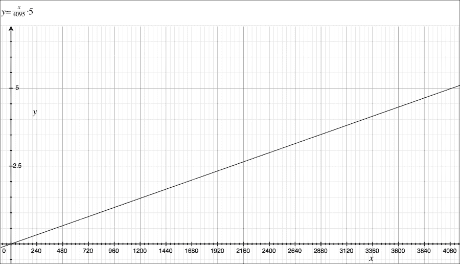
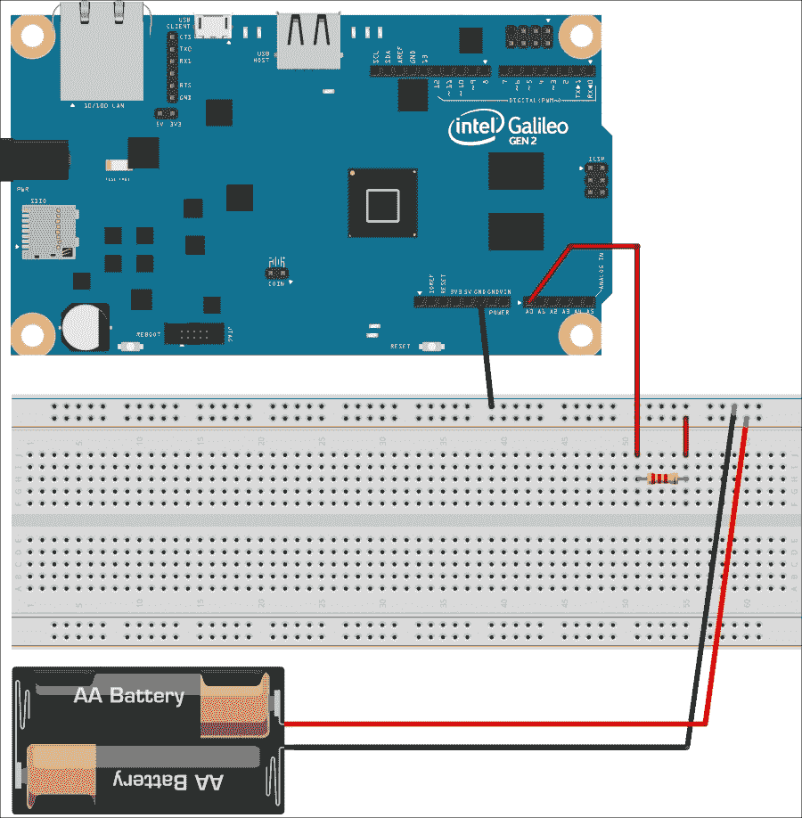
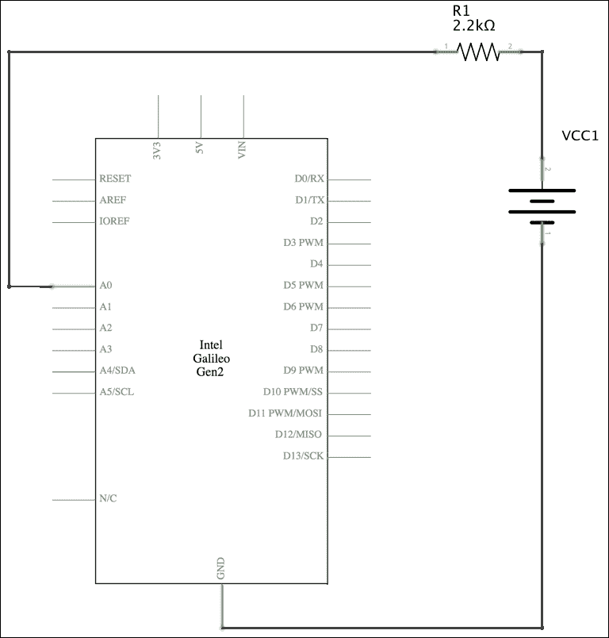
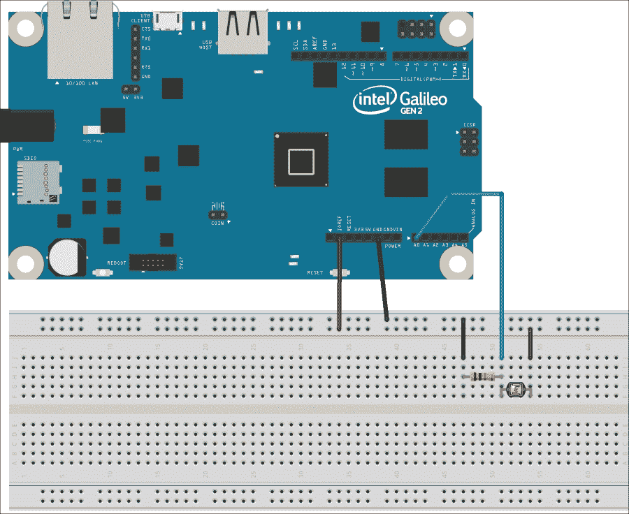
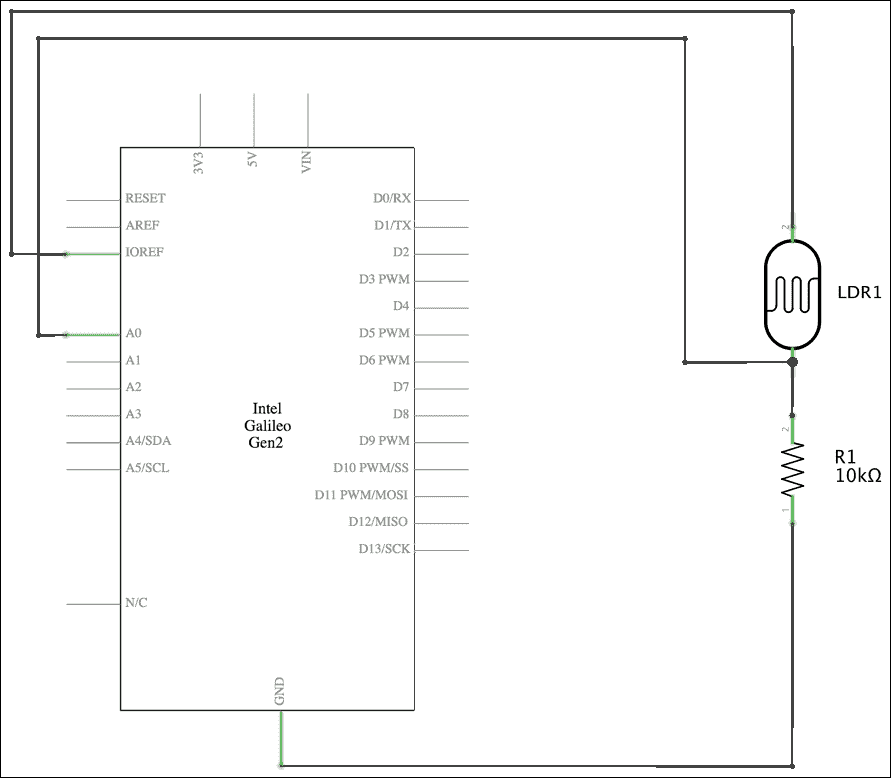
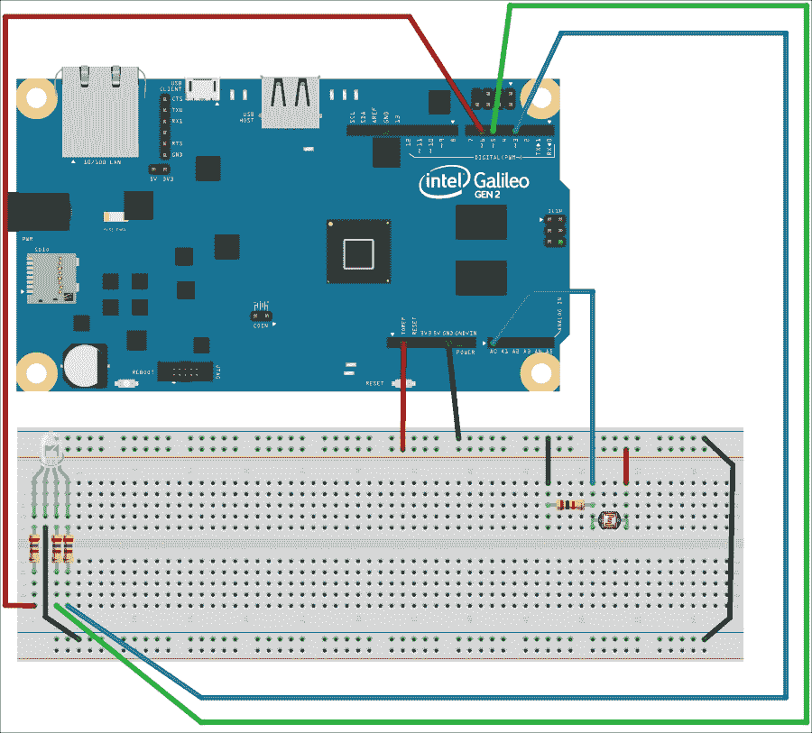
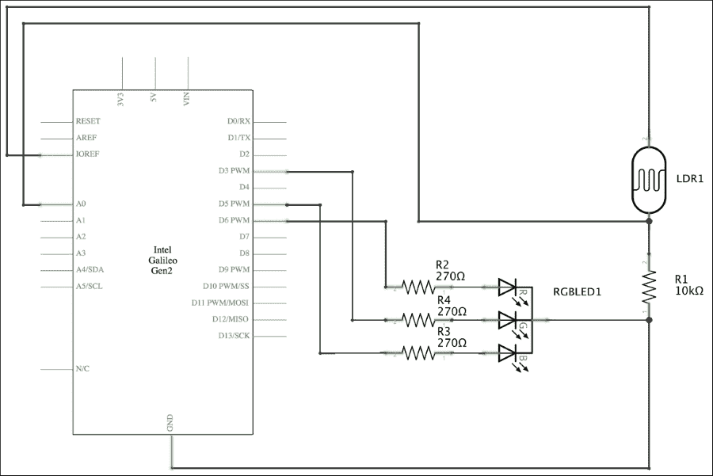
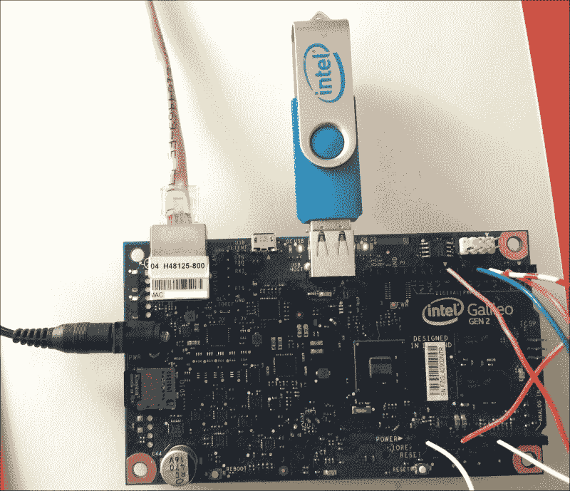

# 第六章. 使用模拟输入和本地存储

在本章中，我们将使用模拟输入将来自真实环境的定量值转换为定性值，我们将使用这些值来触发动作。我们将：

+   理解模拟输入的工作原理

+   了解模拟数字转换器分辨率的影响

+   使用模拟引脚和`mraa`库测量电压

+   在分压器中包含光敏电阻，并将模拟输入引脚与电压源连接

+   将可变电阻转换为电压源

+   使用模拟输入和`mraa`库确定黑暗程度

+   当环境光线变化时触发动作

+   使用 wiring-x86 库控制模拟输入

+   使用不同的本地存储选项来记录事件

# 理解模拟输入

在第一章 *理解和设置基础物联网硬件* 中，我们了解到英特尔 Galileo Gen 2 板提供了从**A0**到**A5**编号的六个模拟输入引脚，位于板的前面板的右下角。可以测量从 0V（地）到配置的**IOREF**跳线位置（默认为 5V）的值，该板为模拟数字转换器提供 12 位的分辨率。因此，我们可以检测到 4096 个不同的值（2¹² = 4096），或 4096 个单位，其值从 0 到 4095（包含），其中 0 代表 0V，4095 表示 5V。

### 小贴士

如果你有其他 Arduino 板的经验，你必须考虑到英特尔 Galileo Gen 2 板不使用标记为**AREF**的引脚。在其他 Arduino 板上，你可以使用此引脚来设置模拟数字转换过程的模拟参考电压。当我们使用英特尔 Galileo Gen 2 板时，模拟引脚的最大值始终将由**IOREF**跳线位置（5V 或 3.3V）控制，并且无法为模拟输入使用任何外部参考。在我们的所有示例中，我们将使用**IOREF**跳线的默认位置，因此最大值始终为 5V。

我们只需要应用一个线性函数将模拟引脚读取的原始值转换为输入电压值。如果我们使用 12 位的分辨率，检测到的值将具有最小差异或步长为 5V / 4095 = 0.001220012 V，大约为 1.22 mV（毫伏）或 1.22E-03 V。我们只需要将模拟引脚读取的原始值乘以 5，然后除以 4095。

下面的图表显示了从模拟引脚读取的值在横轴（*x*-轴）上，以及它在纵轴（*y*-轴）上表示的相应浮点电压值。



之前图表的方程式是 `y = x / 4095 * 5`，具体来说 `voltage_value = analog_pin_read_value / 4095 * 5`。我们可以在我们的 Python 解释器中运行以下代码来查看输出，其中包括使用公式从模拟引脚读取的每个原始值（从`0`到`4095`，包括）可以生成的所有电压值。

```py
for analog_pin_read_value in range(0, 4096):
    print(analog_pin_read_value / 4095.0 * 5.0)
```

### 提示

我们也可以使用较低的分辨率，例如 10 位分辨率，我们就能检测到更少的不同的值，具体是 1024 个不同的值（2¹⁰ = 1024），或 1024 个单位，从`0`到`1023`（包括）。在这种情况下，值的最小差异或步长将是 5V / 1023 = 0.004887585V，大约是 4.89mV（毫伏）或 4.89E-03 V。如果我们决定使用这个较低的分辨率，我们只需将模拟引脚读取的原始值乘以五，然后除以 1023。

# 使用电压源连接模拟输入引脚

理解如何从模拟引脚读取值并将这些值映射回电压值的最简单方法是通过一个非常简单的例子来操作。我们将连接一个电源到模拟输入引脚之一，具体来说是一个串联两个 AA 或 AAA 1.25 V 可充电电池的电池组。也可以使用串联的两个 AA 或 AAA 1.5 V 标准电池。请注意，两个可充电电池串联时的最大电压将是 2.5 V（1.25 V * 2），而两个标准电池串联时的最大电压将是 3 V（1.5 V * 2）。

我们将使用标记为**A0**的模拟引脚连接到电池组的正极（+）。别忘了电池组的正极（+）连接到电池的乳头。完成必要的接线后，我们将编写 Python 代码来测量电池组的电压。这样，我们将读取将模拟值转换为数字表示的结果，并将其映射到电压值。为了使用这个例子，我们需要以下部件：

+   两个 AA 或 AAA 1.25 V 可充电电池或两个 AA 或 AAA 1.5 V 标准电池。

+   一个合适的电池夹，用于将两个选定的电池串联并简化接线。例如，如果你使用两个 AA 1.25 可充电电池，你需要一个 2 x AA 电池夹。

+   一个 2200Ω（2k2Ω）的 5%容差（红红红金）电阻。

以下图像显示了电池夹、连接到面包板的电阻、必要的接线以及从英特尔 Galileo Gen 2 板到面包板的接线。该示例的 Fritzing 文件为`iot_fritzing_chapter_06_01.fzz`，以下图像是面包板视图：



以下图示显示了用符号表示电子组件的电路图：



如前图所示，板符号上标记为 **A0** 的模拟输入引脚通过电阻连接到电源的正极。电源的负极连接到地。

现在，是时候进行所有必要的接线了。在添加或移除任何线从板上的引脚之前，不要忘记关闭 Yocto Linux，等待所有板载 LED 熄灭，并从 Intel Galileo Gen 2 板上拔掉电源。

# 使用模拟输入和 mraa 库测量电压

我们将创建一个新的 `VoltageInput` 类来表示连接到我们的板上的电压源，具体来说，是连接到模拟输入引脚。以下行显示了与 `mraa` 库一起工作的新 `VoltageInput` 类的代码。示例代码文件为 `iot_python_chapter_06_01.py`。

```py
import mraa
import time

class VoltageInput:
    def __init__(self, analog_pin):
        self.analog_pin = analog_pin
        self.aio = mraa.Aio(analog_pin)
        # Configure ADC resolution to 12 bits (0 to 4095)
        self.aio.setBit(12)

    @property
    def voltage(self):
        raw_value = self.aio.read()
        return raw_value / 4095.0 * 5.0
```

在创建 `VoltageInput` 类的实例时，我们必须指定电压源连接到的模拟引脚编号，`analog_pin` 是必需的参数。构造函数，即 `__init__` 方法，使用接收到的 `analog_pin` 作为其 `pin` 参数创建一个新的 `mraa.Aio` 实例，将其引用保存到 `aio` 属性中，并调用其 `setBit` 方法来配置模拟数字转换器的分辨率为 12 位，即提供 4096 个可能的值来表示从 0 到 5V。

该类定义了一个 `voltage` 属性，它调用相关 `mraa.Aio` 实例（`self.aio`）的 `read` 方法来从模拟引脚检索原始值，并将其保存到 `raw_value` 变量中。然后，代码返回将 `raw_value` 除以 `4095` 并乘以 `5` 的结果。这样，该属性返回从读取函数返回的原始值转换的电压值。

现在，我们可以编写使用新的 `VoltageInput` 类来创建电池包实例并轻松检索电压值的代码。新类执行必要的计算，将读取的值映射到电压值，因此我们只需检查 `voltage` 属性的值，无需担心关于模拟数字转换器和其分辨率的详细信息。

现在，我们将编写一个循环，每秒检索一次电压值。示例代码文件为 `iot_python_chapter_06_01.py`。

```py
if __name__ == "__main__":
    v0 = VoltageInput(0)
    while True:
        print("Voltage at pin A0: {0}".format(v0.voltage))
        # Sleep 1 second
        time.sleep(2)
```

第一行创建了一个之前编码的 `VoltageInput` 类的实例，其中 `analog_pin` 参数的值为 `0`。这样，该实例将读取标记为 **A0** 的引脚上的模拟值，该引脚通过电阻连接到电源的正极。

然后，代码将无限循环运行，也就是说，直到你通过按*Ctrl* + *C*或按下停止过程的按钮来中断执行。该循环每两秒打印一次**A0**引脚的电压值。以下是在使用两个电量略有下降的可充电电池执行代码时生成的示例输出行：

```py
Voltage at pin A0: 2.47130647131
```

# 将光敏电阻连接到模拟输入引脚

现在，我们将使用光敏电阻，也就是光传感器，具体来说，这是一种电子元件，它提供了一个可变电阻，该电阻的阻值会根据入射光的强度而变化。随着入射光强度的增加，光敏电阻的阻值减小，反之亦然。

### 小贴士

光敏电阻也被称为**LDR**（即**光敏电阻**）或光电管。请注意，光敏电阻并不是最佳的光感测元件，但当我们没有达到一秒的延迟问题时，它们在轻松确定我们是否处于黑暗环境中时非常有用。

我们无法使用我们的板子测量电阻值。然而，我们可以读取电压值，因此，我们将使用一个电压分压器配置，其中包括光敏电阻作为其两个电阻之一。当光敏电阻接收到大量光线时，电压分压器将输出高电压值；当光敏电阻处于暗区，即接收到少量或没有光线时，它将输出低电压值。

在之前的例子中，我们学习了如何从模拟引脚读取值并将这些值映射回电压值。我们将使用这些知识来确定何时变暗。一旦我们理解了传感器的工作原理，我们将对光条件的变化做出反应，并记录特定场景的数据。

我们将使用标有**A0**的模拟引脚来连接包含光敏电阻的电压分压器的正极（+）。完成必要的接线后，我们将编写 Python 代码来确定我们是否处于黑暗环境中。这样，我们将读取将电阻值转换为电压的结果，然后将这个模拟值转换为它的数字表示。正如我们在之前的例子中学到的，我们将读取的数字值映射到电压值，然后我们将这个电压值映射到黑暗测量值。听起来很复杂，但实际上比听起来容易得多。我们需要以下部分来处理这个例子：

+   光敏电阻

+   一个 10,000Ω（10kΩ）的电阻，公差为 5%（棕色 黑色 橙色 金色）

以下图表显示了连接到面包板的光敏电阻和电阻，必要的布线和从英特尔 Galileo Gen 2 板到面包板的布线。该示例的 Fritzing 文件为`iot_fritzing_chapter_06_02.fzz`，以下图片是面包板视图：



以下图片显示了用符号表示的电子组件的电路图：



如前图所示，板符号上标记为**A0**的 GPIO 引脚连接到由名为**LDR1**的光敏电阻和 5%公差为 10kΩ的电阻**R1**构建的分压器。**LDR1**光敏电阻连接到**IOREF**引脚。我们已经知道标记为**IOREF**的引脚为我们提供 IOREF 电压，即在我们的实际配置中为 5V。**R1**电阻连接到**GND**（地）。

现在，是时候进行所有必要的布线了。在添加或从板上的引脚移除任何电线之前，不要忘记关闭 Yocto Linux，等待所有板载 LED 熄灭，并从英特尔 Galileo Gen 2 板上拔掉电源。

# 使用模拟输入和 mraa 库确定黑暗程度

我们将创建一个新的`DarknessSensor`类来表示包含在分压器中并连接到我们的板上的光敏电阻，具体来说，是连接到模拟输入引脚。因为我们已经编写了读取和转换模拟输入的代码，所以我们将使用之前创建的`VoltageInput`类。以下行显示了与`mraa`库一起工作的新`DarknessSensor`类的代码。该示例的代码文件为`iot_python_chapter_06_02.py`。

```py
import mraa
import time

class DarknessSensor:
    # Light level descriptions
    light_extremely_dark = "extremely dark"
    light_very_dark = "very dark"
    light_dark = "just dark"
    light_no_need_for_a_flashlight = \
        "there is no need for a flashlight"
    # Maximum voltages that determine the light level
    extremely_dark_max_voltage = 2.0
    very_dark_max_voltage = 3.0
    dark_max_voltage = 4.0

    def __init__(self, analog_pin):
        self.voltage_input = VoltageInput(analog_pin)
        self.voltage = 0.0
        self.ambient_light = self.__class__.light_extremely_dark
        self.measure_light()

    def measure_light(self):
        self.voltage = self.voltage_input.voltage
        if self.voltage < self.__class__.extremely_dark_max_voltage:
            self.ambient_light = self.__class__.light_extremely_dark
        elif self.voltage < self.__class__.very_dark_max_voltage:
            self.ambient_light = self.__class__.light_very_dark
        elif self.voltage < self.__class__.dark_max_voltage:
            self.ambient_light = self.__class__.light_dark
        else:
            self.ambient_light = self.__class__.light_no_need_for_a_flashlight
```

当我们在`analog_pin`必需参数中创建`DarknessSensor`类的实例时，我们必须指定连接到包含光敏电阻的分压器的模拟引脚编号。构造函数，即`__init__`方法，使用接收到的`analog_pin`作为其`analog_pin`参数创建一个新的`VoltageInput`实例，并将其引用保存在`voltage_input`属性中。然后，构造函数创建并初始化两个属性：`voltage`和`ambient_light`。最后，构造函数调用`measure_light`方法。

该类定义了一个`measure_light`方法，该方法通过检查`self.voltage_input.voltage`属性在`voltage`属性（`self.voltage`）中检索到的电压值来保存电压值。这样，代码可以检查存储在电压属性中的值是否低于确定光级的三个最大电压值，并为`ambient_light`属性（`self.ambient_light`）设置适当的值。

该类定义了以下三个类属性，这些属性确定了确定每个光级的最大电压值：

+   `extremely_dark_max_voltage`：如果检索到的电压低于 2V，这意味着环境非常暗

+   `very_dark_max_voltage`: 如果检索到的电压低于 3V，这意味着环境非常暗

+   `dark_max_voltage`。如果检索到的电压低于 4V，这意味着环境只是暗

### 小贴士

这些值是为特定光敏电阻和环境条件配置的。你可能需要根据包含在分压器中的光敏电阻检索到的电压值设置不同的值。一旦运行示例，你可以检查电压值并对之前解释过的类属性中存储的电压值进行必要的调整。记住，当入射光增加时，电压值会更高，即更接近 5V。因此，最暗的环境，测量的电压越低。

我们的目标是将一个定量值，特别是电压值，转换为定性值，即一个能够解释真实环境中真实情况的值。该类定义了以下四个类属性，指定光级描述并确定在调用`measure_light`方法后电压值将被转换为四个光级中的哪一个：

+   `light_extremely_dark`

+   `light_very_dark`

+   `light_dark`

+   `light_no_need_for_a_flashlight`

现在，我们可以编写使用新的`DarkSensor`类创建分压器中包含的光敏电阻实例的代码，并轻松打印光条件描述。新类使用之前创建的`VoltageInput`类进行必要的计算，将读取的值映射到电压值，然后将其转换为定性值，为我们提供光条件描述。现在，我们将编写一个循环，每两秒检查一次光条件是否改变。示例的代码文件是`iot_python_chapter_06_02.py`。

```py
if __name__ == "__main__":
    darkness_sensor = DarknessSensor(0)
    last_ambient_light = ""
    while True:
        darkness_sensor.measure_light()
        new_ambient_light = darkness_sensor.ambient_light
        if new_ambient_light != last_ambient_light:
            # The ambient light value changed
            last_ambient_light = new_ambient_light
            print("Darkness level: {0}".format(new_ambient_light))
        # Sleep 2 seconds
        time.sleep(2)
```

第一行创建了一个之前编写的`DarknessSensor`类的实例，将`0`作为`analog_pin`参数的值，并将实例保存在`darkness_sensor`局部变量中。这样，该实例将使用`VoltageInput`类的实例从标记为**A0**的引脚读取模拟值。然后，代码将`last_ambient_light`局部变量初始化为空字符串。

然后，代码将无限循环运行，即直到你通过按*Ctrl* + *C*或按下停止过程的按钮来中断执行。在这种情况下，如果你使用具有远程开发功能的 Python IDE 运行代码在你的板上，循环将调用`darkness_sensor.measure_light`方法来检索当前的光线条件，并将更新的`darkness_sensor.ambient_light`值保存在`new_ambient_light`局部变量中。然后，代码检查`new_ambient_light`值是否与`last_ambient_light`不同。如果它们不同，这意味着环境光线已经改变，因此，它将`last_ambient_light`的值设置为`new_ambient_light`，并打印存储在`new_ambient_light`中的环境光线描述。

当环境光线从最后打印的值变化时，循环打印环境光线描述，并且每两秒检查一次环境光线。以下行将启动示例。别忘了你需要使用 SFTP 客户端将 Python 源代码文件传输到 Yocto Linux。

```py
python iot_python_chapter_06_02.py
```

在运行示例之后，执行以下操作：

+   使用智能手机或手电筒在光敏电阻上诱导光线

+   用你的手在光敏电阻上产生阴影

+   减少环境中的光线，但不是最小值，只是让它稍微暗一些

+   将环境中的光线减少到最小，一个完全没有光线的完全黑暗环境

前述动作的结果，你应该看到以下输出：

```py
Darkness level: there is no need for a flashlight
Darkness level: just dark
Darkness level: very dark
Darkness level: extremely dark
```

# 环境光线变化时的触发动作

在之前的示例中，我们使用 PWM 来设置 RGB LED 的红色、绿色和蓝色组件的亮度级别。现在，我们将添加一个 RGB LED，并将基于光敏电阻检测到的环境光线为其三个组件设置亮度级别。我们将像在第四章中处理此组件的示例那样布线 RGB LED，*使用 RESTful API 和脉宽调制*。我们将使用以下 PWM 输出引脚：

+   将**~6**引脚连接到红色 LED 的正极引脚

+   将**~5**引脚连接到绿色 LED 的正极引脚

+   将**~3**引脚连接到蓝色 LED 的正极引脚。

我们需要以下额外的部件来使用此示例：

+   一个常见的共阴极 5mm RGB LED

+   三个 270Ω、5%容差的电阻（红紫棕金）

以下图显示了连接到面包板的组件，必要的布线和从 Intel Galileo Gen 2 板到面包板的布线。示例的 Fritzing 文件为`iot_fritzing_chapter_06_03.fzz`，以下图片是面包板视图：



以下图片显示了用符号表示的电子组件的原理图：



如前图所示，板上的符号中标记为**D3 PWM**、**D5 PWM**和**D6 PWM**的三个具有 PWM 功能的 GPIO 引脚连接到一个 270Ω电阻，该电阻连接到每个 LED 颜色的阳极引脚，而公共阴极连接到地。

现在，是时候将组件插入面包板并完成所有必要的布线了。在添加或移除任何线之前，别忘了关闭 Yocto Linux，等待所有板载 LED 熄灭，并从 Intel Galileo Gen 2 板上拔掉电源。

我们将添加代表连接到我们的板上的 LED 的`AnalogLed`类的代码，该 LED 的亮度级别可以从 0 到 255。我们在第四章中创建了此类，*使用 RESTful API 和脉宽调制*，示例代码文件为`iot_python_chapter_04_02.py`。

我们将创建一个新的`BoardInteraction`类来创建我们的`DarknessSensor`类的一个实例以及 RGB LED 每个组件的一个实例，以便轻松控制它们的亮度级别。以下行显示了`BoardInteraction`类的代码。示例代码文件为`iot_python_chapter_06_03.py`：

```py
class BoardInteraction:
    # The photoresistor included in the voltage divider
    # is connected to analog PIN A0
    darkness_sensor = DarknessSensor(0)
    # The Red LED is connected to GPIO pin ~6
    red_led = AnalogLed(6, 'Red')
    # The Green LED is connected to GPIO Pin ~5
    green_led = AnalogLed(5, 'Green')
    # The Blue LED is connected to GPIO Pin ~3
    blue_led = AnalogLed(3, 'Blue')

    @classmethod
    def set_rgb_led_brightness(cls, brightness_level):
        cls.red_led.set_brightness(brightness_level)
        cls.green_led.set_brightness(brightness_level)
        cls.blue_led.set_brightness(brightness_level)

    @classmethod
    def update_leds_brightness(cls):
        if cls.darkness_sensor.ambient_light == DarknessSensor.light_extremely_dark:
            cls.set_rgb_led_brightness(255)
        elif cls.darkness_sensor.ambient_light == DarknessSensor.light_very_dark:
            cls.set_rgb_led_brightness(128)
        elif cls.darkness_sensor.ambient_light == DarknessSensor.light_dark:
            cls.set_rgb_led_brightness(64)
        else:
            cls.set_rgb_led_brightness(0)
```

`BoardInteraction`类声明了四个类属性：`darkness_sensor`、`red_led`、`green_led`和`blue_led`。第一个类属性保存了`DarknessSensor`类的新实例，最后三个类属性保存了之前导入的`AnalogLed`类的新实例，分别代表连接到引脚**~6**、**~5**和**~3**的红、绿、蓝 LED。然后，`BoardInteraction`类声明了以下两个类方法：

+   `set_rgb_led_brightness`：将`brightness_level`参数接收到的相同亮度级别设置为 RGB LED 的三个组件。

+   `update_leds_brightness`：根据 DarknessSensor 实例（`cls.darkness_sensor`）的`ambient_light`值设置 RGB LED 的三个组件的亮度级别。如果非常暗，亮度级别将为 255。如果很暗，亮度级别将为 128。如果暗，亮度级别将为 64。否则，RGB LED 将完全关闭。

现在，我们可以编写一个代码，使用新的`BoardInteraction`类来测量环境光线并根据获取的值设置 RGB LED 的亮度。正如我们之前的示例一样，我们只有在环境光线值从当前值变化时才会进行更改。我们将编写一个循环，每两秒检查一次光线条件是否发生变化。示例代码文件为`iot_python_chapter_06_03.py`。

```py
    last_ambient_light = ""
    while True:
        BoardInteraction.darkness_sensor.measure_light()
        new_ambient_light = BoardInteraction.darkness_sensor.ambient_light
        if new_ambient_light != last_ambient_light:
            # The ambient light value changed
            last_ambient_light = new_ambient_light
            print("Darkness level: {0}".format(new_ambient_light))
            BoardInteraction.update_leds_brightness()
        # Sleep 2 seconds
        time.sleep(2)
```

第一行初始化`last_ambient_light`局部变量为空字符串。然后，代码无限循环运行，即直到你中断执行。循环调用`BoardInteraction.darkness_sensor.measure_light`方法来检索当前光线条件，并将更新的`BoardInteraction.darkness_sensor.ambient_light`值保存到`new_ambient_light`局部变量中。然后，代码检查`new_ambient_light`值是否与`last_ambient_light`不同。如果它们不同，这意味着环境光线已经改变，因此，它将`last_ambient_light`的值设置为`new_ambient_light`，打印存储在`new_ambient_light`中的环境光线描述，并调用`BoardInteraction.update_leds_brightness`方法根据环境光线设置 RGB LED 的亮度。

以下行将开始示例。别忘了你需要使用 SFTP 客户端将 Python 源代码文件传输到 Yocto Linux。

```py
python iot_python_chapter_06_03.py
```

在运行示例之后，执行以下操作，你将看到 RGB LED 的亮度级别按以下方式变化：

+   使用智能手机或手电筒在光敏电阻上产生光线。RGB LED 将保持关闭。

+   用你的手在光敏电阻上产生阴影。RGB LED 将以昏暗的灯光打开。

+   减少环境中的光线，但不是最小，只是让它变得有点暗。RGB LED 将增加其亮度。

+   将环境中的光线减少到最小，一个完全没有光线的完全黑暗环境。RGB LED 将增加其亮度到最大级别。

+   使用智能手机或手电筒再次在光敏电阻上产生光线。RGB LED 将关闭。

由于之前的操作，你应该看到以下输出：

```py
Darkness level: there is no need for a flashlight
Red LED connected to PWM Pin #6 set to brightness 0.
Green LED connected to PWM Pin #5 set to brightness 0.
Blue LED connected to PWM Pin #3 set to brightness 0.
Darkness level: just dark
Red LED connected to PWM Pin #6 set to brightness 64.
Green LED connected to PWM Pin #5 set to brightness 64.
Blue LED connected to PWM Pin #3 set to brightness 64.
Darkness level: very dark
Red LED connected to PWM Pin #6 set to brightness 128.
Green LED connected to PWM Pin #5 set to brightness 128.
Blue LED connected to PWM Pin #3 set to brightness 128.
Darkness level: extremely dark
Red LED connected to PWM Pin #6 set to brightness 255.
Green LED connected to PWM Pin #5 set to brightness 255.
Blue LED connected to PWM Pin #3 set to brightness 255.
Darkness level: there is no need for a flashlight
Red LED connected to PWM Pin #6 set to brightness 0.
Green LED connected to PWM Pin #5 set to brightness 0.
Blue LED connected to PWM Pin #3 set to brightness 0.
```

我们编写了易于阅读和理解的面向对象 Python 代码。借助`mraa`库，我们能够在环境光线变化时轻松触发动作。当环境光线改变时，我们可以控制 RGB LED 的亮度。我们使用模拟输入来确定环境光线水平，并使用 PWM 生成模拟输出以控制 RGB LED 的亮度级别。

# 使用 wiring-x86 库控制模拟输入

到目前为止，我们一直在使用`mraa`库来处理模拟输入并检索环境光线水平。然而，我们也在之前的示例中使用了`wiring-x86`库。我们只需更改几行面向对象的代码，就可以用`wiring-x86`库替换`mraa`库来读取模拟值。

首先，我们必须用与`wiring-x86`库兼容的版本替换`AnalogLed`类的代码。我们在第四章中创建了此版本，*使用 RESTful API 和脉冲宽度调制*，示例代码文件为`iot_python_chapter_04_04.py`。当我们获取`AnalogLed`类的代码时，我们也将获得`Board`类。

以下行显示了与`wiring-x86`库兼容而不是使用`mraa`的`VoltageInput`类的新版本。示例代码文件为`iot_python_chapter_06_04.py`。

```py
from wiringx86 import GPIOGalileoGen2 as GPIO

class VoltageInput:
    initial_analog_pin_number = 14

    def __init__(self, analog_pin):
        self.analog_pin = analog_pin
        self.gpio = Board.gpio
        self.gpio.pinMode(
            analog_pin + self.__class__.initial_analog_pin_number,
            self.gpio.ANALOG_INPUT)

    @property
    def voltage(self):
        raw_value = self.gpio.analogRead(
            self.analog_pin + 
            self.__class__.initial_analog_pin_number)
        return raw_value / 1023.0 * 5.0
```

我们创建了一个新的`VoltageInput`类版本，该版本声明了一个`initial_analog_pin_number`类属性，并将其设置为`14`。`wiring-x86`库使用 Arduino 兼容的数字来引用模拟输入引脚或 ADC 引脚。因此，模拟输入引脚`0`被称为`14`，模拟输入引脚`1`被称为`15`，依此类推。由于我们不希望修改代码的其他部分，我们使用类属性来指定必须加到接收到的`analog_pin`值上以将其转换为`wiring-x86`模拟引脚编号的数字。

构造函数，即`__init__`方法，将`Board.gpio`类属性的引用保存到`self.gpio`中，并使用接收到的`analog_pin`和`initial_analog_pin_number`类属性中指定的值作为其`pin`参数，以及`self.gpio.ANALOG_INPUT`作为其`mode`参数调用其`pinMode`方法。这样，我们配置引脚为模拟输入引脚，将模拟输入引脚编号转换为`wiring-x86`兼容的模拟输入引脚编号。`wiring-x86`库在 GPIO 和模拟 I/O 引脚之间没有区别，我们可以通过`Board.gpio`类属性来管理它们。

所有的`VoltageInput`实例都将保存对创建`GPIO`类实例的同一`Board.gpio`类属性的引用，特别是具有`debug`参数设置为`False`的`wiringx86.GPIOGalileoGen2`类，以避免为低级通信提供不必要的调试信息。

该类定义了一个`voltage`属性，该属性调用 GPIO 实例（`self.gpio`）的`analogRead`方法以从模拟引脚获取原始值，并将其保存到`raw_value`变量中。`self.analog_pin`属性加上`initial_analog_pin_number`类属性中指定的值指定了`analogRead`方法调用中的`pin`值。然后，代码返回`raw_value`除以`1023`再乘以`5`的结果。这样，该属性返回电压值，该值是从`analogRead`函数返回的原始值转换而来的。

### 小贴士

不幸的是，`wiring-x86`库不支持模拟数字转换器的 12 位分辨率。该库使用固定的 10 位分辨率，因此我们只能检测到 1024 个不同的值（2¹⁰ = 1024），或 1024 个单位，其值范围从 0 到 1023（包含），其中 0 代表 0V，1023 代表 5V。因此，我们必须在`voltage`属性中将原始值除以`1023`而不是`4095`。

代码的其余部分与之前示例中使用的相同。不需要对`DarknessSensor`类、`BoardInteraction`类或主循环进行更改，因为它们将自动与新`VoltageInput`类一起工作，并且其构造函数或`voltage`属性的参数没有发生变化。

以下行将启动与`wiring-x86`库一起工作的示例的新版本：

```py
python iot_python_chapter_06_04.py
```

### 小贴士

我们可以在之前示例中对光敏电阻上的入射光进行相同的更改，以检查我们是否可以使用`wiring-x86`库实现完全相同的结果。唯一的区别将是检索到的电压值的精度，因为我们在这个情况下使用的是模拟数字转换器的 10 位分辨率。

# 在本地存储中记录日志

Python 提供了一个强大且灵活的日志 API，由标准库模块提供。我们可以使用日志模块来跟踪在板上运行我们的物联网应用程序时发生的事件，并通过利用本地存储选项将它们保存到日志文件中。

现在，我们将对我们之前使用`mraa`库工作的示例的最后版本进行更改，以记录从环境光传感器读取的电压值。我们只想在环境光发生变化时记录新的电压值，即当`BoardInteraction.darkness_sensor.ambient_light`的值发生变化时。我们将使用之前的代码作为基准来添加新的日志功能。示例的代码文件为`iot_python_chapter_06_03.py`。

我们将替换`__main__`方法。以下行展示了添加了日志功能的新版本。新的代码行被突出显示，示例的代码文件为`iot_python_chapter_06_05.py`。

```py
import logging

if __name__ == "__main__":
 logging.basicConfig(
 filename="iot_python_chapter_06_05.log",
 level=logging.INFO,
 format="%(asctime)s %(message)s",
 datefmt="%m/%d/%Y %I:%M:%S %p")
 logging.info("Application started")
    last_ambient_light = ""
 last_voltage = 0.0
    while True:
        BoardInteraction.darkness_sensor.measure_light()
        new_ambient_light = BoardInteraction.darkness_sensor.ambient_light
        if new_ambient_light != last_ambient_light:
            # The ambient light value changed
 logging.info(
 "Ambient light value changed from {0} to {1}".format(
 last_voltage, BoardInteraction.darkness_sensor.voltage))
            last_ambient_light = new_ambient_light
 last_voltage = BoardInteraction.darkness_sensor.voltage
            print("Darkness level: {0}".format(new_ambient_light))
            BoardInteraction.update_leds_brightness()
        # Sleep 2 seconds
        time.sleep(2)
```

第一行调用`logging.basicConfig`方法来对日志系统进行基本配置。`fileName`参数指定了我们要用于日志记录的文件名`"iot_python_chapter_06_05.log"`。由于我们没有为`fileMode`参数指定值，因此使用默认的`'a'`模式，连续运行的消息将被追加到指定的日志文件名，即文件不会被覆盖。

### 小贴士

我们在`fileName`参数中未指定任何路径，因此，日志文件将在 Python 脚本运行的同一文件夹中创建，即`/home/root`文件夹。在这种情况下，日志文件将使用启动 Yocto Linux 分发的 microSD 卡上的可用存储空间。

`format`参数指定了`"%(asctime)s %(message)s"`，因为我们希望存储日期和时间，然后是消息。`datefmt`参数指定了`"%m/%d/%Y %I:%M:%S %p"`作为我们希望用于包含在所有附加到日志的行前面的日期和时间格式的日期和时间。我们想要一个简短的日期（月/日/年），后面跟着一个简短的时间（小时/分钟/秒 AM/PM）。我们只想将信息日志记录到文件中，因此，`level`参数指定了`logging.INFO`，将根日志记录器级别设置为该值。

下一行调用`logging.info`方法来记录第一个事件：开始执行的应用程序。在进入循环之前，代码声明了一个新的`last_voltage`局部变量并将其初始化为`0.0`。我们希望在环境光改变时记录前一次电压和新的电压值，因此，将最后一次电压保存在新变量中是必要的。当环境光改变时，对`logging.info`方法的调用将记录从前一次电压到新电压值的转换。然而，非常重要的一点是要注意，当此方法第一次被调用时，前一次电压将等于`0.0`。下一行将`BoardInteraction.darkness_sensor.voltage`的值保存到`last_voltage`变量中。

以下行将启动新版本的示例，该示例将创建`iot_python_chapter_06_05.log`文件：

```py
python iot_python_chapter_06_05.py
```

让 Python 脚本运行几分钟，并对光敏电阻上的入射光进行多次更改。这样，你将在日志文件中生成许多行。然后，你可以使用你喜欢的 SFTP 客户端从`/home/root`下载日志文件并阅读它。

以下行显示了在执行应用程序后生成的日志文件中的某些示例行：

```py
03/08/2016 04:54:46 PM Application started
03/08/2016 04:54:46 PM Ambient light value changed from 0.0 to 4.01953601954
03/08/2016 04:55:20 PM Ambient light value changed from 4.01953601954 to 3.91208791209
03/08/2016 04:55:26 PM Ambient light value changed from 3.91208791209 to 2.49572649573
03/08/2016 04:55:30 PM Ambient light value changed from 2.49572649573 to 3.40903540904
03/08/2016 04:55:34 PM Ambient light value changed from 3.40903540904 to 2.19291819292
03/08/2016 04:55:38 PM Ambient light value changed from 2.19291819292 to 3.83394383394
03/08/2016 04:55:42 PM Ambient light value changed from 3.83394383394 to 4.0
03/08/2016 04:55:48 PM Ambient light value changed from 4.0 to 3.40903540904
03/08/2016 04:55:50 PM Ambient light value changed from 3.40903540904 to 2.89133089133
03/08/2016 04:55:56 PM Ambient light value changed from 2.89133089133 to 3.88278388278
03/08/2016 04:55:58 PM Ambient light value changed from 3.88278388278 to 4.69841269841
03/08/2016 04:56:00 PM Ambient light value changed from 4.69841269841 to 3.93650793651
```

# 处理 USB 附加存储

记录与传感器相关事件的日志文件可能会迅速增长，因此，将日志文件存储在 microSD 存储空间可能会成为一个问题。我们可以处理高达 32 GB 的 microSD 卡。因此，一个选项是在更大的 microSD 卡上创建 Yocto Linux 镜像，并继续使用单个存储空间。这将需要我们从默认镜像中扩展分区。另一个选项是利用云服务，只需在我们的本地存储中保留受限制的日志。然而，我们将在稍后处理这个选项。现在，我们想要探索我们使用本地存储的附加选项。

如我们在第一章中学习到的，*理解和设置基础物联网硬件*，英特尔 Galileo Gen 2 板提供了一个标记为**USB HOST**的 USB 2.0 主机连接器。我们可以使用此连接器插入 USB 闪存驱动器以进行额外存储，并将日志文件保存到新存储中。

在插入任何 USB 闪存驱动器之前，请在 SSH 终端中运行以下命令以列出分区表：

```py
fdisk -l
```

以下行显示了由上一个命令生成的输出示例。您的输出可能不同，因为它取决于您用于引导 Yocto Linux 的微 SD 卡。请注意，`/dev/mmcblk0`磁盘标识了微 SD 卡，并且您有两个分区：`/dev/mmcblk0p1`和`/dev/mmcblk0p2`。

```py
Disk /dev/mmcblk0: 7.2 GiB, 7746879488 bytes, 15130624 sectors
Units: sectors of 1 * 512 = 512 bytes
Sector size (logical/physical): 512 bytes / 512 bytes
I/O size (minimum/optimal): 512 bytes / 512 bytes
Disklabel type: dos
Disk identifier: 0x000a69e4

Device         Boot     Start       End  Blocks  Id System
/dev/mmcblk0p1 *         2048    106495   52224  83 Linux
/dev/mmcblk0p2         106496   2768895 1331200  83 Linux
```

现在，我们将把一个 USB 闪存驱动器插入到板载的 USB 2.0 主机连接器，我们将运行必要的命令来挂载它，然后我们将修改代码以将日志保存到 USB 闪存驱动器内的一个文件夹中。您需要一个与 USB 2.0 兼容的预格式化 USB 闪存驱动器来运行此示例。

以下图片显示了连接到板载 USB 2.0 主机连接器的 USB 闪存驱动器，标记为**USB HOST**。插入 USB 闪存驱动器后，请等待几秒钟。



Yocto Linux 将在`/dev`文件夹中添加一个新的块设备。在 SSH 终端中运行以下命令以列出分区表：

```py
fdisk -l
```

以下行显示了由上一个命令生成的输出示例。您的输出可能不同，因为它取决于您使用的 USB 驱动器和微 SD 卡。将输出与您在插入 USB 闪存驱动器之前执行相同命令时生成的输出进行比较。附加的行提供了有关 USB 闪存驱动器、其磁盘名称和其分区的信息。突出显示的行显示了 USB 分区的详细信息，标识为`/dev/sda`磁盘和 FAT32 分区`/dev/sda1`。我们将使用此分区名称作为我们下一步操作之一。

```py
Disk /dev/mmcblk0: 7.2 GiB, 7746879488 bytes, 15130624 sectors
Units: sectors of 1 * 512 = 512 bytes
Sector size (logical/physical): 512 bytes / 512 bytes
I/O size (minimum/optimal): 512 bytes / 512 bytes
Disklabel type: dos
Disk identifier: 0x000a69e4

Device         Boot     Start       End  Blocks  Id System
/dev/mmcblk0p1 *         2048    106495   52224  83 Linux
/dev/mmcblk0p2         106496   2768895 1331200  83 Linux

Disk /dev/sda: 3.8 GiB, 4026531840 bytes, 7864320 sectors
Units: sectors of 1 * 512 = 512 bytes
Sector size (logical/physical): 512 bytes / 512 bytes
I/O size (minimum/optimal): 512 bytes / 512 bytes
Disklabel type: dos
Disk identifier: 0x02bb0a1a

Device    Boot Start       End  Blocks  Id System
/dev/sda1 *       64   7864319 3932128   b W95 FAT32

```

现在，有必要创建一个挂载点。我们必须在`/media`文件夹中创建一个新的子文件夹。我们将使用`usb`作为子文件夹的名称，因此我们将挂载驱动器的文件夹将是`/media/usb`。运行以下命令以创建文件夹：

```py
mkdir /media/usb
```

运行以下命令在最近创建的`/media/usb`文件夹中挂载分区。在之前的步骤中，我们检索了分区名称，它被命名为`/dev/sda1`。您的分区名称可能不同，因此您只需将`/dev/sda1`替换为您在执行列出磁盘及其分区的 fdisk 命令时列出的分区名称即可。

```py
mount /dev/sda1 /media/usb
```

现在，我们可以通过`/media/usb`文件夹访问 USB 闪存驱动器的内容，也就是说，无论何时我们在该文件夹中创建文件夹或文件，我们都是在向 USB 闪存驱动器分区写入。

运行以下命令以创建一个新的`/media/usb/log`文件夹，我们将在此文件夹中存储我们的物联网应用的日志：

```py
mkdir /media/usb/log
```

现在，我们将更改在`__main__`方法中调用`logging.basicConfig`方法时传递给文件名参数的值。我们想在`/media/usb/log`文件夹中保存日志文件。这样，我们将它存储在 USB 闪存驱动器的`log`文件夹中。我们将使用之前的代码作为基准来更改日志文件名及其路径。示例代码文件是`iot_python_chapter_06_05.py`。

以下行显示了调用`logging.basicConfig`方法的新代码和示例代码文件`iot_python_chapter_06_06.py`。其余的代码与我们在前面的示例中使用的一样。

```py
import logging

if __name__ == "__main__":
 logging.basicConfig(
 filename="/media/usb/log/iot_python_chapter_06_06.log",
 level=logging.INFO,
 format="%(asctime)s %(message)s",
 datefmt="%m/%d/%Y %I:%M:%S %p")

```

以下行将启动新版本的示例，该示例将在`/media/usb/log`文件夹中创建`iot_python_chapter_06_06.log`文件：

```py
python iot_python_chapter_06_06.py
```

保持 Python 脚本运行几分钟，并对光敏电阻上的环境光进行多次更改。这样，你将在日志文件中生成多行。然后，你可以使用你喜欢的 SFTP 客户端从`/media/usb/log`下载日志文件并阅读它。然而，别忘了在你的 SFTP 客户端中返回到`home/root`文件夹，因为这是上传 Python 脚本的那个文件夹。

如果你需要将 USB 闪存驱动器拔出以连接到另一台计算机或设备，首先你必须中断 Python 脚本的执行，然后，你必须运行以下命令来卸载分区。在前面的步骤中，我们检索了分区名称，它被命名为`/dev/sda1`。你的分区名称可能不同，因此，你只需将`/dev/sda1`替换为你执行列出磁盘及其分区的`fdisk`命令时列出的分区名称。请小心，并确保你在运行 Yocto Linux 上的 shell 的终端上运行此命令。在执行之前，请确保你看到`root@galileo:~#`提示符。如果你在运行 Linux 或 OS X 的计算机上运行此命令，你可能会卸载你的一个驱动器。

```py
umount /dev/sda1
```

现在，你可以从 USB 2.0 主机连接器中拔出 USB 闪存驱动器。

# 测试你的知识

1.  Intel Galileo Gen 2 板为模拟数字转换器提供以下分辨率：

    1.  32 位。

    1.  64 位。

    1.  12 位。

1.  模拟引脚允许我们检测的最大值：

    1.  4096 个不同的值，值的范围从 0 到 4095（包含）。

    1.  16384 个不同的值，值的范围从 0 到 16383（包含）。

    1.  256 个不同的值，值的范围从 0 到 255（包含）。

1.  我们可以通过调用`mraa.Aio`实例的以下方法来配置我们想要使用的位数作为分辨率：

    1.  `setADCResolution`。

    1.  `setBit`。

    1.  `setResolutionBits`。

1.  对`mraa.Aio`实例的`read`方法的调用返回：

    1.  基于为实例配置的分辨率位数的一个原始单位数。

    1.  一个从原始单位数自动转换的电压值。

    1.  一个以欧姆（Ω）为单位的电阻值。

1.  我们可以使用模拟引脚来读取：

    1.  电阻值。

    1.  电流值。

    1.  电压值。

# 摘要

在本章中，我们学习了如何使用模拟输入来测量电压值。我们理解了模拟数字转换器不同位分辨率的影响，并编写了将读取的原始单位转换为电压值的代码。

我们使用模拟引脚和 mraa 以及 wiring-x86 库来测量电压。我们能够将可变电阻转换成电压源，并使其能够通过模拟输入、光敏电阻和分压器来测量黑暗程度。

与前几章一样，我们继续利用 Python 的面向对象特性，并创建了类来封装电压输入、光敏传感器以及必要的配置，使用 mraa 和 wiring-x86 库。我们的代码易于阅读和理解，并且我们可以轻松切换底层低级库。

当环境光线变化时，我们触发了动作，并且能够同时处理模拟输入和模拟输出。最后，我们通过利用 Python 标准库中包含的日志功能来注册事件。我们还学会了利用英特尔 Galileo Gen 2 板中包含的 USB 2.0 主机连接器来插入 USB 闪存驱动器并将其用作额外的存储。

现在我们能够以不同的方式和配置读取模拟输入，这使得我们的物联网设备能够读取由环境变化产生的模拟值，我们可以与更多种类的传感器一起工作，从现实世界获取数据，这是下一章的主题。
