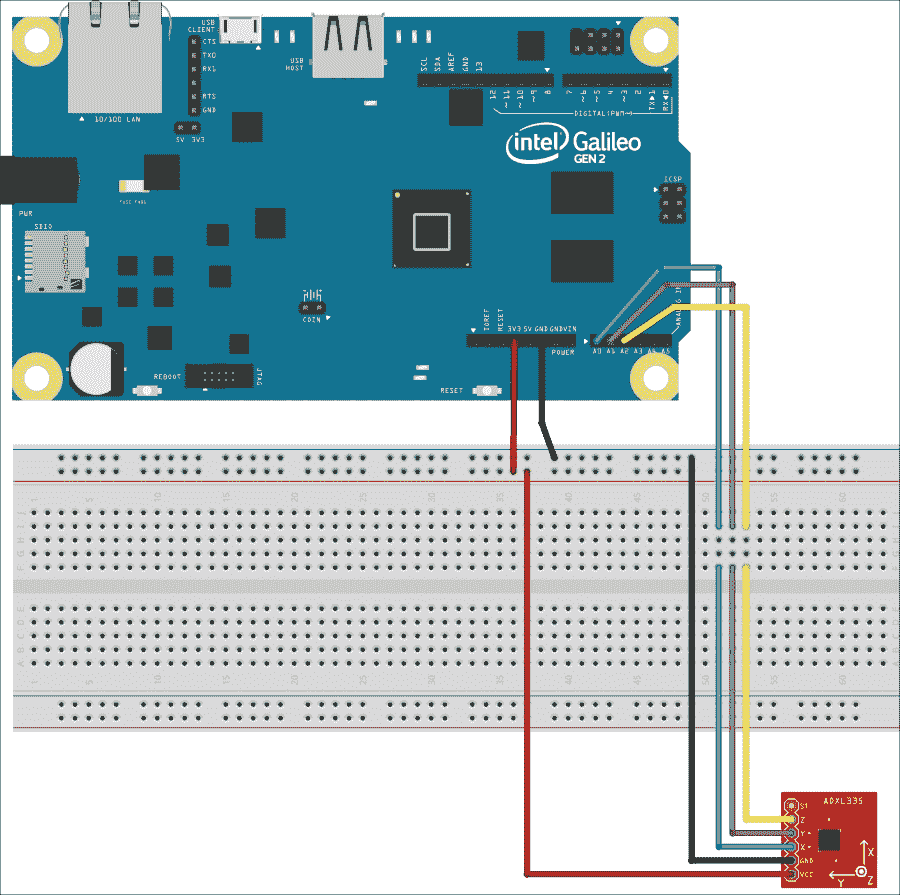
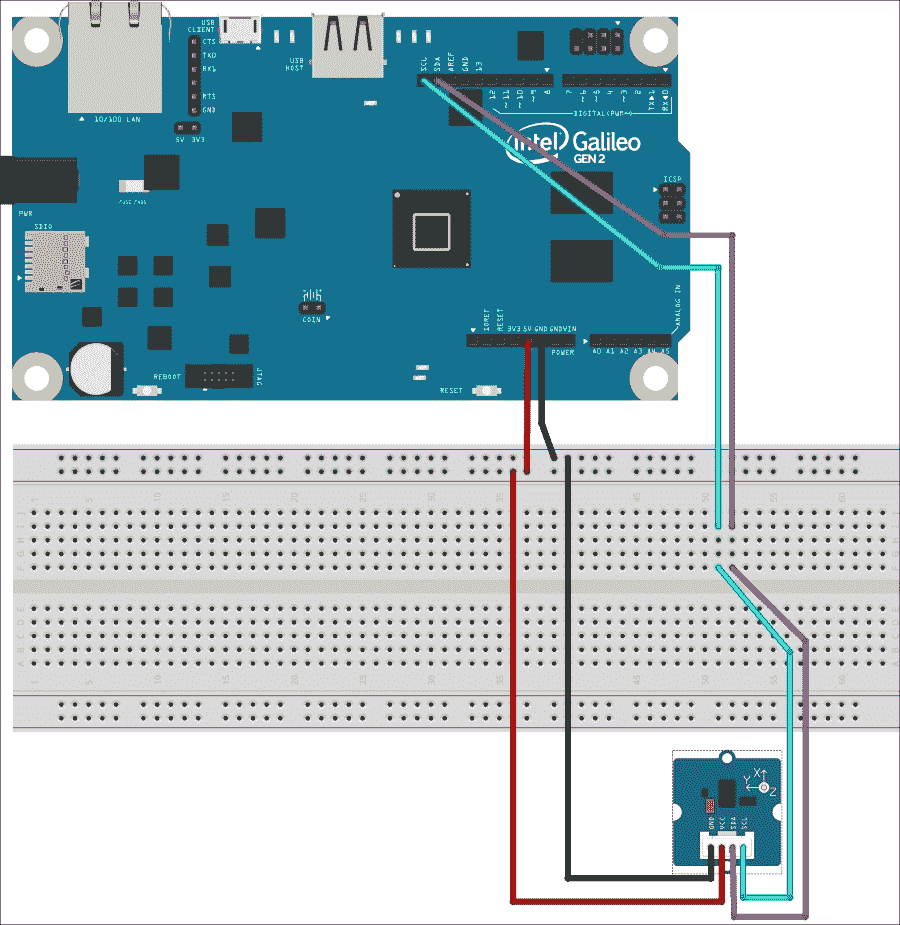
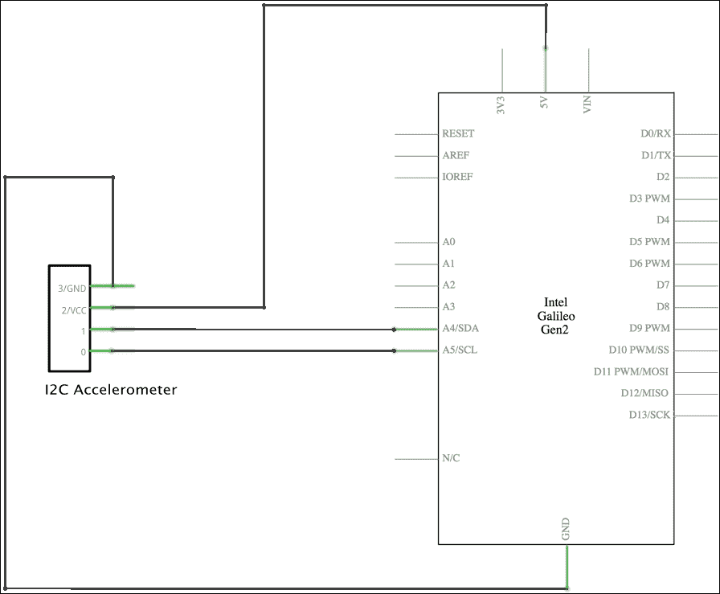
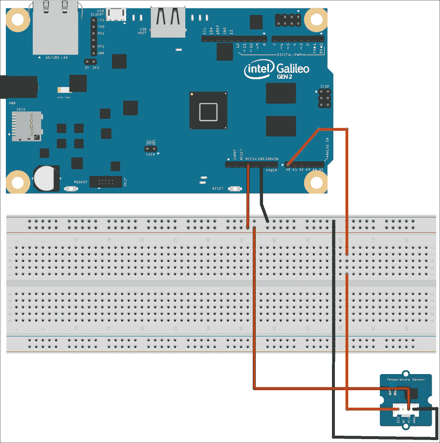
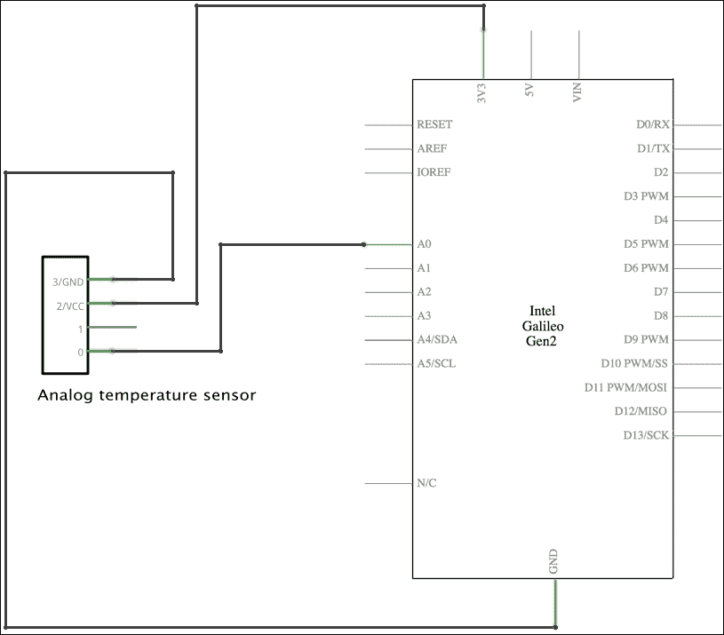
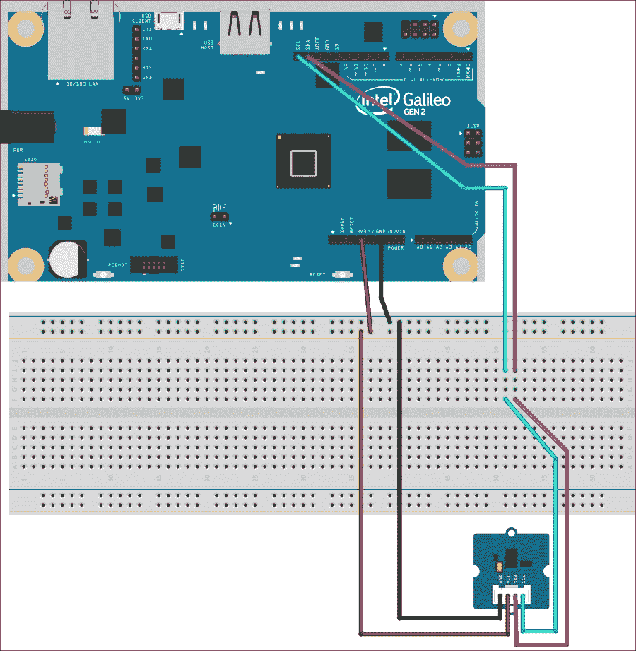
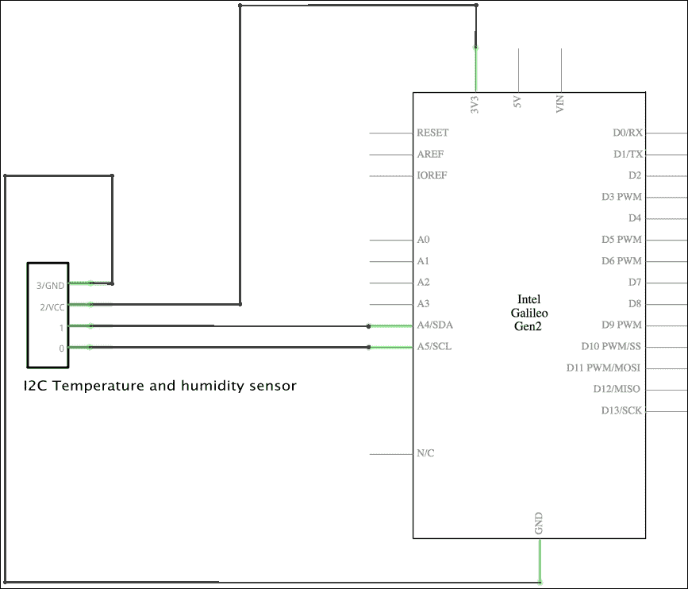

# 第七章. 使用传感器从现实世界获取数据

在本章中，我们将与各种传感器一起工作，以从现实世界获取数据。我们将涵盖以下主题：

+   理解传感器及其连接类型

+   学习在选择传感器时必须考虑的最重要事项

+   利用`upm`库与多种不同的传感器一起工作

+   使用加速度计测量适当的加速度或 g 力的幅度和方向

+   使用三轴模拟加速度计

+   使用与 I²C 总线兼容的数字加速度计

+   使用`mraa`库和 I²C 总线控制数字加速度计

+   使用模拟传感器测量环境温度

+   使用与 I²C 总线兼容的数字温度和湿度传感器

# 理解传感器及其连接类型

在第六章，*使用模拟输入和本地存储*，我们使用了一个包含在分压器中的光敏电阻，并将其连接到模拟输入引脚。我们能够测量环境光，并确定不同的暗度级别，并改变 RGB LED 的亮度级别。光敏电阻，也称为**LDR**（**Light-Dependent Resistor**的缩写）或光电池，是一种传感器。我们只需要将其包含在分压器中，就可以通过环境光改变光敏电阻的电阻值。这些电阻值的变动将在我们的模拟引脚中产生电压值的变动。因此，我们与一个电子组件配置一起工作，该配置生成一个模拟传感器，能够将环境光的变动转换为电压值。

有大量的传感器使我们能够从现实世界获取数据并将其转换为我们可以通过 Intel Galileo Gen 2 板上的不同通信端口收集的模拟或数字值，并用 Python 和不同的库进行处理。当我们使用光敏电阻来测量环境光时，我们将配置连接到模拟引脚，并使用`mraa`库然后是`wiring-x86`库来利用模数转换器来获取值。

在第二章，*在 Intel Galileo Gen 2 上使用 Python*，我们安装了最新可用的`upm`库。这个库为传感器和执行器提供了高级接口。每次我们与传感器一起工作时，通常都方便检查`upm`库是否支持它，因为高级接口可以为我们节省大量时间，并使我们从传感器获取值以及进行必要的单位转换变得更加容易。

在本章中，我们将利用具有许多不同传感器的`upm`库。然而，我们必须考虑到，有时`upm`库中为特定传感器提供的功能可能不足以满足需求，我们可能需要编写自己的底层代码，使用`mraa`或`wiring-x86`库与传感器进行交互。正如我们稍后将要分析的，根据连接类型，当传感器在`upm`库中不受支持时，只有`mraa`会为我们提供所有必要的功能。

显然，在选择传感器时，我们必须首先考虑我们想要测量的内容，例如温度。然而，这并不是我们选择特定传感器时唯一需要考虑的因素。当我们选择传感器时，我们必须考虑它们的功能、测量范围、精度以及连接类型等众多因素。以下列表列举了我们必须考虑的最重要的因素及其解释：

+   **与英特尔 Galileo Gen 2 板和我们所使用的电压供应（5V 或 3.3V）的兼容性**：有时，我们必须将多个传感器连接到板上，因此检查我们选择的传感器是否都能与板上的电压配置兼容是很重要的。一些传感器只有在我们有特定设置的情况下才能与板一起工作。

+   **功耗**：我们必须考虑到一些传感器具有不同的工作模式。例如，一些传感器具有高性能模式，需要比正常模式更多的电力。由于我们可能会将多个传感器连接到板上，因此考虑所有传感器连接到板上并使用我们将在其中使用的模式时的整体功耗也很重要。此外，一些传感器在我们不使用它们时，会切换到省电模式。

+   **连接类型**：为了决定最方便的连接类型，我们需要回答几个问题。我们是否有必要的连接、通信或接口端口？它们是否可用？连接类型和我们需要的距离是否会影响测量值的准确性？此外，当我们为我们的板选择第一个传感器时，所有连接可能都是可用的，但随着我们添加更多传感器，情况会发生变化，这可能会迫使选择具有不同连接类型的传感器。让我们考虑以下情况，我们已经在 6 个不同的位置测量环境光线。我们有 6 个光电电阻，通过 6 个分压器配置连接，并连接到 6 个可用的模拟输入引脚，因此我们没有额外的模拟引脚可用。如果我们必须添加温度传感器，我们不能添加需要模拟输入引脚的模拟传感器，因为它们都已经连接到光线传感器。在这种情况下，我们必须使用可以连接到 I²C 或 SPI 总线的数字温度传感器。另一个选择是使用可以连接到 UART 端口的数字温度传感器。我们将在稍后深入探讨传感器的不同连接类型。

+   **测量范围**：传感器的规格表明了它们的测量范围。例如，测量环境温度的温度传感器可以有一个测量范围从-40ºF 到 185ºF（相当于-40ºC 到 85ºC）。如果我们需要测量可以达到 90ºC 的环境温度，我们必须选择一个具有更高上限范围的温度传感器。例如，另一个测量环境温度的传感器提供的测量范围是-40ºF 到 257ºF（相当于-40ºC 到 125ºC），将适合这项工作。

+   **灵敏度和精度**：每个传感器都是灵敏的，可能提供不同的可配置精度级别。我们必须确保传感器提供的精度符合我们的需求。随着测量值的改变，考虑灵敏度，也称为测量分辨率，是很重要的。例如，如果我们必须测量温度，并且必须能够根据我们使用的单位确定至少 2ºF 或 1ºC 的变化，我们必须确保传感器能够提供所需灵敏度。

    ### 小贴士

    当我们开始选择合适的传感器时，分析测量范围、灵敏度和精度时注意单位非常重要。一个典型的例子是温度传感器，它可以以摄氏度（ºC）或华氏度（ºF）来表示数值。

+   **延迟**: 确定我们能够等待传感器收集新值的时间以及它是否能够在这么短的时间内提供真实的新值非常重要。当我们在真实环境或测量对象中测量的测量值发生变化时，传感器需要一些时间才能提供新的测量值。有时，这些可能是微秒，但在其他情况下，它们可以是毫秒甚至秒。这取决于传感器，我们在选择适合我们项目的传感器时必须考虑这一点。例如，我们可能需要一个温度传感器，每秒允许我们测量 2 个温度值，因此，我们必须与延迟低于 500 毫秒（0.5 秒）的传感器合作以达到我们的目标。具体来说，我们可以选择延迟为 200 毫秒的温度传感器。不幸的是，有时我们必须深入研究数据表来检查某些传感器及其使用的电子组件的延迟值。

+   **工作范围和特殊环境要求**: 考虑传感器的工作范围非常重要。有时，传感器必须在工作于特定环境条件下，而这些条件可能不适合所有可用的传感器。以下是一些粗略的环境要求示例：高抗冲击性、防水、极高温度和非常高的湿度水平。

+   **尺寸**: 传感器具有不同的尺寸。有时只有特定的尺寸适合我们的项目。

+   **协议、upm 库的支持和 Python 绑定**: 我们最终将使用 Python 代码处理从传感器获取的数据，因此，确保我们可以在 Python 中使用传感器非常重要。在某些情况下，我们不希望编写底层代码，并确保传感器在`upm`库中得到支持。在其他情况下，我们必须确保我们有必要的 Python 库来处理某些数字传感器使用的协议。例如，许多使用 UART 端口的温度传感器使用 MODBUS 串行通信协议。如果它们在`upm`库中没有得到支持，我们必须使用特定的 Python 库来通过 MODBUS 串行通信协议建立通信，这可能需要我们在没有先前使用此协议的经验的情况下进行额外的工作。

+   **成本**: 显然，我们必须考虑传感器的成本。可能符合我们所有要求的最佳传感器非常昂贵，我们可能决定使用功能较少或精度较低但成本较低的另一种传感器。我们有大量具有令人印象深刻的功能且与英特尔 Galileo Gen 2 板兼容的廉价传感器。然而，我们始终必须考虑每个传感器的成本，以便根据我们的需求和预算进行选择。

我们可以将传感器或模块连接到英特尔 Galileo Gen 2 板上，可以使用以下连接类型。列表列出了制造商通常用来描述模块连接类型的缩写及其解释：

+   **AIO**：该模块需要一个或多个模拟输入引脚。需要模拟输入引脚的传感器被称为模拟传感器。

+   **GPIO**：该模块需要一个或多个 GPIO 引脚。

+   **I²C**：该模块需要两根线连接到两个 I²C 总线线：**SCL**（代表 **S**erial **CL**ock）和 **SDA**（代表 **S**erial **DA**ta）。只要每个设备都有一个不同的 I²C 地址，我们就可以将许多设备连接到这个总线。

+   **SPI**：该模块需要三根线连接到三个 SPI 总线线：**MISO**（代表 **Master In Slave Out**）、**MOSI**（代表 **Master Out Slave In**）和 **SCK**（代表 **Serial Clock**）。

+   **UART**：该模块使用串行连接（RX/TX），因此需要两根线连接到 UART 端口的两个引脚：**TX->1** 和 **RX<-0**。**UART** 端口代表 **通用异步接收/发送器**。

与 I²C 总线、SPI 总线或 UART 端口一起工作的模块被称为 **数字传感器**，因为它们使用数字接口。一些模块将其中一个总线或 UART 端口与 GPIO 引脚结合使用。

我们已经使用 `mraa` 和 `wiring-x86` 库处理了模拟输入和模拟数字转换器。我们还使用这些库处理了配置为输入引脚的 GPIO 引脚。然而，我们还没有处理 I²C 总线、SPI 总线或 UART 端口。

`mraa` 库提供了以下类，允许我们与之前提到的串行总线和 UART 端口一起工作：

+   `mraa.I2c`：该类表示一个 I²C 总线主设备（板），可以通过选择它们的地址与多个 I²C 总线从设备进行通信。我们可以创建许多此类实例来与多个从设备进行交互。该类允许我们将数据写入和从连接到 I²C 总线的从设备读取数据。

+   `Mraa.Spi`：该类表示 SPI 总线和其芯片选择。该类允许我们将数据写入和从连接到 SPI 总线的设备读取数据。

+   `mraa.UART`：该类表示 UART 端口，并允许我们配置、向 UART 端口发送数据并从 UART 端口接收数据。

### 提示

我们可以使用之前解释过的由 `mraa` 库提供的类来与任何数字模块进行交互。然而，这需要我们花一些时间阅读模块的数据表，了解它们的工作模式，编写代码将数据写入和从适当的总线或 UART 端口读取。每个模块都有自己的 API，我们必须通过串行总线或 UART 端口来组合请求和处理响应。

首先，我们将利用每个模块的`upm`库。在少数情况下，我们还将使用`mraa`库中的适当类来了解如何使用低级接口与传感器交互。这样，如果我们必须与`upm`库不支持模块一起工作，我们可以分析数据表提供的信息，并编写代码与模块交互。

# 与加速度计一起工作

加速度计使我们能够测量加速度或 g 力的幅度和方向。平板电脑和智能手机使用加速度计根据我们握持设备的方向自动在纵向和横向模式之间切换。此外，内置的加速度计允许我们通过在设备的不同方向上用不同强度的微小动作来控制应用程序。

加速度计使我们能够通过测量由于重力产生的加速度来检测物体相对于地球表面的方向。此外，当我们想要检测物体开始或停止移动时，加速度计非常有用。加速度计还能够检测振动和物体下落。

### 小贴士

加速度计通常以 g 力为单位测量加速度，缩写为`g`。重要的是要避免由单位名称中包含的力这个词引起的混淆，因为我们测量的是加速度而不是力。一些加速度计使用每秒平方米（m/s²）作为它们的测量单位而不是 g 力。

现在，大多数加速度计能够测量三个轴的加速度，被称为三轴加速度计或三轴加速度计。一个三轴加速度计可以测量*x*、*y*和*z*轴的加速度。如果我们想测量小的加速度或振动，使用小范围的三轴加速度计会更方便，因为它们提供了必要的灵敏度。

# 将模拟加速度计连接到模拟输入引脚

理解加速度计工作原理的最简单方法是在一个简单的例子中使用它。现在，我们将使用一个具有从-3g 到+3g 的全量程传感范围的模拟三轴加速度计。这种加速度计需要三个模拟输入引脚，每个测量轴一个。加速度计根据每个轴测量的加速度提供电压级别。

我们将使用标记为**A0**、**A1**和**A2**的三个模拟引脚来连接模拟加速度计断开板的正电压输出。完成必要的布线后，我们将编写 Python 代码来测量和显示三个轴（x、y 和 z）的加速度。这样，我们将读取将模拟值转换为其数字表示的结果，并将其映射到加速度值。

我们需要一个 SparkFun 三轴加速度计扩展板 ADXL335 来与这个示例一起使用。以下 URL 提供了有关此扩展板的详细信息：[`www.sparkfun.com/products/9269`](https://www.sparkfun.com/products/9269)。该扩展板集成了来自 Analog Devices 的 ADXL335 加速度计传感器。

### 提示

供应给扩展板的电源应在 1.8VDC 至 3.6VDC 之间，因此我们将使用标记为**3V3**的电源引脚作为电源，以确保我们提供 3.3V，并且我们永远不会向扩展板提供**5V**。

还可以使用 Seeedstudio Grove 3 轴模拟加速度计与这个示例一起工作。以下 URL 提供了有关此模块的详细信息：[`www.seeedstudio.com/depot/Grove-3Axis-Analog-Accelerometer-p-1086.html`](http://www.seeedstudio.com/depot/Grove-3Axis-Analog-Accelerometer-p-1086.html)。如果您使用此模块，您可以使用标记为**3V3**或**5V**的电源引脚作为电源，因为扩展板能够与 3V 至 5V 的电压供应一起工作。全量程与 SparkFun 扩展板相同，并且两者使用相同的加速度计传感器。布线对两个模块都是兼容的。

以下图示显示了 SparkFun 三轴加速度计扩展板 ADXL335、必要的布线以及从 Intel Galileo Gen 2 板到面包板的布线。示例的 Fritzing 文件为`iot_fritzing_chapter_07_01.fzz`，以下图片是面包板视图：



以下图片显示了用电子元件表示的符号的原理图：


如前图所示，我们有以下连接：

+   标记为**A0**的模拟输入引脚连接到标记为**X**（在扩展板符号中为**XOUT**）的加速度计输出引脚

+   标记为**A1**的模拟输入引脚连接到标记为**Y**（在扩展板符号中为**YOUT**）的加速度计输出引脚

+   标记为**A2**的模拟输入引脚连接到标记为**Z**（在扩展板符号中为**ZOUT**）的加速度计输出引脚

+   标记为**3V3**的电源引脚连接到标记为**VCC**的加速度计电源引脚

+   标记为**GND**的接地引脚连接到标记为**GND**的加速度计接地引脚

现在，是时候进行所有必要的布线了。在添加或移除任何线从板上的引脚之前，不要忘记关闭 Yocto Linux，等待所有板载 LED 熄灭，并从 Intel Galileo Gen 2 板上拔掉电源供应。确保你使用粗线，这样你就可以在不意外拔掉电缆的情况下将加速度计扩展板移动到不同的方向。

# 使用模拟加速度计测量三轴加速度

`upm` 库在 `pyupm_adxl335` 模块中包括对三个轴模拟加速度计扩展板的支撑。在此模块中声明的 `ADXL335` 类代表连接到我们板上的三个轴模拟加速度计。该类使得校准加速度计并将从模拟输入读取的原始值转换为以 `g` 单位表示的值变得容易。

我们将创建一个新的 `Accelerometer` 类来表示加速度计，并使我们能够更容易地检索加速度值，而无需担心与 `ADXL335` 类的实例一起工作时必要的类型转换。我们将使用 `ADXL335` 类与加速度计交互。以下行显示了与 `upm` 库（特别是 `pyupm_adxl335` 模块）一起工作的新 `Accelerometer` 类的代码。示例代码文件为 `iot_python_chapter_07_01.py`。

```py
import pyupm_adxl335 as upmAdxl335
import time

class Accelerometer:
    def __init__(self, pinX, pinY, pinZ):
        self.accelerometer = upmAdxl335.ADXL335(
            pinX, pinY, pinZ)
        self.accelerometer.calibrate()
        self.x_acceleration_fp = upmAdxl335.new_floatPointer()
        self.y_acceleration_fp = upmAdxl335.new_floatPointer()
        self.z_acceleration_fp = upmAdxl335.new_floatPointer()
        self.x_acceleration = 0.0
        self.y_acceleration = 0.0
        self.z_acceleration = 0.0

    def calibrate(self):
        self.accelerometer.calibrate()

    def measure_acceleration(self):
        # Retrieve the acceleration values for the three axis
        self.accelerometer.acceleration(
            self.x_acceleration_fp,
            self.y_acceleration_fp,
            self.z_acceleration_fp)
        self.x_acceleration = upmAdxl335.floatPointer_value(
            self.x_acceleration_fp)
        self.y_acceleration = upmAdxl335.floatPointer_value(
            self.y_acceleration_fp)
        self.z_acceleration = upmAdxl335.floatPointer_value(
            self.z_acceleration_fp)
```

在创建 `Accelerometer` 类的实例时，我们必须指定每个轴引脚连接到的模拟引脚编号，所需的 `pinX`、`pinY` 和 `pinZ` 参数。构造函数，即 `__init__` 方法，使用接收到的 `pinX`、`pinY` 和 `pinZ` 参数创建一个新的 `upmAdxl335.ADXL335` 实例，并将其引用保存到 `accelerometer` 属性中。

`upmAdxl335.ADXL335` 实例需要使用浮点指针来检索三个轴的加速度值。因此，构造函数通过调用 `upmAdxl335.new_floatPointer()` 将三个 `float *` 类型（浮点指针）的对象保存到以下三个属性中。

+   `x_acceleration_fp`

+   `y_acceleration_fp`

+   `z_acceleration_fp`

最后，构造函数创建并初始化三个属性为 `0.0`：`x_acceleration`、`y_acceleration` 和 `z_acceleration`。构造函数执行后，我们必须校准加速度计，然后，我们将准备好检索三个轴的加速度值：*x*、*y* 和 *z*。

该类定义了以下两个方法：

+   `calibrate`：调用 `self.accelerometer` 的校准方法来校准模拟加速度计。

+   `measure_acceleration`：检索三个轴的加速度值并将它们保存到以下三个属性中：`x_acceleration`、`y_acceleration` 和 `z_acceleration`。加速度值以重力加速度（g）表示。首先，代码调用 `self.accelerometer` 的 `acceleration` 方法，并将三个 `float *` 类型的对象作为参数。该方法读取从三个模拟引脚获取的原始值，将它们转换为适当的重力加速度（g）值，并使用更新后的值更改接收到的 `float*` 类型对象的浮点值。然后，代码调用 `upmAdxl335.floatPointer_value` 方法从 `float*` 类型的对象中检索浮点值，并更新三个属性：`x_acceleration`、`y_acceleration` 和 `z_acceleration`。

现在，我们将编写一个循环，该循环将运行校准，每 500 毫秒检索并显示三个轴的加速度值（以 g 力表示），即每秒两次。示例的代码文件为`iot_python_chapter_07_01.py`。

```py
if __name__ == "__main__":
    # The accelerometer is connected to analog pins A0, A1 and A2
    # A0 -> x
    # A1 -> y
    # A2 -> z
    accelerometer = Accelerometer(0, 1, 2)
    # Calibrate the accelerometer
    accelerometer.calibrate()

    while True:
        accelerometer.measure_acceleration()
        print("Acceleration for x: {0}g".format(accelerometer.x_acceleration))
        print("Acceleration for y: {0}g".format(accelerometer.y_acceleration))
        print("Acceleration for z: {0}g".format(accelerometer.z_acceleration))
        # Sleep 0.5 seconds (500 milliseconds)
        time.sleep(0.5)
```

第一行创建了一个之前编写的`Accelerometer`类的实例，其中`pinX`、`pinY`和`pinZ`的值分别为`0`、`1`和`2`。这样，实例将从标有**A0**、**A1**和**A2**的引脚读取模拟值。然后，代码调用`Accelerometer`实例的`calibrate`方法来校准模拟加速度计。

### 小贴士

校准测量传感器静止时的*x*、*y*和*z*轴值，然后，传感器使用这些值作为零值，即作为基线。此模拟传感器的默认灵敏度是 0.25V/g。

然后，代码将无限循环运行，即直到你通过按*Ctrl* + *C*或停止按钮中断执行，如果你使用具有远程开发功能的 Python IDE 来在板上运行代码。循环调用`measure_acceleration`方法来更新加速度值，然后以 g 力（g）的形式打印它们。

以下行将启动示例。别忘了你需要使用 SFTP 客户端将 Python 源代码文件传输到 Yocto Linux。在开始示例之前，请确保加速度计扩展板位于稳定且不震动的表面上。这样，校准才能正常工作。

```py
python iot_python_chapter_07_01.py
```

运行示例后，执行以下操作：

+   以不同的方向对加速度计扩展板进行小幅度移动

+   在特定方向上对加速度计扩展板进行大幅度移动

+   将加速度计扩展板放置在稳定且不震动的表面上

由于之前的操作，你将看到三个轴测量的不同加速度值。以下行显示了当我们对扩展板进行大幅度移动时生成的某些示例输出行：

```py
Acceleration for x: 0.0g
Acceleration for y: 0.4296875g
Acceleration for z: 0.0g
Acceleration for x: 0.0g
Acceleration for y: 0.52734375g
Acceleration for z: 0.0g
Acceleration for x: 0.0g
Acceleration for y: 0.60546875g
Acceleration for z: 0.0g
Acceleration for x: 0.01953125g
Acceleration for y: 0.68359375g
Acceleration for z: 0.0g
```

# 将数字加速度计连接到 I²C 总线

数字加速度计通常比模拟加速度计提供更好的精度、更高的分辨率和更高的灵敏度。现在，我们将使用一个从-16g 到+16g 的全量程数字 3 轴加速度计。我们将使用一个使用 I²C 总线来允许板与加速度计通信的扩展板。

我们将使用标有**SDA**和**SCL**的两个引脚将 I²C 总线的数据线和时钟线连接到数字加速度计扩展板上的相应引脚。完成必要的布线后，我们将编写 Python 代码来测量和显示三个轴（*x*、*y*和*z*）的加速度。这样，我们将读取通过 I²C 总线发送到加速度计的命令的结果，读取响应并将它们解码为以 g 力（`g`）表示的适当的加速度值。

我们需要 SparkFun 三轴加速度计扩展板 ADXL345 来与这个示例一起工作。以下网址提供了关于此扩展板的详细信息：[`www.sparkfun.com/products/9836`](https://www.sparkfun.com/products/9836)。该扩展板集成了来自 Analog Devices 的 ADXL345 数字加速度计传感器，并为 SPI 和 I²C 总线提供支持。在这种情况下，我们将仅使用 I²C 总线。

### 小贴士

供应给扩展板的电源应在 2.0VDC 至 3.6VDC 之间，因此，我们必须使用标有**3V3**的电源引脚作为电源，以确保我们提供 3.3V，并且我们永远不会向扩展板提供**5V**。

也可以使用 Seeedstudio Grove 3 轴数字加速度计与这个示例一起工作。以下网址提供了关于此模块的详细信息：[`www.seeedstudio.com/depot/Grove-3Axis-Digital-Accelerometer16g-p-1156.html`](http://www.seeedstudio.com/depot/Grove-3Axis-Digital-Accelerometer16g-p-1156.html)。如果您使用此模块，可以使用标有**3V3**或**5V**的电源引脚作为电源，因为扩展板能够与 3V 至 5V 的电压供应一起工作。全量程与 SparkFun 扩展板相同，并且两者都使用相同的加速度计传感器。这两款模块的布线是兼容的。

### 小贴士

Seeedstudio Grove 3 轴数字加速度计已准备好使用电缆插入 Grove 底板。Grove 底板是一块可以插入您的 Intel Galileo Gen 2 板的板子，它提供了数字、模拟和 I²C 端口，您可以使用适当的电缆轻松地将 Grove 传感器连接到底层的 Intel Galileo Gen 2 板。在我们的示例中，我们不会使用 Grove 底板，我们将继续使用布线连接每个不同的传感器。但是，如果您决定使用 Grove 底板与 Grove 传感器结合使用，您将获得相同的结果。我们将在下一个示例中使用的其他 Grove 传感器也将准备好与 Grove 底板一起工作。Grove 底板的最新版本是 V2，您可以在以下网址中获取更多关于它的信息：[`www.seeedstudio.com/depot/Base-Shield-V2-p-1378.html`](http://www.seeedstudio.com/depot/Base-Shield-V2-p-1378.html)

以下图示展示了 Seeedstudio Grove 3 轴数字加速度计扩展板 ADXL345，必要的布线以及从 Intel Galileo Gen 2 板到面包板的布线。示例的 Fritzing 文件为`iot_fritzing_chapter_07_02.fzz`，以下图片是面包板视图。



以下图片显示了用符号表示电子组件的原理图。



如前图所示，我们有以下连接：

+   **SDA**引脚连接到标有**SDA**的加速度计引脚。这样，我们将数字加速度计连接到 I²C 总线的串行数据线。Intel Galileo Gen 2 板上的**SDA**引脚连接到标有**A4**的模拟输入引脚，因此，板上的符号使用**A4/SDA**标签。标有**SDA**的引脚与标有**A4**的引脚位于不同的位置，但它们在内部是连接的。

+   **SCL**引脚连接到标有**SCL**的加速度计引脚。这样，我们将数字加速度计连接到 I²C 总线的串行时钟线。Intel Galileo Gen 2 板上的**SCL**引脚连接到标有**A5**的模拟输入引脚，因此，板上的符号使用**A5/SCL**标签。标有**SCL**的引脚与标有**A5**的引脚位于不同的位置，但它们在内部是连接的。

+   标有**5V**的电源引脚连接到标有**VCC**的加速度计电源引脚。如果你使用 SparkFun 三轴加速度计扩展板 ADXL345，标有**3V3**的电源引脚连接到加速度计的电源引脚**VCC**。

+   标有**GND**的接地引脚连接到标有**GND**的加速度计接地引脚。

现在，是时候进行所有必要的接线了。不要忘记关闭 Yocto Linux，等待所有板载 LED 熄灭，并在从板上的引脚添加或移除任何电线之前，从 Intel Galileo Gen 2 板上拔掉电源。就像你使用模拟加速度计时做的那样，确保你使用粗线，这样你就可以在不意外拔掉电缆的情况下将加速度计扩展板移动到不同的方向。

# 使用数字加速度计测量三个轴的加速度

`upm`库在`pyupm_adxl345`模块中包括了对三个轴数字加速度计扩展板 ADXL345 的支持。在此模块中声明的`Adxl345`类代表基于 ADXL345 传感器的三个轴数字加速度计，连接到我们的板上。该类使得初始化传感器、通过 I²C 总线更新和检索三个轴的加速度值变得容易。该类在幕后与`mraa.I²C`类一起工作，与传感器通信，即向 ADXL345 传感器写入数据并从中读取数据，该传感器作为连接到 I²C 总线的从设备。

### 小贴士

不幸的是，`upm`库中的每个模块都不遵循我们应期望的 Python 代码的相同命名约定。例如，在我们之前的例子中，那个类名是`ADXL335`，使用大写字母，而在这个例子中，类名是`Adxl345`。

我们将创建`Accelerometer`类的新版本来表示加速度计，并使我们能够更容易地检索加速度值，而无需在处理`Adxl345`类的实例时担心特定的方法和数组。我们将使用`Adxl345`类与加速度计交互。以下行显示了与`upm`库一起工作的新`Accelerometer`类的代码，特别是与`pyupm_adxl345`模块一起工作。示例代码文件为`iot_python_chapter_07_02.py`。

```py
import pyupm_adxl345 as upmAdxl345
import time

class Accelerometer:
    def __init__(self, bus):
        self.accelerometer = upmAdxl345.Adxl345(bus)
        self.x_acceleration = 0.0
        self.y_acceleration = 0.0
        self.z_acceleration = 0.0

    def measure_acceleration(self):
        # Update the acceleration values for the three axis
        self.accelerometer.update()
        # Retrieve the acceleration values for the three axis
        acceleration_array = \
            self.accelerometer.getAcceleration()
        self.x_acceleration = acceleration_array[0]
        self.y_acceleration = acceleration_array[1]
        self.z_acceleration = acceleration_array[2]
```

在创建`Accelerometer`类的实例时，我们需要指定数字加速度计连接的 I²C 总线编号，这需要在`bus`必需参数中指定。构造函数，即`__init__`方法，使用接收到的`bus`参数创建一个新的`upmAdxl345.Adxl345`实例，并将其引用保存在`accelerometer`属性中。

`upmAdxl345.Adxl345`实例需要与三个轴的加速度值检索的浮点指针数组一起工作。我们希望使用易于理解的属性，因此构造函数创建并初始化了三个属性，其值为`0.0`：`x_acceleration`、`y_acceleration`和`z_acceleration`。构造函数执行后，我们有一个初始化的数字加速度计，可以检索三个轴的加速度值：*x*、*y*和*z*。

该类定义了一个`measure_acceleration`方法，该方法更新传感器中三个轴的加速度值，从传感器检索这些加速度值，并将其最终保存在以下三个属性中：`x_acceleration`、`y_acceleration`和`z_acceleration`。加速度值以 g 力(`g`)表示。

首先，`measure_acceleration`方法内的代码调用`self.accelerometer`的`update`方法，请求传感器更新读取值。然后，代码调用`self.accelerometer`的`getAcceleration`方法，检索三个轴的加速度值，并将返回的数组保存在局部变量`acceleration_array`中。数组中的第一个元素包含 x 轴的加速度值，第二个为 y 轴，第三个为 z 轴。因此，代码使用`acceleration_array`数组中的值更新以下三个属性：`x_acceleration`、`y_acceleration`和`z_acceleration`。这样，我们可以通过访问适当的属性而不是处理可能导致混淆的数组元素来轻松访问每个加速度值。

现在，我们将编写一个循环，该循环将每 500 毫秒运行一次校准，检索并显示三个轴的加速度值（以 g 力`g`表示），即每秒两次。示例代码文件为`iot_python_chapter_07_02.py`。

```py
if __name__ == "__main__":
    accelerometer = Accelerometer(0)
    while True:
        accelerometer.measure_acceleration()
        print("Acceleration for x: {:5.2f}g".
              format(accelerometer.x_acceleration))
        print("Acceleration for y: {:5.2f}g".
              format(accelerometer.y_acceleration))
        print("Acceleration for z: {:5.2f}g".
              format(accelerometer.z_acceleration))
        # Sleep 0.5 seconds (500 milliseconds)
        time.sleep(0.5)
```

第一行创建了一个之前编写的`Accelerometer`类的实例，其中`bus`参数的值为`0`。`mraa.I2c`类识别出我们用编号`0`连接加速度计的 I²C 总线。这样，该实例将通过 I²C 总线与数字加速度计建立通信。英特尔 Galileo Gen 2 板是总线上的主设备，而数字加速度计，以及连接到该总线的任何其他设备，都充当从设备。

然后，代码运行一个无限循环，调用`measure_acceleration`方法来更新加速度值，然后以 g 力（g）为单位打印它们。

以下行将开始示例：

```py
python iot_python_chapter_07_02.py
```

在运行示例之后，执行与上一个示例中相同的操作。这些操作的结果，您将看到三个轴测量的不同加速度值。以下行展示了当我们用分线板进行小幅度移动时生成的某些示例输出行：

```py
Acceleration for x: 0.000g
Acceleration for y: 0.056g
Acceleration for z: 0.000g
Acceleration for x: 0.000g
Acceleration for y: 0.088g
Acceleration for z: 0.000g
Acceleration for x: 0.000g
Acceleration for y: 0.872g
Acceleration for z: 0.056g
```

# 使用 mraa 库通过 I²C 总线控制数字加速度计

有时，`upm`库中针对特定传感器的功能可能不包括其所有可能的用法和配置。我们之前示例中使用的`upmAdxl345.Adxl345`类就是这种情况的一个例子。此类不允许我们配置加速度计所需的比例，而传感器支持以下四个可选测量范围：±2g、±4g、±8g 和±16g。如果我们想使用`upm`模块中未包含的特定功能，我们可以使用适当的`mraa`类与传感器交互，在这种情况下，我们可以使用`mraa.I2c`通过 I²C 总线控制数字加速度计。

我们将使用 upm 模块的 C++源代码作为基准来编写我们自己的 Python 代码，该代码通过`mraa.I2c`类通过 I²C 总线控制加速度计。C++源代码文件是`adxl1345.cxx`，可以在以下 GitHub URL 中找到：[`github.com/intel-iot-devkit/upm/blob/master/src/adxl345/adxl345.cxx`](http://github.com/intel-iot-devkit/upm/blob/master/src/adxl345/adxl345.cxx)。由于我们使用 C++源代码作为基准，我们将使用相同的命名约定（大写字母）来声明`#define`中的常量，但我们将它们转换为类属性。

以下行展示了用于与`mraa.I2c`类实例通信以与数字加速度计交互的新`Adxl1345`类的代码。示例的代码文件为`iot_python_chapter_07_03.py`。

```py
class Adxl345:
    # Read buffer length
    READ_BUFFER_LENGTH = 6
    # I2C address for the ADXL345 accelerometer
    ADXL345_I2C_ADDR = 0x53
    ADXL345_ID = 0x00
    # Control registers
    ADXL345_OFSX = 0x1E
    ADXL345_OFSY = 0x1F
    ADXL345_OFSZ = 0x20
    ADXL345_TAP_THRESH = 0x1D
    ADXL345_TAP_DUR = 0x21
    ADXL345_TAP_LATENCY = 0x22
    ADXL345_ACT_THRESH = 0x24
    ADXL345_INACT_THRESH = 0x25
    ADXL345_INACT_TIME = 0x26
    ADXL345_INACT_ACT_CTL = 0x27
    ADXL345_FALL_THRESH = 0x28
    ADXL345_FALL_TIME = 0x29
    ADXL345_TAP_AXES = 0x2A
    ADXL345_ACT_TAP_STATUS = 0x2B
    # Interrupt registers
    ADXL345_INT_ENABLE = 0x2E
    ADXL345_INT_MAP = 0x2F
    ADXL345_INT_SOURCE = 0x30
    # Data registers (read only)
    ADXL345_XOUT_L = 0x32
    ADXL345_XOUT_H = 0x33
    ADXL345_YOUT_L = 0x34
    ADXL345_YOUT_H = 0x35
    ADXL345_ZOUT_L = 0x36
    ADXL345_ZOUT_H = 0x37
    DATA_REG_SIZE = 6
    # Data and power management
    ADXL345_BW_RATE = 0x2C
    ADXL345_POWER_CTL = 0x2D
    ADXL345_DATA_FORMAT = 0x31
    ADXL345_FIFO_CTL = 0x38
    ADXL345_FIFO_STATUS = 0x39
    # Useful values
    ADXL345_POWER_ON = 0x08
    ADXL345_AUTO_SLP = 0x30
    ADXL345_STANDBY = 0x00
    # Scales and resolution
    ADXL345_FULL_RES = 0x08
    ADXL345_10BIT = 0x00
    ADXL345_2G = 0x00
    ADXL345_4G = 0x01
    ADXL345_8G = 0x02
    ADXL345_16G = 0x03

    def __init__(self, bus):
        # Init bus and reset chip
        self.i2c = mraa.I2c(bus)
        # Set the slave to talk to
        if self.i2c.address(self.__class__.ADXL345_I2C_ADDR) != mraa.SUCCESS:
            raise Exception("i2c.address() failed")
        message = bytearray(
            [self.__class__.ADXL345_POWER_CTL,
             self.__class__.ADXL345_POWER_ON])
        if self.i2c.write(message) != mraa.SUCCESS:
            raise Exception("i2c.write() control register failed")
        if self.i2c.address(self.__class__.ADXL345_I2C_ADDR) != mraa.SUCCESS:
            raise Exception("i2c.address() failed")
        message = bytearray(
            [self.__class__.ADXL345_DATA_FORMAT,
             self.__class__.ADXL345_16G | self.__class__.ADXL345_FULL_RES])
        if self.i2c.write(message) != mraa.SUCCESS:
            raise Exception("i2c.write() mode register failed")
        # 2.5V sensitivity is 256 LSB/g = 0.00390625 g/bit
        # 3.3V x and y sensitivity is 265 LSB/g = 0.003773584 g/bit, z is the same
        self.x_offset = 0.003773584
        self.y_offset = 0.003773584
        self.z_offset = 0.00390625
        self.x_acceleration = 0.0
        self.y_acceleration = 0.0
        self.z_acceleration = 0.0
        self.update()

    def update(self):
        # Set the slave to talk to
        self.i2c.address(self.__class__.ADXL345_I2C_ADDR)
        self.i2c.writeByte(self.__class__.ADXL345_XOUT_L)
        self.i2c.address(self.__class__.ADXL345_I2C_ADDR)
        xyz_raw_acceleration = self.i2c.read(self.__class__.DATA_REG_SIZE)
        x_raw_acceleration = (xyz_raw_acceleration[1] << 8) | xyz_raw_acceleration[0]
        y_raw_acceleration = (xyz_raw_acceleration[3] << 8) | xyz_raw_acceleration[2]
        z_raw_acceleration = (xyz_raw_acceleration[5] << 8) | xyz_raw_acceleration[4]
        self.x_acceleration = x_raw_acceleration * self.x_offset
        self.y_acceleration = y_raw_acceleration * self.y_offset
        self.z_acceleration = z_raw_acceleration * self.z_offset
```

首先，该类声明了许多常量，这使得我们更容易理解通过 I²C 总线与加速度计交互的代码。例如，`ADXL345_I2C_ADDR`常量指定了 I²C 总线中 ADXL345 加速度计的地址，十六进制为 53（`0x53`）。如果我们只是在代码中看到`0x53`，我们不会理解它是传感器的 I²C 总线地址。我们导入了 C++版本中定义的所有常量，以便在需要添加初始版本中未包含的额外功能时，我们拥有所有必要的值。制造商提供的数据表提供了必要的细节，以了解每个寄存器的地址以及命令在 I²C 总线中的工作方式。

在创建`Adxl345`类的实例时，我们必须指定数字加速度计连接的 I²C 总线编号，该编号作为`bus`必需参数。构造函数，即`__init__`方法，使用接收到的`bus`参数创建一个新的`mraa.I2c`实例，并将其引用保存在`i2c`属性中。

```py
self.i2c = mraa.I2c(bus)
```

在 I²C 总线中执行任何读取或写入操作之前，调用`mraa.I2c`实例的`address`方法以指示我们想要与之通信的从设备是一个好习惯。在这种情况下，从设备的地址由`ADXL345_I2C_ADDR`常量指定。

```py
if self.i2c.address(self.__class__.ADXL345_I2C_ADDR) != mraa.SUCCESS:
    raise Exception("i2c.address() failed")
```

然后，代码通过创建一个包含我们想要写入从设备的两个十六进制值的`bytearray`来构建一条消息：`ADXL345_POWER_CTL`和`ADXL345_POWER_ON`。我们可以将这条消息解读为“将开启写入电源控制寄存器”。使用此消息调用`mraa.I2c`实例的`write`方法将开启加速度计。

```py
message = bytearray(
    [self.__class__.ADXL345_POWER_CTL,
     self.__class__.ADXL345_POWER_ON])
if self.i2c.write(message) != mraa.SUCCESS:
    raise Exception("i2c.write() control register failed")
```

我们声明了以下与分辨率相关的常量：

+   `ADXL345_FULL_RES`：以全分辨率工作，其中分辨率随着 g 范围的增加而增加到 13 位分辨率

+   `ADXL345_10BIT`：以固定的 10 位分辨率工作

我们声明了以下与量纲相关的常量：

+   `ADXL345_2G`：将 g 范围设置为±2g

+   `ADXL345_4G`：将 g 范围设置为±4g

+   `ADXL345_8G`：将 g 范围设置为±8g

+   `ADXL345_16G`：将 g 范围设置为±16g

在对传感器配置所需的分辨率和量纲进行另一次写入之前，代码对`mraa.I2c`实例的`address`方法进行了另一次调用。代码通过创建一个包含我们想要写入从设备的两个十六进制值的`bytearray`来构建另一条消息：`ADXL345_DATA_FORMAT`以及应用位或运算符(`|`)后的`ADXL345_16G`和`ADXL345_FULL_RES`的结果。我们可以将这条消息解读为“将±16g 和全分辨率写入数据格式寄存器”。有必要将所需的分辨率和范围组合成一个单字节值，因此我们必须使用位或运算符(`|`)。

```py
if self.i2c.address(self.__class__.ADXL345_I2C_ADDR) != mraa.SUCCESS:
    raise Exception("i2c.address() failed")
message = bytearray(
    [self.__class__.ADXL345_DATA_FORMAT,
     self.__class__.ADXL345_16G | self.__class__.ADXL345_FULL_RES])
if self.i2c.write(message) != mraa.SUCCESS:
    raise Exception("i2c.write() mode register failed")
```

调用`mraa.I2c`实例的`write`方法并传递此消息将配置加速度计以±16g 的范围工作，并具有完整的分辨率。由于我们有权访问此调用，我们可以修改代码以更改所需的分辨率或加速度测量的比例。例如，以下组成消息的行将配置更改，使加速度计能够以±4g 的范围工作：

```py
message = bytearray(
    [self.__class__.ADXL345_DATA_FORMAT,
     self.__class__.ADXL345_4G | self.__class__.ADXL345_FULL_RES])
```

然后，代码声明了 x、y 和 z 的偏移量属性，这是将来自加速度计的原始加速度值转换为以 g 表示的适当值所必需的。我们希望使用易于理解的属性，因此构造函数创建并初始化了三个属性，其值为`0.0`：`x_acceleration`、`y_acceleration`和`z_acceleration`。最后，构造函数调用`update`方法以从加速度计检索第一个值。

`update`方法对`mraa.I2c`实例的`address`方法进行调用，然后调用其`writeByte`方法，将`ADXL345_XOUT_L`作为其参数，即我们想要读取的第一个数据寄存器。

```py
self.i2c.address(self.__class__.ADXL345_I2C_ADDR)
self.i2c.writeByte(self.__class__.ADXL345_XOUT_L)
```

加速度计的值存储在六个数据寄存器中。每个轴有两个字节：低字节（八个最低有效位）和高字节（八个最高有效位），因此我们可以通过单个 I²C 读取操作读取六个字节，从 x 轴的第一个字节地址开始。然后，我们必须将每对字节组合成一个单一值。对`mraa.I2c`实例的`read`方法的调用将`DATA_REG_SIZE`常量作为参数传递，以指示我们想要读取六个字节，并且代码将结果`bytearray`保存到`xyz_raw_acceleration`局部变量中。

```py
self.i2c.address(self.__class__.ADXL345_I2C_ADDR)
xyz_raw_acceleration = self.i2c.read(self.__class__.DATA_REG_SIZE)
```

然后，代码将低字节和高字节组合成一个单一值，为从加速度计检索的每个原始加速度字节对保存到三个局部变量中：`x_raw_acceleration`、`y_raw_acceleration`和`z_raw_acceleration`。代码使用二进制左移（`<<`）位运算符将高字节（八个最高有效位）向左移动 8 位，并将右侧的新位设置为 0。然后，它应用二进制或（`|`）来构建整个字（两个字节）。`x_raw_acceleration`值是将高字节和低字节组合起来构成一个双字节字的結果。

`xyz_raw_acceleration`数组中的第一个元素（`xyz_raw_acceleration[0]`）包括 x 原始加速度的低字节，而`xyz_raw_acceleration`数组中的第二个元素（`xyz_raw_acceleration[1]`）包括 x 原始加速度的高字节。因此，有必要向高字节（`xyz_raw_acceleration[1]`）添加 8 个二进制零，并用低字节（`xyz_raw_acceleration[0]`）替换这些零。对于 y 和 z 原始加速度字节也要做同样的事情。

```py
x_raw_acceleration = (xyz_raw_acceleration[1] << 8) | xyz_raw_acceleration[0]
y_raw_acceleration = (xyz_raw_acceleration[3] << 8) | xyz_raw_acceleration[2]
z_raw_acceleration = (xyz_raw_acceleration[5] << 8) | xyz_raw_acceleration[4]
```

最后，我们需要将每个值乘以构造函数中定义的偏移量，以获得以 g 为单位的 x、y 和 z 的适当值，并将它们保存到三个属性中：`x_acceleration`、`y_acceleration` 和 `z_acceleration`。

```py
self.x_acceleration = x_raw_acceleration * self.x_offset
self.y_acceleration = y_raw_acceleration * self.y_offset
self.z_acceleration = z_raw_acceleration * self.z_offset
```

现在，我们有一个完全用 Python 编写的表示 ADXL345 加速度计的类，我们可以进行任何必要的更改，以对加速度计进行不同的配置。

我们只需要创建 `Accelerometer` 类的新版本，使用最近创建的 `Adxl345` 类而不是 `pyupm_adxl345.Adxl345` 类。以下行显示了新 `Accelerometer` 类的代码。示例的代码文件为 `iot_python_chapter_07_03.py`。

```py
class Accelerometer:
    def __init__(self, bus):
        self.accelerometer = Adxl345(bus)
        self.x_acceleration = 0.0
        self.y_acceleration = 0.0
        self.z_acceleration = 0.0

    def measure_acceleration(self):
        # Update the acceleration values for the three axis
        self.accelerometer.update()
        self.x_acceleration = self.accelerometer.x_acceleration
        self.y_acceleration = self.accelerometer.y_acceleration
        self.z_acceleration = self.accelerometer.z_acceleration
```

现在，我们可以使用之前示例中用于 `__main__` 方法的相同代码，并执行相同的操作来检查从加速度计获取的值。

### 小贴士

编写与 I²C 总线和特定传感器交互的代码需要很大的努力，因为我们必须从制造商的数据表中读取详细的规格。有时，如果我们不编写自己的代码，可能无法使用传感器中包含的所有功能。在其他情况下，`upm` 库中包含的功能可能足以满足我们的项目需求。

# 连接模拟温度传感器

在第六章 *使用模拟输入和本地存储* 中，我们使用了一个包含在分压器中的光敏电阻，并将其连接到模拟输入引脚。我们可以使用类似的配置，并用热敏电阻替换光敏电阻来测量环境温度。热敏电阻会随着温度变化而改变其电阻值，因此，我们可以将电阻变化转换为电压值变化。

我们还可以使用一个包含热敏电阻的模拟传感器扩展板，该热敏电阻配置为为我们提供一个模拟引脚的电压级别，这些电压级别代表温度值。在这种情况下，我们将使用 `upm` 库支持的模拟温度传感器来测量环境温度。

我们将使用标有 **A0** 的模拟引脚来连接模拟加速度计扩展板的电压输出。完成必要的接线后，我们将编写 Python 代码来测量并显示环境温度，单位为摄氏度 (ºC) 和华氏度 (ºF)。这样，我们将读取将模拟值转换为其数字表示的结果，并将其映射到适当的测量单位中的温度值。

我们需要一个 Seeedstudio Grove 温度传感器来配合这个示例。以下网址提供了关于此模块的详细信息：[`www.seeedstudio.com/depot/Grove-Temperature-Sensor-p-774.html`](http://www.seeedstudio.com/depot/Grove-Temperature-Sensor-p-774.html)。以下图显示了传感器扩展板、必要的布线以及从 Intel Galileo Gen 2 板到面包板的布线。示例的 Fritzing 文件为 `iot_fritzing_chapter_07_04.fzz`，以下图片是面包板视图。不要忘记，您也可以选择使用 Grove 基础板将此传感器连接到 Intel Galileo Gen 2 板。



以下图片显示了用符号表示的电子元件的电路图：



如前图所示，我们有以下连接：

+   标记为**A0**的模拟输入引脚连接到标记为**SIG**的温度输出引脚（在扩展板符号中为**0**）

+   标记为**3V3**的电源引脚连接到温度传感器电源引脚标记为**VCC**

+   标记为**GND**的接地引脚连接到温度传感器接地引脚标记为**GND**

现在，是时候进行所有必要的布线了。在添加或移除任何线缆之前，不要忘记关闭 Yocto Linux，等待所有板载 LED 灯熄灭，并从 Intel Galileo Gen 2 板上拔掉电源。

# 使用模拟传感器测量环境温度

`upm` 库在 `pyupm_grove` 模块中包括对 Grove 模拟温度传感器扩展板的支持。在此模块中声明的 `GroveTemp` 类代表连接到我们板上的模拟温度传感器。该类使得从模拟输入读取的原始值转换为以摄氏度（ºC）表示的值变得简单。

我们将创建一个新的 `TemperatureSensor` 类来表示温度传感器，并使我们更容易检索环境温度值，而无需担心与 `GroveTemp` 类实例一起工作时必要的单位转换。我们将使用 `GroveTemp` 类与模拟温度传感器交互。以下行显示了与 `upm` 库一起工作的新 `TemperatureSensor` 类的代码，特别是与 `pyupm_grove` 模块一起。示例的代码文件为 `iot_python_chapter_07_04.py`。

```py
import pyupm_grove as upmGrove
import time

class TemperatureSensor:
    def __init__(self, analog_pin):
        self.temperature_sensor = upmGrove.GroveTemp(analog_pin)
        self.temperature_celsius = 0.0
        self.temperature_fahrenheit = 0.0

    def measure_temperature(self):
        # Retrieve the temperature expressed in Celsius degrees
        temperature_celsius = self.temperature_sensor.value()
        self.temperature_celsius = temperature_celsius
        self.temperature_fahrenheit = \
            (temperature_celsius * 9.0 / 5.0) + 32.0
```

当我们创建 `TemperatureSensor` 类的实例并在 `analog_pin` 必需参数中指定传感器连接的模拟引脚时，我们必须指定该引脚。构造函数，即 `__init__` 方法，创建一个新的 `upmGrove.GroveTemp` 实例，并使用接收到的 `analog_pin` 参数，将其引用保存在 `temperature_sensor` 属性中。最后，构造函数实例创建并初始化两个属性，值为 `0.0`：`temperature_celsius` 和 `temperature_fahrenheit`。

该类定义了一个 `measure_temperature` 方法，通过调用 `self.temperature_sensor` 的值方法来获取当前环境温度（单位为摄氏度，ºC），并将该值保存在局部变量 `temperature_celsius` 中。下一行将值赋给 `temperature_celsius` 属性。最后，代码将摄氏度（ºC）测量的温度转换为等效的华氏度（ºF）值。该公式易于阅读，因为它只需要将摄氏度（ºC）测量的温度乘以 9，然后将结果除以 5 并加上 32。这样，`TemperatureSensor` 类就更新了两个属性，即传感器测量的环境温度（单位为摄氏度，ºC）和华氏度（ºF）。

现在，我们将编写一个循环，每 10 秒检索并显示环境温度，单位为摄氏度（ºC）和华氏度（ºF）。该示例的代码文件为 `iot_python_chapter_07_04.py`。

```py
if __name__ == "__main__":
    # The temperature sensor is connected to analog pin A0
    temperature_sensor = TemperatureSensor(0)

    while True:
        temperature_sensor.measure_temperature()
        print("Ambient temperature in degrees Celsius: {0}".
              format(temperature_sensor.temperature_celsius))
        print("Ambient temperature in degrees Fahrenheit: {0}".
              format(temperature_sensor.temperature_fahrenheit))
        # Sleep 10 seconds (10000 milliseconds)
        time.sleep(10)
```

第一行创建了一个之前编写的 `TemperatureSensor` 类的实例，`analog_pin` 参数的值为 `0`。这样，该实例将从标有 **A0** 的引脚读取模拟值。然后，代码运行一个无限循环，调用 `measure_temperature` 方法来更新环境温度值，然后打印它们，单位为摄氏度（ºC）和华氏度（ºF）。

以下行将启动示例：

```py
python iot_python_chapter_07_04.py
```

运行示例后，打开空调或加热系统以产生环境温度的变化，你将看到测量温度在几分钟后的变化。以下行显示了部分示例输出：

```py
Ambient temperature in degrees Celsius: 13
Ambient temperature in degrees Fahrenheit: 55.4
Ambient temperature in degrees Celsius: 14
Ambient temperature in degrees Fahrenheit: 57.2
Ambient temperature in degrees Celsius: 15
Ambient temperature in degrees Fahrenheit: 59
Ambient temperature in degrees Celsius: 16
Ambient temperature in degrees Fahrenheit: 60.8
```

# 将数字温度和湿度传感器连接到 I²C 总线

现在，我们将使用一个多功能数字传感器，它将为我们提供温度和相对湿度信息。我们将使用一个使用 I²C 总线进行通信的电路板，以便英特尔 Galileo Gen 2 板与传感器通信。当不需要在极端条件下测量温度和湿度时，该传感器很有用。我们不能在厄特纳火山顶部使用此传感器，以防我们在与火山相关的科研项目中工作。

我们将使用标有**SDA**和**SCL**的两个引脚将 I²C 总线的数据线和时钟线连接到数字温度和湿度引脚扩展板上的相应引脚。完成必要的布线后，我们将编写 Python 代码来测量、显示环境温度和相对湿度。这样，我们将通过 I²C 总线发送命令到传感器，读取响应，并将它们解码为以适当单位表示的环境温度和相对湿度。

我们需要一款 SeeedStudio Grove 温度与湿度传感器（高精度且迷你）的引脚扩展板来与这个示例一起使用。以下网址提供了关于这款引脚扩展板的详细信息：[`www.seeedstudio.com/depot/Grove-TemperatureHumidity-Sensor-HighAccuracy-Mini-p-1921.html`](http://www.seeedstudio.com/depot/Grove-TemperatureHumidity-Sensor-HighAccuracy-Mini-p-1921.html)。该引脚扩展板集成了 TH02 数字湿度温度传感器，并支持 I²C 总线。

以下图表显示了数字温度、湿度引脚扩展板、必要的布线以及从 Intel Galileo Gen 2 板到面包板的布线。该示例的 Fritzing 文件为`iot_fritzing_chapter_07_05.fzz`，以下图片是面包板视图：



以下图片显示了带有电子元件符号的电路图：



如前图所示，我们有以下连接：

+   **SDA**引脚连接到标有**SDA**的引脚扩展板。这样，我们将数字温度和湿度传感器连接到 I²C 总线的串行数据线。

+   **SCL**引脚连接到标有**SCL**的引脚扩展板。这样，我们将数字温度和湿度传感器连接到 I²C 总线的串行时钟线。

+   标有**3V3**的电源引脚连接到标有**VCC**的引脚扩展板电源引脚。

+   标有**GND**的接地引脚连接到标有**GND**的引脚扩展板接地引脚。

现在，是时候进行所有必要的布线了。在添加或移除任何线从板上的引脚之前，不要忘记关闭 Yocto Linux，等待所有板载 LED 熄灭，并从 Intel Galileo Gen 2 板上拔掉电源。

# 使用数字传感器测量温度和湿度

`upm` 库在 `pyupm_th02` 模块中包含了支持使用 TH02 传感器的数字温度和湿度扩展板。在此模块中声明的 `TH02` 类代表一个使用 TH02 传感器的数字温度和湿度传感器，该传感器连接到我们的板上。该类使得初始化传感器并通过 I²C 总线检索温度和湿度值变得简单。该类在幕后与 `mraa.I2c` 类协同工作，与传感器通信，即向 TH02 传感器写入数据并从该传感器读取数据，该传感器作为连接到 I²C 总线的从设备。

我们将创建一个新的 `TemperatureAndHumiditySensor` 类来表示温度和湿度传感器，并使我们在使用 `TH02` 类的实例时更容易检索温度和湿度值。我们将使用 `TH02` 类与传感器交互。以下行显示了与 `upm` 库（特别是 `pyupm_th02` 模块）一起工作的新 `TemperatureSensor` 类的代码。示例的代码文件为 `iot_python_chapter_07_05.py`。

```py
import pyupm_th02 as upmTh02
import time

class TemperatureAndHumiditySensor:
    def __init__(self, bus):
        self.th02_sensor = upmTh02.TH02(bus)
        self.temperature_celsius = 0.0
        self.temperature_fahrenheit = 0.0
        self.humidity = 0.0

    def measure_temperature_and_humidity(self):
        # Retrieve the temperature expressed in Celsius degrees
        temperature_celsius = self.th02_sensor.getTemperature()
        self.temperature_celsius = temperature_celsius
        self.temperature_fahrenheit = \
            (temperature_celsius * 9.0 / 5.0) + 32.0
        # Retrieve the humidity
        self.humidity = self.th02_sensor.getHumidity()
```

当我们在 `TemperatureAndHumiditySensor` 类的 `bus` 必需参数中创建实例时，我们必须指定数字温度和湿度传感器连接到的 I²C 总线编号。构造函数，即 `__init__` 方法，使用接收到的 `bus` 参数创建一个新的 `upmTh02.TH02` 实例，并将它的引用保存在 `th02_sensor` 属性中。

### 小贴士

TH02 传感器的数据表指定了一个将原始读取温度转换为摄氏度（ºC）的公式，因此，通过阅读数据表，我们可能会认为 `upmTh02.TH02` 实例将提供一个华氏度（ºF）的值。然而，事实并非如此。`upmTh02.TH02` 实例将华氏度（ºF）转换为摄氏度（ºC），并为我们提供一个后者的测量单位值。因此，如果我们想以华氏度（ºF）显示值，我们必须将摄氏度（ºC）转换为华氏度（ºF）。不幸的是，了解这种情况的唯一方法是通过查看 `upm` 模块的 C++ 源代码，因为关于代码使用的测量单位没有文档说明。

我们希望使用易于理解的属性，因此构造函数创建了三个属性并初始化为 `0.0`：`temperature_celsius`、`temperature_fahrenheit` 和 `humidity`。构造函数执行后，我们有一个初始化的数字温度和湿度传感器，可以检索值。

该类定义了一个 `measure_temperature_and_humidity` 方法，该方法更新传感器中的环境温度和湿度值，检索这些值，并将它们最终保存到以下三个属性中：`temperature_celsius`、`temperature_fahrenheit` 和 `humidity`。

首先，`measure_temperature_and_humidity`方法中的代码调用`self.th02_sensor`的`getTemperature`方法，请求传感器检索温度值。该方法返回转换为摄氏度（ºC）的读取值，代码将其保存到`temperature_celsius`局部变量中。代码将值保存在具有相同名称的属性中，并将转换为华氏度（ºF）的值保存在`temperature_fahrenheit`属性中。最后，代码调用`self.th02_sensor`的`getHumidity`方法，请求传感器检索湿度值并将其保存在`humidity`属性中。

现在，我们将编写一个循环，每 10 秒检索并显示以摄氏度（ºC）和华氏度表示的温度值，以及湿度值。示例的代码文件是`iot_python_chapter_07_05.py`。

```py
if __name__ == "__main__":
    temperature_and_humidity_sensor = \
        TemperatureAndHumiditySensor(0)

    while True:
        temperature_and_humidity_sensor.\
            measure_temperature_and_humidity()
        print("Ambient temperature in degrees Celsius: {0}".
              format(temperature_and_humidity_sensor.temperature_celsius))
        print("Ambient temperature in degrees Fahrenheit: {0}".
              format(temperature_and_humidity_sensor.temperature_fahrenheit))
        print("Ambient humidity: {0}%".
              format(temperature_and_humidity_sensor.humidity))
        # Sleep 10 seconds (10000 milliseconds)
        time.sleep(10)
```

第一行创建了一个之前编写的`TemperatureAndHumiditySensor`类的实例，`bus`参数的值为`0`。这样，该实例将通过 I²C 总线与数字加速度计建立通信。正如我们在之前与 I²C 总线连接的传感器示例中发生的那样，英特尔 Galileo Gen 2 板是总线上的主设备，而数字温度和湿度传感器则作为从设备。

然后，代码运行一个无限循环，调用`measure_temperature_and_humidity`方法来更新以两种单位和湿度表示的温度值。

以下行将开始示例：

```py
python iot_python_chapter_07_05.py
```

在运行示例后，打开空调或供暖系统，以产生环境温度和湿度的变化。

```py
Ambient temperature in degrees Celsius: 24
Ambient temperature in degrees Fahrenheit: 73.4
Ambient humidity: 48%
```

# 测试你的知识

1.  以下哪个传感器允许我们测量正加速度的大小和方向？

    1.  一个温度传感器。

    1.  一个加速度计。

    1.  一个光传感器。

1.  以下哪个缩写定义了一个具有传感器的模块的连接类型是模拟的：

    1.  AIO。

    1.  I2C。

    1.  UART。

1.  我们需要多少根线来将设备连接到 I²C 总线：

    1.  1`。

    1.  2`。

    1.  3`。

1.  我们需要多少根线来将设备连接到 SPI 总线：

    1.  1`。

    1.  2`。

    1.  3`。

1.  以下哪个不是 I²C 总线的连接：

    1.  MISO。

    1.  SDA。

    1.  SCL。

# 摘要

在本章中，我们学习了传感器及其连接类型。我们了解到在选择传感器时需要考虑许多重要事项，并且它们使我们能够轻松地从现实世界测量不同的变量。我们学习了考虑测量单位的重要性，因为传感器总是以特定的单位提供测量值，我们必须考虑这些单位。

我们编写了利用`upm`库中包含的模块和类来简化我们开始使用模拟和数字传感器的代码。此外，我们还编写了通过 I²C 总线与数字加速度计交互的代码，因为我们想利用传感器提供的额外功能，但这些功能并未包含在`upm`库模块中。

我们测量了合加速度或 g 力的幅度和方向、环境温度和湿度。与前面的章节一样，我们继续利用 Python 的面向对象特性，并创建了类来封装`upm`和`mraa`库中的传感器和必要的配置。我们的代码易于阅读和理解，并且我们可以轻松地隐藏底层细节。

现在我们能够通过传感器从现实世界获取数据，我们将使我们的物联网设备通过不同的执行器和屏蔽器执行动作，这是下一章的主题。
