# 第九章。与云一起工作

在本章中，我们将利用许多云服务来发布和可视化收集的传感器数据，并在互联网连接的事物之间建立双向通信。我们将涵盖以下主题：

+   使用 dweepy 和 `dweet.io` 将数据发布到云

+   使用 freeboard.io 构建基于网页的仪表板

+   通过 PubNub 在互联网上实时发送和接收数据

+   通过 PubNub 云发布带有命令的消息

+   在物联网设备与其他设备之间进行双向通信

+   使用 Python PubNub 客户端将消息发布到云

+   使用 Mosquitto 和 Eclipse Paho 的 MQTT 协议

+   使用 Python 客户端将消息发布到 Mosquitto 代理

# 使用 dweepy 将数据发布到云

在第八章中，我们使用数字温度和湿度传感器与显示屏和伺服机构一起工作。现在，我们想利用两个云服务来构建一个实时交互式的基于网页的仪表板，使我们能够在网页浏览器中查看以下信息的仪表盘：

+   环境温度以华氏度（ºF）为单位测量

+   环境温度以摄氏度（ºC）为单位测量

+   环境湿度水平以百分比（%）表示

首先，我们将利用 `dweet.io` 发布从传感器获取的数据，并使其可供全球的计算机和设备使用。`dweet.io` 数据共享工具使我们能够轻松发布来自物联网设备的数据或消息和警报，然后使用其他设备订阅这些数据。`dweet.io` 数据共享工具将自己定义为类似于为社交机器提供的 Twitter。您可以在其网页上了解更多关于 `dweet.io` 的信息：[`dweet.io`](http://dweet.io)。

### 小贴士

在我们的示例中，我们将利用 `dweet.io` 提供的免费服务，而不会使用一些提供数据隐私但需要付费订阅的高级功能。由于我们不使用锁定的 dweets，我们的数据将对任何可以访问 `dweet.io` 网页的人开放。

`dweet.io` 数据共享工具提供了一个 Web API，我们可以从我们的物联网设备（在 `dweet.io` 文档中称为 *thing*）发送数据。首先，我们必须为我们的 thing 选择一个独特的名称。将字符串与 **GUID**（即 **全球唯一标识符**）组合是方便的。另一种选择是点击主 `dweet.io` 网页上的 **立即尝试** 按钮，并获取网页为我们的 thing 选择的名字。这样，我们可以确保名字是唯一的，并且没有人使用这个名字为另一个 thing 发布数据到 `dweet.io`。

一旦我们为我们的设备选择了一个独特的名称，我们就可以开始发布数据，这个过程被称为 `dweeting`。我们只需要在请求 URL `https://dweet.io/dweet/for/my-thing-name` 中组合一个 POST HTTP 动词，并在正文中包含所需的 JSON 数据。我们必须将 `my-thing-name` 替换为我们为设备选择的名称。在我们的示例中，我们将使用 `iot_python_chapter_09_01_gaston_hillar` 来命名我们的 IoT 设备，该设备将发布温度和湿度值，即将要 dweet 的设备。因此，我们必须在请求 URL `https://dweet.io/dweet/for/iot_python_chapter_09_01_gaston_hillar` 中组合一个 POST HTTP 动词，并在正文中包含所需的 JSON 数据。确保将名称替换为您为设备选择的名称。

Dweepy 是一个简单的 Python 客户端，用于 `dweet.io`，它允许我们使用 Python 容易地发布数据到 `dweet.io`。我们不需要手动使用 Python 构建并发送一个特定的 URL 的 HTTP 请求，而是可以使用这个有用模块提供的方法。以下是为 Dweepy 模块提供的网页：[`pypi.python.org/pypi/dweepy/0.2.0`](https://pypi.python.org/pypi/dweepy/0.2.0)。在内部，Dweepy 使用流行的 `requests` 模块提供的流行功能来构建和发送 HTTP 请求。

### 小贴士

在物联网中作为我们的主要编程语言使用 Python 的一个好处是，总有软件包让事情变得简单。

在 第二章，*在英特尔 Galileo Gen 2 上使用 Python* 中，我们安装了 `pip` 安装程序，以便在板上的 Yocto Linux 中轻松安装额外的 Python 2.7.3 软件包。现在，我们将使用 `pip` 安装程序安装 Dweepy 0.2.0。我们只需要在 SSH 终端中运行以下命令来安装软件包：

```py
pip install dweepy
```

输出的最后几行将指示 `dweepy` 软件包已成功安装。不要担心与构建 wheel 相关的错误消息和不安全平台警告：

```py
Collecting dweepy
Downloading dweepy-0.2.0.tar.gz
Requirement already satisfied (use --upgrade to upgrade): requests<3,>=2 in /usr/lib/python2.7/site-packages (from dweepy)
Installing collected packages: dweepy
  Running setup.py install for dweepy
Successfully installed dweepy-0.2.0
```

当我们从传感器读取温度和湿度值时，我们将使用上一章编写的代码，并将此代码作为添加新功能的基线。示例代码文件为 `iot_python_chapter_08_03.py`。

我们将使用最近安装的 `dweepy` 模块将数据发布到 `dweet.io`，并使其作为另一个云服务的数据源，该云服务将允许我们构建基于 Web 的仪表板。我们将在循环中添加必要的行，并且它将每 10 秒发布一次测量的值。示例代码文件为 `iot_python_chapter_09_01.py`。

```py
import pyupm_th02 as upmTh02
import pyupm_i2clcd as upmLcd
import pyupm_servo as upmServo
import dweepy
import time

if __name__ == "__main__":
    temperature_and_humidity_sensor = \
        TemperatureAndHumiditySensor(0)
    oled = TemperatureAndHumidityOled(0)
    temperature_servo = TemperatureServo(3)
 # Don't forget to replace the thing_name value
 # with your own thing name
 thing_name = "iot_python_chapter_09_01_gaston_hillar"
    while True:
        temperature_and_humidity_sensor.\
            measure_temperature_and_humidity()
        oled.print_temperature(
            temperature_and_humidity_sensor.temperature_fahrenheit,
            temperature_and_humidity_sensor.temperature_celsius)
        oled.print_humidity(
            temperature_and_humidity_sensor.humidity)
        temperature_servo.print_temperature(
            temperature_and_humidity_sensor.temperature_fahrenheit)
 # Push data to dweet.io
 dweet = {"temperature_celsius": "{:5.2f}".format(temperature_and_humidity_sensor.temperature_celsius),
 "temperature_fahrenheit": "{:5.2f}".format(temperature_and_humidity_sensor.temperature_fahrenheit),
 "humidity_level_percentage": "{:5.2f}".format(temperature_and_humidity_sensor.humidity)}
 dweepy.dweet_for(thing_name, dweet)
        print("Ambient temperature in degrees Celsius: {0}".
              format(temperature_and_humidity_sensor.temperature_celsius))
        print("Ambient temperature in degrees Fahrenheit: {0}".
              format(temperature_and_humidity_sensor.temperature_fahrenheit))
        print("Ambient humidity: {0}".
              format(temperature_and_humidity_sensor.humidity))
        # Sleep 10 seconds (10000 milliseconds)
        time.sleep(10)
```

高亮行显示了与上一个版本相比对`__main__`方法所做的更改。第一条高亮行创建了一个名为`thing_name`的局部变量，该变量保存了一个字符串，其中包含我们为我们的设备选择的名字，以便与`dweet.io`一起使用。记住，在运行示例代码之前，你必须将字符串替换为你为设备选择的名字。

然后，代码将无限循环运行，第一条高亮行创建一个字典并将其保存在`dweet`局部变量中。该字典定义了我们想要作为 JSON 数据发送到`dweet.io`的键值对。以下是要发送的键：

+   `temperature_celsius`

+   `temperature_fahrenheit`

+   `humidity_level_percentage`

之前列举的键的值是由传感器获取的值转换为字符串。一旦构建了包含所需 JSON 数据的字典，代码将调用`dweepy.dweet_for`方法，并将`thing_name`和`dweet`作为参数，即设备名称和我们要为指定设备名称发布的 JSON 数据。在幕后，`dweepy.dweet_for`方法使用`requests`模块来组合一个 POST HTTP 动词，将`dweet`字典作为正文中的所需 JSON 数据，并且以下请求 URL：`https://dweet.io/dweet/for/`后跟在`thing_name`局部变量中指定的设备名称。这样，代码将传感器获取的温度和湿度值以不同的单位 dweet。

以下行将开始示例。

```py
python iot_python_chapter_09_01.py
```

在运行示例后，打开空调或加热系统，以产生环境温度和湿度的变化。这样，我们将注意到每 10 秒发布的数据中的变化。

等待大约 20 秒，然后在任何网络浏览器中打开以下 URL：`http://dweet.io/follow/iot_python_chapter_09_01_gaston_hillar`。别忘了将`iot_python_chapter_09_01_gaston_hillar`替换为你为你的设备选择的名字。在这种情况下，我们可以在任何连接到互联网的设备上输入此 URL。我们不需要设备与板子处于同一局域网中，因为值是通过`dweet.io`发布的，并且可以在任何地方访问。

**视觉**视图将显示一条线形图，显示湿度水平和温度值随时间的变化。右侧将显示最新发布的值。当 Python 代码 dweets 新值时，视图将自动刷新。以下图片显示了带有**视觉**视图的屏幕截图：

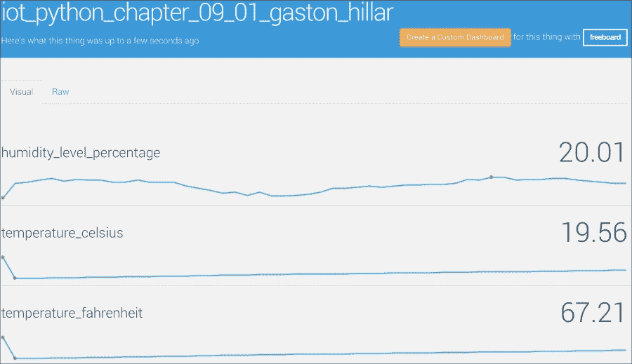

点击**原始**视图，页面将显示板子上运行的 Python 代码通过`dweet.io`为我们的设备发布的最新 JSON 数据。以下行显示了之前图片中显示的接收到的最新 JSON 数据示例：

```py
{
  "humidity_level_percentage": 20.01,
  "temperature_celsius": 19.56,
  "temperature_fahrenheit": 67.21
}
```

在 第四章 中，*使用 RESTful API 和脉冲宽度调制*，我们安装了 HTTPie，这是一个用 Python 编写的命令行 HTTP 客户端，它使得发送 HTTP 请求变得容易，并且使用的语法比 curl（也称为 cURL）更容易。我们可以在任何计算机或设备上运行以下 HTTPie 命令来检索为我们的事物创建的最新 dweet。

```py
http -b https://dweet.io:443/get/latest/dweet/for/iot_python_chapter_09_01_gaston_hillar
```

之前的命令将组成并发送以下 HTTP 请求：`GET https://dweet.io:443/get/latest/dweet/for/iot_python_chapter_09_01_gaston_hillar`。`dweet.io` API 将返回指定事物的最新 dweet。以下几行显示了 `dweet.io` 的一个示例响应。JSON 数据包含在 `content` 键的值中。

```py
{
    "by": "getting", 
    "the": "dweets", 
    "this": "succeeded", 
    "with": [
        {
            "content": {
                "humidity_level_percentage": 19.92, 
                "temperature_celsius": 20.06, 
                "temperature_fahrenheit": 68.11
            }, 
            "created": "2016-03-27T00:11:12.598Z", 
            "thing": "iot_python_chapter_09_01_gaston_hillar"
        }
    ]
}
```

我们可以在任何计算机或设备上运行以下 HTTPie 命令来检索我们事物的所有已保存 dweets。

```py
http -b https://dweet.io:443/get/ dweets/for/iot_python_chapter_09_01_gaston_hillar
```

之前的命令将组成并发送以下 HTTP 请求：`GET https://dweet.io:443/get/dweets/for/iot_python_chapter_09_01_gaston_hillar`。`dweet.io` API 将返回指定事物的长期存储中保存的 dweets。以下几行显示了 `dweet.io` 的一个示例响应。请注意，长期存储中存储的 dweets 数量和返回的值都有限制。

```py
{
    "by": "getting", 
    "the": "dweets", 
    "this": "succeeded", 
    "with": [
         {
            "content": {
                "humidity_level_percentage": 19.94, 
                "temperature_celsius": 20.01, 
                "temperature_fahrenheit": 68.02
            }, 
            "created": "2016-03-27T00:11:00.554Z", 
            "thing": "iot_python_chapter_09_01_gaston_hillar"
        }, 
        {
            "content": {
                "humidity_level_percentage": 19.92, 
                "temperature_celsius": 19.98, 
                "temperature_fahrenheit": 67.96
            }, 
            "created": "2016-03-27T00:10:49.823Z", 
            "thing": "iot_python_chapter_09_01_gaston_hillar"
        }, 
        {
            "content": {
                "humidity_level_percentage": 19.92, 
                "temperature_celsius": 19.95, 
                "temperature_fahrenheit": 67.91
            }, 
            "created": "2016-03-27T00:10:39.123Z", 
            "thing": "iot_python_chapter_09_01_gaston_hillar"
        }, 
        {
            "content": {
                "humidity_level_percentage": 19.91, 
                "temperature_celsius": 19.9, 
                "temperature_fahrenheit": 67.82
            }, 
            "created": "2016-03-27T00:10:28.394Z", 
            "thing": "iot_python_chapter_09_01_gaston_hillar"
        }
    ]
}
```

# 使用 Freeboard 构建 Web 仪表板

`dweet.io` 数据共享工具使我们能够仅用几行代码轻松地将数据发布到云端。现在，我们准备使用 `dweet.io` 和我们的设备名称作为数据源来构建一个实时基于网页的仪表板。我们将利用 freeboard.io 来可视化通过传感器收集并发布到 `dweet.io` 的数据，并在许多仪表中展示仪表板，使其可供世界各地的不同计算机和设备使用。Freeboard.io 将自己定义为一种基于云的服务，允许我们可视化物联网。您可以在其网页上了解更多关于 freeboard.io 的信息：[`freeboard.io`](http://freeboard.io)。

### 小贴士

在我们的示例中，我们将利用 freeboard.io 提供的免费服务，而不会使用一些提供隐私但需要付费订阅的高级功能。由于我们不处理私有仪表板，因此任何拥有其唯一 URL 的人都可以访问我们的仪表板。

Freeboard 要求我们在构建基于网页的仪表板之前注册并使用有效的电子邮件地址和密码创建一个账户。我们不需要输入任何信用卡或支付信息。如果您已经在 freeboard.io 上有账户，您可以跳过下一步。

在您的网络浏览器中访问[`freeboard.io`](http://freeboard.io)并点击**立即开始**。您也可以通过访问[`freeboard.io/signup`](https://freeboard.io/signup)达到相同的目的。在**选择用户名**中输入您想要的用户名，在**输入您的电子邮件**中输入您的电子邮件，在**创建密码**中输入您想要的密码。一旦填写完所有字段，点击**创建我的账户**。

创建账户后，您可以在网络浏览器中访问[`freeboard.io`](http://freeboard.io)并点击**登录**。您也可以通过访问[`freeboard.io/login`](https://freeboard.io/login)达到相同的目的。然后，输入您的用户名或电子邮件和密码，并点击**登录**。Freeboard 将显示您的免费板，也称为仪表板。

在**创建新**按钮左侧的**输入名称**文本框中输入`环境温度和湿度`，然后点击此按钮。Freeboard.io 将显示一个空白的仪表板，其中包含许多按钮，允许我们添加面板和数据源等。以下图片显示了空白的仪表板截图。


点击**数据源**下方的**添加**，网站将打开**数据源**对话框。在**类型**下拉菜单中选择**Dweet.io**，对话框将显示定义`dweet.io`数据源所需的字段。

在**名称**中输入`环境温度和湿度`，在**设备名称**中输入我们之前用于`dweet.io`的设备名称。请记住，我们曾使用`iot_python_chapter_09_01_gaston_hillar`来命名我们的物联网设备，但您已将其替换为不同的名称。如果您输入的名称与您在处理`dweet.io`时使用的名称不匹配，数据源将不会显示适当的数据。以下图片显示了使用示例设备名称的`dweet.io`数据源配置的截图。

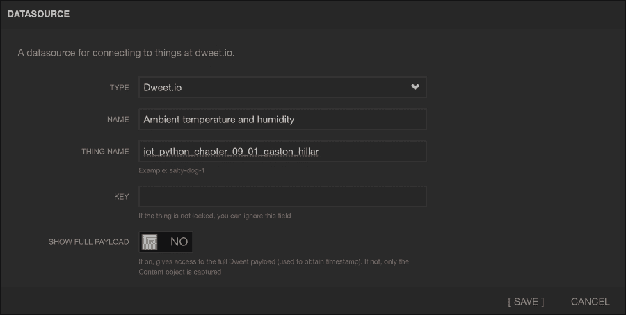

点击**保存**，数据源将出现在**数据源**下方的列表中。由于仪表板正在运行 dweeting 的 Python 代码，因此**最后更新**下显示的时间将每 10 秒更改一次。如果时间每 10 秒不更改，则意味着数据源配置错误或仪表板不再运行 dweeting 的 Python 代码。

点击**添加面板**以向仪表板添加一个新的空白面板。然后，点击新空白面板右上角的加号（**+**），Freeboard 将显示**小部件**对话框。

在**类型**下拉菜单中选择**量规**，对话框将显示添加量规小部件到仪表板面板中所需的字段。在**标题**中输入`华氏温度`。

在**值**文本框的右侧点击**+ 数据源**，选择**环境温度和湿度**，然后选择**temperature_fahrenheit**。在您做出选择后，以下文本将出现在**值**文本框中：`datasources ["Ambient temperature and humidity"] ["temperature_fahrenheit"]`。

在**单位**中输入`ºF`，在**最小值**中输入`-30`，在**最大值**中输入`130`。然后，点击**保存**，Freeboard 将关闭对话框并将新的仪表添加到之前创建的仪表板窗格中。仪表将显示代码在板上最后一次 dweet 的环境温度的最新值，即代码最后发布到`dweet.io`的 JSON 数据中`temperature_fahrenheit`键的值。以下图片显示了**环境温度和湿度**数据源显示的最后更新时间和显示华氏度测量的环境温度的最新值的仪表。

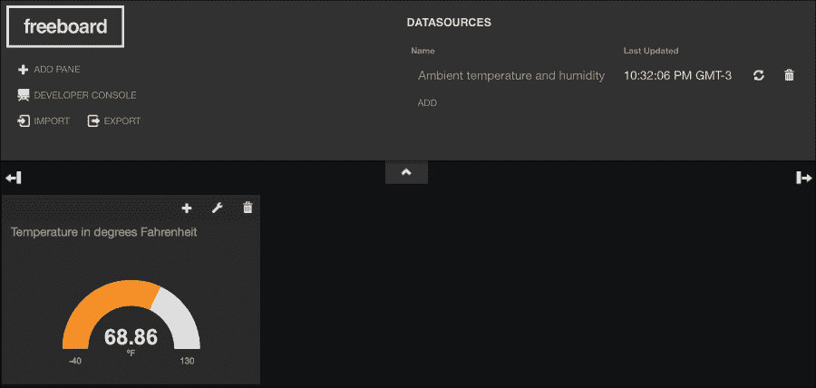

点击**添加窗格**以向仪表板添加另一个新的空窗格。然后，点击新空窗格右上角的加号（**+**），Freeboard 将显示**小部件**对话框。

在**类型**下拉菜单中选择**仪表**，对话框将显示添加仪表小部件到仪表板窗格所需的字段。在**标题**中输入`Humidity level in percentage`。

在**值**文本框的右侧点击**+ 数据源**，选择**环境温度和湿度**，然后选择**humidity_level_percentage**。在您做出选择后，以下文本将出现在**值**文本框中：`datasources ["Ambient temperature and humidity"] ["humidity_level_percentage"]`。

在**单位**中输入`%`，在**最小值**中输入`0`，在**最大值**中输入`100`。然后，点击**保存**，Freeboard 将关闭对话框并将新的仪表添加到之前创建的仪表板窗格中。仪表将显示代码在板上最后一次 dweet 的周围湿度水平的最新值，即代码最后发布到`dweet.io`的 JSON 数据中`humidity_level_percentage`键的值。以下图片显示了**环境温度和湿度**数据源显示的最后更新时间和显示华氏度测量的环境温度的最新值的仪表。

现在，点击显示华氏度和 Freeboard 的窗格右上角的加号（**+**），Freeboard 将显示**小部件**对话框。

在**类型**下拉菜单中选择**仪表**，对话框将显示添加仪表小部件到仪表板窗格所需的字段。在**标题**中输入`Temperature in degrees Celsius`。

点击**值**文本框右侧的**+ Datasource**，选择**环境温度和湿度**，然后选择**temperature_celsius**。在做出选择后，以下文本将出现在**值**文本框中：`datasources ["Ambient temperature and humidity"] ["temperature_celsius"]`。

在**单位**中输入`ºC`，在**最小值**中输入`-40`，在**最大值**中输入`55`。然后，点击**保存**，Freeboard 将关闭对话框并将新的仪表添加到仪表板中之前存在的窗格内。这样，窗格将显示两个仪表，温度以两种不同的单位表示。新的仪表将显示代码在板上 dweeted 的最新值，即环境温度的值，即代码在最后一次发布到 `dweet.io` 的 JSON 数据中的 `temperature_celsius` 键的值。

现在，点击显示两个温度的窗格右侧的**+**按钮旁边的配置图标。Freeboard 将显示**窗格**对话框。在**标题**中输入`Temperature`，然后点击**保存**。

点击显示湿度水平的窗格右侧的**+**按钮旁边的配置图标。Freeboard 将显示**窗格**对话框。在**标题**中输入`Humidity`，然后点击**保存**。

将窗格拖放到位置，将**湿度**窗格放置在**温度**窗格的左侧。以下图片显示了我们所构建的仪表板，其中包含两个窗格和三个仪表，当在英特尔 Galileo Gen 2 板上运行的代码 dweets 新数据时，这些仪表会自动刷新数据。

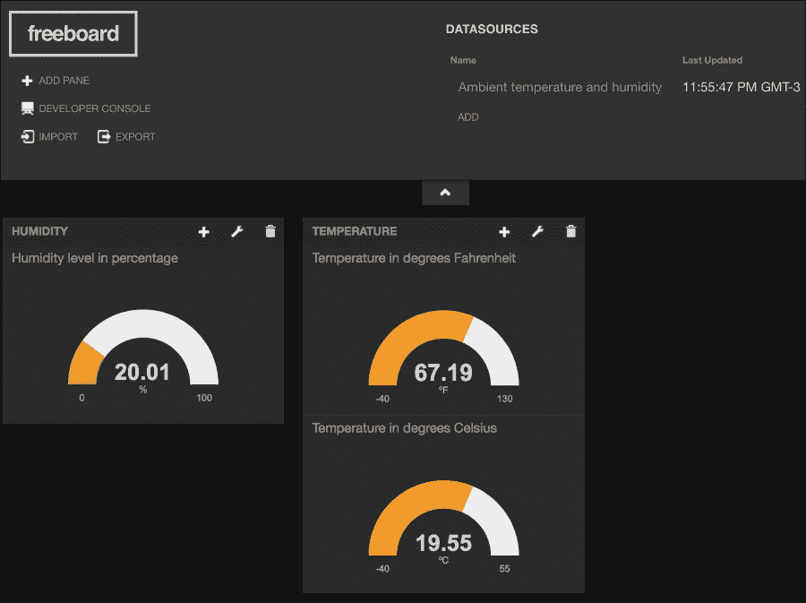

### 小贴士

我们可以通过输入我们在与仪表板一起工作时网页浏览器显示的 URL 来在任何设备上访问最近构建的仪表板。URL 由 `https://freeboard.io/board/` 前缀后跟字母和数字组成。例如，如果 URL 是 `https://freeboard.io/board/EXAMPLE`，我们只需将其输入到任何设备或计算机上运行的任何网页浏览器中，我们就可以查看仪表，并且当从我们的英特尔 Galileo Gen 2 板向 `dweet.io` 发布新数据时，它们会刷新。

将 `dweet.io` 作为我们的数据源和 freeboard.io 作为我们的基于网页的仪表板结合起来，使我们能够轻松地使用任何提供网页浏览器的设备来监控连接到我们的英特尔 Galileo Gen 2 板的传感器获取的数据。这两个基于云的物联网服务的结合只是我们如何轻松结合不同服务的一个例子。物联网云服务的数量正在增加，这些服务可以用于我们的解决方案中。

# 通过 PubNub 在互联网上实时发送和接收数据

在第四章中，*使用 RESTful API 和脉冲宽度调制*，我们开发和使用了 RETful API，它允许我们通过 HTTP 请求控制连接到我们的 Intel Galileo Gen 2 板上的电子组件。现在，我们希望通过互联网实时发送和接收数据，而 RESTful API 并不是做这件事的最合适选项。相反，我们将使用基于比 HTTP 协议更轻量级的协议的发布/订阅模型。具体来说，我们将使用基于**MQTT**（即**MQ Telemetry Transport**）协议的服务。

MQTT 协议是一种**机器到机器**（简称**M2M**）和物联网连接协议。MQTT 是一个轻量级消息协议，它运行在 TCP/IP 协议之上，并使用发布/订阅机制。任何设备都可以订阅特定的频道（也称为主题），并会接收到发布到该频道的所有消息。此外，设备可以向该频道或其他频道发布消息。该协议在物联网和 M2M 项目中变得越来越受欢迎。你可以在以下网页上了解更多关于 MQTT 协议的信息：[`mqtt.org`](http://mqtt.org)。

PubNub 提供了许多基于云的服务，其中之一允许我们轻松地实时流数据和向任何设备发送信号，在底层使用 MQTT 协议。我们将利用这个 PubNub 服务通过互联网实时发送和接收数据，并使通过互联网控制我们的 Intel Galileo Gen 2 板变得容易。由于 PubNub 提供了一个具有高质量文档和示例的 Python API，因此使用 Python 来使用该服务非常简单。PubNub 将自己定义为物联网、移动和 Web 应用的全球数据流网络。你可以在其网页上了解更多关于 PubNub 的信息：[`www.pubnub.com`](http://www.pubnub.com)。

### 小贴士

在我们的示例中，我们将利用 PubNub 提供的免费服务，而不会使用一些可能增强我们的物联网项目连接需求但需要付费订阅的高级功能和附加服务。

PubNub 要求我们在创建应用程序之前先注册并使用有效的电子邮件和密码创建一个账户，该应用程序允许我们开始使用他们的免费服务。我们不需要输入任何信用卡或支付信息。如果你已经在 PubNub 有账户，你可以跳过下一步。

一旦你创建了账户，PubNub 将把你重定向到**管理门户**，该门户列出了你的 PubNub 应用程序。为了在网络上发送和接收消息，你需要生成你的 PubNub 发布和订阅密钥。管理门户中的一个新面板将代表应用程序。以下截图显示了 PubNub 管理门户中的温度控制应用程序面板：

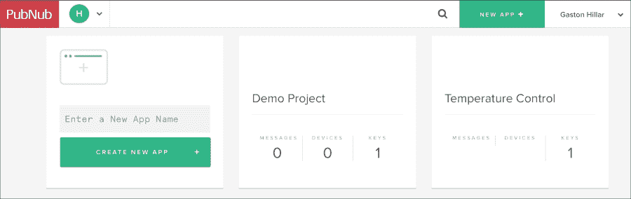

单击**温度控制**面板，PubNub 将显示为应用程序自动生成的**演示密钥集**面板。单击此面板，PubNub 将显示发布、订阅和密钥。我们必须复制并粘贴这些密钥中的每一个，以便在我们的代码中使用它们来发布消息并订阅它们。以下截图显示了密钥的前缀和图像中已擦除的剩余字符：

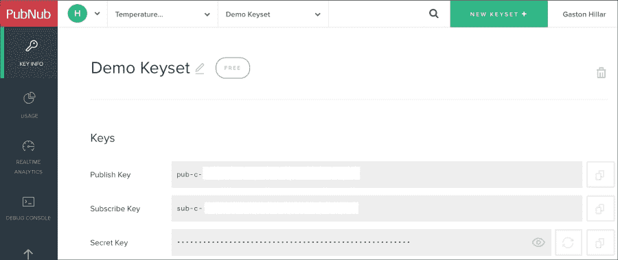

为了复制密钥，您必须单击密钥右侧的眼睛图标，PubNub 将使所有字符可见。

在第二章，*在英特尔 Galileo Gen 2 上使用 Python*中，我们安装了`pip`安装程序，以便在板子上运行的 Yocto Linux 中轻松安装额外的 Python 2.7.3 软件包。现在，我们将使用`pip`安装程序安装 PubNub Python SDK 3.7.6。我们只需在 SSH 终端中运行以下命令即可安装该软件包。请注意，安装可能需要几分钟时间。

```py
pip install pubnub
```

输出的最后几行将指示`pubnub`软件包已成功安装。不要担心与构建 wheel 相关的错误消息和不安全平台警告。

```py
  Downloading pubnub-3.7.6.tar.gz
Collecting pycrypto>=2.6.1 (from pubnub)
  Downloading pycrypto-2.6.1.tar.gz (446kB)
    100% |################################| 446kB 25kB/s 
Requirement already satisfied (use --upgrade to upgrade): requests>=2.4.0 in /usr/lib/python2.7/site-packages (from pubnub)
Installing collected packages: pycrypto, pubnub
  Running setup.py install for pycrypto
Installing collected packages: pycrypto, pubnub
  Running setup.py install for pycrypto
Running setup.py install for pubnub
Successfully installed pubnub-3.7.6 pycrypto-2.6.1
```

我们将使用我们在上一章中编写的代码，当时我们从传感器读取温度和湿度值，我们在 OLED 矩阵中打印了这些值，并通过旋转伺服电机的轴来显示以华氏度表示的测量温度。示例代码文件为`iot_python_chapter_08_03.py`。我们将以此代码为基础，添加新功能，使我们能够执行以下操作，使用 PubNub 消息发送到特定通道的任何具有网络浏览器的设备：

+   通过旋转伺服电机的轴来显示作为消息一部分接收到的华氏温度值。

+   在 OLED 矩阵的底部显示作为消息一部分接收到的文本行。

我们将使用最近安装的 `pubnub` 模块来订阅特定频道，并在接收到该频道上的消息时运行代码。我们将创建一个 `MessageChannel` 类来表示通信通道，配置 PubNub 订阅并声明当某些事件被触发时要执行的回调代码。示例代码文件为 `iot_python_chapter_09_02.py`。请记住，我们使用代码文件 `iot_python_chapter_08_03.py` 作为基线，因此，我们将把类添加到现有代码文件中，并创建一个新的 Python 文件。不要忘记将 `__init__` 方法中分配给 `publish_key` 和 `subscribe_key` 局部变量的字符串替换为从之前解释的 PubNub 密钥生成过程中检索到的值。

```py
import time
from pubnub import Pubnub

class MessageChannel:
    command_key = "command"

    def __init__(self, channel, temperature_servo, oled):
        self.temperature_servo = temperature_servo
        self.oled = oled
        self.channel = channel
        # Publish key is the one that usually starts with the "pub-c-" prefix
        # Do not forget to replace the string with your publish key
        publish_key = "pub-c-xxxxxxxx-xxxx-xxxx-xxxx-xxxxxxxxxxxx"
        # Subscribe key is the one that usually starts with the "sub-c" prefix
        # Do not forget to replace the string with your subscribe key
        subscribe_key = "sub-c-xxxxxxxx-xxxx-xxxx-xxxx-xxxxxxxxxxxx"
        self.pubnub = Pubnub(publish_key=publish_key, subscribe_key=subscribe_key)
        self.pubnub.subscribe(channels=self.channel,
                              callback=self.callback,
                              error=self.callback,
                              connect=self.connect,
                              reconnect=self.reconnect,
                              disconnect=self.disconnect)

    def callback(self, message, channel):
        if channel == self.channel:
            if self.__class__.command_key in message:
                if message[self.__class__.command_key] == "print_temperature_fahrenheit":
                    self.temperature_servo.print_temperature(message["temperature_fahrenheit"])
                elif message[self.__class__.command_key] == "print_information_message":
                    self.oled.print_line(11, message["text"])
            print("I've received the following message: {0}".format(message))

    def error(self, message):
        print("Error: " + str(message))

    def connect(self, message):
        print("Connected to the {0} channel".
              format(self.channel))
        print(self.pubnub.publish(
            channel=self.channel,
            message="Listening to messages in the Intel Galileo Gen 2 board"))

    def reconnect(self, message):
        print("Reconnected to the {0} channel".
              format(self.channel))

    def disconnect(self, message):
        print("Disconnected from the {0} channel".
              Format(self.channel))
```

`MessageChannel` 类声明了 `command_key` 类属性，它定义了代码将理解为何种命令的关键字符串。每当收到包含指定关键字符串的消息时，我们知道与该键关联的字典中的值将指示消息希望代码在板上处理的命令。每个命令都需要额外的键值对，以提供执行命令所需的信息。

我们必须指定 PubNub 频道名称，`channel` 中的 `TemperatureServo` 实例，`Oled` 实例所需的 `temperature_servo` 和 `oled` 参数。构造函数，即 `__init__` 方法，将接收到的参数保存在具有相同名称的三个属性中。`channel` 参数指定了我们将订阅以监听发送到该频道的消息的 PubNub 频道。我们还将向该频道发布消息，因此，我们将成为该频道的订阅者和发布者。

### 小贴士

在这种情况下，我们只会订阅一个频道。然而，非常重要的一点是，我们并不仅限于订阅单个频道，我们可能订阅多个频道。

然后，构造函数声明了两个局部变量：`publish_key` 和 `subscribe_key`。这些局部变量保存了我们使用 PubNub 管理门户生成的发布和订阅密钥。然后，代码使用 `publish_key` 和 `subscribe_key` 作为参数创建一个新的 `Pubnub` 实例，并将新实例的引用保存在 `pubnub` 属性中。最后，代码调用新实例的 `subscribe` 方法来订阅保存在 `channel` 属性中的频道上的数据。在底层，`subscribe` 方法使客户端创建一个到包含 MQTT 代理的 PubNub 网络的开放 TCP 套接字，并开始监听指定频道上的消息。对这个方法的调用指定了在 `MessageChannel` 类中声明的许多方法，以下为命名参数：

+   `callback`：指定在从通道接收到新消息时将被调用的函数

+   `error`：指定在错误事件上将被调用的函数

+   `connect`：指定当与 PubNub 云成功建立连接时将被调用的函数

+   `reconnect`：指定当与 PubNub 云成功重新连接完成后将被调用的函数

+   `disconnect`：指定当客户端从 PubNub 云断开连接时将被调用的函数

这样，每当之前列举的事件之一发生时，指定的方法将被执行。`callback`方法接收两个参数：`message`和`channel`。首先，该方法检查接收到的`channel`是否与`channel`属性中的值匹配。在这种情况下，每当`callback`方法执行时，`channel`参数中的值将始终与`channel`属性中的值匹配，因为我们刚刚订阅了一个通道。然而，如果我们订阅了多个通道，则始终有必要检查消息是在哪个通道中发送的，以及我们在哪个通道接收消息。

然后，代码检查`command_key`类属性是否包含在`message`字典中。如果表达式评估为`True`，则表示消息包含我们必须处理的命令。然而，在我们能够处理该命令之前，我们必须检查是哪个命令，因此，有必要检索与`command_key`类属性等效的键的值。当值是以下两个命令中的任何一个时，代码能够执行代码：

+   `print_temperature_fahrenheit`：该命令必须在`temperature_fahrenheit`键的值中指定以华氏度表示的温度值。代码使用从字典中检索到的温度值作为参数调用`self.temperature_servo.print_temperature`方法。这样，代码就根据消息中包含该命令指定的温度值移动伺服电机的轴。

+   `print_information_message`：该命令必须在`print_information_message`键的值中指定要在 OLED 矩阵底部显示的文本行。代码使用`self.oled.print_line`方法，并带有`11`和从字典中检索到的文本值作为参数调用。这样，代码就在 OLED 矩阵的底部显示了包含该命令的消息中接收到的文本。

无论消息是否包含有效的命令，该方法都会在控制台输出中打印它接收到的原始消息。

`connect` 方法打印一条消息，表明已与通道建立了连接。然后，该方法打印调用 `self.pubnub.publish` 方法的结果，该方法在 `self.channel` 保存的通道名称中发布消息：`"Listening to messages in the Intel Galileo Gen 2 board"`。在这种情况下，对该方法的调用是同步执行的。我们将在下一个示例中为此方法使用异步执行。

在此时，我们已订阅此通道，因此，我们将接收到之前发布的消息，并且回调方法将使用此消息作为参数执行。然而，由于消息不包含标识命令的密钥，回调方法中的代码将仅显示接收到的消息，而不会处理之前分析过的任何命令。

在 `MessageChannel` 类中声明的其他方法只是将事件发生的信息显示到控制台输出。

现在，我们将使用之前编写的 `MessageChannel` 类来创建一个新版本的 `__main__` 方法，该方法使用 PubNub 云接收和处理命令。新版本在环境温度变化时不会旋转伺服电机的轴，相反，它将在接收到来自连接到 PubNub 云的任何设备的适当命令时执行此操作。以下行显示了 `__main__` 方法的新版本。示例的代码文件为 `iot_python_chapter_09_02.py`。

```py
if __name__ == "__main__":
    temperature_and_humidity_sensor = \
        TemperatureAndHumiditySensor(0)
    oled = TemperatureAndHumidityOled(0)
    temperature_servo = TemperatureServo(3)
 message_channel = MessageChannel("temperature", temperature_servo, oled)
    while True:
        temperature_and_humidity_sensor.\
            measure_temperature_and_humidity()
        oled.print_temperature(
            temperature_and_humidity_sensor.temperature_fahrenheit,
            temperature_and_humidity_sensor.temperature_celsius)
        oled.print_humidity(
            temperature_and_humidity_sensor.humidity)
        print("Ambient temperature in degrees Celsius: {0}".
              format(temperature_and_humidity_sensor.temperature_celsius))
        print("Ambient temperature in degrees Fahrenheit: {0}".
              format(temperature_and_humidity_sensor.temperature_fahrenheit))
        print("Ambient humidity: {0}".
              format(temperature_and_humidity_sensor.humidity))
        # Sleep 10 seconds (10000 milliseconds)
        time.sleep(10)
```

突出的行创建了一个之前编写的 `MessageChannel` 类的实例，参数为 `"temperature"`、`temperature_servo` 和 `oled`。构造函数将订阅 PubNub 云中的 `temperature` 通道，因此，我们必须向此通道发送消息，以便发送代码将异步执行的命令。循环将读取传感器的值并将值打印到控制台，就像代码的先前版本一样，因此，我们将在循环中运行代码，同时我们也将有代码在 PubNub 云的 `temperature` 通道中监听消息。我们将在稍后开始示例，因为我们想在板上运行代码之前，在 PubNub 调试控制台中订阅通道。

# 通过 PubNub 云发布带有命令的消息

现在，我们将利用 PubNub 控制台向 `temperature` 通道发送带有命令的消息，并使板上的 Python 代码处理这些命令。如果你已经从 PubNub 登出，请重新登录并点击 **Admin Portal** 中的 **Temperature Control** 面板。PubNub 将显示 **Demo Keyset** 面板。

点击 **Demo Keyset** 面板，PubNub 将显示发布、订阅和密钥。这样，我们选择我们想要用于我们的 PubNub 应用的密钥集。

点击屏幕左侧侧边栏上的 **调试控制台**。PubNub 将为默认通道创建一个客户端，并使用我们在上一步中选择的密钥订阅此通道。我们想订阅 `temperature` 通道，因此，在包含 **添加客户端** 按钮的面板中的 **默认通道** 文本框中输入 `temperature`。然后，点击 **添加客户端**，PubNub 将添加一个带有随机客户端名称的新的面板，第二行是通道名称 `temperature`。PubNub 使客户端订阅此通道，我们就能接收发布到此通道的消息，并向此通道发送消息。以下图片显示了名为 **Client-ot7pi** 的生成客户端的面板，已订阅 `temperature` 通道。注意，当您按照解释的步骤操作时，客户端名称将不同。

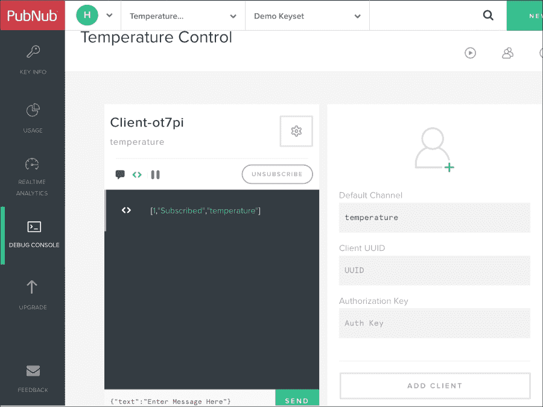

客户端面板显示了 PubNub 订阅客户端到通道时生成的输出。PubNub 为每个命令返回一个格式化的响应。在这种情况下，它表示状态等于 `Subscribed`，通道名称为 `temperature`。

```py
[1,"Subscribed","temperature"]
```

现在，是时候在英特尔 Galileo Gen 2 板上运行示例了。以下行将在 SSH 控制台中启动示例：

```py
python iot_python_chapter_09_02.py
```

运行示例后，转到您正在使用 PubNub 调试控制台的 Web 浏览器。您将看到以下消息在之前创建的客户端中列出：

```py
"Listening to messages in the Intel Galileo Gen 2 board"
```

在板上运行的 Python 代码发布了这条消息，具体来说，是 `MessageChannel` 类中的 `connect` 方法在应用程序与 PubNub 云建立连接后发送了这条消息。下面的图片显示了之前创建的客户端中列出的消息。注意，文本左侧的图标表示这是一条消息。另一条消息是一个调试消息，包含了订阅通道的结果。

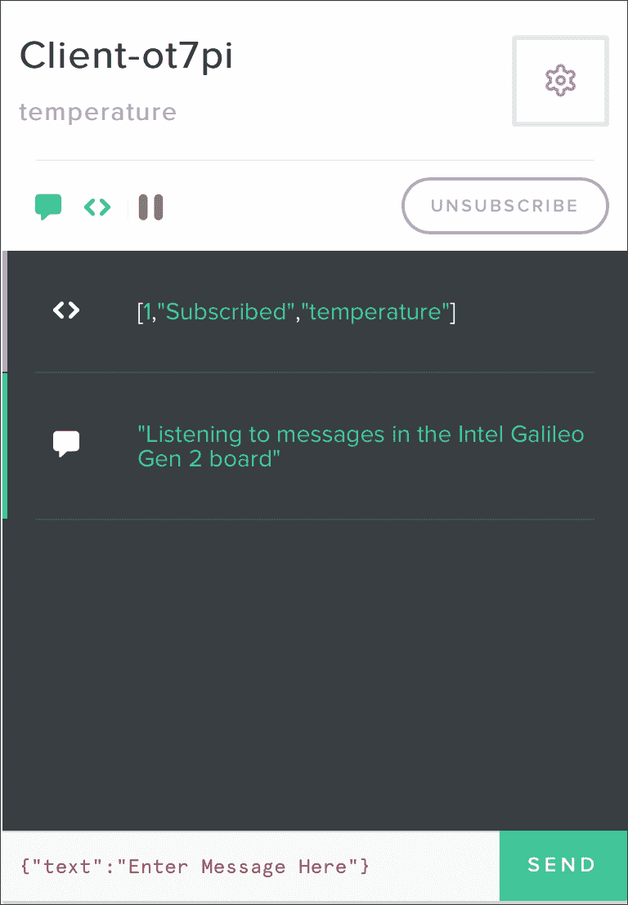

在客户端面板的底部，您将看到以下文本和位于右侧的 **发送** 按钮：

```py
{"text":"Enter Message Here"}
```

现在，我们将用一条消息替换之前显示的文本。输入以下 JSON 代码并点击 **发送**：

```py
{"command":"print_temperature_fahrenheit", "temperature_fahrenheit": 50 }
```

### 小贴士

在其中输入消息的文本编辑器在某些浏览器中存在一些问题。因此，使用您喜欢的文本编辑器输入 JSON 代码，复制它，然后将其粘贴以替换消息文本中默认包含的文本是方便的。

点击**发送**后，客户端日志中会出现以下几行。第一行是一个包含发布消息结果的调试消息，并表明消息已被发送。格式化响应包括一个数字（`1`条消息）、状态（`Sent`）和时间戳。第二行是到达通道的消息，因为我们订阅了`temperature`通道，也就是说，我们也收到了我们发送的消息。

```py
[1,"Sent","14594756860875537"]
{
  "command": "print_temperature_fahrenheit",
  "temperature_fahrenheit": 50
}
```

以下图片展示了点击**发送**按钮后 PubNub 客户端的消息和调试消息日志：

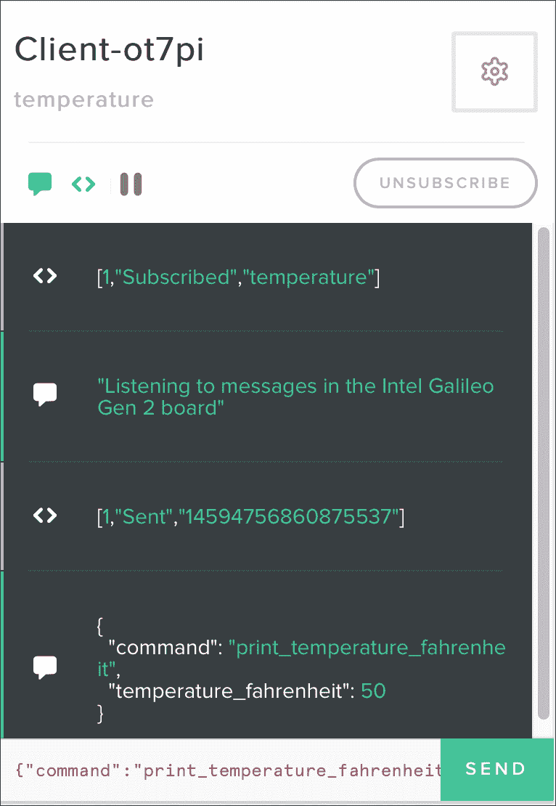

在发布上一条消息后，你将在 Intel Galileo Gen 2 板的 SSH 控制台中看到以下输出。你会注意到伺服电机的轴旋转到 50 度。

```py
I've received the following message: {u'command': u'print_temperature_fahrenheit', u'temperature_fahrenheit': 50}
```

现在，输入以下 JSON 代码并点击**发送**：

```py
{"command":"print_information_message", "text": "Client ready"}
```

点击**发送**后，客户端日志中会出现以下几行。第一行是一个调试消息，包含之前解释过的格式化响应，显示了发布消息的结果，并表明消息已被发送。格式化响应包括一个数字（`1`条消息）、状态（`Sent`）和时间戳。第二行是到达通道的消息，因为我们订阅了`temperature`通道，也就是说，我们也收到了我们发送的消息。

```py
 [1,"Sent","14594794434885921"]
 {
  "command": "print_information_message",
  "text": "Client ready"
}
```

以下图片展示了点击**发送**按钮后 PubNub 客户端的消息和调试消息日志。

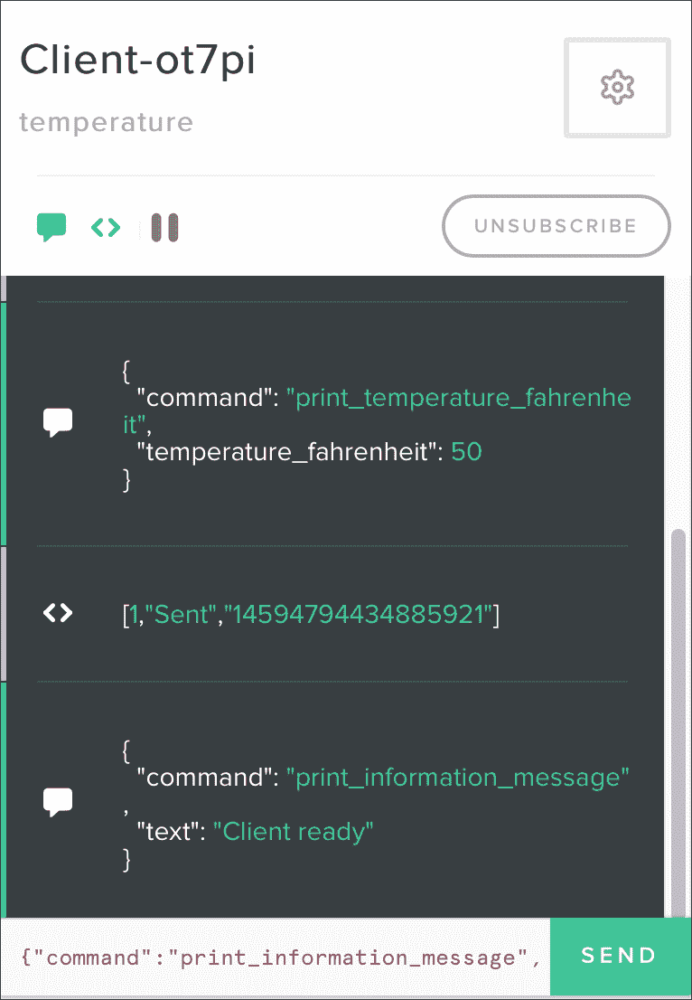

发布上一条消息后，你将在 Intel Galileo Gen 2 板的 SSH 控制台中看到以下输出。你将在 OLED 矩阵的底部看到以下文本：`Client ready`。

```py
I've received the following message: {u'text': u'Client ready', u'command': u'print_information_message'}
```

当我们使用命令发布了两条消息时，我们肯定注意到了一个问题。我们不知道在运行在物联网设备上的代码（即 Intel Galileo Gen 2 板）中，命令是否被处理。我们知道板子已经开始监听温度通道的消息，但在命令处理完毕后，我们没有从物联网设备收到任何类型的响应。

# 处理双向通信

我们可以轻松地添加几行代码，在接收消息的同一条通道上发布消息，以指示命令已成功处理。我们将使用之前的示例作为基准，并创建`MessageChannel`类的新版本。代码文件是`iot_python_chapter_09_02.py`。别忘了在`__init__`方法中将分配给`publish_key`和`subscribe_key`局部变量的字符串替换为之前解释过的 PubNub 密钥生成过程中检索到的值。以下几行展示了发布消息后命令已成功处理的`MessageChannel`类的新版本。示例代码文件是`iot_python_chapter_09_03.py`。

```py
import time
from pubnub import Pubnub

class MessageChannel:
    command_key = "command"
 successfully_processed_command_key = "successfully_processed_command"

    def __init__(self, channel, temperature_servo, oled):
        self.temperature_servo = temperature_servo
        self.oled = oled
        self.channel = channel
        # Do not forget to replace the string with your publish key
        publish_key = "pub-c-xxxxxxxx-xxxx-xxxx-xxxx-xxxxxxxxxxxx"
        # Subscribe key is the one that usually starts with the "sub-c" prefix
        # Do not forget to replace the string with your subscribe key
        subscribe_key = "sub-c-xxxxxxxx-xxxx-xxxx-xxxx-xxxxxxxxxxxx"
        self.pubnub = Pubnub(publish_key=publish_key, subscribe_key=subscribe_key)
        self.pubnub.subscribe(channels=self.channel,
                              callback=self.callback,
                              error=self.callback,
                              connect=self.connect,
                              reconnect=self.reconnect,
                              disconnect=self.disconnect)

 def callback_response_message(self, message):
 print("I've received the following response from PubNub cloud: {0}".format(message))

 def error_response_message(self, message):
 print("There was an error when working with the PubNub cloud: {0}".format(message))

 def publish_response_message(self, message):
 response_message = {
 self.__class__.successfully_processed_command_key:
 message[self.__class__.command_key]}
 self.pubnub.publish(
 channel=self.channel,
 message=response_message,
 callback=self.callback_response_message,
 error=self.error_response_message)

    def callback(self, message, channel):
        if channel == self.channel:
            print("I've received the following message: {0}".format(message))
            if self.__class__.command_key in message:
                if message[self.__class__.command_key] == "print_temperature_fahrenheit":
                    self.temperature_servo.print_temperature(message["temperature_fahrenheit"])
 self.publish_response_message(message)
                elif message[self.__class__.command_key] == "print_information_message":
                    self.oled.print_line(11, message["text"])
 self.publish_response_message(message)

    def error(self, message):
        print("Error: " + str(message))

    def connect(self, message):
        print("Connected to the {0} channel".
              format(self.channel))
        print(self.pubnub.publish(
            channel=self.channel,
            message="Listening to messages in the Intel Galileo Gen 2 board"))

    def reconnect(self, message):
        print("Reconnected to the {0} channel".
              format(self.channel))

    def disconnect(self, message):
        print("Disconnected from the {0} channel".
              format(self.channel))
```

之前代码中突出显示的`MessageChannel`类新版本的代码行显示了我们对代码所做的更改。首先，代码声明了`successfully_processed_command_key`类属性，该属性定义了代码将在发布到通道的响应消息中使用的关键字符串，作为成功处理的命令键。每次我们发布包含指定键字符串的消息时，我们知道与该键关联的字典中的值将指示板已成功处理的命令。

代码声明了以下三个新方法：

+   `callback_response_message`：此方法将用作在成功处理的命令响应消息发布到通道时执行的回调。该方法仅打印 PubNub 在通道中成功发布消息时返回的格式化响应。在这种情况下，`message`参数不包含已发布的原始消息，而是包含格式化响应。我们使用`message`作为参数名称以保持与 PubNub API 的一致性。

+   `error_response_message`：此方法将用作在尝试将成功处理的命令响应消息发布到通道时发生错误时执行的回调。该方法仅打印 PubNub 在通道中未成功发布消息时返回的错误消息。

+   `publish_response_message`：此方法接收包含在`message`参数中成功处理的命令的消息。代码创建一个`response_message`字典，其中`successfully_processed_command_key`类属性作为键，消息字典中`command_key`类属性指定的键的值作为值。然后，代码调用`self.pubnub.publish`方法将`response_message`字典发布到存储在`channel`属性中的通道。对此方法的调用指定`self.callback_response_message`作为在消息成功发布时执行的回调，以及`self.error_response_message`作为在发布过程中发生错误时执行的回调。当我们指定回调时，发布方法以异步执行方式工作，因此执行是非阻塞的。消息的发布和指定的回调将在不同的线程中运行。

现在，在`MessageChannel`类中定义的`callback`方法向`publish_response_message`方法添加了一个调用，该调用以包含已成功处理命令的消息（`message`）作为参数。正如之前解释的那样，`publish_response_message`方法是非阻塞的，并且将在另一个线程中发布成功处理的消息时立即返回。

现在，是时候在 Intel Galileo Gen 2 板上运行示例了。以下行将在 SSH 控制台中启动示例：

```py
python iot_python_chapter_09_03.py
```

运行示例后，转到您与 PubNub 调试控制台一起工作的 Web 浏览器。您将在之前创建的客户中看到以下消息：

```py
"Listening to messages in the Intel Galileo Gen 2 board"
```

输入以下 JSON 代码并点击**发送**：

```py
{"command":"print_temperature_fahrenheit", "temperature_fahrenheit": 90 }
```

点击**发送**后，客户端日志中会出现以下行。最后一条消息是由板发布到频道的，表示 `print_temperature_fahrenheit` 命令已成功处理。

```py
[1,"Sent","14595406989121047"]
{
  "command": "print_temperature_fahrenheit",
  "temperature_fahrenheit": 90
}
{
  "successfully_processed_command": "print_temperature_fahrenheit"
}
```

以下图片展示了点击**发送**按钮后 PubNub 客户端的消息和调试消息日志：


发布之前的消息后，您将在 Intel Galileo Gen 2 板的 SSH 控制台中看到以下输出。您会注意到伺服电机的轴旋转到 90 度。该板还接收到了成功处理的命令消息，因为它订阅了发布消息的频道。

```py
I've received the following message: {u'command': u'print_temperature_fahrenheit', u'temperature_fahrenheit': 90}
I've received the following response from PubNub cloud: [1, u'Sent', u'14595422426124592']
I've received the following message: {u'successfully_processed_command': u'print_temperature_fahrenheit'}
```

现在，输入以下 JSON 代码并点击**发送**：

```py
{"command":"print_information_message", "text": "2nd message"}
```

点击**发送**后，客户端日志中会出现以下行。最后一条消息是由板发布到频道的，表示 `print_information_message` 命令已成功处理。

```py
[1,"Sent","14595434708640961"]
{
  "command": "print_information_message",
  "text": "2nd message"
}
{
  "successfully_processed_command": "print_information_message"
}
```

以下图片展示了点击**发送**按钮后 PubNub 客户端的消息和调试消息日志。

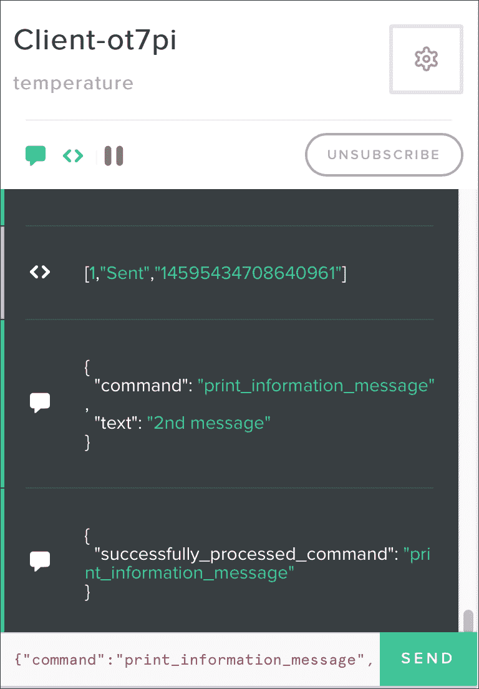

发布之前的消息后，您将在 Intel Galileo Gen 2 板的 SSH 控制台中看到以下输出。您将在 OLED 矩阵的底部看到以下文本：`2nd message`。该板还接收到了成功处理的命令消息，因为它订阅了发布消息的频道。

```py
I've received the following message: {u'text': u'2nd message', u'command': u'print_information_message'}
2nd message
I've received the following response from PubNub cloud: [1, u'Sent', u'14595434710438777']
I've received the following message: {u'successfully_processed_command': u'print_information_message'}
```

我们可以使用 PubNub 提供的不同 SDK 订阅和发布到频道。我们还可以通过向频道发布消息并处理它们，使不同的 IoT 设备相互通信。在这种情况下，我们只创建了一些命令，并没有添加关于必须处理命令的设备或生成特定消息的设备的详细信息。更复杂的 API 需要包含更多信息和安全性的命令。

# 使用 Python PubNub 客户端向云端发布消息

到目前为止，我们一直在使用 PubNub 调试控制台向 `temperature` 频道发布消息，并让 Intel Galileo Gen 2 板上的 Python 代码处理它们。现在，我们将编写一个 Python 客户端，它将向 `temperature` 频道发布消息。这样，我们将能够设计能够与 IoT 设备通信的应用程序，发布者端和订阅者设备端都使用 Python 代码。

我们可以在另一个 Intel Galileo Gen 2 板上或在安装了 Python 2.7.x 的任何设备上运行 Python 客户端。此外，代码将以 Python 3.x 运行。例如，我们可以在我们的计算机上运行 Python 客户端。我们只需确保在板上的 Yocto Linux 运行的 Python 版本中安装了之前用 pip 安装的 `pubnub` 模块。

我们将创建一个 `Client` 类来表示 PubNub 客户端，配置 PubNub 订阅，使其能够轻松发布带有命令和所需值的消息，并声明当某些事件触发时要执行的回调代码。示例代码文件为 `iot_python_chapter_09_04.py`。不要忘记将 `__init__` 方法中分配给 `publish_key` 和 `subscribe_key` 局部变量的字符串替换为从之前解释的 PubNub 密钥生成过程中检索到的值。以下行显示了 `Client` 类的代码：

```py
import time
from pubnub import Pubnub

class Client:
    command_key = "command"

    def __init__(self, channel):
        self.channel = channel
        # Publish key is the one that usually starts with the "pub-c-" prefix
        publish_key = "pub-c-xxxxxxxx-xxxx-xxxx-xxxx-xxxxxxxxxxxx"
        # Subscribe key is the one that usually starts with the "sub-c" prefix
        # Do not forget to replace the string with your subscribe key
        subscribe_key = "sub-c-xxxxxxxx-xxxx-xxxx-xxxx-xxxxxxxxxxxx"
        self.pubnub = Pubnub(publish_key=publish_key, subscribe_key=subscribe_key)
        self.pubnub.subscribe(channels=self.channel,
                              callback=self.callback,
                              error=self.callback,
                              connect=self.connect,
                              reconnect=self.reconnect,
                              disconnect=self.disconnect)

    def callback_command_message(self, message):
        print("I've received the following response from PubNub cloud: {0}".format(message))

    def error_command_message(self, message):
        print("There was an error when working with the PubNub cloud: {0}".format(message))

 def publish_command(self, command_name, key, value):
 command_message = {
 self.__class__.command_key: command_name,
 key: value}
 self.pubnub.publish(
 channel=self.channel,
 message=command_message,
 callback=self.callback_command_message,
 error=self.error_command_message)

    def callback(self, message, channel):
        if channel == self.channel:
            print("I've received the following message: {0}".format(message))

    def error(self, message):
        print("Error: " + str(message))

    def connect(self, message):
        print("Connected to the {0} channel".
              format(self.channel))
        print(self.pubnub.publish(
            channel=self.channel,
            message="Listening to messages in the PubNub Python Client"))

    def reconnect(self, message):
        print("Reconnected to the {0} channel".
              format(self.channel))

    def disconnect(self, message):
        print("Disconnected from the {0} channel".
              format(self.channel))
```

`Client` 类声明了 `command_key` 类属性，该属性定义了代码在消息中理解为何种命令的键字符串。我们的主要目标是构建并发布到指定频道的命令消息。我们必须在 `channel` 所需参数中指定 PubNub 频道名称。构造函数，即 `__init__` 方法，将接收到的参数保存在具有相同名称的属性中。我们将成为此频道的订阅者和发布者。

然后，构造函数声明了两个局部变量：`publish_key` 和 `subscribe_key`。这些局部变量保存了我们使用 PubNub 管理门户生成的发布和订阅密钥。然后，代码使用 `publish_key` 和 `subscribe_key` 作为参数创建一个新的 `Pubnub` 实例，并将新实例的引用保存在 `pubnub` 属性中。最后，代码调用新实例的 `subscribe` 方法来订阅保存在 `channel` 属性中的频道上的数据。对这个方法的调用指定了许多在 `Client` 类中声明的函数，就像我们在之前的示例中所做的那样。

`publish_command` 方法接收一个命令名称、键和值，这些键和值提供了执行 `command_name`、`key` 和 `value` 所需的必要信息。在这种情况下，我们没有将命令针对特定的物联网设备，而是所有订阅该频道并在我们之前的示例中运行代码的设备都将处理我们发布的命令。我们可以使用此代码作为基准，以处理更复杂的示例，在这些示例中，我们必须生成针对特定物联网设备的命令。显然，提高安全性也是必要的。

该方法创建一个字典，并将其保存在`command_message`局部变量中。`command_key`类属性是字典的第一个键，而`command_name`作为参数接收的值，是构成第一个键值对的值。然后，代码调用`self.pubnub.publish`方法，将`command_message`字典发布到保存在`channel`属性中的频道。对这个方法的调用指定了`self.callback_command_message`作为在消息成功发布时执行的回调，以及`self.error_command_message`作为在发布过程中发生错误时执行的回调。正如我们之前的例子中发生的那样，当我们指定回调时，`publish`方法将以异步执行的方式工作。

现在，我们将使用之前编写的`Client`类来编写一个`__main__`方法，该方法使用 PubNub 云发布两个命令，我们的板子将处理这些命令。以下行显示了`__main__`方法的代码。示例的代码文件是`iot_python_chapter_09_04.py`。

```py
if __name__ == "__main__":
    client = Client("temperature")
    client.publish_command(
        "print_temperature_fahrenheit",
        "temperature_fahrenheit",
        45)
    client.publish_command(
        "print_information_message",
        "text",
        "Python IoT"
    )
    # Sleep 60 seconds (60000 milliseconds)
    time.sleep(60)
```

`__main__`方法中的代码非常容易理解。代码使用`"temperature"`作为参数创建`Client`类的一个实例，使其成为 PubNub 云中该频道的订阅者和发布者。代码将新实例保存在`client`局部变量中。

代码调用`publish_command`方法，并传入必要的参数来构建和发布`print_temperature_fahrenheit`命令，该命令的温度值为`45`。该方法将以异步执行的方式发布命令。然后，代码再次调用`publish_command`方法，并传入必要的参数来构建和发布`print_information_message`命令，该命令的文本值为`"Python IoT"`。该方法将以异步执行的方式发布第二个命令。

最后，代码暂停 1 分钟（60 秒），以便异步执行成功发布命令。在`Client`类中定义的不同回调将在不同事件触发时执行。由于我们也订阅了该频道，我们还将收到在`temperature`频道发布的消息。

保持我们在之前的例子中执行的 Python 代码在板上运行。我们希望板子处理我们的命令。此外，保持您正在使用的 Web 浏览器和 PubNub 调试控制台打开，因为我们还希望看到日志中的所有消息。

以下行将在任何您想要用作客户端的计算机或设备上启动 Python 客户端的示例。如果您想使用同一块板作为客户端，可以在另一个 SSH 终端中运行代码。

```py
python iot_python_chapter_09_04.py
```

运行示例后，您将在运行 Python 客户端的 Python 控制台中看到以下输出，即`iot_python_chapter_09_04.py` Python 脚本。

```py
Connected to the temperature channel
I've received the following response from PubNub cloud: [1, u'Sent', u'14596508980494876']
I've received the following response from PubNub cloud: [1, u'Sent', u'14596508980505581']
[1, u'Sent', u'14596508982165140']
I've received the following message: {u'text': u'Python IoT', u'command': u'print_information_message'}
I've received the following message: {u'command': u'print_temperature_fahrenheit', u'temperature_fahrenheit': 45}
I've received the following message: Listening to messages in the PubNub Python Client
I've received the following message: {u'successfully_processed_command': u'print_information_message'}
I've received the following message: {u'successfully_processed_command': u'print_temperature_fahrenheit'}
```

代码使用了 PubNub Python SDK 构建，并在 `temperature` 通道中发布了以下两个命令消息：

```py
{"command":"print_temperature_fahrenheit", "temperature_fahrenheit": "45"}
{"command":"print_information_message", "text": "Python IoT"}
```

由于我们也订阅了温度通道，我们以异步方式接收我们发送的消息。然后，我们收到了成功处理的两个命令消息。板子已经处理了命令，并将消息发布到了 `temperature` 通道。

在运行示例后，转到您正在使用 PubNub 调试控制台工作的网络浏览器。您将看到以下消息列在之前创建的客户端中：

```py
[1,"Subscribed","temperature"]
"Listening to messages in the Intel Galileo Gen 2 board"
{
  "text": "Python IoT",
  "command": "print_information_message"
}
{
  "command": "print_temperature_fahrenheit",
  "temperature_fahrenheit": 45
}
"Listening to messages in the PubNub Python Client"
{
  "successfully_processed_command": "print_information_message"
}
{
  "successfully_processed_command": "print_temperature_fahrenheit"
}
```

以下图片显示了在运行上一个示例后 PubNub 客户端日志中显示的最后一条消息：

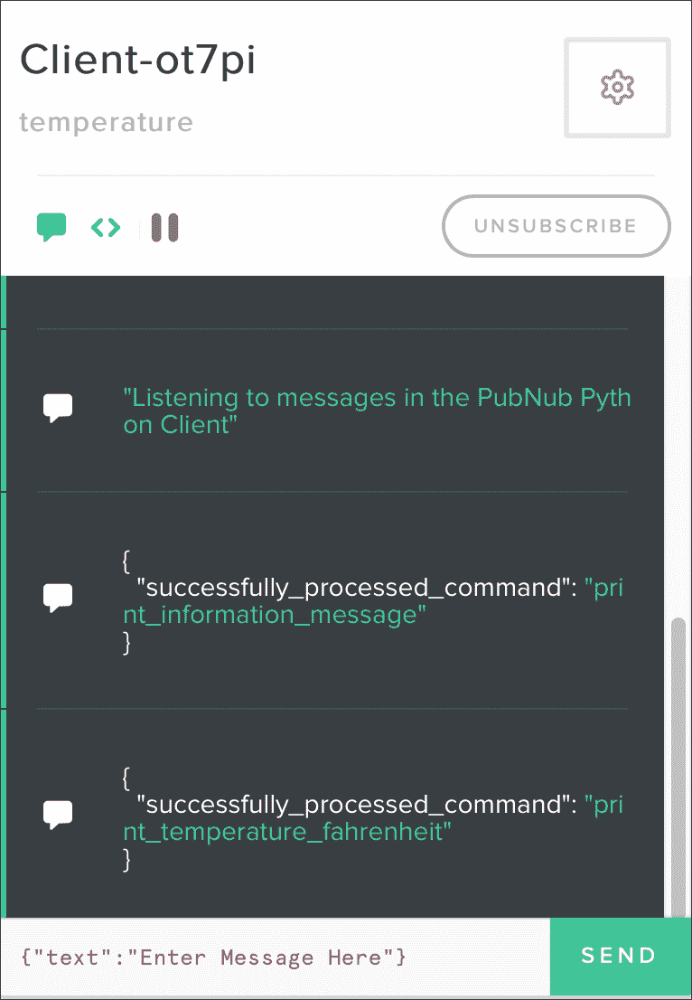

您将在 OLED 矩阵的底部看到以下文本：`Python IoT`。此外，伺服电机的轴将旋转到 45 度。

### 提示

我们可以使用不同编程语言中可用的 PubNub SDK 来创建应用程序和应用程序，这些应用程序可以在 PubNub 云中发布和接收消息，并与物联网设备交互。在这种情况下，我们与 Python SDK 合作创建了一个发布命令的客户端。可以创建发布命令的移动应用程序，并轻松构建一个可以与我们的物联网设备交互的应用程序。

# 使用 Mosquitto 和 Eclipse Paho 的 MQTT

Mosquitto 是一个开源的消息代理，实现了 MQTT 协议的 3.1 和 3.1.1 版本，因此，允许我们使用发布/订阅模型来处理消息。Mosquitto 是 iot.eclipse.org 项目，并提供了 Eclipse 公共项目 (EPL)/EDL 许可证。以下是为 Mosquitto 提供的网页：[`mosquitto.org`](http://mosquitto.org)。

Eclipse Paho 项目提供了一个开源的 MQTT 客户端实现。该项目包括一个 Python 客户端，也称为 Paho Python 客户端或 Eclipse Paho MQTT Python 客户端库。这个 Python 客户端是由 Mosquitto 项目贡献的，最初是 Mosquitto Python 客户端。以下是为 Eclipse Paho 项目提供的网页：[`www.eclipse.org/paho`](http://www.eclipse.org/paho)。以下是为 Eclipse Paho MQTT Python 客户端库提供的网页，即 paho-mqtt 模块：[`pypi.python.org/pypi/paho-mqtt/1.1`](https://pypi.python.org/pypi/paho-mqtt/1.1)。

在 第二章，*在英特尔 Galileo Gen 2 上使用 Python*，我们安装了 `pip` 安装程序，以便在板子上运行的 Yocto Linux 中轻松安装额外的 Python 2.7.3 软件包。现在，我们将使用 `pip` 安装程序安装 paho-mqtt 1.1。我们只需要在 SSH 终端中运行以下命令来安装该软件包。

```py
pip install paho-mqtt
```

输出的最后几行将指示 `paho-mqtt` 包已成功安装。不要担心与构建 wheel 相关的错误消息和不安全平台警告。

```py
Collecting paho-mqtt
  Downloading paho-mqtt-1.1.tar.gz (41kB)
    100% |################################| 45kB 147kB/s
Installing collected packages: paho-mqtt
  Running setup.py install for paho-mqtt
Successfully installed paho-mqtt-1.1
```

### 小贴士

Eclipse 允许我们使用一个公开可访问的沙盒服务器来运行 Eclipse IoT 项目，该服务器位于 [iot.eclipse.org](http://iot.eclipse.org)，端口号为 1883。在接下来的示例中，我们将使用这个沙盒服务器作为我们的 Mosquitto 消息代理。这样，我们就不需要设置一个 Mosquitto 消息代理来测试示例并学习如何使用 Paho Python 客户端。然而，在实际应用中，我们应该设置一个 Mosquitto 消息代理并用于我们的项目。

当我们从传感器读取温度和湿度值时，我们在上一章中编写的代码，我们将值打印在 OLED 矩阵上，并旋转伺服电机的轴来显示以华氏度表示的测量温度。该示例的代码文件为 `iot_python_chapter_08_03.py`。我们将使用此代码作为基准，添加我们在与 PubNub 云一起工作时添加的相同功能。然而，在这种情况下，我们将使用 Paho Python 客户端和公开可访问的沙盒服务器，该服务器为我们提供了一个 Mosquitto 消息代理。我们将能够执行以下操作，通过将 MQTT 消息发送到特定主题，从任何可以发布 MQTT 消息到我们订阅的主题的设备：

+   旋转伺服电机的轴以显示作为消息一部分接收到的华氏度温度值

+   在 OLED 矩阵的底部显示作为消息一部分接收到的文本行

### 小贴士

Paho Python 客户端使用主题名称而不是通道。你可以将主题视为一个通道。

我们将使用最近安装的 `paho-mqtt` 模块来订阅特定主题，并在接收到主题中的消息时运行代码。我们将创建一个 `MessageTopic` 类来表示通信主题，配置 MQTT 客户端、客户端的订阅以及声明当某些事件触发时要执行的回调代码。该示例的代码文件为 `iot_python_chapter_09_05.py`。请记住，我们使用代码文件 `iot_python_chapter_08_03.py` 作为基准，因此，我们将向该文件中现有的代码添加类，并创建一个新的 Python 文件。不要忘记将分配给 `topic` 类属性的字符串替换为你的唯一主题名称。由于我们使用的 Mosquitto 代理是公开的，你应该使用一个唯一主题，以确保你只接收你发布的消息。

```py
import time
import paho.mqtt.client as mqtt
import json

class MessageTopic:
    command_key = "command"
    successfully_processed_command_key = "successfully_processed_command"
    # Replace with your own topic name
    topic = "iot-python-gaston-hillar/temperature"
    active_instance = None

    def __init__(self, temperature_servo, oled):
        self.temperature_servo = temperature_servo
        self.oled = oled
        self.client = mqtt.Client()
        self.client.on_connect = MessageTopic.on_connect
        self.client.on_message = MessageTopic.on_message
        self.client.connect(host="iot.eclipse.org",
                            port=1883,
                            keepalive=60)
        MessageTopic.active_instance = self

    def loop(self):
        self.client.loop()

    @staticmethod
    def on_connect(client, userdata, flags, rc):
        print("Connected to the {0} topic".
              format(MessageTopic.topic))
        subscribe_result = client.subscribe(MessageTopic.topic)
        publish_result_1 = client.publish(
            topic=MessageTopic.topic,
            payload="Listening to messages in the Intel Galileo Gen 2 board")

    @staticmethod
    def on_message(client, userdata, msg):
        if msg.topic == MessageTopic.topic:
            print("I've received the following message: {0}".format(str(msg.payload)))
            try:
                message_dictionary = json.loads(msg.payload)
                if MessageTopic.command_key in message_dictionary:
                    if message_dictionary[MessageTopic.command_key] == "print_temperature_fahrenheit":
                        MessageTopic.active_instance.temperature_servo.print_temperature(
                            message_dictionary["temperature_fahrenheit"])
                        MessageTopic.active_instance.publish_response_message(
                            message_dictionary)
                    elif message_dictionary[MessageTopic.command_key] == "print_information_message":
                        MessageTopic.active_instance.oled.print_line(
                            11, message_dictionary["text"])
                        MessageTopic.active_instance.publish_response_message(message_dictionary)
            except ValueError:
                # msg is not a dictionary
                # No JSON object could be decoded
                pass

    def publish_response_message(self, message):
        response_message = json.dumps({
            self.__class__.successfully_processed_command_key:
                message[self.__class__.command_key]})
        result = self.client.publish(topic=self.__class__.topic,
                                payload=response_message)
        return result
```

`MessageTopic`类声明了`command_key`类属性，该属性定义了键字符串，该字符串定义了代码将理解为什么命令。每当收到包含指定键字符串的消息时，我们知道与该键关联的字典中的值将指示消息希望代码在板子上处理的命令。在这种情况下，我们不会以字典的形式接收消息，因此当它们不是字符串时，有必要将它们从字符串转换为字典。

代码声明了`successfully_processed_command_key`类属性，该属性定义了键字符串，该字符串定义了代码将在发布到主题的消息中使用什么作为成功处理的命令键。每当发布包含指定键字符串的消息时，我们知道与该键关联的字典中的值将指示板已成功处理的命令。

我们必须在`temperature_servo`和`oled`必需参数中指定`TemperatureServo`实例和`Oled`实例。构造函数，即`__init__`方法，将接收到的参数保存到具有相同名称的两个属性中。`topic`类属性参数指定了我们将订阅以监听其他设备发送到该主题的消息的 Mosquitto 主题。我们还将向该主题发布消息，因此我们将成为该通道的订阅者和发布者。

然后，构造函数创建了一个`mqtt.Client`类的实例，该实例代表一个 MQTT 客户端，我们将用它与 MQTT 代理进行通信。由于我们使用默认参数创建实例，我们将创建一个`paho.mqtt.client.MQTTv31`实例，我们将使用 MQTT 版本 3.1。

代码还保存了这个实例在`active_instance`类属性中的引用，因为我们必须在静态方法中访问该实例，我们将指定为不同事件触发的 MQTT 客户端的回调。

然后，代码将`self.client.on_connect`属性分配给`on_connect`静态方法，将`self.client.on_message`属性分配给`on_message`静态方法。静态方法不接收`self`或`cls`作为第一个参数，因此我们可以使用它们作为具有所需参数数量的回调。

最后，构造函数调用`self.client.connect`方法，并在参数中指定了公开可访问的 Eclipse IoT 项目在 iot.eclipse.org 的沙盒服务器，端口 1883。这样，代码要求 MQTT 客户端建立与指定 MQTT 代理的连接。如果您决定使用自己的 Mosquitto 代理，只需根据 Mosquitto 代理的配置更改`host`和`port`参数的值。`connect`方法以异步执行方式运行，因此它是一个非阻塞调用。

在成功连接到 MQTT 代理后，`self.client.on_connect` 属性中指定的回调函数将被执行，即标记为 `@staticmethod` 装饰器的 `on_connect` 静态方法。这个静态方法接收 `client` 参数中的 `mqtt.Client` 实例，该实例与 MQTT 代理建立了连接。代码使用 `MessageTopic.topic` 作为参数调用 `client.subscribe` 方法，以订阅由 `topic` 类属性指定的主题。

### 小贴士

在这种情况下，我们只会订阅一个主题。然而，了解我们不仅限于订阅单个主题，我们可能通过一次调用 `subscribe` 方法订阅多个主题，这一点非常重要。

最后，代码使用 `MessageTopic.topic` 作为 `topic` 参数，以及一个消息字符串作为 `payload` 参数调用 `client.publish` 方法。这样，我们将一个字符串消息 `"Listening to messages in the Intel Galileo Gen 2 board"` 发布到由 `topic` 类属性指定的主题。

每当我们订阅的主题中收到新消息时，`self.client.on_message` 属性中指定的回调函数将被执行，即标记为 `@staticmethod` 装饰器的 `on_message` 静态方法。这个静态方法接收 `client` 参数中的 `mqtt.Client` 实例，该实例与 MQTT 代理建立了连接，以及 `msg` 参数中的 `mqtt.MQTTMessage` 实例。`mqtt.MQTTMessage` 类描述了一个传入的消息。首先，静态方法检查 `msg.topic` 属性，该属性指示接收消息的主题，是否与 `topic` 类属性中的值匹配。在这种情况下，每当 `on_message` 方法执行时，`msg.topic` 中的值将始终与 `topic` 类属性中的值匹配，因为我们只订阅了一个主题。然而，如果我们订阅了多个主题，则始终有必要检查消息发送的主题以及我们接收消息的主题。

代码打印接收到的消息，即 `msg.payload` 属性。然后，代码将 `json.loads` 函数的结果反序列化 `msg.payload` 到一个 Python 对象，并将结果赋值给 `message_dictionary` 本地变量。如果 `msg.payload` 的内容不是 JSON，将捕获 `ValueError` 异常，并且方法中不再执行更多代码。如果 `msg.payload` 的内容是 JSON，我们将在 `message_dictionary` 本地变量中有一个字典。

然后，代码检查 `command_key` 类属性是否包含在 `message_dictionary` 字典中。如果表达式评估为 `True`，则表示将 JSON 消息转换为字典时包含了一个我们必须处理的命令。然而，在我们能够处理命令之前，我们必须检查是哪个命令，因此有必要检索与 `command_key` 类属性等效的键关联的值。代码能够在值是我们在之前示例中与 PubNub 云一起工作时使用的两个命令中的任何一个时运行特定的代码。

代码使用了具有对活动 `MessageTopic` 实例引用的 `active_instance` 类属性来根据要处理的命令调用 `temperature_servo` 或 `oled` 属性所需的必要方法。我们不得不将回调声明为静态方法，因此我们使用这个类属性来访问活动实例。

一旦命令被成功处理，代码就会调用存储在 `active_instance` 类属性中的 `MessageTopic` 实例的 `publish_response_message` 方法。该方法接收包含在 `message` 参数中的带有命令接收到的消息字典。该方法调用 `json.dumps` 函数将字典序列化为一个带有响应消息的 JSON 格式化字符串，该消息指示命令已成功处理。最后，代码使用 `topic` 类属性作为 `topic` 参数和 JSON 格式化字符串（`response_message`）在 `payload` 参数中调用 `client.publish` 方法。

### 小贴士

在这种情况下，我们不是评估 `publish` 方法的响应。此外，我们正在使用 `qos` 参数的默认值，该参数指定了所需的服务质量。在更高级的场景中，我们应该添加代码来检查方法的结果，并可能在成功发布消息时触发的 `on_publish` 回调中添加代码。

现在，我们将使用之前编写的 `MessageTopic` 类来创建一个新的 `__main__` 方法版本，该方法使用 Mosquitto 代理和 MQTT 客户端接收和处理命令。新版本在环境温度变化时不会旋转伺服电机的轴，相反，它将在接收到连接到 Mosquitto 代理的任何设备的适当命令时执行此操作。以下行显示了 `__main__` 方法的新版本。示例代码文件为 `iot_python_chapter_09_05.py`。

```py
if __name__ == "__main__":
    temperature_and_humidity_sensor = \
        TemperatureAndHumiditySensor(0)
    oled = TemperatureAndHumidityOled(0)
    temperature_servo = TemperatureServo(3)
 message_topic = MessageTopic(temperature_servo, oled)
    while True:
        temperature_and_humidity_sensor.\
            measure_temperature_and_humidity()
        oled.print_temperature(
            temperature_and_humidity_sensor.temperature_fahrenheit,
            temperature_and_humidity_sensor.temperature_celsius)
        oled.print_humidity(
            temperature_and_humidity_sensor.humidity)
        print("Ambient temperature in degrees Celsius: {0}".
              format(temperature_and_humidity_sensor.temperature_celsius))
        print("Ambient temperature in degrees Fahrenheit: {0}".
              format(temperature_and_humidity_sensor.temperature_fahrenheit))
        print("Ambient humidity: {0}".
              format(temperature_and_humidity_sensor.humidity))
        # Sleep 10 seconds (10000 milliseconds) but process messages every 1 second
 for i in range(0, 10):
 message_channel.loop()
 time.sleep(1)

```

突出的行创建了一个之前编写的`MessageTopic`类的实例，其中`temperature_servo`和`oled`作为参数。构造函数将订阅 Mosquitto 代理中的`"iot-python-gaston-hillar/temperature"`主题，因此，我们必须向这个主题发布消息，以便发送代码将处理的命令。循环将读取传感器的值并将值打印到控制台，就像代码的先前的版本一样，因此，我们将在循环中运行代码，我们也将有代码在 Mosquitto 代理的`"iot-python-gaston-hillar/temperature"`主题上监听消息。循环的最后几行调用`message_channel.loop`方法 10 次，每次调用之间暂停 1 秒。`loop`方法调用 MQTT 客户端的循环方法，并确保与代理的通信得到执行。将调用`loop`方法视为同步您的邮箱。任何待发送的消息将发送到发件箱，任何传入的消息将到达收件箱，我们之前分析的事件将被触发。

### 小贴士

此外，我们还可以通过调用 MQTT 客户端的`loop_start`方法来运行一个线程接口。这样，我们可以避免多次调用`loop`方法。

以下行将启动示例。

```py
python iot_python_chapter_09_05.py
```

在板上保持代码运行。稍后我们将开始接收消息，因为我们必须编写将消息发布到这个主题并发送要处理的命令的代码。

# 使用 Python 客户端向 Mosquitto 代理发布消息

我们有在 Intel Galileo Gen 2 板上运行的代码，用于处理从 Mosquitto 消息代理接收到的命令消息。现在，我们将编写一个 Python 客户端，该客户端将向`"iot-python-gaston-hillar/temperature"`通道发布消息。这样，我们将能够设计能够通过 MQTT 消息与物联网设备通信的应用程序。具体来说，应用程序将通过 Mosquitto 消息代理与发布器和订阅设备中的 Python 代码进行通信。

我们可以在另一个 Intel Galileo Gen 2 板上或在安装了 Python 2.7.x 的任何设备上运行 Python 客户端。此外，代码将以 Python 3.x 运行。例如，我们可以在我们的计算机上运行 Python 客户端。我们只需确保在板上的 Yocto Linux 中运行的 Python 版本中安装了我们之前用 pip 安装的`pubnub`模块。

我们将创建许多函数，并将它们作为回调函数分配给 MQTT 客户端的各个事件。此外，我们还将声明变量和一个辅助函数，以便能够轻松地使用命令和所需的值发布消息。示例的代码文件是 `iot_python_chapter_09_06.py`。别忘了将分配给 `topic` 变量的字符串替换为你之前代码中指定的主题名称。以下行显示了定义变量和函数的代码：

```py
command_key = "command"
topic = "iot-python-gaston-hillar/temperature"

def on_connect(client, userdata, flags, rc):
    print("Connected to the {0} topic".
          format(topic))
    subscribe_result = client.subscribe(topic)
    publish_result_1 = client.publish(
        topic=topic,
        payload="Listening to messages in the Paho Python Client")
    publish_result_2 = publish_command(
        client,
        topic,
        "print_temperature_fahrenheit",
        "temperature_fahrenheit",
        45)
    publish_result_3 = publish_command(
        client,
        topic,
        "print_information_message",
        "text",
        "Python IoT")

def on_message(client, userdata, msg):
    if msg.topic == topic:
        print("I've received the following message: {0}".format(str(msg.payload)))

def publish_command(client, topic, command_name, key, value):
    command_message = json.dumps({
        command_key: command_name,
        key: value})
    result = client.publish(topic=topic,
                            payload=command_message)
    return result
```

代码声明了 `command_key` 变量，它定义了指示代码在消息中理解为何种命令的关键字符串。我们的主要目标是构建并发布指定在 `topic` 变量中的主题的命令消息。我们将同时作为该主题的订阅者和发布者。

`on_connect` 函数是在与 Mosquitto MQTT 代理成功建立连接后执行的回调函数。代码调用 `client` 参数中接收到的 MQTT 客户端的 `subscribe` 方法，然后调用 `publish` 方法向主题发送以下字符串消息："Listening to messages in the Paho Python Client"

代码使用必要的参数调用 `publish_command` 函数，构建并发布具有 45 度温度值的 `print_temperature_fahrenheit` 命令。最后，代码再次调用 `publish_command` 函数，使用必要的参数构建并发布具有文本值 `"Python IoT"` 的 `print_information_message` 命令。

`publish_command` 函数接收 MQTT 客户端、主题、命令名称、键和值，这些参数提供了在 `client`、`topic`、`command_name`、`key` 和 `value` 中执行命令所必需的信息。在这种情况下，我们不针对特定 IoT 设备的命令，而是所有订阅该主题并运行我们之前示例中的代码的设备都将处理我们发布的命令。我们可以将此代码作为基准，用于处理更复杂的示例，在这些示例中，我们必须生成针对特定 IoT 设备的命令。正如我们之前的示例中发生的那样，提高安全性也是必要的。

该函数创建一个字典，并将将字典序列化为 JSON 格式字符串的结果保存到 `command_message` 本地变量中。`command_key` 变量是字典的第一个键，`command_name` 作为参数接收，它构成了第一个键值对。然后，代码调用 `client.publish` 方法将 `command_message` JSON 格式字符串发布到作为参数接收的主题。

`on_message` 函数将在每次有新消息到达我们订阅的主题时执行。该函数只是打印带有接收消息有效载荷的原始字符串。

现在，我们将使用之前编写的`functions`来编写一个`__main__`方法，该方法发布 MQTT 消息中包含的两个命令，我们的板子将处理这些命令。以下行显示了`__main__`方法的代码。示例的代码文件是`iot_python_chapter_09_06.py`。

```py
if __name__ == "__main__":
    client = mqtt.Client()
    client.on_connect = on_connect
    client.on_message = on_message
    client.connect(host="iot.eclipse.org",
                   port=1883,
                   keepalive=60)
    client.loop_forever()
```

`__main__`方法中的代码非常容易理解。代码创建了一个`mqtt.Client`类的实例，代表一个 MQTT 客户端，我们将使用它来与 MQTT 代理通信。由于我们使用默认参数创建实例，我们将创建一个`paho.mqtt.client.MQTTv31`的实例，我们将使用 MQTT 版本 3.1。

然后，代码将`client.on_connect`属性分配给之前编写的`on_connect`函数，将`client.on_message`属性分配给`on_message`函数。代码调用`client.connect`方法，并在参数中指定了 Eclipse IoT 项目在 iot.eclipse.org 上的公开可访问的沙盒服务器，端口为 1883。这样，代码请求 MQTT 客户端与指定的 MQTT 代理建立连接。如果你决定使用自己的 Mosquitto 代理，你只需根据 Mosquitto 代理的配置更改`host`和`port`参数的值。请记住，`connect`方法以异步执行方式运行，因此它是一个非阻塞调用。

在与 MQTT 代理成功建立连接后，`client.on_connect`属性中指定的回调函数将被执行，即`on_connect`函数。该函数接收在`client`参数中与 MQTT 代理建立连接的`mqtt.Client`实例。正如之前解释的那样，该函数订阅了一个主题，并安排向其发布三条消息。

最后，代码调用`client.loop_forever`方法，该方法以无限阻塞循环的方式为我们调用循环方法。在此阶段，我们只想在我们的程序中运行 MQTT 客户端循环。计划的消息将被发布，并且在我们将命令发送到板子后，我们将收到成功执行命令详情的消息。

保持我们在之前的示例中在板上运行的 Python 代码。我们希望板子处理我们的命令。以下行将在任何你想要用作客户端的计算机或设备上启动 Python 客户端的示例。如果你想在同一个板上使用相同的板子作为客户端，可以在另一个 SSH 终端中运行代码。

```py
python iot_python_chapter_09_06.py
```

运行示例后，你将在运行 Python 客户端的 Python 控制台中看到以下输出，即`iot_python_chapter_09_06.py` Python 脚本。

```py
Connected to the iot-python-gaston-hillar/temperature topic
I've received the following message: Listening to messages in the Paho Python Client
I've received the following message: {"command": "print_temperature_fahrenheit", "temperature_fahrenheit": 45}
I've received the following message: {"text": "Python IoT", "command": "print_information_message"}
I've received the following message: {"successfully_processed_command": "print_temperature_fahrenheit"}
I've received the following message: {"successfully_processed_command": "print_information_message"}
```

代码使用了 Eclipse Paho MQTT Python 客户端库，在 Mosquitto 代理的`"iot-python-gaston-hillar/temperature"`主题中构建并发布了以下两条命令消息：

```py
{"command":"print_temperature_fahrenheit", "temperature_fahrenheit": "45"}
{"command":"print_information_message", "text": "Python IoT"}
```

由于我们也订阅了 `"iot-python-gaston-hillar/temperature"` 主题，我们收到了我们发送的消息。然后，我们收到了两个命令消息的成功处理命令消息。板已处理命令并将消息发布到 `"iot-python-gaston-hillar/temperature"` 主题。

你将在运行处理命令的板（即 `iot_python_chapter_09_05.py` Python 脚本）的 SSH 终端输出中看到以下消息：

```py
I've received the following message: Listening to messages in the Intel Galileo Gen 2 board
I've received the following message: Listening to messages in the Paho Python Client
I've received the following message: {"command": "print_temperature_fahrenheit", "temperature_fahrenheit": 45}
I've received the following message: {"text": "Python IoT", "command": "print_information_message"}
I've received the following message: {"successfully_processed_command": "print_temperature_fahrenheit"}
I've received the following message: {"successfully_processed_command": "print_information_message"}
```

你将在 OLED 矩阵的底部看到以下文本显示：`Python IoT`。此外，伺服电机的轴将旋转到 45 度。

# 测试你的知识

1.  MQTT 是：

    1.  在 TCP/IP 协议之上运行的重量级消息协议，并使用发布/订阅机制。

    1.  在 TCP/IP 协议之上运行的轻量级消息协议，并使用发布/订阅机制。

    1.  HTTP 的等价物。

1.  Mosquitto 是：

    1.  实现 MQTT 协议版本 3.1 和 3.1.1 的开源消息代理。

    1.  实现 MQTT 协议版本 3.1 和 3.1.1 的闭源消息代理。

    1.  实现 RESTful API 的开源消息代理。

1.  Eclipse Paho 项目提供：

    1.  HTTP 的开源客户端实现。

    1.  `dweet.io` 的开源客户端实现。

    1.  MQTT 的开源客户端实现。

1.  以下哪个 Python 模块是 Paho Python 客户端？

    1.  paho-client-pip。

    1.  paho-mqtt。

    1.  paho-http。

1.  Dweepy 是：

    1.  一个简单的 `dweet.io` Python 客户端，允许我们使用 Python 轻松发布数据到 `dweet.io`。

    1.  一个简单的 Mosquitto Python 客户端，允许我们轻松地将消息发布到 Mosquitto 消息代理。

    1.  一个简单的 PubNub 云 Python 客户端，允许我们轻松地将消息发布到 PubNub 云。

# 摘要

在本章中，我们结合了许多基于云的服务，使我们能够轻松发布从传感器收集的数据，并在基于网页的仪表板上可视化它。我们意识到总有一个 Python API，因此，编写与流行的基于云服务交互的 Python 代码很容易。

我们与 MQTT 协议及其发布/订阅模型合作，处理板上的命令，并通过消息指示命令是否成功处理。首先，我们与使用 MQTT 协议的 PubNub 云合作。然后，我们用 Mosquitto 和 Eclipse Paho 开发了相同的示例。现在，我们知道如何编写可以与我们的物联网设备建立双向通信的应用程序。此外，我们还知道如何使物联网设备与其他物联网设备通信。

既然我们能够利用许多云服务，并且我们已经与 MQTT 协议合作，我们将学习如何分析大量数据，这是下一章的主题。
