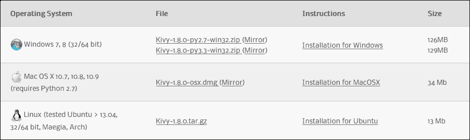
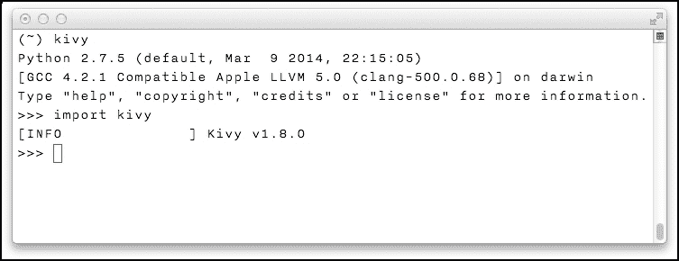
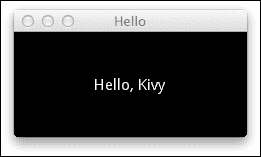

# 前言

移动应用早已不再是“新热点”，如今用户通常期望新的软件——无论是视频游戏还是社交网络——都有一个移动版本。类似的趋势也影响了桌面操作系统；编写跨平台软件，曾经是不常见的，迅速成为了一种规范。即使是通常仅限于桌面 Microsoft 操作系统的游戏开发者，现在也可以看到他们在为许多新游戏（例如，在撰写本文时，Steam 托管了超过一百款在 Mac 上运行的游戏，以及超过五十款在 Linux 上运行的游戏）开发 Mac 和 Linux 版本。

这对于初创公司和独立开发者来说尤其有价值：构建真正跨平台的软件可以扩大潜在受众，从而增加销量，并在过程中可能创造良好的舆论。

然而，编写可移植的软件可能是一个非常资源密集的过程，这对小型开发者的影响远大于大型企业。

尤其是许多平台都有一个首选的编程语言和**软件开发工具包**（**SDK**）：iOS 应用大多是用 Objective-C 和 Swift 编写的，Android 推荐使用不太理想的 Java 编程语言，而微软则推广使用.NET 框架，特别是 C#，来构建 Windows 软件。

使用这些工具允许你利用操作系统的原生用户界面和底层功能，但它也自动防止了代码重用。这意味着即使你对所有涉及的编程语言和接口都同样精通，移植代码可能仍然需要相当多的时间，并引入新的错误。

# 编写一次，运行任何地方

这种整个情况产生了对一种通用、多平台编程方式的需求。这个问题并不是全新的：1995 年由 Sun 提出的解决方案之一是 Java 编程语言。它的营销承诺——“编写一次，运行任何地方”——从未实现，而且该语言本身使用起来非常繁琐。这导致了众多对该口号的嘲讽变体，最终以“编写一次，逃离一次”为高潮，指的是许多开发者放弃了 Java，转而使用更好的编程语言，包括 Python。

顺便提一下，Kivy——本书的主要主题——是一个图形用户界面库，它简化了多平台 Python 应用的创建。Kivy 工具包的主要特性如下：

+   **兼容性**：基于 Kivy 的应用在 Linux、Mac OS X、Windows、Android 和 iOS 上都能运行——所有这些都来自同一个代码库。

+   **自然用户界面**：Kivy 弥合了不同输入方法之间的差距，允许你使用类似的代码处理多种可能的用户交互，无论是鼠标事件还是多点触控手势。

+   **快速硬件加速图形**：OpenGL 渲染使 Kivy 适合创建图形密集型应用，如视频游戏，同时也通过平滑的过渡改善了用户体验。

+   **Python 的使用**：Kivy 应用是用 Python 编写的，Python 是一种较好的通用编程语言。除了本身具有可移植性、表达性和可读性之外，Python 还具有有用的标准库和丰富的第三方包生态系统，即 **Python 包索引**（**PyPI**）。

谈到第三方包，Kivy 可以被视为许多经过实战检验的组件的超集：其功能的大部分依赖于知名的库，如 Pygame、SDL 和 GStreamer。然而，Kivy 提供的 API 非常高级且统一。

值得一提的是，Kivy 是一款免费且开源的 MIT 许可软件。在实践中，这意味着您可以在不支付许可费用的情况下将其用于商业用途。它的完整源代码托管在 GitHub 上，因此您也可以修复错误或为其添加新功能。

# 本书涵盖的内容

第一章，《构建时钟应用》为使用 Kivy 编写应用提供了一个温和的介绍。它涵盖了 Kivy 语言、布局、小部件和计时器。到本章结束时，我们将构建一个简单的时钟应用，类似于您手机中的时钟应用。

第二章，《构建绘图应用》进一步探讨了 Kivy 框架的组件和功能。生成的绘图应用展示了内置小部件的定制、在画布上绘制任意形状以及处理多点触控事件。

第三章，《Android 声音录制器》作为编写基于 Kivy 的 Android 应用的示例。它展示了如何使用 Pyjnius 互操作性层将 Java 类加载到 Python 中，这使得我们可以将 Android API 调用与基于 Kivy 的用户界面混合使用。

第四章，《Kivy 网络编程》是一本从零开始构建网络应用的实战指南。它涵盖了从创建简单协议到用 Python 编写服务器和客户端软件的多个主题，并以 Kivy 聊天应用作为总结。

第五章，《制作远程桌面应用》展示了编写客户端-服务器应用的另一种方式。本章的程序基于 HTTP 协议——互联网背后的协议。我们首先开发了一个命令行 HTTP 服务器，然后使用 Kivy 构建远程桌面客户端应用。

第六章，《制作 2048 游戏》将指导您构建一个可玩的游戏副本。我们展示了更复杂的 Kivy 功能，例如创建自定义小部件、使用 Kivy 属性进行数据绑定以及处理触摸屏手势。

第七章，*编写 Flappy Bird 克隆*介绍了另一个基于 Kivy 的游戏，这次是一个类似于著名 Flappy Bird 标题的街机游戏。在本章中，我们讨论了纹理坐标和音效的使用，实现了街机物理和碰撞检测。

第八章，*介绍着色器*展示了在 Kivy 应用程序中使用 GLSL 着色器的用法。在本教程中，您将了解 OpenGL 原语，如索引和顶点，然后编写直接在 GPU 上运行的极快级代码。

第九章，*制作射击游戏*从上一章结束的地方继续：我们使用 GLSL 的知识来构建一个侧滚动射击游戏。在此过程中，开发了一个可重用的粒子系统类。本项目总结了整个系列，并利用了书中解释的许多技术，例如碰撞检测、触摸屏控制、音效等。

附录，*Python 生态系统*为您提供了更多关于 Python 库和工具的信息。

# 设置工作环境

本节简要讨论了有效遵循叙述、实现和运行 Kivy 应用程序所需的条件。一台运行现代操作系统的个人电脑——Mac、Linux 或 Windows 计算机——是隐含的。

## 关于 Python 的说明

Python 是本书中使用的首选编程语言；虽然不是严格必要的，但对其有良好的了解可能会有所帮助。

在撰写本文时，广泛使用中的 Python 有两个不兼容的版本。Python 2.7 非常稳定，但不再积极开发，而 Python 3 是一个较新的、略带争议的版本，为语言带来了许多改进，但偶尔会破坏兼容性。

本书中的代码应该在大致上适用于 Python 的两个版本，但可能需要稍作调整才能完全兼容 Python 3；为了获得最佳效果，建议您使用 Python 2.7 或您系统上可用的最新 Python 2 版本。

### 注意

在大多数平台上，不需要单独安装 Python 用于 Kivy 开发：它可能预装在系统上（Mac OS X）、与 Kivy 捆绑（MS Windows），或者作为依赖项包含（Linux，尤其是 Ubuntu）。

## 安装和运行 Kivy

您可以从官方网站([`kivy.org/`](http://kivy.org/))下载 Kivy；只需选择合适的版本并按照说明操作。整个过程应该相当直接和简单。



Kivy 下载

要检查安装是否正常工作，请按照以下说明操作：

+   在 Mac 上：

    1.  打开**Terminal.app**。

    1.  运行`kivy`。

    1.  应该出现 Python 提示符`>>>`。输入`import kivy`。

    1.  命令应该无错误完成，并打印类似 `[INFO] Kivy v1.8.0` 的消息。

+   在 Linux 机器上：

    1.  打开一个终端。

    1.  运行 `python`。

    1.  应该出现 Python 提示符 `>>>`。输入 `import kivy`。

    1.  命令应该打印类似 `[INFO] Kivy v1.8.0` 的消息。

+   在 Windows 系统上：

    1.  双击 Kivy 软件包目录内的 **kivy.bat**。

    1.  在命令提示符中输入 `python`。

    1.  输入 `import kivy`。

    1.  命令应该打印类似 `[INFO] Kivy v1.8.0` 的消息。

    

    终端会话

运行 Kivy 应用程序（基本上是一个 Python 程序）的方式类似：

+   在 Mac 上，使用 `kivy main.py`

+   在 Linux 上，使用 `python main.py`

+   在 Windows 上，使用 `kivy.bat main.py`（或将 **main.py** 文件拖放到 **kivy.bat** 之上）。

## 编码注意事项

编程通常涉及大量文本处理；因此，选择一个好的文本编辑器非常重要。这就是为什么我强烈建议在考虑其他选项之前先尝试使用 Vim。

Vim 是目前可用的优秀文本编辑器之一；它高度可配置，专为有效文本编辑而构建（比典型替代品更有效）。Vim 拥有一个充满活力的社区，正在积极维护，并且预安装在许多类 Unix 操作系统中——包括 Mac OS X 和 Linux。已知（至少一些）Kivy 框架的开发者也喜欢使用 Vim。

这里有一些针对 Vim 用户快速了解 Kivy 的技巧：

+   **Python-mode** ([`github.com/klen/python-mode`](https://github.com/klen/python-mode)) 对于编写 Python 代码非常出色。它提供了许多额外功能，例如样式和静态检查器、智能完成以及重构支持。

+   GLSL 着色器的源代码可以使用 `vim-glsl` 语法正确高亮显示（[`github.com/tikhomirov/vim-glsl`](https://github.com/tikhomirov/vim-glsl)）。

+   Kivy 纹理映射（即 `.atlas` 文件，在第八章 介绍着色器 中介绍），基本上是 JSON 格式，因此您可以使用，例如 **vim-json** ([`github.com/elzr/vim-json`](https://github.com/elzr/vim-json))，并将以下行添加到您的 `.vimrc` 文件中，以创建文件关联：

    ```py
    au BufNewFile,BufRead *.atlas set filetype=json
    ```

+   Kivy 布局文件（`.kv`）处理起来稍微复杂一些，因为它们与 Python 类似，但并不真正像 Python 那样解析。Kivy 仓库中有一个不完整的 Vim 插件，但在撰写本文时，Vim 内置的 **YAML** 支持更好地突出显示这些文件（这显然可能在将来发生变化）。要将 `.kv` 文件作为 YAML 加载，请将以下行添加到您的 `.vimrc` 文件中：

    ```py
    au BufNewFile,BufRead *.kv set filetype=yaml
    ```

显然，您并不 **必须** 使用 Vim 来跟随本书的示例——这只是一个建议。现在让我们写一点代码，怎么样？

# Hello, Kivy

当学习一门新的编程语言或技术时，学生通常会首先看到的是一个传统的 "hello, world" 程序。在 Python 中它看起来是这样的：

```py
print('hello, world')
```

Kivy 的“hello, world”版本稍微长一些，由两个文件组成，即一个 Python 模块和一个 `.kv` 布局定义。

## 代码

Kivy 应用程序的入口通常称为 `main.py`，其内容如下：

```py
from kivy.app import App

class HelloApp(App):
    pass

if __name__ == '__main__':
    HelloApp().run()
```

如您所见，这使用了 Kivy 的 `App` 类，对其没有任何添加，并调用了 `run()` 方法。

## 布局

布局文件通常以应用程序类名命名，在本例中为 `HelloApp`，不带 `App` 后缀且为小写：`hello.kv`。它包含以下行：

```py
Label:
    text: 'Hello, Kivy'
```

这是一个非常简单的 Kivy 布局定义，仅包含一个 `Label` 小部件，其中包含所需文本。布局文件允许以简洁、声明性的方式构建复杂的组件层次结构，这在此处未显示，但将在本书的整个过程中被大量使用。

如果我们现在运行程序（有关详细信息，请参阅*安装和运行 Kivy*部分），这将是我们得到的结果：



我们由 Kivy 驱动的第一个应用程序

现在您已经准备好进入第一章，并开始编写真正的程序。

# 本书面向的对象

本书旨在为那些熟悉 Python 语言并希望以最小麻烦使用 Python 构建桌面和移动应用程序的程序员编写。虽然了解 Kivy 对您有所帮助，但并非必需——框架的每个方面在首次使用时都会进行描述。

在本书的各个部分，我们将 Kivy 与 Web 开发实践进行类比。然而，对后者的深入了解也不是必需的，以跟随叙述。

# 规范

在本书中，您将找到许多文本样式，用于区分不同类型的信息。以下是一些这些样式的示例及其含义的解释。

文本中的代码单词、数据库表名、文件夹名、文件名、文件扩展名、路径名、虚拟 URL、用户输入和 Twitter 用户名如下所示：“Kivy 应用的入口通常称为 `main.py`。”

代码块设置如下：

```py
from kivy.app import App

class HelloApp(App):
    pass

if __name__ == '__main__':
    HelloApp().run()
```

当我们希望将您的注意力引向代码块的一个特定部分时，相关的行或项目将以粗体显示：

```py
# In Python code
LabelBase.register(name="Roboto",
    fn_regular="Roboto-Regular.ttf",
    fn_bold="Roboto-Bold.ttf",
    fn_italic="Roboto-Italic.ttf",
    fn_bolditalic="Roboto-BoldItalic.ttf")
```

任何命令行输入或输出都如下所示：

```py
pip install -U twisted

```

**新术语**和**重要词汇**以粗体显示。屏幕上看到的单词，例如在菜单或对话框中，在文本中如下所示：“第一个事件处理器是为**开始**和**停止**按钮。”

### 注意

警告或重要注意事项如下所示：

### 小贴士

小贴士

# 读者反馈

我们欢迎读者反馈。请告诉我们您对本书的看法——您喜欢或不喜欢的地方。读者反馈对我们很重要，因为它帮助我们开发出您真正能从中受益的标题。

向我们发送一般反馈，只需发送电子邮件至 `<feedback@packtpub.com>`，并在邮件主题中提及本书的标题。

如果你在一个领域有专业知识，并且你对撰写或为书籍做出贡献感兴趣，请参阅我们的作者指南[www.packtpub.com/authors](http://www.packtpub.com/authors)。

# 客户支持

现在你已经是 Packt 图书的骄傲拥有者，我们有一些事情可以帮助你从购买中获得最大收益。

## 下载示例代码

你可以从你购买的所有 Packt 出版物的账户中下载示例代码文件[`www.packtpub.com`](http://www.packtpub.com)。如果你在其他地方购买了这本书，你可以访问[`www.packtpub.com/support`](http://www.packtpub.com/support)并注册，以便将文件直接通过电子邮件发送给你。获取最新源代码的另一种方法是克隆 GitHub 仓库[`github.com/mvasilkov/kb`](https://github.com/mvasilkov/kb)。

## 下载本书的彩色图像

我们还为你提供了一份包含本书中使用的截图/图表彩色图像的 PDF 文件。彩色图像将帮助你更好地理解输出的变化。你可以从以下链接下载此文件：[`www.packtpub.com/sites/default/files/downloads/7849OS_ColorImages.pdf`](http://www.packtpub.com/sites/default/files/downloads/7849OS_ColorImages.pdf)。

## 勘误

尽管我们已经尽一切努力确保内容的准确性，但错误仍然可能发生。如果你在我们的书中发现错误——可能是文本或代码中的错误——如果你能向我们报告这一点，我们将不胜感激。通过这样做，你可以帮助其他读者避免挫败感，并帮助我们改进本书的后续版本。如果你发现任何勘误，请通过访问[`www.packtpub.com/submit-errata`](http://www.packtpub.com/submit-errata)，选择你的书籍，点击**勘误提交表单**链接，并输入你的勘误详情来报告它们。一旦你的勘误得到验证，你的提交将被接受，勘误将被上传到我们的网站或添加到该标题的勘误部分下的现有勘误列表中。

要查看之前提交的勘误，请访问[`www.packtpub.com/books/content/support`](https://www.packtpub.com/books/content/support)，并在搜索字段中输入书籍名称。所需信息将出现在**勘误**部分下。

## 盗版

互联网上版权材料的盗版是一个跨所有媒体的持续问题。在 Packt，我们非常重视我们版权和许可证的保护。如果你在互联网上发现任何形式的我们作品的非法副本，请立即提供位置地址或网站名称，以便我们可以寻求补救措施。

请通过发送链接到疑似盗版材料的方式，与我们联系 `<copyright@packtpub.com>`。

我们感谢你在保护我们的作者和我们提供有价值内容的能力方面的帮助。

## 问题

如果您在这本书的任何方面遇到问题，您可以通过 `<questions@packtpub.com>` 联系我们，我们将尽力解决问题。
