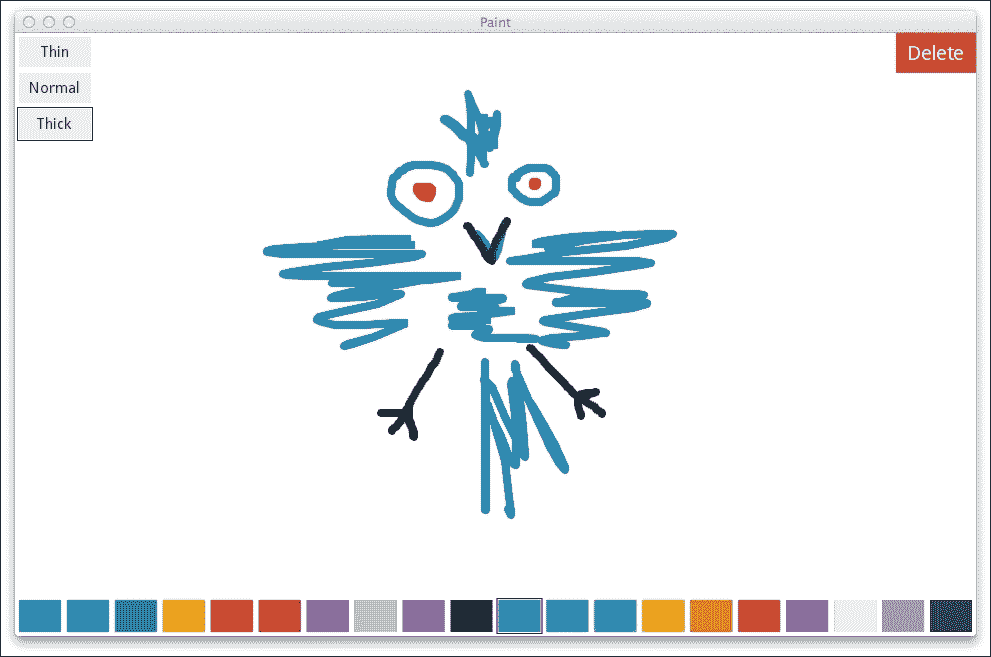
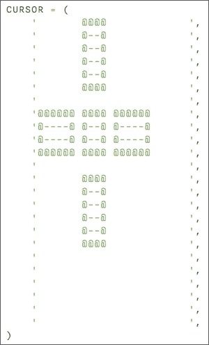
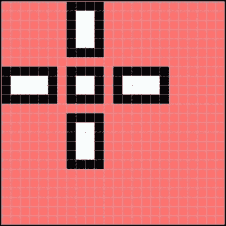
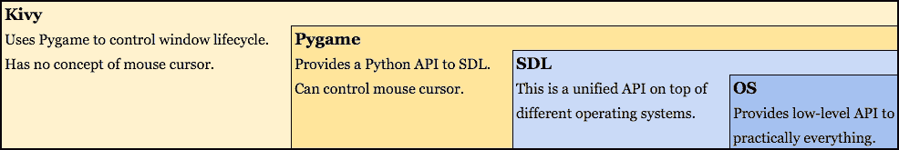
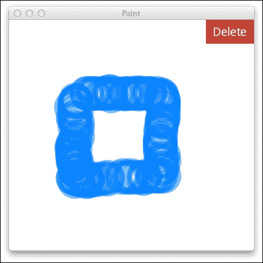
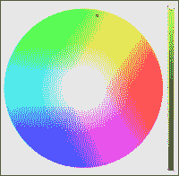
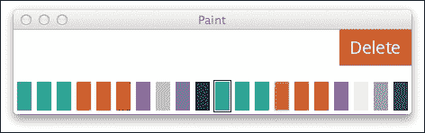
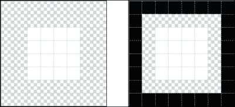
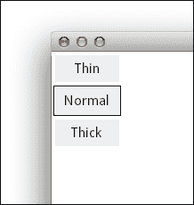

# 第二章：构建绘画应用程序

在第一章《构建时钟应用程序》中，我们使用 Kivy 的标准组件：布局、文本标签和按钮构建了一个应用程序。我们能够在保持非常高层次抽象的同时显著自定义这些组件的外观——使用完整的控件，而不是单个图形原语。这对于某些类型的应用程序来说很方便，但并不总是理想的，并且正如你很快就会看到的，Kivy 框架还提供了用于较低层次抽象的工具：绘制点和线。

我认为，通过构建绘画应用程序来玩自由形式的图形是最好的方式。我们的应用程序完成时，将与 Windows 操作系统捆绑的 MS Paint 应用程序有些相似。

与 Microsoft Paint 不同，我们的 Kivy Paint 应用程序将完全跨平台，包括运行 Android 和 iOS 的移动设备。此外，我们还将故意省略“真实”软件中常见的许多图像处理功能，例如矩形选择、图层和将文件保存到磁盘。实现它们可以成为你的一项良好练习。

### 小贴士

关于移动设备：虽然使用 Kivy 构建 iOS 应用程序当然可能，但如果你没有 iOS 或 Kivy 开发的经验，这仍然是非平凡的。因此，建议你首先为易于使用的平台编写代码，这样你可以快速更新你的代码并运行应用程序，而无需构建二进制文件等。在这方面，由于 Kivy Launcher，Android 开发要简单得多，它是一个通用的环境，可以在 Android 上运行 Kivy 应用程序。它可在 Google Play 上找到，网址为 [`play.google.com/store/apps/details?id=org.kivy.pygame`](https://play.google.com/store/apps/details?id=org.kivy.pygame)。

能够立即启动和测试你的应用程序而不需要编译，这是 Kivy 开发中一个极其重要的方面。这使得程序员能够快速迭代并现场评估可能的解决方案，这对于**快速应用开发**（RAD）和整体敏捷方法至关重要。

除了窗口大小调整（这在移动设备上不太常用）之外，Kivy 应用程序在各种移动和桌面平台上表现相似。因此，在发布周期后期之前，完全有可能只编写和调试桌面或 Android 版本的程序，然后填补任何兼容性差距。

我们还将探讨 Kivy 应用程序提供的两个独特且几乎相互排斥的功能：多指控制，适用于触摸屏设备，以及在桌面计算机上更改鼠标指针。

坚持其以移动端为先的方法，Kivy 提供了一个多触控输入的模拟层，可以用鼠标使用。它可以通过右键点击触发。然而，这种多触控模拟并不适合任何实际应用，除了调试；当在桌面运行时，它将在应用的生成版本中被关闭。

这就是本章结束时我们的应用将看起来像这样：



Kivy 绘画应用，绘画工具另行销售

# 设置舞台

初始时，我们应用的全部表面都被**根小部件**占据，在这种情况下，那就是用户可以绘画的画布。我们不会在稍后为工具区域分配任何屏幕空间。

如你所知，根小部件是层次结构中最外层的小部件。每个 Kivy 应用都有一个，它可以基本上是任何东西，取决于期望的行为。如第一章中所示，*构建时钟应用*，`BoxLayout`是一个合适的选择作为根小部件；由于我们没有对它有额外的要求，布局被设计成作为其他控制容器的功能。

在绘画应用的情况下，我们需要其根小部件满足更多有趣的要求；用户应该能够画线，可能利用多触控功能，如果可用。目前，Kivy 没有内置的控制适合这项任务，因此我们需要自己创建。

构建新的 Kivy 小部件很简单。一旦我们的类从 Kivy 的`Widget`类继承，我们就可以开始了。所以，最简单的没有特殊功能的自定义小部件，以及使用它的小程序，可以像这样实现：

```py
from kivy.app import App
from kivy.uix.widget import Widget

class CanvasWidget(Widget):
    pass

class PaintApp(App):
    def build(self):
        return CanvasWidget()

if __name__ == '__main__':
    PaintApp().run()
```

这是我们的绘画应用起始点的完整列表，`main.py`，包括`PaintApp`类。在未来的章节中，我们将省略像这样的简单样板代码；这个例子提供是为了完整性。

### 小贴士

`Widget`类通常作为基类，就像 Python 中的`object`或 Java 中的`Object`。虽然可以在应用中使用它“原样”，但`Widget`本身非常有限。它没有视觉外观，也没有在程序中立即有用的属性。另一方面，继承`Widget`相当直接且在许多不同场景中很有用。

# 调整外观

首先，让我们调整我们应用的外观。这并不是一个关键的功能，但请耐心，因为这些定制通常被请求，而且设置起来也很容易。我将简要描述我们在上一章中覆盖的属性，并添加一些新的调整，例如窗口大小和鼠标光标的更改。

## 视觉外观

我坚信，任何绘图应用程序的背景颜色最初应该是白色的。你可能已经从第一章中熟悉了这个设置。以下是我们在`__name__ == '__main__'`行之后添加的代码行，以实现所需的效果：

```py
from kivy.core.window import Window
from kivy.utils import get_color_from_hex

Window.clearcolor = get_color_from_hex('#FFFFFF')
```

你可能希望将大多数`import`行放在它们通常所在的位置，即在程序文件的开始附近。正如你很快就会学到的，Kivy 中的某些导入实际上是顺序相关的，并且有副作用，最值得注意的是`Window`对象。在行为良好的 Python 程序中很少出现这种情况，导入语句的副作用通常被认为是不良的应用程序设计。

## 窗口大小

桌面应用程序的另一个常见调整属性是窗口大小。以下更改对移动设备将完全没有影响。

值得注意的是，默认情况下，桌面上的 Kivy 窗口可以被最终用户调整大小。我们将在稍后学习如何禁用此功能（仅为了完整性；通常这不是一个好主意）。

### 小贴士

当你针对已知规格的移动设备时，以编程方式设置窗口大小也是一个方便的做法。这允许你使用目标设备的正确屏幕分辨率在桌面上测试应用程序。

要分配初始窗口大小，将下一代码片段插入到读取`from kivy.core.window import Window`的行之上。在`Window`对象导入之前应用这些设置至关重要；否则，它们将没有任何效果：

```py
from kivy.config import Config

Config.set('graphics', 'width', '960')
Config.set('graphics', 'height', '540')  # 16:9
```

此外，你可能还想通过添加以下一行来禁用窗口调整大小：

```py
Config.set('graphics', 'resizable', '0')
```

请除非你有非常充分的理由，否则不要这样做，因为从用户那里移除这些微不足道的定制通常是一个坏主意，并且很容易破坏整体用户体验。仅在一个分辨率下构建像素完美的应用程序很有吸引力，但许多客户（尤其是移动用户）可能不会满意。另一方面，Kivy 布局使得构建可伸缩界面变得可行。

## 鼠标光标

下一个通常仅适用于桌面应用程序的定制选项是更改鼠标指针。Kivy 没有对此进行抽象，因此我们将在一个较低级别上工作，直接从 Pygame 导入和调用方法，Pygame 是基于 SDL 的窗口和 OpenGL 上下文提供者，通常在桌面平台上被 Kivy 使用。

如果你选择实现此代码，应始终有条件地运行。大多数移动设备和一些桌面应用程序不会有 Pygame 窗口，我们当然希望避免因为鼠标光标这样的琐碎且非必要的事情而导致程序崩溃。

简而言之，这是 Pygame 使用的鼠标指针格式：



用于描述自定义鼠标指针的 ASCII 格式

此记法中的每个字符代表一个像素：`'@'` 是黑色，`'-'` 是白色；其余的都是透明的。所有行都必须具有相同的宽度，且能被八整除（这是底层 SDL 实现强加的限制）。

当在应用程序中使用时，它应该看起来像下一张截图所示（图像被显著放大，显然）：



Kivy Paint 应用程序的鼠标光标：一个十字准星

### 注意

然而，在撰写本文时，某些操作系统普遍可用的 Pygame 版本在 `pygame.cursors.compile()` 函数中存在一个在白色和黑色之间切换的漏洞。检测受影响的 Pygame 版本是不切实际的，所以我们将在代码中包含正确工作的函数，而不会调用可能存在漏洞的同名函数版本。

正确的函数 `pygame_compile_cursor()`，它将 Pygame 的鼠标光标定义转换为 **Simple DirectMedia Layer**（**SDL**）所期望的，Pygame 的后端库，可在网上找到：[`goo.gl/2KaepD`](http://goo.gl/2KaepD)。

现在，为了将生成的光标实际应用到应用程序窗口中，我们将用以下代码替换 `PaintApp.build` 方法：

```py
from kivy.base import EventLoop
class PaintApp(App):
    def build(self):
        EventLoop.ensure_window()
        if EventLoop.window.__class__.__name__.endswith('Pygame'):
            try:
                from pygame import mouse
                # pygame_compile_cursor is a fixed version of
                # pygame.cursors.compile
                a, b = pygame_compile_cursor()
                mouse.set_cursor((24, 24), (9, 9), a, b)
            except:
                pass

        return CanvasWidget()
```

代码相当直接，但其中的一些方面可能需要解释。以下是一个快速浏览：

+   `EventLoop.ensure_window()`：此函数调用会阻塞执行，直到我们有了应用程序窗口（`EventLoop.window`）。

+   `if EventLoop.window.__class__.__name__.endswith('Pygame')`：此条件检查窗口类名（不是对代码进行断言的最佳方式，但在这个情况下有效）。我们只想为特定的窗口提供者运行我们的鼠标光标定制代码，在这种情况下，是 Pygame。

+   代码的剩余部分，包含在 `try ... except` 块中，是 Pygame 特定的 `mouse.set_cursor` 调用。

+   变量 `a` 和 `b` 构成了 SDL 使用的鼠标内部表示，即 XOR 和 AND 掩码。它们是二进制的，应被视为 SDL 的一个不透明的实现细节。

### 注意

如同往常，请参阅官方参考手册以获取完整的 API 规范。Pygame 文档可在 [`www.pygame.org`](http://www.pygame.org) 找到。

当我们在比 Kivy 更低的抽象级别工作时，这种整个情况并不常见，但无论如何，不要害怕有时深入研究实现细节。因为 Kivy 不提供对这些事物的有意义的抽象，所以可以实现许多只有底层库才能实现的事情。这尤其适用于非跨平台功能，如操作系统依赖的应用程序互操作性、通知服务等等。

再次强调，此图总结了在此特定情况下设置鼠标指针时我们遍历的抽象级别：



Kivy、Pygame、SDL 和底层操作系统抽象之间的关系

幸运的是，我们不必直接与操作系统交互——跨平台功能可能很难正确实现。这正是 SDL 所做的事情。

### 注意

虽然我们不直接与 SDL 交互，但你可能仍然想查看位于[`www.libsdl.org/`](https://www.libsdl.org/)的文档——这将为你提供关于 Kivy 最终依赖的低级 API 调用的视角。

## 多指模拟

默认情况下，当在桌面系统上运行时，Kivy 为多指操作提供了一种模拟模式。它通过右键点击激活，并生成永久触摸，以半透明的红色点形式渲染；同时也可以在按住右鼠标按钮的情况下拖动。

此功能对于调试可能很有用，尤其是在你没有真实的多指触摸设备进行测试时；另一方面，用户不会期望将此功能绑定到右键点击。可能最好禁用此功能，以免我们的用户被这种不太有用或明显的模拟模式所困惑。为此，请在初始化序列中添加以下内容：

```py
Config.set('input', 'mouse', 'mouse,disable_multitouch')
```

如果你在开发过程中实际上使用此功能进行调试，可以在此时将其条件化（或暂时注释掉）。 

# 绘图触摸

为了说明一个可能的触摸输入响应场景，让我们每次用户触摸（或点击）屏幕时都画一个圆。

`Widget`有一个`on_touch_down`事件，这对于这项任务非常有用。目前我们只对每个触摸的坐标感兴趣，它们可以通过以下方式访问：

```py
class CanvasWidget(Widget):
    def on_touch_down(self, touch):
        print(touch.x, touch.y)
```

此示例在触摸发生时打印触摸的位置。要在屏幕上绘制某些内容，我们将使用`Widget.canvas`属性。Kivy 的`Canvas`是一个逻辑可绘制表面，它抽象化了底层的 OpenGL 渲染器。与低级图形 API 不同，画布是状态化的，并保留了添加到其中的绘图指令。

谈及绘图原语，许多都可以从`kivy.graphics`包中导入。绘图指令的例子包括`Color`、`Line`、`Rectangle`和`Bezier`等。

## 对画布的简要介绍

`Canvas` API 可以直接调用，也可以使用`with`关键字作为上下文处理器。简单的（直接）调用如下所示：

```py
self.canvas.add(Line(circle=(touch.x, touch.y, 25)))
```

这会将一个带有参数的`Line`原语添加到图形指令队列中。

### 小贴士

如果你想要立即尝试这段代码，请参阅下一节，*在屏幕上显示触摸*，以获取在 Paint 应用上下文中使用画布指令的更全面的示例。

使用上下文处理器通常看起来更美观，也更简洁，尤其是在应用多个指令时。以下示例展示了这一点，其功能与之前的`self.canvas.add()`代码片段等效：

```py
with self.canvas:
    Line(circle=(touch.x, touch.y, 25))
```

这可能比直接方法更难理解。选择要使用的代码风格是个人偏好的问题，因为它们达到相同的效果。

注意，如前所述，每个后续调用都会添加到画布中，而不会影响之前应用的指令；在核心上，画布是一个随着每次将表面渲染到屏幕上而增长的指令数组。请记住：我们旨在达到 60 fps 的刷新率，我们当然不希望这个列表无限增长。

例如，一种在即时模式渲染表面（如 HTML5 的`<canvas>`）上正确工作的编码实践是通过用背景色覆盖来擦除之前绘制的图形。这在浏览器中相当直观且工作正常：

```py
// JavaScript code for clearing the canvas
canvas.rect(0, 0, width, height)
canvas.fillStyle = '#FFFFFF'
canvas.fill()
```

相反，在 Kivy 中，这种模式仍然只是添加绘图指令；它首先渲染所有现有的原语，然后用矩形覆盖它们。这看起来几乎正确（画布在视觉上是空的），但做的是错误的事情：

```py
# Same code as JavaScript above. This is wrong, don't do it!
with self.canvas:
    Color(1, 1, 1)
    Rectangle(pos=self.pos, size=self.size)
```

### 提示

就像内存泄漏一样，这个错误可能长时间不被注意，悄无声息地积累渲染指令并降低性能。多亏了今天设备中强大的显卡，包括智能手机，渲染通常非常快。所以在调试时很难意识到存在开销。

为了在 Kivy 中正确清除画布（即移除所有绘图指令），你应该使用本章后面展示的`canvas.clear()`方法。

## 显示屏幕上的触摸

我们将很快实现一个清除屏幕的按钮；在此期间，让我们显示屏幕上的触摸。我们移除了对`print()`的调用，并在`CanvasWidget`类定义中添加了以下方法：

```py
class CanvasWidget(Widget):
    def on_touch_down(self, touch):
        with self.canvas:
            Color(*get_color_from_hex('#0080FF80'))
            Line(circle=(touch.x, touch.y, 25), width=4)
```

这会在我们的小部件接收到的每个触摸周围绘制一个空心的圆。`Color`指令设置了以下`Line`原语的颜色。

### 注意

注意，颜色格式（此处为`#RRGGBBAA`）并不严格遵循 CSS 规范，因为它有第四个组成部分，即 alpha 通道（透明度）。这种语法变化应该是显而易见的。它类似于例如在别处常见的`rgb()`和`rgba()`表示法。

你可能也注意到了我们在这里如何非常不寻常地使用`Line`，绘制的是圆而不是直线。许多 Kivy 图形原语都像这样强大。例如，任何画布指令，如`Rectangle`或`Triangle`原语，都可以通过`source`参数渲染背景图像。

如果你正在跟随，到目前为止的结果应该如下所示：


显示屏幕上的触摸

到目前为止的完整源代码，用于生成前面的演示，如下所示：

```py
# In main.py
from kivy.app import App
from kivy.config import Config
from kivy.graphics import Color, Line
from kivy.uix.widget import Widget
from kivy.utils import get_color_from_hex

class CanvasWidget(Widget):
    def on_touch_down(self, touch):
        with self.canvas:
            Color(*get_color_from_hex('#0080FF80'))
            Line(circle=(touch.x, touch.y, 25), width=4)

class PaintApp(App):
    def build(self):
        return CanvasWidget()

if __name__ == '__main__':
    Config.set('graphics', 'width', '400')
    Config.set('graphics', 'height', '400')
    Config.set('input', 'mouse',
               'mouse,disable_multitouch')

    from kivy.core.window import Window
    Window.clearcolor = get_color_from_hex('#FFFFFF')

    PaintApp().run()
```

为了使示例代码简洁，我们排除了非必要的鼠标光标部分。在此阶段，伴随的 Kivy 语言文件 `paint.kv` 完全缺失——相反，应用类中的 `build()` 方法返回根小部件。

注意 `import Window` 行的异常位置。这是由于前面已经提到的该特定模块的副作用。`Config.set()` 调用应在此 `import` 语句之前进行，才能产生任何效果。

接下来，我们将向我们的小程序添加更多功能，使其与期望的绘图应用行为保持一致。

# 清除屏幕

目前，清除我们小程序屏幕的唯一方法是重新启动它。让我们向我们的 UI 添加一个按钮，用于从画布中删除所有内容，目前这个 UI 非常简约。我们将重用之前应用的按钮外观，因此在主题方面不会有任何新变化；有趣的部分在于定位。

在我们的第一个程序中，第一章 的时钟应用，*构建时钟应用*，我们没有进行任何显式的定位，因为所有内容都是由嵌套的 `BoxLayouts` 维持位置的。然而，现在我们的程序没有布局，因为根小部件就是我们的 `CanvasWidget`，我们没有实现任何定位其子部件的逻辑。

在 Kivy 中，没有显式布局意味着每个小部件都完全控制其位置和大小（这在许多其他 UI 工具包中几乎是默认状态，例如 Delphi、Visual Basic 等）。

要将新创建的删除按钮定位到右上角，我们进行以下操作：

```py
# In paint.kv
<CanvasWidget>:
    Button:
        text: 'Delete'
        right: root.right
        top: root.top
        width: 80
        height: 40
```

这是一个属性绑定，表示按钮的 `right` 和 `top` 属性应与根小部件的属性相应地保持同步。我们也可以在这里进行数学运算，例如 `root.top – 20`。其余部分相当直接，因为 `width` 和 `height` 是绝对值。

还要注意，我们没有为 `<CanvasWidget>` 定义一个类规则，而没有指定其超类。这是因为这次我们正在扩展之前在 Python 代码中定义的具有相同名称的现有类。Kivy 允许我们增强所有现有的小部件类，包括内置的，如 `<Button>` 和 `<Label>`，以及自定义的。

这说明了使用 Kivy 语言描述对象视觉属性的一种常见良好实践。同时，最好将所有程序流程结构，如事件处理程序，保持在 Python 的一侧。这种关注点的分离使得 Python 源代码及其相应的 Kivy 语言对应物都更容易阅读和跟踪。

## 传递事件

如果你一直跟随着这个教程并且已经尝试点击按钮，你可能已经注意到（甚至猜到）它不起作用。它没有做任何有用的事情显然是因为缺少即将要实现的点击处理器。更有趣的是，点击根本无法穿透，因为没有视觉反馈；相反，通常的半透明圆圈被画在按钮上，这就是全部。

这种奇怪的效果发生是因为我们在 `CanvasWidget.on_touch_down` 处理器中处理了所有的触摸事件，而没有将它们传递给子元素，因此它们无法做出反应。与 HTML 的 **文档对象模型** (**DOM**) 不同，Kivy 中的事件不是从嵌套元素向上冒泡到其父元素。它们是相反的方向，从父元素向下到子元素，也就是说，如果父元素将它们传递出去，而它没有这么做。

这可以通过明确执行以下类似代码来修复：

```py
# Caution: suboptimal approach!
def on_touch_down(self, touch):
    for widget in self.children:
        widget.on_touch_down(touch)
```

实际上，这基本上就是默认行为 (`Widget.on_touch_down`) 已经做的事情，所以我们不妨调用它，使代码更加简洁，如下所示：

```py
def on_touch_down(self, touch):
    if Widget.on_touch_down(self, touch):
        return
```

默认的 `on_touch_down` 处理器如果事件实际上以有意义的方式被处理，也会返回 `True`。触摸按钮会返回 `True`，因为按钮会对其做出反应，至少会改变其外观。这正是我们需要来取消我们自己的事件处理，这在当前情况下相当于绘制圆圈，因此方法中的第二行有 `return` 语句。

## 清除画布

现在我们转向最简单也是最实用的 **删除** 按钮部分——一个触摸处理器，它可以擦除一切。清除画布相当简单，所以为了使这个功能工作，我们需要做的所有事情都在这里。是的，总共只有两行代码：

```py
def clear_canvas(self):
    self.canvas.clear()
```

不要忘记将此方法作为事件处理器添加到 `paint.kv` 文件中：

```py
Button:
    on_release: root.clear_canvas()
```

它可以工作，但同时也移除了 **删除** 按钮本身！这是因为按钮是 `CanvasWidget` 的子元素（自然地，因为 `CanvasWidget` 是根元素，所有元素都是它的直接或间接子元素）。虽然按钮本身没有被删除（点击它仍然会清除屏幕），但其画布（`Button.canvas`）从 `CanvasWidget.canvas.children` 层级中移除，因此不再渲染。

解决这个问题非常直接的方法如下：

```py
def clear_canvas(self):
    self.canvas.clear()
    self.canvas.children = [widget.canvas
                            for widget in self.children]
```

然而，这样做并不好，因为小部件可能会进行自己的初始化并按不同的方式排列。解决这个问题的更好方法是执行以下操作：

1.  从“有罪”的元素（在这种情况下是 `CanvasWidget`）中移除所有子元素。

1.  清除画布。

1.  最后，重新添加子元素，以便它们可以正确地初始化渲染。

代码的修订版本稍微长一些，但工作正常且更健壮：

```py
class CanvasWidget(Widget):
    def clear_canvas(self):
        saved = self.children[:]  # See below
        self.clear_widgets()
        self.canvas.clear()
        for widget in saved:
            self.add_widget(widget)
```

一条可能需要解释的行是`saved = self.children[:]`表达式。`[:]`操作是一个数组复制（字面上，“创建一个包含这些相同元素的新数组”）。如果我们写成`saved = self.children`，这意味着我们正在复制一个数组的指针；稍后，当我们调用`self.clear_widgets()`时，它将从`self.children`和`saved`中删除所有内容，因为它们在内存中引用的是同一个对象。这就是为什么需要`self.children[:]`。（我们刚才讨论的行为是 Python 的工作方式，并且与 Kivy 无关。）

### 注意

如果你对 Python 中的切片语法不熟悉，请参阅 StackOverflow 论坛上的[`stackoverflow.com/questions/509211`](http://stackoverflow.com/questions/509211)以获取示例。

在这个阶段，我们已经在某种程度上可以用蓝色气泡来绘画，如下面的截图所示。这显然不是我们绘画应用的最终行为，所以请继续阅读下一节，我们将使其能够绘制实际的线条。



删除按钮的全貌及其令人敬畏的荣耀。还有，用圆形“画笔”绘画

# 连接点

我们的应用程序已经有了清除屏幕的功能，但仍然只绘制圆圈。让我们改变它，以便我们可以绘制线条。

为了跟踪连续的触摸事件（点击并拖动），我们需要添加一个新的事件监听器，`on_touch_move`。每次回调被调用时，它都会收到事件发生的最新位置。

如果我们每一刻只有一条线（就像在桌面上的典型做法一样，因为无论如何只有一个鼠标指针），我们就可以在`self.current_line`中保存我们正在绘制的线。但由于我们从一开始就旨在支持多点触控，我们将采取另一种方法，并将每条正在绘制的线存储在相应的`touch`变量中。

这之所以有效，是因为对于从开始到结束的每一次连续触摸，所有回调都接收相同的`touch`对象。还有一个`touch.ud`属性，其类型为`dict`（其中`ud`是用户数据的缩写），它专门用于在事件处理程序调用之间保持触摸特定的属性。最初，`touch.ud`属性是一个空的 Python 字典，`{}`。

我们接下来要做的就是：

+   在`on_touch_down`处理程序中，创建一条新线并将其存储在`touch.ud`字典中。这次，我们将使用普通的直线而不是我们之前用来说明单个触摸会落在何处的那种花哨的圆形线条。

+   在`on_touch_move`中，将一个新的点添加到对应线的末尾。我们正在添加一条直线段，但由于事件处理程序每秒将被调用多次，最终结果将是一系列非常短的段，但看起来仍然相当平滑。

### 小贴士

更高级的图形程序正在使用复杂的算法来使线条看起来像是绘制在真实的物理表面上。这包括使用贝塞尔曲线使线条即使在高分辨率下也看起来无缝，以及从指针移动的速度或压力中推断线条的粗细。我们在这里不会实现这些，因为它们与 Kivy 无关，但将这些技术添加到最终的 Paint 应用程序中可能对读者来说是一项很好的练习。

代码，正如我们刚才所描述的，列示如下：

```py
from kivy.graphics import Color, Line

class CanvasWidget(Widget):
    def on_touch_down(self, touch):
        if Widget.on_touch_down(self, touch):
            return

        with self.canvas:
            Color(*get_color_from_hex('#0080FF80'))
            touch.ud['current_line'] = Line(
                points=(touch.x, touch.y), width=2)

    def on_touch_move(self, touch):
        if 'current_line' in touch.ud:
            touch.ud['current_line'].points += (touch.x, touch.y)
```

这种简单的方法是有效的，我们能够在画布上绘制无聊的蓝色线条。现在让我们给用户选择颜色的能力，然后我们就更接近一个真正有用的绘画应用程序了。

# 颜色调色板

每个绘画程序都附带一个调色板来选择颜色，在我们到达本节的结尾时，我们的也不例外，很快就会实现。

从概念上讲，调色板只是可用的颜色列表，以易于选择正确颜色的方式呈现。在一个完整的图像编辑器中，它通常包括系统上可用的所有颜色（通常是完整的 24 位真彩色或 16777216 种独特的颜色）。这种包含所有颜色的调色板的常规表示通常如下所示：



真彩色调色板窗口的插图

另一方面，如果我们不想与流行的专有图像编辑应用程序竞争，我们不妨提供有限的调色板选择。对于在图形方面几乎没有背景的人来说，这甚至可能构成竞争优势——选择看起来搭配得当的颜色是困难的。正是出于这个原因，互联网上有一些调色板可以普遍用于 UI 和图形设计。

在这个教程中，我们将使用 Flat UI 风格指南（可在[`designmodo.github.io/Flat-UI/`](http://designmodo.github.io/Flat-UI/)找到），它基于一组精心挑选的颜色，这些颜色搭配在一起效果很好。或者，你也可以自由选择你喜欢的任何其他调色板，这纯粹是审美偏好。

### 注意

在颜色领域有很多东西要学习，尤其是颜色兼容性和适合特定任务。低对比度的组合可能非常适合装饰元素或大标题，但对于主要文章的文字来说则不够；然而，出人意料的是，非常高的对比度，如白色与黑色，对眼睛来说并不容易，而且很快就会使眼睛疲劳。

因此，关于颜色的一个很好的经验法则是，除非你对你的艺术技能绝对自信，否则最好坚持使用由他人成功使用的既定调色板。一个好的开始是从你最喜欢的操作系统或桌面环境的指南开始。以下是一些例子：

+   广泛用于桌面 Linux 等开源环境中的 Tango 调色板可以在[`tango.freedesktop.org/Tango_Icon_Theme_Guidelines`](http://tango.freedesktop.org/Tango_Icon_Theme_Guidelines)找到。

+   2014 年 Google I/O 大会上提出的 Google 材料设计原则，可在[`www.google.com/design/material-design.pdf`](https://www.google.com/design/material-design.pdf)找到。

+   非官方的 iOS 7 颜色样本可以在[`ios7colors.com/`](http://ios7colors.com/)找到（包括我在内，许多人认为这些颜色有些夸张且过于鲜艳，因此最适合游戏和广告，而不是日常使用的 UI）。

有许多更多适用于各种任务的调色板可供选择——如果您感兴趣，可以检查 Google，或者在您最喜欢的操作系统和程序上使用颜色选择器。

## 子类化按钮

由于我们正在寻找一个相对较短的固定颜色列表，因此最适合表示此类列表的用户界面控件可能是切换或单选按钮。Kivy 的`ToggleButton`非常适合这项任务，但它有一个不幸的限制：在切换组中，所有按钮可能一次全部取消选中。这意味着在绘图应用程序的上下文中，没有选择任何颜色。（在这种情况下，一个可能的选项是回退到默认颜色，但这可能会让用户感到惊讶，所以我们不会采取这种方法。）

好消息是，凭借 Python 的**OOP**（面向对象编程）功能，我们可以轻松地子类化`ToggleButton`并修改其行为以完成我们需要的任务，即禁止取消选中当前选中的按钮。在此调整之后，将始终只选择一个颜色。

在此情况下，子类化还将实现另一个目标：对于一个调色板，我们希望每个按钮都涂上其独特的颜色。虽然我们当然可以使用之前用于为按钮分配背景图像的技术，但这将需要我们制作大量的不同背景图像。相反，我们将使用背景颜色属性，该属性可以从`paint.kv`文件中分配。

这种架构允许我们在`paint.kv`文件中保持调色板定义的非常可读的声明性形式，同时将实现细节从我们的方式中排除在子类中——这正是面向对象程序应有的样子。

## 取消取消选择的能力

首先，让我们创建不能同时全部取消选中的切换按钮。

为了说明问题（并创建将作为起点的基础实现），让我们使用标准的 Kivy `ToggleButton`小部件实现所需的 UI。这部分完全是声明性的；让我们只需将以下代码添加到`paint.kv`文件的`<CanvasWidget>`部分底部：

```py
BoxLayout:
    orientation: 'horizontal'
    padding: 3
    spacing: 3
    x: 0
    y: 0
    width: root.width
    height: 40

    ToggleButton:
        group: 'color'
        text: 'Red'

    ToggleButton:
        group: 'color'
        text: 'Blue'
        state: 'down'
```

我们在这里使用熟悉的 `BoxLayout` 组件，作为单个颜色按钮的工具栏。布局小部件本身被绝对定位，`x` 和 `y` 都设置为 `0`（即左下角），占据 `CanvasWidget` 的全部宽度。

每个 `ToggleButton` 都属于同一个组，`'color'`，这样最多只能同时选中其中一个（`state: 'down'`）。

### 覆盖标准行为

如前所述，内置的 `ToggleButton` 行为并不完全是我们需要的单选按钮；如果你点击已选中的按钮，它将被取消选中，整个切换组将没有选中的元素。

为了解决这个问题，让我们按照以下方式子类化 `ToggleButton`：

```py
from kivy.uix.behaviors import ToggleButtonBehavior
from kivy.uix.togglebutton import ToggleButton

class RadioButton(ToggleButton):
    def _do_press(self):
        if self.state == 'normal':
            ToggleButtonBehavior._do_press(self)
```

就这样。只有当按钮未被选中时（其 `state` 为 `'normal'`，而不是 `'down'`），我们才允许按钮像平常一样切换。

现在剩下的只是将 `paint.kv` 文件中的每个 `ToggleButton` 实例替换为我们的自定义类 `RadioButton` 的名称，并立即看到按钮行为的变化。

这是 Kivy 框架的一个主要卖点：仅用几行代码，你就可以覆盖内置的函数和方法，实现几乎无与伦比的灵活性。

### 小贴士

要在 Kivy 语言中使用，`RadioButton` 定义应位于 `main.py` 模块中或导入其作用域。由于我们目前只有一个 Python 文件，这不是问题，但随着你的应用程序的增长，请记住这一点：自定义 Kivy 小部件，就像其他 Python 类或函数一样，在使用之前必须导入。

## 着色按钮

现在我们按钮的行为已经正确，下一步是着色。我们想要达到的效果如下所示：



绘图应用的颜色调色板，鲜艳且吸引人

为了实现这一点，我们将使用 `background_color` 属性。在 Kivy 中，背景色充当色调而不是纯色；我们首先需要准备一个纯白色的背景图像，当它被着色时，将给出我们想要的颜色。这样，我们只需要为任意数量的任意颜色按钮准备两个按钮纹理（正常状态和按下状态）。

我们在这里使用的图像与我们之前为 第一章 中的时钟应用准备的图像没有太大区别，只是现在按钮的主要区域是白色，以便着色，而选中状态具有黑色边框：



颜色按钮的纹理，其中白色区域将使用背景色属性进行着色

### 一种新的按钮类型

这次，我们可以在 `paint.kv` 文件中完成大部分工作，包括创建一个新的按钮类。新类将被命名为 `ColorButton`：

```py
<ColorButton@RadioButton>:
    group: 'color'
    on_release: app.canvas_widget.set_color(self.background_color)
    background_normal: 'color_button_normal.png'
    background_down: 'color_button_down.png'
    border: (3, 3, 3, 3)
```

如您所见，我们将 `group` 属性移动到这里，以避免在调色板定义中重复 `group: 'color'` 行。

我们还分配了一个事件处理器`on_release`，当按下`ColorButton`时将被调用。每个按钮都将其`background_color`属性传递给事件处理器，所以剩下的只是将此颜色分配给画布。此事件将由`CanvasWidget`处理，它需要从`PaintApp`类中公开，如下所示：

```py
class PaintApp(App):
    def build(self):
        # The set_color() method will be implemented shortly.
        self.canvas_widget = CanvasWidget()
        self.canvas_widget.set_color(
            get_color_from_hex('#2980B9'))
        return self.canvas_widget
```

这种安排的原因是我们不能在先前的`paint.kv`类定义中使用`root`快捷方式；它将指向`ColorButton`本身（类规则中的根定义确实就是类规则本身，因为它在`paint.kv`的顶层定义）。我们还可以在此设置默认颜色，如代码片段所示。

当我们在`main.py`模块中时，让我们也实现`CanvasWidget`上的`set_color()`方法，它将作为`ColorButton`点击的事件处理器。所涉及的方法非常直接：

```py
def set_color(self, new_color):
    self.canvas.add(Color(*new_color))
```

只需设置传递给参数的颜色。就是这样！

### 定义调色板

接下来是创意部分：定义实际的调色板。在所有基础工作就绪后，让我们从`paint.kv`中删除旧的`RadioButton`定义，并重新开始。

要使用熟悉的 CSS 颜色表示法，我们需要将适当的函数导入到`paint.kv`文件中。是的，它可以导入函数，就像常规 Python 模块一样。

将此行添加到`paint.kv`的开头：

```py
#:import C kivy.utils.get_color_from_hex
```

这与以下 Python 代码（为了简洁，使用了较短的别名，因为我们将会大量使用它）完全相同：

```py
from kivy.utils import get_color_from_hex as C
```

如前所述，我们将使用 Flat UI 颜色为本例，但请随意选择您喜欢的调色板。定义本身看起来是这样的：

```py
BoxLayout:
    # ...
    ColorButton:
        background_color: C('#2980b9')
        state: 'down'

    ColorButton:
        background_color: C('#16A085')

    ColorButton:
        background_color: C('#27AE60')
```

这种表示法尽可能清晰。对于每个`ColorButton`小部件，只需定义一个属性，即其`background_color`属性。其他所有内容都继承自类定义，包括事件处理器。

这种架构的美丽之处在于，现在我们可以添加任意数量的此类按钮，并且它们将正确对齐并执行。

# 设置线宽

我们将要实现的最后一个也是最简单的功能是一个简单的线宽选择器。如以下截图所示，我们正在重用之前部分的颜色调色板中的资产和样式。



线宽选择器

这个 UI 使用了另一个`RadioButton`子类，无创意地命名为`LineWidthButton`。将以下声明追加到`paint.kv`文件中：

```py
<LineWidthButton@ColorButton>:
    group: 'line_width'
    on_release: app.canvas_widget.set_line_width(self.text)
    color: C('#2C3E50')
    background_color: C('#ECF0F1')
```

与`ColorButton`的关键区别在前面代码中已突出显示。这些新按钮属于另一个单选组，并且在交互时触发另一个事件处理器。除此之外，它们非常相似。

布局同样简单，以与调色板相同的方式构建，只是它是垂直的：

```py
BoxLayout:
    orientation: 'vertical'
    padding: 2
    spacing: 2
    x: 0
    top: root.top
    width: 80
    height: 110

    LineWidthButton:
        text: 'Thin'

    LineWidthButton:
        text: 'Normal'
        state: 'down'

    LineWidthButton:
        text: 'Thick'
```

### 注意

注意，我们新的事件监听器 `CanvasWidget.set_line_width` 将接受被按下的按钮的 `text` 属性。为了简单起见，它是这样实现的，因为这允许我们为每个小部件定义一个独特的属性。

在现实世界的场景中，这种方法并不是严格禁止的，也不是特别不常见，但仍然有点可疑：当我们决定将应用程序翻译成中文或希伯来语时，这些文本标签会发生什么？

## 改变线宽

当用户界面的每一部分都到位后，我们最终可以将事件监听器附加到将要应用所选线宽的绘画上。我们将基于提供的内联按钮文本映射，在 `CanvasWidget.line_width` 中存储线宽的数值，并在开始绘制新线条时在 `on_touch_down` 处理程序中使用它。简而言之，这些是修订后的 `CanvasWidget` 类的相关部分：

```py
class CanvasWidget(Widget):
    line_width = 2

    def on_touch_down(self, touch):
        # ...
        with self.canvas:
            touch.ud['current_line'] = Line(
                points=(touch.x, touch.y),
                width=self.line_width)

    def set_line_width(self, line_width='Normal'):
        self.line_width = {
 'Thin': 1, 'Normal': 2, 'Thick': 4
 }[line_width]

```

这就结束了 Kivy Paint 应用程序的教程。如果你现在启动程序，你可能会画出一幅美丽的作品。（我做不到，正如你可能从插图中注意到的。）

# 摘要

在本章中，我们强调了开发基于 Kivy 的应用程序的一些常见实践，例如自定义主窗口、更改鼠标光标、窗口大小和背景颜色、使用画布指令以编程方式绘制自由形式的图形，以及正确处理所有支持平台上的触摸事件，考虑到多点触控。

在构建 Paint 应用程序之后，关于 Kivy 的一个明显的事实是它如何开放和多功能。Kivy 不是提供大量刚性的组件，而是利用简单构建块的组合性：图形原语和行为。这意味着虽然 Kivy 没有捆绑很多有用的现成小部件，但你可以在几行高度可读的 Python 代码中组装出任何你需要的东西。

模块化 API 设计因其几乎无限的灵活性而效果显著。最终结果完美地满足了应用程序的独特需求。客户想要一些令人惊叹的东西，比如一个三角形按钮——当然，你还可以在上面添加纹理，大约只需要三行代码左右。（相比之下，尝试使用 **WinAPI** 创建一个三角形按钮。那就像凝视深渊，只是不那么富有成效。）

这些自定义 Kivy 组件通常也最终会变得可重用。实际上，你可以轻松地从 `main.py` 模块中导入 `CanvasWidget` 并在另一个应用程序中使用它。

**自然用户界面**

还值得一提的是，我们的第二个应用程序比第一个应用程序互动得多：它不仅对按钮点击做出响应，还对任意的多点触控手势也做出响应。

所有可用的窗口表面都能响应触摸，一旦对最终用户来说变得明显，就没有认知上的负担去绘画，尤其是在触摸屏设备上。你只需用手指在屏幕上画画，就像是在一个物理表面上，而且你的手指足够脏，可以在上面留下痕迹。

这种界面，或者说是没有这种界面，被称为**NUI**（**自然用户界面**）。它有一个有趣的特征：NUI 应用程序可以被小孩子甚至宠物使用——那些能够看到和触摸屏幕上图形对象的存在。这实际上是一个自然、直观的界面，一种“无需思考”的事情，与例如 Norton Commander 的界面形成对比，后者在当年被称为直观。让我们面对现实：那是个谎言。直觉在以任何实际方式应用于蓝屏、双面板 ASCII 艺术程序方面是不适用的。

在下一章中，我们将构建另一个基于 Kivy 的程序，这次仅限于 Android 设备。它将展示 Python 代码和 Java 类之间的互操作性，这些 Java 类构成了 Android API。
