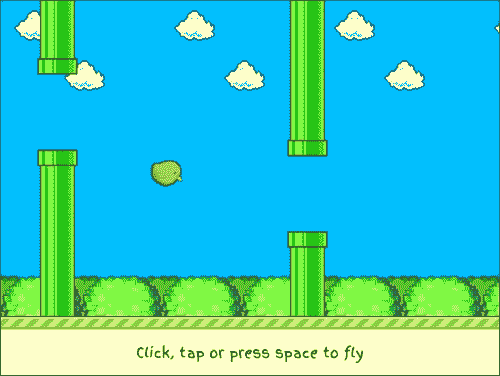
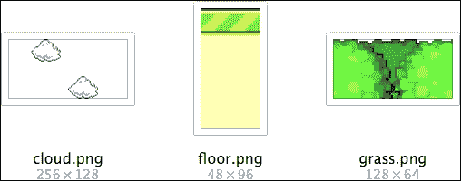
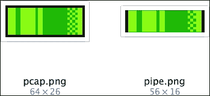
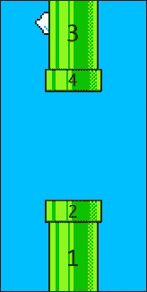
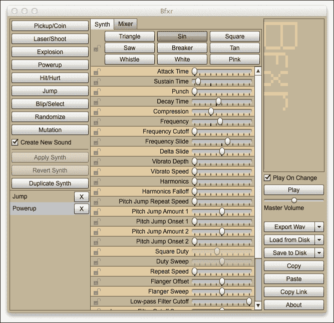

# 第七章。编写 Flappy Bird 克隆版

在第六章《制作 2048 游戏》中，我们已经对简单的游戏开发进行了尝试，以著名的**2048**谜题为例。这是逻辑上的延续：我们将构建一个街机游戏，更具体地说是一个**Flappy Bird**风格的横版滚动游戏。

Flappy Bird 是由 Dong Nguyen 在 2013 年发布的一款简单却极具吸引力的移动游戏；到 2014 年 1 月底，它已成为 iOS 应用商店下载量最大的免费游戏。从游戏设计角度来看，Flappy Bird 现象非常有趣。游戏只包含一个动作（在屏幕上任意位置点击以弹起小鸟，改变其轨迹）和一个玩家活动（在不触碰障碍物的情况下飞过障碍物间的缝隙）。这种简单且重复的游戏玩法最近已经成为一种趋势，以下章节将进行解释。

**移动游戏设计中的简约主义**

*经典*的二维街机游戏类型最近在移动设备上重新焕发生机。目前有很多复古游戏的商业再发行，价格标签几乎是唯一与 30 年前的原始标题不同的地方——这些包括 Dizzy、Sonic、Double Dragon 和 R-Type 等，仅举几个例子。

许多这些游戏在新环境中共享的一个巨大失望是控制方案的不便：现代设备中普遍存在的触摸屏和陀螺仪并不能很好地替代游戏手柄，甚至不能替代。这一事实也成为新标题的卖点——从零开始设计一个考虑到可用控制方案的游戏可以是一个巨大的胜利。

一些开发者通过在前期彻底简化事物来解决这个问题：事实证明，简单玩具市场非常大，尤其是低成本或免费（可选，广告支持）的标题。

特征非常有限的控制和游戏玩法的游戏确实可以变得非常受欢迎，Flappy Bird 刚好落在了甜蜜的点上，提供了极具挑战性、简约且易于接触的游戏玩法。在本章中，我们将使用 Kivy 重新实现这款特定的游戏设计。我们将介绍许多新事物：

+   模拟非常简单的街机物理

+   使用 Kivy 小部件作为功能齐全的游戏精灵，包括任意定位和二维变换，如旋转

+   实现基本的碰撞检测

+   制作和实现游戏音效

我们正在构建的游戏没有胜利条件，与障碍物最轻微的碰撞就会结束游戏。在原始的 Flappy Bird 标题中，玩家们竞争更高的分数（通过不撞到任何东西而通过的管道数量）。尽管如此，与上一章类似，计分板的实现故意留给你作为练习。

# 项目概述

我们的目标是创建一个在概念上与原始《Flappy Bird》相似但视觉不同的游戏。它被不富有想象力地称为**Kivy Bird**。最终结果如下所示：



Kivy Bird 游戏截图

让我们更仔细地看看游戏，将其分解成逻辑部分，创建一个用于开发的工程概要：

+   **背景**：场景由多个以不同速度移动的层组成，从而产生整洁的虚假深度（视差效果）。这种运动是恒定的，与任何游戏事件无关；这使得背景成为实现的一个理想起点。

+   **障碍物（管道）**：这是一个独立的图形层，它以恒定的速度向玩家移动。与背景不同，管道会以不同的相对高度进行程序化调整，以保持玩家可以通过的间隙。与管道碰撞将结束游戏。

+   **可玩角色（小鸟）**：这个精灵只垂直移动，不断向下坠落。玩家可以通过点击或轻触屏幕上的任何位置来推动小鸟向上，一旦小鸟碰到地面、天花板或管道，游戏就结束了。

这大致是我们将要编写的实现顺序。

# 创建一个动画背景

我们将使用以下图像来创建游戏的背景：



背景图像

注意，所有这些都可以无缝水平平铺——这不是一个严格的要求，但仍然是一个期望的特性，因为这样背景看起来更美观。

如描述中提到的，背景始终在运动，与游戏的其他部分无关。这种效果可以通过至少两种方式实现：

+   使用直接的方法，我们只需在背景中移动一个巨大的纹理多边形（或任意数量的多边形）。在这种情况下创建无缝循环动画可能需要一些工作。

+   实现相同视觉效果的一种更有效的方法是创建多个静态多边形（每个层一个），覆盖整个视口，然后仅对纹理坐标进行动画处理。使用可平铺的纹理，这种方法会产生无缝且视觉上令人愉悦的结果，并且总体工作量更小——无需重新定位对象。

我们将采用第二种方法，因为它既简单又有效。让我们从包含布局的`kivybird.kv`文件开始：

```py
FloatLayout:
    Background:
        id: background
        canvas:
            Rectangle:
                pos: self.pos
                size: (self.width, 96)
                texture: self.tx_floor

            Rectangle:
                pos: (self.x, self.y + 96)
                size: (self.width, 64)
                texture: self.tx_grass

            Rectangle:
                pos: (self.x, self.height - 144)
                size: (self.width, 128)
                texture: self.tx_cloud

```

### 提示

从现在开始，“魔法数字”主要指的是纹理尺寸：`96`是地面高度，`64`是草的高度，`144`是云的某种任意高度。在生产代码中硬编码这类东西通常是不受欢迎的，但为了简单和最小化示例代码的大小，我们偶尔会这样做。

如您所见，这里根本没有任何移动部件，只是沿着屏幕顶部和底部边缘定位了三个矩形。此场景依赖于纹理作为 `Background` 类的属性（以 `tx_` 开头）公开，我们将实现它。

## 加载可平铺纹理

我们将从一个用于加载可平铺纹理的辅助函数开始：此功能将在以下代码中大量使用，因此最好在前面将其抽象化。

做法之一是创建一个中间的 `Widget` 子类，然后将其用作自定义小部件的基类（在 `main.py` 中）：

```py
from kivy.core.image import Image
from kivy.uix.widget import Widget

class BaseWidget(Widget):
    def load_tileable(self, name):
        t = Image('%s.png' % name).texture
        t.wrap = 'repeat'
        setattr(self, 'tx_%s' % name, t)
```

需要创建辅助函数的部分是 `t.wrap = 'repeat'`。我们需要将此应用于每个平铺纹理。

在此期间，我们还使用 `tx_` 命名约定后跟图像文件名的方式存储新加载的纹理。例如，调用 `load_tileable('grass')` 将加载名为 `grass.png` 的文件，并将生成的纹理存储在 `self.tx_grass` 属性中。这种命名逻辑应该很容易理解。

## 背景小部件

能够方便地加载纹理后，我们现在可以按照以下方式实现 `Background` 小部件：

```py
from kivy.properties import ObjectProperty

class Background(BaseWidget):
    tx_floor = ObjectProperty(None)
    tx_grass = ObjectProperty(None)
    tx_cloud = ObjectProperty(None)

    def __init__(self, **kwargs):
        super(Background, self).__init__(**kwargs)

        for name in ('floor', 'grass', 'cloud'):
            self.load_tileable(name)
```

如果在此处运行代码，您将看到扭曲的纹理拉伸以填充相应的矩形；在没有明确给出纹理坐标的情况下会发生这种情况。为了修复此问题，我们需要调整每个纹理的 `uvsize` 属性，该属性表示纹理重复多少次以填充多边形。例如，`uvsize` 为 `(2, 2)` 表示纹理填充矩形的一个四分之一。

此辅助方法将用于设置 `uvsize` 到适当的值，以便我们的纹理不会扭曲：

```py
def set_background_size(self, tx):
    tx.uvsize = (self.width / tx.width, -1)
```

### 注意

负纹理坐标，如本例所示，意味着纹理会被翻转。Kivy 使用此效果来避免昂贵的光栅操作，将加载任务转移到 GPU（显卡），后者设计用于轻松处理这些操作。

此方法依赖于背景的宽度，因此每次小部件的 `size` 属性更改时，使用 `on_size()` 回调来调用它是合适的。这保持了每个纹理的 `uvsize` 同步，例如，当用户手动调整应用程序窗口大小时：

```py
def on_size(self, *args):
    for tx in (self.tx_floor, self.tx_grass, self.tx_cloud):
        self.set_background_size(tx)
```

如果做得正确，到目前为止的代码将生成类似于以下背景：


带纹理的静态背景

## 动画背景

在继续处理应用程序的其他部分之前，我们需要做的是添加背景动画。首先，我们向 `KivyBirdApp` 应用程序类添加一个大约每秒运行 60 次的单调计时器：

```py
from kivy.app import App
from kivy.clock import Clock

class KivyBirdApp(App):
    def on_start(self):
        self.background = self.root.ids.background
        Clock.schedule_interval(self.update, 0.016)

    def update(self, nap):
        self.background.update(nap)
```

目前 `update()` 方法只是将控制权传递给 `Background` 小部件的类似方法。此方法的范围将在我们程序中有更多移动部件时扩展。

在 `Background.update()` 中，我们更改纹理原点（即名为 `uvpos` 的属性）以模拟移动：

```py
def update(self, nap):
    self.set_background_uv('tx_floor', 2 * nap)
    self.set_background_uv('tx_grass', 0.5 * nap)
    self.set_background_uv('tx_cloud', 0.1 * nap)

def set_background_uv(self, name, val):
    t = getattr(self, name)
    t.uvpos = ((t.uvpos[0] + val) % self.width, t.uvpos[1])
    self.property(name).dispatch(self)
```

再次，有趣的事情发生在辅助函数 `set_background_uv()` 中：

+   它增加 `uvpos` 属性的第一个组件，水平移动纹理原点

+   它在纹理属性上调用 `dispatch()`，表示它已更改

画布指令（在 `kivybird.kv` 中）监听此变化并相应地做出反应，以更新的原点渲染纹理。这导致动画平滑。

控制不同图层动画速度的乘数（参见所有 `set_background_uv()` 调用的第二个参数）被任意选择以创建所需的视差效果。这纯粹是装饰性的；你可以随意更改它们，以见证它对动画的影响。

背景现在已经完成，接下来我们列表上的下一件事是制作管道。

# 制作管道

管道分为两部分，下部和上部，中间有一个间隙供玩家通过。每一部分，反过来，又由可变长度的主体和管道盖，或 *pcap*（管道面对间隙的固定大小加厚部分）组成。我们将使用以下图像来绘制管道：



管道图像

如果前面的解释没有引起你的共鸣，请参阅本章的第一幅插图，你将立即理解这是什么意思。

再次，`kivybird.kv` 文件中的布局提供了一个方便的起点：

```py
<Pipe>:
    canvas:
        Rectangle:
            pos: (self.x + 4, self.FLOOR)
            size: (56, self.lower_len)
            texture: self.tx_pipe
            tex_coords: self.lower_coords

        Rectangle:
            pos: (self.x, self.FLOOR + self.lower_len)
            size: (64, self.PCAP_HEIGHT)
            texture: self.tx_pcap

        Rectangle:
            pos: (self.x + 4, self.upper_y)
            size: (56, self.upper_len)
            texture: self.tx_pipe
            tex_coords: self.upper_coords

        Rectangle:
            pos: (self.x, self.upper_y - self.PCAP_HEIGHT)
            size: (64, self.PCAP_HEIGHT)
            texture: self.tx_pcap

    size_hint: (None, 1)
    width: 64
```

从概念上讲，这非常简单：在画布上渲染了四个矩形，按照源文件中出现的顺序列出：

+   下部管道主体

+   下部管道盖

+   上部管道主体

+   上部管道盖



从矩形组成管道

此列表依赖于 `Pipe` 对象的许多属性；类似于 `Background` 小部件的实现，这些属性用于将算法的 Python 实现与小部件的图形表示（画布指令）连接起来。

## 管道属性的概述

`Pipe` 小部件的所有有趣属性都在以下代码片段中展示：

```py
from kivy.properties import (AliasProperty,
                             ListProperty,
                             NumericProperty,
                             ObjectProperty)

class Pipe(BaseWidget):
    FLOOR = 96
    PCAP_HEIGHT = 26
    PIPE_GAP = 120

    tx_pipe = ObjectProperty(None)
    tx_pcap = ObjectProperty(None)

    ratio = NumericProperty(0.5)
    lower_len = NumericProperty(0)
    lower_coords = ListProperty((0, 0, 1, 0, 1, 1, 0, 1))
    upper_len = NumericProperty(0)
    upper_coords = ListProperty((0, 0, 1, 0, 1, 1, 0, 1))

    upper_y = AliasProperty(
        lambda self: self.height - self.upper_len,
        None, bind=['height', 'upper_len'])
```

首先，在 `ALL_CAPS` 中设置常量：

+   `FLOOR`：这是地面水平（地板纹理的高度）

+   `PCAP_HEIGHT`：这是管道盖的高度，也来自相应的纹理

+   `PIPE_GAP`：这是留给玩家的通道大小

接下来是纹理属性 `tx_pipe` 和 `tx_pcap`。它们的使用方式与 `Background` 类中找到的方式相同：

```py
class Pipe(BaseWidget):
    def __init__(self, **kwargs):
        super(Pipe, self).__init__(**kwargs)

        for name in ('pipe', 'pcap'):
            self.load_tileable(name)
```

`ratio` 属性指示间隙的位置：`0.5`（默认值）表示中心，`0` 是屏幕底部（在地面上），而 `1` 是屏幕顶部（在天空）。

`lower_len` 和 `upper_len` 属性表示管道长度，不包括盖子。这些是从 `ratio` 和可用的屏幕高度派生出来的。

`upper_y` 别名是一个辅助工具，用于减少输入；它是即时计算的，始终等于 `height - upper_len`（参见实现）。

这给我们留下了两个重要的属性，用于为画布指令设置纹理坐标，即`lower_coords`和`upper_coords`。

## 设置纹理坐标

在`Background`小部件的实现中，我们调整了纹理的自身属性，如`uvsize`和`uvpos`，以控制其渲染。这种方法的问题在于它会影响所有纹理实例。

只要纹理不在不同的几何形状上重复使用，这正好是背景的情况。然而，这一次，我们需要按画布原语控制纹理坐标，所以我们不会触摸`uvsize`和`uvpos`。相反，我们将使用`Rectangle.tex_coords`。

`Rectangle.tex_coords`属性接受一个包含八个数字的列表或元组，将纹理坐标分配给矩形的角落。以下截图显示了坐标到`tex_coords`列表索引的映射：


纹理坐标到矩形多边形的映射

### 注意

纹理映射通常使用`u`和`v`变量而不是`x`和`y`，这使得区分几何和纹理坐标更容易，这些坐标在代码中通常交织在一起。

## 实现管道

这个话题一开始可能听起来很复杂，所以让我们稍微简化一下：我们只会在管道上垂直调整平铺，我们只需要调整`tex_coords`的第五和第七个元素来实现我们的高尚目标。此外，`tex_coords`中的值与`uvsize`中的值具有相同的意义。

简而言之，以下函数根据管道长度调整坐标以实现正确的平铺：

```py
def set_coords(self, coords, len):
    len /= 16  # height of the texture
    coords[5:] = (len, 0, len)  # set the last 3 items
```

真的很简单吗？接下来要做的是一项既无聊又并不复杂的数学工作：根据`ratio`和屏幕高度计算管道的长度。代码如下：

```py
def on_size(self, *args):
    pipes_length = self.height - (
        Pipe.FLOOR + Pipe.PIPE_GAP + 2 * Pipe.PCAP_HEIGHT)
    self.lower_len = self.ratio * pipes_length
    self.upper_len = pipes_length - self.lower_len
    self.set_coords(self.lower_coords, self.lower_len)
    self.set_coords(self.upper_coords, self.upper_len)
```

这段代码非常明显，位于`on_size()`处理程序中，以保持所有相关属性与屏幕大小同步。为了反映对`ratio`的更改，我们可以发出以下函数调用：

```py
self.bind(ratio=self.on_size)
```

你可能已经注意到，我们还没有更改这个属性。这是因为管道的整个生命周期将由应用程序类`KivyBirdApp`处理，你很快就会看到。

## 创建管道

结果表明，为了创建一个看似无尽的管道森林的错觉，我们只需要一屏幕的管道，因为我们可以在屏幕外回收它们并将它们推到队列的后面。

我们将创建间距约为屏幕宽度一半的管道，给玩家留出一些操作空间；这意味着屏幕上一次只能看到三个管道。为了保险起见，我们将创建四个管道。

以下代码片段包含了对所述算法的实现：

```py
class KivyBirdApp(App):
    pipes = []

    def on_start(self):
        self.spacing = 0.5 * self.root.width
        # ...

    def spawn_pipes(self):
        for p in self.pipes:
            self.root.remove_widget(p)

        self.pipes = []

        for i in range(4):
            p = Pipe(x=self.root.width + (self.spacing * i))
            p.ratio = random.uniform(0.25, 0.75)
            self.root.add_widget(p)
            self.pipes.append(p)
```

应将`pipes`列表的使用视为实现细节。我们本可以遍历子小部件的列表来访问管道，但这样做更方便。

在`spawn_pipes()`方法的开始处的清理代码将允许我们稍后轻松地重新启动游戏。

我们也在这个函数中随机化每个管道的`ratio`。请注意，范围被人为地限制在[0.25, 0.75]，而技术上它是[0, 1]——缩小这个空间使得游戏更容易玩，从一门到另一门需要的垂直操作更少。

## 移动和回收管道

与我们移动纹理的`uvpos`属性以模仿移动的背景不同，管道实际上是移动的。这是修改后的`KivyBirdApp.update()`方法，它涉及重新定位和回收管道：

```py
def update(self, nap):
    self.background.update(nap)

    for p in self.pipes:
        p.x -= 96 * nap
        if p.x <= -64:  # pipe gone off screen
            p.x += 4 * self.spacing
            p.ratio = random.uniform(0.25, 0.75)
```

与之前的动画一样，`96`是一个临时的时间乘数，恰好适用；增加它会使游戏节奏更快。

当推回一个管道时，我们再次随机化它的`ratio`，为玩家创造一条独特的路径。以下截图总结了到目前为止无限循环的结果：


移动管道和背景 – 一个 Flappy Bird 主题的屏保

# 介绍基维鸟

接下来在我们的列表中是可玩的角色，即生物上不可能存在的基维鸟：


稀有物种，基维鸟精灵

这次将不会有与纹理相关的任何花哨的东西；实际上，`Bird`类将从 Kivy 的`Image`小部件（`kivy.uix.image.Image`）派生出来，以完全避免进行任何复杂的渲染。

在`kivybird.kv`中，我们需要涉及之前描述的鸟的图像的最小属性；其初始位置和大小如下所示：

```py
Bird:
    id: bird
    pos_hint: {'center_x': 0.3333, 'center_y': 0.6}
    size: (54, 54)
    size_hint: (None, None)
    source: 'bird.png'
```

这是 Python 中`Bird`类的初始实现：

```py
from kivy.uix.image import Image as ImageWidget

class Bird(ImageWidget):
    pass
```

是的，它什么也不做。很快，我们将通过添加基本的物理和其他东西来破坏它，但首先我们需要在应用程序类中做一些基础工作，以便使游戏状态化。

## 修改后的应用程序流程

现在，我们将模仿原始游戏：

1.  首先，我们将只显示小鸟坐在那里，没有任何管道或重力。这种状态在代码中将表示为`playing = False`。

1.  用户一旦与游戏互动（无论是点击或触摸屏幕上的任何位置，还是按下键盘上的空格键），状态就会变为`playing = True`，管道开始生成，重力开始影响小鸟，它像一块石头一样掉入想象中的死亡。用户需要继续与游戏互动，以保持小鸟在空中。

1.  如果发生碰撞，游戏将回到`playing = False`状态，直到下一次用户互动，然后从步骤 2 重新启动这个过程。

为了实现这一点，我们需要接收用户输入。幸运的是，这几乎是微不足道的，特别是我们只对事件发生的事实感兴趣（例如，我们不是检查点击或触摸的位置——在这个游戏中，整个屏幕就是一个大按钮）。

### 接受用户输入

让我们立即查看实现，因为在这个特定主题上几乎没有讨论的余地：

```py
from kivy.core.window import Window, Keyboard

class KivyBirdApp(App):
    playing = False

    def on_start(self):
        # ...
        Window.bind(on_key_down=self.on_key_down)
        self.background.on_touch_down = self.user_action

    def on_key_down(self, window, key, *args):
        if key == Keyboard.keycodes['spacebar']:
            self.user_action()

    def user_action(self, *args):
        if not self.playing:
            self.spawn_pipes()
            self.playing = True
```

这是我们将要需要的整个用户输入处理：`on_key_down`事件处理键盘输入，检查特定键（在这种情况下，是空格键）。`on_touch_down`事件处理其余操作——点击、轻触等。两者最终都会调用`user_action()`方法，该方法进而调用`spawn_pipes()`并将`playing`设置为`True`（仅在需要时）。

## 学习直线下降飞行

接下来，我们将实现重力，使我们的鸟至少能向一个方向飞行。为此，我们将引入一个新的`Bird.speed`属性和一个新的常量——自由落体的加速度。速度向量将每帧向下增长，从而产生均匀加速的下降动画。

以下列表包含描述的射击小鸟的实现：

```py
class Bird(ImageWidget):
    ACCEL_FALL = 0.25

    speed = NumericProperty(0)

    def gravity_on(self, height):
        # Replace pos_hint with a value
        self.pos_hint.pop('center_y', None)
        self.center_y = 0.6 * height

    def update(self, nap):
        self.speed -= Bird.ACCEL_FALL
        self.y += self.speed
```

当`playing`变为`True`时，将调用`gravity_on()`方法。将高亮行插入到`KivyBirdApp.user_action()`方法中：

```py
if not self.playing:
    self.bird.gravity_on(self.root.height)
    self.spawn_pipes()
    self.playing = True
```

此方法实际上重置了小鸟的初始位置，并通过从`pos_hint`中移除`'center_y'`约束来允许垂直运动。

### 注意

`self.bird`引用与之前见过的`self.background`类似。以下代码片段应位于`KivyBirdApp.on_start()`方法中：

```py
self.background = self.root.ids.background
self.bird = self.root.ids.bird
```

这只是为了方便。

我们还需要在`KivyBirdApp.update()`中调用`Bird.update()`。同时，这也是放置一个保护器的完美机会，防止在游戏对象未播放时进行无用的更新：

```py
    def update(self, nap):
        self.background.update(nap)
        if not self.playing:
 return  # don't move bird or pipes

 self.bird.update(nap)
        # rest of the code omitted
```

正如你所见，无论发生什么情况，都会调用`Background.update()`方法；其他所有操作只有在必要时才会被调用。

在这个实现中缺少的是保持空中飞行的能力。这是我们下一个要讨论的主题。

### 保持飞行状态

实现 Flappy Bird 风格的跳跃飞行非常简单。我们只需暂时覆盖`Bird.speed`，将其设置为正值，然后让它在小鸟继续下落时正常衰减。让我们向`Bird`类添加以下方法：

```py
ACCEL_JUMP = 5

def bump(self):
    self.speed = Bird.ACCEL_JUMP
```

现在我们需要在`KivyBirdApp.user_action()`函数的末尾添加对`self.bird.bump()`的调用，在那里，一切就绪：我们可以通过连续按空格键或点击视口内部来保持在空中。

## 旋转小鸟

旋转小鸟是一个简短的主题，与小鸟的物理特性无关，而是专注于视觉效果。如果小鸟向上飞行，它的鼻子应该指向屏幕右上角的一般方向，当它下降时，则指向屏幕右下角。

估算角度的最简单方法是用`Bird.speed`的值：

```py
class Bird(ImageWidget):
    speed = NumericProperty(0)
    angle = AliasProperty(
        lambda self: 5 * self.speed,
        None, bind=['speed'])
```

再次强调，这里显示的乘数完全是任意的。

现在，为了实际上旋转精灵，我们可以在`kivybird.kv`文件中引入以下定义：

```py
<Bird>:
    canvas.before:
        PushMatrix
        Rotate:
            angle: root.angle
            axis: (0, 0, 1)
            origin: root.center

    canvas.after:
        PopMatrix
```

这个操作改变了 OpenGL 为这个精灵使用的本地坐标系，可能会影响所有后续的渲染。别忘了保存（`PushMatrix`）和恢复（`PopMatrix`）坐标系状态；否则，可能会发生灾难性的故障，整个场景可能会扭曲或旋转。

### 注意

反过来也是如此：如果你遇到无法解释的应用程序范围内的渲染问题，查找未正确作用域的低级 OpenGL 指令。

在这些更改之后，鸟应该正确地调整自己的飞行轨迹。

# 碰撞检测

对于游戏玩法来说，最重要的是碰撞检测，当鸟与地面、天花板或管道碰撞时，游戏结束。

检查我们是否达到了地面或天花板，就像比较 `bird.y` 与地面水平或屏幕高度（在第二次比较时考虑到鸟本身的高度）。在 `KivyBirdApp` 中，我们有以下代码

```py
def test_game_over(self):
    if self.bird.y < 90 or \
            self.bird.y > self.root.height - 50:
        return True

    return False
```

当寻找与管道的碰撞时，情况稍微复杂一些，但并不十分复杂。我们可以将接下来的检查分为两部分：首先，我们使用 Kivy 内置的 `collide_widget()` 方法测试水平碰撞，然后检查垂直坐标是否在进入的管道的 `lower_len` 和 `upper_len` 属性所规定的范围内。

因此，`KivyBirdApp.test_game_over()` 方法的修订版如下所示：

```py
    def test_game_over(self):
        screen_height = self.root.height

        if self.bird.y < 90 or \
                self.bird.y > screen_height - 50:
            return True

        for p in self.pipes:
            if not p.collide_widget(self.bird):
                continue

            # The gap between pipes
            if (self.bird.y < p.lower_len + 116 or
                self.bird.y > screen_height - (
                    p.upper_len + 75)):
                return True

        return False
```

这个函数仅在所有检查都失败时返回 `False`。这可以进一步优化，以一次测试最多一个管道（在屏幕上与鸟大致在同一区域的管道；考虑到它们之间有足够的间隔，这样的管道最多只有一个）。

## 游戏结束

那么，当确实发现碰撞时会发生什么？实际上，非常少；我们只需将 `self.playing` 切换为 `False`，就结束了。检查可以在所有其他计算完成后添加到 `KivyBirdApp.update()` 的底部：

```py
def update(self, nap):
    # ...
    if self.test_game_over():
        self.playing = False
```

这将停止游戏，直到用户触发另一个交互，重新开始游戏。编写碰撞检测代码最有回报的部分是进行游戏测试，以多种有趣的方式触发游戏结束状态：


探索失败的不同方法（拼贴）

如果没有胜利条件，那么至少失败应该是有趣的。

# 制作音效

这一部分将不会特别关注 Kivy 鸟游戏本身；更多的是概述可以用于向游戏或应用程序添加音效的各种工具。

声音效果的最大问题很少是技术性的。创建高质量的音效不是一件小事，而且软件工程师通常不是技艺高超的音乐家或音频工程师。此外，大多数应用程序实际上在没有声音的情况下也是可用的，这就是为什么音频很容易在开发过程中被故意忽视或忽略。

幸运的是，有一些工具可以方便地制作出质量不错的音效，同时不需要任何特定领域的知识。一个完美的例子是**Bfxr**，这是一个专门针对偶尔进行游戏开发的合成器。它可以在[www.bfxr.net](http://www.bfxr.net)免费获得。

Bfxr 工具系列的用法归结为点击预设按钮，直到生成一个好听的声音，然后点击**保存到磁盘**以将结果存储为`.wav`（未压缩声音）文件。



Bfxr 的用户界面一开始可能看起来不太友好，但实际上非常容易使用

这是一款在提高生产力方面非常出色的工具。使用 Bfxr，你可以在几分钟内就创造出可用的音效——而且这些音效将（大部分）仅适用于你的应用程序。对于许多业余游戏开发者来说，这个程序真正是一个变革性的工具，这不是字面上的意思。

## Kivy 音效播放

在程序方面，Kivy 提供的播放 API 非常简单：

```py
from kivy.core.audio import SoundLoader

snd = SoundLoader.load('sound.wav')
snd.play()
```

`play()`方法开始播放，就这么多。嗯，实际上并不是：这种简单的方法存在一些问题，尤其是在游戏中。

在许多游戏场景中，可能需要连续快速地播放相同的音效，以便样本重叠。以自动射击为例。Kivy 的`Sound`类（尽管并非特有，例如 HTML5 中的`<audio>`标签也有类似行为）的问题在于它只允许在任何给定时间播放一个样本实例。

选项如下：

+   等待之前的播放结束（默认行为，所有后续事件都将静音）

+   对于每个事件停止并重新开始播放，这也是一个问题（这可能会引入不必要的延迟、点击或其他音频伪影）

为了解决这个问题，我们需要创建一个`Sound`对象的池（实际上是一个队列），以便每次调用`play()`都涉及另一个`Sound`。当队列耗尽时，我们将其重置并从头开始。给定足够大的队列，我们可以完全消除上述`Sound`限制。实际上，这样的池的大小很少超过 10。

让我们看看描述技术的实现：

```py
class MultiAudio:
    _next = 0

    def __init__(self, filename, count):
        self.buf = [SoundLoader.load(filename)
                    for i in range(count)]

    def play(self):
        self.buf[self._next].play()
        self._next = (self._next + 1) % len(self.buf)
```

使用方法如下：

```py
snd = MultiAudio('sound.wav', 5)
snd.play()
```

构造函数的第二个参数代表池的大小。注意我们如何保持与现有`Sound` API 的基本兼容性，即`play()`方法。这允许在简单场景中使用代码作为`Sound`对象的直接替换。

## 为 Kivy Bird 游戏添加音效

为了用一个实际例子结束，让我们为我们在本章中编写的 Kivy Bird 游戏添加音效。

有两种常见的事件可能需要配乐，即鸟儿爬升和鸟儿与物体碰撞触发游戏结束状态。

前者事件，由点击或轻触引发，确实可能非常频繁地连续发生；我们将为此使用一个样本池。后者，游戏结束，不可能发生得那么快，所以将其保留为普通的 `Sound` 对象是完全可以的：

```py
snd_bump = MultiAudio('bump.wav', 4)
snd_game_over = SoundLoader.load('game_over.wav')
```

此代码使用了之前布置的 `MultiAudio` 类。唯一剩下的事情就是在适当的位置放置对 `play()` 方法的调用，如下面的代码片段所示：

```py
if self.test_game_over():
    snd_game_over.play()
    self.playing = False

def user_action(self, *args):
    snd_bump.play()

```

从现在开始，游戏玩法将伴随着撕心裂肺的声音。这标志着 Kivy 鸟游戏教程的结束；我希望你们喜欢。

# 摘要

在本章中，我们使用简单的构建块，如画布指令和小部件，制作了一个小的 Kivy 游戏。

作为 UI 工具包，Kivy 做了很多正确的事情，其非凡的灵活性允许你构建几乎任何东西，无论是另一个无聊的 Twitter 客户端还是一款视频游戏。值得特别提一下的是 Kivy 对属性的实现——这些属性在组织数据流方面非常有帮助，并帮助我们有效地消除无用的更新（例如，在属性未更改的情况下重绘）。

关于 Kivy 的另一件可能令人惊讶且反直觉的事情是其相对较高的性能——尤其是在 Python 并非以其极快的速度而闻名的情况下。这主要是因为 Kivy 的底层子系统是用 Cython 编写的，并编译成非常快速的机器码，性能水平与例如 C 语言相当。此外，如果正确实施，使用硬件加速的图形几乎可以保证平滑的动画。

我们将在下一章探讨提高渲染性能的主题。
