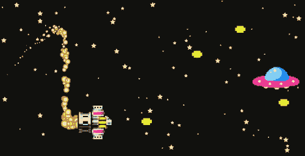
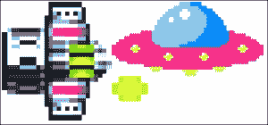
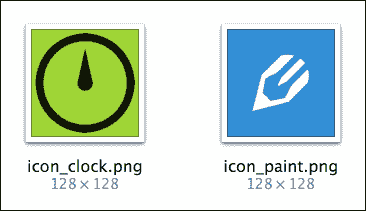
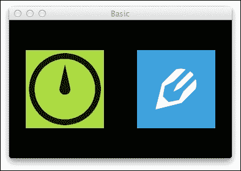
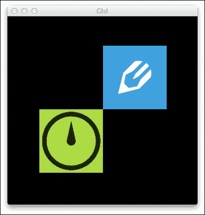
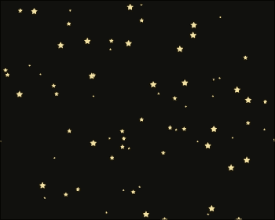
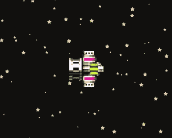
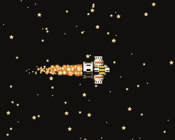
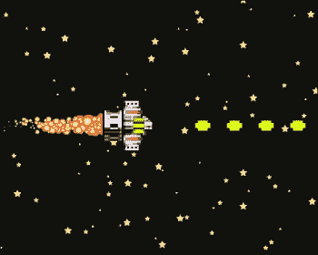
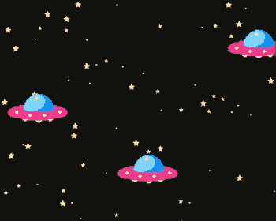

# 第九章。制作射击游戏

欢迎来到 Kivy 蓝图的最后一章。在本教程中，我们将构建一个射击游戏（或简称为*shmup*）——一个关于无限射击的快节奏动作游戏。

这是一个小预览，以激发你的兴趣：



游戏中：玩家（在左侧）试图摧毁无防御能力的飞碟（在右侧）

同时在屏幕上展示具有许多动态部分的应用程序，尤其是移动（或多平台）游戏，很大程度上依赖于一个强大的渲染器。这是我们将在本书末尾尝试开发的，部分基于第八章中讨论的星系屏幕保存在源代码，*介绍着色器*。

本章还将涵盖以下主题：

+   在 Kivy 中使用纹理图集，包括手动解包纹理坐标以用于底层代码

+   基于 GLSL 的粒子系统的进一步开发以及使用粒子系统创建不同的游戏内实体

+   实现二维射击游戏的机制——一个适合鼠标和触摸屏的控制方案，基本的子弹碰撞检测，等等

与本书中的所有其他代码一样，你可以在 GitHub 上找到所有源代码的最新版本，在[`github.com/mvasilkov/kb`](https://github.com/mvasilkov/kb)。在跟随教程时定期查阅应用程序的完整源代码，因为这有助于理解上下文，并使程序流程更加易于理解。

# 项目的局限性

我们正在编写的射击游戏在功能上将会非常简约。特别是，以下是一些限制条件：

+   为了清晰起见，省略了整个激励部分（胜利和游戏结束条件）。一旦你对游戏玩法满意，它应该很容易实现。

+   在我们的游戏版本中，只有一个敌人类型，并且有一个简单的移动模式。

+   故意错过了许多优化机会，以使代码更加简洁和易于阅读。

这些留作读者的练习，如果你愿意做更多的工作。但首先，让我们回顾一下 Kivy 中纹理图是如何工作的——我们将在粒子系统代码中稍后依赖它们。

# 一瞥纹理图集

纹理图集（也称为精灵图集）是将应用程序中使用的图像组合成更大的复合纹理的方法。与我们在以前的项目中那样加载大量单个图像相比，这样做有几个优点：

+   应用程序应该打开得更快；通常情况下，读取一个大型文件比读取几个较小的文件要便宜。这听起来可能微不足道，直到你拥有数百个纹理，那时它就会变得相当明显——尤其是在网络上：HTTP 请求增加了相当大的开销，这可能会在连接受限的移动设备上成为一项交易破坏者。

+   当不需要重新绑定纹理时，渲染也会变得稍微快一些。有效地使用纹理图意味着只有纹理坐标会受到任何可能导致切换纹理的变化的影响。

+   前一点也使得纹理图更适合在只有一个大型模型的情况下使用，例如我们的基于 GLSL 的渲染器。再次强调，纹理坐标成本低，重新绑定纹理并不昂贵。

### 注意

如果你来自 HTML 和 CSS 背景，那么你可能已经听说过在网页开发中使用的非常类似的方法，称为 CSS 图标。其基本原理相同，只是没有 GLSL 部分。由于网络应用主要是通过网络交付的，因此即使是少量图像，使用 CSS 图标也能带来显著的收益——每个消除的 HTTP 请求都很重要。

在本章的这一部分，我们将回顾以下主题：

+   使用 Kivy 内置的 CLI 工具创建纹理图

+   `.atlas` 文件格式和结构

+   在基于 Kivy 的应用程序中使用纹理图

如果你已经熟悉 Kivy 纹理图，可以直接跳到 *使用 GLSL 的纹理图即席使用* 部分。

## 创建纹理图

与网络开发不同，网络开发中尚未出现用于此特定任务的标准工具，Kivy 框架附带了一个有用的命令行工具用于纹理图。其调用方式如下：

```py
python –m kivy.atlas <atlas_name> <texture_size> <images…>
```

在 Mac 上，将 `python` 替换为 `kivy`——这是 `Kivy.app` 提供的用于调用 Kivy 感知 Python 解释器的传统命令。

这将创建两个或更多文件，具体取决于所有图像是否都适合单个请求大小的复合纹理。在本教程中，我们假设 `texture_size` 的值足够大，可以包含每张最后的图像。

所有输出文件都将以你在命令行上提供的 `atlas_name` 参数命名：

+   纹理图索引将被命名为 `<atlas_name>.atlas`

+   纹理有一个额外的序号后缀——`<atlas_name>-0.png`（这个总是创建的），`<atlas_name>-1.png`，依此类推

## 纹理图结构

任何给定纹理图的索引，`.atlas`，基本上是一个 **JavaScript 对象表示法**（**JSON**）文件，描述了单个纹理在图上的位置。其内容看起来如下（格式化以提高可读性）：

```py
{
    "game-0.png": {
        "player": [2, 170, 78, 84],
        "bullet": [82, 184, 24, 16]
    }
}
```

纹理将以其对应的源图像命名，不带扩展名：一个 `foo.png` 文件将变成 `foo`。每个记录中的数字描述了大型纹理中的一个区域：`[x, y, width, height]`，其中所有值都是以像素为单位。

合成纹理大致相当于从图像拼接中预期的效果，如下一图所示。通常，它会被紧密地打包以有效地利用大部分面积。

### 注意

在创建图集时，Kivy 会小心处理单个精灵的边缘，考虑到与舍入相关的可能渲染伪影。这就是为什么可能会注意到精灵边缘有额外的像素。这种效果并不总是可见的，但当它出现时，请不要担心——这是设计的一部分，并且有很好的原因。



纹理图集仅仅是较小图像的拼接

在常规基于 Kivy 的代码中使用图集，就像用特殊协议 `atlas:`（在概念上类似于 `http:`）替换文件路径一样简单。正如你已经知道的，Kivy 语言中的常规文件引用看起来类似于下面的代码片段：

```py
Image:
    source: 'flags/Israel.png'
```

然而，图集引用将使用以下标记：

```py
Image:
    source: 'atlas://flags/Israel'
```

继续阅读以获取创建和使用传统 Kivy 应用中图集的完整（尽管非常简单）示例，这有点像“hello world”。

## 以简单的方式使用 Kivy 图集

为了本例的目的，让我们从我们之前的两个项目中借用两个图标，并将它们命名为 `icon_clock.png` 和 `icon_paint.png`：



用于制作示例图集的单独图标

要创建图集，我们打开终端并输入以下命令：

```py
kivy -m kivy.atlas icons 512 icon_clock.png icon_paint.png
```

记住，当不在 Mac 上时，将 `kivy` 命令替换为 `python`。然而，`kivy.atlas` 部分在所有系统上保持不变。

图集实用工具应该会返回类似以下内容：

```py
[INFO] Kivy v1.8.0
[INFO] [Atlas] create an 512x512 rgba image
('Atlas created at', 'icons.atlas')
1 image have been created
```

在成功完成上述命令后，应在同一文件夹中出现几个新文件——`icons.atlas` 和 `icons-0.png`。

### 小贴士

在此阶段，可以安全地删除源图像。建议你仍然保留它们，以防将来需要重建图集，例如，在添加新图像或替换现有图像时。

图集已准备就绪。至于使用，我们可以在几行 Python 和 Kivy 语言中创建一个简单的演示应用。

Python 源文件 `basic.py` 包含一个基本的 Kivy 应用：

```py
from kivy.app import App

class BasicApp(App):
    pass

if __name__ == '__main__':
    BasicApp().run()
```

这非常简单，仅用于（自动）加载在 `basic.kv` 文件中定义的布局。伴随的 Kivy 语言文件内容如下：

```py
BoxLayout:
    orientation: 'horizontal'

    Image:
        source: 'atlas://icons/icon_clock'

    Image:
        source: 'atlas://icons/icon_paint'
```

这种简单的图集使用会产生以下布局，这基本上是你从源代码中看到的内容：



Kivy 图集的基本用法

如你所见，除了前面描述的 `atlas:` 协议之外，这个例子中没有什么新或引人入胜的内容。所以，让我们继续解析纹理图集及其更高级的使用。

## 在 GLSL 中使用图集的临时用法

Kivy 内置对图集的支持对于简单情况来说效果很好，但对我们基于 GLSL 的自定义应用程序来说就不那么好了，该应用程序自行管理所有渲染、纹理等。

幸运的是，`.atlas` 文件格式是 JSON，这意味着我们可以轻松地使用 Python 标准库中的 `json` 模块来解析它。之后，我们应该能够将文件中给出的像素坐标转换为 UV 坐标，以便用于 OpenGL 程序。

由于我们知道每个纹理的绝对大小，我们也可以轻松地计算每个精灵相对于中心的顶点位置。这有助于轻松渲染精灵的“原始形式”，保持大小和宽高比不变。

### UV 映射的数据结构

总的来说，每个精灵有很多值。为了保持可维护性，我们可以定义一个轻量级的记录类型（一个命名元组）来将这些值组合在一起：

```py
from collections import namedtuple

UVMapping = namedtuple('UVMapping', 'u0 v0 u1 v1 su sv')
```

如果你不太熟悉 Python 中的命名元组，从用户的角度来看，这基本上等同于以下无逻辑类型，在概念上类似于 C 中的 `struct` 组合类型：

```py
class UVMapping:
    def __init__(self, u0, v0, u1, v1, su, sv):
        self.u0 = u0  # top left corner
        self.v0 = v0  # ---
        self.u1 = u1  # bottom right corner
        self.v1 = v1  # ---
        self.su = su  # equals to 0.5 * width
        self.sv = sv  # equals to 0.5 * height
```

注意，这段代码纯粹是说明性的，前面的 `namedtuple()` 定义实际上并没有扩展到这一点——然而，用户界面与此相似。

每个字段的含义在以下表中给出：

| 字段 | 描述 |
| --- | --- |
| `u0, v0` | 精灵左上角 UV 坐标 |
| `u1, v1` | 精灵右下角 UV 坐标 |
| `su` | 精灵宽度除以 2；这个值在构建顶点数组时很有用 |
| `sv` | 精灵高度除以 2；这与前面的字段类似 |

命名字段提供了对记录内不同值的直接访问，这大大提高了可读性：`tup.v1` 比起 `tup[3]` 来说读起来要好得多。同时，`UVMapping` 实质上是一个元组，一个不可变且内存高效的具有所有字段的数据结构，如果需要，可以通过索引访问。

### 编写图集加载器

现在，让我们编写一个函数来实现到目前为止所讨论的所有内容：JSON 解析、坐标修正等等。这个函数也将用于最终的程序：

```py
import json
from kivy.core.image import Image

def load_atlas(atlas_name):
    with open(atlas_name, 'rb') as f:
        atlas = json.loads(f.read().decode('utf-8'))

    tex_name, mapping = atlas.popitem()
    tex = Image(tex_name).texture
    tex_width, tex_height = tex.size

    uvmap = {}
    for name, val in mapping.items():
        x0, y0, w, h = val
        x1, y1 = x0 + w, y0 + h
        uvmap[name] = UVMapping(
            x0 / tex_width, 1 - y1 / tex_height,
            x1 / tex_width, 1 - y0 / tex_height,
            0.5 * w, 0.5 * h)

    return tex, uvmap
```

### 小贴士

请记住，我们只支持最简单的情况：只有一个复合纹理的图集。这可能是最有用的配置，所以这种限制对我们的代码几乎没有任何影响，尤其是考虑到图集生成完全在我们控制之下。

我们正在反转纵轴，因为坐标最初是在 Kivy 的坐标系中给出的，而使用以左上角为原点的 OpenGL 坐标系会更好。否则，精灵将会颠倒过来（顺便说一句，这对我们这个小游戏中的大多数精灵来说不是问题。这意味着这样的错误可能已经在代码库中存在很长时间了——未被发现且实际上无害）。

`load_atlas('icons.atlas')` 调用返回从 `icons-0.png` 加载的复合纹理以及图集中包含的每个纹理的描述：

```py
>>> load_atlas('icons.atlas')

(<Texture size=(512, 512)...>,
 {'icon_paint': UVMapping(u0=0.2578125, v0=0.00390625,
                          u1=0.5078125, v1=0.25390625,
                          su=64.0, sv=64.0),
  'icon_clock': UVMapping(...)})
```

(数字在你这里可能显然会有所不同。)

这种数据格式足以从纹理中挑选出单个精灵并在屏幕上渲染——这正是我们接下来要做的。

### 从图集中渲染精灵

带着上述函数，让我们修改之前的演示，使用相同的纹理图和 GLSL。

源代码 `tex_atlas.py` 在概念上与第八章中的简单 GLSL 示例相似，*着色器介绍*。它使用 `load_atlas()` 函数来填充顶点数组：

```py
from kivy.graphics import Mesh
from kivy.graphics.instructions import RenderContext
from kivy.uix.widget import Widget

class GlslDemo(Widget):
    def __init__(self, **kwargs):
        Widget.__init__(self, **kwargs)
        self.canvas = RenderContext(use_parent_projection=True)
        self.canvas.shader.source = 'tex_atlas.glsl'

        fmt = (
            (b'vCenter',     2, 'float'),
            (b'vPosition',   2, 'float'),
            (b'vTexCoords0', 2, 'float'),
        )

        texture, uvmap = load_atlas('icons.atlas')

        a = uvmap['icon_clock']
        vertices = (
            128, 128, -a.su, -a.sv, a.u0, a.v1,
            128, 128,  a.su, -a.sv, a.u1, a.v1,
            128, 128,  a.su,  a.sv, a.u1, a.v0,
            128, 128, -a.su,  a.sv, a.u0, a.v0,
        )
        indices = (0, 1, 2, 2, 3, 0)

        b = uvmap['icon_paint']
        vertices += (
            256, 256, -b.su, -b.sv, b.u0, b.v1,
            256, 256,  b.su, -b.sv, b.u1, b.v1,
            256, 256,  b.su,  b.sv, b.u1, b.v0,
            256, 256, -b.su,  b.sv, b.u0, b.v0,
        )
        indices += (4, 5, 6, 6, 7, 4)

        with self.canvas:
            Mesh(fmt=fmt, mode='triangles',
                 vertices=vertices, indices=indices,
                 texture=texture)
```

代码本质上只是将 `load_atlas()` 函数的输出数据复制到 `vertices` 数组中，除了常规的 GLSL 初始化序列。我们选择了两个不同的记录：`icon_clock`（为了简洁存储为 `a` 变量）和 `icon_paint`（命名为 `b`，与 `a` 类似），然后将它们推入顶点数组中。

在这个例子中，我们的顶点格式非常简单：

+   **vCenter**：这是精灵在屏幕上的位置。对于给定精灵的所有顶点，这个值应该是相同的

+   **vPosition**：这是相对于精灵中心的顶点位置，不受之前值的影响

+   **vTexCoords0**：这是每个顶点的纹理坐标（UV）。它决定了将渲染大纹理的哪个部分。

从这些中，只有精灵位置（列表中的前两列原始数字）不能从 UV 映射中推导出来；其他所有内容都来自 `load_atlas()` 调用。

这里是相应的着色器代码，`tex_atlas.glsl`：

```py
---vertex
$HEADER$

attribute vec2 vCenter;

void main(void)
{
    tex_coord0 = vTexCoords0;
    mat4 move_mat = mat4
        (1.0, 0.0, 0.0, vCenter.x,
         0.0, 1.0, 0.0, vCenter.y,
         0.0, 0.0, 1.0, 0.0,
         0.0, 0.0, 0.0, 1.0);
    vec4 pos = vec4(vPosition.xy, 0.0, 1.0) * move_mat;
    gl_Position = projection_mat * modelview_mat * pos;
}

---fragment
$HEADER$

void main(void)
{
    gl_FragColor = texture2D(texture0, tex_coord0);
}
```

这只有最小的功能——定位和纹理——内置。最终游戏中将使用类似的着色器，并添加相对尺寸属性 `vScale`。

### 小贴士

如果你不懂着色器代码中的内容，请回到第八章，*着色器介绍*：它包含了一些你可能认为与当前讨论相关的示例。

最终的结果，尽管可能看起来不太有趣，在这里展示：



使用 GLSL 从图集中渲染精灵

通过这种方式，我们可以继续开发一个通用的基于精灵的粒子系统，它将反过来成为所有游戏对象的基础。

# 设计一个可重用的粒子系统

在本节中，我们将编写一个粒子系统，稍后它将被用来创建游戏中的几乎所有东西——宇宙飞船、子弹等等。这是在屏幕上有许多类似对象且运动和交互逻辑非常简单的情况下使用的通用方法。

这个主题将利用前一章的代码。实际上，前一章的整体星系屏幕保护程序是一个很好的粒子系统示例；然而，它缺乏必要的可配置性，并且不能轻易地重新使用。我们将在不显著更改 GLSL 和相关代码的情况下改变这一点。

### 注意

值得注意的是，所选的方法——为每个粒子渲染纹理四边形——在低级渲染方面并不是最优的。优点在于，它非常直接，易于推理，并且与任何支持 GLSL 的 OpenGL 实现兼容。

如果你选择更系统地学习 OpenGL，你可能想用点精灵或类似的概念来替换四边形；这些增强功能超出了本书的范围。

## 类层次结构

我们的粒子系统 API 将包括两个类：`PSWidget`，负责所有渲染，以及一个轻量级的`Particle`类来表示单个粒子。

这些类将按设计紧密耦合，这在经典面向对象编程中通常是不受欢迎的，但在此情况下可以显著提高性能：粒子将直接访问渲染器中的顶点数组以修改网格——考虑到许多粒子同时处于活动状态，减少复制可以带来巨大的优势。

粒子系统小部件的实现与其他我们迄今为止看到的基于 GLSL 的小部件没有实质性区别，除了现在它旨在被继承以供实际使用。`PSWidget`和`Particle`都是抽象基类，也就是说，不能通过调用例如`PSWidget()`等方式直接实例化。

有不同的方法来强制这种限制。我们可以使用 Python 标准库中的`abc`模块来创建真正的抽象基类（`abc`实际上就是指这个）。虽然这可能被认为对 Java 程序员等有用，但这并不是 Python 开发者通常采取的方法。

为了简单起见，我们将编写适当的占位符（存根），对于所有需要重写的方法抛出`NotImplementedError`异常。这将使基类在未使用元类和复杂继承的情况下在技术上不可用，正如`abc`模块所建议的。

### PSWidget 渲染器类

不再赘述，让我们看看`PSWidget`的创建：

```py
class PSWidget(Widget):
    indices = []
    vertices = []
    particles = []

    def __init__(self, **kwargs):
        Widget.__init__(self, **kwargs)
        self.canvas = RenderContext(use_parent_projection=True)
        self.canvas.shader.source = self.glsl

        self.vfmt = (
            (b'vCenter', 2, 'float'),
            (b'vScale', 1, 'float'),
            (b'vPosition', 2, 'float'),
            (b'vTexCoords0', 2, 'float'),
        )

        self.vsize = sum(attr[1] for attr in self.vfmt)

        self.texture, self.uvmap = load_atlas(self.atlas)
```

这实际上是我们已经在所有 GLSL 示例中看到的基本相同的初始化过程，只是有些字段留空（它们是从子类借用的，子类必须设置这些）。`self.glsl`属性将保存着色器的文件名，而`self.atlas`是纹理图的文件名，它将作为此渲染器实例的唯一纹理来源。

注意我们在这里没有填充顶点数组：这项工作留给子类来完成。然而，我们应该提供一个简单的方法，让子类能够与我们的内部数据结构一起工作。因此，以下`PSWidget`方法被用来轻松添加大量类似的粒子：

```py
def make_particles(self, Cls, num):
    count = len(self.particles)
    uv = self.uvmap[Cls.tex_name]

    for i in range(count, count + num):
        j = 4 * i
        self.indices.extend((
            j, j + 1, j + 2, j + 2, j + 3, j))

        self.vertices.extend((
            0, 0, 1, -uv.su, -uv.sv, uv.u0, uv.v1,
            0, 0, 1,  uv.su, -uv.sv, uv.u1, uv.v1,
            0, 0, 1,  uv.su,  uv.sv, uv.u1, uv.v0,
            0, 0, 1, -uv.su,  uv.sv, uv.u0, uv.v0,
        ))

        p = Cls(self, i)
        self.particles.append(p)
```

这将实例化请求的`Cls`类粒子数量（`num`），将它们添加到部件的`self.particles`列表中，并同时在`self.vertices`中填充。每种粒子类型都应该公开一个`tex_name`属性，用于在 UV 映射中查找正确的精灵，该映射是从早期从图集（`PSWidget.uvmap`）派生出来的。

严格来说，这个辅助函数是可选的，但非常有用。对这个方法的调用将在渲染之前包含在部件的具体类的初始化过程中。

部件基类的最后一部分是渲染：

```py
def update_glsl(self, nap):
    for p in self.particles:
        p.advance(nap)
        p.update()

    self.canvas.clear()

    with self.canvas:
        Mesh(fmt=self.vfmt, mode='triangles',
             indices=self.indices, vertices=self.vertices,
             texture=self.texture)
```

从`canvas.clear()`调用开始，这几乎与所有基于 GLSL 的示例中使用的代码相同。函数的开始部分更有趣。我们遍历所有粒子，并对每个粒子调用两个方法：`advance()`方法计算粒子的新状态（由粒子自己决定这样做，不一定类似于任何可见的变化），而`update()`方法则将必要的数据与顶点数组中的内部状态保持同步，如果有的话。

### 提示

这种关注点的分离，虽然对性能不是最佳，但有助于提高可读性。当（如果）优化时，首先考虑以下要点：

+   这个循环可以并且应该被并行化，全部或部分并行化。

+   这段代码也可以在另一个线程中运行，并且不是每帧都更新（同样，这种优化可能适用于选定的粒子类，例如不影响主程序流程的背景内容）。

这些方法，以及粒子的其他实现细节，将在接下来的章节中描述。

### 粒子类

在下面的代码中，我们回顾了另一个基类，`Particle`，它代表单个精灵。它类似于星系项目中的`Star`类，但没有运动逻辑（这将在后续的子类中实现）：

```py
class Particle:
    x = 0
    y = 0
    size = 1

    def __init__(self, parent, i):
        self.parent = parent
        self.vsize = parent.vsize
        self.base_i = 4 * i * self.vsize
        self.reset(created=True)

    def update(self):
        for i in range(self.base_i,
                       self.base_i + 4 * self.vsize,
                       self.vsize):
            self.parent.vertices[i:i + 3] = (
                self.x, self.y, self.size)

    def reset(self, created=False):
        raise NotImplementedError()

    def advance(self, nap):
        raise NotImplementedError()
```

在构造函数中存储对`*parent*` `PSWidget`的引用，允许我们在以后与之交互。这主要发生在`update()`方法中，如前一个列表所示——它改变多边形的四个顶点，以保持它们与粒子期望的位置和缩放（`x`、`y`和`size`属性）同步。

这个新类中至少有一个方法在`Star`类中不存在，即`advance()`方法。由于没有默认的推进场景行为，这个方法必须被重写。粒子决定如何随时间变化。正如你很快就会看到的，粒子系统可以用来创建显著不同的效果。

调用`reset()`方法重新初始化结束其生命周期（例如，已离开屏幕或耗尽其 TTL）的粒子。这非常特定于粒子系统，但通常任何这样的系统都有一种将粒子恢复到空白或随机初始状态的概念。再次强调，这里没有我们可以调用的任何巧妙默认行为，所以这里只有一个占位符。

### 注意

从虚拟方法中引发`NotImplementedError`是一种通知开发者最好在派生类中定义此方法的方式。我们本可以完全省略最后两个方法，但这会导致一个不那么相关的错误，`AttributeError`。即使在没有默认实现的情况下，保留方法签名也是很好的，并且可以减少你的同伴（或者你未来的自己，如果你在长时间之后重新访问相同的代码）的猜测工作。

新关键字参数`created`背后的想法，它传递给`reset()`，很简单。一些粒子系统在粒子首次生成时可能需要额外的（或仅仅是不同的）初始化程序。这种行为的良好例子是新的星系（我们很快就会介绍），星星在屏幕的右侧生成。如果我们不考虑*刚刚创建*的状态，那么所有的星星确实会出现在屏幕的最右侧，具有相同的`x`坐标，从而形成一条直线。这种图形错误显然是不希望的，因此如果将`created`设置为`True`，我们将完全随机化星星的位置，从而得到良好的初始分布。

调用`reset()`将明确表示粒子的后续重生比首次初始化更为频繁，因此`created`标志默认为`False`。

到目前为止，我们已经完成了基本类的设计。正如你很快就会看到的，一旦将*技术细节*抽象出来，游戏本身的实现就变得非常直接。在接下来的章节中，我们将以这里概述的粒子系统基础知识为基础，以创新的方式构建各种东西，从背景到交互式游戏对象，如子弹。

# 编写游戏

我们的应用程序结构围绕前面描述的构建块：我们的根小部件是一个名为`Game`的`PSWidget`子类，所有游戏中的实体都将从`Particle`类派生。

下面是简洁的基础应用程序：

```py
from kivy.base import EventLoop
from kivy.clock import Clock

class Game(PSWidget):
    glsl = 'game.glsl'
    atlas = 'game.atlas'

    def initialize(self):
        pass

class GameApp(App):
    def build(self):
        EventLoop.ensure_window()
        return Game()

    def on_start(self):
        self.root.initialize()
        Clock.schedule_interval(
            self.root.update_glsl, 60 ** -1)
```

下面是这里引用的外部文件的详细信息：

+   `game.glsl`着色器文件与上一章中的`starfield.glsl`相同

+   `game.atlas`纹理图包含以下纹理：

    +   `star`：这种纹理类似于我们之前项目中使用的星星

    +   `player`：这是一个面向右侧（即运动的一般方向）的宇宙飞船

    +   `trail`：这是从飞船火箭发动机发射出的*火球*（单个火焰粒子）

    +   `bullet`：这是由飞船想象中的前方加农炮发射出的投射物

    +   `ufo`：这是一个面向左侧（并且逆流而行）的外星飞碟

之前的代码在屏幕上还没有渲染任何内容，因为我们还没有填充顶点数组。让我们从背景开始，首先实现星星。

## 实现星星

我们再次构建一个简单的星系。这次它从右向左滚动以模仿运动，在概念上类似于我们之前构建的 Kivy Bird 游戏。

为了创建一个简单的视差效果（就像在 Kivy Bird 中一样），我们将星星分配到三个平面上，然后设置它们的大小和速度以匹配。位于更高编号平面的星星比位于较低平面的星星更大，移动速度也更快。当一颗星星离开屏幕时，它会在随机位置和随机平面上重生。

让我们回顾一下实现新改进星域的粒子系统代码：

```py
from random import randint, random

class Star(Particle):
    plane = 1
    tex_name = 'star'

    def reset(self, created=False):
        self.plane = randint(1, 3)

        if created:
            self.x = random() * self.parent.width
        else:
            self.x = self.parent.width

        self.y = random() * self.parent.height
        self.size = 0.1 * self.plane

    def advance(self, nap):
        self.x -= 20 * self.plane * nap
        if self.x < 0:
            self.reset()
```

`tex_name`属性是必需的，它指的是`game.atlas`内部的纹理。

重置会随机化一颗星球的平面和位置，这取决于该方法是否在初始化（`created=True`）期间被调用；这一做法的合理性已在之前描述。

最后一个方法`advance()`很简单：将精灵向左移动，直到它离开屏幕，然后重置它。

为了使用我们新的粒子系统，我们需要使用来自`PSWidget`的`make_particles()`辅助函数添加一些星星。这发生在`Game.initialize()`中：

```py
def initialize(self):
    self.make_particles(Star, 200)
```

最后，我们劳动的一些可见成果：



再次审视星域

## 制作宇宙飞船

我们始终需要一艘宇宙飞船（因为我们正在构建单人游戏），这意味着实现将是一个退化情况，即粒子系统只有一个粒子。这样做是为了与代码的其他部分统一。我们无法通过以不同的方式设计这个特定的对象来获得任何好处。

玩家的宇宙飞船将始终固定在指针位置。为了实现这种效果，我们存储指针的位置在一个名为`Game`属性的`player_x`和`player_y`对中，然后在更新场景时将宇宙飞船精灵放置在这些坐标上。为了保存指针位置，我们可以使用以下代码：

```py
from kivy.core.window import Window

class Game(PSWidget):
    def update_glsl(self, nap):
        self.player_x, self.player_y = Window.mouse_pos

        PSWidget.update_glsl(self, nap)
```

由于宇宙飞船完全在玩家的控制之下，我们无法在粒子类中实现其他逻辑——除了将精灵移动到最后的指针位置：

```py
class Player(Particle):
    tex_name = 'player'

    def reset(self, created=False):
        self.x = self.parent.player_x
        self.y = self.parent.player_y

    advance = reset
```

如您所见，`reset()`和`advance()`方法是一样的。我们几乎没有什么其他可以做的事情。

不要忘记实际产生这种类型的粒子：

```py
def initialize(self):
    self.make_particles(Star, 200)
    self.make_particles(Player, 1)
```

到目前为止，最终结果类似于无尽空虚中孤独的宇宙飞船：



宇宙飞船跟随鼠标，使用户直接控制

## 创建火焰尾迹

在科幻设定中，每一艘值得尊敬的宇宙飞船后面都会有一道火焰尾迹。构成这种尾迹的粒子使用以下算法：

1.  在发动机附近产生一个粒子，其大小是随机的。粒子的尺寸也是其**存活时间**（**TTL**）。

1.  然后，它以恒定的速度从宇宙飞船上远离，在移动的过程中尺寸缩小。

1.  当粒子缩小到正常大小的约 10%时，它们会被重置并重新开始它们的旅程。

给定许多粒子，这种效果在运动中可能看起来很漂亮。遗憾的是，截图无法传达动态效果，所以请确保运行示例代码以获得更好的印象。

简而言之，粒子系统的实现如下：

```py
class Trail(Particle):
    tex_name = 'trail'

    def reset(self, created=False):
        self.x = self.parent.player_x + randint(-30, -20)
        self.y = self.parent.player_y + randint(-10, 10)

        if created:
            self.size = 0
        else:
            self.size = random() + 0.6

    def advance(self, nap):
        self.size -= nap
        if self.size <= 0.1:
            self.reset()
        else:
            self.x -= 120 * nap
```

这直接实现了之前提到的算法，同时依赖于相同的`player_x`和`player_y`属性来确定飞船的当前位置。

如前所述，我们应该为效果分配许多粒子，以便看起来更好：

```py
def initialize(self):
    self.make_particles(Star, 200)
    self.make_particles(Trail, 200)
    self.make_particles(Player, 1)
```

这是结果的截图：



真空中燃烧的火焰：看起来很整洁，但并不支持现实主义

最后两个尚未实现的粒子系统，即敌人和子弹，是不同的。与之前我们看到的其他粒子类别不同，其中所有实例在任何给定时间都会同时显示，子弹和敌人不会一次性全部生成；两者都等待一个特殊事件发生，然后通过发射一颗子弹或生成一个单个敌人来增加对象的数量。

尽管如此，我们希望在事先分配一定数量的此类粒子，因为无谓地增长和缩小顶点数组会使代码变得复杂，并且不可取。

关键是要给粒子添加一个新的布尔字段，以表示它是否处于活动状态（显示在屏幕上）或不是，然后根据需要激活这样的粒子。这种方法将很快演示。

## 制作子弹

我们希望在我们持续按住鼠标按钮或触摸屏幕时，我们的船的炮塔能够开火。使用新添加的`firing`属性来表示触发器被拉动，这种设置很容易实现：

```py
class Game(PSWidget):
    firing = False
    fire_delay = 0

    def on_touch_down(self, touch):
        self.firing = True
        self.fire_delay = 0

    def on_touch_up(self, touch):
        self.firing = False
```

为了在射击之间添加短暂的延迟，我们引入了另一个属性，`fire_delay`。这个变量每帧都会减少，直到达到零，然后生成一颗新的子弹，并将`fire_delay`增加。当`firing`为`True`时，这个循环会继续：

```py
def update_glsl(self, nap):
    self.player_x, self.player_y = Window.mouse_pos

    if self.firing:
 self.fire_delay -= nap

    PSWidget.update_glsl(self, nap)
```

现在，让我们看看之前提到的粒子的活动状态。最初，所有子弹都是非活动的（即`active=False`），并且从屏幕上移除（子弹的坐标设置为`x=-100`，`y=-100`，这实际上阻止了它们渲染）。代码如下：

```py
class Bullet(Particle):
    active = False
    tex_name = 'bullet'

    def reset(self, created=False):
        self.active = False
        self.x = -100
        self.y = -100
```

当遍历子弹时，我们会跳过那些非活动的子弹，除非`fire_delay`达到零。在这种情况下，我们会激活一颗子弹，并将其放在玩家前面，将`fire_delay`变量重置以重置倒计时。

活跃的子弹移动方式就像星星一样，尽管方向相反。与星星不同，离屏的子弹不会自动重生。它们会回到非活动池中，从视野中消失。代码如下：

```py
def advance(self, nap):
    if self.active:
        self.x += 250 * nap
        if self.x > self.parent.width:
            self.reset()

    elif (self.parent.firing and
          self.parent.fire_delay <= 0):
        self.active = True
        self.x = self.parent.player_x + 40
        self.y = self.parent.player_y
        self.parent.fire_delay += 0.3333
```

`fire_delay`属性设置为三分之一秒，这显然会导致平均自动射击速率为每秒三**发**（**RPS**）。



火力全开的宇宙飞船

## 实现敌人

敌人在概念上与子弹相似，但由于它们会持续生成，我们不需要像`firing`这样的标志——一个`spawn_delay`属性就足够了。顺便说一句，这是`update_glsl()`方法的最终演变：

```py
class Game(PSWidget):
    spawn_delay = 1

    def update_glsl(self, nap):
        self.player_x, self.player_y = Window.mouse_pos

        if self.firing:
            self.fire_delay -= nap

        self.spawn_delay -= nap

        PSWidget.update_glsl(self, nap)
```

在初始化过程中，我们创建了一个预定义数量的敌人，最初是处于非活动状态的。为了稍后实现与子弹的碰撞检测，我们还单独存储了一个子弹列表（`Game.particles`列表的切片）：

```py
def initialize(self):
    self.make_particles(Star, 200)
    self.make_particles(Trail, 200)
    self.make_particles(Player, 1)
    self.make_particles(Enemy, 25)
    self.make_particles(Bullet, 25)

    self.bullets = self.particles[-25:]
```

相应的粒子类将是迄今为止最复杂的，主要是因为更复杂的移动模式。除了沿`x`轴的恒定移动速度外，每个敌人还有一个随机的垂直移动向量`v`。当一个此类粒子即将从顶部或底部边缘离开屏幕时，粒子的`v`属性会相应地改变符号，将敌人反射回可见屏幕空间。

其他规则与子弹的工作方式相似：当敌人到达屏幕的对面边缘时，它会重置并实际上消失，直到再次生成。代码如下：

```py
class Enemy(Particle):
    active = False
    tex_name = 'ufo'
    v = 0

    def reset(self, created=False):
        self.active = False
        self.x = -100
        self.y = -100
        self.v = 0

    def advance(self, nap):
        if self.active:
            if self.check_hit():  # Step 1
                self.reset()
                return

            self.x -= 200 * nap  # Step 2
            if self.x < -50:
                self.reset()
                return

            self.y += self.v * nap  # Step 3
            if self.y <= 0:
                self.v = abs(self.v)
            elif self.y >= self.parent.height:
                self.v = -abs(self.v)

        elif self.parent.spawn_delay <= 0:  # Step 4
            self.active = True
            self.x = self.parent.width + 50
            self.y = self.parent.height * random()
            self.v = randint(-100, 100)
            self.parent.spawn_delay += 1
```

这个列表可能看起来相对较长，但实际上算法非常简单易懂：

1.  检查我们是否被子弹击中并重置（见下一节）。

1.  水平移动，检查我们是否离开了视图，并重置。

1.  垂直移动，检查我们是否要离开视图，并改变向量符号。

1.  如果`spawn_delay`结束，则生成另一个敌人并增加`spawn_delay`。

### 碰撞检测

`Enemy`类另一个我们之前没有见过的有趣方面是`check_hit()`方法。敌人可以与两种东西发生碰撞：玩家的宇宙飞船和子弹。为了简单起见，让我们说主角是无敌的，碰撞只会摧毁敌人；然而，一个碰撞的子弹也会消失。代码如下：

```py
def check_hit(self):
    if math.hypot(self.parent.player_x - self.x,
                  self.parent.player_y - self.y) < 60:
        return True

    for b in self.parent.bullets:
        if not b.active:
            continue

        if math.hypot(b.x - self.x, b.y - self.y) < 30:
            b.reset()
            return True
```

这个碰撞检测例程尽可能简单：`math.hypot()`仅计算中心点之间的距离，因此我们假设所有对象在这个检查中都是近似圆形的。我们也尝试不与非活动子弹发生碰撞，这是显而易见的——逻辑上非活动实体不存在，而且它们在物理上位于可见屏幕空间之外。所以，它们可能不会与屏幕上的对象发生碰撞。

这标志着游戏的第一个（勉强）可玩版本。



发现敌人

# 完善细节

这个游戏可以在很多方面进行改进，尤其是在游戏玩法方面。不言而喻，这个原型目前不具备市场价值。

如果你对进一步开发这个项目感兴趣，以下是一些*家庭作业*的建议：

+   首先，这个游戏迫切需要一个“游戏结束”状态。胜利是可选的，但失败是必须的；否则，它根本不具备竞争性，就像一个互动式屏保。

+   另一个明显的改进是添加内容——多样性是王道。更多的敌人，更多的攻击模式，以及可能让选定的敌人能够向玩家射击的能力。难度级别的逐步提高也属于同一范畴：游戏的后期阶段应该带来更大的敌人浪潮，更快的生成时间等等。

+   添加音效可能是最简单的增强。有关详细信息，请参阅第七章，*编写 Flappy Bird 克隆*。相同的`MultiAudio`类也可以在这个项目中轻松重用。或者，您可以查看本章附带的示例代码。

# 摘要

本章的主要观点是粒子系统可以用于非常不同的用途。也许这并不是你今天听到的最令人惊叹的聪明想法，所以我们还是来总结一下整本书的主要观点，不管是一些小的实现细节。

在这篇冗长的文章中，我们仅仅触及了使用 Python 和 Kivy 可以轻松完成的表面功夫。可能性的领域是广阔且多样化的：

+   桌面和移动端的实用应用程序

+   内容创建的应用，无论是图形或文本编辑器，甚至可能是声音合成器

+   用于聊天的网络应用程序，其他社交网络方式，以及远程控制程序

+   视频游戏

在这本书的过程中，我们也强调了与任何新技术高效合作的一些有用原则：

+   将您在其他问题领域（如 Web 开发）的经验应用到 Kivy 中。Kivy 是不同的，但也不是那么不同；许多方法实际上可以在很大程度上不同的环境中重用。

+   尝试理解幕后发生的事情。理解框架的内部工作原理将有助于调试。

+   与前一点相关，如果文档缺失或不清楚，请阅读源代码。毕竟，它是 Python，所以自然是非常易读的。

+   不要犹豫，在网络上搜索解决问题的方案和对感兴趣的主题进行搜索。很多时候，别人已经遇到过这个问题并找到了解决方案。

总的来说，我真诚地希望您享受了这次旅程。如果您有任何问题或想要讨论某些事情，请随时通过以下邮箱联系我 `<mvasilkov@gmail.com>`（并期待极其缓慢的回复！）。
