# 第二章. 图形 – 画布

任何 Kivy `Widget`都包含一个**`Canvas`**对象。Kivy 的**`Canvas`**是一组绘图指令，定义了`Widget`的图形表示。

### 小贴士

注意名称，因为它往往容易引起混淆！**`Canvas`**对象不是我们绘制的地方（例如，像 HTML5 中那样）；它是一组在**坐标空间**中绘图的指令。

坐标空间指的是我们绘制图形的地方。所有 Kivy 小部件共享相同的坐标空间，以及一个`Canvas`实例，即绘制在其上的指令。坐标空间不受窗口大小或应用程序屏幕大小的限制，这意味着我们可以在可见区域之外绘制。

我们将讨论如何通过添加到`Canvas`对象（例如，按钮的画布）的指令来绘制和操作小部件的表示。以下是我们将要涵盖的最重要技能列表：

+   通过**顶点指令**绘制基本几何形状（直线和曲线线、椭圆和多边形）

+   使用颜色，并通过**上下文指令**旋转、平移和缩放坐标空间

+   顶点指令和上下文指令之间的区别以及它们如何相互补充

+   我们可以使用来修改图形指令执行顺序的`Canvas`的三组不同指令

+   通过`PushMatrix`和`PopMatrix`存储和检索当前坐标空间上下文

使用 Kivy 画布带来了一些技术挑战，因为 Kivy 在考虑效率的同时集成了图形处理。这些挑战最初可能不明显，但如果我们理解了根本问题，它们并没有什么特别困难。这就是为什么下一节将专门介绍我们在使用画布时面临的主要考虑因素。

# 理解画布

在学习本章的示例之前，回顾以下与图形显示相关的特定性非常重要：

+   坐标空间指的是我们绘制图形的地方，它并不局限于窗口大小

+   `Canvas`对象是一组在坐标空间中绘图的指令，而不是我们绘制的地方

+   所有`Widget`对象都包含它们自己的`Canvas`（我们稍后会看到），但它们都共享相同的坐标空间，即`App`对象中的那个。

例如，如果我们向特定的`Canvas`实例（例如，按钮的画布）添加旋转指令，那么这也会影响所有即将在坐标空间中显示图形的后继图形指令。无论图形属于不同小部件的画布，它们都共享相同的坐标空间。

因此，我们需要学习技术，在用图形指令修改坐标空间后，将其恢复到原始状态。

### 小贴士

添加到不同`Canvas`对象的所有图形指令，这些对象同时属于不同的`Widget`对象，影响相同的坐标空间。我们的任务是确保在用图形指令修改后，坐标空间保持其原始状态。

我们还需要扩展的另一个重要概念是**`Widget`**。我们已经知道，部件是允许我们构建界面的块。

### 注意

**`Widget`**也是一个占位符（带有其位置和大小），但不一定是占位符。部件的画布指令不仅限于部件的特定区域，而是整个坐标空间。

这直接增加了之前共享坐标空间的问题。我们不仅需要控制共享坐标空间的事实，而且我们没有对绘制位置的任何限制。一方面，这使得 Kivy 非常高效，并给我们提供了很多灵活性。另一方面，这似乎需要控制很多。幸运的是，Kivy 提供了必要的工具，可以轻松地解决这个问题。

下一个部分将介绍可以添加到画布中以绘制基本形状的可用的图形指令。之后，我们将探索改变坐标空间上下文的图形指令，并举例说明共享坐标空间的问题。最后一部分专注于在**漫画创作者**中展示所获得的知识，在那里我们学习最常用的技术来掌握画布的使用，考虑到其特性。到本章结束时，我们将完全控制屏幕上显示的图形。

# 绘制基本形状

在开始之前，让我们介绍本章所有示例中都将重用的 Python 代码：

```py
1\. # File name: drawing.py
2\. from kivy.app import App
3\. from kivy.uix.relativelayout import RelativeLayout
4\. 
5\. class DrawingSpace(RelativeLayout):
6\.     pass
7\. 
8\. class DrawingApp(App):
9\.     def build(self):
10\.         return DrawingSpace()
11\. 
12\. if __name__=="__main__":
13\.     DrawingApp().run()
```

我们从`RelativeLayout`创建了子类`DrawingSpace`。它本可以从任何`Widget`继承，但使用`RelativeLayout`通常是图形的一个好选择，因为我们通常希望在部件内部绘制，这意味着相对于其位置。

让我们从画布开始。基本上，我们可以添加到画布中的指令有两种：顶点指令和上下文指令。

### 注意

**顶点指令**继承自**`VertexInstruction`**基类，并允许我们在坐标空间中绘制矢量形状。

**上下文指令**（`Color`、`Rotate`、`Translate`和`Scale`）继承自**`ContextInstruction`**基类，并允许我们对**坐标空间上下文**应用变换。通过**坐标空间上下文**，我们指的是形状（在顶点指令中指定）在坐标空间中绘制的条件。

基本上，**顶点指令**是我们绘制的，而**上下文指令**影响我们绘制的位置和方式。以下是本章第一个示例的截图：

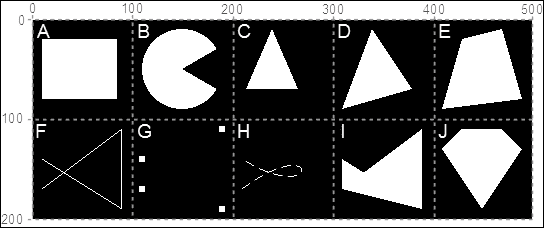

在前面的屏幕截图中，灰色网格将简化读取代码中出现的坐标。此外，与每个单元格关联的白色字母将用于引用形状。网格和字母都不是 Kivy 示例的一部分。前面的屏幕截图展示了我们通过顶点指令学习绘制的 10 个基本图形。几乎所有的可用 Kivy 类都包含在这个示例中，我们可以用它们创建任何 2D 几何形状。由于顶点指令使用固定坐标，因此以 500 x 200（`python drawing.py --size=500x200`）的屏幕尺寸运行此示例非常重要，以便正确地可视化形状。

我们将研究 Kivy 语言 (`drawing.kv`)，并附带与其相关的图形（和坐标）的小段代码，这样会更容易理解。让我们从形状 **A**（矩形）开始：

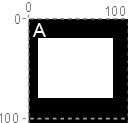

以下为形状 **A** 的代码片段：

```py
14\. # File name: drawing.kv (vertex instructions)
15\. <DrawingSpace>:
16\.    canvas:
17\.        Rectangle:
18\.            pos: self.x+10,self.top-80
19\.            size: self.width*0.15, self.height*0.3
```

**`矩形`** 是一个很好的起点，因为它与我们设置小部件属性的方式相似。我们只需设置 **`pos`** 和 **`size`** 属性。

### 注意

顶点指令的 **`pos`** 和 **`size`** 属性与 `Widget` 的 **`pos`** 和 **`size`** 属性不同，因为它们属于 `VertexInstruction` 基类。指定顶点指令属性的所有值都是固定值。

这意味着我们无法像在 第一章 *GUI 基础 - 构建界面* 中使用小部件那样使用 `size_hint` 或 `pos_hint` 属性。然而，我们可以使用 `self` 的属性来实现类似的结果（第 18 行和第 19 行）。

让我们继续处理形状 **B**（类似 Pac-Man 的图形）：

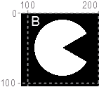

以下为形状 **B** 的代码片段：

```py
20\.         Ellipse:
21\.            angle_start: 120
22\.            angle_end: 420
23\.            pos: 110, 110
24\.            size: 80,80
```

**`椭圆`** 与 `Rectangle` 非常相似，但它有三个新属性：**`angle_start`**、**`angle_end`** 和 **`segments`**。前两个属性指定椭圆的起始和结束角度。0° 角度是北（或 12 点钟），它们按顺时针方向相加。因此，`angle_start` 是 120°（90° + 30°），这是类似 Pac-Man 的图形的下颚（第 21 行）。`angle_end` 的值是 420°（360° + (90°-30°)），它比 `angle_start` 大，因为我们需要 Kivy 按顺时针方向绘制 `Ellipse`。如果我们指定一个低于 `angle_start` 的值，Kivy 将按逆时针方向绘制，绘制 Pac-Man 的嘴巴而不是身体。

让我们继续处理形状 **C**（三角形）：

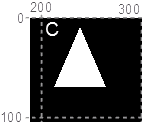

```py
25\.        Ellipse:
26\.            segments: 3
27\.            pos: 210,110
28\.            size: 60,80
```

形状 **C** 的三角形实际上是通过 **`segments`** 属性（第 26 行）获得的另一个 **`Ellipse`**。让我们这样表达：如果您必须用三条线绘制一个椭圆，您最终得到的最好的结果是一个三角形。如果您有四条线，您将得到一个矩形。实际上，您需要无限多条线才能得到完美的 `Ellipse`，但计算机无法处理这一点（屏幕的分辨率也无法支持这一点），因此我们需要在某个地方停止。默认的 `segments` 是 180。请注意，如果您有一个圆（即大小：x,x），您将始终得到等边多边形（例如，如果您只指定四个 `segments`，则得到一个正方形）。

我们可以一起分析形状 **D**、**E**、**F** 和 **G**：

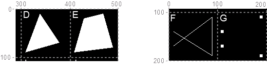

```py
29\.        Triangle:
30\.            points: 310,110,340,190,380,130
31\.         Quad:
32\.            points: 410,110,430,180,470,190,490,120
33\.        Line:
34\.            points: 10,30, 90,90, 90,10, 10,60
35\.        Point:
36\.            points: 110,30, 190,90, 190,10, 110,60
37\.            pointsize: 3
```

**`Triangle`**（形状 **D**）、**`Quad`**（形状 **E**）和 **`Line`**（形状 **F**）的工作方式类似。它们的 **`points`** 属性（第 30、32 和 34 行）分别表示三角形、四边形和线的角。**`points`** 属性是一系列坐标，格式为 `(x1, y1, x2, y2)`。`Point` 也与这三个形状类似。它使用 **`points`** 属性（第 36 行），但在这个情况下用来表示一系列点（形状 **G**）。它还使用 **`pointsize`**（第 37 行）属性来表示 `Points` 的大小。

让我们继续探讨形状 **H**：

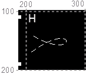

```py
38\.        Bezier:
39\.            points: 210,30, 290,90, 290,10, 210,60
40\.            segments: 360
41\.             dash_length: 10
42\.             dash_offset: 5
```

**`贝塞尔`** 是一条曲线，它使用 **`points`** 属性作为曲线线的“吸引点”（贝塞尔曲线背后有一个数学形式，我们在这本书中不会涉及，因为它超出了范围，但您可以在维基百科中找到足够的信息 [`en.wikipedia.org/wiki/Bézier_curve`](http://en.wikipedia.org/wiki/B%C3%A9zier_curve)）。这些点是吸引点，因为线并不触及所有点（只是它们中的第一个和最后一个）。`Bezier` 的点（第 39 行）彼此之间的距离与 `Line` 的点（第 34 行）或 `Point` 的点（第 36 行）之间的距离相同；它们只是向右平移了 100 像素。您可以直观地比较贝塞尔曲线（形状 **H**）的结果与 `Line`（形状 **G**）或 `Point`（形状 **H**）的结果。我们还包含了两个其他属性 **`dash_length`**（第 41 行），用于表示断续线的长度，以及 **`dash_offset`**（第 42 行），用于表示划痕之间的距离。

让我们来探讨最后两个形状 **I** 和 **J**：

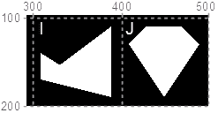

```py
43\.         Mesh:
44\.             mode: 'triangle_fan'
45\.             vertices: 310,30,0,0, 390,90,0,0, 390,10,0,0, 310,60,0,0
46\.             indices: 0,1,2,3
47\.         Mesh:
48\.             mode: 'triangle_fan'
49\.             vertices: 430,90,0,0, 470,90,0,0, 490,70,0,0, 450,10,0,0, 410,70,0,0, 430,90,0,0,
50\.             indices: 0,1,2,3,4,5
```

我们添加了两个**`Mesh`**指令（第 43 行和第 47 行）。一个**`Mesh`**指令是由三角形组成的复合体，在计算机图形和游戏中有许多应用。本书中没有足够的空间来介绍使用此指令的高级技术，但至少我们将了解其基础知识，并能够绘制平面多边形。**`mode`**属性设置为`triangle_fan`（第 44 行），这意味着网格的三角形被填充了颜色，而不是例如只绘制边界。

**`vertices`**属性是一个坐标元组。为了本例的目的，我们将忽略所有的 0。这将使我们剩下 45 行中的四个坐标（或顶点）。这些点与形状**F**、**G**和**H**相对相同。让我们想象一下，当我们从左到右遍历顶点列表时，形状**I**中的三角形是如何创建的，每次使用三个顶点。形状**I**由两个三角形组成。第一个三角形使用第一个、第二个和第三个顶点；第二个三角形使用第一个、第三个和第四个顶点。一般来说，如果我们位于列表的第 i 个顶点，则使用第一个顶点、第(i-1)个顶点和第 i 个顶点来绘制一个三角形。最终的网格（形状**J**）展示了另一个示例。它包含三个被以下截图中的蓝色线条包围的三角形：

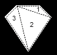

**`indexes`**属性包含一个与顶点数量相同的列表（不计 0），并指示顶点列表遍历的顺序，从而改变组成网格的三角形。

到目前为止，我们研究过的所有多边形都已经着色完毕。如果我们需要绘制多边形的边界，我们应该使用**`Line`**。从原则上讲，对于像三角形这样的基本形状来说这似乎很简单，但如何只用点来画一个圆呢？幸运的是，`Line`具有使事情变得更容易的适当属性。

下一个示例将展示您如何构建以下截图中的图形：

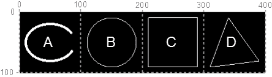

线条示例

我们保留了灰色坐标和字母来识别截图中的每个单元格。Python 代码应在 400 x 100 的屏幕尺寸下运行：`python drawing.py --size=400x100`。以下是为前一个截图的`drawing.kv`代码：

```py
51\. # File name: drawing.kv (Line Examples)
52\. <DrawingSpace>:
53\.     canvas:
54\.         Line:
55\.             ellipse: 10, 20, 80, 60, 120, 420, 180
56\.             width: 2
57\.         Line:
58\.             circle: 150, 50, 40, 0, 360, 180
59\.         Line:
60\.             rectangle: 210,10,80,80
61\.         Line:
62\.             points: 310,10,340,90,390,20
63\.             close: True
```

在之前的代码中，我们使用特定的属性添加了四个**`Line`**指令。第一个`Line`指令（第 54 行，形状**A**）与我们的 Pac-Man（第 20 行）相似。**`ellipse`**属性（第 55 行）分别指定了`x`、`y`、`width`、`height`、`angle_start`、`angle_end`和`segments`。参数的顺序难以记忆，因此我们应该始终将 Kivy API 放在我们身边（[`kivy.org/docs/api-kivy.graphics.vertex_instructions.html`](http://kivy.org/docs/api-kivy.graphics.vertex_instructions.html)）。我们还设置了`Line`的**`width`**使其更粗（第 56 行）。

第二个`Line`指令（第 57 行，形状**B**）引入了一个在顶点指令中没有对应属性的特性：**`circle`**。与`ellipse`属性的区别在于，前三个参数（第 58 行）定义了`Circle`的中心（150, 50）和半径（40）。其余的保持不变。第三个`Line`（第 59 行，形状**C**）由**`rectangle`**（第 60 行）定义，参数简单为`x`、`y`、`width`和`height`。最后一个`Line`（第 61 行，形状**D**）是定义多边形最灵活的方式。我们指定了点（第 62 行），数量不限。**`close`**属性（第 63 行）连接了第一个和最后一个点。

我们涵盖了与顶点指令相关的多数指令和属性。我们应该能够使用 Kivy 在二维空间中绘制任何几何形状。如果您想了解更多关于每个指令的详细信息，应该访问 Kivy API（[`kivy.org/docs/api-kivy.graphics.vertex_instructions.html`](http://kivy.org/docs/api-kivy.graphics.vertex_instructions.html)）。现在，轮到上下文指令来装饰这些单调的黑白多边形了。

# 添加图像、颜色和背景

在本节中，我们将讨论如何将图像和颜色添加到我们的图形中，以及如何控制哪个图形位于哪个图形之上。我们继续使用第一节的相同 Python 代码。这次，我们以 400 x 100 的屏幕尺寸运行它：`python drawing.py --size=400x100`。以下截图显示了本节的最终结果：

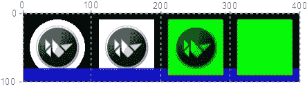

图像和颜色

以下是对应的`drawing.kv`代码：

```py
64\. # File name: drawing.kv (Images and colors)
65\. <DrawingSpace>:
66\.     canvas:
67\.         Ellipse:
68\.            pos: 10,10
69\.            size: 80,80
70\.            source: 'kivy.png'
71\.         Rectangle:
72\.            pos: 110,10
73\.            size: 80,80
74\.            source: 'kivy.png'
75\.        Color: 
76\.            rgba: 0,0,1,.75
77\.        Line:
78\.            points: 10,10,390,10
79\.            width: 10
80\.            cap: 'square'
81\.          Color: 
82\.            rgba: 0,1,0,1
83\.        Rectangle:
84\.            pos: 210,10
85             size: 80,80
86\.             source: 'kivy.png'
87\.        Rectangle:
88\.            pos: 310,10
89\.            size: 80,80
```

此代码从`Ellipse`（第 67 行）和`Rectangle`（第 71 行）开始。我们使用了**`source`**属性，它将图像插入到每个多边形中装饰。`kivy.png`图像是 80 x 80 像素，背景为白色（没有任何 alpha/透明度通道）。结果显示在“图像和颜色”截图的前两列中。

在第 75 行，我们使用了上下文指令**`Color`**来改变坐标空间上下文的颜色（使用**`rgba`**属性：红色、绿色、蓝色和透明度）。这意味着下一个顶点指令将以`rgba`改变的颜色绘制。上下文指令基本上是改变当前的坐标空间上下文。在截图（第 77 行）中，你可以看到底部（第 77 行）的细蓝色条（或本书打印版本的非常深灰色条）呈现为透明蓝色（第 76 行），而不是之前示例中的默认白色（`1,1,1,1`）。我们使用**`cap`**属性（第 80 行）设置了线的端点形状为方形。

我们在第 81 行再次改变了颜色。之后，我们绘制了两个更多的矩形，一个带有`kivy.png`图像，另一个没有。在前面的截图（执行命令：`python drawing.py --size=300x100`）中，你可以看到图像的白色部分已经变成了绿色，或在本书的打印版本中为浅灰色，就像右侧的基本`Rectangle`一样。

### 小贴士

**`Color`**指令就像一盏照亮`kivy.png`图像的光，它不仅仅是在其上绘画。

在截图中有另一个重要的细节需要注意。底部蓝色的线（在打印版本中为深灰色）覆盖了前两个多边形，并在最后两个多边形下方。指令是按顺序执行的，这可能会带来一些不期望的结果。Kivy 提供了一个解决方案，使这种执行更加灵活和结构化，我们将在下一节中介绍。

# 结构化图形指令

除了`canvas`实例外，一个 Widget 还包括两个其他画布实例：**`canvas.before`**和**`canvas.after`**。

### 注意

`Widget`类有三个集合的指令（**`canvas.before`**、**`canvas`**和**`canvas.after`**）来组织执行顺序。通过它们，我们可以控制哪些元素将进入背景或保持在前景。

以下`drawing.kv`文件显示了这三个集合（第 92、98 和 104 行）的指令示例：

```py
90\. # File name: drawing.kv (Before and After Canvas)
91\. <DrawingSpace>:
92\.    canvas.before:
93\.        Color: 
94\.            rgba: 1,0,0,1
95\.        Rectangle:
96\.            pos: 0,0
97\.            size: 100,100
98\.    canvas:
99\.        Color: 
100\.         rgba: 0,1,0,1
101\.     Rectangle:
102\.         pos: 100,0
103\.         size: 100,100
104\.  canvas.after:
105\.      Color: 
106\.          rgba: 0,0,1,1
107\.      Rectangle:
108\.          pos: 200,0
109\.          size: 100,100
110\.  Button:
111\.      text: 'A very very very long button'
112\.      pos_hint: {'center_x': .5, 'center_y': .5}
113\.      size_hint: .9,.1
```

在每个集合中，都绘制了一个不同颜色的矩形（第 95、101 和 107 行）。以下是说明画布执行顺序的图解。每个代码块左上角的数字表示执行顺序：

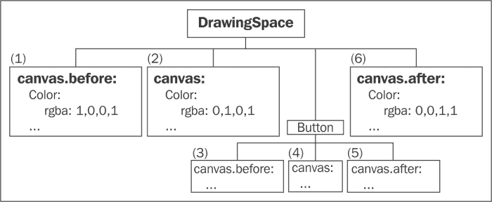

画布执行顺序

注意我们没有为`Button`定义任何`canvas`、`canvas.before`或`canvas.after`，但 Kivy 内部确实有。由于`Button`在屏幕上显示图形（例如，它包含与**`background_color`**属性关联的`Rectangle`），因此它在其画布集合中有指令。最终结果如下截图所示（执行命令：`python drawing.py --size=300x100`）：

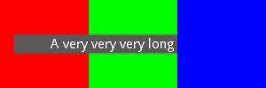

画布前后

`Button`（子元素）的图形被`canvas.after`中的指令覆盖。很明显，`canvas.before`和`canvas`的指令在显示`Button`之前执行，但它们之间执行了什么？当我们在继承中工作时，我们想在子类中添加应该在基类的`canvas`指令集之前执行的指令，这是必要的。同时，当我们将 Python 代码和 Kivy 语言规则混合时，这也是一种便利。我们将在本章的最后部分研究一些与*漫画创作者*相关的实际例子，并在第四章中回顾这个主题，*改进用户体验*。

目前，理解我们有三组指令（`Canvas`）提供了一些在屏幕上显示图形时的灵活性就足够了。现在让我们探索一些与顶点指令变换相关的更多上下文指令。

# 旋转、平移和缩放坐标空间

**`Rotate`**、**`Translate`**和**`Scale`**是应用于顶点指令的上下文指令，这些指令在坐标空间中显示。如果我们忘记坐标空间是所有小部件共享的，并且它占据了窗口的大小（实际上比这还要大，因为坐标没有限制，我们可以在窗口外绘制），它们可能会带来意外的结果。首先，我们将在本节中了解这条指令的行为，在下一节中，我们可以更深入地分析它们带来的问题，并学习使事情变得更容易的技术。

让我们从新的`drawing.kv`代码开始：

```py
114\. # File name: drawing.kv (Rotate, Translate and Scale)
115\. <DrawingSpace>:
116\.    pos_hint: {'x':.5, 'y':.5}
117\.    canvas:
118\.        Rectangle:
119\.            source: 'kivy.png'
120\.        Rotate:
121\.            angle: 90
122\.            axis: 0,0,1
123\.        Color:
124\.            rgb: 1,0,0 # Red color
125\.        Rectangle:
126\.            source: 'kivy.png'
127\.        Translate:
128\.             x: -100
129\.         Color:
130\.             rgb: 0,1,0 # Green color
131\.         Rectangle:
132\.             source: 'kivy.png'
133\.         Translate:
134\.             y: -100
135\.         Scale:
136\.             xyz:(.5,.5,0)
137\.         Color:
138\.             rgb: 0,0,1 # Blue color
139\.         Rectangle:
140\.             source: 'kivy.png'
```

在此代码中，我们首先做的事情是将`DrawingSpace`（`RelativeLayout`）的坐标（0, 0）定位在屏幕中心（第 116 行）。我们创建了一个带有`kivi.png`图形的`Rectangle`，我们之前已经修改过它来指示原始**x**轴和**y**轴。

结果展示在以下截图的右上角（使用`python drawing.py --size=200x200`执行）：

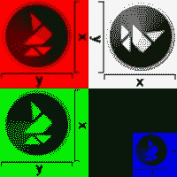

旋转、平移和缩放

在第 120 行，我们在 z 轴上（第 122 行）应用了 90°的**`Rotate`**指令。值是（x, y, z），这意味着我们可以使用 3D 空间中的任何向量。想象一下，这是在`DrawingSpace`的左下角钉上一个钉子，然后我们逆时针旋转它。

### 小贴士

默认情况下，旋转的钉子总是坐标（0, 0），但我们可以通过**`origin`**属性改变这种行为。

截图的左上部分（“旋转、平移和缩放”）显示了旋转后的结果。我们用红色（使用**`rgb`**属性而不是`rgba`属性）绘制了相同的矩形以突出显示。在向坐标空间上下文添加旋转之后，我们也修改了相对的 X 轴和 Y 轴。第 128 行考虑到轴是旋转的，为了将坐标空间向下平移（通常是 Y 轴），它将-100px 设置到 X 轴上。我们在左下角用绿色`Color`绘制了相同的`Rectangle`。请注意，图像仍然在旋转，并且只要我们不将坐标空间上下文恢复到原始角度，它就会继续旋转。

### 小贴士

上下文指令持续有效，直到我们再次更改它们。另一种避免这种情况的方法是在`RelativeLayout`内部工作。如果你还记得上一章，它允许我们使用相对于小部件的坐标进行操作。

要缩放或放大图像，我们将坐标空间上下文（第 133 行）平移到截图的右下角。请注意，我们使用 Y 轴而不是 X 轴，因为上下文仍然是旋转的。缩放操作在第 135 行进行，此时图像的宽度和高度将减半。`Scale`指令朝向（0, 0）坐标缩放，最初位于左下角。然而，在所有这些上下文修改之后，我们需要考虑这个坐标在哪里。首先，我们旋转了轴（第 120 行），使 X 轴垂直，Y 轴水平。然后，将坐标空间向下平移（第 127 行）和向右平移（第 133 行），（0, 0）坐标位于右下角，X 轴是垂直的，Y 轴是水平的。

### 注意

**`Scale`**使用当前坐标空间上下文的尺寸比例，而不是原始尺寸。例如，要恢复原始尺寸，我们应该使用`xyz: (2,2,0)`而不是仅仅使用`xyz: (1,1,0)`。

到目前为止，在本章中，我们已经讨论了`Canvas`实例是一组包含上下文指令和顶点指令的指令集。上下文指令应用于影响顶点指令在坐标空间中显示条件的坐标空间上下文。

我们将在本章的下一部分和最后一部分中，将一些知识应用到我们的项目中，添加* Stickman*。我们将介绍两个重要的上下文指令来处理小部件之间共享相同坐标空间的问题：`PushMatrix`和`PopMatrix`。

# 漫画创作者：PushMatrix 和 PopMatrix

让我们将一些图形插入到我们在第一章开始的项目中，*GUI 基础 - 构建界面*。在此之前，我们需要回顾本章与坐标空间相关的两个重要课程：

+   坐标空间不受任何位置或大小的限制。它通常以屏幕左下角为原点。为了避免这种情况，我们使用 `RelativeLayout`，它内部执行了一个平移到 `Widget` 位置的变换。

+   一旦坐标空间上下文被任何指令变换，它就会保持这种状态，直到我们指定不同的内容。`RelativeLayout` 也通过两个上下文指令解决了这个问题，我们将在本节中研究这些指令：**`PushMatrix`** 和 **`PopMatrix`**。

在本节中，我们使用 `RelativeLayout` 来避免共享坐标空间的问题，但当我们处于任何其他类型的 `Widget` 内部时，我们也会解释它的替代方案。我们将向我们的项目中添加一个新文件（`comicwidgets.kv`）。在 `comicreator.py` 中，我们需要将我们的新文件添加到 `Builder`：

```py
Builder.load_file('comicwidgets.kv')
```

文件 `comicwidgets.kv` 将包含特殊的小部件，我们将为项目创建这些小部件。在本章中，我们将添加 `StickMan` 类：

```py
141\. # File name: comicwidgets.kv
142\. <StickMan@RelativeLayout>:
143\.    size_hint: None, None
144\.    size: 48,48
145\.    canvas:
146\.        PushMatrix
147\.        Line:
148\.            circle: 24,38,5
149\.        Line:
150\.            points: 24,33,24,15
151\.        Line:
152\.            points: 14,5,24,15
153\.        Line:
154\.            points: 34,5,24,15
155\.        Translate:
156\.            y: 48-8
157\.        Rotate:
158\.            angle: 180
159\.            axis: 1,0,0
160\.        Line:
161\.            points: 14,5,24,15
162\.        Line:
163\.            points: 34,5,24,15
164\.        PopMatrix
```

在第 142 行，`StickMan` 子类从 `RelativeLayout` 继承，以方便定位和使用上下文指令。我们定义了大小为 48 x 48 的 `StickMan`。`StickMan` 由定义头部、身体、左腿、右腿、左臂和右臂的六条线组成（第 147 到 163 行）。您可以在以下屏幕截图中的三个地方看到 `StickMan` 的结果：

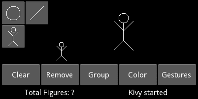

漫画创作者

第一个 `StickMan` 是最后一个 `ToolButton` 设计的一部分，而其他两个出现在 *绘图空间* 中；其中一个是缩放的。请注意，腿部的代码（第 151 到 154 行）与手臂的代码（第 160 到 163 行）完全相同；区别在于我们将坐标空间向上平移（第 155 和 156 行）并在 x 轴上旋转 180°（第 157 到 159 行）。这样，我们就节省了一些绘制 *stickman* 的数学计算。

我们已经转换并旋转了坐标空间上下文；因此，我们应该撤销这些上下文更改，以便一切都能保持最初的状态。我们不是向 `Translate` 和 `Rotate` 指令添加更多指令以返回坐标空间上下文，而是使用了两个方便的 Kivy 指令：**`PushMatrix`** 和 **`PopMatrix`**。一开始，我们使用了 `PushMatrix`（第 146 行），这将保存当前的坐标空间上下文，而在最后，我们使用了 `PopMatrix`（第 164 行）以将上下文恢复到原始状态。

### 注意

**`PushMatrix`** 保存当前的坐标空间上下文，而 **`PopMatrix`** 恢复最后保存的坐标空间上下文。因此，被 **`PushMatrix`** 和 **`PopMatrix`** 包围的变换指令（`Scale`、`Rotate` 和 `Translate`）不会影响界面的其余部分。

我们将扩展这种方法，向 `ToolBox` 左上角的其他两个 `ToolButton` 实例（圆形和线条）添加形状。我们在 `toolbox.kv` 中添加此代码：

```py
165\. # File name: toolbox.kv
166\. <ToolButton@ToggleButton>:
167\.     size_hint: None,None
168\.     size: 48,48
169\.     group: 'tool'
170\.     canvas:
171\.         PushMatrix:
172\.         Translate:
173\.             xy: self.x,self.y
174\.     canvas.after:
175\.         PopMatrix:
176\. 
177\. <ToolBox@GridLayout>:
178\.     cols: 2
179\.     padding: 2
180\.     ToolButton:
181\.         canvas:
182\.             Line:
183\.                 circle: 24,24,14
184\.     ToolButton:
185\.         canvas:
186\.             Line:
187\.                 points: 10,10,38,38
188\.     ToolButton:
189\.         StickMan:
190\.             pos_hint: {'center_x':.5,'center_y':.5}
```

在`ToolButton`类（第 166 行）中，我们在指令集的`canvas`中使用了`PushMatrix`（第 171 行）来保存坐标空间当前状态。然后，`Translate`（第 172 行）将图形指令移动到`ToolButton`的位置，这样我们就可以在每个`ToolButton`上使用相对坐标（第 180 行到第 190 行）。最后，在`canvas.after`中添加了`PopMatrix`（第 175 行）以恢复坐标空间。

遵循不同画布（指令集）的执行顺序非常重要。例如，让我们逐步跟随包含圆圈（第 180 行）的`ToolButton`画布的执行顺序：首先，`ToolButton`类的`canvas`具有`PushMatrix`和`Translate`（第 170 行）；其次，`ToolButton`实例的`canvas`包含圆圈（第 181 行），最后，基类的`canvas.after`具有`PopMatrix`（第 174 行）。我们只是实现了与`RelativeLayout`相同的技巧。

### 注意

**`RelativeLayout`**内部包含`PushMatrix`和`PopMatrix`。因此，我们可以在其中安全地添加指令，而不会影响界面的其余部分。

让我们通过在*绘图空间*中缩放我们的*stickman*来结束这一章，并说明画布执行顺序的另一个特性。以下是`drawingspace.kv`的代码：

```py
191\. # File name: drawingspace.kv
192\. <DrawingSpace@RelativeLayout>:
193\.     StickMan:
194\.         pos_hint: {'center_x':.5,'center_y':.5}
195\.         canvas.before:
196\.             Translate:
197\.                 xy: -self.width/2, -self.height/2
198\.             Scale:
199\.                 xyz: 2,2,0
200\.     StickMan:
```

第一个`StickMan`被平移和旋转了（第 193 行到第 199 行），但第二个没有（第 200 行）。我们讨论了上下文指令会影响全局坐标空间，但当我们看到截图（“漫画创作者”）的结果时，我们意识到第二个实例没有被第 196 行和第 198 行的线条进行缩放或平移。发生了什么？答案并不明显。答案与`StickMan`类画布内的`PushMatrix`和`PopMatrix`有关吗？不是的，因为它们都在同一组指令中。

我们实现`ToolButton`的方式遵循`RelativeLayout`类的实现方式。`StickMan`继承自`RelativeLayout`，因此在`StickMan`类（从`RelativeLayout`继承）的`canvas.before`中实际上还有一个`PushMatrix`，以及相应的`canvas.after`中的`PopMatrix`。从第 196 行到第 199 行的指令是在`RelativeLayout`的`canvas.before`中的`PopMatrix`执行之后执行的，因此上下文在`RelativeLayout`的相应`PushMatrix`上得到恢复。

最后，请注意指令必须在`canvas.before`中，因为它们是在现有指令之前添加的，即那些实际绘制*stickman*的指令。换句话说，如果我们简单地在画布中添加它们，那么*stickman*将会在平移和缩放之前被绘制。

*漫画创作器*（`comiccreator.kv`），`generaloptions.kv`和`statusbar.kv`的其他文件没有修改，因此我们不再展示它们。上下文和顶点指令易于理解。然而，我们必须非常注意执行顺序，并确保在执行所需的顶点指令后，将坐标空间上下文保持在正常状态。最后，请注意，屏幕上显示的所有内容都是由画布内部的指令（或指令集）显示的，包括例如`Label`文本和`Button`背景。

# 概述

本章解释了理解使用画布所必需的概念。我们涵盖了顶点和上下文指令的使用，以及如何操作指令执行的顺序。我们还介绍了如何处理`canvas`的转换，无论是反转所有转换还是使用`RelativeLayout`。以下是本章我们学习使用的全部组件：

+   顶点指令（及其许多相关属性）：`Rectangle`（`pos`，`size`），`Ellipse`（`pos`，`size`，`angle_start`，`angle_end`，`segments`），`Triangle`（`points`），`Quad`（`points`），`Point`（`points`，`pointsize`），`Line`（`points`，`ellipse`，`circle`，`rectangle`，`width`，`close`，`dash_lenght`，`dash_offset`，和`cap`），`Bezier`（`points`，`segments`，`dash_lenght`和`dash_offset`），以及`Mesh`（`mode`，`vertices`，`indices`）

+   适用于所有顶点指令的`source`属性

+   三组画布指令：`canvas.before`，`canvas`和`canvas.after`

+   上下文指令（及其一些属性）：`Color`（`rgba`，`rgb`），`Rotate`（`angle`，`axis`，`origin`），`Translate`（`x`，`y`，`xy`），`Scale`（`xyz`），`PushMatrix`和`PopMatrix`

列表相当全面，但当然还有一些剩余的组件可以在 Kivy API 中找到。重要的是我们讨论了使用画布背后的概念。请随意使用提供的示例来加强本章重要概念的理解。你应该感到舒适地将事物组合起来，使你的界面生动起来，这样你实际上可以用它来绘图。下一章将专注于事件处理和直接从 Python 操作 Kivy 对象。
