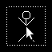
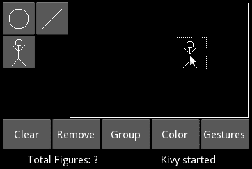
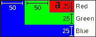
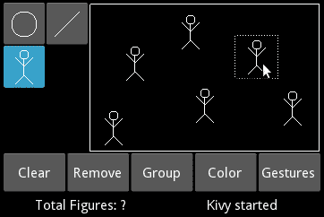
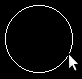
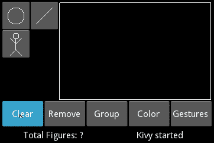
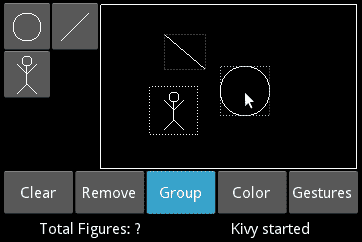
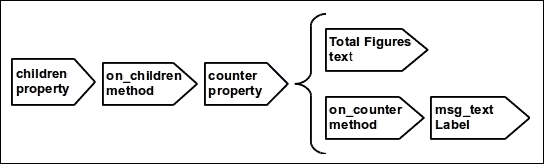

# 第三章。小部件事件 – 绑定动作

在本章中，你将学习如何将动作集成到 **图形用户界面**（**GUI**）组件中；一些动作将与画布相关联，而其他动作将与 `Widget` 管理相关联。我们将学习如何动态处理事件，以便使应用程序能够响应用户交互。在本章中，你将获得以下技能：

+   通过 ID 和属性引用 GUI 的不同部分

+   覆盖、绑定、解绑和创建 Kivy 事件

+   动态将小部件添加到其他小部件中

+   动态向画布添加顶点和上下文指令

+   在小部件、其父元素和其窗口之间转换相对和绝对坐标

+   使用属性来保持 GUI 与更改同步

这是一个令人兴奋的章节，因为我们的应用程序将开始与用户交互，应用在前两个章节中获得的观念。到本章结束时，我们的 *Comic Creator* 项目的所有基本功能都将准备就绪。这包括可拖动的形状、可调整大小的圆圈和线条、清除小部件空间、删除最后添加的图形、将多个小部件分组以一起拖动，以及更新 *状态栏* 以反映用户的最后操作。

# 属性、ID 和根

在 第一章，*GUI 基础 – 构建界面* 中，我们区分了 *Comic Creator* 的四个主要组件：*工具箱*、*绘图空间*、*常规选项* 和 *状态栏*。在本章中，我们将使这些组件相互交互，因此我们需要向我们在前几章中创建的项目类中添加一些属性。这些属性将引用界面的不同部分，以便它们可以通信。例如，`ToolBox` 类需要引用 `DrawingSpace` 实例，以便 `ToolButton` 实例可以在其中绘制各自的图形。以下图表显示了在 `comiccreator.kv` 文件中创建的所有关系：


*Comic Creator* 的内部引用

我们还在 第一章，*GUI 基础 – 构建界面* 中学习了，**ID** 允许我们在 Kivy 语言中引用其他小部件。

### 注意

ID 仅用于 Kivy 语言内部。因此，我们需要创建属性以便在 Python 代码中引用界面内的元素。

以下是对 *Comic Creator* 项目的 `comiccreator.kv` 文件进行了一些修改以创建必要的 ID 和属性：

```py
1\. File Name: comiccreator.kv 
2\. <ComicCreator>:
3\.    AnchorLayout:
4\.        anchor_x: 'left'
5\.        anchor_y: 'top'
6\.        ToolBox:
7\.            id: _tool_box
8\.            drawing_space: _drawing_space
9\.            comic_creator: root
10\.            size_hint: None,None
11\.            width: 100
12\.    AnchorLayout:
13\.        anchor_x: 'right'
14\.        anchor_y: 'top'
15\.        DrawingSpace:
16\.            id: _drawing_space
17\.            status_bar: _status_bar
18\.            general_options: _general_options
19\.            tool_box: _tool_box
20\.            size_hint: None,None
21\.            width: root.width - _tool_box.width
22\.            height: root.height - _general_options.height - _status_bar.height
23\.    AnchorLayout:
24\.        anchor_x: 'center'
25\.        anchor_y: 'bottom'
26\.        BoxLayout:
27\.             orientation: 'vertical'
28\.             GeneralOptions:
29\.                 id: _general_options
30\.                 drawing_space: _drawing_space
31\.                 comic_creator: root
32\.                 size_hint: 1,None
33\.                 height: 48
34\.             StatusBar:
35\.                 id: _status_bar
36\.                 size_hint: 1,None
37\.                 height: 24
```

第 7、16、29 和 35 行中的 ID 已添加到 comiccreator.kv 中。根据之前的图表（*Comic Creator* 的内部引用），ID 用于在 8、17、18、19 和 30 行创建属性。

### 提示

属性和 ID 的名称不必不同。在前面的代码中，我们只是给 ID 添加了'_'来区分它们和属性。也就是说，`_status_bar` ID 仅在`.kv`文件中可访问，而`status_bar`属性则打算在 Python 代码中使用。它们可以具有相同的名称而不会引起任何冲突。

例如，第 8 行创建了属性`drawing_space`，它引用了`DrawingSpace`实例。这意味着`ToolBox`（第 6 行）实例现在可以访问`DrawingSpace`实例，以便在其上绘制图形。

我们经常想要访问的是规则层次结构中基本小部件（`ComicCreator`）的基类。第 9 行和第 31 行使用**`root`**完成引用，通过`comic_creator`属性来访问它。

### 注意

保留的**`root`**关键字是 Kivy 内部语言变量，它始终指向规则层次结构中的基小部件。其他两个重要关键字是**`self`**和**`app`**。关键字**`self`**指向当前小部件，而**`app`**指向应用程序的实例。

这些都是在*漫画创作者*项目中创建属性所需的所有更改。我们可以使用 Python `comicreator.py`正常运行项目，并将获得与第二章，*图形 – 画布*相同的结果。

我们使用属性创建了界面组件之间的链接。在接下来的章节中，我们将频繁使用创建的属性来访问界面的不同部分。

# 基本小部件事件 – 拖动 stickman

基本的`Widget`事件对应于屏幕上的触摸。然而，在 Kivy 中，触摸的概念比直观上可能想象的要广泛。它包括鼠标事件、手指触摸和魔法笔触摸。为了简化，我们将在本章中经常假设我们正在使用鼠标，但实际上如果我们使用触摸屏（以及手指或魔法笔）也不会有任何改变。以下三个基本的`Widget`事件：

+   **`on_touch_down`**：当一个新的触摸开始时，例如，点击鼠标按钮或触摸屏幕的动作。

+   **`on_touch_move`**：当触摸移动时，例如，拖动鼠标或手指在屏幕上滑动。

+   **`on_touch_up`**：当触摸结束时，例如，释放鼠标按钮或从屏幕上抬起手指。

注意到**`on_touch_down`**在每个**`on_touch_move`**之前发生，**`on_touch_up`**发生；项目符号列表的顺序反映了必要的执行顺序。最后，如果没有移动动作，则**`on_touch_move`**根本不会发生。这些事件使我们能够为我们的`Stickman`添加拖动功能，以便在添加后将其放置在想要的位置。我们按如下方式修改`comicwidgets.kv`的标题：

```py
38\. # File name: comicwidgets.kv
39\. #:import comicwidgets comicwidgets
40\. <DraggableWidget>:
41\.    size_hint: None, None
42.
43\. <StickMan>:
44\.    size: 48,48
45\.    ... 
```

代码现在包括了一个名为`DraggableWidget`的新`Widget`的规则。第 41 行禁用了`size_hint`，这样我们就可以使用固定大小（例如，第 44 行）。`size_hint: None, None`指令已从`StickMan`中删除，因为它将在 Python 代码中继承自`DraggableWidget`。第 39 行的**`import`**指令负责导入相应的`comicwidgets.py`文件：

```py
46\. # File name: comicwidgets.py
47\. from kivy.uix.relativelayout import RelativeLayout
48\. from kivy.graphics import Line
49.
50\. class DraggableWidget(RelativeLayout):
51\.    def __init__(self,  **kwargs):
52\.        self.selected = None
53\.        super(DraggableWidget, self).__init__(**kwargs)
```

`comicwidgets.py`文件包含了新的`DraggableWidget`类。这个类从`RelativeLayout`继承（第 50 行）。第 52 行的`selected`属性将指示`DraggableWidget`实例是否被选中。请注意，`selected`不是 Kivy 的一部分；它是我们作为`DraggableWidget`类的一部分创建的属性。

### 小贴士

Python 中的`__init__`构造函数是定义类对象属性的合适位置，只需使用`self`引用而不在类级别声明它们；这常常会让来自其他面向对象语言（如 C++或 Java）的程序员感到困惑。

在`comicwidgets.py`文件中，我们还需要重写与触摸事件相关的三个方法（`on_touch_down`、`on_touch_move`和`on_touch_up`）。这些方法中的每一个都接收`MotionEvent`作为参数（`touch`），它包含与事件相关的许多有用信息，例如触摸坐标、触摸类型、点击次数（或点击）、持续时间、输入设备等等，这些都可以用于高级任务（[`kivy.org/docs/api-kivy.input.motionevent.html#kivy.input.motionevent.MotionEvent`](http://kivy.org/docs/api-kivy.input.motionevent.html#kivy.input.motionevent.MotionEvent)）。

让我们从**`on_touch_down`**开始：

```py
54\.    def on_touch_down(self, touch):
55\.        if self.collide_point(touch.x, touch.y):
56\.            self.select()
57\.            return True
58\.        return super(DraggableWidget, self).on_touch_down(touch)
```

在第 55 行，我们使用了 Kivy 中最常见的策略来检测触摸是否在某个小部件之上：**`collide_point`**方法。它允许我们通过检查触摸的坐标来检测事件是否实际上发生在特定的`DraggableWidget`内部。

### 注意

每个活动的`Widget`都会接收到在应用（坐标空间）内部发生的所有触摸事件（`MotionEvent`），我们可以使用`collide_point`方法来检测事件是否发生在任何特定的`Widget`中。

这意味着程序员需要实现逻辑来区分特定`Widget`执行某些操作的可能性（在这种情况下，调用第 56 行的`select`方法）与事件，或者它只是通过调用基类方法（第 58 行）并因此执行默认行为。

处理事件的常见方式是使用**`collide_point`**，但也可以使用其他标准。Kivy 在这方面给了我们绝对的自由。第 55 行提供了检查事件是否发生在`Widget`内部的简单案例。如果事件的坐标实际上在`Widget`内部，我们将调用`select()`方法，这将设置图形为选中状态（细节将在本章后面解释）。

理解事件的返回值（第 57 行）以及调用基类方法的意义（第 58 行）非常重要。Kivy GUI 有一个层次结构，所以每个`Widget`实例都有一个对应的**`parent`** `Widget`（除非`Widget`实例是层次结构的根）。

触摸事件的返回值告诉**`parent`**我们是否处理了事件，通过分别返回`True`或`False`。因此，我们需要小心，因为我们完全控制着接收事件的部件。最后，我们还可以使用`super`（基类引用）的返回值来找出是否已经有子部件处理了事件。

通常，`on_touch_down`方法覆盖的行 54 到 58 的结构是处理基本事件的最常见方式：

1.  确保事件发生在`Widget`内部（第 55 行）。

1.  执行必须完成的事情（第 56 行）。

1.  返回`True`表示事件已被处理（第 57 行）。

1.  如果事件发生在`Widget`外部，则我们将事件传播给子部件并返回结果（第 58 行）。

尽管这是最常见的方式，并且可能对初学者来说也是推荐的，但我们为了达到不同的目标可以偏离这种方式；我们很快会用其他示例来扩展这一点。首先，让我们回顾一下`select`方法：

```py
59\.     def select(self):
60\.        if not self.selected:
61\.            self.ix = self.center_x
62\.            self.iy = self.center_y
63\.            with self.canvas:
64\.                self.selected = Line(rectangle=(0,0,self.width,self.height), dash_offset=2)
```

首先，我们需要确保之前没有选择任何内容（第 60 行），使用我们之前创建的`select`属性（第 52 行）。如果是这种情况，我们保存`DraggableWidget`的中心坐标（第 61 和 62 行），并在其边界上动态绘制一个矩形（第 63 和 64 行），如下面的截图所示：



第 63 行是基于 Python 的`with`语句的一个便利方法。它与在**`add`**方法中的调用等效，即`self.canvas.add(Rectangle(…))`，其优点是它允许我们同时添加多个指令。例如，我们可以用它来添加三个指令：

```py
with self.canvas:
   Color(rgb=(1,0,0))
   Line(points=(0,0,5,5))
   Rotate()
   ...
```

在第二章，“图形 – 画布”，我们使用 Kivy 语言向`canvas`添加形状。现在，我们直接使用 Python 代码，而不是 Kivy 语言的语法，尽管 Python 的`with`语句与其略有相似，并且在 Kivy API 中经常使用。注意，我们在第 64 行的`selected`属性中保留了`Line`实例，因为我们需要它来在部件不再被选中时移除矩形。此外，`DraggableWidget`实例将知道何时被选中，无论是包含引用还是为`None`。

该条件用于`on_touch_move`方法：

```py
65\.    def on_touch_move(self, touch):
66\.        (x,y) = self.parent.to_parent(touch.x, touch.y)
67\.        if self.selected and self.parent.collide_point(x - self.width/2, y - self.height/2):
68\.            self.translate(touch.x-self.ix,touch.y-self.iy)
69\.            return True
70\.        return super(DraggableWidget, self).on_touch_move(touch)
```

在此事件中，我们控制 `DraggableWidget` 的拖动。在第 67 行，我们确保 `DraggableWidget` 被选中。在同一行，我们再次使用 `collide_point`，但这次我们使用 **`parent`**（*绘图空间*）而不是 `self`。这就是为什么上一行（第 66 行）将小部件坐标转换为相对于相应 `parent` 的 **`to_parent`** 方法中的值。换句话说，我们必须检查 `parent`（*绘图空间*），因为 `Stickman` 可以在整个 *绘图空间* 内拖动，而不仅仅是 `DraggableWidget` 本身。下一节将详细解释如何将坐标定位到屏幕的不同部分。

第 67 行的另一个细节是，我们通过从当前触摸（`touch.x - self.width/2, touch.y - self.height/2`）减去小部件宽度的一半和高度的一半来检查 `DraggableWidget` 未来位置的左角。这是为了确保我们不将形状拖出 *绘图空间*，因为我们将从中心拖动它。

如果条件为 `True`，我们调用 `translate` 方法：

```py
71\.     def translate(self, x, y):
72\.         self.center_x = self.ix = self.ix + x
73\.         self.center_y = self.iy = self.iy + y
```

该方法通过为新值分配 `center_x` 和 `center_y` 属性（第 72 行和第 73 行）来移动 `DraggableWidget`（`x`，`y`）像素。它还更新了我们在第 61 行和第 62 行之前的 `select` 方法中创建的 `ix` 和 `iy` 属性。

`on_touch_move` 方法的最后两行（第 69 行和第 70 行）遵循与 `on_touch_down` 方法（第 57 行和第 58 行）相同的方法，同样也遵循 `on_touch_up` 方法（第 77 行和第 78 行）：

```py
74\.     def on_touch_up(self, touch):
75\.        if self.selected:
76\.            self.unselect()
77\.            return True
78\.        return super(DraggableWidget, self).on_touch_up(touch)
```

`on_touch_up` 事件撤销 `on_touch_down` 状态。首先，它检查是否使用我们的 `selected` 属性选中。如果是，那么它调用 `unselected()` 方法：

```py
79\.    def unselect(self):
80\.        if self.selected:
81\.            self.canvas.remove(self.selected)
82\.            self.selected = None
```

此方法将动态调用 **`remove`** 方法来从 `canvas`（第 81 行）中移除 `Line` 顶点指令，并将我们的属性 `selected` 设置为 `None`（第 82 行），以表示小部件不再被拖动。注意我们添加 `Line` 顶点指令（第 63 行和第 64 行）和移除它的不同方式（第 81 行）。

在 `comicwidgets.py` 中还有两行代码：

```py
83\. class StickMan(DraggableWidget):
84\.    pass
```

这些行定义了我们的 `StickMan`，现在它从 `DraggableWidget`（第 83 行）继承，而不是从 `RelativeLayout` 继承。

在 `drawingspace.kv` 中还需要进行最后的更改，现在看起来如下所示：

```py
85\. # File name: drawingspace.kv
86\. <DrawingSpace@RelativeLayout>:
87\.    Canvas.before:
88\.        Line: 
89\.            rectangle: 0, 0, self.width - 4,self.height - 4
90\.    StickMan:
```

我们在 *绘图空间* 的 `canvas.before` 中添加了一个边框（第 87 行和第 88 行），这将为我们提供一个参考，以可视化画布的起始或结束位置。我们还保留了一个 `StickMan` 实例在 *绘图空间* 中。你可以运行应用程序（`python comiccreator.py`）并将 `StickMan` 拖动到 *绘图空间* 上。



在本节中，你学习了任何 `Widget` 的三个基本触摸事件。它们与坐标密切相关，因此有必要学习如何正确地操作坐标。我们在 `on_touch_move` 方法中介绍了这项技术，但它在下一节中将是主要内容，该节将探讨 Kivy 提供的定位坐标的可能方法。

# 本地化坐标 – 添加人物

在最后一节中，我们使用了 **`to_parent()`** 方法（第 66 行）将相对于 `DrawingSpace` 的坐标转换为它的父级。记住，我们当时在 `DraggableWidget` 内部，我们收到的坐标是相对于 `parent`（`DrawingSpace`）的。

这些坐标对 `DraggableWidget` 非常方便，因为我们将其定位在父级坐标中。此方法允许我们在父级的 `collide_point` 中使用坐标。当我们要检查父级的 `parent` 空间的坐标或需要直接在 `Widget` 的画布上绘制某些内容时，这就不再方便了。

在学习更多示例之前，让我们回顾一下理论。你了解到 `RelativeLayout` 非常有用，因为它在约束空间内思考定位我们的对象要简单得多。问题开始于我们需要将坐标转换为另一个 `Widget` 区域时。让我们考虑以下 Kivy 程序的截图：



生成此示例的代码在此处未显示，因为它非常直接。如果你想测试它，可以在文件夹 `04 - Embedding RelativeLayouts/` 下找到代码，并使用 `python main.py --size=150x75` 运行它。它由三个相互嵌套的 `RelativeLayouts` 组成。**蓝色**（较深灰色）是 **绿色**（浅灰色）的父级，而 **绿色** 是 **红色**（中间灰色）的父级。**a**（在右上角）是一个位于 **红色**（中间灰色）`RelativeLayout` 内部位置 `(5, 5)` 的 `Label` 实例。**蓝色**布局（深灰色）是窗口的大小（150 x 75）。其余元素是指标（代码的一部分）以帮助你理解示例。

上一张截图包含一些测量值，有助于解释 `Widget` 类提供的四种本地化坐标的方法：

+   **`to_parent()`**: 此方法将 `RelativeLayout` 内部的相对坐标转换为 `RelativeLayout` 的父坐标。例如，`red.to_parent(a.x, a.y)` 返回 `a` 相对于绿色（浅灰色）布局的坐标，即 `(50+5, 25+5) = (55, 30)`。

+   **`to_local()`**: 此方法将 `RelativeLayout` 的 `parent` 坐标转换为 `RelativeLayout`。例如，`red.to_local(55,30)` 返回 `(5,5)`，这是 `a` 标签相对于红色布局（中间灰色）的坐标。

+   **`to_window()`**：此方法将当前`Widget`的坐标转换为相对于窗口的绝对坐标。例如，`a.to_window(a.x, a.y)`返回**a**的绝对坐标，即`(100 + 5, 50 + 5) = (105, 55)`。

+   **`to_widget()`**：此方法将绝对坐标转换为当前小部件的父级内的坐标。例如，`a.to_widget(105,55)`返回`(5,5)`，再次是`a`相对于`red`（中间灰色）布局的坐标。

最后两个方法不使用`red`布局来转换坐标，因为在这种情况下，Kivy 假设坐标总是相对于父级。还有一个`Boolean`参数（称为**`relative`**），它控制坐标是否在`Widget`内部是相对的。

让我们在*Comic Creator*项目中研究一个真实示例。我们将向*toolbox*按钮添加事件，以便我们可以向*drawing space*添加图形。在这个过程中，我们将遇到一个场景，我们必须使用之前提到的方法来正确地将我们的坐标定位到`Widget`。

此代码对应于`toolbox.py`文件的标题：

```py
91\. # File name: toolbox.py
92\. import kivy
93.
94\. import math
95\. from kivy.uix.togglebutton import ToggleButton
96\. from kivy.graphics import Line
97\. from comicwidgets import StickMan, DraggableWidget
98.
99\. class ToolButton(ToggleButton):
100\.    def on_touch_down(self, touch):
101\.         ds = self.parent.drawing_space
102\.         if self.state == 'down' and ds.collide_point(touch.x, touch.y):
103\.             (x,y) = ds.to_widget(touch.x, touch.y)
104\.             self.draw(ds, x, y)
105\.             return True
106\.      return super(ToolButton, self).on_touch_down(touch)
107\.  
108\.  def draw(self, ds, x, y):
109\.      pass
```

第 99 到 106 行的结构已经很熟悉了。第 102 行确保`ToolButton`处于`'down'`状态，并且事件发生在`DrawingSpace`实例（由`ds`引用）中。记住，`ToolButton`的父级是`ToolBox`，我们在本章开头在`comiccreator.kv`中添加了一个引用`DrawingSpace`实例的属性。

第 104 行调用了`draw`方法。它将根据派生类（`ToolStickMan`、`ToolCircle`和`ToolLine`）绘制相应的形状。我们需要确保向`draw`方法发送正确的坐标。因此，在调用它之前，我们需要使用`to_widget`事件（第 103 行）将接收到的绝对坐标（在`ToolButton`的`on_touch_down`中接收）转换为相对坐标（适用于*drawing space*）。

### 小贴士

我们知道我们接收到的坐标（`touch.x`和`touch.y`）是绝对的，因为`ToolStickman`不是`RelativeLayout`，而`DrawingSpace`（`ds`）是。

让我们继续研究`toolbox.py`文件，看看`ToolStickMan`实际上是如何添加`StickMan`的：

```py
110\. class ToolStickman(ToolButton):
111\.     def draw(self, ds, x, y):
112\.         sm = StickMan(width=48, height=48)
113\.         sm.center = (x,y)
114\.         ds.add_widget(sm)
```

我们创建了一个`Stickman`实例（第 112 行），使用转换后的坐标（第 103 行）来居中`Stickman`，最后（第 119 行），使用**`add_widget`**方法（第 114 行）将其添加到`DrawingSpace`实例中。我们只需要更新`toolbox.kv`中的几行，以便运行带有新更改的项目：

```py
115\. # File name: toolbox.kv
116\. #:import toolbox toolbox
117\. 
118\. <ToolButton>:
119\.    …
120\. <ToolBox@GridLayout>:
121\.     …
122\.     ToolStickman:
```

首先，我们需要导入`toolbox.py`（第 116 行），然后从`ToolButton`中移除`@ToggleButton`（第 118 行），因为我们已经在`toolbox.py`中添加了它，并且最后我们将最后一个`ToolButton`替换为我们的新`ToolStickman`小部件（第 122 行）。到这个时候，我们能够向`drawing space`添加*stickmen*，并且也可以将它们拖拽到上面。



现在我们已经涵盖了基础知识，让我们学习如何动态地绑定和解绑事件。

# 绑定和解绑事件 – 调整肢体和头部大小

在前两个部分中，我们覆盖了基本事件以执行我们想要的操作。在本节中，你将学习如何动态地绑定和解绑事件。添加我们的`Stickman`相当容易，因为它已经是一个`Widget`了，但图形、圆和矩形怎么办？我们可以为它们创建一些小部件，就像我们对`Stickman`所做的那样，但在那之前让我们尝试一些更勇敢的事情。不是仅仅点击在*绘图空间*上，而是拖动鼠标在其边界上以决定圆或线的尺寸：



使用鼠标设置大小

一旦我们完成拖动（并且我们对大小满意），让我们动态创建包含形状的`DraggableWidget`，这样我们也可以在`DrawingSpace`实例上拖动它们。以下类图将帮助我们理解`toolbox.py`文件的整个继承结构：


图表包括在上一节中解释的`ToolButton`和`ToolsStickman`，但它还包括三个新类，称为`ToolFigure`、`ToolLine`和`ToolCircle`。

`ToolFigure`类有六个方法。让我们先快速概述这些方法，然后突出显示重要和新颖的部分：

1.  `draw`：此方法覆盖了`ToolButton`的`draw`方法（第 108 和 109 行）。我们触摸下的位置表示图形的起点，对于圆来说是中心，对于线来说是线的端点之一。

    ```py
    123\. class ToolFigure(ToolButton):
    124\.     def draw(self, ds, x, y):
    125\.         (self.ix, self.iy) = (x,y)
    126\.         with ds.canvas:
    127\.             self.figure=self.create_figure(x,y,x+1,y+1)
    128\.         ds.bind(on_touch_move=self.update_figure)
    129\.         ds.bind(on_touch_up=self.end_figure)
    ```

1.  `update_figure`：此方法在拖动时更新图形的终点。要么是线的终点，要么是圆的半径（从起点到终点的距离）。

    ```py
    130\.     def update_figure(self, ds, touch):
    131\.         if ds.collide_point(touch.x, touch.y):
    132\.             (x,y) = ds.to_widget(touch.x, touch.y)
    133\.             ds.canvas.remove(self.figure)
    134\.             with ds.canvas:
    135\.                 self.figure = self.create_figure(self.ix, self.iy,x,y)
    ```

1.  `end_figure`：此方法使用与`update_figure`中相同的逻辑指示图形的最终终点。我们还将最终图形放入`DraggableWidget`中（见`widgetize`）。

    ```py
    136\.     def end_figure(self, ds, touch):
    137\.         ds.unbind(on_touch_move=self.update_figure)
    138\.         ds.unbind(on_touch_up=self.end_figure)
    139\.         ds.canvas.remove(self.figure)
    140\.         (fx,fy) = ds.to_widget(touch.x, touch.y)
    141\.         self.widgetize(ds,self.ix,self.iy,fx,fy)
    ```

1.  `widgetize`：此方法创建`DraggableWidget`并将图形放入其中。它使用四个必须通过本地化方法正确本地化的坐标：

    ```py
    142\.     def widgetize(self,ds,ix,iy,fx,fy):
    143\.         widget = self.create_widget(ix,iy,fx,fy)
    144\.         (ix,iy) = widget.to_local(ix,iy,relative=True)
    145\.         (fx,fy) = widget.to_local(fx,fy,relative=True)
    146\.         widget.canvas.add( self.create_figure(ix,iy,fx,fy))
    147\.         ds.add_widget(widget)
    ```

1.  `create_figure`：此方法将被`ToolLine`（第 153 和 154 行）和`ToolCircle`（第 162 至 163 行）覆盖。它根据四个坐标创建相应的图形：

    ```py
    148\.     def create_figure(self,ix,iy,fx,fy):
    149\.         pass
    ```

1.  `create_widget`：此方法也被`ToolLine`（第 156 至 159 行）和`ToolCircle`（第 165 至 169 行）覆盖。它根据四个坐标创建相应位置和大小的`DraggableWidget`。

    ```py
    150\.     def create_widget(self,ix,iy,fx,fy):
    151\.         pass 
    ```

前面的方法中的大多数语句已经介绍过了。这段代码的新主题是事件的动态**`bind`**/**`unbind`**。我们需要解决的主要问题是，我们不想`on_touch_move`和`on_touch_up`事件始终处于活动状态。我们需要从用户开始绘制（调用`draw`方法的`ToolButton`的`on_touch_down`）的那一刻起激活它们，直到用户决定大小并执行触摸抬起。因此，当调用`draw`方法时，我们将`update_figure`和`end_figure`分别绑定到`DrawingSpace`的`on_touch_move`和`on_touch_up`事件（第 128 行和第 129 行）。此外，当用户在`end_figure`方法上结束图形时，我们将它们解绑（第 137 行和第 138 行）。请注意，我们可以从`on_touch_up`事件中解绑正在执行的方法（`end_figure`）。我们希望避免不必要地调用`update_figure`和`end_figure`方法。采用这种方法，它们只会在图形第一次绘制时被调用。

在这段代码中还有一些其他有趣的事情值得注意。在第 125 行，我们创建了两个类属性（`self.ix`和`self.iy`）来保存初始触摸的坐标。每次我们更新图形（第 135 行）和将图形放入`Widget`（第 141 行）时，我们都会使用这些坐标。

我们还使用了之前章节中介绍的一些本地化方法。在第 132 行和第 140 行，我们使用了`to_widget`将坐标转换到`DrawingSpace`实例。第 144 行和第 145 行使用`to_local`将坐标转换到`DraggableWidget`。

### 注意

`DraggableWidget`被指示使用参数**`relative`**`=True`将坐标转换到其内部相对空间，因为`DraggableWidget`是相对的，我们试图在其中绘制（不是在父级：*绘图空间*）。

在图形和控件的位置和尺寸计算中涉及一些基本的数学。我们有意将其移动到继承的更深层类中：`ToolLine`和`ToolCircle`。以下是它们的代码，`toolbox.py`的最后部分：

```py
152\. class ToolLine(ToolFigure):
153\.     def create_figure(self,ix,iy,fx,fy):
154\.         return Line(points=[ix, iy, fx, fy])
155\. 
156\.     def create_widget(self,ix,iy,fx,fy):
157\.         pos = (min(ix, fx), min(iy, fy)) 
158\.         size = (abs(fx-ix), abs(fy-iy))
159\.         return DraggableWidget(pos = pos, size = size)
160\. 
161\. class ToolCircle(ToolFigure):
162\.     def create_figure(self,ix,iy,fx,fy):
163\.         return Line(circle=[ix,iy,math.hypot(ix-fx,iy-fy)])
164\. 
165\.     def create_widget(self,ix,iy,fx,fy):
166\.         r = math.hypot(ix-fx, iy-fy)
167\.         pos = (ix-r, iy-r)
168\.         size = (2*r, 2*r)
169\.         return DraggableWidget(pos = pos, size = size)
```

这里的数学涉及几何概念，超出了本书的范围。重要的是要理解，这个代码段的这些方法将计算适应为创建线或圆。最后，我们在`toolbox.kv`中的`ToolBox`类中做了一些更改：

```py
170\. # File name: toolbox.kv
171\. ...
172\. 
173\. <ToolBox@GridLayout>:
174\.     cols: 2
175\.    padding: 2
176\.    tool_circle: _tool_circle
177\.    tool_line: _tool_line
178\.    tool_stickman: _tool_stickman
179\.    ToolCircle:
180\.        id:  _tool_circle
181\.        canvas:
182\.            Line:
183\.                circle: 24,24,14
184\.    ToolLine:
185\.        id: _tool_line
186\.        canvas:
187\.            Line:
188\.                points: 10,10,38,38
189\.    ToolStickman:
190\.        id: _tool_stickman
191\.        StickMan:
192\.            pos_hint: {'center_x':.5,'center_y':.5}
```

新的类`ToolCircle`（第 179 行）、`ToolLine`（第 184 行）和`ToolStickMan`（第 189 行）已经替换了之前的`ToolButton`实例。现在，我们也可以将线和圆添加并缩放到*绘图空间*：


我们还创建了一些属性（第 176 行、第 177 行和第 178 行），这些属性在第四章中将会很有用，即*改进用户体验*，当我们使用手势创建图形时。

# 在 Kivy 语言中绑定事件

到目前为止，我们一直在两种方式下处理事件：重写事件方法（例如，`on_touch_event`）和将自定义方法绑定到相关事件方法（例如，`ds.bind(on_touch_move=self.update_figure)`）。在本节中，我们将讨论另一种方式，即在 Kivy 语言中绑定事件。实际上，我们可以在本章开始与 `DraggableWidget` 一起工作时就做这件事，但这里有一个区别。如果我们使用 Kivy 语言，我们可以轻松地将事件添加到特定实例，而不是添加到同一类的所有实例。从这个意义上说，它类似于使用 `bind` 方法动态地将实例绑定到其回调。

我们将专注于 `Button` 和 `ToggleButton` 的特定新事件。以下是 `generaloption.kv` 的代码：

```py
193\. # File name: generaloptions.kv
194\. #:import generaloptions generaloptions
195\. <GeneralOptions>:
196\.    orientation: 'horizontal'
197\.    padding: 2
198\.    Button:
199\.        text: 'Clear'
200\.        on_press: root.clear(*args)
201\.    Button:
202\.        text: 'Remove'
203\.        on_release: root.remove(*args)
204\.    ToggleButton:
205\.        text: 'Group'
206\.        on_state: root.group(*args)
207\.    Button:
208\.        text: 'Color'
209\.        on_press: root.color(*args)
210\.    ToggleButton:
211\.        text: 'Gestures'
212\.        on_state: root.gestures(*args)
```

`Button` 类有两个额外的事件：**`on_press`** 和 **`on_release`**。前者类似于 `on_touch_down`，后者类似于 `on_touch_up`。然而，在这种情况下，我们不需要担心调用 `collide_point` 方法。我们使用 `on_press` 为 **`Clear`** `Button`（第 200 行）和 **`Color`** `Button`（第 209 行），以及 `on_release` 为 **`Remove`** `Button`（第 203 行）来展示这两种方法，但在这个特定情况下，选择哪一个实际上并不重要。**`on_state`** 事件已经是 `Button` 类的一部分，尽管它更常用于 `ToggleButton` 实例中。每当 `ToogleButton` 的状态从 `'normal'` 变为 `'down'` 或相反时，都会触发 **`on_state`** 事件。**`on_state`** 事件在第 206 行和第 212 行使用。所有事件都绑定到根目录中的方法，这些方法在 `generaloptions.py` 文件中定义：

```py
213\. # File name: generaloptions.py
214\. from kivy.uix.boxlayout import BoxLayout
215\. from kivy.properties import NumericProperty, ListProperty
216.
217\. class GeneralOptions(BoxLayout):
218\.    group_mode = False
219\.    translation = ListProperty(None)
220.
221\.    def clear(self, instance):
222\.        self.drawing_space.clear_widgets()
223.
224\.    def remove(self, instance):
225\.        ds = self.drawing_space
226\.        if len(ds.children) > 0:
227\.            ds.remove_widget(ds.children[0])
228.
229\.    def group(self, instance, value):
230\.        if value == 'down':
231\.            self.group_mode = True
232\.        else:
233\.            self.group_mode = False
234\.            self.unselect_all()
235.
236\.    def color(self, instance):
237\.        pass
238.
239\.    def gestures(self, instance, value):
240\.        pass
241.
242\.    def unselect_all(self):
243\.         for child in self.drawing_space.children:
244\.             child.unselect()
245.
246\.    def on_translation(self,instance,value):
247\.        for child in self.drawing_space.children:
248\.            if child.selected:
249\.                child.translate(*self.translation)
```

`GeneralOptions` 方法展示了 `Widget` 类的几种其他方法。`clear` 方法通过 **`clear_widgets`** 方法（第 222 行）从 `DrawingSpace` 实例中删除所有小部件。以下截图显示了点击它的结果：



**`remove_widget`** 方法通过访问 **`children`** 列表删除最后添加的 `Widget` 实例（第 227 行）。`group` 方法根据 `'down'` 或 `'normal'` 的 `ToggleButton` 状态修改第 218 行的 `group_mode` 属性。`color` 和 `gestures` 方法将在 第四章 *改进用户体验* 中完成。

*`group mode`* 将允许用户选择多个 `DraggableWidget` 实例，以便同时拖动它们。我们根据 `ToggleButton` 的状态激活或停用 *`group mode`*。在下一节中，我们将实际上允许在 `DraggableWidget` 类中进行多选和拖动。目前，我们只需使用 `unselect_all` 和 `on_translation` 方法准备好控件。

当 *分组模式* 被禁用时，我们通过调用 `unselect_all` 方法（第 242 行）确保所有选中的小部件都被取消选择。`unselect_all` 方法遍历子部件列表，调用每个 `DraggableWidget` 的内部方法 `unselect`（第 79 行）。

最后，`on_translation` 方法也会遍历子部件列表，调用每个 `DraggableWidget` 的内部 `translate` 方法（第 71 行）。问题是；什么调用了 `on_translation` 方法？Kivy 提供的最有用功能之一就是回答这个问题；这将在下一节中解释。

# 创建自己的事件 – 神奇的属性

本节介绍了 Kivy 属性的使用。每次我们修改 Kivy 属性时，它都会触发一个事件。属性类型多种多样，从简单的 **`NumericProperty`** 或 **`StringProperty`** 到更复杂的版本，如 **`ListProperty`**、**`DictProperty`** 或 **`ObjectProperty`**。例如，如果我们定义一个名为 `text` 的 **`StringProperty`**，那么每次文本被修改时，都会触发一个 `on_text` 事件。

### 注意

一旦我们定义了一个 Kivy 属性，Kivy 就会在内部创建与该属性相关联的事件。属性事件通过在属性名称前添加前缀 `on_` 来引用。例如，`on_translation` 方法（第 246 行）与第 219 行的 `translation` **`ListProperty`** 相关联。

所有属性的工作方式相同。例如，我们在 `ToogleButton` 类中使用的 `state` 属性实际上是一个创建 `on_state` 事件的属性。我们已经在第 206 行使用了这个事件。我们定义属性，Kivy 就会为我们创建事件。

### 注意

在本书的上下文中，一个 **属性** 总是指 Kivy 属性，不应与 Python 属性混淆，Python 属性是一个不同的概念，本书没有涉及。**属性**用于描述属于类的变量（引用、对象和实例）。作为一个一般规则，Kivy 属性始终是一个属性，但属性不一定是 Kivy 属性。

在本节中，我们实现了 *分组模式*，该模式通过按下 **分组** 按钮（第 204 行）允许同时选择和拖动多个图形（`DraggableWidgets` 实例）。为了做到这一点，我们可以利用 `translation` 属性和 `on_translation` 方法之间的关系。基本上，每次我们修改 `translation` 属性时，都会触发 `on_translation` 事件。假设我们同时拖动三个图形（使用 *分组模式*），如下面的截图所示：



三个图形被选中，但事件由圆圈处理，因为它是唯一一个指针在顶部的图形。圆圈需要告诉线条和人物移动。它不需要调用 `on_translation` 方法，只需要修改 `translation` 属性，从而触发 `on_translation` 事件。让我们将这些更改包含在 `comicwidgets.py` 中。我们需要进行四个修改。

首先，我们需要在构造函数中添加 `touched` 属性（第 252 行），以指示哪个选中的图形接收事件（例如，上一张截图中的圆圈）。我们这样做：

```py
250\. def __init__(self,  **kwargs):
251\.    self.selected = None
252\.    self.touched = False
253\.    super(DraggableWidget, self).__init__(**kwargs)
```

第二，当 `DraggableWidget` 中的一个实例接收事件时，我们需要将 `touched` 属性设置为 `True`（第 256 行）。我们在 `on_touch_down` 方法中这样做：

```py
254\. def on_touch_down(self, touch):
255\.    if self.collide_point(touch.x, touch.y):
256\.        self.touched = True
257\.        self.select()
258\.        return True
259\.    return super(DraggableWidget, self).on_touch_down(touch)
```

第三，我们需要检查 `DraggableWidget` 是否是当前被触摸的图形（之前接收了 `on_touch_down` 事件）。我们在第 262 行的条件中添加了这个检查。最重要的更改在第 264 行。我们不是直接调用 `translate` 方法，而是修改 `general options`（`self.parent.general_options`）的 `translation` 属性，将小部件移动到的像素数设置到属性中。这将触发 `GeneralOptions` 的 `on_translation` 方法，同时为每个选中的 `DraggableWidget` 调用 `translate` 方法。这是 `on_touch_move` 的结果代码：

```py
260\. def on_touch_move(self, touch):
261\.    (x,y) = self.parent.to_parent(touch.x, touch.y)
262\.    if self.selected and self.touched and self.parent.collide_point(x - self.width/2, y -self.height/2):
263\.        go = self.parent.general_options
264\.        go.translation=(touch.x-self.ix,touch.y-self.iy)
265\.        return True
266\.    return super(DraggableWidget, self).on_touch_move(touch)
```

第四，我们需要在 `on_touch_up` 事件中将 `touched` 属性设置为 `False`（第 268 行），并且在使用 `group_mode`（第 270 行）时避免调用 `unselect` 方法。以下是 `on_touch_up` 方法的代码：

```py
267\. def on_touch_up(self, touch):
268\.    self.touched = False
269\.    if self.selected:
270\.        if not self.parent.general_options.group_mode:
271\.            self.unselect()
272\.    return super(DraggableWidget, self).on_touch_up(touch) 
```

这个例子可以被认为是人为的，因为我们理论上可以从一开始就调用 `on_translation` 方法。然而，属性对于保持变量的内部状态和屏幕显示的一致性至关重要。下一节的示例将提高你对这一点的理解。

# Kivy 及其属性

尽管我们在上一节中只简要介绍了属性的解释，但事实是我们从本章开始就已经在使用它们了。Kivy 的内部充满了属性。它们几乎无处不在。例如，当我们实现 `DraggableWidget` 时，我们只是修改了 `center_x` 属性（第 72 行和第 73 行），然后整个 `Widget` 就会保持更新，因为 `center_x` 的使用涉及到一系列的属性。

本章的最后一个示例说明了 Kivy 属性是多么强大。以下是 `statusbar.py` 的代码：

```py
273\. # File name: statusbar.py
274\. from kivy.uix.boxlayout import BoxLayout
275\. from kivy.properties import NumericProperty, ObjectProperty
276.
277\. class StatusBar(BoxLayout):
278\.    counter = NumericProperty(0)
279\.    previous_counter = 0
280.
281\.    def on_counter(self, instance, value):
282\.        if value == 0:
283\.            self.msg_label.text="Drawing space cleared"
284\.        elif value - 1 == self.__class__.previous_counter:
285\.            self.msg_label.text = "Widget added"
286\.        elif value + 1 == StatusBar.previous_counter:
287\.            self.msg_label.text = "Widget removed"
288\.        self.__class__.previous_counter = value
```

Kivy 属性的工作方式可能会让一些高级的 Python 或 Java 程序员感到困惑。困惑发生在程序员假设 `counter`（第 278 行）是 `StatusBar` 类的静态属性，因为 `counter` 的定义方式与 Python 的静态属性类似（例如，第 279 行的 `previous_counter`）。这种假设是不正确的。

### 注意

Kivy 属性被声明为静态属性类（因为它们属于类），但它们总是内部转换为属性实例。实际上，它们属于对象，就像我们在构造函数中声明的那样。

我们需要区分类的静态属性和类的实例属性。在 Python 中，`previous_counter`（第 279 行）是`StatusBar`类的静态属性。这意味着它是所有`StatusBar`实例共享的，并且可以通过第 284 行和第 286 行所示的方式之一访问（然而，建议使用第 284 行，因为它与类名无关）。相比之下，`selected`变量（第 251 行）是`DraggableWidget`实例的属性。这意味着每个`StatusBar`对象都有一个`selected`变量。它们之间不共享。它们在构造函数（`__init__`）被调用之前创建。访问它的唯一方法是`obj.selected`（第 251 行）。`counter`属性（第 278 行）在行为上更类似于`selected`属性，而不是`previous_counter`静态属性，因为在每个实例中都有一个`counter`属性和一个`selected`属性。

既然已经澄清了这一点，我们就可以继续研究示例。`counter`在第 278 行定义为`NumericProperty`。它对应于`on_counter`方法（第 281 行）并修改了在`statusbar.kv`文件中定义的`Label`（`msg_text`）。

```py
289\. # File name: statusbar.kv
290\. #:import statusbar statusbar
291\. <StatusBar>:
292\.    msg_text: _msg_label
293\.    orientation: 'horizontal'
294\.    Label:
295\.         text: 'Total Figures: ' + str(root.counter)
296\.     Label:
297\.         id: _msg_label
298\.         text: "Kivy started"
```

注意，我们再次使用`id`（第 297 行）来定义`msg_text`（第 292 行）。我们还使用第 278 行定义的`counter`来更新第 295 行的`**总图数**`信息。`text`的具体部分（`str(root.counter)`）在`counter`修改时自动更新。

因此，我们只需修改`counter`属性，界面就会自动更新。让我们在`drawingspace.py`中更新计数器：

```py
299\. # File name: drawingspace.py
300\. from kivy.uix.relativelayout import RelativeLayout
301\. 
302\. class DrawingSpace(RelativeLayout):
303\.     def on_children(self, instance, value):
304\.         self.status_bar.counter = len(self.children)
```

在`on_children`方法中，我们将`counter`更新为`DrawingSpace`的`children`长度。然后，每当我们在`DrawingSpace`的`children`列表中添加（第 114 行或第 147 行）或删除（第 222 行或第 227 行）小部件时，都会调用`on_children`，因为`children`也是一个 Kivy 属性。

不要忘记将此文件导入`drawingspace.py`文件中的`drawingspace.kv`文件，其中我们还在`*绘图空间*`中移除了边框：

```py
305\. # File name: drawingspace.kv
306\. #:import drawingspace drawingspace
307\. <DrawingSpace@RelativeLayout>:
```

下图显示了与`children`属性相关联的元素链（属性、方法和小部件）：



重要的是再次比较我们获取`counter`属性和`msg_label`属性的方式。我们在`StatusBar`（第 278 行）中定义了`counter`属性，并通过`root`（第 295 行）在`Label`中使用它。在`msg_label`的情况下，我们首先定义了`id`（第 297 行），然后是 Kivy 语言的属性（第 292 行）。然后，我们能够在 Python 代码中使用 msg_label（第 283 行、第 285 行和第 287 行）。

### 注意

记住，一个属性不一定是一个 Kivy 属性。属性是类的一个元素，而 Kivy 属性还把属性与事件关联起来。

你可以在 Kivy API 中找到完整的属性列表（[`kivy.org/docs/api-kivy.properties.html`](http://kivy.org/docs/api-kivy.properties.html)）。至少应该提到两个特定的属性：**`BoundedNumericProperty`**和**`AliasProperty`**。**`BoundedNumericProperty`**属性允许设置最大和最小值。如果值超出范围，将抛出异常。**`AliasProperty`**属性提供了一种扩展属性的方法；它允许我们在必要的属性不存在的情况下创建自己的属性。

最后需要注意的一点是，当我们使用 Kivy 语言创建顶点指令属性时，这些属性被用作属性。例如，如果我们更改`ToolLine`内线的位置，它将自动更新。然而，这仅适用于 Kivy 语言内部，不适用于我们动态添加顶点指令的情况，就像我们在`toolbox.py`中所做的那样。在我们的情况下，每次我们需要更新图形时（第 133 到 135 行），我们必须删除并创建一个新的顶点指令。然而，我们可以创建自己的属性来处理更新。一个例子将在第六章中提供，即当我们向视频中添加字幕时。

让我们再次运行代码，以查看带有状态栏计数图形并指示我们最后操作的最后结果：


# 摘要

我们在本章中涵盖了与事件处理相关的大部分主题。你学习了如何覆盖不同类型的事件、动态绑定和解绑、在 Kivy 语言中分配事件以及创建自己的事件。你还学习了 Kivy 属性，如何管理坐标在不同小部件中的定位，以及与添加、删除和更新`Kivy` `Widget`和`canvas`对象相关的许多方法。以下是所涵盖的事件、方法、属性和属性：

+   我们所涵盖的事件是`on_touch_up`、`on_touch_move`和`on_touch_down`（`Widget`的）；`on_press`和`on_release`（`Button`的）；以及`on_state`（`ToggleButton`的）。

+   我们在本章中讨论的属性包括`MotionEvent`（`touch`）的 x 和 y 坐标；`Widget`的`center_x`、`center_y`、`canvas`、`parent`和`children`，以及`ToggleButton`的`state`。

+   `Widget`的以下方法：

    +   `bind`和`unbind`用于动态附加事件

    +   `collide_points`、`to_parent`、`to_local`、`to_window`和`to_widget`用于处理坐标

    +   `add_widget`、`remove_widget`和`clear_widgets`用于动态修改子小部件

    +   `canvas`的`add`和`remove`方法用于动态添加和删除顶点和上下文指令

+   Kivy 属性：`NumericProperty` 和 `ListProperty`

与时钟和键盘相关的重要事件类型有两种。本章主要关注小部件和属性事件，但我们将看到如何在第五章 *入侵者复仇 - 一个交互式多点触控游戏* 中使用其他事件。下一章将介绍一系列关于 Kivy 的有趣话题，以提高我们 *漫画创作者* 的用户体验。
